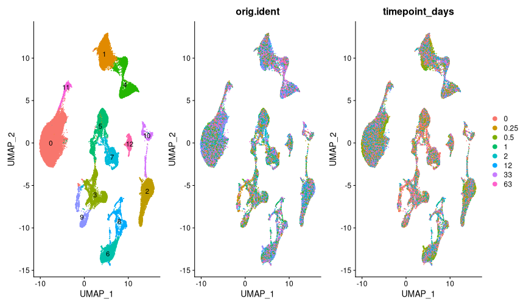
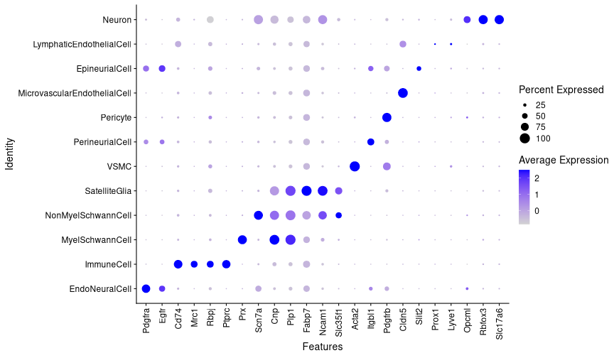

```r
# Load libraries and custom functions
suppressPackageStartupMessages({
  library(tidyverse)
  library(magrittr)
  library(Seurat)
  library(harmony)
  library(scPred)
})

R.utils::sourceDirectory(here::here("R", "functions"), modifiedOnly=FALSE)
```


```r
# Load preprocessed data
(drg_ra <- readRDS(here::here("data", "proc", "drg_ra_preprocessed.rds")))
```

```
## An object of class Seurat 
## 32285 features across 219048 samples within 1 assay 
## Active assay: RNA (32285 features, 0 variable features)
```


```r
# First check with violins
VlnPlot(
  drg_ra,
  c("nCount_RNA", "nFeature_RNA", "percent.mt"),
  pt.size = 0,
  group.by = "orig.ident"
)
```


```r
# Detected gene number distribution
drg_ra@meta.data %>% 
  ggplot(aes(nFeature_RNA, fill = orig.ident)) +
  geom_histogram(alpha = 0.7, color = "white") +
  geom_vline(xintercept = 2000, color = "red") +
  geom_vline(xintercept = 1000, color = "blue") +
  facet_wrap(vars(orig.ident), scales = "free") +
  cowplot::theme_cowplot() +
  scale_x_continuous(labels = scales::label_number(suffix = " K", scale = 1e-3)) +
  theme(axis.text.x = element_text(angle = 90, vjust = 0.5, hjust=1)) +
  theme(legend.position = "none") 
```


#### Create two datasets with cutoffs at 1000 and 2000 detected features

```r
# QC filter for > 2000 Features and percent.mt < 20
drg_ra_2000 <-
  drg_ra %>% 
  subset(percent.mt < 20 & nFeature_RNA > 2000)
```


```r
# QC filter for 999 > Features < 2001 and and percent.mt < 20
drg_ra_1000 <-
  drg_ra %>% 
  subset(percent.mt < 20 & nFeature_RNA < 2001) %>% 
  subset(nFeature_RNA > 999)
```

#### Clustering and celltype identification with > 2000 genes as cutoff

```r
# Integrate with harmony
drg_ra_2000 %<>% run_harmony()
```

```
## Centering and scaling data matrix
```

```
## Harmony 1/50
```

```
## Harmony 2/50
```

```
## Harmony 3/50
```

```
## Harmony 4/50
```

```
## Harmony 5/50
```

```
## Harmony 6/50
```

```
## Harmony 7/50
```

```
## Harmony 8/50
```

```
## Harmony converged after 8 iterations
```

```
## Warning: Invalid name supplied, making object name syntactically valid. New
## object name is Seurat..ProjectDim.RNA.harmony; see ?make.names for more details
## on syntax validity
```


```r
# Cluster cells
drg_ra_2000 %<>% cluster_seurat(reduction = "harmony", dims = 1:30, resolution = 0.1)
```

```
## Warning: The default method for RunUMAP has changed from calling Python UMAP via reticulate to the R-native UWOT using the cosine metric
## To use Python UMAP via reticulate, set umap.method to 'umap-learn' and metric to 'correlation'
## This message will be shown once per session
```

```
## 18:40:01 UMAP embedding parameters a = 0.9922 b = 1.112
```

```
## 18:40:01 Read 72510 rows and found 30 numeric columns
```

```
## 18:40:01 Using Annoy for neighbor search, n_neighbors = 30
```

```
## 18:40:01 Building Annoy index with metric = cosine, n_trees = 50
```

```
## 0%   10   20   30   40   50   60   70   80   90   100%
```

```
## [----|----|----|----|----|----|----|----|----|----|
```

```
## **************************************************|
## 18:40:14 Writing NN index file to temp file /scratch/27543998/RtmpnFzTEQ/file32266f23f989
## 18:40:14 Searching Annoy index using 1 thread, search_k = 3000
## 18:40:52 Annoy recall = 100%
## 18:40:52 Commencing smooth kNN distance calibration using 1 thread
## 18:40:57 Initializing from normalized Laplacian + noise
## 18:41:24 Commencing optimization for 200 epochs, with 3519408 positive edges
## 18:42:56 Optimization finished
## Computing nearest neighbor graph
## Computing SNN
```

```
## Modularity Optimizer version 1.3.0 by Ludo Waltman and Nees Jan van Eck
## 
## Number of nodes: 72510
## Number of edges: 2127028
## 
## Running Louvain algorithm...
## Maximum modularity in 10 random starts: 0.9839
## Number of communities: 20
## Elapsed time: 21 seconds
```

```
## 7 singletons identified. 13 final clusters.
```


```r
# Plot UMAPS
(DimPlot(drg_ra_2000, label = TRUE, shuffle = TRUE) + NoLegend()) +
  (DimPlot(drg_ra_2000, shuffle = TRUE, group.by = "orig.ident") + NoLegend()) +
  (DimPlot(drg_ra_2000, group.by = "timepoint_days", shuffle = TRUE) ) 
```




```r
# Plot split UMAPs by timepoint
DimPlot(drg_ra_2000, label = TRUE, shuffle = TRUE, split.by = "timepoint_days", ncol = 4) + NoLegend() 
```


```r
# See where the neurons are
FeaturePlot(drg_ra_2000, "Rbfox3", label = TRUE)
```


```r
# Add neuron identifier
drg_ra_2000@meta.data %<>% 
  mutate(is_neuron = seurat_clusters %in% c(3, 5, 7, 9, 12))
```


```r
# Save integrated full object
saveRDS(drg_ra_2000, file = here::here("data", "proc", "drg_ra_full_first_integration_2000genes.rds"))
```

#### Identify nonneuronal celltypes

```r
# Subset nonneurons
(nonneurons_2000 <-
  drg_ra_2000 %>% 
  set_idents("is_neuron") %>% 
  subset(idents = "FALSE"))
```

```
## An object of class Seurat 
## 32285 features across 59495 samples within 1 assay 
## Active assay: RNA (32285 features, 2000 variable features)
##  3 dimensional reductions calculated: pca, harmony, umap
```


```r
# Use control cells only to identify celltypes
(nonneurons_ctrl_2000 <- 
  nonneurons_2000 %>% 
  set_idents("timepoint_days") %>% 
  subset(idents = "0"))
```

```
## An object of class Seurat 
## 32285 features across 14877 samples within 1 assay 
## Active assay: RNA (32285 features, 2000 variable features)
##  3 dimensional reductions calculated: pca, harmony, umap
```


```r
# Run Harmony
nonneurons_ctrl_2000 %<>% run_harmony()
```

```
## Centering and scaling data matrix
```

```
## Harmony 1/50
```

```
## Harmony 2/50
```

```
## Harmony 3/50
```

```
## Harmony 4/50
```

```
## Harmony 5/50
```

```
## Harmony 6/50
```

```
## Harmony 7/50
```

```
## Harmony 8/50
```

```
## Harmony converged after 8 iterations
```

```
## Warning: Invalid name supplied, making object name syntactically valid. New
## object name is Seurat..ProjectDim.RNA.harmony; see ?make.names for more details
## on syntax validity
```


```r
# Cluster nonneurons
nonneurons_ctrl_2000 %<>% cluster_seurat(reduction = "harmony", dims = 1:20, resolution = 1)
```

```
## 18:53:00 UMAP embedding parameters a = 0.9922 b = 1.112
```

```
## 18:53:00 Read 14877 rows and found 20 numeric columns
```

```
## 18:53:00 Using Annoy for neighbor search, n_neighbors = 30
```

```
## 18:53:00 Building Annoy index with metric = cosine, n_trees = 50
```

```
## 0%   10   20   30   40   50   60   70   80   90   100%
```

```
## [----|----|----|----|----|----|----|----|----|----|
```

```
## **************************************************|
## 18:53:02 Writing NN index file to temp file /scratch/27543998/RtmpnFzTEQ/file3226786eef32
## 18:53:02 Searching Annoy index using 1 thread, search_k = 3000
## 18:53:07 Annoy recall = 100%
## 18:53:08 Commencing smooth kNN distance calibration using 1 thread
## 18:53:09 Initializing from normalized Laplacian + noise
## 18:53:11 Commencing optimization for 200 epochs, with 634886 positive edges
## 18:53:27 Optimization finished
## Computing nearest neighbor graph
## Computing SNN
```

```
## Modularity Optimizer version 1.3.0 by Ludo Waltman and Nees Jan van Eck
## 
## Number of nodes: 14877
## Number of edges: 524812
## 
## Running Louvain algorithm...
## Maximum modularity in 10 random starts: 0.8597
## Number of communities: 23
## Elapsed time: 2 seconds
```


```r
# Plot UMAPS
(DimPlot(nonneurons_ctrl_2000, group.by = "orig.ident", shuffle = TRUE) + NoLegend()) +
  (DimPlot(nonneurons_ctrl_2000, label = TRUE, shuffle = TRUE) + NoLegend()) 
```


```r
# Add manual celltypes for non-neurons based on markers from Yim et al.
# https://doi.org/10.1038/s41593-021-01005-1
nonneurons_ctrl_2000@meta.data %<>% 
  mutate(cell_type = case_when(
    seurat_clusters %in% c(0, 1, 2, 5, 6) ~ "SatelliteGlia",
    seurat_clusters %in% c(4, 7, 21)      ~ "EndoNeuralCell",
    seurat_clusters %in% c(10, 16)        ~ "MyelSchwannCell",
    seurat_clusters == 20                 ~ "Pericyte",
    seurat_clusters == 15                 ~ "VSMC",
    seurat_clusters %in% c(8, 17, 14)     ~ "ImmuneCell",
    seurat_clusters == 9                  ~ "NonMyelSchwannCell",
    seurat_clusters == 13                 ~ "LymphaticEndothelialCell",
    seurat_clusters %in% c(3, 22, 18, 19) ~ "MicrovascularEndothelialCell",
    seurat_clusters == 12                 ~ "PerineurialCell",
    seurat_clusters == 11                 ~ "EpineurialCell",
    seurat_clusters == 5                  ~ "MyelSchwannCell"
  ))
```


```r
# Plot UMAPS with celltypes
(DimPlot(nonneurons_ctrl_2000, group.by = "cell_type", label = TRUE, shuffle = TRUE, repel = TRUE))
```


```r
# Transfer labels to all nonneurons
nonneurons_ctrl_2000 %<>% set_idents("cell_type")
nonneurons_2000 %<>% predict_labels(reference = nonneurons_ctrl_2000, dims = 1:20)
```

```
## Performing PCA on the provided reference using 2000 features as input.
```

```
## Projecting cell embeddings
```

```
## Finding neighborhoods
```

```
## Finding anchors
```

```
## 	Found 53601 anchors
```

```
## Filtering anchors
```

```
## 	Retained 27772 anchors
```

```
## Finding integration vectors
```

```
## Finding integration vector weights
```

```
## Predicting cell labels
```


```r
# Update full data with high level cell type slot (neuron or one of nonneuronal types)
drg_ra_2000@meta.data %<>% 
  rownames_to_column("cell") %>% 
  left_join(
    nonneurons_2000@meta.data %>%
      rownames_to_column("cell") %>% 
      select(cell, predicted.id),
    by = c("cell")
  ) %>% 
  replace_na(list(predicted.id = "Neuron")) %>% 
  rename(cell_class = predicted.id) %>% 
  column_to_rownames("cell")
```


```r
# Plot UMAPS with high level cell types
DimPlot(drg_ra_2000, group.by = "timepoint_days", shuffle = TRUE) + 
(DimPlot(drg_ra_2000, group.by = "cell_class", label = TRUE, shuffle = TRUE, repel = TRUE) + NoLegend())
```


```r
# Save object with high level cell types
saveRDS(drg_ra_2000, file = here::here("data", "proc", "all_cells_after_first_clustering_2000genes.rds"))
```

#### Collect remaining non-neuronal cells that have 999 < Features < 2001

```r
# Integrate with harmony
drg_ra_1000 %<>% run_harmony()
```

```
## Centering and scaling data matrix
```

```
## Harmony 1/50
```

```
## Harmony 2/50
```

```
## Harmony 3/50
```

```
## Harmony 4/50
```

```
## Harmony 5/50
```

```
## Harmony 6/50
```

```
## Harmony 7/50
```

```
## Harmony converged after 7 iterations
```

```
## Warning: Invalid name supplied, making object name syntactically valid. New
## object name is Seurat..ProjectDim.RNA.harmony; see ?make.names for more details
## on syntax validity
```


```r
# Cluster cells
drg_ra_1000 %<>% cluster_seurat(reduction = "harmony", dims = 1:30, resolution = 0.1)
```

```
## 19:24:48 UMAP embedding parameters a = 0.9922 b = 1.112
```

```
## 19:24:48 Read 42619 rows and found 30 numeric columns
```

```
## 19:24:48 Using Annoy for neighbor search, n_neighbors = 30
```

```
## 19:24:48 Building Annoy index with metric = cosine, n_trees = 50
```

```
## 0%   10   20   30   40   50   60   70   80   90   100%
```

```
## [----|----|----|----|----|----|----|----|----|----|
```

```
## **************************************************|
## 19:24:55 Writing NN index file to temp file /scratch/27543998/RtmpnFzTEQ/file322620e36bb8
## 19:24:55 Searching Annoy index using 1 thread, search_k = 3000
## 19:25:12 Annoy recall = 100%
## 19:25:13 Commencing smooth kNN distance calibration using 1 thread
## 19:25:15 Initializing from normalized Laplacian + noise
## 19:25:32 Commencing optimization for 200 epochs, with 2014338 positive edges
## 19:26:26 Optimization finished
## Computing nearest neighbor graph
## Computing SNN
```

```
## Modularity Optimizer version 1.3.0 by Ludo Waltman and Nees Jan van Eck
## 
## Number of nodes: 42619
## Number of edges: 1564493
## 
## Running Louvain algorithm...
## Maximum modularity in 10 random starts: 0.9806
## Number of communities: 13
## Elapsed time: 14 seconds
```


```r
# Plot UMAPS
(DimPlot(drg_ra_1000, label = TRUE, shuffle = TRUE) + NoLegend()) +
  (DimPlot(drg_ra_1000, shuffle = TRUE, group.by = "orig.ident") + NoLegend()) +
  (DimPlot(drg_ra_1000, group.by = "timepoint_days", shuffle = TRUE) ) 
```


```r
# Plot split UMAPs by timepoint
DimPlot(drg_ra_1000, label = TRUE, shuffle = TRUE, split.by = "timepoint_days", ncol = 4) + NoLegend() 
```


```r
# Check where the neurons are
FeaturePlot(drg_ra_1000, c("Rbfox3", "Slc17a6"), label = TRUE)
```


```r
# Transfer labels from 2000 feature dataset
drg_ra_2000 %<>% set_idents("cell_class")
drg_ra_1000 %<>% predict_labels(reference = drg_ra_2000, dims = 1:30)
```

```
## Performing PCA on the provided reference using 2000 features as input.
```

```
## Projecting cell embeddings
```

```
## Finding neighborhoods
```

```
## Finding anchors
```

```
## 	Found 41329 anchors
```

```
## Filtering anchors
```

```
## 	Retained 15865 anchors
```

```
## Finding integration vectors
```

```
## Finding integration vector weights
```

```
## Predicting cell labels
```


```r
DimPlot(drg_ra_1000, label = TRUE, group.by = "predicted.id", repel = TRUE) 
```


```r
# Add a cutoff for prediction score
drg_ra_1000@meta.data %<>% 
  mutate(predicted_id = ifelse(prediction.score.max < 0.55, "unassigned", predicted.id))
```


```r
# Plot with cutoff
DimPlot(drg_ra_1000, label = TRUE, group.by = "predicted_id", repel = TRUE) 
```


```r
# Save full drg_ra_1000 obejct
saveRDS(drg_ra_1000, file = here::here("data", "proc", "all_cells_after_first_clustering_1000genes.rds"))
```


```r
# Filter out unassigned cells
(drg_ra_1000_only_predicted <-
  drg_ra_1000 %>%
  set_idents("predicted_id") %>%
  subset(
    idents = drg_ra_1000@meta.data$predicted_id %>% unique() %>% keep(~ .x != "unassigned")
  ))
```

```
## An object of class Seurat 
## 32285 features across 38573 samples within 1 assay 
## Active assay: RNA (32285 features, 2000 variable features)
##  3 dimensional reductions calculated: pca, harmony, umap
```


```r
# Plot filtered secondary dataset
DimPlot(drg_ra_1000_only_predicted, label = TRUE, group.by = "predicted_id", repel = TRUE) 
```


```r
# Save filtered secondary dataset
saveRDS(drg_ra_1000_only_predicted, file = here::here("data", "proc", "all_cells_after_first_clustering_1000genes_only_predicted.rds"))
```

#### Merge secondary data non-neurons with primary data

```r
# Merge secondary data non-neurons with primary data
(drg_ra_full <-
  drg_ra_1000_only_predicted %>% 
  subset(
    idents = 
      drg_ra_1000_only_predicted@meta.data$predicted_id %>% 
      unique() %>% 
      keep(~ .x != "Neuron")
  ) %>% 
  merge(drg_ra_2000))
```

```
## An object of class Seurat 
## 32285 features across 100421 samples within 1 assay 
## Active assay: RNA (32285 features, 0 variable features)
```


```r
# Fix cell_class in metadata
drg_ra_full@meta.data %<>% 
  mutate(cell_class = ifelse(is.na(predicted_id), cell_class, predicted_id))
```


```r
# Run harmony and cluster
drg_ra_full %<>% 
  run_harmony() %>% 
  cluster_seurat(dims = 1:30, resolution = 0.1) %>% 
  set_idents("cell_class")
```

```
## Centering and scaling data matrix
```

```
## Warning: Quick-TRANSfer stage steps exceeded maximum (= 5021050)
```

```
## Harmony 1/50
```

```
## Harmony 2/50
```

```
## Harmony 3/50
```

```
## Harmony 4/50
```

```
## Harmony 5/50
```

```
## Harmony 6/50
```

```
## Harmony 7/50
```

```
## Harmony 8/50
```

```
## Harmony 9/50
```

```
## Harmony 10/50
```

```
## Harmony converged after 10 iterations
```

```
## Warning: Invalid name supplied, making object name syntactically valid. New
## object name is Seurat..ProjectDim.RNA.harmony; see ?make.names for more details
## on syntax validity
```

```
## 21:00:01 UMAP embedding parameters a = 0.9922 b = 1.112
```

```
## 21:00:01 Read 100421 rows and found 30 numeric columns
```

```
## 21:00:01 Using Annoy for neighbor search, n_neighbors = 30
```

```
## 21:00:01 Building Annoy index with metric = cosine, n_trees = 50
```

```
## 0%   10   20   30   40   50   60   70   80   90   100%
```

```
## [----|----|----|----|----|----|----|----|----|----|
```

```
## **************************************************|
## 21:00:18 Writing NN index file to temp file /scratch/27543998/RtmpnFzTEQ/file3226ce63fa1
## 21:00:19 Searching Annoy index using 1 thread, search_k = 3000
## 21:01:13 Annoy recall = 100%
## 21:01:14 Commencing smooth kNN distance calibration using 1 thread
## 21:01:21 Initializing from normalized Laplacian + noise
## 21:01:57 Commencing optimization for 200 epochs, with 4935582 positive edges
## 21:04:04 Optimization finished
## Computing nearest neighbor graph
## Computing SNN
```

```
## Modularity Optimizer version 1.3.0 by Ludo Waltman and Nees Jan van Eck
## 
## Number of nodes: 100421
## Number of edges: 3119556
## 
## Running Louvain algorithm...
## Maximum modularity in 10 random starts: 0.9837
## Number of communities: 22
## Elapsed time: 35 seconds
```

```
## 9 singletons identified. 13 final clusters.
```


```r
# Plot UMAP of final merged dataset
DimPlot(drg_ra_full, label = TRUE) 
```


```r
# Plot DotPlot for celltype markers from Yim et al. (and basic sensory neuron markers)
# https://doi.org/10.1038/s41593-021-01005-1
drg_ra_full %>%
  DotPlot(
    features =
      c("Pdgfra",
        "Egfr",
        "Cd74",
        "Mrc1",
        "Rbpj",
        "Ptprc",
        "Prx",
        "Scn7a",
        "Cnp",
        "Plp1",
        "Fabp7",
        "Ncam1",
        "Slc35f1",
        "Acta2",
        "Itgbl1",
        "Pdgfrb",
        "Cldn5",
        "Slit2",
        "Prox1",
        "Lyve1",
        "Opcml",
        "Rbfox3",
        "Slc17a6")
  ) +
  theme(axis.text.x = element_text(angle = 90, vjust = 0.5, hjust=1))
```




```r
# Plot celltype proportions in each timepoint
drg_ra_full@meta.data %>% 
  count(timepoint_days, cell_class) %>% 
  group_by(timepoint_days) %>% 
  mutate(pct = prop.table(n) * 100) %>%
  ggplot(aes(factor(timepoint_days), pct, fill = cell_class)) +
  geom_bar(stat = "identity") +
  geom_text(aes(label=paste0(sprintf("%1.1f", pct),"%")),
            position=position_stack(vjust=0.5)) +
  labs(x = "Timepoint in days", y = "Proportion of cells", fill = "Cell class") +
  cowplot::theme_cowplot() +
  scale_y_continuous(expand = expansion(mult = c(0, .1)))
```


```r
# Save full integrated data
saveRDS(drg_ra_full, file = here::here("data", "proc", "drg_ra_full_merged.rds"))
```


```r
# Sessioninfo
sessionInfo()
```

```
## R version 4.1.1 (2021-08-10)
## Platform: x86_64-pc-linux-gnu (64-bit)
## Running under: CentOS Linux 7 (Core)
## 
## Matrix products: default
## BLAS:   /sw/apps/R/4.1.1/rackham/lib64/R/lib/libRblas.so
## LAPACK: /sw/apps/R/4.1.1/rackham/lib64/R/lib/libRlapack.so
## 
## locale:
##  [1] LC_CTYPE=en_US.UTF-8       LC_NUMERIC=C              
##  [3] LC_TIME=en_US.UTF-8        LC_COLLATE=en_US.UTF-8    
##  [5] LC_MONETARY=en_US.UTF-8    LC_MESSAGES=en_US.UTF-8   
##  [7] LC_PAPER=en_US.UTF-8       LC_NAME=C                 
##  [9] LC_ADDRESS=C               LC_TELEPHONE=C            
## [11] LC_MEASUREMENT=en_US.UTF-8 LC_IDENTIFICATION=C       
## 
## attached base packages:
## [1] stats     graphics  grDevices utils     datasets  methods   base     
## 
## other attached packages:
##  [1] scPred_1.9.2       harmony_0.1.0      Rcpp_1.0.8         SeuratObject_4.0.4
##  [5] Seurat_4.1.0       magrittr_2.0.2     forcats_0.5.1      stringr_1.4.0     
##  [9] dplyr_1.0.8        purrr_0.3.4        readr_2.1.2        tidyr_1.2.0       
## [13] tibble_3.1.6       ggplot2_3.3.5      tidyverse_1.3.1   
## 
## loaded via a namespace (and not attached):
##   [1] readxl_1.3.1          backports_1.4.1       plyr_1.8.6           
##   [4] igraph_1.2.11         lazyeval_0.2.2        splines_4.1.1        
##   [7] listenv_0.8.0         scattermore_0.8       digest_0.6.29        
##  [10] foreach_1.5.2         htmltools_0.5.2       fansi_1.0.2          
##  [13] tensor_1.5            cluster_2.1.2         ROCR_1.0-11          
##  [16] tzdb_0.2.0            recipes_0.2.0         globals_0.14.0       
##  [19] gower_1.0.0           modelr_0.1.8          matrixStats_0.61.0   
##  [22] R.utils_2.11.0        hardhat_0.2.0         spatstat.sparse_2.1-0
##  [25] colorspace_2.0-3      rvest_1.0.2           ggrepel_0.9.1        
##  [28] haven_2.4.3           xfun_0.30             crayon_1.5.0         
##  [31] jsonlite_1.8.0        spatstat.data_2.1-2   iterators_1.0.14     
##  [34] survival_3.2-13       zoo_1.8-9             glue_1.6.2           
##  [37] polyclip_1.10-0       gtable_0.3.0          ipred_0.9-12         
##  [40] leiden_0.3.9          R.cache_0.15.0        future.apply_1.8.1   
##  [43] abind_1.4-5           scales_1.1.1          DBI_1.1.2            
##  [46] spatstat.random_2.1-0 miniUI_0.1.1.1        viridisLite_0.4.0    
##  [49] xtable_1.8-4          reticulate_1.24       spatstat.core_2.4-0  
##  [52] stats4_4.1.1          lava_1.6.10           prodlim_2019.11.13   
##  [55] htmlwidgets_1.5.4     httr_1.4.2            RColorBrewer_1.1-2   
##  [58] ellipsis_0.3.2        ica_1.0-2             farver_2.1.0         
##  [61] pkgconfig_2.0.3       R.methodsS3_1.8.1     nnet_7.3-16          
##  [64] uwot_0.1.11           dbplyr_2.1.1          deldir_1.0-6         
##  [67] here_1.0.1            caret_6.0-90          utf8_1.2.2           
##  [70] labeling_0.4.2        tidyselect_1.1.2      rlang_1.0.2          
##  [73] reshape2_1.4.4        later_1.3.0           munsell_0.5.0        
##  [76] cellranger_1.1.0      tools_4.1.1           cli_3.2.0            
##  [79] generics_0.1.2        broom_0.7.12          ggridges_0.5.3       
##  [82] evaluate_0.15         fastmap_1.1.0         goftest_1.2-3        
##  [85] ModelMetrics_1.2.2.2  knitr_1.37            fs_1.5.2             
##  [88] fitdistrplus_1.1-8    RANN_2.6.1            pbapply_1.5-0        
##  [91] future_1.24.0         nlme_3.1-153          mime_0.12            
##  [94] ggrastr_1.0.1         R.oo_1.24.0           xml2_1.3.3           
##  [97] ezknitr_0.6.1         compiler_4.1.1        rstudioapi_0.13      
## [100] beeswarm_0.4.0        plotly_4.10.0         png_0.1-7            
## [103] spatstat.utils_2.3-0  reprex_2.0.1          stringi_1.7.6        
## [106] highr_0.9             RSpectra_0.16-0       lattice_0.20-45      
## [109] Matrix_1.3-4          styler_1.7.0.9001     markdown_1.1         
## [112] vctrs_0.3.8           pillar_1.7.0          lifecycle_1.0.1      
## [115] spatstat.geom_2.3-2   lmtest_0.9-39         RcppAnnoy_0.0.19     
## [118] data.table_1.14.2     cowplot_1.1.1         irlba_2.3.5          
## [121] httpuv_1.6.5          patchwork_1.1.1       R6_2.5.1             
## [124] promises_1.2.0.1      KernSmooth_2.23-20    gridExtra_2.3        
## [127] vipor_0.4.5           parallelly_1.30.0     codetools_0.2-18     
## [130] MASS_7.3-54           assertthat_0.2.1      rprojroot_2.0.2      
## [133] withr_2.5.0           sctransform_0.3.3     mgcv_1.8-38          
## [136] parallel_4.1.1        hms_1.1.1             timeDate_3043.102    
## [139] grid_4.1.1            rpart_4.1-15          class_7.3-19         
## [142] Rtsne_0.15            pROC_1.18.0           shiny_1.7.1          
## [145] lubridate_1.8.0       ggbeeswarm_0.6.0
```


```r
# Done!
clear_libraries()
```
