```r
# Load libraries and custom functions
suppressPackageStartupMessages({
  library(tidyverse)
  library(magrittr)
  library(Seurat)
  library(harmony)
  library(scPred)
})

R.utils::sourceDirectory(here::here("R", "functions"), modifiedOnly=FALSE)
```


```r
# Load full data
(drg_ra_full <- readRDS(here::here("data", "proc", "drg_ra_full_merged.rds")))
```

```
## An object of class Seurat 
## 32285 features across 100421 samples within 1 assay 
## Active assay: RNA (32285 features, 2000 variable features)
##  3 dimensional reductions calculated: pca, harmony, umap
```


```r
# Plot UMAP of final merged dataset
DimPlot(drg_ra_full, label = TRUE) 
```

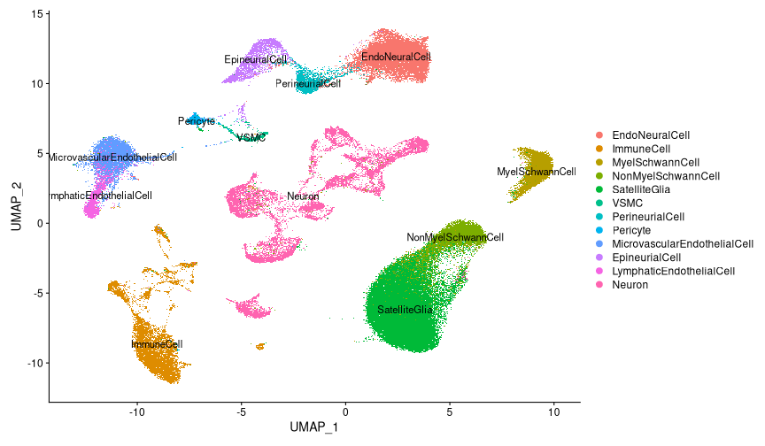

#### Neuron primary clustering

```r
# Subset neurons from full cell palette
(neurons <-
   drg_ra_full %>%
   set_idents("cell_class") %>%
   subset(idents = "Neuron"))
```

```
## An object of class Seurat 
## 32285 features across 13015 samples within 1 assay 
## Active assay: RNA (32285 features, 2000 variable features)
##  3 dimensional reductions calculated: pca, harmony, umap
```


```r
# Run Harmony
neurons %<>% run_harmony()
```

```
## Centering and scaling data matrix
```

```
## Harmony 1/50
```

```
## Harmony 2/50
```

```
## Harmony 3/50
```

```
## Harmony 4/50
```

```
## Harmony 5/50
```

```
## Harmony 6/50
```

```
## Harmony 7/50
```

```
## Harmony 8/50
```

```
## Harmony 9/50
```

```
## Harmony 10/50
```

```
## Harmony 11/50
```

```
## Harmony 12/50
```

```
## Harmony 13/50
```

```
## Harmony 14/50
```

```
## Harmony 15/50
```

```
## Harmony 16/50
```

```
## Harmony converged after 16 iterations
```

```
## Warning: Invalid name supplied, making object name syntactically valid. New
## object name is Seurat..ProjectDim.RNA.harmony; see ?make.names for more details
## on syntax validity
```


```r
# Cluster
neurons %<>% cluster_seurat(reduction = "harmony", dims = 1:20, resolution = 0.5)
```

```
## 21:17:27 UMAP embedding parameters a = 0.9922 b = 1.112
```

```
## 21:17:27 Read 13015 rows and found 20 numeric columns
```

```
## 21:17:27 Using Annoy for neighbor search, n_neighbors = 30
```

```
## 21:17:27 Building Annoy index with metric = cosine, n_trees = 50
```

```
## 0%   10   20   30   40   50   60   70   80   90   100%
```

```
## [----|----|----|----|----|----|----|----|----|----|
```

```
## **************************************************|
## 21:17:29 Writing NN index file to temp file /scratch/27543998/RtmpnFzTEQ/file3226555e69c7
## 21:17:29 Searching Annoy index using 1 thread, search_k = 3000
## 21:17:34 Annoy recall = 100%
## 21:17:37 Commencing smooth kNN distance calibration using 1 thread
## 21:17:39 Initializing from normalized Laplacian + noise
## 21:17:40 Commencing optimization for 200 epochs, with 559694 positive edges
## 21:17:55 Optimization finished
## Computing nearest neighbor graph
## Computing SNN
```

```
## Modularity Optimizer version 1.3.0 by Ludo Waltman and Nees Jan van Eck
## 
## Number of nodes: 13015
## Number of edges: 486322
## 
## Running Louvain algorithm...
## Maximum modularity in 10 random starts: 0.9527
## Number of communities: 29
## Elapsed time: 1 seconds
```


```r
# Plot UMAPS 
(DimPlot(neurons, group.by = "orig.ident", shuffle = TRUE) + NoLegend()) +
  (DimPlot(neurons, label = TRUE, shuffle = TRUE))
```

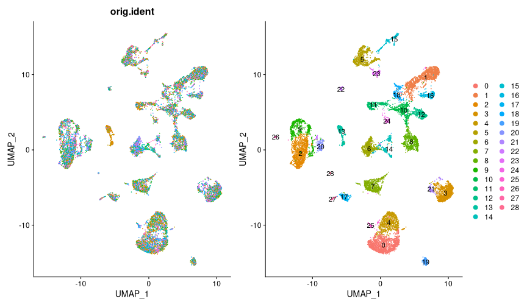


```r
# Check neuron markers and number of features in UMAP
FeaturePlot(neurons, c("Rbfox3", "Slc17a6", "nFeature_RNA"), pt.size = 0.1, label = TRUE)
```

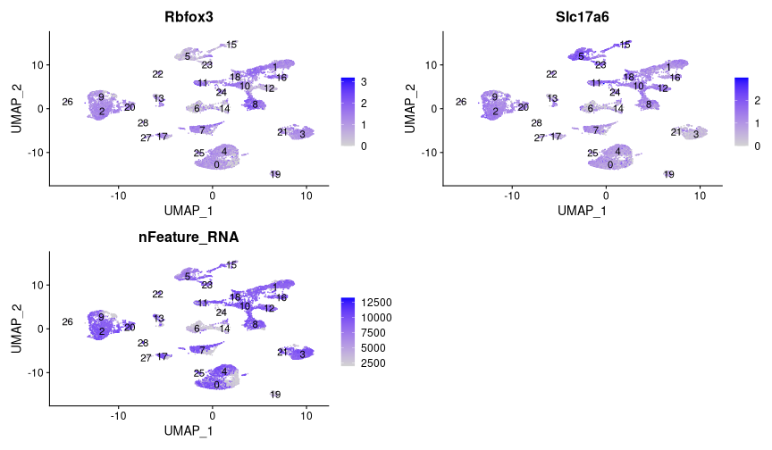


```r
# Check violins for neuron marker with a cutoff
VlnPlot(neurons, "Rbfox3", pt.size = 0) + 
  geom_hline(yintercept = 0.5, color = "red", size = 1)
```

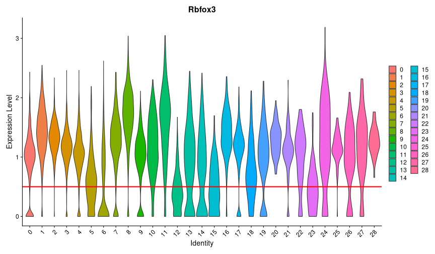


```r
# Subset only QC neurons based on Rbfox3 expression
(neurons %<>% subset(Rbfox3 > 0.5))
```

```
## An object of class Seurat 
## 32285 features across 10875 samples within 1 assay 
## Active assay: RNA (32285 features, 2000 variable features)
##  3 dimensional reductions calculated: pca, harmony, umap
```


```r
# Run Harmony again
neurons %<>% run_harmony()
```

```
## Centering and scaling data matrix
```

```
## Harmony 1/50
```

```
## Harmony 2/50
```

```
## Harmony 3/50
```

```
## Harmony 4/50
```

```
## Harmony 5/50
```

```
## Harmony 6/50
```

```
## Harmony 7/50
```

```
## Harmony 8/50
```

```
## Harmony converged after 8 iterations
```

```
## Warning: Invalid name supplied, making object name syntactically valid. New
## object name is Seurat..ProjectDim.RNA.harmony; see ?make.names for more details
## on syntax validity
```


```r
# Cluster neurons again
neurons %<>% cluster_seurat(reduction = "harmony", dims = 1:20, resolution = 0.5)
```

```
## 21:20:22 UMAP embedding parameters a = 0.9922 b = 1.112
```

```
## 21:20:22 Read 10875 rows and found 20 numeric columns
```

```
## 21:20:22 Using Annoy for neighbor search, n_neighbors = 30
```

```
## 21:20:22 Building Annoy index with metric = cosine, n_trees = 50
```

```
## 0%   10   20   30   40   50   60   70   80   90   100%
```

```
## [----|----|----|----|----|----|----|----|----|----|
```

```
## **************************************************|
## 21:20:24 Writing NN index file to temp file /scratch/27543998/RtmpnFzTEQ/file32262d7f4cdf
## 21:20:24 Searching Annoy index using 1 thread, search_k = 3000
## 21:20:28 Annoy recall = 100%
## 21:20:30 Commencing smooth kNN distance calibration using 1 thread
## 21:20:31 Initializing from normalized Laplacian + noise
## 21:20:32 Commencing optimization for 200 epochs, with 461878 positive edges
## 21:20:44 Optimization finished
## Computing nearest neighbor graph
## Computing SNN
```

```
## Modularity Optimizer version 1.3.0 by Ludo Waltman and Nees Jan van Eck
## 
## Number of nodes: 10875
## Number of edges: 400731
## 
## Running Louvain algorithm...
## Maximum modularity in 10 random starts: 0.9497
## Number of communities: 29
## Elapsed time: 1 seconds
```


```r
# Plot UMAPS
(DimPlot(neurons, group.by = "orig.ident", shuffle = TRUE) + NoLegend()) +
  (DimPlot(neurons, label = TRUE, shuffle = TRUE))
```

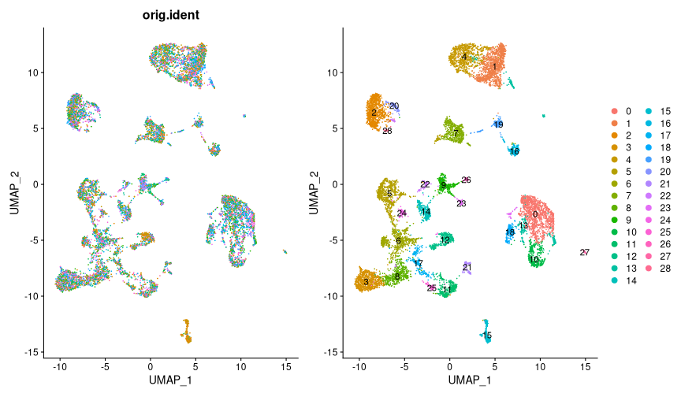


```r
# Check some violins
VlnPlot(neurons, c("Rbfox3", "Apoe", "Fabp7", "nFeature_RNA"), pt.size = 0)
```

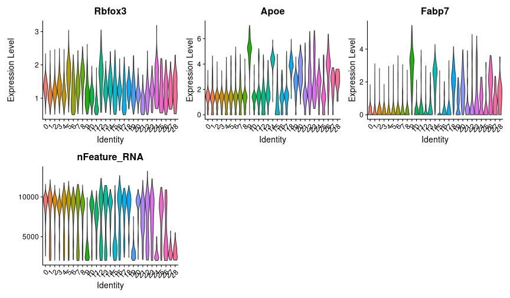


```r
# Filter out cells with high Apoe expression
(neurons %<>% subset(Apoe < 2))
```

```
## An object of class Seurat 
## 32285 features across 8283 samples within 1 assay 
## Active assay: RNA (32285 features, 2000 variable features)
##  3 dimensional reductions calculated: pca, harmony, umap
```


```r
# Run Harmony once more
neurons %<>% run_harmony()
```

```
## Centering and scaling data matrix
```

```
## Harmony 1/50
```

```
## Harmony 2/50
```

```
## Harmony 3/50
```

```
## Harmony 4/50
```

```
## Harmony 5/50
```

```
## Harmony 6/50
```

```
## Harmony 7/50
```

```
## Harmony 8/50
```

```
## Harmony 9/50
```

```
## Harmony 10/50
```

```
## Harmony 11/50
```

```
## Harmony 12/50
```

```
## Harmony 13/50
```

```
## Harmony 14/50
```

```
## Harmony 15/50
```

```
## Harmony converged after 15 iterations
```

```
## Warning: Invalid name supplied, making object name syntactically valid. New
## object name is Seurat..ProjectDim.RNA.harmony; see ?make.names for more details
## on syntax validity
```


```r
# Cluster neurons 
neurons %<>% cluster_seurat(reduction = "harmony", dims = 1:20, resolution = 0.5)
```

```
## 21:23:14 UMAP embedding parameters a = 0.9922 b = 1.112
```

```
## 21:23:14 Read 8283 rows and found 20 numeric columns
```

```
## 21:23:14 Using Annoy for neighbor search, n_neighbors = 30
```

```
## 21:23:14 Building Annoy index with metric = cosine, n_trees = 50
```

```
## 0%   10   20   30   40   50   60   70   80   90   100%
```

```
## [----|----|----|----|----|----|----|----|----|----|
```

```
## **************************************************|
## 21:23:15 Writing NN index file to temp file /scratch/27543998/RtmpnFzTEQ/file322666f04b68
## 21:23:15 Searching Annoy index using 1 thread, search_k = 3000
## 21:23:18 Annoy recall = 100%
## 21:23:19 Commencing smooth kNN distance calibration using 1 thread
## 21:23:20 Initializing from normalized Laplacian + noise
## 21:23:21 Commencing optimization for 500 epochs, with 350712 positive edges
## 21:23:43 Optimization finished
## Computing nearest neighbor graph
## Computing SNN
```

```
## Modularity Optimizer version 1.3.0 by Ludo Waltman and Nees Jan van Eck
## 
## Number of nodes: 8283
## Number of edges: 299417
## 
## Running Louvain algorithm...
## Maximum modularity in 10 random starts: 0.9423
## Number of communities: 20
## Elapsed time: 0 seconds
```


```r
# Plot UMAPS once again
(DimPlot(neurons, group.by = "orig.ident", shuffle = TRUE) + NoLegend()) +
  (DimPlot(neurons, label = TRUE, shuffle = TRUE))
```

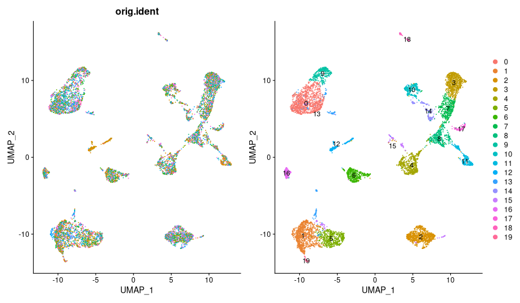


```r
# Some violins again
VlnPlot(neurons, c("Apoe", "Fabp7", "Slc17a6", "Rbfox3", "Snap25", "nFeature_RNA"), pt.size = 0)
```

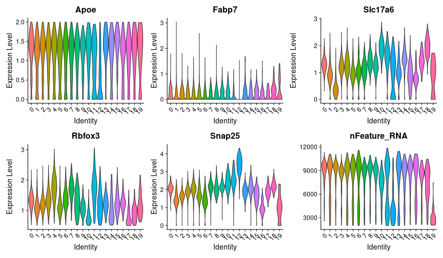

#### Assign celltypes to neurons using Zeisel et. al data (but Usoskin et al. identities)

```r
# Load Zeisel data
zeisel <- readRDS(here::here("data", "ref", "zeisel_drg.rds"))
```


```r
# Create classifier
zeisel %<>%
  NormalizeData() %>%
  FindVariableFeatures() %>%
  ScaleData() %>%
  RunPCA(npcs = 100, verbose = FALSE)
```

```
## Centering and scaling data matrix
```

```r
zeisel %<>%
  getFeatureSpace("usoskin_id") %>%
  trainModel(model = "mda")
```

```
## ●  Extracting feature space for each cell type...
## DONE!
## ●  Training models for each cell type...
```

```
## Loading required package: lattice
```

```
## 
## Attaching package: 'caret'
```

```
## The following object is masked from 'package:purrr':
## 
##     lift
```

```
## DONE!
```


```r
# Check model performance
zeisel %>% get_scpred()
```

```
## 'scPred' object
## ✔  Prediction variable = usoskin_id 
## ✔  Discriminant features per cell type
## ✔  Training model(s)
## Summary
## 
## |Cell type |   n| Features|Method |   ROC|  Sens|  Spec|
## |:---------|---:|--------:|:------|-----:|-----:|-----:|
## |NF1       |  38|      100|mda    | 0.998| 0.893| 0.997|
## |NF2_3     |  31|      100|mda    | 0.998| 0.876| 0.995|
## |NF4       |  57|      100|mda    | 0.999| 0.945| 0.996|
## |NP1       | 342|      100|mda    | 1.000| 0.997| 1.000|
## |NP2       | 133|      100|mda    | 1.000| 1.000| 0.998|
## |NP3       | 132|      100|mda    | 1.000| 1.000| 1.000|
## |PEP1      | 341|      100|mda    | 0.999| 0.965| 0.992|
## |PEP2      |  78|      100|mda    | 0.999| 0.937| 0.993|
## |Th        | 282|      100|mda    | 1.000| 1.000| 1.000|
## |TRPM8     | 146|      100|mda    | 0.998| 0.959| 0.999|
```


```r
# Predict labels for current dataset neurons
neurons %<>% scPredict(zeisel)
```

```
## ●  Matching reference with new dataset...
## 	 ─ 2000 features present in reference loadings
## 	 ─ 1895 features shared between reference and new dataset
## 	 ─ 94.75% of features in the reference are present in new dataset
## ●  Aligning new data to reference...
```

```
## Harmony 1/20
```

```
## Harmony 2/20
```

```
## Harmony 3/20
```

```
## Harmony 4/20
```

```
## Harmony 5/20
```

```
## Harmony 6/20
```

```
## Harmony 7/20
```

```
## Harmony 8/20
```

```
## Harmony 9/20
```

```
## Harmony converged after 9 iterations
```

```
## ●  Classifying cells...
## DONE!
```


```r
# Plot xax score distribution from scPred
neurons@meta.data %>%
  ggplot(aes(scpred_max)) +
  geom_histogram(
    bins = 50,
    color = "white",
    fill = "darkblue",
    alpha = 0.7) +
  geom_vline(xintercept = 0.55, color = "red", size = 1) +
  cowplot::theme_cowplot() +
  scale_y_continuous(expand = expansion(mult = c(0, .1))) +
  labs(
    title = "",
    x = "Max prediction score",
    y = "Number of cells"
  )
```

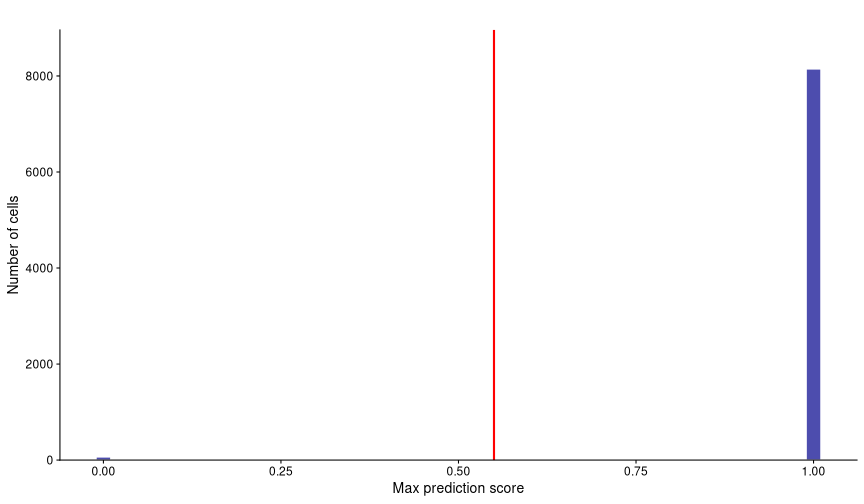


```r
# Plot prediction score heatmap
neurons@meta.data %>%
  select(
    starts_with("scpred_"),
    -c(scpred_max, scpred_prediction,scpred_no_rejection)
  ) %>%
  rename_with(~ str_remove(.x, "scpred_")) %>%
  t() %>%
  pheatmap::pheatmap(
    cluster_rows = FALSE,
    cluster_cols = TRUE,
    treeheight_col = 0,
    show_colnames = FALSE,
    color = viridisLite::viridis(10),
    fontsize = 12,
    title = ""
  )
```

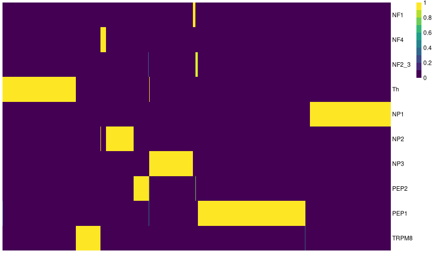


```r
# Plot UMAP with assigned labels
(DimPlot(
  neurons,
    group.by = "scpred_prediction",
    label = TRUE,
    shuffle = TRUE,
    repel = TRUE)) +

  (DimPlot(
    neurons,
    group.by = "scpred_no_rejection",
    label = TRUE,
    shuffle = TRUE,
    repel = TRUE))
```

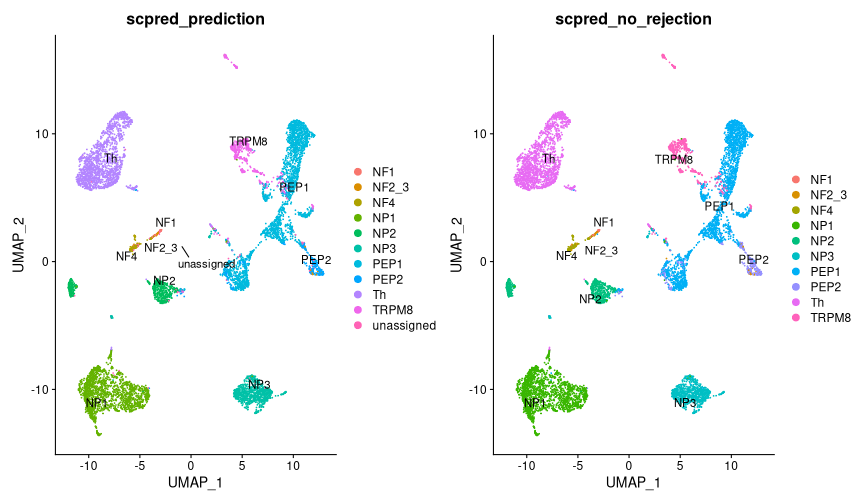


```r
# Save neurons 
saveRDS(neurons, file = here::here("data", "proc", "neurons_all.rds"))
```


```r
# Filter out the few unassigned cells
(neurons %<>% 
  set_idents("scpred_prediction") %>% 
  subset(
    idents = neurons@meta.data$scpred_prediction %>% unique() %>% keep(~ .x != "unassigned")
  ))
```

```
## An object of class Seurat 
## 32285 features across 8183 samples within 1 assay 
## Active assay: RNA (32285 features, 2000 variable features)
##  5 dimensional reductions calculated: pca, harmony, umap, scpred, scpred_projection
```


```r
# Find MRGPRB4 cluster
(VlnPlot(neurons, "Mrgprb4", group.by = "seurat_clusters") + NoLegend()) +
  (VlnPlot(neurons, "Mrgprb4", group.by = "scpred_prediction") + NoLegend())
```

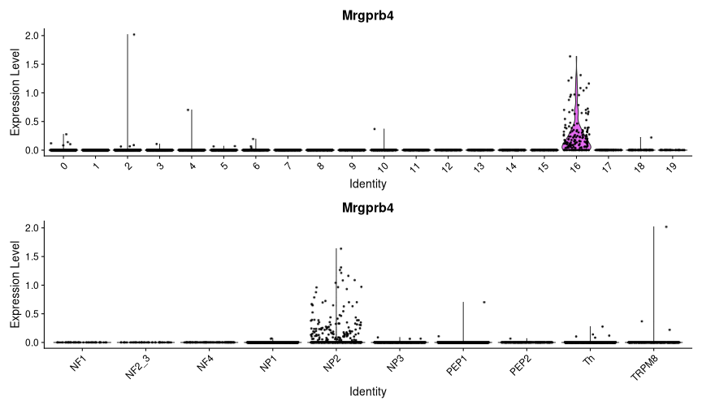


```r
# Assing MRGPRB4 cluster
neurons@meta.data %<>% 
  mutate(usoskin_id = if_else(seurat_clusters == 16, "MRGPRB4", scpred_prediction)) 
```


```r
# Plot UMAP with assigned labels
(DimPlot(
  neurons,
    group.by = "usoskin_id",
    label = TRUE,
    shuffle = TRUE,
    repel = TRUE)) +
  NoLegend()
```

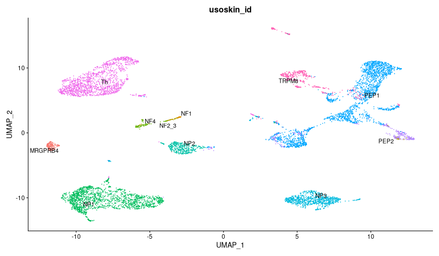


```r
# Get top markers for celltypes (for some qc plotting)
neurons %<>% set_idents("usoskin_id")

order <- 
  c(
  "NP1",
  "NP2",
  "NP3",
  "PEP1",
  "Th",
  "TRPM8",
  "MRGPRB4",
  "PEP2",
  "NF1",
  "NF2_3",
  "NF4"
)

Idents(neurons) <- factor(x = Idents(neurons), levels = order)

markers_usoskin <-
  neurons %>%
  FindAllMarkers(only.pos = TRUE, assay = "RNA") 
```

```
## Calculating cluster NP1
```

```
## Calculating cluster NP2
```

```
## Calculating cluster NP3
```

```
## Calculating cluster PEP1
```

```
## Calculating cluster Th
```

```
## Calculating cluster TRPM8
```

```
## Calculating cluster MRGPRB4
```

```
## Calculating cluster PEP2
```

```
## Calculating cluster NF1
```

```
## Calculating cluster NF2_3
```

```
## Calculating cluster NF4
```


```r
# Save top neuron markers
saveRDS(top_usoskin_genes, file = here::here("outputs, top_usoskin_genes.rds"))
```

```
## Error in saveRDS(top_usoskin_genes, file = here::here("outputs, top_usoskin_genes.rds")): object 'top_usoskin_genes' not found
```


```r
# DotPlot
top_usoskin_genes <-
  markers_usoskin %>% 
  group_by(cluster) %>%
  slice_min(p_val_adj, n = 3, with_ties = FALSE)

DotPlot(neurons, features = unique(top_usoskin_genes$gene)) +
  theme(axis.text.x = element_text(angle = 90, vjust = 0.5, hjust=1))
```

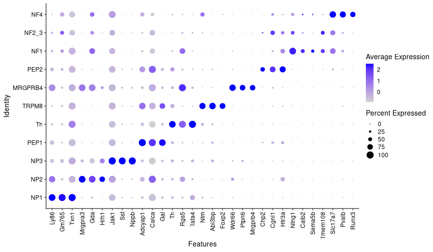


```r
# Plot celltype proportions in each timepoint
neurons@meta.data %>% 
  count(timepoint_days, usoskin_id) %>% 
  group_by(timepoint_days) %>% 
  mutate(pct = prop.table(n) * 100) %>%
  ggplot(aes(factor(timepoint_days), pct, fill = usoskin_id)) +
  geom_bar(stat = "identity") +
  geom_text(aes(label=paste0(sprintf("%1.1f", pct),"%")),
            position=position_stack(vjust=0.5)) +
  labs(x = "Timepoint in days", y = "Proportion of cells", fill = "Neuron type") +
  cowplot::theme_cowplot() +
  scale_y_continuous(expand = expansion(mult = c(0, .1)))
```

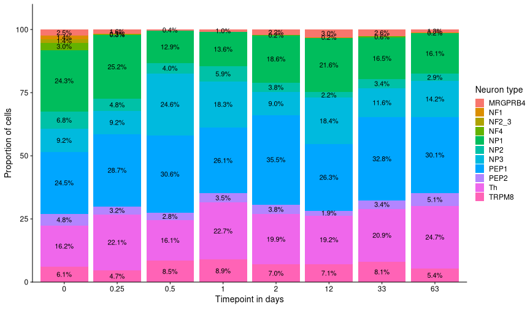


```r
# Save neuron object
saveRDS(neurons, file = here::here("data", "proc", "neurons.rds"))
```


```r
# sessionInfo
sessionInfo()
```

```
## R version 4.1.1 (2021-08-10)
## Platform: x86_64-pc-linux-gnu (64-bit)
## Running under: CentOS Linux 7 (Core)
## 
## Matrix products: default
## BLAS:   /sw/apps/R/4.1.1/rackham/lib64/R/lib/libRblas.so
## LAPACK: /sw/apps/R/4.1.1/rackham/lib64/R/lib/libRlapack.so
## 
## locale:
##  [1] LC_CTYPE=en_US.UTF-8       LC_NUMERIC=C              
##  [3] LC_TIME=en_US.UTF-8        LC_COLLATE=en_US.UTF-8    
##  [5] LC_MONETARY=en_US.UTF-8    LC_MESSAGES=en_US.UTF-8   
##  [7] LC_PAPER=en_US.UTF-8       LC_NAME=C                 
##  [9] LC_ADDRESS=C               LC_TELEPHONE=C            
## [11] LC_MEASUREMENT=en_US.UTF-8 LC_IDENTIFICATION=C       
## 
## attached base packages:
## [1] stats     graphics  grDevices utils     datasets  methods   base     
## 
## other attached packages:
##  [1] caret_6.0-90       lattice_0.20-45    scPred_1.9.2       harmony_0.1.0     
##  [5] Rcpp_1.0.8         SeuratObject_4.0.4 Seurat_4.1.0       magrittr_2.0.2    
##  [9] forcats_0.5.1      stringr_1.4.0      dplyr_1.0.8        purrr_0.3.4       
## [13] readr_2.1.2        tidyr_1.2.0        tibble_3.1.6       ggplot2_3.3.5     
## [17] tidyverse_1.3.1   
## 
## loaded via a namespace (and not attached):
##   [1] utf8_1.2.2            reticulate_1.24       R.utils_2.11.0       
##   [4] tidyselect_1.1.2      htmlwidgets_1.5.4     grid_4.1.1           
##   [7] Rtsne_0.15            pROC_1.18.0           munsell_0.5.0        
##  [10] codetools_0.2-18      ica_1.0-2             future_1.24.0        
##  [13] miniUI_0.1.1.1        withr_2.5.0           spatstat.random_2.1-0
##  [16] colorspace_2.0-3      highr_0.9             knitr_1.37           
##  [19] rstudioapi_0.13       stats4_4.1.1          ROCR_1.0-11          
##  [22] tensor_1.5            listenv_0.8.0         labeling_0.4.2       
##  [25] polyclip_1.10-0       pheatmap_1.0.12       farver_2.1.0         
##  [28] rprojroot_2.0.2       parallelly_1.30.0     vctrs_0.3.8          
##  [31] generics_0.1.2        ipred_0.9-12          xfun_0.30            
##  [34] R6_2.5.1              markdown_1.1          ggbeeswarm_0.6.0     
##  [37] spatstat.utils_2.3-0  assertthat_0.2.1      promises_1.2.0.1     
##  [40] scales_1.1.1          nnet_7.3-16           beeswarm_0.4.0       
##  [43] gtable_0.3.0          Cairo_1.5-14          globals_0.14.0       
##  [46] ezknitr_0.6.1         goftest_1.2-3         mda_0.5-2            
##  [49] timeDate_3043.102     rlang_1.0.2           splines_4.1.1        
##  [52] lazyeval_0.2.2        ModelMetrics_1.2.2.2  spatstat.geom_2.3-2  
##  [55] broom_0.7.12          reshape2_1.4.4        abind_1.4-5          
##  [58] modelr_0.1.8          backports_1.4.1       httpuv_1.6.5         
##  [61] tools_4.1.1           lava_1.6.10           ellipsis_0.3.2       
##  [64] spatstat.core_2.4-0   RColorBrewer_1.1-2    ggridges_0.5.3       
##  [67] plyr_1.8.6            rpart_4.1-15          deldir_1.0-6         
##  [70] pbapply_1.5-0         cowplot_1.1.1         zoo_1.8-9            
##  [73] haven_2.4.3           ggrepel_0.9.1         cluster_2.1.2        
##  [76] fs_1.5.2              here_1.0.1            data.table_1.14.2    
##  [79] RSpectra_0.16-0       scattermore_0.8       lmtest_0.9-39        
##  [82] reprex_2.0.1          RANN_2.6.1            fitdistrplus_1.1-8   
##  [85] R.cache_0.15.0        matrixStats_0.61.0    hms_1.1.1            
##  [88] patchwork_1.1.1       mime_0.12             evaluate_0.15        
##  [91] xtable_1.8-4          readxl_1.3.1          gridExtra_2.3        
##  [94] compiler_4.1.1        KernSmooth_2.23-20    crayon_1.5.0         
##  [97] R.oo_1.24.0           htmltools_0.5.2       mgcv_1.8-38          
## [100] later_1.3.0           tzdb_0.2.0            lubridate_1.8.0      
## [103] DBI_1.1.2             dbplyr_2.1.1          MASS_7.3-54          
## [106] Matrix_1.3-4          cli_3.2.0             R.methodsS3_1.8.1    
## [109] parallel_4.1.1        gower_1.0.0           igraph_1.2.11        
## [112] pkgconfig_2.0.3       plotly_4.10.0         spatstat.sparse_2.1-0
## [115] recipes_0.2.0         xml2_1.3.3            foreach_1.5.2        
## [118] vipor_0.4.5           hardhat_0.2.0         prodlim_2019.11.13   
## [121] rvest_1.0.2           digest_0.6.29         sctransform_0.3.3    
## [124] RcppAnnoy_0.0.19      spatstat.data_2.1-2   cellranger_1.1.0     
## [127] leiden_0.3.9          uwot_0.1.11           shiny_1.7.1          
## [130] lifecycle_1.0.1       nlme_3.1-153          jsonlite_1.8.0       
## [133] limma_3.48.3          viridisLite_0.4.0     fansi_1.0.2          
## [136] pillar_1.7.0          ggrastr_1.0.1         fastmap_1.1.0        
## [139] httr_1.4.2            survival_3.2-13       glue_1.6.2           
## [142] png_0.1-7             iterators_1.0.14      class_7.3-19         
## [145] stringi_1.7.6         styler_1.7.0.9001     irlba_2.3.5          
## [148] future.apply_1.8.1
```


```r
# Done
clear_libraries()
```
