```r
# Load libraries and functions
suppressPackageStartupMessages({
  library(tidyverse)
  library(magrittr)
  library(Seurat)
  library(UpSetR)
  library(patchwork)
  library(enrichR)
  library(readxl)
  library(fcoex)
  library(harmony)
})
R.utils::sourceDirectory(here::here("R", "functions"), modifiedOnly=FALSE)
```


```r
# Load neuron lowq data
(neurons <- readRDS(here::here("data", "proc", "neurons.rds")))
```

```
## An object of class Seurat 
## 32285 features across 8183 samples within 1 assay 
## Active assay: RNA (32285 features, 2000 variable features)
##  5 dimensional reductions calculated: pca, harmony, umap, scpred, scpred_projection
```


```r
# Keep only c-fiber types for the analysis 
(neurons %<>% 
  set_idents("usoskin_id") %>% 
  subset(idents = c("NP1", "NP2", "NP3", "PEP1", "TRPM8", "Th", "MRGPRB4")))
```

```
## An object of class Seurat 
## 32285 features across 7647 samples within 1 assay 
## Active assay: RNA (32285 features, 2000 variable features)
##  5 dimensional reductions calculated: pca, harmony, umap, scpred, scpred_projection
```

#### DE between control and each timepoint all with celltypes collapsed together

```r
# Get DE genes for each comparison
timepoints <-
  neurons@meta.data$timepoint %>%
  str_subset("0$", negate = TRUE) %>%
  unique()

bulk_grid <- expand_grid(timepoints = timepoints, control = "0")

pseudobulk <-
  bulk_grid %>% 
  pmap( 
    ~ neurons %>%
      set_idents("timepoint_days") %>%
      FindMarkers(ident.1 = .x, ident.2 = .y) %>%
      rownames_to_column("gene") %>% 
      filter(p_val_adj < 10^-20)
  ) %>%
  set_names(timepoints)
```


```r
# Collect up- an downregulated genes
pseudobulk_down_genes <-
  pseudobulk %>%
  map(~.x %>% filter(avg_log2FC < 0) %>% pull(gene))

pseudobulk_up_genes <-
  pseudobulk %>%
  map(~.x %>% filter(avg_log2FC > 0) %>% pull(gene))
```


```r
# Extract gene intersections between timepoints for pseudobulk
pseudobulk_upregulated_intersections <- get_upset_gene_lists(pseudobulk_up_genes)
pseudobulk_downregulated_intersections <- get_upset_gene_lists(pseudobulk_down_genes)
```

#### Differential expression between control and the first 48h for each celltype

```r
# Collect celltypes
celltypes <-
  neurons@meta.data$usoskin_id %>%
  unique()

# Set idents to usoskin
neurons %<>% set_idents("usoskin_id")

# Create function
get_treatment_markers <- 
  as_mapper(
    ~neurons %>%
      subset(idents = .x) %>%
      set_idents("timepoint_days") %>% 
      subset(idents = c("0", "0.25", "0.5", "1", "2")) %>%
      set_idents("treatment") %>% 
      FindMarkers(ident.1 = "RA", ident.2 = "Control") %>%
      rownames_to_column("gene") %>% 
      filter(p_val_adj < 10^-5)
  )

# Make it safe
get_safely_treatment_markers <- safely(get_treatment_markers)

# Get markers for each cell type
de_first_48h <-
  celltypes %>% 
  map(get_safely_treatment_markers) %>% 
  set_names(celltypes) %>% 
  map("result") %>% 
  compact()

# Extract upregulated genes
up_de_first_48h_genes <-
  de_first_48h %>%
  map(~.x %>% filter(avg_log2FC > 0) %>% pull(gene))

# Extract downregulated genes
down_de_first_48h_genes <-
  de_first_48h %>%
  map(~.x %>% filter(avg_log2FC < 0) %>% pull(gene))
```


```r
# Plot upset up first 48h
plot_upset(up_de_first_48h_genes, order = c("NP1", "NP2", "NP3", "PEP1", "Th", "TRPM8", "MRGPRB4"))
```

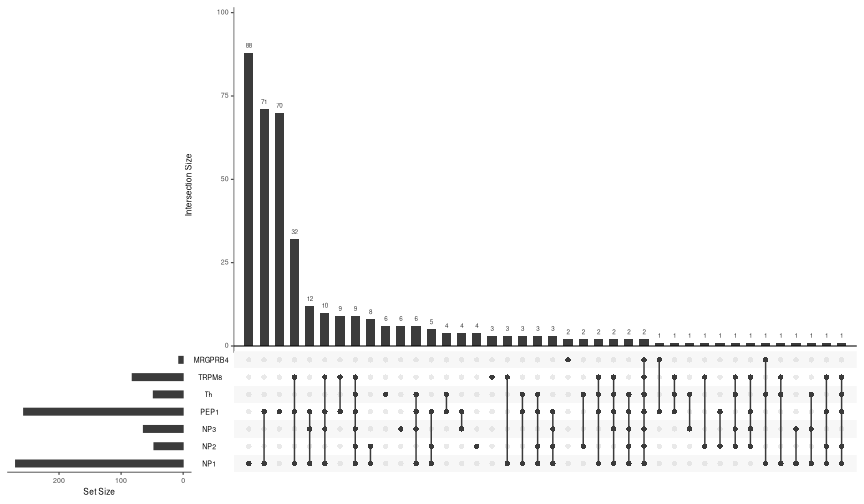


```r
first48h_upregulated_intersections <- get_upset_gene_lists(up_de_first_48h_genes)
```


```r
# Plot upset down first 48h
plot_upset(down_de_first_48h_genes, order = c("NP1", "NP2", "NP3", "PEP1", "Th", "TRPM8", "MRGPRB4"))
```

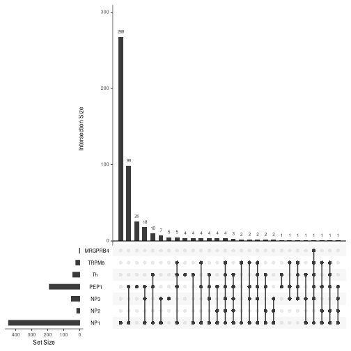


```r
first48h_downregulated_intersections <- get_upset_gene_lists(down_de_first_48h_genes)
```

#### Differential expression between control and the late state (33d, 63d) for each celltype

```r
# Collect celltypes
celltypes <-
  neurons@meta.data$usoskin_id %>%
  unique()

# Create function
get_treatment_markers <- 
  as_mapper(
    ~neurons %>%
      subset(idents = .x) %>%
      set_idents("timepoint_days") %>% 
      subset(idents = c("0", "33", "63")) %>%
      set_idents("treatment") %>% 
      FindMarkers(ident.1 = "RA", ident.2 = "Control") %>%
      rownames_to_column("gene") %>% 
      filter(p_val_adj < 10^-5)
  )

# Make it safe
get_safely_treatment_markers <- safely(get_treatment_markers)

# Get markers for each cell type
de_late <-
  celltypes %>% 
  map(get_safely_treatment_markers) %>% 
  set_names(celltypes) %>% 
  map("result") %>% 
  compact()

# Extract upregulated genes
up_de_late_genes <-
  de_late %>%
  map(~.x %>% filter(avg_log2FC > 0) %>% pull(gene))

# Extract downregulated genes
down_de_late_genes <-
  de_late %>%
  map(~.x %>% filter(avg_log2FC < 0) %>% pull(gene))
```


```r
# Plot upset up late state
plot_upset(up_de_late_genes, order = c("NP1", "NP2", "NP3", "PEP1", "Th", "TRPM8", "MRGPRB4"))
```

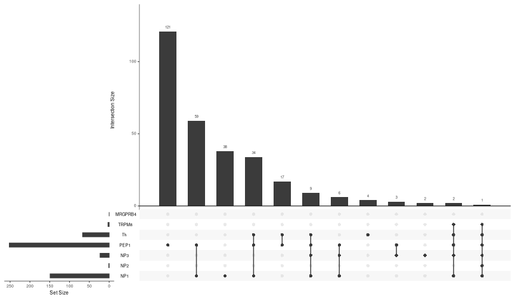


```r
late_upregulated_intersections <- get_upset_gene_lists(up_de_late_genes)
```


```r
# Plot upset down late state
plot_upset(down_de_late_genes, order = c("NP1", "NP2", "NP3", "PEP1", "Th", "TRPM8", "MRGPRB4"))
```

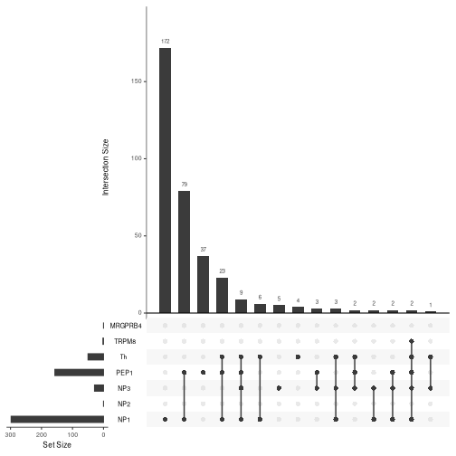


```r
late_downregulated_intersections <- get_upset_gene_lists(down_de_late_genes)
```

#### Enrichr analysis for gene sets

```r
# Get available DBs to choose from
(dbs_all <- listEnrichrDbs())
```

```
##     geneCoverage genesPerTerm
## 1          13362          275
## 2          27884         1284
## 3           6002           77
## 4          47172         1370
## 5          47107          509
## 6          21493         3713
## 7           1295           18
## 8           3185           73
## 9           2854           34
## 10         15057          300
## 11          4128           48
## 12         34061          641
## 13          7504          155
## 14         16399          247
## 15         12753           57
## 16         23726          127
## 17         32740           85
## 18         13373          258
## 19         19270          388
## 20         13236           82
## 21         14264           58
## 22          3096           31
## 23         22288         4368
## 24          4533           37
## 25         10231          158
## 26          2741            5
## 27          5655          342
## 28         10406          715
## 29         10493          200
## 30         11251          100
## 31          8695          100
## 32          1759           25
## 33          2178           89
## 34           851           15
## 35         10061          106
## 36         11250          166
## 37         15406          300
## 38         17711          300
## 39         17576          300
## 40         15797          176
## 41         12232          343
## 42         13572          301
## 43          6454          301
## 44          3723           47
## 45          7588           35
## 46          7682           78
## 47          7324          172
## 48          8469          122
## 49         13121          305
## 50         26382         1811
## 51         29065         2123
## 52           280            9
## 53         13877          304
## 54         15852          912
## 55          4320          129
## 56          4271          128
## 57         10496          201
## 58          1678           21
## 59           756           12
## 60          3800           48
## 61          2541           39
## 62          1918           39
## 63          5863           51
## 64          6768           47
## 65         25651          807
## 66         19129         1594
## 67         23939          293
## 68         23561          307
## 69         23877          302
## 70         15886            9
## 71         24350          299
## 72          3102           25
## 73         31132          298
## 74         30832          302
## 75         48230         1429
## 76          5613           36
## 77          9559           73
## 78          9448           63
## 79         16725         1443
## 80         19249         1443
## 81         15090          282
## 82         16129          292
## 83         15309          308
## 84         15103          318
## 85         15022          290
## 86         15676          310
## 87         15854          279
## 88         15015          321
## 89          3788          159
## 90          3357          153
## 91         12668          300
## 92         12638          300
## 93          8973           64
## 94          7010           87
## 95          5966           51
## 96         15562          887
## 97         17850          300
## 98         17660          300
## 99          1348           19
## 100          934           13
## 101         2541           39
## 102         2041           42
## 103         5209          300
## 104        49238         1550
## 105         2243           19
## 106        19586          545
## 107        22440          505
## 108         8184           24
## 109        18329          161
## 110        15755           28
## 111        10271           22
## 112        10427           38
## 113        10601           25
## 114        13822           21
## 115         8002          143
## 116        10089           45
## 117        13247           49
## 118        21809         2316
## 119        23601         2395
## 120        20883          299
## 121        19612          299
## 122        25983          299
## 123        19500          137
## 124        14893          128
## 125        17598         1208
## 126         5902          109
## 127        12486          299
## 128         1073          100
## 129        19513          117
## 130        14433           36
## 131         8655           61
## 132        11459           39
## 133        19741          270
## 134        27360          802
## 135        13072           26
## 136        13464           45
## 137        13787          200
## 138        13929          200
## 139        16964          200
## 140        17258          200
## 141        10352           58
## 142        10471           76
## 143        12419          491
## 144        19378           37
## 145         6201           45
## 146         4558           54
## 147         3264           22
## 148         7802           92
## 149         8551           98
## 150        12444           23
## 151         9000           20
## 152         7744          363
## 153         6204          387
## 154        13420           32
## 155        14148          122
## 156         9813           49
## 157         1397           13
## 158         9116           22
## 159        17464           63
## 160          394           73
## 161        11851          586
## 162         8189          421
## 163        18704          100
## 164         5605           39
## 165         5718           31
## 166        14156           40
## 167        16979          295
## 168         4383          146
## 169        54974          483
## 170        12118          448
## 171        12361          124
## 172         9763          139
## 173         8078          102
## 174         7173           43
## 175         5833          100
## 176        14937           33
## 177        11497           80
## 178        11936           34
## 179         9767           33
## 180        14167           80
## 181        17851          102
## 182        16853          360
## 183         6654          136
## 184         1683           10
## 185        20414          112
## 186        26076          250
## 187        26338          250
## 188        25381          250
## 189        25409          250
## 190        11980          250
## 191        31158          805
## 192        30006          815
## 193        13370          103
##                                            libraryName
## 1                                  Genome_Browser_PWMs
## 2                             TRANSFAC_and_JASPAR_PWMs
## 3                            Transcription_Factor_PPIs
## 4                                            ChEA_2013
## 5                     Drug_Perturbations_from_GEO_2014
## 6                              ENCODE_TF_ChIP-seq_2014
## 7                                        BioCarta_2013
## 8                                        Reactome_2013
## 9                                    WikiPathways_2013
## 10                 Disease_Signatures_from_GEO_up_2014
## 11                                           KEGG_2013
## 12                          TF-LOF_Expression_from_GEO
## 13                                 TargetScan_microRNA
## 14                                    PPI_Hub_Proteins
## 15                          GO_Molecular_Function_2015
## 16                                           GeneSigDB
## 17                                 Chromosome_Location
## 18                                    Human_Gene_Atlas
## 19                                    Mouse_Gene_Atlas
## 20                          GO_Cellular_Component_2015
## 21                          GO_Biological_Process_2015
## 22                            Human_Phenotype_Ontology
## 23                     Epigenomics_Roadmap_HM_ChIP-seq
## 24                                            KEA_2013
## 25                   NURSA_Human_Endogenous_Complexome
## 26                                               CORUM
## 27                             SILAC_Phosphoproteomics
## 28                     MGI_Mammalian_Phenotype_Level_3
## 29                     MGI_Mammalian_Phenotype_Level_4
## 30                                         Old_CMAP_up
## 31                                       Old_CMAP_down
## 32                                        OMIM_Disease
## 33                                       OMIM_Expanded
## 34                                           VirusMINT
## 35                                MSigDB_Computational
## 36                         MSigDB_Oncogenic_Signatures
## 37               Disease_Signatures_from_GEO_down_2014
## 38                     Virus_Perturbations_from_GEO_up
## 39                   Virus_Perturbations_from_GEO_down
## 40                       Cancer_Cell_Line_Encyclopedia
## 41                            NCI-60_Cancer_Cell_Lines
## 42         Tissue_Protein_Expression_from_ProteomicsDB
## 43   Tissue_Protein_Expression_from_Human_Proteome_Map
## 44                                    HMDB_Metabolites
## 45                               Pfam_InterPro_Domains
## 46                          GO_Biological_Process_2013
## 47                          GO_Cellular_Component_2013
## 48                          GO_Molecular_Function_2013
## 49                                Allen_Brain_Atlas_up
## 50                             ENCODE_TF_ChIP-seq_2015
## 51                   ENCODE_Histone_Modifications_2015
## 52                   Phosphatase_Substrates_from_DEPOD
## 53                              Allen_Brain_Atlas_down
## 54                   ENCODE_Histone_Modifications_2013
## 55                           Achilles_fitness_increase
## 56                           Achilles_fitness_decrease
## 57                        MGI_Mammalian_Phenotype_2013
## 58                                       BioCarta_2015
## 59                                       HumanCyc_2015
## 60                                           KEGG_2015
## 61                                     NCI-Nature_2015
## 62                                        Panther_2015
## 63                                   WikiPathways_2015
## 64                                       Reactome_2015
## 65                                              ESCAPE
## 66                                          HomoloGene
## 67                 Disease_Perturbations_from_GEO_down
## 68                   Disease_Perturbations_from_GEO_up
## 69                    Drug_Perturbations_from_GEO_down
## 70                    Genes_Associated_with_NIH_Grants
## 71                      Drug_Perturbations_from_GEO_up
## 72                                            KEA_2015
## 73                      Gene_Perturbations_from_GEO_up
## 74                    Gene_Perturbations_from_GEO_down
## 75                                           ChEA_2015
## 76                                               dbGaP
## 77                            LINCS_L1000_Chem_Pert_up
## 78                          LINCS_L1000_Chem_Pert_down
## 79                         GTEx_Tissue_Expression_Down
## 80                           GTEx_Tissue_Expression_Up
## 81                  Ligand_Perturbations_from_GEO_down
## 82                   Aging_Perturbations_from_GEO_down
## 83                     Aging_Perturbations_from_GEO_up
## 84                    Ligand_Perturbations_from_GEO_up
## 85                    MCF7_Perturbations_from_GEO_down
## 86                      MCF7_Perturbations_from_GEO_up
## 87                 Microbe_Perturbations_from_GEO_down
## 88                   Microbe_Perturbations_from_GEO_up
## 89               LINCS_L1000_Ligand_Perturbations_down
## 90                 LINCS_L1000_Ligand_Perturbations_up
## 91            L1000_Kinase_and_GPCR_Perturbations_down
## 92              L1000_Kinase_and_GPCR_Perturbations_up
## 93                                       Reactome_2016
## 94                                           KEGG_2016
## 95                                   WikiPathways_2016
## 96           ENCODE_and_ChEA_Consensus_TFs_from_ChIP-X
## 97                  Kinase_Perturbations_from_GEO_down
## 98                    Kinase_Perturbations_from_GEO_up
## 99                                       BioCarta_2016
## 100                                      HumanCyc_2016
## 101                                    NCI-Nature_2016
## 102                                       Panther_2016
## 103                                         DrugMatrix
## 104                                          ChEA_2016
## 105                                              huMAP
## 106                                     Jensen_TISSUES
## 107  RNA-Seq_Disease_Gene_and_Drug_Signatures_from_GEO
## 108                       MGI_Mammalian_Phenotype_2017
## 109                                Jensen_COMPARTMENTS
## 110                                    Jensen_DISEASES
## 111                                       BioPlex_2017
## 112                         GO_Cellular_Component_2017
## 113                         GO_Molecular_Function_2017
## 114                         GO_Biological_Process_2017
## 115                        GO_Cellular_Component_2017b
## 116                        GO_Molecular_Function_2017b
## 117                        GO_Biological_Process_2017b
## 118                                     ARCHS4_Tissues
## 119                                  ARCHS4_Cell-lines
## 120                                   ARCHS4_IDG_Coexp
## 121                               ARCHS4_Kinases_Coexp
## 122                                   ARCHS4_TFs_Coexp
## 123                            SysMyo_Muscle_Gene_Sets
## 124                                    miRTarBase_2017
## 125                           TargetScan_microRNA_2017
## 126               Enrichr_Libraries_Most_Popular_Genes
## 127            Enrichr_Submissions_TF-Gene_Coocurrence
## 128         Data_Acquisition_Method_Most_Popular_Genes
## 129                                             DSigDB
## 130                         GO_Biological_Process_2018
## 131                         GO_Cellular_Component_2018
## 132                         GO_Molecular_Function_2018
## 133            TF_Perturbations_Followed_by_Expression
## 134                           Chromosome_Location_hg19
## 135                  NIH_Funded_PIs_2017_Human_GeneRIF
## 136                  NIH_Funded_PIs_2017_Human_AutoRIF
## 137           Rare_Diseases_AutoRIF_ARCHS4_Predictions
## 138           Rare_Diseases_GeneRIF_ARCHS4_Predictions
## 139     NIH_Funded_PIs_2017_AutoRIF_ARCHS4_Predictions
## 140     NIH_Funded_PIs_2017_GeneRIF_ARCHS4_Predictions
## 141                   Rare_Diseases_GeneRIF_Gene_Lists
## 142                   Rare_Diseases_AutoRIF_Gene_Lists
## 143                                    SubCell_BarCode
## 144                                  GWAS_Catalog_2019
## 145                            WikiPathways_2019_Human
## 146                            WikiPathways_2019_Mouse
## 147                  TRRUST_Transcription_Factors_2019
## 148                                    KEGG_2019_Human
## 149                                    KEGG_2019_Mouse
## 150                              InterPro_Domains_2019
## 151                                  Pfam_Domains_2019
## 152      DepMap_WG_CRISPR_Screens_Broad_CellLines_2019
## 153     DepMap_WG_CRISPR_Screens_Sanger_CellLines_2019
## 154               MGI_Mammalian_Phenotype_Level_4_2019
## 155                                 UK_Biobank_GWAS_v1
## 156                                     BioPlanet_2019
## 157                                       ClinVar_2019
## 158                                        PheWeb_2019
## 159                                           DisGeNET
## 160                               HMS_LINCS_KinomeScan
## 161                               CCLE_Proteomics_2020
## 162                                  ProteomicsDB_2020
## 163                        lncHUB_lncRNA_Co-Expression
## 164                      Virus-Host_PPI_P-HIPSTer_2020
## 165                        Elsevier_Pathway_Collection
## 166                     Table_Mining_of_CRISPR_Studies
## 167                         COVID-19_Related_Gene_Sets
## 168                               MSigDB_Hallmark_2020
## 169               Enrichr_Users_Contributed_Lists_2020
## 170                                      TG_GATES_2020
## 171                   Allen_Brain_Atlas_10x_scRNA_2021
## 172               Descartes_Cell_Types_and_Tissue_2021
## 173                                    KEGG_2021_Human
## 174                             WikiPathway_2021_Human
## 175 HuBMAP_ASCT_plus_B_augmented_w_RNAseq_Coexpression
## 176                         GO_Biological_Process_2021
## 177                         GO_Cellular_Component_2021
## 178                         GO_Molecular_Function_2021
## 179               MGI_Mammalian_Phenotype_Level_4_2021
## 180                          CellMarker_Augmented_2021
## 181                            Orphanet_Augmented_2021
## 182                    COVID-19_Related_Gene_Sets_2021
## 183                           PanglaoDB_Augmented_2021
## 184                            Azimuth_Cell_Types_2021
## 185                          PhenGenI_Association_2021
## 186         RNAseq_Automatic_GEO_Signatures_Human_Down
## 187           RNAseq_Automatic_GEO_Signatures_Human_Up
## 188         RNAseq_Automatic_GEO_Signatures_Mouse_Down
## 189           RNAseq_Automatic_GEO_Signatures_Mouse_Up
## 190                         GTEx_Aging_Signatures_2021
## 191                                 HDSigDB_Human_2021
## 192                                 HDSigDB_Mouse_2021
## 193                    HuBMAP_ASCTplusB_augmented_2022
##                                                                                link
## 1                          http://hgdownload.cse.ucsc.edu/goldenPath/hg18/database/
## 2                                          http://jaspar.genereg.net/html/DOWNLOAD/
## 3                                                                                  
## 4                                    http://amp.pharm.mssm.edu/lib/cheadownload.jsp
## 5                                                  http://www.ncbi.nlm.nih.gov/geo/
## 6                                      http://genome.ucsc.edu/ENCODE/downloads.html
## 7                               https://cgap.nci.nih.gov/Pathways/BioCarta_Pathways
## 8                                       http://www.reactome.org/download/index.html
## 9                           http://www.wikipathways.org/index.php/Download_Pathways
## 10                                                 http://www.ncbi.nlm.nih.gov/geo/
## 11                                                http://www.kegg.jp/kegg/download/
## 12                                                 http://www.ncbi.nlm.nih.gov/geo/
## 13        http://www.targetscan.org/cgi-bin/targetscan/data_download.cgi?db=vert_61
## 14                                                    http://amp.pharm.mssm.edu/X2K
## 15                       http://www.geneontology.org/GO.downloads.annotations.shtml
## 16                                        https://pubmed.ncbi.nlm.nih.gov/22110038/
## 17                         http://software.broadinstitute.org/gsea/msigdb/index.jsp
## 18                                                     http://biogps.org/downloads/
## 19                                                     http://biogps.org/downloads/
## 20                       http://www.geneontology.org/GO.downloads.annotations.shtml
## 21                       http://www.geneontology.org/GO.downloads.annotations.shtml
## 22                                         http://www.human-phenotype-ontology.org/
## 23                                               http://www.roadmapepigenomics.org/
## 24                                 http://amp.pharm.mssm.edu/lib/keacommandline.jsp
## 25                                            https://www.nursa.org/nursa/index.jsf
## 26                              http://mips.helmholtz-muenchen.de/genre/proj/corum/
## 27                                 http://amp.pharm.mssm.edu/lib/keacommandline.jsp
## 28                                                  http://www.informatics.jax.org/
## 29                                                  http://www.informatics.jax.org/
## 30                                              http://www.broadinstitute.org/cmap/
## 31                                              http://www.broadinstitute.org/cmap/
## 32                                                    http://www.omim.org/downloads
## 33                                                    http://www.omim.org/downloads
## 34                                        http://mint.bio.uniroma2.it/download.html
## 35                        http://www.broadinstitute.org/gsea/msigdb/collections.jsp
## 36                        http://www.broadinstitute.org/gsea/msigdb/collections.jsp
## 37                                                 http://www.ncbi.nlm.nih.gov/geo/
## 38                                                 http://www.ncbi.nlm.nih.gov/geo/
## 39                                                 http://www.ncbi.nlm.nih.gov/geo/
## 40                                   https://portals.broadinstitute.org/ccle/home\n
## 41                                                     http://biogps.org/downloads/
## 42                                                    https://www.proteomicsdb.org/
## 43                                        http://www.humanproteomemap.org/index.php
## 44                                                     http://www.hmdb.ca/downloads
## 45                                      ftp://ftp.ebi.ac.uk/pub/databases/interpro/
## 46                       http://www.geneontology.org/GO.downloads.annotations.shtml
## 47                       http://www.geneontology.org/GO.downloads.annotations.shtml
## 48                       http://www.geneontology.org/GO.downloads.annotations.shtml
## 49                                                        http://www.brain-map.org/
## 50                                     http://genome.ucsc.edu/ENCODE/downloads.html
## 51                                     http://genome.ucsc.edu/ENCODE/downloads.html
## 52                                                  http://www.koehn.embl.de/depod/
## 53                                                        http://www.brain-map.org/
## 54                                     http://genome.ucsc.edu/ENCODE/downloads.html
## 55                                           http://www.broadinstitute.org/achilles
## 56                                           http://www.broadinstitute.org/achilles
## 57                                                  http://www.informatics.jax.org/
## 58                              https://cgap.nci.nih.gov/Pathways/BioCarta_Pathways
## 59                                                             http://humancyc.org/
## 60                                                http://www.kegg.jp/kegg/download/
## 61                                                          http://pid.nci.nih.gov/
## 62                                                        http://www.pantherdb.org/
## 63                          http://www.wikipathways.org/index.php/Download_Pathways
## 64                                      http://www.reactome.org/download/index.html
## 65                                                 http://www.maayanlab.net/ESCAPE/
## 66                                           http://www.ncbi.nlm.nih.gov/homologene
## 67                                                 http://www.ncbi.nlm.nih.gov/geo/
## 68                                                 http://www.ncbi.nlm.nih.gov/geo/
## 69                                                 http://www.ncbi.nlm.nih.gov/geo/
## 70                                          https://grants.nih.gov/grants/oer.htm\n
## 71                                                 http://www.ncbi.nlm.nih.gov/geo/
## 72                                                http://amp.pharm.mssm.edu/Enrichr
## 73                                                 http://www.ncbi.nlm.nih.gov/geo/
## 74                                                 http://www.ncbi.nlm.nih.gov/geo/
## 75                                                http://amp.pharm.mssm.edu/Enrichr
## 76                                                  http://www.ncbi.nlm.nih.gov/gap
## 77                                                                 https://clue.io/
## 78                                                                 https://clue.io/
## 79                                                       http://www.gtexportal.org/
## 80                                                       http://www.gtexportal.org/
## 81                                                 http://www.ncbi.nlm.nih.gov/geo/
## 82                                                 http://www.ncbi.nlm.nih.gov/geo/
## 83                                                 http://www.ncbi.nlm.nih.gov/geo/
## 84                                                 http://www.ncbi.nlm.nih.gov/geo/
## 85                                                 http://www.ncbi.nlm.nih.gov/geo/
## 86                                                 http://www.ncbi.nlm.nih.gov/geo/
## 87                                                 http://www.ncbi.nlm.nih.gov/geo/
## 88                                                 http://www.ncbi.nlm.nih.gov/geo/
## 89                                                                 https://clue.io/
## 90                                                                 https://clue.io/
## 91                                                                 https://clue.io/
## 92                                                                 https://clue.io/
## 93                                      http://www.reactome.org/download/index.html
## 94                                                http://www.kegg.jp/kegg/download/
## 95                          http://www.wikipathways.org/index.php/Download_Pathways
## 96                                                                                 
## 97                                                 http://www.ncbi.nlm.nih.gov/geo/
## 98                                                 http://www.ncbi.nlm.nih.gov/geo/
## 99                               http://cgap.nci.nih.gov/Pathways/BioCarta_Pathways
## 100                                                            http://humancyc.org/
## 101                                                         http://pid.nci.nih.gov/
## 102                                               http://www.pantherdb.org/pathway/
## 103                                           https://ntp.niehs.nih.gov/drugmatrix/
## 104                                               http://amp.pharm.mssm.edu/Enrichr
## 105                                                    http://proteincomplexes.org/
## 106                                                   http://tissues.jensenlab.org/
## 107                                                http://www.ncbi.nlm.nih.gov/geo/
## 108                                                 http://www.informatics.jax.org/
## 109                                              http://compartments.jensenlab.org/
## 110                                                  http://diseases.jensenlab.org/
## 111                                                 http://bioplex.hms.harvard.edu/
## 112                                                    http://www.geneontology.org/
## 113                                                    http://www.geneontology.org/
## 114                                                    http://www.geneontology.org/
## 115                                                    http://www.geneontology.org/
## 116                                                    http://www.geneontology.org/
## 117                                                    http://www.geneontology.org/
## 118                                                http://amp.pharm.mssm.edu/archs4
## 119                                                http://amp.pharm.mssm.edu/archs4
## 120                                                http://amp.pharm.mssm.edu/archs4
## 121                                                http://amp.pharm.mssm.edu/archs4
## 122                                                http://amp.pharm.mssm.edu/archs4
## 123                                                     http://sys-myo.rhcloud.com/
## 124                                              http://mirtarbase.mbc.nctu.edu.tw/
## 125                                                      http://www.targetscan.org/
## 126                                               http://amp.pharm.mssm.edu/Enrichr
## 127                                               http://amp.pharm.mssm.edu/Enrichr
## 128                                               http://amp.pharm.mssm.edu/Enrichr
## 129                                   http://tanlab.ucdenver.edu/DSigDB/DSigDBv1.0/
## 130                                                    http://www.geneontology.org/
## 131                                                    http://www.geneontology.org/
## 132                                                    http://www.geneontology.org/
## 133                                                http://www.ncbi.nlm.nih.gov/geo/
## 134                                   http://hgdownload.cse.ucsc.edu/downloads.html
## 135                                            https://www.ncbi.nlm.nih.gov/pubmed/
## 136                                            https://www.ncbi.nlm.nih.gov/pubmed/
## 137                                            https://amp.pharm.mssm.edu/geneshot/
## 138                                 https://www.ncbi.nlm.nih.gov/gene/about-generif
## 139                                            https://www.ncbi.nlm.nih.gov/pubmed/
## 140                                            https://www.ncbi.nlm.nih.gov/pubmed/
## 141                                 https://www.ncbi.nlm.nih.gov/gene/about-generif
## 142                                            https://amp.pharm.mssm.edu/geneshot/
## 143                                                  http://www.subcellbarcode.org/
## 144                                                      https://www.ebi.ac.uk/gwas
## 145                                                   https://www.wikipathways.org/
## 146                                                   https://www.wikipathways.org/
## 147                                                https://www.grnpedia.org/trrust/
## 148                                                            https://www.kegg.jp/
## 149                                                            https://www.kegg.jp/
## 150                                                 https://www.ebi.ac.uk/interpro/
## 151                                                          https://pfam.xfam.org/
## 152                                                             https://depmap.org/
## 153                                                             https://depmap.org/
## 154                                                 http://www.informatics.jax.org/
## 155                                           https://www.ukbiobank.ac.uk/tag/gwas/
## 156                                               https://tripod.nih.gov/bioplanet/
## 157                                           https://www.ncbi.nlm.nih.gov/clinvar/
## 158                                                    http://pheweb.sph.umich.edu/
## 159                                                        https://www.disgenet.org
## 160                                        http://lincs.hms.harvard.edu/kinomescan/
## 161                                         https://portals.broadinstitute.org/ccle
## 162                                                   https://www.proteomicsdb.org/
## 163                                              https://amp.pharm.mssm.edu/lnchub/
## 164                                                            http://phipster.org/
## 165                                       http://www.transgene.ru/disease-pathways/
## 166                                                                                
## 167                                              https://amp.pharm.mssm.edu/covid19
## 168                        https://www.gsea-msigdb.org/gsea/msigdb/collections.jsp 
## 169                                                 https://maayanlab.cloud/Enrichr
## 170                                           https://toxico.nibiohn.go.jp/english/
## 171                                                   https://portal.brain-map.org/
## 172 https://descartes.brotmanbaty.org/bbi/human-gene-expression-during-development/
## 173                                                            https://www.kegg.jp/
## 174                                                   https://www.wikipathways.org/
## 175                           https://hubmapconsortium.github.io/ccf-asct-reporter/
## 176                                                    http://www.geneontology.org/
## 177                                                    http://www.geneontology.org/
## 178                                                    http://www.geneontology.org/
## 179                                                 http://www.informatics.jax.org/
## 180                                           http://biocc.hrbmu.edu.cn/CellMarker/
## 181                                                       http://www.orphadata.org/
## 182                                                https://maayanlab.cloud/covid19/
## 183                                                           https://panglaodb.se/
## 184                                           https://azimuth.hubmapconsortium.org/
## 185                                        https://www.ncbi.nlm.nih.gov/gap/phegeni
## 186                                                 https://maayanlab.cloud/archs4/
## 187                                                 https://maayanlab.cloud/archs4/
## 188                                                 https://maayanlab.cloud/archs4/
## 189                                                 https://maayanlab.cloud/archs4/
## 190                                                         https://gtexportal.org/
## 191                                                         https://www.hdinhd.org/
## 192                                                         https://www.hdinhd.org/
## 193                           https://hubmapconsortium.github.io/ccf-asct-reporter/
##     numTerms                                  appyter categoryId
## 1        615 ea115789fcbf12797fd692cec6df0ab4dbc79c6a          1
## 2        326 7d42eb43a64a4e3b20d721fc7148f685b53b6b30          1
## 3        290 849f222220618e2599d925b6b51868cf1dab3763          1
## 4        353 7ebe772afb55b63b41b79dd8d06ea0fdd9fa2630          7
## 5        701 ad270a6876534b7cb063e004289dcd4d3164f342          7
## 6        498 497787ebc418d308045efb63b8586f10c526af51          7
## 7        249 4a293326037a5229aedb1ad7b2867283573d8bcd          7
## 8         78 b343994a1b68483b0122b08650201c9b313d5c66          7
## 9        199 5c307674c8b97e098f8399c92f451c0ff21cbf68          7
## 10       142 248c4ed8ea28352795190214713c86a39fd7afab          7
## 11       200 eb26f55d3904cb0ea471998b6a932a9bf65d8e50          7
## 12       269                                                   1
## 13       222 f4029bf6a62c91ab29401348e51df23b8c44c90f          7
## 14       385 69c0cfe07d86f230a7ef01b365abcc7f6e52f138          2
## 15      1136 f531ac2b6acdf7587a54b79b465a5f4aab8f00f9          7
## 16      2139 6d655e0aa3408a7accb3311fbda9b108681a8486          4
## 17       386 8dab0f96078977223646ff63eb6187e0813f1433          7
## 18        84 0741451470203d7c40a06274442f25f74b345c9c          5
## 19        96 31191bfadded5f96983f93b2a113cf2110ff5ddb          5
## 20       641 e1d004d5797cbd2363ef54b1c3b361adb68795c6          7
## 21      5192 bf120b6e11242b1a64c80910d8e89f87e618e235          7
## 22      1779 17a138b0b70aa0e143fe63c14f82afb70bc3ed0a          3
## 23       383 e1bc8a398e9b21f9675fb11bef18087eda21b1bf          1
## 24       474 462045609440fa1e628a75716b81a1baa5bd9145          7
## 25      1796 7d3566b12ebc23dd23d9ca9bb97650f826377b16          2
## 26      1658 d047f6ead7831b00566d5da7a3b027ed9196e104          2
## 27        84 54dcd9438b33301deb219866e162b0f9da7e63a0          2
## 28        71 c3bfc90796cfca8f60cba830642a728e23a53565          7
## 29       476 0b09a9a1aa0af4fc7ea22d34a9ae644d45864bd6          7
## 30      6100 9041f90cccbc18479138330228b336265e09021c          4
## 31      6100 ebc0d905b3b3142f936d400c5f2a4ff926c81c37          4
## 32        90 cb2b92578a91e023d0498a334923ee84add34eca          4
## 33       187 27eca242904d8e12a38cf8881395bc50d57a03e1          4
## 34        85 5abad1fc36216222b0420cadcd9be805a0dda63e          4
## 35       858 e4cdcc7e259788fdf9b25586cce3403255637064          4
## 36       189 c76f5319c33c4833c71db86a30d7e33cd63ff8cf          4
## 37       142 aabdf7017ae55ae75a004270924bcd336653b986          7
## 38       323 45268b7fc680d05dd9a29743c2f2b2840a7620bf          4
## 39       323 5f531580ccd168ee4acc18b02c6bdf8200e19d08          4
## 40       967 eb38dbc3fb20adafa9d6f9f0b0e36f378e75284f          5
## 41        93 75c81676d8d6d99d262c9660edc024b78cfb07c9          5
## 42       207                                                   7
## 43        30 49351dc989f9e6ca97c55f8aca7778aa3bfb84b9          5
## 44      3906 1905132115d22e4119bce543bdacaab074edb363          6
## 45       311 e2b4912cfb799b70d87977808c54501544e4cdc9          6
## 46       941 5216d1ade194ffa5a6c00f105e2b1899f64f45fe          7
## 47       205 fd1332a42395e0bc1dba82868b39be7983a48cc5          7
## 48       402 7e3e99e5aae02437f80b0697b197113ce3209ab0          7
## 49      2192 3804715a63a308570e47aa1a7877f01147ca6202          5
## 50       816 56b6adb4dc8a2f540357ef992d6cd93dfa2907e5          1
## 51       412 55b56cd8cf2ff04b26a09b9f92904008b82f3a6f          1
## 52        59 d40701e21092b999f4720d1d2b644dd0257b6259          2
## 53      2192 ea67371adec290599ddf484ced2658cfae259304          5
## 54       109 c209ae527bc8e98e4ccd27a668d36cd2c80b35b4          7
## 55       216 98366496a75f163164106e72439fb2bf2f77de4e          4
## 56       216 83a710c1ff67fd6b8af0d80fa6148c40dbd9bc64          4
## 57       476 a4c6e217a81a4a58ff5a1c9fc102b70beab298e9          7
## 58       239 70e4eb538daa7688691acfe5d9c3c19022be832b          7
## 59       125 711f0c02b23f5e02a01207174943cfeee9d3ea9c          7
## 60       179 e80d25c56de53c704791ddfdc6ab5eec28ae7243          7
## 61       209 47edfc012bcbb368a10b717d8dca103f7814b5a4          7
## 62       104 ab824aeeff0712bab61f372e43aebb870d1677a9          7
## 63       404 1f7eea2f339f37856522c1f1c70ec74c7b25325f          7
## 64      1389 36e541bee015eddb8d53827579549e30fe7a3286          7
## 65       315 a7acc741440264717ff77751a7e5fed723307835          5
## 66        12 663b665b75a804ef98add689f838b68e612f0d2a          6
## 67       839 0f412e0802d76efa0374504c2c9f5e0624ff7f09          8
## 68       839 9ddc3902fb01fb9eaf1a2a7c2ff3acacbb48d37e          8
## 69       906 068623a05ecef3e4a5e0b4f8db64bb8faa3c897f          8
## 70     32876 76fc5ec6735130e287e62bae6770a3c5ee068645          6
## 71       906 c9c2155b5ac81ac496854fa61ba566dcae06cc80          8
## 72       428 18a081774e6e0aaf60b1a4be7fd20afcf9e08399          2
## 73      2460 53dedc29ce3100930d68e506f941ef59de05dc6b          8
## 74      2460 499882af09c62dd6da545c15cb51c1dc5e234f78          8
## 75       395 712eb7b6edab04658df153605ec6079fa89fb5c7          7
## 76       345 010f1267055b1a1cb036e560ea525911c007a666          4
## 77     33132 5e678b3debe8d8ea95187d0cd35c914017af5eb3          4
## 78     33132 fedbf5e221f45ee60ebd944f92569b5eda7f2330          4
## 79      2918 74b818bd299a9c42c1750ffe43616aa9f7929f02          5
## 80      2918 103738763d89cae894bec9f145ac28167a90e611          5
## 81       261 1eb3c0426140340527155fd0ef67029db2a72191          8
## 82       286 cd95fe1b505ba6f28cd722cfba50fdea979d3b4c          8
## 83       286 74c4f0a0447777005b2a5c00c9882a56dfc62d7c          8
## 84       261 31baa39da2931ddd5f7aedf2d0bbba77d2ba7b46          8
## 85       401 555f68aef0a29a67b614a0d7e20b6303df9069c6          8
## 86       401 1bc2ba607f1ff0dda44e2a15f32a2c04767da18c          8
## 87       312 9e613dba78ef7e60676b13493a9dc49ccd3c8b3f          8
## 88       312 d0c3e2a68e8c611c669098df2c87b530cec3e132          8
## 89        96 957846cb05ef31fc8514120516b73cc65af7980e          4
## 90        96 3bd494146c98d8189898a947f5ef5710f1b7c4b2          4
## 91      3644 1ccc5bce553e0c2279f8e3f4ddcfbabcf566623b          2
## 92      3644 b54a0d4ba525eac4055c7314ca9d9312adcb220c          2
## 93      1530 1f54638e8f45075fb79489f0e0ef906594cb0678          2
## 94       293 43f56da7540195ba3c94eb6e34c522a699b36da9          7
## 95       437 340be98b444cad50bb974df69018fd598e23e5e1          7
## 96       104 5426f7747965c23ef32cff46fabf906e2cd76bfa          1
## 97       285 bb9682d78b8fc43be842455e076166fcd02cefc3          2
## 98       285 78618915009cac3a0663d6f99d359e39a31b6660          2
## 99       237 13d9ab18921d5314a5b2b366f6142b78ab0ff6aa          2
## 100      152 d6a502ef9b4c789ed5e73ca5a8de372796e5c72a          2
## 101      209 3c1e1f7d1a651d9aaa198e73704030716fc09431          2
## 102      112 ca5f6abf7f75d9baae03396e84d07300bf1fd051          2
## 103     7876 255c3db820d612f34310f22a6985dad50e9fe1fe          4
## 104      645 af271913344aa08e6a755af1d433ef15768d749a          1
## 105      995 249247d2f686d3eb4b9e4eb976c51159fac80a89          2
## 106     1842 e8879ab9534794721614d78fe2883e9e564d7759          3
## 107     1302 f0752e4d7f5198f86446678966b260c530d19d78          8
## 108     5231 0705e59bff98deda6e9cbe00cfcdd871c85e7d04          7
## 109     2283 56ec68c32d4e83edc2ee83bea0e9f6a3829b2279          3
## 110     1811 3045dff8181367c1421627bb8e4c5a32c6d67f98          3
## 111     3915 b8620b1a9d0d271d1a2747d8cfc63589dba39991          2
## 112      636 8fed21d22dfcc3015c05b31d942fdfc851cc8e04          7
## 113      972 b4018906e0a8b4e81a1b1afc51e0a2e7655403eb          7
## 114     3166 d9da4dba4a3eb84d4a28a3835c06dfbbe5811f92          7
## 115      816 ecf39c41fa5bc7deb625a2b5761a708676e9db7c          7
## 116     3271 8d8340361dd36a458f1f0a401f1a3141de1f3200          7
## 117    10125 6404c38bffc2b3732de4e3fbe417b5043009fe34          7
## 118      108 4126374338235650ab158ba2c61cd2e2383b70df          5
## 119      125 5496ef9c9ae9429184d0b9485c23ba468ee522a8          5
## 120      352 ce60be284fdd5a9fc6240a355421a9e12b1ee84a          4
## 121      498 6721c5ed97b7772e4a19fdc3f797110df0164b75          2
## 122     1724 8a468c3ae29fa68724f744cbef018f4f3b61c5ab          1
## 123     1135                                                   8
## 124     3240 6b7c7fe2a97b19aecbfba12d8644af6875ad99c4          1
## 125      683 79d13fb03d2fa6403f9be45c90eeda0f6822e269          1
## 126      121 e9b7d8ee237d0a690bd79d970a23a9fa849901ed          6
## 127     1722 be2ca8ef5a8c8e17d7e7bd290e7cbfe0951396c0          1
## 128       12 17ce5192b9eba7d109b6d228772ea8ab222e01ef          6
## 129     4026 287476538ab98337dbe727b3985a436feb6d192a          4
## 130     5103 b5b77681c46ac58cd050e60bcd4ad5041a9ab0a9          7
## 131      446 e9ebe46188efacbe1056d82987ff1c70218fa7ae          7
## 132     1151 79ff80ae9a69dd00796e52569e41422466fa0bee          7
## 133     1958 34d08a4878c19584aaf180377f2ea96faa6a6eb1          1
## 134       36 fdab39c467ba6b0fb0288df1176d7dfddd7196d5          6
## 135     5687 859b100fac3ca774ad84450b1fbb65a78fcc6b12          6
## 136    12558 fc5bf033b932cf173633e783fc8c6228114211f8          6
## 137     3725 375ff8cdd64275a916fa24707a67968a910329bb          4
## 138     2244 0f7fb7f347534779ecc6c87498e96b5460a8d652          4
## 139    12558 f77de51aaf0979dd6f56381cf67ba399b4640d28          6
## 140     5684 25fa899b715cd6a9137f6656499f89cd25144029          6
## 141     2244 0fb9ac92dbe52024661c088f71a1134f00567a8b          4
## 142     3725 ee3adbac2da389959410260b280e7df1fd3730df          4
## 143      104 b50bb9480d8a77103fb75b331fd9dd927246939a          2
## 144     1737 fef3864bcb5dd9e60cee27357eff30226116c49b          4
## 145      472 b0c9e9ebb9014f14561e896008087725a2db24b7          7
## 146      176 e7750958da20f585c8b6d5bc4451a5a4305514ba          7
## 147      571 5f8cf93e193d2bcefa5a37ccdf0eefac576861b0          1
## 148      308 3477bc578c4ea5d851dcb934fe2a41e9fd789bb4          7
## 149      303 187eb44b2d6fa154ebf628eba1f18537f64e797c          7
## 150     1071 18dd5ec520fdf589a93d6a7911289c205e1ddf22          6
## 151      608 a6325ed264f9ac9e6518796076c46a1d885cca7a          6
## 152      558 0b08b32b20854ac8a738458728a9ea50c2e04800          4
## 153      325 b7c4ead26d0eb64f1697c030d31682b581c8bb56          4
## 154     5261 f1bed632e89ebc054da44236c4815cdce03ef5ee          7
## 155      857 958fb52e6215626673a5acf6e9289a1b84d11b4a          4
## 156     1510 e110851dfc763d30946f2abedcc2cd571ac357a0          2
## 157      182 0a95303f8059bec08836ecfe02ce3da951150547          4
## 158     1161 6a7c7321b6b72c5285b722f7902d26a2611117cb          4
## 159     9828 3c261626478ce9e6bf2c7f0a8014c5e901d43dc0          4
## 160      148 47ba06cdc92469ac79400fc57acd84ba343ba616          2
## 161      378 7094b097ae2301a1d6a5bd856a193b084cca993d          5
## 162      913 8c87c8346167bac2ba68195a32458aba9b1acfd1          5
## 163     3729 45b597d7efa5693b7e4172b09c0ed2dda3305582          1
## 164     6715 a592eed13e8e9496aedbab63003b965574e46a65          2
## 165     1721 9196c760e3bcae9c9de1e3f87ad81f96bde24325          2
## 166      802 ad580f3864fa8ff69eaca11f6d2e7f9b86378d08          6
## 167      205 72b0346849570f66a77a6856722601e711596cb4          7
## 168       50 6952efda94663d4bd8db09bf6eeb4e67d21ef58c          2
## 169     1482 8dc362703b38b30ac3b68b6401a9b20a58e7d3ef          6
## 170     1190 9e32560437b11b4628b00ccf3d584360f7f7daee          4
## 171      766 46f8235cb585829331799a71aec3f7c082170219          5
## 172      172                                                   5
## 173      320                                                   2
## 174      622                                                   2
## 175      344                                                   5
## 176     6036                                                   3
## 177      511                                                   3
## 178     1274                                                   3
## 179     4601                                                   3
## 180     1097                                                   5
## 181     3774                                                   4
## 182      478                                                   4
## 183      178                                                   5
## 184      341                                                   5
## 185      950                                                   4
## 186     4269                                                   8
## 187     4269                                                   8
## 188     4216                                                   8
## 189     4216                                                   8
## 190      270                                                   4
## 191     2564                                                   4
## 192     2579                                                   4
## 193      777                                                   5
```


```r
# First 48h regulated NP1/PEP1
np1_pep1_up_early <-
  first48h_upregulated_intersections[["PEP1_NP1"]][["gene"]] %>% 
  get_enriched(dbs_vector = "GO_Biological_Process_2021") 
```

```
## Uploading data to Enrichr... Done.
##   Querying GO_Biological_Process_2021... Done.
## Parsing results... Done.
```

```r
np1_pep1_up_early <-
np1_pep1_up_early[["GO_Biological_Process_2021"]] %>% 
  filter(Adjusted.P.value < 0.05) 

np1_pep1_down_early <-
  first48h_downregulated_intersections[["PEP1_NP1"]][["gene"]] %>% 
  get_enriched(dbs_vector = "GO_Biological_Process_2021") 
```

```
## Uploading data to Enrichr... Done.
##   Querying GO_Biological_Process_2021... Done.
## Parsing results... Done.
```

```r
np1_pep1_down_early <-
np1_pep1_down_early[["GO_Biological_Process_2021"]] %>% 
  filter(Adjusted.P.value < 0.05) 
```


```r
# late state regulated NP1/PEP1
np1_pep1_up_late <-
  late_upregulated_intersections[["PEP1_NP1"]][["gene"]] %>% 
  get_enriched(dbs_vector = "GO_Biological_Process_2021") 
```

```
## Uploading data to Enrichr... Done.
##   Querying GO_Biological_Process_2021... Done.
## Parsing results... Done.
```

```r
np1_pep1_up_late <-
np1_pep1_up_late[["GO_Biological_Process_2021"]] %>% 
  filter(Adjusted.P.value < 0.05) 

np1_pep1_down_late <-
  late_downregulated_intersections[["PEP1_NP1"]][["gene"]] %>% 
  get_enriched(dbs_vector = "GO_Biological_Process_2021") 
```

```
## Uploading data to Enrichr... Done.
##   Querying GO_Biological_Process_2021... Done.
## Parsing results... Done.
```

```r
np1_pep1_down_late <-
np1_pep1_down_late[["GO_Biological_Process_2021"]] %>% 
  filter(Adjusted.P.value < 0.05) 
```


```r
# Plot upregulated NP1/PEP1 intersection for the first 48h
np1_pep1_up_early %>% 
  mutate(
    Term = str_trunc(str_remove(Term, "\\(GO:\\d+\\)"), 70, "right")
    ) %>% 
  filter(Adjusted.P.value < 0.05) %>%
  arrange(desc(Combined.Score)) %>% 
  slice(1:20) %>% 
  ggplot(
    aes(Odds.Ratio, fct_reorder(Term, Odds.Ratio), 
        size = Odds.Ratio, 
        color = Adjusted.P.value)
    ) +
  geom_point() +
  labs(y = "Term") +
  theme_classic()
```

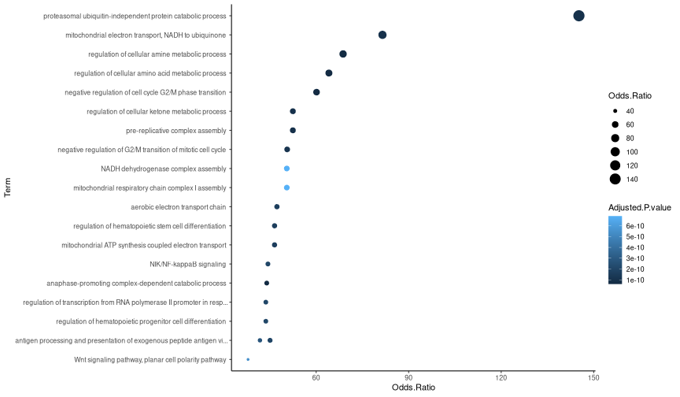


```r
# Plot downregulated NP1/PEP1 intersection for the first 48h
np1_pep1_down_early %>% 
  mutate(
    Term = str_trunc(str_remove(Term, "\\(GO:\\d+\\)"), 70, "right")
    ) %>%
  filter(Adjusted.P.value < 0.05) %>%
  arrange(desc(Combined.Score)) %>% 
  slice(1:20) %>% 
  ggplot(
    aes(Odds.Ratio, fct_reorder(Term, Odds.Ratio), 
        size = Odds.Ratio, 
        color = Adjusted.P.value)
    ) +
  geom_point() +
  labs(y = "Term") +
  theme_classic()
```

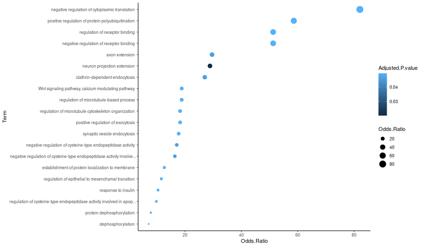


```r
# Plot upregulated NP1/PEP1 intersection for the last timepoints
np1_pep1_up_late %>% 
  mutate(
    Term = str_trunc(str_remove(Term, "\\(GO:\\d+\\)"), 70, "right")
    ) %>%
  filter(Adjusted.P.value < 0.05) %>%
  arrange(desc(Combined.Score)) %>% 
  slice(1:20) %>% 
  ggplot(
    aes(Odds.Ratio, fct_reorder(Term, Odds.Ratio), 
        size = Odds.Ratio, 
        color = Adjusted.P.value)
    ) +
  geom_point() +
  labs(y = "Term") +
  theme_classic()
```

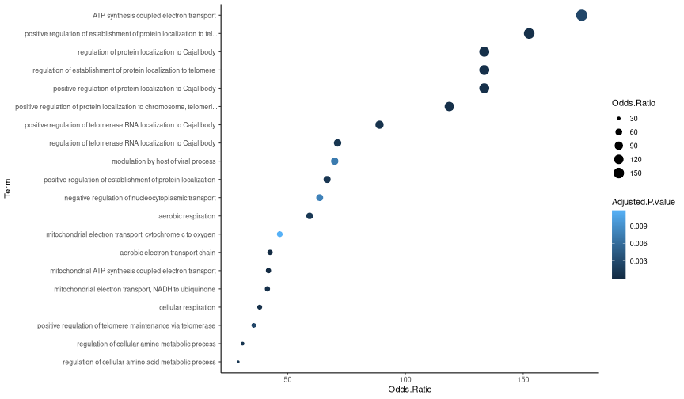


```r
# Plot downregulated NP1/PEP1 intersection for the last timepoints
np1_pep1_down_late %>% 
  mutate(
    Term = str_trunc(str_remove(Term, "\\(GO:\\d+\\)"), 70, "right")
    ) %>%
  filter(Adjusted.P.value < 0.05) %>%
  arrange(desc(Combined.Score)) %>% 
  slice(1:20) %>% 
  ggplot(
    aes(Odds.Ratio, fct_reorder(Term, Odds.Ratio), 
        size = Odds.Ratio, 
        color = Adjusted.P.value)
    ) +
  geom_point() +
  labs(y = "Term") +
  theme_classic()
```

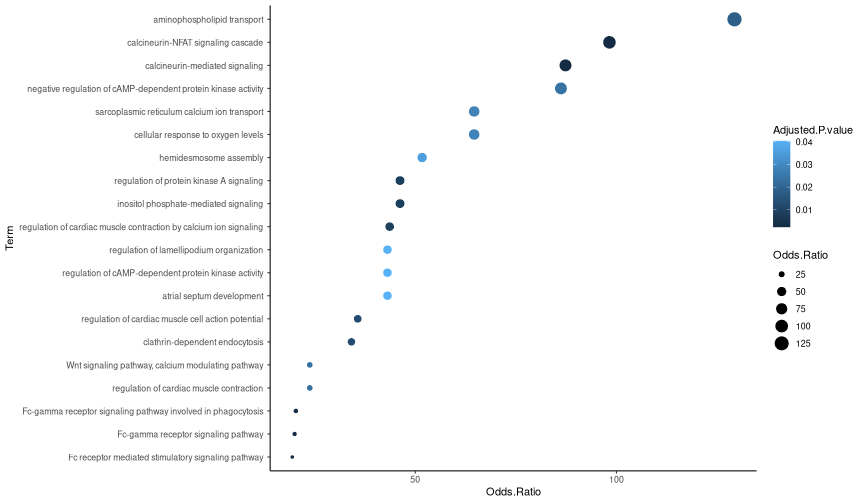

#### Downsample data for fcoex

```r
# Downsample data to smaller size (to avoid memory issues with fcoex)
set.seed(1)

downsampled_cells <-
  neurons@meta.data %>%
  rownames_to_column("cell") %>% 
  group_by(usoskin_id) %>% 
  slice_sample(prop = 0.25) %>% 
  pull("cell")

(small_data <-
  neurons %>% 
  subset(cells = downsampled_cells))
```

```
## An object of class Seurat 
## 32285 features across 1910 samples within 1 assay 
## Active assay: RNA (32285 features, 2000 variable features)
##  5 dimensional reductions calculated: pca, harmony, umap, scpred, scpred_projection
```


```r
# Check downsampled data
(DimPlot(neurons, 
         shuffle = TRUE, 
         label = TRUE, 
         repel = TRUE,
         group.by = "usoskin_id") + 
   NoLegend()) +
  
(DimPlot(small_data, 
         shuffle = TRUE, 
         label = TRUE,
         repel = TRUE,
         group.by = "usoskin_id") + 
   NoLegend()) +
  
   (DimPlot(small_data, 
            shuffle = TRUE, 
            group.by = "treatment")) 
```

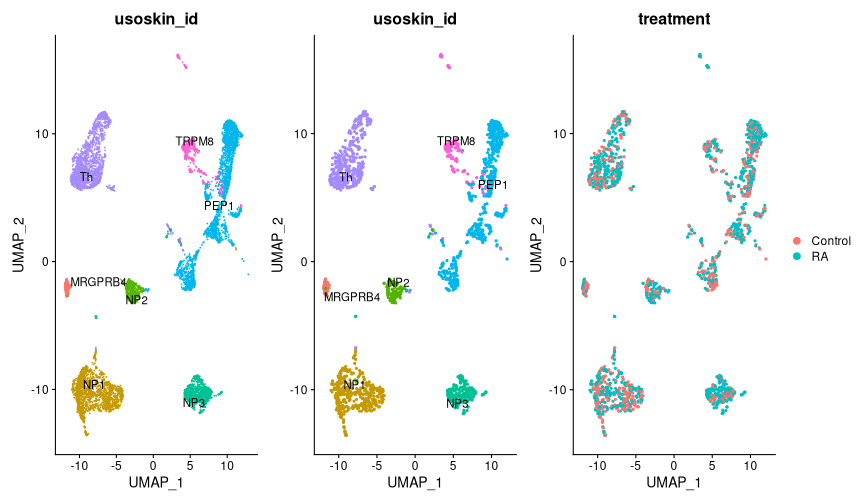

#### FCOEX using all celltypes together and timepoint as target

```r
# Run Fcoex
small_data %<>% set_idents("timepoint_days") 

fc_full <-
  small_data %>% 
  run_fcoex2(n_genes = 250)
```

```
## Created new fcoex object.
```

```
## Getting SU scores
```

```
## Running FCBF to find module headers
```

```
## Calculating adjacency matrix
```

```
## Trimming and getting modules from adjacency matrix
```


```r
# Wrangle fcoex results
mod_genes <- fc_full@module_list

up_genes_total <-
  pseudobulk_up_genes %>% 
  reduce(union)

down_genes_total <-
  pseudobulk_down_genes %>% 
  reduce(union)

up_and_down <- intersect(up_genes_total, down_genes_total)

genes_to_keep <- setdiff(up_genes_total, up_and_down)

mods <-
mod_genes %>% 
  map(~ .x %>% keep(.x %in% genes_to_keep)) %>% 
  keep(~ length(.x) > 5) %>% 
  map(sort)
```


```r
# Plot upset
plot_upset(mods, order = names(mods))
```

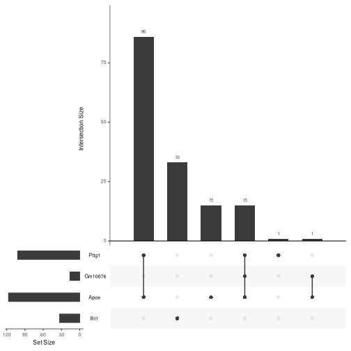


```r
# Heatmap of average Ifit1 module gene expression across timepoints
neurons %>% 
  set_idents("timepoint_days") %>%
  ScaleData(features = rownames(neurons)) %>%
  AverageExpression(return.seurat = TRUE) %>% 
  set_cluster_order(c(0, 0.25, 0.5, 1, 2, 12, 33, 63)) %>% 
  DoHeatmap(features = mods$Ifit1, draw.lines = FALSE) 
```

```
## Centering and scaling data matrix
## Centering and scaling data matrix
```

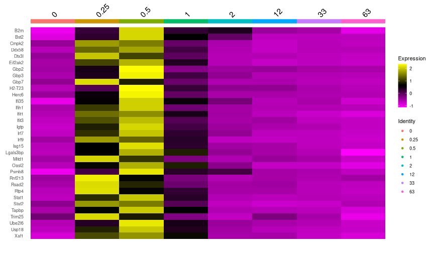


```r
# Plot Ifit1 module for all celltypes individually
plot_modules_ifit1("NP1") +
  plot_modules_ifit1("NP2") +
  plot_modules_ifit1("NP3") +
  plot_modules_ifit1("Th") +
  plot_modules_ifit1("PEP1") +
  plot_modules_ifit1("TRPM8") +
  plot_modules_ifit1("MRGPRB4")
```

```
## Centering and scaling data matrix
## Centering and scaling data matrix
## Centering and scaling data matrix
## Centering and scaling data matrix
## Centering and scaling data matrix
## Centering and scaling data matrix
## Centering and scaling data matrix
## Centering and scaling data matrix
## Centering and scaling data matrix
## Centering and scaling data matrix
## Centering and scaling data matrix
## Centering and scaling data matrix
## Centering and scaling data matrix
## Centering and scaling data matrix
```

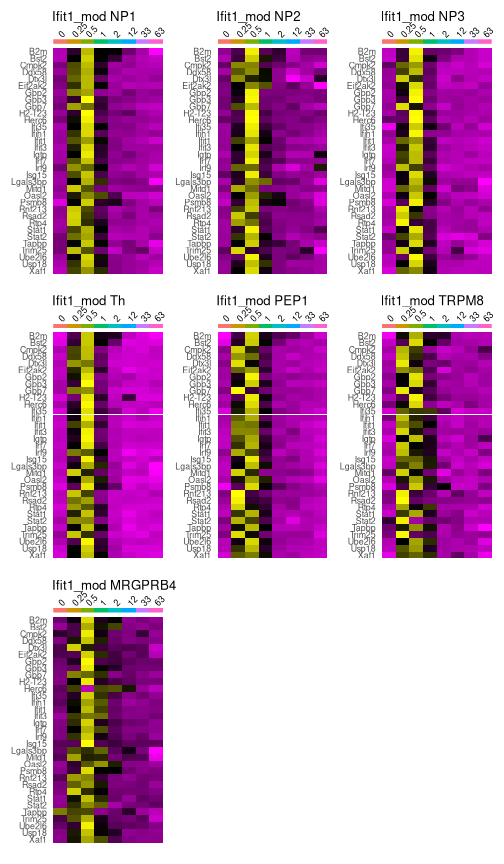


```r
# Heatmap of average Apoe module gene expression across timepoints
neurons %>% 
  set_idents("timepoint_days") %>%
  ScaleData(features = rownames(neurons)) %>%
  AverageExpression(return.seurat = TRUE) %>% 
  set_cluster_order(c(0, 0.25, 0.5, 1, 2, 12, 33, 63)) %>% 
  DoHeatmap(features = mods$Apoe, draw.lines = FALSE) 
```

```
## Centering and scaling data matrix
## Centering and scaling data matrix
```

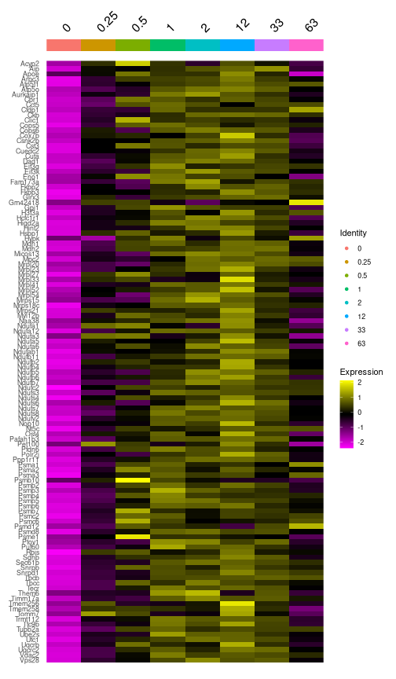


```r
# Plot Apoe module for all celltypes individually
plot_modules_apoe("NP1") +
  plot_modules_apoe("NP2") +
  plot_modules_apoe("NP3") +
  plot_modules_apoe("Th") +
  plot_modules_apoe("PEP1") +
  plot_modules_apoe("TRPM8") +
  plot_modules_apoe("MRGPRB4")
```

```
## Centering and scaling data matrix
## Centering and scaling data matrix
## Centering and scaling data matrix
## Centering and scaling data matrix
## Centering and scaling data matrix
## Centering and scaling data matrix
## Centering and scaling data matrix
## Centering and scaling data matrix
## Centering and scaling data matrix
## Centering and scaling data matrix
## Centering and scaling data matrix
## Centering and scaling data matrix
## Centering and scaling data matrix
## Centering and scaling data matrix
```

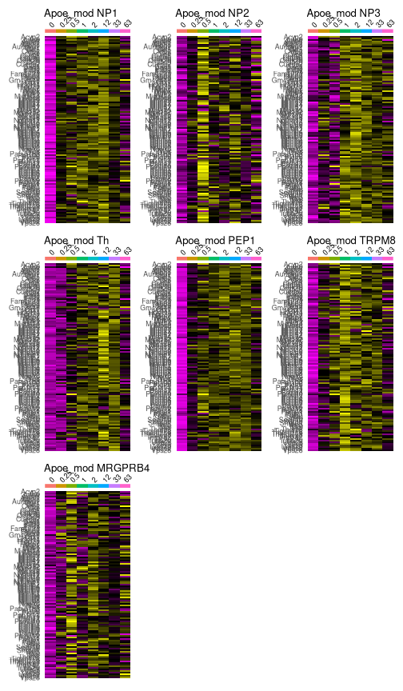


```r
# Save module object
saveRDS(fc_full, file = here::here("data", "proc", "fcoex_full_250genes.rds"))
```


```r
# Run enrichr
go_modules <-
  mod_genes %>% 
  map(~ .x %>% keep(.x %in% genes_to_keep)) %>% 
  keep(~ length(.x) > 5) %>% 
  map(get_enriched, dbs_vector = "GO_Biological_Process_2021")
```

```
## Uploading data to Enrichr... Done.
##   Querying GO_Biological_Process_2021... Done.
## Parsing results... Done.
## Uploading data to Enrichr... Done.
##   Querying GO_Biological_Process_2021... Done.
## Parsing results... Done.
## Uploading data to Enrichr... Done.
##   Querying GO_Biological_Process_2021... Done.
## Parsing results... Done.
## Uploading data to Enrichr... Done.
##   Querying GO_Biological_Process_2021... Done.
## Parsing results... Done.
```


```r
# Remove redundant terms using Revigo
# http://revigo.irb.hr/

# go_modules[[1]][[1]] %>% 
#   mutate(GO = str_extract(Term, "GO:\\d+")) %>%
#   mutate(combo = paste(GO, Adjusted.P.value, sep = " ")) %>% 
#   pull(combo) %>% print_gene_list_from_vector() <- copy/paste to the website

revigo_ifit1 <- 
  read.delim("/crex/proj/uppstore2017283/jussi/Su2022/revigo_ifit1_small_new.tsv") %>% 
  filter(Eliminated == "False")

revigo_apoe <- 
  read.delim("/crex/proj/uppstore2017283/jussi/Su2022/revigo_apoe_small_new.tsv") %>% 
  filter(Eliminated == "False")

go_modules[[1]][[1]] %<>% 
  mutate(GO = str_extract(Term, "GO:\\d+")) %>%
  mutate(combo = paste(GO, Adjusted.P.value, sep = " ")) %>% 
  semi_join(revigo_ifit1, by = c("GO" = "TermID"))

go_modules[[2]][[1]] %<>% 
  mutate(GO = str_extract(Term, "GO:\\d+")) %>%
  mutate(combo = paste(GO, Adjusted.P.value, sep = " ")) %>% 
  semi_join(revigo_apoe, by = c("GO" = "TermID"))
```


```r
# Plot GOs for Ifit1 module
go_modules[[1]][[1]] %>% 
  mutate(
    Term = str_trunc(str_remove(Term, "\\(GO:\\d+\\)"), 70, "right")
    ) %>%
  filter(Adjusted.P.value < 0.05) %>%
  arrange(desc(Combined.Score)) %>% 
  slice(1:20) %>% 
  ggplot(
    aes(Odds.Ratio, fct_reorder(Term, Odds.Ratio), 
        size = Odds.Ratio, 
        color = Adjusted.P.value)
    ) +
  geom_point() +
  labs(y = "Term") +
  theme_classic()
```

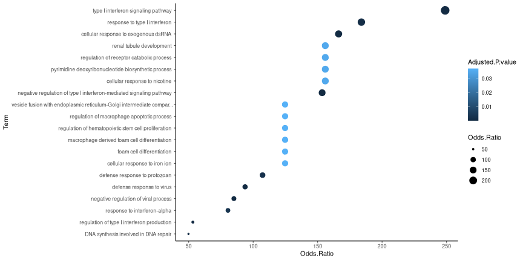


```r
# Plot GOs for Apoe module
go_modules[[2]][[1]] %>% 
  mutate(
    Term = str_trunc(str_remove(Term, "\\(GO:\\d+\\)"), 70, "right")
    ) %>%
  filter(Adjusted.P.value < 0.05) %>%
  arrange(desc(Combined.Score)) %>% 
  slice(1:20) %>% 
  ggplot(
    aes(Odds.Ratio, fct_reorder(Term, Odds.Ratio), 
        size = Odds.Ratio, 
        color = Adjusted.P.value)
    ) +
  geom_point() +
  labs(y = "Term") +
  theme_classic()
```

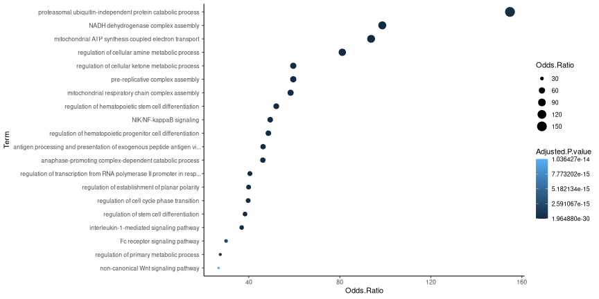


```r
# Create module scores
for (i in seq_along(mods)) {
  neurons %<>% 
    AddModuleScore(features = list(mods[[i]]), name = paste0(names(mods[i]), "_"))
}
```


```r
# Plot module scores for Ifit1
neurons@meta.data %>% 
  ggplot(aes(factor(timepoint_days), Ifit1_1, fill = usoskin_id)) +
  geom_boxplot(outlier.shape = NA) +
  facet_wrap(vars(usoskin_id)) +
  cowplot::theme_cowplot() +
  labs(x = "Timepoint in days", y = "Gene module score", fill = "Neuron type")
```

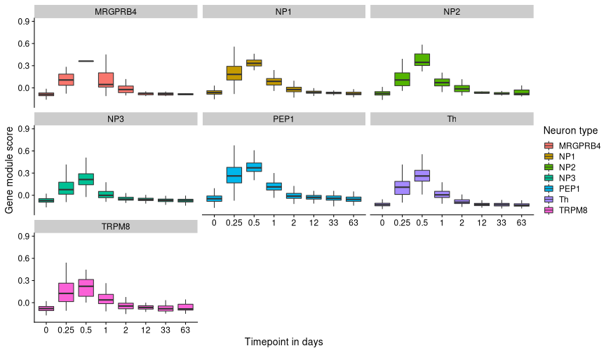


```r
# Plot module scores for Apoe
neurons@meta.data %>% 
  ggplot(aes(factor(timepoint_days), Apoe_1, fill = usoskin_id)) +
  geom_boxplot(outlier.shape = NA) +
  facet_wrap(vars(usoskin_id)) +
  cowplot::theme_cowplot() +
  labs(x = "Timepoint", y = "Module score", fill = "Neuron type")
```

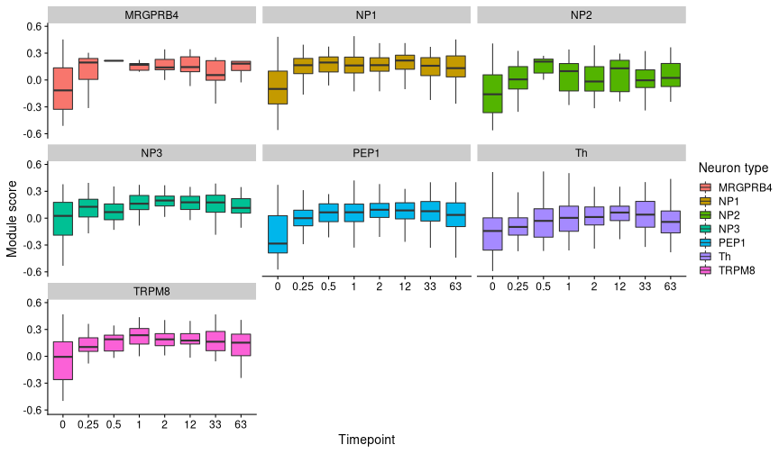


```r
# Plot two highly induced genes that are not part of the Ifit1 module
VlnPlot(neurons, c("Lcn2", "Saa3"), group.by = "timepoint_days", pt.size = 0, log = TRUE)
```

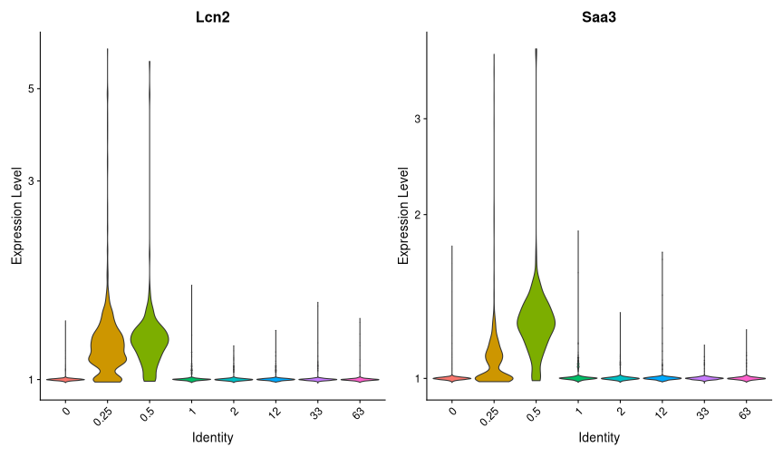

#### Augur: Perturbation analysis

```r
# Add needed columns to metadata for running Augur
neurons@meta.data %<>%
  mutate(
    cell_type = as.character(neurons@meta.data$usoskin_id),
    label = factor(timepoint_days))
```


```r
# Get a list of mouse protein coding genes excluding Y chromosome

# https://www.ensembl.org/biomart/martview/766d94f98a348ad7b78782227f808ad4
mouse_genes <- readRDS(here::here("data", "ref", "mouse_genes_ensembl.rds"))

genes_use <-
  mouse_genes  %>% 
  filter(
    Gene.name != "",
    Gene.type == "protein_coding",
    Chromosome.scaffold.name != "Y"
  )  %>% 
  pull(Gene.name)
```


```r
# Filter data and create a new Seurat object
neurons2 <- as.matrix(GetAssayData(neurons, slot = "counts"))
neurons2 <- neurons2[row.names(neurons) %in% genes_use, ]

neurons2 %<>%  
  CreateSeuratObject() %>% 
  NormalizeData() %>% 
  FindVariableFeatures() %>% 
  ScaleData() %>% 
  RunPCA(npcs = 100, verbose = TRUE)
```

```
## Centering and scaling data matrix
```

```
## PC_ 1 
## Positive:  Scg2, Celf4, Ptprn, Jun, Bdnf, Gap43, Trpv1, Maged1, Ift122, Calca 
## 	   Tmem176a, Sox4, Atp2b4, Adcyap1, Gpx3, Ntrk1, Tmem176b, Gfra3, Gadd45g, Tmem100 
## 	   S100a11, Stac, Zeb2, Steap3, Klf6, S1pr3, Arhgap15, Rnase4, Etl4, Timeless 
## Negative:  Casz1, Gfra2, Zfhx3, Dpp10, Rasgrp1, Tafa4, Kcnd3, Rgs10, Gabra1, P2ry1 
## 	   Tox3, Piezo2, Phf24, Gm7271, Paqr5, Slc24a2, Osbpl1a, Tmem132e, Rph3a, Asap1 
## 	   Cplx1, Cdk15, Atp2b2, Lingo1, Rgs8, Lhfpl3, Sncb, Ppm1e, Fat3, Zfp703 
## PC_ 2 
## Positive:  Tmem233, Gna14, Adk, Prkca, Carhsp1, Pop5, Plxnc1, Cd55, Tmem79, Plcb3 
## 	   Unc13c, Aprt, Slc9a3r2, Actn1, Nt5e, Klf5, Smim5, Dgkz, Gng2, Tmem45b 
## 	   Snx7, A3galt2, Ctxn3, Cd82, Arpc1b, Prkcd, Cd24a, Rhov, Scn11a, Acpp 
## Negative:  Sv2a, Selenom, Plxna4, Tagln3, Nrip3, Shisa4, Fbxo2, Arhgdig, Chd5, Fxyd6 
## 	   Atp11a, Ache, Unc80, Gprasp2, Spock1, Nmt2, Gpr162, Egfl7, Gstm1, Adcyap1 
## 	   Ckmt1, Mettl27, Ngfr, Pcdh10, Ndrg2, Pcp4, Insyn1, Osbpl6, Alcam, Pkn1 
## PC_ 3 
## Positive:  Prkar2b, Nefl, Cd44, Rgs7, Mt3, Calcb, Rab27b, Basp1, Anks1b, Aplp2 
## 	   Mrgprd, Ptprt, Ly86, Prkcq, Lrrc8b, Nefm, Cnn3, Lpar3, Tspan5, Ctxn3 
## 	   Rspo2, Higd1a, Serping1, Kcnma1, Agtr1a, Lcp1, Plcxd3, Otoa, St8sia3, Syt7 
## Negative:  Nppb, Htr1f, Il31ra, Npy2r, Nts, Hpcal1, Gm525, Ptprk, Sst, Cysltr2 
## 	   Ada, Tesc, Ildr2, Pde4c, Jak1, Gpr139, Osmr, Fam178b, Col18a1, P2rx2 
## 	   Nsg1, Cmtm7, Cavin1, Htr1a, Ptafr, Gstt2, Fam210b, S1pr1, B3galnt1, Trpm6 
## PC_ 4 
## Positive:  Foxp2, Ntm, Plcd4, Ndst4, Kcnk9, Abi3bp, Pcdh9, Negr1, Ndrg1, Cdh8 
## 	   Trpm8, Slitrk3, Cpxm2, Tox, Sv2b, Pcdh19, Hpca, Hjurp, Klhl13, Slc2a13 
## 	   Sptb, Hs3st1, Angpt4, Cxxc5, Fndc5, Gsg1l, Tceal6, Sulf2, Gpr26, Asic1 
## Negative:  S100a13, Pmp22, Cd24a, Ngfr, Dclk1, Fgf1, Klhdc8a, S1pr3, Scn11a, Tmem100 
## 	   Samsn1, Bcl11b, Smpd3, Emp3, Etv5, Calca, Kit, Ptgir, Litaf, Fxyd2 
## 	   Galr1, Ptprd, Nmb, Hoxd1, Crip2, Nrp1, Cpne4, Nptx1, Nxn, Kcng2 
## PC_ 5 
## Positive:  Mgst3, Tmem158, Rnh1, Fdps, Ptprt, Pde1a, Higd1a, Kcnc4, Txn1, Sstr2 
## 	   Ubb, H2-K1, Avpr1a, Lrp1b, Caln1, 1700011L22Rik, Slc29a1, Ptprm, Tnxb, B2m 
## 	   Ier3, Tmc5, Ctsl, Ppp1r14a, Psmb8, Serhl, Gnb4, Ptprd, Kcng2, Thsd7a 
## Negative:  Vat1l, Pde1c, Cdhr1, Capn5, Dock5, Epha5, Gda, Rspo1, Gfra1, Mrgpra3 
## 	   Pcp4l1, Cpne4, Ovol2, Nfib, Htr3a, Ngfr, Lsamp, Fgf1, Pear1, Etv1 
## 	   Phactr2, Cfap61, Kcnv1, Ltbp3, Mob3b, Plagl1, S100b, Alcam, Smyd3, Plxna2
```

```r
neurons2@meta.data <-
  neurons2@meta.data %>% 
  select(-orig.ident) %>% 
  bind_cols(
    neurons@meta.data %>% 
      select(label, cell_type, orig.ident, treatment)
  )
```


```r
# Check, ok
neurons2@meta.data %>% select(label, cell_type, treatment)
```

```
##                                                label cell_type treatment
## AATGACCGTCACTCAA-1_1_1_1_1_1_1_1_1_1_1_1_1_1_1     0     TRPM8   Control
## GGATCTAGTGGTCCGT-1_1_1_1_1_1_1_1_1_1_1_1_1_1_1     0      PEP1   Control
## TCATCCGTCGCACGAC-1_1_1_1_1_1_1_1_1_1_1_1_1_1_1     0     TRPM8   Control
## ATTACTCCAAGAAACT-1_2_1_1_1_1_1_1_1_1_1_1_1_1_1     0     TRPM8   Control
## ATTTCACAGCCGCTTG-1_2_1_1_1_1_1_1_1_1_1_1_1_1_1     0     TRPM8   Control
## CGAGGAATCTCGTGAA-1_2_1_1_1_1_1_1_1_1_1_1_1_1_1     0     TRPM8   Control
## GATCACAGTGTACGCC-1_2_1_1_1_1_1_1_1_1_1_1_1_1_1     0     TRPM8   Control
## GGGATGATCGGTATGT-1_2_1_1_1_1_1_1_1_1_1_1_1_1_1     0     TRPM8   Control
## TCGACGGCAATTGAAG-1_2_1_1_1_1_1_1_1_1_1_1_1_1_1     0     TRPM8   Control
## AAACGCTAGATGACAT-1_1_1_1_1_1_1_1_1_1_1_1_1_1       0       NP1   Control
## AAACGCTGTACGCTAT-1_1_1_1_1_1_1_1_1_1_1_1_1_1       0      PEP1   Control
## AAAGAACTCCGTCCTA-1_1_1_1_1_1_1_1_1_1_1_1_1_1       0       NP1   Control
## AAAGAACTCTTCCACG-1_1_1_1_1_1_1_1_1_1_1_1_1_1       0       NP1   Control
## AAAGGATTCTAGACCA-1_1_1_1_1_1_1_1_1_1_1_1_1_1       0        Th   Control
## AAAGGGCAGACTAGAT-1_1_1_1_1_1_1_1_1_1_1_1_1_1       0        Th   Control
## AAAGGGCGTTTGACAC-1_1_1_1_1_1_1_1_1_1_1_1_1_1       0       NP1   Control
## AAAGGGCTCCTACAAG-1_1_1_1_1_1_1_1_1_1_1_1_1_1       0       NP2   Control
## AAAGGTACATCACCAA-1_1_1_1_1_1_1_1_1_1_1_1_1_1       0      PEP1   Control
## AAAGTGACAAACTAGA-1_1_1_1_1_1_1_1_1_1_1_1_1_1       0   MRGPRB4   Control
## AAAGTGACACTTCATT-1_1_1_1_1_1_1_1_1_1_1_1_1_1       0      PEP1   Control
## AAATGGAGTTCAGTAC-1_1_1_1_1_1_1_1_1_1_1_1_1_1       0     TRPM8   Control
## AACAGGGAGGATAATC-1_1_1_1_1_1_1_1_1_1_1_1_1_1       0       NP1   Control
## AACCAACTCAGCAGAG-1_1_1_1_1_1_1_1_1_1_1_1_1_1       0       NP1   Control
## AACCACAAGGAGCTGT-1_1_1_1_1_1_1_1_1_1_1_1_1_1       0       NP3   Control
## AACCATGAGAATCGCG-1_1_1_1_1_1_1_1_1_1_1_1_1_1       0       NP2   Control
## AACCATGGTCCCTGTT-1_1_1_1_1_1_1_1_1_1_1_1_1_1       0       NP1   Control
## AACCCAACAGGTTCCG-1_1_1_1_1_1_1_1_1_1_1_1_1_1       0       NP2   Control
## AACCTGAAGTGGTCAG-1_1_1_1_1_1_1_1_1_1_1_1_1_1       0       NP1   Control
## AACGAAATCCCGGTAG-1_1_1_1_1_1_1_1_1_1_1_1_1_1       0       NP1   Control
## AACGGGAAGACCACGA-1_1_1_1_1_1_1_1_1_1_1_1_1_1       0        Th   Control
## AACGGGACATTGGATC-1_1_1_1_1_1_1_1_1_1_1_1_1_1       0     TRPM8   Control
## AACGGGAGTAGGAAAG-1_1_1_1_1_1_1_1_1_1_1_1_1_1       0       NP2   Control
## AACGGGAGTCTAACTG-1_1_1_1_1_1_1_1_1_1_1_1_1_1       0      PEP1   Control
## AACGTCAAGTCTCGTA-1_1_1_1_1_1_1_1_1_1_1_1_1_1       0      PEP1   Control
## AACTTCTCACACTTAG-1_1_1_1_1_1_1_1_1_1_1_1_1_1       0       NP1   Control
## AAGAACAAGTATGAAC-1_1_1_1_1_1_1_1_1_1_1_1_1_1       0      PEP1   Control
## AAGAACATCGACTCCT-1_1_1_1_1_1_1_1_1_1_1_1_1_1       0       NP1   Control
## AAGACAACAGCTGAAG-1_1_1_1_1_1_1_1_1_1_1_1_1_1       0      PEP1   Control
## AAGATAGCAAACCACT-1_1_1_1_1_1_1_1_1_1_1_1_1_1       0       NP3   Control
## AAGATAGCATGCGTGC-1_1_1_1_1_1_1_1_1_1_1_1_1_1       0       NP3   Control
## AAGCCATAGGTTCCGC-1_1_1_1_1_1_1_1_1_1_1_1_1_1       0      PEP1   Control
## AAGCCATGTCTAGGCC-1_1_1_1_1_1_1_1_1_1_1_1_1_1       0       NP1   Control
## AAGCGAGCACTATCCC-1_1_1_1_1_1_1_1_1_1_1_1_1_1       0       NP3   Control
## AAGCGAGGTCAGGCAA-1_1_1_1_1_1_1_1_1_1_1_1_1_1       0     TRPM8   Control
## AAGCGTTGTCGTTTCC-1_1_1_1_1_1_1_1_1_1_1_1_1_1       0        Th   Control
## AAGCGTTGTGCCTGCA-1_1_1_1_1_1_1_1_1_1_1_1_1_1       0        Th   Control
## AAGCGTTGTTGCGAAG-1_1_1_1_1_1_1_1_1_1_1_1_1_1       0       NP2   Control
## AAGGAATGTTCGTTCC-1_1_1_1_1_1_1_1_1_1_1_1_1_1       0       NP1   Control
## AAGGAATTCGGCGATC-1_1_1_1_1_1_1_1_1_1_1_1_1_1       0       NP2   Control
## AAGTGAAAGCGTCAGA-1_1_1_1_1_1_1_1_1_1_1_1_1_1       0       NP3   Control
## AAGTGAACACCAGTTA-1_1_1_1_1_1_1_1_1_1_1_1_1_1       0       NP1   Control
## AAGTGAACATATGAAG-1_1_1_1_1_1_1_1_1_1_1_1_1_1       0       NP2   Control
## AAGTTCGAGTAGAGTT-1_1_1_1_1_1_1_1_1_1_1_1_1_1       0       NP1   Control
## AATAGAGAGATCGCCC-1_1_1_1_1_1_1_1_1_1_1_1_1_1       0       NP1   Control
## AATCACGCACCCTAGG-1_1_1_1_1_1_1_1_1_1_1_1_1_1       0      PEP1   Control
## AATCACGTCATCTCTA-1_1_1_1_1_1_1_1_1_1_1_1_1_1       0       NP1   Control
## AATCACGTCCGATAAC-1_1_1_1_1_1_1_1_1_1_1_1_1_1       0       NP3   Control
## AATCGACGTAAGACCG-1_1_1_1_1_1_1_1_1_1_1_1_1_1       0       NP1   Control
## AATCGTGGTGTTCCTC-1_1_1_1_1_1_1_1_1_1_1_1_1_1       0        Th   Control
## AATGAAGAGAGTGTTA-1_1_1_1_1_1_1_1_1_1_1_1_1_1       0       NP1   Control
## AATGAAGTCTCTCTTC-1_1_1_1_1_1_1_1_1_1_1_1_1_1       0   MRGPRB4   Control
## AATGACCGTAACTGCT-1_1_1_1_1_1_1_1_1_1_1_1_1_1       0       NP3   Control
## AATGACCTCACCTGTC-1_1_1_1_1_1_1_1_1_1_1_1_1_1       0       NP1   Control
## AATGGAAAGTGTAGTA-1_1_1_1_1_1_1_1_1_1_1_1_1_1       0       NP2   Control
## AATGGCTCACTTTAGG-1_1_1_1_1_1_1_1_1_1_1_1_1_1       0      PEP1   Control
## AATGGCTGTCTACTGA-1_1_1_1_1_1_1_1_1_1_1_1_1_1       0      PEP1   Control
## AATTCCTCACTCCGAG-1_1_1_1_1_1_1_1_1_1_1_1_1_1       0      PEP1   Control
## ACAACCACACGAGGTA-1_1_1_1_1_1_1_1_1_1_1_1_1_1       0      PEP1   Control
## ACAACCATCTTAGCTT-1_1_1_1_1_1_1_1_1_1_1_1_1_1       0       NP1   Control
## ACACAGTAGGGAGGTG-1_1_1_1_1_1_1_1_1_1_1_1_1_1       0       NP1   Control
## ACACCAAAGGTGAGAA-1_1_1_1_1_1_1_1_1_1_1_1_1_1       0       NP1   Control
## ACACCAATCCTGATAG-1_1_1_1_1_1_1_1_1_1_1_1_1_1       0       NP1   Control
## ACACGCGGTATCGAGG-1_1_1_1_1_1_1_1_1_1_1_1_1_1       0       NP1   Control
## ACACTGACACCATATG-1_1_1_1_1_1_1_1_1_1_1_1_1_1       0       NP1   Control
## ACACTGATCAAGCGTT-1_1_1_1_1_1_1_1_1_1_1_1_1_1       0      PEP1   Control
## ACACTGATCCATCCGT-1_1_1_1_1_1_1_1_1_1_1_1_1_1       0        Th   Control
## ACATCCCAGTTGGGAC-1_1_1_1_1_1_1_1_1_1_1_1_1_1       0      PEP1   Control
## ACATCCCCACTTCTCG-1_1_1_1_1_1_1_1_1_1_1_1_1_1       0      PEP1   Control
## ACATCCCTCGGCTTGG-1_1_1_1_1_1_1_1_1_1_1_1_1_1       0       NP1   Control
## ACATCGAAGACTCTTG-1_1_1_1_1_1_1_1_1_1_1_1_1_1       0      PEP1   Control
## ACATCGACAAGAGCTG-1_1_1_1_1_1_1_1_1_1_1_1_1_1       0       NP1   Control
## ACATCGACATGACTAC-1_1_1_1_1_1_1_1_1_1_1_1_1_1       0       NP2   Control
## ACATGCAAGATAACGT-1_1_1_1_1_1_1_1_1_1_1_1_1_1       0       NP1   Control
## ACATGCAAGCGCGTTC-1_1_1_1_1_1_1_1_1_1_1_1_1_1       0       NP1   Control
## ACCAAACCAATAACCC-1_1_1_1_1_1_1_1_1_1_1_1_1_1       0        Th   Control
## ACCAACACAACGGGTA-1_1_1_1_1_1_1_1_1_1_1_1_1_1       0       NP1   Control
## ACCAACACACTACACA-1_1_1_1_1_1_1_1_1_1_1_1_1_1       0       NP1   Control
## ACCAACAGTCCACTTC-1_1_1_1_1_1_1_1_1_1_1_1_1_1       0       NP1   Control
## ACCAACATCCAGGACC-1_1_1_1_1_1_1_1_1_1_1_1_1_1       0       NP3   Control
## ACCACAACACAGTATC-1_1_1_1_1_1_1_1_1_1_1_1_1_1       0       NP1   Control
## ACCACAAGTCAGATTC-1_1_1_1_1_1_1_1_1_1_1_1_1_1       0       NP1   Control
## ACCCAAAAGTTGCCTA-1_1_1_1_1_1_1_1_1_1_1_1_1_1       0        Th   Control
## ACCCAAACAAATCAAG-1_1_1_1_1_1_1_1_1_1_1_1_1_1       0       NP1   Control
## ACCCTCAAGCGTTACT-1_1_1_1_1_1_1_1_1_1_1_1_1_1       0       NP3   Control
## ACCCTCACAAGATCCT-1_1_1_1_1_1_1_1_1_1_1_1_1_1       0      PEP1   Control
## ACCCTCAGTATTTCTC-1_1_1_1_1_1_1_1_1_1_1_1_1_1       0       NP3   Control
## ACCTGAAAGAGAGCGG-1_1_1_1_1_1_1_1_1_1_1_1_1_1       0       NP1   Control
## ACCTGTCGTAGGTGCA-1_1_1_1_1_1_1_1_1_1_1_1_1_1       0       NP3   Control
## ACCTGTCTCAGCCCAG-1_1_1_1_1_1_1_1_1_1_1_1_1_1       0       NP1   Control
## ACGATCATCATTCACT-1_1_1_1_1_1_1_1_1_1_1_1_1_1       0      PEP1   Control
## ACGATGTTCAACTGAC-1_1_1_1_1_1_1_1_1_1_1_1_1_1       0   MRGPRB4   Control
## ACGCACGAGTAGACCG-1_1_1_1_1_1_1_1_1_1_1_1_1_1       0      PEP1   Control
## ACGCACGGTAGGCAGT-1_1_1_1_1_1_1_1_1_1_1_1_1_1       0       NP1   Control
## ACGCACGTCCGGCTTT-1_1_1_1_1_1_1_1_1_1_1_1_1_1       0       NP1   Control
## ACGGAAGGTTAGTTCG-1_1_1_1_1_1_1_1_1_1_1_1_1_1       0     TRPM8   Control
## ACGGAAGGTTTCTATC-1_1_1_1_1_1_1_1_1_1_1_1_1_1       0      PEP1   Control
## ACGGAAGTCGAACGCC-1_1_1_1_1_1_1_1_1_1_1_1_1_1       0        Th   Control
## ACGGAAGTCTTTGATC-1_1_1_1_1_1_1_1_1_1_1_1_1_1       0      PEP1   Control
## ACGGGTCAGCAAGCCA-1_1_1_1_1_1_1_1_1_1_1_1_1_1       0       NP2   Control
## ACGGGTCTCGTAGGAG-1_1_1_1_1_1_1_1_1_1_1_1_1_1       0       NP2   Control
## ACGGGTCTCTTGATTC-1_1_1_1_1_1_1_1_1_1_1_1_1_1       0      PEP1   Control
## ACGGTTACAACCAACT-1_1_1_1_1_1_1_1_1_1_1_1_1_1       0      PEP1   Control
## ACGGTTATCAAGTCTG-1_1_1_1_1_1_1_1_1_1_1_1_1_1       0       NP1   Control
## ACGGTTATCGGATTAC-1_1_1_1_1_1_1_1_1_1_1_1_1_1       0       NP1   Control
## ACGTAACGTATGTCCA-1_1_1_1_1_1_1_1_1_1_1_1_1_1       0      PEP1   Control
## ACGTAACTCATTTGGG-1_1_1_1_1_1_1_1_1_1_1_1_1_1       0       NP2   Control
## ACGTACACAACAAGTA-1_1_1_1_1_1_1_1_1_1_1_1_1_1       0      PEP1   Control
## ACGTAGTAGGCGTTAG-1_1_1_1_1_1_1_1_1_1_1_1_1_1       0       NP1   Control
## ACGTTCCCAACCCTAA-1_1_1_1_1_1_1_1_1_1_1_1_1_1       0     TRPM8   Control
## ACTACGATCATCGCAA-1_1_1_1_1_1_1_1_1_1_1_1_1_1       0       NP1   Control
## ACTATCTAGACGGTTG-1_1_1_1_1_1_1_1_1_1_1_1_1_1       0       NP1   Control
## ACTATTCCATGTGCCG-1_1_1_1_1_1_1_1_1_1_1_1_1_1       0       NP2   Control
## ACTATTCGTTGTGCCG-1_1_1_1_1_1_1_1_1_1_1_1_1_1       0      PEP1   Control
## ACTCCCAAGCAGTAAT-1_1_1_1_1_1_1_1_1_1_1_1_1_1       0      PEP1   Control
## ACTCCCACATAGGTAA-1_1_1_1_1_1_1_1_1_1_1_1_1_1       0      PEP1   Control
## ACTCTCGGTAGCTGTT-1_1_1_1_1_1_1_1_1_1_1_1_1_1       0      PEP1   Control
## ACTGATGCACGGCCAT-1_1_1_1_1_1_1_1_1_1_1_1_1_1       0       NP1   Control
## ACTGATGGTCGGCCTA-1_1_1_1_1_1_1_1_1_1_1_1_1_1       0      PEP1   Control
## ACTGATGTCATAGAGA-1_1_1_1_1_1_1_1_1_1_1_1_1_1       0       NP2   Control
## ACTGTCCAGGAAAGAC-1_1_1_1_1_1_1_1_1_1_1_1_1_1       0        Th   Control
## ACTGTCCAGGCGTTGA-1_1_1_1_1_1_1_1_1_1_1_1_1_1       0       NP3   Control
## ACTTAGGCAAGACCTT-1_1_1_1_1_1_1_1_1_1_1_1_1_1       0        Th   Control
## ACTTAGGGTCCACACG-1_1_1_1_1_1_1_1_1_1_1_1_1_1       0       NP1   Control
## ACTTATCCATCGGATT-1_1_1_1_1_1_1_1_1_1_1_1_1_1       0     TRPM8   Control
## ACTTATCGTCATAACC-1_1_1_1_1_1_1_1_1_1_1_1_1_1       0       NP3   Control
## ACTTTCACATCTTTCA-1_1_1_1_1_1_1_1_1_1_1_1_1_1       0       NP3   Control
## ACTTTGTCATTCCTCG-1_1_1_1_1_1_1_1_1_1_1_1_1_1       0       NP1   Control
## AGAAATGCACTGGAAG-1_1_1_1_1_1_1_1_1_1_1_1_1_1       0       NP3   Control
## AGAACAACAGACCAGA-1_1_1_1_1_1_1_1_1_1_1_1_1_1       0      PEP1   Control
## AGAACAAGTCTTGTCC-1_1_1_1_1_1_1_1_1_1_1_1_1_1       0     TRPM8   Control
## AGAACCTAGTTTCTTC-1_1_1_1_1_1_1_1_1_1_1_1_1_1       0      PEP1   Control
## AGAACCTCAAATGGCG-1_1_1_1_1_1_1_1_1_1_1_1_1_1       0       NP1   Control
## AGAACCTTCGGTAAGG-1_1_1_1_1_1_1_1_1_1_1_1_1_1       0       NP2   Control
## AGACAAAGTGCCGAAA-1_1_1_1_1_1_1_1_1_1_1_1_1_1       0        Th   Control
## AGACAAATCGAATCCA-1_1_1_1_1_1_1_1_1_1_1_1_1_1       0        Th   Control
## AGACACTAGTCGAAGC-1_1_1_1_1_1_1_1_1_1_1_1_1_1       0       NP3   Control
## AGACAGGGTCAGCTTA-1_1_1_1_1_1_1_1_1_1_1_1_1_1       0      PEP1   Control
## AGACCATCAAAGTGTA-1_1_1_1_1_1_1_1_1_1_1_1_1_1       0       NP2   Control
## AGACCCGCACGCTGAC-1_1_1_1_1_1_1_1_1_1_1_1_1_1       0       NP2   Control
## AGACCCGGTACCTTCC-1_1_1_1_1_1_1_1_1_1_1_1_1_1       0       NP1   Control
## AGAGAATAGCTAGATA-1_1_1_1_1_1_1_1_1_1_1_1_1_1       0       NP1   Control
## AGAGAATCAGACGCTC-1_1_1_1_1_1_1_1_1_1_1_1_1_1       0        Th   Control
## AGAGAATGTAAGGCCA-1_1_1_1_1_1_1_1_1_1_1_1_1_1       0     TRPM8   Control
## AGAGAATTCGTACCTC-1_1_1_1_1_1_1_1_1_1_1_1_1_1       0       NP1   Control
## AGAGCCCCACTCTGCT-1_1_1_1_1_1_1_1_1_1_1_1_1_1       0      PEP1   Control
## AGATAGAGTGTATACC-1_1_1_1_1_1_1_1_1_1_1_1_1_1       0   MRGPRB4   Control
## AGATCCAAGTAGGGTC-1_1_1_1_1_1_1_1_1_1_1_1_1_1       0       NP1   Control
## AGATGCTAGAATACAC-1_1_1_1_1_1_1_1_1_1_1_1_1_1       0      PEP1   Control
## AGATGCTAGATAGTCA-1_1_1_1_1_1_1_1_1_1_1_1_1_1       0      PEP1   Control
## AGCCAATCATGGCCCA-1_1_1_1_1_1_1_1_1_1_1_1_1_1       0       NP3   Control
## AGCCACGTCCATCTGC-1_1_1_1_1_1_1_1_1_1_1_1_1_1       0     TRPM8   Control
## AGCCACGTCGTCTAAG-1_1_1_1_1_1_1_1_1_1_1_1_1_1       0       NP1   Control
## AGCCAGCGTAGCACGA-1_1_1_1_1_1_1_1_1_1_1_1_1_1       0     TRPM8   Control
## AGCGATTCAAACCATC-1_1_1_1_1_1_1_1_1_1_1_1_1_1       0      PEP1   Control
## AGCGCTGAGGCCCACT-1_1_1_1_1_1_1_1_1_1_1_1_1_1       0       NP1   Control
## AGCGTATAGTCTGCGC-1_1_1_1_1_1_1_1_1_1_1_1_1_1       0       NP1   Control
## AGCGTATTCGCACGGT-1_1_1_1_1_1_1_1_1_1_1_1_1_1       0      PEP1   Control
## AGCTACAAGCCTCTTC-1_1_1_1_1_1_1_1_1_1_1_1_1_1       0       NP1   Control
## AGGAAATCATACAGCT-1_1_1_1_1_1_1_1_1_1_1_1_1_1       0      PEP1   Control
## AGGAAATTCGGTATGT-1_1_1_1_1_1_1_1_1_1_1_1_1_1       0      PEP1   Control
## AGGACGAAGGTTACCT-1_1_1_1_1_1_1_1_1_1_1_1_1_1       0     TRPM8   Control
## AGGACGATCCATACTT-1_1_1_1_1_1_1_1_1_1_1_1_1_1       0        Th   Control
## AGGACTTTCAGCAATC-1_1_1_1_1_1_1_1_1_1_1_1_1_1       0       NP1   Control
## AGGAGGTCACAACGAG-1_1_1_1_1_1_1_1_1_1_1_1_1_1       0       NP1   Control
## AGGATAAGTCGTTGCG-1_1_1_1_1_1_1_1_1_1_1_1_1_1       0        Th   Control
## AGGATAATCTCTGACC-1_1_1_1_1_1_1_1_1_1_1_1_1_1       0        Th   Control
## AGGATCTCATTCATCT-1_1_1_1_1_1_1_1_1_1_1_1_1_1       0       NP2   Control
## AGGATCTGTCTTCTAT-1_1_1_1_1_1_1_1_1_1_1_1_1_1       0       NP3   Control
## AGGATCTGTGGAACAC-1_1_1_1_1_1_1_1_1_1_1_1_1_1       0      PEP1   Control
## AGGCATTCACGTAGAG-1_1_1_1_1_1_1_1_1_1_1_1_1_1       0       NP1   Control
## AGGCTGCAGAAGTCAT-1_1_1_1_1_1_1_1_1_1_1_1_1_1       0       NP3   Control
## AGGCTGCGTATCCTCC-1_1_1_1_1_1_1_1_1_1_1_1_1_1       0      PEP1   Control
## AGGCTGCTCATCTACT-1_1_1_1_1_1_1_1_1_1_1_1_1_1       0       NP3   Control
## AGGGCCTCAACCTATG-1_1_1_1_1_1_1_1_1_1_1_1_1_1       0        Th   Control
## AGGGTCCCAAGCTGTT-1_1_1_1_1_1_1_1_1_1_1_1_1_1       0       NP1   Control
## AGGGTCCTCTAAGAAG-1_1_1_1_1_1_1_1_1_1_1_1_1_1       0       NP1   Control
## AGGGTGACATGAGTAA-1_1_1_1_1_1_1_1_1_1_1_1_1_1       0       NP1   Control
## AGGGTGATCGCCAGTG-1_1_1_1_1_1_1_1_1_1_1_1_1_1       0       NP3   Control
## AGGTAGGCAGGATGAC-1_1_1_1_1_1_1_1_1_1_1_1_1_1       0       NP1   Control
## AGGTCATAGTCTAGCT-1_1_1_1_1_1_1_1_1_1_1_1_1_1       0       NP2   Control
## AGGTCATCATTGGGAG-1_1_1_1_1_1_1_1_1_1_1_1_1_1       0      PEP1   Control
## AGGTCTACAAGTGGAC-1_1_1_1_1_1_1_1_1_1_1_1_1_1       0       NP1   Control
## AGGTCTACATCACGGC-1_1_1_1_1_1_1_1_1_1_1_1_1_1       0        Th   Control
## AGGTCTATCCTTCTTC-1_1_1_1_1_1_1_1_1_1_1_1_1_1       0       NP1   Control
## AGTAACCAGCTCCCTT-1_1_1_1_1_1_1_1_1_1_1_1_1_1       0       NP1   Control
## AGTAACCTCACCTCGT-1_1_1_1_1_1_1_1_1_1_1_1_1_1       0       NP1   Control
## AGTACCAAGTTCACTG-1_1_1_1_1_1_1_1_1_1_1_1_1_1       0       NP1   Control
## AGTACCACAGGTCCGT-1_1_1_1_1_1_1_1_1_1_1_1_1_1       0      PEP1   Control
## AGTACTGGTTGGCCGT-1_1_1_1_1_1_1_1_1_1_1_1_1_1       0       NP3   Control
## AGTACTGTCACTTCTA-1_1_1_1_1_1_1_1_1_1_1_1_1_1       0      PEP1   Control
## AGTAGCTTCCATACAG-1_1_1_1_1_1_1_1_1_1_1_1_1_1       0       NP1   Control
## AGTCAACCAATTTCCT-1_1_1_1_1_1_1_1_1_1_1_1_1_1       0       NP2   Control
## AGTCAACTCGCTTACC-1_1_1_1_1_1_1_1_1_1_1_1_1_1       0        Th   Control
## AGTCACACACAACCGC-1_1_1_1_1_1_1_1_1_1_1_1_1_1       0       NP1   Control
## AGTGACTAGCGCCTTG-1_1_1_1_1_1_1_1_1_1_1_1_1_1       0      PEP1   Control
## AGTGCCGCACCGTGCA-1_1_1_1_1_1_1_1_1_1_1_1_1_1       0     TRPM8   Control
## AGTGTTGAGCATCCCG-1_1_1_1_1_1_1_1_1_1_1_1_1_1       0       NP1   Control
## AGTGTTGAGCCTCTGG-1_1_1_1_1_1_1_1_1_1_1_1_1_1       0       NP1   Control
## AGTGTTGAGTCACACT-1_1_1_1_1_1_1_1_1_1_1_1_1_1       0       NP1   Control
## AGTGTTGTCTGCAGCG-1_1_1_1_1_1_1_1_1_1_1_1_1_1       0       NP2   Control
## AGTTAGCAGAGCCTGA-1_1_1_1_1_1_1_1_1_1_1_1_1_1       0        Th   Control
## AGTTAGCAGCGCTGAA-1_1_1_1_1_1_1_1_1_1_1_1_1_1       0       NP1   Control
## AGTTAGCCAAAGCACG-1_1_1_1_1_1_1_1_1_1_1_1_1_1       0       NP1   Control
## AGTTAGCGTGGCTTGC-1_1_1_1_1_1_1_1_1_1_1_1_1_1       0       NP1   Control
## AGTTCCCCAATGTTGC-1_1_1_1_1_1_1_1_1_1_1_1_1_1       0      PEP1   Control
## ATACCTTAGTCGAAAT-1_1_1_1_1_1_1_1_1_1_1_1_1_1       0       NP3   Control
## ATAGACCAGCGACTGA-1_1_1_1_1_1_1_1_1_1_1_1_1_1       0       NP1   Control
## ATAGACCAGTTGCTGT-1_1_1_1_1_1_1_1_1_1_1_1_1_1       0        Th   Control
## ATAGACCCACACACGC-1_1_1_1_1_1_1_1_1_1_1_1_1_1       0       NP1   Control
## ATAGACCGTAGACAAT-1_1_1_1_1_1_1_1_1_1_1_1_1_1       0        Th   Control
## ATAGAGAGTGACAACG-1_1_1_1_1_1_1_1_1_1_1_1_1_1       0       NP1   Control
## ATAGGCTAGAAAGTCT-1_1_1_1_1_1_1_1_1_1_1_1_1_1       0       NP2   Control
## ATAGGCTGTTCTAAGC-1_1_1_1_1_1_1_1_1_1_1_1_1_1       0       NP2   Control
## ATATCCTGTCAAGGCA-1_1_1_1_1_1_1_1_1_1_1_1_1_1       0      PEP1   Control
## ATATCCTGTGACCGTC-1_1_1_1_1_1_1_1_1_1_1_1_1_1       0       NP2   Control
## ATCACTTCATTGTAGC-1_1_1_1_1_1_1_1_1_1_1_1_1_1       0      PEP1   Control
## ATCACTTTCTCGAACA-1_1_1_1_1_1_1_1_1_1_1_1_1_1       0       NP1   Control
## ATCAGGTGTTGGACCC-1_1_1_1_1_1_1_1_1_1_1_1_1_1       0      PEP1   Control
## ATCAGGTTCGTCTCAC-1_1_1_1_1_1_1_1_1_1_1_1_1_1       0       NP2   Control
## ATCATTCGTTCCGCTT-1_1_1_1_1_1_1_1_1_1_1_1_1_1       0       NP2   Control
## ATCCACCAGGTGCCTC-1_1_1_1_1_1_1_1_1_1_1_1_1_1       0       NP2   Control
## ATCCACCCAAATACGA-1_1_1_1_1_1_1_1_1_1_1_1_1_1       0       NP1   Control
## ATCCACCCAGCGTGAA-1_1_1_1_1_1_1_1_1_1_1_1_1_1       0       NP1   Control
## ATCCATTAGTTCCTGA-1_1_1_1_1_1_1_1_1_1_1_1_1_1       0   MRGPRB4   Control
## ATCCATTCACTCTAGA-1_1_1_1_1_1_1_1_1_1_1_1_1_1       0     TRPM8   Control
## ATCCCTGCAATTGAAG-1_1_1_1_1_1_1_1_1_1_1_1_1_1       0       NP2   Control
## ATCCGTCAGGTTCTAC-1_1_1_1_1_1_1_1_1_1_1_1_1_1       0      PEP1   Control
## ATCCGTCGTTGCCGCA-1_1_1_1_1_1_1_1_1_1_1_1_1_1       0       NP2   Control
## ATCCGTCGTTGTACGT-1_1_1_1_1_1_1_1_1_1_1_1_1_1       0      PEP1   Control
## ATCGATGCACCTGAAT-1_1_1_1_1_1_1_1_1_1_1_1_1_1       0      PEP1   Control
## ATCGATGGTAGGTTTC-1_1_1_1_1_1_1_1_1_1_1_1_1_1       0      PEP1   Control
## ATCGATGTCACTCGAA-1_1_1_1_1_1_1_1_1_1_1_1_1_1       0      PEP1   Control
## ATCGCCTGTGGATTTC-1_1_1_1_1_1_1_1_1_1_1_1_1_1       0      PEP1   Control
## ATCGGATCAAGACCGA-1_1_1_1_1_1_1_1_1_1_1_1_1_1       0       NP1   Control
## ATCGGATGTTGGGTAG-1_1_1_1_1_1_1_1_1_1_1_1_1_1       0      PEP1   Control
## ATCGGCGCAAGTCCAT-1_1_1_1_1_1_1_1_1_1_1_1_1_1       0        Th   Control
## ATCGTCCCAGGTACGA-1_1_1_1_1_1_1_1_1_1_1_1_1_1       0       NP1   Control
## ATCTCTATCTAGGCCG-1_1_1_1_1_1_1_1_1_1_1_1_1_1       0       NP2   Control
## ATCTTCATCGCTTTAT-1_1_1_1_1_1_1_1_1_1_1_1_1_1       0       NP2   Control
## ATGAAAGGTCCTTAAG-1_1_1_1_1_1_1_1_1_1_1_1_1_1       0      PEP1   Control
## ATGACCAAGAGCATAT-1_1_1_1_1_1_1_1_1_1_1_1_1_1       0       NP1   Control
## ATGACCAAGTGCCCGT-1_1_1_1_1_1_1_1_1_1_1_1_1_1       0       NP2   Control
## ATGACCACAGAGTTGG-1_1_1_1_1_1_1_1_1_1_1_1_1_1       0      PEP1   Control
## ATGAGTCCATCCTGTC-1_1_1_1_1_1_1_1_1_1_1_1_1_1       0       NP1   Control
## ATGAGTCTCGTAGAGG-1_1_1_1_1_1_1_1_1_1_1_1_1_1       0      PEP1   Control
## ATGATCGCAAGCACCC-1_1_1_1_1_1_1_1_1_1_1_1_1_1       0      PEP1   Control
## ATGATCGGTGAATGAT-1_1_1_1_1_1_1_1_1_1_1_1_1_1       0       NP3   Control
## ATGATCGTCCGGTAGC-1_1_1_1_1_1_1_1_1_1_1_1_1_1       0      PEP1   Control
## ATGCATGCAGTCTGGC-1_1_1_1_1_1_1_1_1_1_1_1_1_1       0       NP1   Control
## ATGCATGGTACTTCCC-1_1_1_1_1_1_1_1_1_1_1_1_1_1       0     TRPM8   Control
## ATGCCTCAGGTCCCGT-1_1_1_1_1_1_1_1_1_1_1_1_1_1       0       NP3   Control
## ATGCCTCTCGTCGCTT-1_1_1_1_1_1_1_1_1_1_1_1_1_1       0        Th   Control
## ATGGAGGAGGACAACC-1_1_1_1_1_1_1_1_1_1_1_1_1_1       0       NP1   Control
## ATGGATCCAAGACGGT-1_1_1_1_1_1_1_1_1_1_1_1_1_1       0        Th   Control
## ATGGATCCAGAACATA-1_1_1_1_1_1_1_1_1_1_1_1_1_1       0       NP3   Control
## ATGGATCCATGCACTA-1_1_1_1_1_1_1_1_1_1_1_1_1_1       0       NP3   Control
## ATGGATCTCCTACCAC-1_1_1_1_1_1_1_1_1_1_1_1_1_1       0      PEP1   Control
## ATGGTTGCATCGAACT-1_1_1_1_1_1_1_1_1_1_1_1_1_1       0       NP3   Control
## ATGTCTTCAGTAGATA-1_1_1_1_1_1_1_1_1_1_1_1_1_1       0       NP3   Control
## ATTCACTGTACAACGG-1_1_1_1_1_1_1_1_1_1_1_1_1_1       0       NP2   Control
## ATTCCATTCTGGCCGA-1_1_1_1_1_1_1_1_1_1_1_1_1_1       0       NP1   Control
## ATTCCCGAGTGATTCC-1_1_1_1_1_1_1_1_1_1_1_1_1_1       0      PEP1   Control
## ATTCCCGCACGTGAGA-1_1_1_1_1_1_1_1_1_1_1_1_1_1       0       NP1   Control
## ATTCCTATCTGCCTGT-1_1_1_1_1_1_1_1_1_1_1_1_1_1       0      PEP1   Control
## ATTGGGTTCTCATGGA-1_1_1_1_1_1_1_1_1_1_1_1_1_1       0        Th   Control
## ATTGTTCGTTTACGTG-1_1_1_1_1_1_1_1_1_1_1_1_1_1       0        Th   Control
## ATTTACCGTACAATAG-1_1_1_1_1_1_1_1_1_1_1_1_1_1       0        Th   Control
## ATTTCACCAACCGATT-1_1_1_1_1_1_1_1_1_1_1_1_1_1       0      PEP1   Control
## ATTTCACTCGTCAGAT-1_1_1_1_1_1_1_1_1_1_1_1_1_1       0       NP1   Control
## CAACAGTTCAAGGACG-1_1_1_1_1_1_1_1_1_1_1_1_1_1       0       NP1   Control
## CAACAGTTCGTAACAC-1_1_1_1_1_1_1_1_1_1_1_1_1_1       0       NP3   Control
## CAACCAACAAGAATGT-1_1_1_1_1_1_1_1_1_1_1_1_1_1       0       NP2   Control
## CAACCTCTCATCACAG-1_1_1_1_1_1_1_1_1_1_1_1_1_1       0       NP1   Control
## CAACGGCAGCGCCTAC-1_1_1_1_1_1_1_1_1_1_1_1_1_1       0       NP1   Control
## CAACGGCGTGGTCTCG-1_1_1_1_1_1_1_1_1_1_1_1_1_1       0       NP1   Control
## CAAGAGGCAATTTCTC-1_1_1_1_1_1_1_1_1_1_1_1_1_1       0       NP1   Control
## CAAGGGAAGGATAATC-1_1_1_1_1_1_1_1_1_1_1_1_1_1       0       NP3   Control
## CAAGGGAGTGAGATCG-1_1_1_1_1_1_1_1_1_1_1_1_1_1       0       NP1   Control
## CAATACGGTGTCATTG-1_1_1_1_1_1_1_1_1_1_1_1_1_1       0       NP1   Control
## CACAACAAGCAATAAC-1_1_1_1_1_1_1_1_1_1_1_1_1_1       0        Th   Control
## CACAACAAGTACAGCG-1_1_1_1_1_1_1_1_1_1_1_1_1_1       0      PEP1   Control
## CACAGGCAGCCAAGCA-1_1_1_1_1_1_1_1_1_1_1_1_1_1       0       NP1   Control
## CACAGGCGTCGAGTTT-1_1_1_1_1_1_1_1_1_1_1_1_1_1       0       NP2   Control
## CACATGAAGACAGCGT-1_1_1_1_1_1_1_1_1_1_1_1_1_1       0      PEP1   Control
## CACATGACATTGGGAG-1_1_1_1_1_1_1_1_1_1_1_1_1_1       0       NP1   Control
## CACATGAGTGAATTAG-1_1_1_1_1_1_1_1_1_1_1_1_1_1       0       NP3   Control
## CACATGAGTGCATTAC-1_1_1_1_1_1_1_1_1_1_1_1_1_1       0       NP3   Control
## CACCAAAAGGCGCTCT-1_1_1_1_1_1_1_1_1_1_1_1_1_1       0        Th   Control
## CACCAAAGTTGGACCC-1_1_1_1_1_1_1_1_1_1_1_1_1_1       0       NP1   Control
## CACCAAATCGGCTGAC-1_1_1_1_1_1_1_1_1_1_1_1_1_1       0       NP1   Control
## CACCGTTAGAGTGGCT-1_1_1_1_1_1_1_1_1_1_1_1_1_1       0       NP1   Control
## CACCGTTCACTCACTC-1_1_1_1_1_1_1_1_1_1_1_1_1_1       0       NP1   Control
## CACGGGTAGCCAAGCA-1_1_1_1_1_1_1_1_1_1_1_1_1_1       0       NP3   Control
## CACGGGTGTATGGGAC-1_1_1_1_1_1_1_1_1_1_1_1_1_1       0       NP1   Control
## CACGGGTTCCACTTCG-1_1_1_1_1_1_1_1_1_1_1_1_1_1       0       NP3   Control
## CACGTGGAGCTTAAGA-1_1_1_1_1_1_1_1_1_1_1_1_1_1       0       NP1   Control
## CACGTTCAGCAGCGAT-1_1_1_1_1_1_1_1_1_1_1_1_1_1       0       NP1   Control
## CACTAAGCAAGGAGTC-1_1_1_1_1_1_1_1_1_1_1_1_1_1       0       NP1   Control
## CACTGGGAGTCGCGAA-1_1_1_1_1_1_1_1_1_1_1_1_1_1       0       NP1   Control
## CACTGGGTCTGGGCAC-1_1_1_1_1_1_1_1_1_1_1_1_1_1       0      PEP1   Control
## CACTGTCAGTTGCATC-1_1_1_1_1_1_1_1_1_1_1_1_1_1       0        Th   Control
## CACTGTCCACAAGCAG-1_1_1_1_1_1_1_1_1_1_1_1_1_1       0   MRGPRB4   Control
## CACTTCGAGTCGCCAC-1_1_1_1_1_1_1_1_1_1_1_1_1_1       0      PEP1   Control
## CAGCAATGTATTGAGA-1_1_1_1_1_1_1_1_1_1_1_1_1_1       0       NP2   Control
## CAGCAATGTCATTGCA-1_1_1_1_1_1_1_1_1_1_1_1_1_1       0       NP1   Control
## CAGCACGTCAAACGTC-1_1_1_1_1_1_1_1_1_1_1_1_1_1       0      PEP1   Control
## CAGCAGCAGCATCAAA-1_1_1_1_1_1_1_1_1_1_1_1_1_1       0       NP1   Control
## CAGCCAGCAGACGATG-1_1_1_1_1_1_1_1_1_1_1_1_1_1       0       NP1   Control
## CAGCGTGAGAAACCCG-1_1_1_1_1_1_1_1_1_1_1_1_1_1       0      PEP1   Control
## CAGGCCATCGCGGTAC-1_1_1_1_1_1_1_1_1_1_1_1_1_1       0     TRPM8   Control
## CAGGGCTAGGGCGAAG-1_1_1_1_1_1_1_1_1_1_1_1_1_1       0       NP2   Control
## CAGGGCTGTCAGACTT-1_1_1_1_1_1_1_1_1_1_1_1_1_1       0      PEP1   Control
## CAGGGCTTCAAGATAG-1_1_1_1_1_1_1_1_1_1_1_1_1_1       0      PEP1   Control
## CAGGTATCAATGGGTG-1_1_1_1_1_1_1_1_1_1_1_1_1_1       0      PEP1   Control
## CAGGTATTCATGGGAG-1_1_1_1_1_1_1_1_1_1_1_1_1_1       0       NP1   Control
## CAGTGCGAGAGGCTGT-1_1_1_1_1_1_1_1_1_1_1_1_1_1       0       NP2   Control
## CAGTGCGAGGAGGCAG-1_1_1_1_1_1_1_1_1_1_1_1_1_1       0       NP1   Control
## CAGTGCGAGGCATGGT-1_1_1_1_1_1_1_1_1_1_1_1_1_1       0   MRGPRB4   Control
## CAGTGCGAGGGCAGGA-1_1_1_1_1_1_1_1_1_1_1_1_1_1       0       NP1   Control
## CAGTGCGCAGGCACTC-1_1_1_1_1_1_1_1_1_1_1_1_1_1       0      PEP1   Control
## CAGTTAGCATAAGATG-1_1_1_1_1_1_1_1_1_1_1_1_1_1       0       NP1   Control
## CAGTTCCGTGATTAGA-1_1_1_1_1_1_1_1_1_1_1_1_1_1       0       NP1   Control
## CATACAGAGGGCCCTT-1_1_1_1_1_1_1_1_1_1_1_1_1_1       0      PEP1   Control
## CATACAGGTATGGTAA-1_1_1_1_1_1_1_1_1_1_1_1_1_1       0       NP1   Control
## CATACTTCATCGGAAG-1_1_1_1_1_1_1_1_1_1_1_1_1_1       0       NP1   Control
## CATACTTGTTCTCCAC-1_1_1_1_1_1_1_1_1_1_1_1_1_1       0       NP1   Control
## CATACTTTCACGAACT-1_1_1_1_1_1_1_1_1_1_1_1_1_1       0      PEP1   Control
## CATAGACCACTATCGA-1_1_1_1_1_1_1_1_1_1_1_1_1_1       0   MRGPRB4   Control
## CATCAAGCATGACCCG-1_1_1_1_1_1_1_1_1_1_1_1_1_1       0   MRGPRB4   Control
## CATCCACCATTCCTAT-1_1_1_1_1_1_1_1_1_1_1_1_1_1       0     TRPM8   Control
## CATCCCAGTGAAGCTG-1_1_1_1_1_1_1_1_1_1_1_1_1_1       0      PEP1   Control
## CATCCGTGTCCCAAAT-1_1_1_1_1_1_1_1_1_1_1_1_1_1       0       NP1   Control
## CATCGCTTCTCTCAAT-1_1_1_1_1_1_1_1_1_1_1_1_1_1       0      PEP1   Control
## CATCGGGGTTTAGTCG-1_1_1_1_1_1_1_1_1_1_1_1_1_1       0   MRGPRB4   Control
## CATCGTCTCTGCTAGA-1_1_1_1_1_1_1_1_1_1_1_1_1_1       0     TRPM8   Control
## CATGAGTAGGACAGTC-1_1_1_1_1_1_1_1_1_1_1_1_1_1       0       NP1   Control
## CATGAGTAGGCCACTC-1_1_1_1_1_1_1_1_1_1_1_1_1_1       0        Th   Control
## CATGAGTCAGGAGGTT-1_1_1_1_1_1_1_1_1_1_1_1_1_1       0        Th   Control
## CATGCAACAAACGTGG-1_1_1_1_1_1_1_1_1_1_1_1_1_1       0       NP1   Control
## CATGCAACACTTGAAC-1_1_1_1_1_1_1_1_1_1_1_1_1_1       0     TRPM8   Control
## CATGCCTAGATGCGAC-1_1_1_1_1_1_1_1_1_1_1_1_1_1       0        Th   Control
## CATGCCTAGGGAGGCA-1_1_1_1_1_1_1_1_1_1_1_1_1_1       0     TRPM8   Control
## CATGCCTCACCGCTAG-1_1_1_1_1_1_1_1_1_1_1_1_1_1       0        Th   Control
## CATGCCTCATCCTGTC-1_1_1_1_1_1_1_1_1_1_1_1_1_1       0       NP1   Control
## CATGCCTGTAGATGTA-1_1_1_1_1_1_1_1_1_1_1_1_1_1       0       NP3   Control
## CATGCCTTCCAAGCTA-1_1_1_1_1_1_1_1_1_1_1_1_1_1       0      PEP1   Control
## CATGCGGAGACTCTAC-1_1_1_1_1_1_1_1_1_1_1_1_1_1       0       NP1   Control
## CATGCGGAGAGGTTTA-1_1_1_1_1_1_1_1_1_1_1_1_1_1       0       NP1   Control
## CATGCTCAGATGACCG-1_1_1_1_1_1_1_1_1_1_1_1_1_1       0       NP1   Control
## CATGCTCAGTGCCAGA-1_1_1_1_1_1_1_1_1_1_1_1_1_1       0      PEP1   Control
## CATGGATCACGTAGTT-1_1_1_1_1_1_1_1_1_1_1_1_1_1       0      PEP1   Control
## CATGGATGTGTCATCA-1_1_1_1_1_1_1_1_1_1_1_1_1_1       0       NP1   Control
## CATGGTAAGTTACTCG-1_1_1_1_1_1_1_1_1_1_1_1_1_1       0       NP1   Control
## CATGGTATCCTAGCGG-1_1_1_1_1_1_1_1_1_1_1_1_1_1       0      PEP1   Control
## CATGGTATCTTCACGC-1_1_1_1_1_1_1_1_1_1_1_1_1_1       0      PEP1   Control
## CATTCATAGATAACGT-1_1_1_1_1_1_1_1_1_1_1_1_1_1       0       NP1   Control
## CATTCATAGTTTGAGA-1_1_1_1_1_1_1_1_1_1_1_1_1_1       0       NP3   Control
## CATTCATGTATCTCGA-1_1_1_1_1_1_1_1_1_1_1_1_1_1       0        Th   Control
## CATTCCGGTCCTGAAT-1_1_1_1_1_1_1_1_1_1_1_1_1_1       0      PEP1   Control
## CATTGAGAGCAACTCT-1_1_1_1_1_1_1_1_1_1_1_1_1_1       0     TRPM8   Control
## CATTGAGCAACCTATG-1_1_1_1_1_1_1_1_1_1_1_1_1_1       0      PEP1   Control
## CATTGCCCACTCCGAG-1_1_1_1_1_1_1_1_1_1_1_1_1_1       0       NP1   Control
## CATTGTTGTAGACGGT-1_1_1_1_1_1_1_1_1_1_1_1_1_1       0       NP2   Control
## CATTGTTTCTGAGATC-1_1_1_1_1_1_1_1_1_1_1_1_1_1       0        Th   Control
## CCAAGCGCACATATGC-1_1_1_1_1_1_1_1_1_1_1_1_1_1       0      PEP1   Control
## CCAATTTGTCTACGTA-1_1_1_1_1_1_1_1_1_1_1_1_1_1       0      PEP1   Control
## CCACAAATCCTCAGGG-1_1_1_1_1_1_1_1_1_1_1_1_1_1       0        Th   Control
## CCACACTAGGACACTG-1_1_1_1_1_1_1_1_1_1_1_1_1_1       0       NP1   Control
## CCACACTGTCTGTTAG-1_1_1_1_1_1_1_1_1_1_1_1_1_1       0       NP1   Control
## CCACCATAGACTAAGT-1_1_1_1_1_1_1_1_1_1_1_1_1_1       0     TRPM8   Control
## CCACCATAGCATTGTC-1_1_1_1_1_1_1_1_1_1_1_1_1_1       0      PEP1   Control
## CCACCATTCTAGGCAT-1_1_1_1_1_1_1_1_1_1_1_1_1_1       0      PEP1   Control
## CCACGAGTCCTAAGTG-1_1_1_1_1_1_1_1_1_1_1_1_1_1       0       NP2   Control
## CCACGTTCAAATAGCA-1_1_1_1_1_1_1_1_1_1_1_1_1_1       0       NP1   Control
## CCACTTGAGAAACACT-1_1_1_1_1_1_1_1_1_1_1_1_1_1       0      PEP1   Control
## CCACTTGCAAGTATCC-1_1_1_1_1_1_1_1_1_1_1_1_1_1       0       NP1   Control
## CCACTTGTCGGTAACT-1_1_1_1_1_1_1_1_1_1_1_1_1_1       0       NP1   Control
## CCATCACAGGTCCAGA-1_1_1_1_1_1_1_1_1_1_1_1_1_1       0     TRPM8   Control
## CCATCACTCCGGTAGC-1_1_1_1_1_1_1_1_1_1_1_1_1_1       0       NP1   Control
## CCCAACTAGAGAGTGA-1_1_1_1_1_1_1_1_1_1_1_1_1_1       0      PEP1   Control
## CCCAACTTCACAGAGG-1_1_1_1_1_1_1_1_1_1_1_1_1_1       0      PEP1   Control
## CCCATTGAGGACGGAG-1_1_1_1_1_1_1_1_1_1_1_1_1_1       0       NP2   Control
## CCCATTGAGGTAGATT-1_1_1_1_1_1_1_1_1_1_1_1_1_1       0        Th   Control
## CCCATTGCACTGCATA-1_1_1_1_1_1_1_1_1_1_1_1_1_1       0       NP3   Control
## CCCGAAGGTTATGTCG-1_1_1_1_1_1_1_1_1_1_1_1_1_1       0      PEP1   Control
## CCCGGAACACTTGGCG-1_1_1_1_1_1_1_1_1_1_1_1_1_1       0       NP3   Control
## CCCTCTCTCTCTGCTG-1_1_1_1_1_1_1_1_1_1_1_1_1_1       0      PEP1   Control
## CCCTTAGAGAGTAACT-1_1_1_1_1_1_1_1_1_1_1_1_1_1       0   MRGPRB4   Control
## CCGAACGGTCGTACTA-1_1_1_1_1_1_1_1_1_1_1_1_1_1       0       NP1   Control
## CCGAACGTCGTTGCCT-1_1_1_1_1_1_1_1_1_1_1_1_1_1       0       NP1   Control
## CCGATCTTCATGCATG-1_1_1_1_1_1_1_1_1_1_1_1_1_1       0       NP1   Control
## CCGATGGCATACATCG-1_1_1_1_1_1_1_1_1_1_1_1_1_1       0        Th   Control
## CCGATGGGTACATTGC-1_1_1_1_1_1_1_1_1_1_1_1_1_1       0       NP3   Control
## CCGGTAGGTGTAGGAC-1_1_1_1_1_1_1_1_1_1_1_1_1_1       0       NP1   Control
## CCGGTGACAACAAGTA-1_1_1_1_1_1_1_1_1_1_1_1_1_1       0       NP3   Control
## CCGGTGACACGAGAAC-1_1_1_1_1_1_1_1_1_1_1_1_1_1       0      PEP1   Control
## CCGTGAGAGTTTCGGT-1_1_1_1_1_1_1_1_1_1_1_1_1_1       0      PEP1   Control
## CCGTGAGCACTAACCA-1_1_1_1_1_1_1_1_1_1_1_1_1_1       0       NP1   Control
## CCGTGAGTCGCAACAT-1_1_1_1_1_1_1_1_1_1_1_1_1_1       0       NP3   Control
## CCTAAGAGTATCTTCT-1_1_1_1_1_1_1_1_1_1_1_1_1_1       0       NP2   Control
## CCTAAGATCATTACTC-1_1_1_1_1_1_1_1_1_1_1_1_1_1       0       NP1   Control
## CCTATCGCAGACCTGC-1_1_1_1_1_1_1_1_1_1_1_1_1_1       0       NP2   Control
## CCTATCGTCCTAGCTC-1_1_1_1_1_1_1_1_1_1_1_1_1_1       0        Th   Control
## CCTATCGTCGTCCTTG-1_1_1_1_1_1_1_1_1_1_1_1_1_1       0       NP3   Control
## CCTCAACTCTCCCTAG-1_1_1_1_1_1_1_1_1_1_1_1_1_1       0       NP3   Control
## CCTCAGTAGAAATGGG-1_1_1_1_1_1_1_1_1_1_1_1_1_1       0       NP1   Control
## CCTCCTCCACCCAAGC-1_1_1_1_1_1_1_1_1_1_1_1_1_1       0      PEP1   Control
## CCTCCTCCATCTCGTC-1_1_1_1_1_1_1_1_1_1_1_1_1_1       0       NP1   Control
## CCTCCTCTCGACCCAG-1_1_1_1_1_1_1_1_1_1_1_1_1_1       0       NP2   Control
## CCTCCTCTCTTACGTT-1_1_1_1_1_1_1_1_1_1_1_1_1_1       0       NP3   Control
## CCTCTCCGTCTGTGCG-1_1_1_1_1_1_1_1_1_1_1_1_1_1       0      PEP1   Control
## CCTGCATCATACAGCT-1_1_1_1_1_1_1_1_1_1_1_1_1_1       0      PEP1   Control
## CCTGCATTCGCGCTGA-1_1_1_1_1_1_1_1_1_1_1_1_1_1       0      PEP1   Control
## CCTGTTGTCAAATGCC-1_1_1_1_1_1_1_1_1_1_1_1_1_1       0       NP1   Control
## CCTTCAGTCTGACGCG-1_1_1_1_1_1_1_1_1_1_1_1_1_1       0        Th   Control
## CCTTGTGAGGACATCG-1_1_1_1_1_1_1_1_1_1_1_1_1_1       0      PEP1   Control
## CCTTGTGAGTGGAATT-1_1_1_1_1_1_1_1_1_1_1_1_1_1       0       NP3   Control
## CCTTGTGGTAGTTAGA-1_1_1_1_1_1_1_1_1_1_1_1_1_1       0       NP1   Control
## CCTTGTGTCATGAGAA-1_1_1_1_1_1_1_1_1_1_1_1_1_1       0       NP1   Control
## CGAATTGAGCCAGAGT-1_1_1_1_1_1_1_1_1_1_1_1_1_1       0       NP1   Control
## CGAATTGGTGCATGTT-1_1_1_1_1_1_1_1_1_1_1_1_1_1       0       NP1   Control
## CGAATTGTCTCCCAAC-1_1_1_1_1_1_1_1_1_1_1_1_1_1       0       NP1   Control
## CGACAGCCAATGTTGC-1_1_1_1_1_1_1_1_1_1_1_1_1_1       0      PEP1   Control
## CGAGGAAGTCATGGCC-1_1_1_1_1_1_1_1_1_1_1_1_1_1       0     TRPM8   Control
## CGAGGCTAGCCTGACC-1_1_1_1_1_1_1_1_1_1_1_1_1_1       0       NP2   Control
## CGAGGCTCAATAACGA-1_1_1_1_1_1_1_1_1_1_1_1_1_1       0       NP1   Control
## CGAGTTACAGAGGTTG-1_1_1_1_1_1_1_1_1_1_1_1_1_1       0       NP1   Control
## CGAGTTACAGCGTATT-1_1_1_1_1_1_1_1_1_1_1_1_1_1       0       NP2   Control
## CGATGCGTCCATCTGC-1_1_1_1_1_1_1_1_1_1_1_1_1_1       0      PEP1   Control
## CGATGGCTCGCAGTTA-1_1_1_1_1_1_1_1_1_1_1_1_1_1       0        Th   Control
## CGCATAATCCGTAGGC-1_1_1_1_1_1_1_1_1_1_1_1_1_1       0     TRPM8   Control
## CGCATAATCTGGACTA-1_1_1_1_1_1_1_1_1_1_1_1_1_1       0       NP1   Control
## CGCATGGGTTTGCCGG-1_1_1_1_1_1_1_1_1_1_1_1_1_1       0      PEP1   Control
## CGCATGGTCCGTGCGA-1_1_1_1_1_1_1_1_1_1_1_1_1_1       0      PEP1   Control
## CGCCAGACAGTAACCT-1_1_1_1_1_1_1_1_1_1_1_1_1_1       0        Th   Control
## CGCCAGATCGATAACC-1_1_1_1_1_1_1_1_1_1_1_1_1_1       0       NP1   Control
## CGGAATTAGTCGCCAC-1_1_1_1_1_1_1_1_1_1_1_1_1_1       0      PEP1   Control
## CGGAATTCAATGAAAC-1_1_1_1_1_1_1_1_1_1_1_1_1_1       0     TRPM8   Control
## CGGAATTCAGAGGCTA-1_1_1_1_1_1_1_1_1_1_1_1_1_1       0       NP1   Control
## CGGACACAGTATAACG-1_1_1_1_1_1_1_1_1_1_1_1_1_1       0       NP2   Control
## CGGACACTCTACTCAT-1_1_1_1_1_1_1_1_1_1_1_1_1_1       0       NP1   Control
## CGGAGAAGTCTTTCTA-1_1_1_1_1_1_1_1_1_1_1_1_1_1       0       NP1   Control
## CGGCAGTCAGAGTTGG-1_1_1_1_1_1_1_1_1_1_1_1_1_1       0       NP1   Control
## CGGGACTCAAGTAGTA-1_1_1_1_1_1_1_1_1_1_1_1_1_1       0       NP2   Control
## CGGGACTCACAAGTGG-1_1_1_1_1_1_1_1_1_1_1_1_1_1       0       NP1   Control
## CGGGTCACAGACCCGT-1_1_1_1_1_1_1_1_1_1_1_1_1_1       0      PEP1   Control
## CGGGTCATCAGTGTGT-1_1_1_1_1_1_1_1_1_1_1_1_1_1       0       NP3   Control
## CGGGTCATCTAGTCAG-1_1_1_1_1_1_1_1_1_1_1_1_1_1       0       NP1   Control
## CGTAAGTGTACCACGC-1_1_1_1_1_1_1_1_1_1_1_1_1_1       0       NP1   Control
## CGTAAGTTCTTAGCAG-1_1_1_1_1_1_1_1_1_1_1_1_1_1       0       NP1   Control
## CGTAATGAGCATAGGC-1_1_1_1_1_1_1_1_1_1_1_1_1_1       0      PEP1   Control
## CGTAGTATCTGTACAG-1_1_1_1_1_1_1_1_1_1_1_1_1_1       0      PEP1   Control
## CGTCAAAGTTCCAGGC-1_1_1_1_1_1_1_1_1_1_1_1_1_1       0       NP2   Control
## CGTCCATAGAATCGTA-1_1_1_1_1_1_1_1_1_1_1_1_1_1       0      PEP1   Control
## CGTGAATAGCAATAAC-1_1_1_1_1_1_1_1_1_1_1_1_1_1       0        Th   Control
## CGTGATACAAGGTCAG-1_1_1_1_1_1_1_1_1_1_1_1_1_1       0       NP1   Control
## CGTGCTTAGAGCTGCA-1_1_1_1_1_1_1_1_1_1_1_1_1_1       0       NP1   Control
## CGTGCTTCATGGCTGC-1_1_1_1_1_1_1_1_1_1_1_1_1_1       0        Th   Control
## CGTGCTTTCATTTCCA-1_1_1_1_1_1_1_1_1_1_1_1_1_1       0       NP1   Control
## CGTGTCTAGAAACTAC-1_1_1_1_1_1_1_1_1_1_1_1_1_1       0       NP1   Control
## CGTGTCTGTATACCTG-1_1_1_1_1_1_1_1_1_1_1_1_1_1       0       NP1   Control
## CGTTAGACATAAGCGG-1_1_1_1_1_1_1_1_1_1_1_1_1_1       0        Th   Control
## CGTTGGGGTCATGCAT-1_1_1_1_1_1_1_1_1_1_1_1_1_1       0       NP1   Control
## CTAACCCGTAAGTTAG-1_1_1_1_1_1_1_1_1_1_1_1_1_1       0        Th   Control
## CTAACCCTCGGATACT-1_1_1_1_1_1_1_1_1_1_1_1_1_1       0     TRPM8   Control
## CTACAGAAGACATATG-1_1_1_1_1_1_1_1_1_1_1_1_1_1       0       NP1   Control
## CTACATTAGTCTAACC-1_1_1_1_1_1_1_1_1_1_1_1_1_1       0       NP3   Control
## CTACCCATCTCTTAAC-1_1_1_1_1_1_1_1_1_1_1_1_1_1       0      PEP1   Control
## CTACCTGCACCCTCTA-1_1_1_1_1_1_1_1_1_1_1_1_1_1       0      PEP1   Control
## CTACGGGGTATTAAGG-1_1_1_1_1_1_1_1_1_1_1_1_1_1       0      PEP1   Control
## CTAGGTATCCTACCGT-1_1_1_1_1_1_1_1_1_1_1_1_1_1       0        Th   Control
## CTAGGTATCTCGTGGG-1_1_1_1_1_1_1_1_1_1_1_1_1_1       0        Th   Control
## CTAGGTATCTTTCCGG-1_1_1_1_1_1_1_1_1_1_1_1_1_1       0     TRPM8   Control
## CTATAGGAGACTACGG-1_1_1_1_1_1_1_1_1_1_1_1_1_1       0      PEP1   Control
## CTATAGGAGCACTCAT-1_1_1_1_1_1_1_1_1_1_1_1_1_1       0       NP3   Control
## CTATAGGGTTAGAAGT-1_1_1_1_1_1_1_1_1_1_1_1_1_1       0       NP1   Control
## CTATCCGCAAAGCTCT-1_1_1_1_1_1_1_1_1_1_1_1_1_1       0       NP1   Control
## CTCAATTCAGCCTATA-1_1_1_1_1_1_1_1_1_1_1_1_1_1       0        Th   Control
## CTCACTGGTGGTCTGC-1_1_1_1_1_1_1_1_1_1_1_1_1_1       0       NP2   Control
## CTCACTGGTTTCACAG-1_1_1_1_1_1_1_1_1_1_1_1_1_1       0        Th   Control
## CTCAGTCAGATAACGT-1_1_1_1_1_1_1_1_1_1_1_1_1_1       0      PEP1   Control
## CTCATCGTCTTAGTTC-1_1_1_1_1_1_1_1_1_1_1_1_1_1       0       NP1   Control
## CTCATGCAGCTAATCC-1_1_1_1_1_1_1_1_1_1_1_1_1_1       0       NP1   Control
## CTCATGCCATAACGGG-1_1_1_1_1_1_1_1_1_1_1_1_1_1       0        Th   Control
## CTCCACAAGAGCATAT-1_1_1_1_1_1_1_1_1_1_1_1_1_1       0      PEP1   Control
## CTCCACATCGAGCTGC-1_1_1_1_1_1_1_1_1_1_1_1_1_1       0      PEP1   Control
## CTCCCAACATGACGAG-1_1_1_1_1_1_1_1_1_1_1_1_1_1       0       NP1   Control
## CTCCGATCACCGGAAA-1_1_1_1_1_1_1_1_1_1_1_1_1_1       0       NP1   Control
## CTCCTCCCAACGTTAC-1_1_1_1_1_1_1_1_1_1_1_1_1_1       0      PEP1   Control
## CTCCTCCGTCCTACAA-1_1_1_1_1_1_1_1_1_1_1_1_1_1       0      PEP1   Control
## CTCCTCCGTTGCGTAT-1_1_1_1_1_1_1_1_1_1_1_1_1_1       0      PEP1   Control
## CTCGAGGCATACTGTG-1_1_1_1_1_1_1_1_1_1_1_1_1_1       0       NP2   Control
## CTCGAGGCATCCCGTT-1_1_1_1_1_1_1_1_1_1_1_1_1_1       0       NP1   Control
## CTCTCAGAGCTAGATA-1_1_1_1_1_1_1_1_1_1_1_1_1_1       0       NP1   Control
## CTCTCGACAATACGAA-1_1_1_1_1_1_1_1_1_1_1_1_1_1       0        Th   Control
## CTCTCGATCGAAGTGG-1_1_1_1_1_1_1_1_1_1_1_1_1_1       0       NP1   Control
## CTCTGGTAGTGACCTT-1_1_1_1_1_1_1_1_1_1_1_1_1_1       0        Th   Control
## CTCTGGTCACGACAGA-1_1_1_1_1_1_1_1_1_1_1_1_1_1       0       NP3   Control
## CTCTGGTTCACTGTTT-1_1_1_1_1_1_1_1_1_1_1_1_1_1       0       NP1   Control
## CTCTGGTTCGGATACT-1_1_1_1_1_1_1_1_1_1_1_1_1_1       0        Th   Control
## CTGAATGAGTTCAACC-1_1_1_1_1_1_1_1_1_1_1_1_1_1       0       NP2   Control
## CTGAATGCAATCACGT-1_1_1_1_1_1_1_1_1_1_1_1_1_1       0       NP1   Control
## CTGAATGCATCCGTGG-1_1_1_1_1_1_1_1_1_1_1_1_1_1       0      PEP1   Control
## CTGAGCGAGGAACTCG-1_1_1_1_1_1_1_1_1_1_1_1_1_1       0       NP3   Control
## CTGAGCGTCTGAGATC-1_1_1_1_1_1_1_1_1_1_1_1_1_1       0       NP1   Control
## CTGATCCAGGTAGATT-1_1_1_1_1_1_1_1_1_1_1_1_1_1       0       NP2   Control
## CTGATCCCATTGAGGG-1_1_1_1_1_1_1_1_1_1_1_1_1_1       0      PEP1   Control
## CTGCAGGTCGCTTACC-1_1_1_1_1_1_1_1_1_1_1_1_1_1       0      PEP1   Control
## CTGCATCAGCAAGTCG-1_1_1_1_1_1_1_1_1_1_1_1_1_1       0       NP2   Control
## CTGCCTATCTTTGCTA-1_1_1_1_1_1_1_1_1_1_1_1_1_1       0      PEP1   Control
## CTGCGAGAGGTCGACA-1_1_1_1_1_1_1_1_1_1_1_1_1_1       0       NP1   Control
## CTGCGAGGTGGCCACT-1_1_1_1_1_1_1_1_1_1_1_1_1_1       0       NP1   Control
## CTGCTCAAGACCAGCA-1_1_1_1_1_1_1_1_1_1_1_1_1_1       0       NP2   Control
## CTGCTCACACACCGAC-1_1_1_1_1_1_1_1_1_1_1_1_1_1       0       NP1   Control
## CTGCTCACATCCCACT-1_1_1_1_1_1_1_1_1_1_1_1_1_1       0       NP2   Control
## CTGGACGCAGTGGGTA-1_1_1_1_1_1_1_1_1_1_1_1_1_1       0       NP1   Control
## CTGGTCTAGAACCCGA-1_1_1_1_1_1_1_1_1_1_1_1_1_1       0      PEP1   Control
## CTGGTCTTCCGATCGG-1_1_1_1_1_1_1_1_1_1_1_1_1_1       0       NP1   Control
## CTGTACCCAGCCATTA-1_1_1_1_1_1_1_1_1_1_1_1_1_1       0      PEP1   Control
## CTGTCGTAGGTACAAT-1_1_1_1_1_1_1_1_1_1_1_1_1_1       0      PEP1   Control
## CTGTCGTTCCGGACGT-1_1_1_1_1_1_1_1_1_1_1_1_1_1       0       NP1   Control
## CTTAGGAAGTCAGAGC-1_1_1_1_1_1_1_1_1_1_1_1_1_1       0       NP2   Control
## CTTCAATTCCATCTGC-1_1_1_1_1_1_1_1_1_1_1_1_1_1       0      PEP1   Control
## CTTCCGACAATTTCGG-1_1_1_1_1_1_1_1_1_1_1_1_1_1       0       NP1   Control
## CTTCCGACATTAAAGG-1_1_1_1_1_1_1_1_1_1_1_1_1_1       0        Th   Control
## CTTCGGTTCCCAAGCG-1_1_1_1_1_1_1_1_1_1_1_1_1_1       0   MRGPRB4   Control
## CTTCGGTTCTCGCGTT-1_1_1_1_1_1_1_1_1_1_1_1_1_1       0       NP1   Control
## CTTCTAACAGGAATCG-1_1_1_1_1_1_1_1_1_1_1_1_1_1       0       NP1   Control
## CTTCTAAGTGGTGATG-1_1_1_1_1_1_1_1_1_1_1_1_1_1       0       NP2   Control
## CTTGAGAAGCTTCGTA-1_1_1_1_1_1_1_1_1_1_1_1_1_1       0       NP1   Control
## CTTGATTCACCTTCGT-1_1_1_1_1_1_1_1_1_1_1_1_1_1       0       NP1   Control
## GAAACCTGTCTGTAGT-1_1_1_1_1_1_1_1_1_1_1_1_1_1       0       NP1   Control
## GAAATGAAGTTTGAGA-1_1_1_1_1_1_1_1_1_1_1_1_1_1       0       NP1   Control
## GAACGTTGTATGCTAC-1_1_1_1_1_1_1_1_1_1_1_1_1_1       0       NP1   Control
## GAACTGTAGATGTTGA-1_1_1_1_1_1_1_1_1_1_1_1_1_1       0       NP1   Control
## GAACTGTAGTCGAGGT-1_1_1_1_1_1_1_1_1_1_1_1_1_1       0   MRGPRB4   Control
## GAACTGTTCCCATTTA-1_1_1_1_1_1_1_1_1_1_1_1_1_1       0       NP3   Control
## GAAGAATCAGAACCGA-1_1_1_1_1_1_1_1_1_1_1_1_1_1       0       NP1   Control
## GAAGCCCAGTGGAATT-1_1_1_1_1_1_1_1_1_1_1_1_1_1       0      PEP1   Control
## GAAGCCCGTCGCACAC-1_1_1_1_1_1_1_1_1_1_1_1_1_1       0       NP2   Control
## GAAGCCCTCAACACGT-1_1_1_1_1_1_1_1_1_1_1_1_1_1       0       NP1   Control
## GAAGCGAGTGTTCGTA-1_1_1_1_1_1_1_1_1_1_1_1_1_1       0      PEP1   Control
## GAAGGACAGGGACCAT-1_1_1_1_1_1_1_1_1_1_1_1_1_1       0       NP1   Control
## GAAGTAATCTTGGTCC-1_1_1_1_1_1_1_1_1_1_1_1_1_1       0   MRGPRB4   Control
## GAATAGAAGATGAAGG-1_1_1_1_1_1_1_1_1_1_1_1_1_1       0      PEP1   Control
## GAATCACGTTGCAACT-1_1_1_1_1_1_1_1_1_1_1_1_1_1       0      PEP1   Control
## GAATCACTCATTGTTC-1_1_1_1_1_1_1_1_1_1_1_1_1_1       0      PEP1   Control
## GAATCACTCGCCTTGT-1_1_1_1_1_1_1_1_1_1_1_1_1_1       0       NP2   Control
## GAATCGTTCGTTCCTG-1_1_1_1_1_1_1_1_1_1_1_1_1_1       0       NP1   Control
## GACAGCCAGGAGTCTG-1_1_1_1_1_1_1_1_1_1_1_1_1_1       0     TRPM8   Control
## GACAGCCAGTCAACAA-1_1_1_1_1_1_1_1_1_1_1_1_1_1       0       NP3   Control
## GACCAATGTGCCCACA-1_1_1_1_1_1_1_1_1_1_1_1_1_1       0       NP3   Control
## GACCAATGTTTCTTAC-1_1_1_1_1_1_1_1_1_1_1_1_1_1       0       NP1   Control
## GACCAATTCGAAGCAG-1_1_1_1_1_1_1_1_1_1_1_1_1_1       0       NP3   Control
## GACCCAGCAAATCAGA-1_1_1_1_1_1_1_1_1_1_1_1_1_1       0       NP1   Control
## GACCCTTGTTTACACG-1_1_1_1_1_1_1_1_1_1_1_1_1_1       0       NP1   Control
## GACCGTGTCCTTCACG-1_1_1_1_1_1_1_1_1_1_1_1_1_1       0       NP1   Control
## GACCTTCAGGGCCCTT-1_1_1_1_1_1_1_1_1_1_1_1_1_1       0       NP1   Control
## GACCTTCAGGTAAACT-1_1_1_1_1_1_1_1_1_1_1_1_1_1       0       NP1   Control
## GACGTTAGTCCCACGA-1_1_1_1_1_1_1_1_1_1_1_1_1_1       0        Th   Control
## GACTCAAAGGGTGGGA-1_1_1_1_1_1_1_1_1_1_1_1_1_1       0        Th   Control
## GACTCTCAGTCATCGT-1_1_1_1_1_1_1_1_1_1_1_1_1_1       0       NP1   Control
## GACTGATAGCATACTC-1_1_1_1_1_1_1_1_1_1_1_1_1_1       0      PEP1   Control
## GACTTCCAGTATTCCG-1_1_1_1_1_1_1_1_1_1_1_1_1_1       0      PEP1   Control
## GAGATGGAGTTGCTGT-1_1_1_1_1_1_1_1_1_1_1_1_1_1       0       NP1   Control
## GAGATGGCAGCAGTCC-1_1_1_1_1_1_1_1_1_1_1_1_1_1       0      PEP1   Control
## GAGATGGTCGTGGCTG-1_1_1_1_1_1_1_1_1_1_1_1_1_1       0        Th   Control
## GAGCCTGTCCATCACC-1_1_1_1_1_1_1_1_1_1_1_1_1_1       0     TRPM8   Control
## GAGCTGCAGCGACATG-1_1_1_1_1_1_1_1_1_1_1_1_1_1       0        Th   Control
## GAGCTGCGTGTTCGTA-1_1_1_1_1_1_1_1_1_1_1_1_1_1       0      PEP1   Control
## GAGCTGCTCTGGGAGA-1_1_1_1_1_1_1_1_1_1_1_1_1_1       0       NP3   Control
## GAGGCCTTCGGACTGC-1_1_1_1_1_1_1_1_1_1_1_1_1_1       0       NP2   Control
## GAGGGTACACAACGTT-1_1_1_1_1_1_1_1_1_1_1_1_1_1       0      PEP1   Control
## GAGGGTACACCCTTAC-1_1_1_1_1_1_1_1_1_1_1_1_1_1       0      PEP1   Control
## GAGTCATCAAATACAG-1_1_1_1_1_1_1_1_1_1_1_1_1_1       0        Th   Control
## GAGTCTAAGTTTCGGT-1_1_1_1_1_1_1_1_1_1_1_1_1_1       0       NP1   Control
## GAGTCTACAGAGGCAT-1_1_1_1_1_1_1_1_1_1_1_1_1_1       0       NP3   Control
## GAGTGAGAGAAGAACG-1_1_1_1_1_1_1_1_1_1_1_1_1_1       0       NP3   Control
## GAGTGTTCAACCCGCA-1_1_1_1_1_1_1_1_1_1_1_1_1_1       0   MRGPRB4   Control
## GAGTGTTTCGGAAGGT-1_1_1_1_1_1_1_1_1_1_1_1_1_1       0       NP1   Control
## GAGTTACGTAGTCGTT-1_1_1_1_1_1_1_1_1_1_1_1_1_1       0     TRPM8   Control
## GATAGAAAGGCGACAT-1_1_1_1_1_1_1_1_1_1_1_1_1_1       0      PEP1   Control
## GATAGAAGTCAGCGTC-1_1_1_1_1_1_1_1_1_1_1_1_1_1       0        Th   Control
## GATAGCTAGACCGTTT-1_1_1_1_1_1_1_1_1_1_1_1_1_1       0        Th   Control
## GATAGCTCATGAGTAA-1_1_1_1_1_1_1_1_1_1_1_1_1_1       0       NP2   Control
## GATCACACAGGCTTGC-1_1_1_1_1_1_1_1_1_1_1_1_1_1       0      PEP1   Control
## GATCACAGTACTCGTA-1_1_1_1_1_1_1_1_1_1_1_1_1_1       0      PEP1   Control
## GATCATGTCATTCTTG-1_1_1_1_1_1_1_1_1_1_1_1_1_1       0       NP2   Control
## GATCCCTCACTGAATC-1_1_1_1_1_1_1_1_1_1_1_1_1_1       0        Th   Control
## GATCGTAAGCGTGTTT-1_1_1_1_1_1_1_1_1_1_1_1_1_1       0      PEP1   Control
## GATGACTAGCCGAATG-1_1_1_1_1_1_1_1_1_1_1_1_1_1       0       NP2   Control
## GATGAGGCATGACAAA-1_1_1_1_1_1_1_1_1_1_1_1_1_1       0        Th   Control
## GATGATCTCAGTCCGG-1_1_1_1_1_1_1_1_1_1_1_1_1_1       0       NP2   Control
## GATGCTAAGCTCTATG-1_1_1_1_1_1_1_1_1_1_1_1_1_1       0       NP1   Control
## GATGTTGTCAGTCACA-1_1_1_1_1_1_1_1_1_1_1_1_1_1       0       NP1   Control
## GATTCGAGTTCAAGGG-1_1_1_1_1_1_1_1_1_1_1_1_1_1       0       NP1   Control
## GATTCTTGTAACTTCG-1_1_1_1_1_1_1_1_1_1_1_1_1_1       0     TRPM8   Control
## GATTTCTAGCTCGGCT-1_1_1_1_1_1_1_1_1_1_1_1_1_1       0       NP1   Control
## GATTTCTCATAACCCA-1_1_1_1_1_1_1_1_1_1_1_1_1_1       0      PEP1   Control
## GCAACATTCCTTGACC-1_1_1_1_1_1_1_1_1_1_1_1_1_1       0       NP1   Control
## GCAACCGAGAGAGGGC-1_1_1_1_1_1_1_1_1_1_1_1_1_1       0       NP2   Control
## GCAACCGCACGCTGCA-1_1_1_1_1_1_1_1_1_1_1_1_1_1       0      PEP1   Control
## GCACATAAGGATACGC-1_1_1_1_1_1_1_1_1_1_1_1_1_1       0       NP2   Control
## GCACGGTAGTCCCAGC-1_1_1_1_1_1_1_1_1_1_1_1_1_1       0       NP1   Control
## GCACGGTTCTTTCCGG-1_1_1_1_1_1_1_1_1_1_1_1_1_1       0       NP1   Control
## GCACGTGTCACGGGCT-1_1_1_1_1_1_1_1_1_1_1_1_1_1       0       NP3   Control
## GCACTAACAAAGGAGA-1_1_1_1_1_1_1_1_1_1_1_1_1_1       0       NP1   Control
## GCACTAAGTGTATTGC-1_1_1_1_1_1_1_1_1_1_1_1_1_1       0       NP1   Control
## GCACTAAGTTCAAAGA-1_1_1_1_1_1_1_1_1_1_1_1_1_1       0       NP1   Control
## GCAGCCACAAGAATGT-1_1_1_1_1_1_1_1_1_1_1_1_1_1       0   MRGPRB4   Control
## GCAGCCAGTAGCGATG-1_1_1_1_1_1_1_1_1_1_1_1_1_1       0       NP1   Control
## GCAGCCATCGCGGACT-1_1_1_1_1_1_1_1_1_1_1_1_1_1       0   MRGPRB4   Control
## GCAGCTGCACTACCCT-1_1_1_1_1_1_1_1_1_1_1_1_1_1       0        Th   Control
## GCAGCTGCAGAATGTA-1_1_1_1_1_1_1_1_1_1_1_1_1_1       0       NP1   Control
## GCAGGCTGTGACAGGT-1_1_1_1_1_1_1_1_1_1_1_1_1_1       0   MRGPRB4   Control
## GCAGTTAGTCCTCATC-1_1_1_1_1_1_1_1_1_1_1_1_1_1       0      PEP1   Control
## GCAGTTATCAGCTTGA-1_1_1_1_1_1_1_1_1_1_1_1_1_1       0       NP2   Control
## GCAGTTATCCACTGAA-1_1_1_1_1_1_1_1_1_1_1_1_1_1       0       NP1   Control
## GCATCTCGTAAGTAGT-1_1_1_1_1_1_1_1_1_1_1_1_1_1       0       NP2   Control
## GCATGATCAACCCTAA-1_1_1_1_1_1_1_1_1_1_1_1_1_1       0       NP3   Control
## GCATTAGTCACCTACC-1_1_1_1_1_1_1_1_1_1_1_1_1_1       0     TRPM8   Control
## GCCAACGCAGAGAATT-1_1_1_1_1_1_1_1_1_1_1_1_1_1       0       NP3   Control
## GCCAACGGTTATAGAG-1_1_1_1_1_1_1_1_1_1_1_1_1_1       0      PEP1   Control
## GCCAACGTCCGTGGTG-1_1_1_1_1_1_1_1_1_1_1_1_1_1       0       NP1   Control
## GCCAGGTCAAGGGCAT-1_1_1_1_1_1_1_1_1_1_1_1_1_1       0      PEP1   Control
## GCCAGTGTCCGCTAGG-1_1_1_1_1_1_1_1_1_1_1_1_1_1       0     TRPM8   Control
## GCCATGGCAAGACCTT-1_1_1_1_1_1_1_1_1_1_1_1_1_1       0       NP1   Control
## GCCATTCGTGGTAATA-1_1_1_1_1_1_1_1_1_1_1_1_1_1       0        Th   Control
## GCCCAGAAGTCTAGCT-1_1_1_1_1_1_1_1_1_1_1_1_1_1       0       NP1   Control
## GCCCAGATCCCTATTA-1_1_1_1_1_1_1_1_1_1_1_1_1_1       0       NP1   Control
## GCCGATGGTGGATGAC-1_1_1_1_1_1_1_1_1_1_1_1_1_1       0       NP1   Control
## GCCTGTTCAAGGTTGG-1_1_1_1_1_1_1_1_1_1_1_1_1_1       0       NP3   Control
## GCGAGAAAGCGCCGTT-1_1_1_1_1_1_1_1_1_1_1_1_1_1       0      PEP1   Control
## GCGGAAAGTTGCGAAG-1_1_1_1_1_1_1_1_1_1_1_1_1_1       0      PEP1   Control
## GCGTGCACACAAGGTG-1_1_1_1_1_1_1_1_1_1_1_1_1_1       0      PEP1   Control
## GCGTGCAGTCCATACA-1_1_1_1_1_1_1_1_1_1_1_1_1_1       0        Th   Control
## GCGTGCAGTGACATCT-1_1_1_1_1_1_1_1_1_1_1_1_1_1       0       NP1   Control
## GCGTTTCAGTCCCTAA-1_1_1_1_1_1_1_1_1_1_1_1_1_1       0        Th   Control
## GCTACCTGTCACTCTC-1_1_1_1_1_1_1_1_1_1_1_1_1_1       0       NP1   Control
## GCTCAAAGTCGCCTAG-1_1_1_1_1_1_1_1_1_1_1_1_1_1       0      PEP1   Control
## GCTTCACAGCATAGGC-1_1_1_1_1_1_1_1_1_1_1_1_1_1       0        Th   Control
## GCTTCACCAGGTCCCA-1_1_1_1_1_1_1_1_1_1_1_1_1_1       0       NP1   Control
## GCTTCACTCAACCCGG-1_1_1_1_1_1_1_1_1_1_1_1_1_1       0       NP1   Control
## GCTTCACTCCTTATGT-1_1_1_1_1_1_1_1_1_1_1_1_1_1       0       NP1   Control
## GCTTGGGCACACCAGC-1_1_1_1_1_1_1_1_1_1_1_1_1_1       0      PEP1   Control
## GCTTTCGAGAGGATCC-1_1_1_1_1_1_1_1_1_1_1_1_1_1       0       NP3   Control
## GCTTTCGAGCATTTCG-1_1_1_1_1_1_1_1_1_1_1_1_1_1       0       NP3   Control
## GCTTTCGGTCCACACG-1_1_1_1_1_1_1_1_1_1_1_1_1_1       0      PEP1   Control
## GCTTTCGTCTGCAGCG-1_1_1_1_1_1_1_1_1_1_1_1_1_1       0       NP1   Control
## GGAACCCGTGGTAACG-1_1_1_1_1_1_1_1_1_1_1_1_1_1       0       NP1   Control
## GGAAGTGGTCAATCTG-1_1_1_1_1_1_1_1_1_1_1_1_1_1       0       NP1   Control
## GGAATCTCAAGCGCTC-1_1_1_1_1_1_1_1_1_1_1_1_1_1       0        Th   Control
## GGAATCTCACGAGGAT-1_1_1_1_1_1_1_1_1_1_1_1_1_1       0      PEP1   Control
## GGAATCTGTGCCCTTT-1_1_1_1_1_1_1_1_1_1_1_1_1_1       0     TRPM8   Control
## GGAATGGAGGATCACG-1_1_1_1_1_1_1_1_1_1_1_1_1_1       0      PEP1   Control
## GGAATGGCAAAGAGTT-1_1_1_1_1_1_1_1_1_1_1_1_1_1       0       NP1   Control
## GGACGTCCACCCTCTA-1_1_1_1_1_1_1_1_1_1_1_1_1_1       0      PEP1   Control
## GGAGAACGTGGCTGCT-1_1_1_1_1_1_1_1_1_1_1_1_1_1       0       NP1   Control
## GGAGATGCATAGGTTC-1_1_1_1_1_1_1_1_1_1_1_1_1_1       0      PEP1   Control
## GGAGATGGTGGCATCC-1_1_1_1_1_1_1_1_1_1_1_1_1_1       0     TRPM8   Control
## GGATCTATCGAAGTGG-1_1_1_1_1_1_1_1_1_1_1_1_1_1       0      PEP1   Control
## GGATGTTGTCGAGCTC-1_1_1_1_1_1_1_1_1_1_1_1_1_1       0       NP3   Control
## GGCACGTGTTCCACGG-1_1_1_1_1_1_1_1_1_1_1_1_1_1       0      PEP1   Control
## GGCGTCAAGGCTTTCA-1_1_1_1_1_1_1_1_1_1_1_1_1_1       0   MRGPRB4   Control
## GGCTGTGTCGACGAGA-1_1_1_1_1_1_1_1_1_1_1_1_1_1       0       NP1   Control
## GGCTTGGAGGAGTCTG-1_1_1_1_1_1_1_1_1_1_1_1_1_1       0       NP3   Control
## GGCTTTCAGTTACGGG-1_1_1_1_1_1_1_1_1_1_1_1_1_1       0      PEP1   Control
## GGGAAGTGTCTGTTAG-1_1_1_1_1_1_1_1_1_1_1_1_1_1       0      PEP1   Control
## GGGACTCGTGCGGATA-1_1_1_1_1_1_1_1_1_1_1_1_1_1       0      PEP1   Control
## GGGAGTATCAGCGTCG-1_1_1_1_1_1_1_1_1_1_1_1_1_1       0       NP2   Control
## GGGATCCTCCATTTAC-1_1_1_1_1_1_1_1_1_1_1_1_1_1       0       NP1   Control
## GGGCCATCACCCTCTA-1_1_1_1_1_1_1_1_1_1_1_1_1_1       0       NP1   Control
## GGGCCATCAGCTGGTC-1_1_1_1_1_1_1_1_1_1_1_1_1_1       0       NP2   Control
## GGGCCATTCCTAAGTG-1_1_1_1_1_1_1_1_1_1_1_1_1_1       0      PEP1   Control
## GGGCTACTCCAGCAAT-1_1_1_1_1_1_1_1_1_1_1_1_1_1       0       NP2   Control
## GGGCTACTCTCCATAT-1_1_1_1_1_1_1_1_1_1_1_1_1_1       0       NP1   Control
## GGGTATTTCTGACAGT-1_1_1_1_1_1_1_1_1_1_1_1_1_1       0      PEP1   Control
## GGGTCTGAGCGCATCC-1_1_1_1_1_1_1_1_1_1_1_1_1_1       0      PEP1   Control
## GGGTCTGCATTGCAAC-1_1_1_1_1_1_1_1_1_1_1_1_1_1       0      PEP1   Control
## GGGTCTGTCGTAGAGG-1_1_1_1_1_1_1_1_1_1_1_1_1_1       0       NP1   Control
## GGGTGAAGTGAGCGAT-1_1_1_1_1_1_1_1_1_1_1_1_1_1       0      PEP1   Control
## GGGTGTCCAGGTTCGC-1_1_1_1_1_1_1_1_1_1_1_1_1_1       0      PEP1   Control
## GGGTGTCTCACCGCTT-1_1_1_1_1_1_1_1_1_1_1_1_1_1       0       NP1   Control
## GGGTTATTCAGCTAGT-1_1_1_1_1_1_1_1_1_1_1_1_1_1       0        Th   Control
## GGGTTTAAGACCGCCT-1_1_1_1_1_1_1_1_1_1_1_1_1_1       0       NP2   Control
## GGGTTTACATATACCG-1_1_1_1_1_1_1_1_1_1_1_1_1_1       0       NP1   Control
## GGTAATCAGTCACAGG-1_1_1_1_1_1_1_1_1_1_1_1_1_1       0       NP2   Control
## GGTAATCTCCTAGAGT-1_1_1_1_1_1_1_1_1_1_1_1_1_1       0        Th   Control
## GGTCACGGTACAGTAA-1_1_1_1_1_1_1_1_1_1_1_1_1_1       0       NP1   Control
## GGTCTGGAGATAGGGA-1_1_1_1_1_1_1_1_1_1_1_1_1_1       0        Th   Control
## GGTCTGGCAGACGGAT-1_1_1_1_1_1_1_1_1_1_1_1_1_1       0       NP3   Control
## GGTCTGGCATGTGTCA-1_1_1_1_1_1_1_1_1_1_1_1_1_1       0      PEP1   Control
## GGTCTGGGTCGTGTTA-1_1_1_1_1_1_1_1_1_1_1_1_1_1       0      PEP1   Control
## GGTGTCGAGTATTCCG-1_1_1_1_1_1_1_1_1_1_1_1_1_1       0      PEP1   Control
## GGTGTCGCAGGTTCAT-1_1_1_1_1_1_1_1_1_1_1_1_1_1       0       NP1   Control
## GGTGTTAGTAAGCTCT-1_1_1_1_1_1_1_1_1_1_1_1_1_1       0       NP3   Control
## GGTGTTATCACCTCGT-1_1_1_1_1_1_1_1_1_1_1_1_1_1       0      PEP1   Control
## GGTTAACCACTGTCGG-1_1_1_1_1_1_1_1_1_1_1_1_1_1       0       NP1   Control
## GGTTAACTCGGTGAAG-1_1_1_1_1_1_1_1_1_1_1_1_1_1       0      PEP1   Control
## GTAACCACAAATTGGA-1_1_1_1_1_1_1_1_1_1_1_1_1_1       0       NP1   Control
## GTAAGTCTCTGAGGCC-1_1_1_1_1_1_1_1_1_1_1_1_1_1       0       NP1   Control
## GTAATGCAGCTCGTGC-1_1_1_1_1_1_1_1_1_1_1_1_1_1       0        Th   Control
## GTACAACAGCCTCCAG-1_1_1_1_1_1_1_1_1_1_1_1_1_1       0      PEP1   Control
## GTACAACCAAATCGTC-1_1_1_1_1_1_1_1_1_1_1_1_1_1       0        Th   Control
## GTACAGTCAAGAGTGC-1_1_1_1_1_1_1_1_1_1_1_1_1_1       0      PEP1   Control
## GTACAGTGTGACTAAA-1_1_1_1_1_1_1_1_1_1_1_1_1_1       0     TRPM8   Control
## GTAGAAATCCATCTAT-1_1_1_1_1_1_1_1_1_1_1_1_1_1       0       NP1   Control
## GTAGATCGTTTACACG-1_1_1_1_1_1_1_1_1_1_1_1_1_1       0   MRGPRB4   Control
## GTAGCTAGTCACAGAG-1_1_1_1_1_1_1_1_1_1_1_1_1_1       0       NP1   Control
## GTAGCTATCTCGCCTA-1_1_1_1_1_1_1_1_1_1_1_1_1_1       0       NP1   Control
## GTAGGAGAGGCGTCCT-1_1_1_1_1_1_1_1_1_1_1_1_1_1       0      PEP1   Control
## GTAGGAGAGTTAACGA-1_1_1_1_1_1_1_1_1_1_1_1_1_1       0       NP2   Control
## GTAGGAGGTAAGTTAG-1_1_1_1_1_1_1_1_1_1_1_1_1_1       0      PEP1   Control
## GTATTTCAGTAAGCAT-1_1_1_1_1_1_1_1_1_1_1_1_1_1       0   MRGPRB4   Control
## GTATTTCTCTATCGGA-1_1_1_1_1_1_1_1_1_1_1_1_1_1       0       NP1   Control
## GTCAAACGTAGTGATA-1_1_1_1_1_1_1_1_1_1_1_1_1_1       0      PEP1   Control
## GTCAAGTAGACGGTCA-1_1_1_1_1_1_1_1_1_1_1_1_1_1       0       NP2   Control
## GTCAGCGAGGTGCATG-1_1_1_1_1_1_1_1_1_1_1_1_1_1       0       NP3   Control
## GTCATTTAGGCCCACT-1_1_1_1_1_1_1_1_1_1_1_1_1_1       0       NP3   Control
## GTCATTTCAGTCCCGA-1_1_1_1_1_1_1_1_1_1_1_1_1_1       0     TRPM8   Control
## GTCCACTCAACTGCTA-1_1_1_1_1_1_1_1_1_1_1_1_1_1       0       NP1   Control
## GTCCTCACATGTTACG-1_1_1_1_1_1_1_1_1_1_1_1_1_1       0      PEP1   Control
## GTCGAATAGACGGTCA-1_1_1_1_1_1_1_1_1_1_1_1_1_1       0   MRGPRB4   Control
## GTCGAATGTTGTCCCT-1_1_1_1_1_1_1_1_1_1_1_1_1_1       0       NP2   Control
## GTCGCGAGTAAGATTG-1_1_1_1_1_1_1_1_1_1_1_1_1_1       0   MRGPRB4   Control
## GTCGTAAGTGAGTAGC-1_1_1_1_1_1_1_1_1_1_1_1_1_1       0       NP1   Control
## GTCTACCCAACGTAAA-1_1_1_1_1_1_1_1_1_1_1_1_1_1       0        Th   Control
## GTCTCACAGTTGCCCG-1_1_1_1_1_1_1_1_1_1_1_1_1_1       0       NP2   Control
## GTCTCACTCCGATAAC-1_1_1_1_1_1_1_1_1_1_1_1_1_1       0       NP1   Control
## GTCTGTCCAGGGCTTC-1_1_1_1_1_1_1_1_1_1_1_1_1_1       0       NP2   Control
## GTGAGCCAGGTCACAG-1_1_1_1_1_1_1_1_1_1_1_1_1_1       0      PEP1   Control
## GTGAGCCTCATCAGTG-1_1_1_1_1_1_1_1_1_1_1_1_1_1       0   MRGPRB4   Control
## GTGAGGACAGCGAGTA-1_1_1_1_1_1_1_1_1_1_1_1_1_1       0       NP1   Control
## GTGAGGAGTAATTGGA-1_1_1_1_1_1_1_1_1_1_1_1_1_1       0      PEP1   Control
## GTGAGGAGTATCTCTT-1_1_1_1_1_1_1_1_1_1_1_1_1_1       0       NP2   Control
## GTGAGGAGTTGCTCGG-1_1_1_1_1_1_1_1_1_1_1_1_1_1       0       NP2   Control
## GTGATGTCAAGTGATA-1_1_1_1_1_1_1_1_1_1_1_1_1_1       0       NP1   Control
## GTGATGTTCATCTGTT-1_1_1_1_1_1_1_1_1_1_1_1_1_1       0       NP1   Control
## GTGATGTTCCAGTGTA-1_1_1_1_1_1_1_1_1_1_1_1_1_1       0       NP1   Control
## GTGCAGCAGTCATGCT-1_1_1_1_1_1_1_1_1_1_1_1_1_1       0       NP2   Control
## GTGCAGCGTTTGTTGG-1_1_1_1_1_1_1_1_1_1_1_1_1_1       0      PEP1   Control
## GTGCAGCTCACTTATC-1_1_1_1_1_1_1_1_1_1_1_1_1_1       0       NP1   Control
## GTGCGTGCAAGAGATT-1_1_1_1_1_1_1_1_1_1_1_1_1_1       0       NP2   Control
## GTGCGTGGTGCGTTTA-1_1_1_1_1_1_1_1_1_1_1_1_1_1       0      PEP1   Control
## GTGCTGGCACCCTAAA-1_1_1_1_1_1_1_1_1_1_1_1_1_1       0        Th   Control
## GTGCTGGCAGGACATG-1_1_1_1_1_1_1_1_1_1_1_1_1_1       0       NP1   Control
## GTGCTGGGTTTGGCTA-1_1_1_1_1_1_1_1_1_1_1_1_1_1       0       NP1   Control
## GTGGAGAAGCGTACAG-1_1_1_1_1_1_1_1_1_1_1_1_1_1       0       NP1   Control
## GTGGTTAGTTACTCAG-1_1_1_1_1_1_1_1_1_1_1_1_1_1       0       NP2   Control
## GTGTAACGTGGTCAAG-1_1_1_1_1_1_1_1_1_1_1_1_1_1       0       NP1   Control
## GTGTCCTAGTCGAGGT-1_1_1_1_1_1_1_1_1_1_1_1_1_1       0      PEP1   Control
## GTGTCCTGTTGCAACT-1_1_1_1_1_1_1_1_1_1_1_1_1_1       0     TRPM8   Control
## GTGTGATAGATACATG-1_1_1_1_1_1_1_1_1_1_1_1_1_1       0       NP1   Control
## GTGTGGCAGAAACTGT-1_1_1_1_1_1_1_1_1_1_1_1_1_1       0      PEP1   Control
## GTGTTCCGTGATGGCA-1_1_1_1_1_1_1_1_1_1_1_1_1_1       0      PEP1   Control
## GTGTTCCGTTTCGGCG-1_1_1_1_1_1_1_1_1_1_1_1_1_1       0       NP1   Control
## GTTACAGCACAACGAG-1_1_1_1_1_1_1_1_1_1_1_1_1_1       0      PEP1   Control
## GTTACCCAGTTAGTGA-1_1_1_1_1_1_1_1_1_1_1_1_1_1       0        Th   Control
## GTTACCCTCTACCAGA-1_1_1_1_1_1_1_1_1_1_1_1_1_1       0       NP1   Control
## GTTACGAGTTTACCAG-1_1_1_1_1_1_1_1_1_1_1_1_1_1       0       NP1   Control
## GTTACGATCCCTAGGG-1_1_1_1_1_1_1_1_1_1_1_1_1_1       0      PEP1   Control
## GTTAGTGCAGTGAGCA-1_1_1_1_1_1_1_1_1_1_1_1_1_1       0      PEP1   Control
## GTTCATTGTCACTTCC-1_1_1_1_1_1_1_1_1_1_1_1_1_1       0       NP1   Control
## GTTCCGTCACGGATCC-1_1_1_1_1_1_1_1_1_1_1_1_1_1       0       NP3   Control
## GTTCGCTAGAGCAGTC-1_1_1_1_1_1_1_1_1_1_1_1_1_1       0       NP1   Control
## GTTGAACTCCTTCTGG-1_1_1_1_1_1_1_1_1_1_1_1_1_1       0       NP3   Control
## GTTGCTCAGAGCCCAA-1_1_1_1_1_1_1_1_1_1_1_1_1_1       0       NP3   Control
## GTTGCTCCACGCTTAA-1_1_1_1_1_1_1_1_1_1_1_1_1_1       0       NP1   Control
## GTTGCTCGTACTAGCT-1_1_1_1_1_1_1_1_1_1_1_1_1_1       0       NP1   Control
## GTTGCTCTCCTCGCAT-1_1_1_1_1_1_1_1_1_1_1_1_1_1       0       NP1   Control
## GTTTACTCATAGGAGC-1_1_1_1_1_1_1_1_1_1_1_1_1_1       0       NP1   Control
## GTTTACTCATTGACTG-1_1_1_1_1_1_1_1_1_1_1_1_1_1       0      PEP1   Control
## GTTTACTGTCCGCAGT-1_1_1_1_1_1_1_1_1_1_1_1_1_1       0       NP1   Control
## GTTTACTTCAGAGTTC-1_1_1_1_1_1_1_1_1_1_1_1_1_1       0       NP1   Control
## TAACACGAGGTCCAGA-1_1_1_1_1_1_1_1_1_1_1_1_1_1       0        Th   Control
## TAACACGAGTAGCATA-1_1_1_1_1_1_1_1_1_1_1_1_1_1       0     TRPM8   Control
## TAACGACGTCATACCA-1_1_1_1_1_1_1_1_1_1_1_1_1_1       0       NP3   Control
## TAACGACGTTCATCGA-1_1_1_1_1_1_1_1_1_1_1_1_1_1       0       NP1   Control
## TAACGACTCATTCTTG-1_1_1_1_1_1_1_1_1_1_1_1_1_1       0       NP1   Control
## TAACGACTCTAGAACC-1_1_1_1_1_1_1_1_1_1_1_1_1_1       0      PEP1   Control
## TAACTTCCAGCTGTGC-1_1_1_1_1_1_1_1_1_1_1_1_1_1       0        Th   Control
## TAACTTCGTCAGGAGT-1_1_1_1_1_1_1_1_1_1_1_1_1_1       0       NP3   Control
## TAACTTCGTTGGTACT-1_1_1_1_1_1_1_1_1_1_1_1_1_1       0   MRGPRB4   Control
## TAAGCACTCCATGCAA-1_1_1_1_1_1_1_1_1_1_1_1_1_1       0       NP1   Control
## TAAGCCACAGGAACCA-1_1_1_1_1_1_1_1_1_1_1_1_1_1       0      PEP1   Control
## TAAGCGTCAGTCGGTC-1_1_1_1_1_1_1_1_1_1_1_1_1_1       0       NP3   Control
## TAATCTCAGATGGTCG-1_1_1_1_1_1_1_1_1_1_1_1_1_1       0        Th   Control
## TACAACGCAACAGATA-1_1_1_1_1_1_1_1_1_1_1_1_1_1       0       NP1   Control
## TACACCCAGTGAGGTC-1_1_1_1_1_1_1_1_1_1_1_1_1_1       0       NP1   Control
## TACAGGTAGCAACCAG-1_1_1_1_1_1_1_1_1_1_1_1_1_1       0      PEP1   Control
## TACAGGTCATCCGAGC-1_1_1_1_1_1_1_1_1_1_1_1_1_1       0      PEP1   Control
## TACCCACTCTCCGTGT-1_1_1_1_1_1_1_1_1_1_1_1_1_1       0       NP1   Control
## TACCCGTAGGTAGCCA-1_1_1_1_1_1_1_1_1_1_1_1_1_1       0      PEP1   Control
## TACCCGTCAGAGGTAC-1_1_1_1_1_1_1_1_1_1_1_1_1_1       0      PEP1   Control
## TACCCGTGTCTTTCAT-1_1_1_1_1_1_1_1_1_1_1_1_1_1       0       NP1   Control
## TACCCGTTCAGTGTGT-1_1_1_1_1_1_1_1_1_1_1_1_1_1       0       NP1   Control
## TACCCGTTCGCCGAGT-1_1_1_1_1_1_1_1_1_1_1_1_1_1       0     TRPM8   Control
## TACCGGGGTAGCTGAG-1_1_1_1_1_1_1_1_1_1_1_1_1_1       0       NP2   Control
## TACCTCGGTACAAAGT-1_1_1_1_1_1_1_1_1_1_1_1_1_1       0       NP1   Control
## TACGCTCAGTAACCGG-1_1_1_1_1_1_1_1_1_1_1_1_1_1       0      PEP1   Control
## TACGCTCGTTGACGGA-1_1_1_1_1_1_1_1_1_1_1_1_1_1       0       NP1   Control
## TACGGGCGTCAATCTG-1_1_1_1_1_1_1_1_1_1_1_1_1_1       0        Th   Control
## TACGTCCGTAATGCTC-1_1_1_1_1_1_1_1_1_1_1_1_1_1       0       NP1   Control
## TACTGCCAGCACCCAC-1_1_1_1_1_1_1_1_1_1_1_1_1_1       0       NP2   Control
## TACTTACTCAAGCTGT-1_1_1_1_1_1_1_1_1_1_1_1_1_1       0       NP1   Control
## TACTTGTGTATGTCCA-1_1_1_1_1_1_1_1_1_1_1_1_1_1       0      PEP1   Control
## TAGATCGGTATATGGA-1_1_1_1_1_1_1_1_1_1_1_1_1_1       0      PEP1   Control
## TAGGAGGAGCTAGATA-1_1_1_1_1_1_1_1_1_1_1_1_1_1       0     TRPM8   Control
## TAGGAGGGTAGACGGT-1_1_1_1_1_1_1_1_1_1_1_1_1_1       0       NP1   Control
## TAGGAGGGTCCCTAAA-1_1_1_1_1_1_1_1_1_1_1_1_1_1       0       NP3   Control
## TAGGTACCACCCTGAG-1_1_1_1_1_1_1_1_1_1_1_1_1_1       0      PEP1   Control
## TAGGTACCAGGGTTGA-1_1_1_1_1_1_1_1_1_1_1_1_1_1       0       NP3   Control
## TAGGTACGTAGTGATA-1_1_1_1_1_1_1_1_1_1_1_1_1_1       0       NP1   Control
## TAGGTTGGTAATCAGA-1_1_1_1_1_1_1_1_1_1_1_1_1_1       0       NP2   Control
## TAGTGCACAACGGTAG-1_1_1_1_1_1_1_1_1_1_1_1_1_1       0      PEP1   Control
## TAGTGCACAGACGCTC-1_1_1_1_1_1_1_1_1_1_1_1_1_1       0       NP3   Control
## TATATCCAGACGAGCT-1_1_1_1_1_1_1_1_1_1_1_1_1_1       0       NP1   Control
## TATATCCCATAAGATG-1_1_1_1_1_1_1_1_1_1_1_1_1_1       0       NP1   Control
## TATCAGGAGATTGACA-1_1_1_1_1_1_1_1_1_1_1_1_1_1       0       NP1   Control
## TATCAGGGTTCCTAGA-1_1_1_1_1_1_1_1_1_1_1_1_1_1       0        Th   Control
## TATCTTGGTCAATGGG-1_1_1_1_1_1_1_1_1_1_1_1_1_1       0        Th   Control
## TATGTTCAGTTAGTGA-1_1_1_1_1_1_1_1_1_1_1_1_1_1       0       NP1   Control
## TATGTTCGTTCCTAAG-1_1_1_1_1_1_1_1_1_1_1_1_1_1       0   MRGPRB4   Control
## TATGTTCTCGTACACA-1_1_1_1_1_1_1_1_1_1_1_1_1_1       0       NP1   Control
## TATTCCAAGCCAGACA-1_1_1_1_1_1_1_1_1_1_1_1_1_1       0      PEP1   Control
## TATTGGGCACAGTACT-1_1_1_1_1_1_1_1_1_1_1_1_1_1       0       NP1   Control
## TCAAGACGTCCCAAAT-1_1_1_1_1_1_1_1_1_1_1_1_1_1       0        Th   Control
## TCAAGACGTGCTCCGA-1_1_1_1_1_1_1_1_1_1_1_1_1_1       0       NP2   Control
## TCAAGACTCTATCGCC-1_1_1_1_1_1_1_1_1_1_1_1_1_1       0     TRPM8   Control
## TCAAGCAGTGGATGAC-1_1_1_1_1_1_1_1_1_1_1_1_1_1       0   MRGPRB4   Control
## TCAAGTGGTATCGCGC-1_1_1_1_1_1_1_1_1_1_1_1_1_1       0        Th   Control
## TCAAGTGGTGTTTCTT-1_1_1_1_1_1_1_1_1_1_1_1_1_1       0      PEP1   Control
## TCAATTCGTGGCAGAT-1_1_1_1_1_1_1_1_1_1_1_1_1_1       0       NP3   Control
## TCACAAGCAGTCGCAC-1_1_1_1_1_1_1_1_1_1_1_1_1_1       0        Th   Control
## TCACACCTCGTGGACC-1_1_1_1_1_1_1_1_1_1_1_1_1_1       0       NP1   Control
## TCACATTAGTTGTAGA-1_1_1_1_1_1_1_1_1_1_1_1_1_1       0       NP1   Control
## TCACGGGAGGTCCTGC-1_1_1_1_1_1_1_1_1_1_1_1_1_1       0       NP1   Control
## TCACGGGTCAATCTTC-1_1_1_1_1_1_1_1_1_1_1_1_1_1       0       NP1   Control
## TCACTCGCATAAGATG-1_1_1_1_1_1_1_1_1_1_1_1_1_1       0       NP1   Control
## TCAGCAAAGAGAGAAC-1_1_1_1_1_1_1_1_1_1_1_1_1_1       0        Th   Control
## TCAGGGCAGCTGGTGA-1_1_1_1_1_1_1_1_1_1_1_1_1_1       0     TRPM8   Control
## TCAGGGCGTGTGTCGC-1_1_1_1_1_1_1_1_1_1_1_1_1_1       0       NP1   Control
## TCAGGTACAATCCTAG-1_1_1_1_1_1_1_1_1_1_1_1_1_1       0      PEP1   Control
## TCAGGTACACGCAAAG-1_1_1_1_1_1_1_1_1_1_1_1_1_1       0      PEP1   Control
## TCAGTCCAGCCAGACA-1_1_1_1_1_1_1_1_1_1_1_1_1_1       0      PEP1   Control
## TCAGTTTAGCCTCGTG-1_1_1_1_1_1_1_1_1_1_1_1_1_1       0       NP1   Control
## TCATACTCACAGACGA-1_1_1_1_1_1_1_1_1_1_1_1_1_1       0      PEP1   Control
## TCATATCAGGATTTCC-1_1_1_1_1_1_1_1_1_1_1_1_1_1       0     TRPM8   Control
## TCATCCGGTTAGGACG-1_1_1_1_1_1_1_1_1_1_1_1_1_1       0       NP1   Control
## TCATGAGAGCTATCTG-1_1_1_1_1_1_1_1_1_1_1_1_1_1       0       NP1   Control
## TCATGAGGTCCTCCAT-1_1_1_1_1_1_1_1_1_1_1_1_1_1       0       NP1   Control
## TCATGCCAGGAGGCAG-1_1_1_1_1_1_1_1_1_1_1_1_1_1       0      PEP1   Control
## TCATGTTAGCGGCTCT-1_1_1_1_1_1_1_1_1_1_1_1_1_1       0       NP2   Control
## TCATGTTCATCCCGTT-1_1_1_1_1_1_1_1_1_1_1_1_1_1       0       NP3   Control
## TCATTACAGCGCCTTG-1_1_1_1_1_1_1_1_1_1_1_1_1_1       0       NP1   Control
## TCATTACTCTGTCGCT-1_1_1_1_1_1_1_1_1_1_1_1_1_1       0   MRGPRB4   Control
## TCATTCACAGGACGAT-1_1_1_1_1_1_1_1_1_1_1_1_1_1       0        Th   Control
## TCATTCATCGAGAAGC-1_1_1_1_1_1_1_1_1_1_1_1_1_1       0       NP2   Control
## TCATTGTGTGCTGTCG-1_1_1_1_1_1_1_1_1_1_1_1_1_1       0        Th   Control
## TCATTTGAGCAATTCC-1_1_1_1_1_1_1_1_1_1_1_1_1_1       0       NP1   Control
## TCATTTGTCTCAGAAC-1_1_1_1_1_1_1_1_1_1_1_1_1_1       0      PEP1   Control
## TCCACCAGTCGCTTAA-1_1_1_1_1_1_1_1_1_1_1_1_1_1       0      PEP1   Control
## TCCAGAAAGTCATCGT-1_1_1_1_1_1_1_1_1_1_1_1_1_1       0     TRPM8   Control
## TCCAGAAGTTCCATTT-1_1_1_1_1_1_1_1_1_1_1_1_1_1       0       NP1   Control
## TCCCAGTAGGTGAGCT-1_1_1_1_1_1_1_1_1_1_1_1_1_1       0      PEP1   Control
## TCCCATGAGAAGCCAC-1_1_1_1_1_1_1_1_1_1_1_1_1_1       0       NP1   Control
## TCCGAAAGTCCTCAGG-1_1_1_1_1_1_1_1_1_1_1_1_1_1       0       NP3   Control
## TCCGAAAGTGGAACAC-1_1_1_1_1_1_1_1_1_1_1_1_1_1       0       NP1   Control
## TCCGATCTCTACACAG-1_1_1_1_1_1_1_1_1_1_1_1_1_1       0     TRPM8   Control
## TCCGTGTCACCAGCCA-1_1_1_1_1_1_1_1_1_1_1_1_1_1       0      PEP1   Control
## TCCGTGTCATCCTATT-1_1_1_1_1_1_1_1_1_1_1_1_1_1       0      PEP1   Control
## TCCTCGATCATCGACA-1_1_1_1_1_1_1_1_1_1_1_1_1_1       0      PEP1   Control
## TCCTCGATCGAACCTA-1_1_1_1_1_1_1_1_1_1_1_1_1_1       0      PEP1   Control
## TCCTCTTCATATGGCT-1_1_1_1_1_1_1_1_1_1_1_1_1_1       0      PEP1   Control
## TCCTGCACATACTTTC-1_1_1_1_1_1_1_1_1_1_1_1_1_1       0   MRGPRB4   Control
## TCCTGCATCAGTCCGG-1_1_1_1_1_1_1_1_1_1_1_1_1_1       0       NP1   Control
## TCCTTCTAGAACCCGA-1_1_1_1_1_1_1_1_1_1_1_1_1_1       0      PEP1   Control
## TCCTTCTTCGTACACA-1_1_1_1_1_1_1_1_1_1_1_1_1_1       0        Th   Control
## TCCTTCTTCTAGTGAC-1_1_1_1_1_1_1_1_1_1_1_1_1_1       0     TRPM8   Control
## TCGACGGCAGTGCCTG-1_1_1_1_1_1_1_1_1_1_1_1_1_1       0   MRGPRB4   Control
## TCGACGGTCGAGTACT-1_1_1_1_1_1_1_1_1_1_1_1_1_1       0       NP2   Control
## TCGATTTAGCGCCTAC-1_1_1_1_1_1_1_1_1_1_1_1_1_1       0        Th   Control
## TCGCAGGTCTGCCTCA-1_1_1_1_1_1_1_1_1_1_1_1_1_1       0      PEP1   Control
## TCGCTCAAGATTACCC-1_1_1_1_1_1_1_1_1_1_1_1_1_1       0       NP2   Control
## TCGCTCAGTTTCGTAG-1_1_1_1_1_1_1_1_1_1_1_1_1_1       0      PEP1   Control
## TCGCTCATCTTCGGAA-1_1_1_1_1_1_1_1_1_1_1_1_1_1       0        Th   Control
## TCGGATAAGCTAGAGC-1_1_1_1_1_1_1_1_1_1_1_1_1_1       0      PEP1   Control
## TCGGATAAGTGATAAC-1_1_1_1_1_1_1_1_1_1_1_1_1_1       0       NP1   Control
## TCGGATATCAGATGCT-1_1_1_1_1_1_1_1_1_1_1_1_1_1       0      PEP1   Control
## TCGGGTGCAATGACCT-1_1_1_1_1_1_1_1_1_1_1_1_1_1       0      PEP1   Control
## TCGGGTGGTCCTCAGG-1_1_1_1_1_1_1_1_1_1_1_1_1_1       0      PEP1   Control
## TCGGTCTCACGAAAGC-1_1_1_1_1_1_1_1_1_1_1_1_1_1       0       NP1   Control
## TCGGTCTGTTGGGAAC-1_1_1_1_1_1_1_1_1_1_1_1_1_1       0        Th   Control
## TCGTAGAAGGGCAACT-1_1_1_1_1_1_1_1_1_1_1_1_1_1       0        Th   Control
## TCGTAGAGTGCTATTG-1_1_1_1_1_1_1_1_1_1_1_1_1_1       0       NP1   Control
## TCGTAGATCGCCGAAC-1_1_1_1_1_1_1_1_1_1_1_1_1_1       0     TRPM8   Control
## TCGTCCATCTAGGCAT-1_1_1_1_1_1_1_1_1_1_1_1_1_1       0       NP1   Control
## TCGTGCTCAGCACAGA-1_1_1_1_1_1_1_1_1_1_1_1_1_1       0       NP2   Control
## TCGTGCTTCTATCCAT-1_1_1_1_1_1_1_1_1_1_1_1_1_1       0      PEP1   Control
## TCTAACTAGTGGCCTC-1_1_1_1_1_1_1_1_1_1_1_1_1_1       0      PEP1   Control
## TCTACCGGTAGAAACT-1_1_1_1_1_1_1_1_1_1_1_1_1_1       0      PEP1   Control
## TCTACCGGTCGCACGT-1_1_1_1_1_1_1_1_1_1_1_1_1_1       0      PEP1   Control
## TCTACCGTCAAACGTC-1_1_1_1_1_1_1_1_1_1_1_1_1_1       0        Th   Control
## TCTATACCAATTGCCA-1_1_1_1_1_1_1_1_1_1_1_1_1_1       0        Th   Control
## TCTATACCAGAACTCT-1_1_1_1_1_1_1_1_1_1_1_1_1_1       0       NP1   Control
## TCTATACTCCACGGGT-1_1_1_1_1_1_1_1_1_1_1_1_1_1       0      PEP1   Control
## TCTCAGCTCCTGCCAT-1_1_1_1_1_1_1_1_1_1_1_1_1_1       0        Th   Control
## TCTCCGAAGGTATAGT-1_1_1_1_1_1_1_1_1_1_1_1_1_1       0     TRPM8   Control
## TCTGCCAAGGACAAGA-1_1_1_1_1_1_1_1_1_1_1_1_1_1       0       NP3   Control
## TCTGCCATCTGAATGC-1_1_1_1_1_1_1_1_1_1_1_1_1_1       0        Th   Control
## TCTGGCTTCACTTGTT-1_1_1_1_1_1_1_1_1_1_1_1_1_1       0       NP1   Control
## TGAATCGTCTAAGGAA-1_1_1_1_1_1_1_1_1_1_1_1_1_1       0       NP1   Control
## TGAATGCCAACGGCTC-1_1_1_1_1_1_1_1_1_1_1_1_1_1       0      PEP1   Control
## TGAATGCTCCATACAG-1_1_1_1_1_1_1_1_1_1_1_1_1_1       0       NP1   Control
## TGACAGTCAGCCATTA-1_1_1_1_1_1_1_1_1_1_1_1_1_1       0       NP1   Control
## TGACCCTGTGTAAACA-1_1_1_1_1_1_1_1_1_1_1_1_1_1       0      PEP1   Control
## TGACCCTTCCTAGAGT-1_1_1_1_1_1_1_1_1_1_1_1_1_1       0     TRPM8   Control
## TGACGCGGTCTACAAC-1_1_1_1_1_1_1_1_1_1_1_1_1_1       0      PEP1   Control
## TGACGCGGTGCCTACG-1_1_1_1_1_1_1_1_1_1_1_1_1_1       0       NP1   Control
## TGAGACTTCAGACCGC-1_1_1_1_1_1_1_1_1_1_1_1_1_1       0      PEP1   Control
## TGAGCGCAGATCCAAA-1_1_1_1_1_1_1_1_1_1_1_1_1_1       0       NP1   Control
## TGAGGGACACTACACA-1_1_1_1_1_1_1_1_1_1_1_1_1_1       0      PEP1   Control
## TGAGGGATCCATCACC-1_1_1_1_1_1_1_1_1_1_1_1_1_1       0        Th   Control
## TGAGGTTGTGTAACGG-1_1_1_1_1_1_1_1_1_1_1_1_1_1       0      PEP1   Control
## TGATCAGGTGGTCCGT-1_1_1_1_1_1_1_1_1_1_1_1_1_1       0       NP1   Control
## TGATCTTGTGACGCCT-1_1_1_1_1_1_1_1_1_1_1_1_1_1       0      PEP1   Control
## TGATGCAGTGCTTATG-1_1_1_1_1_1_1_1_1_1_1_1_1_1       0     TRPM8   Control
## TGATTCTAGTCAATCC-1_1_1_1_1_1_1_1_1_1_1_1_1_1       0       NP1   Control
## TGATTTCGTCCCGCAA-1_1_1_1_1_1_1_1_1_1_1_1_1_1       0      PEP1   Control
## TGATTTCGTTTCGTAG-1_1_1_1_1_1_1_1_1_1_1_1_1_1       0       NP1   Control
## TGATTTCTCGTTGTAG-1_1_1_1_1_1_1_1_1_1_1_1_1_1       0      PEP1   Control
## TGCAGGCCAGCGCTTG-1_1_1_1_1_1_1_1_1_1_1_1_1_1       0      PEP1   Control
## TGCAGGCCATAGAAAC-1_1_1_1_1_1_1_1_1_1_1_1_1_1       0      PEP1   Control
## TGCATGAGTAACGATA-1_1_1_1_1_1_1_1_1_1_1_1_1_1       0   MRGPRB4   Control
## TGCCGAGAGTATGTAG-1_1_1_1_1_1_1_1_1_1_1_1_1_1       0   MRGPRB4   Control
## TGCGGCATCAGCTGAT-1_1_1_1_1_1_1_1_1_1_1_1_1_1       0      PEP1   Control
## TGCGGGTAGACAGCTG-1_1_1_1_1_1_1_1_1_1_1_1_1_1       0     TRPM8   Control
## TGCGGGTCAGCGTACC-1_1_1_1_1_1_1_1_1_1_1_1_1_1       0     TRPM8   Control
## TGCTGAATCGTGTCAA-1_1_1_1_1_1_1_1_1_1_1_1_1_1       0       NP1   Control
## TGGAGAGTCTCTGCTG-1_1_1_1_1_1_1_1_1_1_1_1_1_1       0      PEP1   Control
## TGGAGGAAGCAACTCT-1_1_1_1_1_1_1_1_1_1_1_1_1_1       0      PEP1   Control
## TGGATCAAGAGCAGAA-1_1_1_1_1_1_1_1_1_1_1_1_1_1       0        Th   Control
## TGGATCACAATGTCTG-1_1_1_1_1_1_1_1_1_1_1_1_1_1       0      PEP1   Control
## TGGATCAGTGAGTAAT-1_1_1_1_1_1_1_1_1_1_1_1_1_1       0   MRGPRB4   Control
## TGGATGTAGCATATGA-1_1_1_1_1_1_1_1_1_1_1_1_1_1       0       NP1   Control
## TGGGAGACAACTGCTA-1_1_1_1_1_1_1_1_1_1_1_1_1_1       0        Th   Control
## TGGGAGACATAGGTAA-1_1_1_1_1_1_1_1_1_1_1_1_1_1       0     TRPM8   Control
## TGGGAGATCACACGAT-1_1_1_1_1_1_1_1_1_1_1_1_1_1       0      PEP1   Control
## TGGGAGATCGCGAAGA-1_1_1_1_1_1_1_1_1_1_1_1_1_1       0       NP1   Control
## TGGGATTAGCACTAGG-1_1_1_1_1_1_1_1_1_1_1_1_1_1       0        Th   Control
## TGGGATTGTAGTCACT-1_1_1_1_1_1_1_1_1_1_1_1_1_1       0      PEP1   Control
## TGGGATTTCAAGTAAG-1_1_1_1_1_1_1_1_1_1_1_1_1_1       0       NP1   Control
## TGGGCTGGTAGGCTCC-1_1_1_1_1_1_1_1_1_1_1_1_1_1       0      PEP1   Control
## TGGGTTATCTCTCAAT-1_1_1_1_1_1_1_1_1_1_1_1_1_1       0   MRGPRB4   Control
## TGGTACAGTCGATTCA-1_1_1_1_1_1_1_1_1_1_1_1_1_1       0       NP2   Control
## TGGTAGTGTAGCTGTT-1_1_1_1_1_1_1_1_1_1_1_1_1_1       0       NP3   Control
## TGGTAGTTCCTGGCTT-1_1_1_1_1_1_1_1_1_1_1_1_1_1       0      PEP1   Control
## TGGTGATAGTTGCCCG-1_1_1_1_1_1_1_1_1_1_1_1_1_1       0      PEP1   Control
## TGTAACGAGGTACAAT-1_1_1_1_1_1_1_1_1_1_1_1_1_1       0      PEP1   Control
## TGTAACGTCTTACCGC-1_1_1_1_1_1_1_1_1_1_1_1_1_1       0     TRPM8   Control
## TGTAGACCAAGTGTCT-1_1_1_1_1_1_1_1_1_1_1_1_1_1       0       NP3   Control
## TGTCAGACAGTAACCT-1_1_1_1_1_1_1_1_1_1_1_1_1_1       0       NP2   Control
## TGTCAGACATATTCGG-1_1_1_1_1_1_1_1_1_1_1_1_1_1       0      PEP1   Control
## TGTCCACCAAGTCGTT-1_1_1_1_1_1_1_1_1_1_1_1_1_1       0      PEP1   Control
## TGTCCCACAAGGAGTC-1_1_1_1_1_1_1_1_1_1_1_1_1_1       0     TRPM8   Control
## TGTGAGTCAATAGAGT-1_1_1_1_1_1_1_1_1_1_1_1_1_1       0       NP1   Control
## TGTGAGTCATCCTTGC-1_1_1_1_1_1_1_1_1_1_1_1_1_1       0       NP3   Control
## TGTGCGGAGTATGACA-1_1_1_1_1_1_1_1_1_1_1_1_1_1       0      PEP1   Control
## TGTGCGGGTCCTTGTC-1_1_1_1_1_1_1_1_1_1_1_1_1_1       0       NP1   Control
## TGTGGCGAGCGTGAGT-1_1_1_1_1_1_1_1_1_1_1_1_1_1       0       NP1   Control
## TGTGTGAGTCCGGACT-1_1_1_1_1_1_1_1_1_1_1_1_1_1       0       NP2   Control
## TGTGTGAGTGCGGCTT-1_1_1_1_1_1_1_1_1_1_1_1_1_1       0       NP1   Control
## TGTTCATTCTTCTGTA-1_1_1_1_1_1_1_1_1_1_1_1_1_1       0      PEP1   Control
## TGTTCCGCATCTAACG-1_1_1_1_1_1_1_1_1_1_1_1_1_1       0      PEP1   Control
## TGTTCCGGTCGATTAC-1_1_1_1_1_1_1_1_1_1_1_1_1_1       0       NP1   Control
## TGTTGAGAGGCACTCC-1_1_1_1_1_1_1_1_1_1_1_1_1_1       0       NP1   Control
## TGTTTGTCATGTCGTA-1_1_1_1_1_1_1_1_1_1_1_1_1_1       0       NP1   Control
## TGTTTGTGTCAAGCCC-1_1_1_1_1_1_1_1_1_1_1_1_1_1       0      PEP1   Control
## TTAATCCGTTGCATTG-1_1_1_1_1_1_1_1_1_1_1_1_1_1       0       NP1   Control
## TTAATCCTCTACCAGA-1_1_1_1_1_1_1_1_1_1_1_1_1_1       0       NP1   Control
## TTACCATCATCGGAAG-1_1_1_1_1_1_1_1_1_1_1_1_1_1       0      PEP1   Control
## TTACCATTCCCTCTTT-1_1_1_1_1_1_1_1_1_1_1_1_1_1       0       NP1   Control
## TTACCGCGTCCTTTGC-1_1_1_1_1_1_1_1_1_1_1_1_1_1       0      PEP1   Control
## TTACGCCAGACCAGCA-1_1_1_1_1_1_1_1_1_1_1_1_1_1       0        Th   Control
## TTACTGTTCACCTCTG-1_1_1_1_1_1_1_1_1_1_1_1_1_1       0       NP2   Control
## TTAGGCAGTGCGAGTA-1_1_1_1_1_1_1_1_1_1_1_1_1_1       0   MRGPRB4   Control
## TTAGGCATCTTGGTGA-1_1_1_1_1_1_1_1_1_1_1_1_1_1       0       NP1   Control
## TTCAATCCAAGGTCGA-1_1_1_1_1_1_1_1_1_1_1_1_1_1       0       NP3   Control
## TTCACGCGTGCTGATT-1_1_1_1_1_1_1_1_1_1_1_1_1_1       0      PEP1   Control
## TTCAGGAAGCTGGCTC-1_1_1_1_1_1_1_1_1_1_1_1_1_1       0       NP1   Control
## TTCATGTGTTTCGTGA-1_1_1_1_1_1_1_1_1_1_1_1_1_1       0       NP1   Control
## TTCATGTTCCCGAGAC-1_1_1_1_1_1_1_1_1_1_1_1_1_1       0       NP1   Control
## TTCATTGGTATGCTTG-1_1_1_1_1_1_1_1_1_1_1_1_1_1       0       NP1   Control
## TTCATTGTCGGTTCAA-1_1_1_1_1_1_1_1_1_1_1_1_1_1       0       NP1   Control
## TTCCAATAGGCCTTGC-1_1_1_1_1_1_1_1_1_1_1_1_1_1       0      PEP1   Control
## TTCCACGAGGCTTCCG-1_1_1_1_1_1_1_1_1_1_1_1_1_1       0       NP2   Control
## TTCCACGGTGTTGAGG-1_1_1_1_1_1_1_1_1_1_1_1_1_1       0       NP1   Control
## TTCCTAACACATACGT-1_1_1_1_1_1_1_1_1_1_1_1_1_1       0      PEP1   Control
## TTCCTAAGTCAAAGAT-1_1_1_1_1_1_1_1_1_1_1_1_1_1       0       NP2   Control
## TTCCTAATCAGATTGC-1_1_1_1_1_1_1_1_1_1_1_1_1_1       0      PEP1   Control
## TTCCTTCAGGGTGGGA-1_1_1_1_1_1_1_1_1_1_1_1_1_1       0       NP1   Control
## TTCCTTCTCGTTGCCT-1_1_1_1_1_1_1_1_1_1_1_1_1_1       0       NP2   Control
## TTCGCTGGTTGCTGAT-1_1_1_1_1_1_1_1_1_1_1_1_1_1       0       NP3   Control
## TTCTAACCATGTGGCC-1_1_1_1_1_1_1_1_1_1_1_1_1_1       0        Th   Control
## TTCTCTCGTATGGTAA-1_1_1_1_1_1_1_1_1_1_1_1_1_1       0       NP3   Control
## TTGAACGGTATCTTCT-1_1_1_1_1_1_1_1_1_1_1_1_1_1       0      PEP1   Control
## TTGACCCAGCCGTCGT-1_1_1_1_1_1_1_1_1_1_1_1_1_1       0      PEP1   Control
## TTGAGTGCAGGCATGA-1_1_1_1_1_1_1_1_1_1_1_1_1_1       0       NP1   Control
## TTGCCTGAGTGGCAGT-1_1_1_1_1_1_1_1_1_1_1_1_1_1       0      PEP1   Control
## TTGCCTGCACCGAATT-1_1_1_1_1_1_1_1_1_1_1_1_1_1       0      PEP1   Control
## TTGCCTGCACTATCGA-1_1_1_1_1_1_1_1_1_1_1_1_1_1       0       NP1   Control
## TTGCGTCGTAGTTAGA-1_1_1_1_1_1_1_1_1_1_1_1_1_1       0       NP2   Control
## TTGCTGCAGAGACAAG-1_1_1_1_1_1_1_1_1_1_1_1_1_1       0      PEP1   Control
## TTGCTGCTCGTCACCT-1_1_1_1_1_1_1_1_1_1_1_1_1_1       0       NP3   Control
## TTGGGATCAGTATGAA-1_1_1_1_1_1_1_1_1_1_1_1_1_1       0       NP3   Control
## TTGGGTAGTCTTCATT-1_1_1_1_1_1_1_1_1_1_1_1_1_1       0   MRGPRB4   Control
## TTGGTTTGTCGTATGT-1_1_1_1_1_1_1_1_1_1_1_1_1_1       0       NP1   Control
## TTGTGGAAGGTCACCC-1_1_1_1_1_1_1_1_1_1_1_1_1_1       0       NP1   Control
## TTGTGGAGTCCAAATC-1_1_1_1_1_1_1_1_1_1_1_1_1_1       0      PEP1   Control
## TTGTGGAGTGCGTTTA-1_1_1_1_1_1_1_1_1_1_1_1_1_1       0      PEP1   Control
## TTGTGTTTCGGACTTA-1_1_1_1_1_1_1_1_1_1_1_1_1_1       0       NP2   Control
## TTGTTTGCATCTCGTC-1_1_1_1_1_1_1_1_1_1_1_1_1_1       0        Th   Control
## TTTACGTAGAATAACC-1_1_1_1_1_1_1_1_1_1_1_1_1_1       0       NP1   Control
## TTTACGTAGACGGTTG-1_1_1_1_1_1_1_1_1_1_1_1_1_1       0        Th   Control
## TTTACGTAGCATCCCG-1_1_1_1_1_1_1_1_1_1_1_1_1_1       0      PEP1   Control
## TTTACGTCAGACAAGC-1_1_1_1_1_1_1_1_1_1_1_1_1_1       0      PEP1   Control
## TTTACGTGTACCAGAG-1_1_1_1_1_1_1_1_1_1_1_1_1_1       0   MRGPRB4   Control
## TTTACTGTCTTCACGC-1_1_1_1_1_1_1_1_1_1_1_1_1_1       0      PEP1   Control
## TTTAGTCCATTGCCGG-1_1_1_1_1_1_1_1_1_1_1_1_1_1       0      PEP1   Control
## TTTATGCAGCAGCCTC-1_1_1_1_1_1_1_1_1_1_1_1_1_1       0       NP3   Control
## TTTATGCGTGTATTGC-1_1_1_1_1_1_1_1_1_1_1_1_1_1       0   MRGPRB4   Control
## TTTCACAAGCTATCTG-1_1_1_1_1_1_1_1_1_1_1_1_1_1       0       NP1   Control
## TTTCACATCCAACTGA-1_1_1_1_1_1_1_1_1_1_1_1_1_1       0        Th   Control
## TTTCATGGTGCAGTGA-1_1_1_1_1_1_1_1_1_1_1_1_1_1       0      PEP1   Control
## TTTCATGGTTCCGCGA-1_1_1_1_1_1_1_1_1_1_1_1_1_1       0       NP1   Control
## TTTCATGTCTACCACC-1_1_1_1_1_1_1_1_1_1_1_1_1_1       0       NP2   Control
## TTTCATGTCTCCACTG-1_1_1_1_1_1_1_1_1_1_1_1_1_1       0      PEP1   Control
## TTTCCTCAGACAACTA-1_1_1_1_1_1_1_1_1_1_1_1_1_1       0        Th   Control
## TTTCGATGTTCGATTG-1_1_1_1_1_1_1_1_1_1_1_1_1_1       0     TRPM8   Control
## TTTCGATTCCATTTAC-1_1_1_1_1_1_1_1_1_1_1_1_1_1       0       NP1   Control
## TTTGACTCAGAGTCTT-1_1_1_1_1_1_1_1_1_1_1_1_1_1       0       NP1   Control
## TTTGACTGTACCCGAC-1_1_1_1_1_1_1_1_1_1_1_1_1_1       0      PEP1   Control
## TTTGACTGTGGTCCGT-1_1_1_1_1_1_1_1_1_1_1_1_1_1       0      PEP1   Control
## TTTGACTTCGTACACA-1_1_1_1_1_1_1_1_1_1_1_1_1_1       0       NP1   Control
## TTTGATCTCGTAACCA-1_1_1_1_1_1_1_1_1_1_1_1_1_1       0      PEP1   Control
## TTTGATCTCTGTTGGA-1_1_1_1_1_1_1_1_1_1_1_1_1_1       0       NP1   Control
## TTTGGTTAGCCGGATA-1_1_1_1_1_1_1_1_1_1_1_1_1_1       0       NP1   Control
## TTTGGTTAGGCGAACT-1_1_1_1_1_1_1_1_1_1_1_1_1_1       0     TRPM8   Control
## TTTGTTGAGGGCTGAT-1_1_1_1_1_1_1_1_1_1_1_1_1_1       0       NP1   Control
## AAACGAAAGCACCTGC-1_2_1_1_1_1_1_1_1_1_1_1_1_1       0       NP1   Control
## AAATGGAGTCCGCAGT-1_2_1_1_1_1_1_1_1_1_1_1_1_1       0     TRPM8   Control
## AACCAACGTTGGAGGT-1_2_1_1_1_1_1_1_1_1_1_1_1_1       0      PEP1   Control
## AACCTGACACCTGCGA-1_2_1_1_1_1_1_1_1_1_1_1_1_1       0      PEP1   Control
## AACGAAATCACGAACT-1_2_1_1_1_1_1_1_1_1_1_1_1_1       0       NP1   Control
## AAGCGAGAGCGGTATG-1_2_1_1_1_1_1_1_1_1_1_1_1_1       0       NP2   Control
## AAGTGAATCATTTGGG-1_2_1_1_1_1_1_1_1_1_1_1_1_1       0       NP1   Control
## AATCGACCAGCAGTCC-1_2_1_1_1_1_1_1_1_1_1_1_1_1       0       NP1   Control
## AATCGTGCAAGACTGG-1_2_1_1_1_1_1_1_1_1_1_1_1_1       0       NP1   Control
## AATGACCCAGGTCCGT-1_2_1_1_1_1_1_1_1_1_1_1_1_1       0      PEP1   Control
## AATGGCTCACCGTGAC-1_2_1_1_1_1_1_1_1_1_1_1_1_1       0     TRPM8   Control
## ACACCAAGTTTGGGTT-1_2_1_1_1_1_1_1_1_1_1_1_1_1       0       NP1   Control
## ACCGTTCAGTGCAACG-1_2_1_1_1_1_1_1_1_1_1_1_1_1       0      PEP1   Control
## ACGATCATCTCCGAAA-1_2_1_1_1_1_1_1_1_1_1_1_1_1       0      PEP1   Control
## ACGGTTAGTCATGCAT-1_2_1_1_1_1_1_1_1_1_1_1_1_1       0      PEP1   Control
## ACTGTGAAGAGCCTGA-1_2_1_1_1_1_1_1_1_1_1_1_1_1       0       NP1   Control
## ACTTAGGAGAAACCCG-1_2_1_1_1_1_1_1_1_1_1_1_1_1       0        Th   Control
## ACTTTCACACTCTAGA-1_2_1_1_1_1_1_1_1_1_1_1_1_1       0        Th   Control
## AGAAATGAGTCACAGG-1_2_1_1_1_1_1_1_1_1_1_1_1_1       0       NP1   Control
## AGAAGCGAGCATGTTC-1_2_1_1_1_1_1_1_1_1_1_1_1_1       0       NP1   Control
## AGACCCGCATGACGGA-1_2_1_1_1_1_1_1_1_1_1_1_1_1       0     TRPM8   Control
## AGAGAATTCATTGCCC-1_2_1_1_1_1_1_1_1_1_1_1_1_1       0       NP1   Control
## AGAGAGCTCTTCGGAA-1_2_1_1_1_1_1_1_1_1_1_1_1_1       0       NP2   Control
## AGATCCATCAGGAACG-1_2_1_1_1_1_1_1_1_1_1_1_1_1       0      PEP1   Control
## AGCCAATTCAACCCGG-1_2_1_1_1_1_1_1_1_1_1_1_1_1       0       NP2   Control
## AGCGATTAGGACAACC-1_2_1_1_1_1_1_1_1_1_1_1_1_1       0       NP3   Control
## AGCGCTGGTCGCATGC-1_2_1_1_1_1_1_1_1_1_1_1_1_1       0      PEP1   Control
## AGCTTCCAGGATTTGA-1_2_1_1_1_1_1_1_1_1_1_1_1_1       0       NP3   Control
## AGGACGAAGAGACAAG-1_2_1_1_1_1_1_1_1_1_1_1_1_1       0      PEP1   Control
## AGGACGATCATCGCCT-1_2_1_1_1_1_1_1_1_1_1_1_1_1       0      PEP1   Control
## AGGATAATCTAGTACG-1_2_1_1_1_1_1_1_1_1_1_1_1_1       0       NP3   Control
## AGGCTGCTCGCATGAT-1_2_1_1_1_1_1_1_1_1_1_1_1_1       0       NP1   Control
## AGGTAGGCAGATACCT-1_2_1_1_1_1_1_1_1_1_1_1_1_1       0       NP3   Control
## AGGTGTTCAAATGGTA-1_2_1_1_1_1_1_1_1_1_1_1_1_1       0       NP1   Control
## AGGTTGTGTTCAACGT-1_2_1_1_1_1_1_1_1_1_1_1_1_1       0        Th   Control
## AGTAACCCACTGTGTA-1_2_1_1_1_1_1_1_1_1_1_1_1_1       0      PEP1   Control
## AGTCAACTCCAGTGTA-1_2_1_1_1_1_1_1_1_1_1_1_1_1       0       NP1   Control
## AGTGACTTCAAAGCCT-1_2_1_1_1_1_1_1_1_1_1_1_1_1       0       NP3   Control
## AGTTCCCGTAGGAGGG-1_2_1_1_1_1_1_1_1_1_1_1_1_1       0      PEP1   Control
## ATCACTTGTACCAATC-1_2_1_1_1_1_1_1_1_1_1_1_1_1       0      PEP1   Control
## ATCAGGTTCTATTCGT-1_2_1_1_1_1_1_1_1_1_1_1_1_1       0       NP1   Control
## ATCGTAGTCCATCTGC-1_2_1_1_1_1_1_1_1_1_1_1_1_1       0     TRPM8   Control
## ATCGTAGTCTGATTCT-1_2_1_1_1_1_1_1_1_1_1_1_1_1       0       NP1   Control
## ATCTTCAAGACATGCG-1_2_1_1_1_1_1_1_1_1_1_1_1_1       0       NP1   Control
## ATCTTCACAATCTAGC-1_2_1_1_1_1_1_1_1_1_1_1_1_1       0      PEP1   Control
## ATGAAAGGTTGCTCGG-1_2_1_1_1_1_1_1_1_1_1_1_1_1       0        Th   Control
## ATGACCATCGCTTGCT-1_2_1_1_1_1_1_1_1_1_1_1_1_1       0     TRPM8   Control
## ATGCGATCAGTAACCT-1_2_1_1_1_1_1_1_1_1_1_1_1_1       0       NP1   Control
## ATGGAGGAGAAACTCA-1_2_1_1_1_1_1_1_1_1_1_1_1_1       0     TRPM8   Control
## ATGGTTGTCAGGACGA-1_2_1_1_1_1_1_1_1_1_1_1_1_1       0        Th   Control
## ATTATCCAGGGAGTTC-1_2_1_1_1_1_1_1_1_1_1_1_1_1       0       NP1   Control
## ATTATCCCACCAGACC-1_2_1_1_1_1_1_1_1_1_1_1_1_1       0      PEP1   Control
## ATTCATCCATTCCTCG-1_2_1_1_1_1_1_1_1_1_1_1_1_1       0       NP1   Control
## CAACCTCGTTCTCCTG-1_2_1_1_1_1_1_1_1_1_1_1_1_1       0        Th   Control
## CAAGACTAGCTAATCC-1_2_1_1_1_1_1_1_1_1_1_1_1_1       0       NP1   Control
## CAATTTCTCCACCCTA-1_2_1_1_1_1_1_1_1_1_1_1_1_1       0       NP1   Control
## CACAACACACTTTATC-1_2_1_1_1_1_1_1_1_1_1_1_1_1       0      PEP1   Control
## CACAACATCTGCTTAT-1_2_1_1_1_1_1_1_1_1_1_1_1_1       0        Th   Control
## CACGTGGGTATCCCTC-1_2_1_1_1_1_1_1_1_1_1_1_1_1       0       NP1   Control
## CACTAAGTCGTTCATT-1_2_1_1_1_1_1_1_1_1_1_1_1_1       0       NP2   Control
## CAGATCATCGCGCTGA-1_2_1_1_1_1_1_1_1_1_1_1_1_1       0       NP1   Control
## CAGCACGAGGATTTAG-1_2_1_1_1_1_1_1_1_1_1_1_1_1       0       NP1   Control
## CAGCAGCGTGGGCTTC-1_2_1_1_1_1_1_1_1_1_1_1_1_1       0        Th   Control
## CAGGCCAAGATAGTGT-1_2_1_1_1_1_1_1_1_1_1_1_1_1       0      PEP1   Control
## CAGGGCTAGCGAAACC-1_2_1_1_1_1_1_1_1_1_1_1_1_1       0      PEP1   Control
## CATACAGGTGGCCACT-1_2_1_1_1_1_1_1_1_1_1_1_1_1       0       NP1   Control
## CCACGAGAGTCATACC-1_2_1_1_1_1_1_1_1_1_1_1_1_1       0      PEP1   Control
## CCGCAAGAGACTGTTC-1_2_1_1_1_1_1_1_1_1_1_1_1_1       0      PEP1   Control
## CCGGTAGCATAGAATG-1_2_1_1_1_1_1_1_1_1_1_1_1_1       0        Th   Control
## CCTAACCAGGTAGATT-1_2_1_1_1_1_1_1_1_1_1_1_1_1       0      PEP1   Control
## CCTAAGAAGCCGGATA-1_2_1_1_1_1_1_1_1_1_1_1_1_1       0        Th   Control
## CCTCTCCGTTGCCGAC-1_2_1_1_1_1_1_1_1_1_1_1_1_1       0      PEP1   Control
## CGAATTGTCCTGATAG-1_2_1_1_1_1_1_1_1_1_1_1_1_1       0      PEP1   Control
## CGAATTGTCTCTCAAT-1_2_1_1_1_1_1_1_1_1_1_1_1_1       0       NP1   Control
## CGAGGCTAGATAACGT-1_2_1_1_1_1_1_1_1_1_1_1_1_1       0        Th   Control
## CGAGGCTCACTAAACC-1_2_1_1_1_1_1_1_1_1_1_1_1_1       0   MRGPRB4   Control
## CGAGTGCAGCCGTTAT-1_2_1_1_1_1_1_1_1_1_1_1_1_1       0        Th   Control
## CGAGTTATCCACGGAC-1_2_1_1_1_1_1_1_1_1_1_1_1_1       0       NP1   Control
## CGAGTTATCTATACTC-1_2_1_1_1_1_1_1_1_1_1_1_1_1       0       NP1   Control
## CGGAGAACAATCCTAG-1_2_1_1_1_1_1_1_1_1_1_1_1_1       0       NP1   Control
## CGGGACTGTTCGGCTG-1_2_1_1_1_1_1_1_1_1_1_1_1_1       0      PEP1   Control
## CGTAAGTGTATTCTCT-1_2_1_1_1_1_1_1_1_1_1_1_1_1       0        Th   Control
## CGTAAGTTCGTTGCCT-1_2_1_1_1_1_1_1_1_1_1_1_1_1       0       NP1   Control
## CGTGAATCACTGCGTG-1_2_1_1_1_1_1_1_1_1_1_1_1_1       0      PEP1   Control
## CTACATTCATTCACCC-1_2_1_1_1_1_1_1_1_1_1_1_1_1       0       NP1   Control
## CTATCCGAGGTGCCAA-1_2_1_1_1_1_1_1_1_1_1_1_1_1       0      PEP1   Control
## CTATCCGCAAATAAGC-1_2_1_1_1_1_1_1_1_1_1_1_1_1       0        Th   Control
## CTATCCGGTCCACTTC-1_2_1_1_1_1_1_1_1_1_1_1_1_1       0        Th   Control
## CTCACTGTCATTGTTC-1_2_1_1_1_1_1_1_1_1_1_1_1_1       0      PEP1   Control
## CTCTCAGTCGAGAGAC-1_2_1_1_1_1_1_1_1_1_1_1_1_1       0       NP1   Control
## CTGCAGGTCCCGAGGT-1_2_1_1_1_1_1_1_1_1_1_1_1_1       0      PEP1   Control
## CTGCGAGAGTGGAAGA-1_2_1_1_1_1_1_1_1_1_1_1_1_1       0      PEP1   Control
## CTGGCAGCAATGTTGC-1_2_1_1_1_1_1_1_1_1_1_1_1_1       0       NP1   Control
## CTGGCAGGTCCGAAAG-1_2_1_1_1_1_1_1_1_1_1_1_1_1       0        Th   Control
## CTTACCGCAGCTGTTA-1_2_1_1_1_1_1_1_1_1_1_1_1_1       0       NP1   Control
## CTTCAATGTCGGCCTA-1_2_1_1_1_1_1_1_1_1_1_1_1_1       0      PEP1   Control
## CTTGAGACACTTGACA-1_2_1_1_1_1_1_1_1_1_1_1_1_1       0      PEP1   Control
## GAAACCTAGGATTCAA-1_2_1_1_1_1_1_1_1_1_1_1_1_1       0     TRPM8   Control
## GAACACTCAAAGCTAA-1_2_1_1_1_1_1_1_1_1_1_1_1_1       0       NP1   Control
## GAACACTCATCCGGTG-1_2_1_1_1_1_1_1_1_1_1_1_1_1       0       NP2   Control
## GAACGTTGTAGTTACC-1_2_1_1_1_1_1_1_1_1_1_1_1_1       0       NP1   Control
## GAAGGACGTATCGTTG-1_2_1_1_1_1_1_1_1_1_1_1_1_1       0       NP1   Control
## GACCAATAGATGCAGC-1_2_1_1_1_1_1_1_1_1_1_1_1_1       0       NP1   Control
## GACCCAGTCATTTCGT-1_2_1_1_1_1_1_1_1_1_1_1_1_1       0     TRPM8   Control
## GACCCTTCATTGCCGG-1_2_1_1_1_1_1_1_1_1_1_1_1_1       0       NP1   Control
## GACTGATTCTGCGGAC-1_2_1_1_1_1_1_1_1_1_1_1_1_1       0       NP3   Control
## GAGGCCTAGTACCGGA-1_2_1_1_1_1_1_1_1_1_1_1_1_1       0      PEP1   Control
## GAGGCCTGTTAAACCC-1_2_1_1_1_1_1_1_1_1_1_1_1_1       0     TRPM8   Control
## GAGGGATCACCCAATA-1_2_1_1_1_1_1_1_1_1_1_1_1_1       0      PEP1   Control
## GAGTGAGTCACAGTGT-1_2_1_1_1_1_1_1_1_1_1_1_1_1       0      PEP1   Control
## GAGTGAGTCCAGCACG-1_2_1_1_1_1_1_1_1_1_1_1_1_1       0      PEP1   Control
## GAGTTGTTCAACACCA-1_2_1_1_1_1_1_1_1_1_1_1_1_1       0       NP1   Control
## GATGATCGTCTCACGG-1_2_1_1_1_1_1_1_1_1_1_1_1_1       0       NP1   Control
## GATGCTAGTATAGGAT-1_2_1_1_1_1_1_1_1_1_1_1_1_1       0       NP1   Control
## GATTTCTGTGAACGGT-1_2_1_1_1_1_1_1_1_1_1_1_1_1       0      PEP1   Control
## GCAACATTCACTGTCC-1_2_1_1_1_1_1_1_1_1_1_1_1_1       0       NP1   Control
## GCAGCTGCACGACGTC-1_2_1_1_1_1_1_1_1_1_1_1_1_1       0        Th   Control
## GCAGTTATCTAGAACC-1_2_1_1_1_1_1_1_1_1_1_1_1_1       0       NP1   Control
## GCCTGTTCATACCATG-1_2_1_1_1_1_1_1_1_1_1_1_1_1       0        Th   Control
## GCGTGCAAGGTGGCTA-1_2_1_1_1_1_1_1_1_1_1_1_1_1       0       NP1   Control
## GCTACCTAGTGTAGAT-1_2_1_1_1_1_1_1_1_1_1_1_1_1       0      PEP1   Control
## GCTGGGTCACGTCGTG-1_2_1_1_1_1_1_1_1_1_1_1_1_1       0      PEP1   Control
## GGAGATGAGCCGTTGC-1_2_1_1_1_1_1_1_1_1_1_1_1_1       0      PEP1   Control
## GGATCTACATCCAACA-1_2_1_1_1_1_1_1_1_1_1_1_1_1       0     TRPM8   Control
## GGCACGTTCCTATGGA-1_2_1_1_1_1_1_1_1_1_1_1_1_1       0       NP2   Control
## GGCTGTGTCATGGCCG-1_2_1_1_1_1_1_1_1_1_1_1_1_1       0        Th   Control
## GGGACCTCACCCTTAC-1_2_1_1_1_1_1_1_1_1_1_1_1_1       0      PEP1   Control
## GGGACCTGTACTGCCG-1_2_1_1_1_1_1_1_1_1_1_1_1_1       0       NP1   Control
## GGGATCCGTGTAACGG-1_2_1_1_1_1_1_1_1_1_1_1_1_1       0       NP1   Control
## GGTAGAGGTCTACGTA-1_2_1_1_1_1_1_1_1_1_1_1_1_1       0       NP1   Control
## GGTGAAGAGTTCCATG-1_2_1_1_1_1_1_1_1_1_1_1_1_1       0       NP1   Control
## GGTGGCTGTAGCTGCC-1_2_1_1_1_1_1_1_1_1_1_1_1_1       0       NP1   Control
## GGTGTCGCAAGCAATA-1_2_1_1_1_1_1_1_1_1_1_1_1_1       0      PEP1   Control
## GTAACACAGGATACAT-1_2_1_1_1_1_1_1_1_1_1_1_1_1       0      PEP1   Control
## GTAACCAAGCTGTTCA-1_2_1_1_1_1_1_1_1_1_1_1_1_1       0      PEP1   Control
## GTAGAGGGTTACCGTA-1_2_1_1_1_1_1_1_1_1_1_1_1_1       0       NP1   Control
## GTAGAGGTCCCGTTGT-1_2_1_1_1_1_1_1_1_1_1_1_1_1       0      PEP1   Control
## GTAGATCCACATCCCT-1_2_1_1_1_1_1_1_1_1_1_1_1_1       0       NP1   Control
## GTCACGGCATTGCCTC-1_2_1_1_1_1_1_1_1_1_1_1_1_1       0       NP1   Control
## GTCACGGGTGTTAACC-1_2_1_1_1_1_1_1_1_1_1_1_1_1       0       NP2   Control
## GTCGCGACACGCGGTT-1_2_1_1_1_1_1_1_1_1_1_1_1_1       0        Th   Control
## GTCGCGACATGGGTTT-1_2_1_1_1_1_1_1_1_1_1_1_1_1       0        Th   Control
## GTGAGTTCAGTTCCAA-1_2_1_1_1_1_1_1_1_1_1_1_1_1       0       NP1   Control
## GTGATGTTCTAGACCA-1_2_1_1_1_1_1_1_1_1_1_1_1_1       0      PEP1   Control
## GTGCGTGCATCGCCTT-1_2_1_1_1_1_1_1_1_1_1_1_1_1       0       NP1   Control
## GTGTAACAGACATAAC-1_2_1_1_1_1_1_1_1_1_1_1_1_1       0      PEP1   Control
## GTGTCCTCAAGTTCGT-1_2_1_1_1_1_1_1_1_1_1_1_1_1       0       NP3   Control
## GTGTGATTCAAGGAGC-1_2_1_1_1_1_1_1_1_1_1_1_1_1       0      PEP1   Control
## GTTGTCCTCGCCGAGT-1_2_1_1_1_1_1_1_1_1_1_1_1_1       0       NP1   Control
## TAACCAGTCCGAGTGC-1_2_1_1_1_1_1_1_1_1_1_1_1_1       0       NP1   Control
## TAACTTCCAAATGCGG-1_2_1_1_1_1_1_1_1_1_1_1_1_1       0      PEP1   Control
## TAAGCCACAGCGGTCT-1_2_1_1_1_1_1_1_1_1_1_1_1_1       0       NP3   Control
## TACAGGTTCTCGTGAA-1_2_1_1_1_1_1_1_1_1_1_1_1_1       0       NP3   Control
## TACATTCGTATCATGC-1_2_1_1_1_1_1_1_1_1_1_1_1_1       0      PEP1   Control
## TACTTCATCCTTCTGG-1_2_1_1_1_1_1_1_1_1_1_1_1_1       0       NP1   Control
## TAGAGTCTCTAGAACC-1_2_1_1_1_1_1_1_1_1_1_1_1_1       0   MRGPRB4   Control
## TAGTGCATCGGAGTGA-1_2_1_1_1_1_1_1_1_1_1_1_1_1       0      PEP1   Control
## TATTGGGGTCCCTGTT-1_2_1_1_1_1_1_1_1_1_1_1_1_1       0      PEP1   Control
## TCAAGACGTTCTTAGG-1_2_1_1_1_1_1_1_1_1_1_1_1_1       0     TRPM8   Control
## TCAGTCCTCCAACCGG-1_2_1_1_1_1_1_1_1_1_1_1_1_1       0        Th   Control
## TCATGGAAGGACATCG-1_2_1_1_1_1_1_1_1_1_1_1_1_1       0       NP1   Control
## TCATGTTAGATGGGCT-1_2_1_1_1_1_1_1_1_1_1_1_1_1       0       NP1   Control
## TCATTCACAGCTGTCG-1_2_1_1_1_1_1_1_1_1_1_1_1_1       0       NP3   Control
## TCCATCGTCAGCCTCT-1_2_1_1_1_1_1_1_1_1_1_1_1_1       0      PEP1   Control
## TCCATGCTCCATAAGC-1_2_1_1_1_1_1_1_1_1_1_1_1_1       0       NP1   Control
## TCCCAGTGTACCTAGT-1_2_1_1_1_1_1_1_1_1_1_1_1_1       0   MRGPRB4   Control
## TCCTCTTAGCGCCCAT-1_2_1_1_1_1_1_1_1_1_1_1_1_1       0       NP1   Control
## TCGCTTGAGAATTGCA-1_2_1_1_1_1_1_1_1_1_1_1_1_1       0      PEP1   Control
## TCGGATAAGCATCAGG-1_2_1_1_1_1_1_1_1_1_1_1_1_1       0      PEP1   Control
## TCTATACTCAATGCAC-1_2_1_1_1_1_1_1_1_1_1_1_1_1       0      PEP1   Control
## TCTTGCGCAGATACCT-1_2_1_1_1_1_1_1_1_1_1_1_1_1       0      PEP1   Control
## TGAATGCTCGATGCTA-1_2_1_1_1_1_1_1_1_1_1_1_1_1       0       NP1   Control
## TGACCCTAGTGATAGT-1_2_1_1_1_1_1_1_1_1_1_1_1_1       0        Th   Control
## TGCATGATCTCAACCC-1_2_1_1_1_1_1_1_1_1_1_1_1_1       0      PEP1   Control
## TGCCGAGCAGTAGAGC-1_2_1_1_1_1_1_1_1_1_1_1_1_1       0       NP3   Control
## TGGATCACACGGGCTT-1_2_1_1_1_1_1_1_1_1_1_1_1_1       0       NP1   Control
## TGGCGTGCAGGTGGAT-1_2_1_1_1_1_1_1_1_1_1_1_1_1       0     TRPM8   Control
## TGGGATTAGGTACAAT-1_2_1_1_1_1_1_1_1_1_1_1_1_1       0       NP1   Control
## TGGTACACAACCGCTG-1_2_1_1_1_1_1_1_1_1_1_1_1_1       0       NP1   Control
## TGTAAGCGTGATACCT-1_2_1_1_1_1_1_1_1_1_1_1_1_1       0      PEP1   Control
## TGTACAGGTTCCGCTT-1_2_1_1_1_1_1_1_1_1_1_1_1_1       0       NP1   Control
## TGTCCACAGGTCGAGT-1_2_1_1_1_1_1_1_1_1_1_1_1_1       0       NP1   Control
## TGTTACTTCTGTCGCT-1_2_1_1_1_1_1_1_1_1_1_1_1_1       0      PEP1   Control
## TTAATCCTCCTTGACC-1_2_1_1_1_1_1_1_1_1_1_1_1_1       0      PEP1   Control
## TTCAGGAAGAAATTCG-1_2_1_1_1_1_1_1_1_1_1_1_1_1       0      PEP1   Control
## TTCCTCTAGTCACACT-1_2_1_1_1_1_1_1_1_1_1_1_1_1       0        Th   Control
## TTCTAACGTACCAATC-1_2_1_1_1_1_1_1_1_1_1_1_1_1       0       NP1   Control
## TTGGATGCAGCGTACC-1_2_1_1_1_1_1_1_1_1_1_1_1_1       0      PEP1   Control
## TTGGGATCATGAATAG-1_2_1_1_1_1_1_1_1_1_1_1_1_1       0      PEP1   Control
## TTTCAGTTCTCATAGG-1_2_1_1_1_1_1_1_1_1_1_1_1_1       0       NP1   Control
## TTTGACTCATCATCTT-1_2_1_1_1_1_1_1_1_1_1_1_1_1       0      PEP1   Control
## AAACCCATCGTGTGAT-1_1_1_1_1_1_1_1_1_1_1_1_1         0     TRPM8   Control
## AAAGGATCACCAGCCA-1_1_1_1_1_1_1_1_1_1_1_1_1         0      PEP1   Control
## AAAGTCCAGTGATTCC-1_1_1_1_1_1_1_1_1_1_1_1_1         0      PEP1   Control
## AAAGTGAAGATACAGT-1_1_1_1_1_1_1_1_1_1_1_1_1         0       NP1   Control
## AAAGTGAGTGAGATAT-1_1_1_1_1_1_1_1_1_1_1_1_1         0      PEP1   Control
## AACAAAGTCGTGTCAA-1_1_1_1_1_1_1_1_1_1_1_1_1         0      PEP1   Control
## AACAAAGTCTATCGCC-1_1_1_1_1_1_1_1_1_1_1_1_1         0      PEP1   Control
## AACAAGAGTTGGACTT-1_1_1_1_1_1_1_1_1_1_1_1_1         0     TRPM8   Control
## AACACACGTGACATCT-1_1_1_1_1_1_1_1_1_1_1_1_1         0        Th   Control
## AACCTGAAGGTTGAGC-1_1_1_1_1_1_1_1_1_1_1_1_1         0      PEP1   Control
## AACGTCAAGTTCCTGA-1_1_1_1_1_1_1_1_1_1_1_1_1         0        Th   Control
## AAGACAATCCGGCAAC-1_1_1_1_1_1_1_1_1_1_1_1_1         0      PEP1   Control
## AAGACAATCTGGCCAG-1_1_1_1_1_1_1_1_1_1_1_1_1         0        Th   Control
## AAGATAGAGGGTTTCT-1_1_1_1_1_1_1_1_1_1_1_1_1         0      PEP1   Control
## AAGGAATCACTCCACT-1_1_1_1_1_1_1_1_1_1_1_1_1         0     TRPM8   Control
## AAGTGAAAGAGGTTAT-1_1_1_1_1_1_1_1_1_1_1_1_1         0      PEP1   Control
## AATAGAGGTAGCTCGC-1_1_1_1_1_1_1_1_1_1_1_1_1         0      PEP1   Control
## AATCACGAGCATCGAG-1_1_1_1_1_1_1_1_1_1_1_1_1         0       NP1   Control
## AATCGACGTCGCTTGG-1_1_1_1_1_1_1_1_1_1_1_1_1         0      PEP1   Control
## AATGAAGTCGTAGCTA-1_1_1_1_1_1_1_1_1_1_1_1_1         0       NP1   Control
## ACACGCGAGAGCAGTC-1_1_1_1_1_1_1_1_1_1_1_1_1         0       NP1   Control
## ACACTGATCGTAGAGG-1_1_1_1_1_1_1_1_1_1_1_1_1         0      PEP1   Control
## ACCACAACAGCATTGT-1_1_1_1_1_1_1_1_1_1_1_1_1         0     TRPM8   Control
## ACCCTCATCATTCATC-1_1_1_1_1_1_1_1_1_1_1_1_1         0      PEP1   Control
## ACCCTTGTCAAGGACG-1_1_1_1_1_1_1_1_1_1_1_1_1         0       NP1   Control
## ACCTGAAAGAGCCGAT-1_1_1_1_1_1_1_1_1_1_1_1_1         0       NP1   Control
## ACGGGTCGTCACTCTC-1_1_1_1_1_1_1_1_1_1_1_1_1         0        Th   Control
## ACGTAACTCCCGTTGT-1_1_1_1_1_1_1_1_1_1_1_1_1         0      PEP1   Control
## ACTGTGAGTCAGGTGA-1_1_1_1_1_1_1_1_1_1_1_1_1         0     TRPM8   Control
## ACTGTGAGTCCGGTGT-1_1_1_1_1_1_1_1_1_1_1_1_1         0      PEP1   Control
## ACTGTGATCACTTCTA-1_1_1_1_1_1_1_1_1_1_1_1_1         0      PEP1   Control
## ACTTTCAGTTGACTGT-1_1_1_1_1_1_1_1_1_1_1_1_1         0       NP2   Control
## ACTTTGTAGAGAGCCT-1_1_1_1_1_1_1_1_1_1_1_1_1         0       NP1   Control
## AGAAGCGGTCCGAAAG-1_1_1_1_1_1_1_1_1_1_1_1_1         0       NP3   Control
## AGAAGTATCGAGCTGC-1_1_1_1_1_1_1_1_1_1_1_1_1         0       NP1   Control
## AGGAATAAGTTCCATG-1_1_1_1_1_1_1_1_1_1_1_1_1         0       NP1   Control
## AGGATCTTCGGACCAC-1_1_1_1_1_1_1_1_1_1_1_1_1         0       NP1   Control
## AGGGTGATCTAACACG-1_1_1_1_1_1_1_1_1_1_1_1_1         0       NP3   Control
## AGGTGTTGTTTAAGGA-1_1_1_1_1_1_1_1_1_1_1_1_1         0       NP1   Control
## AGTAACCTCGAGATAA-1_1_1_1_1_1_1_1_1_1_1_1_1         0       NP2   Control
## AGTACTGCATATAGCC-1_1_1_1_1_1_1_1_1_1_1_1_1         0     TRPM8   Control
## AGTAGCTGTCGCCACA-1_1_1_1_1_1_1_1_1_1_1_1_1         0     TRPM8   Control
## AGTAGTCGTGAGATTA-1_1_1_1_1_1_1_1_1_1_1_1_1         0        Th   Control
## AGTCACAAGGAAACGA-1_1_1_1_1_1_1_1_1_1_1_1_1         0       NP3   Control
## AGTCATGTCCATCACC-1_1_1_1_1_1_1_1_1_1_1_1_1         0        Th   Control
## AGTGACTTCGCTGATA-1_1_1_1_1_1_1_1_1_1_1_1_1         0       NP1   Control
## ATAGAGAAGATGGTAT-1_1_1_1_1_1_1_1_1_1_1_1_1         0       NP1   Control
## ATCACTTCATACTTTC-1_1_1_1_1_1_1_1_1_1_1_1_1         0      PEP1   Control
## ATCCATTTCTGCTGAA-1_1_1_1_1_1_1_1_1_1_1_1_1         0      PEP1   Control
## ATCGGCGGTAGGTCAG-1_1_1_1_1_1_1_1_1_1_1_1_1         0       NP1   Control
## ATCGGCGTCACCTCGT-1_1_1_1_1_1_1_1_1_1_1_1_1         0       NP1   Control
## ATCGTGAAGCGAGGAG-1_1_1_1_1_1_1_1_1_1_1_1_1         0        Th   Control
## ATGCCTCAGGCACTCC-1_1_1_1_1_1_1_1_1_1_1_1_1         0      PEP1   Control
## ATGGGAGAGCCTCAGC-1_1_1_1_1_1_1_1_1_1_1_1_1         0      PEP1   Control
## ATGGTTGTCGTGACTA-1_1_1_1_1_1_1_1_1_1_1_1_1         0       NP1   Control
## ATGGTTGTCTCCGATC-1_1_1_1_1_1_1_1_1_1_1_1_1         0       NP1   Control
## ATGTCCCTCCACACCT-1_1_1_1_1_1_1_1_1_1_1_1_1         0      PEP1   Control
## ATTACCTTCTATCCAT-1_1_1_1_1_1_1_1_1_1_1_1_1         0        Th   Control
## ATTCCATGTACAAAGT-1_1_1_1_1_1_1_1_1_1_1_1_1         0      PEP1   Control
## ATTCGTTCAGAGGAAA-1_1_1_1_1_1_1_1_1_1_1_1_1         0       NP1   Control
## ATTCGTTGTTGTCCCT-1_1_1_1_1_1_1_1_1_1_1_1_1         0       NP1   Control
## ATTTCTGCACCTGATA-1_1_1_1_1_1_1_1_1_1_1_1_1         0       NP3   Control
## CAACCTCGTCAGTCGC-1_1_1_1_1_1_1_1_1_1_1_1_1         0       NP1   Control
## CAACGGCTCTAGTCAG-1_1_1_1_1_1_1_1_1_1_1_1_1         0     TRPM8   Control
## CAAGACTTCGAGAACG-1_1_1_1_1_1_1_1_1_1_1_1_1         0      PEP1   Control
## CAATTTCAGCAACAAT-1_1_1_1_1_1_1_1_1_1_1_1_1         0      PEP1   Control
## CAATTTCCATACCACA-1_1_1_1_1_1_1_1_1_1_1_1_1         0       NP1   Control
## CACCAAAGTACGCTAT-1_1_1_1_1_1_1_1_1_1_1_1_1         0       NP2   Control
## CACTAAGGTTGCCTAA-1_1_1_1_1_1_1_1_1_1_1_1_1         0       NP1   Control
## CACTGGGCACTGCGAC-1_1_1_1_1_1_1_1_1_1_1_1_1         0      PEP1   Control
## CAGATACGTTTACACG-1_1_1_1_1_1_1_1_1_1_1_1_1         0      PEP1   Control
## CAGTTCCCACAGCCAC-1_1_1_1_1_1_1_1_1_1_1_1_1         0     TRPM8   Control
## CATCGTCGTGGAACCA-1_1_1_1_1_1_1_1_1_1_1_1_1         0       NP1   Control
## CATGCTCAGCCTCACG-1_1_1_1_1_1_1_1_1_1_1_1_1         0        Th   Control
## CATTGAGAGACCATGG-1_1_1_1_1_1_1_1_1_1_1_1_1         0      PEP1   Control
## CATTTCAAGCTAATCC-1_1_1_1_1_1_1_1_1_1_1_1_1         0        Th   Control
## CATTTCACACGTAGTT-1_1_1_1_1_1_1_1_1_1_1_1_1         0      PEP1   Control
## CCAATTTCAAGCACAG-1_1_1_1_1_1_1_1_1_1_1_1_1         0      PEP1   Control
## CCAATTTTCGGTGAAG-1_1_1_1_1_1_1_1_1_1_1_1_1         0   MRGPRB4   Control
## CCACAAATCGCGATCG-1_1_1_1_1_1_1_1_1_1_1_1_1         0       NP1   Control
## CCCAACTAGCGTTGTT-1_1_1_1_1_1_1_1_1_1_1_1_1         0        Th   Control
## CCCATTGAGTTCATGC-1_1_1_1_1_1_1_1_1_1_1_1_1         0      PEP1   Control
## CCCTCTCCAATCCTTT-1_1_1_1_1_1_1_1_1_1_1_1_1         0        Th   Control
## CCGGTAGCACATAACC-1_1_1_1_1_1_1_1_1_1_1_1_1         0      PEP1   Control
## CCGTTCAAGGGTCTTT-1_1_1_1_1_1_1_1_1_1_1_1_1         0      PEP1   Control
## CCTAAGAAGTGTCATC-1_1_1_1_1_1_1_1_1_1_1_1_1         0      PEP1   Control
## CCTCAGTGTTAGAAGT-1_1_1_1_1_1_1_1_1_1_1_1_1         0       NP1   Control
## CCTCCTCTCCGATCTC-1_1_1_1_1_1_1_1_1_1_1_1_1         0       NP1   Control
## CCTGCATTCAGTGGGA-1_1_1_1_1_1_1_1_1_1_1_1_1         0       NP1   Control
## CGAGAAGTCAGGTAAA-1_1_1_1_1_1_1_1_1_1_1_1_1         0       NP1   Control
## CGAGGCTCAGGTATGG-1_1_1_1_1_1_1_1_1_1_1_1_1         0      PEP1   Control
## CGCGTGAAGTATGGCG-1_1_1_1_1_1_1_1_1_1_1_1_1         0       NP3   Control
## CGTGTCTAGTTGGCTT-1_1_1_1_1_1_1_1_1_1_1_1_1         0      PEP1   Control
## CGTGTCTTCACTACTT-1_1_1_1_1_1_1_1_1_1_1_1_1         0       NP1   Control
## CGTTAGACAGATAAAC-1_1_1_1_1_1_1_1_1_1_1_1_1         0        Th   Control
## CTATAGGTCCCGTGAG-1_1_1_1_1_1_1_1_1_1_1_1_1         0       NP1   Control
## CTATCTAAGTCAGGGT-1_1_1_1_1_1_1_1_1_1_1_1_1         0       NP2   Control
## CTCAGAACAGCTGGTC-1_1_1_1_1_1_1_1_1_1_1_1_1         0      PEP1   Control
## CTCAGGGGTAACATAG-1_1_1_1_1_1_1_1_1_1_1_1_1         0     TRPM8   Control
## CTCAGTCTCTGGACCG-1_1_1_1_1_1_1_1_1_1_1_1_1         0       NP1   Control
## CTCCACAGTCTTGGTA-1_1_1_1_1_1_1_1_1_1_1_1_1         0       NP1   Control
## CTCCGATTCAAGGCTT-1_1_1_1_1_1_1_1_1_1_1_1_1         0      PEP1   Control
## CTCTCGATCGCCATAA-1_1_1_1_1_1_1_1_1_1_1_1_1         0      PEP1   Control
## CTGATCCGTTGCATTG-1_1_1_1_1_1_1_1_1_1_1_1_1         0       NP2   Control
## CTGGCAGAGGAGGCAG-1_1_1_1_1_1_1_1_1_1_1_1_1         0      PEP1   Control
## CTGTAGAAGGTTGAGC-1_1_1_1_1_1_1_1_1_1_1_1_1         0       NP1   Control
## GAAACCTTCATGTCTT-1_1_1_1_1_1_1_1_1_1_1_1_1         0      PEP1   Control
## GAAATGAAGGCGTTGA-1_1_1_1_1_1_1_1_1_1_1_1_1         0      PEP1   Control
## GAACGTTCAAGAATGT-1_1_1_1_1_1_1_1_1_1_1_1_1         0       NP3   Control
## GAATCACAGTAGCCAG-1_1_1_1_1_1_1_1_1_1_1_1_1         0        Th   Control
## GAATCGTTCGAGAAAT-1_1_1_1_1_1_1_1_1_1_1_1_1         0     TRPM8   Control
## GACATCAAGATGCAGC-1_1_1_1_1_1_1_1_1_1_1_1_1         0       NP1   Control
## GACCCAGGTCGTACTA-1_1_1_1_1_1_1_1_1_1_1_1_1         0      PEP1   Control
## GACGCTGGTCCCGTGA-1_1_1_1_1_1_1_1_1_1_1_1_1         0       NP1   Control
## GACTCAAGTTTGGCTA-1_1_1_1_1_1_1_1_1_1_1_1_1         0       NP2   Control
## GAGACCCTCAAACTGC-1_1_1_1_1_1_1_1_1_1_1_1_1         0       NP2   Control
## GAGTCATGTTCGGCTG-1_1_1_1_1_1_1_1_1_1_1_1_1         0     TRPM8   Control
## GAGTGTTAGATTAGCA-1_1_1_1_1_1_1_1_1_1_1_1_1         0       NP1   Control
## GAGTTTGTCGGCCCAA-1_1_1_1_1_1_1_1_1_1_1_1_1         0       NP1   Control
## GATGCTATCTGCACCT-1_1_1_1_1_1_1_1_1_1_1_1_1         0      PEP1   Control
## GATGGAGGTTCCACGG-1_1_1_1_1_1_1_1_1_1_1_1_1         0     TRPM8   Control
## GATGTTGAGGTTATAG-1_1_1_1_1_1_1_1_1_1_1_1_1         0       NP1   Control
## GATTCTTGTAGCTTAC-1_1_1_1_1_1_1_1_1_1_1_1_1         0       NP1   Control
## GCACGTGCAAGCGGAT-1_1_1_1_1_1_1_1_1_1_1_1_1         0      PEP1   Control
## GCATGATCACGGCTAC-1_1_1_1_1_1_1_1_1_1_1_1_1         0       NP1   Control
## GCCAGGTCACTGGATT-1_1_1_1_1_1_1_1_1_1_1_1_1         0       NP3   Control
## GCCCAGATCTGGTGGC-1_1_1_1_1_1_1_1_1_1_1_1_1         0       NP1   Control
## GCCGATGTCAGCGCAC-1_1_1_1_1_1_1_1_1_1_1_1_1         0      PEP1   Control
## GCCTGTTGTCGTCAGC-1_1_1_1_1_1_1_1_1_1_1_1_1         0      PEP1   Control
## GCGAGAAAGAGCAAGA-1_1_1_1_1_1_1_1_1_1_1_1_1         0       NP1   Control
## GCGATCGTCGTCTCAC-1_1_1_1_1_1_1_1_1_1_1_1_1         0        Th   Control
## GCGTTTCTCCCACAGG-1_1_1_1_1_1_1_1_1_1_1_1_1         0       NP1   Control
## GCTGAATAGTTGCCTA-1_1_1_1_1_1_1_1_1_1_1_1_1         0       NP2   Control
## GCTTTCGAGCTGGCTC-1_1_1_1_1_1_1_1_1_1_1_1_1         0       NP1   Control
## GGAATCTCAGCCGTTG-1_1_1_1_1_1_1_1_1_1_1_1_1         0      PEP1   Control
## GGAATCTGTGTTATCG-1_1_1_1_1_1_1_1_1_1_1_1_1         0       NP1   Control
## GGAATCTTCGCCGATG-1_1_1_1_1_1_1_1_1_1_1_1_1         0      PEP1   Control
## GGAATGGGTTTCGGCG-1_1_1_1_1_1_1_1_1_1_1_1_1         0       NP1   Control
## GGATGTTAGTATGATG-1_1_1_1_1_1_1_1_1_1_1_1_1         0     TRPM8   Control
## GGGACAAAGTAGAGTT-1_1_1_1_1_1_1_1_1_1_1_1_1         0        Th   Control
## GGGCTACCATCGCTGG-1_1_1_1_1_1_1_1_1_1_1_1_1         0       NP1   Control
## GGGTAGAAGTCGCTAT-1_1_1_1_1_1_1_1_1_1_1_1_1         0       NP1   Control
## GGTAGAGCATAGGAGC-1_1_1_1_1_1_1_1_1_1_1_1_1         0       NP1   Control
## GGTCACGGTATGGTAA-1_1_1_1_1_1_1_1_1_1_1_1_1         0      PEP1   Control
## GGTGGCTGTTCCGGTG-1_1_1_1_1_1_1_1_1_1_1_1_1         0       NP1   Control
## GTAACCAAGGGTTTCT-1_1_1_1_1_1_1_1_1_1_1_1_1         0      PEP1   Control
## GTAACCAGTAGACTGG-1_1_1_1_1_1_1_1_1_1_1_1_1         0       NP1   Control
## GTAAGTCAGAGGTTTA-1_1_1_1_1_1_1_1_1_1_1_1_1         0      PEP1   Control
## GTAATCGAGCTGTCCG-1_1_1_1_1_1_1_1_1_1_1_1_1         0      PEP1   Control
## GTAATGCAGTGTTGAA-1_1_1_1_1_1_1_1_1_1_1_1_1         0       NP1   Control
## GTAATGCGTGACTATC-1_1_1_1_1_1_1_1_1_1_1_1_1         0       NP1   Control
## GTAGAAACAGAGGACT-1_1_1_1_1_1_1_1_1_1_1_1_1         0        Th   Control
## GTCAAGTAGGCGATAC-1_1_1_1_1_1_1_1_1_1_1_1_1         0      PEP1   Control
## GTCAGCGTCATTCGGA-1_1_1_1_1_1_1_1_1_1_1_1_1         0        Th   Control
## GTCATCCTCAGATGCT-1_1_1_1_1_1_1_1_1_1_1_1_1         0       NP3   Control
## GTCCACTTCCATTGTT-1_1_1_1_1_1_1_1_1_1_1_1_1         0     TRPM8   Control
## GTCTGTCCAGCTGCCA-1_1_1_1_1_1_1_1_1_1_1_1_1         0       NP3   Control
## GTGACGCGTACATACC-1_1_1_1_1_1_1_1_1_1_1_1_1         0     TRPM8   Control
## GTGAGGACACATCATG-1_1_1_1_1_1_1_1_1_1_1_1_1         0      PEP1   Control
## GTGCACGGTGTCCGGT-1_1_1_1_1_1_1_1_1_1_1_1_1         0       NP3   Control
## GTGCAGCTCACTGGTA-1_1_1_1_1_1_1_1_1_1_1_1_1         0       NP1   Control
## GTGTGATTCAAACCCA-1_1_1_1_1_1_1_1_1_1_1_1_1         0        Th   Control
## GTGTTAGTCGTCGACG-1_1_1_1_1_1_1_1_1_1_1_1_1         0      PEP1   Control
## GTGTTAGTCTCCGATC-1_1_1_1_1_1_1_1_1_1_1_1_1         0       NP1   Control
## GTGTTCCGTACGTTCA-1_1_1_1_1_1_1_1_1_1_1_1_1         0      PEP1   Control
## GTGTTCCGTCTGCGCA-1_1_1_1_1_1_1_1_1_1_1_1_1         0     TRPM8   Control
## GTTACGAAGCTCGTGC-1_1_1_1_1_1_1_1_1_1_1_1_1         0      PEP1   Control
## GTTAGTGAGTTACGTC-1_1_1_1_1_1_1_1_1_1_1_1_1         0      PEP1   Control
## GTTATGGAGGGCTGAT-1_1_1_1_1_1_1_1_1_1_1_1_1         0      PEP1   Control
## GTTCGCTAGAAGAGCA-1_1_1_1_1_1_1_1_1_1_1_1_1         0      PEP1   Control
## GTTCTATCAACCCGCA-1_1_1_1_1_1_1_1_1_1_1_1_1         0      PEP1   Control
## GTTGCTCCAGACCGCT-1_1_1_1_1_1_1_1_1_1_1_1_1         0       NP1   Control
## GTTGCTCGTGCTCTTC-1_1_1_1_1_1_1_1_1_1_1_1_1         0      PEP1   Control
## TAACCAGGTAATGCTC-1_1_1_1_1_1_1_1_1_1_1_1_1         0      PEP1   Control
## TAACCAGGTGGTCTTA-1_1_1_1_1_1_1_1_1_1_1_1_1         0   MRGPRB4   Control
## TAACCAGTCATTTCGT-1_1_1_1_1_1_1_1_1_1_1_1_1         0       NP3   Control
## TAACTTCCACTCAGAT-1_1_1_1_1_1_1_1_1_1_1_1_1         0       NP1   Control
## TAAGCACAGACGGTTG-1_1_1_1_1_1_1_1_1_1_1_1_1         0       NP1   Control
## TAAGCGTAGATGTTCC-1_1_1_1_1_1_1_1_1_1_1_1_1         0     TRPM8   Control
## TAATTCCTCACCTCAC-1_1_1_1_1_1_1_1_1_1_1_1_1         0        Th   Control
## TACAACGCAATCGCAT-1_1_1_1_1_1_1_1_1_1_1_1_1         0      PEP1   Control
## TACAACGTCGGTTCAA-1_1_1_1_1_1_1_1_1_1_1_1_1         0      PEP1   Control
## TACGGGCTCGAAGCAG-1_1_1_1_1_1_1_1_1_1_1_1_1         0     TRPM8   Control
## TACTTCAAGCTGTTCA-1_1_1_1_1_1_1_1_1_1_1_1_1         0   MRGPRB4   Control
## TACTTCAGTATCGCGC-1_1_1_1_1_1_1_1_1_1_1_1_1         0      PEP1   Control
## TAGAGTCAGTATGCAA-1_1_1_1_1_1_1_1_1_1_1_1_1         0        Th   Control
## TAGATCGGTAAGTCAA-1_1_1_1_1_1_1_1_1_1_1_1_1         0       NP1   Control
## TAGGAGGGTGCAGGAT-1_1_1_1_1_1_1_1_1_1_1_1_1         0       NP1   Control
## TATACCTCACCCTTAC-1_1_1_1_1_1_1_1_1_1_1_1_1         0       NP1   Control
## TATCCTACATCATTGG-1_1_1_1_1_1_1_1_1_1_1_1_1         0      PEP1   Control
## TATCGCCTCGTTCAGA-1_1_1_1_1_1_1_1_1_1_1_1_1         0       NP3   Control
## TATCTGTGTGCTTCAA-1_1_1_1_1_1_1_1_1_1_1_1_1         0      PEP1   Control
## TATTGGGGTCACAGTT-1_1_1_1_1_1_1_1_1_1_1_1_1         0   MRGPRB4   Control
## TATTTCGGTAGTACGG-1_1_1_1_1_1_1_1_1_1_1_1_1         0       NP1   Control
## TCAATTCGTGACAACG-1_1_1_1_1_1_1_1_1_1_1_1_1         0       NP2   Control
## TCACGCTGTCTCACAA-1_1_1_1_1_1_1_1_1_1_1_1_1         0        Th   Control
## TCACGGGTCCGGCTTT-1_1_1_1_1_1_1_1_1_1_1_1_1         0       NP1   Control
## TCAGCAACACTGGCGT-1_1_1_1_1_1_1_1_1_1_1_1_1         0      PEP1   Control
## TCAGCCTCATGACAGG-1_1_1_1_1_1_1_1_1_1_1_1_1         0      PEP1   Control
## TCAGTGAAGAGCAGCT-1_1_1_1_1_1_1_1_1_1_1_1_1         0       NP1   Control
## TCATTCACACCAGACC-1_1_1_1_1_1_1_1_1_1_1_1_1         0      PEP1   Control
## TCATTCAGTAGTACGG-1_1_1_1_1_1_1_1_1_1_1_1_1         0      PEP1   Control
## TCATTTGCACCACATA-1_1_1_1_1_1_1_1_1_1_1_1_1         0      PEP1   Control
## TCCACGTTCCCTTGTG-1_1_1_1_1_1_1_1_1_1_1_1_1         0     TRPM8   Control
## TCCAGAAAGGGTTTCT-1_1_1_1_1_1_1_1_1_1_1_1_1         0        Th   Control
## TCCATGCTCTCCGCAT-1_1_1_1_1_1_1_1_1_1_1_1_1         0      PEP1   Control
## TCCCATGAGCCAAGCA-1_1_1_1_1_1_1_1_1_1_1_1_1         0      PEP1   Control
## TCGCTCAGTATGGAAT-1_1_1_1_1_1_1_1_1_1_1_1_1         0     TRPM8   Control
## TCGGGACGTTAAGCAA-1_1_1_1_1_1_1_1_1_1_1_1_1         0      PEP1   Control
## TCGGTCTTCGCAGTCG-1_1_1_1_1_1_1_1_1_1_1_1_1         0       NP1   Control
## TCGTAGAGTTTCGACA-1_1_1_1_1_1_1_1_1_1_1_1_1         0       NP1   Control
## TCGTGCTAGGCTTAGG-1_1_1_1_1_1_1_1_1_1_1_1_1         0       NP3   Control
## TCTTGCGCAGGCGTTC-1_1_1_1_1_1_1_1_1_1_1_1_1         0      PEP1   Control
## TGACCCTAGCCGCTTG-1_1_1_1_1_1_1_1_1_1_1_1_1         0      PEP1   Control
## TGACCCTGTCACGTGC-1_1_1_1_1_1_1_1_1_1_1_1_1         0      PEP1   Control
## TGAGACTCATGAAGCG-1_1_1_1_1_1_1_1_1_1_1_1_1         0       NP1   Control
## TGAGACTGTCTCACAA-1_1_1_1_1_1_1_1_1_1_1_1_1         0      PEP1   Control
## TGCAGATGTTAGGCCC-1_1_1_1_1_1_1_1_1_1_1_1_1         0     TRPM8   Control
## TGCAGTATCACTGGGC-1_1_1_1_1_1_1_1_1_1_1_1_1         0      PEP1   Control
## TGCGATAAGCTAGAAT-1_1_1_1_1_1_1_1_1_1_1_1_1         0       NP2   Control
## TGCTCCAAGCCAAGCA-1_1_1_1_1_1_1_1_1_1_1_1_1         0   MRGPRB4   Control
## TGCTCCACATCGCCTT-1_1_1_1_1_1_1_1_1_1_1_1_1         0      PEP1   Control
## TGCTTCGGTTAAAGTG-1_1_1_1_1_1_1_1_1_1_1_1_1         0      PEP1   Control
## TGGATGTCACGCAGTC-1_1_1_1_1_1_1_1_1_1_1_1_1         0       NP1   Control
## TGGATGTGTGACGTCC-1_1_1_1_1_1_1_1_1_1_1_1_1         0      PEP1   Control
## TGGCGTGTCGTTATCT-1_1_1_1_1_1_1_1_1_1_1_1_1         0       NP1   Control
## TGGGAAGGTGCGGTAA-1_1_1_1_1_1_1_1_1_1_1_1_1         0      PEP1   Control
## TGGGTTATCATGAAAG-1_1_1_1_1_1_1_1_1_1_1_1_1         0   MRGPRB4   Control
## TGGTAGTTCACTGTCC-1_1_1_1_1_1_1_1_1_1_1_1_1         0       NP1   Control
## TGGTGATAGTAAGAGG-1_1_1_1_1_1_1_1_1_1_1_1_1         0        Th   Control
## TGGTTAGAGCTACAAA-1_1_1_1_1_1_1_1_1_1_1_1_1         0      PEP1   Control
## TGGTTAGAGTAGAATC-1_1_1_1_1_1_1_1_1_1_1_1_1         0        Th   Control
## TGTAAGCGTGCATGAG-1_1_1_1_1_1_1_1_1_1_1_1_1         0        Th   Control
## TGTGGCGAGACGACTG-1_1_1_1_1_1_1_1_1_1_1_1_1         0      PEP1   Control
## TGTGGCGTCGGACAAG-1_1_1_1_1_1_1_1_1_1_1_1_1         0      PEP1   Control
## TGTGTGACACATTGTG-1_1_1_1_1_1_1_1_1_1_1_1_1         0       NP1   Control
## TGTTGGAGTATGGTAA-1_1_1_1_1_1_1_1_1_1_1_1_1         0      PEP1   Control
## TGTTTGTCACAAGCTT-1_1_1_1_1_1_1_1_1_1_1_1_1         0       NP1   Control
## TTACGCCAGGTGGTTG-1_1_1_1_1_1_1_1_1_1_1_1_1         0       NP1   Control
## TTACTGTAGATGACCG-1_1_1_1_1_1_1_1_1_1_1_1_1         0      PEP1   Control
## TTAGGCATCCGAAGGA-1_1_1_1_1_1_1_1_1_1_1_1_1         0     TRPM8   Control
## TTAGGGTAGTAATCCC-1_1_1_1_1_1_1_1_1_1_1_1_1         0      PEP1   Control
## TTAGTCTTCGCGGACT-1_1_1_1_1_1_1_1_1_1_1_1_1         0       NP2   Control
## TTAGTCTTCTTGATTC-1_1_1_1_1_1_1_1_1_1_1_1_1         0       NP3   Control
## TTCACCGTCGGTATGT-1_1_1_1_1_1_1_1_1_1_1_1_1         0      PEP1   Control
## TTCATTGTCGACGCGT-1_1_1_1_1_1_1_1_1_1_1_1_1         0       NP2   Control
## TTCCTAAAGGGATCAC-1_1_1_1_1_1_1_1_1_1_1_1_1         0       NP1   Control
## TTCTCTCAGCCATTTG-1_1_1_1_1_1_1_1_1_1_1_1_1         0      PEP1   Control
## TTCTCTCGTTTAGTCG-1_1_1_1_1_1_1_1_1_1_1_1_1         0        Th   Control
## TTCTGTACAGACCAGA-1_1_1_1_1_1_1_1_1_1_1_1_1         0       NP2   Control
## TTCTTCCCAATAACCC-1_1_1_1_1_1_1_1_1_1_1_1_1         0      PEP1   Control
## TTCTTGAAGGAAAGGT-1_1_1_1_1_1_1_1_1_1_1_1_1         0      PEP1   Control
## TTGGATGAGTCATGGG-1_1_1_1_1_1_1_1_1_1_1_1_1         0       NP1   Control
## TTGTTCAGTCCTCATC-1_1_1_1_1_1_1_1_1_1_1_1_1         0      PEP1   Control
## TTGTTTGGTTCAGCGC-1_1_1_1_1_1_1_1_1_1_1_1_1         0     TRPM8   Control
## TTTACGTAGTATGAGT-1_1_1_1_1_1_1_1_1_1_1_1_1         0       NP1   Control
## TTTACTGAGACGACGT-1_1_1_1_1_1_1_1_1_1_1_1_1         0       NP3   Control
## TTTGGAGAGAGCATTA-1_1_1_1_1_1_1_1_1_1_1_1_1         0        Th   Control
## TTTGTTGAGTTGCCCG-1_1_1_1_1_1_1_1_1_1_1_1_1         0       NP1   Control
## AAAGTGAAGATAACAC-1_2_1_1_1_1_1_1_1_1_1_1_1         0        Th   Control
## AAGACAATCCAGCCTT-1_2_1_1_1_1_1_1_1_1_1_1_1         0      PEP1   Control
## AATTTCCGTAGATTGA-1_2_1_1_1_1_1_1_1_1_1_1_1         0      PEP1   Control
## AGACAAACAAGAGATT-1_2_1_1_1_1_1_1_1_1_1_1_1         0      PEP1   Control
## AGACTCAGTACCGTGC-1_2_1_1_1_1_1_1_1_1_1_1_1         0       NP2   Control
## AGCCAATGTCAAGCGA-1_2_1_1_1_1_1_1_1_1_1_1_1         0       NP2   Control
## AGGAAATTCGATCCCT-1_2_1_1_1_1_1_1_1_1_1_1_1         0       NP2   Control
## AGGAATAGTATGCAAA-1_2_1_1_1_1_1_1_1_1_1_1_1         0       NP1   Control
## ATCAGGTTCTAAGCCA-1_2_1_1_1_1_1_1_1_1_1_1_1         0      PEP1   Control
## ATCGTCCAGCGCCTAC-1_2_1_1_1_1_1_1_1_1_1_1_1         0        Th   Control
## CAACGATGTCTTACTT-1_2_1_1_1_1_1_1_1_1_1_1_1         0      PEP1   Control
## CAGGCCAAGTCTAGCT-1_2_1_1_1_1_1_1_1_1_1_1_1         0      PEP1   Control
## CATCCGTCACCTGAAT-1_2_1_1_1_1_1_1_1_1_1_1_1         0       NP2   Control
## CATTGAGAGAGTGAAG-1_2_1_1_1_1_1_1_1_1_1_1_1         0      PEP1   Control
## CGAAGGATCGAAGGAC-1_2_1_1_1_1_1_1_1_1_1_1_1         0      PEP1   Control
## CTTACCGAGAAATCCA-1_2_1_1_1_1_1_1_1_1_1_1_1         0       NP3   Control
## CTTGATTGTATGGAAT-1_2_1_1_1_1_1_1_1_1_1_1_1         0        Th   Control
## CTTGATTGTCACCACG-1_2_1_1_1_1_1_1_1_1_1_1_1         0     TRPM8   Control
## GACTTCCTCAGATTGC-1_2_1_1_1_1_1_1_1_1_1_1_1         0       NP2   Control
## GAGATGGGTAGCGCTC-1_2_1_1_1_1_1_1_1_1_1_1_1         0       NP1   Control
## GCAGCCACATGAATCC-1_2_1_1_1_1_1_1_1_1_1_1_1         0      PEP1   Control
## GCCAGGTAGTGCAGCA-1_2_1_1_1_1_1_1_1_1_1_1_1         0     TRPM8   Control
## GGGACAAGTCGCCACA-1_2_1_1_1_1_1_1_1_1_1_1_1         0       NP1   Control
## GGGCTACCACCACTGG-1_2_1_1_1_1_1_1_1_1_1_1_1         0      PEP1   Control
## GGGTGTCGTAACTGCT-1_2_1_1_1_1_1_1_1_1_1_1_1         0       NP1   Control
## GTGAGGATCAAGAGTA-1_2_1_1_1_1_1_1_1_1_1_1_1         0        Th   Control
## GTGATGTGTATCACCA-1_2_1_1_1_1_1_1_1_1_1_1_1         0       NP3   Control
## TAGATCGTCTTAGCAG-1_2_1_1_1_1_1_1_1_1_1_1_1         0      PEP1   Control
## TCGGGTGAGACATACA-1_2_1_1_1_1_1_1_1_1_1_1_1         0      PEP1   Control
## TCTATACCAGAAGCTG-1_2_1_1_1_1_1_1_1_1_1_1_1         0       NP3   Control
## TGAGGAGAGGCATCGA-1_2_1_1_1_1_1_1_1_1_1_1_1         0      PEP1   Control
## TGCAGTACAGCTACTA-1_2_1_1_1_1_1_1_1_1_1_1_1         0      PEP1   Control
## TGGGAAGCAGAAGCTG-1_2_1_1_1_1_1_1_1_1_1_1_1         0     TRPM8   Control
## TGGGAGAGTCAACCTA-1_2_1_1_1_1_1_1_1_1_1_1_1         0       NP2   Control
## TGGTACAAGACTGTTC-1_2_1_1_1_1_1_1_1_1_1_1_1         0     TRPM8   Control
## TGTAGACAGCCATTGT-1_2_1_1_1_1_1_1_1_1_1_1_1         0       NP2   Control
## TGTCCACAGCATCCTA-1_2_1_1_1_1_1_1_1_1_1_1_1         0      PEP1   Control
## TGTGTGAAGCGACATG-1_2_1_1_1_1_1_1_1_1_1_1_1         0      PEP1   Control
## TTACCGCTCAGTCAGT-1_2_1_1_1_1_1_1_1_1_1_1_1         0       NP3   Control
## AAAGGATCATAACGGG-1_1_1_1_1_1_1_1_1_1_1_1           0        Th   Control
## AAAGGGCTCAGGAAAT-1_1_1_1_1_1_1_1_1_1_1_1           0      PEP1   Control
## AAAGTGAAGATGCTAA-1_1_1_1_1_1_1_1_1_1_1_1           0       NP3   Control
## AAAGTGATCATAGCAC-1_1_1_1_1_1_1_1_1_1_1_1           0      PEP1   Control
## AACAACCTCTGCGAGC-1_1_1_1_1_1_1_1_1_1_1_1           0       NP1   Control
## AACAGGGTCTGTAACG-1_1_1_1_1_1_1_1_1_1_1_1           0      PEP1   Control
## AACCAACGTGCTCTTC-1_1_1_1_1_1_1_1_1_1_1_1           0      PEP1   Control
## AACCTGACAGGCAATG-1_1_1_1_1_1_1_1_1_1_1_1           0       NP1   Control
## AACCTGATCCCGTAAA-1_1_1_1_1_1_1_1_1_1_1_1           0        Th   Control
## AACGTCATCCGATGCG-1_1_1_1_1_1_1_1_1_1_1_1           0       NP1   Control
## AAGAACATCGCATAGT-1_1_1_1_1_1_1_1_1_1_1_1           0       NP2   Control
## AAGCCATAGTAATCCC-1_1_1_1_1_1_1_1_1_1_1_1           0       NP1   Control
## AAGTACCCATTAAAGG-1_1_1_1_1_1_1_1_1_1_1_1           0     TRPM8   Control
## AATCACGGTGCGTCGT-1_1_1_1_1_1_1_1_1_1_1_1           0       NP1   Control
## AATGCCAGTGACATCT-1_1_1_1_1_1_1_1_1_1_1_1           0       NP1   Control
## AATGCCATCGAGCACC-1_1_1_1_1_1_1_1_1_1_1_1           0       NP3   Control
## AATTTCCAGGGCAGTT-1_1_1_1_1_1_1_1_1_1_1_1           0       NP1   Control
## ACAAAGAGTCTTGGTA-1_1_1_1_1_1_1_1_1_1_1_1           0      PEP1   Control
## ACAAGCTGTTGTTTGG-1_1_1_1_1_1_1_1_1_1_1_1           0       NP2   Control
## ACACAGTCAGCTGTCG-1_1_1_1_1_1_1_1_1_1_1_1           0        Th   Control
## ACACCAAGTTAATGAG-1_1_1_1_1_1_1_1_1_1_1_1           0       NP1   Control
## ACAGGGATCGCTTAAG-1_1_1_1_1_1_1_1_1_1_1_1           0      PEP1   Control
## ACCATTTCACTACTTT-1_1_1_1_1_1_1_1_1_1_1_1           0      PEP1   Control
## ACCCTCAAGTCATGCT-1_1_1_1_1_1_1_1_1_1_1_1           0      PEP1   Control
## ACCTGAATCTTCGTGC-1_1_1_1_1_1_1_1_1_1_1_1           0      PEP1   Control
## ACGCACGAGTGCTACT-1_1_1_1_1_1_1_1_1_1_1_1           0       NP3   Control
## ACGGAAGAGTTGAAGT-1_1_1_1_1_1_1_1_1_1_1_1           0       NP1   Control
## ACGGTCGCAGGACTAG-1_1_1_1_1_1_1_1_1_1_1_1           0      PEP1   Control
## ACGGTCGTCTGTGCAA-1_1_1_1_1_1_1_1_1_1_1_1           0       NP1   Control
## ACTATGGGTGCTTCAA-1_1_1_1_1_1_1_1_1_1_1_1           0      PEP1   Control
## ACTATTCTCCGATCGG-1_1_1_1_1_1_1_1_1_1_1_1           0      PEP1   Control
## ACTGATGGTAGGGAGG-1_1_1_1_1_1_1_1_1_1_1_1           0       NP3   Control
## ACTGTGACAAATGGTA-1_1_1_1_1_1_1_1_1_1_1_1           0       NP1   Control
## ACTTATCCAACAGCTT-1_1_1_1_1_1_1_1_1_1_1_1           0       NP1   Control
## ACTTATCCATTGCTTT-1_1_1_1_1_1_1_1_1_1_1_1           0       NP1   Control
## ACTTCGCTCCTTTGAT-1_1_1_1_1_1_1_1_1_1_1_1           0        Th   Control
## ACTTTCAAGCGAGAAA-1_1_1_1_1_1_1_1_1_1_1_1           0       NP1   Control
## ACTTTCATCCATGAGT-1_1_1_1_1_1_1_1_1_1_1_1           0       NP1   Control
## AGAAATGTCCAGCAAT-1_1_1_1_1_1_1_1_1_1_1_1           0      PEP1   Control
## AGAACCTGTACCAGAG-1_1_1_1_1_1_1_1_1_1_1_1           0       NP1   Control
## AGACAAAGTGACTGAG-1_1_1_1_1_1_1_1_1_1_1_1           0       NP1   Control
## AGACCATGTTTCGTTT-1_1_1_1_1_1_1_1_1_1_1_1           0       NP3   Control
## AGAGAGCCAAGTGACG-1_1_1_1_1_1_1_1_1_1_1_1           0       NP1   Control
## AGAGCCCCATCCGAAT-1_1_1_1_1_1_1_1_1_1_1_1           0        Th   Control
## AGAGCCCGTGCCTTTC-1_1_1_1_1_1_1_1_1_1_1_1           0        Th   Control
## AGAGCCCTCTCGCGTT-1_1_1_1_1_1_1_1_1_1_1_1           0       NP3   Control
## AGATAGAGTTCTGACA-1_1_1_1_1_1_1_1_1_1_1_1           0       NP3   Control
## AGATAGATCTCTGCTG-1_1_1_1_1_1_1_1_1_1_1_1           0       NP3   Control
## AGCATCAAGTTACGTC-1_1_1_1_1_1_1_1_1_1_1_1           0        Th   Control
## AGCCAGCAGCTGGCCT-1_1_1_1_1_1_1_1_1_1_1_1           0       NP1   Control
## AGCCAGCTCTGGGAGA-1_1_1_1_1_1_1_1_1_1_1_1           0      PEP1   Control
## AGCGATTGTGCACAAG-1_1_1_1_1_1_1_1_1_1_1_1           0       NP3   Control
## AGCGCTGAGCCGTTGC-1_1_1_1_1_1_1_1_1_1_1_1           0      PEP1   Control
## AGGATCTCAAATCCCA-1_1_1_1_1_1_1_1_1_1_1_1           0      PEP1   Control
## AGGCATTTCGGAGTGA-1_1_1_1_1_1_1_1_1_1_1_1           0        Th   Control
## AGGGCTCTCGAGTACT-1_1_1_1_1_1_1_1_1_1_1_1           0        Th   Control
## AGGGTTTGTGCAAGAC-1_1_1_1_1_1_1_1_1_1_1_1           0       NP1   Control
## AGTAACCTCGTGCACG-1_1_1_1_1_1_1_1_1_1_1_1           0     TRPM8   Control
## AGTACTGAGACTCTTG-1_1_1_1_1_1_1_1_1_1_1_1           0        Th   Control
## AGTACTGTCCTGGCTT-1_1_1_1_1_1_1_1_1_1_1_1           0      PEP1   Control
## AGTAGCTTCTACGCGG-1_1_1_1_1_1_1_1_1_1_1_1           0        Th   Control
## AGTGCCGAGAGCATCG-1_1_1_1_1_1_1_1_1_1_1_1           0        Th   Control
## AGTTAGCGTCACAATC-1_1_1_1_1_1_1_1_1_1_1_1           0       NP1   Control
## ATACCTTGTTCCACGG-1_1_1_1_1_1_1_1_1_1_1_1           0      PEP1   Control
## ATAGACCGTGCACGCT-1_1_1_1_1_1_1_1_1_1_1_1           0      PEP1   Control
## ATAGACCTCGGCTGTG-1_1_1_1_1_1_1_1_1_1_1_1           0       NP1   Control
## ATAGAGAGTACAGTCT-1_1_1_1_1_1_1_1_1_1_1_1           0      PEP1   Control
## ATCACTTGTGGACTAG-1_1_1_1_1_1_1_1_1_1_1_1           0        Th   Control
## ATCAGGTAGTTGCCCG-1_1_1_1_1_1_1_1_1_1_1_1           0   MRGPRB4   Control
## ATCATTCGTGAATGAT-1_1_1_1_1_1_1_1_1_1_1_1           0      PEP1   Control
## ATCCACCAGGACGGAG-1_1_1_1_1_1_1_1_1_1_1_1           0        Th   Control
## ATCGGATGTAGAATAC-1_1_1_1_1_1_1_1_1_1_1_1           0       NP3   Control
## ATCGTAGTCCTTCGAC-1_1_1_1_1_1_1_1_1_1_1_1           0       NP3   Control
## ATCGTGAGTTGACTGT-1_1_1_1_1_1_1_1_1_1_1_1           0     TRPM8   Control
## ATCGTGATCAAAGGTA-1_1_1_1_1_1_1_1_1_1_1_1           0       NP1   Control
## ATGAAAGGTCTTTCAT-1_1_1_1_1_1_1_1_1_1_1_1           0        Th   Control
## ATGGATCTCACGGGAA-1_1_1_1_1_1_1_1_1_1_1_1           0       NP2   Control
## ATGGGTTAGCGGACAT-1_1_1_1_1_1_1_1_1_1_1_1           0        Th   Control
## ATGGTTGCAGGACTTT-1_1_1_1_1_1_1_1_1_1_1_1           0      PEP1   Control
## ATTACCTGTACACTCA-1_1_1_1_1_1_1_1_1_1_1_1           0       NP1   Control
## ATTCAGGGTCCGGATC-1_1_1_1_1_1_1_1_1_1_1_1           0      PEP1   Control
## ATTCAGGGTGGCGTAA-1_1_1_1_1_1_1_1_1_1_1_1           0       NP3   Control
## ATTCAGGTCCGGCAAC-1_1_1_1_1_1_1_1_1_1_1_1           0       NP1   Control
## ATTGTTCCAGCACCCA-1_1_1_1_1_1_1_1_1_1_1_1           0       NP1   Control
## CAACAGTCATCAGCGC-1_1_1_1_1_1_1_1_1_1_1_1           0        Th   Control
## CAAGACTGTGAACGGT-1_1_1_1_1_1_1_1_1_1_1_1           0       NP3   Control
## CAAGCTATCACGAGGA-1_1_1_1_1_1_1_1_1_1_1_1           0       NP1   Control
## CAAGGGACACAACCGC-1_1_1_1_1_1_1_1_1_1_1_1           0       NP3   Control
## CAAGGGAGTCTTGGTA-1_1_1_1_1_1_1_1_1_1_1_1           0       NP2   Control
## CAATCGAGTTATAGAG-1_1_1_1_1_1_1_1_1_1_1_1           0        Th   Control
## CACACAAAGTTTGAGA-1_1_1_1_1_1_1_1_1_1_1_1           0      PEP1   Control
## CACAGGCCAGGACATG-1_1_1_1_1_1_1_1_1_1_1_1           0        Th   Control
## CACGTGGGTTAGCTAC-1_1_1_1_1_1_1_1_1_1_1_1           0        Th   Control
## CACTGAACAAGGCAAC-1_1_1_1_1_1_1_1_1_1_1_1           0       NP2   Control
## CACTGAAGTGCACATT-1_1_1_1_1_1_1_1_1_1_1_1           0       NP3   Control
## CACTGTCCATTCCTCG-1_1_1_1_1_1_1_1_1_1_1_1           0     TRPM8   Control
## CAGAGCCGTGCCTGAC-1_1_1_1_1_1_1_1_1_1_1_1           0      PEP1   Control
## CAGATACCAGAGGGTT-1_1_1_1_1_1_1_1_1_1_1_1           0      PEP1   Control
## CAGATACCATCCAACA-1_1_1_1_1_1_1_1_1_1_1_1           0        Th   Control
## CAGCCAGTCTTAGCTT-1_1_1_1_1_1_1_1_1_1_1_1           0       NP1   Control
## CAGGCCAAGCAGCGAT-1_1_1_1_1_1_1_1_1_1_1_1           0       NP1   Control
## CAGTGCGGTAGTATAG-1_1_1_1_1_1_1_1_1_1_1_1           0        Th   Control
## CATCCACCAAGGTCAG-1_1_1_1_1_1_1_1_1_1_1_1           0       NP3   Control
## CATCGCTTCCTACGGG-1_1_1_1_1_1_1_1_1_1_1_1           0      PEP1   Control
## CATCGGGCATGGACAG-1_1_1_1_1_1_1_1_1_1_1_1           0      PEP1   Control
## CATGAGTCAGACCAGA-1_1_1_1_1_1_1_1_1_1_1_1           0      PEP1   Control
## CATGCCTAGCGTTCAT-1_1_1_1_1_1_1_1_1_1_1_1           0      PEP1   Control
## CATGCCTTCCACTGGG-1_1_1_1_1_1_1_1_1_1_1_1           0       NP1   Control
## CATGGTACACGTCTCT-1_1_1_1_1_1_1_1_1_1_1_1           0       NP1   Control
## CATTGAGTCAGACCTA-1_1_1_1_1_1_1_1_1_1_1_1           0      PEP1   Control
## CATTGCCTCTTACGTT-1_1_1_1_1_1_1_1_1_1_1_1           0       NP3   Control
## CCAATGAGTGGCACTC-1_1_1_1_1_1_1_1_1_1_1_1           0      PEP1   Control
## CCAATTTCATCGCCTT-1_1_1_1_1_1_1_1_1_1_1_1           0        Th   Control
## CCACGTTGTGTTAACC-1_1_1_1_1_1_1_1_1_1_1_1           0      PEP1   Control
## CCACTTGGTTCGGGTC-1_1_1_1_1_1_1_1_1_1_1_1           0       NP1   Control
## CCATAAGTCTCTGAGA-1_1_1_1_1_1_1_1_1_1_1_1           0      PEP1   Control
## CCCAACTCAACGATTC-1_1_1_1_1_1_1_1_1_1_1_1           0       NP1   Control
## CCCAACTCACTGGCCA-1_1_1_1_1_1_1_1_1_1_1_1           0       NP1   Control
## CCCGAAGAGAGATCGC-1_1_1_1_1_1_1_1_1_1_1_1           0       NP3   Control
## CCCGAAGCACCAGGTC-1_1_1_1_1_1_1_1_1_1_1_1           0       NP1   Control
## CCCGAAGGTAGTGGCA-1_1_1_1_1_1_1_1_1_1_1_1           0     TRPM8   Control
## CCCTCAAAGTCGCTAT-1_1_1_1_1_1_1_1_1_1_1_1           0       NP3   Control
## CCCTCAATCTAGCCTC-1_1_1_1_1_1_1_1_1_1_1_1           0        Th   Control
## CCCTGATCAGGTACGA-1_1_1_1_1_1_1_1_1_1_1_1           0       NP1   Control
## CCGGTAGAGTGTACAA-1_1_1_1_1_1_1_1_1_1_1_1           0       NP2   Control
## CCGGTAGGTCCTCCTA-1_1_1_1_1_1_1_1_1_1_1_1           0     TRPM8   Control
## CCGTAGGGTGGGATTG-1_1_1_1_1_1_1_1_1_1_1_1           0       NP2   Control
## CCTATCGCAAAGGATT-1_1_1_1_1_1_1_1_1_1_1_1           0       NP2   Control
## CCTCAGTTCAGGAACG-1_1_1_1_1_1_1_1_1_1_1_1           0       NP1   Control
## CCTCCTCCATTCATCT-1_1_1_1_1_1_1_1_1_1_1_1           0        Th   Control
## CCTCTCCGTTTGTTCT-1_1_1_1_1_1_1_1_1_1_1_1           0      PEP1   Control
## CCTCTCCTCTTGGTGA-1_1_1_1_1_1_1_1_1_1_1_1           0      PEP1   Control
## CCTGCATCAAACTCTG-1_1_1_1_1_1_1_1_1_1_1_1           0        Th   Control
## CCTGCATTCATTCGGA-1_1_1_1_1_1_1_1_1_1_1_1           0        Th   Control
## CCTTTGGCAAATAGCA-1_1_1_1_1_1_1_1_1_1_1_1           0     TRPM8   Control
## CCTTTGGCATCCGAAT-1_1_1_1_1_1_1_1_1_1_1_1           0        Th   Control
## CGAAGGAAGTCCCAAT-1_1_1_1_1_1_1_1_1_1_1_1           0      PEP1   Control
## CGAAGGATCGGTGCAC-1_1_1_1_1_1_1_1_1_1_1_1           0       NP1   Control
## CGAATTGGTCCTTAAG-1_1_1_1_1_1_1_1_1_1_1_1           0       NP3   Control
## CGACAGCCACCGAATT-1_1_1_1_1_1_1_1_1_1_1_1           0      PEP1   Control
## CGACAGCGTACTCGCG-1_1_1_1_1_1_1_1_1_1_1_1           0       NP1   Control
## CGAGGAAAGACAGTCG-1_1_1_1_1_1_1_1_1_1_1_1           0      PEP1   Control
## CGAGGAACATCTCAAG-1_1_1_1_1_1_1_1_1_1_1_1           0      PEP1   Control
## CGCGTGACAATAGGGC-1_1_1_1_1_1_1_1_1_1_1_1           0       NP3   Control
## CGGACACTCGAGTGAG-1_1_1_1_1_1_1_1_1_1_1_1           0       NP2   Control
## CGGGACTGTATTTCTC-1_1_1_1_1_1_1_1_1_1_1_1           0       NP3   Control
## CGGGTCAAGGTAAGTT-1_1_1_1_1_1_1_1_1_1_1_1           0      PEP1   Control
## CGGGTGTCAAGCGAGT-1_1_1_1_1_1_1_1_1_1_1_1           0       NP2   Control
## CGTAAGTTCTCGTGAA-1_1_1_1_1_1_1_1_1_1_1_1           0       NP1   Control
## CGTAGTATCCATCTAT-1_1_1_1_1_1_1_1_1_1_1_1           0        Th   Control
## CGTCCATCACGATTCA-1_1_1_1_1_1_1_1_1_1_1_1           0      PEP1   Control
## CGTGAATCAATCGTCA-1_1_1_1_1_1_1_1_1_1_1_1           0       NP1   Control
## CGTGAATGTCAGGTAG-1_1_1_1_1_1_1_1_1_1_1_1           0       NP2   Control
## CTAACCCAGAACAAGG-1_1_1_1_1_1_1_1_1_1_1_1           0      PEP1   Control
## CTAACCCGTAGCTGCC-1_1_1_1_1_1_1_1_1_1_1_1           0       NP3   Control
## CTACGGGGTCTGCATA-1_1_1_1_1_1_1_1_1_1_1_1           0       NP1   Control
## CTACGGGTCTAGCCTC-1_1_1_1_1_1_1_1_1_1_1_1           0      PEP1   Control
## CTATCTACACAGCTGC-1_1_1_1_1_1_1_1_1_1_1_1           0     TRPM8   Control
## CTCAAGACAGACCTAT-1_1_1_1_1_1_1_1_1_1_1_1           0      PEP1   Control
## CTCAGAATCTGTCCCA-1_1_1_1_1_1_1_1_1_1_1_1           0     TRPM8   Control
## CTCAGTCCATTGCAAC-1_1_1_1_1_1_1_1_1_1_1_1           0     TRPM8   Control
## CTCCAACAGGAGCTGT-1_1_1_1_1_1_1_1_1_1_1_1           0       NP1   Control
## CTCCACAGTGATGAAT-1_1_1_1_1_1_1_1_1_1_1_1           0       NP2   Control
## CTCCCAATCTTAATCC-1_1_1_1_1_1_1_1_1_1_1_1           0      PEP1   Control
## CTCCGATTCGTGGTAT-1_1_1_1_1_1_1_1_1_1_1_1           0     TRPM8   Control
## CTCTCGATCGTGCATA-1_1_1_1_1_1_1_1_1_1_1_1           0      PEP1   Control
## CTCTGGTAGATTCGCT-1_1_1_1_1_1_1_1_1_1_1_1           0      PEP1   Control
## CTCTGGTGTACAAGCG-1_1_1_1_1_1_1_1_1_1_1_1           0        Th   Control
## CTGAGCGTCATCGCAA-1_1_1_1_1_1_1_1_1_1_1_1           0        Th   Control
## CTGAGGCCACCTGATA-1_1_1_1_1_1_1_1_1_1_1_1           0   MRGPRB4   Control
## CTGAGGCCAGCTGGTC-1_1_1_1_1_1_1_1_1_1_1_1           0     TRPM8   Control
## CTGCAGGGTGACAACG-1_1_1_1_1_1_1_1_1_1_1_1           0       NP1   Control
## CTGCCTAAGAGTAACT-1_1_1_1_1_1_1_1_1_1_1_1           0     TRPM8   Control
## CTGCGAGCATGTCTAG-1_1_1_1_1_1_1_1_1_1_1_1           0       NP3   Control
## CTGGCAGAGAAGGATG-1_1_1_1_1_1_1_1_1_1_1_1           0   MRGPRB4   Control
## CTGGCAGAGCGTTCAT-1_1_1_1_1_1_1_1_1_1_1_1           0      PEP1   Control
## CTGTACCCAGGCGTTC-1_1_1_1_1_1_1_1_1_1_1_1           0     TRPM8   Control
## CTGTCGTGTAACAGTA-1_1_1_1_1_1_1_1_1_1_1_1           0       NP1   Control
## CTGTGGGGTCGAACGA-1_1_1_1_1_1_1_1_1_1_1_1           0      PEP1   Control
## CTTGAGACATTGCCGG-1_1_1_1_1_1_1_1_1_1_1_1           0      PEP1   Control
## CTTTCGGTCTGCCTGT-1_1_1_1_1_1_1_1_1_1_1_1           0     TRPM8   Control
## GAAACCTGTCATTGCA-1_1_1_1_1_1_1_1_1_1_1_1           0      PEP1   Control
## GAACGTTCAATATCCG-1_1_1_1_1_1_1_1_1_1_1_1           0      PEP1   Control
## GAACGTTTCTCTATGT-1_1_1_1_1_1_1_1_1_1_1_1           0       NP1   Control
## GAAGCCCCAAGCTCTA-1_1_1_1_1_1_1_1_1_1_1_1           0      PEP1   Control
## GACAGCCAGAACTGAT-1_1_1_1_1_1_1_1_1_1_1_1           0       NP1   Control
## GACATCATCGACTCCT-1_1_1_1_1_1_1_1_1_1_1_1           0        Th   Control
## GACCCAGGTTGCTCAA-1_1_1_1_1_1_1_1_1_1_1_1           0       NP1   Control
## GACCGTGGTAACACGG-1_1_1_1_1_1_1_1_1_1_1_1           0       NP1   Control
## GACTCTCCATTGTCGA-1_1_1_1_1_1_1_1_1_1_1_1           0      PEP1   Control
## GAGACTTTCTTGCAGA-1_1_1_1_1_1_1_1_1_1_1_1           0      PEP1   Control
## GAGATGGCACCGCTGA-1_1_1_1_1_1_1_1_1_1_1_1           0      PEP1   Control
## GAGATGGCACGGCTAC-1_1_1_1_1_1_1_1_1_1_1_1           0     TRPM8   Control
## GAGCTGCCAACCGCTG-1_1_1_1_1_1_1_1_1_1_1_1           0       NP3   Control
## GAGGCAAGTAGTGCGA-1_1_1_1_1_1_1_1_1_1_1_1           0       NP1   Control
## GAGGCAAGTTTAGTCG-1_1_1_1_1_1_1_1_1_1_1_1           0       NP1   Control
## GAGGGATTCCTGGTCT-1_1_1_1_1_1_1_1_1_1_1_1           0     TRPM8   Control
## GAGTCATCAGCGTGCT-1_1_1_1_1_1_1_1_1_1_1_1           0        Th   Control
## GAGTGAGAGGAAGTGA-1_1_1_1_1_1_1_1_1_1_1_1           0      PEP1   Control
## GAGTGTTAGGGTTTCT-1_1_1_1_1_1_1_1_1_1_1_1           0   MRGPRB4   Control
## GAGTTACTCATTACCT-1_1_1_1_1_1_1_1_1_1_1_1           0       NP1   Control
## GATAGAATCATACGAC-1_1_1_1_1_1_1_1_1_1_1_1           0       NP2   Control
## GATAGCTTCGAAGGAC-1_1_1_1_1_1_1_1_1_1_1_1           0        Th   Control
## GATCATGAGTCGAAGC-1_1_1_1_1_1_1_1_1_1_1_1           0        Th   Control
## GATCATGCACATTCGA-1_1_1_1_1_1_1_1_1_1_1_1           0       NP2   Control
## GATCATGTCTCCTGAC-1_1_1_1_1_1_1_1_1_1_1_1           0      PEP1   Control
## GATCCCTGTGGATTTC-1_1_1_1_1_1_1_1_1_1_1_1           0       NP1   Control
## GATGAGGTCAGCTGAT-1_1_1_1_1_1_1_1_1_1_1_1           0     TRPM8   Control
## GATGATCAGACGAAGA-1_1_1_1_1_1_1_1_1_1_1_1           0      PEP1   Control
## GATTCGATCGTGACTA-1_1_1_1_1_1_1_1_1_1_1_1           0      PEP1   Control
## GATTCTTGTTGGCCGT-1_1_1_1_1_1_1_1_1_1_1_1           0       NP1   Control
## GATTGGTGTCCTACAA-1_1_1_1_1_1_1_1_1_1_1_1           0       NP1   Control
## GCACATACAAGACTGG-1_1_1_1_1_1_1_1_1_1_1_1           0        Th   Control
## GCAGCTGAGCCTAACT-1_1_1_1_1_1_1_1_1_1_1_1           0        Th   Control
## GCAGTTAGTAACCCGC-1_1_1_1_1_1_1_1_1_1_1_1           0        Th   Control
## GCCGATGGTTCGGTAT-1_1_1_1_1_1_1_1_1_1_1_1           0       NP2   Control
## GCCGTGAGTATCGCAT-1_1_1_1_1_1_1_1_1_1_1_1           0     TRPM8   Control
## GCGGATCTCTCGGTCT-1_1_1_1_1_1_1_1_1_1_1_1           0       NP3   Control
## GCTGAATGTCCAGCGT-1_1_1_1_1_1_1_1_1_1_1_1           0     TRPM8   Control
## GCTTCACTCCGCAAAT-1_1_1_1_1_1_1_1_1_1_1_1           0       NP3   Control
## GCTTTCGAGGCCTGAA-1_1_1_1_1_1_1_1_1_1_1_1           0      PEP1   Control
## GGAATCTAGATTCGAA-1_1_1_1_1_1_1_1_1_1_1_1           0        Th   Control
## GGAATCTGTCAGTCGC-1_1_1_1_1_1_1_1_1_1_1_1           0     TRPM8   Control
## GGAATGGTCATTGTTC-1_1_1_1_1_1_1_1_1_1_1_1           0       NP3   Control
## GGAGATGAGTATGGAT-1_1_1_1_1_1_1_1_1_1_1_1           0      PEP1   Control
## GGAGATGTCCTTCTGG-1_1_1_1_1_1_1_1_1_1_1_1           0        Th   Control
## GGCTGTGGTCTATGAC-1_1_1_1_1_1_1_1_1_1_1_1           0   MRGPRB4   Control
## GGGACAATCGGCTTCT-1_1_1_1_1_1_1_1_1_1_1_1           0        Th   Control
## GGGACCTTCCCGTGTT-1_1_1_1_1_1_1_1_1_1_1_1           0      PEP1   Control
## GGGACTCGTGGATCGA-1_1_1_1_1_1_1_1_1_1_1_1           0       NP1   Control
## GGGATCCCAGCGCGTT-1_1_1_1_1_1_1_1_1_1_1_1           0       NP1   Control
## GGGATGACAGCTACAT-1_1_1_1_1_1_1_1_1_1_1_1           0       NP1   Control
## GGGCCATAGACGCTCC-1_1_1_1_1_1_1_1_1_1_1_1           0        Th   Control
## GGGCTACTCTCGTCGT-1_1_1_1_1_1_1_1_1_1_1_1           0      PEP1   Control
## GGGTATTGTAGGCTCC-1_1_1_1_1_1_1_1_1_1_1_1           0      PEP1   Control
## GGGTATTTCCCAGTGG-1_1_1_1_1_1_1_1_1_1_1_1           0       NP1   Control
## GGGTCTGCAGCTCTGG-1_1_1_1_1_1_1_1_1_1_1_1           0        Th   Control
## GGGTGAAGTTACCTGA-1_1_1_1_1_1_1_1_1_1_1_1           0        Th   Control
## GGGTGTCCATCTTAGG-1_1_1_1_1_1_1_1_1_1_1_1           0      PEP1   Control
## GGGTTTAGTAGAGACC-1_1_1_1_1_1_1_1_1_1_1_1           0     TRPM8   Control
## GGGTTTATCCATCTCG-1_1_1_1_1_1_1_1_1_1_1_1           0      PEP1   Control
## GGTAATCAGGAACTCG-1_1_1_1_1_1_1_1_1_1_1_1           0      PEP1   Control
## GGTAATCCATTCTGTT-1_1_1_1_1_1_1_1_1_1_1_1           0      PEP1   Control
## GGTCTGGGTAGACACG-1_1_1_1_1_1_1_1_1_1_1_1           0     TRPM8   Control
## GGTGTCGCAGGCATGA-1_1_1_1_1_1_1_1_1_1_1_1           0      PEP1   Control
## GGTGTCGGTAACCCTA-1_1_1_1_1_1_1_1_1_1_1_1           0       NP3   Control
## GGTGTTAAGAAGCGCT-1_1_1_1_1_1_1_1_1_1_1_1           0       NP1   Control
## GTAATCGGTGCGAGTA-1_1_1_1_1_1_1_1_1_1_1_1           0       NP1   Control
## GTAGCTATCATTTACC-1_1_1_1_1_1_1_1_1_1_1_1           0        Th   Control
## GTATTGGAGAGGTGCT-1_1_1_1_1_1_1_1_1_1_1_1           0        Th   Control
## GTCAGCGGTGCATGTT-1_1_1_1_1_1_1_1_1_1_1_1           0       NP2   Control
## GTCATCCGTGCACATT-1_1_1_1_1_1_1_1_1_1_1_1           0      PEP1   Control
## GTCATCCTCGTTGTAG-1_1_1_1_1_1_1_1_1_1_1_1           0       NP2   Control
## GTCCACTAGTTCCGGC-1_1_1_1_1_1_1_1_1_1_1_1           0       NP3   Control
## GTCGCGAAGCCGCTTG-1_1_1_1_1_1_1_1_1_1_1_1           0     TRPM8   Control
## GTCGCGACACAAGCTT-1_1_1_1_1_1_1_1_1_1_1_1           0      PEP1   Control
## GTCGTAACAGCGTTGC-1_1_1_1_1_1_1_1_1_1_1_1           0     TRPM8   Control
## GTCGTAACATCAGCAT-1_1_1_1_1_1_1_1_1_1_1_1           0      PEP1   Control
## GTCTACCAGGGCAACT-1_1_1_1_1_1_1_1_1_1_1_1           0        Th   Control
## GTGACGCAGAACTTCC-1_1_1_1_1_1_1_1_1_1_1_1           0       NP2   Control
## GTGAGCCCAGGTCTCG-1_1_1_1_1_1_1_1_1_1_1_1           0        Th   Control
## GTGAGTTAGCTGTTAC-1_1_1_1_1_1_1_1_1_1_1_1           0       NP1   Control
## GTGATGTTCGAACCTA-1_1_1_1_1_1_1_1_1_1_1_1           0       NP1   Control
## GTGCTGGTCCGCACGA-1_1_1_1_1_1_1_1_1_1_1_1           0       NP3   Control
## GTGGGAAAGGTTCTAC-1_1_1_1_1_1_1_1_1_1_1_1           0       NP1   Control
## GTGTAACCACAACGCC-1_1_1_1_1_1_1_1_1_1_1_1           0      PEP1   Control
## GTGTGATCAGGCGAAT-1_1_1_1_1_1_1_1_1_1_1_1           0       NP1   Control
## GTGTTAGCACAATTCG-1_1_1_1_1_1_1_1_1_1_1_1           0       NP1   Control
## GTTAGACCAGTGTACT-1_1_1_1_1_1_1_1_1_1_1_1           0       NP2   Control
## GTTAGTGCAACTCATG-1_1_1_1_1_1_1_1_1_1_1_1           0        Th   Control
## GTTCGCTCAAACAGGC-1_1_1_1_1_1_1_1_1_1_1_1           0       NP1   Control
## GTTCTATGTGCAGGAT-1_1_1_1_1_1_1_1_1_1_1_1           0      PEP1   Control
## GTTGAACTCAGTCAGT-1_1_1_1_1_1_1_1_1_1_1_1           0       NP3   Control
## GTTGCGGGTATGAAAC-1_1_1_1_1_1_1_1_1_1_1_1           0        Th   Control
## GTTGTAGCACCAGCTG-1_1_1_1_1_1_1_1_1_1_1_1           0       NP1   Control
## GTTGTGACAAAGCTAA-1_1_1_1_1_1_1_1_1_1_1_1           0      PEP1   Control
## GTTTACTAGATGAACT-1_1_1_1_1_1_1_1_1_1_1_1           0       NP1   Control
## TAACTTCCACAATGTC-1_1_1_1_1_1_1_1_1_1_1_1           0       NP1   Control
## TACATTCGTGTCCGGT-1_1_1_1_1_1_1_1_1_1_1_1           0      PEP1   Control
## TACCGAAGTCGTTATG-1_1_1_1_1_1_1_1_1_1_1_1           0        Th   Control
## TACCTCGAGAAGAGCA-1_1_1_1_1_1_1_1_1_1_1_1           0      PEP1   Control
## TACGGGCCATATCGGT-1_1_1_1_1_1_1_1_1_1_1_1           0        Th   Control
## TACTTACGTCCCGGTA-1_1_1_1_1_1_1_1_1_1_1_1           0      PEP1   Control
## TAGACTGGTCCTCATC-1_1_1_1_1_1_1_1_1_1_1_1           0       NP2   Control
## TAGAGTCTCTTCACGC-1_1_1_1_1_1_1_1_1_1_1_1           0       NP3   Control
## TAGATCGTCAGAGTGG-1_1_1_1_1_1_1_1_1_1_1_1           0       NP3   Control
## TAGGTACGTAAGACCG-1_1_1_1_1_1_1_1_1_1_1_1           0       NP1   Control
## TAGTGCAAGTGGTCAG-1_1_1_1_1_1_1_1_1_1_1_1           0      PEP1   Control
## TATCAGGAGGTTTGAA-1_1_1_1_1_1_1_1_1_1_1_1           0     TRPM8   Control
## TATCCTACAGGGACTA-1_1_1_1_1_1_1_1_1_1_1_1           0      PEP1   Control
## TATCGCCGTCCTACAA-1_1_1_1_1_1_1_1_1_1_1_1           0        Th   Control
## TATCTGTCAGCTACCG-1_1_1_1_1_1_1_1_1_1_1_1           0      PEP1   Control
## TATCTTGCAGGTTTAC-1_1_1_1_1_1_1_1_1_1_1_1           0       NP3   Control
## TATTGGGAGGACAGTC-1_1_1_1_1_1_1_1_1_1_1_1           0        Th   Control
## TATTTCGCATAGATGA-1_1_1_1_1_1_1_1_1_1_1_1           0       NP1   Control
## TCAAGACAGTCGCCCA-1_1_1_1_1_1_1_1_1_1_1_1           0      PEP1   Control
## TCAATTCTCTTGCGCT-1_1_1_1_1_1_1_1_1_1_1_1           0        Th   Control
## TCACAAGAGTAACAGT-1_1_1_1_1_1_1_1_1_1_1_1           0       NP3   Control
## TCACAAGGTACAACGG-1_1_1_1_1_1_1_1_1_1_1_1           0      PEP1   Control
## TCACATTCAGATTAAG-1_1_1_1_1_1_1_1_1_1_1_1           0       NP1   Control
## TCACGCTGTAGGATAT-1_1_1_1_1_1_1_1_1_1_1_1           0       NP1   Control
## TCACGCTGTGCACATT-1_1_1_1_1_1_1_1_1_1_1_1           0        Th   Control
## TCACGCTTCTGATTCT-1_1_1_1_1_1_1_1_1_1_1_1           0       NP1   Control
## TCACGGGGTACGCTAT-1_1_1_1_1_1_1_1_1_1_1_1           0      PEP1   Control
## TCATTACGTACCAGAG-1_1_1_1_1_1_1_1_1_1_1_1           0        Th   Control
## TCATTGTGTTAGAAGT-1_1_1_1_1_1_1_1_1_1_1_1           0       NP1   Control
## TCATTTGTCATGCGGC-1_1_1_1_1_1_1_1_1_1_1_1           0      PEP1   Control
## TCCACGTAGGGTCAAC-1_1_1_1_1_1_1_1_1_1_1_1           0      PEP1   Control
## TCCAGAACAGACAAAT-1_1_1_1_1_1_1_1_1_1_1_1           0     TRPM8   Control
## TCCGGGAAGGCTGTAG-1_1_1_1_1_1_1_1_1_1_1_1           0        Th   Control
## TCCGTGTTCCCGTGAG-1_1_1_1_1_1_1_1_1_1_1_1           0       NP2   Control
## TCGACGGAGCTACTAC-1_1_1_1_1_1_1_1_1_1_1_1           0       NP1   Control
## TCGCACTCACGCACCA-1_1_1_1_1_1_1_1_1_1_1_1           0       NP2   Control
## TCGCACTGTACTCCGG-1_1_1_1_1_1_1_1_1_1_1_1           0      PEP1   Control
## TCGCACTGTGCAGATG-1_1_1_1_1_1_1_1_1_1_1_1           0       NP1   Control
## TCGGGCACACTTGTCC-1_1_1_1_1_1_1_1_1_1_1_1           0     TRPM8   Control
## TCGGGTGGTCTGTAAC-1_1_1_1_1_1_1_1_1_1_1_1           0       NP3   Control
## TCGTGGGCAGTTCCAA-1_1_1_1_1_1_1_1_1_1_1_1           0        Th   Control
## TCTGCCACAACGACTT-1_1_1_1_1_1_1_1_1_1_1_1           0        Th   Control
## TCTTTGATCGAGCTGC-1_1_1_1_1_1_1_1_1_1_1_1           0      PEP1   Control
## TGAATCGTCAGATTGC-1_1_1_1_1_1_1_1_1_1_1_1           0       NP3   Control
## TGAATCGTCTGCTAGA-1_1_1_1_1_1_1_1_1_1_1_1           0       NP2   Control
## TGAATGCCATTGGATC-1_1_1_1_1_1_1_1_1_1_1_1           0       NP2   Control
## TGACAGTTCACCGCTT-1_1_1_1_1_1_1_1_1_1_1_1           0       NP3   Control
## TGAGGTTGTAGGTCAG-1_1_1_1_1_1_1_1_1_1_1_1           0       NP2   Control
## TGAGTCACATTCCTCG-1_1_1_1_1_1_1_1_1_1_1_1           0        Th   Control
## TGATCTTAGATCGCTT-1_1_1_1_1_1_1_1_1_1_1_1           0        Th   Control
## TGATTTCAGCGACCCT-1_1_1_1_1_1_1_1_1_1_1_1           0        Th   Control
## TGCAGGCCACCTCTAC-1_1_1_1_1_1_1_1_1_1_1_1           0     TRPM8   Control
## TGCAGTAGTGACTGTT-1_1_1_1_1_1_1_1_1_1_1_1           0      PEP1   Control
## TGCATCCGTCCGAAGA-1_1_1_1_1_1_1_1_1_1_1_1           0      PEP1   Control
## TGCATGACAAGTGGAC-1_1_1_1_1_1_1_1_1_1_1_1           0        Th   Control
## TGCTGAACAAGGCGTA-1_1_1_1_1_1_1_1_1_1_1_1           0   MRGPRB4   Control
## TGCTTGCAGAGAGTGA-1_1_1_1_1_1_1_1_1_1_1_1           0      PEP1   Control
## TGGAACTAGGGATCTG-1_1_1_1_1_1_1_1_1_1_1_1           0     TRPM8   Control
## TGGAGGACAAGTGGGT-1_1_1_1_1_1_1_1_1_1_1_1           0       NP1   Control
## TGGAGGAGTGCCTTCT-1_1_1_1_1_1_1_1_1_1_1_1           0        Th   Control
## TGGGATTAGAGCAGTC-1_1_1_1_1_1_1_1_1_1_1_1           0      PEP1   Control
## TGGGATTAGCTGCCAC-1_1_1_1_1_1_1_1_1_1_1_1           0       NP3   Control
## TGGGCGTTCCTGGCTT-1_1_1_1_1_1_1_1_1_1_1_1           0       NP2   Control
## TGGGCTGAGAAATGGG-1_1_1_1_1_1_1_1_1_1_1_1           0       NP2   Control
## TGGGTTACACGACTAT-1_1_1_1_1_1_1_1_1_1_1_1           0      PEP1   Control
## TGGTGATTCTTGATTC-1_1_1_1_1_1_1_1_1_1_1_1           0       NP2   Control
## TGTCCACCACGCACCA-1_1_1_1_1_1_1_1_1_1_1_1           0        Th   Control
## TTACTGTAGTTCGGTT-1_1_1_1_1_1_1_1_1_1_1_1           0     TRPM8   Control
## TTCAGGAAGTTGAATG-1_1_1_1_1_1_1_1_1_1_1_1           0       NP3   Control
## TTCCAATAGGGTTAAT-1_1_1_1_1_1_1_1_1_1_1_1           0        Th   Control
## TTCCGTGGTGTCACAT-1_1_1_1_1_1_1_1_1_1_1_1           0       NP3   Control
## TTCCTCTGTTCTCACC-1_1_1_1_1_1_1_1_1_1_1_1           0      PEP1   Control
## TTCGCTGCAAAGCTAA-1_1_1_1_1_1_1_1_1_1_1_1           0      PEP1   Control
## TTCTAGTGTTCAAACC-1_1_1_1_1_1_1_1_1_1_1_1           0      PEP1   Control
## TTCTCTCAGCACTAGG-1_1_1_1_1_1_1_1_1_1_1_1           0      PEP1   Control
## TTCTTGAGTCACTACA-1_1_1_1_1_1_1_1_1_1_1_1           0       NP2   Control
## TTGAACGTCCCAGTGG-1_1_1_1_1_1_1_1_1_1_1_1           0      PEP1   Control
## TTGAACGTCTGTTGGA-1_1_1_1_1_1_1_1_1_1_1_1           0       NP2   Control
## TTGGGTAAGAGCTGAC-1_1_1_1_1_1_1_1_1_1_1_1           0       NP3   Control
## TTGTGGATCCCGTGAG-1_1_1_1_1_1_1_1_1_1_1_1           0        Th   Control
## TTGTTCATCCCACAGG-1_1_1_1_1_1_1_1_1_1_1_1           0       NP3   Control
## TTTACCACACCAATTG-1_1_1_1_1_1_1_1_1_1_1_1           0      PEP1   Control
## TTTACTGAGCGAGGAG-1_1_1_1_1_1_1_1_1_1_1_1           0       NP1   Control
## TTTATGCAGCTACAAA-1_1_1_1_1_1_1_1_1_1_1_1           0       NP1   Control
## TTTATGCGTGAGTCAG-1_1_1_1_1_1_1_1_1_1_1_1           0       NP1   Control
## TTTCAGTTCCATACTT-1_1_1_1_1_1_1_1_1_1_1_1           0        Th   Control
## TTTGACTTCGTTGTAG-1_1_1_1_1_1_1_1_1_1_1_1           0       NP3   Control
## TTTGGTTCAGGTCTCG-1_1_1_1_1_1_1_1_1_1_1_1           0     TRPM8   Control
## TTTGGTTGTAATACCC-1_1_1_1_1_1_1_1_1_1_1_1           0        Th   Control
## AAACGAAAGGCCCAAA-1_2_1_1_1_1_1_1_1_1_1_1           0      PEP1   Control
## AAACGAATCGGTATGT-1_2_1_1_1_1_1_1_1_1_1_1           0        Th   Control
## AAAGAACGTGCCAAGA-1_2_1_1_1_1_1_1_1_1_1_1           0     TRPM8   Control
## AAAGGTAAGACTTGTC-1_2_1_1_1_1_1_1_1_1_1_1           0      PEP1   Control
## AAAGTGACAGCGCTTG-1_2_1_1_1_1_1_1_1_1_1_1           0       NP1   Control
## AACAACCTCACAACCA-1_2_1_1_1_1_1_1_1_1_1_1           0       NP1   Control
## AACAAGATCGCCCAGA-1_2_1_1_1_1_1_1_1_1_1_1           0        Th   Control
## AACAGGGCAACGTATC-1_2_1_1_1_1_1_1_1_1_1_1           0      PEP1   Control
## AACCAACCACTTCTCG-1_2_1_1_1_1_1_1_1_1_1_1           0        Th   Control
## AACGGGATCACATACG-1_2_1_1_1_1_1_1_1_1_1_1           0      PEP1   Control
## AACTTCTTCCCGTGTT-1_2_1_1_1_1_1_1_1_1_1_1           0       NP1   Control
## AAGTCGTAGTCCTGTA-1_2_1_1_1_1_1_1_1_1_1_1           0     TRPM8   Control
## AAGTCGTGTATCCTTT-1_2_1_1_1_1_1_1_1_1_1_1           0     TRPM8   Control
## AATGGAAGTGATTAGA-1_2_1_1_1_1_1_1_1_1_1_1           0     TRPM8   Control
## ACAGAAACACGCAGTC-1_2_1_1_1_1_1_1_1_1_1_1           0       NP1   Control
## ACATCCCGTGTATACC-1_2_1_1_1_1_1_1_1_1_1_1           0       NP2   Control
## ACCAAACGTACAGAGC-1_2_1_1_1_1_1_1_1_1_1_1           0       NP3   Control
## ACCAAACGTCCAGTTA-1_2_1_1_1_1_1_1_1_1_1_1           0      PEP1   Control
## ACCACAAAGATTGTGA-1_2_1_1_1_1_1_1_1_1_1_1           0        Th   Control
## ACCCAAAAGCTGGTGA-1_2_1_1_1_1_1_1_1_1_1_1           0     TRPM8   Control
## ACCCAAATCGGCTTCT-1_2_1_1_1_1_1_1_1_1_1_1           0      PEP1   Control
## ACCTACCCATTCCTAT-1_2_1_1_1_1_1_1_1_1_1_1           0       NP2   Control
## ACGGAAGCAGTGCCTG-1_2_1_1_1_1_1_1_1_1_1_1           0     TRPM8   Control
## ACGGTCGCAAGACGGT-1_2_1_1_1_1_1_1_1_1_1_1           0      PEP1   Control
## ACTTCCGCACATACTG-1_2_1_1_1_1_1_1_1_1_1_1           0        Th   Control
## ACTTTCACATGAATAG-1_2_1_1_1_1_1_1_1_1_1_1           0      PEP1   Control
## AGAACCTCAAAGCAAT-1_2_1_1_1_1_1_1_1_1_1_1           0        Th   Control
## AGAACCTTCAAGTCTG-1_2_1_1_1_1_1_1_1_1_1_1           0      PEP1   Control
## AGAAGTAGTTGGACCC-1_2_1_1_1_1_1_1_1_1_1_1           0        Th   Control
## AGACTCATCACTGCTC-1_2_1_1_1_1_1_1_1_1_1_1           0       NP3   Control
## AGATCCAAGAACGCGT-1_2_1_1_1_1_1_1_1_1_1_1           0      PEP1   Control
## AGATCCAGTGGTCTAT-1_2_1_1_1_1_1_1_1_1_1_1           0        Th   Control
## AGATGAATCACCGGGT-1_2_1_1_1_1_1_1_1_1_1_1           0       NP2   Control
## AGCCAGCAGTATAACG-1_2_1_1_1_1_1_1_1_1_1_1           0       NP1   Control
## AGCGCTGGTAGATGTA-1_2_1_1_1_1_1_1_1_1_1_1           0        Th   Control
## AGCGTATGTCGTCATA-1_2_1_1_1_1_1_1_1_1_1_1           0        Th   Control
## AGGAATACACAGGATG-1_2_1_1_1_1_1_1_1_1_1_1           0       NP3   Control
## AGGATAATCATTTGCT-1_2_1_1_1_1_1_1_1_1_1_1           0       NP1   Control
## AGGATAATCTGGAGAG-1_2_1_1_1_1_1_1_1_1_1_1           0       NP1   Control
## AGGATCTGTGCTGTCG-1_2_1_1_1_1_1_1_1_1_1_1           0     TRPM8   Control
## AGGCATTAGTAATTGG-1_2_1_1_1_1_1_1_1_1_1_1           0      PEP1   Control
## AGGCTGCCAAGTGGGT-1_2_1_1_1_1_1_1_1_1_1_1           0        Th   Control
## AGGGCTCCAGGGAGAG-1_2_1_1_1_1_1_1_1_1_1_1           0       NP3   Control
## AGGGTCCAGTTTGGCT-1_2_1_1_1_1_1_1_1_1_1_1           0       NP3   Control
## AGGGTTTAGGCTTCCG-1_2_1_1_1_1_1_1_1_1_1_1           0       NP1   Control
## AGGTAGGGTCGAACGA-1_2_1_1_1_1_1_1_1_1_1_1           0       NP1   Control
## AGTACTGTCTATCGCC-1_2_1_1_1_1_1_1_1_1_1_1           0       NP1   Control
## AGTCATGCACTAGTAC-1_2_1_1_1_1_1_1_1_1_1_1           0      PEP1   Control
## AGTGATCAGATCCCGC-1_2_1_1_1_1_1_1_1_1_1_1           0        Th   Control
## AGTGTTGTCGTCGGGT-1_2_1_1_1_1_1_1_1_1_1_1           0      PEP1   Control
## AGTTAGCTCGATTGGT-1_2_1_1_1_1_1_1_1_1_1_1           0        Th   Control
## ATAGGCTAGCCTGTGC-1_2_1_1_1_1_1_1_1_1_1_1           0      PEP1   Control
## ATCACTTGTTGCTCCT-1_2_1_1_1_1_1_1_1_1_1_1           0       NP3   Control
## ATCAGGTAGCCAAGCA-1_2_1_1_1_1_1_1_1_1_1_1           0      PEP1   Control
## ATCAGGTCATCACCAA-1_2_1_1_1_1_1_1_1_1_1_1           0        Th   Control
## ATCCACCTCTTGTTAC-1_2_1_1_1_1_1_1_1_1_1_1           0      PEP1   Control
## ATCCATTCAAAGGGCT-1_2_1_1_1_1_1_1_1_1_1_1           0       NP1   Control
## ATCCGTCGTTCCATTT-1_2_1_1_1_1_1_1_1_1_1_1           0        Th   Control
## ATCGATGTCGACATCA-1_2_1_1_1_1_1_1_1_1_1_1           0       NP1   Control
## ATCGGATAGACTACCT-1_2_1_1_1_1_1_1_1_1_1_1           0        Th   Control
## ATCGTAGTCGAGAAGC-1_2_1_1_1_1_1_1_1_1_1_1           0        Th   Control
## ATCGTCCGTGTCGATT-1_2_1_1_1_1_1_1_1_1_1_1           0      PEP1   Control
## ATGGATCTCAGTCACA-1_2_1_1_1_1_1_1_1_1_1_1           0      PEP1   Control
## ATGTCTTCACCCTCTA-1_2_1_1_1_1_1_1_1_1_1_1           0        Th   Control
## ATTACCTCATACATCG-1_2_1_1_1_1_1_1_1_1_1_1           0      PEP1   Control
## ATTCACTGTTGCTCCT-1_2_1_1_1_1_1_1_1_1_1_1           0       NP3   Control
## ATTCACTTCGCATTGA-1_2_1_1_1_1_1_1_1_1_1_1           0       NP1   Control
## ATTCCCGAGGTTATAG-1_2_1_1_1_1_1_1_1_1_1_1           0       NP1   Control
## ATTCCCGCACTATCCC-1_2_1_1_1_1_1_1_1_1_1_1           0      PEP1   Control
## ATTCGTTCATAGAGGC-1_2_1_1_1_1_1_1_1_1_1_1           0       NP1   Control
## ATTCTACCACGGATCC-1_2_1_1_1_1_1_1_1_1_1_1           0      PEP1   Control
## ATTTACCGTAACAAGT-1_2_1_1_1_1_1_1_1_1_1_1           0       NP2   Control
## CAAAGAACACATGTTG-1_2_1_1_1_1_1_1_1_1_1_1           0       NP1   Control
## CAACCAAAGGGTAGCT-1_2_1_1_1_1_1_1_1_1_1_1           0       NP3   Control
## CAAGACTAGTCATCGT-1_2_1_1_1_1_1_1_1_1_1_1           0        Th   Control
## CAAGCTACAAGATGGC-1_2_1_1_1_1_1_1_1_1_1_1           0        Th   Control
## CACAACATCAACACGT-1_2_1_1_1_1_1_1_1_1_1_1           0        Th   Control
## CACGTTCAGACAAGCC-1_2_1_1_1_1_1_1_1_1_1_1           0        Th   Control
## CACGTTCAGATGACAT-1_2_1_1_1_1_1_1_1_1_1_1           0       NP1   Control
## CACTGAAAGCTCTTCC-1_2_1_1_1_1_1_1_1_1_1_1           0     TRPM8   Control
## CACTGGGTCCAATCCC-1_2_1_1_1_1_1_1_1_1_1_1           0        Th   Control
## CACTGTCCACGTCATA-1_2_1_1_1_1_1_1_1_1_1_1           0   MRGPRB4   Control
## CACTGTCGTTCTCAGA-1_2_1_1_1_1_1_1_1_1_1_1           0       NP1   Control
## CAGATACAGTCTGGAG-1_2_1_1_1_1_1_1_1_1_1_1           0     TRPM8   Control
## CAGCAATCAAGGACAC-1_2_1_1_1_1_1_1_1_1_1_1           0       NP1   Control
## CAGCAGCGTTACAGCT-1_2_1_1_1_1_1_1_1_1_1_1           0      PEP1   Control
## CAGCGTGTCATTTGTC-1_2_1_1_1_1_1_1_1_1_1_1           0       NP1   Control
## CATACCCGTTAAGTCC-1_2_1_1_1_1_1_1_1_1_1_1           0        Th   Control
## CATAGACGTTCTCTCG-1_2_1_1_1_1_1_1_1_1_1_1           0       NP2   Control
## CATCCCAAGGTTTACC-1_2_1_1_1_1_1_1_1_1_1_1           0       NP1   Control
## CATCGCTTCAACGAGG-1_2_1_1_1_1_1_1_1_1_1_1           0        Th   Control
## CATCGGGAGCATTGAA-1_2_1_1_1_1_1_1_1_1_1_1           0        Th   Control
## CATGCGGCACCGGTCA-1_2_1_1_1_1_1_1_1_1_1_1           0        Th   Control
## CATTGTTAGACCTCAT-1_2_1_1_1_1_1_1_1_1_1_1           0     TRPM8   Control
## CATTGTTCATCGATCA-1_2_1_1_1_1_1_1_1_1_1_1           0        Th   Control
## CATTTCAGTTTCGCTC-1_2_1_1_1_1_1_1_1_1_1_1           0        Th   Control
## CCAAGCGTCCTCTGCA-1_2_1_1_1_1_1_1_1_1_1_1           0        Th   Control
## CCAATTTCAGACCGCT-1_2_1_1_1_1_1_1_1_1_1_1           0       NP3   Control
## CCCATTGTCTCGCCTA-1_2_1_1_1_1_1_1_1_1_1_1           0        Th   Control
## CCCTAACCAGTAACGG-1_2_1_1_1_1_1_1_1_1_1_1           0        Th   Control
## CCCTCAATCGAATCCA-1_2_1_1_1_1_1_1_1_1_1_1           0        Th   Control
## CCGGTAGCAGCGTGAA-1_2_1_1_1_1_1_1_1_1_1_1           0     TRPM8   Control
## CCGGTGAAGCTCCGAC-1_2_1_1_1_1_1_1_1_1_1_1           0     TRPM8   Control
## CCTACGTAGCGTTGTT-1_2_1_1_1_1_1_1_1_1_1_1           0       NP1   Control
## CCTATCGGTGAGAACC-1_2_1_1_1_1_1_1_1_1_1_1           0      PEP1   Control
## CCTCACAGTCTTCGAA-1_2_1_1_1_1_1_1_1_1_1_1           0      PEP1   Control
## CCTCTAGAGATAGGGA-1_2_1_1_1_1_1_1_1_1_1_1           0        Th   Control
## CCTCTAGCAGAGAAAG-1_2_1_1_1_1_1_1_1_1_1_1           0        Th   Control
## CCTCTAGCATTGACTG-1_2_1_1_1_1_1_1_1_1_1_1           0      PEP1   Control
## CCTTCAGAGTAAATGC-1_2_1_1_1_1_1_1_1_1_1_1           0       NP3   Control
## CGAATTGAGGATATGT-1_2_1_1_1_1_1_1_1_1_1_1           0     TRPM8   Control
## CGAGGAAAGGCTCCCA-1_2_1_1_1_1_1_1_1_1_1_1           0       NP2   Control
## CGAGGCTAGAATTTGG-1_2_1_1_1_1_1_1_1_1_1_1           0        Th   Control
## CGAGGCTCAAGCCTGC-1_2_1_1_1_1_1_1_1_1_1_1           0       NP3   Control
## CGAGTGCGTTACCGTA-1_2_1_1_1_1_1_1_1_1_1_1           0        Th   Control
## CGAGTGCTCAAGAATG-1_2_1_1_1_1_1_1_1_1_1_1           0       NP1   Control
## CGATCGGAGAGTTCGG-1_2_1_1_1_1_1_1_1_1_1_1           0      PEP1   Control
## CGCATGGTCAGCATTG-1_2_1_1_1_1_1_1_1_1_1_1           0       NP2   Control
## CGCCATTCAGTTGCGC-1_2_1_1_1_1_1_1_1_1_1_1           0      PEP1   Control
## CGCGTGAAGTATGGAT-1_2_1_1_1_1_1_1_1_1_1_1           0       NP1   Control
## CGGGCATCAGCTCATA-1_2_1_1_1_1_1_1_1_1_1_1           0      PEP1   Control
## CGTAAGTTCGCGGACT-1_2_1_1_1_1_1_1_1_1_1_1           0      PEP1   Control
## CGTAGTATCTTCTGTA-1_2_1_1_1_1_1_1_1_1_1_1           0   MRGPRB4   Control
## CGTCAAAAGTAGTCAA-1_2_1_1_1_1_1_1_1_1_1_1           0       NP1   Control
## CGTGCTTGTACCGCGT-1_2_1_1_1_1_1_1_1_1_1_1           0       NP1   Control
## CTAACCCTCTATTCGT-1_2_1_1_1_1_1_1_1_1_1_1           0       NP1   Control
## CTAACTTCATCGGTTA-1_2_1_1_1_1_1_1_1_1_1_1           0       NP1   Control
## CTACATTTCGTGTTCC-1_2_1_1_1_1_1_1_1_1_1_1           0     TRPM8   Control
## CTACCTGCAAGTTGGG-1_2_1_1_1_1_1_1_1_1_1_1           0       NP1   Control
## CTAGACAAGTCGAAGC-1_2_1_1_1_1_1_1_1_1_1_1           0        Th   Control
## CTCAACCAGGAGCAAA-1_2_1_1_1_1_1_1_1_1_1_1           0        Th   Control
## CTCAATTCAGACATCT-1_2_1_1_1_1_1_1_1_1_1_1           0       NP2   Control
## CTCAGTCGTACAGAGC-1_2_1_1_1_1_1_1_1_1_1_1           0        Th   Control
## CTCATCGGTGGCGTAA-1_2_1_1_1_1_1_1_1_1_1_1           0      PEP1   Control
## CTCCACATCTCCGATC-1_2_1_1_1_1_1_1_1_1_1_1           0       NP1   Control
## CTCCATGGTCTCAGAT-1_2_1_1_1_1_1_1_1_1_1_1           0       NP2   Control
## CTCCATGGTGAGATCG-1_2_1_1_1_1_1_1_1_1_1_1           0      PEP1   Control
## CTCCCTCGTGAGGCAT-1_2_1_1_1_1_1_1_1_1_1_1           0      PEP1   Control
## CTCCGATGTACTAACC-1_2_1_1_1_1_1_1_1_1_1_1           0       NP3   Control
## CTCCTTTAGCAGCGAT-1_2_1_1_1_1_1_1_1_1_1_1           0        Th   Control
## CTCTGGTTCTAACGCA-1_2_1_1_1_1_1_1_1_1_1_1           0       NP1   Control
## CTGCATCGTGGCACTC-1_2_1_1_1_1_1_1_1_1_1_1           0       NP1   Control
## CTGCGAGCAAGATGTA-1_2_1_1_1_1_1_1_1_1_1_1           0      PEP1   Control
## CTGCTCAAGCTAATGA-1_2_1_1_1_1_1_1_1_1_1_1           0        Th   Control
## CTGCTCAGTAACTAAG-1_2_1_1_1_1_1_1_1_1_1_1           0       NP1   Control
## CTGCTCATCAGCCTTC-1_2_1_1_1_1_1_1_1_1_1_1           0        Th   Control
## CTGGCAGGTCTCTCTG-1_2_1_1_1_1_1_1_1_1_1_1           0       NP2   Control
## CTGTAGAAGACGTCGA-1_2_1_1_1_1_1_1_1_1_1_1           0       NP1   Control
## CTGTCGTAGCTACTAC-1_2_1_1_1_1_1_1_1_1_1_1           0       NP1   Control
## CTGTCGTCATCTAGAC-1_2_1_1_1_1_1_1_1_1_1_1           0       NP1   Control
## CTGTGAATCAGAGCAG-1_2_1_1_1_1_1_1_1_1_1_1           0        Th   Control
## CTTAGGACATCGATAC-1_2_1_1_1_1_1_1_1_1_1_1           0       NP1   Control
## CTTCCTTGTTCGATTG-1_2_1_1_1_1_1_1_1_1_1_1           0      PEP1   Control
## CTTGATTTCATGCCAA-1_2_1_1_1_1_1_1_1_1_1_1           0      PEP1   Control
## GAAACCTGTATGAGGC-1_2_1_1_1_1_1_1_1_1_1_1           0      PEP1   Control
## GAACACTGTAGGCTCC-1_2_1_1_1_1_1_1_1_1_1_1           0      PEP1   Control
## GAAGGGTGTTACACAC-1_2_1_1_1_1_1_1_1_1_1_1           0       NP2   Control
## GAATCACGTAGTAAGT-1_2_1_1_1_1_1_1_1_1_1_1           0       NP1   Control
## GAATCGTAGCAGGCTA-1_2_1_1_1_1_1_1_1_1_1_1           0       NP1   Control
## GACAGCCCATACCGTA-1_2_1_1_1_1_1_1_1_1_1_1           0       NP2   Control
## GACCCTTGTCGACGCT-1_2_1_1_1_1_1_1_1_1_1_1           0       NP2   Control
## GACTATGAGTCTTGGT-1_2_1_1_1_1_1_1_1_1_1_1           0       NP3   Control
## GACTCTCAGACCTCCG-1_2_1_1_1_1_1_1_1_1_1_1           0      PEP1   Control
## GAGAAATAGGACACTG-1_2_1_1_1_1_1_1_1_1_1_1           0        Th   Control
## GAGACCCGTTGCACGC-1_2_1_1_1_1_1_1_1_1_1_1           0        Th   Control
## GAGACTTGTTTATGCG-1_2_1_1_1_1_1_1_1_1_1_1           0       NP1   Control
## GAGCCTGGTTGTGGCC-1_2_1_1_1_1_1_1_1_1_1_1           0      PEP1   Control
## GAGCTGCCAACTCGTA-1_2_1_1_1_1_1_1_1_1_1_1           0      PEP1   Control
## GAGGCCTGTTAGCGGA-1_2_1_1_1_1_1_1_1_1_1_1           0        Th   Control
## GAGTCATAGTCTACCA-1_2_1_1_1_1_1_1_1_1_1_1           0        Th   Control
## GAGTGAGGTCATAACC-1_2_1_1_1_1_1_1_1_1_1_1           0       NP1   Control
## GAGTTGTAGGAATGTT-1_2_1_1_1_1_1_1_1_1_1_1           0        Th   Control
## GATAGAATCGATTGAC-1_2_1_1_1_1_1_1_1_1_1_1           0        Th   Control
## GATCACAGTGTTCATG-1_2_1_1_1_1_1_1_1_1_1_1           0      PEP1   Control
## GATCCCTCACCTTCCA-1_2_1_1_1_1_1_1_1_1_1_1           0        Th   Control
## GATGACTAGGAATTAC-1_2_1_1_1_1_1_1_1_1_1_1           0        Th   Control
## GATTCGATCGCCTATC-1_2_1_1_1_1_1_1_1_1_1_1           0       NP2   Control
## GATTGGTGTACCTATG-1_2_1_1_1_1_1_1_1_1_1_1           0        Th   Control
## GCACATAGTGCCGTAC-1_2_1_1_1_1_1_1_1_1_1_1           0      PEP1   Control
## GCAGCCAAGTGGGAAA-1_2_1_1_1_1_1_1_1_1_1_1           0      PEP1   Control
## GCAGTTATCGAGCCTG-1_2_1_1_1_1_1_1_1_1_1_1           0       NP3   Control
## GCCATTCCAAAGGGCT-1_2_1_1_1_1_1_1_1_1_1_1           0      PEP1   Control
## GCGATCGCACCTGCGA-1_2_1_1_1_1_1_1_1_1_1_1           0        Th   Control
## GCTGCAGGTGGATACG-1_2_1_1_1_1_1_1_1_1_1_1           0      PEP1   Control
## GCTGCAGTCCATTGGA-1_2_1_1_1_1_1_1_1_1_1_1           0      PEP1   Control
## GCTGCAGTCTCATAGG-1_2_1_1_1_1_1_1_1_1_1_1           0        Th   Control
## GCTTCACCAAGATGGC-1_2_1_1_1_1_1_1_1_1_1_1           0        Th   Control
## GGAATCTCACGCCACA-1_2_1_1_1_1_1_1_1_1_1_1           0        Th   Control
## GGAATCTTCTTCGATT-1_2_1_1_1_1_1_1_1_1_1_1           0       NP1   Control
## GGAATGGTCTTACCAT-1_2_1_1_1_1_1_1_1_1_1_1           0       NP3   Control
## GGAGGTATCATAGGCT-1_2_1_1_1_1_1_1_1_1_1_1           0        Th   Control
## GGCGTCAAGCACCTGC-1_2_1_1_1_1_1_1_1_1_1_1           0       NP3   Control
## GGCGTCAAGCCGATAG-1_2_1_1_1_1_1_1_1_1_1_1           0        Th   Control
## GGCTTTCCAGAGTGAC-1_2_1_1_1_1_1_1_1_1_1_1           0      PEP1   Control
## GGGCCATCATTGACTG-1_2_1_1_1_1_1_1_1_1_1_1           0        Th   Control
## GGGCGTTAGCATATGA-1_2_1_1_1_1_1_1_1_1_1_1           0       NP1   Control
## GGGTTATCAGCCATTA-1_2_1_1_1_1_1_1_1_1_1_1           0       NP2   Control
## GGTCACGAGAGAGTGA-1_2_1_1_1_1_1_1_1_1_1_1           0       NP3   Control
## GGTGATTGTCTGTTAG-1_2_1_1_1_1_1_1_1_1_1_1           0      PEP1   Control
## GGTGGCTGTCAGTCTA-1_2_1_1_1_1_1_1_1_1_1_1           0      PEP1   Control
## GGTGTCGCAGCTCATA-1_2_1_1_1_1_1_1_1_1_1_1           0        Th   Control
## GGTGTTATCCTTTAGT-1_2_1_1_1_1_1_1_1_1_1_1           0       NP1   Control
## GGTTCTCGTCAGATTC-1_2_1_1_1_1_1_1_1_1_1_1           0       NP1   Control
## GGTTCTCGTCTTACAG-1_2_1_1_1_1_1_1_1_1_1_1           0       NP1   Control
## GTAACCATCGAGAATA-1_2_1_1_1_1_1_1_1_1_1_1           0        Th   Control
## GTACAGTTCGTTCTCG-1_2_1_1_1_1_1_1_1_1_1_1           0       NP1   Control
## GTAGAAATCGTTCGCT-1_2_1_1_1_1_1_1_1_1_1_1           0       NP1   Control
## GTAGAGGAGCTCCCTT-1_2_1_1_1_1_1_1_1_1_1_1           0       NP2   Control
## GTATTTCTCGCTTTAT-1_2_1_1_1_1_1_1_1_1_1_1           0       NP3   Control
## GTCAGCGAGGTAAAGG-1_2_1_1_1_1_1_1_1_1_1_1           0   MRGPRB4   Control
## GTCAGCGAGTATGAGT-1_2_1_1_1_1_1_1_1_1_1_1           0      PEP1   Control
## GTCATGAGTTAGAGAT-1_2_1_1_1_1_1_1_1_1_1_1           0     TRPM8   Control
## GTCATTTAGTAACGAT-1_2_1_1_1_1_1_1_1_1_1_1           0      PEP1   Control
## GTCCCATTCTGGCTGG-1_2_1_1_1_1_1_1_1_1_1_1           0      PEP1   Control
## GTCCTCAAGTAGAATC-1_2_1_1_1_1_1_1_1_1_1_1           0       NP1   Control
## GTCGAATAGGCTATCT-1_2_1_1_1_1_1_1_1_1_1_1           0       NP1   Control
## GTCTCACGTAGGCTGA-1_2_1_1_1_1_1_1_1_1_1_1           0        Th   Control
## GTCTCACGTGGGTTGA-1_2_1_1_1_1_1_1_1_1_1_1           0       NP1   Control
## GTGCAGCGTCACGCTG-1_2_1_1_1_1_1_1_1_1_1_1           0        Th   Control
## GTGGAAGTCTCGAGTA-1_2_1_1_1_1_1_1_1_1_1_1           0      PEP1   Control
## GTGGGAATCAACTGGT-1_2_1_1_1_1_1_1_1_1_1_1           0       NP3   Control
## GTGGTTAAGATTGTGA-1_2_1_1_1_1_1_1_1_1_1_1           0        Th   Control
## GTGTGATTCAGCTTGA-1_2_1_1_1_1_1_1_1_1_1_1           0        Th   Control
## GTTACAGTCCTATTGT-1_2_1_1_1_1_1_1_1_1_1_1           0       NP3   Control
## GTTACCCTCTACTGAG-1_2_1_1_1_1_1_1_1_1_1_1           0        Th   Control
## GTTGAACGTCCTGTCT-1_2_1_1_1_1_1_1_1_1_1_1           0      PEP1   Control
## GTTGTGAGTCAACCTA-1_2_1_1_1_1_1_1_1_1_1_1           0        Th   Control
## GTTGTGATCTTCTTCC-1_2_1_1_1_1_1_1_1_1_1_1           0      PEP1   Control
## TAACCAGTCGTGGCGT-1_2_1_1_1_1_1_1_1_1_1_1           0        Th   Control
## TAACTTCGTGATCATC-1_2_1_1_1_1_1_1_1_1_1_1           0     TRPM8   Control
## TACACCCTCTCGGCTT-1_2_1_1_1_1_1_1_1_1_1_1           0        Th   Control
## TACATTCTCAGTCACA-1_2_1_1_1_1_1_1_1_1_1_1           0       NP1   Control
## TACCCACGTCAAAGAT-1_2_1_1_1_1_1_1_1_1_1_1           0      PEP1   Control
## TACCCGTAGCGTCGAA-1_2_1_1_1_1_1_1_1_1_1_1           0   MRGPRB4   Control
## TACCTCGAGACATAAC-1_2_1_1_1_1_1_1_1_1_1_1           0      PEP1   Control
## TACCTCGGTACGATGG-1_2_1_1_1_1_1_1_1_1_1_1           0      PEP1   Control
## TACCTCGGTATGCTTG-1_2_1_1_1_1_1_1_1_1_1_1           0        Th   Control
## TACCTGCTCGTCACCT-1_2_1_1_1_1_1_1_1_1_1_1           0        Th   Control
## TACCTGCTCTAAGAAG-1_2_1_1_1_1_1_1_1_1_1_1           0        Th   Control
## TACGGTAAGAAATTGC-1_2_1_1_1_1_1_1_1_1_1_1           0      PEP1   Control
## TACGTCCCACTCCGAG-1_2_1_1_1_1_1_1_1_1_1_1           0      PEP1   Control
## TACTGCCAGTGTAGAT-1_2_1_1_1_1_1_1_1_1_1_1           0      PEP1   Control
## TACTGCCTCGCTTTAT-1_2_1_1_1_1_1_1_1_1_1_1           0       NP2   Control
## TAGAGTCTCCTACAAG-1_2_1_1_1_1_1_1_1_1_1_1           0      PEP1   Control
## TAGATCGTCGTTCCTG-1_2_1_1_1_1_1_1_1_1_1_1           0      PEP1   Control
## TAGGGTTCAAGCAGGT-1_2_1_1_1_1_1_1_1_1_1_1           0        Th   Control
## TATGTTCAGCGTCAAG-1_2_1_1_1_1_1_1_1_1_1_1           0      PEP1   Control
## TATTCCATCTAGTGAC-1_2_1_1_1_1_1_1_1_1_1_1           0     TRPM8   Control
## TATTGCTTCGTAGCCG-1_2_1_1_1_1_1_1_1_1_1_1           0       NP1   Control
## TCAAGTGCACCAAAGG-1_2_1_1_1_1_1_1_1_1_1_1           0        Th   Control
## TCAATCTAGCCTAACT-1_2_1_1_1_1_1_1_1_1_1_1           0       NP3   Control
## TCACAAGAGAGCAGTC-1_2_1_1_1_1_1_1_1_1_1_1           0       NP1   Control
## TCACAAGTCAGATTGC-1_2_1_1_1_1_1_1_1_1_1_1           0      PEP1   Control
## TCACACCCAGACCAGA-1_2_1_1_1_1_1_1_1_1_1_1           0       NP3   Control
## TCACATTGTCTGTGTA-1_2_1_1_1_1_1_1_1_1_1_1           0       NP1   Control
## TCAGCAACACGGATCC-1_2_1_1_1_1_1_1_1_1_1_1           0       NP1   Control
## TCAGCCTAGAGTCGAC-1_2_1_1_1_1_1_1_1_1_1_1           0       NP1   Control
## TCAGCCTAGGGCTAAC-1_2_1_1_1_1_1_1_1_1_1_1           0       NP2   Control
## TCAGCCTCAAGAATAC-1_2_1_1_1_1_1_1_1_1_1_1           0      PEP1   Control
## TCAGTTTCATATGCGT-1_2_1_1_1_1_1_1_1_1_1_1           0      PEP1   Control
## TCAGTTTGTATAGCTC-1_2_1_1_1_1_1_1_1_1_1_1           0       NP1   Control
## TCATTACGTGAGTTGG-1_2_1_1_1_1_1_1_1_1_1_1           0       NP1   Control
## TCCACGTTCCAAACCA-1_2_1_1_1_1_1_1_1_1_1_1           0      PEP1   Control
## TCCATGCTCCCGTTGT-1_2_1_1_1_1_1_1_1_1_1_1           0        Th   Control
## TCCCATGTCCCTCATG-1_2_1_1_1_1_1_1_1_1_1_1           0        Th   Control
## TCCTCGATCGCCAATA-1_2_1_1_1_1_1_1_1_1_1_1           0       NP1   Control
## TCCTCTTCAGCTGAGA-1_2_1_1_1_1_1_1_1_1_1_1           0      PEP1   Control
## TCGAACAGTATCATGC-1_2_1_1_1_1_1_1_1_1_1_1           0        Th   Control
## TCGAACATCACTGAAC-1_2_1_1_1_1_1_1_1_1_1_1           0     TRPM8   Control
## TCGATTTCAGCTGTCG-1_2_1_1_1_1_1_1_1_1_1_1           0       NP3   Control
## TCGCACTTCAAGCCCG-1_2_1_1_1_1_1_1_1_1_1_1           0       NP1   Control
## TCGCAGGAGCAAGTGC-1_2_1_1_1_1_1_1_1_1_1_1           0       NP2   Control
## TCGCAGGAGGTACTGG-1_2_1_1_1_1_1_1_1_1_1_1           0       NP1   Control
## TCGCTTGAGCTTTCTT-1_2_1_1_1_1_1_1_1_1_1_1           0        Th   Control
## TCGGGACAGAAGATCT-1_2_1_1_1_1_1_1_1_1_1_1           0     TRPM8   Control
## TCGGGACCAGCAGACA-1_2_1_1_1_1_1_1_1_1_1_1           0       NP3   Control
## TCGTGGGAGCCGATAG-1_2_1_1_1_1_1_1_1_1_1_1           0       NP1   Control
## TCTATACCATTGTACG-1_2_1_1_1_1_1_1_1_1_1_1           0       NP1   Control
## TCTCAGCTCGGTTGTA-1_2_1_1_1_1_1_1_1_1_1_1           0       NP1   Control
## TCTCAGCTCTTACTGT-1_2_1_1_1_1_1_1_1_1_1_1           0       NP1   Control
## TCTGGCTTCTCCCTAG-1_2_1_1_1_1_1_1_1_1_1_1           0       NP1   Control
## TCTTGCGAGGGTCTTT-1_2_1_1_1_1_1_1_1_1_1_1           0        Th   Control
## TGACAGTGTCCTACGG-1_2_1_1_1_1_1_1_1_1_1_1           0        Th   Control
## TGAGACTCACGGTCTG-1_2_1_1_1_1_1_1_1_1_1_1           0        Th   Control
## TGAGGGACAGACATCT-1_2_1_1_1_1_1_1_1_1_1_1           0      PEP1   Control
## TGAGGGATCGAAATCC-1_2_1_1_1_1_1_1_1_1_1_1           0   MRGPRB4   Control
## TGAGGTTCACGTAGAG-1_2_1_1_1_1_1_1_1_1_1_1           0     TRPM8   Control
## TGATCTTCAGTAGGAC-1_2_1_1_1_1_1_1_1_1_1_1           0        Th   Control
## TGATGCATCTACAGGT-1_2_1_1_1_1_1_1_1_1_1_1           0       NP3   Control
## TGCCGAGAGCCATTCA-1_2_1_1_1_1_1_1_1_1_1_1           0        Th   Control
## TGCCGAGTCTCCCTAG-1_2_1_1_1_1_1_1_1_1_1_1           0        Th   Control
## TGCGATACAAATGAAC-1_2_1_1_1_1_1_1_1_1_1_1           0        Th   Control
## TGCGATATCCTATGGA-1_2_1_1_1_1_1_1_1_1_1_1           0        Th   Control
## TGCTCGTTCGATCCAA-1_2_1_1_1_1_1_1_1_1_1_1           0       NP2   Control
## TGGATGTGTGTCCGTG-1_2_1_1_1_1_1_1_1_1_1_1           0      PEP1   Control
## TGGGAAGAGAGAACCC-1_2_1_1_1_1_1_1_1_1_1_1           0        Th   Control
## TGGGAGACAACGAGGT-1_2_1_1_1_1_1_1_1_1_1_1           0        Th   Control
## TGGGATTCAGGTTCCG-1_2_1_1_1_1_1_1_1_1_1_1           0        Th   Control
## TGGTACAAGGTTCCAT-1_2_1_1_1_1_1_1_1_1_1_1           0      PEP1   Control
## TGGTACATCCAAGAGG-1_2_1_1_1_1_1_1_1_1_1_1           0       NP2   Control
## TGTAACGTCCACGAAT-1_2_1_1_1_1_1_1_1_1_1_1           0      PEP1   Control
## TGTACAGAGTGCAGCA-1_2_1_1_1_1_1_1_1_1_1_1           0       NP1   Control
## TGTACAGTCTTAGCTT-1_2_1_1_1_1_1_1_1_1_1_1           0      PEP1   Control
## TGTAGACCACCCTCTA-1_2_1_1_1_1_1_1_1_1_1_1           0       NP2   Control
## TGTAGACCAGCTGAAG-1_2_1_1_1_1_1_1_1_1_1_1           0     TRPM8   Control
## TGTCAGACAATTCGTG-1_2_1_1_1_1_1_1_1_1_1_1           0      PEP1   Control
## TGTCAGATCCTCACTG-1_2_1_1_1_1_1_1_1_1_1_1           0        Th   Control
## TGTCCACAGATGGCGT-1_2_1_1_1_1_1_1_1_1_1_1           0       NP3   Control
## TGTCCTGAGAACTGAT-1_2_1_1_1_1_1_1_1_1_1_1           0        Th   Control
## TGTCCTGGTTCGAACT-1_2_1_1_1_1_1_1_1_1_1_1           0     TRPM8   Control
## TGTGAGTGTGACGTCC-1_2_1_1_1_1_1_1_1_1_1_1           0      PEP1   Control
## TGTTACTAGACCATTC-1_2_1_1_1_1_1_1_1_1_1_1           0       NP3   Control
## TGTTCCGGTAGTCGTT-1_2_1_1_1_1_1_1_1_1_1_1           0        Th   Control
## TGTTCTACAGCAGTCC-1_2_1_1_1_1_1_1_1_1_1_1           0       NP1   Control
## TGTTTGTAGAGGACTC-1_2_1_1_1_1_1_1_1_1_1_1           0   MRGPRB4   Control
## TTAATCCTCTGCGTCT-1_2_1_1_1_1_1_1_1_1_1_1           0       NP2   Control
## TTAGGGTTCGAGGCAA-1_2_1_1_1_1_1_1_1_1_1_1           0       NP2   Control
## TTCATTGAGATAGGGA-1_2_1_1_1_1_1_1_1_1_1_1           0        Th   Control
## TTCCAATGTGTGTGGA-1_2_1_1_1_1_1_1_1_1_1_1           0        Th   Control
## TTCCACGCACGTCTCT-1_2_1_1_1_1_1_1_1_1_1_1           0   MRGPRB4   Control
## TTCCACGTCCATCGTC-1_2_1_1_1_1_1_1_1_1_1_1           0       NP1   Control
## TTCCGTGAGATCCGAG-1_2_1_1_1_1_1_1_1_1_1_1           0      PEP1   Control
## TTCCTAAGTACGTGTT-1_2_1_1_1_1_1_1_1_1_1_1           0     TRPM8   Control
## TTCCTTCAGTGATGGC-1_2_1_1_1_1_1_1_1_1_1_1           0      PEP1   Control
## TTCTCTCTCGTCAACA-1_2_1_1_1_1_1_1_1_1_1_1           0      PEP1   Control
## TTCTTCCTCGAACGCC-1_2_1_1_1_1_1_1_1_1_1_1           0      PEP1   Control
## TTCTTCCTCTAAGAAG-1_2_1_1_1_1_1_1_1_1_1_1           0        Th   Control
## TTGATGGAGTGTAGTA-1_2_1_1_1_1_1_1_1_1_1_1           0      PEP1   Control
## TTGCCTGAGTAGGATT-1_2_1_1_1_1_1_1_1_1_1_1           0       NP2   Control
## TTGCGTCGTCATGACT-1_2_1_1_1_1_1_1_1_1_1_1           0        Th   Control
## TTGGGATCATCCTATT-1_2_1_1_1_1_1_1_1_1_1_1           0   MRGPRB4   Control
## TTGTGGATCTAAGCCA-1_2_1_1_1_1_1_1_1_1_1_1           0       NP1   Control
## TTGTTCATCTTTCTAG-1_2_1_1_1_1_1_1_1_1_1_1           0      PEP1   Control
## TTTACCAAGTGACCTT-1_2_1_1_1_1_1_1_1_1_1_1           0        Th   Control
## TTTACTGTCCTACGGG-1_2_1_1_1_1_1_1_1_1_1_1           0       NP1   Control
## TTTATGCTCTTCCAGC-1_2_1_1_1_1_1_1_1_1_1_1           0       NP2   Control
## TTTCACACATCGAACT-1_2_1_1_1_1_1_1_1_1_1_1           0       NP3   Control
## TTTCAGTGTCTCGGAC-1_2_1_1_1_1_1_1_1_1_1_1           0      PEP1   Control
## TTTCAGTTCCAACACA-1_2_1_1_1_1_1_1_1_1_1_1           0       NP2   Control
## TTTCCTCGTGCACGCT-1_2_1_1_1_1_1_1_1_1_1_1           0      PEP1   Control
## AAACGAAAGGCCGCTT-1_1_1_1_1_1_1_1_1_1_1             1        Th        RA
## AAACGCTGTGAATTAG-1_1_1_1_1_1_1_1_1_1_1             1      PEP1        RA
## AAAGGTAAGTTTCTTC-1_1_1_1_1_1_1_1_1_1_1             1      PEP1        RA
## AAAGTCCAGGTAAGGA-1_1_1_1_1_1_1_1_1_1_1             1      PEP1        RA
## AAAGTGAAGGTGGCTA-1_1_1_1_1_1_1_1_1_1_1             1        Th        RA
## AAATGGAGTACAACGG-1_1_1_1_1_1_1_1_1_1_1             1       NP3        RA
## AAATGGATCACCTGTC-1_1_1_1_1_1_1_1_1_1_1             1       NP3        RA
## AACCACAAGGAACATT-1_1_1_1_1_1_1_1_1_1_1             1       NP3        RA
## AACCCAATCTGCGGGT-1_1_1_1_1_1_1_1_1_1_1             1       NP3        RA
## AACCTGATCGGCTATA-1_1_1_1_1_1_1_1_1_1_1             1        Th        RA
## AAGCATCCATGTGTCA-1_1_1_1_1_1_1_1_1_1_1             1      PEP1        RA
## AAGCCATAGTTGGGAC-1_1_1_1_1_1_1_1_1_1_1             1     TRPM8        RA
## AAGCCATTCGTCAGAT-1_1_1_1_1_1_1_1_1_1_1             1     TRPM8        RA
## AAGTTCGCATTGGGAG-1_1_1_1_1_1_1_1_1_1_1             1     TRPM8        RA
## AAGTTCGGTAAGATCA-1_1_1_1_1_1_1_1_1_1_1             1      PEP1        RA
## AATCACGAGTTTCTTC-1_1_1_1_1_1_1_1_1_1_1             1      PEP1        RA
## AATCACGGTCTACGAT-1_1_1_1_1_1_1_1_1_1_1             1       NP3        RA
## AATCGTGGTGCCTGCA-1_1_1_1_1_1_1_1_1_1_1             1        Th        RA
## AATGACCAGTACGAGC-1_1_1_1_1_1_1_1_1_1_1             1        Th        RA
## AATGACCGTCGTCATA-1_1_1_1_1_1_1_1_1_1_1             1       NP3        RA
## AATGGAACATCTCGTC-1_1_1_1_1_1_1_1_1_1_1             1      PEP1        RA
## AATTCCTCAGTCACGC-1_1_1_1_1_1_1_1_1_1_1             1      PEP1        RA
## ACACGCGAGTAGCCAG-1_1_1_1_1_1_1_1_1_1_1             1        Th        RA
## ACAGAAATCAATGCAC-1_1_1_1_1_1_1_1_1_1_1             1   MRGPRB4        RA
## ACAGGGAAGACGATAT-1_1_1_1_1_1_1_1_1_1_1             1     TRPM8        RA
## ACAGGGATCTTTGATC-1_1_1_1_1_1_1_1_1_1_1             1       NP3        RA
## ACATGCAAGTCATCGT-1_1_1_1_1_1_1_1_1_1_1             1       NP3        RA
## ACCATTTGTGACCGAA-1_1_1_1_1_1_1_1_1_1_1             1       NP1        RA
## ACCCAAATCTGCTAGA-1_1_1_1_1_1_1_1_1_1_1             1      PEP1        RA
## ACCTACCGTTGTTGAC-1_1_1_1_1_1_1_1_1_1_1             1      PEP1        RA
## ACGGGTCAGTTGCTCA-1_1_1_1_1_1_1_1_1_1_1             1        Th        RA
## ACGGGTCGTATGGAAT-1_1_1_1_1_1_1_1_1_1_1             1       NP3        RA
## ACGGTCGTCCACCTGT-1_1_1_1_1_1_1_1_1_1_1             1       NP3        RA
## ACGTCCTCAGTGGCTC-1_1_1_1_1_1_1_1_1_1_1             1        Th        RA
## ACGTCCTCATTGCTTT-1_1_1_1_1_1_1_1_1_1_1             1        Th        RA
## ACTCTCGGTATCGTAC-1_1_1_1_1_1_1_1_1_1_1             1     TRPM8        RA
## ACTGCAATCCAGTTCC-1_1_1_1_1_1_1_1_1_1_1             1      PEP1        RA
## ACTGTCCGTGCATTTG-1_1_1_1_1_1_1_1_1_1_1             1        Th        RA
## ACTGTGATCTGAGGCC-1_1_1_1_1_1_1_1_1_1_1             1      PEP1        RA
## ACTTAGGTCTACCAGA-1_1_1_1_1_1_1_1_1_1_1             1        Th        RA
## ACTTCCGGTGTACATC-1_1_1_1_1_1_1_1_1_1_1             1        Th        RA
## AGAAATGCAATCGTCA-1_1_1_1_1_1_1_1_1_1_1             1     TRPM8        RA
## AGAAGCGTCGATACGT-1_1_1_1_1_1_1_1_1_1_1             1       NP3        RA
## AGACCATGTCTTTATC-1_1_1_1_1_1_1_1_1_1_1             1       NP1        RA
## AGACTCAGTCAGATTC-1_1_1_1_1_1_1_1_1_1_1             1      PEP1        RA
## AGACTCAGTTTCGACA-1_1_1_1_1_1_1_1_1_1_1             1      PEP1        RA
## AGAGCAGAGAACAGGA-1_1_1_1_1_1_1_1_1_1_1             1      PEP1        RA
## AGAGCCCCATGGCCCA-1_1_1_1_1_1_1_1_1_1_1             1       NP3        RA
## AGCGATTAGGTGAGCT-1_1_1_1_1_1_1_1_1_1_1             1       NP3        RA
## AGCGTCGAGCTCGAAG-1_1_1_1_1_1_1_1_1_1_1             1        Th        RA
## AGCTTCCCAGACGATG-1_1_1_1_1_1_1_1_1_1_1             1       NP1        RA
## AGGACGATCGTTCATT-1_1_1_1_1_1_1_1_1_1_1             1       NP3        RA
## AGGCATTTCAACTCTT-1_1_1_1_1_1_1_1_1_1_1             1      PEP1        RA
## AGGCATTTCTGCTCTG-1_1_1_1_1_1_1_1_1_1_1             1      PEP1        RA
## AGGCTGCCAGGTGGAT-1_1_1_1_1_1_1_1_1_1_1             1        Th        RA
## AGGGTCCCATCATTTC-1_1_1_1_1_1_1_1_1_1_1             1      PEP1        RA
## AGGTAGGCATTCTCTA-1_1_1_1_1_1_1_1_1_1_1             1      PEP1        RA
## AGGTCATAGACGAGCT-1_1_1_1_1_1_1_1_1_1_1             1       NP3        RA
## AGGTTACCACCTCTGT-1_1_1_1_1_1_1_1_1_1_1             1       NP2        RA
## AGTCAACGTGTAGGAC-1_1_1_1_1_1_1_1_1_1_1             1      PEP1        RA
## AGTGACTTCACTGAAC-1_1_1_1_1_1_1_1_1_1_1             1      PEP1        RA
## AGTGATCCACTTCCTG-1_1_1_1_1_1_1_1_1_1_1             1      PEP1        RA
## AGTGATCGTATTTCCT-1_1_1_1_1_1_1_1_1_1_1             1        Th        RA
## ATACCGAAGAATCTAG-1_1_1_1_1_1_1_1_1_1_1             1     TRPM8        RA
## ATAGACCCATCGAAGG-1_1_1_1_1_1_1_1_1_1_1             1      PEP1        RA
## ATCACTTGTGCCCACA-1_1_1_1_1_1_1_1_1_1_1             1       NP1        RA
## ATCAGGTAGCCTCACG-1_1_1_1_1_1_1_1_1_1_1             1       NP3        RA
## ATCAGGTTCCGTAGGC-1_1_1_1_1_1_1_1_1_1_1             1       NP1        RA
## ATCCTATAGCCAGAGT-1_1_1_1_1_1_1_1_1_1_1             1      PEP1        RA
## ATCTTCACAGGTTTAC-1_1_1_1_1_1_1_1_1_1_1             1      PEP1        RA
## ATGACCATCGCTAAAC-1_1_1_1_1_1_1_1_1_1_1             1     TRPM8        RA
## ATGCATGTCTACCAGA-1_1_1_1_1_1_1_1_1_1_1             1        Th        RA
## ATGCCTCTCGAAGCCC-1_1_1_1_1_1_1_1_1_1_1             1      PEP1        RA
## ATGGAGGTCGTGGCGT-1_1_1_1_1_1_1_1_1_1_1             1       NP1        RA
## ATGGGTTGTCGTCGGT-1_1_1_1_1_1_1_1_1_1_1             1      PEP1        RA
## ATGGGTTGTGAGATCG-1_1_1_1_1_1_1_1_1_1_1             1       NP3        RA
## ATGTCTTAGGACCCAA-1_1_1_1_1_1_1_1_1_1_1             1       NP3        RA
## ATGTCTTGTACGCTTA-1_1_1_1_1_1_1_1_1_1_1             1       NP1        RA
## ATTACCTAGATGTTGA-1_1_1_1_1_1_1_1_1_1_1             1        Th        RA
## ATTATCCCATCGAACT-1_1_1_1_1_1_1_1_1_1_1             1      PEP1        RA
## ATTCACTGTGTACAGG-1_1_1_1_1_1_1_1_1_1_1             1        Th        RA
## ATTCATCGTACAAGCG-1_1_1_1_1_1_1_1_1_1_1             1       NP2        RA
## ATTCCTACACCCTTAC-1_1_1_1_1_1_1_1_1_1_1             1        Th        RA
## ATTCGTTTCGGTCACG-1_1_1_1_1_1_1_1_1_1_1             1       NP1        RA
## ATTCTACTCCGATGTA-1_1_1_1_1_1_1_1_1_1_1             1     TRPM8        RA
## ATTGGGTTCCTACGGG-1_1_1_1_1_1_1_1_1_1_1             1      PEP1        RA
## CAAAGAAAGCCACAAG-1_1_1_1_1_1_1_1_1_1_1             1     TRPM8        RA
## CAAGGGATCGATTGGT-1_1_1_1_1_1_1_1_1_1_1             1      PEP1        RA
## CAATCGAGTTGAGTCT-1_1_1_1_1_1_1_1_1_1_1             1       NP2        RA
## CACGGGTAGGGCAGTT-1_1_1_1_1_1_1_1_1_1_1             1        Th        RA
## CAGCAATCATCCGCGA-1_1_1_1_1_1_1_1_1_1_1             1       NP3        RA
## CAGCCAGCATACAGCT-1_1_1_1_1_1_1_1_1_1_1             1       NP3        RA
## CAGCCAGCATGACGGA-1_1_1_1_1_1_1_1_1_1_1             1       NP3        RA
## CAGCGTGGTTGACTAC-1_1_1_1_1_1_1_1_1_1_1             1        Th        RA
## CAGCGTGTCGGCATTA-1_1_1_1_1_1_1_1_1_1_1             1     TRPM8        RA
## CAGGCCACAGTTGGTT-1_1_1_1_1_1_1_1_1_1_1             1        Th        RA
## CAGGGCTGTAAGATTG-1_1_1_1_1_1_1_1_1_1_1             1        Th        RA
## CAGTGCGAGGTACTGG-1_1_1_1_1_1_1_1_1_1_1             1      PEP1        RA
## CAGTTAGGTGAGTGAC-1_1_1_1_1_1_1_1_1_1_1             1       NP1        RA
## CATACAGAGACGACGT-1_1_1_1_1_1_1_1_1_1_1             1        Th        RA
## CATCCACAGTCGCCCA-1_1_1_1_1_1_1_1_1_1_1             1       NP1        RA
## CATCCACCATCTGTTT-1_1_1_1_1_1_1_1_1_1_1             1       NP1        RA
## CATCCGTAGCAGCCTC-1_1_1_1_1_1_1_1_1_1_1             1       NP1        RA
## CATGAGTTCCGTCACT-1_1_1_1_1_1_1_1_1_1_1             1      PEP1        RA
## CATGCAAGTTGCCATA-1_1_1_1_1_1_1_1_1_1_1             1       NP3        RA
## CATGCTCTCCATGAGT-1_1_1_1_1_1_1_1_1_1_1             1      PEP1        RA
## CATGGATGTGTTAACC-1_1_1_1_1_1_1_1_1_1_1             1       NP3        RA
## CATGGTAAGTCACGCC-1_1_1_1_1_1_1_1_1_1_1             1       NP1        RA
## CATTGAGCAGGAAGTC-1_1_1_1_1_1_1_1_1_1_1             1      PEP1        RA
## CATTGTTTCTTTGATC-1_1_1_1_1_1_1_1_1_1_1             1       NP1        RA
## CATTTCAGTGCGCTCA-1_1_1_1_1_1_1_1_1_1_1             1      PEP1        RA
## CCCAACTAGAGCAAGA-1_1_1_1_1_1_1_1_1_1_1             1       NP3        RA
## CCCAACTAGCAGGCAT-1_1_1_1_1_1_1_1_1_1_1             1      PEP1        RA
## CCCAACTTCAGTCTTT-1_1_1_1_1_1_1_1_1_1_1             1       NP3        RA
## CCCAACTTCGAGTGGA-1_1_1_1_1_1_1_1_1_1_1             1       NP3        RA
## CCCATTGGTAAGTTGA-1_1_1_1_1_1_1_1_1_1_1             1       NP3        RA
## CCCTGATAGACCTTTG-1_1_1_1_1_1_1_1_1_1_1             1       NP1        RA
## CCCTGATCATGTGCTA-1_1_1_1_1_1_1_1_1_1_1             1        Th        RA
## CCGGGTATCTCTGGTC-1_1_1_1_1_1_1_1_1_1_1             1        Th        RA
## CCGGTAGCAGAGTGAC-1_1_1_1_1_1_1_1_1_1_1             1      PEP1        RA
## CCTAACCGTTTCGTAG-1_1_1_1_1_1_1_1_1_1_1             1        Th        RA
## CCTATCGAGACTTCAC-1_1_1_1_1_1_1_1_1_1_1             1        Th        RA
## CCTCATGAGTATGGCG-1_1_1_1_1_1_1_1_1_1_1             1      PEP1        RA
## CCTTGTGGTGTAAACA-1_1_1_1_1_1_1_1_1_1_1             1       NP1        RA
## CCTTTGGCAACCACAT-1_1_1_1_1_1_1_1_1_1_1             1       NP3        RA
## CGAGTGCTCAGGAGAC-1_1_1_1_1_1_1_1_1_1_1             1       NP2        RA
## CGAGTTACACCCGTAG-1_1_1_1_1_1_1_1_1_1_1             1       NP3        RA
## CGATGGCAGTGCCTCG-1_1_1_1_1_1_1_1_1_1_1             1       NP1        RA
## CGCATAAAGATAGTCA-1_1_1_1_1_1_1_1_1_1_1             1        Th        RA
## CGCGTGATCAAGAGGC-1_1_1_1_1_1_1_1_1_1_1             1      PEP1        RA
## CGGAACCCAAGGTTGG-1_1_1_1_1_1_1_1_1_1_1             1        Th        RA
## CGGCAGTCAGCCATTA-1_1_1_1_1_1_1_1_1_1_1             1        Th        RA
## CGGGCATTCTACGCAA-1_1_1_1_1_1_1_1_1_1_1             1       NP1        RA
## CGTCCATTCGTTAGTG-1_1_1_1_1_1_1_1_1_1_1             1        Th        RA
## CGTGCTTCATCACGGC-1_1_1_1_1_1_1_1_1_1_1             1      PEP1        RA
## CGTTCTGGTACTGGGA-1_1_1_1_1_1_1_1_1_1_1             1        Th        RA
## CTACCTGTCGTCCATC-1_1_1_1_1_1_1_1_1_1_1             1      PEP1        RA
## CTACGGGCACTGGATT-1_1_1_1_1_1_1_1_1_1_1             1       NP3        RA
## CTACGGGCAGGTCCCA-1_1_1_1_1_1_1_1_1_1_1             1       NP3        RA
## CTACGGGGTCAGTCGC-1_1_1_1_1_1_1_1_1_1_1             1        Th        RA
## CTAGGTACAGTAACAA-1_1_1_1_1_1_1_1_1_1_1             1       NP1        RA
## CTCAAGAAGGACAGTC-1_1_1_1_1_1_1_1_1_1_1             1       NP3        RA
## CTCAGAAGTAAGCGGT-1_1_1_1_1_1_1_1_1_1_1             1      PEP1        RA
## CTCATCGCATCAGCTA-1_1_1_1_1_1_1_1_1_1_1             1       NP3        RA
## CTCATGCTCAAATGAG-1_1_1_1_1_1_1_1_1_1_1             1       NP3        RA
## CTCCAACGTGGCACTC-1_1_1_1_1_1_1_1_1_1_1             1       NP3        RA
## CTCCCAATCTCTATAC-1_1_1_1_1_1_1_1_1_1_1             1      PEP1        RA
## CTCCTTTGTTTCGATG-1_1_1_1_1_1_1_1_1_1_1             1       NP2        RA
## CTGAATGCATGACTCA-1_1_1_1_1_1_1_1_1_1_1             1      PEP1        RA
## CTGAGCGTCCCAGTGG-1_1_1_1_1_1_1_1_1_1_1             1      PEP1        RA
## CTGCAGGGTGTCTCCT-1_1_1_1_1_1_1_1_1_1_1             1     TRPM8        RA
## CTGCAGGGTTGGCCTG-1_1_1_1_1_1_1_1_1_1_1             1       NP2        RA
## CTGGACGTCGTTATCT-1_1_1_1_1_1_1_1_1_1_1             1       NP2        RA
## CTGTACCGTGAACGGT-1_1_1_1_1_1_1_1_1_1_1             1       NP3        RA
## CTGTAGAGTGGTACAG-1_1_1_1_1_1_1_1_1_1_1             1       NP1        RA
## CTGTCGTAGTACGAGC-1_1_1_1_1_1_1_1_1_1_1             1        Th        RA
## CTGTGAATCCAGTGCG-1_1_1_1_1_1_1_1_1_1_1             1       NP3        RA
## CTTCAATAGAGGGTCT-1_1_1_1_1_1_1_1_1_1_1             1       NP1        RA
## CTTCCTTAGGTAATCA-1_1_1_1_1_1_1_1_1_1_1             1      PEP1        RA
## CTTCCTTTCCCACAGG-1_1_1_1_1_1_1_1_1_1_1             1       NP1        RA
## CTTCTAAAGGACACTG-1_1_1_1_1_1_1_1_1_1_1             1      PEP1        RA
## CTTCTAAAGGGTGAAA-1_1_1_1_1_1_1_1_1_1_1             1      PEP1        RA
## CTTGATTGTAAGACCG-1_1_1_1_1_1_1_1_1_1_1             1        Th        RA
## CTTTCGGGTCCGGTGT-1_1_1_1_1_1_1_1_1_1_1             1      PEP1        RA
## CTTTCGGGTTGGCCGT-1_1_1_1_1_1_1_1_1_1_1             1        Th        RA
## GAAACCTCACGATTCA-1_1_1_1_1_1_1_1_1_1_1             1       NP3        RA
## GAAGCCCCAGACAATA-1_1_1_1_1_1_1_1_1_1_1             1       NP1        RA
## GACTGATTCTTACCAT-1_1_1_1_1_1_1_1_1_1_1             1      PEP1        RA
## GAGGCCTGTATACCTG-1_1_1_1_1_1_1_1_1_1_1             1      PEP1        RA
## GAGGCCTGTCTGATCA-1_1_1_1_1_1_1_1_1_1_1             1       NP1        RA
## GAGTCTACACCCAATA-1_1_1_1_1_1_1_1_1_1_1             1       NP3        RA
## GAGTGTTTCGCTCTAC-1_1_1_1_1_1_1_1_1_1_1             1     TRPM8        RA
## GAGTTGTTCCTTCACG-1_1_1_1_1_1_1_1_1_1_1             1     TRPM8        RA
## GAGTTTGCAATGACCT-1_1_1_1_1_1_1_1_1_1_1             1       NP3        RA
## GAGTTTGTCTCTGCTG-1_1_1_1_1_1_1_1_1_1_1             1        Th        RA
## GATCGTACATCCTTGC-1_1_1_1_1_1_1_1_1_1_1             1       NP3        RA
## GATGAGGAGTCACTGT-1_1_1_1_1_1_1_1_1_1_1             1       NP2        RA
## GATGTTGGTCTCGGGT-1_1_1_1_1_1_1_1_1_1_1             1      PEP1        RA
## GATTGGTAGCCGAACA-1_1_1_1_1_1_1_1_1_1_1             1        Th        RA
## GATTGGTGTCCACAGC-1_1_1_1_1_1_1_1_1_1_1             1        Th        RA
## GCACTAAGTGCCGTAC-1_1_1_1_1_1_1_1_1_1_1             1       NP1        RA
## GCAGTTACACATAGCT-1_1_1_1_1_1_1_1_1_1_1             1       NP3        RA
## GCAGTTATCATCGGGC-1_1_1_1_1_1_1_1_1_1_1             1        Th        RA
## GCATCGGAGCTGGAGT-1_1_1_1_1_1_1_1_1_1_1             1      PEP1        RA
## GCATCTCGTCAAAGCG-1_1_1_1_1_1_1_1_1_1_1             1       NP1        RA
## GCATTAGAGGTCGAGT-1_1_1_1_1_1_1_1_1_1_1             1        Th        RA
## GCCAGTGGTCGCGGTT-1_1_1_1_1_1_1_1_1_1_1             1        Th        RA
## GCCCGAAGTTCAAGGG-1_1_1_1_1_1_1_1_1_1_1             1       NP1        RA
## GCCGTGAAGGTTTGAA-1_1_1_1_1_1_1_1_1_1_1             1       NP1        RA
## GCCGTGACAGGCGATA-1_1_1_1_1_1_1_1_1_1_1             1       NP2        RA
## GCCGTGAGTTGCTCCT-1_1_1_1_1_1_1_1_1_1_1             1        Th        RA
## GCCGTGATCAGGAAAT-1_1_1_1_1_1_1_1_1_1_1             1       NP1        RA
## GCGAGAATCTCGACGG-1_1_1_1_1_1_1_1_1_1_1             1       NP1        RA
## GCGTGCATCGCTATTT-1_1_1_1_1_1_1_1_1_1_1             1       NP3        RA
## GCGTTTCAGGATTTGA-1_1_1_1_1_1_1_1_1_1_1             1      PEP1        RA
## GCTTTCGAGAGATCGC-1_1_1_1_1_1_1_1_1_1_1             1        Th        RA
## GGATGTTAGGCGTTAG-1_1_1_1_1_1_1_1_1_1_1             1       NP2        RA
## GGATGTTCAGAGAATT-1_1_1_1_1_1_1_1_1_1_1             1     TRPM8        RA
## GGCACGTCAGACACCC-1_1_1_1_1_1_1_1_1_1_1             1        Th        RA
## GGCGTCATCCGTTGAA-1_1_1_1_1_1_1_1_1_1_1             1      PEP1        RA
## GGCTTGGTCGTGTCAA-1_1_1_1_1_1_1_1_1_1_1             1       NP1        RA
## GGCTTTCCAGAGTCAG-1_1_1_1_1_1_1_1_1_1_1             1      PEP1        RA
## GGGACAAGTCTACAGT-1_1_1_1_1_1_1_1_1_1_1             1        Th        RA
## GGGACTCCATAGAATG-1_1_1_1_1_1_1_1_1_1_1             1      PEP1        RA
## GGGAGATCAACCCGCA-1_1_1_1_1_1_1_1_1_1_1             1        Th        RA
## GGGAGATGTAGATCGG-1_1_1_1_1_1_1_1_1_1_1             1        Th        RA
## GGGAGTAGTCGCTGCA-1_1_1_1_1_1_1_1_1_1_1             1       NP3        RA
## GGGATGAAGTCTCTGA-1_1_1_1_1_1_1_1_1_1_1             1        Th        RA
## GGGCTACAGCTCGGCT-1_1_1_1_1_1_1_1_1_1_1             1        Th        RA
## GGGCTCAAGCGTCTCG-1_1_1_1_1_1_1_1_1_1_1             1        Th        RA
## GGGTGTCAGGCCCAAA-1_1_1_1_1_1_1_1_1_1_1             1     TRPM8        RA
## GGTAGAGAGGATATAC-1_1_1_1_1_1_1_1_1_1_1             1   MRGPRB4        RA
## GGTCACGTCAGACCGC-1_1_1_1_1_1_1_1_1_1_1             1        Th        RA
## GGTGTCGCAGTGGCTC-1_1_1_1_1_1_1_1_1_1_1             1      PEP1        RA
## GGTGTCGTCTGTCGCT-1_1_1_1_1_1_1_1_1_1_1             1   MRGPRB4        RA
## GGTGTTAGTGAGCTCC-1_1_1_1_1_1_1_1_1_1_1             1     TRPM8        RA
## GGTTAACAGTATGACA-1_1_1_1_1_1_1_1_1_1_1             1       NP3        RA
## GGTTAACCAGAGTAAT-1_1_1_1_1_1_1_1_1_1_1             1   MRGPRB4        RA
## GTAAGTCAGAATTGTG-1_1_1_1_1_1_1_1_1_1_1             1       NP3        RA
## GTAAGTCGTAGTAAGT-1_1_1_1_1_1_1_1_1_1_1             1       NP3        RA
## GTAATCGGTGTAAATG-1_1_1_1_1_1_1_1_1_1_1             1      PEP1        RA
## GTAGCTAAGAACGCGT-1_1_1_1_1_1_1_1_1_1_1             1       NP3        RA
## GTAGGAGCAAAGCACG-1_1_1_1_1_1_1_1_1_1_1             1       NP1        RA
## GTAGGTTTCAAGCGTT-1_1_1_1_1_1_1_1_1_1_1             1       NP3        RA
## GTCACGGCATGCAGGA-1_1_1_1_1_1_1_1_1_1_1             1       NP1        RA
## GTCCCATTCATACAGC-1_1_1_1_1_1_1_1_1_1_1             1       NP3        RA
## GTCCTCATCAACTTTC-1_1_1_1_1_1_1_1_1_1_1             1       NP1        RA
## GTCGTTCGTGGTCTTA-1_1_1_1_1_1_1_1_1_1_1             1      PEP1        RA
## GTCTGTCAGACAGCGT-1_1_1_1_1_1_1_1_1_1_1             1      PEP1        RA
## GTCTGTCTCAAGTCTG-1_1_1_1_1_1_1_1_1_1_1             1       NP1        RA
## GTGAGGACACGTTCGG-1_1_1_1_1_1_1_1_1_1_1             1       NP3        RA
## GTGAGGACAGCAGTGA-1_1_1_1_1_1_1_1_1_1_1             1      PEP1        RA
## GTGAGGACAGCTGAGA-1_1_1_1_1_1_1_1_1_1_1             1       NP3        RA
## GTGCAGCCATCGCCTT-1_1_1_1_1_1_1_1_1_1_1             1       NP1        RA
## GTGCGTGGTGAATGTA-1_1_1_1_1_1_1_1_1_1_1             1       NP3        RA
## GTGCTTCCATTGGATC-1_1_1_1_1_1_1_1_1_1_1             1     TRPM8        RA
## GTGGAGAGTTAGTTCG-1_1_1_1_1_1_1_1_1_1_1             1       NP1        RA
## GTGGCGTGTAGCTCGC-1_1_1_1_1_1_1_1_1_1_1             1      PEP1        RA
## GTGTGGCTCACTTGGA-1_1_1_1_1_1_1_1_1_1_1             1       NP3        RA
## GTGTTAGTCGAGGCAA-1_1_1_1_1_1_1_1_1_1_1             1     TRPM8        RA
## GTGTTCCAGATCCGAG-1_1_1_1_1_1_1_1_1_1_1             1       NP3        RA
## GTTGCTCGTCGGTGAA-1_1_1_1_1_1_1_1_1_1_1             1       NP2        RA
## GTTGTGAAGAGGGTAA-1_1_1_1_1_1_1_1_1_1_1             1        Th        RA
## GTTTACTGTGCAGGAT-1_1_1_1_1_1_1_1_1_1_1             1       NP3        RA
## TAAGCGTTCCAGCCTT-1_1_1_1_1_1_1_1_1_1_1             1       NP3        RA
## TACAACGGTGAGTGAC-1_1_1_1_1_1_1_1_1_1_1             1        Th        RA
## TACGCTCTCCTCTAAT-1_1_1_1_1_1_1_1_1_1_1             1      PEP1        RA
## TACGGTAAGTCAACAA-1_1_1_1_1_1_1_1_1_1_1             1      PEP1        RA
## TACGGTAAGTGTTGAA-1_1_1_1_1_1_1_1_1_1_1             1        Th        RA
## TAGCACAGTGCAACAG-1_1_1_1_1_1_1_1_1_1_1             1     TRPM8        RA
## TAGGGTTCACAATGTC-1_1_1_1_1_1_1_1_1_1_1             1       NP3        RA
## TAGGGTTGTCCTGTCT-1_1_1_1_1_1_1_1_1_1_1             1      PEP1        RA
## TATATCCCAAGCGCTC-1_1_1_1_1_1_1_1_1_1_1             1        Th        RA
## TATCAGGCATGAATCC-1_1_1_1_1_1_1_1_1_1_1             1        Th        RA
## TATCTTGAGGTGCTTT-1_1_1_1_1_1_1_1_1_1_1             1     TRPM8        RA
## TCAAGCATCAACCTTT-1_1_1_1_1_1_1_1_1_1_1             1      PEP1        RA
## TCAATCTGTCAGGAGT-1_1_1_1_1_1_1_1_1_1_1             1       NP2        RA
## TCAATTCAGTACTCGT-1_1_1_1_1_1_1_1_1_1_1             1        Th        RA
## TCACACCCAAGACCGA-1_1_1_1_1_1_1_1_1_1_1             1       NP1        RA
## TCACTATTCGCAGATT-1_1_1_1_1_1_1_1_1_1_1             1      PEP1        RA
## TCAGCAAGTGTGAATA-1_1_1_1_1_1_1_1_1_1_1             1       NP3        RA
## TCAGCCTTCTATACTC-1_1_1_1_1_1_1_1_1_1_1             1        Th        RA
## TCATCATGTTCCTTGC-1_1_1_1_1_1_1_1_1_1_1             1      PEP1        RA
## TCATGCCAGCTGCCTG-1_1_1_1_1_1_1_1_1_1_1             1   MRGPRB4        RA
## TCATGCCGTAGAGACC-1_1_1_1_1_1_1_1_1_1_1             1      PEP1        RA
## TCATGGACATGTGCCG-1_1_1_1_1_1_1_1_1_1_1             1       NP1        RA
## TCATGGAGTTGGGTTT-1_1_1_1_1_1_1_1_1_1_1             1     TRPM8        RA
## TCCACCAGTTTGGGAG-1_1_1_1_1_1_1_1_1_1_1             1     TRPM8        RA
## TCCAGAAAGGGCCTCT-1_1_1_1_1_1_1_1_1_1_1             1        Th        RA
## TCCGAAATCCGTGGTG-1_1_1_1_1_1_1_1_1_1_1             1       NP3        RA
## TCCGGGAGTGATGAAT-1_1_1_1_1_1_1_1_1_1_1             1     TRPM8        RA
## TCCTCGAAGACAGCGT-1_1_1_1_1_1_1_1_1_1_1             1       NP3        RA
## TCCTCTTTCAAACGTC-1_1_1_1_1_1_1_1_1_1_1             1      PEP1        RA
## TCGACCTCACTTGGGC-1_1_1_1_1_1_1_1_1_1_1             1       NP3        RA
## TCGACCTTCACGAGGA-1_1_1_1_1_1_1_1_1_1_1             1        Th        RA
## TCGCAGGAGAGGTTTA-1_1_1_1_1_1_1_1_1_1_1             1        Th        RA
## TCGCAGGCACGCGCTA-1_1_1_1_1_1_1_1_1_1_1             1      PEP1        RA
## TCGCAGGGTCTTCAAG-1_1_1_1_1_1_1_1_1_1_1             1      PEP1        RA
## TCGGATACACCTCGTT-1_1_1_1_1_1_1_1_1_1_1             1       NP2        RA
## TCGTGCTCATCGATCA-1_1_1_1_1_1_1_1_1_1_1             1       NP1        RA
## TCTAACTTCAGCAGAG-1_1_1_1_1_1_1_1_1_1_1             1        Th        RA
## TCTACATGTGTCCTAA-1_1_1_1_1_1_1_1_1_1_1             1       NP1        RA
## TCTATACAGGCATCTT-1_1_1_1_1_1_1_1_1_1_1             1        Th        RA
## TCTCACGCAGCGGTTC-1_1_1_1_1_1_1_1_1_1_1             1      PEP1        RA
## TCTTGCGAGGACAGCT-1_1_1_1_1_1_1_1_1_1_1             1        Th        RA
## TCTTGCGAGGCTGGAT-1_1_1_1_1_1_1_1_1_1_1             1        Th        RA
## TCTTTGAAGCAAATCA-1_1_1_1_1_1_1_1_1_1_1             1      PEP1        RA
## TGACGCGGTAATGCGG-1_1_1_1_1_1_1_1_1_1_1             1       NP1        RA
## TGAGGAGAGAGAGGTA-1_1_1_1_1_1_1_1_1_1_1             1      PEP1        RA
## TGAGTCAAGACGGAAA-1_1_1_1_1_1_1_1_1_1_1             1        Th        RA
## TGATGGTAGGCATCAG-1_1_1_1_1_1_1_1_1_1_1             1     TRPM8        RA
## TGCACGGCAGTCTGGC-1_1_1_1_1_1_1_1_1_1_1             1        Th        RA
## TGCGACGCAGTTGGTT-1_1_1_1_1_1_1_1_1_1_1             1      PEP1        RA
## TGCGACGGTCGGAAAC-1_1_1_1_1_1_1_1_1_1_1             1       NP1        RA
## TGCTCGTGTTAAACAG-1_1_1_1_1_1_1_1_1_1_1             1      PEP1        RA
## TGCTTCGAGTAAACAC-1_1_1_1_1_1_1_1_1_1_1             1        Th        RA
## TGGAACTTCGATTTCT-1_1_1_1_1_1_1_1_1_1_1             1        Th        RA
## TGGATCACAGAGCGTA-1_1_1_1_1_1_1_1_1_1_1             1      PEP1        RA
## TGGCGTGGTTGGCCGT-1_1_1_1_1_1_1_1_1_1_1             1       NP1        RA
## TGGGAGATCAAACCTG-1_1_1_1_1_1_1_1_1_1_1             1       NP2        RA
## TGGGTTACAACTCCCT-1_1_1_1_1_1_1_1_1_1_1             1        Th        RA
## TGGGTTAGTAGACTGG-1_1_1_1_1_1_1_1_1_1_1             1       NP2        RA
## TGGTGATGTAGCGTCC-1_1_1_1_1_1_1_1_1_1_1             1        Th        RA
## TGTAACGAGTGTACCT-1_1_1_1_1_1_1_1_1_1_1             1       NP1        RA
## TGTAGACAGGCCTAGA-1_1_1_1_1_1_1_1_1_1_1             1      PEP1        RA
## TGTCAGACATTCAGCA-1_1_1_1_1_1_1_1_1_1_1             1        Th        RA
## TGTCCACAGCCTGGAA-1_1_1_1_1_1_1_1_1_1_1             1       NP3        RA
## TGTCCTGTCCGGTAGC-1_1_1_1_1_1_1_1_1_1_1             1        Th        RA
## TGTGAGTTCAGTGCGC-1_1_1_1_1_1_1_1_1_1_1             1       NP1        RA
## TGTGGCGCATCACCAA-1_1_1_1_1_1_1_1_1_1_1             1        Th        RA
## TGTTGAGCATCGGCCA-1_1_1_1_1_1_1_1_1_1_1             1        Th        RA
## TGTTGAGGTTTAGACC-1_1_1_1_1_1_1_1_1_1_1             1       NP2        RA
## TGTTGGAAGTTACGGG-1_1_1_1_1_1_1_1_1_1_1             1      PEP1        RA
## TTACTGTAGCGGACAT-1_1_1_1_1_1_1_1_1_1_1             1       NP1        RA
## TTAGGGTAGAGACAAG-1_1_1_1_1_1_1_1_1_1_1             1       NP1        RA
## TTCAATCCAGGGAGAG-1_1_1_1_1_1_1_1_1_1_1             1     TRPM8        RA
## TTCACGCAGATTGACA-1_1_1_1_1_1_1_1_1_1_1             1     TRPM8        RA
## TTCACGCTCTTAGTTC-1_1_1_1_1_1_1_1_1_1_1             1       NP3        RA
## TTCCAATAGCTAAACA-1_1_1_1_1_1_1_1_1_1_1             1        Th        RA
## TTCCACGTCAGACCGC-1_1_1_1_1_1_1_1_1_1_1             1       NP1        RA
## TTCCGGTGTACGCTTA-1_1_1_1_1_1_1_1_1_1_1             1       NP3        RA
## TTCCTCTCAGTAGTTC-1_1_1_1_1_1_1_1_1_1_1             1       NP3        RA
## TTCGCTGAGCACCAGA-1_1_1_1_1_1_1_1_1_1_1             1      PEP1        RA
## TTCGGTCCAGTAGATA-1_1_1_1_1_1_1_1_1_1_1             1      PEP1        RA
## TTCGGTCTCCAGTGCG-1_1_1_1_1_1_1_1_1_1_1             1      PEP1        RA
## TTCTAACCACTTGGCG-1_1_1_1_1_1_1_1_1_1_1             1        Th        RA
## TTGATGGGTGGATCAG-1_1_1_1_1_1_1_1_1_1_1             1     TRPM8        RA
## TTGCATTAGCTAAATG-1_1_1_1_1_1_1_1_1_1_1             1     TRPM8        RA
## TTGCGTCAGAAATGGG-1_1_1_1_1_1_1_1_1_1_1             1       NP3        RA
## TTGTTGTCACTCCTGT-1_1_1_1_1_1_1_1_1_1_1             1      PEP1        RA
## TTGTTTGCAGAAACCG-1_1_1_1_1_1_1_1_1_1_1             1        Th        RA
## TTGTTTGTCGTCGCTT-1_1_1_1_1_1_1_1_1_1_1             1       NP3        RA
## TTTACGTTCGTTCAGA-1_1_1_1_1_1_1_1_1_1_1             1     TRPM8        RA
## TTTAGTCAGGAGACCT-1_1_1_1_1_1_1_1_1_1_1             1        Th        RA
## TTTAGTCGTATGGTTC-1_1_1_1_1_1_1_1_1_1_1             1       NP3        RA
## TTTAGTCTCCAAATGC-1_1_1_1_1_1_1_1_1_1_1             1       NP3        RA
## TTTATGCAGAGTTGAT-1_1_1_1_1_1_1_1_1_1_1             1        Th        RA
## TTTCAGTCAGCTACCG-1_1_1_1_1_1_1_1_1_1_1             1      PEP1        RA
## TTTCCTCTCGATGGAG-1_1_1_1_1_1_1_1_1_1_1             1     TRPM8        RA
## TTTCGATAGACTAGAT-1_1_1_1_1_1_1_1_1_1_1             1        Th        RA
## AAAGGGCCAATACGCT-1_2_1_1_1_1_1_1_1_1_1             1       NP2        RA
## AAAGGGCCATTGACCA-1_2_1_1_1_1_1_1_1_1_1             1        Th        RA
## AAAGGTATCTCATTGT-1_2_1_1_1_1_1_1_1_1_1             1        Th        RA
## AAAGTCCGTCAGCTTA-1_2_1_1_1_1_1_1_1_1_1             1   MRGPRB4        RA
## AACAACCAGCAACTTC-1_2_1_1_1_1_1_1_1_1_1             1      PEP1        RA
## AACAACCGTTCGGCTG-1_2_1_1_1_1_1_1_1_1_1             1      PEP1        RA
## AACCATGTCTCAACCC-1_2_1_1_1_1_1_1_1_1_1             1      PEP1        RA
## AACCCAAAGCCGCACT-1_2_1_1_1_1_1_1_1_1_1             1        Th        RA
## AACCTTTCAGCACAAG-1_2_1_1_1_1_1_1_1_1_1             1        Th        RA
## AACGAAACACTCGATA-1_2_1_1_1_1_1_1_1_1_1             1     TRPM8        RA
## AACGAAATCAGTAGGG-1_2_1_1_1_1_1_1_1_1_1             1      PEP1        RA
## AAGCGAGGTGCAACGA-1_2_1_1_1_1_1_1_1_1_1             1       NP3        RA
## AAGCGTTCAGAGGTAC-1_2_1_1_1_1_1_1_1_1_1             1     TRPM8        RA
## AATGAAGGTAAGATCA-1_2_1_1_1_1_1_1_1_1_1             1       NP3        RA
## AATGAAGTCAGGTAAA-1_2_1_1_1_1_1_1_1_1_1             1       NP3        RA
## AATGCCAAGAAGTATC-1_2_1_1_1_1_1_1_1_1_1             1      PEP1        RA
## ACAGAAAAGGCACAAC-1_2_1_1_1_1_1_1_1_1_1             1       NP1        RA
## ACAGCCGGTTACTCAG-1_2_1_1_1_1_1_1_1_1_1             1        Th        RA
## ACCTGAACAATCGTCA-1_2_1_1_1_1_1_1_1_1_1             1      PEP1        RA
## ACTACGAGTACTAAGA-1_2_1_1_1_1_1_1_1_1_1             1      PEP1        RA
## ACTGATGCACACCTGG-1_2_1_1_1_1_1_1_1_1_1             1      PEP1        RA
## ACTTAGGGTTGACGGA-1_2_1_1_1_1_1_1_1_1_1             1       NP2        RA
## ACTTCCGGTATGCGTT-1_2_1_1_1_1_1_1_1_1_1             1        Th        RA
## ACTTCCGGTGCCCACA-1_2_1_1_1_1_1_1_1_1_1             1      PEP1        RA
## ACTTCGCTCAGCTGTA-1_2_1_1_1_1_1_1_1_1_1             1      PEP1        RA
## ACTTTGTGTGATAGTA-1_2_1_1_1_1_1_1_1_1_1             1       NP2        RA
## AGAAATGCACGAAGAC-1_2_1_1_1_1_1_1_1_1_1             1        Th        RA
## AGAACAACACCCAAGC-1_2_1_1_1_1_1_1_1_1_1             1      PEP1        RA
## AGAACCTGTACCGTCG-1_2_1_1_1_1_1_1_1_1_1             1      PEP1        RA
## AGAACCTTCGGTCGGT-1_2_1_1_1_1_1_1_1_1_1             1      PEP1        RA
## AGACAGGTCCTGTTAT-1_2_1_1_1_1_1_1_1_1_1             1      PEP1        RA
## AGACCCGAGCATGTTC-1_2_1_1_1_1_1_1_1_1_1             1      PEP1        RA
## AGACCCGTCGTCACCT-1_2_1_1_1_1_1_1_1_1_1             1        Th        RA
## AGACTCAGTCACATTG-1_2_1_1_1_1_1_1_1_1_1             1      PEP1        RA
## AGCCAATTCCCTCGAT-1_2_1_1_1_1_1_1_1_1_1             1      PEP1        RA
## AGCCAGCCAACTGTGT-1_2_1_1_1_1_1_1_1_1_1             1       NP1        RA
## AGCGATTAGAGGTGCT-1_2_1_1_1_1_1_1_1_1_1             1        Th        RA
## AGGACTTTCATCTACT-1_2_1_1_1_1_1_1_1_1_1             1       NP2        RA
## AGGATAATCCTATGGA-1_2_1_1_1_1_1_1_1_1_1             1       NP2        RA
## AGGCATTCACGCGTGT-1_2_1_1_1_1_1_1_1_1_1             1     TRPM8        RA
## AGGCATTTCTAGAGCT-1_2_1_1_1_1_1_1_1_1_1             1      PEP1        RA
## AGGGTTTCATTCAGGT-1_2_1_1_1_1_1_1_1_1_1             1        Th        RA
## AGTCTCCAGTAGATCA-1_2_1_1_1_1_1_1_1_1_1             1        Th        RA
## AGTTAGCGTAGCGTAG-1_2_1_1_1_1_1_1_1_1_1             1      PEP1        RA
## AGTTCGACACGCGCAT-1_2_1_1_1_1_1_1_1_1_1             1       NP1        RA
## ATACCTTTCACCCTGT-1_2_1_1_1_1_1_1_1_1_1             1       NP2        RA
## ATAGAGACAGGCCTGT-1_2_1_1_1_1_1_1_1_1_1             1      PEP1        RA
## ATAGAGAGTTCCGCAG-1_2_1_1_1_1_1_1_1_1_1             1      PEP1        RA
## ATAGGCTAGCTCCCTT-1_2_1_1_1_1_1_1_1_1_1             1       NP3        RA
## ATCATTCCATGCGTGC-1_2_1_1_1_1_1_1_1_1_1             1     TRPM8        RA
## ATCGTAGGTTAATGAG-1_2_1_1_1_1_1_1_1_1_1             1      PEP1        RA
## ATCGTCCAGGTTGAGC-1_2_1_1_1_1_1_1_1_1_1             1       NP1        RA
## ATCTCTATCACCGGTG-1_2_1_1_1_1_1_1_1_1_1             1       NP3        RA
## ATCTTCAGTAAGAACT-1_2_1_1_1_1_1_1_1_1_1             1       NP3        RA
## ATGCGATAGTGCGACA-1_2_1_1_1_1_1_1_1_1_1             1      PEP1        RA
## ATGGAGGAGAGAGAAC-1_2_1_1_1_1_1_1_1_1_1             1       NP1        RA
## ATGGATCCATCAGTCA-1_2_1_1_1_1_1_1_1_1_1             1        Th        RA
## ATTACCTAGATTAGCA-1_2_1_1_1_1_1_1_1_1_1             1        Th        RA
## ATTATCCGTACGGGAT-1_2_1_1_1_1_1_1_1_1_1             1       NP3        RA
## ATTCAGGAGGCAGCTA-1_2_1_1_1_1_1_1_1_1_1             1      PEP1        RA
## ATTCAGGTCTTCACGC-1_2_1_1_1_1_1_1_1_1_1             1     TRPM8        RA
## ATTCTTGGTTTGGAAA-1_2_1_1_1_1_1_1_1_1_1             1      PEP1        RA
## ATTGGGTGTATGGTAA-1_2_1_1_1_1_1_1_1_1_1             1        Th        RA
## ATTTACCTCTACGGTA-1_2_1_1_1_1_1_1_1_1_1             1     TRPM8        RA
## ATTTCTGGTCTCGCGA-1_2_1_1_1_1_1_1_1_1_1             1       NP3        RA
## CAACGGCCAGGGACTA-1_2_1_1_1_1_1_1_1_1_1             1        Th        RA
## CAAGCTAGTCTGTTAG-1_2_1_1_1_1_1_1_1_1_1             1        Th        RA
## CAAGGGAGTCGTGTTA-1_2_1_1_1_1_1_1_1_1_1             1       NP3        RA
## CAATACGGTTCTTGCC-1_2_1_1_1_1_1_1_1_1_1             1       NP3        RA
## CACAGATGTGTCTTAG-1_2_1_1_1_1_1_1_1_1_1             1       NP1        RA
## CACATGACAATTGTGC-1_2_1_1_1_1_1_1_1_1_1             1      PEP1        RA
## CACGTTCAGCAGGCTA-1_2_1_1_1_1_1_1_1_1_1             1      PEP1        RA
## CACTAAGAGTGCCTCG-1_2_1_1_1_1_1_1_1_1_1             1       NP2        RA
## CACTGTCGTGCCCTTT-1_2_1_1_1_1_1_1_1_1_1             1       NP3        RA
## CAGATTGAGACGCAGT-1_2_1_1_1_1_1_1_1_1_1             1       NP2        RA
## CAGCGTGAGTGTTGAA-1_2_1_1_1_1_1_1_1_1_1             1       NP3        RA
## CAGCGTGTCCTTTGAT-1_2_1_1_1_1_1_1_1_1_1             1      PEP1        RA
## CATAAGCCACCAGTAT-1_2_1_1_1_1_1_1_1_1_1             1       NP1        RA
## CATAAGCTCATGACAC-1_2_1_1_1_1_1_1_1_1_1             1      PEP1        RA
## CATCCCACAGTTGGTT-1_2_1_1_1_1_1_1_1_1_1             1      PEP1        RA
## CATCCCACATGGCACC-1_2_1_1_1_1_1_1_1_1_1             1       NP3        RA
## CATCGTCAGATTGAGT-1_2_1_1_1_1_1_1_1_1_1             1      PEP1        RA
## CATCGTCGTATGACAA-1_2_1_1_1_1_1_1_1_1_1             1       NP1        RA
## CATGCCTGTCCACGCA-1_2_1_1_1_1_1_1_1_1_1             1       NP1        RA
## CATGCTCTCCTTACCG-1_2_1_1_1_1_1_1_1_1_1             1       NP1        RA
## CATGGATGTCGCATTA-1_2_1_1_1_1_1_1_1_1_1             1        Th        RA
## CATGGTACAACCCTAA-1_2_1_1_1_1_1_1_1_1_1             1      PEP1        RA
## CATGGTACAGGTGGAT-1_2_1_1_1_1_1_1_1_1_1             1       NP2        RA
## CATTCCGAGATGGCGT-1_2_1_1_1_1_1_1_1_1_1             1       NP1        RA
## CATTCTATCCTTGACC-1_2_1_1_1_1_1_1_1_1_1             1       NP1        RA
## CATTGCCGTATAATGG-1_2_1_1_1_1_1_1_1_1_1             1       NP2        RA
## CCAATTTTCTTCTAAC-1_2_1_1_1_1_1_1_1_1_1             1        Th        RA
## CCACAAACAACTAGAA-1_2_1_1_1_1_1_1_1_1_1             1       NP3        RA
## CCACGAGGTCGTTGCG-1_2_1_1_1_1_1_1_1_1_1             1     TRPM8        RA
## CCCTTAGCACGTACAT-1_2_1_1_1_1_1_1_1_1_1             1       NP1        RA
## CCGGTGAGTGGAGGTT-1_2_1_1_1_1_1_1_1_1_1             1     TRPM8        RA
## CCGTTCAAGAAGCGGG-1_2_1_1_1_1_1_1_1_1_1             1      PEP1        RA
## CCTAAGAGTTCTAACG-1_2_1_1_1_1_1_1_1_1_1             1        Th        RA
## CCTCAGTCAAAGACGC-1_2_1_1_1_1_1_1_1_1_1             1      PEP1        RA
## CCTCTAGCACACCGCA-1_2_1_1_1_1_1_1_1_1_1             1        Th        RA
## CCTTCAGCAGTGTGGA-1_2_1_1_1_1_1_1_1_1_1             1       NP3        RA
## CCTTGTGTCAATGCAC-1_2_1_1_1_1_1_1_1_1_1             1        Th        RA
## CGAAGGAAGAGCAACC-1_2_1_1_1_1_1_1_1_1_1             1       NP1        RA
## CGAAGGACAAGGTACG-1_2_1_1_1_1_1_1_1_1_1             1        Th        RA
## CGACAGCCAGATCCAT-1_2_1_1_1_1_1_1_1_1_1             1       NP3        RA
## CGAGGCTTCCGATAGT-1_2_1_1_1_1_1_1_1_1_1             1     TRPM8        RA
## CGAGTTAGTCTCGGAC-1_2_1_1_1_1_1_1_1_1_1             1       NP3        RA
## CGATCGGGTCGGCCTA-1_2_1_1_1_1_1_1_1_1_1             1      PEP1        RA
## CGATGCGGTGGATCAG-1_2_1_1_1_1_1_1_1_1_1             1      PEP1        RA
## CGCATAAAGCGCACAA-1_2_1_1_1_1_1_1_1_1_1             1       NP1        RA
## CGGAGAACACCTGCTT-1_2_1_1_1_1_1_1_1_1_1             1      PEP1        RA
## CGGGACTTCGAACGGA-1_2_1_1_1_1_1_1_1_1_1             1        Th        RA
## CGGGTCACACTGTGAT-1_2_1_1_1_1_1_1_1_1_1             1      PEP1        RA
## CGGGTGTTCTGTGTGA-1_2_1_1_1_1_1_1_1_1_1             1     TRPM8        RA
## CGTCAAACAAGAGGTC-1_2_1_1_1_1_1_1_1_1_1             1       NP3        RA
## CGTGAATGTTGCTTGA-1_2_1_1_1_1_1_1_1_1_1             1       NP2        RA
## CGTGCTTGTAGCGTCC-1_2_1_1_1_1_1_1_1_1_1             1      PEP1        RA
## CGTTAGAAGCGACTAG-1_2_1_1_1_1_1_1_1_1_1             1      PEP1        RA
## CGTTGGGGTTGTCTAG-1_2_1_1_1_1_1_1_1_1_1             1       NP1        RA
## CTACAGACAAAGAACT-1_2_1_1_1_1_1_1_1_1_1             1        Th        RA
## CTCAGGGAGACGCTCC-1_2_1_1_1_1_1_1_1_1_1             1      PEP1        RA
## CTCAGGGAGACTTGTC-1_2_1_1_1_1_1_1_1_1_1             1       NP2        RA
## CTCATCGAGAAGAGCA-1_2_1_1_1_1_1_1_1_1_1             1       NP2        RA
## CTCATTATCCAAATGC-1_2_1_1_1_1_1_1_1_1_1             1       NP1        RA
## CTCCACAAGCTTTCTT-1_2_1_1_1_1_1_1_1_1_1             1       NP1        RA
## CTCTCAGAGGATATGT-1_2_1_1_1_1_1_1_1_1_1             1        Th        RA
## CTGAGCGAGTAAAGCT-1_2_1_1_1_1_1_1_1_1_1             1        Th        RA
## CTGCCATTCACCGGGT-1_2_1_1_1_1_1_1_1_1_1             1       NP3        RA
## CTGGACGAGGATGCGT-1_2_1_1_1_1_1_1_1_1_1             1      PEP1        RA
## CTTCTAATCTAGATCG-1_2_1_1_1_1_1_1_1_1_1             1       NP1        RA
## CTTGATTCACGTAGAG-1_2_1_1_1_1_1_1_1_1_1             1        Th        RA
## GAAATGACAGTCAGAG-1_2_1_1_1_1_1_1_1_1_1             1       NP2        RA
## GAAGGGTAGTGCTCGC-1_2_1_1_1_1_1_1_1_1_1             1       NP3        RA
## GAAGTAAGTCCCTAAA-1_2_1_1_1_1_1_1_1_1_1             1     TRPM8        RA
## GACTATGAGGGCAATC-1_2_1_1_1_1_1_1_1_1_1             1       NP2        RA
## GAGGGATGTGCAACGA-1_2_1_1_1_1_1_1_1_1_1             1        Th        RA
## GAGTGTTAGGCATCAG-1_2_1_1_1_1_1_1_1_1_1             1        Th        RA
## GATGACTCAACCAATC-1_2_1_1_1_1_1_1_1_1_1             1        Th        RA
## GCAACCGCAATAACGA-1_2_1_1_1_1_1_1_1_1_1             1       NP3        RA
## GCAGCCAGTCACGCTG-1_2_1_1_1_1_1_1_1_1_1             1      PEP1        RA
## GCAGCCAGTCCCGGTA-1_2_1_1_1_1_1_1_1_1_1             1     TRPM8        RA
## GCAGCTGGTACCTTCC-1_2_1_1_1_1_1_1_1_1_1             1      PEP1        RA
## GCCAGGTGTTGGTAGG-1_2_1_1_1_1_1_1_1_1_1             1       NP2        RA
## GCCAGGTTCGTGGGTC-1_2_1_1_1_1_1_1_1_1_1             1      PEP1        RA
## GCCGATGTCAGCTGTA-1_2_1_1_1_1_1_1_1_1_1             1        Th        RA
## GCTACAAGTCTTGAAC-1_2_1_1_1_1_1_1_1_1_1             1      PEP1        RA
## GGAAGTGAGGACCCAA-1_2_1_1_1_1_1_1_1_1_1             1       NP3        RA
## GGATCTAGTGAGTTTC-1_2_1_1_1_1_1_1_1_1_1             1       NP1        RA
## GGCGTCACATCACCAA-1_2_1_1_1_1_1_1_1_1_1             1        Th        RA
## GGGACAAAGCTACAAA-1_2_1_1_1_1_1_1_1_1_1             1      PEP1        RA
## GGGAGATGTCTTGGTA-1_2_1_1_1_1_1_1_1_1_1             1      PEP1        RA
## GGGTAGAAGCAGTCTT-1_2_1_1_1_1_1_1_1_1_1             1     TRPM8        RA
## GGTGAAGCACACCTAA-1_2_1_1_1_1_1_1_1_1_1             1       NP2        RA
## GGTTGTAGTCCGATCG-1_2_1_1_1_1_1_1_1_1_1             1       NP3        RA
## GTAAGTCGTCGGATTT-1_2_1_1_1_1_1_1_1_1_1             1       NP1        RA
## GTAGAAAAGGTTCACT-1_2_1_1_1_1_1_1_1_1_1             1     TRPM8        RA
## GTAGAGGTCGTAGAGG-1_2_1_1_1_1_1_1_1_1_1             1        Th        RA
## GTCTCACAGCTCACTA-1_2_1_1_1_1_1_1_1_1_1             1      PEP1        RA
## GTCTCACGTTCATCTT-1_2_1_1_1_1_1_1_1_1_1             1        Th        RA
## GTGCTTCAGATTCGCT-1_2_1_1_1_1_1_1_1_1_1             1        Th        RA
## GTGCTTCTCGATACGT-1_2_1_1_1_1_1_1_1_1_1             1       NP3        RA
## GTGGAGATCATCCTGC-1_2_1_1_1_1_1_1_1_1_1             1        Th        RA
## GTGGTTACAGACACCC-1_2_1_1_1_1_1_1_1_1_1             1      PEP1        RA
## GTGTGGCTCCGTGTGG-1_2_1_1_1_1_1_1_1_1_1             1     TRPM8        RA
## GTGTTAGCAGAACTCT-1_2_1_1_1_1_1_1_1_1_1             1        Th        RA
## GTTAGTGTCGGCTGAC-1_2_1_1_1_1_1_1_1_1_1             1        Th        RA
## GTTAGTGTCTAGCATG-1_2_1_1_1_1_1_1_1_1_1             1       NP1        RA
## GTTGTAGTCCACCTCA-1_2_1_1_1_1_1_1_1_1_1             1       NP3        RA
## GTTTACTTCTCTAAGG-1_2_1_1_1_1_1_1_1_1_1             1      PEP1        RA
## TAACACGCACCAATTG-1_2_1_1_1_1_1_1_1_1_1             1     TRPM8        RA
## TAACGACGTAATCAGA-1_2_1_1_1_1_1_1_1_1_1             1       NP3        RA
## TACAGGTAGCAAGTCG-1_2_1_1_1_1_1_1_1_1_1             1      PEP1        RA
## TACAGGTTCAGTCACA-1_2_1_1_1_1_1_1_1_1_1             1       NP3        RA
## TACATTCTCAGGGTAG-1_2_1_1_1_1_1_1_1_1_1             1       NP1        RA
## TACCCACAGTAACCGG-1_2_1_1_1_1_1_1_1_1_1             1      PEP1        RA
## TACCGAAGTTATGTCG-1_2_1_1_1_1_1_1_1_1_1             1       NP1        RA
## TACCGAATCGGAATGG-1_2_1_1_1_1_1_1_1_1_1             1     TRPM8        RA
## TACCTCGTCTTCGTGC-1_2_1_1_1_1_1_1_1_1_1             1       NP2        RA
## TACGGGCTCAGAGCAG-1_2_1_1_1_1_1_1_1_1_1             1        Th        RA
## TAGACTGCACAAGTTC-1_2_1_1_1_1_1_1_1_1_1             1      PEP1        RA
## TAGGAGGCAGGCTATT-1_2_1_1_1_1_1_1_1_1_1             1      PEP1        RA
## TAGGTACGTACTGAGG-1_2_1_1_1_1_1_1_1_1_1             1        Th        RA
## TATATCCAGTCTAGCT-1_2_1_1_1_1_1_1_1_1_1             1      PEP1        RA
## TATCCTAGTTTCTATC-1_2_1_1_1_1_1_1_1_1_1             1        Th        RA
## TATCTTGGTTCTAACG-1_2_1_1_1_1_1_1_1_1_1             1       NP2        RA
## TATTGGGTCCCGTTGT-1_2_1_1_1_1_1_1_1_1_1             1       NP3        RA
## TCAAGCAGTATGCAAA-1_2_1_1_1_1_1_1_1_1_1             1       NP1        RA
## TCAAGTGTCAGTGTCA-1_2_1_1_1_1_1_1_1_1_1             1       NP1        RA
## TCACTATTCGATACAC-1_2_1_1_1_1_1_1_1_1_1             1     TRPM8        RA
## TCAGTCCGTCCTGGTG-1_2_1_1_1_1_1_1_1_1_1             1        Th        RA
## TCATGAGTCGCCTAGG-1_2_1_1_1_1_1_1_1_1_1             1       NP3        RA
## TCATGTTGTATCGAGG-1_2_1_1_1_1_1_1_1_1_1             1       NP1        RA
## TCATTGTGTCGTGGTC-1_2_1_1_1_1_1_1_1_1_1             1     TRPM8        RA
## TCCACCACACCACATA-1_2_1_1_1_1_1_1_1_1_1             1      PEP1        RA
## TCCAGAATCAACACCA-1_2_1_1_1_1_1_1_1_1_1             1        Th        RA
## TCCCAGTCACGACAGA-1_2_1_1_1_1_1_1_1_1_1             1        Th        RA
## TCCCATGAGTTGTCGT-1_2_1_1_1_1_1_1_1_1_1             1       NP3        RA
## TCCTAATGTCGTTCAA-1_2_1_1_1_1_1_1_1_1_1             1      PEP1        RA
## TCCTTTCAGTCTTCCC-1_2_1_1_1_1_1_1_1_1_1             1      PEP1        RA
## TCGAAGTAGCGGACAT-1_2_1_1_1_1_1_1_1_1_1             1      PEP1        RA
## TCGCTCAGTGGCTTGC-1_2_1_1_1_1_1_1_1_1_1             1       NP1        RA
## TCGTAGATCCTGGTCT-1_2_1_1_1_1_1_1_1_1_1             1       NP3        RA
## TCGTGGGCATCACAGT-1_2_1_1_1_1_1_1_1_1_1             1       NP1        RA
## TCTATCATCTATACGG-1_2_1_1_1_1_1_1_1_1_1             1      PEP1        RA
## TCTCAGCGTACTAAGA-1_2_1_1_1_1_1_1_1_1_1             1      PEP1        RA
## TCTCAGCGTCCCTAAA-1_2_1_1_1_1_1_1_1_1_1             1        Th        RA
## TCTTAGTTCCCAGCGA-1_2_1_1_1_1_1_1_1_1_1             1     TRPM8        RA
## TCTTGCGCAAATGATG-1_2_1_1_1_1_1_1_1_1_1             1       NP3        RA
## TCTTTGAGTGGTCTTA-1_2_1_1_1_1_1_1_1_1_1             1       NP3        RA
## TGAACGTCATTGCCTC-1_2_1_1_1_1_1_1_1_1_1             1       NP3        RA
## TGAATCGCAACCGCCA-1_2_1_1_1_1_1_1_1_1_1             1       NP1        RA
## TGAATGCAGTTCATGC-1_2_1_1_1_1_1_1_1_1_1             1        Th        RA
## TGAGGTTGTGGCCACT-1_2_1_1_1_1_1_1_1_1_1             1        Th        RA
## TGATCTTCACACGCCA-1_2_1_1_1_1_1_1_1_1_1             1        Th        RA
## TGATGGTCATGAAGCG-1_2_1_1_1_1_1_1_1_1_1             1       NP3        RA
## TGATGGTGTAGATTGA-1_2_1_1_1_1_1_1_1_1_1             1        Th        RA
## TGATTTCCATCAACCA-1_2_1_1_1_1_1_1_1_1_1             1       NP1        RA
## TGCACGGTCTGCTTAT-1_2_1_1_1_1_1_1_1_1_1             1       NP3        RA
## TGGAGAGAGTTGGCGA-1_2_1_1_1_1_1_1_1_1_1             1        Th        RA
## TGTACAGCAAAGGGTC-1_2_1_1_1_1_1_1_1_1_1             1      PEP1        RA
## TGTAGACCAATTTCTC-1_2_1_1_1_1_1_1_1_1_1             1      PEP1        RA
## TGTTCATAGTGCCAGA-1_2_1_1_1_1_1_1_1_1_1             1      PEP1        RA
## TGTTCATGTTGCCTAA-1_2_1_1_1_1_1_1_1_1_1             1      PEP1        RA
## TGTTGAGGTCTTGAAC-1_2_1_1_1_1_1_1_1_1_1             1      PEP1        RA
## TTATTGCCACACCTGG-1_2_1_1_1_1_1_1_1_1_1             1     TRPM8        RA
## TTCACGCTCTGCGAGC-1_2_1_1_1_1_1_1_1_1_1             1        Th        RA
## TTCATTGCAAGGCCTC-1_2_1_1_1_1_1_1_1_1_1             1       NP3        RA
## TTCCTAAGTTCGGGTC-1_2_1_1_1_1_1_1_1_1_1             1       NP3        RA
## TTCCTTCCACACACTA-1_2_1_1_1_1_1_1_1_1_1             1      PEP1        RA
## TTGCATTGTTGTTGAC-1_2_1_1_1_1_1_1_1_1_1             1      PEP1        RA
## TTGGATGAGGCTATCT-1_2_1_1_1_1_1_1_1_1_1             1        Th        RA
## TTGGTTTTCAAGGACG-1_2_1_1_1_1_1_1_1_1_1             1       NP1        RA
## TTTCATGCATGGAATA-1_2_1_1_1_1_1_1_1_1_1             1       NP3        RA
## TTTGACTAGTTGAAAC-1_2_1_1_1_1_1_1_1_1_1             1     TRPM8        RA
## AAACGCTGTCATATGC-1_1_1_1_1_1_1_1_1_1               2      PEP1        RA
## AAAGGGCCAACCGTAT-1_1_1_1_1_1_1_1_1_1               2     TRPM8        RA
## AAAGGGCGTGACTCTA-1_1_1_1_1_1_1_1_1_1               2      PEP1        RA
## AAAGTGAGTTCCAAAC-1_1_1_1_1_1_1_1_1_1               2        Th        RA
## AAATGGAAGCTCCATA-1_1_1_1_1_1_1_1_1_1               2        Th        RA
## AACAAGAAGGCGTCCT-1_1_1_1_1_1_1_1_1_1               2       NP1        RA
## AACAAGACACTGCACG-1_1_1_1_1_1_1_1_1_1               2     TRPM8        RA
## AACAGGGCACGGTGCT-1_1_1_1_1_1_1_1_1_1               2      PEP1        RA
## AACAGGGTCTCCGAAA-1_1_1_1_1_1_1_1_1_1               2        Th        RA
## AACCAACCAGACGCTC-1_1_1_1_1_1_1_1_1_1               2       NP1        RA
## AACGAAAAGTCATGGG-1_1_1_1_1_1_1_1_1_1               2      PEP1        RA
## AACGTCAGTAGGTTTC-1_1_1_1_1_1_1_1_1_1               2       NP1        RA
## AACGTCATCCCGTGTT-1_1_1_1_1_1_1_1_1_1               2      PEP1        RA
## AACTTCTAGGTTGCCC-1_1_1_1_1_1_1_1_1_1               2     TRPM8        RA
## AAGATAGGTAATTAGG-1_1_1_1_1_1_1_1_1_1               2       NP1        RA
## AAGGAATCATAGTCGT-1_1_1_1_1_1_1_1_1_1               2   MRGPRB4        RA
## AAGGTAAAGAAGAACG-1_1_1_1_1_1_1_1_1_1               2       NP1        RA
## AAGTACCCATAGGCGA-1_1_1_1_1_1_1_1_1_1               2   MRGPRB4        RA
## AATCGACGTAGGTCAG-1_1_1_1_1_1_1_1_1_1               2        Th        RA
## AATGCCAGTAACCCTA-1_1_1_1_1_1_1_1_1_1               2      PEP1        RA
## AATGCCATCATTACTC-1_1_1_1_1_1_1_1_1_1               2      PEP1        RA
## AATGGCTTCTGCATAG-1_1_1_1_1_1_1_1_1_1               2        Th        RA
## ACAAAGAGTATGTCCA-1_1_1_1_1_1_1_1_1_1               2      PEP1        RA
## ACAAAGATCCTGCTAC-1_1_1_1_1_1_1_1_1_1               2      PEP1        RA
## ACAACCAAGCCTATTG-1_1_1_1_1_1_1_1_1_1               2     TRPM8        RA
## ACACCAACATGGTGGA-1_1_1_1_1_1_1_1_1_1               2      PEP1        RA
## ACACTGACAACCCTAA-1_1_1_1_1_1_1_1_1_1               2      PEP1        RA
## ACAGCCGGTAAGGCTG-1_1_1_1_1_1_1_1_1_1               2      PEP1        RA
## ACAGCCGGTGGCCTCA-1_1_1_1_1_1_1_1_1_1               2        Th        RA
## ACAGGGAAGCGTTCAT-1_1_1_1_1_1_1_1_1_1               2      PEP1        RA
## ACATCGAGTGGCTGCT-1_1_1_1_1_1_1_1_1_1               2        Th        RA
## ACATGCAAGCACCGAA-1_1_1_1_1_1_1_1_1_1               2       NP3        RA
## ACATGCAAGGTGCCTC-1_1_1_1_1_1_1_1_1_1               2       NP3        RA
## ACATTTCAGTTGGCGA-1_1_1_1_1_1_1_1_1_1               2       NP1        RA
## ACATTTCCATGACGAG-1_1_1_1_1_1_1_1_1_1               2   MRGPRB4        RA
## ACATTTCGTACGCTTA-1_1_1_1_1_1_1_1_1_1               2      PEP1        RA
## ACCAAACAGCCGTAAG-1_1_1_1_1_1_1_1_1_1               2        Th        RA
## ACCATTTCAGTCAACT-1_1_1_1_1_1_1_1_1_1               2        Th        RA
## ACGATGTTCGGTCGAC-1_1_1_1_1_1_1_1_1_1               2        Th        RA
## ACGGAAGAGATGCCGA-1_1_1_1_1_1_1_1_1_1               2      PEP1        RA
## ACGGAAGCACGGTCTG-1_1_1_1_1_1_1_1_1_1               2      PEP1        RA
## ACGTACAAGTAGAGTT-1_1_1_1_1_1_1_1_1_1               2      PEP1        RA
## ACTACGAAGGATACAT-1_1_1_1_1_1_1_1_1_1               2        Th        RA
## ACTATTCTCCTGTAAG-1_1_1_1_1_1_1_1_1_1               2        Th        RA
## ACTTCGCGTGTCCGTG-1_1_1_1_1_1_1_1_1_1               2       NP1        RA
## ACTTTCAAGCTGCCTG-1_1_1_1_1_1_1_1_1_1               2       NP1        RA
## AGAACAAAGTAAGAGG-1_1_1_1_1_1_1_1_1_1               2       NP1        RA
## AGAACCTGTTGGATCT-1_1_1_1_1_1_1_1_1_1               2     TRPM8        RA
## AGACCATTCTACGCGG-1_1_1_1_1_1_1_1_1_1               2        Th        RA
## AGACCCGAGAACAAGG-1_1_1_1_1_1_1_1_1_1               2       NP1        RA
## AGACTCAGTTCAACGT-1_1_1_1_1_1_1_1_1_1               2        Th        RA
## AGACTCATCGGTGCAC-1_1_1_1_1_1_1_1_1_1               2      PEP1        RA
## AGAGAATCAAGGCTTT-1_1_1_1_1_1_1_1_1_1               2      PEP1        RA
## AGAGAATTCTCGTGAA-1_1_1_1_1_1_1_1_1_1               2      PEP1        RA
## AGAGCCCGTTGTCAGT-1_1_1_1_1_1_1_1_1_1               2       NP3        RA
## AGATAGATCCGGTTCT-1_1_1_1_1_1_1_1_1_1               2      PEP1        RA
## AGATCGTAGGAGACCT-1_1_1_1_1_1_1_1_1_1               2       NP1        RA
## AGATGCTAGGCAGCTA-1_1_1_1_1_1_1_1_1_1               2       NP2        RA
## AGATGCTGTAATCAGA-1_1_1_1_1_1_1_1_1_1               2      PEP1        RA
## AGATGCTTCATAGCAC-1_1_1_1_1_1_1_1_1_1               2      PEP1        RA
## AGCCAATTCTATTGTC-1_1_1_1_1_1_1_1_1_1               2       NP3        RA
## AGCCAGCAGGTTGAGC-1_1_1_1_1_1_1_1_1_1               2       NP1        RA
## AGCCAGCCAGTTGTTG-1_1_1_1_1_1_1_1_1_1               2       NP3        RA
## AGCGTCGAGATAGTGT-1_1_1_1_1_1_1_1_1_1               2       NP1        RA
## AGCTACACAGGCTACC-1_1_1_1_1_1_1_1_1_1               2        Th        RA
## AGCTCAATCGTTTACT-1_1_1_1_1_1_1_1_1_1               2      PEP1        RA
## AGGACTTTCCTACCGT-1_1_1_1_1_1_1_1_1_1               2        Th        RA
## AGGAGGTCAGGATGAC-1_1_1_1_1_1_1_1_1_1               2      PEP1        RA
## AGGATAAAGAGAAGGT-1_1_1_1_1_1_1_1_1_1               2     TRPM8        RA
## AGGATCTGTCTGGTTA-1_1_1_1_1_1_1_1_1_1               2        Th        RA
## AGGCTGCTCACCTCTG-1_1_1_1_1_1_1_1_1_1               2        Th        RA
## AGGGTCCAGTTAGAAC-1_1_1_1_1_1_1_1_1_1               2      PEP1        RA
## AGGTCTATCATACGGT-1_1_1_1_1_1_1_1_1_1               2        Th        RA
## AGGTCTATCTGCGAGC-1_1_1_1_1_1_1_1_1_1               2        Th        RA
## AGGTGTTAGTAGGATT-1_1_1_1_1_1_1_1_1_1               2      PEP1        RA
## AGGTGTTGTCCGATCG-1_1_1_1_1_1_1_1_1_1               2       NP3        RA
## AGTACCAAGGAACATT-1_1_1_1_1_1_1_1_1_1               2       NP3        RA
## AGTACTGTCTTGGATG-1_1_1_1_1_1_1_1_1_1               2        Th        RA
## AGTAGTCAGCTCCATA-1_1_1_1_1_1_1_1_1_1               2       NP2        RA
## AGTAGTCAGTAGCAAT-1_1_1_1_1_1_1_1_1_1               2      PEP1        RA
## AGTCACAGTGTTTCTT-1_1_1_1_1_1_1_1_1_1               2       NP2        RA
## AGTGACTAGAACGTGC-1_1_1_1_1_1_1_1_1_1               2      PEP1        RA
## AGTTCCCCAGATTTCG-1_1_1_1_1_1_1_1_1_1               2       NP1        RA
## AGTTCGAAGGTGATCG-1_1_1_1_1_1_1_1_1_1               2      PEP1        RA
## AGTTCGATCGATACTG-1_1_1_1_1_1_1_1_1_1               2       NP1        RA
## ATACCGATCATTTGCT-1_1_1_1_1_1_1_1_1_1               2     TRPM8        RA
## ATACCTTGTAGGTCAG-1_1_1_1_1_1_1_1_1_1               2       NP1        RA
## ATAGGCTGTACAAAGT-1_1_1_1_1_1_1_1_1_1               2       NP1        RA
## ATATCCTCAGCACACC-1_1_1_1_1_1_1_1_1_1               2      PEP1        RA
## ATCACGATCTGCGGAC-1_1_1_1_1_1_1_1_1_1               2       NP1        RA
## ATCCATTAGCTAGTTC-1_1_1_1_1_1_1_1_1_1               2        Th        RA
## ATCCATTCATGGTGGA-1_1_1_1_1_1_1_1_1_1               2        Th        RA
## ATCCCTGTCCTGTACC-1_1_1_1_1_1_1_1_1_1               2       NP2        RA
## ATCGATGGTCACTCAA-1_1_1_1_1_1_1_1_1_1               2      PEP1        RA
## ATCGCCTAGAACTTCC-1_1_1_1_1_1_1_1_1_1               2      PEP1        RA
## ATCGGCGAGTTGTAAG-1_1_1_1_1_1_1_1_1_1               2        Th        RA
## ATCGTGATCTGCACCT-1_1_1_1_1_1_1_1_1_1               2   MRGPRB4        RA
## ATCTTCAGTGTCTTGA-1_1_1_1_1_1_1_1_1_1               2   MRGPRB4        RA
## ATGAGGGCACGCGCTA-1_1_1_1_1_1_1_1_1_1               2        Th        RA
## ATGCGATAGGTTCAGG-1_1_1_1_1_1_1_1_1_1               2      PEP1        RA
## ATGGAGGTCGACATAC-1_1_1_1_1_1_1_1_1_1               2     TRPM8        RA
## ATGGGTTGTCTCGACG-1_1_1_1_1_1_1_1_1_1               2      PEP1        RA
## ATGTCCCCATACTGTG-1_1_1_1_1_1_1_1_1_1               2      PEP1        RA
## ATGTCCCGTGCCCGTA-1_1_1_1_1_1_1_1_1_1               2      PEP1        RA
## ATGTCTTGTAGAGGAA-1_1_1_1_1_1_1_1_1_1               2      PEP1        RA
## ATTACCTTCCATCTGC-1_1_1_1_1_1_1_1_1_1               2       NP2        RA
## ATTACCTTCGCCTTTG-1_1_1_1_1_1_1_1_1_1               2       NP3        RA
## ATTCAGGCACCCAATA-1_1_1_1_1_1_1_1_1_1               2       NP3        RA
## ATTCCTAAGCGCCTCA-1_1_1_1_1_1_1_1_1_1               2      PEP1        RA
## ATTCGTTAGTGACACG-1_1_1_1_1_1_1_1_1_1               2      PEP1        RA
## ATTCTACGTTCGTGCG-1_1_1_1_1_1_1_1_1_1               2        Th        RA
## ATTCTACTCGATACAC-1_1_1_1_1_1_1_1_1_1               2       NP3        RA
## CAAAGAACAAGTGACG-1_1_1_1_1_1_1_1_1_1               2      PEP1        RA
## CAAAGAATCCGAGCTG-1_1_1_1_1_1_1_1_1_1               2       NP1        RA
## CAACGGCGTCGTGCCA-1_1_1_1_1_1_1_1_1_1               2        Th        RA
## CAACGGCTCTCTGCTG-1_1_1_1_1_1_1_1_1_1               2      PEP1        RA
## CAAGGGACACCGGTCA-1_1_1_1_1_1_1_1_1_1               2       NP2        RA
## CAATCGAAGACAACAT-1_1_1_1_1_1_1_1_1_1               2      PEP1        RA
## CAATTTCAGATGTTGA-1_1_1_1_1_1_1_1_1_1               2   MRGPRB4        RA
## CAATTTCTCTGGCCAG-1_1_1_1_1_1_1_1_1_1               2      PEP1        RA
## CACAACAGTGCGGTAA-1_1_1_1_1_1_1_1_1_1               2       NP3        RA
## CACAGATCATCCAATG-1_1_1_1_1_1_1_1_1_1               2       NP1        RA
## CACAGGCGTTCCTAAG-1_1_1_1_1_1_1_1_1_1               2     TRPM8        RA
## CACATGAGTCGACTGC-1_1_1_1_1_1_1_1_1_1               2      PEP1        RA
## CACGAATTCGCACGGT-1_1_1_1_1_1_1_1_1_1               2       NP1        RA
## CACGAATTCGCCAGAC-1_1_1_1_1_1_1_1_1_1               2     TRPM8        RA
## CACGGGTGTATGTCTG-1_1_1_1_1_1_1_1_1_1               2      PEP1        RA
## CACGTTCCACACGGAA-1_1_1_1_1_1_1_1_1_1               2     TRPM8        RA
## CAGCAATCAGCGGTCT-1_1_1_1_1_1_1_1_1_1               2      PEP1        RA
## CAGCAGCAGATGGCAC-1_1_1_1_1_1_1_1_1_1               2        Th        RA
## CAGCCAGAGCGCCATC-1_1_1_1_1_1_1_1_1_1               2      PEP1        RA
## CAGCCAGTCCAGTGTA-1_1_1_1_1_1_1_1_1_1               2       NP3        RA
## CAGGGCTCATGCTGCG-1_1_1_1_1_1_1_1_1_1               2      PEP1        RA
## CAGGTATAGGTACAAT-1_1_1_1_1_1_1_1_1_1               2        Th        RA
## CAGTGCGCAACCCTCT-1_1_1_1_1_1_1_1_1_1               2   MRGPRB4        RA
## CATAAGCCAATAGTCC-1_1_1_1_1_1_1_1_1_1               2        Th        RA
## CATACAGAGAGGCGTT-1_1_1_1_1_1_1_1_1_1               2        Th        RA
## CATCAAGCAGGACTTT-1_1_1_1_1_1_1_1_1_1               2       NP1        RA
## CATCCCACAACCGTGC-1_1_1_1_1_1_1_1_1_1               2      PEP1        RA
## CATCCGTCATGCGTGC-1_1_1_1_1_1_1_1_1_1               2      PEP1        RA
## CATCGGGGTTCGGTAT-1_1_1_1_1_1_1_1_1_1               2       NP1        RA
## CATCGTCAGCTGGCTC-1_1_1_1_1_1_1_1_1_1               2      PEP1        RA
## CATGCGGGTCGTCGGT-1_1_1_1_1_1_1_1_1_1               2        Th        RA
## CATGCTCGTTCCGCTT-1_1_1_1_1_1_1_1_1_1               2      PEP1        RA
## CATGGATGTAACACGG-1_1_1_1_1_1_1_1_1_1               2       NP3        RA
## CATTCATAGAGGCGTT-1_1_1_1_1_1_1_1_1_1               2        Th        RA
## CATTCATCAAGACGGT-1_1_1_1_1_1_1_1_1_1               2      PEP1        RA
## CATTCTATCCGATTAG-1_1_1_1_1_1_1_1_1_1               2      PEP1        RA
## CATTGCCCAGATTAAG-1_1_1_1_1_1_1_1_1_1               2      PEP1        RA
## CCAAGCGAGAGACAAG-1_1_1_1_1_1_1_1_1_1               2       NP1        RA
## CCAATGACAAGATCCT-1_1_1_1_1_1_1_1_1_1               2        Th        RA
## CCAATGATCCCGAATA-1_1_1_1_1_1_1_1_1_1               2      PEP1        RA
## CCACAAAGTCCCAAAT-1_1_1_1_1_1_1_1_1_1               2      PEP1        RA
## CCACAAAGTGTCATTG-1_1_1_1_1_1_1_1_1_1               2       NP2        RA
## CCATCACCACACGTGC-1_1_1_1_1_1_1_1_1_1               2      PEP1        RA
## CCCAACTGTAAGTTGA-1_1_1_1_1_1_1_1_1_1               2       NP1        RA
## CCCATTGTCGTAGTGT-1_1_1_1_1_1_1_1_1_1               2      PEP1        RA
## CCCGGAAGTTCGGCTG-1_1_1_1_1_1_1_1_1_1               2        Th        RA
## CCCGGAATCGCTTACC-1_1_1_1_1_1_1_1_1_1               2        Th        RA
## CCCGGAATCTCATTAC-1_1_1_1_1_1_1_1_1_1               2     TRPM8        RA
## CCCTCTCTCTATACGG-1_1_1_1_1_1_1_1_1_1               2       NP2        RA
## CCCTGATCAAGACGGT-1_1_1_1_1_1_1_1_1_1               2       NP1        RA
## CCCTTAGGTCTTTCTA-1_1_1_1_1_1_1_1_1_1               2      PEP1        RA
## CCGGGTAAGTAACGTA-1_1_1_1_1_1_1_1_1_1               2        Th        RA
## CCGGGTAGTCTATGAC-1_1_1_1_1_1_1_1_1_1               2   MRGPRB4        RA
## CCGGTAGCACGTACAT-1_1_1_1_1_1_1_1_1_1               2        Th        RA
## CCGGTGATCCCTATTA-1_1_1_1_1_1_1_1_1_1               2     TRPM8        RA
## CCGTAGGGTACCCAGC-1_1_1_1_1_1_1_1_1_1               2        Th        RA
## CCGTGAGAGATGCGAC-1_1_1_1_1_1_1_1_1_1               2      PEP1        RA
## CCGTTCAAGATTGGGC-1_1_1_1_1_1_1_1_1_1               2        Th        RA
## CCGTTCACACTAGAGG-1_1_1_1_1_1_1_1_1_1               2       NP2        RA
## CCTAAGACACTCCCTA-1_1_1_1_1_1_1_1_1_1               2      PEP1        RA
## CCTCACAGTGGCCCAT-1_1_1_1_1_1_1_1_1_1               2        Th        RA
## CCTCATGGTGTGCCTG-1_1_1_1_1_1_1_1_1_1               2       NP1        RA
## CCTCCAAGTGCCTATA-1_1_1_1_1_1_1_1_1_1               2      PEP1        RA
## CCTGCATTCGCTGATA-1_1_1_1_1_1_1_1_1_1               2       NP3        RA
## CCTTGTGAGCGTATAA-1_1_1_1_1_1_1_1_1_1               2       NP2        RA
## CGAAGTTAGGTTGACG-1_1_1_1_1_1_1_1_1_1               2       NP3        RA
## CGAATTGGTGAGATCG-1_1_1_1_1_1_1_1_1_1               2     TRPM8        RA
## CGACAGCGTTAGGACG-1_1_1_1_1_1_1_1_1_1               2        Th        RA
## CGAGGAATCATTCACT-1_1_1_1_1_1_1_1_1_1               2        Th        RA
## CGAGTGCTCTACAGGT-1_1_1_1_1_1_1_1_1_1               2        Th        RA
## CGATGGCGTCATGGCC-1_1_1_1_1_1_1_1_1_1               2     TRPM8        RA
## CGCATAATCCCTCAAC-1_1_1_1_1_1_1_1_1_1               2       NP3        RA
## CGCCATTTCGGCACTG-1_1_1_1_1_1_1_1_1_1               2        Th        RA
## CGGAATTTCCCATTCG-1_1_1_1_1_1_1_1_1_1               2       NP3        RA
## CGGCAGTCACGGGCTT-1_1_1_1_1_1_1_1_1_1               2      PEP1        RA
## CGGGACTTCCATCTAT-1_1_1_1_1_1_1_1_1_1               2      PEP1        RA
## CGGGCATGTTAACAGA-1_1_1_1_1_1_1_1_1_1               2      PEP1        RA
## CGGGTCAGTCACGTGC-1_1_1_1_1_1_1_1_1_1               2      PEP1        RA
## CGGGTCAGTGATACTC-1_1_1_1_1_1_1_1_1_1               2        Th        RA
## CGGTCAGAGTCCCAGC-1_1_1_1_1_1_1_1_1_1               2      PEP1        RA
## CGTAAGTAGAGAGGGC-1_1_1_1_1_1_1_1_1_1               2        Th        RA
## CGTCAAACAACGGCTC-1_1_1_1_1_1_1_1_1_1               2     TRPM8        RA
## CGTCCATCATGAATCC-1_1_1_1_1_1_1_1_1_1               2       NP3        RA
## CGTCCATTCACCGGTG-1_1_1_1_1_1_1_1_1_1               2        Th        RA
## CGTGAATTCTCGGTCT-1_1_1_1_1_1_1_1_1_1               2       NP1        RA
## CGTGATACAGAAGTTA-1_1_1_1_1_1_1_1_1_1               2      PEP1        RA
## CTACAGAAGAAGAGCA-1_1_1_1_1_1_1_1_1_1               2      PEP1        RA
## CTACAGACAGTGACCC-1_1_1_1_1_1_1_1_1_1               2      PEP1        RA
## CTACGGGGTATGTCCA-1_1_1_1_1_1_1_1_1_1               2       NP3        RA
## CTACGGGTCTAGCATG-1_1_1_1_1_1_1_1_1_1               2       NP3        RA
## CTACTATAGTCTGTAC-1_1_1_1_1_1_1_1_1_1               2      PEP1        RA
## CTATAGGTCTGAACGT-1_1_1_1_1_1_1_1_1_1               2       NP1        RA
## CTATCTAAGGGCCAAT-1_1_1_1_1_1_1_1_1_1               2       NP1        RA
## CTCAACCAGTCAGGGT-1_1_1_1_1_1_1_1_1_1               2        Th        RA
## CTCACTGCACATTCTT-1_1_1_1_1_1_1_1_1_1               2       NP1        RA
## CTCACTGCACGAGAAC-1_1_1_1_1_1_1_1_1_1               2        Th        RA
## CTCAGAAGTGACACGA-1_1_1_1_1_1_1_1_1_1               2      PEP1        RA
## CTCAGTCGTAATGTGA-1_1_1_1_1_1_1_1_1_1               2       NP1        RA
## CTCATCGGTTTATGCG-1_1_1_1_1_1_1_1_1_1               2      PEP1        RA
## CTCATGCCAGTCACGC-1_1_1_1_1_1_1_1_1_1               2       NP1        RA
## CTCATTAAGCGGGTTA-1_1_1_1_1_1_1_1_1_1               2      PEP1        RA
## CTCCATGGTGTAACGG-1_1_1_1_1_1_1_1_1_1               2       NP3        RA
## CTCCCAAAGAACCCGA-1_1_1_1_1_1_1_1_1_1               2       NP2        RA
## CTCCCTCAGCTGAAAT-1_1_1_1_1_1_1_1_1_1               2       NP1        RA
## CTCGAGGAGTGGCCTC-1_1_1_1_1_1_1_1_1_1               2        Th        RA
## CTCGAGGTCTGCGATA-1_1_1_1_1_1_1_1_1_1               2       NP1        RA
## CTGAATGGTGGCTTGC-1_1_1_1_1_1_1_1_1_1               2      PEP1        RA
## CTGAGGCAGCTGAAAT-1_1_1_1_1_1_1_1_1_1               2      PEP1        RA
## CTGAGGCTCACCTCTG-1_1_1_1_1_1_1_1_1_1               2       NP1        RA
## CTGCTCACAGACCTGC-1_1_1_1_1_1_1_1_1_1               2       NP1        RA
## CTGCTCATCATATGGC-1_1_1_1_1_1_1_1_1_1               2        Th        RA
## CTGGTCTGTACGACTT-1_1_1_1_1_1_1_1_1_1               2      PEP1        RA
## CTGTACCCACACCGAC-1_1_1_1_1_1_1_1_1_1               2       NP1        RA
## CTGTACCGTTTATGCG-1_1_1_1_1_1_1_1_1_1               2       NP3        RA
## CTGTAGAGTATCTCTT-1_1_1_1_1_1_1_1_1_1               2        Th        RA
## CTGTGAAAGGCTATCT-1_1_1_1_1_1_1_1_1_1               2      PEP1        RA
## CTGTGAAGTTGAAGTA-1_1_1_1_1_1_1_1_1_1               2       NP3        RA
## CTTCCTTTCCTTCTAA-1_1_1_1_1_1_1_1_1_1               2       NP1        RA
## CTTCGGTAGGAAGTGA-1_1_1_1_1_1_1_1_1_1               2      PEP1        RA
## CTTCGGTAGTTGCGCC-1_1_1_1_1_1_1_1_1_1               2       NP1        RA
## CTTCTAAAGCCTGGAA-1_1_1_1_1_1_1_1_1_1               2      PEP1        RA
## CTTTCAACACCTGCGA-1_1_1_1_1_1_1_1_1_1               2       NP1        RA
## GAAATGACACACCTTC-1_1_1_1_1_1_1_1_1_1               2       NP2        RA
## GAACACTGTATTAAGG-1_1_1_1_1_1_1_1_1_1               2        Th        RA
## GAACGTTAGGCATTTC-1_1_1_1_1_1_1_1_1_1               2       NP1        RA
## GAAGAATGTGCTGCAC-1_1_1_1_1_1_1_1_1_1               2       NP3        RA
## GAAGGACCACGCTGAC-1_1_1_1_1_1_1_1_1_1               2       NP2        RA
## GAAGGGTGTCTTCGAA-1_1_1_1_1_1_1_1_1_1               2       NP3        RA
## GACAGCCTCTCAGAAC-1_1_1_1_1_1_1_1_1_1               2      PEP1        RA
## GACCAATGTTTCGGCG-1_1_1_1_1_1_1_1_1_1               2       NP3        RA
## GACCCTTAGGTTTGAA-1_1_1_1_1_1_1_1_1_1               2       NP3        RA
## GACGCTGGTACAAAGT-1_1_1_1_1_1_1_1_1_1               2       NP1        RA
## GACGCTGGTGAAGCGT-1_1_1_1_1_1_1_1_1_1               2        Th        RA
## GACGCTGGTGTGATGG-1_1_1_1_1_1_1_1_1_1               2       NP1        RA
## GACGTTAAGGTGCTGA-1_1_1_1_1_1_1_1_1_1               2        Th        RA
## GACTATGCAGACCAAG-1_1_1_1_1_1_1_1_1_1               2     TRPM8        RA
## GACTCTCGTATGATCC-1_1_1_1_1_1_1_1_1_1               2       NP2        RA
## GACTTCCAGCGAACTG-1_1_1_1_1_1_1_1_1_1               2       NP3        RA
## GAGACCCGTGCAGTGA-1_1_1_1_1_1_1_1_1_1               2     TRPM8        RA
## GAGACTTGTTCAAAGA-1_1_1_1_1_1_1_1_1_1               2      PEP1        RA
## GAGAGGTGTCGCTGCA-1_1_1_1_1_1_1_1_1_1               2      PEP1        RA
## GAGCTGCGTTGATGTC-1_1_1_1_1_1_1_1_1_1               2       NP3        RA
## GAGGCAAGTGTCCGGT-1_1_1_1_1_1_1_1_1_1               2        Th        RA
## GAGGCCTGTACCACGC-1_1_1_1_1_1_1_1_1_1               2       NP1        RA
## GAGTCTATCCTGGGTG-1_1_1_1_1_1_1_1_1_1               2      PEP1        RA
## GAGTGAGGTCGTTCAA-1_1_1_1_1_1_1_1_1_1               2   MRGPRB4        RA
## GAGTGTTGTCACGACC-1_1_1_1_1_1_1_1_1_1               2        Th        RA
## GAGTGTTGTTAAACCC-1_1_1_1_1_1_1_1_1_1               2       NP1        RA
## GAGTTGTTCCACCTCA-1_1_1_1_1_1_1_1_1_1               2   MRGPRB4        RA
## GAGTTTGCACCGTCGA-1_1_1_1_1_1_1_1_1_1               2       NP1        RA
## GATAGAAGTCTTTCTA-1_1_1_1_1_1_1_1_1_1               2       NP3        RA
## GATAGAAGTGGAACAC-1_1_1_1_1_1_1_1_1_1               2        Th        RA
## GATCAGTTCAAGGAGC-1_1_1_1_1_1_1_1_1_1               2      PEP1        RA
## GATCATGCACGCACCA-1_1_1_1_1_1_1_1_1_1               2      PEP1        RA
## GATGAGGCAGCGAACA-1_1_1_1_1_1_1_1_1_1               2        Th        RA
## GATGAGGCAGGCATGA-1_1_1_1_1_1_1_1_1_1               2       NP1        RA
## GATGATCTCGATGCAT-1_1_1_1_1_1_1_1_1_1               2      PEP1        RA
## GATTCGACATGCCGCA-1_1_1_1_1_1_1_1_1_1               2       NP1        RA
## GATTCTTAGTGGACGT-1_1_1_1_1_1_1_1_1_1               2        Th        RA
## GATTCTTTCACGGGAA-1_1_1_1_1_1_1_1_1_1               2       NP1        RA
## GATTCTTTCGCTGACG-1_1_1_1_1_1_1_1_1_1               2       NP1        RA
## GCAACCGCAGTATGAA-1_1_1_1_1_1_1_1_1_1               2      PEP1        RA
## GCACATAGTAGGATAT-1_1_1_1_1_1_1_1_1_1               2       NP3        RA
## GCATCGGAGATCCAAA-1_1_1_1_1_1_1_1_1_1               2      PEP1        RA
## GCATTAGAGGCTGTAG-1_1_1_1_1_1_1_1_1_1               2       NP3        RA
## GCATTAGTCGGTGAAG-1_1_1_1_1_1_1_1_1_1               2      PEP1        RA
## GCCATTCCAATAGAGT-1_1_1_1_1_1_1_1_1_1               2        Th        RA
## GCCCAGAGTTCTCCTG-1_1_1_1_1_1_1_1_1_1               2        Th        RA
## GCGAGAAAGCTTTCTT-1_1_1_1_1_1_1_1_1_1               2      PEP1        RA
## GCGGATCAGCCGCACT-1_1_1_1_1_1_1_1_1_1               2       NP1        RA
## GCGGATCCAATTGCTG-1_1_1_1_1_1_1_1_1_1               2      PEP1        RA
## GCGGATCTCAAAGAAC-1_1_1_1_1_1_1_1_1_1               2      PEP1        RA
## GCTCAAAAGACCAGCA-1_1_1_1_1_1_1_1_1_1               2      PEP1        RA
## GCTCAAATCTCGCTCA-1_1_1_1_1_1_1_1_1_1               2      PEP1        RA
## GCTTTCGCATGAAGGC-1_1_1_1_1_1_1_1_1_1               2      PEP1        RA
## GCTTTCGGTCAACGCC-1_1_1_1_1_1_1_1_1_1               2       NP3        RA
## GGAGCAAAGTCATTGC-1_1_1_1_1_1_1_1_1_1               2        Th        RA
## GGATCTAAGCACCAGA-1_1_1_1_1_1_1_1_1_1               2        Th        RA
## GGCACGTTCATGGTAC-1_1_1_1_1_1_1_1_1_1               2        Th        RA
## GGCAGTCCAACGCCCA-1_1_1_1_1_1_1_1_1_1               2        Th        RA
## GGCTGTGCATGAAAGT-1_1_1_1_1_1_1_1_1_1               2       NP3        RA
## GGCTTGGAGTTAGTAG-1_1_1_1_1_1_1_1_1_1               2        Th        RA
## GGCTTGGTCTTCGACC-1_1_1_1_1_1_1_1_1_1               2     TRPM8        RA
## GGGAAGTAGCATACTC-1_1_1_1_1_1_1_1_1_1               2      PEP1        RA
## GGGACTCCAACAGCCC-1_1_1_1_1_1_1_1_1_1               2      PEP1        RA
## GGGAGATAGAGTCAAT-1_1_1_1_1_1_1_1_1_1               2      PEP1        RA
## GGGAGATAGTACTCGT-1_1_1_1_1_1_1_1_1_1               2      PEP1        RA
## GGGATGAAGTGGTTGG-1_1_1_1_1_1_1_1_1_1               2       NP1        RA
## GGGCCATAGCTGACAG-1_1_1_1_1_1_1_1_1_1               2        Th        RA
## GGGCTACCAATTCTTC-1_1_1_1_1_1_1_1_1_1               2       NP1        RA
## GGGTAGATCTTGGATG-1_1_1_1_1_1_1_1_1_1               2        Th        RA
## GGGTCACGTAAGTCAA-1_1_1_1_1_1_1_1_1_1               2       NP1        RA
## GGGTCTGGTTTGTTGG-1_1_1_1_1_1_1_1_1_1               2     TRPM8        RA
## GGGTGAAGTTATGACC-1_1_1_1_1_1_1_1_1_1               2      PEP1        RA
## GGGTTATGTCTGATCA-1_1_1_1_1_1_1_1_1_1               2       NP2        RA
## GGTAACTCATGGTACT-1_1_1_1_1_1_1_1_1_1               2       NP2        RA
## GGTAGAGGTTCGGACC-1_1_1_1_1_1_1_1_1_1               2      PEP1        RA
## GGTCACGAGCTGAGCA-1_1_1_1_1_1_1_1_1_1               2      PEP1        RA
## GGTGAAGCATGTAACC-1_1_1_1_1_1_1_1_1_1               2   MRGPRB4        RA
## GGTGATTTCACTCGAA-1_1_1_1_1_1_1_1_1_1               2       NP3        RA
## GGTGTCGGTCCACACG-1_1_1_1_1_1_1_1_1_1               2      PEP1        RA
## GGTGTTAAGCGCCTAC-1_1_1_1_1_1_1_1_1_1               2      PEP1        RA
## GGTTGTAAGGTAAGAG-1_1_1_1_1_1_1_1_1_1               2       NP3        RA
## GGTTGTAAGTCGAAGC-1_1_1_1_1_1_1_1_1_1               2      PEP1        RA
## GTAATGCTCCGACGGT-1_1_1_1_1_1_1_1_1_1               2     TRPM8        RA
## GTAGAGGCAGGTTCCG-1_1_1_1_1_1_1_1_1_1               2       NP1        RA
## GTAGAGGGTCGCACGT-1_1_1_1_1_1_1_1_1_1               2        Th        RA
## GTCAAGTAGATTGAGT-1_1_1_1_1_1_1_1_1_1               2      PEP1        RA
## GTCACTCAGACTTAAG-1_1_1_1_1_1_1_1_1_1               2       NP1        RA
## GTCACTCTCCCGAGTG-1_1_1_1_1_1_1_1_1_1               2       NP3        RA
## GTCATCCGTAGGCTGA-1_1_1_1_1_1_1_1_1_1               2      PEP1        RA
## GTCGTAACAGGACTTT-1_1_1_1_1_1_1_1_1_1               2      PEP1        RA
## GTCTAGATCAATCAGC-1_1_1_1_1_1_1_1_1_1               2      PEP1        RA
## GTCTCACGTCAAAGAT-1_1_1_1_1_1_1_1_1_1               2        Th        RA
## GTCTTTAAGTAAACAC-1_1_1_1_1_1_1_1_1_1               2        Th        RA
## GTGAGTTAGCATGCAG-1_1_1_1_1_1_1_1_1_1               2   MRGPRB4        RA
## GTGCACGAGGTTTGAA-1_1_1_1_1_1_1_1_1_1               2        Th        RA
## GTGCACGTCGACCCAG-1_1_1_1_1_1_1_1_1_1               2        Th        RA
## GTGCTTCTCCTTGACC-1_1_1_1_1_1_1_1_1_1               2      PEP1        RA
## GTGGAAGTCGCTAAAC-1_1_1_1_1_1_1_1_1_1               2        Th        RA
## GTGGCGTAGCGTGCTC-1_1_1_1_1_1_1_1_1_1               2        Th        RA
## GTGGTTAAGCGTACAG-1_1_1_1_1_1_1_1_1_1               2      PEP1        RA
## GTGGTTAAGTTGGCGA-1_1_1_1_1_1_1_1_1_1               2        Th        RA
## GTGGTTAGTTCGGCCA-1_1_1_1_1_1_1_1_1_1               2        Th        RA
## GTGTAACGTAGGAAAG-1_1_1_1_1_1_1_1_1_1               2      PEP1        RA
## GTGTCCTCAAAGGCAC-1_1_1_1_1_1_1_1_1_1               2       NP2        RA
## GTTACCCAGGGCTTCC-1_1_1_1_1_1_1_1_1_1               2      PEP1        RA
## GTTACGAGTCGAAACG-1_1_1_1_1_1_1_1_1_1               2       NP1        RA
## GTTAGACCAGAACTTC-1_1_1_1_1_1_1_1_1_1               2       NP1        RA
## GTTAGACGTAATTAGG-1_1_1_1_1_1_1_1_1_1               2       NP2        RA
## GTTATGGCACTGGACC-1_1_1_1_1_1_1_1_1_1               2      PEP1        RA
## GTTCATTCACCCATAA-1_1_1_1_1_1_1_1_1_1               2      PEP1        RA
## GTTCCGTAGGTCCTGC-1_1_1_1_1_1_1_1_1_1               2      PEP1        RA
## GTTCCGTCACTCATAG-1_1_1_1_1_1_1_1_1_1               2       NP3        RA
## GTTCCGTGTCGCATCG-1_1_1_1_1_1_1_1_1_1               2        Th        RA
## GTTCGCTAGCACTTTG-1_1_1_1_1_1_1_1_1_1               2      PEP1        RA
## GTTGTAGCAAACGTGG-1_1_1_1_1_1_1_1_1_1               2       NP1        RA
## GTTTACTTCAAGATAG-1_1_1_1_1_1_1_1_1_1               2       NP1        RA
## GTTTGGAAGCACCTGC-1_1_1_1_1_1_1_1_1_1               2        Th        RA
## GTTTGGATCCCTCTCC-1_1_1_1_1_1_1_1_1_1               2       NP1        RA
## TACACCCGTCTATGAC-1_1_1_1_1_1_1_1_1_1               2     TRPM8        RA
## TACAGGTTCCATCCGT-1_1_1_1_1_1_1_1_1_1               2      PEP1        RA
## TACCCGTGTGTCATCA-1_1_1_1_1_1_1_1_1_1               2        Th        RA
## TACCGGGCAAGGCAAC-1_1_1_1_1_1_1_1_1_1               2       NP3        RA
## TACGGTAAGAATCCCT-1_1_1_1_1_1_1_1_1_1               2      PEP1        RA
## TACTGCCAGTCACAGG-1_1_1_1_1_1_1_1_1_1               2      PEP1        RA
## TACTTGTGTTCAACGT-1_1_1_1_1_1_1_1_1_1               2       NP3        RA
## TAGACCATCTGAATCG-1_1_1_1_1_1_1_1_1_1               2     TRPM8        RA
## TAGCACACAGCGGTTC-1_1_1_1_1_1_1_1_1_1               2      PEP1        RA
## TAGGAGGTCGGTCTAA-1_1_1_1_1_1_1_1_1_1               2      PEP1        RA
## TAGGAGGTCGTTCAGA-1_1_1_1_1_1_1_1_1_1               2        Th        RA
## TAGGAGGTCTCTTAAC-1_1_1_1_1_1_1_1_1_1               2      PEP1        RA
## TAGGTACTCCCTCGAT-1_1_1_1_1_1_1_1_1_1               2      PEP1        RA
## TAGTGCACATATGCGT-1_1_1_1_1_1_1_1_1_1               2       NP1        RA
## TAGTGCACATTCACCC-1_1_1_1_1_1_1_1_1_1               2       NP3        RA
## TAGTGCATCGAGTGGA-1_1_1_1_1_1_1_1_1_1               2        Th        RA
## TATCAGGGTAATACCC-1_1_1_1_1_1_1_1_1_1               2      PEP1        RA
## TATCGCCTCGATAACC-1_1_1_1_1_1_1_1_1_1               2   MRGPRB4        RA
## TATCTGTTCAAGGACG-1_1_1_1_1_1_1_1_1_1               2       NP1        RA
## TATTCCATCACCATCC-1_1_1_1_1_1_1_1_1_1               2        Th        RA
## TATTGCTGTCAGCTTA-1_1_1_1_1_1_1_1_1_1               2      PEP1        RA
## TATTTCGCATAGGTTC-1_1_1_1_1_1_1_1_1_1               2        Th        RA
## TCAATTCCATCGATGT-1_1_1_1_1_1_1_1_1_1               2        Th        RA
## TCACACCCAACACAGG-1_1_1_1_1_1_1_1_1_1               2       NP3        RA
## TCACGGGTCATTATCC-1_1_1_1_1_1_1_1_1_1               2      PEP1        RA
## TCACTCGCATACGCAT-1_1_1_1_1_1_1_1_1_1               2        Th        RA
## TCAGCAAAGTTGAAGT-1_1_1_1_1_1_1_1_1_1               2      PEP1        RA
## TCAGCAAGTGAGCGAT-1_1_1_1_1_1_1_1_1_1               2       NP3        RA
## TCAGGGCGTCGCGTCA-1_1_1_1_1_1_1_1_1_1               2       NP1        RA
## TCAGTGAAGCTATCTG-1_1_1_1_1_1_1_1_1_1               2        Th        RA
## TCAGTGAGTCCAGCAC-1_1_1_1_1_1_1_1_1_1               2       NP1        RA
## TCAGTTTCAGATCATC-1_1_1_1_1_1_1_1_1_1               2      PEP1        RA
## TCATCATGTCCCTGAG-1_1_1_1_1_1_1_1_1_1               2        Th        RA
## TCATGGAAGTACTGTC-1_1_1_1_1_1_1_1_1_1               2      PEP1        RA
## TCATTTGGTACAGTTC-1_1_1_1_1_1_1_1_1_1               2       NP1        RA
## TCCACGTAGCAGTAAT-1_1_1_1_1_1_1_1_1_1               2        Th        RA
## TCCCATGGTGGACTAG-1_1_1_1_1_1_1_1_1_1               2       NP1        RA
## TCCCATGTCGTGGACC-1_1_1_1_1_1_1_1_1_1               2       NP3        RA
## TCCGAAACATGTTCAG-1_1_1_1_1_1_1_1_1_1               2       NP1        RA
## TCCTAATAGGCCTAGA-1_1_1_1_1_1_1_1_1_1               2       NP3        RA
## TCCTAATGTCTGATAC-1_1_1_1_1_1_1_1_1_1               2      PEP1        RA
## TCCTGCAGTGTCGCTG-1_1_1_1_1_1_1_1_1_1               2        Th        RA
## TCCTTCTCATCCGATA-1_1_1_1_1_1_1_1_1_1               2       NP1        RA
## TCGACCTAGCCATTTG-1_1_1_1_1_1_1_1_1_1               2       NP2        RA
## TCGACCTCATGGCCCA-1_1_1_1_1_1_1_1_1_1               2        Th        RA
## TCGACCTGTAAGATTG-1_1_1_1_1_1_1_1_1_1               2      PEP1        RA
## TCGGGCACACTCCGAG-1_1_1_1_1_1_1_1_1_1               2        Th        RA
## TCGGGTGCACATGGTT-1_1_1_1_1_1_1_1_1_1               2       NP3        RA
## TCGGGTGTCCACAGCG-1_1_1_1_1_1_1_1_1_1               2      PEP1        RA
## TCGGTCTTCCACATAG-1_1_1_1_1_1_1_1_1_1               2        Th        RA
## TCGTGCTAGCATAGGC-1_1_1_1_1_1_1_1_1_1               2     TRPM8        RA
## TCGTGCTCACTATGTG-1_1_1_1_1_1_1_1_1_1               2        Th        RA
## TCGTGCTGTTAATGAG-1_1_1_1_1_1_1_1_1_1               2      PEP1        RA
## TCGTGCTGTTTGTTCT-1_1_1_1_1_1_1_1_1_1               2      PEP1        RA
## TCTACCGTCCGATTAG-1_1_1_1_1_1_1_1_1_1               2      PEP1        RA
## TCTATACGTCATCAGT-1_1_1_1_1_1_1_1_1_1               2       NP3        RA
## TCTATACTCGCCTATC-1_1_1_1_1_1_1_1_1_1               2       NP1        RA
## TCTGTCGCACTGCACG-1_1_1_1_1_1_1_1_1_1               2      PEP1        RA
## TCTGTCGTCGCACGAC-1_1_1_1_1_1_1_1_1_1               2       NP1        RA
## TCTGTCGTCTTCTTCC-1_1_1_1_1_1_1_1_1_1               2       NP3        RA
## TCTTAGTAGAAGTGTT-1_1_1_1_1_1_1_1_1_1               2       NP1        RA
## TCTTAGTGTCTGTAGT-1_1_1_1_1_1_1_1_1_1               2     TRPM8        RA
## TCTTAGTTCGCAATTG-1_1_1_1_1_1_1_1_1_1               2       NP1        RA
## TCTTAGTTCGCTTGCT-1_1_1_1_1_1_1_1_1_1               2      PEP1        RA
## TCTTCCTGTCCAGCCA-1_1_1_1_1_1_1_1_1_1               2        Th        RA
## TCTTGCGGTGAGTAAT-1_1_1_1_1_1_1_1_1_1               2       NP3        RA
## TGAATGCAGATTGATG-1_1_1_1_1_1_1_1_1_1               2     TRPM8        RA
## TGACGCGAGTTACGGG-1_1_1_1_1_1_1_1_1_1               2      PEP1        RA
## TGACGCGTCGTAGAGG-1_1_1_1_1_1_1_1_1_1               2      PEP1        RA
## TGAGCATGTGCTCGTG-1_1_1_1_1_1_1_1_1_1               2      PEP1        RA
## TGAGCGCAGATAGCTA-1_1_1_1_1_1_1_1_1_1               2        Th        RA
## TGAGCGCCAGATGCGA-1_1_1_1_1_1_1_1_1_1               2       NP2        RA
## TGATCAGGTAGAGCTG-1_1_1_1_1_1_1_1_1_1               2     TRPM8        RA
## TGATGCAGTATGGAAT-1_1_1_1_1_1_1_1_1_1               2        Th        RA
## TGATGGTAGGACAACC-1_1_1_1_1_1_1_1_1_1               2      PEP1        RA
## TGATTTCGTCGCGTTG-1_1_1_1_1_1_1_1_1_1               2       NP3        RA
## TGCACGGTCACGGGAA-1_1_1_1_1_1_1_1_1_1               2      PEP1        RA
## TGCAGTAAGGCCACTC-1_1_1_1_1_1_1_1_1_1               2        Th        RA
## TGCATCCCATTACGGT-1_1_1_1_1_1_1_1_1_1               2        Th        RA
## TGCCGAGAGCTTTGTG-1_1_1_1_1_1_1_1_1_1               2       NP2        RA
## TGCGACGAGCCTCCAG-1_1_1_1_1_1_1_1_1_1               2       NP1        RA
## TGCGGCAAGAGTCTGG-1_1_1_1_1_1_1_1_1_1               2       NP1        RA
## TGCGGGTTCCTCGCAT-1_1_1_1_1_1_1_1_1_1               2      PEP1        RA
## TGCTCCACACTTGGCG-1_1_1_1_1_1_1_1_1_1               2        Th        RA
## TGCTCCAGTTCAGTAC-1_1_1_1_1_1_1_1_1_1               2        Th        RA
## TGGAACTCAGCTATAC-1_1_1_1_1_1_1_1_1_1               2       NP3        RA
## TGGAACTGTCAGCTTA-1_1_1_1_1_1_1_1_1_1               2        Th        RA
## TGGAGAGGTAAGATTG-1_1_1_1_1_1_1_1_1_1               2     TRPM8        RA
## TGGGAGATCGCAATGT-1_1_1_1_1_1_1_1_1_1               2      PEP1        RA
## TGGGTTAAGAGTGGCT-1_1_1_1_1_1_1_1_1_1               2      PEP1        RA
## TGGTAGTTCCTACAAG-1_1_1_1_1_1_1_1_1_1               2      PEP1        RA
## TGTAGACGTTGCTTGA-1_1_1_1_1_1_1_1_1_1               2      PEP1        RA
## TGTCAGATCGCTGTTC-1_1_1_1_1_1_1_1_1_1               2     TRPM8        RA
## TGTCCTGCAACGTAAA-1_1_1_1_1_1_1_1_1_1               2       NP3        RA
## TGTGAGTCATCCGGCA-1_1_1_1_1_1_1_1_1_1               2       NP2        RA
## TGTGATGAGAAGTATC-1_1_1_1_1_1_1_1_1_1               2       NP1        RA
## TGTGATGTCTTACTGT-1_1_1_1_1_1_1_1_1_1               2      PEP1        RA
## TGTGTGAGTTGCCGCA-1_1_1_1_1_1_1_1_1_1               2       NP3        RA
## TTACCATGTGTCTTAG-1_1_1_1_1_1_1_1_1_1               2        Th        RA
## TTACGCCTCGACGCTG-1_1_1_1_1_1_1_1_1_1               2     TRPM8        RA
## TTACGTTGTTAGGGTG-1_1_1_1_1_1_1_1_1_1               2      PEP1        RA
## TTAGGCAGTTAGCGGA-1_1_1_1_1_1_1_1_1_1               2       NP2        RA
## TTATTGCTCGCTTGAA-1_1_1_1_1_1_1_1_1_1               2      PEP1        RA
## TTCAATCGTCGATTAC-1_1_1_1_1_1_1_1_1_1               2      PEP1        RA
## TTCACGCGTAAGGCTG-1_1_1_1_1_1_1_1_1_1               2      PEP1        RA
## TTCATGTAGATTAGTG-1_1_1_1_1_1_1_1_1_1               2      PEP1        RA
## TTCATTGGTCGCATCG-1_1_1_1_1_1_1_1_1_1               2      PEP1        RA
## TTCCGGTGTGCAGATG-1_1_1_1_1_1_1_1_1_1               2      PEP1        RA
## TTCCTAAAGACCATAA-1_1_1_1_1_1_1_1_1_1               2       NP1        RA
## TTCCTCTGTCAACATC-1_1_1_1_1_1_1_1_1_1               2      PEP1        RA
## TTCCTCTGTTACAGCT-1_1_1_1_1_1_1_1_1_1               2       NP1        RA
## TTCCTTCGTTGGGATG-1_1_1_1_1_1_1_1_1_1               2      PEP1        RA
## TTCGCTGTCTGAGAGG-1_1_1_1_1_1_1_1_1_1               2      PEP1        RA
## TTCTAGTAGCGCCTAC-1_1_1_1_1_1_1_1_1_1               2        Th        RA
## TTCTTCCCATGAATCC-1_1_1_1_1_1_1_1_1_1               2       NP1        RA
## TTCTTGACAAGTACCT-1_1_1_1_1_1_1_1_1_1               2      PEP1        RA
## TTGAACGAGCTAGCCC-1_1_1_1_1_1_1_1_1_1               2       NP1        RA
## TTGATGGCATTCCTCG-1_1_1_1_1_1_1_1_1_1               2      PEP1        RA
## TTGCATTAGGTTCCAT-1_1_1_1_1_1_1_1_1_1               2       NP3        RA
## TTGCGTCAGTGAATAC-1_1_1_1_1_1_1_1_1_1               2       NP3        RA
## TTGTGTTCATTACTCT-1_1_1_1_1_1_1_1_1_1               2      PEP1        RA
## TTGTTCAGTGTTAACC-1_1_1_1_1_1_1_1_1_1               2       NP3        RA
## TTTACGTCAGGATTCT-1_1_1_1_1_1_1_1_1_1               2       NP1        RA
## TTTAGTCAGCGCCTAC-1_1_1_1_1_1_1_1_1_1               2       NP1        RA
## TTTGGAGAGAGCAACC-1_1_1_1_1_1_1_1_1_1               2        Th        RA
## TTTGGAGAGCACGTCC-1_1_1_1_1_1_1_1_1_1               2        Th        RA
## TTTGGAGGTTCGTACA-1_1_1_1_1_1_1_1_1_1               2        Th        RA
## TTTGGTTCATGCCGGT-1_1_1_1_1_1_1_1_1_1               2      PEP1        RA
## AAACCCAGTGGATTTC-1_2_1_1_1_1_1_1_1_1               2      PEP1        RA
## AAACGAATCTGATTCT-1_2_1_1_1_1_1_1_1_1               2     TRPM8        RA
## AACACACGTCTTTCAT-1_2_1_1_1_1_1_1_1_1               2      PEP1        RA
## AACACACTCTCTGCCA-1_2_1_1_1_1_1_1_1_1               2      PEP1        RA
## AACAGGGAGATTAGTG-1_2_1_1_1_1_1_1_1_1               2        Th        RA
## AACAGGGAGGTCACTT-1_2_1_1_1_1_1_1_1_1               2      PEP1        RA
## AACCACACAAATGCGG-1_2_1_1_1_1_1_1_1_1               2      PEP1        RA
## AACCTGAGTCTCAGAT-1_2_1_1_1_1_1_1_1_1               2       NP1        RA
## AACCTTTAGTGGCGAT-1_2_1_1_1_1_1_1_1_1               2      PEP1        RA
## AACCTTTCACGCTTAA-1_2_1_1_1_1_1_1_1_1               2     TRPM8        RA
## AACGAAAAGATGCTTC-1_2_1_1_1_1_1_1_1_1               2      PEP1        RA
## AACGAAAGTACAGAAT-1_2_1_1_1_1_1_1_1_1               2       NP1        RA
## AACGAAAGTGCCTGCA-1_2_1_1_1_1_1_1_1_1               2      PEP1        RA
## AACGAAATCAGCGCGT-1_2_1_1_1_1_1_1_1_1               2        Th        RA
## AACGAAATCCAATCCC-1_2_1_1_1_1_1_1_1_1               2       NP1        RA
## AAGACAAGTAGAAACT-1_2_1_1_1_1_1_1_1_1               2       NP1        RA
## AAGATAGAGCATGCAG-1_2_1_1_1_1_1_1_1_1               2      PEP1        RA
## AAGCCATAGAGGCGGA-1_2_1_1_1_1_1_1_1_1               2       NP3        RA
## AAGGAATTCTGCGATA-1_2_1_1_1_1_1_1_1_1               2     TRPM8        RA
## AAGGTAAGTATTGAGA-1_2_1_1_1_1_1_1_1_1               2        Th        RA
## AAGTACCTCAAGGACG-1_2_1_1_1_1_1_1_1_1               2      PEP1        RA
## AAGTCGTCAACGACAG-1_2_1_1_1_1_1_1_1_1               2        Th        RA
## AAGTGAAAGGTGGCTA-1_2_1_1_1_1_1_1_1_1               2        Th        RA
## AATAGAGTCCGAGCTG-1_2_1_1_1_1_1_1_1_1               2        Th        RA
## AATGAAGCACCCTGAG-1_2_1_1_1_1_1_1_1_1               2      PEP1        RA
## AATTCCTTCGTCCATC-1_2_1_1_1_1_1_1_1_1               2      PEP1        RA
## ACAACCACAGGACAGT-1_2_1_1_1_1_1_1_1_1               2       NP3        RA
## ACACCAAAGACGCAGT-1_2_1_1_1_1_1_1_1_1               2     TRPM8        RA
## ACAGAAAGTCTTTCTA-1_2_1_1_1_1_1_1_1_1               2       NP2        RA
## ACAGGGATCACCATAG-1_2_1_1_1_1_1_1_1_1               2       NP1        RA
## ACAGGGATCCTGGTCT-1_2_1_1_1_1_1_1_1_1               2       NP3        RA
## ACCCTCAGTAACGGTG-1_2_1_1_1_1_1_1_1_1               2      PEP1        RA
## ACCCTCATCGAATCCA-1_2_1_1_1_1_1_1_1_1               2      PEP1        RA
## ACCCTTGCATCTAACG-1_2_1_1_1_1_1_1_1_1               2       NP1        RA
## ACCCTTGTCACCGACG-1_2_1_1_1_1_1_1_1_1               2        Th        RA
## ACGATCAGTAGTCTGT-1_2_1_1_1_1_1_1_1_1               2      PEP1        RA
## ACGCACGAGGAGAATG-1_2_1_1_1_1_1_1_1_1               2        Th        RA
## ACGCACGGTACAAAGT-1_2_1_1_1_1_1_1_1_1               2      PEP1        RA
## ACGGTCGTCACGGGCT-1_2_1_1_1_1_1_1_1_1               2      PEP1        RA
## ACGGTCGTCGGTAAGG-1_2_1_1_1_1_1_1_1_1               2      PEP1        RA
## ACGGTTAGTCCGGTGT-1_2_1_1_1_1_1_1_1_1               2       NP1        RA
## ACGTAGTTCTAATTCC-1_2_1_1_1_1_1_1_1_1               2      PEP1        RA
## ACGTAGTTCTCAACGA-1_2_1_1_1_1_1_1_1_1               2       NP3        RA
## ACTATGGCAAATCAAG-1_2_1_1_1_1_1_1_1_1               2       NP1        RA
## ACTGATGAGCTCTATG-1_2_1_1_1_1_1_1_1_1               2     TRPM8        RA
## ACTTAGGGTGTAACGG-1_2_1_1_1_1_1_1_1_1               2      PEP1        RA
## ACTTCCGAGGAATGTT-1_2_1_1_1_1_1_1_1_1               2   MRGPRB4        RA
## ACTTTGTGTCACTCAA-1_2_1_1_1_1_1_1_1_1               2      PEP1        RA
## AGACACTGTTGAGGAC-1_2_1_1_1_1_1_1_1_1               2      PEP1        RA
## AGACCATCATGAAAGT-1_2_1_1_1_1_1_1_1_1               2      PEP1        RA
## AGACTCAGTGGACCTC-1_2_1_1_1_1_1_1_1_1               2      PEP1        RA
## AGAGAATGTCGCCACA-1_2_1_1_1_1_1_1_1_1               2      PEP1        RA
## AGAGAGCAGGGACAGG-1_2_1_1_1_1_1_1_1_1               2      PEP1        RA
## AGAGCCCCATCAGTCA-1_2_1_1_1_1_1_1_1_1               2      PEP1        RA
## AGATGAAAGGGAGGAC-1_2_1_1_1_1_1_1_1_1               2       NP1        RA
## AGATGAATCCGTGACG-1_2_1_1_1_1_1_1_1_1               2     TRPM8        RA
## AGCGATTAGTAGCAAT-1_2_1_1_1_1_1_1_1_1               2       NP1        RA
## AGCTTCCGTCAGATTC-1_2_1_1_1_1_1_1_1_1               2      PEP1        RA
## AGCTTCCGTGAGTTGG-1_2_1_1_1_1_1_1_1_1               2     TRPM8        RA
## AGCTTCCTCACCGCTT-1_2_1_1_1_1_1_1_1_1               2      PEP1        RA
## AGGACGATCGCGCTGA-1_2_1_1_1_1_1_1_1_1               2        Th        RA
## AGGACTTAGTGCTAGG-1_2_1_1_1_1_1_1_1_1               2     TRPM8        RA
## AGGACTTGTTGCCAAT-1_2_1_1_1_1_1_1_1_1               2       NP3        RA
## AGGAGGTAGATAGCTA-1_2_1_1_1_1_1_1_1_1               2     TRPM8        RA
## AGGATCTTCAGTGATC-1_2_1_1_1_1_1_1_1_1               2      PEP1        RA
## AGGATCTTCATTTGTC-1_2_1_1_1_1_1_1_1_1               2      PEP1        RA
## AGGCATTTCACTTTGT-1_2_1_1_1_1_1_1_1_1               2       NP1        RA
## AGGCCACCATTCCTCG-1_2_1_1_1_1_1_1_1_1               2       NP1        RA
## AGGGCCTTCCGCGGAT-1_2_1_1_1_1_1_1_1_1               2      PEP1        RA
## AGGGTGATCGACCAAT-1_2_1_1_1_1_1_1_1_1               2        Th        RA
## AGGTCTAAGCCATGCC-1_2_1_1_1_1_1_1_1_1               2      PEP1        RA
## AGGTTACGTTGTACGT-1_2_1_1_1_1_1_1_1_1               2      PEP1        RA
## AGTCAACGTAGGCTGA-1_2_1_1_1_1_1_1_1_1               2      PEP1        RA
## AGTCACAAGCGTTCCG-1_2_1_1_1_1_1_1_1_1               2     TRPM8        RA
## AGTGATCAGCTTTCTT-1_2_1_1_1_1_1_1_1_1               2       NP1        RA
## AGTGCCGCATCGTGCG-1_2_1_1_1_1_1_1_1_1               2     TRPM8        RA
## AGTGTTGTCTCGGTAA-1_2_1_1_1_1_1_1_1_1               2      PEP1        RA
## AGTTCCCTCGATTGAC-1_2_1_1_1_1_1_1_1_1               2      PEP1        RA
## AGTTCGACATTGTGCA-1_2_1_1_1_1_1_1_1_1               2      PEP1        RA
## ATACCGAAGCGCCATC-1_2_1_1_1_1_1_1_1_1               2      PEP1        RA
## ATACCTTGTCACGCTG-1_2_1_1_1_1_1_1_1_1               2      PEP1        RA
## ATACCTTGTGCCTATA-1_2_1_1_1_1_1_1_1_1               2       NP1        RA
## ATCACAGTCTGGTGCG-1_2_1_1_1_1_1_1_1_1               2       NP1        RA
## ATCACTTTCGAGAAGC-1_2_1_1_1_1_1_1_1_1               2   MRGPRB4        RA
## ATCATTCAGTGCACTT-1_2_1_1_1_1_1_1_1_1               2      PEP1        RA
## ATCCACCTCGGTGTTA-1_2_1_1_1_1_1_1_1_1               2       NP1        RA
## ATCCATTAGTAGAGTT-1_2_1_1_1_1_1_1_1_1               2      PEP1        RA
## ATCGATGTCGGACTTA-1_2_1_1_1_1_1_1_1_1               2       NP1        RA
## ATCGCCTCATTCACCC-1_2_1_1_1_1_1_1_1_1               2        Th        RA
## ATCGGATAGAACTTCC-1_2_1_1_1_1_1_1_1_1               2      PEP1        RA
## ATCGGATAGACTCTAC-1_2_1_1_1_1_1_1_1_1               2        Th        RA
## ATCGGATGTCCCGTGA-1_2_1_1_1_1_1_1_1_1               2      PEP1        RA
## ATCGGATTCTACGGTA-1_2_1_1_1_1_1_1_1_1               2       NP1        RA
## ATCGTAGCAAGAGTTA-1_2_1_1_1_1_1_1_1_1               2       NP1        RA
## ATCGTAGCACGGTCTG-1_2_1_1_1_1_1_1_1_1               2      PEP1        RA
## ATCGTGACAGAGAATT-1_2_1_1_1_1_1_1_1_1               2     TRPM8        RA
## ATCTCTATCAAAGGAT-1_2_1_1_1_1_1_1_1_1               2        Th        RA
## ATCTTCAAGGTGATAT-1_2_1_1_1_1_1_1_1_1               2        Th        RA
## ATGAAAGGTGCATTTG-1_2_1_1_1_1_1_1_1_1               2      PEP1        RA
## ATGATCGAGGCTATCT-1_2_1_1_1_1_1_1_1_1               2       NP1        RA
## ATGATCGGTATACAGA-1_2_1_1_1_1_1_1_1_1               2       NP3        RA
## ATGGATCAGTAGAGTT-1_2_1_1_1_1_1_1_1_1               2      PEP1        RA
## ATGGATCCAAGCAATA-1_2_1_1_1_1_1_1_1_1               2      PEP1        RA
## ATGGGAGAGTTACGTC-1_2_1_1_1_1_1_1_1_1               2      PEP1        RA
## ATTACTCGTCGCGTCA-1_2_1_1_1_1_1_1_1_1               2      PEP1        RA
## ATTCAGGTCAACTGGT-1_2_1_1_1_1_1_1_1_1               2        Th        RA
## ATTCAGGTCCGAGAAG-1_2_1_1_1_1_1_1_1_1               2      PEP1        RA
## ATTCCCGCAGCCATTA-1_2_1_1_1_1_1_1_1_1               2      PEP1        RA
## ATTCCTAGTACTAACC-1_2_1_1_1_1_1_1_1_1               2      PEP1        RA
## ATTCTACAGGGTCAAC-1_2_1_1_1_1_1_1_1_1               2        Th        RA
## ATTCTACGTATCAGGG-1_2_1_1_1_1_1_1_1_1               2      PEP1        RA
## ATTTACCGTGCCTAAT-1_2_1_1_1_1_1_1_1_1               2        Th        RA
## CAACAGTCACATGTTG-1_2_1_1_1_1_1_1_1_1               2        Th        RA
## CAACCAATCTGCCCTA-1_2_1_1_1_1_1_1_1_1               2      PEP1        RA
## CAAGACTAGCTCCATA-1_2_1_1_1_1_1_1_1_1               2       NP1        RA
## CAAGACTTCGACCAAT-1_2_1_1_1_1_1_1_1_1               2       NP3        RA
## CAAGAGGCACGACGCT-1_2_1_1_1_1_1_1_1_1               2        Th        RA
## CAATGACGTGGTTTAC-1_2_1_1_1_1_1_1_1_1               2       NP1        RA
## CACAGGCAGTACTCGT-1_2_1_1_1_1_1_1_1_1               2       NP2        RA
## CACAGGCTCAATCTTC-1_2_1_1_1_1_1_1_1_1               2       NP1        RA
## CACGTGGAGCATCAAA-1_2_1_1_1_1_1_1_1_1               2      PEP1        RA
## CACTGGGGTTCTATCT-1_2_1_1_1_1_1_1_1_1               2       NP3        RA
## CACTGTCAGAGTGACC-1_2_1_1_1_1_1_1_1_1               2        Th        RA
## CAGATACGTGGCCCAT-1_2_1_1_1_1_1_1_1_1               2     TRPM8        RA
## CAGCCAGAGGTCGTAG-1_2_1_1_1_1_1_1_1_1               2        Th        RA
## CAGGCCATCACGGGAA-1_2_1_1_1_1_1_1_1_1               2       NP1        RA
## CAGGGCTAGTCTCTGA-1_2_1_1_1_1_1_1_1_1               2        Th        RA
## CAGTGCGTCGAGAACG-1_2_1_1_1_1_1_1_1_1               2      PEP1        RA
## CAGTGCGTCGCAGAGA-1_2_1_1_1_1_1_1_1_1               2      PEP1        RA
## CAGTGCGTCTGAGGTT-1_2_1_1_1_1_1_1_1_1               2        Th        RA
## CATACAGAGCAGGCTA-1_2_1_1_1_1_1_1_1_1               2        Th        RA
## CATACCCAGGATTACA-1_2_1_1_1_1_1_1_1_1               2       NP1        RA
## CATCCGTTCACCATAG-1_2_1_1_1_1_1_1_1_1               2        Th        RA
## CATCGTCTCGTCGGGT-1_2_1_1_1_1_1_1_1_1               2       NP1        RA
## CATGAGTGTATCCTTT-1_2_1_1_1_1_1_1_1_1               2     TRPM8        RA
## CATTCCGAGCTGGAGT-1_2_1_1_1_1_1_1_1_1               2       NP1        RA
## CATTGCCGTCTGATCA-1_2_1_1_1_1_1_1_1_1               2        Th        RA
## CATTGCCTCAATCAGC-1_2_1_1_1_1_1_1_1_1               2      PEP1        RA
## CCAAGCGAGATTGAGT-1_2_1_1_1_1_1_1_1_1               2      PEP1        RA
## CCACACTAGTATAGGT-1_2_1_1_1_1_1_1_1_1               2      PEP1        RA
## CCACCATTCTTACTGT-1_2_1_1_1_1_1_1_1_1               2      PEP1        RA
## CCATCACGTGGGCTTC-1_2_1_1_1_1_1_1_1_1               2      PEP1        RA
## CCCGAAGAGCTGTTCA-1_2_1_1_1_1_1_1_1_1               2       NP1        RA
## CCCGGAAGTTCGATTG-1_2_1_1_1_1_1_1_1_1               2        Th        RA
## CCCTAACCAGACCAGA-1_2_1_1_1_1_1_1_1_1               2        Th        RA
## CCGAACGCAACCCTAA-1_2_1_1_1_1_1_1_1_1               2      PEP1        RA
## CCGAACGCACAGCTGC-1_2_1_1_1_1_1_1_1_1               2      PEP1        RA
## CCGAACGTCGGACCAC-1_2_1_1_1_1_1_1_1_1               2      PEP1        RA
## CCGATCTAGTGCGCTC-1_2_1_1_1_1_1_1_1_1               2        Th        RA
## CCGATGGGTGACAGGT-1_2_1_1_1_1_1_1_1_1               2        Th        RA
## CCGATGGTCTGTCCGT-1_2_1_1_1_1_1_1_1_1               2   MRGPRB4        RA
## CCGGGTAAGTTAGTGA-1_2_1_1_1_1_1_1_1_1               2     TRPM8        RA
## CCGGTAGTCGCAATGT-1_2_1_1_1_1_1_1_1_1               2        Th        RA
## CCTCTCCGTCTGTGTA-1_2_1_1_1_1_1_1_1_1               2      PEP1        RA
## CCTCTCCTCAGGGTAG-1_2_1_1_1_1_1_1_1_1               2        Th        RA
## CCTCTCCTCTCCGATC-1_2_1_1_1_1_1_1_1_1               2      PEP1        RA
## CCTGTTGCACGGATCC-1_2_1_1_1_1_1_1_1_1               2       NP1        RA
## CCTTCAGTCGAGAGAC-1_2_1_1_1_1_1_1_1_1               2      PEP1        RA
## CCTTGTGTCCACACCT-1_2_1_1_1_1_1_1_1_1               2       NP1        RA
## CCTTTGGCAAGTCGTT-1_2_1_1_1_1_1_1_1_1               2      PEP1        RA
## CGAGAAGGTTTATGCG-1_2_1_1_1_1_1_1_1_1               2       NP3        RA
## CGAGGCTCAGTGCGCT-1_2_1_1_1_1_1_1_1_1               2        Th        RA
## CGAGTTAGTCCTATAG-1_2_1_1_1_1_1_1_1_1               2     TRPM8        RA
## CGCCATTCAGAGAAAG-1_2_1_1_1_1_1_1_1_1               2      PEP1        RA
## CGCCATTTCAACACCA-1_2_1_1_1_1_1_1_1_1               2       NP1        RA
## CGCCATTTCTGGCCTT-1_2_1_1_1_1_1_1_1_1               2       NP1        RA
## CGCGTGAAGTCATACC-1_2_1_1_1_1_1_1_1_1               2       NP1        RA
## CGCGTGATCACGTAGT-1_2_1_1_1_1_1_1_1_1               2       NP1        RA
## CGGAATTGTCCATAGT-1_2_1_1_1_1_1_1_1_1               2      PEP1        RA
## CGGCAGTTCTCTTGCG-1_2_1_1_1_1_1_1_1_1               2       NP1        RA
## CGGGACTTCAACACGT-1_2_1_1_1_1_1_1_1_1               2      PEP1        RA
## CGGTCAGCACGGCTAC-1_2_1_1_1_1_1_1_1_1               2      PEP1        RA
## CGTAAGTCAGCCATTA-1_2_1_1_1_1_1_1_1_1               2       NP1        RA
## CGTGCTTGTTGCTAGT-1_2_1_1_1_1_1_1_1_1               2       NP1        RA
## CGTGTCTCAATGCAGG-1_2_1_1_1_1_1_1_1_1               2        Th        RA
## CTAACTTAGGCGTCCT-1_2_1_1_1_1_1_1_1_1               2      PEP1        RA
## CTACCCAAGACCCTTA-1_2_1_1_1_1_1_1_1_1               2       NP1        RA
## CTACCCAGTCACCCTT-1_2_1_1_1_1_1_1_1_1               2       NP3        RA
## CTACCTGGTATGAGGC-1_2_1_1_1_1_1_1_1_1               2        Th        RA
## CTACCTGTCAGTCCGG-1_2_1_1_1_1_1_1_1_1               2       NP1        RA
## CTACGGGTCCTCGCAT-1_2_1_1_1_1_1_1_1_1               2      PEP1        RA
## CTACGGGTCTTACCAT-1_2_1_1_1_1_1_1_1_1               2     TRPM8        RA
## CTACTATCAGCACAGA-1_2_1_1_1_1_1_1_1_1               2       NP2        RA
## CTAGACACACAAATGA-1_2_1_1_1_1_1_1_1_1               2      PEP1        RA
## CTATAGGGTAAGGCCA-1_2_1_1_1_1_1_1_1_1               2     TRPM8        RA
## CTCAGAAAGTTGGAAT-1_2_1_1_1_1_1_1_1_1               2      PEP1        RA
## CTCATTAGTACTGCGC-1_2_1_1_1_1_1_1_1_1               2      PEP1        RA
## CTCCAACGTATACCTG-1_2_1_1_1_1_1_1_1_1               2      PEP1        RA
## CTCCAACTCCGTGGTG-1_2_1_1_1_1_1_1_1_1               2      PEP1        RA
## CTCCCAAGTCTTCCGT-1_2_1_1_1_1_1_1_1_1               2      PEP1        RA
## CTCCCAATCCAAAGGG-1_2_1_1_1_1_1_1_1_1               2        Th        RA
## CTCCTTTTCCTTGACC-1_2_1_1_1_1_1_1_1_1               2        Th        RA
## CTCTCAGCATACCAGT-1_2_1_1_1_1_1_1_1_1               2       NP1        RA
## CTCTCAGTCAGATGCT-1_2_1_1_1_1_1_1_1_1               2       NP3        RA
## CTCTGGTAGGGTAGCT-1_2_1_1_1_1_1_1_1_1               2        Th        RA
## CTCTGGTGTGGCTTGC-1_2_1_1_1_1_1_1_1_1               2      PEP1        RA
## CTGAATGCAGCGACCT-1_2_1_1_1_1_1_1_1_1               2      PEP1        RA
## CTGAATGGTCACCCTT-1_2_1_1_1_1_1_1_1_1               2      PEP1        RA
## CTGATCCCAAGAATAC-1_2_1_1_1_1_1_1_1_1               2      PEP1        RA
## CTGCAGGAGGCTTCCG-1_2_1_1_1_1_1_1_1_1               2       NP2        RA
## CTGCGAGAGCCTCTGG-1_2_1_1_1_1_1_1_1_1               2       NP1        RA
## CTGCGAGCAGCAGACA-1_2_1_1_1_1_1_1_1_1               2      PEP1        RA
## CTGCGAGTCTCTATAC-1_2_1_1_1_1_1_1_1_1               2      PEP1        RA
## CTGGACGGTGACTATC-1_2_1_1_1_1_1_1_1_1               2       NP2        RA
## CTGTCGTCAGGAATAT-1_2_1_1_1_1_1_1_1_1               2       NP1        RA
## CTGTCGTGTATGCTTG-1_2_1_1_1_1_1_1_1_1               2   MRGPRB4        RA
## CTTACCGGTCATGCAT-1_2_1_1_1_1_1_1_1_1               2       NP1        RA
## CTTCAATAGCGATCGA-1_2_1_1_1_1_1_1_1_1               2        Th        RA
## CTTCAATGTCTACAAC-1_2_1_1_1_1_1_1_1_1               2       NP1        RA
## CTTCTAAAGGTGGTTG-1_2_1_1_1_1_1_1_1_1               2      PEP1        RA
## CTTTCGGGTCACAGTT-1_2_1_1_1_1_1_1_1_1               2        Th        RA
## GAACACTGTTCGGTTA-1_2_1_1_1_1_1_1_1_1               2        Th        RA
## GAAGCCCCACTCCCTA-1_2_1_1_1_1_1_1_1_1               2       NP1        RA
## GAATAGACAGCTCTGG-1_2_1_1_1_1_1_1_1_1               2       NP1        RA
## GAATAGATCTCATTGT-1_2_1_1_1_1_1_1_1_1               2     TRPM8        RA
## GAATCACAGAGAATCT-1_2_1_1_1_1_1_1_1_1               2       NP3        RA
## GAATCACCACATATCG-1_2_1_1_1_1_1_1_1_1               2      PEP1        RA
## GAATCACGTGAGCCAA-1_2_1_1_1_1_1_1_1_1               2       NP1        RA
## GACAGCCGTGAGCAGT-1_2_1_1_1_1_1_1_1_1               2       NP2        RA
## GACCCAGTCTGTCAGA-1_2_1_1_1_1_1_1_1_1               2       NP1        RA
## GACTATGAGGCAGCTA-1_2_1_1_1_1_1_1_1_1               2      PEP1        RA
## GACTCAAGTGTGTACT-1_2_1_1_1_1_1_1_1_1               2      PEP1        RA
## GAGAAATGTCCTATAG-1_2_1_1_1_1_1_1_1_1               2       NP1        RA
## GAGACTTGTCCACGCA-1_2_1_1_1_1_1_1_1_1               2        Th        RA
## GAGCTGCAGTCTACCA-1_2_1_1_1_1_1_1_1_1               2      PEP1        RA
## GAGTGTTCAAGAGCTG-1_2_1_1_1_1_1_1_1_1               2      PEP1        RA
## GAGTTGTCAGAACTAA-1_2_1_1_1_1_1_1_1_1               2       NP1        RA
## GAGTTTGAGTCGAGGT-1_2_1_1_1_1_1_1_1_1               2       NP1        RA
## GATAGAAAGACCTTTG-1_2_1_1_1_1_1_1_1_1               2      PEP1        RA
## GATCCCTCAGCATCTA-1_2_1_1_1_1_1_1_1_1               2      PEP1        RA
## GATTGGTCATCTCGTC-1_2_1_1_1_1_1_1_1_1               2        Th        RA
## GATTGGTGTAATCAGA-1_2_1_1_1_1_1_1_1_1               2   MRGPRB4        RA
## GATTGGTGTGTGTTTG-1_2_1_1_1_1_1_1_1_1               2       NP1        RA
## GCAACCGTCTGTGCAA-1_2_1_1_1_1_1_1_1_1               2        Th        RA
## GCACATAGTAGAATGT-1_2_1_1_1_1_1_1_1_1               2       NP1        RA
## GCACATATCGGCTCTT-1_2_1_1_1_1_1_1_1_1               2      PEP1        RA
## GCACGTGAGTAGGATT-1_2_1_1_1_1_1_1_1_1               2       NP3        RA
## GCAGTTAGTTCCGCGA-1_2_1_1_1_1_1_1_1_1               2       NP3        RA
## GCATCGGTCGATGCTA-1_2_1_1_1_1_1_1_1_1               2        Th        RA
## GCCATTCAGTCGAATA-1_2_1_1_1_1_1_1_1_1               2      PEP1        RA
## GCCCAGAGTCATCGGC-1_2_1_1_1_1_1_1_1_1               2      PEP1        RA
## GCCCGAATCAGTGTGT-1_2_1_1_1_1_1_1_1_1               2       NP1        RA
## GCGTGCAAGAAGATCT-1_2_1_1_1_1_1_1_1_1               2      PEP1        RA
## GCTACCTTCTCGCTCA-1_2_1_1_1_1_1_1_1_1               2      PEP1        RA
## GCTCAAACAATTCTTC-1_2_1_1_1_1_1_1_1_1               2       NP1        RA
## GCTCAAATCTGGCCGA-1_2_1_1_1_1_1_1_1_1               2      PEP1        RA
## GCTGAATCATTGTCGA-1_2_1_1_1_1_1_1_1_1               2      PEP1        RA
## GCTGCAGAGATACCAA-1_2_1_1_1_1_1_1_1_1               2       NP1        RA
## GCTGCAGGTCCGAAGA-1_2_1_1_1_1_1_1_1_1               2       NP1        RA
## GCTTCACGTGCGGTAA-1_2_1_1_1_1_1_1_1_1               2       NP2        RA
## GCTTGGGGTACTAGCT-1_2_1_1_1_1_1_1_1_1               2      PEP1        RA
## GGAACCCTCCAGTACA-1_2_1_1_1_1_1_1_1_1               2       NP1        RA
## GGAGGATGTATGAGAT-1_2_1_1_1_1_1_1_1_1               2       NP3        RA
## GGATCTATCATGCATG-1_2_1_1_1_1_1_1_1_1               2     TRPM8        RA
## GGCACGTTCTAGCCTC-1_2_1_1_1_1_1_1_1_1               2      PEP1        RA
## GGCGTCATCCACGTAA-1_2_1_1_1_1_1_1_1_1               2      PEP1        RA
## GGCTTTCGTCAGCGTC-1_2_1_1_1_1_1_1_1_1               2      PEP1        RA
## GGCTTTCGTGGATGAC-1_2_1_1_1_1_1_1_1_1               2       NP1        RA
## GGGATCCCAATCAAGA-1_2_1_1_1_1_1_1_1_1               2     TRPM8        RA
## GGGATCCTCTTGAGCA-1_2_1_1_1_1_1_1_1_1               2      PEP1        RA
## GGGCGTTGTCATATGC-1_2_1_1_1_1_1_1_1_1               2      PEP1        RA
## GGGTAGAAGACCGCCT-1_2_1_1_1_1_1_1_1_1               2        Th        RA
## GGGTATTGTCTCACAA-1_2_1_1_1_1_1_1_1_1               2      PEP1        RA
## GGGTCACGTTCCGCTT-1_2_1_1_1_1_1_1_1_1               2       NP3        RA
## GGGTCTGTCAAGGACG-1_2_1_1_1_1_1_1_1_1               2      PEP1        RA
## GGGTTATCAGCAGTGA-1_2_1_1_1_1_1_1_1_1               2     TRPM8        RA
## GGTAACTCATGGATCT-1_2_1_1_1_1_1_1_1_1               2      PEP1        RA
## GGTCACGAGCTGGCCT-1_2_1_1_1_1_1_1_1_1               2       NP1        RA
## GGTCTGGAGGGACCAT-1_2_1_1_1_1_1_1_1_1               2       NP3        RA
## GGTGAAGGTCGCATGC-1_2_1_1_1_1_1_1_1_1               2     TRPM8        RA
## GGTGATTCAAGACGGT-1_2_1_1_1_1_1_1_1_1               2      PEP1        RA
## GGTGGCTTCCGCCTAT-1_2_1_1_1_1_1_1_1_1               2       NP1        RA
## GGTGTTAAGCGGCTCT-1_2_1_1_1_1_1_1_1_1               2     TRPM8        RA
## GGTTAACGTAGCTGAG-1_2_1_1_1_1_1_1_1_1               2      PEP1        RA
## GGTTCTCAGGTTGAGC-1_2_1_1_1_1_1_1_1_1               2       NP3        RA
## GGTTCTCTCACTTTGT-1_2_1_1_1_1_1_1_1_1               2        Th        RA
## GGTTGTATCGCGATCG-1_2_1_1_1_1_1_1_1_1               2      PEP1        RA
## GTAACACAGACGAGCT-1_2_1_1_1_1_1_1_1_1               2      PEP1        RA
## GTACAGTGTACCGGCT-1_2_1_1_1_1_1_1_1_1               2       NP2        RA
## GTAGGAGTCCCTCGAT-1_2_1_1_1_1_1_1_1_1               2     TRPM8        RA
## GTATTGGTCGAGTACT-1_2_1_1_1_1_1_1_1_1               2      PEP1        RA
## GTATTTCGTTCTAAGC-1_2_1_1_1_1_1_1_1_1               2     TRPM8        RA
## GTCATTTAGAGTCCGA-1_2_1_1_1_1_1_1_1_1               2      PEP1        RA
## GTCCCATAGTAGAGTT-1_2_1_1_1_1_1_1_1_1               2        Th        RA
## GTCCCATTCGCTTTAT-1_2_1_1_1_1_1_1_1_1               2      PEP1        RA
## GTCGTAAAGGATTTCC-1_2_1_1_1_1_1_1_1_1               2      PEP1        RA
## GTCTACCGTTGTGCAT-1_2_1_1_1_1_1_1_1_1               2       NP1        RA
## GTCTAGAGTACTCAAC-1_2_1_1_1_1_1_1_1_1               2        Th        RA
## GTCTCACCATGTTTGG-1_2_1_1_1_1_1_1_1_1               2      PEP1        RA
## GTCTGTCGTCACTCGG-1_2_1_1_1_1_1_1_1_1               2     TRPM8        RA
## GTGCTGGAGCACTAGG-1_2_1_1_1_1_1_1_1_1               2   MRGPRB4        RA
## GTGGAAGGTGAAGCTG-1_2_1_1_1_1_1_1_1_1               2        Th        RA
## GTGTAACTCATGGTAC-1_2_1_1_1_1_1_1_1_1               2       NP1        RA
## GTGTCCTAGGAGGCAG-1_2_1_1_1_1_1_1_1_1               2       NP1        RA
## GTGTGATAGTGCCTCG-1_2_1_1_1_1_1_1_1_1               2      PEP1        RA
## GTGTTCCAGCTGGCCT-1_2_1_1_1_1_1_1_1_1               2      PEP1        RA
## GTTAGTGCACAATGTC-1_2_1_1_1_1_1_1_1_1               2        Th        RA
## GTTAGTGGTATCTCGA-1_2_1_1_1_1_1_1_1_1               2       NP2        RA
## GTTAGTGTCTATTCGT-1_2_1_1_1_1_1_1_1_1               2       NP1        RA
## GTTCCGTTCCCGGTAG-1_2_1_1_1_1_1_1_1_1               2      PEP1        RA
## GTTCGCTTCTAGTGAC-1_2_1_1_1_1_1_1_1_1               2      PEP1        RA
## GTTGTCCGTCGATTTG-1_2_1_1_1_1_1_1_1_1               2      PEP1        RA
## TAAGCGTTCCATTTAC-1_2_1_1_1_1_1_1_1_1               2        Th        RA
## TAATCTCCAATAGAGT-1_2_1_1_1_1_1_1_1_1               2       NP3        RA
## TAATCTCGTGGCCACT-1_2_1_1_1_1_1_1_1_1               2       NP1        RA
## TACAGGTTCAAATGCC-1_2_1_1_1_1_1_1_1_1               2       NP1        RA
## TACATTCAGTGAGGCT-1_2_1_1_1_1_1_1_1_1               2       NP3        RA
## TACCGGGGTGCTATTG-1_2_1_1_1_1_1_1_1_1               2        Th        RA
## TACGCTCGTCCGAAAG-1_2_1_1_1_1_1_1_1_1               2       NP1        RA
## TACGGTAAGGCCCACT-1_2_1_1_1_1_1_1_1_1               2      PEP1        RA
## TACGTCCAGACGACTG-1_2_1_1_1_1_1_1_1_1               2      PEP1        RA
## TAGACCAGTAGACAAT-1_2_1_1_1_1_1_1_1_1               2      PEP1        RA
## TAGACTGAGACCAGAC-1_2_1_1_1_1_1_1_1_1               2   MRGPRB4        RA
## TAGGTTGAGAGAATCT-1_2_1_1_1_1_1_1_1_1               2       NP1        RA
## TATACCTTCCTAAACG-1_2_1_1_1_1_1_1_1_1               2      PEP1        RA
## TATTGCTGTCACTAGT-1_2_1_1_1_1_1_1_1_1               2       NP1        RA
## TATTGCTGTTATCTTC-1_2_1_1_1_1_1_1_1_1               2      PEP1        RA
## TCAATCTAGAAGTCCG-1_2_1_1_1_1_1_1_1_1               2      PEP1        RA
## TCAATCTGTCTCCTGT-1_2_1_1_1_1_1_1_1_1               2       NP1        RA
## TCAATCTTCATTACCT-1_2_1_1_1_1_1_1_1_1               2      PEP1        RA
## TCACATTCATCGCCTT-1_2_1_1_1_1_1_1_1_1               2      PEP1        RA
## TCACATTTCAAGGACG-1_2_1_1_1_1_1_1_1_1               2     TRPM8        RA
## TCACGGGAGCGTCAAG-1_2_1_1_1_1_1_1_1_1               2       NP3        RA
## TCACGGGTCCGGCTTT-1_2_1_1_1_1_1_1_1_1               2       NP2        RA
## TCAGCCTTCTCTTGCG-1_2_1_1_1_1_1_1_1_1               2       NP1        RA
## TCAGGTAAGTGGACTG-1_2_1_1_1_1_1_1_1_1               2       NP1        RA
## TCATATCTCCGTTGAA-1_2_1_1_1_1_1_1_1_1               2      PEP1        RA
## TCATCATCATGTGCCG-1_2_1_1_1_1_1_1_1_1               2        Th        RA
## TCATTTGGTAGCACAG-1_2_1_1_1_1_1_1_1_1               2        Th        RA
## TCCACCAAGAAGATCT-1_2_1_1_1_1_1_1_1_1               2       NP3        RA
## TCCACCACAATTGCGT-1_2_1_1_1_1_1_1_1_1               2        Th        RA
## TCCACCACACCATTCC-1_2_1_1_1_1_1_1_1_1               2     TRPM8        RA
## TCCACGTGTCCTTTGC-1_2_1_1_1_1_1_1_1_1               2      PEP1        RA
## TCCCATGGTACATACC-1_2_1_1_1_1_1_1_1_1               2       NP1        RA
## TCCGATCGTGGTGATG-1_2_1_1_1_1_1_1_1_1               2     TRPM8        RA
## TCCTCGATCTTCCCAG-1_2_1_1_1_1_1_1_1_1               2       NP3        RA
## TCCTGCAAGTGAGGCT-1_2_1_1_1_1_1_1_1_1               2      PEP1        RA
## TCGCTCACAATGTTGC-1_2_1_1_1_1_1_1_1_1               2        Th        RA
## TCGCTTGGTTGCATTG-1_2_1_1_1_1_1_1_1_1               2        Th        RA
## TCGGGACTCTCCTACG-1_2_1_1_1_1_1_1_1_1               2       NP1        RA
## TCGGTCTTCTAAGAAG-1_2_1_1_1_1_1_1_1_1               2      PEP1        RA
## TCGTCCAGTCACGACC-1_2_1_1_1_1_1_1_1_1               2        Th        RA
## TCTACCGAGGCTCTAT-1_2_1_1_1_1_1_1_1_1               2      PEP1        RA
## TCTCACGCAGCATTGT-1_2_1_1_1_1_1_1_1_1               2        Th        RA
## TCTCAGCCACTTGTCC-1_2_1_1_1_1_1_1_1_1               2        Th        RA
## TCTGCCAGTGCGCTCA-1_2_1_1_1_1_1_1_1_1               2      PEP1        RA
## TCTGTCGGTTGAGTCT-1_2_1_1_1_1_1_1_1_1               2       NP3        RA
## TGAACGTGTCGTCTCT-1_2_1_1_1_1_1_1_1_1               2        Th        RA
## TGAATGCAGTAGTCTC-1_2_1_1_1_1_1_1_1_1               2       NP1        RA
## TGACAGTCACATACGT-1_2_1_1_1_1_1_1_1_1               2        Th        RA
## TGACGCGCATAATGCC-1_2_1_1_1_1_1_1_1_1               2        Th        RA
## TGAGCATTCCTTATGT-1_2_1_1_1_1_1_1_1_1               2       NP1        RA
## TGAGTCAAGTATGATG-1_2_1_1_1_1_1_1_1_1               2      PEP1        RA
## TGATCAGCACATGTTG-1_2_1_1_1_1_1_1_1_1               2        Th        RA
## TGATGCAGTTCGAGCC-1_2_1_1_1_1_1_1_1_1               2       NP2        RA
## TGATTCTTCCGGACTG-1_2_1_1_1_1_1_1_1_1               2       NP1        RA
## TGCACGGAGGATCATA-1_2_1_1_1_1_1_1_1_1               2      PEP1        RA
## TGCAGTACAAGGTCTT-1_2_1_1_1_1_1_1_1_1               2      PEP1        RA
## TGCATGACACCTTCCA-1_2_1_1_1_1_1_1_1_1               2      PEP1        RA
## TGCGGGTGTTAGCTAC-1_2_1_1_1_1_1_1_1_1               2        Th        RA
## TGCTTCGGTCTTCATT-1_2_1_1_1_1_1_1_1_1               2       NP1        RA
## TGCTTGCAGGACGCTA-1_2_1_1_1_1_1_1_1_1               2       NP1        RA
## TGGATGTTCCCGATCT-1_2_1_1_1_1_1_1_1_1               2        Th        RA
## TGGGATTGTAGATTAG-1_2_1_1_1_1_1_1_1_1               2        Th        RA
## TGGGCTGAGCACTCAT-1_2_1_1_1_1_1_1_1_1               2      PEP1        RA
## TGGGTTAGTTCGGTCG-1_2_1_1_1_1_1_1_1_1               2     TRPM8        RA
## TGGTAGTAGGACCCAA-1_2_1_1_1_1_1_1_1_1               2      PEP1        RA
## TGGTTAGGTAGACTGG-1_2_1_1_1_1_1_1_1_1               2        Th        RA
## TGTAACGAGGATTTAG-1_2_1_1_1_1_1_1_1_1               2       NP2        RA
## TGTAAGCAGAAGGATG-1_2_1_1_1_1_1_1_1_1               2      PEP1        RA
## TGTAAGCCACTACGGC-1_2_1_1_1_1_1_1_1_1               2       NP1        RA
## TGTAAGCCATGGACAG-1_2_1_1_1_1_1_1_1_1               2       NP1        RA
## TGTAGACGTAGGGTAC-1_2_1_1_1_1_1_1_1_1               2      PEP1        RA
## TGTCCCAGTATCGGTT-1_2_1_1_1_1_1_1_1_1               2        Th        RA
## TGTTGGAGTTTACGTG-1_2_1_1_1_1_1_1_1_1               2       NP1        RA
## TTACAGGCATCGCCTT-1_2_1_1_1_1_1_1_1_1               2      PEP1        RA
## TTACGTTGTCTCTCAC-1_2_1_1_1_1_1_1_1_1               2       NP1        RA
## TTACTGTCAACACAAA-1_2_1_1_1_1_1_1_1_1               2        Th        RA
## TTATTGCAGAAGCGGG-1_2_1_1_1_1_1_1_1_1               2       NP1        RA
## TTCAATCCACCGCTGA-1_2_1_1_1_1_1_1_1_1               2      PEP1        RA
## TTCACGCAGGCCTAAG-1_2_1_1_1_1_1_1_1_1               2       NP3        RA
## TTCAGGACAATGCAAA-1_2_1_1_1_1_1_1_1_1               2     TRPM8        RA
## TTCATTGAGTTTCAGC-1_2_1_1_1_1_1_1_1_1               2     TRPM8        RA
## TTCCACGCATTAGGAA-1_2_1_1_1_1_1_1_1_1               2      PEP1        RA
## TTCCTAAAGAGTCGAC-1_2_1_1_1_1_1_1_1_1               2       NP1        RA
## TTCCTAAGTGTAAACA-1_2_1_1_1_1_1_1_1_1               2      PEP1        RA
## TTCCTAATCTTGGTCC-1_2_1_1_1_1_1_1_1_1               2     TRPM8        RA
## TTCTAACGTCAGACTT-1_2_1_1_1_1_1_1_1_1               2      PEP1        RA
## TTCTTCCGTTGCTGAT-1_2_1_1_1_1_1_1_1_1               2      PEP1        RA
## TTGAACGGTATTTCTC-1_2_1_1_1_1_1_1_1_1               2      PEP1        RA
## TTGGATGGTCACCGAC-1_2_1_1_1_1_1_1_1_1               2        Th        RA
## TTGGGCGGTAGCTTGT-1_2_1_1_1_1_1_1_1_1               2       NP3        RA
## TTGGTTTAGACCCGCT-1_2_1_1_1_1_1_1_1_1               2        Th        RA
## TTGTTGTGTAGCCCTG-1_2_1_1_1_1_1_1_1_1               2      PEP1        RA
## TTTACCAAGGCTAAAT-1_2_1_1_1_1_1_1_1_1               2       NP1        RA
## TTTACCATCGTCTCAC-1_2_1_1_1_1_1_1_1_1               2       NP3        RA
## TTTACGTAGGGATGTC-1_2_1_1_1_1_1_1_1_1               2        Th        RA
## TTTACGTTCCAAACCA-1_2_1_1_1_1_1_1_1_1               2      PEP1        RA
## TTTACTGGTGACGCCT-1_2_1_1_1_1_1_1_1_1               2      PEP1        RA
## TTTACTGGTTTCTTAC-1_2_1_1_1_1_1_1_1_1               2      PEP1        RA
## TTTCATGTCAAACTGC-1_2_1_1_1_1_1_1_1_1               2       NP1        RA
## TTTCGATTCATTGCGA-1_2_1_1_1_1_1_1_1_1               2      PEP1        RA
## CAAGGGACAAGCGCTC-1_1_1_1_1_1_1_1_1               0.5       NP3        RA
## CAATTTCCAGCTTCGG-1_1_1_1_1_1_1_1_1               0.5      PEP1        RA
## CGCATGGAGTCACTCA-1_1_1_1_1_1_1_1_1               0.5      PEP1        RA
## GTGACGCGTATGCTTG-1_1_1_1_1_1_1_1_1               0.5        Th        RA
## GTTGTGACAAGGCAAC-1_1_1_1_1_1_1_1_1               0.5     TRPM8        RA
## TCACAAGTCGCATGAT-1_1_1_1_1_1_1_1_1               0.5       NP3        RA
## TGCTTCGTCGACGACC-1_1_1_1_1_1_1_1_1               0.5       NP1        RA
## TTGCCTGTCCGATGCG-1_1_1_1_1_1_1_1_1               0.5        Th        RA
## GACTCAACAGCGTAGA-1_2_1_1_1_1_1_1_1               0.5      PEP1        RA
## GAGCTGCCAGCAGACA-1_2_1_1_1_1_1_1_1               0.5        Th        RA
## TACAGGTCAGGTACGA-1_2_1_1_1_1_1_1_1               0.5     TRPM8        RA
## TTCCTAAGTGTATTGC-1_2_1_1_1_1_1_1_1               0.5      PEP1        RA
## AAACGAAAGCGTCTCG-1_1_1_1_1_1_1_1                   0       NP3   Control
## AAACGCTCAGCTACTA-1_1_1_1_1_1_1_1                   0       NP1   Control
## AAAGGATTCTGGGCAC-1_1_1_1_1_1_1_1                   0      PEP1   Control
## AAAGGGCCAACCAACT-1_1_1_1_1_1_1_1                   0        Th   Control
## AAAGGGCGTCCTGAAT-1_1_1_1_1_1_1_1                   0        Th   Control
## AAAGGTACATCCTAAG-1_1_1_1_1_1_1_1                   0       NP2   Control
## AAATGGACACGTGAGA-1_1_1_1_1_1_1_1                   0        Th   Control
## AACAACCAGAGCAGCT-1_1_1_1_1_1_1_1                   0       NP1   Control
## AACAGGGTCATCCTGC-1_1_1_1_1_1_1_1                   0       NP1   Control
## AACCTTTCAAACACGG-1_1_1_1_1_1_1_1                   0       NP3   Control
## AACGGGAAGTTGCCCG-1_1_1_1_1_1_1_1                   0        Th   Control
## AACGTCAAGTTGCCTA-1_1_1_1_1_1_1_1                   0     TRPM8   Control
## AAGATAGGTTCCTAAG-1_1_1_1_1_1_1_1                   0      PEP1   Control
## AAGATAGTCGTAGCCG-1_1_1_1_1_1_1_1                   0       NP1   Control
## AATCGACAGCTAATCC-1_1_1_1_1_1_1_1                   0        Th   Control
## AATGACCAGCGTACAG-1_1_1_1_1_1_1_1                   0       NP2   Control
## AATTCCTTCAAGCCCG-1_1_1_1_1_1_1_1                   0        Th   Control
## AATTTCCTCAGGAAAT-1_1_1_1_1_1_1_1                   0        Th   Control
## ACAAAGAAGACCGTTT-1_1_1_1_1_1_1_1                   0      PEP1   Control
## ACAAAGAAGGTACCTT-1_1_1_1_1_1_1_1                   0        Th   Control
## ACAAGCTCAATGGCCC-1_1_1_1_1_1_1_1                   0        Th   Control
## ACAGCCGAGTGGTTAA-1_1_1_1_1_1_1_1                   0      PEP1   Control
## ACCAACAAGCCGAATG-1_1_1_1_1_1_1_1                   0       NP2   Control
## ACCAACACACACACGC-1_1_1_1_1_1_1_1                   0       NP2   Control
## ACGGTTAAGTAAGGGA-1_1_1_1_1_1_1_1                   0       NP3   Control
## ACGTACAGTTAGGGAC-1_1_1_1_1_1_1_1                   0        Th   Control
## ACTATGGTCGTCAACA-1_1_1_1_1_1_1_1                   0        Th   Control
## ACTGCAAGTCTAACGT-1_1_1_1_1_1_1_1                   0      PEP1   Control
## ACTTCCGTCTGTGTGA-1_1_1_1_1_1_1_1                   0        Th   Control
## ACTTCGCGTGCCCACA-1_1_1_1_1_1_1_1                   0      PEP1   Control
## AGACACTAGTAGTCCT-1_1_1_1_1_1_1_1                   0      PEP1   Control
## AGACCATTCACTTGGA-1_1_1_1_1_1_1_1                   0      PEP1   Control
## AGAGCCCCAGAATCGG-1_1_1_1_1_1_1_1                   0       NP3   Control
## AGCGTATAGCCTTGAT-1_1_1_1_1_1_1_1                   0        Th   Control
## AGCGTATAGTCATCGT-1_1_1_1_1_1_1_1                   0      PEP1   Control
## AGCGTATCAGTCAGAG-1_1_1_1_1_1_1_1                   0       NP3   Control
## AGCGTCGTCAGGCGAA-1_1_1_1_1_1_1_1                   0       NP1   Control
## AGCGTCGTCCCAAGTA-1_1_1_1_1_1_1_1                   0      PEP1   Control
## AGGATAAGTAGAGACC-1_1_1_1_1_1_1_1                   0   MRGPRB4   Control
## AGGCCACTCCCTCGTA-1_1_1_1_1_1_1_1                   0      PEP1   Control
## AGGCTGCCAGTGACCC-1_1_1_1_1_1_1_1                   0       NP3   Control
## AGGTTACAGAGCTGCA-1_1_1_1_1_1_1_1                   0       NP2   Control
## AGGTTACAGGTCGTCC-1_1_1_1_1_1_1_1                   0       NP1   Control
## AGGTTGTCAGAGTCTT-1_1_1_1_1_1_1_1                   0        Th   Control
## AGTACCACAGGCGAAT-1_1_1_1_1_1_1_1                   0       NP3   Control
## AGTAGCTTCGTACACA-1_1_1_1_1_1_1_1                   0       NP3   Control
## AGTAGTCAGAATGTTG-1_1_1_1_1_1_1_1                   0      PEP1   Control
## AGTCAACGTCATGCAT-1_1_1_1_1_1_1_1                   0      PEP1   Control
## AGTCATGCAGACCGCT-1_1_1_1_1_1_1_1                   0       NP3   Control
## AGTCTCCCATACAGAA-1_1_1_1_1_1_1_1                   0       NP1   Control
## AGTGTTGCAATTGCTG-1_1_1_1_1_1_1_1                   0      PEP1   Control
## AGTTAGCGTTGTCATG-1_1_1_1_1_1_1_1                   0        Th   Control
## ATAGACCTCCAAGCTA-1_1_1_1_1_1_1_1                   0      PEP1   Control
## ATAGAGAGTCGCATTA-1_1_1_1_1_1_1_1                   0       NP3   Control
## ATAGAGAGTGACACAG-1_1_1_1_1_1_1_1                   0       NP2   Control
## ATCACGAAGACCGTTT-1_1_1_1_1_1_1_1                   0       NP3   Control
## ATCACGATCAGTCATG-1_1_1_1_1_1_1_1                   0   MRGPRB4   Control
## ATCCCTGAGCCGGATA-1_1_1_1_1_1_1_1                   0        Th   Control
## ATCGTAGTCACCGACG-1_1_1_1_1_1_1_1                   0      PEP1   Control
## ATCTCTATCGCTTTAT-1_1_1_1_1_1_1_1                   0       NP3   Control
## ATCTCTATCTACACTT-1_1_1_1_1_1_1_1                   0       NP1   Control
## ATCTTCACAAAGCTAA-1_1_1_1_1_1_1_1                   0       NP1   Control
## ATGAGGGAGCCTGCCA-1_1_1_1_1_1_1_1                   0       NP1   Control
## ATGAGGGGTTCTTAGG-1_1_1_1_1_1_1_1                   0       NP1   Control
## ATGCATGGTTGTACGT-1_1_1_1_1_1_1_1                   0        Th   Control
## ATTACTCTCCCTTTGG-1_1_1_1_1_1_1_1                   0      PEP1   Control
## ATTGTTCAGCTCTGTA-1_1_1_1_1_1_1_1                   0   MRGPRB4   Control
## ATTTACCAGGTTACAA-1_1_1_1_1_1_1_1                   0       NP3   Control
## ATTTCACCAGTCAGAG-1_1_1_1_1_1_1_1                   0       NP2   Control
## ATTTCACTCATTGTGG-1_1_1_1_1_1_1_1                   0       NP2   Control
## ATTTCTGTCTGACAGT-1_1_1_1_1_1_1_1                   0        Th   Control
## CAAGACTCAGCTGTAT-1_1_1_1_1_1_1_1                   0      PEP1   Control
## CAAGAGGTCTCCTGAC-1_1_1_1_1_1_1_1                   0      PEP1   Control
## CAATGACGTCATGGCC-1_1_1_1_1_1_1_1                   0      PEP1   Control
## CAATTTCCAACCGCCA-1_1_1_1_1_1_1_1                   0       NP2   Control
## CAATTTCCAATCCAGT-1_1_1_1_1_1_1_1                   0        Th   Control
## CAATTTCGTGTAGCAG-1_1_1_1_1_1_1_1                   0       NP1   Control
## CACACAATCCGTCACT-1_1_1_1_1_1_1_1                   0       NP1   Control
## CACGGGTAGGCCATAG-1_1_1_1_1_1_1_1                   0       NP3   Control
## CACTAAGTCGCGCTGA-1_1_1_1_1_1_1_1                   0        Th   Control
## CACTAAGTCTCATTGT-1_1_1_1_1_1_1_1                   0        Th   Control
## CACTGTCCATGACGTT-1_1_1_1_1_1_1_1                   0      PEP1   Control
## CACTTCGTCAGTGTCA-1_1_1_1_1_1_1_1                   0       NP1   Control
## CAGATTGAGACCTTTG-1_1_1_1_1_1_1_1                   0        Th   Control
## CAGCAATAGTCAGCCC-1_1_1_1_1_1_1_1                   0        Th   Control
## CAGGCCAAGTCAATCC-1_1_1_1_1_1_1_1                   0       NP1   Control
## CAGGCCATCAGCGCAC-1_1_1_1_1_1_1_1                   0      PEP1   Control
## CAGTTCCTCGAGAAGC-1_1_1_1_1_1_1_1                   0       NP3   Control
## CATAGACAGCTGTGCC-1_1_1_1_1_1_1_1                   0        Th   Control
## CATCCGTAGCAACAGC-1_1_1_1_1_1_1_1                   0        Th   Control
## CATGCCTCAGTGAGCA-1_1_1_1_1_1_1_1                   0        Th   Control
## CATGCCTTCCACCTGT-1_1_1_1_1_1_1_1                   0      PEP1   Control
## CATGGTAGTCCTCCAT-1_1_1_1_1_1_1_1                   0        Th   Control
## CATTCCGAGTATGTAG-1_1_1_1_1_1_1_1                   0        Th   Control
## CATTCTACAAGAGGCT-1_1_1_1_1_1_1_1                   0      PEP1   Control
## CATTGAGGTTGCATGT-1_1_1_1_1_1_1_1                   0      PEP1   Control
## CCAAGCGCATGGAATA-1_1_1_1_1_1_1_1                   0       NP3   Control
## CCAATGAGTCCAAGAG-1_1_1_1_1_1_1_1                   0        Th   Control
## CCAATTTCAGTCGGAA-1_1_1_1_1_1_1_1                   0   MRGPRB4   Control
## CCACAAACAAACTAGA-1_1_1_1_1_1_1_1                   0        Th   Control
## CCACGAGCAACGATTC-1_1_1_1_1_1_1_1                   0       NP3   Control
## CCCATTGCAACGGGTA-1_1_1_1_1_1_1_1                   0        Th   Control
## CCCTCAAGTCGATGCC-1_1_1_1_1_1_1_1                   0       NP3   Control
## CCTAAGAAGGAGTCTG-1_1_1_1_1_1_1_1                   0       NP3   Control
## CCTCAGTTCGGCCCAA-1_1_1_1_1_1_1_1                   0        Th   Control
## CCTCCTCCAAAGCAAT-1_1_1_1_1_1_1_1                   0        Th   Control
## CCTCTAGGTACTCAAC-1_1_1_1_1_1_1_1                   0        Th   Control
## CCTTGTGGTACGCGTC-1_1_1_1_1_1_1_1                   0       NP3   Control
## CCTTTGGCATGACAGG-1_1_1_1_1_1_1_1                   0      PEP1   Control
## CGAAGGACACTGAATC-1_1_1_1_1_1_1_1                   0     TRPM8   Control
## CGACAGCAGGTCGTGA-1_1_1_1_1_1_1_1                   0      PEP1   Control
## CGACAGCTCACCGCTT-1_1_1_1_1_1_1_1                   0       NP3   Control
## CGACAGCTCCTTATCA-1_1_1_1_1_1_1_1                   0        Th   Control
## CGAGGAAAGTTGTACC-1_1_1_1_1_1_1_1                   0      PEP1   Control
## CGAGTTAGTCTACGTA-1_1_1_1_1_1_1_1                   0       NP3   Control
## CGATGCGCAACTCATG-1_1_1_1_1_1_1_1                   0       NP1   Control
## CGATGCGCACTGAGTT-1_1_1_1_1_1_1_1                   0       NP1   Control
## CGATGGCTCGTGTCAA-1_1_1_1_1_1_1_1                   0        Th   Control
## CGCAGGTAGACCGTTT-1_1_1_1_1_1_1_1                   0        Th   Control
## CGCATGGCAAGTGGCA-1_1_1_1_1_1_1_1                   0      PEP1   Control
## CGCCAGAAGCGAGGAG-1_1_1_1_1_1_1_1                   0       NP1   Control
## CGCCAGATCCCGAGTG-1_1_1_1_1_1_1_1                   0     TRPM8   Control
## CGCCATTGTTGAGGAC-1_1_1_1_1_1_1_1                   0   MRGPRB4   Control
## CGGGTGTCATACCGTA-1_1_1_1_1_1_1_1                   0       NP2   Control
## CGGGTGTGTAATTGGA-1_1_1_1_1_1_1_1                   0       NP1   Control
## CGGTCAGCAGTCTCTC-1_1_1_1_1_1_1_1                   0        Th   Control
## CGTAGTAAGCCGTTGC-1_1_1_1_1_1_1_1                   0      PEP1   Control
## CGTCAAAGTACCTATG-1_1_1_1_1_1_1_1                   0        Th   Control
## CGTGAATTCTGTTCAT-1_1_1_1_1_1_1_1                   0     TRPM8   Control
## CTAACCCGTTATAGAG-1_1_1_1_1_1_1_1                   0        Th   Control
## CTAAGTGAGTGCCCGT-1_1_1_1_1_1_1_1                   0       NP1   Control
## CTAAGTGGTGGCATCC-1_1_1_1_1_1_1_1                   0       NP3   Control
## CTACAGATCAAGTGTC-1_1_1_1_1_1_1_1                   0       NP2   Control
## CTACAGATCTTGATTC-1_1_1_1_1_1_1_1                   0      PEP1   Control
## CTACTATAGTAAGGGA-1_1_1_1_1_1_1_1                   0      PEP1   Control
## CTACTATCATCCCGTT-1_1_1_1_1_1_1_1                   0       NP3   Control
## CTAGACACATGTGACT-1_1_1_1_1_1_1_1                   0       NP3   Control
## CTATCTAGTCCCGTGA-1_1_1_1_1_1_1_1                   0        Th   Control
## CTCAACCTCGGATAAA-1_1_1_1_1_1_1_1                   0      PEP1   Control
## CTCAAGATCTGCTTAT-1_1_1_1_1_1_1_1                   0       NP3   Control
## CTCAGAAAGCGGCTCT-1_1_1_1_1_1_1_1                   0     TRPM8   Control
## CTCAGGGTCTGTAAGC-1_1_1_1_1_1_1_1                   0     TRPM8   Control
## CTCAGTCCACTTGAAC-1_1_1_1_1_1_1_1                   0       NP1   Control
## CTCATTACACACGGAA-1_1_1_1_1_1_1_1                   0       NP1   Control
## CTCCACAAGAATTCAG-1_1_1_1_1_1_1_1                   0       NP1   Control
## CTGGACGAGGTTCACT-1_1_1_1_1_1_1_1                   0        Th   Control
## CTGTAGACAATGTTGC-1_1_1_1_1_1_1_1                   0        Th   Control
## CTGTCGTAGCTTTCTT-1_1_1_1_1_1_1_1                   0        Th   Control
## CTGTGAAGTCGATGCC-1_1_1_1_1_1_1_1                   0      PEP1   Control
## CTTCTAAAGGGAGGAC-1_1_1_1_1_1_1_1                   0   MRGPRB4   Control
## CTTCTAAGTTGTTGCA-1_1_1_1_1_1_1_1                   0        Th   Control
## CTTCTCTAGCTGTTAC-1_1_1_1_1_1_1_1                   0      PEP1   Control
## CTTCTCTGTTATAGCC-1_1_1_1_1_1_1_1                   0        Th   Control
## CTTTCAAAGGTCATCT-1_1_1_1_1_1_1_1                   0       NP3   Control
## GAACGTTAGCTCTATG-1_1_1_1_1_1_1_1                   0       NP1   Control
## GAAGCCCCATTGAAAG-1_1_1_1_1_1_1_1                   0       NP3   Control
## GAAGGGTAGAACTTCC-1_1_1_1_1_1_1_1                   0       NP2   Control
## GACCCAGAGAGTGAAG-1_1_1_1_1_1_1_1                   0       NP3   Control
## GACCCAGGTATCGAGG-1_1_1_1_1_1_1_1                   0        Th   Control
## GACCCTTTCCATTGCC-1_1_1_1_1_1_1_1                   0       NP1   Control
## GACCTTCGTAGGTTTC-1_1_1_1_1_1_1_1                   0       NP2   Control
## GACCTTCGTTCCATTT-1_1_1_1_1_1_1_1                   0        Th   Control
## GACTATGCAAGACCTT-1_1_1_1_1_1_1_1                   0       NP2   Control
## GACTCTCCAAACTCTG-1_1_1_1_1_1_1_1                   0        Th   Control
## GAGCCTGAGAATCGAT-1_1_1_1_1_1_1_1                   0       NP3   Control
## GAGGGTATCAAGCTTG-1_1_1_1_1_1_1_1                   0        Th   Control
## GAGTCATCAGGAAGTC-1_1_1_1_1_1_1_1                   0       NP3   Control
## GATCACAAGGGTCAAC-1_1_1_1_1_1_1_1                   0       NP1   Control
## GATGATCAGCAAGGAA-1_1_1_1_1_1_1_1                   0       NP2   Control
## GATGATCTCGAGATGG-1_1_1_1_1_1_1_1                   0   MRGPRB4   Control
## GATGCTAGTGCCGAAA-1_1_1_1_1_1_1_1                   0       NP1   Control
## GATTCGAGTCAACCAT-1_1_1_1_1_1_1_1                   0        Th   Control
## GCACATAGTACTGTTG-1_1_1_1_1_1_1_1                   0        Th   Control
## GCACATATCAGATTGC-1_1_1_1_1_1_1_1                   0      PEP1   Control
## GCAGCCATCCTCACTG-1_1_1_1_1_1_1_1                   0       NP1   Control
## GCAGCTGGTAAGAACT-1_1_1_1_1_1_1_1                   0      PEP1   Control
## GCATTAGGTATACAGA-1_1_1_1_1_1_1_1                   0       NP1   Control
## GCCAGTGGTACTGTTG-1_1_1_1_1_1_1_1                   0        Th   Control
## GCCATGGCATGACTAC-1_1_1_1_1_1_1_1                   0        Th   Control
## GCCCGAATCGTGCACG-1_1_1_1_1_1_1_1                   0       NP1   Control
## GCCGATGTCTCTAAGG-1_1_1_1_1_1_1_1                   0       NP1   Control
## GCCTGTTGTGGCCTCA-1_1_1_1_1_1_1_1                   0        Th   Control
## GCGGATCGTACCGTGC-1_1_1_1_1_1_1_1                   0       NP1   Control
## GCGTGCACACTGCTTC-1_1_1_1_1_1_1_1                   0       NP1   Control
## GCTACAATCGTCGCTT-1_1_1_1_1_1_1_1                   0      PEP1   Control
## GCTGCAGTCACGTCCT-1_1_1_1_1_1_1_1                   0       NP1   Control
## GGAGGATAGGCTGAAC-1_1_1_1_1_1_1_1                   0       NP1   Control
## GGAGGTAAGTGAGCCA-1_1_1_1_1_1_1_1                   0        Th   Control
## GGATGTTCATCTCATT-1_1_1_1_1_1_1_1                   0       NP3   Control
## GGATGTTGTAGACTGG-1_1_1_1_1_1_1_1                   0        Th   Control
## GGCACGTAGCTAATCC-1_1_1_1_1_1_1_1                   0       NP1   Control
## GGCACGTGTGATACAA-1_1_1_1_1_1_1_1                   0       NP3   Control
## GGCTTTCTCTGCATAG-1_1_1_1_1_1_1_1                   0     TRPM8   Control
## GGGACTCCACCCGTAG-1_1_1_1_1_1_1_1                   0        Th   Control
## GGGCTACCACAATTCG-1_1_1_1_1_1_1_1                   0       NP3   Control
## GGGTGTCGTAGACACG-1_1_1_1_1_1_1_1                   0        Th   Control
## GGGTTTATCATAGCAC-1_1_1_1_1_1_1_1                   0      PEP1   Control
## GGTAATCGTTAGAAAC-1_1_1_1_1_1_1_1                   0       NP1   Control
## GGTAGAGCAGCCGGTT-1_1_1_1_1_1_1_1                   0       NP3   Control
## GGTGAAGCAGGTCAGA-1_1_1_1_1_1_1_1                   0       NP1   Control
## GGTGTCGAGTCTCTGA-1_1_1_1_1_1_1_1                   0       NP1   Control
## GTAACACTCTCGGCTT-1_1_1_1_1_1_1_1                   0        Th   Control
## GTAACCATCCCTTGTG-1_1_1_1_1_1_1_1                   0     TRPM8   Control
## GTAAGTCCATGACAAA-1_1_1_1_1_1_1_1                   0       NP3   Control
## GTAAGTCGTCCATACA-1_1_1_1_1_1_1_1                   0        Th   Control
## GTAATCGTCGCGCTGA-1_1_1_1_1_1_1_1                   0       NP2   Control
## GTAATGCGTTATTCTC-1_1_1_1_1_1_1_1                   0       NP3   Control
## GTAGGTTGTAGTAAGT-1_1_1_1_1_1_1_1                   0      PEP1   Control
## GTAGGTTGTCAACCAT-1_1_1_1_1_1_1_1                   0       NP3   Control
## GTAGGTTGTGATAGTA-1_1_1_1_1_1_1_1                   0       NP3   Control
## GTATTTCGTCGAGCAA-1_1_1_1_1_1_1_1                   0      PEP1   Control
## GTATTTCTCTACACAG-1_1_1_1_1_1_1_1                   0        Th   Control
## GTCAAACAGTTGCCTA-1_1_1_1_1_1_1_1                   0     TRPM8   Control
## GTCAAACGTGCCTACG-1_1_1_1_1_1_1_1                   0     TRPM8   Control
## GTCATCCAGAGGATGA-1_1_1_1_1_1_1_1                   0     TRPM8   Control
## GTCCACTTCTGGTGGC-1_1_1_1_1_1_1_1                   0   MRGPRB4   Control
## GTCCCATAGGAGAGTA-1_1_1_1_1_1_1_1                   0       NP1   Control
## GTCCCATTCGAAACAA-1_1_1_1_1_1_1_1                   0        Th   Control
## GTCTAGATCACCGCTT-1_1_1_1_1_1_1_1                   0        Th   Control
## GTCTGTCGTACGCTAT-1_1_1_1_1_1_1_1                   0        Th   Control
## GTGAGCCTCCTGGTCT-1_1_1_1_1_1_1_1                   0     TRPM8   Control
## GTGGAGAAGGTTAGTA-1_1_1_1_1_1_1_1                   0      PEP1   Control
## GTGGCGTGTCTTCAAG-1_1_1_1_1_1_1_1                   0        Th   Control
## GTGGGAACAGTTGAAA-1_1_1_1_1_1_1_1                   0       NP1   Control
## GTGGTTATCGGAGTGA-1_1_1_1_1_1_1_1                   0      PEP1   Control
## GTGTAACTCGCACGGT-1_1_1_1_1_1_1_1                   0       NP1   Control
## GTGTGGCCAACTCCCT-1_1_1_1_1_1_1_1                   0       NP3   Control
## GTGTTAGTCCTAGCCT-1_1_1_1_1_1_1_1                   0        Th   Control
## GTTACCCTCGATCCCT-1_1_1_1_1_1_1_1                   0       NP1   Control
## GTTCATTCACGTAACT-1_1_1_1_1_1_1_1                   0       NP3   Control
## GTTGCTCGTATCTCGA-1_1_1_1_1_1_1_1                   0   MRGPRB4   Control
## GTTGCTCGTGTTCAGT-1_1_1_1_1_1_1_1                   0       NP3   Control
## GTTTACTGTTCATCTT-1_1_1_1_1_1_1_1                   0       NP3   Control
## GTTTGGACATTCGATG-1_1_1_1_1_1_1_1                   0       NP1   Control
## TAAGCCAAGCATTTCG-1_1_1_1_1_1_1_1                   0        Th   Control
## TAAGCCACAACGGCTC-1_1_1_1_1_1_1_1                   0      PEP1   Control
## TAAGTCGTCGCCGTGA-1_1_1_1_1_1_1_1                   0      PEP1   Control
## TAATTCCGTGGGTCAA-1_1_1_1_1_1_1_1                   0      PEP1   Control
## TACATTCAGTCCCGAC-1_1_1_1_1_1_1_1                   0      PEP1   Control
## TACCCACGTCATTGCA-1_1_1_1_1_1_1_1                   0      PEP1   Control
## TACCTGCTCTTGATTC-1_1_1_1_1_1_1_1                   0   MRGPRB4   Control
## TACGTCCAGGAAAGAC-1_1_1_1_1_1_1_1                   0       NP2   Control
## TACTTCATCAAGCTGT-1_1_1_1_1_1_1_1                   0        Th   Control
## TAGACTGAGCTGTACT-1_1_1_1_1_1_1_1                   0       NP3   Control
## TAGACTGGTTCTATCT-1_1_1_1_1_1_1_1                   0       NP3   Control
## TAGGAGGCAATACCCA-1_1_1_1_1_1_1_1                   0      PEP1   Control
## TATATCCCAGGTTCGC-1_1_1_1_1_1_1_1                   0     TRPM8   Control
## TATCCTATCGCTGTCT-1_1_1_1_1_1_1_1                   0       NP1   Control
## TATCGCCAGACAGCTG-1_1_1_1_1_1_1_1                   0     TRPM8   Control
## TATCGCCGTACTTGTG-1_1_1_1_1_1_1_1                   0       NP3   Control
## TCAATTCAGCACTAGG-1_1_1_1_1_1_1_1                   0      PEP1   Control
## TCACAAGCAAGTGATA-1_1_1_1_1_1_1_1                   0      PEP1   Control
## TCACAAGGTGGACTGA-1_1_1_1_1_1_1_1                   0      PEP1   Control
## TCACGCTGTACAATAG-1_1_1_1_1_1_1_1                   0       NP1   Control
## TCACTCGCATAACTCG-1_1_1_1_1_1_1_1                   0        Th   Control
## TCAGCAATCATTTCGT-1_1_1_1_1_1_1_1                   0       NP1   Control
## TCAGCCTTCTCTCAAT-1_1_1_1_1_1_1_1                   0       NP1   Control
## TCAGGGCAGAGGACTC-1_1_1_1_1_1_1_1                   0        Th   Control
## TCAGGGCGTCCCGTGA-1_1_1_1_1_1_1_1                   0        Th   Control
## TCAGGTACATCCGTTC-1_1_1_1_1_1_1_1                   0        Th   Control
## TCAGTGACAGGTCAAG-1_1_1_1_1_1_1_1                   0       NP3   Control
## TCATGCCTCCGGTAGC-1_1_1_1_1_1_1_1                   0      PEP1   Control
## TCATGGACAAGTTCCA-1_1_1_1_1_1_1_1                   0       NP1   Control
## TCATTTGGTCGCATCG-1_1_1_1_1_1_1_1                   0      PEP1   Control
## TCCAGAATCTGCTTAT-1_1_1_1_1_1_1_1                   0       NP1   Control
## TCCCACAGTAGGACTG-1_1_1_1_1_1_1_1                   0     TRPM8   Control
## TCCCAGTCAGCGATTT-1_1_1_1_1_1_1_1                   0       NP1   Control
## TCCTCCCAGTCGCTAT-1_1_1_1_1_1_1_1                   0       NP3   Control
## TCCTCTTAGGAACGTC-1_1_1_1_1_1_1_1                   0      PEP1   Control
## TCCTTCTGTCCACACG-1_1_1_1_1_1_1_1                   0      PEP1   Control
## TCCTTCTTCTCTCGCA-1_1_1_1_1_1_1_1                   0       NP1   Control
## TCGAACAAGTATGAAC-1_1_1_1_1_1_1_1                   0      PEP1   Control
## TCGACGGGTGCATACT-1_1_1_1_1_1_1_1                   0     TRPM8   Control
## TCGCAGGAGCACCTGC-1_1_1_1_1_1_1_1                   0       NP3   Control
## TCGGATAAGTGTTCAC-1_1_1_1_1_1_1_1                   0      PEP1   Control
## TCGGGTGCAATCGAAA-1_1_1_1_1_1_1_1                   0     TRPM8   Control
## TCGTGGGAGAGTCAAT-1_1_1_1_1_1_1_1                   0      PEP1   Control
## TCTAACTTCCATTGTT-1_1_1_1_1_1_1_1                   0   MRGPRB4   Control
## TCTACATTCTCGGGAC-1_1_1_1_1_1_1_1                   0      PEP1   Control
## TCTACCGAGGCGTTAG-1_1_1_1_1_1_1_1                   0       NP2   Control
## TCTATACCACTTTAGG-1_1_1_1_1_1_1_1                   0      PEP1   Control
## TCTATCAAGCTCCATA-1_1_1_1_1_1_1_1                   0       NP1   Control
## TCTATCAGTGGCGCTT-1_1_1_1_1_1_1_1                   0   MRGPRB4   Control
## TCTATCATCCCAGCGA-1_1_1_1_1_1_1_1                   0        Th   Control
## TCTCAGCTCTCTCGCA-1_1_1_1_1_1_1_1                   0        Th   Control
## TCTTTGAAGGCCTTCG-1_1_1_1_1_1_1_1                   0     TRPM8   Control
## TGAACGTAGTTAGAAC-1_1_1_1_1_1_1_1                   0       NP1   Control
## TGAATGCGTCGAATTC-1_1_1_1_1_1_1_1                   0        Th   Control
## TGACAGTGTTGAAGTA-1_1_1_1_1_1_1_1                   0       NP3   Control
## TGACGCGGTCGTGGTC-1_1_1_1_1_1_1_1                   0       NP3   Control
## TGACGCGTCTTAGCTT-1_1_1_1_1_1_1_1                   0       NP3   Control
## TGAGCGCAGCCACCGT-1_1_1_1_1_1_1_1                   0       NP1   Control
## TGAGCGCTCCGCAACG-1_1_1_1_1_1_1_1                   0      PEP1   Control
## TGAGGGAAGGCTGTAG-1_1_1_1_1_1_1_1                   0       NP1   Control
## TGCACGGCAAAGCGTG-1_1_1_1_1_1_1_1                   0      PEP1   Control
## TGCTCCACACTTTAGG-1_1_1_1_1_1_1_1                   0     TRPM8   Control
## TGCTTGCTCCCTAGGG-1_1_1_1_1_1_1_1                   0      PEP1   Control
## TGGCGTGAGCATCAAA-1_1_1_1_1_1_1_1                   0        Th   Control
## TGTAACGCAAATGAGT-1_1_1_1_1_1_1_1                   0       NP3   Control
## TGTAGACCACTTGACA-1_1_1_1_1_1_1_1                   0       NP3   Control
## TGTCCACAGTCATCCA-1_1_1_1_1_1_1_1                   0        Th   Control
## TGTGATGCAGCTAACT-1_1_1_1_1_1_1_1                   0        Th   Control
## TGTGCGGCACTGATTG-1_1_1_1_1_1_1_1                   0     TRPM8   Control
## TGTTACTGTTAGAAAC-1_1_1_1_1_1_1_1                   0     TRPM8   Control
## TGTTCATCAGGATCTT-1_1_1_1_1_1_1_1                   0        Th   Control
## TGTTCCGTCTAGGCCG-1_1_1_1_1_1_1_1                   0       NP1   Control
## TGTTGGACACTCTCGT-1_1_1_1_1_1_1_1                   0       NP2   Control
## TGTTTGTTCCTTTGAT-1_1_1_1_1_1_1_1                   0        Th   Control
## TTCATTGCATGGCCCA-1_1_1_1_1_1_1_1                   0       NP3   Control
## TTCCAATTCTAGCATG-1_1_1_1_1_1_1_1                   0       NP3   Control
## TTCGCTGCAGGTCCGT-1_1_1_1_1_1_1_1                   0      PEP1   Control
## TTCGCTGGTGCATCTA-1_1_1_1_1_1_1_1                   0      PEP1   Control
## TTCTCTCCAGCTACTA-1_1_1_1_1_1_1_1                   0       NP1   Control
## TTCTCTCCATAGCTGT-1_1_1_1_1_1_1_1                   0        Th   Control
## TTCTGTAAGGCTCACC-1_1_1_1_1_1_1_1                   0     TRPM8   Control
## TTGCGTCAGGAGAGTA-1_1_1_1_1_1_1_1                   0       NP1   Control
## TTGCTGCGTCTTCCGT-1_1_1_1_1_1_1_1                   0       NP3   Control
## TTGGATGTCATCTACT-1_1_1_1_1_1_1_1                   0       NP1   Control
## TTGGGATCATAGAATG-1_1_1_1_1_1_1_1                   0       NP3   Control
## TTGGTTTAGTAGTCAA-1_1_1_1_1_1_1_1                   0      PEP1   Control
## TTGTTCATCGTGCTCT-1_1_1_1_1_1_1_1                   0      PEP1   Control
## TTGTTGTAGGTAGATT-1_1_1_1_1_1_1_1                   0       NP1   Control
## TTGTTTGGTGGCCTCA-1_1_1_1_1_1_1_1                   0      PEP1   Control
## TTTACCAGTTCTTCAT-1_1_1_1_1_1_1_1                   0     TRPM8   Control
## TTTAGTCAGTGGTTCT-1_1_1_1_1_1_1_1                   0        Th   Control
## TTTCACACAACCACAT-1_1_1_1_1_1_1_1                   0       NP1   Control
## TTTCCTCCATGACTAC-1_1_1_1_1_1_1_1                   0       NP3   Control
## TTTCGATGTCCGGACT-1_1_1_1_1_1_1_1                   0     TRPM8   Control
## TTTGACTGTTACGCCG-1_1_1_1_1_1_1_1                   0      PEP1   Control
## TTTGACTTCGCCAGAC-1_1_1_1_1_1_1_1                   0       NP2   Control
## AAACCCAAGCTAATGA-1_2_1_1_1_1_1_1                   0        Th   Control
## AAAGAACAGGTTCCGC-1_2_1_1_1_1_1_1                   0     TRPM8   Control
## AAAGTCCCAACCAATC-1_2_1_1_1_1_1_1                   0        Th   Control
## AAATGGAAGCATACTC-1_2_1_1_1_1_1_1                   0      PEP1   Control
## AACAAGACAACACGTT-1_2_1_1_1_1_1_1                   0        Th   Control
## AACAAGATCCATGAGT-1_2_1_1_1_1_1_1                   0        Th   Control
## AACAGGGCAAGACTGG-1_2_1_1_1_1_1_1                   0       NP1   Control
## AACAGGGCATGGCTAT-1_2_1_1_1_1_1_1                   0        Th   Control
## AACCTGAAGGCGACAT-1_2_1_1_1_1_1_1                   0      PEP1   Control
## AAGCATCTCAGGTGTT-1_2_1_1_1_1_1_1                   0      PEP1   Control
## AAGCGAGAGTGCAAAT-1_2_1_1_1_1_1_1                   0      PEP1   Control
## AAGCGTTTCGGATACT-1_2_1_1_1_1_1_1                   0      PEP1   Control
## AAGGAATAGAAACCAT-1_2_1_1_1_1_1_1                   0       NP1   Control
## AAGGAATGTCCTCCAT-1_2_1_1_1_1_1_1                   0       NP1   Control
## AAGGTAAAGAGAATCT-1_2_1_1_1_1_1_1                   0      PEP1   Control
## AAGTGAAAGTGGCGAT-1_2_1_1_1_1_1_1                   0        Th   Control
## AAGTGAAGTATTGCCA-1_2_1_1_1_1_1_1                   0       NP1   Control
## AATAGAGAGGTGCCAA-1_2_1_1_1_1_1_1                   0       NP1   Control
## AATCGACGTCTTTCAT-1_2_1_1_1_1_1_1                   0       NP3   Control
## AATGGAATCGTCTCAC-1_2_1_1_1_1_1_1                   0      PEP1   Control
## AATGGCTTCTCTCGAC-1_2_1_1_1_1_1_1                   0        Th   Control
## ACACCAAAGGCGATAC-1_2_1_1_1_1_1_1                   0        Th   Control
## ACACTGACAAGTATAG-1_2_1_1_1_1_1_1                   0       NP1   Control
## ACATCCCAGAGGTTAT-1_2_1_1_1_1_1_1                   0        Th   Control
## ACATCCCTCCACAGGC-1_2_1_1_1_1_1_1                   0        Th   Control
## ACATCGATCAGCCTCT-1_2_1_1_1_1_1_1                   0       NP3   Control
## ACATGCATCACTAGCA-1_2_1_1_1_1_1_1                   0        Th   Control
## ACATGCATCTGTCTCG-1_2_1_1_1_1_1_1                   0       NP3   Control
## ACCAACACACACCTAA-1_2_1_1_1_1_1_1                   0        Th   Control
## ACCACAATCGTAGCTA-1_2_1_1_1_1_1_1                   0      PEP1   Control
## ACCCAAACAATCGCAT-1_2_1_1_1_1_1_1                   0       NP1   Control
## ACCCTCAAGACCCGCT-1_2_1_1_1_1_1_1                   0        Th   Control
## ACCGTTCTCGCTTAAG-1_2_1_1_1_1_1_1                   0        Th   Control
## ACCTACCAGGAGAGTA-1_2_1_1_1_1_1_1                   0        Th   Control
## ACCTGAAAGCAGATAT-1_2_1_1_1_1_1_1                   0   MRGPRB4   Control
## ACCTGAAGTTAAAGTG-1_2_1_1_1_1_1_1                   0       NP3   Control
## ACGATGTAGTATGCAA-1_2_1_1_1_1_1_1                   0      PEP1   Control
## ACGCACGTCACTGGGC-1_2_1_1_1_1_1_1                   0        Th   Control
## ACGGGTCAGAATAGTC-1_2_1_1_1_1_1_1                   0      PEP1   Control
## ACGGTCGAGTCTGTAC-1_2_1_1_1_1_1_1                   0      PEP1   Control
## ACGTAGTAGCATAGGC-1_2_1_1_1_1_1_1                   0        Th   Control
## ACGTCCTGTCCTACGG-1_2_1_1_1_1_1_1                   0       NP1   Control
## ACGTCCTTCTGGGCAC-1_2_1_1_1_1_1_1                   0        Th   Control
## ACTATCTAGGTTAGTA-1_2_1_1_1_1_1_1                   0       NP1   Control
## ACTATGGAGCTGCCAC-1_2_1_1_1_1_1_1                   0        Th   Control
## ACTATTCTCCGTTTCG-1_2_1_1_1_1_1_1                   0       NP3   Control
## ACTATTCTCTTGGTGA-1_2_1_1_1_1_1_1                   0      PEP1   Control
## ACTCCCAGTGACTATC-1_2_1_1_1_1_1_1                   0      PEP1   Control
## ACTGATGGTCATAACC-1_2_1_1_1_1_1_1                   0        Th   Control
## ACTGTCCAGGAACGTC-1_2_1_1_1_1_1_1                   0       NP3   Control
## ACTTAGGTCAAAGACA-1_2_1_1_1_1_1_1                   0       NP1   Control
## AGAAATGTCCGATTAG-1_2_1_1_1_1_1_1                   0      PEP1   Control
## AGAAGCGTCTCTATGT-1_2_1_1_1_1_1_1                   0        Th   Control
## AGACACTAGAGTAACT-1_2_1_1_1_1_1_1                   0       NP3   Control
## AGACACTCAAGCGAAC-1_2_1_1_1_1_1_1                   0        Th   Control
## AGACCCGGTCCGCAGT-1_2_1_1_1_1_1_1                   0        Th   Control
## AGATCCAGTTTGTTCT-1_2_1_1_1_1_1_1                   0        Th   Control
## AGATCGTTCAAGTAAG-1_2_1_1_1_1_1_1                   0      PEP1   Control
## AGATCGTTCGATCCAA-1_2_1_1_1_1_1_1                   0       NP2   Control
## AGATGAAGTGCTGTCG-1_2_1_1_1_1_1_1                   0   MRGPRB4   Control
## AGATGCTAGTAGCCAG-1_2_1_1_1_1_1_1                   0        Th   Control
## AGCGTCGAGGCATGGT-1_2_1_1_1_1_1_1                   0       NP3   Control
## AGCTCAAAGCGCATCC-1_2_1_1_1_1_1_1                   0       NP1   Control
## AGCTTCCGTTTAAGGA-1_2_1_1_1_1_1_1                   0       NP3   Control
## AGGAAATAGTCACGCC-1_2_1_1_1_1_1_1                   0       NP3   Control
## AGGAGGTAGTTGCTCA-1_2_1_1_1_1_1_1                   0      PEP1   Control
## AGGATAAAGGTTCACT-1_2_1_1_1_1_1_1                   0       NP1   Control
## AGGATCTGTACTGCCG-1_2_1_1_1_1_1_1                   0       NP1   Control
## AGGCCACCAAGCGGAT-1_2_1_1_1_1_1_1                   0        Th   Control
## AGGGAGTCACAGCATT-1_2_1_1_1_1_1_1                   0        Th   Control
## AGGGTTTCATTCTCTA-1_2_1_1_1_1_1_1                   0        Th   Control
## AGGTCATGTCGTCAGC-1_2_1_1_1_1_1_1                   0        Th   Control
## AGGTCATTCTTAGCAG-1_2_1_1_1_1_1_1                   0        Th   Control
## AGTACTGTCGTCGACG-1_2_1_1_1_1_1_1                   0        Th   Control
## AGTCAACAGACGAAGA-1_2_1_1_1_1_1_1                   0     TRPM8   Control
## AGTCTCCGTTATTCTC-1_2_1_1_1_1_1_1                   0       NP2   Control
## AGTGACTGTCGAAGCA-1_2_1_1_1_1_1_1                   0        Th   Control
## AGTGATCCAGTAACGG-1_2_1_1_1_1_1_1                   0        Th   Control
## AGTGATCTCAGTGCGC-1_2_1_1_1_1_1_1                   0        Th   Control
## AGTTAGCGTATTTCGG-1_2_1_1_1_1_1_1                   0       NP1   Control
## AGTTCCCCAAACACGG-1_2_1_1_1_1_1_1                   0       NP1   Control
## AGTTCCCGTATTAAGG-1_2_1_1_1_1_1_1                   0     TRPM8   Control
## ATACCTTAGTCATCGT-1_2_1_1_1_1_1_1                   0       NP1   Control
## ATACCTTCAACCCTAA-1_2_1_1_1_1_1_1                   0       NP1   Control
## ATAGAGAGTTGGCTAT-1_2_1_1_1_1_1_1                   0        Th   Control
## ATAGGCTTCAGCAGAG-1_2_1_1_1_1_1_1                   0        Th   Control
## ATATCCTAGTACAGAT-1_2_1_1_1_1_1_1                   0       NP1   Control
## ATATCCTCAGGAGGTT-1_2_1_1_1_1_1_1                   0        Th   Control
## ATCACTTGTTTACGAC-1_2_1_1_1_1_1_1                   0      PEP1   Control
## ATCAGGTCACTCCACT-1_2_1_1_1_1_1_1                   0       NP1   Control
## ATCCACCCATACCATG-1_2_1_1_1_1_1_1                   0      PEP1   Control
## ATCCACCTCGTGACTA-1_2_1_1_1_1_1_1                   0       NP3   Control
## ATCCATTGTACGGGAT-1_2_1_1_1_1_1_1                   0        Th   Control
## ATCCCTGTCCATATGG-1_2_1_1_1_1_1_1                   0       NP3   Control
## ATCCCTGTCGATCCCT-1_2_1_1_1_1_1_1                   0      PEP1   Control
## ATCCGTCTCTGGACTA-1_2_1_1_1_1_1_1                   0      PEP1   Control
## ATCCTATCACGACGCT-1_2_1_1_1_1_1_1                   0        Th   Control
## ATCGGATAGTAAACTG-1_2_1_1_1_1_1_1                   0      PEP1   Control
## ATCGGATCAGTTTCGA-1_2_1_1_1_1_1_1                   0        Th   Control
## ATCGGCGCATGACAAA-1_2_1_1_1_1_1_1                   0        Th   Control
## ATCGTCCCAAAGCGTG-1_2_1_1_1_1_1_1                   0      PEP1   Control
## ATGGATCAGTCTGTAC-1_2_1_1_1_1_1_1                   0      PEP1   Control
## ATGGATCTCTTCCGTG-1_2_1_1_1_1_1_1                   0      PEP1   Control
## ATGGGTTTCGAACGGA-1_2_1_1_1_1_1_1                   0     TRPM8   Control
## ATGTCCCAGCGGACAT-1_2_1_1_1_1_1_1                   0      PEP1   Control
## ATGTCCCTCTCTGAGA-1_2_1_1_1_1_1_1                   0       NP3   Control
## ATGTCTTGTAACGATA-1_2_1_1_1_1_1_1                   0       NP3   Control
## ATTACTCTCGAAGCCC-1_2_1_1_1_1_1_1                   0        Th   Control
## ATTCACTTCTTGCAAG-1_2_1_1_1_1_1_1                   0        Th   Control
## ATTCATCGTGCCTAAT-1_2_1_1_1_1_1_1                   0      PEP1   Control
## ATTCCCGCAGTAACGG-1_2_1_1_1_1_1_1                   0        Th   Control
## ATTCGTTCAAAGGCTG-1_2_1_1_1_1_1_1                   0       NP3   Control
## ATTCTACGTTTCACAG-1_2_1_1_1_1_1_1                   0     TRPM8   Control
## ATTGGGTTCTGAATCG-1_2_1_1_1_1_1_1                   0        Th   Control
## ATTGTTCTCTTAAGGC-1_2_1_1_1_1_1_1                   0       NP1   Control
## ATTTACCGTAGGTCAG-1_2_1_1_1_1_1_1                   0       NP3   Control
## ATTTCTGGTATGAAAC-1_2_1_1_1_1_1_1                   0        Th   Control
## CAAAGAACAGCTGAAG-1_2_1_1_1_1_1_1                   0        Th   Control
## CAACAGTAGCCTAACT-1_2_1_1_1_1_1_1                   0   MRGPRB4   Control
## CAACCTCTCAAGAATG-1_2_1_1_1_1_1_1                   0        Th   Control
## CAACGGCGTACATTGC-1_2_1_1_1_1_1_1                   0      PEP1   Control
## CAAGACTCAAGTGCTT-1_2_1_1_1_1_1_1                   0        Th   Control
## CAAGAGGCACAGCATT-1_2_1_1_1_1_1_1                   0        Th   Control
## CAAGAGGGTTAATCGC-1_2_1_1_1_1_1_1                   0        Th   Control
## CAATGACAGAGAGCCT-1_2_1_1_1_1_1_1                   0      PEP1   Control
## CAATTTCCACAAATCC-1_2_1_1_1_1_1_1                   0        Th   Control
## CAATTTCCAGGTCCGT-1_2_1_1_1_1_1_1                   0        Th   Control
## CACAACATCCTCTGCA-1_2_1_1_1_1_1_1                   0       NP1   Control
## CACAGGCGTTCCACGG-1_2_1_1_1_1_1_1                   0      PEP1   Control
## CACATGAAGTTGAATG-1_2_1_1_1_1_1_1                   0       NP3   Control
## CACCGTTTCAGACCGC-1_2_1_1_1_1_1_1                   0       NP1   Control
## CACGAATAGAGTATAC-1_2_1_1_1_1_1_1                   0      PEP1   Control
## CACGTTCAGACTTGTC-1_2_1_1_1_1_1_1                   0       NP3   Control
## CACTAAGCATTGAAAG-1_2_1_1_1_1_1_1                   0       NP3   Control
## CACTAAGTCACGAACT-1_2_1_1_1_1_1_1                   0      PEP1   Control
## CACTGTCCAGGACATG-1_2_1_1_1_1_1_1                   0      PEP1   Control
## CACTGTCTCCATGAGT-1_2_1_1_1_1_1_1                   0       NP1   Control
## CACTGTCTCTGACAGT-1_2_1_1_1_1_1_1                   0        Th   Control
## CAGATCAAGAATCGTA-1_2_1_1_1_1_1_1                   0       NP1   Control
## CAGATTGAGGATACCG-1_2_1_1_1_1_1_1                   0        Th   Control
## CAGATTGGTCTACAAC-1_2_1_1_1_1_1_1                   0      PEP1   Control
## CAGCAGCGTAAGCTCT-1_2_1_1_1_1_1_1                   0        Th   Control
## CAGCAGCTCAGATGCT-1_2_1_1_1_1_1_1                   0       NP1   Control
## CAGGGCTCAGCGACAA-1_2_1_1_1_1_1_1                   0      PEP1   Control
## CAGTTAGTCCAAATGC-1_2_1_1_1_1_1_1                   0        Th   Control
## CATACAGGTGCCAAGA-1_2_1_1_1_1_1_1                   0        Th   Control
## CATACCCGTTCCAGGC-1_2_1_1_1_1_1_1                   0        Th   Control
## CATCCGTTCATGCATG-1_2_1_1_1_1_1_1                   0      PEP1   Control
## CATGAGTCATGACTCA-1_2_1_1_1_1_1_1                   0       NP3   Control
## CATGCCTTCTATGTGG-1_2_1_1_1_1_1_1                   0       NP1   Control
## CATGCGGTCCACGAAT-1_2_1_1_1_1_1_1                   0        Th   Control
## CATGGATAGATACATG-1_2_1_1_1_1_1_1                   0     TRPM8   Control
## CATGGTAAGTCTAACC-1_2_1_1_1_1_1_1                   0       NP3   Control
## CATTCATAGAGATTCA-1_2_1_1_1_1_1_1                   0       NP1   Control
## CATTGAGGTAGCTTTG-1_2_1_1_1_1_1_1                   0       NP1   Control
## CATTGAGTCCATAGGT-1_2_1_1_1_1_1_1                   0        Th   Control
## CATTGCCTCTTCCTAA-1_2_1_1_1_1_1_1                   0       NP1   Control
## CATTTCAGTGCATGAG-1_2_1_1_1_1_1_1                   0        Th   Control
## CCAAGCGAGTTGGACG-1_2_1_1_1_1_1_1                   0        Th   Control
## CCACAAAAGGGCAGAG-1_2_1_1_1_1_1_1                   0       NP2   Control
## CCACAAAAGTCCTGTA-1_2_1_1_1_1_1_1                   0       NP3   Control
## CCACCATCAGCAGTCC-1_2_1_1_1_1_1_1                   0       NP1   Control
## CCACCATCAGCCTATA-1_2_1_1_1_1_1_1                   0      PEP1   Control
## CCACTTGGTGATCATC-1_2_1_1_1_1_1_1                   0      PEP1   Control
## CCACTTGTCTGCATAG-1_2_1_1_1_1_1_1                   0      PEP1   Control
## CCATAAGTCGGCTTGG-1_2_1_1_1_1_1_1                   0       NP1   Control
## CCCAACTAGGTTGTTC-1_2_1_1_1_1_1_1                   0      PEP1   Control
## CCCATTGGTCCTTAAG-1_2_1_1_1_1_1_1                   0      PEP1   Control
## CCCGGAAGTACCAGAG-1_2_1_1_1_1_1_1                   0      PEP1   Control
## CCCGGAATCGAAGTGG-1_2_1_1_1_1_1_1                   0        Th   Control
## CCCTCAAAGTTACGAA-1_2_1_1_1_1_1_1                   0       NP1   Control
## CCCTCTCGTTGAATCC-1_2_1_1_1_1_1_1                   0       NP1   Control
## CCCTGATAGCTTAGTC-1_2_1_1_1_1_1_1                   0       NP1   Control
## CCGAACGAGGCGAAGG-1_2_1_1_1_1_1_1                   0       NP1   Control
## CCGAACGTCCATTGCC-1_2_1_1_1_1_1_1                   0       NP2   Control
## CCGATCTTCATGTCTT-1_2_1_1_1_1_1_1                   0        Th   Control
## CCGATGGCACCAATTG-1_2_1_1_1_1_1_1                   0       NP3   Control
## CCGATGGGTCGTGGTC-1_2_1_1_1_1_1_1                   0      PEP1   Control
## CCGATGGGTGCAATAA-1_2_1_1_1_1_1_1                   0        Th   Control
## CCGGTAGCAAGACAAT-1_2_1_1_1_1_1_1                   0       NP1   Control
## CCGTGAGCAGAAGTTA-1_2_1_1_1_1_1_1                   0        Th   Control
## CCGTGAGTCTTACGTT-1_2_1_1_1_1_1_1                   0       NP3   Control
## CCTCACACAGGTCTCG-1_2_1_1_1_1_1_1                   0     TRPM8   Control
## CCTCCTCTCTAGACAC-1_2_1_1_1_1_1_1                   0       NP1   Control
## CCTCCTCTCTAGCAAC-1_2_1_1_1_1_1_1                   0       NP1   Control
## CCTGCATTCGGATAAA-1_2_1_1_1_1_1_1                   0      PEP1   Control
## CCTGTTGCAACCAGAG-1_2_1_1_1_1_1_1                   0       NP3   Control
## CCTGTTGCAGGCATTT-1_2_1_1_1_1_1_1                   0       NP1   Control
## CCTTCAGGTAGACGGT-1_2_1_1_1_1_1_1                   0     TRPM8   Control
## CCTTTGGCACCTATCC-1_2_1_1_1_1_1_1                   0      PEP1   Control
## CGAAGGAGTATCACGT-1_2_1_1_1_1_1_1                   0       NP2   Control
## CGAAGTTTCGCGTCGA-1_2_1_1_1_1_1_1                   0      PEP1   Control
## CGACAGCAGACGACTG-1_2_1_1_1_1_1_1                   0       NP1   Control
## CGATCGGTCTTAGCAG-1_2_1_1_1_1_1_1                   0        Th   Control
## CGCAGGTAGTAACGTA-1_2_1_1_1_1_1_1                   0       NP1   Control
## CGCCAGATCCGATAAC-1_2_1_1_1_1_1_1                   0       NP3   Control
## CGCCATTCATTACGGT-1_2_1_1_1_1_1_1                   0      PEP1   Control
## CGCCATTGTATCCCAA-1_2_1_1_1_1_1_1                   0      PEP1   Control
## CGCGTGACACTCTAGA-1_2_1_1_1_1_1_1                   0       NP1   Control
## CGGTCAGTCACCGACG-1_2_1_1_1_1_1_1                   0      PEP1   Control
## CGTAATGAGTCACACT-1_2_1_1_1_1_1_1                   0       NP2   Control
## CGTCAAATCAAGTCGT-1_2_1_1_1_1_1_1                   0        Th   Control
## CGTCCATCACTGGCCA-1_2_1_1_1_1_1_1                   0        Th   Control
## CGTCCATTCGTGCGAC-1_2_1_1_1_1_1_1                   0       NP1   Control
## CGTTAGAAGCAGTCTT-1_2_1_1_1_1_1_1                   0       NP1   Control
## CGTTCTGAGTGTGTTC-1_2_1_1_1_1_1_1                   0        Th   Control
## CGTTGGGGTCCGTTTC-1_2_1_1_1_1_1_1                   0       NP1   Control
## CTACAGAAGCTGGTGA-1_2_1_1_1_1_1_1                   0       NP1   Control
## CTACAGAGTTCCAAAC-1_2_1_1_1_1_1_1                   0       NP3   Control
## CTACATTGTGACAGCA-1_2_1_1_1_1_1_1                   0        Th   Control
## CTATCTAGTCGATGCC-1_2_1_1_1_1_1_1                   0       NP3   Control
## CTATCTATCAGGAGAC-1_2_1_1_1_1_1_1                   0       NP3   Control
## CTCAACCGTAGTCGGA-1_2_1_1_1_1_1_1                   0      PEP1   Control
## CTCATGCGTGTCATGT-1_2_1_1_1_1_1_1                   0       NP1   Control
## CTCCAACAGATTGGGC-1_2_1_1_1_1_1_1                   0        Th   Control
## CTCCAACAGCCTCGTG-1_2_1_1_1_1_1_1                   0       NP1   Control
## CTCCACAGTAATGATG-1_2_1_1_1_1_1_1                   0      PEP1   Control
## CTCCCAACAAACTCGT-1_2_1_1_1_1_1_1                   0        Th   Control
## CTCCCAACAGGATGAC-1_2_1_1_1_1_1_1                   0        Th   Control
## CTCCGATCATAAGCAA-1_2_1_1_1_1_1_1                   0     TRPM8   Control
## CTCCGATGTATACAGA-1_2_1_1_1_1_1_1                   0       NP3   Control
## CTCCTCCCAGTCGCTG-1_2_1_1_1_1_1_1                   0      PEP1   Control
## CTCTGGTTCGGCACTG-1_2_1_1_1_1_1_1                   0       NP2   Control
## CTCTGGTTCTCCAATT-1_2_1_1_1_1_1_1                   0        Th   Control
## CTGAATGAGCTGGCCT-1_2_1_1_1_1_1_1                   0       NP1   Control
## CTGATCCCAAATCGGG-1_2_1_1_1_1_1_1                   0       NP3   Control
## CTGCAGGCAGGACTTT-1_2_1_1_1_1_1_1                   0      PEP1   Control
## CTGCAGGTCAGCCTCT-1_2_1_1_1_1_1_1                   0       NP1   Control
## CTGCCTACAGTTAGAA-1_2_1_1_1_1_1_1                   0        Th   Control
## CTGCCTATCACATACG-1_2_1_1_1_1_1_1                   0       NP1   Control
## CTGCCTATCTAGTGAC-1_2_1_1_1_1_1_1                   0       NP2   Control
## CTGGACGTCTCGGGAC-1_2_1_1_1_1_1_1                   0        Th   Control
## CTGGCAGTCGGTCACG-1_2_1_1_1_1_1_1                   0      PEP1   Control
## CTGTACCAGAGCCGTA-1_2_1_1_1_1_1_1                   0       NP1   Control
## CTGTACCCAAGATGTA-1_2_1_1_1_1_1_1                   0      PEP1   Control
## CTGTATTCACCTCTAC-1_2_1_1_1_1_1_1                   0        Th   Control
## CTGTATTGTGTCCACG-1_2_1_1_1_1_1_1                   0      PEP1   Control
## CTGTCGTAGGCGACAT-1_2_1_1_1_1_1_1                   0        Th   Control
## CTGTGAACACTGTGTA-1_2_1_1_1_1_1_1                   0      PEP1   Control
## CTGTGGGAGTACGTCT-1_2_1_1_1_1_1_1                   0       NP1   Control
## CTTCCGACAGACCGCT-1_2_1_1_1_1_1_1                   0       NP3   Control
## CTTCTAAGTGTCATGT-1_2_1_1_1_1_1_1                   0       NP2   Control
## CTTGAGAAGCAACAAT-1_2_1_1_1_1_1_1                   0      PEP1   Control
## CTTGAGACAGCGGATA-1_2_1_1_1_1_1_1                   0       NP2   Control
## CTTGAGAGTCCGATCG-1_2_1_1_1_1_1_1                   0      PEP1   Control
## CTTTCGGAGGCCACCT-1_2_1_1_1_1_1_1                   0      PEP1   Control
## GAAACCTAGCCATTTG-1_2_1_1_1_1_1_1                   0       NP1   Control
## GAAGAATGTTAGGACG-1_2_1_1_1_1_1_1                   0      PEP1   Control
## GAAGCCCTCGTAGAGG-1_2_1_1_1_1_1_1                   0       NP1   Control
## GAAGGACAGACGAAGA-1_2_1_1_1_1_1_1                   0      PEP1   Control
## GAAGGACTCTCTCCGA-1_2_1_1_1_1_1_1                   0      PEP1   Control
## GACAGCCCAGTGGGTA-1_2_1_1_1_1_1_1                   0       NP1   Control
## GACCAATAGACAGCGT-1_2_1_1_1_1_1_1                   0     TRPM8   Control
## GACCAATAGGAACATT-1_2_1_1_1_1_1_1                   0       NP1   Control
## GACCCAGAGTTACGTC-1_2_1_1_1_1_1_1                   0       NP1   Control
## GACCCAGTCGTTCTCG-1_2_1_1_1_1_1_1                   0        Th   Control
## GACCTTCGTTATAGAG-1_2_1_1_1_1_1_1                   0     TRPM8   Control
## GACGTTAGTCATGGCC-1_2_1_1_1_1_1_1                   0       NP1   Control
## GACTCTCGTTATCTTC-1_2_1_1_1_1_1_1                   0        Th   Control
## GAGACTTAGCGGATCA-1_2_1_1_1_1_1_1                   0      PEP1   Control
## GAGACTTGTTGACTGT-1_2_1_1_1_1_1_1                   0       NP2   Control
## GAGATGGGTACTCGAT-1_2_1_1_1_1_1_1                   0      PEP1   Control
## GAGATGGGTCACTTAG-1_2_1_1_1_1_1_1                   0      PEP1   Control
## GAGGCAACAATTTCTC-1_2_1_1_1_1_1_1                   0     TRPM8   Control
## GAGGCCTAGCACTCGC-1_2_1_1_1_1_1_1                   0      PEP1   Control
## GAGGGATAGCCTGTCG-1_2_1_1_1_1_1_1                   0        Th   Control
## GAGTCTATCCATTGTT-1_2_1_1_1_1_1_1                   0       NP1   Control
## GAGTGAGCACTAACCA-1_2_1_1_1_1_1_1                   0      PEP1   Control
## GAGTTACAGTAATACG-1_2_1_1_1_1_1_1                   0       NP1   Control
## GAGTTGTGTCTTCGAA-1_2_1_1_1_1_1_1                   0   MRGPRB4   Control
## GAGTTGTTCTACAGGT-1_2_1_1_1_1_1_1                   0       NP1   Control
## GAGTTTGTCTCTTAAC-1_2_1_1_1_1_1_1                   0     TRPM8   Control
## GATCACACAAGTGGTG-1_2_1_1_1_1_1_1                   0        Th   Control
## GATCAGTTCTCGACGG-1_2_1_1_1_1_1_1                   0       NP3   Control
## GATCCCTTCCCATAGA-1_2_1_1_1_1_1_1                   0       NP1   Control
## GATGAGGAGGCAGCTA-1_2_1_1_1_1_1_1                   0       NP1   Control
## GCACGGTAGCTTCTAG-1_2_1_1_1_1_1_1                   0      PEP1   Control
## GCACTAAGTCTGTGCG-1_2_1_1_1_1_1_1                   0       NP2   Control
## GCAGCCATCGGTAAGG-1_2_1_1_1_1_1_1                   0        Th   Control
## GCAGCCATCTATCGTT-1_2_1_1_1_1_1_1                   0       NP2   Control
## GCAGTTACATAGAATG-1_2_1_1_1_1_1_1                   0       NP1   Control
## GCATCGGAGGATGCGT-1_2_1_1_1_1_1_1                   0      PEP1   Control
## GCATCGGTCGAGTTGT-1_2_1_1_1_1_1_1                   0     TRPM8   Control
## GCATTAGTCCACAGGC-1_2_1_1_1_1_1_1                   0       NP1   Control
## GCCAACGTCACCTTGC-1_2_1_1_1_1_1_1                   0     TRPM8   Control
## GCCAGTGAGTTTGTCG-1_2_1_1_1_1_1_1                   0     TRPM8   Control
## GCCAGTGTCCTGATAG-1_2_1_1_1_1_1_1                   0      PEP1   Control
## GCCATTCGTTATAGCC-1_2_1_1_1_1_1_1                   0        Th   Control
## GCCCAGAAGCCGATCC-1_2_1_1_1_1_1_1                   0      PEP1   Control
## GCGAGAACAGATCCTA-1_2_1_1_1_1_1_1                   0      PEP1   Control
## GCGTGCAAGGTAGTCG-1_2_1_1_1_1_1_1                   0        Th   Control
## GCTACCTTCTGCGGAC-1_2_1_1_1_1_1_1                   0       NP3   Control
## GCTGAATGTACGCGTC-1_2_1_1_1_1_1_1                   0       NP1   Control
## GCTGGGTCATTCACAG-1_2_1_1_1_1_1_1                   0      PEP1   Control
## GCTTGGGAGCTAGATA-1_2_1_1_1_1_1_1                   0        Th   Control
## GGAACCCAGGTACCTT-1_2_1_1_1_1_1_1                   0       NP1   Control
## GGAACCCTCCTGGGTG-1_2_1_1_1_1_1_1                   0       NP1   Control
## GGAATCTTCTCTCCGA-1_2_1_1_1_1_1_1                   0       NP3   Control
## GGAGAACAGTAGGGTC-1_2_1_1_1_1_1_1                   0      PEP1   Control
## GGAGAACAGTGTGTTC-1_2_1_1_1_1_1_1                   0     TRPM8   Control
## GGAGCAAAGGCTTTCA-1_2_1_1_1_1_1_1                   0     TRPM8   Control
## GGAGCAAGTAGCCAGA-1_2_1_1_1_1_1_1                   0      PEP1   Control
## GGATCTATCCGCAAAT-1_2_1_1_1_1_1_1                   0       NP3   Control
## GGCGTCAAGTCTCTGA-1_2_1_1_1_1_1_1                   0      PEP1   Control
## GGGAAGTTCACCCTGT-1_2_1_1_1_1_1_1                   0        Th   Control
## GGGATCCGTTTGAAAG-1_2_1_1_1_1_1_1                   0      PEP1   Control
## GGGATGATCGTACCTC-1_2_1_1_1_1_1_1                   0       NP1   Control
## GGGCTACTCACCATCC-1_2_1_1_1_1_1_1                   0     TRPM8   Control
## GGGCTCATCTGGAGAG-1_2_1_1_1_1_1_1                   0       NP1   Control
## GGGTCTGGTAACAAGT-1_2_1_1_1_1_1_1                   0       NP3   Control
## GGGTGAACACGTGTGC-1_2_1_1_1_1_1_1                   0       NP1   Control
## GGGTTTAGTGCAATAA-1_2_1_1_1_1_1_1                   0      PEP1   Control
## GGTAGAGAGTTCCGGC-1_2_1_1_1_1_1_1                   0        Th   Control
## GGTCTGGGTCGGAAAC-1_2_1_1_1_1_1_1                   0      PEP1   Control
## GGTGTCGTCGCCGTGA-1_2_1_1_1_1_1_1                   0        Th   Control
## GGTGTTACAGAAATCA-1_2_1_1_1_1_1_1                   0      PEP1   Control
## GGTTCTCTCCGATAAC-1_2_1_1_1_1_1_1                   0       NP2   Control
## GTAAGTCTCGGTCAGC-1_2_1_1_1_1_1_1                   0       NP1   Control
## GTAATGCCACTGGCGT-1_2_1_1_1_1_1_1                   0        Th   Control
## GTACAGTAGAGTAACT-1_2_1_1_1_1_1_1                   0      PEP1   Control
## GTAGAAAAGCTATCTG-1_2_1_1_1_1_1_1                   0   MRGPRB4   Control
## GTATTGGAGCGCCCAT-1_2_1_1_1_1_1_1                   0       NP1   Control
## GTCAAACCACGCGTGT-1_2_1_1_1_1_1_1                   0       NP1   Control
## GTCAAGTCACGACAGA-1_2_1_1_1_1_1_1                   0       NP1   Control
## GTCACGGAGGCCACTC-1_2_1_1_1_1_1_1                   0      PEP1   Control
## GTCATTTCATCCGATA-1_2_1_1_1_1_1_1                   0   MRGPRB4   Control
## GTCGAATGTGGCTTAT-1_2_1_1_1_1_1_1                   0      PEP1   Control
## GTGACGCCAAGAATGT-1_2_1_1_1_1_1_1                   0        Th   Control
## GTGGAAGAGTCCTGCG-1_2_1_1_1_1_1_1                   0      PEP1   Control
## GTGGGAATCACTGAAC-1_2_1_1_1_1_1_1                   0       NP2   Control
## GTGTGGCGTATCGCGC-1_2_1_1_1_1_1_1                   0   MRGPRB4   Control
## GTGTTAGTCAGTGCGC-1_2_1_1_1_1_1_1                   0       NP3   Control
## GTTACAGGTGGTCCCA-1_2_1_1_1_1_1_1                   0        Th   Control
## GTTACCCGTTCCTAGA-1_2_1_1_1_1_1_1                   0      PEP1   Control
## GTTAGACCATCGGCCA-1_2_1_1_1_1_1_1                   0       NP3   Control
## GTTAGTGAGGAAGTCC-1_2_1_1_1_1_1_1                   0      PEP1   Control
## GTTAGTGTCGGAATTC-1_2_1_1_1_1_1_1                   0     TRPM8   Control
## GTTCTATAGGTTACCT-1_2_1_1_1_1_1_1                   0       NP2   Control
## GTTGCGGTCGGATAAA-1_2_1_1_1_1_1_1                   0      PEP1   Control
## GTTGCTCAGCATCTTG-1_2_1_1_1_1_1_1                   0        Th   Control
## GTTGCTCTCGGACTGC-1_2_1_1_1_1_1_1                   0       NP1   Control
## GTTGTAGTCAGCTCTC-1_2_1_1_1_1_1_1                   0       NP3   Control
## GTTGTGATCTGGTTGA-1_2_1_1_1_1_1_1                   0        Th   Control
## TAACACGAGGGCTGAT-1_2_1_1_1_1_1_1                   0        Th   Control
## TAACGACAGCTAGTTC-1_2_1_1_1_1_1_1                   0        Th   Control
## TAACGACTCGGCTGGT-1_2_1_1_1_1_1_1                   0       NP1   Control
## TAAGCCATCATAGGCT-1_2_1_1_1_1_1_1                   0     TRPM8   Control
## TAAGCGTTCAACTGGT-1_2_1_1_1_1_1_1                   0       NP3   Control
## TAATCTCGTCTCGACG-1_2_1_1_1_1_1_1                   0       NP3   Control
## TAATTCCCAAATGAAC-1_2_1_1_1_1_1_1                   0      PEP1   Control
## TACCGAACAGCTTTGA-1_2_1_1_1_1_1_1                   0       NP3   Control
## TACGCTCAGACTAAGT-1_2_1_1_1_1_1_1                   0       NP1   Control
## TACGGGCCATGCCATA-1_2_1_1_1_1_1_1                   0       NP3   Control
## TACTTGTAGCGAGGAG-1_2_1_1_1_1_1_1                   0        Th   Control
## TAGATCGGTGTATTGC-1_2_1_1_1_1_1_1                   0       NP2   Control
## TATCGCCAGCAACCAG-1_2_1_1_1_1_1_1                   0       NP1   Control
## TATTCCAGTCGCATGC-1_2_1_1_1_1_1_1                   0        Th   Control
## TATTGCTCAAGAAATC-1_2_1_1_1_1_1_1                   0       NP3   Control
## TCAATCTAGACGGATC-1_2_1_1_1_1_1_1                   0       NP2   Control
## TCAATCTTCCTCCACA-1_2_1_1_1_1_1_1                   0       NP1   Control
## TCACACCTCTTTGCAT-1_2_1_1_1_1_1_1                   0        Th   Control
## TCAGCCTAGTCTAGAA-1_2_1_1_1_1_1_1                   0      PEP1   Control
## TCAGTCCCAGTCTTCC-1_2_1_1_1_1_1_1                   0        Th   Control
## TCAGTGACAAGCCCAC-1_2_1_1_1_1_1_1                   0        Th   Control
## TCAGTTTTCCATACTT-1_2_1_1_1_1_1_1                   0        Th   Control
## TCATTGTAGCGACATG-1_2_1_1_1_1_1_1                   0        Th   Control
## TCATTGTGTCGCTCGA-1_2_1_1_1_1_1_1                   0      PEP1   Control
## TCCCACATCATTGTGG-1_2_1_1_1_1_1_1                   0      PEP1   Control
## TCCGGGAAGTACTGTC-1_2_1_1_1_1_1_1                   0      PEP1   Control
## TCCGGGACAGAGGTTG-1_2_1_1_1_1_1_1                   0       NP3   Control
## TCCTAATAGCCTCTCT-1_2_1_1_1_1_1_1                   0       NP3   Control
## TCCTCTTTCTCTAGGA-1_2_1_1_1_1_1_1                   0        Th   Control
## TCCTTCTAGCTACTAC-1_2_1_1_1_1_1_1                   0       NP1   Control
## TCCTTCTGTCCAGCCA-1_2_1_1_1_1_1_1                   0        Th   Control
## TCCTTCTTCTCATTAC-1_2_1_1_1_1_1_1                   0      PEP1   Control
## TCGACGGCACTGGAAG-1_2_1_1_1_1_1_1                   0       NP1   Control
## TCGACGGGTCGAAGCA-1_2_1_1_1_1_1_1                   0      PEP1   Control
## TCGCTCACAGGTCAGA-1_2_1_1_1_1_1_1                   0       NP3   Control
## TCGCTTGAGCAGGTCA-1_2_1_1_1_1_1_1                   0       NP3   Control
## TCGGATAGTGCTTCAA-1_2_1_1_1_1_1_1                   0       NP2   Control
## TCGGATAGTTCCTACC-1_2_1_1_1_1_1_1                   0       NP3   Control
## TCGTAGAAGGATTTGA-1_2_1_1_1_1_1_1                   0      PEP1   Control
## TCGTAGAGTCACTTCC-1_2_1_1_1_1_1_1                   0       NP2   Control
## TCTATCACAATAGTCC-1_2_1_1_1_1_1_1                   0        Th   Control
## TCTCACGCACGAGGTA-1_2_1_1_1_1_1_1                   0       NP3   Control
## TCTCTGGAGCGATGGT-1_2_1_1_1_1_1_1                   0        Th   Control
## TCTCTGGCAAACGAGC-1_2_1_1_1_1_1_1                   0   MRGPRB4   Control
## TCTCTGGGTCACTTCC-1_2_1_1_1_1_1_1                   0      PEP1   Control
## TCTGTCGCAATAGGGC-1_2_1_1_1_1_1_1                   0        Th   Control
## TCTTAGTGTGATCATC-1_2_1_1_1_1_1_1                   0   MRGPRB4   Control
## TCTTCCTGTTGCTCAA-1_2_1_1_1_1_1_1                   0      PEP1   Control
## TCTTTGATCGAGAAGC-1_2_1_1_1_1_1_1                   0        Th   Control
## TGACAGTTCAACCTCC-1_2_1_1_1_1_1_1                   0   MRGPRB4   Control
## TGAGACTTCTGTGTGA-1_2_1_1_1_1_1_1                   0       NP1   Control
## TGAGTCAAGGACGCTA-1_2_1_1_1_1_1_1                   0      PEP1   Control
## TGATCTTAGCCGGATA-1_2_1_1_1_1_1_1                   0        Th   Control
## TGATGCAGTACTGAGG-1_2_1_1_1_1_1_1                   0      PEP1   Control
## TGCACGGGTATCGCAT-1_2_1_1_1_1_1_1                   0       NP1   Control
## TGCAGATAGAGAAGGT-1_2_1_1_1_1_1_1                   0      PEP1   Control
## TGCGACGAGACAGCGT-1_2_1_1_1_1_1_1                   0       NP1   Control
## TGCGATAGTCCAGTTA-1_2_1_1_1_1_1_1                   0        Th   Control
## TGCGGGTAGGTTCCGC-1_2_1_1_1_1_1_1                   0      PEP1   Control
## TGCTTCGGTAGCTTGT-1_2_1_1_1_1_1_1                   0      PEP1   Control
## TGGAGGAGTACAAGCG-1_2_1_1_1_1_1_1                   0      PEP1   Control
## TGGATGTCATCGATCA-1_2_1_1_1_1_1_1                   0      PEP1   Control
## TGGGATTGTAGACGGT-1_2_1_1_1_1_1_1                   0        Th   Control
## TGGGCTGAGAATTCAG-1_2_1_1_1_1_1_1                   0        Th   Control
## TGGGCTGCACAACGTT-1_2_1_1_1_1_1_1                   0       NP3   Control
## TGGTGATAGCTTTGTG-1_2_1_1_1_1_1_1                   0        Th   Control
## TGGTGATGTACGCTTA-1_2_1_1_1_1_1_1                   0       NP3   Control
## TGTAAGCTCGAGCCTG-1_2_1_1_1_1_1_1                   0      PEP1   Control
## TGTGAGTGTGGCCACT-1_2_1_1_1_1_1_1                   0       NP1   Control
## TGTGCGGCATGACACT-1_2_1_1_1_1_1_1                   0       NP1   Control
## TGTGTGAGTTCTCCTG-1_2_1_1_1_1_1_1                   0       NP3   Control
## TGTTCATAGCAATAGT-1_2_1_1_1_1_1_1                   0        Th   Control
## TTACCATTCGTAACAC-1_2_1_1_1_1_1_1                   0       NP3   Control
## TTACCATTCTAGTCAG-1_2_1_1_1_1_1_1                   0        Th   Control
## TTACCGCAGCCGTTGC-1_2_1_1_1_1_1_1                   0       NP2   Control
## TTACTGTAGGATGAGA-1_2_1_1_1_1_1_1                   0      PEP1   Control
## TTCAATCCATGCAGGA-1_2_1_1_1_1_1_1                   0        Th   Control
## TTCAATCGTCGTGGAA-1_2_1_1_1_1_1_1                   0       NP2   Control
## TTCAATCTCTTTCGAT-1_2_1_1_1_1_1_1                   0       NP2   Control
## TTCACGCCAAGATGTA-1_2_1_1_1_1_1_1                   0       NP1   Control
## TTCATGTTCCGCGAGT-1_2_1_1_1_1_1_1                   0        Th   Control
## TTCATTGGTTCGTTCC-1_2_1_1_1_1_1_1                   0      PEP1   Control
## TTCCACGAGAAGAGCA-1_2_1_1_1_1_1_1                   0        Th   Control
## TTCCACGTCACGGAGA-1_2_1_1_1_1_1_1                   0      PEP1   Control
## TTCCGGTAGTCGAAGC-1_2_1_1_1_1_1_1                   0      PEP1   Control
## TTCGCTGCAGCACGAA-1_2_1_1_1_1_1_1                   0      PEP1   Control
## TTCTAGTTCTTCCCAG-1_2_1_1_1_1_1_1                   0      PEP1   Control
## TTCTTCCTCGCATTGA-1_2_1_1_1_1_1_1                   0        Th   Control
## TTCTTGAGTACCTAAC-1_2_1_1_1_1_1_1                   0        Th   Control
## TTGAGTGAGTTCCTGA-1_2_1_1_1_1_1_1                   0       NP3   Control
## TTGCCTGTCAACGAGG-1_2_1_1_1_1_1_1                   0       NP2   Control
## TTGGATGGTCGCATTA-1_2_1_1_1_1_1_1                   0     TRPM8   Control
## TTGGGATTCTAAGGAA-1_2_1_1_1_1_1_1                   0      PEP1   Control
## TTGGGTAGTGAGACCA-1_2_1_1_1_1_1_1                   0        Th   Control
## TTGTTCAGTACGCTAT-1_2_1_1_1_1_1_1                   0      PEP1   Control
## TTGTTTGGTGTGTCGC-1_2_1_1_1_1_1_1                   0       NP3   Control
## TTTACCAGTGGAAATT-1_2_1_1_1_1_1_1                   0        Th   Control
## TTTAGTCCAAATGATG-1_2_1_1_1_1_1_1                   0   MRGPRB4   Control
## TTTAGTCCAAGACGGT-1_2_1_1_1_1_1_1                   0        Th   Control
## TTTCGATGTCCTACGG-1_2_1_1_1_1_1_1                   0       NP1   Control
## TTTGGAGAGGTACCTT-1_2_1_1_1_1_1_1                   0      PEP1   Control
## TTTGGAGTCTCGTGGG-1_2_1_1_1_1_1_1                   0        Th   Control
## TTTGTTGTCCTAAACG-1_2_1_1_1_1_1_1                   0      PEP1   Control
## AAACGAAAGCGTTCAT-1_1_1_1_1_1_1                  0.25        Th        RA
## AAACGAACATACCATG-1_1_1_1_1_1_1                  0.25      PEP1        RA
## AAACGCTAGCAGCCCT-1_1_1_1_1_1_1                  0.25        Th        RA
## AAACGCTCAAGCAATA-1_1_1_1_1_1_1                  0.25       NP1        RA
## AAACGCTTCCCTTTGG-1_1_1_1_1_1_1                  0.25      PEP1        RA
## AAAGAACGTTGCATCA-1_1_1_1_1_1_1                  0.25      PEP1        RA
## AAAGGGCGTGCTCGTG-1_1_1_1_1_1_1                  0.25        Th        RA
## AAAGGGCTCTTCGTGC-1_1_1_1_1_1_1                  0.25        Th        RA
## AAAGGTAAGTGGTTAA-1_1_1_1_1_1_1                  0.25       NP1        RA
## AAAGTCCCAAGGTCTT-1_1_1_1_1_1_1                  0.25      PEP1        RA
## AAAGTCCGTTCCGGTG-1_1_1_1_1_1_1                  0.25        Th        RA
## AACAAAGAGTCCTGCG-1_1_1_1_1_1_1                  0.25     TRPM8        RA
## AACCACAGTTAAGTCC-1_1_1_1_1_1_1                  0.25      PEP1        RA
## AACGGGATCCTTGGAA-1_1_1_1_1_1_1                  0.25      PEP1        RA
## AACGTCAAGCTAGATA-1_1_1_1_1_1_1                  0.25       NP1        RA
## AACGTCACAGGAGGAG-1_1_1_1_1_1_1                  0.25        Th        RA
## AAGACTCAGGTGAGCT-1_1_1_1_1_1_1                  0.25     TRPM8        RA
## AAGATAGCACGGTGTC-1_1_1_1_1_1_1                  0.25      PEP1        RA
## AAGCATCGTGGATCGA-1_1_1_1_1_1_1                  0.25        Th        RA
## AAGCGTTGTTTACGTG-1_1_1_1_1_1_1                  0.25      PEP1        RA
## AAGGAATGTAGTGGCA-1_1_1_1_1_1_1                  0.25       NP1        RA
## AAGTTCGAGTATTCCG-1_1_1_1_1_1_1                  0.25   MRGPRB4        RA
## AAGTTCGCAACCGGAA-1_1_1_1_1_1_1                  0.25       NP1        RA
## AAGTTCGCAAGCGAAC-1_1_1_1_1_1_1                  0.25   MRGPRB4        RA
## AATCACGCAAGTTTGC-1_1_1_1_1_1_1                  0.25       NP1        RA
## AATCACGCAATGGCAG-1_1_1_1_1_1_1                  0.25       NP1        RA
## AATCGACTCCAGGACC-1_1_1_1_1_1_1                  0.25      PEP1        RA
## AATGAAGAGAAGGGAT-1_1_1_1_1_1_1                  0.25       NP2        RA
## AATGACCCAGTTAAAG-1_1_1_1_1_1_1                  0.25       NP1        RA
## AATGCCAGTTGACGGA-1_1_1_1_1_1_1                  0.25        Th        RA
## AATGGAAAGAGGTGCT-1_1_1_1_1_1_1                  0.25        Th        RA
## AATGGCTTCTGGCCTT-1_1_1_1_1_1_1                  0.25      PEP1        RA
## AATTTCCTCAAGCTGT-1_1_1_1_1_1_1                  0.25      PEP1        RA
## ACAACCACAAGACCTT-1_1_1_1_1_1_1                  0.25       NP1        RA
## ACAAGCTCACGACGTC-1_1_1_1_1_1_1                  0.25       NP2        RA
## ACACAGTGTTCGAGCC-1_1_1_1_1_1_1                  0.25      PEP1        RA
## ACACGCGTCATCCCGT-1_1_1_1_1_1_1                  0.25      PEP1        RA
## ACATCCCAGCGTGCTC-1_1_1_1_1_1_1                  0.25        Th        RA
## ACCAAACTCATAGACC-1_1_1_1_1_1_1                  0.25        Th        RA
## ACCAACACAACGCATT-1_1_1_1_1_1_1                  0.25     TRPM8        RA
## ACCATTTGTCAACGCC-1_1_1_1_1_1_1                  0.25      PEP1        RA
## ACCTACCGTATTGGCT-1_1_1_1_1_1_1                  0.25       NP2        RA
## ACCTACCTCGTGCGAC-1_1_1_1_1_1_1                  0.25        Th        RA
## ACCTACCTCTACAGGT-1_1_1_1_1_1_1                  0.25       NP1        RA
## ACCTGTCCATCCTTCG-1_1_1_1_1_1_1                  0.25        Th        RA
## ACCTGTCTCGCTGATA-1_1_1_1_1_1_1                  0.25        Th        RA
## ACGATGTTCTATCCAT-1_1_1_1_1_1_1                  0.25       NP3        RA
## ACGGAAGAGACTTCGT-1_1_1_1_1_1_1                  0.25       NP3        RA
## ACGGTCGAGGGATGTC-1_1_1_1_1_1_1                  0.25       NP2        RA
## ACGGTTAAGCAAGCCA-1_1_1_1_1_1_1                  0.25       NP1        RA
## ACGTAACCAGGTCAAG-1_1_1_1_1_1_1                  0.25       NP1        RA
## ACGTAGTCAGGTTCCG-1_1_1_1_1_1_1                  0.25      PEP1        RA
## ACTACGACAGCTTTGA-1_1_1_1_1_1_1                  0.25       NP1        RA
## ACTATTCCAAGCGATG-1_1_1_1_1_1_1                  0.25       NP1        RA
## ACTCTCGTCAGGGATG-1_1_1_1_1_1_1                  0.25        Th        RA
## ACTGATGGTTAAGGGC-1_1_1_1_1_1_1                  0.25        Th        RA
## ACTGTGACAGCTGAAG-1_1_1_1_1_1_1                  0.25     TRPM8        RA
## ACTTCGCAGCATGAAT-1_1_1_1_1_1_1                  0.25       NP1        RA
## AGAAGCGCACGTTCGG-1_1_1_1_1_1_1                  0.25        Th        RA
## AGAGAATAGTATGTAG-1_1_1_1_1_1_1                  0.25      PEP1        RA
## AGATCGTCAGGACTTT-1_1_1_1_1_1_1                  0.25        Th        RA
## AGCATCATCGCAGTCG-1_1_1_1_1_1_1                  0.25      PEP1        RA
## AGCGCCAGTTGTAAAG-1_1_1_1_1_1_1                  0.25        Th        RA
## AGCGCTGAGTGCCAGA-1_1_1_1_1_1_1                  0.25       NP1        RA
## AGCTACAGTAGGACCA-1_1_1_1_1_1_1                  0.25       NP3        RA
## AGGAAATAGATCGCCC-1_1_1_1_1_1_1                  0.25      PEP1        RA
## AGGACGAAGTCTTCGA-1_1_1_1_1_1_1                  0.25       NP1        RA
## AGGACTTGTATGTGTC-1_1_1_1_1_1_1                  0.25      PEP1        RA
## AGGAGGTCACATTGTG-1_1_1_1_1_1_1                  0.25       NP1        RA
## AGGAGGTCATGAATAG-1_1_1_1_1_1_1                  0.25        Th        RA
## AGGATAAAGAGCAGAA-1_1_1_1_1_1_1                  0.25       NP1        RA
## AGGGCCTGTCATAAAG-1_1_1_1_1_1_1                  0.25        Th        RA
## AGGGCTCCAAAGCACG-1_1_1_1_1_1_1                  0.25        Th        RA
## AGGGTTTCAGCGGTTC-1_1_1_1_1_1_1                  0.25       NP1        RA
## AGGTAGGTCGAGAAGC-1_1_1_1_1_1_1                  0.25       NP2        RA
## AGGTCATAGCCAAGGT-1_1_1_1_1_1_1                  0.25      PEP1        RA
## AGGTCATTCGCTAGCG-1_1_1_1_1_1_1                  0.25       NP3        RA
## AGGTTACGTCACTTAG-1_1_1_1_1_1_1                  0.25      PEP1        RA
## AGTAACCCATCTGTTT-1_1_1_1_1_1_1                  0.25       NP1        RA
## AGTACCAGTGACACGA-1_1_1_1_1_1_1                  0.25       NP3        RA
## AGTACTGAGTACTGGG-1_1_1_1_1_1_1                  0.25       NP1        RA
## AGTCAACCAAACACCT-1_1_1_1_1_1_1                  0.25   MRGPRB4        RA
## AGTGATCAGCAATAGT-1_1_1_1_1_1_1                  0.25        Th        RA
## AGTGCCGAGAGCAGAA-1_1_1_1_1_1_1                  0.25       NP1        RA
## AGTTAGCAGGTAATCA-1_1_1_1_1_1_1                  0.25        Th        RA
## AGTTAGCTCTTGCAAG-1_1_1_1_1_1_1                  0.25        Th        RA
## ATCACAGAGTTCGGTT-1_1_1_1_1_1_1                  0.25       NP1        RA
## ATCACAGCATAACTCG-1_1_1_1_1_1_1                  0.25      PEP1        RA
## ATCATTCAGCGTTACT-1_1_1_1_1_1_1                  0.25      PEP1        RA
## ATCCACCGTCACAATC-1_1_1_1_1_1_1                  0.25       NP3        RA
## ATCCCTGTCCACGGGT-1_1_1_1_1_1_1                  0.25        Th        RA
## ATCCGTCAGGGTCAAC-1_1_1_1_1_1_1                  0.25      PEP1        RA
## ATCCGTCAGTAGTCAA-1_1_1_1_1_1_1                  0.25      PEP1        RA
## ATCGCCTCACAAAGTA-1_1_1_1_1_1_1                  0.25      PEP1        RA
## ATCTCTACAGCTGTTA-1_1_1_1_1_1_1                  0.25       NP1        RA
## ATCTCTAGTCGGTACC-1_1_1_1_1_1_1                  0.25     TRPM8        RA
## ATGATCGTCTTTCTAG-1_1_1_1_1_1_1                  0.25       NP2        RA
## ATGCATGCAATTGAAG-1_1_1_1_1_1_1                  0.25       NP1        RA
## ATGCCTCAGCCTAACT-1_1_1_1_1_1_1                  0.25       NP1        RA
## ATGCCTCGTACCTATG-1_1_1_1_1_1_1                  0.25      PEP1        RA
## ATGGAGGTCCTCACTG-1_1_1_1_1_1_1                  0.25        Th        RA
## ATGGATCAGTGGTGAC-1_1_1_1_1_1_1                  0.25        Th        RA
## ATGGGTTGTCCTCCAT-1_1_1_1_1_1_1                  0.25        Th        RA
## ATGGTTGAGCCTGCCA-1_1_1_1_1_1_1                  0.25      PEP1        RA
## ATGGTTGCATCGCTCT-1_1_1_1_1_1_1                  0.25       NP1        RA
## ATTACCTGTCCTCCTA-1_1_1_1_1_1_1                  0.25       NP1        RA
## ATTATCCTCAGGAACG-1_1_1_1_1_1_1                  0.25       NP3        RA
## ATTCACTGTGAGCAGT-1_1_1_1_1_1_1                  0.25        Th        RA
## ATTCATCAGCGTTCAT-1_1_1_1_1_1_1                  0.25       NP1        RA
## ATTCCCGTCCAACACA-1_1_1_1_1_1_1                  0.25        Th        RA
## ATTCTACTCTGTGCTC-1_1_1_1_1_1_1                  0.25      PEP1        RA
## ATTCTTGCACCCTTAC-1_1_1_1_1_1_1                  0.25       NP1        RA
## ATTGGGTAGGGCCTCT-1_1_1_1_1_1_1                  0.25      PEP1        RA
## CAACAACAGCATAGGC-1_1_1_1_1_1_1                  0.25       NP3        RA
## CAACAGTCAAACTCGT-1_1_1_1_1_1_1                  0.25        Th        RA
## CAACAGTGTCCCTCAT-1_1_1_1_1_1_1                  0.25      PEP1        RA
## CAACCTCAGACCGCCT-1_1_1_1_1_1_1                  0.25       NP3        RA
## CAACCTCAGTCCTGTA-1_1_1_1_1_1_1                  0.25        Th        RA
## CAAGACTCAACAGAGC-1_1_1_1_1_1_1                  0.25       NP1        RA
## CAAGCTATCCCGTGTT-1_1_1_1_1_1_1                  0.25       NP3        RA
## CAAGGGAGTTCCACGG-1_1_1_1_1_1_1                  0.25      PEP1        RA
## CAATGACAGCGCTTCG-1_1_1_1_1_1_1                  0.25       NP1        RA
## CACAACAAGGCTCCCA-1_1_1_1_1_1_1                  0.25       NP1        RA
## CACAACACAAGCTGTT-1_1_1_1_1_1_1                  0.25       NP1        RA
## CACAGGCCATACTGAC-1_1_1_1_1_1_1                  0.25   MRGPRB4        RA
## CACGTGGCAGAGAAAG-1_1_1_1_1_1_1                  0.25       NP1        RA
## CACGTTCGTCTAATCG-1_1_1_1_1_1_1                  0.25   MRGPRB4        RA
## CACGTTCGTGGTTTAC-1_1_1_1_1_1_1                  0.25      PEP1        RA
## CACTGAAAGGAATTAC-1_1_1_1_1_1_1                  0.25       NP3        RA
## CACTGAACAGCAGTAG-1_1_1_1_1_1_1                  0.25      PEP1        RA
## CACTGGGGTACCACGC-1_1_1_1_1_1_1                  0.25      PEP1        RA
## CACTGTCCAACTTGCA-1_1_1_1_1_1_1                  0.25        Th        RA
## CAGATACAGTCACTCA-1_1_1_1_1_1_1                  0.25       NP3        RA
## CAGATTGCAAGAGAGA-1_1_1_1_1_1_1                  0.25      PEP1        RA
## CAGATTGCACAGTATC-1_1_1_1_1_1_1                  0.25      PEP1        RA
## CAGCCAGCATTGAGGG-1_1_1_1_1_1_1                  0.25       NP1        RA
## CAGGCCAAGATTGAGT-1_1_1_1_1_1_1                  0.25      PEP1        RA
## CAGGGCTAGCTAAACA-1_1_1_1_1_1_1                  0.25      PEP1        RA
## CAGGGCTGTGTTAACC-1_1_1_1_1_1_1                  0.25        Th        RA
## CAGTGCGCAACCCTAA-1_1_1_1_1_1_1                  0.25      PEP1        RA
## CAGTGCGGTCAGCTTA-1_1_1_1_1_1_1                  0.25      PEP1        RA
## CATAAGCAGATCCGAG-1_1_1_1_1_1_1                  0.25       NP1        RA
## CATAAGCGTCTAACGT-1_1_1_1_1_1_1                  0.25      PEP1        RA
## CATAAGCGTGCCTTTC-1_1_1_1_1_1_1                  0.25        Th        RA
## CATACAGAGTAGAGTT-1_1_1_1_1_1_1                  0.25      PEP1        RA
## CATACCCTCCGTGCGA-1_1_1_1_1_1_1                  0.25     TRPM8        RA
## CATACTTCAACAGAGC-1_1_1_1_1_1_1                  0.25       NP1        RA
## CATAGACAGAACTTCC-1_1_1_1_1_1_1                  0.25        Th        RA
## CATCGCTGTGAATTGA-1_1_1_1_1_1_1                  0.25        Th        RA
## CATGAGTCAATCACGT-1_1_1_1_1_1_1                  0.25       NP1        RA
## CATGCCTAGTTACGGG-1_1_1_1_1_1_1                  0.25      PEP1        RA
## CATGCCTGTCAGGTAG-1_1_1_1_1_1_1                  0.25      PEP1        RA
## CATGCCTTCTGCGGCA-1_1_1_1_1_1_1                  0.25        Th        RA
## CATGCTCAGTATAGAC-1_1_1_1_1_1_1                  0.25        Th        RA
## CATGCTCAGTCCCTAA-1_1_1_1_1_1_1                  0.25      PEP1        RA
## CATTCATCAAAGTATG-1_1_1_1_1_1_1                  0.25      PEP1        RA
## CATTCATGTGCGGCTT-1_1_1_1_1_1_1                  0.25      PEP1        RA
## CATTCTATCCCAAGTA-1_1_1_1_1_1_1                  0.25       NP3        RA
## CCAATTTAGCCATCCG-1_1_1_1_1_1_1                  0.25      PEP1        RA
## CCAATTTTCGTGGACC-1_1_1_1_1_1_1                  0.25       NP2        RA
## CCACAAATCGGCACTG-1_1_1_1_1_1_1                  0.25       NP1        RA
## CCACAAATCGGTCACG-1_1_1_1_1_1_1                  0.25      PEP1        RA
## CCCAACTGTTATTCCT-1_1_1_1_1_1_1                  0.25      PEP1        RA
## CCCGAAGAGCATGCGA-1_1_1_1_1_1_1                  0.25       NP3        RA
## CCCGGAACAACAAGAT-1_1_1_1_1_1_1                  0.25        Th        RA
## CCCTCAAAGAATCCCT-1_1_1_1_1_1_1                  0.25        Th        RA
## CCCTCAATCCATATGG-1_1_1_1_1_1_1                  0.25       NP1        RA
## CCCTGATCAGAGGTTG-1_1_1_1_1_1_1                  0.25      PEP1        RA
## CCGATGGAGCGACAGT-1_1_1_1_1_1_1                  0.25     TRPM8        RA
## CCGGTAGGTCGATTAC-1_1_1_1_1_1_1                  0.25        Th        RA
## CCTAACCTCTTCTGGC-1_1_1_1_1_1_1                  0.25       NP1        RA
## CCTATCGGTAGCTGAG-1_1_1_1_1_1_1                  0.25       NP1        RA
## CCTCAACGTCTTACTT-1_1_1_1_1_1_1                  0.25       NP1        RA
## CCTCAACGTGGAATGC-1_1_1_1_1_1_1                  0.25      PEP1        RA
## CCTCAACTCAAAGACA-1_1_1_1_1_1_1                  0.25      PEP1        RA
## CCTCATGAGCACGATG-1_1_1_1_1_1_1                  0.25       NP1        RA
## CCTCATGCATCGAGCC-1_1_1_1_1_1_1                  0.25       NP1        RA
## CCTCTAGGTGTGTTTG-1_1_1_1_1_1_1                  0.25      PEP1        RA
## CCTCTAGTCTTGAGCA-1_1_1_1_1_1_1                  0.25       NP3        RA
## CCTCTCCCACATAGCT-1_1_1_1_1_1_1                  0.25   MRGPRB4        RA
## CCTTCAGCATGGCCAC-1_1_1_1_1_1_1                  0.25       NP1        RA
## CCTTTGGAGGACAGTC-1_1_1_1_1_1_1                  0.25        Th        RA
## CGACAGCAGACTTCAC-1_1_1_1_1_1_1                  0.25       NP3        RA
## CGACAGCGTGATATAG-1_1_1_1_1_1_1                  0.25      PEP1        RA
## CGACAGCTCTAACGCA-1_1_1_1_1_1_1                  0.25        Th        RA
## CGAGGAAAGGTGCCTC-1_1_1_1_1_1_1                  0.25   MRGPRB4        RA
## CGAGGCTAGATACTGA-1_1_1_1_1_1_1                  0.25        Th        RA
## CGAGGCTCAACTTCTT-1_1_1_1_1_1_1                  0.25        Th        RA
## CGAGTTACAAGAGCTG-1_1_1_1_1_1_1                  0.25   MRGPRB4        RA
## CGATGCGGTTCTTGTT-1_1_1_1_1_1_1                  0.25        Th        RA
## CGCAGGTTCTACTATC-1_1_1_1_1_1_1                  0.25        Th        RA
## CGCATAACACAGCCAC-1_1_1_1_1_1_1                  0.25       NP1        RA
## CGCATGGCAACCAACT-1_1_1_1_1_1_1                  0.25      PEP1        RA
## CGGGTCAAGTAGGAAG-1_1_1_1_1_1_1                  0.25      PEP1        RA
## CGGTCAGCACATACTG-1_1_1_1_1_1_1                  0.25      PEP1        RA
## CGTGAATTCGCCAATA-1_1_1_1_1_1_1                  0.25      PEP1        RA
## CGTTAGAGTACGCGTC-1_1_1_1_1_1_1                  0.25       NP1        RA
## CGTTAGAGTAGAAACT-1_1_1_1_1_1_1                  0.25      PEP1        RA
## CGTTAGAGTCAGACGA-1_1_1_1_1_1_1                  0.25       NP2        RA
## CGTTAGATCTGCGTCT-1_1_1_1_1_1_1                  0.25        Th        RA
## CGTTCTGCAGGAATAT-1_1_1_1_1_1_1                  0.25       NP3        RA
## CGTTCTGCATATCGGT-1_1_1_1_1_1_1                  0.25      PEP1        RA
## CGTTCTGTCACTTTGT-1_1_1_1_1_1_1                  0.25      PEP1        RA
## CTAACCCTCAGACCTA-1_1_1_1_1_1_1                  0.25        Th        RA
## CTAACTTAGGGCAACT-1_1_1_1_1_1_1                  0.25       NP1        RA
## CTACATTGTCCTATAG-1_1_1_1_1_1_1                  0.25     TRPM8        RA
## CTACCTGCATTCTTCA-1_1_1_1_1_1_1                  0.25       NP3        RA
## CTACTATTCTAGGAAA-1_1_1_1_1_1_1                  0.25        Th        RA
## CTAGACAGTTATTCCT-1_1_1_1_1_1_1                  0.25        Th        RA
## CTAGACATCTGAGGTT-1_1_1_1_1_1_1                  0.25       NP3        RA
## CTAGGTATCGCTTGCT-1_1_1_1_1_1_1                  0.25       NP1        RA
## CTATCTAGTTGTTGTG-1_1_1_1_1_1_1                  0.25       NP1        RA
## CTATCTATCGAGCCTG-1_1_1_1_1_1_1                  0.25        Th        RA
## CTCAGTCCATAGGCGA-1_1_1_1_1_1_1                  0.25       NP1        RA
## CTCATCGTCCCTCATG-1_1_1_1_1_1_1                  0.25       NP3        RA
## CTCATTACAGGAATAT-1_1_1_1_1_1_1                  0.25       NP1        RA
## CTCATTACATACAGAA-1_1_1_1_1_1_1                  0.25       NP1        RA
## CTCATTATCCAAGCAT-1_1_1_1_1_1_1                  0.25      PEP1        RA
## CTCCATGTCTTTCCGG-1_1_1_1_1_1_1                  0.25        Th        RA
## CTCCCTCGTATGGTAA-1_1_1_1_1_1_1                  0.25   MRGPRB4        RA
## CTCCTCCGTACGTGAG-1_1_1_1_1_1_1                  0.25       NP1        RA
## CTCGAGGTCGAAATCC-1_1_1_1_1_1_1                  0.25      PEP1        RA
## CTCTCAGGTATCAGGG-1_1_1_1_1_1_1                  0.25   MRGPRB4        RA
## CTCTGGTCAAGAGGCT-1_1_1_1_1_1_1                  0.25       NP2        RA
## CTGAATGAGACACACG-1_1_1_1_1_1_1                  0.25       NP2        RA
## CTGCCTACACCCAATA-1_1_1_1_1_1_1                  0.25      PEP1        RA
## CTGGACGGTGTGTGTT-1_1_1_1_1_1_1                  0.25      PEP1        RA
## CTGTAGATCGCATAGT-1_1_1_1_1_1_1                  0.25       NP3        RA
## CTGTCGTCAGCTCGGT-1_1_1_1_1_1_1                  0.25   MRGPRB4        RA
## CTTACCGCACGTGTGC-1_1_1_1_1_1_1                  0.25       NP1        RA
## CTTCCGAAGTTCATCG-1_1_1_1_1_1_1                  0.25     TRPM8        RA
## CTTCCTTTCATGCGGC-1_1_1_1_1_1_1                  0.25       NP2        RA
## CTTGATTTCACCACAA-1_1_1_1_1_1_1                  0.25      PEP1        RA
## GAAACCTGTGCATACT-1_1_1_1_1_1_1                  0.25      PEP1        RA
## GAAATGATCATCACAG-1_1_1_1_1_1_1                  0.25       NP2        RA
## GAACACTAGCTACTGT-1_1_1_1_1_1_1                  0.25      PEP1        RA
## GAACACTAGGAACGTC-1_1_1_1_1_1_1                  0.25       NP1        RA
## GAACTGTAGGACACTG-1_1_1_1_1_1_1                  0.25      PEP1        RA
## GAAGCCCAGAAGGCTC-1_1_1_1_1_1_1                  0.25        Th        RA
## GAAGGGTCACTTCATT-1_1_1_1_1_1_1                  0.25      PEP1        RA
## GAAGTAAGTTACGTAC-1_1_1_1_1_1_1                  0.25       NP1        RA
## GAATCGTAGCCGATAG-1_1_1_1_1_1_1                  0.25      PEP1        RA
## GAATCGTAGTCGAAAT-1_1_1_1_1_1_1                  0.25       NP1        RA
## GACACGCCAACCCTCT-1_1_1_1_1_1_1                  0.25      PEP1        RA
## GACCCAGAGTACCCTA-1_1_1_1_1_1_1                  0.25      PEP1        RA
## GACCCAGAGTGATAAC-1_1_1_1_1_1_1                  0.25       NP3        RA
## GACGCTGTCTAGTCAG-1_1_1_1_1_1_1                  0.25       NP2        RA
## GACTATGTCCGACATA-1_1_1_1_1_1_1                  0.25      PEP1        RA
## GACTCAACAGAGTCAG-1_1_1_1_1_1_1                  0.25        Th        RA
## GACTTCCCAGAGATGC-1_1_1_1_1_1_1                  0.25        Th        RA
## GAGAAATCACGCAAAG-1_1_1_1_1_1_1                  0.25      PEP1        RA
## GAGAGGTCAGTCTGGC-1_1_1_1_1_1_1                  0.25       NP3        RA
## GAGCTGCAGCTTTCTT-1_1_1_1_1_1_1                  0.25        Th        RA
## GAGCTGCAGGTGATAT-1_1_1_1_1_1_1                  0.25     TRPM8        RA
## GAGGCAAAGTTGGACG-1_1_1_1_1_1_1                  0.25      PEP1        RA
## GAGTCATTCTTCCGTG-1_1_1_1_1_1_1                  0.25       NP1        RA
## GAGTCTAAGATGCGAC-1_1_1_1_1_1_1                  0.25       NP1        RA
## GAGTGAGAGGCGAAGG-1_1_1_1_1_1_1                  0.25       NP1        RA
## GAGTTACAGCTCCCTT-1_1_1_1_1_1_1                  0.25      PEP1        RA
## GAGTTGTCAAACTAGA-1_1_1_1_1_1_1                  0.25      PEP1        RA
## GATAGAAAGTAGCCAG-1_1_1_1_1_1_1                  0.25        Th        RA
## GATAGAACAGAGTGTG-1_1_1_1_1_1_1                  0.25       NP1        RA
## GATCATGCAGGTCAAG-1_1_1_1_1_1_1                  0.25       NP1        RA
## GATGACTAGATCCAAA-1_1_1_1_1_1_1                  0.25       NP1        RA
## GATGATCGTAGGAGGG-1_1_1_1_1_1_1                  0.25       NP1        RA
## GATGCTAAGTTGGCTT-1_1_1_1_1_1_1                  0.25      PEP1        RA
## GATGCTAGTGACATCT-1_1_1_1_1_1_1                  0.25       NP1        RA
## GATGGAGTCATCTCTA-1_1_1_1_1_1_1                  0.25     TRPM8        RA
## GATGTTGAGCCTGTCG-1_1_1_1_1_1_1                  0.25       NP1        RA
## GATGTTGTCCTTACCG-1_1_1_1_1_1_1                  0.25       NP3        RA
## GATTCGAGTCATACCA-1_1_1_1_1_1_1                  0.25       NP2        RA
## GATTCTTAGGTACTGG-1_1_1_1_1_1_1                  0.25       NP1        RA
## GATTCTTTCACAGTGT-1_1_1_1_1_1_1                  0.25      PEP1        RA
## GATTGGTAGGACAGCT-1_1_1_1_1_1_1                  0.25   MRGPRB4        RA
## GCAACCGCACGAGGTA-1_1_1_1_1_1_1                  0.25      PEP1        RA
## GCACTAATCCTGTAGA-1_1_1_1_1_1_1                  0.25        Th        RA
## GCAGCTGGTAATTAGG-1_1_1_1_1_1_1                  0.25      PEP1        RA
## GCAGTTAAGGAAAGGT-1_1_1_1_1_1_1                  0.25       NP1        RA
## GCCATGGCACAGTACT-1_1_1_1_1_1_1                  0.25     TRPM8        RA
## GCCATTCAGGGAGGCA-1_1_1_1_1_1_1                  0.25        Th        RA
## GCCGTGACACGAGAAC-1_1_1_1_1_1_1                  0.25      PEP1        RA
## GCGATCGCAGTCAGTT-1_1_1_1_1_1_1                  0.25        Th        RA
## GCTACAAAGGACGGAG-1_1_1_1_1_1_1                  0.25      PEP1        RA
## GCTACAAGTTGCGGAA-1_1_1_1_1_1_1                  0.25        Th        RA
## GCTACCTTCTGCTCTG-1_1_1_1_1_1_1                  0.25        Th        RA
## GCTCAAACATGCCATA-1_1_1_1_1_1_1                  0.25       NP3        RA
## GCTTCACTCCGAAATC-1_1_1_1_1_1_1                  0.25       NP3        RA
## GCTTCACTCTAGGAAA-1_1_1_1_1_1_1                  0.25      PEP1        RA
## GGACGTCCACTTGACA-1_1_1_1_1_1_1                  0.25        Th        RA
## GGAGGATAGGTTACCT-1_1_1_1_1_1_1                  0.25       NP1        RA
## GGCACGTAGCTGTTCA-1_1_1_1_1_1_1                  0.25       NP1        RA
## GGCACGTCAGTACTAC-1_1_1_1_1_1_1                  0.25        Th        RA
## GGCAGTCCAAATCAGA-1_1_1_1_1_1_1                  0.25       NP2        RA
## GGCGTCAGTGCGGATA-1_1_1_1_1_1_1                  0.25       NP2        RA
## GGCTTTCGTCTCGGAC-1_1_1_1_1_1_1                  0.25        Th        RA
## GGGACCTTCCCATAAG-1_1_1_1_1_1_1                  0.25      PEP1        RA
## GGGACTCCAACGACAG-1_1_1_1_1_1_1                  0.25       NP3        RA
## GGGATCCTCATGAAAG-1_1_1_1_1_1_1                  0.25     TRPM8        RA
## GGGATGAAGCTAGAGC-1_1_1_1_1_1_1                  0.25      PEP1        RA
## GGGCTACGTGAAGCGT-1_1_1_1_1_1_1                  0.25      PEP1        RA
## GGGTCACCAACTGGTT-1_1_1_1_1_1_1                  0.25      PEP1        RA
## GGGTCACGTATTGGCT-1_1_1_1_1_1_1                  0.25       NP1        RA
## GGGTGAAGTACACTCA-1_1_1_1_1_1_1                  0.25       NP2        RA
## GGTAATCTCCGTGACG-1_1_1_1_1_1_1                  0.25        Th        RA
## GGTCACGCAGAAGCTG-1_1_1_1_1_1_1                  0.25        Th        RA
## GGTCTGGGTATGGTAA-1_1_1_1_1_1_1                  0.25      PEP1        RA
## GGTCTGGGTGATACAA-1_1_1_1_1_1_1                  0.25      PEP1        RA
## GGTGAAGTCCGGGACT-1_1_1_1_1_1_1                  0.25       NP2        RA
## GGTGATTGTAGCGCCT-1_1_1_1_1_1_1                  0.25       NP2        RA
## GGTTAACTCTGGCCGA-1_1_1_1_1_1_1                  0.25        Th        RA
## GTAACACGTTGAGAGC-1_1_1_1_1_1_1                  0.25       NP3        RA
## GTAACCATCTTAGCCC-1_1_1_1_1_1_1                  0.25       NP3        RA
## GTAAGTCAGGCCTTGC-1_1_1_1_1_1_1                  0.25        Th        RA
## GTAATCGAGGCAGCTA-1_1_1_1_1_1_1                  0.25      PEP1        RA
## GTAATCGGTGCATTTG-1_1_1_1_1_1_1                  0.25      PEP1        RA
## GTAATGCGTTAAAGTG-1_1_1_1_1_1_1                  0.25      PEP1        RA
## GTACAACCAAGTGACG-1_1_1_1_1_1_1                  0.25       NP1        RA
## GTACAGTGTAGGACCA-1_1_1_1_1_1_1                  0.25     TRPM8        RA
## GTAGCTAGTCCAGAAG-1_1_1_1_1_1_1                  0.25        Th        RA
## GTAGGAGAGGCTTAAA-1_1_1_1_1_1_1                  0.25        Th        RA
## GTAGGAGGTAGACAGC-1_1_1_1_1_1_1                  0.25      PEP1        RA
## GTAGTACCACCTCTAC-1_1_1_1_1_1_1                  0.25        Th        RA
## GTCAAACAGAGTAACT-1_1_1_1_1_1_1                  0.25     TRPM8        RA
## GTCAAGTCACCTTCGT-1_1_1_1_1_1_1                  0.25       NP1        RA
## GTCACTCGTCTGTTAG-1_1_1_1_1_1_1                  0.25       NP1        RA
## GTCATGAAGAGGTGCT-1_1_1_1_1_1_1                  0.25       NP3        RA
## GTCCACTTCCGCGATG-1_1_1_1_1_1_1                  0.25      PEP1        RA
## GTCCTCAAGCGGCTCT-1_1_1_1_1_1_1                  0.25      PEP1        RA
## GTCCTCAGTCTTCTAT-1_1_1_1_1_1_1                  0.25        Th        RA
## GTGACGCCATGCAGGA-1_1_1_1_1_1_1                  0.25      PEP1        RA
## GTGAGCCCACATGTTG-1_1_1_1_1_1_1                  0.25      PEP1        RA
## GTGATGTTCGCAATGT-1_1_1_1_1_1_1                  0.25       NP1        RA
## GTGCACGTCGTTCGCT-1_1_1_1_1_1_1                  0.25     TRPM8        RA
## GTGCTGGAGAATTTGG-1_1_1_1_1_1_1                  0.25       NP1        RA
## GTGGAAGTCGCACGAC-1_1_1_1_1_1_1                  0.25        Th        RA
## GTGGCGTCACTGGATT-1_1_1_1_1_1_1                  0.25      PEP1        RA
## GTGGTTACAATGCAAA-1_1_1_1_1_1_1                  0.25      PEP1        RA
## GTGTCCTCACGACAAG-1_1_1_1_1_1_1                  0.25       NP1        RA
## GTGTGATAGTTGAAAC-1_1_1_1_1_1_1                  0.25      PEP1        RA
## GTGTGATGTGTCTTGA-1_1_1_1_1_1_1                  0.25        Th        RA
## GTTACAGTCTCGCTTG-1_1_1_1_1_1_1                  0.25      PEP1        RA
## GTTACGATCTCCGAGG-1_1_1_1_1_1_1                  0.25       NP1        RA
## GTTAGACCAACAAGAT-1_1_1_1_1_1_1                  0.25      PEP1        RA
## GTTATGGAGCTAGCCC-1_1_1_1_1_1_1                  0.25        Th        RA
## GTTCCGTGTATATGGA-1_1_1_1_1_1_1                  0.25       NP1        RA
## GTTCGCTGTTGATGTC-1_1_1_1_1_1_1                  0.25       NP1        RA
## GTTGTCCGTAGCTTTG-1_1_1_1_1_1_1                  0.25       NP1        RA
## GTTGTCCTCGATTGGT-1_1_1_1_1_1_1                  0.25        Th        RA
## GTTGTGAGTGCTAGCC-1_1_1_1_1_1_1                  0.25       NP1        RA
## TAACACGGTTGGATCT-1_1_1_1_1_1_1                  0.25        Th        RA
## TAAGCCAAGCCTGACC-1_1_1_1_1_1_1                  0.25     TRPM8        RA
## TAAGCGTCACATCATG-1_1_1_1_1_1_1                  0.25       NP1        RA
## TAAGCGTCATGCTGCG-1_1_1_1_1_1_1                  0.25        Th        RA
## TAAGTCGGTACGTGTT-1_1_1_1_1_1_1                  0.25       NP1        RA
## TAAGTCGGTGGCCCAT-1_1_1_1_1_1_1                  0.25      PEP1        RA
## TACAACGAGGGACACT-1_1_1_1_1_1_1                  0.25      PEP1        RA
## TACAGGTTCCGTATGA-1_1_1_1_1_1_1                  0.25        Th        RA
## TACCCGTGTGGGACAT-1_1_1_1_1_1_1                  0.25      PEP1        RA
## TACCTCGCAAAGACGC-1_1_1_1_1_1_1                  0.25       NP1        RA
## TACCTCGGTACCAATC-1_1_1_1_1_1_1                  0.25       NP3        RA
## TACGTCCAGTAATCCC-1_1_1_1_1_1_1                  0.25      PEP1        RA
## TACTTACAGTGTCATC-1_1_1_1_1_1_1                  0.25       NP1        RA
## TACTTGTGTCTGATCA-1_1_1_1_1_1_1                  0.25        Th        RA
## TAGACCACACACCGAC-1_1_1_1_1_1_1                  0.25        Th        RA
## TAGATCGAGCAGTCTT-1_1_1_1_1_1_1                  0.25       NP3        RA
## TAGATCGGTTCCGTTC-1_1_1_1_1_1_1                  0.25      PEP1        RA
## TAGGTACGTTGTGCCG-1_1_1_1_1_1_1                  0.25       NP2        RA
## TATACCTAGGATTCCT-1_1_1_1_1_1_1                  0.25      PEP1        RA
## TATATCCAGGACAGTC-1_1_1_1_1_1_1                  0.25      PEP1        RA
## TATCAGGGTATAGGAT-1_1_1_1_1_1_1                  0.25       NP1        RA
## TATCTTGAGTGGGAAA-1_1_1_1_1_1_1                  0.25       NP3        RA
## TATTGCTGTCCAGAAG-1_1_1_1_1_1_1                  0.25       NP1        RA
## TATTTCGCACCGAATT-1_1_1_1_1_1_1                  0.25        Th        RA
## TCAAGACTCTTGGCTC-1_1_1_1_1_1_1                  0.25        Th        RA
## TCAATCTAGGATGTTA-1_1_1_1_1_1_1                  0.25       NP1        RA
## TCAATTCTCGAGATGG-1_1_1_1_1_1_1                  0.25      PEP1        RA
## TCACAAGCATCATGAC-1_1_1_1_1_1_1                  0.25        Th        RA
## TCACACCCAACACTAC-1_1_1_1_1_1_1                  0.25       NP1        RA
## TCACGCTAGCCTCTTC-1_1_1_1_1_1_1                  0.25   MRGPRB4        RA
## TCACGGGGTGATACCT-1_1_1_1_1_1_1                  0.25       NP2        RA
## TCACTATCAGCCGGTT-1_1_1_1_1_1_1                  0.25        Th        RA
## TCACTCGGTGGAACCA-1_1_1_1_1_1_1                  0.25   MRGPRB4        RA
## TCAGGTAGTACTCAAC-1_1_1_1_1_1_1                  0.25       NP1        RA
## TCAGTCCAGGTAGATT-1_1_1_1_1_1_1                  0.25        Th        RA
## TCAGTGATCTCGGGAC-1_1_1_1_1_1_1                  0.25      PEP1        RA
## TCATACTGTGTAAACA-1_1_1_1_1_1_1                  0.25       NP1        RA
## TCATATCTCGCATTAG-1_1_1_1_1_1_1                  0.25       NP3        RA
## TCATGAGTCAGAACCT-1_1_1_1_1_1_1                  0.25   MRGPRB4        RA
## TCATGGATCGGTAGAG-1_1_1_1_1_1_1                  0.25       NP1        RA
## TCATGTTCAGAGGAAA-1_1_1_1_1_1_1                  0.25       NP2        RA
## TCATGTTGTTAAGTCC-1_1_1_1_1_1_1                  0.25      PEP1        RA
## TCATGTTTCTCTGCTG-1_1_1_1_1_1_1                  0.25       NP3        RA
## TCATTTGGTCTACGTA-1_1_1_1_1_1_1                  0.25       NP1        RA
## TCCATCGCAACTACGT-1_1_1_1_1_1_1                  0.25        Th        RA
## TCCATCGCAGACACAG-1_1_1_1_1_1_1                  0.25      PEP1        RA
## TCCATCGTCATTCCTA-1_1_1_1_1_1_1                  0.25        Th        RA
## TCCGATCAGGTCACAG-1_1_1_1_1_1_1                  0.25      PEP1        RA
## TCCGATCGTTGCTCCT-1_1_1_1_1_1_1                  0.25        Th        RA
## TCCGGGAGTTAGGCCC-1_1_1_1_1_1_1                  0.25      PEP1        RA
## TCCTAATGTCATCCGG-1_1_1_1_1_1_1                  0.25      PEP1        RA
## TCCTTCTAGCTGCGAA-1_1_1_1_1_1_1                  0.25      PEP1        RA
## TCCTTCTTCATCCTAT-1_1_1_1_1_1_1                  0.25      PEP1        RA
## TCGACCTAGAGCTGAC-1_1_1_1_1_1_1                  0.25       NP1        RA
## TCGACGGAGAGGGCGA-1_1_1_1_1_1_1                  0.25       NP3        RA
## TCGACGGCACACCGCA-1_1_1_1_1_1_1                  0.25       NP3        RA
## TCGATTTAGCTCCATA-1_1_1_1_1_1_1                  0.25       NP1        RA
## TCGCAGGGTGCGCTCA-1_1_1_1_1_1_1                  0.25      PEP1        RA
## TCGCTCATCTTCTAAC-1_1_1_1_1_1_1                  0.25       NP3        RA
## TCGGTCTTCGGTCGGT-1_1_1_1_1_1_1                  0.25      PEP1        RA
## TCGTGCTCACACTTAG-1_1_1_1_1_1_1                  0.25        Th        RA
## TCGTGCTCACCAAATC-1_1_1_1_1_1_1                  0.25      PEP1        RA
## TCTAACTGTGGCAGAT-1_1_1_1_1_1_1                  0.25       NP1        RA
## TCTACATAGGCCCGTT-1_1_1_1_1_1_1                  0.25      PEP1        RA
## TCTACCGAGTAAGGGA-1_1_1_1_1_1_1                  0.25       NP1        RA
## TCTATACCAAGCTGTT-1_1_1_1_1_1_1                  0.25       NP1        RA
## TCTCTGGAGAGCACTG-1_1_1_1_1_1_1                  0.25      PEP1        RA
## TCTCTGGGTACGGATG-1_1_1_1_1_1_1                  0.25       NP1        RA
## TCTGTCGCAACTTGCA-1_1_1_1_1_1_1                  0.25      PEP1        RA
## TCTGTCGCATGGCCAC-1_1_1_1_1_1_1                  0.25       NP1        RA
## TCTTAGTAGTTGTCAC-1_1_1_1_1_1_1                  0.25       NP1        RA
## TCTTGCGGTTTCACTT-1_1_1_1_1_1_1                  0.25      PEP1        RA
## TGAATGCCACGTAGAG-1_1_1_1_1_1_1                  0.25     TRPM8        RA
## TGACCCTCAGCTGGTC-1_1_1_1_1_1_1                  0.25       NP1        RA
## TGACCCTGTGAGCCAA-1_1_1_1_1_1_1                  0.25       NP1        RA
## TGACGCGTCGGTGAAG-1_1_1_1_1_1_1                  0.25       NP2        RA
## TGAGGAGAGCTGAAGC-1_1_1_1_1_1_1                  0.25      PEP1        RA
## TGAGGAGCAACAAGAT-1_1_1_1_1_1_1                  0.25      PEP1        RA
## TGAGGAGTCTGCTAGA-1_1_1_1_1_1_1                  0.25      PEP1        RA
## TGAGGGATCACACCGG-1_1_1_1_1_1_1                  0.25       NP1        RA
## TGATTCTGTTGGGTAG-1_1_1_1_1_1_1                  0.25        Th        RA
## TGATTCTTCCTCGCAT-1_1_1_1_1_1_1                  0.25        Th        RA
## TGATTTCAGGGCGAAG-1_1_1_1_1_1_1                  0.25      PEP1        RA
## TGCACGGAGCATCAGG-1_1_1_1_1_1_1                  0.25      PEP1        RA
## TGCAGGCCAACGGTAG-1_1_1_1_1_1_1                  0.25       NP1        RA
## TGCAGTAGTGAGTAGC-1_1_1_1_1_1_1                  0.25     TRPM8        RA
## TGCAGTATCGATGCTA-1_1_1_1_1_1_1                  0.25      PEP1        RA
## TGCGGGTAGCTCTTCC-1_1_1_1_1_1_1                  0.25     TRPM8        RA
## TGCGGGTGTGAGCCAA-1_1_1_1_1_1_1                  0.25      PEP1        RA
## TGCTCGTGTGATAGTA-1_1_1_1_1_1_1                  0.25      PEP1        RA
## TGCTGAAGTCGCTTGG-1_1_1_1_1_1_1                  0.25     TRPM8        RA
## TGCTTCGTCCACTGAA-1_1_1_1_1_1_1                  0.25     TRPM8        RA
## TGCTTGCAGATTTGCC-1_1_1_1_1_1_1                  0.25      PEP1        RA
## TGGAACTAGTCGAAAT-1_1_1_1_1_1_1                  0.25       NP1        RA
## TGGATCACAGTGTACT-1_1_1_1_1_1_1                  0.25      PEP1        RA
## TGGCGTGCATGAGTAA-1_1_1_1_1_1_1                  0.25       NP1        RA
## TGGGAGACATTGCCTC-1_1_1_1_1_1_1                  0.25       NP3        RA
## TGGGCTGAGGCCTTCG-1_1_1_1_1_1_1                  0.25     TRPM8        RA
## TGGGTTAAGCATTTCG-1_1_1_1_1_1_1                  0.25      PEP1        RA
## TGGGTTAGTTGCATAC-1_1_1_1_1_1_1                  0.25      PEP1        RA
## TGGTAGTTCACCTCGT-1_1_1_1_1_1_1                  0.25        Th        RA
## TGTAAGCCAAGACTGG-1_1_1_1_1_1_1                  0.25       NP3        RA
## TGTCAGAGTTATCTTC-1_1_1_1_1_1_1                  0.25       NP1        RA
## TGTCAGATCCTACACC-1_1_1_1_1_1_1                  0.25       NP1        RA
## TGTGAGTGTGTCGATT-1_1_1_1_1_1_1                  0.25        Th        RA
## TGTGATGAGGTATAGT-1_1_1_1_1_1_1                  0.25       NP1        RA
## TGTTACTTCTGCACCT-1_1_1_1_1_1_1                  0.25       NP1        RA
## TGTTCATGTATTGACC-1_1_1_1_1_1_1                  0.25       NP1        RA
## TGTTCATGTCTCTCCA-1_1_1_1_1_1_1                  0.25        Th        RA
## TGTTCCGAGTTAGAAC-1_1_1_1_1_1_1                  0.25        Th        RA
## TGTTTGTGTTTACCAG-1_1_1_1_1_1_1                  0.25       NP1        RA
## TTACAGGAGCCGATTT-1_1_1_1_1_1_1                  0.25        Th        RA
## TTACCATTCGATACAC-1_1_1_1_1_1_1                  0.25     TRPM8        RA
## TTACGCCAGGGCATGT-1_1_1_1_1_1_1                  0.25        Th        RA
## TTAGGCAAGCGAGTAC-1_1_1_1_1_1_1                  0.25      PEP1        RA
## TTAGGCAAGGTGCAGT-1_1_1_1_1_1_1                  0.25       NP1        RA
## TTAGTCTCACCGTGCA-1_1_1_1_1_1_1                  0.25      PEP1        RA
## TTAGTCTTCGGAACTT-1_1_1_1_1_1_1                  0.25      PEP1        RA
## TTATTGCAGCCTAGGA-1_1_1_1_1_1_1                  0.25     TRPM8        RA
## TTCAATCTCAAGTCTG-1_1_1_1_1_1_1                  0.25        Th        RA
## TTCACCGCAACCAACT-1_1_1_1_1_1_1                  0.25       NP1        RA
## TTCAGGAAGGGACCAT-1_1_1_1_1_1_1                  0.25       NP1        RA
## TTCATGTCACAGTCGC-1_1_1_1_1_1_1                  0.25      PEP1        RA
## TTCATGTTCACGGTCG-1_1_1_1_1_1_1                  0.25       NP2        RA
## TTCATGTTCCGCGAGT-1_1_1_1_1_1_1                  0.25        Th        RA
## TTCCGGTAGTAGGAAG-1_1_1_1_1_1_1                  0.25       NP1        RA
## TTCCGGTCATGTTCAG-1_1_1_1_1_1_1                  0.25        Th        RA
## TTCCTTCGTGGCACTC-1_1_1_1_1_1_1                  0.25       NP1        RA
## TTCGATTCAAGACTGG-1_1_1_1_1_1_1                  0.25        Th        RA
## TTCGCTGAGCGTTCCG-1_1_1_1_1_1_1                  0.25       NP1        RA
## TTCGGTCTCCACCCTA-1_1_1_1_1_1_1                  0.25      PEP1        RA
## TTCGGTCTCCCGAGGT-1_1_1_1_1_1_1                  0.25        Th        RA
## TTCTAACTCGCACGAC-1_1_1_1_1_1_1                  0.25        Th        RA
## TTCTAGTCATGTCAGT-1_1_1_1_1_1_1                  0.25       NP1        RA
## TTCTGTATCGCACGGT-1_1_1_1_1_1_1                  0.25       NP3        RA
## TTCTTGATCCTCAGGG-1_1_1_1_1_1_1                  0.25       NP1        RA
## TTGACCCCAACTTGGT-1_1_1_1_1_1_1                  0.25      PEP1        RA
## TTGATGGTCTCGGTCT-1_1_1_1_1_1_1                  0.25       NP1        RA
## TTGCCTGGTCGGTGAA-1_1_1_1_1_1_1                  0.25     TRPM8        RA
## TTGCTGCGTATTCTCT-1_1_1_1_1_1_1                  0.25        Th        RA
## TTGGGTAGTAATGCGG-1_1_1_1_1_1_1                  0.25      PEP1        RA
## TTGTGGATCGTGAGAG-1_1_1_1_1_1_1                  0.25        Th        RA
## TTGTGGATCTGTCCGT-1_1_1_1_1_1_1                  0.25       NP3        RA
## TTGTGTTCAATCAGCT-1_1_1_1_1_1_1                  0.25      PEP1        RA
## TTGTGTTTCGCAGTGC-1_1_1_1_1_1_1                  0.25      PEP1        RA
## TTTACCAAGAAGGCTC-1_1_1_1_1_1_1                  0.25       NP1        RA
## TTTACCAAGCGTTAGG-1_1_1_1_1_1_1                  0.25       NP1        RA
## TTTCCTCCAAGGGCAT-1_1_1_1_1_1_1                  0.25       NP1        RA
## TTTCCTCCAGCGGATA-1_1_1_1_1_1_1                  0.25       NP1        RA
## TTTCGATGTATGGAGC-1_1_1_1_1_1_1                  0.25       NP1        RA
## TTTGTTGCATCGGAAG-1_1_1_1_1_1_1                  0.25      PEP1        RA
## AAACGAATCCCGATCT-1_2_1_1_1_1_1                  0.25       NP1        RA
## AAACGCTAGTTGTAGA-1_2_1_1_1_1_1                  0.25        Th        RA
## AAAGGATAGAAGTCAT-1_2_1_1_1_1_1                  0.25      PEP1        RA
## AAAGGATGTTAGGCTT-1_2_1_1_1_1_1                  0.25       NP1        RA
## AAAGGATTCACAGAGG-1_2_1_1_1_1_1                  0.25      PEP1        RA
## AAAGGGCAGGGTATAT-1_2_1_1_1_1_1                  0.25       NP3        RA
## AAAGGGCTCCGAAATC-1_2_1_1_1_1_1                  0.25       NP1        RA
## AAATGGATCGTTAGAC-1_2_1_1_1_1_1                  0.25       NP1        RA
## AACAAAGCATTGTCGA-1_2_1_1_1_1_1                  0.25       NP1        RA
## AACACACCACAGCGCT-1_2_1_1_1_1_1                  0.25       NP1        RA
## AACCAACTCTAGTCAG-1_2_1_1_1_1_1                  0.25      PEP1        RA
## AACCACACATCCCACT-1_2_1_1_1_1_1                  0.25      PEP1        RA
## AACCATGCAGCTGCCA-1_2_1_1_1_1_1                  0.25      PEP1        RA
## AACGAAACAGCTCCTT-1_2_1_1_1_1_1                  0.25       NP1        RA
## AACGGGACACCACATA-1_2_1_1_1_1_1                  0.25   MRGPRB4        RA
## AACGTCATCCACGGGT-1_2_1_1_1_1_1                  0.25        Th        RA
## AAGATAGGTCCAATCA-1_2_1_1_1_1_1                  0.25        Th        RA
## AAGCCATCACGCAAAG-1_2_1_1_1_1_1                  0.25        Th        RA
## AAGCCATCATGGTACT-1_2_1_1_1_1_1                  0.25      PEP1        RA
## AAGCGTTCAACCTAAC-1_2_1_1_1_1_1                  0.25      PEP1        RA
## AAGTACCAGTGAGGTC-1_2_1_1_1_1_1                  0.25        Th        RA
## AAGTACCCAGGCAATG-1_2_1_1_1_1_1                  0.25       NP1        RA
## AAGTACCGTACGTGTT-1_2_1_1_1_1_1                  0.25       NP3        RA
## AAGTACCGTCGAGCTC-1_2_1_1_1_1_1                  0.25      PEP1        RA
## AAGTGAAAGAGAAGGT-1_2_1_1_1_1_1                  0.25       NP1        RA
## AAGTGAACACTGATTG-1_2_1_1_1_1_1                  0.25        Th        RA
## AAGTGAATCGACCCAG-1_2_1_1_1_1_1                  0.25       NP2        RA
## AAGTTCGGTTGCCATA-1_2_1_1_1_1_1                  0.25       NP3        RA
## AATAGAGGTAACCCGC-1_2_1_1_1_1_1                  0.25      PEP1        RA
## AATCACGCAGACCTGC-1_2_1_1_1_1_1                  0.25       NP3        RA
## AATGAAGCACGATAGG-1_2_1_1_1_1_1                  0.25       NP2        RA
## AATGCCATCGTGCACG-1_2_1_1_1_1_1                  0.25        Th        RA
## ACAAAGAGTGGATCGA-1_2_1_1_1_1_1                  0.25        Th        RA
## ACACAGTAGGCAGTCA-1_2_1_1_1_1_1                  0.25      PEP1        RA
## ACACAGTGTAGTGTGG-1_2_1_1_1_1_1                  0.25        Th        RA
## ACACAGTGTTCTCACC-1_2_1_1_1_1_1                  0.25     TRPM8        RA
## ACACAGTTCGAACTCA-1_2_1_1_1_1_1                  0.25       NP2        RA
## ACACCAACAAATCCCA-1_2_1_1_1_1_1                  0.25       NP1        RA
## ACACGCGCAAAGGATT-1_2_1_1_1_1_1                  0.25       NP3        RA
## ACACTGAGTACCTATG-1_2_1_1_1_1_1                  0.25     TRPM8        RA
## ACACTGAGTGACCTGC-1_2_1_1_1_1_1                  0.25      PEP1        RA
## ACAGAAACATCGAAGG-1_2_1_1_1_1_1                  0.25       NP3        RA
## ACAGCCGCAGAAATTG-1_2_1_1_1_1_1                  0.25     TRPM8        RA
## ACAGGGAAGTTGTAAG-1_2_1_1_1_1_1                  0.25       NP1        RA
## ACCAAACAGGCATTTC-1_2_1_1_1_1_1                  0.25      PEP1        RA
## ACCAAACCATGAAGCG-1_2_1_1_1_1_1                  0.25        Th        RA
## ACCAAACGTGACACGA-1_2_1_1_1_1_1                  0.25      PEP1        RA
## ACCAAACTCCTGCTAC-1_2_1_1_1_1_1                  0.25        Th        RA
## ACCAACACAGCAGGAT-1_2_1_1_1_1_1                  0.25       NP2        RA
## ACCACAACATCTCAAG-1_2_1_1_1_1_1                  0.25      PEP1        RA
## ACCACAATCGAGCACC-1_2_1_1_1_1_1                  0.25       NP1        RA
## ACCCTTGGTGCTCGTG-1_2_1_1_1_1_1                  0.25        Th        RA
## ACCCTTGTCCATCTAT-1_2_1_1_1_1_1                  0.25       NP2        RA
## ACCTACCGTCTCGCGA-1_2_1_1_1_1_1                  0.25      PEP1        RA
## ACCTGAAGTACAGTCT-1_2_1_1_1_1_1                  0.25       NP1        RA
## ACCTGAATCGCCAGAC-1_2_1_1_1_1_1                  0.25       NP1        RA
## ACCTGTCGTCGTACTA-1_2_1_1_1_1_1                  0.25       NP1        RA
## ACGGTTACAGGAGGTT-1_2_1_1_1_1_1                  0.25       NP2        RA
## ACGTACAAGTAACAGT-1_2_1_1_1_1_1                  0.25     TRPM8        RA
## ACGTACACAACATACC-1_2_1_1_1_1_1                  0.25        Th        RA
## ACGTACACAGGCGATA-1_2_1_1_1_1_1                  0.25        Th        RA
## ACGTACAGTATCAGGG-1_2_1_1_1_1_1                  0.25       NP1        RA
## ACGTTCCTCGTGCATA-1_2_1_1_1_1_1                  0.25      PEP1        RA
## ACTATGGCAAACTAAG-1_2_1_1_1_1_1                  0.25   MRGPRB4        RA
## ACTATGGCATAGTCAC-1_2_1_1_1_1_1                  0.25       NP1        RA
## ACTATGGGTGTCTTGA-1_2_1_1_1_1_1                  0.25        Th        RA
## ACTCCCAGTTGTTGTG-1_2_1_1_1_1_1                  0.25     TRPM8        RA
## ACTGCAACACAATGCT-1_2_1_1_1_1_1                  0.25       NP1        RA
## ACTGTCCGTGCCGTTG-1_2_1_1_1_1_1                  0.25       NP1        RA
## ACTGTGATCTCATTTG-1_2_1_1_1_1_1                  0.25       NP1        RA
## ACTTAGGAGGAACTCG-1_2_1_1_1_1_1                  0.25       NP1        RA
## ACTTATCCATCATTTC-1_2_1_1_1_1_1                  0.25      PEP1        RA
## ACTTCGCTCTCCAAGA-1_2_1_1_1_1_1                  0.25      PEP1        RA
## ACTTTCAAGGAATCGC-1_2_1_1_1_1_1                  0.25       NP3        RA
## ACTTTCAAGGTTCCGC-1_2_1_1_1_1_1                  0.25       NP2        RA
## AGAACAATCGTTCGCT-1_2_1_1_1_1_1                  0.25       NP1        RA
## AGAAGTATCTTCTAAC-1_2_1_1_1_1_1                  0.25      PEP1        RA
## AGACCATGTTCTCTCG-1_2_1_1_1_1_1                  0.25      PEP1        RA
## AGACTCAAGTTTCGAC-1_2_1_1_1_1_1                  0.25        Th        RA
## AGAGCAGTCTGGAGAG-1_2_1_1_1_1_1                  0.25       NP1        RA
## AGAGCCCAGCTAGAAT-1_2_1_1_1_1_1                  0.25      PEP1        RA
## AGATGCTCAAGTCCAT-1_2_1_1_1_1_1                  0.25     TRPM8        RA
## AGCCACGAGTAAAGCT-1_2_1_1_1_1_1                  0.25      PEP1        RA
## AGCGCTGGTATATGGA-1_2_1_1_1_1_1                  0.25        Th        RA
## AGCGCTGGTGGCTGCT-1_2_1_1_1_1_1                  0.25      PEP1        RA
## AGCGCTGGTTGTTGAC-1_2_1_1_1_1_1                  0.25      PEP1        RA
## AGCTACACATACAGAA-1_2_1_1_1_1_1                  0.25       NP1        RA
## AGCTCAATCTACACTT-1_2_1_1_1_1_1                  0.25       NP1        RA
## AGGCATTGTGATATAG-1_2_1_1_1_1_1                  0.25      PEP1        RA
## AGGCTGCGTGTCGCTG-1_2_1_1_1_1_1                  0.25       NP3        RA
## AGGGAGTAGTTGTCGT-1_2_1_1_1_1_1                  0.25        Th        RA
## AGGGCCTGTAATTAGG-1_2_1_1_1_1_1                  0.25      PEP1        RA
## AGGGCTCAGCAGATAT-1_2_1_1_1_1_1                  0.25       NP1        RA
## AGGGCTCGTCAAAGCG-1_2_1_1_1_1_1                  0.25     TRPM8        RA
## AGGGTGACAACGTATC-1_2_1_1_1_1_1                  0.25      PEP1        RA
## AGGTCATCATTGGCAT-1_2_1_1_1_1_1                  0.25      PEP1        RA
## AGGTTACCATGTCAGT-1_2_1_1_1_1_1                  0.25       NP1        RA
## AGTCATGAGATTAGTG-1_2_1_1_1_1_1                  0.25       NP1        RA
## AGTTAGCCACGCCAGT-1_2_1_1_1_1_1                  0.25       NP3        RA
## AGTTAGCTCAGTGATC-1_2_1_1_1_1_1                  0.25     TRPM8        RA
## AGTTCCCAGCACCCAC-1_2_1_1_1_1_1                  0.25       NP1        RA
## AGTTCGAGTTGGCCGT-1_2_1_1_1_1_1                  0.25       NP3        RA
## ATACCTTAGACCTCAT-1_2_1_1_1_1_1                  0.25       NP1        RA
## ATACCTTCATCGTCCT-1_2_1_1_1_1_1                  0.25        Th        RA
## ATACTTCGTAGATCGG-1_2_1_1_1_1_1                  0.25       NP3        RA
## ATAGAGAAGAATTGTG-1_2_1_1_1_1_1                  0.25       NP1        RA
## ATAGAGAAGGATATAC-1_2_1_1_1_1_1                  0.25        Th        RA
## ATCATTCTCACGTAGT-1_2_1_1_1_1_1                  0.25        Th        RA
## ATCCACCAGCCATGCC-1_2_1_1_1_1_1                  0.25       NP1        RA
## ATCCACCAGTCACTAC-1_2_1_1_1_1_1                  0.25       NP1        RA
## ATCCATTCAACCACAT-1_2_1_1_1_1_1                  0.25       NP3        RA
## ATCCGTCGTAACATAG-1_2_1_1_1_1_1                  0.25      PEP1        RA
## ATCCTATCACACCTTC-1_2_1_1_1_1_1                  0.25      PEP1        RA
## ATCCTATTCTCGAGTA-1_2_1_1_1_1_1                  0.25       NP2        RA
## ATCGATGGTTAATGAG-1_2_1_1_1_1_1                  0.25      PEP1        RA
## ATCGCCTCACAAATCC-1_2_1_1_1_1_1                  0.25       NP1        RA
## ATCGGATGTAGGCAGT-1_2_1_1_1_1_1                  0.25      PEP1        RA
## ATCGTAGGTGTGTTTG-1_2_1_1_1_1_1                  0.25        Th        RA
## ATCTCTAAGACATAAC-1_2_1_1_1_1_1                  0.25        Th        RA
## ATCTTCAGTACGGATG-1_2_1_1_1_1_1                  0.25        Th        RA
## ATCTTCATCCACCTCA-1_2_1_1_1_1_1                  0.25      PEP1        RA
## ATGAAAGAGTCGAAGC-1_2_1_1_1_1_1                  0.25      PEP1        RA
## ATGAAAGCAAGCGCAA-1_2_1_1_1_1_1                  0.25      PEP1        RA
## ATGACCACAACGAGGT-1_2_1_1_1_1_1                  0.25        Th        RA
## ATGACCAGTAGGCTCC-1_2_1_1_1_1_1                  0.25       NP1        RA
## ATGACCATCGGAGATG-1_2_1_1_1_1_1                  0.25       NP1        RA
## ATGCATGGTACTCGCG-1_2_1_1_1_1_1                  0.25      PEP1        RA
## ATGGAGGAGACATCCT-1_2_1_1_1_1_1                  0.25        Th        RA
## ATGGATCGTCCACTCT-1_2_1_1_1_1_1                  0.25       NP1        RA
## ATGTCTTAGCGTGAGT-1_2_1_1_1_1_1                  0.25      PEP1        RA
## ATTACCTCACTTGTCC-1_2_1_1_1_1_1                  0.25      PEP1        RA
## ATTATCCAGTGGTTAA-1_2_1_1_1_1_1                  0.25        Th        RA
## ATTCAGGAGAAACCCG-1_2_1_1_1_1_1                  0.25       NP3        RA
## ATTCAGGTCATTTACC-1_2_1_1_1_1_1                  0.25       NP2        RA
## ATTCCATAGTTGCGCC-1_2_1_1_1_1_1                  0.25        Th        RA
## ATTCCATCATTACGGT-1_2_1_1_1_1_1                  0.25       NP3        RA
## ATTCGTTAGCCTTTGA-1_2_1_1_1_1_1                  0.25     TRPM8        RA
## ATTCGTTGTTCTGAGT-1_2_1_1_1_1_1                  0.25       NP1        RA
## ATTTCACGTAACCAGG-1_2_1_1_1_1_1                  0.25       NP1        RA
## ATTTCTGGTTCAATCG-1_2_1_1_1_1_1                  0.25       NP1        RA
## ATTTCTGTCAGTCACA-1_2_1_1_1_1_1                  0.25       NP1        RA
## CAAAGAATCGCCAGAC-1_2_1_1_1_1_1                  0.25      PEP1        RA
## CAACAGTCACAGTCCG-1_2_1_1_1_1_1                  0.25       NP1        RA
## CAACAGTGTAGGAGTC-1_2_1_1_1_1_1                  0.25        Th        RA
## CAACAGTTCTCATTGT-1_2_1_1_1_1_1                  0.25       NP1        RA
## CAACCTCAGATGACCG-1_2_1_1_1_1_1                  0.25      PEP1        RA
## CAACGGCTCGAGAGCA-1_2_1_1_1_1_1                  0.25      PEP1        RA
## CAAGGGATCTGATGGT-1_2_1_1_1_1_1                  0.25        Th        RA
## CAATTTCTCTGAGTCA-1_2_1_1_1_1_1                  0.25        Th        RA
## CACAGATAGCCAGAGT-1_2_1_1_1_1_1                  0.25       NP2        RA
## CACAGATGTCCTGGTG-1_2_1_1_1_1_1                  0.25      PEP1        RA
## CACATGACAGAGGGTT-1_2_1_1_1_1_1                  0.25       NP1        RA
## CACCAAACAATGAAAC-1_2_1_1_1_1_1                  0.25       NP3        RA
## CACGAATTCTCCGATC-1_2_1_1_1_1_1                  0.25        Th        RA
## CACGTTCGTGGATGAC-1_2_1_1_1_1_1                  0.25       NP3        RA
## CACTGAAGTGTTTACG-1_2_1_1_1_1_1                  0.25       NP1        RA
## CAGCAATCAACGCCCA-1_2_1_1_1_1_1                  0.25       NP1        RA
## CAGCACGAGCAAGCCA-1_2_1_1_1_1_1                  0.25        Th        RA
## CAGCACGCAATTGAAG-1_2_1_1_1_1_1                  0.25      PEP1        RA
## CAGCACGTCTGGGCCA-1_2_1_1_1_1_1                  0.25        Th        RA
## CAGCAGCCACAGCCAC-1_2_1_1_1_1_1                  0.25      PEP1        RA
## CAGCAGCTCCTTCGAC-1_2_1_1_1_1_1                  0.25        Th        RA
## CAGGGCTCAACGTAAA-1_2_1_1_1_1_1                  0.25        Th        RA
## CAGGTATCAGTATACC-1_2_1_1_1_1_1                  0.25       NP3        RA
## CAGTTCCGTTCGGCTG-1_2_1_1_1_1_1                  0.25       NP1        RA
## CAGTTCCTCTCCGATC-1_2_1_1_1_1_1                  0.25      PEP1        RA
## CATAAGCGTGCTGCAC-1_2_1_1_1_1_1                  0.25       NP2        RA
## CATACAGAGATTCGAA-1_2_1_1_1_1_1                  0.25      PEP1        RA
## CATACCCGTGATACTC-1_2_1_1_1_1_1                  0.25       NP3        RA
## CATAGACCAATTCACG-1_2_1_1_1_1_1                  0.25       NP1        RA
## CATAGACCACAAAGTA-1_2_1_1_1_1_1                  0.25      PEP1        RA
## CATAGACTCATAAGGA-1_2_1_1_1_1_1                  0.25        Th        RA
## CATCCGTAGGAACGAA-1_2_1_1_1_1_1                  0.25     TRPM8        RA
## CATGCCTGTTCTGAGT-1_2_1_1_1_1_1                  0.25      PEP1        RA
## CATGCGGAGTTAACAG-1_2_1_1_1_1_1                  0.25       NP1        RA
## CATGGATCAAGTATAG-1_2_1_1_1_1_1                  0.25      PEP1        RA
## CATGGATTCAGACAAA-1_2_1_1_1_1_1                  0.25        Th        RA
## CATGGTACAACTTGCA-1_2_1_1_1_1_1                  0.25        Th        RA
## CATTCATCAAACTAGA-1_2_1_1_1_1_1                  0.25       NP1        RA
## CATTCCGTCGACGCGT-1_2_1_1_1_1_1                  0.25        Th        RA
## CATTCTAGTCTGATCA-1_2_1_1_1_1_1                  0.25        Th        RA
## CATTGAGAGAATTGCA-1_2_1_1_1_1_1                  0.25        Th        RA
## CATTGAGTCTTACGTT-1_2_1_1_1_1_1                  0.25      PEP1        RA
## CATTGCCAGTTATGGA-1_2_1_1_1_1_1                  0.25       NP1        RA
## CATTGTTGTGGTCCCA-1_2_1_1_1_1_1                  0.25       NP3        RA
## CATTTCAAGGTCACAG-1_2_1_1_1_1_1                  0.25        Th        RA
## CCAAGCGGTGTCCAAT-1_2_1_1_1_1_1                  0.25     TRPM8        RA
## CCACAAATCCGACAGC-1_2_1_1_1_1_1                  0.25        Th        RA
## CCACGTTGTGAATGAT-1_2_1_1_1_1_1                  0.25       NP1        RA
## CCACTTGGTCTGATAC-1_2_1_1_1_1_1                  0.25        Th        RA
## CCCATTGTCTTAGCCC-1_2_1_1_1_1_1                  0.25        Th        RA
## CCCTAACAGCGTCTGC-1_2_1_1_1_1_1                  0.25      PEP1        RA
## CCCTCAACACAACATC-1_2_1_1_1_1_1                  0.25        Th        RA
## CCCTGATGTTATCTGG-1_2_1_1_1_1_1                  0.25        Th        RA
## CCGGACAAGAAGTCCG-1_2_1_1_1_1_1                  0.25      PEP1        RA
## CCGGGTACATGTGGTT-1_2_1_1_1_1_1                  0.25       NP3        RA
## CCTAAGAAGTATGACA-1_2_1_1_1_1_1                  0.25       NP2        RA
## CCTACGTGTCCACATA-1_2_1_1_1_1_1                  0.25        Th        RA
## CCTCATGGTCATAGTC-1_2_1_1_1_1_1                  0.25        Th        RA
## CCTCATGTCCATTGCC-1_2_1_1_1_1_1                  0.25        Th        RA
## CCTCCAACAGTCGGTC-1_2_1_1_1_1_1                  0.25      PEP1        RA
## CCTCCAATCATAGCAC-1_2_1_1_1_1_1                  0.25        Th        RA
## CCTCTAGAGGTTGGTG-1_2_1_1_1_1_1                  0.25     TRPM8        RA
## CCTGCATGTCACTCAA-1_2_1_1_1_1_1                  0.25       NP1        RA
## CCTGTTGGTTCTAACG-1_2_1_1_1_1_1                  0.25      PEP1        RA
## CGAAGGAGTCTTCGAA-1_2_1_1_1_1_1                  0.25      PEP1        RA
## CGACAGCTCAAACGAA-1_2_1_1_1_1_1                  0.25       NP1        RA
## CGAGAAGAGGTACATA-1_2_1_1_1_1_1                  0.25       NP2        RA
## CGATCGGTCTTTCTAG-1_2_1_1_1_1_1                  0.25       NP3        RA
## CGCGTGATCGCAGTTA-1_2_1_1_1_1_1                  0.25       NP1        RA
## CGGAACCTCGCTGCGA-1_2_1_1_1_1_1                  0.25      PEP1        RA
## CGGAGAAAGCCTAACT-1_2_1_1_1_1_1                  0.25       NP3        RA
## CGGCAGTCACAAATAG-1_2_1_1_1_1_1                  0.25        Th        RA
## CGGGTCATCTGACAGT-1_2_1_1_1_1_1                  0.25       NP2        RA
## CGGTCAGGTCGCTGCA-1_2_1_1_1_1_1                  0.25       NP1        RA
## CGTCAAAGTTTGGGTT-1_2_1_1_1_1_1                  0.25       NP2        RA
## CGTGATATCATGAAAG-1_2_1_1_1_1_1                  0.25       NP1        RA
## CGTTCTGGTAGAATGT-1_2_1_1_1_1_1                  0.25       NP1        RA
## CGTTGGGAGATACATG-1_2_1_1_1_1_1                  0.25        Th        RA
## CTAACTTTCTACCAGA-1_2_1_1_1_1_1                  0.25       NP3        RA
## CTAAGTGCAAGGTCGA-1_2_1_1_1_1_1                  0.25      PEP1        RA
## CTACAGATCTAGTACG-1_2_1_1_1_1_1                  0.25       NP3        RA
## CTACATTCACTTGAGT-1_2_1_1_1_1_1                  0.25       NP3        RA
## CTACCCAAGGTGCTTT-1_2_1_1_1_1_1                  0.25       NP1        RA
## CTAGGTAGTGGATTTC-1_2_1_1_1_1_1                  0.25      PEP1        RA
## CTATCTATCGCGCTGA-1_2_1_1_1_1_1                  0.25       NP1        RA
## CTCAAGACATGTAACC-1_2_1_1_1_1_1                  0.25      PEP1        RA
## CTCAATTAGAACTTCC-1_2_1_1_1_1_1                  0.25      PEP1        RA
## CTCAATTCAATAGTCC-1_2_1_1_1_1_1                  0.25      PEP1        RA
## CTCAGTCCATCGGAAG-1_2_1_1_1_1_1                  0.25       NP1        RA
## CTCATTACAAGTGTCT-1_2_1_1_1_1_1                  0.25      PEP1        RA
## CTCCAACAGATGCTAA-1_2_1_1_1_1_1                  0.25       NP1        RA
## CTCCCTCAGAGACAAG-1_2_1_1_1_1_1                  0.25       NP1        RA
## CTCCCTCGTCCAGCAC-1_2_1_1_1_1_1                  0.25        Th        RA
## CTCCCTCGTTAGCTAC-1_2_1_1_1_1_1                  0.25       NP3        RA
## CTCCTCCTCCGGTTCT-1_2_1_1_1_1_1                  0.25      PEP1        RA
## CTCCTCCTCTCATAGG-1_2_1_1_1_1_1                  0.25       NP1        RA
## CTCCTTTGTACTAAGA-1_2_1_1_1_1_1                  0.25       NP1        RA
## CTCCTTTGTAGGATAT-1_2_1_1_1_1_1                  0.25       NP1        RA
## CTGAGCGAGTAAACAC-1_2_1_1_1_1_1                  0.25      PEP1        RA
## CTGAGGCGTCTGTTAG-1_2_1_1_1_1_1                  0.25        Th        RA
## CTGCGAGAGATGACCG-1_2_1_1_1_1_1                  0.25       NP1        RA
## CTGGACGCATAATCCG-1_2_1_1_1_1_1                  0.25       NP1        RA
## CTGGCAGAGCAGGCAT-1_2_1_1_1_1_1                  0.25        Th        RA
## CTGGTCTGTAATTAGG-1_2_1_1_1_1_1                  0.25       NP2        RA
## CTGTACCCACCCTAAA-1_2_1_1_1_1_1                  0.25        Th        RA
## CTGTAGATCCTAGCGG-1_2_1_1_1_1_1                  0.25      PEP1        RA
## CTGTAGATCTGGAAGG-1_2_1_1_1_1_1                  0.25      PEP1        RA
## CTTCAATGTGTTAGCT-1_2_1_1_1_1_1                  0.25      PEP1        RA
## CTTCTAATCGAGTCCG-1_2_1_1_1_1_1                  0.25       NP1        RA
## CTTGAGATCGGATTAC-1_2_1_1_1_1_1                  0.25      PEP1        RA
## CTTTCAAGTTCCTAAG-1_2_1_1_1_1_1                  0.25       NP3        RA
## CTTTCAATCGGTCGGT-1_2_1_1_1_1_1                  0.25      PEP1        RA
## CTTTCGGAGTTCCGTA-1_2_1_1_1_1_1                  0.25       NP1        RA
## CTTTCGGGTTTGTTCT-1_2_1_1_1_1_1                  0.25      PEP1        RA
## GAAACCTCAGGAATCG-1_2_1_1_1_1_1                  0.25        Th        RA
## GAACACTCAGAAGTGC-1_2_1_1_1_1_1                  0.25       NP1        RA
## GAACACTCATGTGTCA-1_2_1_1_1_1_1                  0.25       NP3        RA
## GAACACTTCCCTCATG-1_2_1_1_1_1_1                  0.25       NP1        RA
## GAACGTTAGGAACTCG-1_2_1_1_1_1_1                  0.25       NP1        RA
## GAAGGACCATGACAGG-1_2_1_1_1_1_1                  0.25        Th        RA
## GAAGGGTGTTTGGCTA-1_2_1_1_1_1_1                  0.25       NP1        RA
## GAATAGAAGTTCCAGT-1_2_1_1_1_1_1                  0.25      PEP1        RA
## GAATCACTCCTTCACG-1_2_1_1_1_1_1                  0.25        Th        RA
## GACACGCAGACCACGA-1_2_1_1_1_1_1                  0.25       NP2        RA
## GACAGCCGTGCAACAG-1_2_1_1_1_1_1                  0.25       NP1        RA
## GACAGCCGTGGACAGT-1_2_1_1_1_1_1                  0.25       NP1        RA
## GACCAATCAAGAGTTA-1_2_1_1_1_1_1                  0.25      PEP1        RA
## GACCCTTCACACCTAA-1_2_1_1_1_1_1                  0.25       NP3        RA
## GACCCTTCAGACCTAT-1_2_1_1_1_1_1                  0.25        Th        RA
## GACCCTTTCATTGGTG-1_2_1_1_1_1_1                  0.25      PEP1        RA
## GACCGTGAGCCTGAAG-1_2_1_1_1_1_1                  0.25      PEP1        RA
## GACCGTGAGTGTAGTA-1_2_1_1_1_1_1                  0.25        Th        RA
## GACCGTGCACGTCGGT-1_2_1_1_1_1_1                  0.25       NP3        RA
## GACCGTGCATAGCACT-1_2_1_1_1_1_1                  0.25      PEP1        RA
## GACCGTGGTCGCACAC-1_2_1_1_1_1_1                  0.25       NP1        RA
## GACGCTGTCTGTGCGG-1_2_1_1_1_1_1                  0.25        Th        RA
## GACTCAAGTTCGGACC-1_2_1_1_1_1_1                  0.25     TRPM8        RA
## GACTGATAGCCTCATA-1_2_1_1_1_1_1                  0.25     TRPM8        RA
## GAGACTTAGCGACAGT-1_2_1_1_1_1_1                  0.25       NP3        RA
## GAGAGGTTCATGACAC-1_2_1_1_1_1_1                  0.25       NP2        RA
## GAGATGGAGCGATTCT-1_2_1_1_1_1_1                  0.25        Th        RA
## GAGATGGCAGACCTAT-1_2_1_1_1_1_1                  0.25      PEP1        RA
## GAGGCAACACGGTGAA-1_2_1_1_1_1_1                  0.25        Th        RA
## GAGTCATAGGAACGTC-1_2_1_1_1_1_1                  0.25      PEP1        RA
## GAGTTACCAACTGCTA-1_2_1_1_1_1_1                  0.25      PEP1        RA
## GAGTTACTCCCGTGAG-1_2_1_1_1_1_1                  0.25      PEP1        RA
## GAGTTTGCACTATGTG-1_2_1_1_1_1_1                  0.25       NP1        RA
## GATAGAAAGTATAACG-1_2_1_1_1_1_1                  0.25     TRPM8        RA
## GATAGAACACGGATCC-1_2_1_1_1_1_1                  0.25        Th        RA
## GATAGCTTCAAGTCTG-1_2_1_1_1_1_1                  0.25        Th        RA
## GATAGCTTCCTATTTG-1_2_1_1_1_1_1                  0.25      PEP1        RA
## GATCAGTCACGGCTAC-1_2_1_1_1_1_1                  0.25     TRPM8        RA
## GATCAGTTCAGTGATC-1_2_1_1_1_1_1                  0.25      PEP1        RA
## GATCATGCAGGCACAA-1_2_1_1_1_1_1                  0.25     TRPM8        RA
## GATGATCGTGTGTGTT-1_2_1_1_1_1_1                  0.25        Th        RA
## GATGGAGCAGCTCGGT-1_2_1_1_1_1_1                  0.25       NP1        RA
## GATGGAGCAGCTTCGG-1_2_1_1_1_1_1                  0.25      PEP1        RA
## GATGTTGAGTTGCGCC-1_2_1_1_1_1_1                  0.25       NP1        RA
## GATGTTGTCGTTCTCG-1_2_1_1_1_1_1                  0.25        Th        RA
## GCAACATAGACCATGG-1_2_1_1_1_1_1                  0.25        Th        RA
## GCACATATCTTCGCTG-1_2_1_1_1_1_1                  0.25      PEP1        RA
## GCACGGTTCAAGAGGC-1_2_1_1_1_1_1                  0.25       NP1        RA
## GCACTAAGTATGCTAC-1_2_1_1_1_1_1                  0.25      PEP1        RA
## GCAGCCACACAATGCT-1_2_1_1_1_1_1                  0.25        Th        RA
## GCAGCCAGTGATGTAA-1_2_1_1_1_1_1                  0.25     TRPM8        RA
## GCAGCTGTCTGGCCGA-1_2_1_1_1_1_1                  0.25        Th        RA
## GCAGTTAAGGGCGAAG-1_2_1_1_1_1_1                  0.25        Th        RA
## GCAGTTACAGACAATA-1_2_1_1_1_1_1                  0.25        Th        RA
## GCATCGGTCGAGTCCG-1_2_1_1_1_1_1                  0.25       NP3        RA
## GCATCTCGTACCGGAA-1_2_1_1_1_1_1                  0.25      PEP1        RA
## GCATGATTCGCTCCTA-1_2_1_1_1_1_1                  0.25     TRPM8        RA
## GCATTAGCAGGAGACT-1_2_1_1_1_1_1                  0.25      PEP1        RA
## GCATTAGGTAGATCGG-1_2_1_1_1_1_1                  0.25       NP2        RA
## GCATTAGTCCAGGACC-1_2_1_1_1_1_1                  0.25        Th        RA
## GCCAGGTCATAGATGA-1_2_1_1_1_1_1                  0.25      PEP1        RA
## GCCAGTGGTATCACGT-1_2_1_1_1_1_1                  0.25       NP1        RA
## GCCATGGTCGTGCACG-1_2_1_1_1_1_1                  0.25        Th        RA
## GCCCAGAGTGCAGTGA-1_2_1_1_1_1_1                  0.25       NP3        RA
## GCCGATGCAGACAAAT-1_2_1_1_1_1_1                  0.25      PEP1        RA
## GCCTGTTTCTTACTGT-1_2_1_1_1_1_1                  0.25        Th        RA
## GCGAGAATCTGATTCT-1_2_1_1_1_1_1                  0.25       NP2        RA
## GCGATCGGTAGCGTTT-1_2_1_1_1_1_1                  0.25        Th        RA
## GCGGATCCATATGGCT-1_2_1_1_1_1_1                  0.25      PEP1        RA
## GCGTGCAAGGGAGGAC-1_2_1_1_1_1_1                  0.25        Th        RA
## GCGTGCAGTCGCTGCA-1_2_1_1_1_1_1                  0.25       NP3        RA
## GCGTTTCCAACGACTT-1_2_1_1_1_1_1                  0.25       NP1        RA
## GCTACAACAGCGTACC-1_2_1_1_1_1_1                  0.25       NP1        RA
## GCTACAAGTCCACGCA-1_2_1_1_1_1_1                  0.25      PEP1        RA
## GCTACCTGTAAGATTG-1_2_1_1_1_1_1                  0.25        Th        RA
## GCTCAAATCTGTTGGA-1_2_1_1_1_1_1                  0.25        Th        RA
## GCTGAATCACTCCCTA-1_2_1_1_1_1_1                  0.25      PEP1        RA
## GCTGCAGAGAAAGCGA-1_2_1_1_1_1_1                  0.25        Th        RA
## GCTGCAGGTGTAAACA-1_2_1_1_1_1_1                  0.25      PEP1        RA
## GCTGCAGTCTGGGTCG-1_2_1_1_1_1_1                  0.25      PEP1        RA
## GCTTGGGAGCATGATA-1_2_1_1_1_1_1                  0.25      PEP1        RA
## GCTTTCGTCCATCTGC-1_2_1_1_1_1_1                  0.25        Th        RA
## GGAAGTGCATAGATGA-1_2_1_1_1_1_1                  0.25       NP1        RA
## GGACGTCCAACACGAG-1_2_1_1_1_1_1                  0.25       NP1        RA
## GGAGAACTCAAGTTGC-1_2_1_1_1_1_1                  0.25       NP2        RA
## GGAGATGTCCCAGCGA-1_2_1_1_1_1_1                  0.25       NP3        RA
## GGAGCAATCACTGAAC-1_2_1_1_1_1_1                  0.25      PEP1        RA
## GGAGGATCAAATTGCC-1_2_1_1_1_1_1                  0.25        Th        RA
## GGAGGATTCATTACTC-1_2_1_1_1_1_1                  0.25       NP3        RA
## GGAGGTAAGGGCCTCT-1_2_1_1_1_1_1                  0.25       NP1        RA
## GGCACGTGTTGCGTAT-1_2_1_1_1_1_1                  0.25       NP1        RA
## GGCAGTCCAATCAGCT-1_2_1_1_1_1_1                  0.25      PEP1        RA
## GGCGTCAAGAGAATCT-1_2_1_1_1_1_1                  0.25        Th        RA
## GGCTTGGCATCGCTAA-1_2_1_1_1_1_1                  0.25       NP2        RA
## GGGAGATAGTGAGCCA-1_2_1_1_1_1_1                  0.25        Th        RA
## GGGAGATCAGCATACT-1_2_1_1_1_1_1                  0.25       NP1        RA
## GGGAGTACAATGTTGC-1_2_1_1_1_1_1                  0.25       NP1        RA
## GGGATCCGTAATGATG-1_2_1_1_1_1_1                  0.25      PEP1        RA
## GGGCCATTCCATAGAC-1_2_1_1_1_1_1                  0.25      PEP1        RA
## GGGCTACAGGATTCAA-1_2_1_1_1_1_1                  0.25       NP1        RA
## GGGCTACCAAAGTGTA-1_2_1_1_1_1_1                  0.25        Th        RA
## GGGTATTGTAGACAAT-1_2_1_1_1_1_1                  0.25      PEP1        RA
## GGGTGTCCACAGTGAG-1_2_1_1_1_1_1                  0.25        Th        RA
## GGTAACTAGAGCCTGA-1_2_1_1_1_1_1                  0.25       NP1        RA
## GGTCACGCAAATCAGA-1_2_1_1_1_1_1                  0.25        Th        RA
## GGTGATTCATACCAGT-1_2_1_1_1_1_1                  0.25       NP1        RA
## GGTGTCGCACTCCCTA-1_2_1_1_1_1_1                  0.25        Th        RA
## GGTTCTCAGGAATGTT-1_2_1_1_1_1_1                  0.25       NP1        RA
## GTAACACCATGGTGGA-1_2_1_1_1_1_1                  0.25      PEP1        RA
## GTAACCACAGTGTGGA-1_2_1_1_1_1_1                  0.25      PEP1        RA
## GTAGAGGCAGTCGCTG-1_2_1_1_1_1_1                  0.25      PEP1        RA
## GTATTGGAGCAGGGAG-1_2_1_1_1_1_1                  0.25      PEP1        RA
## GTATTGGGTGCCCAGT-1_2_1_1_1_1_1                  0.25      PEP1        RA
## GTCAAACCAAATGGAT-1_2_1_1_1_1_1                  0.25       NP1        RA
## GTCAAACCATTCAGCA-1_2_1_1_1_1_1                  0.25        Th        RA
## GTCAAACGTATCAGGG-1_2_1_1_1_1_1                  0.25       NP3        RA
## GTCAAGTGTGAGTTTC-1_2_1_1_1_1_1                  0.25       NP1        RA
## GTCAAGTTCCCAAGTA-1_2_1_1_1_1_1                  0.25        Th        RA
## GTCACTCGTCATATGC-1_2_1_1_1_1_1                  0.25       NP1        RA
## GTCAGCGAGCGTTACT-1_2_1_1_1_1_1                  0.25        Th        RA
## GTCAGCGGTAAGTTGA-1_2_1_1_1_1_1                  0.25        Th        RA
## GTCATCCGTGTTAGCT-1_2_1_1_1_1_1                  0.25      PEP1        RA
## GTCATGAGTACGATCT-1_2_1_1_1_1_1                  0.25        Th        RA
## GTCATTTCATGGCCCA-1_2_1_1_1_1_1                  0.25        Th        RA
## GTCCTCAGTACTAGCT-1_2_1_1_1_1_1                  0.25       NP1        RA
## GTCGCGACAGGTGACA-1_2_1_1_1_1_1                  0.25       NP3        RA
## GTCGTTCGTAAGGAGA-1_2_1_1_1_1_1                  0.25        Th        RA
## GTCTACCTCCTTGACC-1_2_1_1_1_1_1                  0.25      PEP1        RA
## GTCTCACTCGATGGAG-1_2_1_1_1_1_1                  0.25        Th        RA
## GTCTGTCGTTAAGCAA-1_2_1_1_1_1_1                  0.25     TRPM8        RA
## GTGACGCGTAGTGTGG-1_2_1_1_1_1_1                  0.25       NP3        RA
## GTGAGCCCATGTGTCA-1_2_1_1_1_1_1                  0.25      PEP1        RA
## GTGCAGCTCGGCCTTT-1_2_1_1_1_1_1                  0.25       NP1        RA
## GTGCGTGTCTCCGAAA-1_2_1_1_1_1_1                  0.25       NP1        RA
## GTGCTGGGTCCAGCCA-1_2_1_1_1_1_1                  0.25        Th        RA
## GTGCTTCGTATCGCTA-1_2_1_1_1_1_1                  0.25      PEP1        RA
## GTGGAAGGTAACATGA-1_2_1_1_1_1_1                  0.25       NP1        RA
## GTGGAAGTCTGAGAGG-1_2_1_1_1_1_1                  0.25        Th        RA
## GTGGTTATCGAGTACT-1_2_1_1_1_1_1                  0.25        Th        RA
## GTGTGGCGTGACTCGC-1_2_1_1_1_1_1                  0.25       NP1        RA
## GTGTTCCTCCAAATGC-1_2_1_1_1_1_1                  0.25       NP3        RA
## GTTACCCCACTTCATT-1_2_1_1_1_1_1                  0.25      PEP1        RA
## GTTACGACACGGCACT-1_2_1_1_1_1_1                  0.25     TRPM8        RA
## GTTAGACAGGAAGAAC-1_2_1_1_1_1_1                  0.25      PEP1        RA
## GTTAGTGTCTCATAGG-1_2_1_1_1_1_1                  0.25       NP1        RA
## GTTCATTGTTGCGGAA-1_2_1_1_1_1_1                  0.25      PEP1        RA
## GTTCCGTAGTAACGAT-1_2_1_1_1_1_1                  0.25      PEP1        RA
## GTTCCGTTCACGATAC-1_2_1_1_1_1_1                  0.25       NP1        RA
## GTTCTATGTGACTCTA-1_2_1_1_1_1_1                  0.25       NP1        RA
## GTTGCGGGTCCAAATC-1_2_1_1_1_1_1                  0.25        Th        RA
## GTTGCTCGTCCACTCT-1_2_1_1_1_1_1                  0.25      PEP1        RA
## GTTGTCCTCATGGTAC-1_2_1_1_1_1_1                  0.25        Th        RA
## GTTGTGAGTATCGAAA-1_2_1_1_1_1_1                  0.25       NP1        RA
## GTTGTGAGTCTGTGAT-1_2_1_1_1_1_1                  0.25        Th        RA
## GTTTACTCACCCTAGG-1_2_1_1_1_1_1                  0.25      PEP1        RA
## TAACACGTCCCTATTA-1_2_1_1_1_1_1                  0.25        Th        RA
## TAACCAGGTGTGATGG-1_2_1_1_1_1_1                  0.25      PEP1        RA
## TAACGACTCGTGGCTG-1_2_1_1_1_1_1                  0.25       NP3        RA
## TAAGTCGTCTTAGCAG-1_2_1_1_1_1_1                  0.25      PEP1        RA
## TAATCTCAGCAGGCAT-1_2_1_1_1_1_1                  0.25      PEP1        RA
## TACAGGTTCGGAGCAA-1_2_1_1_1_1_1                  0.25        Th        RA
## TACATTCCAATGTTGC-1_2_1_1_1_1_1                  0.25       NP2        RA
## TACATTCCAGCGGTCT-1_2_1_1_1_1_1                  0.25      PEP1        RA
## TACCCACTCACTGGTA-1_2_1_1_1_1_1                  0.25        Th        RA
## TACCCGTCAATCGAAA-1_2_1_1_1_1_1                  0.25        Th        RA
## TACCGGGCACTCACTC-1_2_1_1_1_1_1                  0.25      PEP1        RA
## TACCGGGGTGGGTTGA-1_2_1_1_1_1_1                  0.25       NP3        RA
## TACCGGGTCCTTCACG-1_2_1_1_1_1_1                  0.25       NP3        RA
## TACGCTCTCCCTCGAT-1_2_1_1_1_1_1                  0.25       NP1        RA
## TACGGTACACAAATCC-1_2_1_1_1_1_1                  0.25      PEP1        RA
## TACGGTAGTGTAAACA-1_2_1_1_1_1_1                  0.25        Th        RA
## TACGGTATCCACCTCA-1_2_1_1_1_1_1                  0.25        Th        RA
## TACGTCCCAATGTCAC-1_2_1_1_1_1_1                  0.25        Th        RA
## TAGACTGTCATCTACT-1_2_1_1_1_1_1                  0.25     TRPM8        RA
## TAGAGTCTCAAGTTGC-1_2_1_1_1_1_1                  0.25        Th        RA
## TAGGGTTCACAGTACT-1_2_1_1_1_1_1                  0.25       NP1        RA
## TAGGGTTGTGTCATGT-1_2_1_1_1_1_1                  0.25       NP1        RA
## TAGGTTGAGTCACGCC-1_2_1_1_1_1_1                  0.25       NP2        RA
## TATATCCCAATAACCC-1_2_1_1_1_1_1                  0.25       NP3        RA
## TATCAGGCATGGGTTT-1_2_1_1_1_1_1                  0.25        Th        RA
## TATCCTATCATGCATG-1_2_1_1_1_1_1                  0.25      PEP1        RA
## TATCGCCAGTGGACTG-1_2_1_1_1_1_1                  0.25       NP1        RA
## TATCTTGTCAAGCCCG-1_2_1_1_1_1_1                  0.25       NP1        RA
## TATGTTCGTTGTAGCT-1_2_1_1_1_1_1                  0.25       NP1        RA
## TATTCCAGTCTACACA-1_2_1_1_1_1_1                  0.25      PEP1        RA
## TCAATCTGTACGAGCA-1_2_1_1_1_1_1                  0.25       NP3        RA
## TCACACCAGATACTGA-1_2_1_1_1_1_1                  0.25     TRPM8        RA
## TCATACTTCCACGTGG-1_2_1_1_1_1_1                  0.25       NP3        RA
## TCATCCGTCTCGGTCT-1_2_1_1_1_1_1                  0.25       NP3        RA
## TCATGAGGTCAAATCC-1_2_1_1_1_1_1                  0.25      PEP1        RA
## TCATGAGGTGCAAGAC-1_2_1_1_1_1_1                  0.25       NP3        RA
## TCATGAGGTTGGGTTT-1_2_1_1_1_1_1                  0.25       NP1        RA
## TCATGGACACTTGTGA-1_2_1_1_1_1_1                  0.25       NP1        RA
## TCATTACTCATACGGT-1_2_1_1_1_1_1                  0.25      PEP1        RA
## TCATTCAAGGACGCTA-1_2_1_1_1_1_1                  0.25       NP2        RA
## TCCACCAAGCCTCTTC-1_2_1_1_1_1_1                  0.25       NP3        RA
## TCCACCATCCGTTGAA-1_2_1_1_1_1_1                  0.25      PEP1        RA
## TCCATGCTCCGTGGGT-1_2_1_1_1_1_1                  0.25       NP3        RA
## TCCGAAAGTGGCGTAA-1_2_1_1_1_1_1                  0.25      PEP1        RA
## TCCGATCTCGAACACT-1_2_1_1_1_1_1                  0.25       NP1        RA
## TCCGGGATCGAGTACT-1_2_1_1_1_1_1                  0.25       NP3        RA
## TCCGTGTTCACTGAAC-1_2_1_1_1_1_1                  0.25        Th        RA
## TCCTCGATCTGGGTCG-1_2_1_1_1_1_1                  0.25      PEP1        RA
## TCCTTTCGTAGAGGAA-1_2_1_1_1_1_1                  0.25      PEP1        RA
## TCGAACAAGAGCATAT-1_2_1_1_1_1_1                  0.25      PEP1        RA
## TCGAAGTTCGTGGTAT-1_2_1_1_1_1_1                  0.25        Th        RA
## TCGACCTAGTTCATGC-1_2_1_1_1_1_1                  0.25      PEP1        RA
## TCGACCTGTATGAAGT-1_2_1_1_1_1_1                  0.25        Th        RA
## TCGCAGGTCACCTTGC-1_2_1_1_1_1_1                  0.25      PEP1        RA
## TCGGATATCAATCAGC-1_2_1_1_1_1_1                  0.25        Th        RA
## TCGGGACAGCTAAATG-1_2_1_1_1_1_1                  0.25      PEP1        RA
## TCGGGACTCTCATTTG-1_2_1_1_1_1_1                  0.25       NP1        RA
## TCGGGTGAGGAGAGTA-1_2_1_1_1_1_1                  0.25        Th        RA
## TCGGGTGAGTATAACG-1_2_1_1_1_1_1                  0.25       NP3        RA
## TCGGGTGGTGTTGATC-1_2_1_1_1_1_1                  0.25        Th        RA
## TCGGGTGTCGTAGCCG-1_2_1_1_1_1_1                  0.25        Th        RA
## TCGTAGAGTTCTCGCT-1_2_1_1_1_1_1                  0.25       NP1        RA
## TCGTAGATCTCCTGTG-1_2_1_1_1_1_1                  0.25       NP1        RA
## TCGTCCAAGATGGCGT-1_2_1_1_1_1_1                  0.25        Th        RA
## TCTAACTGTTAAACCC-1_2_1_1_1_1_1                  0.25       NP1        RA
## TCTACATTCATTGCCC-1_2_1_1_1_1_1                  0.25        Th        RA
## TCTACCGCAGATACCT-1_2_1_1_1_1_1                  0.25        Th        RA
## TCTCAGCAGGCCCGTT-1_2_1_1_1_1_1                  0.25       NP1        RA
## TCTCTGGAGTGGACTG-1_2_1_1_1_1_1                  0.25      PEP1        RA
## TCTGCCACAGCTACAT-1_2_1_1_1_1_1                  0.25      PEP1        RA
## TCTGGCTGTAAGATAC-1_2_1_1_1_1_1                  0.25       NP1        RA
## TGACAGTAGGCAGTCA-1_2_1_1_1_1_1                  0.25        Th        RA
## TGACGCGAGAATCCCT-1_2_1_1_1_1_1                  0.25       NP1        RA
## TGACTCCAGAAACTGT-1_2_1_1_1_1_1                  0.25   MRGPRB4        RA
## TGAGCATTCAAATAGG-1_2_1_1_1_1_1                  0.25      PEP1        RA
## TGAGCATTCAAGCTGT-1_2_1_1_1_1_1                  0.25        Th        RA
## TGAGCGCTCACAATGC-1_2_1_1_1_1_1                  0.25      PEP1        RA
## TGAGGGACATGATAGA-1_2_1_1_1_1_1                  0.25       NP2        RA
## TGAGGTTCACGGGTAA-1_2_1_1_1_1_1                  0.25       NP1        RA
## TGAGGTTGTTGCTCCT-1_2_1_1_1_1_1                  0.25      PEP1        RA
## TGAGGTTTCTCTAAGG-1_2_1_1_1_1_1                  0.25     TRPM8        RA
## TGATCAGAGCATCCTA-1_2_1_1_1_1_1                  0.25      PEP1        RA
## TGATCTTTCCAAATGC-1_2_1_1_1_1_1                  0.25       NP1        RA
## TGATGCATCTGCATGA-1_2_1_1_1_1_1                  0.25     TRPM8        RA
## TGATTCTAGTGAGTGC-1_2_1_1_1_1_1                  0.25      PEP1        RA
## TGATTCTCATGTTTGG-1_2_1_1_1_1_1                  0.25      PEP1        RA
## TGATTTCGTACTGGGA-1_2_1_1_1_1_1                  0.25      PEP1        RA
## TGATTTCTCGCCAATA-1_2_1_1_1_1_1                  0.25      PEP1        RA
## TGCATCCGTTGACTAC-1_2_1_1_1_1_1                  0.25       NP1        RA
## TGCATGAAGATGTTCC-1_2_1_1_1_1_1                  0.25       NP1        RA
## TGCGACGGTCTGTGGC-1_2_1_1_1_1_1                  0.25       NP3        RA
## TGCGACGGTTGTGCAT-1_2_1_1_1_1_1                  0.25       NP3        RA
## TGCGGGTTCAATGTCG-1_2_1_1_1_1_1                  0.25       NP1        RA
## TGCTCCAAGTGCCCGT-1_2_1_1_1_1_1                  0.25       NP1        RA
## TGCTGAACAGCCGGTT-1_2_1_1_1_1_1                  0.25        Th        RA
## TGGAACTCAGATTAAG-1_2_1_1_1_1_1                  0.25      PEP1        RA
## TGGAGAGAGGCATCAG-1_2_1_1_1_1_1                  0.25       NP1        RA
## TGGAGAGTCATGCCCT-1_2_1_1_1_1_1                  0.25       NP1        RA
## TGGATCACAGTCTCTC-1_2_1_1_1_1_1                  0.25      PEP1        RA
## TGGGCGTTCTACACAG-1_2_1_1_1_1_1                  0.25        Th        RA
## TGGGTTACACGTGTGC-1_2_1_1_1_1_1                  0.25       NP2        RA
## TGGTTAGGTTGCGAAG-1_2_1_1_1_1_1                  0.25       NP3        RA
## TGGTTAGTCAATCCGA-1_2_1_1_1_1_1                  0.25       NP1        RA
## TGTAAGCAGATCACTC-1_2_1_1_1_1_1                  0.25      PEP1        RA
## TGTAGACTCCATCCGT-1_2_1_1_1_1_1                  0.25       NP1        RA
## TGTCAGATCTGCGTCT-1_2_1_1_1_1_1                  0.25        Th        RA
## TGTCCCAAGTCATAGA-1_2_1_1_1_1_1                  0.25       NP3        RA
## TGTCCTGAGCACGATG-1_2_1_1_1_1_1                  0.25       NP1        RA
## TGTCCTGGTACGCGTC-1_2_1_1_1_1_1                  0.25      PEP1        RA
## TGTGATGAGTCAACAA-1_2_1_1_1_1_1                  0.25      PEP1        RA
## TGTGGCGGTAAGTCAA-1_2_1_1_1_1_1                  0.25      PEP1        RA
## TGTGGCGGTTAGAGAT-1_2_1_1_1_1_1                  0.25      PEP1        RA
## TGTTCTATCTCTTGCG-1_2_1_1_1_1_1                  0.25      PEP1        RA
## TGTTGGAAGCGACTGA-1_2_1_1_1_1_1                  0.25      PEP1        RA
## TTACCATAGGTTGAGC-1_2_1_1_1_1_1                  0.25       NP1        RA
## TTACCATCAGTTCACA-1_2_1_1_1_1_1                  0.25       NP3        RA
## TTACCGCAGCTAAACA-1_2_1_1_1_1_1                  0.25     TRPM8        RA
## TTACGTTGTGGTTTAC-1_2_1_1_1_1_1                  0.25       NP1        RA
## TTACGTTTCTCGTCGT-1_2_1_1_1_1_1                  0.25        Th        RA
## TTAGGCAAGTAATCCC-1_2_1_1_1_1_1                  0.25      PEP1        RA
## TTAGGGTTCATGAAAG-1_2_1_1_1_1_1                  0.25       NP1        RA
## TTATTGCGTCGTTCAA-1_2_1_1_1_1_1                  0.25      PEP1        RA
## TTATTGCGTGGTGATG-1_2_1_1_1_1_1                  0.25       NP3        RA
## TTCAATCCAACGCCCA-1_2_1_1_1_1_1                  0.25       NP1        RA
## TTCAATCTCACCTGTC-1_2_1_1_1_1_1                  0.25      PEP1        RA
## TTCACCGTCTGGGAGA-1_2_1_1_1_1_1                  0.25       NP1        RA
## TTCATGTGTTTCGTGA-1_2_1_1_1_1_1                  0.25       NP3        RA
## TTCCGTGCACCTCTAC-1_2_1_1_1_1_1                  0.25       NP1        RA
## TTCCTTCCATGACTCA-1_2_1_1_1_1_1                  0.25      PEP1        RA
## TTCGCTGCACGTAGTT-1_2_1_1_1_1_1                  0.25      PEP1        RA
## TTCGCTGGTTCTCCCA-1_2_1_1_1_1_1                  0.25        Th        RA
## TTCGGTCTCCACCCTA-1_2_1_1_1_1_1                  0.25       NP1        RA
## TTCTAACCAGCTGAGA-1_2_1_1_1_1_1                  0.25       NP1        RA
## TTCTCTCAGTTTGCTG-1_2_1_1_1_1_1                  0.25       NP1        RA
## TTCTGTACAGACCTAT-1_2_1_1_1_1_1                  0.25      PEP1        RA
## TTCTTCCAGAGGTCAC-1_2_1_1_1_1_1                  0.25      PEP1        RA
## TTCTTCCTCCTAGAGT-1_2_1_1_1_1_1                  0.25       NP1        RA
## TTGACCCGTGCGGTAA-1_2_1_1_1_1_1                  0.25      PEP1        RA
## TTGCGTCCATTCTTCA-1_2_1_1_1_1_1                  0.25      PEP1        RA
## TTGCTGCGTACATTGC-1_2_1_1_1_1_1                  0.25       NP1        RA
## TTGGATGCACTACGGC-1_2_1_1_1_1_1                  0.25       NP2        RA
## TTGGATGTCTCTCGCA-1_2_1_1_1_1_1                  0.25        Th        RA
## TTGGGATAGAGTTGCG-1_2_1_1_1_1_1                  0.25       NP1        RA
## TTGGGATAGTCAGAGC-1_2_1_1_1_1_1                  0.25      PEP1        RA
## TTGGGTAAGTAAGCAT-1_2_1_1_1_1_1                  0.25        Th        RA
## TTGTTTGAGTGCCCGT-1_2_1_1_1_1_1                  0.25        Th        RA
## TTTACCACATTGTAGC-1_2_1_1_1_1_1                  0.25      PEP1        RA
## TTTACCATCCGAGGCT-1_2_1_1_1_1_1                  0.25      PEP1        RA
## TTTACTGAGCACACCC-1_2_1_1_1_1_1                  0.25      PEP1        RA
## TTTACTGCAACTACGT-1_2_1_1_1_1_1                  0.25       NP1        RA
## TTTCAGTGTACGACTT-1_2_1_1_1_1_1                  0.25       NP3        RA
## TTTCATGGTCTTGGTA-1_2_1_1_1_1_1                  0.25      PEP1        RA
## TTTCATGGTGAGGCAT-1_2_1_1_1_1_1                  0.25      PEP1        RA
## TTTCGATAGTCAGCGA-1_2_1_1_1_1_1                  0.25       NP2        RA
## TTTGGTTAGTAGCAAT-1_2_1_1_1_1_1                  0.25       NP1        RA
## AAAGGATGTCTGTGTA-1_1_1_1_1_1                     0.5       NP1        RA
## AACCTTTTCGTAACAC-1_1_1_1_1_1                     0.5     TRPM8        RA
## AACTTCTAGGTCGTCC-1_1_1_1_1_1                     0.5       NP3        RA
## ACAAAGAAGAGGCCAT-1_1_1_1_1_1                     0.5       NP3        RA
## ACAGCCGGTGGGACAT-1_1_1_1_1_1                     0.5      PEP1        RA
## ACCAACATCTCCTACG-1_1_1_1_1_1                     0.5      PEP1        RA
## ACCTACCCAGCCTATA-1_1_1_1_1_1                     0.5      PEP1        RA
## ACGCACGAGCGCTGAA-1_1_1_1_1_1                     0.5       NP3        RA
## ACGTAGTGTAAGAACT-1_1_1_1_1_1                     0.5     TRPM8        RA
## ACTATCTAGCCTCAGC-1_1_1_1_1_1                     0.5      PEP1        RA
## ACTATGGCAAGATTGA-1_1_1_1_1_1                     0.5       NP3        RA
## ACTTCCGCAGATTTCG-1_1_1_1_1_1                     0.5        Th        RA
## AGAAATGAGATGCCGA-1_1_1_1_1_1                     0.5        Th        RA
## AGACCATCAGGAAGTC-1_1_1_1_1_1                     0.5       NP3        RA
## AGAGAATGTCATTGCA-1_1_1_1_1_1                     0.5     TRPM8        RA
## AGAGAGCCAGTGGGTA-1_1_1_1_1_1                     0.5       NP2        RA
## AGAGCAGGTCTCTCTG-1_1_1_1_1_1                     0.5      PEP1        RA
## AGAGCCCAGGCACTAG-1_1_1_1_1_1                     0.5        Th        RA
## AGCCACGTCGCGGACT-1_1_1_1_1_1                     0.5      PEP1        RA
## AGCGCCATCTACCAGA-1_1_1_1_1_1                     0.5       NP1        RA
## AGCTCAACACAAATCC-1_1_1_1_1_1                     0.5       NP2        RA
## AGGAAATAGATTAGTG-1_1_1_1_1_1                     0.5      PEP1        RA
## AGGGAGTGTTTGGAGG-1_1_1_1_1_1                     0.5      PEP1        RA
## AGGTAGGGTGGCGCTT-1_1_1_1_1_1                     0.5       NP3        RA
## AGGTCATTCATTTGGG-1_1_1_1_1_1                     0.5        Th        RA
## AGTCTCCAGGCAGCTA-1_1_1_1_1_1                     0.5        Th        RA
## ATCCATTCAATCCTAG-1_1_1_1_1_1                     0.5       NP1        RA
## ATCCATTCACGCGTCA-1_1_1_1_1_1                     0.5       NP3        RA
## ATCTCTACAAGTGACG-1_1_1_1_1_1                     0.5      PEP1        RA
## ATGCATGAGGTTGCCC-1_1_1_1_1_1                     0.5      PEP1        RA
## ATTCAGGTCATTTCCA-1_1_1_1_1_1                     0.5        Th        RA
## ATTGTTCCACGCACCA-1_1_1_1_1_1                     0.5        Th        RA
## ATTTCACTCTCTCAAT-1_1_1_1_1_1                     0.5        Th        RA
## CAATTTCCATGATGCT-1_1_1_1_1_1                     0.5       NP3        RA
## CACAGGCGTCGCTGCA-1_1_1_1_1_1                     0.5       NP3        RA
## CACGTTCAGGTTCTAC-1_1_1_1_1_1                     0.5       NP3        RA
## CAGATACCATGACGGA-1_1_1_1_1_1                     0.5       NP1        RA
## CATCCGTTCTGCATGA-1_1_1_1_1_1                     0.5       NP1        RA
## CATGCGGCAGGATTCT-1_1_1_1_1_1                     0.5        Th        RA
## CATGCGGTCTGTCCCA-1_1_1_1_1_1                     0.5       NP2        RA
## CATTGAGAGCTTGTTG-1_1_1_1_1_1                     0.5       NP3        RA
## CCAATGAGTATTTCTC-1_1_1_1_1_1                     0.5      PEP1        RA
## CCCTAACCAGTCAGTT-1_1_1_1_1_1                     0.5       NP3        RA
## CCTAAGAAGGTCATCT-1_1_1_1_1_1                     0.5       NP3        RA
## CCTACGTTCACATACG-1_1_1_1_1_1                     0.5      PEP1        RA
## CCTCAACGTGGTTTAC-1_1_1_1_1_1                     0.5        Th        RA
## CCTCAGTTCCTCTCTT-1_1_1_1_1_1                     0.5      PEP1        RA
## CCTCCAAGTAACGATA-1_1_1_1_1_1                     0.5       NP2        RA
## CCTCTAGGTAACACGG-1_1_1_1_1_1                     0.5       NP3        RA
## CGAGGAAAGCCTTCTC-1_1_1_1_1_1                     0.5        Th        RA
## CGAGTTATCGACGTCG-1_1_1_1_1_1                     0.5       NP1        RA
## CGCCATTCACAGCCTG-1_1_1_1_1_1                     0.5       NP3        RA
## CGCGTGAGTTCGCGTG-1_1_1_1_1_1                     0.5      PEP1        RA
## CGGGCATGTACCACGC-1_1_1_1_1_1                     0.5       NP1        RA
## CGGGTGTCACTGTCGG-1_1_1_1_1_1                     0.5       NP3        RA
## CGTAATGCACCGGAAA-1_1_1_1_1_1                     0.5        Th        RA
## CGTAGTAGTAACTAAG-1_1_1_1_1_1                     0.5       NP3        RA
## CTACCCACAATAGGAT-1_1_1_1_1_1                     0.5      PEP1        RA
## CTAGACAGTTTGAACC-1_1_1_1_1_1                     0.5       NP3        RA
## CTATCTAAGTAAGAGG-1_1_1_1_1_1                     0.5        Th        RA
## CTCATTAAGTTTGAGA-1_1_1_1_1_1                     0.5       NP1        RA
## CTGTCGTTCTGCGAGC-1_1_1_1_1_1                     0.5       NP1        RA
## CTTCCGACACGCACCA-1_1_1_1_1_1                     0.5      PEP1        RA
## GAAATGACACCCTCTA-1_1_1_1_1_1                     0.5      PEP1        RA
## GAATCGTTCAAGAGGC-1_1_1_1_1_1                     0.5       NP3        RA
## GACTATGTCTACTTCA-1_1_1_1_1_1                     0.5       NP2        RA
## GACTCTCCAACGCATT-1_1_1_1_1_1                     0.5      PEP1        RA
## GAGCCTGGTTTCGTTT-1_1_1_1_1_1                     0.5        Th        RA
## GAGCTGCTCCGCGGAT-1_1_1_1_1_1                     0.5       NP1        RA
## GAGGCCTAGTTTGGCT-1_1_1_1_1_1                     0.5       NP1        RA
## GAGGGTACAAGTTCCA-1_1_1_1_1_1                     0.5      PEP1        RA
## GAGTTACGTCTGCATA-1_1_1_1_1_1                     0.5       NP1        RA
## GATGCTATCGCCTATC-1_1_1_1_1_1                     0.5       NP3        RA
## GATTGGTTCAAGTAAG-1_1_1_1_1_1                     0.5       NP3        RA
## GCATGATGTTCCGCTT-1_1_1_1_1_1                     0.5      PEP1        RA
## GCGTTTCTCCGCATAA-1_1_1_1_1_1                     0.5       NP1        RA
## GCTACCTGTTTCGTAG-1_1_1_1_1_1                     0.5       NP3        RA
## GGAGAACTCGAAGTGG-1_1_1_1_1_1                     0.5       NP2        RA
## GGGAGATTCTTGCGCT-1_1_1_1_1_1                     0.5      PEP1        RA
## GGGCTCATCCCATTTA-1_1_1_1_1_1                     0.5      PEP1        RA
## GGGTGAAAGTAAACAC-1_1_1_1_1_1                     0.5      PEP1        RA
## GGGTGTCTCTTCGTAT-1_1_1_1_1_1                     0.5       NP1        RA
## GGGTTTAGTACAGTCT-1_1_1_1_1_1                     0.5       NP3        RA
## GGTAGAGTCGCTGTCT-1_1_1_1_1_1                     0.5       NP3        RA
## GTACAGTGTTATGGTC-1_1_1_1_1_1                     0.5        Th        RA
## GTAGTACCAGGAGGAG-1_1_1_1_1_1                     0.5     TRPM8        RA
## GTCTGTCCAACATACC-1_1_1_1_1_1                     0.5      PEP1        RA
## GTGATGTCATTAGGAA-1_1_1_1_1_1                     0.5       NP3        RA
## GTGCAGCAGATGTTAG-1_1_1_1_1_1                     0.5      PEP1        RA
## GTGCAGCGTGCTTCAA-1_1_1_1_1_1                     0.5        Th        RA
## GTGGAAGGTCGGTGTC-1_1_1_1_1_1                     0.5        Th        RA
## GTGGGAATCAAGTGTC-1_1_1_1_1_1                     0.5       NP3        RA
## GTGGTTATCCGTAATG-1_1_1_1_1_1                     0.5       NP3        RA
## GTGTAACTCCAAACCA-1_1_1_1_1_1                     0.5      PEP1        RA
## GTGTTAGGTAGGCTGA-1_1_1_1_1_1                     0.5        Th        RA
## GTTACGATCCCGTGAG-1_1_1_1_1_1                     0.5       NP3        RA
## GTTCCGTCATTCCTAT-1_1_1_1_1_1                     0.5      PEP1        RA
## GTTGTAGTCTGGGATT-1_1_1_1_1_1                     0.5      PEP1        RA
## TAAGTCGCAAATGCGG-1_1_1_1_1_1                     0.5      PEP1        RA
## TAAGTCGTCGCCGAGT-1_1_1_1_1_1                     0.5        Th        RA
## TACGCTCAGTTCATCG-1_1_1_1_1_1                     0.5       NP3        RA
## TATACCTTCACCATCC-1_1_1_1_1_1                     0.5       NP3        RA
## TATCGCCTCGACTCCT-1_1_1_1_1_1                     0.5      PEP1        RA
## TATTCCAAGCACGGAT-1_1_1_1_1_1                     0.5       NP3        RA
## TATTGCTAGACGAGCT-1_1_1_1_1_1                     0.5     TRPM8        RA
## TCACACCTCGGTTGTA-1_1_1_1_1_1                     0.5       NP1        RA
## TCATCATGTCCAGCGT-1_1_1_1_1_1                     0.5      PEP1        RA
## TCATGGATCTGCGGGT-1_1_1_1_1_1                     0.5        Th        RA
## TCCTGCATCGAGCCTG-1_1_1_1_1_1                     0.5       NP3        RA
## TCGCACTGTTTCCCAC-1_1_1_1_1_1                     0.5      PEP1        RA
## TCGCAGGGTATTGAGA-1_1_1_1_1_1                     0.5      PEP1        RA
## TCTCCGAGTTGCTTGA-1_1_1_1_1_1                     0.5       NP3        RA
## TCTGCCAAGTGAACAT-1_1_1_1_1_1                     0.5       NP1        RA
## TCTGGCTCAATTGTGC-1_1_1_1_1_1                     0.5      PEP1        RA
## TCTGTCGAGGATCATA-1_1_1_1_1_1                     0.5      PEP1        RA
## TCTTAGTTCTCAACCC-1_1_1_1_1_1                     0.5      PEP1        RA
## TGAATGCCACTCCTGT-1_1_1_1_1_1                     0.5     TRPM8        RA
## TGACAGTAGACCGCCT-1_1_1_1_1_1                     0.5       NP3        RA
## TGCCGAGTCCCTCGAT-1_1_1_1_1_1                     0.5       NP1        RA
## TGCGGCACAATCGCCG-1_1_1_1_1_1                     0.5        Th        RA
## TGCGGCAGTCTGTGCG-1_1_1_1_1_1                     0.5      PEP1        RA
## TGCTCCAAGTCGGCCT-1_1_1_1_1_1                     0.5      PEP1        RA
## TGGTAGTGTCCAAAGG-1_1_1_1_1_1                     0.5     TRPM8        RA
## TGGTGATTCGAGTCTA-1_1_1_1_1_1                     0.5        Th        RA
## TGTCAGAAGGCTTTCA-1_1_1_1_1_1                     0.5       NP3        RA
## TGTGCGGCAGTGTACT-1_1_1_1_1_1                     0.5      PEP1        RA
## TGTTTGTTCATAAGGA-1_1_1_1_1_1                     0.5       NP3        RA
## TTACGCCAGCGAGTAC-1_1_1_1_1_1                     0.5        Th        RA
## TTCCGGTCAATCCTAG-1_1_1_1_1_1                     0.5      PEP1        RA
## TTCCTCTTCATTGCTT-1_1_1_1_1_1                     0.5       NP1        RA
## TTGAGTGTCTGGCTGG-1_1_1_1_1_1                     0.5     TRPM8        RA
## TTGATGGGTATTAAGG-1_1_1_1_1_1                     0.5       NP3        RA
## TTTACGTTCCACAGGC-1_1_1_1_1_1                     0.5       NP3        RA
## AACAAGAAGCGACAGT-1_2_1_1_1_1                     0.5      PEP1        RA
## AAGCCATCAACAGATA-1_2_1_1_1_1                     0.5       NP1        RA
## AAGCGAGTCCAGGACC-1_2_1_1_1_1                     0.5       NP2        RA
## ACAAAGAAGTAAAGCT-1_2_1_1_1_1                     0.5      PEP1        RA
## ACAGCCGCACCCAAGC-1_2_1_1_1_1                     0.5        Th        RA
## ACATCCCGTCCCTGTT-1_2_1_1_1_1                     0.5        Th        RA
## ACATCGACAGCTAACT-1_2_1_1_1_1                     0.5      PEP1        RA
## ACCAAACTCTACCTTA-1_2_1_1_1_1                     0.5      PEP1        RA
## ACCATTTCAAGTGATA-1_2_1_1_1_1                     0.5      PEP1        RA
## ACCATTTTCCTTCGAC-1_2_1_1_1_1                     0.5      PEP1        RA
## ACCCTCAAGGGTGAAA-1_2_1_1_1_1                     0.5        Th        RA
## ACCTGTCGTTCTCAGA-1_2_1_1_1_1                     0.5        Th        RA
## ACGGGTCCACCCTTAC-1_2_1_1_1_1                     0.5       NP1        RA
## ACTCCCATCGAAGTGG-1_2_1_1_1_1                     0.5     TRPM8        RA
## ACTTTCACATCTAGAC-1_2_1_1_1_1                     0.5        Th        RA
## AGATCCACAGCTGCCA-1_2_1_1_1_1                     0.5       NP3        RA
## AGATCGTTCGGTCAGC-1_2_1_1_1_1                     0.5       NP3        RA
## AGCCAGCCATCATTTC-1_2_1_1_1_1                     0.5       NP3        RA
## AGCGTATTCGGAGTGA-1_2_1_1_1_1                     0.5       NP3        RA
## AGGAAATAGCAACAGC-1_2_1_1_1_1                     0.5       NP1        RA
## AGGGAGTGTCGTTATG-1_2_1_1_1_1                     0.5      PEP1        RA
## ATCCCTGCAAGCACAG-1_2_1_1_1_1                     0.5      PEP1        RA
## ATCGTGAAGTCTTCCC-1_2_1_1_1_1                     0.5        Th        RA
## ATGAGTCAGGGCAATC-1_2_1_1_1_1                     0.5     TRPM8        RA
## ATTCCCGCAGTCTTCC-1_2_1_1_1_1                     0.5      PEP1        RA
## ATTCCTATCGTTCAGA-1_2_1_1_1_1                     0.5       NP1        RA
## ATTTACCGTCATCACA-1_2_1_1_1_1                     0.5      PEP1        RA
## ATTTCTGTCGCCAACG-1_2_1_1_1_1                     0.5      PEP1        RA
## CAATACGTCTACGCGG-1_2_1_1_1_1                     0.5        Th        RA
## CACGGGTAGCATTGAA-1_2_1_1_1_1                     0.5        Th        RA
## CAGATTGTCTTCTTCC-1_2_1_1_1_1                     0.5       NP2        RA
## CATCCCACAGTTTCGA-1_2_1_1_1_1                     0.5      PEP1        RA
## CCAATTTCACATGACT-1_2_1_1_1_1                     0.5       NP3        RA
## CCACGAGCACGTTCGG-1_2_1_1_1_1                     0.5       NP3        RA
## CCCGAAGCACTTGTGA-1_2_1_1_1_1                     0.5       NP3        RA
## CCGGTAGAGCCAAGGT-1_2_1_1_1_1                     0.5      PEP1        RA
## CCTCATGTCGTTTACT-1_2_1_1_1_1                     0.5      PEP1        RA
## CCTCCTCCAATGACCT-1_2_1_1_1_1                     0.5     TRPM8        RA
## CGAAGTTAGCTAGTTC-1_2_1_1_1_1                     0.5      PEP1        RA
## CGAATTGTCTTAATCC-1_2_1_1_1_1                     0.5      PEP1        RA
## CGACAGCTCTGTCGCT-1_2_1_1_1_1                     0.5      PEP1        RA
## CGAGAAGGTCTCGGGT-1_2_1_1_1_1                     0.5       NP3        RA
## CGGAACCCATTCATCT-1_2_1_1_1_1                     0.5        Th        RA
## CGGAACCTCTCGTCAC-1_2_1_1_1_1                     0.5       NP1        RA
## CTCCATGCAGCGAGTA-1_2_1_1_1_1                     0.5       NP3        RA
## CTCTCAGTCGGTCTGG-1_2_1_1_1_1                     0.5      PEP1        RA
## CTCTGGTTCATTGCGA-1_2_1_1_1_1                     0.5       NP1        RA
## CTGAGCGAGCTAATGA-1_2_1_1_1_1                     0.5     TRPM8        RA
## CTGTACCTCCTACAAG-1_2_1_1_1_1                     0.5       NP3        RA
## CTGTGGGTCCTCTAGC-1_2_1_1_1_1                     0.5        Th        RA
## CTTCCTTCATGACTCA-1_2_1_1_1_1                     0.5     TRPM8        RA
## CTTCTCTAGGTCGTAG-1_2_1_1_1_1                     0.5   MRGPRB4        RA
## CTTGATTCAGTTAGGG-1_2_1_1_1_1                     0.5       NP3        RA
## CTTTCAAAGACTACCT-1_2_1_1_1_1                     0.5      PEP1        RA
## GAAGCGACATAGGCGA-1_2_1_1_1_1                     0.5      PEP1        RA
## GACAGCCTCCAGTGTA-1_2_1_1_1_1                     0.5       NP3        RA
## GACAGCCTCTTAGTTC-1_2_1_1_1_1                     0.5       NP3        RA
## GACGCTGGTGCGGTAA-1_2_1_1_1_1                     0.5       NP2        RA
## GATCGTAAGTTCTCTT-1_2_1_1_1_1                     0.5       NP1        RA
## GATTCTTTCGAGGCAA-1_2_1_1_1_1                     0.5        Th        RA
## GCCAACGCATTGGGAG-1_2_1_1_1_1                     0.5        Th        RA
## GCCGATGCATTGACAC-1_2_1_1_1_1                     0.5        Th        RA
## GCGGAAAAGTTGCGAG-1_2_1_1_1_1                     0.5       NP1        RA
## GCTACAATCTTCGGTC-1_2_1_1_1_1                     0.5     TRPM8        RA
## GCTTTCGTCTCGAGTA-1_2_1_1_1_1                     0.5      PEP1        RA
## GGGACTCGTCGTCAGC-1_2_1_1_1_1                     0.5       NP1        RA
## GGGATCCTCTCGGCTT-1_2_1_1_1_1                     0.5       NP1        RA
## GGGTGAAGTCGTTGGC-1_2_1_1_1_1                     0.5       NP3        RA
## GGTAGAGCAACTGAAA-1_2_1_1_1_1                     0.5       NP2        RA
## GTATTGGGTACCCACG-1_2_1_1_1_1                     0.5       NP1        RA
## GTGGAGATCACCATAG-1_2_1_1_1_1                     0.5       NP3        RA
## GTGGTTATCGTGGCGT-1_2_1_1_1_1                     0.5       NP3        RA
## GTTATGGCATTGTAGC-1_2_1_1_1_1                     0.5      PEP1        RA
## GTTGCTCGTTGCTCGG-1_2_1_1_1_1                     0.5      PEP1        RA
## GTTTGGATCGCCGTGA-1_2_1_1_1_1                     0.5       NP3        RA
## TAACGACGTTCTCCAC-1_2_1_1_1_1                     0.5      PEP1        RA
## TAACTTCTCCCTCGTA-1_2_1_1_1_1                     0.5      PEP1        RA
## TACCGGGCAAAGTGTA-1_2_1_1_1_1                     0.5       NP3        RA
## TAGGGTTTCGCAGATT-1_2_1_1_1_1                     0.5      PEP1        RA
## TATTGCTCAAGTGTCT-1_2_1_1_1_1                     0.5        Th        RA
## TCAAGACAGAGGGTCT-1_2_1_1_1_1                     0.5     TRPM8        RA
## TCACATTTCGAAGAAT-1_2_1_1_1_1                     0.5     TRPM8        RA
## TCATGAGAGCTGGAGT-1_2_1_1_1_1                     0.5       NP1        RA
## TCCTCGACAGGCCTGT-1_2_1_1_1_1                     0.5      PEP1        RA
## TCGATTTTCACAGAGG-1_2_1_1_1_1                     0.5      PEP1        RA
## TCGGTCTGTTTCCAAG-1_2_1_1_1_1                     0.5      PEP1        RA
## TCGTGGGAGAGCAAGA-1_2_1_1_1_1                     0.5     TRPM8        RA
## TCTAACTTCTGGCTGG-1_2_1_1_1_1                     0.5       NP3        RA
## TCTTTGACACCCAAGC-1_2_1_1_1_1                     0.5     TRPM8        RA
## TGCTTGCCACCTCGTT-1_2_1_1_1_1                     0.5     TRPM8        RA
## TGGAGGAGTCACTACA-1_2_1_1_1_1                     0.5       NP1        RA
## TGGGAGATCGCGTTTC-1_2_1_1_1_1                     0.5       NP3        RA
## TGGTGATTCATCCTGC-1_2_1_1_1_1                     0.5      PEP1        RA
## TGTTCATAGGTCTGGA-1_2_1_1_1_1                     0.5      PEP1        RA
## TTCCTAACAATCCTAG-1_2_1_1_1_1                     0.5       NP3        RA
## TTTATGCGTGGATCGA-1_2_1_1_1_1                     0.5      PEP1        RA
## AAACGCTCAATGTGGG-1_1_1_1                          12      PEP1        RA
## AAAGAACGTTTGACAC-1_1_1_1                          12      PEP1        RA
## AAAGGTAGTCCACGCA-1_1_1_1                          12       NP1        RA
## AACAAAGTCGTGTGGC-1_1_1_1                          12        Th        RA
## AACCAACTCCAACCAA-1_1_1_1                          12       NP1        RA
## AACCTTTAGTCAGCGA-1_1_1_1                          12        Th        RA
## AACGGGAGTACTCCGG-1_1_1_1                          12      PEP1        RA
## AAGACTCAGGTCCGAA-1_1_1_1                          12       NP1        RA
## AAGATAGGTAGGACTG-1_1_1_1                          12     TRPM8        RA
## AAGCATCAGGTTACCT-1_1_1_1                          12      PEP1        RA
## AAGCATCCACCATTCC-1_1_1_1                          12      PEP1        RA
## AAGCCATAGAAGTCTA-1_1_1_1                          12       NP3        RA
## AATGGAAAGCCTATCA-1_1_1_1                          12       NP1        RA
## ACATCCCTCTTGCGCT-1_1_1_1                          12       NP1        RA
## ACATCGACACGACAGA-1_1_1_1                          12      PEP1        RA
## ACATGCATCCTCTGCA-1_1_1_1                          12     TRPM8        RA
## ACCCAAAGTCTACGAT-1_1_1_1                          12       NP3        RA
## ACCCTCATCATTGCTT-1_1_1_1                          12        Th        RA
## ACGATCACAACATCGT-1_1_1_1                          12      PEP1        RA
## ACGATGTCATACCGTA-1_1_1_1                          12       NP1        RA
## ACGGTTAGTATCGTTG-1_1_1_1                          12     TRPM8        RA
## ACGGTTAGTCTTGTCC-1_1_1_1                          12        Th        RA
## ACGTAGTCAACTCGTA-1_1_1_1                          12       NP3        RA
## ACGTTCCTCTGAGAGG-1_1_1_1                          12       NP2        RA
## ACTTATCGTGTGTCGC-1_1_1_1                          12      PEP1        RA
## AGAACAACATGAGATA-1_1_1_1                          12       NP3        RA
## AGACAGGTCGGTTGTA-1_1_1_1                          12        Th        RA
## AGACTCAGTATGGGAC-1_1_1_1                          12       NP3        RA
## AGAGCAGCAGTGTGGA-1_1_1_1                          12      PEP1        RA
## AGAGCAGTCGAACGGA-1_1_1_1                          12       NP1        RA
## AGATCGTCACATACGT-1_1_1_1                          12       NP1        RA
## AGATGCTCAGAGAAAG-1_1_1_1                          12        Th        RA
## AGCCAATAGGAAAGAC-1_1_1_1                          12     TRPM8        RA
## AGCCACGGTCAACACT-1_1_1_1                          12       NP3        RA
## AGGAATATCCTTCACG-1_1_1_1                          12        Th        RA
## AGGACTTAGCAACTCT-1_1_1_1                          12       NP3        RA
## AGGGCCTTCACTTGGA-1_1_1_1                          12       NP1        RA
## AGGGCTCCACGACAGA-1_1_1_1                          12   MRGPRB4        RA
## AGGGCTCGTTTCGATG-1_1_1_1                          12      PEP1        RA
## AGGTTGTCACAGTATC-1_1_1_1                          12      PEP1        RA
## AGTACCAAGGCACCAA-1_1_1_1                          12       NP1        RA
## AGTAGCTTCCTAACAG-1_1_1_1                          12       NP1        RA
## AGTCATGAGCAGCGAT-1_1_1_1                          12     TRPM8        RA
## AGTCATGGTGCATACT-1_1_1_1                          12       NP3        RA
## AGTGCCGAGTCACTCA-1_1_1_1                          12        Th        RA
## AGTTCCCAGAGGGTAA-1_1_1_1                          12        Th        RA
## ATACCTTTCCTTGACC-1_1_1_1                          12      PEP1        RA
## ATAGGCTAGGTACTGG-1_1_1_1                          12        Th        RA
## ATAGGCTCATCCTTGC-1_1_1_1                          12     TRPM8        RA
## ATCCCTGGTACCGCGT-1_1_1_1                          12       NP3        RA
## ATCCTATAGTCACAGG-1_1_1_1                          12     TRPM8        RA
## ATGAGGGGTCCTACGG-1_1_1_1                          12      PEP1        RA
## ATGAGTCTCACTCGAA-1_1_1_1                          12       NP1        RA
## ATGGAGGGTGTAAACA-1_1_1_1                          12       NP1        RA
## ATGGAGGGTTAGCGGA-1_1_1_1                          12   MRGPRB4        RA
## ATGGGTTGTTGAGGAC-1_1_1_1                          12      PEP1        RA
## ATTACCTAGGCAGGGA-1_1_1_1                          12   MRGPRB4        RA
## ATTCATCAGAACTCCT-1_1_1_1                          12       NP1        RA
## ATTCATCGTTGTCTAG-1_1_1_1                          12       NP1        RA
## ATTCGTTTCGCGGACT-1_1_1_1                          12       NP3        RA
## ATTGGGTCAGGCATGA-1_1_1_1                          12     TRPM8        RA
## CAAAGAAGTGTTACAC-1_1_1_1                          12       NP1        RA
## CAACAACTCAAACTGC-1_1_1_1                          12        Th        RA
## CAACCAAGTTTGGAGG-1_1_1_1                          12       NP2        RA
## CAACGATAGAAGAGCA-1_1_1_1                          12      PEP1        RA
## CACGTGGTCCACGTAA-1_1_1_1                          12        Th        RA
## CAGATACAGATCGCCC-1_1_1_1                          12       NP3        RA
## CAGCAATCAAATGGTA-1_1_1_1                          12       NP1        RA
## CAGCAGCTCGTGCACG-1_1_1_1                          12       NP1        RA
## CAGGGCTAGATGGGCT-1_1_1_1                          12      PEP1        RA
## CATACCCAGAGTGTTA-1_1_1_1                          12      PEP1        RA
## CATACCCGTCGTCTCT-1_1_1_1                          12       NP3        RA
## CATAGACGTGACAGCA-1_1_1_1                          12     TRPM8        RA
## CATCCACGTAGAGACC-1_1_1_1                          12      PEP1        RA
## CATCCGTTCGGTGAAG-1_1_1_1                          12       NP3        RA
## CATCCGTTCTTCCGTG-1_1_1_1                          12      PEP1        RA
## CATCGTCCAATCTCGA-1_1_1_1                          12      PEP1        RA
## CATGGATGTACAAAGT-1_1_1_1                          12      PEP1        RA
## CATTCCGTCGTAACTG-1_1_1_1                          12       NP1        RA
## CATTGAGCAAGAGTGC-1_1_1_1                          12        Th        RA
## CCAATTTTCATCCTAT-1_1_1_1                          12       NP1        RA
## CCAATTTTCTTGTGCC-1_1_1_1                          12       NP1        RA
## CCCTCTCTCCACAGGC-1_1_1_1                          12      PEP1        RA
## CCCTTAGAGGGTTAGC-1_1_1_1                          12       NP1        RA
## CCGATGGAGACATAAC-1_1_1_1                          12       NP1        RA
## CCTAAGATCAAGTGGG-1_1_1_1                          12        Th        RA
## CCTACGTCAGTTGAAA-1_1_1_1                          12      PEP1        RA
## CCTCACACAAGGTTGG-1_1_1_1                          12      PEP1        RA
## CCTCATGCAGCACGAA-1_1_1_1                          12      PEP1        RA
## CCTGTTGTCCCAACTC-1_1_1_1                          12       NP3        RA
## CCTTGTGAGATTGACA-1_1_1_1                          12       NP1        RA
## CCTTGTGTCTACAGGT-1_1_1_1                          12       NP1        RA
## CGAGAAGCACTACTTT-1_1_1_1                          12       NP1        RA
## CGAGTGCAGCGAATGC-1_1_1_1                          12        Th        RA
## CGAGTGCTCAGTCATG-1_1_1_1                          12       NP3        RA
## CGAGTTATCCGTAGGC-1_1_1_1                          12      PEP1        RA
## CGATCGGGTGCGTTTA-1_1_1_1                          12      PEP1        RA
## CGGGACTAGGCATGCA-1_1_1_1                          12     TRPM8        RA
## CGGGCATTCGCGAAGA-1_1_1_1                          12        Th        RA
## CGGGTCATCGCAAGAG-1_1_1_1                          12       NP1        RA
## CGGTCAGGTGAATGAT-1_1_1_1                          12        Th        RA
## CGTAATGCACTGTGAT-1_1_1_1                          12       NP1        RA
## CGTAGTACACATTGTG-1_1_1_1                          12      PEP1        RA
## CGTGCTTGTCCACATA-1_1_1_1                          12      PEP1        RA
## CTAACTTCACAACGAG-1_1_1_1                          12       NP3        RA
## CTACCTGTCATGCCAA-1_1_1_1                          12       NP1        RA
## CTACGGGGTGCTCGTG-1_1_1_1                          12        Th        RA
## CTAGACAAGTGGTTCT-1_1_1_1                          12        Th        RA
## CTATCCGGTCTTCCGT-1_1_1_1                          12     TRPM8        RA
## CTCCACATCTAGAGCT-1_1_1_1                          12       NP1        RA
## CTCCCTCCACACCGAC-1_1_1_1                          12      PEP1        RA
## CTCCGATTCACGTCCT-1_1_1_1                          12        Th        RA
## CTGAATGTCAACGTGT-1_1_1_1                          12       NP2        RA
## CTGCTCAGTACGACAG-1_1_1_1                          12        Th        RA
## CTGTACCAGTCAGAGC-1_1_1_1                          12     TRPM8        RA
## CTGTATTTCTAAGGAA-1_1_1_1                          12       NP1        RA
## CTGTGGGTCGGAGCAA-1_1_1_1                          12        Th        RA
## CTTAGGAGTTGTTGTG-1_1_1_1                          12      PEP1        RA
## CTTCCTTTCGTAGGAG-1_1_1_1                          12       NP3        RA
## CTTCTCTCACAAAGCG-1_1_1_1                          12       NP3        RA
## CTTGATTGTCCAAGAG-1_1_1_1                          12        Th        RA
## CTTTCAAAGGTCGTGA-1_1_1_1                          12       NP1        RA
## GAAGTAACACAGAAGC-1_1_1_1                          12      PEP1        RA
## GAATAGAGTTACCTGA-1_1_1_1                          12      PEP1        RA
## GAATCGTGTTCGGTAT-1_1_1_1                          12      PEP1        RA
## GACGCTGCAGGCCCTA-1_1_1_1                          12       NP3        RA
## GACGCTGGTCCCTGAG-1_1_1_1                          12        Th        RA
## GACTCAACAAATACGA-1_1_1_1                          12       NP1        RA
## GAGCCTGCAACGACAG-1_1_1_1                          12        Th        RA
## GAGCCTGCAGCAAGAC-1_1_1_1                          12        Th        RA
## GAGTGAGCATACAGGG-1_1_1_1                          12       NP3        RA
## GAGTGTTTCCAAACCA-1_1_1_1                          12       NP1        RA
## GATCAGTTCCTACAAG-1_1_1_1                          12       NP2        RA
## GATCATGAGGATTTAG-1_1_1_1                          12       NP1        RA
## GATTCGACAATTTCTC-1_1_1_1                          12       NP1        RA
## GATTGGTAGATAGCAT-1_1_1_1                          12       NP3        RA
## GCATCGGGTAGGTACG-1_1_1_1                          12      PEP1        RA
## GCCGTGAAGACCACGA-1_1_1_1                          12       NP3        RA
## GCGATCGTCGGATAAA-1_1_1_1                          12      PEP1        RA
## GCGTTTCCACAACGTT-1_1_1_1                          12        Th        RA
## GCTACCTCAGCTAACT-1_1_1_1                          12      PEP1        RA
## GCTACCTGTCCATACA-1_1_1_1                          12       NP3        RA
## GCTTTCGCACGCTGAC-1_1_1_1                          12      PEP1        RA
## GGAAGTGCATCGCTGG-1_1_1_1                          12       NP1        RA
## GGAAGTGTCATCCTAT-1_1_1_1                          12      PEP1        RA
## GGAATGGAGGGCAAGG-1_1_1_1                          12       NP1        RA
## GGAATGGGTTGGACTT-1_1_1_1                          12      PEP1        RA
## GGACGTCAGTTGTACC-1_1_1_1                          12       NP3        RA
## GGAGCAAAGCTAGAAT-1_1_1_1                          12       NP3        RA
## GGAGCAAAGGGATCAC-1_1_1_1                          12       NP1        RA
## GGAGGATAGGCTTAGG-1_1_1_1                          12       NP3        RA
## GGGATCCAGGTCCTGC-1_1_1_1                          12       NP3        RA
## GGGATCCCAATTGCGT-1_1_1_1                          12       NP1        RA
## GGGTCACCAAATCGTC-1_1_1_1                          12      PEP1        RA
## GGGTTTAAGGTTAGTA-1_1_1_1                          12      PEP1        RA
## GGTAGAGCAAACGTGG-1_1_1_1                          12       NP1        RA
## GTAATCGGTTAAGGAT-1_1_1_1                          12      PEP1        RA
## GTAATGCAGTGGATAT-1_1_1_1                          12     TRPM8        RA
## GTAGGTTTCAACTACG-1_1_1_1                          12       NP1        RA
## GTATTGGGTTCGTTCC-1_1_1_1                          12       NP3        RA
## GTCCACTCATAGGCGA-1_1_1_1                          12       NP3        RA
## GTCCACTGTATGTCAC-1_1_1_1                          12       NP3        RA
## GTCTACCCAATCACGT-1_1_1_1                          12       NP1        RA
## GTCTAGAGTCCTGTTC-1_1_1_1                          12      PEP1        RA
## GTGAGGACATCCGGTG-1_1_1_1                          12        Th        RA
## GTGAGTTGTGATTCAC-1_1_1_1                          12      PEP1        RA
## GTGCAGCCAGCCCACA-1_1_1_1                          12       NP3        RA
## GTGGAAGCAGTGTACT-1_1_1_1                          12      PEP1        RA
## GTGGAGAAGAAGCTGC-1_1_1_1                          12     TRPM8        RA
## GTGGAGATCAGCATTG-1_1_1_1                          12     TRPM8        RA
## GTGTGATGTACCCGAC-1_1_1_1                          12       NP3        RA
## GTGTTAGGTCCTGGGT-1_1_1_1                          12       NP1        RA
## GTTAGACTCGGTAGGA-1_1_1_1                          12      PEP1        RA
## GTTAGTGGTTAGAGAT-1_1_1_1                          12      PEP1        RA
## GTTATGGAGTCTTCCC-1_1_1_1                          12       NP1        RA
## GTTATGGTCGGTCATA-1_1_1_1                          12       NP1        RA
## GTTCTATAGCACGGAT-1_1_1_1                          12        Th        RA
## TAACCAGAGGTCCTGC-1_1_1_1                          12      PEP1        RA
## TAACGACTCCGCGAGT-1_1_1_1                          12   MRGPRB4        RA
## TAACTTCCACAGTGTT-1_1_1_1                          12      PEP1        RA
## TAAGCCACACAATCTG-1_1_1_1                          12      PEP1        RA
## TACCCGTAGGTAAGTT-1_1_1_1                          12       NP1        RA
## TACCTGCAGAGTCTGG-1_1_1_1                          12      PEP1        RA
## TACGGTAGTGGACTAG-1_1_1_1                          12      PEP1        RA
## TACTTCACATTGTCGA-1_1_1_1                          12       NP3        RA
## TACTTGTGTAGTCCTA-1_1_1_1                          12       NP1        RA
## TATACCTAGGGCAATC-1_1_1_1                          12        Th        RA
## TATATCCTCAGCTAGT-1_1_1_1                          12        Th        RA
## TATCTGTCAAATACGA-1_1_1_1                          12      PEP1        RA
## TCAATCTAGGATACCG-1_1_1_1                          12       NP2        RA
## TCACGGGAGTACAGCG-1_1_1_1                          12        Th        RA
## TCACGGGGTAGCTGCC-1_1_1_1                          12     TRPM8        RA
## TCAGTCCCAACAGTGG-1_1_1_1                          12       NP3        RA
## TCATACTCAGCTGTGC-1_1_1_1                          12       NP3        RA
## TCATCATCAGCATGCC-1_1_1_1                          12        Th        RA
## TCATCATTCGGTGTTA-1_1_1_1                          12       NP1        RA
## TCATCATTCTGAGAAA-1_1_1_1                          12       NP1        RA
## TCATTGTGTGGTCCCA-1_1_1_1                          12       NP1        RA
## TCCACCAAGAACAGGA-1_1_1_1                          12       NP1        RA
## TCCACGTCAGAATTCC-1_1_1_1                          12       NP1        RA
## TCCCACAAGCTGAAAT-1_1_1_1                          12      PEP1        RA
## TCCCACAGTCTAGTGT-1_1_1_1                          12      PEP1        RA
## TCCCAGTAGCTCTGTA-1_1_1_1                          12     TRPM8        RA
## TCCCATGGTTGCATTG-1_1_1_1                          12       NP3        RA
## TCCTAATCAGCCGTCA-1_1_1_1                          12        Th        RA
## TCCTCGATCTGCTAGA-1_1_1_1                          12      PEP1        RA
## TCCTCTTGTAACGCGA-1_1_1_1                          12       NP3        RA
## TCCTTTCAGAAACCAT-1_1_1_1                          12      PEP1        RA
## TCGCAGGTCGAGATAA-1_1_1_1                          12   MRGPRB4        RA
## TCGTGCTAGCGAAACC-1_1_1_1                          12       NP1        RA
## TCTCACGAGGTTCACT-1_1_1_1                          12      PEP1        RA
## TGAACGTCATTCACAG-1_1_1_1                          12       NP3        RA
## TGACCCTGTAAGATAC-1_1_1_1                          12        Th        RA
## TGAGCGCCAAAGCGTG-1_1_1_1                          12       NP1        RA
## TGAGGTTTCCTCTAGC-1_1_1_1                          12      PEP1        RA
## TGATCAGAGTTCCGTA-1_1_1_1                          12      PEP1        RA
## TGATCTTGTACCCACG-1_1_1_1                          12      PEP1        RA
## TGATTTCCATCACGGC-1_1_1_1                          12       NP1        RA
## TGCATCCGTTGAGTCT-1_1_1_1                          12       NP2        RA
## TGCATGACAGTCGGAA-1_1_1_1                          12   MRGPRB4        RA
## TGCGACGTCTAACACG-1_1_1_1                          12       NP2        RA
## TGCTTGCTCACCTGTC-1_1_1_1                          12       NP2        RA
## TGGGATTCACCGTACG-1_1_1_1                          12      PEP1        RA
## TGGGCGTAGCTATCTG-1_1_1_1                          12       NP3        RA
## TGGGCTGGTCGTAATC-1_1_1_1                          12       NP1        RA
## TGGGTTACAAGTCCCG-1_1_1_1                          12        Th        RA
## TGGGTTATCGCTCTCA-1_1_1_1                          12       NP1        RA
## TGGTGATGTTGTGGAG-1_1_1_1                          12     TRPM8        RA
## TGTTCCGGTAGCACGA-1_1_1_1                          12      PEP1        RA
## TGTTCTAAGCGGTAGT-1_1_1_1                          12       NP2        RA
## TGTTTGTTCGTTTACT-1_1_1_1                          12      PEP1        RA
## TTAATCCCATGTCGTA-1_1_1_1                          12      PEP1        RA
## TTACAGGTCGGCTATA-1_1_1_1                          12       NP3        RA
## TTCAATCCAAATCCCA-1_1_1_1                          12     TRPM8        RA
## TTCCTCTCAGGTTCGC-1_1_1_1                          12        Th        RA
## TTCGCTGAGTCCCAAT-1_1_1_1                          12       NP3        RA
## TTGAGTGGTTGGTACT-1_1_1_1                          12      PEP1        RA
## TTGCATTGTATTTCGG-1_1_1_1                          12        Th        RA
## TTGCATTGTGGATACG-1_1_1_1                          12      PEP1        RA
## TTGCTGCCATGTTCAG-1_1_1_1                          12       NP1        RA
## TTGGATGAGGTTAGTA-1_1_1_1                          12       NP3        RA
## TTTAGTCAGCGACTTT-1_1_1_1                          12       NP3        RA
## TTTATGCAGGCGCTTC-1_1_1_1                          12      PEP1        RA
## TTTCAGTTCGTGCTCT-1_1_1_1                          12       NP3        RA
## TTTGACTCAATAACCC-1_1_1_1                          12       NP1        RA
## AAAGTCCAGTCATCCA-1_2_1_1                          12      PEP1        RA
## AACAAGACATGTTCAG-1_2_1_1                          12      PEP1        RA
## AACCAACCAGAGACTG-1_2_1_1                          12        Th        RA
## AACCCAATCTACCACC-1_2_1_1                          12       NP3        RA
## AACGTCAGTTGTTTGG-1_2_1_1                          12        Th        RA
## AAGCGTTGTTCTCTAT-1_2_1_1                          12        Th        RA
## AAGGAATGTCCATACA-1_2_1_1                          12        Th        RA
## AAGTTCGAGTTCAACC-1_2_1_1                          12       NP1        RA
## AATGGAAAGAACTTCC-1_2_1_1                          12       NP3        RA
## AATTCCTGTATCGGTT-1_2_1_1                          12        Th        RA
## AATTTCCAGGTCATTC-1_2_1_1                          12      PEP1        RA
## ACAACCACAACGACTT-1_2_1_1                          12        Th        RA
## ACCATTTTCGTCCTTG-1_2_1_1                          12       NP1        RA
## ACCCTCATCAACACGT-1_2_1_1                          12     TRPM8        RA
## ACGATCAAGCTCAGAG-1_2_1_1                          12        Th        RA
## ACGTAACAGAGCCATG-1_2_1_1                          12       NP1        RA
## ACGTACACAGCAATTC-1_2_1_1                          12     TRPM8        RA
## ACTCTCGCATCATCCC-1_2_1_1                          12        Th        RA
## ACTGTCCGTCCAGCCA-1_2_1_1                          12       NP1        RA
## ACTTCCGCAATTCACG-1_2_1_1                          12       NP1        RA
## ACTTTCAGTACTCCCT-1_2_1_1                          12        Th        RA
## AGACACTAGACCAAAT-1_2_1_1                          12       NP3        RA
## AGACCCGTCTCCTGCA-1_2_1_1                          12       NP1        RA
## AGAGCAGCATCTAGAC-1_2_1_1                          12      PEP1        RA
## AGATGAAAGGAGAATG-1_2_1_1                          12       NP1        RA
## AGCATCAAGCCTTGAT-1_2_1_1                          12     TRPM8        RA
## AGGGTGACATTACTCT-1_2_1_1                          12      PEP1        RA
## AGGTAGGCAGCGTGCT-1_2_1_1                          12       NP1        RA
## AGGTCATGTATGAGGC-1_2_1_1                          12      PEP1        RA
## AGGTCTATCGCACGGT-1_2_1_1                          12     TRPM8        RA
## AGGTCTATCGTGGGAA-1_2_1_1                          12      PEP1        RA
## AGGTTACCATCCGTGG-1_2_1_1                          12        Th        RA
## AGTACTGGTCGCCTAG-1_2_1_1                          12      PEP1        RA
## AGTCAACTCGAACTCA-1_2_1_1                          12      PEP1        RA
## AGTCAACTCTCGGTAA-1_2_1_1                          12      PEP1        RA
## AGTGCCGTCCAGGACC-1_2_1_1                          12        Th        RA
## AGTTCCCCAGCGACAA-1_2_1_1                          12       NP3        RA
## AGTTCGATCCGAGAAG-1_2_1_1                          12        Th        RA
## ATATCCTCACTAGGCC-1_2_1_1                          12       NP1        RA
## ATCACTTTCCCTCTTT-1_2_1_1                          12      PEP1        RA
## ATCGGCGGTAGGGTAC-1_2_1_1                          12        Th        RA
## ATCGTGACATCGAACT-1_2_1_1                          12      PEP1        RA
## ATCTCTAAGCATTTGC-1_2_1_1                          12       NP3        RA
## ATGAGGGCAACCGTAT-1_2_1_1                          12       NP3        RA
## ATTACCTTCGTCCATC-1_2_1_1                          12      PEP1        RA
## ATTACTCCATGGAGAC-1_2_1_1                          12      PEP1        RA
## ATTATCCGTGTAAATG-1_2_1_1                          12       NP3        RA
## ATTCCTATCAGAGTGG-1_2_1_1                          12      PEP1        RA
## CAACGGCGTGTCGCTG-1_2_1_1                          12       NP3        RA
## CAAGACTGTGAGATCG-1_2_1_1                          12        Th        RA
## CAAGAGGTCCGCAAAT-1_2_1_1                          12       NP1        RA
## CAATGACAGCCTGGAA-1_2_1_1                          12     TRPM8        RA
## CAATTTCGTAAGGAGA-1_2_1_1                          12     TRPM8        RA
## CACAACAGTTTAGACC-1_2_1_1                          12        Th        RA
## CACATGACATTCACCC-1_2_1_1                          12       NP1        RA
## CACTAAGTCATTTGTC-1_2_1_1                          12       NP3        RA
## CACTGAACAAACTGCT-1_2_1_1                          12        Th        RA
## CAGATTGCAGGAACCA-1_2_1_1                          12       NP1        RA
## CAGCAATGTAAGATCA-1_2_1_1                          12       NP1        RA
## CAGCACGGTTCTCCCA-1_2_1_1                          12      PEP1        RA
## CAGTTCCCATGACGAG-1_2_1_1                          12       NP3        RA
## CATCAAGAGAGTCACG-1_2_1_1                          12       NP3        RA
## CATCCGTTCTTAGCCC-1_2_1_1                          12      PEP1        RA
## CATCGTCAGACCTTTG-1_2_1_1                          12       NP1        RA
## CATCGTCCAGCTTCCT-1_2_1_1                          12       NP3        RA
## CATGCGGCAGAGTCAG-1_2_1_1                          12       NP2        RA
## CATGCTCAGGATTCAA-1_2_1_1                          12       NP3        RA
## CATTGAGCAAGGTCTT-1_2_1_1                          12       NP3        RA
## CCAAGCGTCAGAGCAG-1_2_1_1                          12       NP1        RA
## CCACACTCAGGCTATT-1_2_1_1                          12        Th        RA
## CCACCATTCGGTGAAG-1_2_1_1                          12       NP1        RA
## CCACGAGCAGGAATCG-1_2_1_1                          12        Th        RA
## CCACGAGCATCGATGT-1_2_1_1                          12   MRGPRB4        RA
## CCACGTTCAAGACGAC-1_2_1_1                          12       NP3        RA
## CCACTTGTCACACCGG-1_2_1_1                          12   MRGPRB4        RA
## CCATAAGTCAAGCCCG-1_2_1_1                          12        Th        RA
## CCCTAACGTACCTATG-1_2_1_1                          12        Th        RA
## CCGTGAGAGCATGAAT-1_2_1_1                          12       NP3        RA
## CCTCAACCACGGCCAT-1_2_1_1                          12       NP3        RA
## CCTCACACAAGAGGTC-1_2_1_1                          12        Th        RA
## CGGCAGTCATCATGAC-1_2_1_1                          12      PEP1        RA
## CGTGATATCTCTGCTG-1_2_1_1                          12       NP1        RA
## CGTTGGGAGCTTCATG-1_2_1_1                          12       NP3        RA
## CTCATGCGTGTGCTTA-1_2_1_1                          12       NP1        RA
## CTCCTTTTCGCCCAGA-1_2_1_1                          12        Th        RA
## CTGCATCGTGTACATC-1_2_1_1                          12       NP1        RA
## CTGCCTAAGGTGGTTG-1_2_1_1                          12      PEP1        RA
## CTGGCAGGTACTGTTG-1_2_1_1                          12        Th        RA
## CTGGCAGTCTGAATGC-1_2_1_1                          12     TRPM8        RA
## CTGTATTAGGAGCAAA-1_2_1_1                          12       NP1        RA
## CTTACCGGTCAGTCGC-1_2_1_1                          12        Th        RA
## CTTAGGAAGGTCCTGC-1_2_1_1                          12       NP1        RA
## GACCAATCATGGGATG-1_2_1_1                          12      PEP1        RA
## GACCCTTTCGCAACAT-1_2_1_1                          12       NP1        RA
## GACTCTCGTCTAACTG-1_2_1_1                          12      PEP1        RA
## GACTTCCAGCCGAACA-1_2_1_1                          12   MRGPRB4        RA
## GAGAAATTCGGCCTTT-1_2_1_1                          12       NP3        RA
## GAGCTGCTCAACACCA-1_2_1_1                          12        Th        RA
## GAGGGTAAGACTACGG-1_2_1_1                          12      PEP1        RA
## GAGGGTACAACCGACC-1_2_1_1                          12     TRPM8        RA
## GAGTCTAGTGGCATCC-1_2_1_1                          12        Th        RA
## GATAGAAGTACACTCA-1_2_1_1                          12       NP3        RA
## GATGGAGTCCCAGGCA-1_2_1_1                          12        Th        RA
## GATGTTGTCTCATTGT-1_2_1_1                          12      PEP1        RA
## GATTCTTAGCGCAATG-1_2_1_1                          12      PEP1        RA
## GATTTCTTCTATACTC-1_2_1_1                          12       NP3        RA
## GCAACATGTCATGGCC-1_2_1_1                          12   MRGPRB4        RA
## GCACATAGTCTTTATC-1_2_1_1                          12        Th        RA
## GCACGTGCAGAAATTG-1_2_1_1                          12      PEP1        RA
## GCATTAGGTTATCCAG-1_2_1_1                          12        Th        RA
## GCCCGAAAGGAGCAAA-1_2_1_1                          12       NP1        RA
## GCGTTTCGTTCTCTAT-1_2_1_1                          12      PEP1        RA
## GCTACAATCGTAATGC-1_2_1_1                          12       NP3        RA
## GCTTGGGAGACTCCGC-1_2_1_1                          12      PEP1        RA
## GCTTTCGGTCCGAAGA-1_2_1_1                          12      PEP1        RA
## GGAAGTGGTGTAGGAC-1_2_1_1                          12       NP3        RA
## GGAATCTCAGCTCATA-1_2_1_1                          12      PEP1        RA
## GGAGGTATCTTCTAAC-1_2_1_1                          12        Th        RA
## GGCAGTCCATAAGATG-1_2_1_1                          12      PEP1        RA
## GGGAAGTAGCTAGAAT-1_2_1_1                          12       NP3        RA
## GGGACAAAGTAGGCCA-1_2_1_1                          12       NP3        RA
## GGGACAACAGTGGTGA-1_2_1_1                          12        Th        RA
## GGGAGTAAGACTGGGT-1_2_1_1                          12        Th        RA
## GGGCTACGTACTCCCT-1_2_1_1                          12       NP3        RA
## GGGCTACTCGGATTAC-1_2_1_1                          12       NP3        RA
## GGGTGAAGTTGCGAAG-1_2_1_1                          12       NP3        RA
## GGGTGTCAGTGCTCAT-1_2_1_1                          12        Th        RA
## GGTCACGGTCAGGTAG-1_2_1_1                          12       NP3        RA
## GGTGTTAAGGTTGGTG-1_2_1_1                          12        Th        RA
## GGTTGTATCACTCGAA-1_2_1_1                          12     TRPM8        RA
## GTAGGTTGTGCACAAG-1_2_1_1                          12      PEP1        RA
## GTAGGTTGTTGCGGCT-1_2_1_1                          12      PEP1        RA
## GTAGGTTTCTGGTGGC-1_2_1_1                          12      PEP1        RA
## GTCACTCGTACAGAGC-1_2_1_1                          12       NP1        RA
## GTCATCCAGCTCATAC-1_2_1_1                          12      PEP1        RA
## GTCATCCTCTGGCCAG-1_2_1_1                          12       NP1        RA
## GTCGAATTCAACGTGT-1_2_1_1                          12      PEP1        RA
## GTCGCGACACGATAGG-1_2_1_1                          12       NP3        RA
## GTGAGTTGTCTAGATC-1_2_1_1                          12       NP1        RA
## GTGAGTTTCACTAGCA-1_2_1_1                          12        Th        RA
## GTGCAGCTCATGCCCT-1_2_1_1                          12   MRGPRB4        RA
## GTGCGTGCATACAGCT-1_2_1_1                          12      PEP1        RA
## GTGCGTGGTCATGGCC-1_2_1_1                          12      PEP1        RA
## GTTACGACATTGTAGC-1_2_1_1                          12        Th        RA
## GTTAGACTCGTCCTTG-1_2_1_1                          12      PEP1        RA
## GTTCCGTGTAGTTACC-1_2_1_1                          12      PEP1        RA
## GTTCGCTAGTCCCAAT-1_2_1_1                          12        Th        RA
## GTTGCTCAGCAACAGC-1_2_1_1                          12     TRPM8        RA
## TAACTTCGTTTAGTCG-1_2_1_1                          12        Th        RA
## TACAGGTTCACACCCT-1_2_1_1                          12       NP1        RA
## TACAGGTTCATGCGGC-1_2_1_1                          12      PEP1        RA
## TACCGGGGTACTAACC-1_2_1_1                          12       NP3        RA
## TACTTGTTCAGAGCGA-1_2_1_1                          12      PEP1        RA
## TAGGTTGAGTAAACAC-1_2_1_1                          12      PEP1        RA
## TAGGTTGGTTGGGAAC-1_2_1_1                          12        Th        RA
## TATATCCGTTCCACGG-1_2_1_1                          12        Th        RA
## TATCTGTGTCAGTTTG-1_2_1_1                          12       NP1        RA
## TATCTTGGTCGGTACC-1_2_1_1                          12       NP1        RA
## TCAATTCAGCTATCTG-1_2_1_1                          12     TRPM8        RA
## TCAATTCCACCTGCGA-1_2_1_1                          12       NP3        RA
## TCACATTGTCAATCTG-1_2_1_1                          12      PEP1        RA
## TCACGCTAGCTACAAA-1_2_1_1                          12        Th        RA
## TCACGGGTCATACGAC-1_2_1_1                          12       NP3        RA
## TCACTCGTCCATCGTC-1_2_1_1                          12     TRPM8        RA
## TCAGCCTAGGACCCAA-1_2_1_1                          12        Th        RA
## TCAGGGCTCGGAGTGA-1_2_1_1                          12        Th        RA
## TCATACTCAACATACC-1_2_1_1                          12       NP3        RA
## TCATATCCAATGAACA-1_2_1_1                          12      PEP1        RA
## TCCACCATCCGGGACT-1_2_1_1                          12   MRGPRB4        RA
## TCCATGCGTGTTTGCA-1_2_1_1                          12        Th        RA
## TCCGTGTTCTGTCCCA-1_2_1_1                          12       NP1        RA
## TCCTTCTAGATTCGCT-1_2_1_1                          12      PEP1        RA
## TCCTTTCCAACCACGC-1_2_1_1                          12       NP3        RA
## TCCTTTCCAAGAAATC-1_2_1_1                          12      PEP1        RA
## TCGCTCAGTTAAGCAA-1_2_1_1                          12      PEP1        RA
## TCGCTTGGTCTGCGCA-1_2_1_1                          12     TRPM8        RA
## TGACGCGGTCGATTTG-1_2_1_1                          12     TRPM8        RA
## TGAGCATAGCTGACCC-1_2_1_1                          12   MRGPRB4        RA
## TGATGCAGTCCGAAAG-1_2_1_1                          12       NP1        RA
## TGCACGGTCTCAGGCG-1_2_1_1                          12       NP1        RA
## TGCCGAGCACGGGCTT-1_2_1_1                          12      PEP1        RA
## TGCGATAGTAGGGAGG-1_2_1_1                          12        Th        RA
## TGCGGCACACCTGCTT-1_2_1_1                          12        Th        RA
## TGCGGCACAGCTACCG-1_2_1_1                          12       NP1        RA
## TGCTCGTTCGGAGATG-1_2_1_1                          12       NP1        RA
## TGCTGAACAGAAGTTA-1_2_1_1                          12       NP3        RA
## TGCTTGCTCACCGCTT-1_2_1_1                          12      PEP1        RA
## TGGGTTAAGTCGCCAC-1_2_1_1                          12   MRGPRB4        RA
## TGGTACAAGCAATAGT-1_2_1_1                          12        Th        RA
## TGGTGATTCGTGTCAA-1_2_1_1                          12       NP3        RA
## TGTACAGGTAGCACGA-1_2_1_1                          12       NP1        RA
## TGTCCACTCTGGAAGG-1_2_1_1                          12       NP1        RA
## TGTTCATGTCTCGACG-1_2_1_1                          12      PEP1        RA
## TGTTCCGGTGCCTATA-1_2_1_1                          12      PEP1        RA
## TTACTGTGTCGTAATC-1_2_1_1                          12        Th        RA
## TTAGGGTCATTGTGCA-1_2_1_1                          12       NP1        RA
## TTATTGCAGTTACTCG-1_2_1_1                          12       NP3        RA
## TTCCAATAGATGCCGA-1_2_1_1                          12       NP1        RA
## TTCCACGCATAATCCG-1_2_1_1                          12       NP1        RA
## TTCCGGTAGCGAGAAA-1_2_1_1                          12        Th        RA
## TTCGATTCAGGCGATA-1_2_1_1                          12      PEP1        RA
## TTGGGCGGTGGAATGC-1_2_1_1                          12        Th        RA
## TTGTGGATCCTGTTGC-1_2_1_1                          12      PEP1        RA
## TTGTTCAGTCTAGGTT-1_2_1_1                          12        Th        RA
## TTGTTCAGTGCTATTG-1_2_1_1                          12       NP3        RA
## TTTCACAGTGGAAATT-1_2_1_1                          12       NP1        RA
## TTTGGAGTCCAAAGGG-1_2_1_1                          12       NP3        RA
## TTTGGTTCACCAAATC-1_2_1_1                          12       NP3        RA
## AAACGAATCTCCGATC-1_1_1                            33     TRPM8        RA
## AAACGCTCAGCGTGCT-1_1_1                            33      PEP1        RA
## AAAGGTACAGCAATTC-1_1_1                            33   MRGPRB4        RA
## AACAACCGTGTTGAGG-1_1_1                            33       NP2        RA
## AACAGGGAGTTGGGAC-1_1_1                            33        Th        RA
## AACCCAAAGTAGCAAT-1_1_1                            33   MRGPRB4        RA
## AACCTTTGTTAAGTCC-1_1_1                            33      PEP1        RA
## AACGAAAGTCACTAGT-1_1_1                            33       NP1        RA
## AACGGGAGTCGTTTCC-1_1_1                            33      PEP1        RA
## AACGTCAAGACCTGGA-1_1_1                            33        Th        RA
## AAGAACAAGGTACAGC-1_1_1                            33      PEP1        RA
## AAGAACACAGCATTGT-1_1_1                            33        Th        RA
## AAGACTCGTTCGGGTC-1_1_1                            33       NP1        RA
## AAGCATCGTCTAATCG-1_1_1                            33        Th        RA
## AAGCGTTGTCATCCCT-1_1_1                            33      PEP1        RA
## AAGTTCGGTGCTATTG-1_1_1                            33       NP3        RA
## AAGTTCGGTTTACCTT-1_1_1                            33     TRPM8        RA
## AATAGAGCAACGATTC-1_1_1                            33       NP3        RA
## AATTCCTAGCTGAGCA-1_1_1                            33        Th        RA
## AATTTCCCAGCACAGA-1_1_1                            33       NP3        RA
## ACAACCAGTGTCACAT-1_1_1                            33     TRPM8        RA
## ACACCAAGTGATGAAT-1_1_1                            33       NP1        RA
## ACACTGATCCACGTAA-1_1_1                            33        Th        RA
## ACATGCAAGGCAATGC-1_1_1                            33      PEP1        RA
## ACCAAACGTCCACTCT-1_1_1                            33   MRGPRB4        RA
## ACCAAACTCCCTCGTA-1_1_1                            33      PEP1        RA
## ACCACAATCCTTCTTC-1_1_1                            33      PEP1        RA
## ACCATTTCAATGCAGG-1_1_1                            33       NP1        RA
## ACCCTTGAGCGTCTGC-1_1_1                            33     TRPM8        RA
## ACCTACCTCAAGATAG-1_1_1                            33      PEP1        RA
## ACCTGAAGTTAACAGA-1_1_1                            33        Th        RA
## ACCTGTCTCTGCACCT-1_1_1                            33       NP1        RA
## ACGCACGAGTTGCGAG-1_1_1                            33       NP1        RA
## ACGCACGTCTAGGCCG-1_1_1                            33       NP1        RA
## ACGGTCGCATGCAGGA-1_1_1                            33      PEP1        RA
## ACGGTTATCCGCTGTT-1_1_1                            33       NP1        RA
## ACGTAGTAGGAAAGGT-1_1_1                            33     TRPM8        RA
## ACGTCCTCAAGGTCAG-1_1_1                            33       NP3        RA
## ACTATTCAGATACCAA-1_1_1                            33       NP3        RA
## ACTGATGGTGTCCATA-1_1_1                            33     TRPM8        RA
## ACTGCAACATGAGTAA-1_1_1                            33       NP3        RA
## ACTGTCCCAGCTGAGA-1_1_1                            33        Th        RA
## ACTTTGTCAATGCTCA-1_1_1                            33        Th        RA
## ACTTTGTTCGATACGT-1_1_1                            33        Th        RA
## AGACCATGTCCGGACT-1_1_1                            33      PEP1        RA
## AGACCATTCTGCCTGT-1_1_1                            33       NP1        RA
## AGACTCATCGTTGTTT-1_1_1                            33     TRPM8        RA
## AGACTCATCTTGGAAC-1_1_1                            33      PEP1        RA
## AGAGAGCCAGCTCGGT-1_1_1                            33       NP3        RA
## AGAGAGCTCATCCTAT-1_1_1                            33       NP1        RA
## AGAGCAGCAGTCGAGA-1_1_1                            33        Th        RA
## AGAGCAGTCTGCACCT-1_1_1                            33      PEP1        RA
## AGAGCCCTCCCAAGCG-1_1_1                            33       NP1        RA
## AGATAGACATGTAACC-1_1_1                            33        Th        RA
## AGATCGTTCGCACGGT-1_1_1                            33        Th        RA
## AGCCAATCATCGCTGG-1_1_1                            33      PEP1        RA
## AGCCACGAGCACCAGA-1_1_1                            33      PEP1        RA
## AGCGATTCACTCGATA-1_1_1                            33       NP1        RA
## AGCGCTGCAACACACT-1_1_1                            33        Th        RA
## AGGAAATAGCAATTCC-1_1_1                            33      PEP1        RA
## AGGACGAGTTGGTAGG-1_1_1                            33      PEP1        RA
## AGGAGGTTCGGTGCAC-1_1_1                            33        Th        RA
## AGGCCACGTGCAGATG-1_1_1                            33      PEP1        RA
## AGGCCACTCGTTGTTT-1_1_1                            33      PEP1        RA
## AGGGAGTTCGTTGTGA-1_1_1                            33      PEP1        RA
## AGGGAGTTCTCGCTTG-1_1_1                            33        Th        RA
## AGGGCCTTCTTGGCTC-1_1_1                            33      PEP1        RA
## AGGTAGGGTGGACTAG-1_1_1                            33       NP1        RA
## AGGTCTATCAGTCATG-1_1_1                            33     TRPM8        RA
## AGGTTGTCAGAAGTTA-1_1_1                            33      PEP1        RA
## AGTACCAAGGCTGGAT-1_1_1                            33     TRPM8        RA
## AGTACCAAGTTAGAAC-1_1_1                            33       NP3        RA
## AGTCACAGTATTCCGA-1_1_1                            33      PEP1        RA
## AGTCACATCCTGTAAG-1_1_1                            33       NP1        RA
## AGTCTCCAGAGGACTC-1_1_1                            33       NP1        RA
## AGTGACTTCATACGGT-1_1_1                            33        Th        RA
## AGTGATCAGAGGTCAC-1_1_1                            33        Th        RA
## AGTGATCGTAGGGTAC-1_1_1                            33      PEP1        RA
## AGTTCGACAAGGCAAC-1_1_1                            33      PEP1        RA
## ATACCGACAATAACGA-1_1_1                            33      PEP1        RA
## ATAGACCGTAGGGAGG-1_1_1                            33       NP1        RA
## ATAGGCTAGCCTAGGA-1_1_1                            33       NP1        RA
## ATCACGAAGCGCTTCG-1_1_1                            33     TRPM8        RA
## ATCACTTAGCGCAATG-1_1_1                            33      PEP1        RA
## ATCAGGTGTAATGCTC-1_1_1                            33     TRPM8        RA
## ATCATTCAGAGAGTTT-1_1_1                            33   MRGPRB4        RA
## ATCCATTTCCGTGGTG-1_1_1                            33      PEP1        RA
## ATCGATGCAGCTACCG-1_1_1                            33      PEP1        RA
## ATCGCCTAGCCGATAG-1_1_1                            33      PEP1        RA
## ATCTCTAGTGGCCTCA-1_1_1                            33        Th        RA
## ATGAAAGAGGCACTAG-1_1_1                            33      PEP1        RA
## ATGAAAGAGGGTACGT-1_1_1                            33        Th        RA
## ATGGATCGTACCGGAA-1_1_1                            33       NP1        RA
## ATGGTTGGTACACTCA-1_1_1                            33        Th        RA
## ATTATCCGTGGCTTAT-1_1_1                            33      PEP1        RA
## ATTCAGGCAGATTTCG-1_1_1                            33        Th        RA
## ATTCATCCAGCACGAA-1_1_1                            33        Th        RA
## ATTCCATGTAGGACCA-1_1_1                            33        Th        RA
## ATTCCCGAGGTACAAT-1_1_1                            33       NP3        RA
## ATTCTACCAAGGTTGG-1_1_1                            33      PEP1        RA
## ATTCTTGAGCAAATGT-1_1_1                            33       NP1        RA
## ATTTACCGTACTCAAC-1_1_1                            33      PEP1        RA
## CAACAACAGGCAGTCA-1_1_1                            33   MRGPRB4        RA
## CAACAGTCAGAGACTG-1_1_1                            33      PEP1        RA
## CAAGGGAAGGGAGGTG-1_1_1                            33       NP1        RA
## CAATACGCACTAGAGG-1_1_1                            33       NP2        RA
## CAATCGAGTATTAAGG-1_1_1                            33        Th        RA
## CAATGACGTGTCTTCC-1_1_1                            33     TRPM8        RA
## CAATTTCGTGTTCATG-1_1_1                            33     TRPM8        RA
## CACAACAGTCGTTGGC-1_1_1                            33       NP3        RA
## CACACAAGTTCAGGTT-1_1_1                            33        Th        RA
## CACAGGCGTATCGAAA-1_1_1                            33       NP1        RA
## CACGAATAGTTGTCGT-1_1_1                            33       NP3        RA
## CACGTTCAGAGAGCCT-1_1_1                            33      PEP1        RA
## CAGAGCCAGTACCGGA-1_1_1                            33       NP2        RA
## CAGCCAGGTTAGGCCC-1_1_1                            33        Th        RA
## CAGTTCCTCATTCGTT-1_1_1                            33        Th        RA
## CATAAGCTCGGTGCAC-1_1_1                            33       NP1        RA
## CATCCGTGTATTTCGG-1_1_1                            33     TRPM8        RA
## CATCGCTCACATGGTT-1_1_1                            33       NP3        RA
## CATCGGGTCCACGTCT-1_1_1                            33      PEP1        RA
## CATGAGTTCTATCCAT-1_1_1                            33        Th        RA
## CATGCTCGTGGCCCAT-1_1_1                            33      PEP1        RA
## CATGCTCTCACTTATC-1_1_1                            33       NP3        RA
## CATTCCGTCCGATTAG-1_1_1                            33       NP2        RA
## CATTCTAGTGCGAGTA-1_1_1                            33      PEP1        RA
## CATTTCAGTATGGTAA-1_1_1                            33     TRPM8        RA
## CCAATGAAGGAGGTTC-1_1_1                            33        Th        RA
## CCAATGATCAGATGCT-1_1_1                            33      PEP1        RA
## CCAATTTCACGTAACT-1_1_1                            33      PEP1        RA
## CCACACTCACGGCTAC-1_1_1                            33       NP2        RA
## CCACGAGTCTCGCCTA-1_1_1                            33      PEP1        RA
## CCCTTAGGTCGTATTG-1_1_1                            33       NP1        RA
## CCGATCTGTCTAGATC-1_1_1                            33      PEP1        RA
## CCGATGGAGAACTGAT-1_1_1                            33     TRPM8        RA
## CCGATGGAGAAGAACG-1_1_1                            33       NP1        RA
## CCGTAGGTCTTACCGC-1_1_1                            33       NP1        RA
## CCGTGAGAGACAAGCC-1_1_1                            33       NP1        RA
## CCTAACCCACATGTTG-1_1_1                            33        Th        RA
## CCTACGTAGGTAGTCG-1_1_1                            33      PEP1        RA
## CCTATCGCATGGCTGC-1_1_1                            33        Th        RA
## CCTCAACGTCTCTCCA-1_1_1                            33       NP1        RA
## CCTCAACTCCGATAGT-1_1_1                            33       NP3        RA
## CCTCATGGTAGCGCCT-1_1_1                            33        Th        RA
## CCTCCAATCATGAGGG-1_1_1                            33       NP1        RA
## CCTCCTCTCTACACAG-1_1_1                            33     TRPM8        RA
## CCTTGTGAGGATTCAA-1_1_1                            33        Th        RA
## CCTTGTGCAACTGCCG-1_1_1                            33       NP1        RA
## CCTTTGGAGGCTATCT-1_1_1                            33       NP2        RA
## CGACAGCAGCCTTTCC-1_1_1                            33       NP1        RA
## CGAGGAAGTACAGTTC-1_1_1                            33        Th        RA
## CGAGGCTAGGATACCG-1_1_1                            33        Th        RA
## CGCAGGTAGATGACCG-1_1_1                            33      PEP1        RA
## CGCATAACATGTGCTA-1_1_1                            33      PEP1        RA
## CGCATGGGTTGTACGT-1_1_1                            33       NP2        RA
## CGCCAGAAGTAGCAAT-1_1_1                            33     TRPM8        RA
## CGCGTGATCCGGTTCT-1_1_1                            33   MRGPRB4        RA
## CGGCAGTTCTCCTGTG-1_1_1                            33        Th        RA
## CGGGTCATCGGCTGAC-1_1_1                            33        Th        RA
## CGGGTGTTCTTGGTGA-1_1_1                            33        Th        RA
## CGGTCAGTCTGGACCG-1_1_1                            33     TRPM8        RA
## CGTAATGAGAAGTATC-1_1_1                            33      PEP1        RA
## CGTAATGGTCTCAAGT-1_1_1                            33        Th        RA
## CGTAGTAAGCAAGTCG-1_1_1                            33      PEP1        RA
## CGTAGTAGTGATACTC-1_1_1                            33       NP1        RA
## CGTCAAACAAAGGGTC-1_1_1                            33      PEP1        RA
## CGTCCATAGGGTACGT-1_1_1                            33      PEP1        RA
## CGTTCTGTCTAGTGAC-1_1_1                            33      PEP1        RA
## CTACATTCAAGAGTTA-1_1_1                            33     TRPM8        RA
## CTATCTAAGAGTGACC-1_1_1                            33       NP1        RA
## CTCAATTGTCTGATCA-1_1_1                            33      PEP1        RA
## CTCACTGGTGGCTCTG-1_1_1                            33     TRPM8        RA
## CTCAGAATCGACGCTG-1_1_1                            33     TRPM8        RA
## CTCAGGGGTGGAGAAA-1_1_1                            33      PEP1        RA
## CTCATCGTCGAAATCC-1_1_1                            33       NP1        RA
## CTCATGCCAACACGAG-1_1_1                            33       NP1        RA
## CTCCAACCAGTCGCAC-1_1_1                            33       NP3        RA
## CTCCACAAGTGCAGCA-1_1_1                            33       NP3        RA
## CTCCCTCCAGTAACGG-1_1_1                            33       NP1        RA
## CTCCGATGTACTGGGA-1_1_1                            33       NP1        RA
## CTCCTCCAGCAATAAC-1_1_1                            33       NP3        RA
## CTCCTCCAGGACTGGT-1_1_1                            33       NP3        RA
## CTCCTTTAGGCTCCCA-1_1_1                            33     TRPM8        RA
## CTCTGGTAGAGTATAC-1_1_1                            33        Th        RA
## CTCTGGTTCGGCTTCT-1_1_1                            33        Th        RA
## CTGCCATGTCAGTCCG-1_1_1                            33       NP3        RA
## CTGGCAGTCTGCACCT-1_1_1                            33      PEP1        RA
## CTGTACCCACTTGAAC-1_1_1                            33   MRGPRB4        RA
## CTGTACCGTCTAGATC-1_1_1                            33       NP1        RA
## CTGTATTAGCTAATCC-1_1_1                            33     TRPM8        RA
## CTGTGGGGTAACCAGG-1_1_1                            33      PEP1        RA
## CTGTGGGGTATTGCCA-1_1_1                            33      PEP1        RA
## CTTCAATCAACGACTT-1_1_1                            33      PEP1        RA
## CTTCCTTTCTAGGCAT-1_1_1                            33      PEP1        RA
## CTTGATTAGACTGAGC-1_1_1                            33        Th        RA
## CTTTCAAAGACCCGCT-1_1_1                            33       NP1        RA
## CTTTCAATCTGGCCTT-1_1_1                            33      PEP1        RA
## CTTTCGGTCCGTGGTG-1_1_1                            33       NP3        RA
## GAACACTAGTGGACTG-1_1_1                            33       NP3        RA
## GAACACTGTCGAGTTT-1_1_1                            33        Th        RA
## GAACTGTCAGCTTTCC-1_1_1                            33      PEP1        RA
## GAACTGTTCTTCGTGC-1_1_1                            33        Th        RA
## GAAGCCCAGTTAACGA-1_1_1                            33       NP1        RA
## GAAGCCCGTTAAGCAA-1_1_1                            33      PEP1        RA
## GAATCACCAAGAGATT-1_1_1                            33       NP3        RA
## GAATCACCAAGTTGGG-1_1_1                            33       NP3        RA
## GAATCACTCGTTAGTG-1_1_1                            33      PEP1        RA
## GACGTTACAGAGGCAT-1_1_1                            33       NP3        RA
## GACGTTATCCATCCGT-1_1_1                            33       NP3        RA
## GACTGATTCCTTCGAC-1_1_1                            33       NP1        RA
## GAGACTTAGTTAACGA-1_1_1                            33      PEP1        RA
## GAGACTTCAGCGGTTC-1_1_1                            33      PEP1        RA
## GAGATGGAGAAGCGGG-1_1_1                            33        Th        RA
## GAGCTGCCATCCGGTG-1_1_1                            33        Th        RA
## GAGCTGCGTCCGTTTC-1_1_1                            33      PEP1        RA
## GAGGGATGTCGAGATG-1_1_1                            33      PEP1        RA
## GAGGGTAGTTCCGCAG-1_1_1                            33       NP3        RA
## GAGTCTAAGGATGGCT-1_1_1                            33     TRPM8        RA
## GAGTTACCAGTAGTTC-1_1_1                            33       NP3        RA
## GAGTTGTGTTATCTGG-1_1_1                            33        Th        RA
## GATAGCTAGTATTGCC-1_1_1                            33     TRPM8        RA
## GATCCCTAGATTGACA-1_1_1                            33        Th        RA
## GATCCCTTCAAGCCTA-1_1_1                            33        Th        RA
## GATCGTATCCGAGCTG-1_1_1                            33        Th        RA
## GATGACTTCCTTCGAC-1_1_1                            33   MRGPRB4        RA
## GATGAGGAGTTGGCTT-1_1_1                            33      PEP1        RA
## GATGCTACAAGTGCAG-1_1_1                            33      PEP1        RA
## GATGCTAGTCCAGGTC-1_1_1                            33       NP1        RA
## GATTCGAGTATTTCGG-1_1_1                            33   MRGPRB4        RA
## GATTGGTCACTGTGTA-1_1_1                            33        Th        RA
## GCAACATAGCTGAAAT-1_1_1                            33      PEP1        RA
## GCAACATTCACTGCTC-1_1_1                            33       NP1        RA
## GCAACCGAGACTACCT-1_1_1                            33       NP1        RA
## GCAGCCACAGCCGTTG-1_1_1                            33        Th        RA
## GCAGCCAGTGACTATC-1_1_1                            33      PEP1        RA
## GCAGTTAGTCGACTGC-1_1_1                            33        Th        RA
## GCAGTTATCCCTTCCC-1_1_1                            33      PEP1        RA
## GCATCTCAGCACCGTC-1_1_1                            33        Th        RA
## GCATGATCACCGTCTT-1_1_1                            33      PEP1        RA
## GCATGATGTGTTTGCA-1_1_1                            33      PEP1        RA
## GCCATTCTCTGGGTCG-1_1_1                            33      PEP1        RA
## GCCCAGAGTGGATCAG-1_1_1                            33      PEP1        RA
## GCCCGAAAGCCTATCA-1_1_1                            33        Th        RA
## GCCCGAAAGTGATGGC-1_1_1                            33       NP1        RA
## GCCTGTTCACATGAAA-1_1_1                            33      PEP1        RA
## GCGTTTCAGTACAGCG-1_1_1                            33   MRGPRB4        RA
## GGAACCCAGGATTTGA-1_1_1                            33     TRPM8        RA
## GGAATCTAGTCTAACC-1_1_1                            33       NP1        RA
## GGAATCTTCTGAGGCC-1_1_1                            33      PEP1        RA
## GGAGAACAGCTCGGCT-1_1_1                            33        Th        RA
## GGAGAACCAAAGCACG-1_1_1                            33      PEP1        RA
## GGAGCAACAGTAGGAC-1_1_1                            33      PEP1        RA
## GGAGGATCACAATCTG-1_1_1                            33      PEP1        RA
## GGAGGATGTTGTTGAC-1_1_1                            33        Th        RA
## GGAGGTAGTCTAGGCC-1_1_1                            33       NP1        RA
## GGCACGTCAATGTGGG-1_1_1                            33      PEP1        RA
## GGCAGTCTCGCATGAT-1_1_1                            33        Th        RA
## GGCGTCATCTCACGAA-1_1_1                            33       NP1        RA
## GGCTGTGAGTCAATCC-1_1_1                            33       NP1        RA
## GGCTTGGGTAAGTTGA-1_1_1                            33      PEP1        RA
## GGGCCATGTGGATGAC-1_1_1                            33       NP1        RA
## GGGCGTTAGTATCTGC-1_1_1                            33       NP3        RA
## GGGCTACTCAATCTTC-1_1_1                            33      PEP1        RA
## GGGTAGAGTTGTAAAG-1_1_1                            33       NP3        RA
## GGGTAGATCTACAGGT-1_1_1                            33      PEP1        RA
## GGGTGTCGTACGACAG-1_1_1                            33        Th        RA
## GGTGAAGTCGACCTAA-1_1_1                            33      PEP1        RA
## GGTGATTCATAACTCG-1_1_1                            33       NP3        RA
## GGTGATTTCCTTCTGG-1_1_1                            33      PEP1        RA
## GGTGTTACATCGCTCT-1_1_1                            33      PEP1        RA
## GGTGTTATCAATGCAC-1_1_1                            33       NP1        RA
## GTACAACCAGTCACGC-1_1_1                            33       NP1        RA
## GTACAACTCACACCGG-1_1_1                            33        Th        RA
## GTACAGTTCTCACTCG-1_1_1                            33      PEP1        RA
## GTAGAGGAGCATGAAT-1_1_1                            33      PEP1        RA
## GTAGATCAGACCACGA-1_1_1                            33        Th        RA
## GTAGGTTGTCGGCTAC-1_1_1                            33      PEP1        RA
## GTATTTCAGACAGCTG-1_1_1                            33      PEP1        RA
## GTCAAGTCATGAGAAT-1_1_1                            33      PEP1        RA
## GTCATGAAGACCAACG-1_1_1                            33       NP3        RA
## GTCCACTCAATAACCC-1_1_1                            33      PEP1        RA
## GTCCACTGTAGAATAC-1_1_1                            33       NP1        RA
## GTCCCATAGCTCGGCT-1_1_1                            33       NP1        RA
## GTCCTCAAGCTAGTTC-1_1_1                            33      PEP1        RA
## GTCCTCATCCATTCAT-1_1_1                            33       NP3        RA
## GTCCTCATCCCACAGG-1_1_1                            33      PEP1        RA
## GTCTACCTCGAAGAAT-1_1_1                            33      PEP1        RA
## GTGAGCCTCCGATTAG-1_1_1                            33      PEP1        RA
## GTGAGTTTCCTGTACC-1_1_1                            33       NP3        RA
## GTGCGTGTCAATCCGA-1_1_1                            33      PEP1        RA
## GTGGAAGCAGGTCAGA-1_1_1                            33      PEP1        RA
## GTGTAACTCAGTGTGT-1_1_1                            33      PEP1        RA
## GTGTGATCAGAGTTGG-1_1_1                            33      PEP1        RA
## GTGTTAGGTCCTACAA-1_1_1                            33        Th        RA
## GTGTTCCCAGCTATTG-1_1_1                            33      PEP1        RA
## GTTACAGAGAGCTGAC-1_1_1                            33      PEP1        RA
## GTTACAGGTAACTTCG-1_1_1                            33      PEP1        RA
## GTTAGTGAGGAGACCT-1_1_1                            33       NP3        RA
## GTTGAACGTCTTCGAA-1_1_1                            33        Th        RA
## GTTGCGGTCGCAATTG-1_1_1                            33     TRPM8        RA
## GTTGTAGCAAGCGAAC-1_1_1                            33       NP1        RA
## GTTGTCCTCACCCTTG-1_1_1                            33       NP1        RA
## GTTGTGAGTTTCGTGA-1_1_1                            33      PEP1        RA
## GTTTACTCAAGACCGA-1_1_1                            33        Th        RA
## GTTTACTGTACAAAGT-1_1_1                            33        Th        RA
## TAACTTCAGTATCCTG-1_1_1                            33       NP1        RA
## TAACTTCTCCTCCACA-1_1_1                            33       NP3        RA
## TAAGCGTGTCATCCGG-1_1_1                            33      PEP1        RA
## TACACCCAGCTCGAAG-1_1_1                            33      PEP1        RA
## TACACCCTCTGTCTCG-1_1_1                            33        Th        RA
## TACCCACTCACCATAG-1_1_1                            33   MRGPRB4        RA
## TACCGAAAGCTTAGTC-1_1_1                            33      PEP1        RA
## TACCGAAAGGCGTCCT-1_1_1                            33       NP1        RA
## TACCGGGTCAGTCCGG-1_1_1                            33       NP3        RA
## TACCTCGTCAACGCTA-1_1_1                            33       NP1        RA
## TACCTGCCAGCCTTCT-1_1_1                            33       NP2        RA
## TACCTGCGTCCCTAAA-1_1_1                            33        Th        RA
## TACTTCAAGGAACATT-1_1_1                            33        Th        RA
## TAGACTGGTACGATCT-1_1_1                            33       NP1        RA
## TAGAGTCTCCTGGGTG-1_1_1                            33      PEP1        RA
## TAGGAGGCATCTGCGG-1_1_1                            33        Th        RA
## TAGGTACGTTAACCTG-1_1_1                            33      PEP1        RA
## TATATCCCAATTGAGA-1_1_1                            33       NP3        RA
## TATATCCCATCGCTAA-1_1_1                            33      PEP1        RA
## TATCAGGTCACCCTGT-1_1_1                            33        Th        RA
## TATCCTACACGCGCTA-1_1_1                            33     TRPM8        RA
## TATCTGTTCTCACCCA-1_1_1                            33        Th        RA
## TATCTTGGTCTCCCTA-1_1_1                            33      PEP1        RA
## TATGTTCTCAGTGCGC-1_1_1                            33        Th        RA
## TATTCCAAGATGGGCT-1_1_1                            33      PEP1        RA
## TATTCCACACTTTATC-1_1_1                            33      PEP1        RA
## TATTTCGCAGGGCTTC-1_1_1                            33       NP1        RA
## TCAATCTCATAGAAAC-1_1_1                            33       NP1        RA
## TCACAAGGTACCTTCC-1_1_1                            33       NP1        RA
## TCACAAGTCGCTGTTC-1_1_1                            33     TRPM8        RA
## TCACATTCAAGCGCTC-1_1_1                            33      PEP1        RA
## TCACGGGGTGAATGAT-1_1_1                            33      PEP1        RA
## TCACTATGTCTCAGGC-1_1_1                            33       NP3        RA
## TCAGCCTTCTCCGATC-1_1_1                            33       NP1        RA
## TCAGGGCGTGCAGGAT-1_1_1                            33       NP3        RA
## TCAGTCCCATTGTAGC-1_1_1                            33        Th        RA
## TCATATCAGGCAATGC-1_1_1                            33      PEP1        RA
## TCATATCTCCGCTGTT-1_1_1                            33      PEP1        RA
## TCATCATAGACTCTTG-1_1_1                            33        Th        RA
## TCATCATAGTCAGCGA-1_1_1                            33       NP3        RA
## TCATCATCACGTTCGG-1_1_1                            33      PEP1        RA
## TCATCATGTCCGGCAT-1_1_1                            33     TRPM8        RA
## TCATGAGAGGTGGCTA-1_1_1                            33        Th        RA
## TCATGCCCACCGCTAG-1_1_1                            33     TRPM8        RA
## TCATGTTAGAGTGTGC-1_1_1                            33      PEP1        RA
## TCATTGTTCCTTGACC-1_1_1                            33      PEP1        RA
## TCATTTGTCACCCTGT-1_1_1                            33       NP3        RA
## TCCACCACATAGTCGT-1_1_1                            33      PEP1        RA
## TCCACGTCAGGGATAC-1_1_1                            33     TRPM8        RA
## TCCATCGCACCTTCGT-1_1_1                            33       NP3        RA
## TCCCAGTTCCATGCAA-1_1_1                            33        Th        RA
## TCCCATGTCTTGCGCT-1_1_1                            33      PEP1        RA
## TCCGGGATCCACATAG-1_1_1                            33      PEP1        RA
## TCCTAATCAGGAATAT-1_1_1                            33        Th        RA
## TCCTCCCTCAGTGTTG-1_1_1                            33      PEP1        RA
## TCCTGCAGTTGCGGAA-1_1_1                            33        Th        RA
## TCGAACAAGGATACAT-1_1_1                            33      PEP1        RA
## TCGAAGTTCAAACTGC-1_1_1                            33        Th        RA
## TCGCTCATCACAACCA-1_1_1                            33      PEP1        RA
## TCGGATATCGCTGATA-1_1_1                            33        Th        RA
## TCGGATATCTCAAAGC-1_1_1                            33       NP1        RA
## TCGGGCAAGAGGTGCT-1_1_1                            33      PEP1        RA
## TCGGTCTGTCTAGGTT-1_1_1                            33      PEP1        RA
## TCGTGCTCAATCGCCG-1_1_1                            33        Th        RA
## TCGTGCTGTCGCACGT-1_1_1                            33      PEP1        RA
## TCTACCGTCATTTGTC-1_1_1                            33        Th        RA
## TCTTGCGTCTCCACTG-1_1_1                            33     TRPM8        RA
## TGACCCTGTTCAACGT-1_1_1                            33     TRPM8        RA
## TGAGACTCAATCCTAG-1_1_1                            33       NP3        RA
## TGAGCGCTCACTGTCC-1_1_1                            33      PEP1        RA
## TGAGGAGGTTCGGCTG-1_1_1                            33       NP1        RA
## TGATCAGCAGCTGAGA-1_1_1                            33   MRGPRB4        RA
## TGATCTTCAATGGCCC-1_1_1                            33       NP2        RA
## TGATGCACAATTTCGG-1_1_1                            33      PEP1        RA
## TGCAGATAGTGGAATT-1_1_1                            33        Th        RA
## TGCGGGTTCGAACCTA-1_1_1                            33       NP1        RA
## TGCTTGCCAACCACAT-1_1_1                            33      PEP1        RA
## TGGAGGACACTGTGAT-1_1_1                            33        Th        RA
## TGGGATTAGTTGTCGT-1_1_1                            33      PEP1        RA
## TGGTACATCGCCAGAC-1_1_1                            33       NP1        RA
## TGTAACGAGGTCGCCT-1_1_1                            33        Th        RA
## TGTACAGTCTCTATGT-1_1_1                            33       NP1        RA
## TGTAGACCACCGTGGT-1_1_1                            33      PEP1        RA
## TGTCCACCACGATAGG-1_1_1                            33        Th        RA
## TGTCCTGGTATAGGAT-1_1_1                            33        Th        RA
## TGTGAGTGTCATTGCA-1_1_1                            33      PEP1        RA
## TGTGGCGTCCCATGGG-1_1_1                            33      PEP1        RA
## TGTGTGAAGCAAATCA-1_1_1                            33     TRPM8        RA
## TGTGTGACACCAATTG-1_1_1                            33      PEP1        RA
## TGTTCATAGGCAGGTT-1_1_1                            33        Th        RA
## TGTTCATGTCGAATTC-1_1_1                            33       NP1        RA
## TGTTCTACAACAAGTA-1_1_1                            33       NP1        RA
## TTAATCCTCCTGGGTG-1_1_1                            33        Th        RA
## TTACGTTTCTGCGGCA-1_1_1                            33      PEP1        RA
## TTATTGCCAGTGGCTC-1_1_1                            33      PEP1        RA
## TTCACCGTCGAGGCAA-1_1_1                            33        Th        RA
## TTCAGGACAGGTGACA-1_1_1                            33       NP1        RA
## TTCATGTTCAACTACG-1_1_1                            33      PEP1        RA
## TTCATTGCAGGCACAA-1_1_1                            33       NP1        RA
## TTCATTGGTCAAAGCG-1_1_1                            33        Th        RA
## TTCATTGGTTGTAGCT-1_1_1                            33      PEP1        RA
## TTCCTAAAGGATAATC-1_1_1                            33        Th        RA
## TTCTCTCAGTTCATGC-1_1_1                            33       NP3        RA
## TTCTTCCGTAGCGTTT-1_1_1                            33      PEP1        RA
## TTGCGTCCAAAGCAAT-1_1_1                            33        Th        RA
## TTGGATGCACAAGCCC-1_1_1                            33        Th        RA
## TTGGGATCAACACAGG-1_1_1                            33        Th        RA
## TTGGGTACAACCGTGC-1_1_1                            33      PEP1        RA
## TTGTGTTCAGCAAGAC-1_1_1                            33        Th        RA
## TTGTTCACAGAAACCG-1_1_1                            33      PEP1        RA
## TTTATGCCACTTGTCC-1_1_1                            33       NP1        RA
## TTTCCTCAGCGCCATC-1_1_1                            33      PEP1        RA
## TTTGACTGTGTCCCTT-1_1_1                            33       NP3        RA
## TTTGATCCAGTCGCAC-1_1_1                            33       NP1        RA
## TTTGATCGTTGTACGT-1_1_1                            33       NP2        RA
## TTTGGAGTCTAGTGTG-1_1_1                            33        Th        RA
## AAACGCTAGATTGATG-1_2_1                            33      PEP1        RA
## AAAGAACGTACTCGCG-1_2_1                            33       NP3        RA
## AAAGGGCCAATCACGT-1_2_1                            33      PEP1        RA
## AAAGGTATCACCTCAC-1_2_1                            33       NP3        RA
## AAATGGAGTTTCGTAG-1_2_1                            33       NP1        RA
## AAATGGATCGCGTGCA-1_2_1                            33        Th        RA
## AACAAAGCAGACATCT-1_2_1                            33      PEP1        RA
## AACAACCTCACCATGA-1_2_1                            33      PEP1        RA
## AACAGGGTCTGGTTGA-1_2_1                            33        Th        RA
## AACCATGAGTGCGTCC-1_2_1                            33      PEP1        RA
## AACCCAAGTCGTGTTA-1_2_1                            33       NP1        RA
## AACCTTTGTCGAAGCA-1_2_1                            33      PEP1        RA
## AACGAAAAGCATGTTC-1_2_1                            33        Th        RA
## AAGAACACATTCTGTT-1_2_1                            33      PEP1        RA
## AAGACAAGTAGATCGG-1_2_1                            33      PEP1        RA
## AAGACTCAGTATAGAC-1_2_1                            33       NP2        RA
## AAGATAGCAACTAGAA-1_2_1                            33      PEP1        RA
## AAGTCGTTCAACTGAC-1_2_1                            33       NP3        RA
## AAGTGAAAGGATGAGA-1_2_1                            33      PEP1        RA
## AAGTTCGGTTCGGTCG-1_2_1                            33       NP1        RA
## AATCGACTCATTATCC-1_2_1                            33      PEP1        RA
## AATCGTGAGGACTAAT-1_2_1                            33      PEP1        RA
## AATGAAGCAATAGTGA-1_2_1                            33      PEP1        RA
## AATGCCACACGACAAG-1_2_1                            33      PEP1        RA
## AATGCCACAGGCTCTG-1_2_1                            33       NP3        RA
## AATTTCCTCAAGCCCG-1_2_1                            33       NP3        RA
## ACAGAAACATCTTAGG-1_2_1                            33        Th        RA
## ACATCCCCAGACGCTC-1_2_1                            33       NP1        RA
## ACATTTCCAAGTGTCT-1_2_1                            33      PEP1        RA
## ACCCAAACATAGACTC-1_2_1                            33      PEP1        RA
## ACCGTTCGTACAGAAT-1_2_1                            33        Th        RA
## ACCTACCTCCTGTAGA-1_2_1                            33      PEP1        RA
## ACGATCAGTGCAGATG-1_2_1                            33        Th        RA
## ACGGTTATCTCTCCGA-1_2_1                            33   MRGPRB4        RA
## ACGTAGTGTCGTCTCT-1_2_1                            33        Th        RA
## ACTATGGTCACCACAA-1_2_1                            33     TRPM8        RA
## ACTATTCTCTGCCCTA-1_2_1                            33       NP1        RA
## ACTGTCCCATAAGATG-1_2_1                            33       NP3        RA
## ACTGTGAGTTCCCACT-1_2_1                            33       NP2        RA
## ACTTAGGCAGGCATTT-1_2_1                            33       NP2        RA
## ACTTAGGTCGCAGATT-1_2_1                            33       NP3        RA
## ACTTCCGAGACACACG-1_2_1                            33        Th        RA
## ACTTCCGCAGCTGTAT-1_2_1                            33      PEP1        RA
## ACTTTCACAACCGGAA-1_2_1                            33      PEP1        RA
## AGAAGTAGTCTTCAAG-1_2_1                            33       NP3        RA
## AGACAAATCCGAGAAG-1_2_1                            33      PEP1        RA
## AGACAGGAGCAATTCC-1_2_1                            33      PEP1        RA
## AGACTCACATCCCGTT-1_2_1                            33       NP3        RA
## AGACTCAGTACACGTT-1_2_1                            33      PEP1        RA
## AGACTCAGTGCTGTCG-1_2_1                            33        Th        RA
## AGATCGTCAACTTGGT-1_2_1                            33       NP1        RA
## AGATGAACAGCCTATA-1_2_1                            33        Th        RA
## AGATGCTGTTGCAAGG-1_2_1                            33     TRPM8        RA
## AGATGCTGTTGTTTGG-1_2_1                            33      PEP1        RA
## AGCATCAGTGCAGGAT-1_2_1                            33      PEP1        RA
## AGCCAGCCAACTCCCT-1_2_1                            33       NP1        RA
## AGCGCTGAGGGCATGT-1_2_1                            33       NP3        RA
## AGCGTATAGCCATGCC-1_2_1                            33        Th        RA
## AGCTACATCTCGCAGG-1_2_1                            33        Th        RA
## AGGATAATCTCTCAAT-1_2_1                            33       NP1        RA
## AGGCTGCCAAGGTCGA-1_2_1                            33       NP1        RA
## AGGCTGCTCCTTCGAC-1_2_1                            33       NP1        RA
## AGTAGCTGTGCCGAAA-1_2_1                            33      PEP1        RA
## AGTCACAGTTGACTGT-1_2_1                            33       NP2        RA
## AGTCTCCAGATCGCTT-1_2_1                            33      PEP1        RA
## AGTGACTGTTGCATGT-1_2_1                            33       NP3        RA
## AGTGATCCAAATCCCA-1_2_1                            33       NP1        RA
## AGTGATCTCGATGCTA-1_2_1                            33      PEP1        RA
## AGTGTTGCAACTGCTA-1_2_1                            33       NP3        RA
## AGTGTTGGTATACCTG-1_2_1                            33       NP1        RA
## AGTTAGCAGGATATAC-1_2_1                            33      PEP1        RA
## AGTTAGCTCTATCGTT-1_2_1                            33       NP1        RA
## AGTTCGACACAAGTGG-1_2_1                            33      PEP1        RA
## ATAGGCTTCTCTTGCG-1_2_1                            33      PEP1        RA
## ATCACAGAGGATTACA-1_2_1                            33        Th        RA
## ATCACAGCATCCCACT-1_2_1                            33       NP3        RA
## ATCACAGTCTTGGGCG-1_2_1                            33       NP3        RA
## ATCACTTGTCTTACAG-1_2_1                            33     TRPM8        RA
## ATCCATTCACTGCACG-1_2_1                            33      PEP1        RA
## ATCGTCCAGAGGACTC-1_2_1                            33       NP2        RA
## ATCTCTAAGACGATAT-1_2_1                            33      PEP1        RA
## ATCTTCACATCCAACA-1_2_1                            33      PEP1        RA
## ATGGATCAGATCCAAA-1_2_1                            33       NP3        RA
## ATGGATCTCCTCTAAT-1_2_1                            33       NP3        RA
## ATTACCTTCCACGTGG-1_2_1                            33        Th        RA
## ATTCCATGTCCCTGTT-1_2_1                            33      PEP1        RA
## ATTCCCGTCGGACAAG-1_2_1                            33      PEP1        RA
## ATTCCTACACACCAGC-1_2_1                            33       NP2        RA
## ATTCGTTTCGTCTAAG-1_2_1                            33        Th        RA
## ATTCTACCACAGTGAG-1_2_1                            33      PEP1        RA
## ATTCTTGGTCGCATGC-1_2_1                            33      PEP1        RA
## ATTTACCTCGTGGGTC-1_2_1                            33      PEP1        RA
## ATTTCACAGACAACAT-1_2_1                            33      PEP1        RA
## CAACGGCAGGGATCAC-1_2_1                            33        Th        RA
## CAAGAGGCACACGGTC-1_2_1                            33        Th        RA
## CAAGCTACAACCGTAT-1_2_1                            33      PEP1        RA
## CAATACGTCTTTCGAT-1_2_1                            33        Th        RA
## CACAGATCAGTCAGTT-1_2_1                            33        Th        RA
## CACGTGGGTGACCGAA-1_2_1                            33      PEP1        RA
## CACTGTCAGTCCTGTA-1_2_1                            33       NP1        RA
## CAGATACGTGGAAATT-1_2_1                            33      PEP1        RA
## CAGCCAGAGTTCGCAT-1_2_1                            33      PEP1        RA
## CAGCGTGGTTGAGTCT-1_2_1                            33        Th        RA
## CAGGCCACAAGCTGTT-1_2_1                            33       NP3        RA
## CAGGGCTTCTGCTTTA-1_2_1                            33        Th        RA
## CAGGTATCAACCACAT-1_2_1                            33      PEP1        RA
## CAGGTATTCCTGTACC-1_2_1                            33        Th        RA
## CAGTTAGCAGGTACGA-1_2_1                            33       NP1        RA
## CAGTTCCAGCATGCAG-1_2_1                            33       NP3        RA
## CATAGACAGATAGCAT-1_2_1                            33        Th        RA
## CATCAAGGTAATACCC-1_2_1                            33      PEP1        RA
## CATCAAGTCTGGTGGC-1_2_1                            33      PEP1        RA
## CATCCACCAGTTGGTT-1_2_1                            33       NP2        RA
## CATTCATAGTCGCTAT-1_2_1                            33       NP2        RA
## CATTCATCATAATCGC-1_2_1                            33       NP3        RA
## CATTCCGGTGATACCT-1_2_1                            33       NP3        RA
## CATTGAGCACCTGATA-1_2_1                            33       NP3        RA
## CATTTCAAGGCGTTGA-1_2_1                            33        Th        RA
## CATTTCATCTCTGACC-1_2_1                            33        Th        RA
## CCACAAATCTGTCTCG-1_2_1                            33      PEP1        RA
## CCACCATGTTCTTGCC-1_2_1                            33       NP3        RA
## CCACCATTCTAGATCG-1_2_1                            33       NP1        RA
## CCATCACAGTTAACAG-1_2_1                            33       NP1        RA
## CCCGGAAGTCGTCTCT-1_2_1                            33     TRPM8        RA
## CCCTAACCACCGGCTA-1_2_1                            33      PEP1        RA
## CCCTAACTCGTAGGGA-1_2_1                            33      PEP1        RA
## CCCTCTCCAGCCGTTG-1_2_1                            33      PEP1        RA
## CCCTGATCATAGAGGC-1_2_1                            33       NP3        RA
## CCGCAAGCAGTAGATA-1_2_1                            33        Th        RA
## CCGCAAGTCATGGATC-1_2_1                            33       NP1        RA
## CCGGGTAAGAAATTCG-1_2_1                            33      PEP1        RA
## CCGGTGAAGAGCATTA-1_2_1                            33      PEP1        RA
## CCTCACAAGCTTTCCC-1_2_1                            33        Th        RA
## CCTCACAAGGACGCTA-1_2_1                            33       NP1        RA
## CCTCTCCCAACCGTAT-1_2_1                            33       NP1        RA
## CCTGCATGTCACCCTT-1_2_1                            33      PEP1        RA
## CCTTGTGGTCGCGTTG-1_2_1                            33       NP1        RA
## CCTTTGGAGAGTCGAC-1_2_1                            33       NP2        RA
## CCTTTGGAGGAGTATT-1_2_1                            33        Th        RA
## CGAAGTTGTCAGTCGC-1_2_1                            33      PEP1        RA
## CGAGAAGTCTGTCTCG-1_2_1                            33      PEP1        RA
## CGAGTTACAATGAAAC-1_2_1                            33     TRPM8        RA
## CGATCGGGTTCGAACT-1_2_1                            33       NP1        RA
## CGATGCGGTTAAAGTG-1_2_1                            33     TRPM8        RA
## CGCAGGTCACCGGTCA-1_2_1                            33       NP3        RA
## CGCGTGAGTGCACAAG-1_2_1                            33       NP3        RA
## CGGACACCAGCGTAGA-1_2_1                            33       NP1        RA
## CGGTCAGGTAGCGTAG-1_2_1                            33       NP3        RA
## CGTAGTATCATTTCCA-1_2_1                            33       NP3        RA
## CGTCAAAAGCGACCCT-1_2_1                            33        Th        RA
## CGTCCATGTTCTCCAC-1_2_1                            33      PEP1        RA
## CGTGAATGTTAGTCGT-1_2_1                            33   MRGPRB4        RA
## CGTGATAAGAGATTCA-1_2_1                            33     TRPM8        RA
## CGTGCTTGTACAGTAA-1_2_1                            33        Th        RA
## CGTTGGGCAGCTGAGA-1_2_1                            33        Th        RA
## CTACCCAAGGTTATAG-1_2_1                            33       NP1        RA
## CTACGGGAGACCGCCT-1_2_1                            33        Th        RA
## CTACTATTCTTCGGTC-1_2_1                            33        Th        RA
## CTAGACAGTTAAACCC-1_2_1                            33      PEP1        RA
## CTAGGTACAAGAGAGA-1_2_1                            33        Th        RA
## CTAGGTACACCCTGTT-1_2_1                            33      PEP1        RA
## CTATAGGTCGGAGTGA-1_2_1                            33      PEP1        RA
## CTATCCGAGCAGCACA-1_2_1                            33       NP3        RA
## CTATCTACAAAGGGCT-1_2_1                            33      PEP1        RA
## CTCAAGAGTTCTTCAT-1_2_1                            33        Th        RA
## CTCACTGTCTGTGCGG-1_2_1                            33     TRPM8        RA
## CTCAGAAGTCAAATCC-1_2_1                            33      PEP1        RA
## CTCAGGGCACAGTGAG-1_2_1                            33       NP3        RA
## CTCAGTCCATCCGTTC-1_2_1                            33        Th        RA
## CTCATTAAGACTACCT-1_2_1                            33        Th        RA
## CTCATTACAAGTTTGC-1_2_1                            33        Th        RA
## CTCCACAAGTGGTCAG-1_2_1                            33       NP2        RA
## CTCCGATTCGCAGAGA-1_2_1                            33     TRPM8        RA
## CTCCTCCAGAGAATCT-1_2_1                            33        Th        RA
## CTCCTTTAGGGCTTCC-1_2_1                            33     TRPM8        RA
## CTGCATCGTTCATCGA-1_2_1                            33       NP1        RA
## CTGCCTATCGTCCTTG-1_2_1                            33       NP1        RA
## CTGGCAGAGTTAGAAC-1_2_1                            33   MRGPRB4        RA
## CTGTACCAGAGCTGCA-1_2_1                            33      PEP1        RA
## CTGTCGTAGTTCCTGA-1_2_1                            33      PEP1        RA
## CTTACCGCAATGTTGC-1_2_1                            33        Th        RA
## CTTCCTTAGCATCCTA-1_2_1                            33      PEP1        RA
## GAAACCTAGAAGATCT-1_2_1                            33     TRPM8        RA
## GAACACTAGCGAAACC-1_2_1                            33       NP3        RA
## GAATAGAAGCTGGTGA-1_2_1                            33       NP1        RA
## GAATCGTGTACCTAGT-1_2_1                            33       NP3        RA
## GACAGCCTCCCGTGAG-1_2_1                            33        Th        RA
## GACAGCCTCCTCACGT-1_2_1                            33        Th        RA
## GACCCAGCACGCTTAA-1_2_1                            33     TRPM8        RA
## GACCGTGCAATAAGGT-1_2_1                            33     TRPM8        RA
## GACCGTGCATGACAAA-1_2_1                            33      PEP1        RA
## GACGCTGAGTCCCAAT-1_2_1                            33       NP1        RA
## GACTATGCAAACTCGT-1_2_1                            33       NP1        RA
## GACTATGGTTCGTGCG-1_2_1                            33      PEP1        RA
## GACTGATCAAATCCCA-1_2_1                            33       NP3        RA
## GAGAGGTCAACTGAAA-1_2_1                            33      PEP1        RA
## GAGAGGTCAATTCTTC-1_2_1                            33      PEP1        RA
## GAGATGGCACTCACTC-1_2_1                            33        Th        RA
## GAGATGGGTTCCACGG-1_2_1                            33        Th        RA
## GAGATGGTCTCGCTTG-1_2_1                            33     TRPM8        RA
## GAGCTGCGTCCAGGTC-1_2_1                            33       NP3        RA
## GAGGCAAGTTACCTGA-1_2_1                            33      PEP1        RA
## GAGGCAATCTTACGTT-1_2_1                            33       NP3        RA
## GAGTCTAGTATCAAGA-1_2_1                            33     TRPM8        RA
## GAGTGAGAGTCGTTAC-1_2_1                            33        Th        RA
## GAGTGAGCAGAGTGTG-1_2_1                            33      PEP1        RA
## GAGTGTTGTATGTGTC-1_2_1                            33      PEP1        RA
## GATCAGTCATGGCTGC-1_2_1                            33       NP1        RA
## GATGACTAGACATATG-1_2_1                            33     TRPM8        RA
## GATTTCTTCCGTCACT-1_2_1                            33      PEP1        RA
## GCACGTGGTTGCAAGG-1_2_1                            33      PEP1        RA
## GCACTAATCACATTGG-1_2_1                            33      PEP1        RA
## GCAGCTGTCTACGGGC-1_2_1                            33       NP1        RA
## GCAGGCTCACTACCCT-1_2_1                            33      PEP1        RA
## GCAGGCTCAGAGTCTT-1_2_1                            33        Th        RA
## GCATCGGCAGAGTCTT-1_2_1                            33       NP1        RA
## GCCAGTGAGTACAACA-1_2_1                            33       NP1        RA
## GCCATTCTCTACTGCC-1_2_1                            33       NP1        RA
## GCCCAGACACGCTTAA-1_2_1                            33      PEP1        RA
## GCCCGAATCGCTGACG-1_2_1                            33      PEP1        RA
## GCCGTGACAGGCGAAT-1_2_1                            33      PEP1        RA
## GCCGTGATCGCAATGT-1_2_1                            33       NP3        RA
## GCTACAATCCGACATA-1_2_1                            33       NP1        RA
## GCTACCTGTATCGTAC-1_2_1                            33       NP2        RA
## GCTTTCGCATCTCGTC-1_2_1                            33        Th        RA
## GGAACCCAGAATCGTA-1_2_1                            33       NP1        RA
## GGAACCCCACGACAAG-1_2_1                            33     TRPM8        RA
## GGACGTCTCTACTATC-1_2_1                            33       NP2        RA
## GGAGAACAGTTAACGA-1_2_1                            33        Th        RA
## GGAGAACGTGCATGTT-1_2_1                            33       NP3        RA
## GGAGATGGTGAGGATC-1_2_1                            33       NP3        RA
## GGAGCAATCGACCTAA-1_2_1                            33      PEP1        RA
## GGAGGTATCATTTCGT-1_2_1                            33        Th        RA
## GGATGTTCAGGTTCCG-1_2_1                            33        Th        RA
## GGCGTCACATTGAGGG-1_2_1                            33      PEP1        RA
## GGCTTGGGTACGTGTT-1_2_1                            33      PEP1        RA
## GGGACAAAGCAAGCCA-1_2_1                            33   MRGPRB4        RA
## GGGTAGACAAAGTGTA-1_2_1                            33      PEP1        RA
## GGGTAGAGTTCGATTG-1_2_1                            33      PEP1        RA
## GGGTATTCATACCATG-1_2_1                            33      PEP1        RA
## GGGTTATGTTCCGCGA-1_2_1                            33     TRPM8        RA
## GGTAGAGTCGGCTGTG-1_2_1                            33       NP1        RA
## GGTCTGGAGGAGAATG-1_2_1                            33       NP1        RA
## GGTGAAGCACGTCGGT-1_2_1                            33     TRPM8        RA
## GGTGGCTCAAGGACAC-1_2_1                            33      PEP1        RA
## GTAACACGTGGCTTGC-1_2_1                            33      PEP1        RA
## GTAAGTCTCATGGCCG-1_2_1                            33       NP1        RA
## GTAATCGTCCATGATG-1_2_1                            33       NP1        RA
## GTACAACAGTTGGAAT-1_2_1                            33      PEP1        RA
## GTACAACGTCTGTCCT-1_2_1                            33   MRGPRB4        RA
## GTAGGAGCATTGCAAC-1_2_1                            33       NP2        RA
## GTCAAGTGTTTCCAAG-1_2_1                            33       NP3        RA
## GTCACGGAGGTAGCCA-1_2_1                            33       NP1        RA
## GTCACGGAGTTCTACG-1_2_1                            33      PEP1        RA
## GTCATCCAGTGCACAG-1_2_1                            33      PEP1        RA
## GTCATGAAGCTGTCCG-1_2_1                            33      PEP1        RA
## GTCATTTAGTACTGTC-1_2_1                            33       NP1        RA
## GTCCTCACAGCATTGT-1_2_1                            33      PEP1        RA
## GTCTAGAGTTCTAAGC-1_2_1                            33        Th        RA
## GTGACGCAGAAACTCA-1_2_1                            33        Th        RA
## GTGCAGCTCTGCGGGT-1_2_1                            33        Th        RA
## GTGCTGGTCATCTGTT-1_2_1                            33       NP3        RA
## GTGGGAAAGGAGACCT-1_2_1                            33      PEP1        RA
## GTGGTTAGTCTCACAA-1_2_1                            33      PEP1        RA
## GTGTCCTCAACACGAG-1_2_1                            33      PEP1        RA
## GTGTTCCAGCATCTTG-1_2_1                            33       NP3        RA
## GTTACAGTCATTTACC-1_2_1                            33       NP3        RA
## GTTACGAAGCTCTGTA-1_2_1                            33       NP3        RA
## GTTAGTGGTTAGAAGT-1_2_1                            33       NP3        RA
## GTTCTATAGAGTAACT-1_2_1                            33       NP2        RA
## GTTCTATCACCTGCAG-1_2_1                            33      PEP1        RA
## GTTGCTCAGCGTCAAG-1_2_1                            33      PEP1        RA
## TAAGCACCACTAGAGG-1_2_1                            33       NP1        RA
## TAATCTCCAATACGCT-1_2_1                            33      PEP1        RA
## TACACCCTCCACAGCG-1_2_1                            33       NP1        RA
## TACACCCTCGCGTAGC-1_2_1                            33     TRPM8        RA
## TACCCGTAGTCTGGTT-1_2_1                            33   MRGPRB4        RA
## TACCCGTCAGAATCGG-1_2_1                            33      PEP1        RA
## TACCCGTTCTGGCCTT-1_2_1                            33     TRPM8        RA
## TACCCGTTCTGGGCCA-1_2_1                            33      PEP1        RA
## TACCGGGGTCCACATA-1_2_1                            33     TRPM8        RA
## TACCTCGGTCCTGTCT-1_2_1                            33      PEP1        RA
## TACCTGCAGGATTCCT-1_2_1                            33        Th        RA
## TACGGGCCAGGTATGG-1_2_1                            33      PEP1        RA
## TACGGGCTCATTGCCC-1_2_1                            33      PEP1        RA
## TACTTCACATGCAGCC-1_2_1                            33       NP2        RA
## TAGACCACAACTGGTT-1_2_1                            33        Th        RA
## TAGGAGGGTCTACGTA-1_2_1                            33      PEP1        RA
## TAGGTTGAGCAGTACG-1_2_1                            33       NP1        RA
## TATCCTAGTCTGCCTT-1_2_1                            33       NP1        RA
## TATCGCCGTTTGCAGT-1_2_1                            33       NP3        RA
## TATCTGTGTACAGAGC-1_2_1                            33       NP1        RA
## TATGTTCTCACCGGGT-1_2_1                            33       NP1        RA
## TATTCCAGTCACTCAA-1_2_1                            33      PEP1        RA
## TCACACCGTTTCCAAG-1_2_1                            33       NP2        RA
## TCACACCTCTTAGTTC-1_2_1                            33       NP3        RA
## TCACATTCAGAACTCT-1_2_1                            33       NP1        RA
## TCACTCGCAGCTCTGG-1_2_1                            33      PEP1        RA
## TCACTCGTCACCCATC-1_2_1                            33        Th        RA
## TCACTCGTCCTCTAAT-1_2_1                            33       NP2        RA
## TCAGGTACATAGATCC-1_2_1                            33        Th        RA
## TCAGTGAAGACTACGG-1_2_1                            33       NP3        RA
## TCCACCACACGCAAAG-1_2_1                            33      PEP1        RA
## TCCACCATCCTCACGT-1_2_1                            33       NP3        RA
## TCCAGAATCTTCCAGC-1_2_1                            33      PEP1        RA
## TCCATCGGTCCAGTTA-1_2_1                            33      PEP1        RA
## TCCGAAAGTCACTCTC-1_2_1                            33       NP3        RA
## TCCTAATGTGTGCCTG-1_2_1                            33   MRGPRB4        RA
## TCCTGCAAGAGTTGTA-1_2_1                            33        Th        RA
## TCCTTCTAGGTGAGAA-1_2_1                            33      PEP1        RA
## TCCTTCTGTATCTTCT-1_2_1                            33     TRPM8        RA
## TCCTTTCAGCTCGCAC-1_2_1                            33        Th        RA
## TCGATTTCAATGAACA-1_2_1                            33       NP1        RA
## TCGATTTTCATGAAAG-1_2_1                            33       NP3        RA
## TCGCTTGGTAACATAG-1_2_1                            33       NP3        RA
## TCGGGCAGTGTGCCTG-1_2_1                            33       NP1        RA
## TCGGGCATCGGAGATG-1_2_1                            33   MRGPRB4        RA
## TCTACATAGAGCCATG-1_2_1                            33       NP1        RA
## TCTACATAGATTCGCT-1_2_1                            33      PEP1        RA
## TCTACATAGGCATCTT-1_2_1                            33       NP1        RA
## TCTACCGGTCAGGAGT-1_2_1                            33     TRPM8        RA
## TCTATACTCTCACGAA-1_2_1                            33        Th        RA
## TCTATCATCGCCTCTA-1_2_1                            33      PEP1        RA
## TCTCTGGGTATCACGT-1_2_1                            33        Th        RA
## TCTCTGGTCTGTTGGA-1_2_1                            33       NP1        RA
## TCTGGCTGTCGGCTAC-1_2_1                            33      PEP1        RA
## TCTTGCGAGTACCCTA-1_2_1                            33       NP1        RA
## TGAATCGAGATTTGCC-1_2_1                            33        Th        RA
## TGAATGCCATGGGTTT-1_2_1                            33     TRPM8        RA
## TGACTCCTCAACACCA-1_2_1                            33      PEP1        RA
## TGAGACTCAGAGACTG-1_2_1                            33       NP1        RA
## TGAGACTTCGACTCCT-1_2_1                            33       NP1        RA
## TGAGGAGTCACCGGGT-1_2_1                            33     TRPM8        RA
## TGAGGTTGTAGATCCT-1_2_1                            33     TRPM8        RA
## TGCATCCGTCACAGTT-1_2_1                            33      PEP1        RA
## TGCGATACATAGTCGT-1_2_1                            33      PEP1        RA
## TGCGATAGTCGCTTAA-1_2_1                            33      PEP1        RA
## TGCGATATCGAGAGAC-1_2_1                            33        Th        RA
## TGCGGGTTCGTGACTA-1_2_1                            33   MRGPRB4        RA
## TGCTGAACAAGCTGTT-1_2_1                            33     TRPM8        RA
## TGCTTGCTCGTCACCT-1_2_1                            33      PEP1        RA
## TGGAGAGCAGGCATGA-1_2_1                            33        Th        RA
## TGGGAGAAGTGGCGAT-1_2_1                            33        Th        RA
## TGGGAGACAAACCATC-1_2_1                            33      PEP1        RA
## TGGGCTGAGCGGATCA-1_2_1                            33      PEP1        RA
## TGGGTTATCAACCCGG-1_2_1                            33      PEP1        RA
## TGGGTTATCCCATAAG-1_2_1                            33       NP1        RA
## TGGTACAAGACATACA-1_2_1                            33      PEP1        RA
## TGTAACGCATCAGCTA-1_2_1                            33      PEP1        RA
## TGTACAGAGGTATCTC-1_2_1                            33        Th        RA
## TGTGATGCATTCAGGT-1_2_1                            33     TRPM8        RA
## TGTGGCGTCTACACAG-1_2_1                            33     TRPM8        RA
## TGTTACTCAAATCGTC-1_2_1                            33      PEP1        RA
## TGTTCATTCTGGACTA-1_2_1                            33       NP1        RA
## TGTTGGAAGCCACTCG-1_2_1                            33       NP2        RA
## TGTTTGTTCGTCGCTT-1_2_1                            33       NP1        RA
## TGTTTGTTCGTTAGAC-1_2_1                            33      PEP1        RA
## TTAGGGTTCTGAGGTT-1_2_1                            33        Th        RA
## TTAGTCTGTGTCTTCC-1_2_1                            33      PEP1        RA
## TTCAATCTCGTAGAGG-1_2_1                            33        Th        RA
## TTCACCGCAGTGTGCC-1_2_1                            33        Th        RA
## TTCACCGTCTACCTTA-1_2_1                            33      PEP1        RA
## TTCACGCTCACCTCAC-1_2_1                            33        Th        RA
## TTCAGGAAGTATGACA-1_2_1                            33       NP1        RA
## TTCAGGATCAGAGTTC-1_2_1                            33        Th        RA
## TTCCAATCAAGATCCT-1_2_1                            33        Th        RA
## TTCCTAACAGATCACT-1_2_1                            33       NP3        RA
## TTCCTAATCGACATTG-1_2_1                            33       NP1        RA
## TTCTAGTAGGACAAGA-1_2_1                            33        Th        RA
## TTCTAGTTCGGTGAAG-1_2_1                            33       NP2        RA
## TTCTGTACACTTTAGG-1_2_1                            33       NP3        RA
## TTCTGTAGTCTACAAC-1_2_1                            33   MRGPRB4        RA
## TTCTTGAGTTCCTAAG-1_2_1                            33        Th        RA
## TTGAGTGGTCTACAGT-1_2_1                            33     TRPM8        RA
## TTGCCTGAGTGGATTA-1_2_1                            33     TRPM8        RA
## TTGCTGCAGCTCGCAC-1_2_1                            33      PEP1        RA
## TTGGGTACAATACCCA-1_2_1                            33       NP3        RA
## TTGGTTTAGTCATCGT-1_2_1                            33       NP1        RA
## TTGTGGAAGGCCCAAA-1_2_1                            33        Th        RA
## TTGTTTGAGGCATGCA-1_2_1                            33      PEP1        RA
## TTGTTTGAGGCTTCCG-1_2_1                            33        Th        RA
## TTTAGTCGTGCAACGA-1_2_1                            33        Th        RA
## TTTATGCTCTGATTCT-1_2_1                            33       NP1        RA
## TTTCATGTCTTTGATC-1_2_1                            33       NP1        RA
## TTTCCTCAGTGGTGAC-1_2_1                            33      PEP1        RA
## TTTGACTTCTAAGCGT-1_2_1                            33      PEP1        RA
## TTTGATCCACGACGTC-1_2_1                            33        Th        RA
## AAAGGATAGAAGCGGG-1_1                              63        Th        RA
## AAAGGATCAAGCGAGT-1_1                              63     TRPM8        RA
## AAAGGTACAGGCGTTC-1_1                              63        Th        RA
## AACCTGAAGGGAGGCA-1_1                              63       NP3        RA
## AAGCCATGTGACATCT-1_1                              63       NP2        RA
## AATGAAGGTTCGAGCC-1_1                              63       NP3        RA
## AATGAAGGTTGCTAGT-1_1                              63        Th        RA
## AATGACCTCTCTCTTC-1_1                              63       NP3        RA
## ACACCAAAGCCTCAGC-1_1                              63        Th        RA
## ACACTGAGTTCTGACA-1_1                              63        Th        RA
## ACATCCCAGGTGCAGT-1_1                              63       NP2        RA
## ACGATGTAGCCTGGAA-1_1                              63       NP3        RA
## ACGGTTATCGCACTCT-1_1                              63      PEP1        RA
## ACGTAGTTCTAAGAAG-1_1                              63        Th        RA
## ACTATCTAGTTACTCG-1_1                              63       NP3        RA
## ACTCCCAGTTGACTGT-1_1                              63      PEP1        RA
## ACTCTCGTCCTCTGCA-1_1                              63       NP3        RA
## ACTGCAAGTAGCGTCC-1_1                              63       NP3        RA
## ACTGTGATCATGGATC-1_1                              63       NP1        RA
## AGAAATGCAGGAGGAG-1_1                              63       NP1        RA
## AGACAAAAGCACACAG-1_1                              63        Th        RA
## AGAGAATTCCATTCGC-1_1                              63       NP1        RA
## AGAGAGCGTTGGATCT-1_1                              63      PEP1        RA
## AGAGCAGGTCGGAAAC-1_1                              63      PEP1        RA
## AGCATCAAGTAGCATA-1_1                              63       NP3        RA
## AGCCACGTCGAGAAAT-1_1                              63       NP1        RA
## AGCGTATGTGAACCGA-1_1                              63      PEP1        RA
## AGCGTATTCTAGACCA-1_1                              63   MRGPRB4        RA
## AGGCATTAGTGCTCAT-1_1                              63     TRPM8        RA
## AGGCCACGTTCGGACC-1_1                              63        Th        RA
## AGGGTTTGTCCATCTC-1_1                              63      PEP1        RA
## AGGTTACGTTCTCCCA-1_1                              63      PEP1        RA
## AGGTTGTAGCCTTTCC-1_1                              63       NP1        RA
## AGTCTCCAGCACCGAA-1_1                              63       NP1        RA
## AGTGATCGTTTGTTCT-1_1                              63       NP2        RA
## AGTTCCCAGGGCTAAC-1_1                              63        Th        RA
## ATAGAGAGTGTAACGG-1_1                              63        Th        RA
## ATCCCTGAGGCGTCCT-1_1                              63        Th        RA
## ATCGATGGTCTACATG-1_1                              63       NP3        RA
## ATGAGTCGTATACCCA-1_1                              63     TRPM8        RA
## ATGCGATGTGTACGCC-1_1                              63        Th        RA
## ATGGATCAGGGCCCTT-1_1                              63        Th        RA
## ATGGGTTGTCCTGTTC-1_1                              63       NP3        RA
## ATGGTTGGTGGTTTAC-1_1                              63        Th        RA
## ATTACTCAGTCTGGAG-1_1                              63        Th        RA
## ATTCTTGGTCTGTGAT-1_1                              63      PEP1        RA
## ATTGTTCAGCGTGAGT-1_1                              63      PEP1        RA
## ATTTCACCATCGCTGG-1_1                              63       NP1        RA
## CAACAACCAAGGATGC-1_1                              63       NP1        RA
## CAACGATTCGGCTTCT-1_1                              63        Th        RA
## CAAGACTGTAACTGCT-1_1                              63       NP2        RA
## CAGAGCCAGTGCCTCG-1_1                              63       NP1        RA
## CAGATTGAGGTTCAGG-1_1                              63      PEP1        RA
## CAGTTCCCACTCAGAT-1_1                              63      PEP1        RA
## CATCCGTTCAACTGAC-1_1                              63       NP1        RA
## CATCGCTGTACTCAAC-1_1                              63       NP1        RA
## CATCGCTTCTGCTTTA-1_1                              63     TRPM8        RA
## CATGCAAGTAGTTCCA-1_1                              63       NP3        RA
## CATGCCTGTCGATGCC-1_1                              63      PEP1        RA
## CATGGTAAGTGATTCC-1_1                              63      PEP1        RA
## CATTGTTCATGTTCAG-1_1                              63      PEP1        RA
## CCAAGCGTCGTTCTGC-1_1                              63      PEP1        RA
## CCATAAGGTTACGATC-1_1                              63      PEP1        RA
## CCCATTGTCCGAGCTG-1_1                              63       NP3        RA
## CCCGGAATCCACGTAA-1_1                              63       NP3        RA
## CCCTCAATCCACGTAA-1_1                              63       NP1        RA
## CCCTTAGGTTCGGCCA-1_1                              63        Th        RA
## CCGATGGGTACGAGTG-1_1                              63      PEP1        RA
## CCGGACACATACATCG-1_1                              63        Th        RA
## CCGTAGGTCAACACGT-1_1                              63       NP3        RA
## CCTACGTAGTCTGGTT-1_1                              63        Th        RA
## CCTCACATCAACTGAC-1_1                              63        Th        RA
## CCTTTGGTCCCATTTA-1_1                              63      PEP1        RA
## CGAGAAGTCTTCCGTG-1_1                              63      PEP1        RA
## CGAGTTAGTTGTCTAG-1_1                              63       NP1        RA
## CGCATGGGTCACAATC-1_1                              63      PEP1        RA
## CGGAATTCATAGGCGA-1_1                              63       NP3        RA
## CGGGTGTCAATTCACG-1_1                              63        Th        RA
## CGGGTGTGTTTGCAGT-1_1                              63        Th        RA
## CGTAGTAGTTCAGCTA-1_1                              63        Th        RA
## CGTCCATGTCGACTGC-1_1                              63        Th        RA
## CGTGATAGTGTGTACT-1_1                              63        Th        RA
## CTACCTGAGGTTCTAC-1_1                              63       NP1        RA
## CTCAACCGTTTAGACC-1_1                              63      PEP1        RA
## CTCAAGAAGGTTGGAC-1_1                              63      PEP1        RA
## CTCAAGAGTAGATTGA-1_1                              63       NP3        RA
## CTCATTAGTTAGGGAC-1_1                              63       NP2        RA
## CTCCATGCATAGGAGC-1_1                              63       NP3        RA
## CTCCTCCCACTGAGTT-1_1                              63        Th        RA
## CTCTCAGCAAGGTCAG-1_1                              63     TRPM8        RA
## CTGAGGCCAGCACAGA-1_1                              63      PEP1        RA
## CTGCATCAGTCCTACA-1_1                              63       NP1        RA
## CTGCGAGTCGAGTCCG-1_1                              63       NP2        RA
## CTGGACGGTATGCTTG-1_1                              63       NP3        RA
## CTGGACGGTTGTAAAG-1_1                              63     TRPM8        RA
## CTGTACCGTACGTAGG-1_1                              63      PEP1        RA
## CTGTAGAGTCCAAATC-1_1                              63      PEP1        RA
## CTGTATTCAGTAGAGC-1_1                              63      PEP1        RA
## CTGTGAACAGCAAGAC-1_1                              63       NP3        RA
## CTTAGGAGTCTCAGAT-1_1                              63       NP3        RA
## CTTCAATGTCCAGCCA-1_1                              63       NP1        RA
## CTTGATTCAAGACAAT-1_1                              63       NP3        RA
## GAACGTTAGGAACGAA-1_1                              63       NP1        RA
## GAAGAATGTACGAGTG-1_1                              63      PEP1        RA
## GAAGCCCCAGTAACAA-1_1                              63      PEP1        RA
## GAATAGAGTGCCTGAC-1_1                              63       NP1        RA
## GACCAATGTTTGGCTA-1_1                              63        Th        RA
## GACCCAGTCGCTAATG-1_1                              63      PEP1        RA
## GACTCTCCAACCCTAA-1_1                              63        Th        RA
## GACTCTCCACAAGCTT-1_1                              63      PEP1        RA
## GACTCTCCATGGTACT-1_1                              63      PEP1        RA
## GACTCTCTCCTCGATC-1_1                              63     TRPM8        RA
## GACTTCCGTGCCTGAC-1_1                              63       NP3        RA
## GAGACCCTCCACACCT-1_1                              63      PEP1        RA
## GAGACTTGTCACGCTG-1_1                              63       NP1        RA
## GAGCCTGCAGACCCGT-1_1                              63        Th        RA
## GAGGGATCAATGCTCA-1_1                              63        Th        RA
## GAGGGTATCCACGTAA-1_1                              63      PEP1        RA
## GAGTTGTTCTAGAGCT-1_1                              63        Th        RA
## GATAGAAAGAAATGGG-1_1                              63     TRPM8        RA
## GATTCTTTCAGCTGAT-1_1                              63       NP1        RA
## GCCCAGAAGGATGCGT-1_1                              63        Th        RA
## GCCCAGACAAATTGCC-1_1                              63      PEP1        RA
## GCCCAGATCATAGACC-1_1                              63       NP3        RA
## GCCGTGATCGACATAC-1_1                              63        Th        RA
## GCGATCGGTTCTCAGA-1_1                              63     TRPM8        RA
## GCTACCTCACTTCCTG-1_1                              63      PEP1        RA
## GGAACCCCAGTTTCGA-1_1                              63        Th        RA
## GGAACCCGTCCAACGC-1_1                              63        Th        RA
## GGAGATGAGCATTTCG-1_1                              63     TRPM8        RA
## GGATCTATCACTACTT-1_1                              63      PEP1        RA
## GGATGTTGTGCCGTAC-1_1                              63      PEP1        RA
## GGCTGTGGTGATGGCA-1_1                              63        Th        RA
## GGCTGTGTCGTCAACA-1_1                              63        Th        RA
## GGCTTGGGTGAATTAG-1_1                              63        Th        RA
## GGGACTCAGGCATCGA-1_1                              63      PEP1        RA
## GGGAGTACAGCAGAAC-1_1                              63        Th        RA
## GGGTTATTCCGAGAAG-1_1                              63        Th        RA
## GGTGATTGTCTTCCGT-1_1                              63        Th        RA
## GGTGATTGTTCCGCTT-1_1                              63      PEP1        RA
## GGTGGCTAGGAAACGA-1_1                              63     TRPM8        RA
## GGTGTCGAGGTGATCG-1_1                              63        Th        RA
## GGTTCTCGTTGGGACA-1_1                              63      PEP1        RA
## GTAACCAGTAACAGTA-1_1                              63        Th        RA
## GTAACCAGTCTCAAGT-1_1                              63       NP3        RA
## GTACAACCAATACAGA-1_1                              63      PEP1        RA
## GTAGAAATCGGATAAA-1_1                              63       NP3        RA
## GTCACTCGTCACGACC-1_1                              63        Th        RA
## GTCAGCGGTAGAATGT-1_1                              63        Th        RA
## GTCGTAATCACCCTGT-1_1                              63      PEP1        RA
## GTCGTTCCATCTATCT-1_1                              63        Th        RA
## GTGCGTGAGATGAACT-1_1                              63       NP1        RA
## GTGGTTAGTAACACCT-1_1                              63      PEP1        RA
## GTGTGGCGTTCGTGCG-1_1                              63       NP1        RA
## GTGTTAGAGCCTCACG-1_1                              63       NP3        RA
## GTTACCCAGGTTAGTA-1_1                              63        Th        RA
## GTTCATTGTCTGTAAC-1_1                              63       NP1        RA
## GTTCATTTCGTGTTCC-1_1                              63      PEP1        RA
## GTTCCGTAGTCGTTAC-1_1                              63      PEP1        RA
## GTTCTATCACTCCTTG-1_1                              63       NP3        RA
## GTTGTCCCATATCTGG-1_1                              63      PEP1        RA
## TACCGAACATGATAGA-1_1                              63       NP3        RA
## TACCTCGCAGTAACGG-1_1                              63        Th        RA
## TACTTACCAGTCCGTG-1_1                              63      PEP1        RA
## TACTTGTGTACTCGAT-1_1                              63        Th        RA
## TACTTGTTCCTACCAC-1_1                              63       NP1        RA
## TAGGTTGGTTCGGACC-1_1                              63       NP3        RA
## TATCTTGCAAGAGTAT-1_1                              63       NP1        RA
## TCAAGCAGTGTGTCGC-1_1                              63      PEP1        RA
## TCAATTCGTCTCCTGT-1_1                              63        Th        RA
## TCACAAGCATAGAATG-1_1                              63       NP3        RA
## TCACGCTAGCGTATGG-1_1                              63       NP3        RA
## TCACTCGAGTATCCTG-1_1                              63     TRPM8        RA
## TCAGTCCGTGGCTACC-1_1                              63     TRPM8        RA
## TCATGGATCCCATACC-1_1                              63        Th        RA
## TCCCACAGTAGTCGTT-1_1                              63      PEP1        RA
## TCCGATCAGTGATTCC-1_1                              63      PEP1        RA
## TCCGGGACAGGAGGAG-1_1                              63      PEP1        RA
## TCCTCCCGTACGATCT-1_1                              63      PEP1        RA
## TCCTGCACAACGGCTC-1_1                              63       NP1        RA
## TCGGGCACATGGCCCA-1_1                              63        Th        RA
## TCGGGTGAGAGGATCC-1_1                              63       NP3        RA
## TCGGGTGAGTACTGTC-1_1                              63      PEP1        RA
## TCGGGTGCAGCTGAAG-1_1                              63     TRPM8        RA
## TCGGTCTAGGGTCTTT-1_1                              63      PEP1        RA
## TCTAACTGTCCTGGGT-1_1                              63       NP3        RA
## TCTAACTTCCGTCACT-1_1                              63        Th        RA
## TCTACATAGCCTTCTC-1_1                              63       NP3        RA
## TCTGGCTGTAGGGTAC-1_1                              63      PEP1        RA
## TCTGTCGTCGTGCTCT-1_1                              63      PEP1        RA
## TGAATGCTCTTCGACC-1_1                              63       NP1        RA
## TGACGCGTCGAACACT-1_1                              63        Th        RA
## TGAGCATCAAGCAATA-1_1                              63        Th        RA
## TGAGGAGGTGTCATCA-1_1                              63        Th        RA
## TGAGGGAGTCTGTGGC-1_1                              63       NP1        RA
## TGATTCTTCTGCTGAA-1_1                              63      PEP1        RA
## TGCAGTATCGGCTTGG-1_1                              63        Th        RA
## TGCGACGTCTTAGTTC-1_1                              63      PEP1        RA
## TGCTTCGGTGAGAACC-1_1                              63        Th        RA
## TGGAGGATCCGTCAAA-1_1                              63      PEP1        RA
## TGGGCGTGTTATAGAG-1_1                              63      PEP1        RA
## TGGGTTAAGGGCGAGA-1_1                              63       NP3        RA
## TGGTAGTTCTAACGCA-1_1                              63      PEP1        RA
## TGTAAGCAGGCAGGTT-1_1                              63       NP3        RA
## TGTGCGGCATCACGGC-1_1                              63      PEP1        RA
## TGTTCCGAGTTGTAAG-1_1                              63      PEP1        RA
## TGTTGGATCAATCTTC-1_1                              63      PEP1        RA
## TTACAGGTCATGAGAA-1_1                              63     TRPM8        RA
## TTACCATTCACTACTT-1_1                              63      PEP1        RA
## TTACCGCTCCGTGGGT-1_1                              63     TRPM8        RA
## TTACGCCAGTCACGAG-1_1                              63       NP3        RA
## TTACTGTCATGCTGCG-1_1                              63        Th        RA
## TTCAGGAAGATGAATC-1_1                              63        Th        RA
## TTCGATTTCCTCATAT-1_1                              63       NP3        RA
## TTCTCTCAGAAGAACG-1_1                              63      PEP1        RA
## TTCTTGATCCTCTAAT-1_1                              63      PEP1        RA
## TTGACCCTCTACTATC-1_1                              63        Th        RA
## TTGGGTAAGGGCATGT-1_1                              63        Th        RA
## TTGTGTTAGTGTTCAC-1_1                              63        Th        RA
## TTGTTCAAGCGACCCT-1_1                              63       NP1        RA
## TTTATGCAGTTCGGTT-1_1                              63       NP3        RA
## TTTCCTCAGGTACCTT-1_1                              63       NP1        RA
## AAACGAAGTTCTCGTC-1_2                              63       NP3        RA
## AAAGTCCTCGAAGTGG-1_2                              63        Th        RA
## AAAGTGACATTAGGAA-1_2                              63       NP3        RA
## AAATGGAAGATTGAGT-1_2                              63      PEP1        RA
## AAATGGAGTAGACGGT-1_2                              63        Th        RA
## AACAACCGTCCAACGC-1_2                              63       NP1        RA
## AACAGGGGTCCGAAAG-1_2                              63      PEP1        RA
## AACCTTTGTAGTACGG-1_2                              63       NP1        RA
## AACGGGAAGTTACTCG-1_2                              63       NP3        RA
## AACGGGAGTGCTAGCC-1_2                              63       NP1        RA
## AAGATAGCAACAGCTT-1_2                              63     TRPM8        RA
## AAGCGTTCAATCTAGC-1_2                              63      PEP1        RA
## AAGTGAAAGTACAGCG-1_2                              63       NP3        RA
## AAGTGAACAGTGCGCT-1_2                              63       NP2        RA
## AATAGAGTCGTTATCT-1_2                              63       NP3        RA
## AATGACCCAGTCGCAC-1_2                              63        Th        RA
## AATGACCGTGAGCTCC-1_2                              63        Th        RA
## AATTCCTTCCGATAAC-1_2                              63      PEP1        RA
## ACAAAGAAGGCCCAAA-1_2                              63        Th        RA
## ACACCAACAACAGCTT-1_2                              63       NP1        RA
## ACACGCGCATCTGCGG-1_2                              63       NP3        RA
## ACACGCGGTGATGGCA-1_2                              63        Th        RA
## ACATGCATCACGTAGT-1_2                              63      PEP1        RA
## ACATTTCCATATACCG-1_2                              63       NP3        RA
## ACCAACATCTCGGCTT-1_2                              63        Th        RA
## ACCACAACAGTTCTAG-1_2                              63        Th        RA
## ACCGTTCGTGAGGATC-1_2                              63        Th        RA
## ACCTGTCAGATCGCCC-1_2                              63      PEP1        RA
## ACGATGTGTCGAAACG-1_2                              63        Th        RA
## ACGGAAGGTGCATGTT-1_2                              63        Th        RA
## ACGGGTCAGCAACTCT-1_2                              63      PEP1        RA
## ACGGGTCTCGTCGGGT-1_2                              63       NP1        RA
## ACTACGACATCGAGCC-1_2                              63       NP1        RA
## ACTATCTCAATATCCG-1_2                              63      PEP1        RA
## ACTGATGCAATCGCAT-1_2                              63        Th        RA
## ACTGCAAGTCAATCTG-1_2                              63     TRPM8        RA
## ACTGTCCGTCACCCTT-1_2                              63      PEP1        RA
## ACTTTGTGTAACGTTC-1_2                              63        Th        RA
## AGAAGTAGTACTAGCT-1_2                              63        Th        RA
## AGAAGTAGTCTTGGTA-1_2                              63       NP1        RA
## AGACAAATCCATCGTC-1_2                              63       NP1        RA
## AGACCCGAGGACTATA-1_2                              63      PEP1        RA
## AGAGAATGTGATCATC-1_2                              63      PEP1        RA
## AGATAGACATAGAAAC-1_2                              63       NP1        RA
## AGATGAAGTTAACCTG-1_2                              63       NP1        RA
## AGATGAATCCCGAATA-1_2                              63       NP1        RA
## AGATGCTTCCATCCGT-1_2                              63       NP1        RA
## AGCATCAGTACGTAGG-1_2                              63      PEP1        RA
## AGCCACGTCGCCAGAC-1_2                              63        Th        RA
## AGCGTATGTTCACCGG-1_2                              63        Th        RA
## AGCTACAAGGAATCGC-1_2                              63      PEP1        RA
## AGCTACACAACACAGG-1_2                              63       NP3        RA
## AGCTACATCCGAAATC-1_2                              63      PEP1        RA
## AGCTTCCAGCCTCTCT-1_2                              63      PEP1        RA
## AGGCATTTCTTCGGAA-1_2                              63        Th        RA
## AGGGCTCCAACAGAGC-1_2                              63       NP3        RA
## AGGGTCCAGGTTAAAC-1_2                              63        Th        RA
## AGGGTTTCAGAATTCC-1_2                              63        Th        RA
## AGGGTTTTCTCAGAAC-1_2                              63       NP3        RA
## AGGGTTTTCTTTCCGG-1_2                              63        Th        RA
## AGGTCATGTACTGTTG-1_2                              63       NP3        RA
## AGGTTACTCAACCTCC-1_2                              63      PEP1        RA
## AGTAGTCGTTGATGTC-1_2                              63       NP2        RA
## AGTCACAAGGTAAGGA-1_2                              63        Th        RA
## AGTCACATCAGAGTGG-1_2                              63      PEP1        RA
## AGTTAGCTCTCGTTTA-1_2                              63     TRPM8        RA
## AGTTCCCGTACGTGAG-1_2                              63        Th        RA
## AGTTCCCTCTAAGCGT-1_2                              63       NP1        RA
## ATACTTCAGTAAGGGA-1_2                              63       NP1        RA
## ATAGACCAGCAGTACG-1_2                              63      PEP1        RA
## ATAGACCCACGCAAAG-1_2                              63      PEP1        RA
## ATCACGACACGCTGAC-1_2                              63      PEP1        RA
## ATCACTTAGCTCGACC-1_2                              63      PEP1        RA
## ATCAGGTAGGGATCTG-1_2                              63      PEP1        RA
## ATCCACCAGGAGCTGT-1_2                              63       NP3        RA
## ATCGATGCATGTTTGG-1_2                              63       NP1        RA
## ATCGCCTCAGGCATTT-1_2                              63     TRPM8        RA
## ATCGCCTTCGCTAAAC-1_2                              63      PEP1        RA
## ATCGCCTTCTTTGGAG-1_2                              63       NP3        RA
## ATGAGGGGTCATATGC-1_2                              63      PEP1        RA
## ATGCGATCAGGTGACA-1_2                              63      PEP1        RA
## ATGCGATGTTAAAGTG-1_2                              63       NP3        RA
## ATGGATCTCTTACCGC-1_2                              63      PEP1        RA
## ATTACCTCAGGTACGA-1_2                              63       NP1        RA
## ATTACTCTCCATTCGC-1_2                              63       NP3        RA
## ATTATCCGTACCCGAC-1_2                              63        Th        RA
## ATTCCATAGCATTTGC-1_2                              63       NP2        RA
## ATTCCATCACCGTCGA-1_2                              63      PEP1        RA
## ATTCCCGCAAGTTCGT-1_2                              63        Th        RA
## ATTTCACCACCAGCGT-1_2                              63        Th        RA
## ATTTCACTCAACTGGT-1_2                              63        Th        RA
## CAAAGAATCGATCCCT-1_2                              63     TRPM8        RA
## CAACCAAGTGAACGGT-1_2                              63      PEP1        RA
## CAACCAATCACTTATC-1_2                              63      PEP1        RA
## CAAGAGGAGCGTATAA-1_2                              63       NP3        RA
## CAATGACCAGTCAGCC-1_2                              63       NP3        RA
## CACACAAAGATCGACG-1_2                              63      PEP1        RA
## CACAGGCCACAAGCTT-1_2                              63       NP1        RA
## CACAGGCTCTCGTGAA-1_2                              63       NP3        RA
## CACATGAGTTGACTAC-1_2                              63        Th        RA
## CACCAAAAGGAAGTAG-1_2                              63       NP1        RA
## CACGTGGCAGCCTTCT-1_2                              63       NP1        RA
## CAGATTGGTCCACTCT-1_2                              63      PEP1        RA
## CAGCAATTCTCAGTCC-1_2                              63       NP3        RA
## CAGGCCACAACCGATT-1_2                              63      PEP1        RA
## CAGTGCGCACAACGTT-1_2                              63       NP1        RA
## CAGTGCGTCGGTGAAG-1_2                              63        Th        RA
## CAGTTAGGTCTTTCAT-1_2                              63        Th        RA
## CATACCCTCTATGTGG-1_2                              63       NP3        RA
## CATACTTCAAAGGGCT-1_2                              63       NP1        RA
## CATACTTTCAGTGCGC-1_2                              63       NP3        RA
## CATAGACAGGTCTGGA-1_2                              63   MRGPRB4        RA
## CATCAAGTCTACCCAC-1_2                              63      PEP1        RA
## CATCCGTCATCTTCGC-1_2                              63       NP3        RA
## CATCGTCAGGTCCGAA-1_2                              63       NP1        RA
## CATGAGTGTCCTGGTG-1_2                              63        Th        RA
## CATGCGGAGTGTTGAA-1_2                              63        Th        RA
## CATGCTCAGTAATTGG-1_2                              63      PEP1        RA
## CATGGTAAGGCACTCC-1_2                              63        Th        RA
## CATGGTATCAACCCGG-1_2                              63      PEP1        RA
## CCACCATAGGGCATGT-1_2                              63       NP1        RA
## CCATAAGGTTGAGGAC-1_2                              63        Th        RA
## CCCATTGGTAGTCTGT-1_2                              63        Th        RA
## CCCATTGGTGACATCT-1_2                              63       NP1        RA
## CCCTCAACATCTCAAG-1_2                              63       NP1        RA
## CCCTCTCAGTAGGGTC-1_2                              63        Th        RA
## CCCTTAGGTATCATGC-1_2                              63     TRPM8        RA
## CCGAACGCATGGGTTT-1_2                              63      PEP1        RA
## CCGGACAGTCCTACAA-1_2                              63        Th        RA
## CCGGACATCTGAGCAT-1_2                              63       NP3        RA
## CCGGTGATCTCGGCTT-1_2                              63      PEP1        RA
## CCGTGAGGTTCAGCGC-1_2                              63      PEP1        RA
## CCGTTCAAGATCACTC-1_2                              63       NP1        RA
## CCTACGTTCCGCGAGT-1_2                              63      PEP1        RA
## CCTCAGTGTGAGTTGG-1_2                              63      PEP1        RA
## CCTGCATAGTCCGCCA-1_2                              63        Th        RA
## CCTTCAGCACGTACAT-1_2                              63        Th        RA
## CCTTCAGTCTATACTC-1_2                              63     TRPM8        RA
## CCTTGTGCATTGAGCT-1_2                              63        Th        RA
## CGAAGTTGTGACTATC-1_2                              63       NP1        RA
## CGAGAAGAGGTGCATG-1_2                              63      PEP1        RA
## CGAGAAGGTACGATTC-1_2                              63        Th        RA
## CGAGGAACAAATTGCC-1_2                              63     TRPM8        RA
## CGAGGAAGTCTGTTAG-1_2                              63       NP1        RA
## CGAGTTAGTGTTTGCA-1_2                              63        Th        RA
## CGATCGGTCATCGCAA-1_2                              63       NP3        RA
## CGATGGCAGGATTTCC-1_2                              63      PEP1        RA
## CGCATGGCACACAGCC-1_2                              63       NP1        RA
## CGCCATTTCACTTCTA-1_2                              63      PEP1        RA
## CGGAACCCATATCGGT-1_2                              63        Th        RA
## CGGACACTCGCATAGT-1_2                              63        Th        RA
## CGTGCTTTCATGGGAG-1_2                              63       NP1        RA
## CGTGTCTAGCCTCAAT-1_2                              63        Th        RA
## CGTTCTGGTTAGGCCC-1_2                              63        Th        RA
## CTAAGTGAGCTGGTGA-1_2                              63   MRGPRB4        RA
## CTACTATGTATGACAA-1_2                              63      PEP1        RA
## CTACTATTCAAGTCGT-1_2                              63        Th        RA
## CTATAGGCATAGAGGC-1_2                              63       NP2        RA
## CTATAGGGTCGTATGT-1_2                              63        Th        RA
## CTATCCGTCAGACCCG-1_2                              63      PEP1        RA
## CTATCTATCGAACGCC-1_2                              63        Th        RA
## CTCAAGACACTTCTCG-1_2                              63      PEP1        RA
## CTCAGGGGTATGAGCG-1_2                              63      PEP1        RA
## CTCAGGGTCCTAACAG-1_2                              63      PEP1        RA
## CTCAGTCGTAGGTAGC-1_2                              63       NP1        RA
## CTCATGCCATGTGGTT-1_2                              63      PEP1        RA
## CTCCAACGTATCCTTT-1_2                              63     TRPM8        RA
## CTCCCTCCATACATCG-1_2                              63        Th        RA
## CTCCCTCCATGCCGCA-1_2                              63      PEP1        RA
## CTCCGATAGTCGTCTA-1_2                              63       NP3        RA
## CTCCTCCCAACAAAGT-1_2                              63      PEP1        RA
## CTCTCGACAGGTGTGA-1_2                              63      PEP1        RA
## CTCTGGTTCCGAAATC-1_2                              63       NP1        RA
## CTGAGGCAGTGGCAGT-1_2                              63        Th        RA
## CTGGCAGCATAAGCGG-1_2                              63      PEP1        RA
## CTGTATTCAACTCCAA-1_2                              63        Th        RA
## CTTCCTTTCATTCATC-1_2                              63        Th        RA
## CTTGAGAGTGTTCATG-1_2                              63       NP1        RA
## GAAGCCCTCACTGCTC-1_2                              63      PEP1        RA
## GAAGCCCTCTGCGGAC-1_2                              63        Th        RA
## GAAGCGACATGACTCA-1_2                              63       NP1        RA
## GAAGGGTTCGGTATGT-1_2                              63        Th        RA
## GAAGTAATCACGGTCG-1_2                              63      PEP1        RA
## GAATCGTCAGGTGAGT-1_2                              63      PEP1        RA
## GACAGCCCACGATTCA-1_2                              63       NP2        RA
## GACCCAGCAAGGCCTC-1_2                              63      PEP1        RA
## GACCTTCAGACGTCGA-1_2                              63        Th        RA
## GACGTTATCGAGCCAC-1_2                              63      PEP1        RA
## GACTCAATCCACACAA-1_2                              63        Th        RA
## GACTGATTCACCTGGG-1_2                              63      PEP1        RA
## GAGAAATGTTGATGTC-1_2                              63      PEP1        RA
## GAGCCTGTCCATCTGC-1_2                              63       NP2        RA
## GAGCTGCGTTCCACAA-1_2                              63      PEP1        RA
## GAGTCTAAGCGATGCA-1_2                              63      PEP1        RA
## GAGTGAGAGAAATGGG-1_2                              63      PEP1        RA
## GAGTTGTAGTTAGAAC-1_2                              63        Th        RA
## GATCACACAGCATCTA-1_2                              63        Th        RA
## GATCATGTCCTACGAA-1_2                              63      PEP1        RA
## GATCCCTAGGCACTCC-1_2                              63       NP3        RA
## GATGACTTCTGCGGCA-1_2                              63      PEP1        RA
## GATGCTATCTAAGAAG-1_2                              63       NP3        RA
## GATGGAGAGGCATTTC-1_2                              63      PEP1        RA
## GATTCTTGTACTTCCC-1_2                              63       NP1        RA
## GATTTCTGTACAAGCG-1_2                              63     TRPM8        RA
## GCAACCGCAGATTTCG-1_2                              63        Th        RA
## GCACGGTGTTAGAAAC-1_2                              63       NP2        RA
## GCAGCTGGTTCCTACC-1_2                              63       NP3        RA
## GCAGCTGTCGAGCCTG-1_2                              63        Th        RA
## GCCAGGTAGGCGTTAG-1_2                              63       NP3        RA
## GCCAGTGTCAGGGATG-1_2                              63      PEP1        RA
## GCCATGGAGATGTTCC-1_2                              63       NP1        RA
## GCCCGAACACTAGGTT-1_2                              63       NP1        RA
## GCGGATCTCCTCTAAT-1_2                              63        Th        RA
## GCTGAATAGAACCCGA-1_2                              63        Th        RA
## GCTTCACAGCTGGTGA-1_2                              63       NP1        RA
## GCTTCACCAAGCTCTA-1_2                              63        Th        RA
## GGAACCCGTAAGATCA-1_2                              63     TRPM8        RA
## GGAACCCTCCTAGCGG-1_2                              63      PEP1        RA
## GGAACCCTCTATGTGG-1_2                              63       NP1        RA
## GGAATGGGTCGAAGCA-1_2                              63       NP1        RA
## GGAGAACCACTATGTG-1_2                              63       NP3        RA
## GGAGAACTCCGGTAGC-1_2                              63       NP3        RA
## GGAGAACTCTGCTGAA-1_2                              63        Th        RA
## GGCTTGGCAGGTATGG-1_2                              63      PEP1        RA
## GGCTTGGGTTACCCAA-1_2                              63      PEP1        RA
## GGCTTTCAGGCCTTCG-1_2                              63       NP1        RA
## GGGACTCCAGAATTCC-1_2                              63       NP1        RA
## GGGACTCGTAGCGAGT-1_2                              63      PEP1        RA
## GGGAGTACAATAGGAT-1_2                              63        Th        RA
## GGGCTACCAGCAGTCC-1_2                              63      PEP1        RA
## GGGCTACTCATGGTAC-1_2                              63       NP1        RA
## GGGTAGACAGCTAACT-1_2                              63       NP1        RA
## GGGTATTAGAAGTATC-1_2                              63      PEP1        RA
## GGGTATTCAATGTGGG-1_2                              63       NP1        RA
## GGGTCACAGTAGAGTT-1_2                              63      PEP1        RA
## GGTAGAGGTGTAACGG-1_2                              63       NP1        RA
## GGTGAAGAGCAGGCAT-1_2                              63        Th        RA
## GGTGGCTAGAAGTATC-1_2                              63       NP1        RA
## GGTGGCTAGTAAACAC-1_2                              63   MRGPRB4        RA
## GGTGGCTTCTGACGCG-1_2                              63       NP1        RA
## GGTTCTCGTAGACAAT-1_2                              63      PEP1        RA
## GGTTGTAAGAATAACC-1_2                              63       NP3        RA
## GTAACCAGTGCACATT-1_2                              63      PEP1        RA
## GTAAGTCTCTCCAAGA-1_2                              63        Th        RA
## GTAGAAACACTTCATT-1_2                              63       NP1        RA
## GTAGATCCACAACGTT-1_2                              63       NP1        RA
## GTAGCTAAGTCCCTAA-1_2                              63      PEP1        RA
## GTCAAGTAGTCCCGGT-1_2                              63   MRGPRB4        RA
## GTCCACTGTTAAGCAA-1_2                              63        Th        RA
## GTCGAATGTACGCGTC-1_2                              63      PEP1        RA
## GTCGCGATCGATACGT-1_2                              63      PEP1        RA
## GTCGTAACAACTAGAA-1_2                              63       NP3        RA
## GTCGTTCCAGGTGTTT-1_2                              63      PEP1        RA
## GTCGTTCTCCCTTCCC-1_2                              63      PEP1        RA
## GTCTCACCAGTATGAA-1_2                              63       NP3        RA
## GTGAGTTCAGAGAATT-1_2                              63      PEP1        RA
## GTGAGTTTCGTTGTAG-1_2                              63      PEP1        RA
## GTGCGTGCATAACCCA-1_2                              63       NP1        RA
## GTGGAAGAGTGCACTT-1_2                              63      PEP1        RA
## GTGGAAGGTCGAGATG-1_2                              63       NP1        RA
## GTGGAAGGTTAGGACG-1_2                              63   MRGPRB4        RA
## GTGGAGAGTATCTCGA-1_2                              63      PEP1        RA
## GTGGCGTCAGCACAAG-1_2                              63      PEP1        RA
## GTGTGATTCTTGCAGA-1_2                              63       NP3        RA
## GTTACAGTCCCATTCG-1_2                              63       NP1        RA
## GTTAGTGCAAGGCAAC-1_2                              63       NP1        RA
## GTTGAACGTGGAAATT-1_2                              63        Th        RA
## GTTGCGGCAAATGATG-1_2                              63       NP3        RA
## GTTGTCCCATGACAAA-1_2                              63      PEP1        RA
## GTTTGGACAACCGATT-1_2                              63       NP3        RA
## GTTTGGAGTTCGCGTG-1_2                              63      PEP1        RA
## TAACCAGGTCAAAGAT-1_2                              63        Th        RA
## TAAGTCGAGGCACGAT-1_2                              63        Th        RA
## TAATTCCTCGGCTCTT-1_2                              63       NP1        RA
## TACATTCTCGTCCTCA-1_2                              63      PEP1        RA
## TACCCACGTTACCCAA-1_2                              63        Th        RA
## TACGGGCCAAGAGCTG-1_2                              63        Th        RA
## TACGGGCTCTAGAACC-1_2                              63     TRPM8        RA
## TACTTGTAGCGGGTTA-1_2                              63      PEP1        RA
## TACTTGTGTTGTCATG-1_2                              63       NP1        RA
## TAGACTGGTCATACCA-1_2                              63      PEP1        RA
## TAGACTGGTTATCTGG-1_2                              63     TRPM8        RA
## TAGATCGAGTGTTCCA-1_2                              63      PEP1        RA
## TAGATCGCAGCTGTAT-1_2                              63       NP2        RA
## TAGGTTGTCACTGTCC-1_2                              63        Th        RA
## TAGGTTGTCCATGAGT-1_2                              63       NP1        RA
## TAGTGCAAGCAGCGAT-1_2                              63      PEP1        RA
## TAGTGCAGTTTAGTCG-1_2                              63      PEP1        RA
## TATCAGGTCAAACCTG-1_2                              63       NP1        RA
## TATCGCCCATAGCTGT-1_2                              63      PEP1        RA
## TATTGCTGTGGTCTTA-1_2                              63       NP3        RA
## TCAAGCATCCCGAGAC-1_2                              63      PEP1        RA
## TCAATCTTCCGTGTCT-1_2                              63      PEP1        RA
## TCACAAGCATCTCATT-1_2                              63       NP3        RA
## TCACTATCAACGTAAA-1_2                              63       NP1        RA
## TCAGTCCTCATAGAGA-1_2                              63        Th        RA
## TCAGTTTAGATACAGT-1_2                              63        Th        RA
## TCAGTTTTCACGGTCG-1_2                              63      PEP1        RA
## TCATACTCAGAGTGTG-1_2                              63      PEP1        RA
## TCATCATAGGCTCACC-1_2                              63        Th        RA
## TCATTGTAGTCGTCTA-1_2                              63      PEP1        RA
## TCATTGTTCTAACGGT-1_2                              63       NP3        RA
## TCATTGTTCTACAGGT-1_2                              63        Th        RA
## TCCGAAACATGTCTAG-1_2                              63        Th        RA
## TCCGATCAGTGAATAC-1_2                              63        Th        RA
## TCCGATCAGTTCATCG-1_2                              63       NP3        RA
## TCCGTGTTCGATCCCT-1_2                              63        Th        RA
## TCCTTCTAGTATAGGT-1_2                              63        Th        RA
## TCCTTCTGTTAGGGTG-1_2                              63      PEP1        RA
## TCGAAGTGTCCCTAAA-1_2                              63       NP3        RA
## TCGCACTCAGAGGACT-1_2                              63       NP1        RA
## TCGCTTGAGTTACTCG-1_2                              63   MRGPRB4        RA
## TCGGATACAGTCGGAA-1_2                              63       NP1        RA
## TCGGATACATTGTAGC-1_2                              63       NP3        RA
## TCGGGCAAGCAGTACG-1_2                              63       NP1        RA
## TCGGGCAGTTAGGCTT-1_2                              63     TRPM8        RA
## TCGGGTGGTCCTCAGG-1_2                              63      PEP1        RA
## TCGGGTGGTGACTAAA-1_2                              63      PEP1        RA
## TCGGTCTAGATTGTGA-1_2                              63       NP1        RA
## TCGTCCATCTCGTCGT-1_2                              63       NP2        RA
## TCTACATAGCATGGGT-1_2                              63      PEP1        RA
## TCTATACAGGTGCTAG-1_2                              63      PEP1        RA
## TCTATACCAAAGAGTT-1_2                              63        Th        RA
## TCTATACTCTACAGGT-1_2                              63       NP1        RA
## TCTCTGGTCGGTCTGG-1_2                              63        Th        RA
## TGAACGTTCGCAGAGA-1_2                              63      PEP1        RA
## TGACAGTTCGACGTCG-1_2                              63     TRPM8        RA
## TGACGCGTCTATACTC-1_2                              63      PEP1        RA
## TGAGCATCACTAACGT-1_2                              63      PEP1        RA
## TGAGGAGTCCTGGGAC-1_2                              63        Th        RA
## TGAGGGAAGGAAACGA-1_2                              63       NP3        RA
## TGAGGGAGTGCTTCAA-1_2                              63      PEP1        RA
## TGATGGTGTTGCGGAA-1_2                              63      PEP1        RA
## TGATTTCAGTGCGACA-1_2                              63       NP1        RA
## TGCAGATTCCGGGACT-1_2                              63       NP2        RA
## TGCGGCAAGTATGAGT-1_2                              63     TRPM8        RA
## TGGAGAGCAGCACCCA-1_2                              63       NP3        RA
## TGGAGAGGTGGCTCTG-1_2                              63      PEP1        RA
## TGGATCATCAGAGCAG-1_2                              63      PEP1        RA
## TGGGAAGCATCAGCAT-1_2                              63       NP1        RA
## TGGGCGTCATCAGTGT-1_2                              63   MRGPRB4        RA
## TGGGTTAGTTCAATCG-1_2                              63      PEP1        RA
## TGGTACAAGACATACA-1_2                              63       NP3        RA
## TGGTACAGTATGAGCG-1_2                              63       NP1        RA
## TGGTTAGAGCATGGGT-1_2                              63      PEP1        RA
## TGTACAGAGATGCTAA-1_2                              63       NP2        RA
## TGTACAGGTGCCGGTT-1_2                              63      PEP1        RA
## TGTAGACCAGGGAATC-1_2                              63     TRPM8        RA
## TGTCAGAAGCACGGAT-1_2                              63        Th        RA
## TGTCAGATCTTGGGCG-1_2                              63        Th        RA
## TGTGAGTCAGTCAGAG-1_2                              63      PEP1        RA
## TGTGGCGAGGTAAGAG-1_2                              63        Th        RA
## TGTTCATGTCGCATCG-1_2                              63       NP3        RA
## TGTTGAGCAGTCCCGA-1_2                              63       NP1        RA
## TGTTGGAAGACTTCCA-1_2                              63      PEP1        RA
## TGTTGGAGTCGAGTTT-1_2                              63       NP1        RA
## TTACCATCATTAGGAA-1_2                              63       NP3        RA
## TTACCATGTGATTCTG-1_2                              63     TRPM8        RA
## TTACCGCTCTGCATAG-1_2                              63       NP1        RA
## TTACGCCTCCACAGCG-1_2                              63        Th        RA
## TTAGGCATCAATCAGC-1_2                              63        Th        RA
## TTCACGCAGGATATGT-1_2                              63       NP2        RA
## TTCCTCTCAAAGGGTC-1_2                              63       NP3        RA
## TTCTAACCATCCTTGC-1_2                              63        Th        RA
## TTCTGTATCGTTCCTG-1_2                              63      PEP1        RA
## TTGAACGAGGTTCTAC-1_2                              63        Th        RA
## TTGATGGCAATTGCGT-1_2                              63       NP3        RA
## TTGATGGTCTTGGATG-1_2                              63      PEP1        RA
## TTGGTTTGTATGAGAT-1_2                              63      PEP1        RA
## TTGGTTTTCCCATGGG-1_2                              63      PEP1        RA
## TTTACCATCTAGCCAA-1_2                              63      PEP1        RA
## TTTCGATCACATTACG-1_2                              63       NP1        RA
```


```r
# Split object and create combinations 
split_neurons <- SplitObject(neurons2, "label")

grid <- expand_grid(ctrl = "0", ra = c("0.25", "0.5", "1", "2", "12", "33", "63"))

combos <-
  grid  %>% 
  pmap(~ merge(split_neurons[[.x]], split_neurons[[.y]])) %>% 
  set_names(grid$ra)
```


```r
# Test augur with one timepoint
augur <- Augur::calculate_auc(combos[["0.25"]], n_threads = parallel::detectCores() - 1)
```

```
## using default assay: RNA ...
```

```
## Warning in Augur::calculate_auc(combos[["0.25"]], n_threads =
## parallel::detectCores() - : coercing labels to factor ...
```


```r
# Check
augur$AUC
```

```
## # A tibble: 6 × 2
##   cell_type   auc
##   <chr>     <dbl>
## 1 NP1       0.800
## 2 PEP1      0.758
## 3 NP2       0.743
## 4 NP3       0.717
## 5 TRPM8     0.680
## 6 Th        0.676
```


```r
# Run Augur for all combinations
augur_combos <-
  combos %>%
  map(Augur::calculate_auc, n_threads = parallel::detectCores() - 1)
```

```
## using default assay: RNA ...
```

```
## Warning in .f(.x[[i]], ...): coercing labels to factor ...
```

```
## using default assay: RNA ...
```

```
## Warning in .f(.x[[i]], ...): coercing labels to factor ...
```

```
## using default assay: RNA ...
```

```
## Warning in .f(.x[[i]], ...): coercing labels to factor ...
```

```
## using default assay: RNA ...
```

```
## Warning in .f(.x[[i]], ...): coercing labels to factor ...
```

```
## using default assay: RNA ...
```

```
## Warning in .f(.x[[i]], ...): coercing labels to factor ...
```

```
## using default assay: RNA ...
```

```
## Warning in .f(.x[[i]], ...): coercing labels to factor ...
```

```
## using default assay: RNA ...
```

```
## Warning in .f(.x[[i]], ...): coercing labels to factor ...
```


```r
# Save Augur results
saveRDS(augur_combos, file = here::here("data", "proc", "augur_combos.rds"))
```


```r
# Wrangle augur results for plotting
aucs <-
  augur_combos %>%
  map("AUC")

aucs %<>%
  map2(names(aucs), ~ {
    .x %<>% mutate(time = .y)
    return(.x)})

aucs %<>%
  bind_rows() %>%
  mutate(time = fct_inorder(time))

aucs %<>%
  split(.$cell_type)
```


```r
# Plot Augur scores 
p <-
  plot_aucs(aucs$NP1) +
  plot_aucs(aucs$NP2) +
  plot_aucs(aucs$MRGPRB4) +
  plot_aucs(aucs$NP3) +
  plot_aucs(aucs$PEP1) +
  plot_aucs(aucs$Th) +
  plot_aucs(aucs$TRPM8) 
 
gt <- patchwork::patchworkGrob(p)
gridExtra::grid.arrange(gt, left = "Timepoint days", bottom = "Perturbation Score")
```

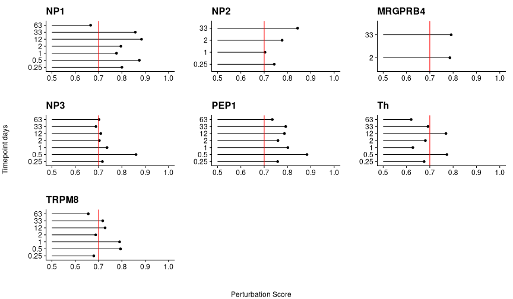


```r
# Sessioninfo
sessionInfo()
```

```
## R version 4.1.1 (2021-08-10)
## Platform: x86_64-pc-linux-gnu (64-bit)
## Running under: CentOS Linux 7 (Core)
## 
## Matrix products: default
## BLAS:   /sw/apps/R/4.1.1/rackham/lib64/R/lib/libRblas.so
## LAPACK: /sw/apps/R/4.1.1/rackham/lib64/R/lib/libRlapack.so
## 
## locale:
##  [1] LC_CTYPE=en_US.UTF-8       LC_NUMERIC=C              
##  [3] LC_TIME=en_US.UTF-8        LC_COLLATE=en_US.UTF-8    
##  [5] LC_MONETARY=en_US.UTF-8    LC_MESSAGES=en_US.UTF-8   
##  [7] LC_PAPER=en_US.UTF-8       LC_NAME=C                 
##  [9] LC_ADDRESS=C               LC_TELEPHONE=C            
## [11] LC_MEASUREMENT=en_US.UTF-8 LC_IDENTIFICATION=C       
## 
## attached base packages:
## [1] stats     graphics  grDevices utils     datasets  methods   base     
## 
## other attached packages:
##  [1] harmony_0.1.0      Rcpp_1.0.8         fcoex_1.6.0        readxl_1.3.1      
##  [5] enrichR_3.0        patchwork_1.1.1    UpSetR_1.4.0       SeuratObject_4.0.4
##  [9] Seurat_4.1.0       magrittr_2.0.2     forcats_0.5.1      stringr_1.4.0     
## [13] dplyr_1.0.8        purrr_0.3.4        readr_2.1.2        tidyr_1.2.0       
## [17] tibble_3.1.6       ggplot2_3.3.5      tidyverse_1.3.1   
## 
## loaded via a namespace (and not attached):
##   [1] statnet.common_4.5.0        ica_1.0-2                  
##   [3] class_7.3-19                foreach_1.5.2              
##   [5] lmtest_0.9-39               rprojroot_2.0.2            
##   [7] crayon_1.5.0                spatstat.core_2.4-0        
##   [9] MASS_7.3-54                 nlme_3.1-153               
##  [11] backports_1.4.1             reprex_2.0.1               
##  [13] GOSemSim_2.18.1             rlang_1.0.2                
##  [15] XVector_0.32.0              caret_6.0-90               
##  [17] ROCR_1.0-11                 irlba_2.3.5                
##  [19] intergraph_2.0-2            limma_3.48.3               
##  [21] BiocParallel_1.26.2         rjson_0.2.21               
##  [23] yardstick_0.0.9             bit64_4.0.5                
##  [25] glue_1.6.2                  pheatmap_1.0.12            
##  [27] sctransform_0.3.3           parallel_4.1.1             
##  [29] vipor_0.4.5                 spatstat.sparse_2.1-0      
##  [31] AnnotationDbi_1.54.1        BiocGenerics_0.38.0        
##  [33] DOSE_3.18.3                 spatstat.geom_2.3-2        
##  [35] haven_2.4.3                 tidyselect_1.1.2           
##  [37] SummarizedExperiment_1.22.0 fitdistrplus_1.1-8         
##  [39] zoo_1.8-9                   xtable_1.8-4               
##  [41] lars_1.2                    evaluate_0.15              
##  [43] rsample_0.1.1               cli_3.2.0                  
##  [45] zlibbioc_1.38.0             rstudioapi_0.13            
##  [47] miniUI_0.1.1.1              Augur_1.0.3                
##  [49] furrr_0.2.3                 rpart_4.1-15               
##  [51] fastmatch_1.1-3             pbmcapply_1.5.0            
##  [53] treeio_1.16.2               maps_3.4.0                 
##  [55] shiny_1.7.1                 xfun_0.30                  
##  [57] cluster_2.1.2               tidygraph_1.2.0            
##  [59] KEGGREST_1.32.0             ggrepel_0.9.1              
##  [61] ape_5.6-1                   listenv_0.8.0              
##  [63] Biostrings_2.60.2           png_0.1-7                  
##  [65] future_1.24.0               ipred_0.9-12               
##  [67] withr_2.5.0                 bitops_1.0-7               
##  [69] ggforce_0.3.3               plyr_1.8.6                 
##  [71] cellranger_1.1.0            hardhat_0.2.0              
##  [73] pROC_1.18.0                 coda_0.19-4                
##  [75] pillar_1.7.0                cachem_1.0.6               
##  [77] fs_1.5.2                    clusterProfiler_4.0.5      
##  [79] tester_0.1.7                vctrs_0.3.8                
##  [81] ellipsis_0.3.2              generics_0.1.2             
##  [83] lava_1.6.10                 mda_0.5-2                  
##  [85] tools_4.1.1                 beeswarm_0.4.0             
##  [87] munsell_0.5.0               tweenr_1.0.2               
##  [89] fgsea_1.18.0                DelayedArray_0.18.0        
##  [91] fastmap_1.1.0               compiler_4.1.1             
##  [93] abind_1.4-5                 httpuv_1.6.5               
##  [95] plotly_4.10.0               GenomeInfoDbData_1.2.6     
##  [97] prodlim_2019.11.13          gridExtra_2.3              
##  [99] lattice_0.20-45             deldir_1.0-6               
## [101] utf8_1.2.2                  later_1.3.0                
## [103] recipes_0.2.0               jsonlite_1.8.0             
## [105] scales_1.1.1                tidytree_0.3.8             
## [107] pbapply_1.5-0               sparseMatrixStats_1.5.3    
## [109] lazyeval_0.2.2              parsnip_0.1.7              
## [111] promises_1.2.0.1            R.utils_2.11.0             
## [113] goftest_1.2-3               spatstat.utils_2.3-0       
## [115] reticulate_1.24             sna_2.6                    
## [117] FCBF_2.0.0                  cowplot_1.1.1              
## [119] Rtsne_0.15                  dichromat_2.0-0            
## [121] downloader_0.4              Biobase_2.52.0             
## [123] uwot_0.1.11                 igraph_1.2.11              
## [125] survival_3.2-13             htmltools_0.5.2            
## [127] memoise_2.0.1               graphlayouts_0.8.0         
## [129] IRanges_2.26.0              here_1.0.1                 
## [131] viridisLite_0.4.0           digest_0.6.29              
## [133] assertthat_0.2.1            mime_0.12                  
## [135] pals_1.7                    pathwayPCA_1.8.0           
## [137] RSQLite_2.2.10              yulab.utils_0.0.4          
## [139] future.apply_1.8.1          mapproj_1.2.8              
## [141] data.table_1.14.2           blob_1.2.2                 
## [143] S4Vectors_0.30.2            R.oo_1.24.0                
## [145] styler_1.7.0.9001           splines_4.1.1              
## [147] labeling_0.4.2              Cairo_1.5-14               
## [149] RCurl_1.98-1.6              broom_0.7.12               
## [151] hms_1.1.1                   modelr_0.1.8               
## [153] colorspace_2.0-3            ggbeeswarm_0.6.0           
## [155] GenomicRanges_1.44.0        aplot_0.1.2                
## [157] ggrastr_1.0.1               nnet_7.3-16                
## [159] mclust_5.4.9                RANN_2.6.1                 
## [161] enrichplot_1.12.3           fansi_1.0.2                
## [163] tzdb_0.2.0                  parallelly_1.30.0          
## [165] ModelMetrics_1.2.2.2        R6_2.5.1                   
## [167] grid_4.1.1                  ggridges_0.5.3             
## [169] lifecycle_1.0.1             curl_4.3.2                 
## [171] leiden_0.3.9                DO.db_2.9                  
## [173] Matrix_1.3-4                qvalue_2.24.0              
## [175] RcppAnnoy_0.0.19            RColorBrewer_1.1-2         
## [177] iterators_1.0.14            gower_1.0.0                
## [179] R.cache_0.15.0              htmlwidgets_1.5.4          
## [181] polyclip_1.10-0             markdown_1.1               
## [183] network_1.17.1              shadowtext_0.1.1           
## [185] gridGraphics_0.5-1          rvest_1.0.2                
## [187] mgcv_1.8-38                 globals_0.14.0             
## [189] spatstat.random_2.1-0       codetools_0.2-18           
## [191] matrixStats_0.61.0          lubridate_1.8.0            
## [193] GO.db_3.13.0                prettyunits_1.1.1          
## [195] SingleCellExperiment_1.14.1 dbplyr_2.1.1               
## [197] RSpectra_0.16-0             R.methodsS3_1.8.1          
## [199] GenomeInfoDb_1.28.4         gtable_0.3.0               
## [201] DBI_1.1.2                   stats4_4.1.1               
## [203] ggfun_0.0.5                 tensor_1.5                 
## [205] httr_1.4.2                  highr_0.9                  
## [207] KernSmooth_2.23-20          stringi_1.7.6              
## [209] progress_1.2.2              reshape2_1.4.4             
## [211] farver_2.1.0                viridis_0.6.2              
## [213] timeDate_3043.102           ggtree_3.0.4               
## [215] xml2_1.3.3                  ggplotify_0.1.0            
## [217] scattermore_0.8             bit_4.0.4                  
## [219] scatterpie_0.1.7            MatrixGenerics_1.5.4       
## [221] spatstat.data_2.1-2         ggraph_2.0.5               
## [223] pkgconfig_2.0.3             ezknitr_0.6.1              
## [225] knitr_1.37
```


```r
# Done
clear_libraries()
```
