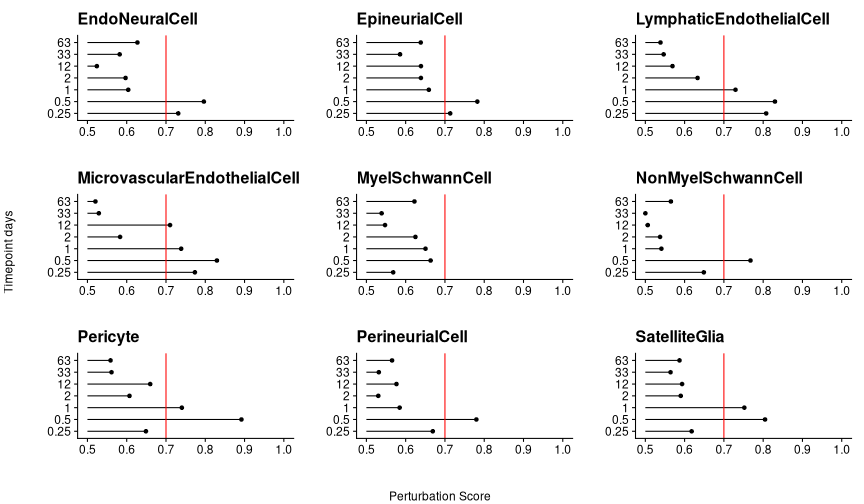

```r
# Load libraries and functions
suppressPackageStartupMessages({
  library(tidyverse)
  library(magrittr)
  library(Seurat)
  library(UpSetR)
  library(patchwork)
  library(enrichR)
  library(readxl)
  library(fcoex)
})
R.utils::sourceDirectory(here::here("R", "functions"), modifiedOnly=FALSE)
```


```r
# Load full data
(drg_ra_full <- readRDS(here::here("data", "proc", "drg_ra_full_merged.rds")))
```

```
## An object of class Seurat 
## 32285 features across 100421 samples within 1 assay 
## Active assay: RNA (32285 features, 2000 variable features)
##  3 dimensional reductions calculated: pca, harmony, umap
```


```r
# Plot UMAP of final merged dataset
DimPlot(drg_ra_full, label = TRUE) 
```

```
## Rasterizing points since number of points exceeds 100,000.
## To disable this behavior set `raster=FALSE`
```


#### Non-neuron/non-immune cell analysis

```r
# Subset non-neurons
(nonneurons <- 
   drg_ra_full %>% 
   set_idents("cell_class") %>% 
   subset(
    idents = drg_ra_full@meta.data$cell_class %>% unique() %>% discard(~ .x %in% c("Neuron", "ImmuneCell"))
  ) %>%  
   set_idents("cell_class"))
```

```
## An object of class Seurat 
## 32285 features across 78460 samples within 1 assay 
## Active assay: RNA (32285 features, 2000 variable features)
##  3 dimensional reductions calculated: pca, harmony, umap
```


```r
# Check cell types, ok
nonneurons@meta.data$cell_class %>% unique
```

```
##  [1] "EndoNeuralCell"               "MyelSchwannCell"             
##  [3] "NonMyelSchwannCell"           "SatelliteGlia"               
##  [5] "VSMC"                         "PerineurialCell"             
##  [7] "Pericyte"                     "MicrovascularEndothelialCell"
##  [9] "EpineurialCell"               "LymphaticEndothelialCell"
```


```r
# Check for smallest cell groups in the data
nonneurons@meta.data %>% 
  count(cell_class, timepoint_days) %>% 
  arrange(n) %>% 
  head(10)
```

```
##                  cell_class timepoint_days   n
## 1                  Pericyte           1.00  45
## 2                      VSMC           0.50  62
## 3                  Pericyte           2.00  65
## 4                      VSMC           1.00  72
## 5                      VSMC          63.00  78
## 6                  Pericyte          33.00  96
## 7                      VSMC           0.25 100
## 8  LymphaticEndothelialCell          63.00 104
## 9                  Pericyte           0.25 110
## 10          PerineurialCell           1.00 110
```


```r
# Downsample data to equalize cell numbers between all type/timepoint groups
set.seed(1)

sampled_cells <-
  nonneurons@meta.data %>% 
  rownames_to_column("cell") %>% 
  group_by(cell_class, timepoint_days) %>% 
  slice_sample(n = 45) %>% 
  pull(cell)

nonneurons_sample <-
  subset(nonneurons, cells = sampled_cells)
```


```r
# Check cell numbers
nonneurons_sample@meta.data %>% 
  count(cell_class, timepoint_days)
```

```
##                      cell_class timepoint_days  n
## 1                EndoNeuralCell           0.00 45
## 2                EndoNeuralCell           0.25 45
## 3                EndoNeuralCell           0.50 45
## 4                EndoNeuralCell           1.00 45
## 5                EndoNeuralCell           2.00 45
## 6                EndoNeuralCell          12.00 45
## 7                EndoNeuralCell          33.00 45
## 8                EndoNeuralCell          63.00 45
## 9                EpineurialCell           0.00 45
## 10               EpineurialCell           0.25 45
## 11               EpineurialCell           0.50 45
## 12               EpineurialCell           1.00 45
## 13               EpineurialCell           2.00 45
## 14               EpineurialCell          12.00 45
## 15               EpineurialCell          33.00 45
## 16               EpineurialCell          63.00 45
## 17     LymphaticEndothelialCell           0.00 45
## 18     LymphaticEndothelialCell           0.25 45
## 19     LymphaticEndothelialCell           0.50 45
## 20     LymphaticEndothelialCell           1.00 45
## 21     LymphaticEndothelialCell           2.00 45
## 22     LymphaticEndothelialCell          12.00 45
## 23     LymphaticEndothelialCell          33.00 45
## 24     LymphaticEndothelialCell          63.00 45
## 25 MicrovascularEndothelialCell           0.00 45
## 26 MicrovascularEndothelialCell           0.25 45
## 27 MicrovascularEndothelialCell           0.50 45
## 28 MicrovascularEndothelialCell           1.00 45
## 29 MicrovascularEndothelialCell           2.00 45
## 30 MicrovascularEndothelialCell          12.00 45
## 31 MicrovascularEndothelialCell          33.00 45
## 32 MicrovascularEndothelialCell          63.00 45
## 33              MyelSchwannCell           0.00 45
## 34              MyelSchwannCell           0.25 45
## 35              MyelSchwannCell           0.50 45
## 36              MyelSchwannCell           1.00 45
## 37              MyelSchwannCell           2.00 45
## 38              MyelSchwannCell          12.00 45
## 39              MyelSchwannCell          33.00 45
## 40              MyelSchwannCell          63.00 45
## 41           NonMyelSchwannCell           0.00 45
## 42           NonMyelSchwannCell           0.25 45
## 43           NonMyelSchwannCell           0.50 45
## 44           NonMyelSchwannCell           1.00 45
## 45           NonMyelSchwannCell           2.00 45
## 46           NonMyelSchwannCell          12.00 45
## 47           NonMyelSchwannCell          33.00 45
## 48           NonMyelSchwannCell          63.00 45
## 49                     Pericyte           0.00 45
## 50                     Pericyte           0.25 45
## 51                     Pericyte           0.50 45
## 52                     Pericyte           1.00 45
## 53                     Pericyte           2.00 45
## 54                     Pericyte          12.00 45
## 55                     Pericyte          33.00 45
## 56                     Pericyte          63.00 45
## 57              PerineurialCell           0.00 45
## 58              PerineurialCell           0.25 45
## 59              PerineurialCell           0.50 45
## 60              PerineurialCell           1.00 45
## 61              PerineurialCell           2.00 45
## 62              PerineurialCell          12.00 45
## 63              PerineurialCell          33.00 45
## 64              PerineurialCell          63.00 45
## 65                SatelliteGlia           0.00 45
## 66                SatelliteGlia           0.25 45
## 67                SatelliteGlia           0.50 45
## 68                SatelliteGlia           1.00 45
## 69                SatelliteGlia           2.00 45
## 70                SatelliteGlia          12.00 45
## 71                SatelliteGlia          33.00 45
## 72                SatelliteGlia          63.00 45
## 73                         VSMC           0.00 45
## 74                         VSMC           0.25 45
## 75                         VSMC           0.50 45
## 76                         VSMC           1.00 45
## 77                         VSMC           2.00 45
## 78                         VSMC          12.00 45
## 79                         VSMC          33.00 45
## 80                         VSMC          63.00 45
```

#### Augur: Perturbation analysis

```r
# Add needed columns to metadata for running Augur
nonneurons_sample@meta.data %<>%
  mutate(
    cell_type = as.character(nonneurons_sample@meta.data$cell_class),
    label = factor(timepoint_days))
```


```r
# Get a list of mouse protein coding genes excluding Y chromosome
# https://www.ensembl.org/biomart/martview/766d94f98a348ad7b78782227f808ad4
mouse_genes <- readRDS(here::here("data", "ref", "mouse_genes_ensembl.rds"))

genes_use <-
  mouse_genes  %>% 
  filter(
    Gene.name != "",
    Gene.type == "protein_coding",
    Chromosome.scaffold.name != "Y"
  )  %>% 
  pull(Gene.name)
```


```r
# Filter data and create a new Seurat object
nonneurons_sample2 <- as.matrix(GetAssayData(nonneurons_sample, slot = "counts"))
nonneurons_sample2 <- nonneurons_sample2[row.names(nonneurons_sample2) %in% genes_use, ]

nonneurons_sample2 %<>%  
  CreateSeuratObject() %>% 
  NormalizeData() %>% 
  FindVariableFeatures() %>% 
  ScaleData() %>% 
  RunPCA(npcs = 100, verbose = TRUE)
```

```
## Centering and scaling data matrix
```

```
## PC_ 1 
## Positive:  Flt1, Emcn, Pecam1, Egfl7, Ctla2a, Eng, Abcg2, Gimap6, Tm4sf1, Esam 
## 	   Cd93, Adgrf5, Cyyr1, Adgrl4, Ly6e, Mmrn2, Rasip1, Cdh5, Ly6c1, Kdr 
## 	   Cldn5, Lmo2, Ptprb, Slfn5, Ly6a, Ecscr, Igfbp7, Iigp1, Tie1, C130074G19Rik 
## Negative:  Gpm6b, Dbi, Atp1a2, Plp1, Scd2, Lpar1, Cryab, Abca8a, Sdc4, Gatm 
## 	   Itgb8, Gpr37l1, Apoe, Prnp, Cmtm5, S100b, Ttyh1, Mboat2, Sema3b, Ldhb 
## 	   Phgdh, Hmgcs2, Fabp7, Tmod2, Sostdc1, Ptprz1, Ncam1, Ndrg2, Scd1, Sfrp5 
## PC_ 2 
## Positive:  Igfbp6, Serping1, Dcn, Pcolce, Smoc2, Islr, Col1a1, Gpc3, Col6a1, Tgfbi 
## 	   Mfap5, Foxd1, Prelp, Serpinf1, Nbl1, Zic1, Bgn, Col3a1, Col6a2, Nupr1 
## 	   Prrx1, Cfh, Ogn, Lrp1, Olfml3, Ebf2, Apod, Mgp, Abi3bp, Vit 
## Negative:  Ptn, Mal, Plp1, Gpm6b, Dbi, Gpr37l1, Ttyh1, Gatm, Ptprz1, Rgcc 
## 	   Fam181b, Cmtm5, Adgrg1, Sostdc1, Plaat3, Mmd2, Sox2, Itgb8, Ncam1, Cnp 
## 	   Fabp7, Sox10, Acsbg1, Kcnj10, Bcan, Tmod2, Aldoc, Ednrb, Col28a1, Cyp2j6 
## PC_ 3 
## Positive:  Igfbp6, Dcn, Smoc2, Lbp, Col1a1, Apod, Mfap5, Ramp2, Serpinf1, Tgfbi 
## 	   Abi3bp, Islr, Foxd1, Efemp1, Rnase4, Col1a2, Vit, Pcolce, Ltbp4, Gpc3 
## 	   Scara3, Nupr1, Olfml3, Itgbl1, Klf5, Fn1, Pdgfra, Shisa3, Fmo1, Bace2 
## Negative:  Myh11, Myl9, Tpm2, Acta2, Gucy1a1, Notch3, Lmod1, Nrip2, Tagln, Mylk 
## 	   Filip1l, Pln, Gm13889, Pde3a, Gucy1b1, Ndufa4l2, Rasl11a, Aoc3, Olfr558, Ptp4a3 
## 	   Tpm1, Map3k7cl, Cox4i2, Ppp1r14a, Map3k20, Rcan2, Rrad, Mfge8, Dgkb, Npy1r 
## PC_ 4 
## Positive:  Ncmap, Mpz, Prx, Cldn19, Kcna1, Pou3f1, Mbp, Pllp, Fam178b, Fxyd3 
## 	   Fxyd6, Gldn, Mag, Bcas1, Arhgap19, Pmp22, Drp2, Ugt8a, Cnp, Slc36a2 
## 	   Mal, Reln, Mlip, Gjc3, Dusp15, Secisbp2l, Ank3, Hcn1, Limch1, Gatm 
## Negative:  Bcan, Igfbp4, Pmepa1, Aldoc, Ctnnd2, Slc4a4, Cst3, Fbln5, Ptprz1, Mmd2 
## 	   Hey2, Dclk1, Ndrg2, Fbln2, 2310022B05Rik, Acsbg1, Aqp4, Fmo1, Cdh11, Cnmd 
## 	   Slc9a3r1, Kcnn4, Cntfr, Pdpn, Ptgfrn, Cald1, Spon1, Vldlr, Kcnj10, Kit 
## PC_ 5 
## Positive:  Ifitm3, Ifit3, Gbp2, Steap4, Bst2, Ifitm1, Psmb8, Zbp1, Isg15, Gbp3 
## 	   Irf7, B2m, Cxcl10, Gbp6, Ifi47, Xaf1, Rnf213, Ifit1, Ccl19, Xdh 
## 	   Cp, Ifi204, H2-D1, Serpina3n, Lgals3bp, Igtp, Mt2, H2-T23, Gbp5, Pla1a 
## Negative:  Cav1, Cavin2, Gas6, Lypd2, Wfdc1, Gpm6a, Rbp1, Ccdc3, Spint2, Col12a1 
## 	   Fmo2, Crabp2, Bnc2, Crispld1, Perp, Abcb1a, Dock9, Ptgis, Cldn11, Sema3d 
## 	   Nbl1, Pcp4l1, Csrp2, Chchd10, Fhl1, Cdh11, Thbs1, Cxadr, Itih5, Rassf3
```

```r
nonneurons_sample2@meta.data <-
  nonneurons_sample2@meta.data %>% 
  select(-orig.ident) %>% 
  bind_cols(
    nonneurons_sample@meta.data %>% 
      select(label, cell_type, orig.ident, treatment)
  )
```


```r
# Check if ok
nonneurons_sample2@meta.data %>% select(label, cell_type, treatment)
```

```
##                                                label
## GTGTAACCATTCTGTT-1_1_1_1_1_1_1_1                   0
## CAAGCTACACTAACGT-1_1_1_1_1_1_1_1_1_1_1_1           0
## GACCCAGCAGAGGTTG-1_2_1_1_1_1_1_1_1_1_1_1_1_1_1     0
## TTGAGTGGTCACTTAG-1_2_1_1_1_1_1_1_1_1_1_1           0
## CGCAGGTTCCGGACTG-1_1_1_1_1_1_1_1_1_1_1_1_1_1_1     0
## CTGCCTAAGGATTTCC-1_1_1_1_1_1_1_1_1_1_1_1_1         0
## TCATGAGCAACGCATT-1_2_1_1_1_1_1_1_1_1_1_1_1_1_1     0
## GACCGTGCAGTGGCTC-1_2_1_1_1_1_1_1_1_1_1_1_1_1       0
## GGAGGTATCTTAAGGC-1_2_1_1_1_1_1_1                   0
## CAGTTAGAGTGCAACG-1_2_1_1_1_1_1_1                   0
## AAGCGTTGTTGAGGAC-1_2_1_1_1_1_1_1_1_1_1_1_1         0
## TGATGGTGTAGTTCCA-1_2_1_1_1_1_1_1                   0
## AGTGACTAGTCCGTCG-1_2_1_1_1_1_1_1_1_1_1_1_1_1_1     0
## TCATATCCACCCTAAA-1_2_1_1_1_1_1_1                   0
## TCTCAGCGTACAAGTA-1_2_1_1_1_1_1_1_1_1_1_1_1_1       0
## TGGATCACAACGATCT-1_1_1_1_1_1_1_1_1_1_1_1_1_1_1     0
## GATCCCTCACTTGTCC-1_1_1_1_1_1_1_1_1_1_1_1_1_1_1     0
## TCAGTGAGTGGATTTC-1_1_1_1_1_1_1_1_1_1_1_1_1_1_1     0
## CTGCCATGTTGCACGC-1_1_1_1_1_1_1_1_1_1_1_1_1_1_1     0
## CATGCAAGTTCAGGTT-1_2_1_1_1_1_1_1                   0
## TCTATCATCGCAGATT-1_1_1_1_1_1_1_1_1_1_1_1           0
## TACATTCTCTTCACAT-1_2_1_1_1_1_1_1_1_1_1_1           0
## GACTCTCTCGCATTGA-1_1_1_1_1_1_1_1_1_1_1_1_1         0
## TGTTCATAGTGCACTT-1_1_1_1_1_1_1_1_1_1_1_1_1_1_1     0
## GTAACACGTTAGGCCC-1_2_1_1_1_1_1_1_1_1_1_1           0
## TGTTGAGAGTTTGCTG-1_2_1_1_1_1_1_1_1_1_1_1_1_1_1     0
## CGCGTGAGTCTACACA-1_1_1_1_1_1_1_1                   0
## ATCTCTATCTCTGACC-1_2_1_1_1_1_1_1_1_1_1_1           0
## GAGGCCTCAATACCCA-1_2_1_1_1_1_1_1_1_1_1_1           0
## TTTACGTCAGTTGTTG-1_2_1_1_1_1_1_1_1_1_1_1           0
## TCTAACTGTCCGGATC-1_2_1_1_1_1_1_1_1_1_1_1_1_1_1     0
## TCTATCACATCTATCT-1_2_1_1_1_1_1_1_1_1_1_1_1_1_1     0
## TCGAAGTAGGATGAGA-1_1_1_1_1_1_1_1_1_1_1_1_1         0
## ATCACAGTCCATGCAA-1_1_1_1_1_1_1_1_1_1_1_1_1_1_1     0
## CTTACCGAGATCACCT-1_2_1_1_1_1_1_1_1_1_1_1_1_1_1     0
## GATTGGTGTCTAGGCC-1_2_1_1_1_1_1_1                   0
## AGCCACGCATGCAGCC-1_2_1_1_1_1_1_1_1_1_1_1_1_1_1     0
## AGGTTACTCCATGCAA-1_1_1_1_1_1_1_1_1_1_1_1           0
## CGAGTGCTCTTCCTAA-1_1_1_1_1_1_1_1_1_1_1_1_1_1_1     0
## CAAGACTCAGAACCGA-1_1_1_1_1_1_1_1_1_1_1_1           0
## TACGTCCGTAATTAGG-1_2_1_1_1_1_1_1_1_1_1_1           0
## TGTCCTGTCGTACCTC-1_2_1_1_1_1_1_1_1_1_1_1_1_1       0
## CCGGGTATCGACCATA-1_1_1_1_1_1_1_1_1_1_1_1           0
## GTGTTCCAGGAAAGGT-1_1_1_1_1_1_1_1                   0
## CTTGAGATCGCCAATA-1_1_1_1_1_1_1_1_1_1_1_1_1_1_1     0
## ACTTCGCAGTTAACGA-1_1_1_1_1_1_1                  0.25
## GCAGCTGAGAACCCGA-1_2_1_1_1_1_1                  0.25
## AAAGGATCAATCCTAG-1_2_1_1_1_1_1                  0.25
## TGGGAAGCAGGACAGT-1_2_1_1_1_1_1                  0.25
## GCCTGTTTCGACGCGT-1_2_1_1_1_1_1                  0.25
## AGGATAAGTAGCTTGT-1_1_1_1_1_1_1                  0.25
## TACCGGGGTAGCTGCC-1_2_1_1_1_1_1                  0.25
## TATCCTATCTTACGGA-1_1_1_1_1_1_1                  0.25
## ACCCTCAGTACGACTT-1_1_1_1_1_1_1                  0.25
## CGAAGGATCCAGCAAT-1_1_1_1_1_1_1                  0.25
## CTCTCAGCAGTTAGAA-1_2_1_1_1_1_1                  0.25
## ACTTCGCGTGAATTGA-1_1_1_1_1_1_1                  0.25
## TCACAAGGTGGCTAGA-1_1_1_1_1_1_1                  0.25
## TTGGGTAGTATGTGTC-1_2_1_1_1_1_1                  0.25
## GGCTTGGAGCACTAGG-1_2_1_1_1_1_1                  0.25
## CAATGACGTCCTTAAG-1_2_1_1_1_1_1                  0.25
## TGAGCGCAGCCGCTTG-1_1_1_1_1_1_1                  0.25
## TCGTGCTCAAGTACCT-1_2_1_1_1_1_1                  0.25
## CAGCCAGTCGATTGAC-1_2_1_1_1_1_1                  0.25
## TGACCCTGTGACTAAA-1_2_1_1_1_1_1                  0.25
## GGTGAAGCAGCGCGTT-1_2_1_1_1_1_1                  0.25
## CGATGGCTCGCGGACT-1_1_1_1_1_1_1                  0.25
## CTAAGTGTCAGCACCG-1_2_1_1_1_1_1                  0.25
## TACCCGTGTTCTCTCG-1_2_1_1_1_1_1                  0.25
## AACGAAATCACAAGGG-1_2_1_1_1_1_1                  0.25
## GCATCTCTCACCACAA-1_1_1_1_1_1_1                  0.25
## CATGGATGTCATCCGG-1_1_1_1_1_1_1                  0.25
## AGGCCACAGGTTGTTC-1_1_1_1_1_1_1                  0.25
## AGGAAATCAGAGTGAC-1_2_1_1_1_1_1                  0.25
## CATCGCTAGACCTCCG-1_1_1_1_1_1_1                  0.25
## TACGTCCCAGATCATC-1_2_1_1_1_1_1                  0.25
## CCTCCAAGTATCGAAA-1_2_1_1_1_1_1                  0.25
## TGTTACTAGACCTGGA-1_2_1_1_1_1_1                  0.25
## TGCTTGCAGCCTATTG-1_1_1_1_1_1_1                  0.25
## TGCCGAGCATCCCACT-1_1_1_1_1_1_1                  0.25
## TGGATCAGTGTGTGGA-1_1_1_1_1_1_1                  0.25
## CATGCAATCAGGGTAG-1_1_1_1_1_1_1                  0.25
## ATCACTTAGCTGGCTC-1_1_1_1_1_1_1                  0.25
## CACGTGGAGTATTCCG-1_2_1_1_1_1_1                  0.25
## CCTAAGACAAGACGAC-1_2_1_1_1_1_1                  0.25
## GGCGTCAGTAATCAAG-1_2_1_1_1_1_1                  0.25
## CATCCACCAAAGCGTG-1_2_1_1_1_1_1                  0.25
## CTTAGGAAGACGCATG-1_2_1_1_1_1_1                  0.25
## TGTTCCGGTTTGGGAG-1_2_1_1_1_1_1                  0.25
## CGATGGCGTTAGAAGT-1_1_1_1_1_1_1                  0.25
## ATAGACCAGGTATTGA-1_1_1_1_1_1_1_1_1               0.5
## CAGGCCAGTCTCACGG-1_2_1_1_1_1                     0.5
## GGCTGTGCACGGCGTT-1_2_1_1_1_1                     0.5
## CTGCTCATCCGTGTAA-1_2_1_1_1_1_1_1_1               0.5
## GACCGTGGTGACCGTC-1_2_1_1_1_1_1_1_1               0.5
## TGTTTGTAGTCGAGGT-1_2_1_1_1_1                     0.5
## CTCCCAATCCTACAAG-1_1_1_1_1_1                     0.5
## CTTTCGGAGCGCCTAC-1_1_1_1_1_1                     0.5
## GAGTTACTCGCCGAAC-1_1_1_1_1_1                     0.5
## TTACCGCTCGGAGTGA-1_1_1_1_1_1                     0.5
## GTGGTTAGTCTGTTAG-1_2_1_1_1_1                     0.5
## ACAACCACAAGGTTGG-1_2_1_1_1_1                     0.5
## TGTCCTGTCGAACACT-1_2_1_1_1_1                     0.5
## TCATTCAAGTCGAAAT-1_2_1_1_1_1                     0.5
## AGAAGCGTCGTAGAGG-1_1_1_1_1_1                     0.5
## CCGTTCATCCTTTGAT-1_2_1_1_1_1                     0.5
## TTATTGCAGGTTCTTG-1_1_1_1_1_1_1_1_1               0.5
## GGGTATTTCCAAACCA-1_1_1_1_1_1                     0.5
## AGAAATGTCTTTCCAA-1_1_1_1_1_1                     0.5
## CCACTTGGTTCGGCGT-1_1_1_1_1_1                     0.5
## CATGCCTCATGTTACG-1_2_1_1_1_1                     0.5
## TTCCACGCATGGGTCC-1_2_1_1_1_1_1_1_1               0.5
## ACGCACGAGGGAGTGG-1_1_1_1_1_1                     0.5
## CAGTTCCGTAGAATGT-1_2_1_1_1_1                     0.5
## TGTTTGTGTCTGTAAC-1_2_1_1_1_1                     0.5
## ACTATTCCAACCAGAG-1_1_1_1_1_1                     0.5
## AGATGCTAGTGTTGTC-1_2_1_1_1_1                     0.5
## CATCGGGAGTGCAAAT-1_2_1_1_1_1                     0.5
## ACCTACCAGTTACGAA-1_2_1_1_1_1_1_1_1               0.5
## ACTGATGCATTGAGGG-1_2_1_1_1_1                     0.5
## TCTTTGAAGTCACGAG-1_1_1_1_1_1_1_1_1               0.5
## ATGAGGGAGTTGCGCC-1_1_1_1_1_1_1_1_1               0.5
## AACTTCTTCCGGACGT-1_1_1_1_1_1_1_1_1               0.5
## GAGGGATCAATCGCGC-1_1_1_1_1_1                     0.5
## AGATGAAAGCTATCTG-1_1_1_1_1_1                     0.5
## ATTACCTTCGTTCTCG-1_1_1_1_1_1                     0.5
## GACGTTATCTGGAAGG-1_2_1_1_1_1                     0.5
## CGAGTGCGTAGCGCTC-1_1_1_1_1_1                     0.5
## ATCATTCAGAGAAGGT-1_1_1_1_1_1_1_1_1               0.5
## ACGGTCGTCGGAACTT-1_1_1_1_1_1                     0.5
## TCGAAGTAGTACTCGT-1_2_1_1_1_1                     0.5
## TCCGATCTCCTGGCTT-1_2_1_1_1_1_1_1_1               0.5
## CGATGGCGTATCGATC-1_2_1_1_1_1_1_1_1               0.5
## CAACCTCAGACATAAC-1_1_1_1_1_1                     0.5
## CAACCTCAGCTGGCCT-1_1_1_1_1_1                     0.5
## TTTGACTGTGGTCTGC-1_2_1_1_1_1_1_1_1_1_1             1
## CCCTCAAAGCACTCTA-1_2_1_1_1_1_1_1_1_1_1             1
## GAGAAATAGCACCGTC-1_1_1_1_1_1_1_1_1_1_1             1
## GCCAGCAGTACGTTCA-1_2_1_1_1_1_1_1_1_1_1             1
## TTGATGGTCCGCAAAT-1_1_1_1_1_1_1_1_1_1_1             1
## AGGACTTTCAACCTCC-1_1_1_1_1_1_1_1_1_1_1             1
## GACTTCCCAATGTTGC-1_1_1_1_1_1_1_1_1_1_1             1
## GTCCCATTCAAGAGGC-1_2_1_1_1_1_1_1_1_1_1             1
## TCTACATGTTCAATCG-1_2_1_1_1_1_1_1_1_1_1             1
## AACAAGATCCAAGCTA-1_2_1_1_1_1_1_1_1_1_1             1
## AGGAAATGTCGTCGGT-1_2_1_1_1_1_1_1_1_1_1             1
## CAATCGACAAGGCAAC-1_2_1_1_1_1_1_1_1_1_1             1
## CCTTTGGCAATGTCTG-1_2_1_1_1_1_1_1_1_1_1             1
## GAATAGATCATGCATG-1_2_1_1_1_1_1_1_1_1_1             1
## TAGGAGGCAGAACTCT-1_1_1_1_1_1_1_1_1_1_1             1
## GGCAGTCGTTCAGTAC-1_2_1_1_1_1_1_1_1_1_1             1
## CAGCACGCACCTGATA-1_2_1_1_1_1_1_1_1_1_1             1
## AAGTACCTCTTAGCCC-1_1_1_1_1_1_1_1_1_1_1             1
## GCATGATAGCTATCCA-1_1_1_1_1_1_1_1_1_1_1             1
## GCAGCTGTCTGAGCAT-1_1_1_1_1_1_1_1_1_1_1             1
## CGAGTGCGTCTGTAGT-1_2_1_1_1_1_1_1_1_1_1             1
## CATCAAGTCATGAGAA-1_2_1_1_1_1_1_1_1_1_1             1
## TCATATCGTTGCGTAT-1_1_1_1_1_1_1_1_1_1_1             1
## TATGTTCGTGGCTGCT-1_1_1_1_1_1_1_1_1_1_1             1
## ACTGATGCACAAATGA-1_2_1_1_1_1_1_1_1_1_1             1
## TTGCATTTCATCTCTA-1_2_1_1_1_1_1_1_1_1_1             1
## AGGGAGTCAGGAACCA-1_1_1_1_1_1_1_1_1_1_1             1
## CATTGAGGTCTTTATC-1_2_1_1_1_1_1_1_1_1_1             1
## TTCCAATAGGCCTGCT-1_1_1_1_1_1_1_1_1_1_1             1
## TCAATTCCAATCAGCT-1_1_1_1_1_1_1_1_1_1_1             1
## GGGATGAGTTTGGAAA-1_1_1_1_1_1_1_1_1_1_1             1
## TATACCTAGCTCCACG-1_1_1_1_1_1_1_1_1_1_1             1
## GGGTAGACACATGGTT-1_1_1_1_1_1_1_1_1_1_1             1
## CGTAAGTGTCCAGAAG-1_1_1_1_1_1_1_1_1_1_1             1
## GTTACGAAGCGTCTGC-1_2_1_1_1_1_1_1_1_1_1             1
## GACCCTTGTTGCATCA-1_2_1_1_1_1_1_1_1_1_1             1
## CATCCGTGTGACACAG-1_2_1_1_1_1_1_1_1_1_1             1
## ATAGACCGTTGAATCC-1_2_1_1_1_1_1_1_1_1_1             1
## GAGAGGTGTAAGGAGA-1_1_1_1_1_1_1_1_1_1_1             1
## TCTCACGCATCTATCT-1_1_1_1_1_1_1_1_1_1_1             1
## CAAAGAACACTTGAAC-1_1_1_1_1_1_1_1_1_1_1             1
## TCCGGGATCATTTCCA-1_2_1_1_1_1_1_1_1_1_1             1
## GATGAGGTCACTGTCC-1_1_1_1_1_1_1_1_1_1_1             1
## TTCCAATAGCGTTCAT-1_1_1_1_1_1_1_1_1_1_1             1
## CATTCTAAGTAGCATA-1_2_1_1_1_1_1_1_1_1_1             1
## ACTATCTGTTGCACGC-1_2_1_1_1_1_1_1_1_1               2
## GCTTTCGCAGTAACGG-1_1_1_1_1_1_1_1_1_1               2
## AACCACACATACTGAC-1_2_1_1_1_1_1_1_1_1               2
## CTTGATTCATTGTAGC-1_2_1_1_1_1_1_1_1_1               2
## GCACTAATCCGACATA-1_1_1_1_1_1_1_1_1_1               2
## GTGGTTACAGCCGTTG-1_2_1_1_1_1_1_1_1_1               2
## TTTGGTTTCACTTATC-1_2_1_1_1_1_1_1_1_1               2
## GATGTTGTCATGGGAG-1_2_1_1_1_1_1_1_1_1               2
## TCAGGGCTCTTAGCAG-1_2_1_1_1_1_1_1_1_1               2
## ATGAAAGAGTTACGAA-1_2_1_1_1_1_1_1_1_1               2
## CTGGACGCACTCCGGA-1_2_1_1_1_1_1_1_1_1               2
## GTCACTCCAAGCGAAC-1_1_1_1_1_1_1_1_1_1               2
## TGAGGTTCAGGAATCG-1_2_1_1_1_1_1_1_1_1               2
## GCACTAATCCTTGGAA-1_2_1_1_1_1_1_1_1_1               2
## GGGCTACTCTGAGTCA-1_1_1_1_1_1_1_1_1_1               2
## GGGACCTGTGTAAATG-1_2_1_1_1_1_1_1_1_1               2
## CGTGAATTCTAGAGCT-1_2_1_1_1_1_1_1_1_1               2
## GACCTTCAGCGGGTAT-1_1_1_1_1_1_1_1_1_1               2
## TCGGGACCAACTCCAA-1_1_1_1_1_1_1_1_1_1               2
## GAGACTTGTGTTGCCG-1_2_1_1_1_1_1_1_1_1               2
## ATTCTTGCATCTCCCA-1_2_1_1_1_1_1_1_1_1               2
## GTTTGGAAGCGCTGAA-1_2_1_1_1_1_1_1_1_1               2
## ATTTCTGCACGTGAGA-1_1_1_1_1_1_1_1_1_1               2
## AATGACCCATCGAACT-1_1_1_1_1_1_1_1_1_1               2
## ATCCGTCGTAGGAGTC-1_1_1_1_1_1_1_1_1_1               2
## CCGGTAGCATCAACCA-1_2_1_1_1_1_1_1_1_1               2
## CACTAAGCACGTTCGG-1_2_1_1_1_1_1_1_1_1               2
## CATGCTCCACTTTAGG-1_2_1_1_1_1_1_1_1_1               2
## CAAGGGATCCAGTGCG-1_1_1_1_1_1_1_1_1_1               2
## GGGACAAAGCACAAAT-1_2_1_1_1_1_1_1_1_1               2
## ACACAGTTCACCGACG-1_1_1_1_1_1_1_1_1_1               2
## ACGGTTAGTTAGAGAT-1_1_1_1_1_1_1_1_1_1               2
## TACTTCACAAGCTGCC-1_2_1_1_1_1_1_1_1_1               2
## CAGCGTGAGACCAGAC-1_1_1_1_1_1_1_1_1_1               2
## ATTCCCGAGGTCTGGA-1_2_1_1_1_1_1_1_1_1               2
## TCTGCCACAAGACAAT-1_2_1_1_1_1_1_1_1_1               2
## CTACAGAGTCCGTTTC-1_1_1_1_1_1_1_1_1_1               2
## TACCTGCTCAGGACGA-1_2_1_1_1_1_1_1_1_1               2
## CTCAATTTCTCCACTG-1_1_1_1_1_1_1_1_1_1               2
## TGACTCCTCTCTCTAA-1_1_1_1_1_1_1_1_1_1               2
## AGTACTGAGTTCATGC-1_2_1_1_1_1_1_1_1_1               2
## TCCATGCGTAGCGCCT-1_2_1_1_1_1_1_1_1_1               2
## CCCGGAAGTTCGAACT-1_1_1_1_1_1_1_1_1_1               2
## ATCACGAGTCAACATC-1_1_1_1_1_1_1_1_1_1               2
## TGGATCAAGGCACTAG-1_2_1_1_1_1_1_1_1_1               2
## TACGGGCCAACCGGAA-1_2_1_1                          12
## GTAGGAGAGGGACACT-1_2_1_1                          12
## AGGACGAGTCGAAGCA-1_1_1_1                          12
## ACTACGAAGTAAGCAT-1_2_1_1                          12
## TGTCCTGCAATCCTAG-1_2_1_1                          12
## CCGGTAGTCGAGCCAC-1_2_1_1                          12
## CGTGCTTAGATGATTG-1_1_1_1                          12
## AAAGGGCAGTGAGTTA-1_2_1_1                          12
## GGGTTATGTCGGTGAA-1_1_1_1                          12
## GGTTGTAGTTGCATGT-1_1_1_1                          12
## GAGGGATCACAGAGCA-1_1_1_1                          12
## CACGAATCAGCGACCT-1_2_1_1                          12
## GTTCTATTCTATCGCC-1_2_1_1                          12
## GCACGGTTCTCGTCGT-1_1_1_1                          12
## TTGGATGTCGGTCGGT-1_1_1_1                          12
## ACCGTTCGTTGCCGCA-1_2_1_1                          12
## TGAATCGCAGTAGAAT-1_2_1_1                          12
## ATCGCCTCACAATGCT-1_1_1_1                          12
## ACAGCCGCAAGTGGTG-1_2_1_1                          12
## GATGAGGAGAAACACT-1_1_1_1                          12
## GCTACCTGTCCGGATC-1_1_1_1                          12
## TTCCTAAAGGAAGTGA-1_1_1_1                          12
## TGCGGCATCCACGTAA-1_1_1_1                          12
## TGGATCAGTGCGGCTT-1_2_1_1                          12
## TGGGCGTCAGGTGTTT-1_2_1_1                          12
## TGCGATACACCATAAC-1_2_1_1                          12
## GCATCTCTCAAATAGG-1_1_1_1                          12
## CCTAACCCAATACCTG-1_1_1_1                          12
## TCCTCGACAGAGACTG-1_1_1_1                          12
## ACTATTCAGCATGCAG-1_2_1_1                          12
## GGTTAACTCCTTCTAA-1_2_1_1                          12
## GTTGCGGTCTGCGAGC-1_2_1_1                          12
## GCACGGTAGAAGATCT-1_2_1_1                          12
## GGCTTTCTCGCGTTTC-1_2_1_1                          12
## AAAGTCCGTTACCTTT-1_1_1_1                          12
## CGTGTCTGTCATTCCC-1_2_1_1                          12
## ACTACGAAGTATGCAA-1_2_1_1                          12
## ACTATTCAGGGTGAGG-1_1_1_1                          12
## TCGGATAGTGTAACGG-1_1_1_1                          12
## CAGTGCGGTGGTCTAT-1_2_1_1                          12
## TCACACCTCGTGCGAC-1_2_1_1                          12
## GAGACTTCATGGAAGC-1_2_1_1                          12
## GAGAGGTAGACCATTC-1_1_1_1                          12
## TGGATCAGTGCCGTTG-1_1_1_1                          12
## TGAACGTCAAAGAACT-1_1_1_1                          12
## CCACTTGAGGTACAAT-1_1_1                            33
## TTACGTTAGCCTCTCT-1_1_1                            33
## CGCATGGTCGGTGAAG-1_2_1                            33
## TTCTGTAAGAGTCAAT-1_2_1                            33
## CATTGAGCAGAAGCGT-1_1_1                            33
## TATTTCGTCCCAACTC-1_2_1                            33
## GGTGTCGCACGACCTG-1_2_1                            33
## TCCCATGAGTCATACC-1_1_1                            33
## AGGTTACTCTCAATCT-1_2_1                            33
## GCCATTCCATTGACAC-1_1_1                            33
## CATGAGTAGCTCTATG-1_2_1                            33
## GAAGGACCATATGAAG-1_1_1                            33
## AGCTTCCGTGTCCTAA-1_1_1                            33
## TGGCGTGCATGGCTGC-1_2_1                            33
## GGTGGCTGTATGGAAT-1_1_1                            33
## TTACGTTGTGTGAGCA-1_1_1                            33
## CAATCGAGTACCTAGT-1_2_1                            33
## TTGGGCGGTATCACCA-1_2_1                            33
## TCTCTGGGTCCACATA-1_2_1                            33
## ACCTACCTCAGATGCT-1_1_1                            33
## CCGTAGGAGAGCCATG-1_1_1                            33
## CAGAGCCGTCTAGATC-1_1_1                            33
## GAGACCCAGTGAACAT-1_1_1                            33
## CTGTGGGTCCTACTGC-1_2_1                            33
## AGGAGGTCAGCTGTGC-1_1_1                            33
## CGCATAAAGTAGCAAT-1_2_1                            33
## CGCGTGACAAACTCGT-1_1_1                            33
## TGCACGGAGGAAGTGA-1_1_1                            33
## CACTGAAGTTCGAAGG-1_1_1                            33
## ACCCTTGCACCAATTG-1_2_1                            33
## TAGGAGGTCCTGTACC-1_1_1                            33
## TTGTTCATCGCTCCTA-1_2_1                            33
## CGGAATTGTTGCTAGT-1_2_1                            33
## GGCTTGGAGCAGGGAG-1_2_1                            33
## ATGCATGGTCGAATGG-1_2_1                            33
## AGTAACCGTAAGATCA-1_2_1                            33
## CATTGTTTCATCTCTA-1_1_1                            33
## CCACACTGTTACACTG-1_1_1                            33
## CACCGTTAGAACCCGA-1_1_1                            33
## CCTCAGTCAGCATGCC-1_1_1                            33
## ATACCGAAGTCCCGAC-1_2_1                            33
## TCCATGCAGACCTCAT-1_1_1                            33
## ATTCTACTCCGATCGG-1_1_1                            33
## TTCTCTCCAAAGGCTG-1_1_1                            33
## TACTGCCAGCCAAGTG-1_1_1                            33
## GGGCTCAAGACATCAA-1_1                              63
## AGTCAACGTGGAATGC-1_1                              63
## CTGTATTGTTTGAAAG-1_1                              63
## GTGTGGCCAACTGAAA-1_2                              63
## TCGACGGTCCGCGATG-1_1                              63
## TTTACTGCAGGACTTT-1_2                              63
## CTATCTACACATTCTT-1_2                              63
## GGGAAGTAGTCGAAGC-1_2                              63
## CCGGGTATCAAAGCCT-1_1                              63
## TTAGTCTGTAGCGTCC-1_2                              63
## ATCCTATCAGTGGCTC-1_1                              63
## GCGTGCACAATGGGTG-1_1                              63
## AGTCATGAGTGAACAT-1_2                              63
## ATCGATGCAGGGTTGA-1_2                              63
## TCATTCATCGTTCTAT-1_1                              63
## ATGTCCCAGTTGAAAC-1_2                              63
## AGACAAAAGAGCATAT-1_1                              63
## AGAGAATTCGAGCACC-1_2                              63
## TGTCCACTCCCGAACG-1_1                              63
## CCGATGGTCTGGGCAC-1_1                              63
## ACCGTTCAGGTTCCGC-1_2                              63
## CTAACCCGTCGTCGGT-1_2                              63
## CCGTTCACAAGTTGGG-1_1                              63
## GTCGCGATCCGATAAC-1_1                              63
## AAAGTCCAGGTTCATC-1_1                              63
## TCATCCGAGACCAAAT-1_2                              63
## ACCACAAGTAGGACTG-1_1                              63
## ACTCCCAAGTGAGTTA-1_1                              63
## TGGAACTCAAGTTCGT-1_2                              63
## ACTTTCAAGACTCATC-1_2                              63
## ATTCCATTCAACTGAC-1_1                              63
## TTAGTCTTCTCACCCA-1_2                              63
## GATTTCTAGGTCCCGT-1_1                              63
## TTCCAATGTGTGAATA-1_1                              63
## GAGACCCGTGAGCGAT-1_1                              63
## AGCTTCCAGAGTCCGA-1_1                              63
## TAACCAGGTCGATTAC-1_2                              63
## TCCCAGTGTAAGTCAA-1_1                              63
## GAGAGGTCAACGGCCT-1_1                              63
## AGAGCAGAGCCTCTGG-1_2                              63
## TCAGCAAGTACGAGCA-1_1                              63
## AAATGGAAGCCGAACA-1_2                              63
## GTCGTTCCACGCCACA-1_1                              63
## ATGCATGGTCATAAAG-1_1                              63
## GAGAGGTAGCGTACAG-1_2                              63
## GTTAGACAGGTCTTTG-1_1_1_1_1_1_1_1_1_1_1_1           0
## CTTAGGAGTCCGGATC-1_1_1_1_1_1_1_1_1_1_1_1_1         0
## ATGGATCTCCGACATA-1_1_1_1_1_1_1_1                   0
## ATCCGTCAGAATCGTA-1_2_1_1_1_1_1_1                   0
## AACACACAGTTGTAAG-1_1_1_1_1_1_1_1_1_1_1_1_1         0
## GTAGGAGCACTTCATT-1_1_1_1_1_1_1_1_1_1_1_1           0
## GTAGATCGTTGGCCGT-1_2_1_1_1_1_1_1_1_1_1_1_1_1_1     0
## AATCGACTCCATACAG-1_1_1_1_1_1_1_1                   0
## AGAGAATGTGACACAG-1_1_1_1_1_1_1_1_1_1_1_1_1_1       0
## CATTCCGAGGACGGAG-1_2_1_1_1_1_1_1_1_1_1_1_1_1_1     0
## GTTACCCGTGAATAAC-1_1_1_1_1_1_1_1_1_1_1_1_1_1_1     0
## AACTTCTGTGTTCAGT-1_2_1_1_1_1_1_1_1_1_1_1           0
## CTGTATTTCGTTTACT-1_2_1_1_1_1_1_1_1_1_1_1           0
## TTGTTGTGTGCGCTCA-1_1_1_1_1_1_1_1_1_1_1_1_1         0
## CTCAAGAAGATACTGA-1_2_1_1_1_1_1_1                   0
## CGTTAGAGTAACATAG-1_2_1_1_1_1_1_1                   0
## TCTTAGTAGCCGGAAT-1_2_1_1_1_1_1_1                   0
## GGTTCTCCATTGGATC-1_1_1_1_1_1_1_1                   0
## CTAACCCAGAGCCGTA-1_2_1_1_1_1_1_1                   0
## CCGGGTATCAATCCGA-1_2_1_1_1_1_1_1_1_1_1_1_1_1_1     0
## ATTCTACAGCGACAGT-1_1_1_1_1_1_1_1                   0
## CCTTCAGGTGCGGCTT-1_2_1_1_1_1_1_1_1_1_1_1           0
## CAACGATCACAAGTGG-1_2_1_1_1_1_1_1_1_1_1_1           0
## GCCGTGATCTAGCCTC-1_2_1_1_1_1_1_1                   0
## CACTGGGAGCAGCCCT-1_2_1_1_1_1_1_1_1_1_1_1_1         0
## AAGTACCGTGCTGATT-1_1_1_1_1_1_1_1_1_1_1_1_1         0
## GTGTAACTCATACAGC-1_2_1_1_1_1_1_1                   0
## AGGCCACTCGTTATCT-1_1_1_1_1_1_1_1_1_1_1_1           0
## AAGATAGGTTGCGAAG-1_1_1_1_1_1_1_1_1_1_1_1           0
## TCCTCTTTCTCAACGA-1_1_1_1_1_1_1_1_1_1_1_1_1         0
## CAGCCAGGTCCCTAAA-1_1_1_1_1_1_1_1_1_1_1_1_1_1_1     0
## ACGCACGGTACAGCGA-1_1_1_1_1_1_1_1_1_1_1_1_1_1       0
## TGAGCGCGTGTGAGCA-1_1_1_1_1_1_1_1_1_1_1_1_1         0
## ATTCTTGCAATATCCG-1_2_1_1_1_1_1_1_1_1_1_1_1_1       0
## GATTCGATCACCCTCA-1_2_1_1_1_1_1_1_1_1_1_1_1_1       0
## GCTGCAGCAGAATGTA-1_1_1_1_1_1_1_1_1_1_1_1           0
## GCCAGGTTCGACGTCG-1_1_1_1_1_1_1_1_1_1_1_1_1         0
## GCACGTGTCCTTCTGG-1_1_1_1_1_1_1_1                   0
## GCCAACGAGCAGTACG-1_2_1_1_1_1_1_1_1_1_1_1           0
## CGGGTGTCAGAACTCT-1_1_1_1_1_1_1_1_1_1_1_1_1         0
## TCCTTTCCACCAGCCA-1_2_1_1_1_1_1_1_1_1_1_1_1_1       0
## GAGTGTTCACGTGAGA-1_1_1_1_1_1_1_1                   0
## GCTGCAGGTATTGACC-1_2_1_1_1_1_1_1_1_1_1_1_1_1       0
## GGGTTATGTTTCGTTT-1_2_1_1_1_1_1_1                   0
## GGGTGAAGTGATGGCA-1_2_1_1_1_1_1_1                   0
## AATTCCTGTTAAACCC-1_2_1_1_1_1_1                  0.25
## CATGCGGAGCTCGCAC-1_2_1_1_1_1_1                  0.25
## GTGCGTGTCTCCCATG-1_1_1_1_1_1_1                  0.25
## GAACGTTGTGAGTTGG-1_1_1_1_1_1_1                  0.25
## CAGTTCCCACCGGCTA-1_2_1_1_1_1_1                  0.25
## GCTACCTAGGGTCTTT-1_2_1_1_1_1_1                  0.25
## TTCTCTCAGGTTCTTG-1_1_1_1_1_1_1                  0.25
## AATCACGAGTTGTCAC-1_2_1_1_1_1_1                  0.25
## TCACACCAGCCAACCC-1_1_1_1_1_1_1                  0.25
## TGCAGGCAGGTAAAGG-1_2_1_1_1_1_1                  0.25
## GACCTTCTCTCCAATT-1_2_1_1_1_1_1                  0.25
## CAGTTAGTCTAGCAAC-1_2_1_1_1_1_1                  0.25
## TAACTTCAGCGCAATG-1_1_1_1_1_1_1                  0.25
## CTACAGATCCAATGCA-1_1_1_1_1_1_1                  0.25
## TAGCACAGTTGAGGAC-1_2_1_1_1_1_1                  0.25
## CAGCACGGTTCGGCGT-1_1_1_1_1_1_1                  0.25
## GCACGTGTCCATACAG-1_1_1_1_1_1_1                  0.25
## CATTTCAAGCTCGTGC-1_1_1_1_1_1_1                  0.25
## AGTGATCTCTCTGCCA-1_1_1_1_1_1_1                  0.25
## GAGTGTTCACGTAGAG-1_2_1_1_1_1_1                  0.25
## CTGTGGGCACTACCGG-1_1_1_1_1_1_1                  0.25
## AGGCATTAGGCGCTTC-1_2_1_1_1_1_1                  0.25
## TAAGCGTCATAGGCGA-1_2_1_1_1_1_1                  0.25
## GAATCGTTCGGACTGC-1_1_1_1_1_1_1                  0.25
## CCGATGGTCCCTTTGG-1_2_1_1_1_1_1                  0.25
## CTGAATGCAGACCTAT-1_1_1_1_1_1_1                  0.25
## TTAATCCGTCCGAAAG-1_2_1_1_1_1_1                  0.25
## AGGTTACAGAATTGCA-1_2_1_1_1_1_1                  0.25
## CTACGGGAGCAGATAT-1_1_1_1_1_1_1                  0.25
## TCTGGCTAGGAACTCG-1_1_1_1_1_1_1                  0.25
## CAACAGTAGCCACCGT-1_1_1_1_1_1_1                  0.25
## AACCATGCAGTGTATC-1_2_1_1_1_1_1                  0.25
## GAGTGAGGTCGAGTTT-1_2_1_1_1_1_1                  0.25
## GATTGGTAGTAAATGC-1_2_1_1_1_1_1                  0.25
## TTGCTGCAGCCGTTAT-1_1_1_1_1_1_1                  0.25
## ACGTAGTTCGAACGGA-1_2_1_1_1_1_1                  0.25
## AAGACTCTCACCGACG-1_2_1_1_1_1_1                  0.25
## CGGGCATTCCAATCCC-1_2_1_1_1_1_1                  0.25
## CAGCAGCTCGTTCATT-1_2_1_1_1_1_1                  0.25
## CAATGACAGCTGTGCC-1_1_1_1_1_1_1                  0.25
## GAGTGTTTCGCTACGG-1_2_1_1_1_1_1                  0.25
## GTAGGAGGTCCGTACG-1_1_1_1_1_1_1                  0.25
## TTCAATCCATATGAAG-1_2_1_1_1_1_1                  0.25
## AGGTTACAGTCTCGTA-1_1_1_1_1_1_1                  0.25
## TCGGGACCAAACAGGC-1_2_1_1_1_1_1                  0.25
## ACTGATGAGAATAACC-1_1_1_1_1_1                     0.5
## AGAACCTCAGGTAGTG-1_2_1_1_1_1                     0.5
## TGCAGATCAGAGGCAT-1_2_1_1_1_1_1_1_1               0.5
## CTAAGTGGTATACCTG-1_1_1_1_1_1                     0.5
## GGGAAGTCAACCGCTG-1_1_1_1_1_1_1_1_1               0.5
## ACGTCCTGTCGGTGAA-1_2_1_1_1_1                     0.5
## GCACTAATCGCTGCGA-1_1_1_1_1_1                     0.5
## ACTATTCTCCACCTGT-1_1_1_1_1_1                     0.5
## CCCTTAGGTCTCTCCA-1_2_1_1_1_1                     0.5
## CTGGACGCAGCGAACA-1_2_1_1_1_1_1_1_1               0.5
## GGGACAATCCCTAGGG-1_2_1_1_1_1                     0.5
## GGGTCTGAGGACACTG-1_2_1_1_1_1_1_1_1               0.5
## GGGATGAAGTGAGCCA-1_1_1_1_1_1                     0.5
## AGTAACCTCTTTGATC-1_1_1_1_1_1                     0.5
## CATCGGGGTGGCTGAA-1_1_1_1_1_1_1_1_1               0.5
## AGCGATTTCCTACTGC-1_1_1_1_1_1                     0.5
## TGCGATAGTTACCGTA-1_1_1_1_1_1                     0.5
## GTGAGTTAGCGTGTCC-1_2_1_1_1_1                     0.5
## CCTAACCGTGGCTTGC-1_1_1_1_1_1_1_1_1               0.5
## AACCTGATCAGCTGTA-1_1_1_1_1_1                     0.5
## AGACCATGTACCCGAC-1_2_1_1_1_1                     0.5
## CAATACGTCTCCTGTG-1_1_1_1_1_1                     0.5
## GTTTGGATCAATCAGC-1_1_1_1_1_1                     0.5
## ACTATTCAGTGTTCAC-1_2_1_1_1_1                     0.5
## CTTCAATGTGTTCGAT-1_2_1_1_1_1                     0.5
## AATTTCCAGTCTAGCT-1_1_1_1_1_1                     0.5
## TGTTCTAGTGTGTCCG-1_2_1_1_1_1                     0.5
## TCCTCGAAGCTCATAC-1_2_1_1_1_1                     0.5
## GTCCTCACAGATTCGT-1_1_1_1_1_1                     0.5
## TTCAGGAGTATCCTTT-1_2_1_1_1_1                     0.5
## CAGCGTGAGGTATCTC-1_2_1_1_1_1_1_1_1               0.5
## TCTCACGGTAGGAGTC-1_1_1_1_1_1                     0.5
## TGCATGACACCGTGCA-1_1_1_1_1_1                     0.5
## GAGGGTAAGAAGCGCT-1_1_1_1_1_1_1_1_1               0.5
## CATGCTCTCAACTCTT-1_1_1_1_1_1                     0.5
## AGCCAATCATGCCGCA-1_1_1_1_1_1                     0.5
## ACGGGTCTCTCGTTTA-1_1_1_1_1_1_1_1_1               0.5
## TACTGCCAGACAACAT-1_1_1_1_1_1                     0.5
## ATGAAAGTCCCTTCCC-1_2_1_1_1_1                     0.5
## GTCTCACAGGACTGGT-1_1_1_1_1_1                     0.5
## TGCTTGCTCCTACTGC-1_2_1_1_1_1_1_1_1               0.5
## TTATTGCTCAAGGACG-1_2_1_1_1_1                     0.5
## CAGAGCCCACTACCCT-1_1_1_1_1_1                     0.5
## TCCTGCAAGATGCTAA-1_1_1_1_1_1                     0.5
## TTCGGTCGTACGATGG-1_1_1_1_1_1                     0.5
## ATGATCGAGCAACAAT-1_1_1_1_1_1_1_1_1_1_1             1
## CACTGGGTCTTCTGGC-1_1_1_1_1_1_1_1_1_1_1             1
## AGCGCCACAGACCGCT-1_1_1_1_1_1_1_1_1_1_1             1
## CATACCCTCCATCCGT-1_1_1_1_1_1_1_1_1_1_1             1
## GCCGATGTCCACTGAA-1_1_1_1_1_1_1_1_1_1_1             1
## TTTCCTCTCTGAGCAT-1_1_1_1_1_1_1_1_1_1_1             1
## ATCGATGTCTCTGGTC-1_1_1_1_1_1_1_1_1_1_1             1
## TCGTCCACATCCTTCG-1_1_1_1_1_1_1_1_1_1_1             1
## TGGGAGAGTTGCGGAA-1_1_1_1_1_1_1_1_1_1_1             1
## GGGACAACATGTCAGT-1_2_1_1_1_1_1_1_1_1_1             1
## TTGTGTTAGTTCTCTT-1_2_1_1_1_1_1_1_1_1_1             1
## CTTCGGTTCTCGACCT-1_2_1_1_1_1_1_1_1_1_1             1
## TCCATCGCACGGTGCT-1_1_1_1_1_1_1_1_1_1_1             1
## CCCTCAAGTCGTGGAA-1_2_1_1_1_1_1_1_1_1_1             1
## GAGGGTAGTAGTCGTT-1_1_1_1_1_1_1_1_1_1_1             1
## GAGAAATTCCACGGAC-1_1_1_1_1_1_1_1_1_1_1             1
## CATGAGTTCTCACCCA-1_1_1_1_1_1_1_1_1_1_1             1
## GTAACACTCGGTCTGG-1_1_1_1_1_1_1_1_1_1_1             1
## CACTGGGAGCGGGTAT-1_2_1_1_1_1_1_1_1_1_1             1
## GCTGGGTCACAGCCAC-1_1_1_1_1_1_1_1_1_1_1             1
## GTGTAACTCAAGGACG-1_1_1_1_1_1_1_1_1_1_1             1
## GTTACGAGTCGACTTA-1_2_1_1_1_1_1_1_1_1_1             1
## GTACAGTGTCAAGTTC-1_1_1_1_1_1_1_1_1_1_1             1
## CGCAGGTCATACCGTA-1_1_1_1_1_1_1_1_1_1_1             1
## TCAAGCAAGGGTGGGA-1_1_1_1_1_1_1_1_1_1_1             1
## CACATGAGTTGTCATG-1_2_1_1_1_1_1_1_1_1_1             1
## CTTTCAATCTCGCCTA-1_2_1_1_1_1_1_1_1_1_1             1
## CATCCACCAGTCTTCC-1_2_1_1_1_1_1_1_1_1_1             1
## GTTCATTTCTCATTTG-1_1_1_1_1_1_1_1_1_1_1             1
## CCTAAGAAGATGCTAA-1_2_1_1_1_1_1_1_1_1_1             1
## ACTTTCAGTGGATGAC-1_1_1_1_1_1_1_1_1_1_1             1
## TGGGCTGCAGTGTGGA-1_1_1_1_1_1_1_1_1_1_1             1
## AGGGCTCAGATAGCTA-1_2_1_1_1_1_1_1_1_1_1             1
## TTCTAGTAGGTTTGAA-1_1_1_1_1_1_1_1_1_1_1             1
## AAGACTCTCATCACCC-1_2_1_1_1_1_1_1_1_1_1             1
## GTCACGGAGCTTTCTT-1_2_1_1_1_1_1_1_1_1_1             1
## CGAGAAGTCAGTAGGG-1_1_1_1_1_1_1_1_1_1_1             1
## CCTAACCAGGATGTTA-1_2_1_1_1_1_1_1_1_1_1             1
## GAGTTTGCAGCGCGTT-1_2_1_1_1_1_1_1_1_1_1             1
## GTCGAATAGGCCTTCG-1_1_1_1_1_1_1_1_1_1_1             1
## AACCAACCATGCCGGT-1_1_1_1_1_1_1_1_1_1_1             1
## GTTCATTGTTGGTACT-1_2_1_1_1_1_1_1_1_1_1             1
## GTCACGGTCGGTCAGC-1_1_1_1_1_1_1_1_1_1_1             1
## AGTCATGTCACCATAG-1_1_1_1_1_1_1_1_1_1_1             1
## TGTCCTGGTACAAACA-1_2_1_1_1_1_1_1_1_1_1             1
## TACAACGTCAGAGTTC-1_2_1_1_1_1_1_1_1_1               2
## TACTTGTCAGTCTCTC-1_1_1_1_1_1_1_1_1_1               2
## CAGCACGCAAGACTGG-1_2_1_1_1_1_1_1_1_1               2
## CAGGGCTGTACTCAAC-1_2_1_1_1_1_1_1_1_1               2
## GTGTAACGTAGTTCCA-1_2_1_1_1_1_1_1_1_1               2
## CTTCAATAGGTGATAT-1_2_1_1_1_1_1_1_1_1               2
## GGAATCTAGTCATGCT-1_2_1_1_1_1_1_1_1_1               2
## TGGGAAGGTCCAAGAG-1_1_1_1_1_1_1_1_1_1               2
## CCACGTTTCTACACTT-1_1_1_1_1_1_1_1_1_1               2
## TACTTGTAGCATCGAG-1_2_1_1_1_1_1_1_1_1               2
## TTCCTTCGTCCTGAAT-1_2_1_1_1_1_1_1_1_1               2
## TACACCCAGTCTGCAT-1_1_1_1_1_1_1_1_1_1               2
## ATCTTCAGTAGCACAG-1_1_1_1_1_1_1_1_1_1               2
## AGTGATCAGCACCCAC-1_1_1_1_1_1_1_1_1_1               2
## GTTGTCCGTCTCCTGT-1_1_1_1_1_1_1_1_1_1               2
## CGTGAATGTAGTGCGA-1_1_1_1_1_1_1_1_1_1               2
## TAGAGTCAGAGCTTTC-1_2_1_1_1_1_1_1_1_1               2
## TACACCCGTCATCCCT-1_2_1_1_1_1_1_1_1_1               2
## CGCCAGAAGGAGTCTG-1_2_1_1_1_1_1_1_1_1               2
## GCATCTCGTCACAGTT-1_1_1_1_1_1_1_1_1_1               2
## GCAGCTGAGAGAGTGA-1_2_1_1_1_1_1_1_1_1               2
## CGGGACTCAGACAAGC-1_2_1_1_1_1_1_1_1_1               2
## AGGATCTTCGTTATCT-1_2_1_1_1_1_1_1_1_1               2
## TGTAAGCCACCAAATC-1_2_1_1_1_1_1_1_1_1               2
## GGGCTCAGTTCAAGGG-1_2_1_1_1_1_1_1_1_1               2
## CACGTGGTCACACCCT-1_2_1_1_1_1_1_1_1_1               2
## TGAGTCAGTTGCTCGG-1_1_1_1_1_1_1_1_1_1               2
## TGACCCTAGGTCATCT-1_1_1_1_1_1_1_1_1_1               2
## AACAAAGAGTTGCGAG-1_2_1_1_1_1_1_1_1_1               2
## ATAGGCTAGGTCGACA-1_1_1_1_1_1_1_1_1_1               2
## GCTCAAACACTATCGA-1_1_1_1_1_1_1_1_1_1               2
## GTGTCCTTCCTCACTG-1_1_1_1_1_1_1_1_1_1               2
## TGAATGCCACCAGACC-1_2_1_1_1_1_1_1_1_1               2
## AGACAAATCCATTTCA-1_1_1_1_1_1_1_1_1_1               2
## CGTTCTGTCACGACTA-1_1_1_1_1_1_1_1_1_1               2
## ATGGTTGCAGAGGACT-1_2_1_1_1_1_1_1_1_1               2
## CCCGAAGGTCTAGATC-1_2_1_1_1_1_1_1_1_1               2
## TCGATTTTCCTGCTAC-1_2_1_1_1_1_1_1_1_1               2
## TGGGCGTGTTCGTGCG-1_1_1_1_1_1_1_1_1_1               2
## CCCGGAAGTTGCATTG-1_1_1_1_1_1_1_1_1_1               2
## GCACGGTAGAGTGTGC-1_2_1_1_1_1_1_1_1_1               2
## TGCAGGCTCGTTACCC-1_2_1_1_1_1_1_1_1_1               2
## CAGCAATAGAGGGTGG-1_2_1_1_1_1_1_1_1_1               2
## GTCGAATTCAGATTGC-1_1_1_1_1_1_1_1_1_1               2
## CATCGCTAGAAGTCCG-1_2_1_1_1_1_1_1_1_1               2
## TCCATCGTCAGCACCG-1_2_1_1                          12
## CCTCTCCAGATTAGTG-1_2_1_1                          12
## TTACTGTGTGATGGCA-1_2_1_1                          12
## CTTACCGTCCCGAGTG-1_2_1_1                          12
## CCGATCTCAGCTCCTT-1_1_1_1                          12
## CTTCAATCATCGCTAA-1_2_1_1                          12
## GCAGGCTTCGAGCCTG-1_2_1_1                          12
## AACCTGAGTGCAATGG-1_2_1_1                          12
## AGAGAATAGAAACTGT-1_1_1_1                          12
## CGGACACCAGTCTACA-1_1_1_1                          12
## TGCGGCAAGGTAGTCG-1_2_1_1                          12
## ATACTTCCACATTGTG-1_2_1_1                          12
## ATCACGACACTAACCA-1_1_1_1                          12
## AGGCCACTCTCTTAAC-1_1_1_1                          12
## AACGGGATCATTACGG-1_1_1_1                          12
## ACAGGGAGTGCCCGTA-1_2_1_1                          12
## TGAGTCATCCGCTGTT-1_2_1_1                          12
## TATCCTATCCCATGGG-1_2_1_1                          12
## TGAGGAGAGAACTTCC-1_1_1_1                          12
## GTGTGATCACCCTTAC-1_1_1_1                          12
## CCGGACACACAACGAG-1_1_1_1                          12
## TTACGCCAGGCTGTAG-1_1_1_1                          12
## ACGTACAGTTCGGGTC-1_1_1_1                          12
## GAGTGTTCACTAAACC-1_2_1_1                          12
## GCAGTTAAGGGCAATC-1_1_1_1                          12
## TCCCACATCCAGGACC-1_2_1_1                          12
## CTTTCGGTCGTCCTCA-1_1_1_1                          12
## GCACATAGTACCAGAG-1_2_1_1                          12
## ACGTAACTCAGCTGAT-1_2_1_1                          12
## CATGCTCCAGGTTCCG-1_1_1_1                          12
## ACGGGTCGTCCAAATC-1_1_1_1                          12
## GAGCTGCGTTGCTCAA-1_2_1_1                          12
## GTTGTGAGTGCGTTTA-1_1_1_1                          12
## AGACAGGAGAAACACT-1_2_1_1                          12
## AAGCGAGGTAGGCAGT-1_2_1_1                          12
## TTCAATCCAAGACTGG-1_2_1_1                          12
## GGGCTCACAAGACCGA-1_1_1_1                          12
## TTTCAGTGTCCGGATC-1_2_1_1                          12
## CCGTTCACATACTGAC-1_1_1_1                          12
## TCAAGACTCTACGGGC-1_1_1_1                          12
## AGCTTCCTCCCGAATA-1_1_1_1                          12
## GTACAGTAGTATAGGT-1_1_1_1                          12
## CTGTACCAGCCACAAG-1_2_1_1                          12
## GCCGATGCAACAGTGG-1_1_1_1                          12
## AAAGAACGTTCAATCG-1_1_1_1                          12
## CATACAGTCTTTCGAT-1_1_1                            33
## GAGCCTGGTCATGCAT-1_1_1                            33
## CAATGACTCGTAGCCG-1_1_1                            33
## CAGGCCATCCGATGCG-1_2_1                            33
## ATTATCCCAACGTATC-1_1_1                            33
## GGGTTATTCTAGGCAT-1_2_1                            33
## ACACTGAAGTCTCGTA-1_2_1                            33
## TGATTCTAGTTACGTC-1_1_1                            33
## CGGAACCCACCACTGG-1_2_1                            33
## GCAACATCATGCTGCG-1_2_1                            33
## ACACCAATCTGCTCTG-1_2_1                            33
## ACTGATGAGGGTTTCT-1_1_1                            33
## CTTCCGATCAGGTAAA-1_2_1                            33
## AGTCTCCAGTTTCTTC-1_1_1                            33
## AATTTCCGTCATATGC-1_1_1                            33
## TGTAACGAGGCCATAG-1_2_1                            33
## AGAACCTGTTCTTGCC-1_2_1                            33
## TACCCGTTCGGATAAA-1_2_1                            33
## CTCAGGGAGGTAACTA-1_2_1                            33
## AGAACCTGTCACTGAT-1_2_1                            33
## GCTGGGTTCAAACGAA-1_1_1                            33
## TTAATCCTCAGTAGGG-1_2_1                            33
## GCAGGCTCATTCCTCG-1_2_1                            33
## TCACGCTGTGATCGTT-1_2_1                            33
## CAAAGAACACGAGGAT-1_2_1                            33
## CTGGACGCATGCCGAC-1_2_1                            33
## AGACAAATCGTTGTTT-1_1_1                            33
## TCGACGGAGAGTCGAC-1_2_1                            33
## GGATGTTGTCCAATCA-1_2_1                            33
## AAGCATCCATACAGCT-1_2_1                            33
## GCATCGGTCCAAGCTA-1_2_1                            33
## CTCCATGTCTATACGG-1_1_1                            33
## AACAACCAGCAAGTGC-1_2_1                            33
## ATTTCACTCTGACCCT-1_1_1                            33
## TCAGGGCGTCGTGGAA-1_2_1                            33
## AAGTGAACATGTTCAG-1_2_1                            33
## ATCGGCGTCCGTGTAA-1_2_1                            33
## CATGCTCTCTCCGAAA-1_2_1                            33
## ATGAGGGTCCAAACCA-1_2_1                            33
## CATCCACTCAGCGCGT-1_1_1                            33
## GATGTTGGTGGCAGAT-1_2_1                            33
## CTCAGAAAGCCTCCAG-1_2_1                            33
## AAACGAAAGTTGGCGA-1_2_1                            33
## TCCTTTCAGGTCGTAG-1_2_1                            33
## TCTCAGCGTTGGAGAC-1_1_1                            33
## TTGCATTCAAGAGGTC-1_2                              63
## CAATGACAGAAGTATC-1_1                              63
## TCCATGCTCGTGGCGT-1_2                              63
## GCGTTTCCAGCTGTAT-1_2                              63
## CAGATACAGACTGAGC-1_1                              63
## TCATCATTCATGCTAG-1_1                              63
## ACGTACAGTTGAAGTA-1_1                              63
## TGCTTGCGTCGTTCAA-1_2                              63
## AGGATCTAGGAAAGGT-1_2                              63
## CGTGTCTGTGTTCATG-1_1                              63
## TCGCTCATCTCGAACA-1_1                              63
## ATGCGATTCTACTGCC-1_1                              63
## CACTGTCCAGGCATGA-1_1                              63
## ACTTCGCGTTTCCATT-1_1                              63
## TGCGACGCAACGTAAA-1_1                              63
## AAGCCATGTGGAGAAA-1_1                              63
## AGACACTAGACCATGG-1_1                              63
## CATGGATGTAACGTTC-1_1                              63
## TCATATCAGTTGTACC-1_2                              63
## GTCAGCGGTAACAGTA-1_2                              63
## AACAAGAAGTTTAGGA-1_1                              63
## TCTATCACATCGCTAA-1_2                              63
## CACTTCGCATTGAGGG-1_1                              63
## TGGGCTGCAGCTATTG-1_1                              63
## GTAGAAATCTCTGAGA-1_1                              63
## TGTTGAGCACAATTCG-1_2                              63
## TGTGATGGTTCGAAGG-1_2                              63
## CAAGGGACATGCTGCG-1_2                              63
## TTCTAGTCAGACATCT-1_2                              63
## TCCGATCAGGTCATCT-1_1                              63
## GGTTCTCTCGTCTACC-1_2                              63
## GACGCTGCAACTGCTA-1_2                              63
## CACGGGTAGTTTCAGC-1_2                              63
## GATTGGTGTTCGGGTC-1_2                              63
## ATCCGTCTCGGATTAC-1_1                              63
## GTACAACTCTGCTCTG-1_1                              63
## GACCGTGCAAGGACAC-1_1                              63
## GGTGGCTCATATGCGT-1_1                              63
## TAATTCCCAGTAGTGG-1_2                              63
## CTACCCAAGTCACAGG-1_2                              63
## CCACCATTCTAGCCAA-1_2                              63
## TGTCCACGTAATTAGG-1_1                              63
## GTTGCGGAGGAGAATG-1_2                              63
## GTTAGTGTCCGAGATT-1_1                              63
## GCAACCGCACGATTCA-1_1                              63
## GATCATGAGGATGTTA-1_1_1_1_1_1_1_1_1_1_1_1_1         0
## CGTGAATAGCACTCTA-1_2_1_1_1_1_1_1_1_1_1_1_1_1       0
## TGGGAGATCATTTGTC-1_1_1_1_1_1_1_1                   0
## GCTGAATTCCACGGGT-1_2_1_1_1_1_1_1_1_1_1_1           0
## CCATCACTCGTCTCAC-1_2_1_1_1_1_1_1                   0
## TTCCTCTCAAAGCACG-1_2_1_1_1_1_1_1                   0
## TCACGCTAGAGGTTAT-1_2_1_1_1_1_1_1_1_1_1_1_1_1_1     0
## AAAGGGCCACATACTG-1_2_1_1_1_1_1_1_1_1_1_1           0
## CCGGTGACATGGAACG-1_1_1_1_1_1_1_1_1_1_1_1           0
## CGGGACTCAACAGCCC-1_1_1_1_1_1_1_1                   0
## CATACTTGTCGGTACC-1_1_1_1_1_1_1_1_1_1_1_1_1_1_1     0
## GATCAGTCAAGTTCGT-1_1_1_1_1_1_1_1_1_1_1_1_1         0
## TCCGAAACAAGATTGA-1_2_1_1_1_1_1_1                   0
## AATGACCCACCGGCTA-1_2_1_1_1_1_1_1_1_1_1_1           0
## TCGGGACAGGCCTGCT-1_2_1_1_1_1_1_1                   0
## CCGATGGGTCGTTGCG-1_2_1_1_1_1_1_1_1_1_1_1           0
## TCATTTGAGGAGGTTC-1_1_1_1_1_1_1_1_1_1_1_1_1_1_1     0
## CCGAACGAGTAACAGT-1_2_1_1_1_1_1_1_1_1_1_1_1         0
## TCCGATCGTCCACTCT-1_1_1_1_1_1_1_1                   0
## GACCCAGAGTGCTACT-1_2_1_1_1_1_1_1_1_1_1_1_1_1_1     0
## AGGATCTCACACACGC-1_2_1_1_1_1_1_1_1_1_1_1_1_1_1     0
## GGATGTTTCTCTGCCA-1_2_1_1_1_1_1_1_1_1_1_1           0
## ATGCATGGTAGAGTTA-1_2_1_1_1_1_1_1_1_1_1_1_1_1_1     0
## AACAACCCAGAAATTG-1_2_1_1_1_1_1_1_1_1_1_1_1_1_1     0
## TCTACCGTCTATTTCG-1_2_1_1_1_1_1_1_1_1_1_1_1_1       0
## CATCGCTTCGTTCCCA-1_1_1_1_1_1_1_1_1_1_1_1           0
## CTAACTTAGCACTCAT-1_1_1_1_1_1_1_1_1_1_1_1_1_1       0
## CGGGTGTAGAGGTCGT-1_2_1_1_1_1_1_1_1_1_1_1_1_1_1     0
## ACTTTCATCTTAGCCC-1_2_1_1_1_1_1_1                   0
## GCTCAAACAGGCGATA-1_2_1_1_1_1_1_1_1_1_1_1           0
## GGAGCAAAGGCACGAT-1_2_1_1_1_1_1_1                   0
## GCCAGCATCTCACCCA-1_2_1_1_1_1_1_1                   0
## AAAGTCCGTTAGGGAC-1_2_1_1_1_1_1_1_1_1_1_1_1_1_1     0
## CCAATTTAGCAGGCTA-1_2_1_1_1_1_1_1                   0
## AAAGTCCCAAGAGTTA-1_2_1_1_1_1_1_1_1_1_1_1_1_1_1     0
## GGGAAGTGTAGGCAGT-1_1_1_1_1_1_1_1_1_1_1_1           0
## AGGGTTTAGACCATGG-1_1_1_1_1_1_1_1_1_1_1_1_1_1_1     0
## GGACGTCAGCCAGACA-1_1_1_1_1_1_1_1_1_1_1_1           0
## CCGTTCATCTCTTAAC-1_2_1_1_1_1_1_1_1_1_1_1           0
## CGAATTGTCCTTATAC-1_1_1_1_1_1_1_1_1_1_1_1           0
## TCATTACTCGGCTGAC-1_1_1_1_1_1_1_1_1_1_1_1_1_1_1     0
## GAACGTTAGATTAGCA-1_1_1_1_1_1_1_1                   0
## CGTTGGGAGTCAGGGT-1_1_1_1_1_1_1_1_1_1_1_1_1_1_1     0
## GTTAGTGTCCACTGGG-1_1_1_1_1_1_1_1_1_1_1_1           0
## TGGTAGTAGCTGTGCC-1_2_1_1_1_1_1_1_1_1_1_1_1_1_1     0
## GCCTGTTCAGCGACAA-1_1_1_1_1_1_1                  0.25
## ACGTAACAGATCGACG-1_1_1_1_1_1_1                  0.25
## ATGTCTTGTATCAGCT-1_2_1_1_1_1_1                  0.25
## CTCCCTCTCGATGCTA-1_1_1_1_1_1_1                  0.25
## TTTACTGAGACGAAGA-1_2_1_1_1_1_1                  0.25
## GGTCACGGTACAAAGT-1_2_1_1_1_1_1                  0.25
## GTTGTAGCACCTAAAC-1_2_1_1_1_1_1                  0.25
## GTTAGTGCACTAAACC-1_2_1_1_1_1_1                  0.25
## TTTATGCGTAAGCTCT-1_1_1_1_1_1_1                  0.25
## TGAGTCAGTTCGAGCC-1_1_1_1_1_1_1                  0.25
## AGACAGGGTTTACTGG-1_1_1_1_1_1_1                  0.25
## CTTTCAAGTCCCGCAA-1_1_1_1_1_1_1                  0.25
## TCACTATCATAGGCGA-1_1_1_1_1_1_1                  0.25
## AGATCGTAGGAAACGA-1_2_1_1_1_1_1                  0.25
## GACCCTTCAAGTCATC-1_2_1_1_1_1_1                  0.25
## CGCATAATCCTTGGAA-1_1_1_1_1_1_1                  0.25
## AGAACAATCTGTCGCT-1_2_1_1_1_1_1                  0.25
## ACGATCAGTAGGAGGG-1_1_1_1_1_1_1                  0.25
## CATCCGTCAGTATGAA-1_2_1_1_1_1_1                  0.25
## AGATAGATCGAGCCTG-1_1_1_1_1_1_1                  0.25
## CTCTGGTGTGCATTAC-1_1_1_1_1_1_1                  0.25
## AGCTACAGTGATACAA-1_1_1_1_1_1_1                  0.25
## TGCAGTACAAACCACT-1_2_1_1_1_1_1                  0.25
## CCTCCAACAAGTGGAC-1_1_1_1_1_1_1                  0.25
## GGTCTGGCAGGTTACT-1_1_1_1_1_1_1                  0.25
## CTGGACGGTCTGTAGT-1_1_1_1_1_1_1                  0.25
## AACGAAAGTCGAGTGA-1_1_1_1_1_1_1                  0.25
## GATTGGTCACTGGCCA-1_2_1_1_1_1_1                  0.25
## CTACATTTCTGGGCCA-1_1_1_1_1_1_1                  0.25
## AAGACTCAGATGTAGT-1_2_1_1_1_1_1                  0.25
## AGATGAAAGAGAGGGC-1_2_1_1_1_1_1                  0.25
## GTTCTATTCTAGACCA-1_1_1_1_1_1_1                  0.25
## TCAATCTGTAGGTACG-1_1_1_1_1_1_1                  0.25
## ATGCGATGTCGCTGCA-1_2_1_1_1_1_1                  0.25
## CTGAGGCCAACGACTT-1_1_1_1_1_1_1                  0.25
## AACTTCTCAACCCTAA-1_1_1_1_1_1_1                  0.25
## TTACAGGCAAGTATAG-1_1_1_1_1_1_1                  0.25
## GGATCTACATTGAAGA-1_1_1_1_1_1_1                  0.25
## TCCATCGTCCTCCACA-1_1_1_1_1_1_1                  0.25
## CAAGACTTCACTGCTC-1_2_1_1_1_1_1                  0.25
## AGAGCAGAGGCACCAA-1_1_1_1_1_1_1                  0.25
## GGGACTCAGTCGGCAA-1_1_1_1_1_1_1                  0.25
## GTGTAACTCCTCTCGA-1_1_1_1_1_1_1                  0.25
## TCCATCGGTCTGTAGT-1_1_1_1_1_1_1                  0.25
## CATACAGGTCCAACGC-1_2_1_1_1_1_1                  0.25
## CCATCACTCGTCAGAT-1_1_1_1_1_1                     0.5
## GTTTACTCAGTGTGGA-1_2_1_1_1_1                     0.5
## TAGGTTGGTGCGTGCT-1_2_1_1_1_1                     0.5
## AAAGGGCTCAAGTCTG-1_1_1_1_1_1                     0.5
## AGCATCAGTAATTAGG-1_2_1_1_1_1                     0.5
## CATCAAGCACTCCTTG-1_1_1_1_1_1                     0.5
## ATCTCTAAGGCGTTGA-1_1_1_1_1_1                     0.5
## CGAATTGTCCACAGCG-1_1_1_1_1_1_1_1_1               0.5
## TATACCTAGTCTGGTT-1_2_1_1_1_1                     0.5
## ATACCTTAGTCGGCAA-1_2_1_1_1_1                     0.5
## AGGACTTTCCATGATG-1_1_1_1_1_1                     0.5
## TGCGGGTCACCAACAT-1_2_1_1_1_1                     0.5
## AACGGGACATGACGAG-1_2_1_1_1_1_1_1_1               0.5
## TGGGAAGAGACCACGA-1_1_1_1_1_1                     0.5
## ACGGAAGCACGAGGTA-1_2_1_1_1_1                     0.5
## CAGGGCTTCGCTTGAA-1_1_1_1_1_1                     0.5
## GGACGTCGTTGCAAGG-1_2_1_1_1_1                     0.5
## TCCTCTTGTTTAAGGA-1_1_1_1_1_1_1_1_1               0.5
## TCGTCCAGTTAGAAGT-1_1_1_1_1_1                     0.5
## GTCGTTCAGGACTGGT-1_1_1_1_1_1                     0.5
## GAAGGGTAGTCCCAGC-1_2_1_1_1_1                     0.5
## CAACGGCCATGTAACC-1_1_1_1_1_1                     0.5
## TTTGGAGCAATCTCTT-1_2_1_1_1_1                     0.5
## TGATCTTTCCATGAGT-1_1_1_1_1_1                     0.5
## CACGTGGGTTCTGACA-1_2_1_1_1_1                     0.5
## ACCAAACCATACAGCT-1_2_1_1_1_1                     0.5
## ACTTTCAGTAGAAACT-1_2_1_1_1_1                     0.5
## TAACCAGAGGAAAGAC-1_1_1_1_1_1                     0.5
## TTTCCTCGTTGTCCCT-1_2_1_1_1_1                     0.5
## TGATGGTTCCGCATAA-1_2_1_1_1_1                     0.5
## GAGAAATTCAGTGGGA-1_2_1_1_1_1                     0.5
## TGCTTGCCAGTTTGGT-1_2_1_1_1_1                     0.5
## TTTCGATGTACCTAGT-1_1_1_1_1_1                     0.5
## ACGTTCCGTCGAATTC-1_1_1_1_1_1                     0.5
## ACCCTTGAGGTCCGAA-1_1_1_1_1_1                     0.5
## GACCCTTAGTTGGGAC-1_1_1_1_1_1                     0.5
## CCATAAGAGATGAAGG-1_1_1_1_1_1_1_1_1               0.5
## TCGCTCAGTTGTTGAC-1_1_1_1_1_1                     0.5
## TGGGAAGAGATGTTAG-1_1_1_1_1_1                     0.5
## ATCCACCTCCTGGGTG-1_1_1_1_1_1                     0.5
## TGTTACTGTGATACAA-1_2_1_1_1_1                     0.5
## TCAGGGCAGTATGATG-1_1_1_1_1_1                     0.5
## TCATTCACAGTAACCT-1_2_1_1_1_1_1_1_1               0.5
## TAAGCGTGTAGACGGT-1_1_1_1_1_1                     0.5
## CAACGATAGAGCCGAT-1_2_1_1_1_1                     0.5
## TGCAGGCCACATACTG-1_2_1_1_1_1_1_1_1_1_1             1
## AATAGAGTCGTAGCCG-1_1_1_1_1_1_1_1_1_1_1             1
## GCACTAATCTGGGATT-1_1_1_1_1_1_1_1_1_1_1             1
## TCCTTCTAGAGCTTTC-1_2_1_1_1_1_1_1_1_1_1             1
## AAACGCTCAACACGTT-1_2_1_1_1_1_1_1_1_1_1             1
## AGACCCGTCGCATGAT-1_2_1_1_1_1_1_1_1_1_1             1
## AGGCTGCTCGGACCAC-1_1_1_1_1_1_1_1_1_1_1             1
## GCTCAAATCATACGAC-1_1_1_1_1_1_1_1_1_1_1             1
## GGCGTCAAGTAGCCAG-1_2_1_1_1_1_1_1_1_1_1             1
## GCGTGCAAGCGAAACC-1_1_1_1_1_1_1_1_1_1_1             1
## ATTACTCGTCGATTTG-1_2_1_1_1_1_1_1_1_1_1             1
## TGTGCGGGTCCTCATC-1_2_1_1_1_1_1_1_1_1_1             1
## TCTGTCGCAACCGGAA-1_2_1_1_1_1_1_1_1_1_1             1
## GACAGCCTCTGAATGC-1_1_1_1_1_1_1_1_1_1_1             1
## TCTCCGAAGCTGACCC-1_2_1_1_1_1_1_1_1_1_1             1
## CGGGTCACAGGTCAGA-1_1_1_1_1_1_1_1_1_1_1             1
## ATATCCTCATACCGTA-1_2_1_1_1_1_1_1_1_1_1             1
## TCAGGGCGTGGAATGC-1_2_1_1_1_1_1_1_1_1_1             1
## ATCGCCTAGGTTAGTA-1_1_1_1_1_1_1_1_1_1_1             1
## TGAACGTCACGGTGCT-1_1_1_1_1_1_1_1_1_1_1             1
## GGCGTCAGTTTGGGTT-1_1_1_1_1_1_1_1_1_1_1             1
## TAGGTACGTCAACCAT-1_2_1_1_1_1_1_1_1_1_1             1
## TGTTGAGTCCCAAGTA-1_2_1_1_1_1_1_1_1_1_1             1
## GCACGGTCAGTAACCT-1_2_1_1_1_1_1_1_1_1_1             1
## GCACGGTGTTGACTGT-1_2_1_1_1_1_1_1_1_1_1             1
## GCTTGGGGTCACCACG-1_2_1_1_1_1_1_1_1_1_1             1
## GTGTAACGTACAAGCG-1_1_1_1_1_1_1_1_1_1_1             1
## GTTTGGATCCGGTAAT-1_2_1_1_1_1_1_1_1_1_1             1
## CATGGTAAGGTATTGA-1_2_1_1_1_1_1_1_1_1_1             1
## GAAATGATCCGAGAAG-1_2_1_1_1_1_1_1_1_1_1             1
## CTCCACACAGCTACTA-1_1_1_1_1_1_1_1_1_1_1             1
## GTCCTCATCTGCACCT-1_1_1_1_1_1_1_1_1_1_1             1
## GAGGCCTGTCTATGAC-1_1_1_1_1_1_1_1_1_1_1             1
## CATCCGTGTTCGGTCG-1_1_1_1_1_1_1_1_1_1_1             1
## TCCGGGAAGACATAAC-1_1_1_1_1_1_1_1_1_1_1             1
## CAATTTCGTAGTTACC-1_2_1_1_1_1_1_1_1_1_1             1
## AAATGGATCGGCTCTT-1_1_1_1_1_1_1_1_1_1_1             1
## CCAATTTCAGGGTTGA-1_2_1_1_1_1_1_1_1_1_1             1
## GGTTAACTCGCAACAT-1_1_1_1_1_1_1_1_1_1_1             1
## CAGCAGCAGTATTGCC-1_2_1_1_1_1_1_1_1_1_1             1
## GATCACACAAGAATAC-1_1_1_1_1_1_1_1_1_1_1             1
## CGGAACCAGGCTCCCA-1_1_1_1_1_1_1_1_1_1_1             1
## GTAAGTCGTAGCGCCT-1_2_1_1_1_1_1_1_1_1_1             1
## TCCTGCAGTATGAGGC-1_1_1_1_1_1_1_1_1_1_1             1
## AGGCCACGTCCACATA-1_1_1_1_1_1_1_1_1_1_1             1
## TGTTCTAAGTCGGCAA-1_2_1_1_1_1_1_1_1_1               2
## CAAGAGGGTAGCTGCC-1_2_1_1_1_1_1_1_1_1               2
## CTTCCTTAGCCGATTT-1_2_1_1_1_1_1_1_1_1               2
## ATGCCTCGTCAACACT-1_2_1_1_1_1_1_1_1_1               2
## ATCGATGGTGTAAATG-1_2_1_1_1_1_1_1_1_1               2
## CTCTGGTTCCTCTCTT-1_1_1_1_1_1_1_1_1_1               2
## TTAATCCAGGGATCAC-1_1_1_1_1_1_1_1_1_1               2
## TGAGACTAGGATGCGT-1_2_1_1_1_1_1_1_1_1               2
## ATTCAGGGTCGTGCCA-1_1_1_1_1_1_1_1_1_1               2
## CTGGACGTCAAGTCTG-1_2_1_1_1_1_1_1_1_1               2
## ATTCATCAGCGAAACC-1_1_1_1_1_1_1_1_1_1               2
## GTGGAGATCCTCACTG-1_2_1_1_1_1_1_1_1_1               2
## CTACTATGTAGGTAGC-1_2_1_1_1_1_1_1_1_1               2
## GAGAAATGTAACCCTA-1_1_1_1_1_1_1_1_1_1               2
## GCAACCGGTTCCGGTG-1_1_1_1_1_1_1_1_1_1               2
## CCCTCAACACGCACCA-1_1_1_1_1_1_1_1_1_1               2
## TCACGGGAGCATATGA-1_2_1_1_1_1_1_1_1_1               2
## ACGCACGGTCCAAGAG-1_2_1_1_1_1_1_1_1_1               2
## CGCCATTCAATCCAGT-1_1_1_1_1_1_1_1_1_1               2
## GTAGATCTCCAGCAAT-1_2_1_1_1_1_1_1_1_1               2
## TTCCTAATCGGTGAAG-1_2_1_1_1_1_1_1_1_1               2
## CCTTTGGGTTATTCCT-1_1_1_1_1_1_1_1_1_1               2
## CTATCCGTCTTAGCAG-1_1_1_1_1_1_1_1_1_1               2
## ATGTCCCGTCATAACC-1_1_1_1_1_1_1_1_1_1               2
## TTGGGATCATCGTGCG-1_2_1_1_1_1_1_1_1_1               2
## CACATGATCACCTTGC-1_1_1_1_1_1_1_1_1_1               2
## TCGTAGACACGCACCA-1_2_1_1_1_1_1_1_1_1               2
## ATTTCACCACCTAAAC-1_1_1_1_1_1_1_1_1_1               2
## ACTTTCATCTTCGGTC-1_2_1_1_1_1_1_1_1_1               2
## AAGCGAGCAAGCGCAA-1_2_1_1_1_1_1_1_1_1               2
## GATAGCTGTACACTCA-1_2_1_1_1_1_1_1_1_1               2
## ATATCCTAGAGTCCGA-1_1_1_1_1_1_1_1_1_1               2
## GGATGTTAGTGTCATC-1_1_1_1_1_1_1_1_1_1               2
## ATCTTCAGTAAGTTAG-1_1_1_1_1_1_1_1_1_1               2
## ACCATTTCAAGCGAAC-1_2_1_1_1_1_1_1_1_1               2
## AAAGGGCTCCCAAGTA-1_2_1_1_1_1_1_1_1_1               2
## TAAGCACGTCGACGCT-1_1_1_1_1_1_1_1_1_1               2
## ATAGAGATCGAGAATA-1_2_1_1_1_1_1_1_1_1               2
## AGACTCACACGCCAGT-1_2_1_1_1_1_1_1_1_1               2
## TGGTTAGAGACTGGGT-1_1_1_1_1_1_1_1_1_1               2
## TCATCATAGAGGTATT-1_1_1_1_1_1_1_1_1_1               2
## TTTGGTTCACGATTCA-1_1_1_1_1_1_1_1_1_1               2
## CCCGAAGTCACTCTTA-1_1_1_1_1_1_1_1_1_1               2
## CGTCAAAAGAATACAC-1_2_1_1_1_1_1_1_1_1               2
## TCCTTCTGTGGCAACA-1_2_1_1_1_1_1_1_1_1               2
## AGTTCGAAGCTACGTT-1_2_1_1                          12
## TCTATACGTACTCGTA-1_2_1_1                          12
## TACCTCGTCACCTGTC-1_1_1_1                          12
## AGTGACTTCTTCCCAG-1_2_1_1                          12
## ACGTAGTGTACCTTCC-1_1_1_1                          12
## GTTGTAGGTGGCAGAT-1_2_1_1                          12
## TCTGCCATCAGTCATG-1_1_1_1                          12
## ACCCTTGGTTTCGCTC-1_2_1_1                          12
## TGCAGTATCCTTGACC-1_2_1_1                          12
## TCAGTCCCAAACGAGC-1_1_1_1                          12
## TCTAACTCACGGGTAA-1_2_1_1                          12
## AGGGAGTCATCGAGCC-1_2_1_1                          12
## CAACCTCGTTCAACGT-1_2_1_1                          12
## TCACAAGAGACAACAT-1_1_1_1                          12
## GTGTTAGCAAATCAGA-1_2_1_1                          12
## CTTCTAACATAGCACT-1_2_1_1                          12
## TACTTGTCACTGGACC-1_2_1_1                          12
## CACGTTCCACTCGATA-1_1_1_1                          12
## ATGTCCCGTAGATTAG-1_1_1_1                          12
## CTCCACAGTCTAATCG-1_1_1_1                          12
## ATTACTCTCTCCGAAA-1_2_1_1                          12
## TAAGCACCAAACCATC-1_2_1_1                          12
## CATGCCTAGCACTCCG-1_2_1_1                          12
## ATTATCCCAGTCACGC-1_2_1_1                          12
## AACGAAAGTATCATGC-1_2_1_1                          12
## ACAACCATCTGGGTCG-1_1_1_1                          12
## TTCACCGTCGTGACTA-1_2_1_1                          12
## GAAGTAAAGGCAGTCA-1_1_1_1                          12
## TGCATGACACGTACTA-1_2_1_1                          12
## GTTGTGAAGCACTTTG-1_2_1_1                          12
## GTCATCCAGGTGCCAA-1_1_1_1                          12
## AGCTACAAGAGCAAGA-1_1_1_1                          12
## CATGGATTCGCTCTAC-1_1_1_1                          12
## CTAAGTGCACTTGGCG-1_1_1_1                          12
## GATCATGAGTTGTACC-1_2_1_1                          12
## GATGACTGTGAGCAGT-1_1_1_1                          12
## CATACCCTCCGACAGC-1_1_1_1                          12
## CTCTCGATCTGCTAGA-1_2_1_1                          12
## GTGGGAAGTCGTCGGT-1_1_1_1                          12
## CATTTCAAGTCTTCGA-1_1_1_1                          12
## ATAGAGACACGAGGAT-1_1_1_1                          12
## TTGTTTGAGTTACGTC-1_1_1_1                          12
## CCGTTCAAGACAGTCG-1_2_1_1                          12
## GTGAGTTGTCTAGATC-1_1_1_1                          12
## AGAGAGCAGGTTCCGC-1_2_1_1                          12
## TCGACCTTCCTATGGA-1_1_1                            33
## CACACAATCCAAGCAT-1_1_1                            33
## CATGCGGAGTGCCAGA-1_1_1                            33
## CGTGATAGTCCGGACT-1_1_1                            33
## ACTATCTGTATACAGA-1_2_1                            33
## ACCACAATCGATAACC-1_2_1                            33
## ACCAAACGTAGTACGG-1_1_1                            33
## TTACGTTTCACATCAG-1_2_1                            33
## AGTACCATCATCACTT-1_2_1                            33
## AACCTGAAGGTAACTA-1_1_1                            33
## GGTTCTCTCCCAGCGA-1_1_1                            33
## GTGCTTCAGGCGACAT-1_2_1                            33
## TGTTCATAGACAAGCC-1_1_1                            33
## AACAAGAGTTGCTAGT-1_2_1                            33
## GTTACCCGTTCAAAGA-1_1_1                            33
## TTTACTGGTGAGTTTC-1_1_1                            33
## CAACGATTCACGATCA-1_1_1                            33
## TGCGATACATCTGTTT-1_1_1                            33
## GTGGGAATCCATACAG-1_2_1                            33
## TACTGCCCATACCGTA-1_2_1                            33
## TTCATTGGTTGCCAAT-1_1_1                            33
## CAGCAATAGAGTCAAT-1_2_1                            33
## CCATCACAGGATTTCC-1_2_1                            33
## TATATCCCACATATCG-1_2_1                            33
## TCCAGAAAGAGAGGTA-1_2_1                            33
## CGGAGAACAGCATCTA-1_2_1                            33
## TCACATTCACCTCTAC-1_2_1                            33
## ATGGATCCAGAACATA-1_2_1                            33
## ACTGTCCGTCACAATC-1_2_1                            33
## TTCTGTACACCTGCGA-1_1_1                            33
## GCGAGAACATACAGGG-1_2_1                            33
## TGGGATTCAATGACCT-1_2_1                            33
## TTTCAGTCAAGGATGC-1_1_1                            33
## AGTACCACAACTGGTT-1_2_1                            33
## CTGGTCTTCCGAACGC-1_2_1                            33
## AGCTTCCCATCTTTCA-1_1_1                            33
## TTTACGTAGGCGTTAG-1_1_1                            33
## TAGGTTGCAAACGAGC-1_1_1                            33
## GAATAGAAGACCCTTA-1_2_1                            33
## TCACAAGTCACTGAAC-1_1_1                            33
## TCCATCGTCATTACCT-1_1_1                            33
## CGTGCTTTCTCGCTTG-1_2_1                            33
## AGCCAATAGCGCTGAA-1_1_1                            33
## TTGCGTCCACCGCTGA-1_1_1                            33
## TCGTGCTCAGTGCCTG-1_2_1                            33
## GAGTTTGTCTCCCTAG-1_2                              63
## TGGGAAGAGCTAGAGC-1_1                              63
## GCTGCAGTCGCTTTAT-1_1                              63
## CTGTCGTCAGGAGGAG-1_1                              63
## ATCACGAAGCACAAAT-1_1                              63
## CATCCCATCCGAGCTG-1_2                              63
## GGCTGTGGTTTCGTGA-1_2                              63
## CTACTATTCTTGAACG-1_2                              63
## AGGACTTGTGCAGGAT-1_2                              63
## AATCGACTCTTAATCC-1_2                              63
## GATAGCTCATATCTCT-1_2                              63
## GTAATCGGTTCAGCTA-1_1                              63
## GACGCTGTCGTGAGAG-1_2                              63
## GTCGAATCAGAATTCC-1_1                              63
## CGCGTGATCTGATTCT-1_1                              63
## ACAGCCGAGTGGTCAG-1_1                              63
## CAGATACTCGCTTGCT-1_2                              63
## GGACGTCAGACGCTCC-1_1                              63
## TTTCCTCCAGCCCAGT-1_1                              63
## AGTCTCCAGTATGAGT-1_1                              63
## GTAGATCCAACAGCCC-1_2                              63
## GGAGGATCACCGAATT-1_1                              63
## AACAAAGCACGGTGAA-1_1                              63
## CCGCAAGCAGAAGTGC-1_1                              63
## AAAGAACAGAAGGATG-1_2                              63
## TGCATCCGTACAACGG-1_2                              63
## GAGACTTAGCGTTAGG-1_1                              63
## TCACGCTGTGTAGTGG-1_2                              63
## CACGTTCTCTTCTAAC-1_2                              63
## TCATTTGTCGGCACTG-1_2                              63
## ATCGTAGCATCAGCGC-1_2                              63
## ACTTCCGGTGGCAACA-1_2                              63
## CGTGTCTCAGGAAGTC-1_1                              63
## TCACTATAGATAACGT-1_2                              63
## GTATTTCAGTGGACTG-1_1                              63
## TCAGTTTAGCCTTTGA-1_1                              63
## GTGGGAACAAGATGGC-1_2                              63
## CGCGTGAGTTTATGCG-1_1                              63
## GATGATCCACAGCATT-1_1                              63
## TCATGGACATTGCCTC-1_1                              63
## GTTACGAGTACGTGAG-1_2                              63
## ACTGATGTCCAAGCTA-1_1                              63
## ACCTGAATCCAGCACG-1_2                              63
## CATACAGGTCCTACAA-1_2                              63
## TGAATGCAGTGTTCAC-1_2                              63
## TCCCACACACGGTGTC-1_1_1_1_1_1_1_1_1_1_1_1_1         0
## TATCGCCGTTACCGTA-1_2_1_1_1_1_1_1_1_1_1_1           0
## AATGAAGGTTGGGACA-1_2_1_1_1_1_1_1_1_1_1_1_1         0
## TCAGCCTTCGCCATAA-1_1_1_1_1_1_1_1_1_1_1_1           0
## TTTCCTCGTTTCGATG-1_2_1_1_1_1_1_1_1_1_1_1           0
## AACGTCACAAGTGATA-1_1_1_1_1_1_1_1                   0
## ACGGTTAGTCAGTCGC-1_2_1_1_1_1_1_1                   0
## TCATGTTGTGGTCCGT-1_2_1_1_1_1_1_1                   0
## CAGCAATAGGGTTAGC-1_2_1_1_1_1_1_1_1_1_1_1           0
## TGGGCTGAGGGATCGT-1_1_1_1_1_1_1_1_1_1_1_1           0
## TCATGGAAGGTGCTGA-1_1_1_1_1_1_1_1_1_1_1_1_1         0
## TGGTACAGTCTCAGAT-1_1_1_1_1_1_1_1_1_1_1_1           0
## TCGGGCAGTGGAGGTT-1_1_1_1_1_1_1_1                   0
## TGGTTAGGTGGTCTGC-1_1_1_1_1_1_1_1                   0
## GCGAGAATCTATCCAT-1_2_1_1_1_1_1_1                   0
## AGCCAGCAGTATTGCC-1_2_1_1_1_1_1_1                   0
## TTACAGGGTGTCTTGA-1_1_1_1_1_1_1_1_1_1_1_1_1_1       0
## CTGCTCATCAAAGCCT-1_1_1_1_1_1_1_1_1_1_1_1_1         0
## TCGGGTGAGCACTCTA-1_2_1_1_1_1_1_1                   0
## TCCGATCGTCGACTGC-1_2_1_1_1_1_1_1_1_1_1_1_1         0
## GTTTGGATCCCATTTA-1_1_1_1_1_1_1_1_1_1_1_1           0
## CATGCTCTCCTAACAG-1_1_1_1_1_1_1_1_1_1_1_1_1_1       0
## GTAACACCACCTCAGG-1_2_1_1_1_1_1_1                   0
## TGATGGTAGACTTAAG-1_1_1_1_1_1_1_1_1_1_1_1           0
## ACAGCCGGTTTCAGAC-1_2_1_1_1_1_1_1_1_1_1_1           0
## TTTGACTGTACAGGTG-1_1_1_1_1_1_1_1_1_1_1_1           0
## GGAAGTGCAGTCGGAA-1_1_1_1_1_1_1_1_1_1_1_1           0
## CTCCTTTCAAAGCACG-1_2_1_1_1_1_1_1_1_1_1_1           0
## TGTAACGTCCCTCGAT-1_1_1_1_1_1_1_1_1_1_1_1_1_1       0
## GATTCGAGTACGACAG-1_2_1_1_1_1_1_1_1_1_1_1_1         0
## GTTCTATCAATAGTAG-1_1_1_1_1_1_1_1                   0
## CTCAAGACAGTAACCT-1_2_1_1_1_1_1_1                   0
## CGTGTCTCACTCCTTG-1_2_1_1_1_1_1_1                   0
## TCGACCTCAGCGTGCT-1_2_1_1_1_1_1_1_1_1_1_1_1_1       0
## CCGTGAGGTCACGCTG-1_1_1_1_1_1_1_1_1_1_1_1_1         0
## CTCTGGTGTCCCACGA-1_2_1_1_1_1_1_1                   0
## AAACGCTAGGGAGGAC-1_1_1_1_1_1_1_1                   0
## ACTTATCTCTCCATAT-1_1_1_1_1_1_1_1_1_1_1_1_1_1       0
## CCATCACCAATCGCCG-1_1_1_1_1_1_1_1                   0
## CGTAATGGTTCAACGT-1_2_1_1_1_1_1_1                   0
## TACCGGGTCAAGTCTG-1_1_1_1_1_1_1_1                   0
## GGTTAACGTAACATGA-1_2_1_1_1_1_1_1_1_1_1_1           0
## GACTTCCGTATACAGA-1_2_1_1_1_1_1_1_1_1_1_1_1_1       0
## CCCTGATAGCCTGTCG-1_2_1_1_1_1_1_1_1_1_1_1_1_1_1     0
## ACCCTCAGTTCCGGTG-1_2_1_1_1_1_1_1_1_1_1_1           0
## CAGGGCTCATAACGGG-1_2_1_1_1_1_1                  0.25
## GAACTGTTCCCAAGTA-1_2_1_1_1_1_1                  0.25
## CCGTGAGAGTAAGAGG-1_2_1_1_1_1_1                  0.25
## AGTAACCTCTACCCAC-1_1_1_1_1_1_1                  0.25
## GAGTCATCAAGGATGC-1_1_1_1_1_1_1                  0.25
## TTGAACGTCAGTGTTG-1_2_1_1_1_1_1                  0.25
## CCGGACAAGAAGGGAT-1_1_1_1_1_1_1                  0.25
## TCAGGGCAGGCGATAC-1_1_1_1_1_1_1                  0.25
## TGATGCATCCATGCAA-1_1_1_1_1_1_1                  0.25
## GTAGCTATCGAACCAT-1_1_1_1_1_1_1                  0.25
## TTCCTTCAGAGAGTGA-1_1_1_1_1_1_1                  0.25
## CAACCTCCATACAGGG-1_2_1_1_1_1_1                  0.25
## TCGTCCATCGAAATCC-1_2_1_1_1_1_1                  0.25
## GAGACTTGTACAAGCG-1_2_1_1_1_1_1                  0.25
## ATAGACCGTCTGCGCA-1_2_1_1_1_1_1                  0.25
## AGCATCAAGGGCAGTT-1_2_1_1_1_1_1                  0.25
## TCGATTTAGTCACTCA-1_1_1_1_1_1_1                  0.25
## GGGACAAGTCCCGTGA-1_1_1_1_1_1_1                  0.25
## CATAGACCACATTCTT-1_1_1_1_1_1_1                  0.25
## CATACAGCATAAGATG-1_2_1_1_1_1_1                  0.25
## TCCTTCTTCGACACCG-1_1_1_1_1_1_1                  0.25
## CGAGAAGAGTGTACAA-1_1_1_1_1_1_1                  0.25
## CAAGGGATCGTAATGC-1_2_1_1_1_1_1                  0.25
## TGCAGTAAGCTCTTCC-1_1_1_1_1_1_1                  0.25
## TCGACGGCAGCACGAA-1_1_1_1_1_1_1                  0.25
## CTCCTTTAGGGCATGT-1_2_1_1_1_1_1                  0.25
## CAGAGCCTCAGTGTTG-1_2_1_1_1_1_1                  0.25
## AGTAGCTAGCACCCAC-1_1_1_1_1_1_1                  0.25
## TCCTCCCTCAAGCTTG-1_1_1_1_1_1_1                  0.25
## CATGCTCGTAGAAACT-1_1_1_1_1_1_1                  0.25
## TACAGGTTCTAGTGAC-1_2_1_1_1_1_1                  0.25
## TGTTTGTTCATGGAGG-1_1_1_1_1_1_1                  0.25
## TCTACATGTTGGGTTT-1_1_1_1_1_1_1                  0.25
## CCACGTTAGGACTAAT-1_1_1_1_1_1_1                  0.25
## GTTTACTGTGCTCCGA-1_2_1_1_1_1_1                  0.25
## TACTGCCCAGCAGACA-1_2_1_1_1_1_1                  0.25
## TACAGGTAGTTTCAGC-1_2_1_1_1_1_1                  0.25
## TTACTGTAGGCATTTC-1_1_1_1_1_1_1                  0.25
## TTTCACATCTATCACT-1_2_1_1_1_1_1                  0.25
## GGATCTAAGCTGCCTG-1_2_1_1_1_1_1                  0.25
## TGCGGCAAGGCTGGAT-1_1_1_1_1_1_1                  0.25
## ATCTCTAAGGCACAAC-1_2_1_1_1_1_1                  0.25
## AAGACAATCATCGCAA-1_2_1_1_1_1_1                  0.25
## GGATCTAGTTGGGAAC-1_2_1_1_1_1_1                  0.25
## TTCCTAAAGTTGAATG-1_2_1_1_1_1_1                  0.25
## TCTGTCGGTACAAGCG-1_2_1_1_1_1                     0.5
## TAAGCACGTCTGCCTT-1_2_1_1_1_1                     0.5
## GAGTCTACACGCGCAT-1_1_1_1_1_1                     0.5
## ACACTGATCGATGGAG-1_2_1_1_1_1_1_1_1               0.5
## TCCATGCGTACAGCGA-1_1_1_1_1_1_1_1_1               0.5
## CTCGAGGGTTGTTTGG-1_1_1_1_1_1                     0.5
## GTTGTCCCAGTCTTCC-1_1_1_1_1_1                     0.5
## GCTACAAGTCACCACG-1_2_1_1_1_1                     0.5
## GGATCTATCATGCCCT-1_2_1_1_1_1                     0.5
## AATGGCTAGGTAGCCA-1_1_1_1_1_1                     0.5
## CATCGGGGTGTTCCTC-1_1_1_1_1_1_1_1_1               0.5
## GGTGTCGGTAACTTCG-1_1_1_1_1_1                     0.5
## GATTTCTAGGTGCTTT-1_1_1_1_1_1                     0.5
## GATGTTGTCGCCTATC-1_2_1_1_1_1                     0.5
## GTAAGTCTCGGTCGGT-1_1_1_1_1_1_1_1_1               0.5
## TAGTGCAGTACAGGTG-1_1_1_1_1_1_1_1_1               0.5
## TCGTGCTAGTGGAAAG-1_1_1_1_1_1_1_1_1               0.5
## GCATTAGCACTGTCCT-1_2_1_1_1_1                     0.5
## AAGTACCTCGACGACC-1_1_1_1_1_1                     0.5
## TATTTCGAGCTCGGCT-1_1_1_1_1_1                     0.5
## AGAGAATAGATAACGT-1_2_1_1_1_1                     0.5
## AAGACTCTCGGACCAC-1_1_1_1_1_1                     0.5
## AGCTACAAGGCTGGAT-1_1_1_1_1_1_1_1_1               0.5
## GACGTTAGTCGAACAG-1_1_1_1_1_1_1_1_1               0.5
## AGTAGTCGTGAGGAAA-1_2_1_1_1_1_1_1_1               0.5
## TCGAACATCCATCAGA-1_2_1_1_1_1                     0.5
## ATTTCTGGTGGACTAG-1_2_1_1_1_1                     0.5
## GGTCACGAGCCGTTGC-1_1_1_1_1_1                     0.5
## ACTCTCGTCTTCGATT-1_2_1_1_1_1                     0.5
## TTAGGGTGTTGTCAGT-1_1_1_1_1_1                     0.5
## GAGACCCGTATGCTTG-1_1_1_1_1_1_1_1_1               0.5
## GGGCGTTGTCCCTAAA-1_2_1_1_1_1_1_1_1               0.5
## GGGCGTTTCTACTTCA-1_2_1_1_1_1_1_1_1               0.5
## GCGAGAACAAGAATAC-1_2_1_1_1_1                     0.5
## GACTTCCTCTGCAGCG-1_1_1_1_1_1                     0.5
## GTTATGGCACACCAGC-1_1_1_1_1_1                     0.5
## GCAGCCATCTGTCGTC-1_1_1_1_1_1_1_1_1               0.5
## TCATTCAGTCATGACT-1_1_1_1_1_1_1_1_1               0.5
## CATGCAACATAGTCGT-1_1_1_1_1_1                     0.5
## TCGAAGTGTCGATGCC-1_2_1_1_1_1                     0.5
## TGAGTCAGTGGTCTGC-1_1_1_1_1_1                     0.5
## TACTGCCAGCGCCTTG-1_1_1_1_1_1_1_1_1               0.5
## GGAGATGCATGAAGCG-1_1_1_1_1_1                     0.5
## TCAGTCCAGCCTTTCC-1_1_1_1_1_1                     0.5
## TCAAGTGGTGGCTACC-1_2_1_1_1_1                     0.5
## GTGCGTGAGTTAGTAG-1_1_1_1_1_1_1_1_1_1_1             1
## AGGGTGAGTCGTATTG-1_1_1_1_1_1_1_1_1_1_1             1
## AAGTGAATCAACTGGT-1_1_1_1_1_1_1_1_1_1_1             1
## TCGCAGGTCGCTCCTA-1_1_1_1_1_1_1_1_1_1_1             1
## GATAGCTAGTCCTGTA-1_1_1_1_1_1_1_1_1_1_1             1
## ATCGATGCATTGCCTC-1_1_1_1_1_1_1_1_1_1_1             1
## CAACCTCAGGGTATAT-1_2_1_1_1_1_1_1_1_1_1             1
## ATCCCTGGTTCAAAGA-1_1_1_1_1_1_1_1_1_1_1             1
## CTGATCCTCGGTTCAA-1_2_1_1_1_1_1_1_1_1_1             1
## ACAACCAGTGGATTTC-1_2_1_1_1_1_1_1_1_1_1             1
## GATGATCAGCCTGGAA-1_1_1_1_1_1_1_1_1_1_1             1
## ATTCAGGGTTGCATCA-1_1_1_1_1_1_1_1_1_1_1             1
## TATTGCTTCTATTCGT-1_1_1_1_1_1_1_1_1_1_1             1
## GACCTTCGTGGACCAA-1_1_1_1_1_1_1_1_1_1_1             1
## GGATCTATCGGCACTG-1_2_1_1_1_1_1_1_1_1_1             1
## CTACCCAAGTCTTGGT-1_1_1_1_1_1_1_1_1_1_1             1
## ACTTTGTGTTTCGTAG-1_2_1_1_1_1_1_1_1_1_1             1
## TTCCACGAGGAGCAAA-1_2_1_1_1_1_1_1_1_1_1             1
## TCTGTCGGTCCCGCAA-1_2_1_1_1_1_1_1_1_1_1             1
## TGCATCCTCGTGCTCT-1_2_1_1_1_1_1_1_1_1_1             1
## TCCTCGAGTGAGTGAC-1_1_1_1_1_1_1_1_1_1_1             1
## CATTTCAGTCTGCAAT-1_2_1_1_1_1_1_1_1_1_1             1
## CACGTGGCAGGGAATC-1_2_1_1_1_1_1_1_1_1_1             1
## GAGTTGTTCACAAGGG-1_1_1_1_1_1_1_1_1_1_1             1
## GGTAACTAGGCTAAAT-1_1_1_1_1_1_1_1_1_1_1             1
## CCACGTTGTAGTGGCA-1_2_1_1_1_1_1_1_1_1_1             1
## AGCCAGCCAATCCTTT-1_1_1_1_1_1_1_1_1_1_1             1
## GGGTTTACAGGACGAT-1_2_1_1_1_1_1_1_1_1_1             1
## CTCCTTTAGAGGTTTA-1_1_1_1_1_1_1_1_1_1_1             1
## TCGGGCACATGCGTGC-1_2_1_1_1_1_1_1_1_1_1             1
## ATCTCTACACTGTCCT-1_2_1_1_1_1_1_1_1_1_1             1
## AAGTGAAGTATTGCCA-1_1_1_1_1_1_1_1_1_1_1             1
## CACTTCGCATCATTGG-1_1_1_1_1_1_1_1_1_1_1             1
## CGCATAACATCATTGG-1_2_1_1_1_1_1_1_1_1_1             1
## CCTCTCCCATCCGGCA-1_1_1_1_1_1_1_1_1_1_1             1
## GTGGTTAGTATCCTTT-1_1_1_1_1_1_1_1_1_1_1             1
## TGGGATTCAGACCCGT-1_1_1_1_1_1_1_1_1_1_1             1
## AGTCAACTCGTAACAC-1_2_1_1_1_1_1_1_1_1_1             1
## ACTTAGGAGGCCACTC-1_1_1_1_1_1_1_1_1_1_1             1
## TTCCTAAAGGGAGGGT-1_1_1_1_1_1_1_1_1_1_1             1
## TACCCACTCATGCATG-1_1_1_1_1_1_1_1_1_1_1             1
## AAACGAACATAGGAGC-1_1_1_1_1_1_1_1_1_1_1             1
## TCCGGGAGTGTAGGAC-1_2_1_1_1_1_1_1_1_1_1             1
## AGACCCGGTTAGGGTG-1_2_1_1_1_1_1_1_1_1_1             1
## GGAATGGTCTTACGGA-1_2_1_1_1_1_1_1_1_1_1             1
## CAGGGCTTCCGAGTGC-1_2_1_1_1_1_1_1_1_1               2
## ATTACCTAGTGGCCTC-1_2_1_1_1_1_1_1_1_1               2
## TTATTGCCAGGCTTGC-1_1_1_1_1_1_1_1_1_1               2
## TCACTCGCAAGCACCC-1_2_1_1_1_1_1_1_1_1               2
## ACTATGGCACGCGTCA-1_2_1_1_1_1_1_1_1_1               2
## TTCCACGGTAGATGTA-1_2_1_1_1_1_1_1_1_1               2
## GTGTCCTTCAGGAACG-1_1_1_1_1_1_1_1_1_1               2
## CTCGAGGTCGTGTGAT-1_2_1_1_1_1_1_1_1_1               2
## CAGATACGTGTATCCA-1_2_1_1_1_1_1_1_1_1               2
## TGAGCATAGAACGCGT-1_2_1_1_1_1_1_1_1_1               2
## ATGGGAGTCTCATTTG-1_2_1_1_1_1_1_1_1_1               2
## GTGTGGCTCCCGATCT-1_2_1_1_1_1_1_1_1_1               2
## GCAGCTGAGAAATTGC-1_2_1_1_1_1_1_1_1_1               2
## TATTGCTGTTGCTGAT-1_2_1_1_1_1_1_1_1_1               2
## GTGATGTGTTACGATC-1_1_1_1_1_1_1_1_1_1               2
## GTTGAACGTCATAGTC-1_1_1_1_1_1_1_1_1_1               2
## CATCCACGTTAGGGTG-1_1_1_1_1_1_1_1_1_1               2
## GACTCAACAAGTGACG-1_1_1_1_1_1_1_1_1_1               2
## GGTTAACCAATGAAAC-1_2_1_1_1_1_1_1_1_1               2
## TCAGTGACACTGGATT-1_1_1_1_1_1_1_1_1_1               2
## ACGGTCGGTTCAAGGG-1_2_1_1_1_1_1_1_1_1               2
## TTCTAACTCCCGAATA-1_1_1_1_1_1_1_1_1_1               2
## GGAGGATTCAGAGCAG-1_2_1_1_1_1_1_1_1_1               2
## CTGGTCTTCTCGGTAA-1_2_1_1_1_1_1_1_1_1               2
## CTGAGCGGTCATAACC-1_1_1_1_1_1_1_1_1_1               2
## ATGACCAAGCCGGATA-1_2_1_1_1_1_1_1_1_1               2
## CAATGACCATGAGTAA-1_2_1_1_1_1_1_1_1_1               2
## CCTCCAACAAAGTATG-1_1_1_1_1_1_1_1_1_1               2
## CTCAACCTCGGTTGTA-1_1_1_1_1_1_1_1_1_1               2
## GCCTGTTTCTTCGGAA-1_1_1_1_1_1_1_1_1_1               2
## CGAGTGCCAGGTGGAT-1_1_1_1_1_1_1_1_1_1               2
## TCGCACTAGTTCTACG-1_2_1_1_1_1_1_1_1_1               2
## CAGAGCCGTATCGCTA-1_1_1_1_1_1_1_1_1_1               2
## CCAATGAGTCGAAGCA-1_1_1_1_1_1_1_1_1_1               2
## TCATCCGCAGGACATG-1_2_1_1_1_1_1_1_1_1               2
## GCACATAAGCCGGAAT-1_2_1_1_1_1_1_1_1_1               2
## ATTACCTCACACCTTC-1_2_1_1_1_1_1_1_1_1               2
## CAGGTATCACGACAAG-1_2_1_1_1_1_1_1_1_1               2
## CAGTGCGAGTAGCTCT-1_1_1_1_1_1_1_1_1_1               2
## AATCACGAGTCCCAGC-1_1_1_1_1_1_1_1_1_1               2
## TCACTATTCACTGGGC-1_2_1_1_1_1_1_1_1_1               2
## GAGGGATTCGTAACCA-1_2_1_1_1_1_1_1_1_1               2
## ATCGTCCGTCTAGGCC-1_1_1_1_1_1_1_1_1_1               2
## GACCCAGGTCCTGGTG-1_2_1_1_1_1_1_1_1_1               2
## GAAGGGTTCCTTGGAA-1_2_1_1_1_1_1_1_1_1               2
## GACGTTAGTGGTCTGC-1_1_1_1                          12
## CGTCCATCAAGTGCTT-1_1_1_1                          12
## TCAATCTTCATGCCCT-1_2_1_1                          12
## TCGTAGAAGAAGCCAC-1_1_1_1                          12
## ACTTTCAGTGGCAACA-1_1_1_1                          12
## CAGCAGCAGCATACTC-1_2_1_1                          12
## AAGGAATGTGACCGAA-1_1_1_1                          12
## CGAGAAGTCTTACCGC-1_1_1_1                          12
## GGCAGTCGTGTCCTAA-1_2_1_1                          12
## AAGCATCTCGAGTGGA-1_2_1_1                          12
## CTGCTCAGTGTCATCA-1_2_1_1                          12
## CACTGGGGTTGGATCT-1_2_1_1                          12
## GAACTGTGTCAAGTTC-1_2_1_1                          12
## CCTTCAGCAAGGCGTA-1_1_1_1                          12
## CAGAGCCTCCGGCTTT-1_1_1_1                          12
## TCTCACGTCCAACACA-1_2_1_1                          12
## TGTCAGAGTAGATCCT-1_2_1_1                          12
## ACCCAAAAGGCACGAT-1_2_1_1                          12
## TCCTCTTGTGAGACGT-1_1_1_1                          12
## TCAATTCCAACTCCCT-1_2_1_1                          12
## CTTCTCTAGTGAGCCA-1_1_1_1                          12
## GCATCGGGTTGCGGAA-1_2_1_1                          12
## CTGTGGGGTGGGAGAG-1_2_1_1                          12
## GTCAGCGCATGGGCAA-1_2_1_1                          12
## TGGTGATTCTGGCTGG-1_2_1_1                          12
## GCCGTGACAATGTCAC-1_2_1_1                          12
## CGATCGGCACTCAAGT-1_1_1_1                          12
## TGCTTGCTCAGTGATC-1_2_1_1                          12
## GCCCGAAGTCGGATTT-1_1_1_1                          12
## TCTCCGAGTGCCCAGT-1_1_1_1                          12
## GTGGAGACAACCACGC-1_1_1_1                          12
## CGGCAGTTCCGATGTA-1_1_1_1                          12
## TACTTGTGTCTGTGCG-1_1_1_1                          12
## AGCTACAGTAGATTAG-1_1_1_1                          12
## CATCGGGTCCCGAGAC-1_1_1_1                          12
## GCAGGCTAGTGCCCGT-1_2_1_1                          12
## AGCTACAGTACCATAC-1_2_1_1                          12
## GTCCCATGTTACGATC-1_2_1_1                          12
## TCCGAAAGTCGACTGC-1_1_1_1                          12
## TGTTACTGTATCGTTG-1_1_1_1                          12
## TCAATTCGTCTCCCTA-1_1_1_1                          12
## AGTCATGGTATGAAGT-1_1_1_1                          12
## CAGGCCAAGGACTTCT-1_1_1_1                          12
## CTATAGGCATCGCCTT-1_1_1_1                          12
## AGGGAGTGTCAGTCTA-1_1_1_1                          12
## CTGTACCAGCGAAACC-1_2_1                            33
## AGAAGCGAGGCTAGCA-1_1_1                            33
## GTAACACCAGCGACAA-1_2_1                            33
## TATCAGGCAGATTCGT-1_1_1                            33
## TTGTTCATCTGTCAGA-1_1_1                            33
## CCCGGAACAATTGCGT-1_1_1                            33
## GACTTCCAGGGCCAAT-1_2_1                            33
## GCATCTCAGGTCGTGA-1_1_1                            33
## TGATTTCGTCAGGCAA-1_1_1                            33
## TCAGTTTCATCGAAGG-1_2_1                            33
## CATGCAACAGCTTCCT-1_1_1                            33
## ACGGTCGCACGTACAT-1_1_1                            33
## TTCTAGTTCTCTCGCA-1_1_1                            33
## TCTTTGACATCGTGCG-1_2_1                            33
## GACCGTGTCATTGGTG-1_2_1                            33
## CTGGCAGCAGACTGCC-1_1_1                            33
## AAACGAAAGTAGTCCT-1_1_1                            33
## GGATCTAGTCATATGC-1_1_1                            33
## CAATACGGTGAATTGA-1_1_1                            33
## GTCGTTCCATGGAGAC-1_1_1                            33
## TCTTCCTTCCGCGAGT-1_2_1                            33
## CCAATTTCACCAGTTA-1_1_1                            33
## GCACGGTAGATGACCG-1_2_1                            33
## AGGTAGGGTGTTCATG-1_2_1                            33
## CATGGTACAATAACGA-1_1_1                            33
## CCTCAGTCAATGGCCC-1_1_1                            33
## CCCTGATAGACTGAGC-1_2_1                            33
## GCATGATTCATGAGTC-1_1_1                            33
## GGATCTAGTGGGTCAA-1_2_1                            33
## GAGTTGTTCGGTGTTA-1_1_1                            33
## GAGATGGAGTAACAGT-1_2_1                            33
## CTGTAGACAACAGCTT-1_2_1                            33
## TCTTAGTCATCGTCCT-1_1_1                            33
## CCTCTCCTCACTGTCC-1_1_1                            33
## AGCTCAAAGTATGATG-1_2_1                            33
## GATCAGTTCCTAAGTG-1_2_1                            33
## TCATACTCATTGCAAC-1_1_1                            33
## ACCCTTGTCACTGTCC-1_1_1                            33
## TACTGCCAGCACTCTA-1_1_1                            33
## CGGCAGTCAAGGTCAG-1_2_1                            33
## CCACGAGAGCATGATA-1_1_1                            33
## TTGGTTTTCGGCTGAC-1_1_1                            33
## TGAGGTTAGCCGCACT-1_1_1                            33
## AGGACTTGTGGCTTAT-1_1_1                            33
## TTACGCCGTATCACGT-1_2_1                            33
## CTCATGCCAATTGCCA-1_1                              63
## TCGGGTGGTGGCGCTT-1_1                              63
## TTTACCAGTAAGTCAA-1_1                              63
## AAGAACAGTGCTAGCC-1_2                              63
## TTGCCTGGTTGTGGCC-1_1                              63
## TCTGCCATCGTGGGAA-1_2                              63
## CTGTATTAGTTGGCGA-1_2                              63
## TGAGTCACAACACTAC-1_1                              63
## TTGCTGCTCGCGTCGA-1_1                              63
## TCATGGAAGCTGTTAC-1_2                              63
## CCACGAGCATAAGCAA-1_2                              63
## ATTTACCCAGTACTAC-1_2                              63
## GCTTGGGAGTGTTGTC-1_1                              63
## CTTCCTTGTATGCGTT-1_1                              63
## ATGCCTCGTCGTACAT-1_1                              63
## CTGCTCAAGAGCAGTC-1_2                              63
## CCATAAGGTACGACTT-1_2                              63
## GCCAGCACAGCGTTGC-1_2                              63
## CTTTCAATCAGACCCG-1_1                              63
## CGCCATTGTTGCCATA-1_1                              63
## GGTAATCCAAGTGATA-1_2                              63
## AACCCAATCACGAGGA-1_2                              63
## CTGCATCCAGAAACCG-1_1                              63
## CTGCGAGTCTGAGGCC-1_1                              63
## GGGCTACTCCGAGCTG-1_2                              63
## CGATCGGCAATGTGGG-1_2                              63
## AGTCACAGTACATTGC-1_2                              63
## TCCCATGAGCGACAGT-1_2                              63
## TGATTCTGTGCCTGAC-1_1                              63
## TTTAGTCGTGCGCTCA-1_2                              63
## TTACCGCAGTGCCCGT-1_1                              63
## ATCCATTTCATTGCCC-1_2                              63
## CAGCAGCCAGAGAATT-1_2                              63
## AGTTCGACAGCACCCA-1_2                              63
## ATGCGATAGGTACCTT-1_2                              63
## TCACATTAGGGAGGAC-1_2                              63
## CTTGAGACAGCGTAGA-1_2                              63
## ATCCACCAGGAGTCTG-1_1                              63
## CTACTATCATGTAACC-1_1                              63
## CCGGACAAGATCCCAT-1_1                              63
## TCATGAGCAAAGGCTG-1_1                              63
## GGCTTTCCAGTTACCA-1_2                              63
## AGAACCTTCCCTGGTT-1_1                              63
## TTATTGCGTTTGGGTT-1_1                              63
## GCAACATTCCGATCGG-1_1                              63
## CACCGTTAGGGCAGTT-1_2_1_1_1_1_1_1                   0
## ATCATTCGTCGATTTG-1_1_1_1_1_1_1_1_1_1_1_1_1_1_1     0
## CGTGCTTGTGAGGCAT-1_2_1_1_1_1_1_1_1_1_1_1           0
## TGCATCCTCCGCGGAT-1_1_1_1_1_1_1_1                   0
## CCTTGTGCAGGTTCCG-1_1_1_1_1_1_1_1_1_1_1_1_1_1_1     0
## GGTTAACCAGGGCTTC-1_1_1_1_1_1_1_1_1_1_1_1_1         0
## ATTCATCCAAGTTTGC-1_1_1_1_1_1_1_1_1_1_1_1_1         0
## ATGCCTCCACAAGTGG-1_1_1_1_1_1_1_1_1_1_1_1_1         0
## CAGATACGTACGACTT-1_1_1_1_1_1_1_1_1_1_1_1_1         0
## TGACCCTCATTGTAGC-1_2_1_1_1_1_1_1_1_1_1_1_1_1       0
## CTCAGAAAGTGGTGGT-1_1_1_1_1_1_1_1_1_1_1_1_1         0
## CACAGGCGTTGGGAAC-1_1_1_1_1_1_1_1_1_1_1_1           0
## TGCTTCGTCTTAGTTC-1_2_1_1_1_1_1_1                   0
## CTGCATCTCTCCTACG-1_1_1_1_1_1_1_1_1_1_1_1_1_1_1     0
## TACGTCCCATGCGTGC-1_2_1_1_1_1_1_1                   0
## CATGGTATCATCTATC-1_1_1_1_1_1_1_1_1_1_1_1_1         0
## AACTTCTCATCGCCTT-1_2_1_1_1_1_1_1                   0
## GAACTGTCATCGGAGA-1_2_1_1_1_1_1_1_1_1_1_1_1_1_1     0
## TGGAGGATCTAGAACC-1_2_1_1_1_1_1_1_1_1_1_1_1_1_1     0
## AATGACCCACAGTGTT-1_1_1_1_1_1_1_1_1_1_1_1           0
## TTCAGGATCTAATTCC-1_2_1_1_1_1_1_1                   0
## CACGGGTCAGGAGACT-1_1_1_1_1_1_1_1_1_1_1_1_1_1_1     0
## TCGCTCAAGCCATTTG-1_2_1_1_1_1_1_1_1_1_1_1_1_1_1     0
## CCTCCAAAGCGCATCC-1_1_1_1_1_1_1_1_1_1_1_1_1         0
## TACTTGTAGGTATTGA-1_1_1_1_1_1_1_1                   0
## GAGGGATTCAACACCA-1_2_1_1_1_1_1_1_1_1_1_1_1_1       0
## CATCGGGCATGGGCAA-1_1_1_1_1_1_1_1_1_1_1_1_1         0
## TTCGCTGAGGATACCG-1_1_1_1_1_1_1_1_1_1_1_1_1         0
## GGAGCAATCTACACTT-1_1_1_1_1_1_1_1_1_1_1_1_1         0
## TCTCAGCAGGTGCATG-1_1_1_1_1_1_1_1_1_1_1_1           0
## AGAGCCCAGAGGTCGT-1_1_1_1_1_1_1_1_1_1_1_1_1_1_1     0
## ACCATTTCATCATTGG-1_1_1_1_1_1_1_1_1_1_1_1_1         0
## TTCTAGTAGACCTCAT-1_2_1_1_1_1_1_1                   0
## CATTGAGCATGACTGT-1_1_1_1_1_1_1_1_1_1_1_1_1_1_1     0
## CATCCACCAGGTTCAT-1_1_1_1_1_1_1_1_1_1_1_1           0
## CAAGACTGTTATAGCC-1_1_1_1_1_1_1_1_1_1_1_1_1         0
## CAGATCACAGAAGTTA-1_2_1_1_1_1_1_1_1_1_1_1_1_1       0
## CTCCATGGTTGGCTAT-1_1_1_1_1_1_1_1_1_1_1_1_1         0
## TCAGGTAAGTCCTACA-1_1_1_1_1_1_1_1_1_1_1_1           0
## GGCAGTCAGCGACAGT-1_1_1_1_1_1_1_1_1_1_1_1_1         0
## GGGATCCAGGTCACCC-1_1_1_1_1_1_1_1_1_1_1_1_1         0
## AGACAGGCATCGAGCC-1_2_1_1_1_1_1_1_1_1_1_1           0
## GTGACGCAGAGTCAGC-1_1_1_1_1_1_1_1                   0
## CCTATCGTCATTCTTG-1_2_1_1_1_1_1_1_1_1_1_1           0
## CCCTTAGGTGATACAA-1_1_1_1_1_1_1_1_1_1_1_1           0
## GTAGATCGTTCACCGG-1_2_1_1_1_1_1                  0.25
## ACGTAGTTCCTGTAGA-1_2_1_1_1_1_1                  0.25
## GTGTGATAGCTACTGT-1_2_1_1_1_1_1                  0.25
## CCGGTAGGTCATAAAG-1_1_1_1_1_1_1                  0.25
## GCTTTCGCATAGAGGC-1_1_1_1_1_1_1                  0.25
## TGTAACGAGACATATG-1_2_1_1_1_1_1                  0.25
## AGTGACTTCGTCGACG-1_1_1_1_1_1_1                  0.25
## AGGGCCTAGTCCCAAT-1_2_1_1_1_1_1                  0.25
## AGGGCTCCATGACTCA-1_2_1_1_1_1_1                  0.25
## TTCATGTGTGCCTGCA-1_2_1_1_1_1_1                  0.25
## ACTACGACAAATAGCA-1_2_1_1_1_1_1                  0.25
## TTCGGTCGTGGATCGA-1_1_1_1_1_1_1                  0.25
## AGTCACAAGACATCCT-1_2_1_1_1_1_1                  0.25
## GCTTTCGAGTGGTTGG-1_1_1_1_1_1_1                  0.25
## AGGGTCCCAGCGGTCT-1_1_1_1_1_1_1                  0.25
## CCGGACACACGGCTAC-1_1_1_1_1_1_1                  0.25
## GGAGGATGTGAGCTCC-1_1_1_1_1_1_1                  0.25
## GTCATTTGTCACAATC-1_1_1_1_1_1_1                  0.25
## ACGTCCTTCTAGTCAG-1_2_1_1_1_1_1                  0.25
## AGGAAATCAAACTGCT-1_2_1_1_1_1_1                  0.25
## GTCTGTCTCGCTCTAC-1_1_1_1_1_1_1                  0.25
## CCGGTGACACTCAAGT-1_1_1_1_1_1_1                  0.25
## CTCCCTCGTTGCTGAT-1_2_1_1_1_1_1                  0.25
## GCATCGGGTTGAGGAC-1_2_1_1_1_1_1                  0.25
## TCCTTTCAGGGTGAAA-1_1_1_1_1_1_1                  0.25
## AGGACGAAGAGCCGAT-1_2_1_1_1_1_1                  0.25
## GGCTTGGCATTGTCGA-1_1_1_1_1_1_1                  0.25
## GAGACTTCAAGCGGAT-1_1_1_1_1_1_1                  0.25
## TTTCAGTGTATTTCGG-1_1_1_1_1_1_1                  0.25
## GAATAGATCGAAGAAT-1_2_1_1_1_1_1                  0.25
## GTTACCCCAAGTGACG-1_2_1_1_1_1_1                  0.25
## GATCACATCCAGTTCC-1_1_1_1_1_1_1                  0.25
## CTCAGGGTCGAACCAT-1_1_1_1_1_1_1                  0.25
## CTACCCAAGTCTAACC-1_1_1_1_1_1_1                  0.25
## CAAGACTGTGCCGAAA-1_2_1_1_1_1_1                  0.25
## TTACGTTGTCCTCAGG-1_1_1_1_1_1_1                  0.25
## CCTCTCCGTGGAACCA-1_2_1_1_1_1_1                  0.25
## TTGCCTGCAGCACAAG-1_1_1_1_1_1_1                  0.25
## TGCATCCTCGCTTACC-1_2_1_1_1_1_1                  0.25
## GTTACCCAGCAACAGC-1_1_1_1_1_1_1                  0.25
## CGGACACGTATGAGCG-1_1_1_1_1_1_1                  0.25
## TCCTTTCGTTACACTG-1_1_1_1_1_1_1                  0.25
## ATCTCTAGTTTGGGTT-1_1_1_1_1_1_1                  0.25
## TGGGATTTCCCTCTTT-1_1_1_1_1_1_1                  0.25
## CTGTAGAGTTGTTGTG-1_2_1_1_1_1_1                  0.25
## GTAACCAGTGCCCACA-1_2_1_1_1_1_1_1_1               0.5
## TATGTTCAGGGTGAAA-1_1_1_1_1_1_1_1_1               0.5
## GAATCACCACGACGCT-1_1_1_1_1_1                     0.5
## TCCACGTGTAAGACCG-1_1_1_1_1_1                     0.5
## CCCTCTCGTCTACTGA-1_1_1_1_1_1_1_1_1               0.5
## GTTCCGTCACGTAGTT-1_1_1_1_1_1                     0.5
## TCTCTGGAGGCGAAGG-1_2_1_1_1_1_1_1_1               0.5
## ATTTCTGCAGTGACCC-1_1_1_1_1_1                     0.5
## TTCAATCCACTCAAGT-1_1_1_1_1_1                     0.5
## GTGAGGACACGCTGAC-1_2_1_1_1_1                     0.5
## TCCGGGACACAAACGG-1_2_1_1_1_1                     0.5
## CAGATCACAACACAAA-1_2_1_1_1_1                     0.5
## TTTACTGTCGGACCAC-1_1_1_1_1_1_1_1_1               0.5
## GAAGCCCGTCACTAGT-1_1_1_1_1_1_1_1_1               0.5
## CTAGGTAAGCTACGTT-1_2_1_1_1_1_1_1_1               0.5
## TCACACCGTTGTTTGG-1_1_1_1_1_1                     0.5
## ATCCACCGTCATTGCA-1_2_1_1_1_1_1_1_1               0.5
## AATCACGGTTCAACGT-1_1_1_1_1_1                     0.5
## CGGAGAACAGAACATA-1_1_1_1_1_1                     0.5
## GGGTGTCCAACACAAA-1_2_1_1_1_1_1_1_1               0.5
## CCTAACCCAGGATGAC-1_1_1_1_1_1                     0.5
## CGTCAAAGTTCGTACA-1_1_1_1_1_1                     0.5
## TGTCCTGGTCGTACTA-1_1_1_1_1_1                     0.5
## ACATCCCTCTATTTCG-1_1_1_1_1_1                     0.5
## ATCCCTGCATTGTAGC-1_1_1_1_1_1_1_1_1               0.5
## TCTATACAGTGAGGCT-1_1_1_1_1_1                     0.5
## ACCCAAAAGGCGAAGG-1_2_1_1_1_1                     0.5
## AGTACTGGTTGCTCGG-1_2_1_1_1_1                     0.5
## TCGACCTCACATGGTT-1_1_1_1_1_1                     0.5
## GAATAGATCGATTTCT-1_1_1_1_1_1_1_1_1               0.5
## TTGTTGTCATGAGATA-1_2_1_1_1_1                     0.5
## TGCTGAAGTCTAATCG-1_1_1_1_1_1_1_1_1               0.5
## CCTCAACCATGGTACT-1_2_1_1_1_1                     0.5
## TCTTCCTAGCGTTCAT-1_1_1_1_1_1                     0.5
## TGCGACGCACAGCCAC-1_2_1_1_1_1_1_1_1               0.5
## CTGCCATAGCGCCATC-1_1_1_1_1_1                     0.5
## CACTTCGGTCGCCACA-1_2_1_1_1_1                     0.5
## GCCAGCATCTTCCCAG-1_1_1_1_1_1                     0.5
## GTAACACGTTTATGCG-1_2_1_1_1_1_1_1_1               0.5
## TCGACGGTCGAACCAT-1_2_1_1_1_1                     0.5
## GTTCATTCAGTTAGGG-1_1_1_1_1_1                     0.5
## AGGAATAGTATCGTTG-1_1_1_1_1_1                     0.5
## TTCTGTAGTATCGCGC-1_2_1_1_1_1                     0.5
## AGACCCGGTTGGCCTG-1_1_1_1_1_1                     0.5
## CCTAACCGTGAATTAG-1_1_1_1_1_1                     0.5
## TGGATCAGTCTACACA-1_2_1_1_1_1_1_1_1_1_1             1
## TGGGTTAGTGAGAACC-1_1_1_1_1_1_1_1_1_1_1             1
## TTCACCGTCCCATTCG-1_1_1_1_1_1_1_1_1_1_1             1
## CGGAGAAGTGGTCTGC-1_1_1_1_1_1_1_1_1_1_1             1
## TGTGTGATCCATTGCC-1_2_1_1_1_1_1_1_1_1_1             1
## AAACGAAAGGGATCAC-1_2_1_1_1_1_1_1_1_1_1             1
## AAGCGAGAGCGCCGTT-1_2_1_1_1_1_1_1_1_1_1             1
## CTGGACGTCCAAGCTA-1_1_1_1_1_1_1_1_1_1_1             1
## TCATGTTCAATGACCT-1_2_1_1_1_1_1_1_1_1_1             1
## TGAATCGTCCACTTCG-1_2_1_1_1_1_1_1_1_1_1             1
## ATGGATCAGCGGGTAT-1_1_1_1_1_1_1_1_1_1_1             1
## GCAGGCTGTCGATTCA-1_2_1_1_1_1_1_1_1_1_1             1
## CATACTTGTGTGATGG-1_2_1_1_1_1_1_1_1_1_1             1
## ATTACTCTCCGTGGTG-1_2_1_1_1_1_1_1_1_1_1             1
## TGCGGCAGTGTAACGG-1_1_1_1_1_1_1_1_1_1_1             1
## TGAGTCAAGGGCTTCC-1_1_1_1_1_1_1_1_1_1_1             1
## CCCGAAGTCATTGCCC-1_1_1_1_1_1_1_1_1_1_1             1
## CACAGGCTCTGCGTCT-1_2_1_1_1_1_1_1_1_1_1             1
## ATTCTACCAATAGAGT-1_2_1_1_1_1_1_1_1_1_1             1
## ACCTACCTCCGAGAAG-1_2_1_1_1_1_1_1_1_1_1             1
## ACGTAACGTTCACGAT-1_2_1_1_1_1_1_1_1_1_1             1
## CTTAGGATCGGCTGTG-1_1_1_1_1_1_1_1_1_1_1             1
## CGTGTCTAGGAACGTC-1_1_1_1_1_1_1_1_1_1_1             1
## AAGGTAAAGGTTGGAC-1_2_1_1_1_1_1_1_1_1_1             1
## ACATCGACAGGGACTA-1_1_1_1_1_1_1_1_1_1_1             1
## TCGATTTTCCTACGAA-1_1_1_1_1_1_1_1_1_1_1             1
## GATGTTGGTCCCACGA-1_2_1_1_1_1_1_1_1_1_1             1
## ATAGACCTCTCCAATT-1_2_1_1_1_1_1_1_1_1_1             1
## GCATCTCTCATGGTAC-1_1_1_1_1_1_1_1_1_1_1             1
## TCCTTTCGTTGGAGGT-1_2_1_1_1_1_1_1_1_1_1             1
## GTGTAACGTGGGATTG-1_1_1_1_1_1_1_1_1_1_1             1
## TGATCTTCATGTGGTT-1_2_1_1_1_1_1_1_1_1_1             1
## GGAATGGGTTAGGCTT-1_2_1_1_1_1_1_1_1_1_1             1
## CACTGTCGTTTGAAAG-1_2_1_1_1_1_1_1_1_1_1             1
## GCCTGTTGTACTGTTG-1_1_1_1_1_1_1_1_1_1_1             1
## ACTATCTAGGGAGGGT-1_1_1_1_1_1_1_1_1_1_1             1
## CTCTCGACATAGCACT-1_1_1_1_1_1_1_1_1_1_1             1
## ATCTCTAGTGTTTGCA-1_2_1_1_1_1_1_1_1_1_1             1
## TTTCATGAGGTAGATT-1_2_1_1_1_1_1_1_1_1_1             1
## AAGCGTTCAGCTCCTT-1_1_1_1_1_1_1_1_1_1_1             1
## TCAGCCTGTTGAAGTA-1_2_1_1_1_1_1_1_1_1_1             1
## CAATCGATCAGCATTG-1_1_1_1_1_1_1_1_1_1_1             1
## TGAATCGGTTAAACCC-1_1_1_1_1_1_1_1_1_1_1             1
## CGAATTGAGCCATTTG-1_2_1_1_1_1_1_1_1_1_1             1
## TTCGGTCGTCTTACAG-1_1_1_1_1_1_1_1_1_1_1             1
## TGTAACGGTCAGACTT-1_1_1_1_1_1_1_1_1_1               2
## GATAGCTTCGGTCAGC-1_2_1_1_1_1_1_1_1_1               2
## ACATGCATCACACGAT-1_1_1_1_1_1_1_1_1_1               2
## CCGTTCAAGGATTCCT-1_1_1_1_1_1_1_1_1_1               2
## ATTCCATCACGCCACA-1_2_1_1_1_1_1_1_1_1               2
## ACGTTCCCAAACGGCA-1_2_1_1_1_1_1_1_1_1               2
## CTCCCAACAGCATACT-1_2_1_1_1_1_1_1_1_1               2
## GAAGAATTCTAGTGTG-1_2_1_1_1_1_1_1_1_1               2
## GCTGGGTTCTGAGAAA-1_2_1_1_1_1_1_1_1_1               2
## TTTACGTAGTATTCCG-1_2_1_1_1_1_1_1_1_1               2
## TCCTTTCTCCGTGCGA-1_1_1_1_1_1_1_1_1_1               2
## CTGAGGCTCCATCTCG-1_2_1_1_1_1_1_1_1_1               2
## CTCGAGGCAGGTTCGC-1_1_1_1_1_1_1_1_1_1               2
## GGGTGAAGTGAGATCG-1_1_1_1_1_1_1_1_1_1               2
## GACTGATGTATCCCTC-1_1_1_1_1_1_1_1_1_1               2
## CGAGAAGAGACGCTCC-1_1_1_1_1_1_1_1_1_1               2
## CCACCATAGACATGCG-1_2_1_1_1_1_1_1_1_1               2
## CACCAAAGTATCTTCT-1_1_1_1_1_1_1_1_1_1               2
## AGCTCAATCGGTTAGT-1_2_1_1_1_1_1_1_1_1               2
## AAAGAACTCCTGGGAC-1_1_1_1_1_1_1_1_1_1               2
## ATGTCCCTCTATACTC-1_1_1_1_1_1_1_1_1_1               2
## TTGCCTGTCTGAGCAT-1_2_1_1_1_1_1_1_1_1               2
## AGCGCTGCAAATACAG-1_1_1_1_1_1_1_1_1_1               2
## GCCCGAACAAAGAGTT-1_1_1_1_1_1_1_1_1_1               2
## CTCCTCCCAATCTCGA-1_2_1_1_1_1_1_1_1_1               2
## AGTACTGCAAGCACCC-1_2_1_1_1_1_1_1_1_1               2
## TCATTTGAGGCCCAAA-1_2_1_1_1_1_1_1_1_1               2
## GGAGGTAGTTTACCAG-1_1_1_1_1_1_1_1_1_1               2
## GTAGTACTCGTTCTGC-1_2_1_1_1_1_1_1_1_1               2
## TCCGTGTTCACTGTTT-1_1_1_1_1_1_1_1_1_1               2
## TAAGCCATCTCATGGA-1_1_1_1_1_1_1_1_1_1               2
## TGATGCATCTGTCAGA-1_1_1_1_1_1_1_1_1_1               2
## ATTGGGTAGTATGATG-1_2_1_1_1_1_1_1_1_1               2
## AGACACTAGAGAGAAC-1_2_1_1_1_1_1_1_1_1               2
## GAGATGGGTTATGGTC-1_2_1_1_1_1_1_1_1_1               2
## TTGCGTCAGCCTAACT-1_2_1_1_1_1_1_1_1_1               2
## TTGCATTCAGGGATAC-1_2_1_1_1_1_1_1_1_1               2
## AACCTTTCAGTTCACA-1_1_1_1_1_1_1_1_1_1               2
## ACGGTCGAGGCATCAG-1_1_1_1_1_1_1_1_1_1               2
## CCTCCAAAGAAATGGG-1_1_1_1_1_1_1_1_1_1               2
## TTCTTCCCAGCTCCTT-1_2_1_1_1_1_1_1_1_1               2
## CCCTCTCCACCATATG-1_2_1_1_1_1_1_1_1_1               2
## CGCCAGATCCTACACC-1_2_1_1_1_1_1_1_1_1               2
## TAGGTTGGTACCGGCT-1_1_1_1_1_1_1_1_1_1               2
## AAAGTCCGTGCTCCGA-1_1_1_1_1_1_1_1_1_1               2
## TGACAGTAGACTGAGC-1_1_1_1                          12
## TGTAGACTCTCATTTG-1_1_1_1                          12
## TCCCACAGTTAGCGGA-1_1_1_1                          12
## GGAATCTCATTGCCGG-1_2_1_1                          12
## GTCCACTCATGACTCA-1_1_1_1                          12
## AACAAAGCATACCGTA-1_2_1_1                          12
## CTTCGGTTCGAGAAGC-1_1_1_1                          12
## TAGGGTTTCATATGGC-1_1_1_1                          12
## AGTGACTGTCAATGGG-1_2_1_1                          12
## TTGAACGAGTTCCTGA-1_1_1_1                          12
## CCCATTGGTCGTACTA-1_2_1_1                          12
## GATTGGTAGACGTCGA-1_2_1_1                          12
## TTTGGTTCAGCATCTA-1_1_1_1                          12
## CACTGGGCAGGCGTTC-1_1_1_1                          12
## GTTGAACAGATTTGCC-1_2_1_1                          12
## TTCCGGTAGGCTCTAT-1_1_1_1                          12
## CGGGCATAGTCCGCCA-1_2_1_1                          12
## GCTTCACCACGAGAAC-1_2_1_1                          12
## CGTTGGGTCACGAGGA-1_2_1_1                          12
## TTGTTCAGTTATGTCG-1_1_1_1                          12
## ACTGTGAAGAATCTAG-1_1_1_1                          12
## GAGATGGTCGCTGATA-1_1_1_1                          12
## TGCAGATTCGAGCTGC-1_2_1_1                          12
## GATCATGGTTCTTGTT-1_2_1_1                          12
## TGCATCCGTGTTACAC-1_2_1_1                          12
## ACTTTCAAGGCTGTAG-1_1_1_1                          12
## TAGTGCACAGGATTCT-1_1_1_1                          12
## AATGGAATCACCTGGG-1_1_1_1                          12
## CGGACACTCTACGCGG-1_1_1_1                          12
## ATATCCTCACACGGTC-1_1_1_1                          12
## GGGCGTTAGTCTGGAG-1_1_1_1                          12
## CTGAGGCCAATCCTAG-1_1_1_1                          12
## TGATCAGCAATGCTCA-1_1_1_1                          12
## AACAACCCAGCGTACC-1_1_1_1                          12
## ACTTTCACACTTGTCC-1_2_1_1                          12
## GTCACTCAGCACCGAA-1_2_1_1                          12
## TACATTCTCCACTGGG-1_2_1_1                          12
## AACCACACAGCGCGTT-1_2_1_1                          12
## GAGTTGTCAGAGATTA-1_1_1_1                          12
## CTTTCAACATTAGGCT-1_2_1_1                          12
## TCAGGTAGTCAAAGTA-1_2_1_1                          12
## TTCCTAAAGCAGATAT-1_1_1_1                          12
## CGCGTGAAGGCCACCT-1_2_1_1                          12
## TTCCGGTGTCTTTCAT-1_1_1_1                          12
## TGTCCCACAAATTAGG-1_2_1_1                          12
## CGTCAAATCTCTATAC-1_1_1                            33
## TCTATACCACACGGTC-1_1_1                            33
## AGCCAGCAGCCATGCC-1_1_1                            33
## TGCTGAAGTCCCAAAT-1_2_1                            33
## TCACGCTAGGACGCAT-1_1_1                            33
## AGTACCACAAGCCTGC-1_2_1                            33
## GGGCTACCAGAGTGAC-1_1_1                            33
## CAGCAGCAGAAGGGAT-1_2_1                            33
## AAGATAGAGGATCATA-1_2_1                            33
## GATGCTACAGCTGAAG-1_1_1                            33
## CCTCATGGTATTGAGA-1_1_1                            33
## ATCCGTCTCTTCGCTG-1_2_1                            33
## ATCACAGTCGTGTGGC-1_1_1                            33
## GATGAGGTCGATCCAA-1_1_1                            33
## GTCCACTCAGAACTAA-1_2_1                            33
## TGAATCGAGGCTCTCG-1_2_1                            33
## ATGACCAGTCCTTTGC-1_1_1                            33
## GTTCGCTGTAAGTCAA-1_1_1                            33
## GTTTACTAGTCGCTAT-1_2_1                            33
## TCATTCAAGCCATATC-1_2_1                            33
## TAGGGTTCAGGAGACT-1_2_1                            33
## ACGATGTAGGTAACTA-1_2_1                            33
## GCTACCTAGAAGGATG-1_2_1                            33
## ACTGTCCTCCCTGTTG-1_1_1                            33
## TGAGGAGCAGGGAGAG-1_1_1                            33
## TCCTAATCAAGGGCAT-1_1_1                            33
## TCATTACCAACCGTGC-1_2_1                            33
## GCCATGGAGATTCGCT-1_1_1                            33
## TGAATGCCACCGGCTA-1_1_1                            33
## GTTAGTGGTTATTCCT-1_2_1                            33
## AGGGCTCTCGAGTGAG-1_1_1                            33
## GCTGCAGCACATGGTT-1_2_1                            33
## AGACCATCAAGTGCAG-1_1_1                            33
## AAAGGGCTCTGCTAGA-1_2_1                            33
## CCTCATGAGCCGTTGC-1_2_1                            33
## GAGGGATGTGGTAACG-1_1_1                            33
## GTCTAGAGTTGACTGT-1_1_1                            33
## CCGTTCAAGGCATCTT-1_1_1                            33
## ACTATGGGTGGCCACT-1_2_1                            33
## TGATCTTCATGATCTG-1_2_1                            33
## ACTGTGATCGATACGT-1_2_1                            33
## TCAGTTTAGCTGTCCG-1_2_1                            33
## TCATGTTCACCTAAAC-1_2_1                            33
## ACACTGATCCAATGCA-1_2_1                            33
## CCACCATGTCCCTCAT-1_2_1                            33
## GAGTCATAGCCTCTTC-1_1                              63
## CTATCCGCACTCTGCT-1_2                              63
## TTGAACGAGGCTTAAA-1_1                              63
## AGGCTGCGTTGTATGC-1_2                              63
## TAACGACGTTAGAGAT-1_2                              63
## GTCTACCCAAAGGGTC-1_1                              63
## AGACACTGTTCGGCGT-1_2                              63
## TCCACGTAGGTCGACA-1_2                              63
## GTTCTATCAGAGTGAC-1_1                              63
## ATTCGTTCAGCGGATA-1_1                              63
## CTGTCGTGTTAGGACG-1_2                              63
## CTAGGTACATTGAGGG-1_1                              63
## TACCCGTAGCGGGTAT-1_2                              63
## CCACACTGTAGATGTA-1_2                              63
## TTCGGTCCACTCGATA-1_2                              63
## AAGTCGTTCAGCGTCG-1_1                              63
## TACGTCCAGCTACGTT-1_2                              63
## GTTCCGTGTTGCTAGT-1_2                              63
## TACGGTATCTGTCTCG-1_1                              63
## CACACAAGTAGACTGG-1_2                              63
## TCCTGCATCGGCTTGG-1_1                              63
## CCCTCTCGTTGGGACA-1_1                              63
## TTTCAGTCAACGGCCT-1_1                              63
## GACCCTTGTCCGGACT-1_2                              63
## CATGCTCAGCCGGAAT-1_1                              63
## GCTACAAGTCGCTGCA-1_2                              63
## ATGGGTTGTCTGTCAA-1_1                              63
## TAGCACATCGCTCTCA-1_2                              63
## GACCTTCCATCCGAGC-1_1                              63
## GACCTTCTCATGCAGT-1_2                              63
## CACCAAACATGTTTGG-1_2                              63
## CGAGTGCTCCATTGTT-1_1                              63
## TCTGCCAGTTAATCGC-1_2                              63
## AAGAACAAGGCCTAGA-1_2                              63
## AACAAAGTCAGCTGAT-1_1                              63
## CCTAAGATCTGGGTCG-1_1                              63
## CAATGACTCGCTACAA-1_2                              63
## GGTTGTACACGGCACT-1_1                              63
## CATGCCTGTTATGTGC-1_2                              63
## CCGGACAGTAAGACCG-1_2                              63
## TAACTTCTCCAATCCC-1_1                              63
## CTGGTCTGTTGTGTAC-1_1                              63
## TCGATTTCATCGTTCC-1_2                              63
## TCACTATTCCATAGAC-1_2                              63
## GATCATGAGGTTGGAC-1_2                              63
## ACTTCGCTCGAAGAAT-1_2_1_1_1_1_1_1_1_1_1_1           0
## CACGGGTTCCGCATAA-1_1_1_1_1_1_1_1                   0
## TAGGTACTCATAGACC-1_1_1_1_1_1_1_1_1_1_1_1_1         0
## CTAGACACAGGCTTGC-1_1_1_1_1_1_1_1_1_1_1_1           0
## GATGGAGGTCTTTCAT-1_2_1_1_1_1_1_1_1_1_1_1           0
## CTTGAGAAGACCTTTG-1_2_1_1_1_1_1_1_1_1_1_1           0
## GTGTGATCACGGAAGT-1_2_1_1_1_1_1_1                   0
## TTCCAATGTACACGCC-1_2_1_1_1_1_1_1                   0
## GGGTCTGAGAGCATAT-1_2_1_1_1_1_1_1                   0
## ACCCTTGTCATCTCTA-1_1_1_1_1_1_1_1_1_1_1_1           0
## ATGTCCCAGATAGCTA-1_1_1_1_1_1_1_1                   0
## TCGACGGAGCCGTCGT-1_1_1_1_1_1_1_1_1_1_1_1           0
## GGGCTACCACCCTAGG-1_1_1_1_1_1_1_1_1_1_1_1           0
## TACGGTAGTGTTACTG-1_1_1_1_1_1_1_1                   0
## GATGACTTCCTATTGT-1_1_1_1_1_1_1_1                   0
## AGTGACTGTGCAATGG-1_2_1_1_1_1_1_1_1_1_1_1_1_1_1     0
## GGGTATTCAGTGGCTC-1_2_1_1_1_1_1_1_1_1_1_1_1_1_1     0
## TTCGATTCACAGCCTG-1_2_1_1_1_1_1_1                   0
## ATTGTTCTCATCACAG-1_1_1_1_1_1_1_1                   0
## AAAGAACTCGCGGACT-1_1_1_1_1_1_1_1_1_1_1_1           0
## GCTGAATGTAGCTGCC-1_2_1_1_1_1_1_1_1_1_1_1           0
## GTAATGCCAGAAGTTA-1_1_1_1_1_1_1_1                   0
## TGTCCTGCAATTGGTC-1_2_1_1_1_1_1_1_1_1_1_1_1         0
## CATCCGTTCGTCCTTG-1_2_1_1_1_1_1_1                   0
## AGGATAAGTGGACCTC-1_1_1_1_1_1_1_1_1_1_1_1           0
## AAGCGAGTCAACCTCC-1_2_1_1_1_1_1_1_1_1_1_1           0
## GTATTTCGTATTTCGG-1_1_1_1_1_1_1_1_1_1_1_1           0
## AAGCGAGTCTCTAAGG-1_1_1_1_1_1_1_1_1_1_1_1           0
## TTAATCCAGTGGACGT-1_1_1_1_1_1_1_1                   0
## TCACGGGTCATGCATG-1_2_1_1_1_1_1_1_1_1_1_1           0
## GAGAAATGTTGTGGAG-1_2_1_1_1_1_1_1                   0
## TGTTGAGTCACGATAC-1_1_1_1_1_1_1_1_1_1_1_1           0
## GACTTCCAGACTCGAG-1_2_1_1_1_1_1_1_1_1_1_1           0
## GCGTTTCGTCTCACAA-1_2_1_1_1_1_1_1                   0
## AATCACGCATGGAACG-1_1_1_1_1_1_1_1_1_1_1_1           0
## AAAGGATCAGAGACTG-1_2_1_1_1_1_1_1_1_1_1_1           0
## TGAGCATTCCCTCGTA-1_1_1_1_1_1_1_1_1_1_1_1_1         0
## CCAAGCGCACTCTGCT-1_1_1_1_1_1_1_1_1_1_1_1           0
## CACGAATGTGACAGCA-1_1_1_1_1_1_1_1                   0
## ATCACGATCGTCAAAC-1_2_1_1_1_1_1_1                   0
## AACGGGAAGTAGGATT-1_2_1_1_1_1_1_1                   0
## AGACCCGGTGCTGCAC-1_1_1_1_1_1_1_1_1_1_1_1_1         0
## GAGTGAGCAGCACAAG-1_2_1_1_1_1_1_1                   0
## CTTCTAACACGAAGAC-1_2_1_1_1_1_1_1_1_1_1_1_1_1_1     0
## GTCACGGAGGGTGAAA-1_1_1_1_1_1_1_1_1_1_1_1           0
## GATGCTACATGGGCAA-1_2_1_1_1_1_1                  0.25
## CTTACCGCACGTCTCT-1_1_1_1_1_1_1                  0.25
## GTGAGCCTCTCCGATC-1_1_1_1_1_1_1                  0.25
## AGAACCTTCGAGCCAC-1_1_1_1_1_1_1                  0.25
## ATGGTTGAGATAACGT-1_1_1_1_1_1_1                  0.25
## CGAGTTACACGACAGA-1_1_1_1_1_1_1                  0.25
## ATCCATTTCAATCGGT-1_2_1_1_1_1_1                  0.25
## TTCCTAAGTGCCGAAA-1_2_1_1_1_1_1                  0.25
## TGCTTGCAGAAGCGAA-1_2_1_1_1_1_1                  0.25
## ACCCTCAGTTTGAAAG-1_2_1_1_1_1_1                  0.25
## TCAAGTGAGTAAATGC-1_2_1_1_1_1_1                  0.25
## CTGGTCTGTTATCCAG-1_1_1_1_1_1_1                  0.25
## TGAGGTTCACCGTGCA-1_1_1_1_1_1_1                  0.25
## CTTCAATGTTTAGACC-1_1_1_1_1_1_1                  0.25
## GTCAAGTCATCAGCGC-1_1_1_1_1_1_1                  0.25
## CATTCCGAGATGTTCC-1_1_1_1_1_1_1                  0.25
## TCGACCTAGTATGCAA-1_2_1_1_1_1_1                  0.25
## TCGGTCTAGATACGAT-1_2_1_1_1_1_1                  0.25
## CTTCCTTGTACAGAGC-1_2_1_1_1_1_1                  0.25
## GACCAATAGGATAATC-1_2_1_1_1_1_1                  0.25
## CACATGACAACCAGAG-1_2_1_1_1_1_1                  0.25
## TTACCGCGTGATATAG-1_1_1_1_1_1_1                  0.25
## GATGGAGAGATAGCTA-1_2_1_1_1_1_1                  0.25
## CTGTCGTCAGACTCTA-1_2_1_1_1_1_1                  0.25
## TTCTGTAAGTGCAGCA-1_2_1_1_1_1_1                  0.25
## GGTGGCTTCGCAGAGA-1_2_1_1_1_1_1                  0.25
## TCATTACCAAGCTGCC-1_2_1_1_1_1_1                  0.25
## TTCCAATGTGCCGTAC-1_1_1_1_1_1_1                  0.25
## GAATAGATCCTTGGAA-1_2_1_1_1_1_1                  0.25
## TCCACGTTCTGCATAG-1_1_1_1_1_1_1                  0.25
## TCAGTCCAGCGCGTTC-1_1_1_1_1_1_1                  0.25
## CTCCTCCTCGCTCTCA-1_1_1_1_1_1_1                  0.25
## GTCTTTATCCATTTAC-1_2_1_1_1_1_1                  0.25
## CGCGTGAAGGCTTAGG-1_1_1_1_1_1_1                  0.25
## TAAGCCAAGAGTTGTA-1_1_1_1_1_1_1                  0.25
## TCCTCTTGTATGACAA-1_2_1_1_1_1_1                  0.25
## GTAACCATCTGGAGAG-1_2_1_1_1_1_1                  0.25
## TACATTCAGTACGTCT-1_1_1_1_1_1_1                  0.25
## GAGGGTACAGGTTTAC-1_2_1_1_1_1_1                  0.25
## CGGGTCATCAAGCTTG-1_1_1_1_1_1_1                  0.25
## TGGAACTTCAGCAATC-1_1_1_1_1_1_1                  0.25
## AACAAGAGTATCTTCT-1_1_1_1_1_1_1                  0.25
## TGCTCGTGTCCCTGTT-1_2_1_1_1_1_1                  0.25
## AGGACTTAGGTAGTCG-1_2_1_1_1_1_1                  0.25
## GACCCTTCAGCCTTCT-1_2_1_1_1_1_1                  0.25
## CTCCCAACACTTGAGT-1_2_1_1_1_1                     0.5
## TAACCAGCAGGCATGA-1_1_1_1_1_1                     0.5
## TGGAGGACAGGCAATG-1_1_1_1_1_1                     0.5
## TCTTTGACAGCGTTGC-1_2_1_1_1_1                     0.5
## AGTAACCGTGAATGAT-1_2_1_1_1_1                     0.5
## TCACATTTCTAACACG-1_1_1_1_1_1                     0.5
## CGGAACCGTCATTCCC-1_2_1_1_1_1                     0.5
## TGCATGAAGTTACGGG-1_1_1_1_1_1                     0.5
## AGATAGATCAATCCGA-1_1_1_1_1_1                     0.5
## CCCTAACTCTCCTACG-1_1_1_1_1_1                     0.5
## TAGACCACACGGCACT-1_2_1_1_1_1                     0.5
## GCTACCTGTACTGTTG-1_1_1_1_1_1                     0.5
## TCAATCTCAGTTAGGG-1_2_1_1_1_1                     0.5
## CGATCGGTCTGACGCG-1_2_1_1_1_1_1_1_1               0.5
## GATGAGGTCACTCTTA-1_1_1_1_1_1                     0.5
## CTCCTTTGTGAGCTCC-1_2_1_1_1_1                     0.5
## ACTATCTCAACTGGTT-1_2_1_1_1_1                     0.5
## CTTAGGACAGTCAGTT-1_1_1_1_1_1_1_1_1               0.5
## TATACCTTCGCTTTAT-1_2_1_1_1_1_1_1_1               0.5
## ATAGACCGTATAGGAT-1_1_1_1_1_1                     0.5
## CATACTTTCCAACCAA-1_1_1_1_1_1                     0.5
## CTCCAACCAGTCAGTT-1_1_1_1_1_1                     0.5
## TGCAGGCAGTAGGTTA-1_1_1_1_1_1                     0.5
## TATGTTCAGATGACCG-1_2_1_1_1_1_1_1_1               0.5
## CTAGGTAGTAACTGCT-1_2_1_1_1_1                     0.5
## ATTGGGTAGGGTGAAA-1_1_1_1_1_1_1_1_1               0.5
## CGAGGCTTCCATCACC-1_2_1_1_1_1_1_1_1               0.5
## GATTCTTGTCGCAACC-1_1_1_1_1_1                     0.5
## TGGGCTGAGCACTAAA-1_2_1_1_1_1                     0.5
## TGTACAGTCCAAGCAT-1_2_1_1_1_1                     0.5
## CACGAATGTCACTCTC-1_2_1_1_1_1                     0.5
## GGTGGCTCACTTGAAC-1_2_1_1_1_1                     0.5
## ATCACAGGTACCCGCA-1_1_1_1_1_1                     0.5
## GTGTGATTCTTGGCTC-1_1_1_1_1_1                     0.5
## TCCACGTTCTTCCACG-1_1_1_1_1_1                     0.5
## TGCACGGTCTAGAGCT-1_2_1_1_1_1                     0.5
## TGAGTCAGTCAGTCCG-1_2_1_1_1_1                     0.5
## AAAGTCCCATACGCAT-1_1_1_1_1_1                     0.5
## TCATCCGGTCCCAAAT-1_2_1_1_1_1                     0.5
## GTTGCTCCAAATCAGA-1_1_1_1_1_1                     0.5
## CAACCTCTCGCAGATT-1_1_1_1_1_1                     0.5
## AAAGAACAGGTCCCGT-1_1_1_1_1_1                     0.5
## TACGCTCCAACCGACC-1_1_1_1_1_1                     0.5
## TCATTACCATCTCATT-1_1_1_1_1_1                     0.5
## AAGACAAGTTGGGCCT-1_1_1_1_1_1                     0.5
## GTGCACGTCGCCCAGA-1_2_1_1_1_1_1_1_1_1_1             1
## TTGAACGGTAGACGTG-1_1_1_1_1_1_1_1_1_1_1             1
## GTGTTCCTCGAGTTGT-1_1_1_1_1_1_1_1_1_1_1             1
## CATGCGGAGTCGTTAC-1_2_1_1_1_1_1_1_1_1_1             1
## CATGAGTCATTGCCGG-1_1_1_1_1_1_1_1_1_1_1             1
## AAGACAATCGACACCG-1_1_1_1_1_1_1_1_1_1_1             1
## ATTCGTTCAGTTCCAA-1_1_1_1_1_1_1_1_1_1_1             1
## GGTAACTAGAAGTATC-1_1_1_1_1_1_1_1_1_1_1             1
## TTTAGTCAGCCGAATG-1_1_1_1_1_1_1_1_1_1_1             1
## TCAGTCCCACAGTATC-1_2_1_1_1_1_1_1_1_1_1             1
## CTGAGCGGTTAATGAG-1_2_1_1_1_1_1_1_1_1_1             1
## ACAGCCGAGGCGTTAG-1_2_1_1_1_1_1_1_1_1_1             1
## TGCAGATGTCTCGGGT-1_2_1_1_1_1_1_1_1_1_1             1
## CATCGGGTCCTACAAG-1_2_1_1_1_1_1_1_1_1_1             1
## TCGGATAAGTTGCCCG-1_2_1_1_1_1_1_1_1_1_1             1
## GTCTACCCAGGGTTGA-1_2_1_1_1_1_1_1_1_1_1             1
## ACAGAAATCGCAGATT-1_1_1_1_1_1_1_1_1_1_1             1
## ACACCAAAGCGTCTGC-1_1_1_1_1_1_1_1_1_1_1             1
## GCTACCTGTCAACACT-1_2_1_1_1_1_1_1_1_1_1             1
## TCTGGCTGTCAATGGG-1_1_1_1_1_1_1_1_1_1_1             1
## TCATGCCCAAGGCCTC-1_1_1_1_1_1_1_1_1_1_1             1
## GACCCAGAGTAGAATC-1_2_1_1_1_1_1_1_1_1_1             1
## TACCCGTTCGCGTAGC-1_2_1_1_1_1_1_1_1_1_1             1
## GCAGCTGCAGAGTCTT-1_2_1_1_1_1_1_1_1_1_1             1
## CTCATTAGTGCTGATT-1_2_1_1_1_1_1_1_1_1_1             1
## AGGGTCCAGCTTCGTA-1_1_1_1_1_1_1_1_1_1_1             1
## TTCCTAAGTACCTTCC-1_1_1_1_1_1_1_1_1_1_1             1
## AGGTGTTTCCTACACC-1_2_1_1_1_1_1_1_1_1_1             1
## ATCTCTACAAGAGCTG-1_1_1_1_1_1_1_1_1_1_1             1
## CTCTGGTAGGCAGTCA-1_2_1_1_1_1_1_1_1_1_1             1
## CTGAATGTCCATAGAC-1_1_1_1_1_1_1_1_1_1_1             1
## ACTGCAAGTTCTCTCG-1_2_1_1_1_1_1_1_1_1_1             1
## TGATCAGGTGCGGCTT-1_1_1_1_1_1_1_1_1_1_1             1
## TCTATACGTGCGTTTA-1_2_1_1_1_1_1_1_1_1_1             1
## TCATATCAGTACAGAT-1_2_1_1_1_1_1_1_1_1_1             1
## AGTCACAGTACCGGCT-1_2_1_1_1_1_1_1_1_1_1             1
## AGGAATAGTAAGACCG-1_2_1_1_1_1_1_1_1_1_1             1
## GCATTAGCATCGAAGG-1_1_1_1_1_1_1_1_1_1_1             1
## TGGAACTAGCAAATCA-1_2_1_1_1_1_1_1_1_1_1             1
## TTCCGGTGTGCTCTTC-1_2_1_1_1_1_1_1_1_1_1             1
## ATGATCGAGGCATCTT-1_1_1_1_1_1_1_1_1_1_1             1
## TGCGATAAGAGGTCAC-1_2_1_1_1_1_1_1_1_1_1             1
## CAACCTCTCGTCGACG-1_2_1_1_1_1_1_1_1_1_1             1
## TTCCGGTTCAGCCTTC-1_2_1_1_1_1_1_1_1_1_1             1
## TGTCAGAAGTAGAGTT-1_1_1_1_1_1_1_1_1_1_1             1
## CCCTCAACACCATAAC-1_1_1_1_1_1_1_1_1_1               2
## CTCCTCCGTAGCGTAG-1_1_1_1_1_1_1_1_1_1               2
## AGCCAATGTGACTGTT-1_1_1_1_1_1_1_1_1_1               2
## CTCTCGAGTTAAGACA-1_2_1_1_1_1_1_1_1_1               2
## TATTCCATCGTAATGC-1_1_1_1_1_1_1_1_1_1               2
## TCAATCTGTTGCTTGA-1_2_1_1_1_1_1_1_1_1               2
## CCGTAGGAGGTCTGGA-1_2_1_1_1_1_1_1_1_1               2
## TCTCCGAAGAAAGCGA-1_1_1_1_1_1_1_1_1_1               2
## GGGTCACAGCATTTGC-1_1_1_1_1_1_1_1_1_1               2
## CCGTTCACATAAGATG-1_1_1_1_1_1_1_1_1_1               2
## AGTGTTGGTTGCGGCT-1_1_1_1_1_1_1_1_1_1               2
## AATCACGAGGCCCACT-1_2_1_1_1_1_1_1_1_1               2
## CTTTCAAAGCTCACTA-1_1_1_1_1_1_1_1_1_1               2
## GCGTGCAGTTTACGTG-1_1_1_1_1_1_1_1_1_1               2
## TTACCATAGGTCTACT-1_2_1_1_1_1_1_1_1_1               2
## GTCTACCGTGCAGATG-1_2_1_1_1_1_1_1_1_1               2
## TCCCAGTTCCAGGACC-1_1_1_1_1_1_1_1_1_1               2
## CTACATTAGTCCTACA-1_1_1_1_1_1_1_1_1_1               2
## GCGGAAAAGCACCTGC-1_2_1_1_1_1_1_1_1_1               2
## ATGGGTTCAGGATGAC-1_1_1_1_1_1_1_1_1_1               2
## ACTGTCCTCACTGATG-1_2_1_1_1_1_1_1_1_1               2
## AGGAAATTCGATTTCT-1_2_1_1_1_1_1_1_1_1               2
## CTCAGAATCAAGATAG-1_2_1_1_1_1_1_1_1_1               2
## TCCAGAATCGTTGTTT-1_1_1_1_1_1_1_1_1_1               2
## ATAGAGATCCATTTGT-1_1_1_1_1_1_1_1_1_1               2
## GCAACATTCAAAGGTA-1_2_1_1_1_1_1_1_1_1               2
## TCGAAGTAGGCACTAG-1_2_1_1_1_1_1_1_1_1               2
## TACGTCCAGCCTCAGC-1_2_1_1_1_1_1_1_1_1               2
## CTTCAATCATCCCACT-1_1_1_1_1_1_1_1_1_1               2
## TGGATGTTCTGTCCGT-1_1_1_1_1_1_1_1_1_1               2
## TCCTAATTCGCCCAGA-1_1_1_1_1_1_1_1_1_1               2
## CCACTTGAGACGCAGT-1_1_1_1_1_1_1_1_1_1               2
## CATGCGGTCGAGAAAT-1_2_1_1_1_1_1_1_1_1               2
## ACTATCTAGGCACCAA-1_2_1_1_1_1_1_1_1_1               2
## ACGGTCGAGTATAGGT-1_2_1_1_1_1_1_1_1_1               2
## TAATCTCGTGTGTCGC-1_2_1_1_1_1_1_1_1_1               2
## AAGAACAGTGAATATG-1_1_1_1_1_1_1_1_1_1               2
## GTAGGAGCAGCACACC-1_1_1_1_1_1_1_1_1_1               2
## CATTCATGTATCGCAT-1_1_1_1_1_1_1_1_1_1               2
## AGGAAATCATACCATG-1_1_1_1_1_1_1_1_1_1               2
## CACCGTTGTTATCTGG-1_2_1_1_1_1_1_1_1_1               2
## CACTGTCTCGCTCCTA-1_2_1_1_1_1_1_1_1_1               2
## TGACGCGTCCTTCTTC-1_1_1_1_1_1_1_1_1_1               2
## AAGATAGAGGTATCTC-1_2_1_1_1_1_1_1_1_1               2
## ACGCACGGTTCCACAA-1_2_1_1_1_1_1_1_1_1               2
## CTCAACCGTTGAATCC-1_2_1_1                          12
## TTCTTGATCTCATGGA-1_2_1_1                          12
## TTACAGGAGGCCTAGA-1_2_1_1                          12
## CCACAAATCATTATCC-1_2_1_1                          12
## GATGCTAAGCGTCGAA-1_2_1_1                          12
## CAAGAGGGTCTTCCGT-1_1_1_1                          12
## TGGGCTGAGGCAGTCA-1_1_1_1                          12
## GCTTCACGTTGGACTT-1_1_1_1                          12
## TAAGCACTCATATGGC-1_2_1_1                          12
## TTTGACTAGCTCATAC-1_1_1_1                          12
## TTTCAGTCATAGCTGT-1_1_1_1                          12
## AGAAGTAAGGTGCATG-1_1_1_1                          12
## CATTCATCATCACAGT-1_2_1_1                          12
## CCAAGCGCAAGTTGGG-1_2_1_1                          12
## GTAGAAACACAGAAGC-1_1_1_1                          12
## TGAGGGAAGCACTCGC-1_2_1_1                          12
## ACGGAAGAGAGCGACT-1_1_1_1                          12
## ACAGAAAAGGGAGATA-1_2_1_1                          12
## AGTAGTCTCGGCGATC-1_1_1_1                          12
## TGGGCGTTCTACCTTA-1_2_1_1                          12
## AACCAACCAGCTCATA-1_2_1_1                          12
## GGTGAAGGTACGTTCA-1_2_1_1                          12
## TTTGATCGTTGGAGGT-1_1_1_1                          12
## TGTTTGTCAACCCTAA-1_1_1_1                          12
## GGTAATCAGCGTATAA-1_2_1_1                          12
## CCGGTAGGTAAGACCG-1_2_1_1                          12
## CGGGTCAGTACTTGTG-1_1_1_1                          12
## ATCACGACAATGCAAA-1_2_1_1                          12
## CCCATTGTCGGAAGGT-1_2_1_1                          12
## CCTCATGAGGGTTTCT-1_2_1_1                          12
## CAGGTATAGCCAAGCA-1_1_1_1                          12
## GGAATCTTCCGCAAAT-1_2_1_1                          12
## ACTGATGGTGATTGGG-1_1_1_1                          12
## GGGATGACACTCTAGA-1_2_1_1                          12
## GTAGATCTCAGGGTAG-1_2_1_1                          12
## AAAGAACGTAGGACTG-1_1_1_1                          12
## GATCCCTTCACATTGG-1_1_1_1                          12
## TTCTAACGTCCTGAAT-1_2_1_1                          12
## TTCCAATTCCGTGGTG-1_2_1_1                          12
## GACTCAACAAGAGTTA-1_2_1_1                          12
## CAAGACTTCGTGGGAA-1_2_1_1                          12
## GTGATGTGTCCCGTGA-1_1_1_1                          12
## TTTGACTCACGACAGA-1_1_1_1                          12
## TGTACAGCACCAGACC-1_1_1_1                          12
## GTCACTCCAAATGCGG-1_1_1_1                          12
## CATGCCTCACCAGTAT-1_1_1                            33
## GATGTTGCAAGCACAG-1_2_1                            33
## GTTGTAGAGTATGTAG-1_2_1                            33
## GTGCGTGAGCGCCGTT-1_1_1                            33
## AATTCCTGTAGTGTGG-1_2_1                            33
## AGGATCTCATACACCA-1_2_1                            33
## CATTCATTCTTCCCGA-1_1_1                            33
## ACCTGAATCAGCCTCT-1_2_1                            33
## GTGTCCTTCGTGGGAA-1_1_1                            33
## GTTAGTGAGAACAGGA-1_2_1                            33
## AAGGTAATCGAGATGG-1_1_1                            33
## AAAGGATAGTCAGCGA-1_2_1                            33
## AATCGACGTATCACCA-1_1_1                            33
## AACCATGCATGATCTG-1_2_1                            33
## ATGGGTTAGGAAAGGT-1_2_1                            33
## CCACTTGGTTCGGGTC-1_1_1                            33
## GTTGTAGGTATGAGCG-1_1_1                            33
## CAGATTGTCGCCAGTG-1_1_1                            33
## CACCGTTAGAATTGTG-1_1_1                            33
## CGATCGGGTTGGAGAC-1_1_1                            33
## AGATGAAGTCGCTTAA-1_2_1                            33
## ACTCTCGTCTTGCGCT-1_2_1                            33
## AGCGCCAGTGCAGATG-1_1_1                            33
## ATGTCTTTCCACGGGT-1_1_1                            33
## TGCTCCACAGCCGGTT-1_2_1                            33
## CCTCCAAAGCAACTCT-1_1_1                            33
## ACTCTCGCAGCGGATA-1_1_1                            33
## AATCGACAGTAACGTA-1_2_1                            33
## GTAGAAATCTGTACAG-1_1_1                            33
## GCAACATTCCGGACTG-1_1_1                            33
## ACATCGAGTGTTCGAT-1_1_1                            33
## TGAGCGCAGGCTATCT-1_1_1                            33
## AGGATCTGTACTTGTG-1_2_1                            33
## ACACTGAAGCCATGCC-1_2_1                            33
## CTATCCGGTTGGGACA-1_1_1                            33
## GTGGTTATCACATCAG-1_1_1                            33
## TGGGCGTAGCAAGTCG-1_1_1                            33
## GCAGCTGTCTATCACT-1_1_1                            33
## ATACCTTCATAAGATG-1_1_1                            33
## TGGATGTGTGCCTGAC-1_2_1                            33
## AGTCACACAATAGAGT-1_1_1                            33
## AGGAATACATGACAGG-1_1_1                            33
## GGTGGCTCATGCGGTC-1_1_1                            33
## TTCAATCCACTCATAG-1_2_1                            33
## ATCGTGATCCATCGTC-1_1_1                            33
## CGGACACTCCTACAAG-1_1                              63
## CAAAGAAGTCCACTCT-1_1                              63
## GGGTGTCAGGGAGGTG-1_2                              63
## CAGATCAGTGGGTCAA-1_2                              63
## TTCACGCTCAGTGTTG-1_1                              63
## TGGTACATCTCACTCG-1_2                              63
## GAGTCATCAGTTACCA-1_1                              63
## GCTTTCGCAGGAACCA-1_2                              63
## AATCACGAGCCTTTGA-1_2                              63
## CATACCCCATCTGGGC-1_2                              63
## ACCGTTCAGTGCCCGT-1_2                              63
## GAGGCAACATTATGCG-1_1                              63
## TTTACTGGTTCCTACC-1_1                              63
## CCGATCTCACCCTGAG-1_1                              63
## CTCAGTCCAACTAGAA-1_1                              63
## TTTAGTCGTTGGAGGT-1_2                              63
## GCCATGGTCGTGCATA-1_1                              63
## GGTCTGGGTGTGCTTA-1_1                              63
## CTGAATGGTCAGGAGT-1_2                              63
## CGCCAGAAGGGTACAC-1_2                              63
## GCCAACGGTTTAGACC-1_1                              63
## CACGTTCAGGCCCGTT-1_1                              63
## TTAGTCTCAGCATACT-1_2                              63
## TCAATTCAGCCGGAAT-1_2                              63
## TGGAACTAGGGATGTC-1_1                              63
## ATGACCAGTCCGGTCA-1_2                              63
## TATATCCCATGGAACG-1_1                              63
## TCACGCTCAAAGGGTC-1_1                              63
## CAGCAATTCTCAATCT-1_1                              63
## ATCTTCAAGAGTGGCT-1_1                              63
## TTTGTTGCACGGCTAC-1_1                              63
## TTACGTTTCTTCCACG-1_2                              63
## TTACCGCTCCTTCTGG-1_2                              63
## CTGTATTGTCCAACGC-1_1                              63
## TACGTCCGTTGCGGAA-1_2                              63
## CACGGGTGTTCTCCAC-1_1                              63
## GATGATCAGGCCTGCT-1_1                              63
## CACTTCGTCTTTCCGG-1_2                              63
## TTTGTTGTCAAACCTG-1_1                              63
## CCTCTAGGTTAAGGAT-1_1                              63
## AGGCCACAGGAACTCG-1_2                              63
## CCCTGATAGTAAACGT-1_1                              63
## AGTTCGACAAGGCAAC-1_1                              63
## CTCAAGAGTTATCTTC-1_2                              63
## GAACGTTCAACTGAAA-1_2                              63
## ACTCCCACACGTGTGC-1_2_1_1_1_1_1_1_1_1_1_1_1_1       0
## CTTCCGAGTTGCGGAA-1_2_1_1_1_1_1_1                   0
## TAGGTTGTCAGCCTCT-1_1_1_1_1_1_1_1_1_1_1_1           0
## TTAGGGTGTTACGTAC-1_2_1_1_1_1_1_1                   0
## GTGTTCCTCTGTCTCG-1_1_1_1_1_1_1_1_1_1_1_1           0
## TCCACCACAATTGGTC-1_2_1_1_1_1_1_1_1_1_1_1           0
## CATTCCGCAGATTAAG-1_1_1_1_1_1_1_1_1_1_1_1           0
## CCGTAGGTCCTTATGT-1_2_1_1_1_1_1_1                   0
## TGATGCAGTCCTTGTC-1_2_1_1_1_1_1_1_1_1_1_1_1_1_1     0
## GTGTGGCTCACTTCTA-1_1_1_1_1_1_1_1_1_1_1_1_1         0
## CATGCCTAGAAATCCA-1_1_1_1_1_1_1_1                   0
## CGTAAGTCAGACGCTC-1_2_1_1_1_1_1_1_1_1_1_1_1_1       0
## TCTCAGCAGGGCATGT-1_2_1_1_1_1_1_1                   0
## TGTGTGAGTGATTGGG-1_2_1_1_1_1_1_1_1_1_1_1_1_1_1     0
## GTAGCTATCTAAACGC-1_2_1_1_1_1_1_1                   0
## CCAATGAGTAGGGTAC-1_1_1_1_1_1_1_1                   0
## ACTGCAAGTACCACGC-1_1_1_1_1_1_1_1_1_1_1_1           0
## GAGGCCTAGCCTCAAT-1_2_1_1_1_1_1_1_1_1_1_1_1_1       0
## CACGTTCTCTAAACGC-1_2_1_1_1_1_1_1                   0
## TGTGGCGCAACTGTGT-1_2_1_1_1_1_1_1_1_1_1_1           0
## TCGCAGGCATCTCGTC-1_2_1_1_1_1_1_1                   0
## TCCTCGAAGTCGTCTA-1_2_1_1_1_1_1_1                   0
## TTGAGTGCACATGTTG-1_2_1_1_1_1_1_1_1_1_1_1_1_1       0
## CCACGTTAGAGGACTC-1_2_1_1_1_1_1_1                   0
## CCGTGAGGTGGCGTAA-1_1_1_1_1_1_1_1_1_1_1_1_1_1_1     0
## AGGGTTTTCTATTTCG-1_1_1_1_1_1_1_1_1_1_1_1           0
## TGCTGAATCTCAACCC-1_1_1_1_1_1_1_1_1_1_1_1           0
## GGTCTGGTCGCTTGAA-1_2_1_1_1_1_1_1_1_1_1_1_1_1       0
## TCATGTTGTTCGGCCA-1_2_1_1_1_1_1_1                   0
## TTGAGTGTCTGATTCT-1_2_1_1_1_1_1_1                   0
## CCTCCTCAGGGTTTCT-1_2_1_1_1_1_1_1_1_1_1_1           0
## ACCCTCAGTACTGCCG-1_2_1_1_1_1_1_1_1_1_1_1_1_1_1     0
## GAAGCGAAGGTTAAAC-1_2_1_1_1_1_1_1_1_1_1_1_1_1       0
## AGCCAGCCAGTGAGCA-1_1_1_1_1_1_1_1_1_1_1_1_1         0
## AGCTTCCCACATGGTT-1_2_1_1_1_1_1_1_1_1_1_1_1         0
## TCGATTTAGATCCCGC-1_1_1_1_1_1_1_1_1_1_1_1_1         0
## ACGGTCGGTGTCATGT-1_1_1_1_1_1_1_1                   0
## GGGAGTATCACTACGA-1_1_1_1_1_1_1_1                   0
## GTCGTTCAGCGTGTTT-1_1_1_1_1_1_1_1                   0
## AAGACTCCACGACAAG-1_1_1_1_1_1_1_1_1_1_1_1_1         0
## GTAGGAGTCAGCTGTA-1_1_1_1_1_1_1_1_1_1_1_1_1         0
## CCTCAGTAGTGCAACG-1_2_1_1_1_1_1_1                   0
## ATCCACCGTACCGCGT-1_2_1_1_1_1_1_1_1_1_1_1           0
## GTCATCCTCCGTATAG-1_1_1_1_1_1_1_1_1_1_1_1_1         0
## CTCACTGGTACATACC-1_1_1_1_1_1_1_1_1_1_1_1_1         0
## GGTGATTCACCGGAAA-1_1_1_1_1_1_1                  0.25
## GCTGGGTCAAAGAACT-1_1_1_1_1_1_1                  0.25
## CTCAGTCTCCCGATCT-1_1_1_1_1_1_1                  0.25
## TCTCCGACAGGAATCG-1_1_1_1_1_1_1                  0.25
## GGGCTACCAAGTTGGG-1_1_1_1_1_1_1                  0.25
## CTGTATTCAGAGACTG-1_2_1_1_1_1_1                  0.25
## TTGGTTTGTATTGACC-1_2_1_1_1_1_1                  0.25
## CGGGCATAGGCACTAG-1_2_1_1_1_1_1                  0.25
## CTCCAACCAACTGCCG-1_1_1_1_1_1_1                  0.25
## CTAACCCGTACCGTGC-1_2_1_1_1_1_1                  0.25
## CGAGGAAGTCGAATGG-1_2_1_1_1_1_1                  0.25
## AGGACGATCCTCGATC-1_2_1_1_1_1_1                  0.25
## GTGCAGCGTTAAACCC-1_1_1_1_1_1_1                  0.25
## TGCAGATTCCACTGGG-1_1_1_1_1_1_1                  0.25
## GTACAACAGCGGACAT-1_1_1_1_1_1_1                  0.25
## AGATCCAAGCTAGCCC-1_2_1_1_1_1_1                  0.25
## CGTGAATTCTGACGCG-1_1_1_1_1_1_1                  0.25
## CTTAGGACAATAACGA-1_2_1_1_1_1_1                  0.25
## AGCCAGCTCTTCGACC-1_1_1_1_1_1_1                  0.25
## GCAACCGCAGTTTCAG-1_1_1_1_1_1_1                  0.25
## TACCGGGTCTTCGATT-1_2_1_1_1_1_1                  0.25
## TGCGGGTTCACCTGTC-1_2_1_1_1_1_1                  0.25
## CAGCACGCAACACACT-1_2_1_1_1_1_1                  0.25
## TCTTCCTGTAACAGGC-1_2_1_1_1_1_1                  0.25
## TTTCATGTCATCGCTC-1_2_1_1_1_1_1                  0.25
## GCGTGCATCGTCCTCA-1_1_1_1_1_1_1                  0.25
## TTCCTAATCACTTCTA-1_2_1_1_1_1_1                  0.25
## CATCCCAGTCTGTGTA-1_2_1_1_1_1_1                  0.25
## TCTGTCGGTTGCTCGG-1_2_1_1_1_1_1                  0.25
## ATCACTTAGCCATGCC-1_1_1_1_1_1_1                  0.25
## GCCAGGTAGTAAACGT-1_2_1_1_1_1_1                  0.25
## ACTCCCACATGACAAA-1_2_1_1_1_1_1                  0.25
## ATTCATCAGAAAGCGA-1_1_1_1_1_1_1                  0.25
## TAACCAGCACCGTGCA-1_1_1_1_1_1_1                  0.25
## AGGCCACTCGAGAAAT-1_1_1_1_1_1_1                  0.25
## CTGTGAAGTGTCCCTT-1_1_1_1_1_1_1                  0.25
## GTATTGGAGCCATATC-1_1_1_1_1_1_1                  0.25
## TAGACTGTCGGTCTGG-1_2_1_1_1_1_1                  0.25
## AACAAGACACCGGAAA-1_2_1_1_1_1_1                  0.25
## CGTGCTTGTTCCAGGC-1_1_1_1_1_1_1                  0.25
## CTGCAGGCATGTGACT-1_2_1_1_1_1_1                  0.25
## CCCAACTCAACACACT-1_2_1_1_1_1_1                  0.25
## TCATTTGGTTAGAAGT-1_1_1_1_1_1_1                  0.25
## CATTCCGCATAATCCG-1_2_1_1_1_1_1                  0.25
## CCCATTGAGACCACGA-1_2_1_1_1_1_1                  0.25
## GTGAGTTGTGACTGAG-1_1_1_1_1_1                     0.5
## TGATGCACACAGCATT-1_1_1_1_1_1                     0.5
## TTTCATGAGCGGATCA-1_1_1_1_1_1                     0.5
## GACTCAATCCGACAGC-1_1_1_1_1_1                     0.5
## GTTTACTGTTCCGCAG-1_2_1_1_1_1_1_1_1               0.5
## AAAGTCCCAAGGTACG-1_1_1_1_1_1                     0.5
## CCCATTGGTAGATTAG-1_2_1_1_1_1                     0.5
## ACACGCGGTCGCAACC-1_2_1_1_1_1                     0.5
## GATGAGGAGCCTCGTG-1_2_1_1_1_1_1_1_1               0.5
## TGTAAGCTCGCCGATG-1_2_1_1_1_1_1_1_1               0.5
## GTCTAGAGTCACTCGG-1_1_1_1_1_1                     0.5
## ATCACTTCAGAGTCTT-1_2_1_1_1_1                     0.5
## ATGTCTTCACGACGCT-1_1_1_1_1_1                     0.5
## GAGTTACAGTTTGGCT-1_2_1_1_1_1                     0.5
## GTGCAGCTCCATAGAC-1_2_1_1_1_1                     0.5
## ACCCTCATCCTTCTAA-1_2_1_1_1_1                     0.5
## ACTTTGTTCACCATCC-1_1_1_1_1_1                     0.5
## CGGGTGTGTGCGGATA-1_1_1_1_1_1                     0.5
## CCCAACTGTATCACCA-1_2_1_1_1_1                     0.5
## CTGGACGCAGCGATTT-1_2_1_1_1_1_1_1_1               0.5
## CTGTGAAGTTTGGAAA-1_2_1_1_1_1                     0.5
## AATGAAGCAGGGAATC-1_1_1_1_1_1                     0.5
## TCAAGCATCGTGGGTC-1_2_1_1_1_1                     0.5
## TGAATCGGTGAGTCAG-1_2_1_1_1_1                     0.5
## TGACGCGCAAACCATC-1_1_1_1_1_1                     0.5
## AGTCATGGTGAATTGA-1_1_1_1_1_1                     0.5
## GCGTGCAAGCCTCGTG-1_2_1_1_1_1_1_1_1               0.5
## TTTCCTCCAGACCGCT-1_2_1_1_1_1                     0.5
## AGAGAGCTCGCGTGCA-1_2_1_1_1_1                     0.5
## CTCCTCCGTGTTAACC-1_2_1_1_1_1_1_1_1               0.5
## TTGTTTGAGCAGGGAG-1_1_1_1_1_1                     0.5
## TCACGGGAGAACCCGA-1_2_1_1_1_1_1_1_1               0.5
## AACCTTTGTATTTCTC-1_2_1_1_1_1_1_1_1               0.5
## GCATCGGCACAAGCTT-1_1_1_1_1_1                     0.5
## TTTGATCGTTTAGACC-1_2_1_1_1_1                     0.5
## ATAGACCGTAGGGAGG-1_2_1_1_1_1                     0.5
## TTGACCCGTAGCTGCC-1_1_1_1_1_1                     0.5
## TCGGGCAAGGGTACGT-1_1_1_1_1_1_1_1_1               0.5
## AGTCATGCATATTCGG-1_2_1_1_1_1                     0.5
## GGGAAGTAGGAACGTC-1_2_1_1_1_1                     0.5
## TTTCGATGTTGCGAAG-1_2_1_1_1_1                     0.5
## TATCAGGAGTTGGAAT-1_1_1_1_1_1                     0.5
## TATTCCACAAGAGTAT-1_2_1_1_1_1                     0.5
## AGACCCGTCCGCATAA-1_1_1_1_1_1                     0.5
## ATTCTTGGTACTGAGG-1_2_1_1_1_1                     0.5
## ATCAGGTTCGTTGTGA-1_2_1_1_1_1_1_1_1_1_1             1
## AAACGCTAGTATCCTG-1_1_1_1_1_1_1_1_1_1_1             1
## GACCTTCTCTGGCCTT-1_2_1_1_1_1_1_1_1_1_1             1
## ACTATCTTCACGACTA-1_1_1_1_1_1_1_1_1_1_1             1
## GTGCTGGAGGTAACTA-1_1_1_1_1_1_1_1_1_1_1             1
## GACCTTCTCATTCCTA-1_2_1_1_1_1_1_1_1_1_1             1
## ACACCAATCGAGTGGA-1_2_1_1_1_1_1_1_1_1_1             1
## CGAGAAGTCGGTCGGT-1_2_1_1_1_1_1_1_1_1_1             1
## CTAGACAGTTTGTTGG-1_2_1_1_1_1_1_1_1_1_1             1
## CTTGATTAGGAGAGGC-1_1_1_1_1_1_1_1_1_1_1             1
## ACCAACATCGGCATAT-1_2_1_1_1_1_1_1_1_1_1             1
## CGGCAGTCACAAATAG-1_2_1_1_1_1_1_1_1_1_1             1
## CGTCAAACACATATGC-1_1_1_1_1_1_1_1_1_1_1             1
## AGGGCTCCATAGGTTC-1_2_1_1_1_1_1_1_1_1_1             1
## GTATTGGCATGGCCAC-1_2_1_1_1_1_1_1_1_1_1             1
## TCATCATCAACAACAA-1_1_1_1_1_1_1_1_1_1_1             1
## TGGGCGTAGAGGGCGA-1_2_1_1_1_1_1_1_1_1_1             1
## CGAGGCTTCATGTCTT-1_2_1_1_1_1_1_1_1_1_1             1
## GGATCTAAGGAACGAA-1_2_1_1_1_1_1_1_1_1_1             1
## ATCTTCATCACCTCTG-1_1_1_1_1_1_1_1_1_1_1             1
## ACCAAACAGACTCATC-1_1_1_1_1_1_1_1_1_1_1             1
## GTGAGCCAGCAGTAAT-1_1_1_1_1_1_1_1_1_1_1             1
## TCAGTGACATTCAGCA-1_1_1_1_1_1_1_1_1_1_1             1
## TAGGTACAGGTTACAA-1_1_1_1_1_1_1_1_1_1_1             1
## AGGCCACGTAATTAGG-1_1_1_1_1_1_1_1_1_1_1             1
## ACTCCCACATGACTAC-1_2_1_1_1_1_1_1_1_1_1             1
## ACCCTCATCGACATCA-1_2_1_1_1_1_1_1_1_1_1             1
## CTCCTTTAGCAGGGAG-1_1_1_1_1_1_1_1_1_1_1             1
## GAGTTTGCACCAGCCA-1_1_1_1_1_1_1_1_1_1_1             1
## CTTTCGGCAGACTCTA-1_1_1_1_1_1_1_1_1_1_1             1
## CCCGAAGAGAGCATTA-1_1_1_1_1_1_1_1_1_1_1             1
## GTTGCGGAGTGCACCC-1_2_1_1_1_1_1_1_1_1_1             1
## ATAGGCTGTCTGTCCT-1_2_1_1_1_1_1_1_1_1_1             1
## GGAGCAAAGGTTTACC-1_2_1_1_1_1_1_1_1_1_1             1
## TTTGATCTCCTTCACG-1_2_1_1_1_1_1_1_1_1_1             1
## GTGGAGATCACGGACC-1_2_1_1_1_1_1_1_1_1_1             1
## TTCGATTGTAACTAAG-1_2_1_1_1_1_1_1_1_1_1             1
## CCTCAGTTCAACGTGT-1_2_1_1_1_1_1_1_1_1_1             1
## TACCGAAAGGGATGTC-1_1_1_1_1_1_1_1_1_1_1             1
## AGATCCACAAAGGATT-1_2_1_1_1_1_1_1_1_1_1             1
## CGATGCGCAACCAATC-1_1_1_1_1_1_1_1_1_1_1             1
## TCGTGCTTCATGTCTT-1_2_1_1_1_1_1_1_1_1_1             1
## AAAGGTAGTCTCCTGT-1_2_1_1_1_1_1_1_1_1_1             1
## TTCATGTTCGTGTTCC-1_2_1_1_1_1_1_1_1_1_1             1
## GCGTGCAAGCCTATTG-1_2_1_1_1_1_1_1_1_1_1             1
## AACAAGAGTTATTCCT-1_1_1_1_1_1_1_1_1_1               2
## TTACTGTGTCGAATTC-1_1_1_1_1_1_1_1_1_1               2
## CTAGGTAGTACAGGTG-1_1_1_1_1_1_1_1_1_1               2
## CCGAACGGTTCAAGGG-1_1_1_1_1_1_1_1_1_1               2
## AGGTTGTGTTCTCCAC-1_1_1_1_1_1_1_1_1_1               2
## TGTACAGAGCTGACTT-1_1_1_1_1_1_1_1_1_1               2
## TGTGCGGTCGCCGAAC-1_1_1_1_1_1_1_1_1_1               2
## TGATCTTGTAACCCTA-1_2_1_1_1_1_1_1_1_1               2
## TCACGGGCAGAGATTA-1_2_1_1_1_1_1_1_1_1               2
## AGTGTTGCAGTCGGTC-1_1_1_1_1_1_1_1_1_1               2
## TACTTCATCGAGTGAG-1_2_1_1_1_1_1_1_1_1               2
## TTTATGCAGGTCTTTG-1_1_1_1_1_1_1_1_1_1               2
## TGGATCAAGTAGAATC-1_2_1_1_1_1_1_1_1_1               2
## TTCATGTGTAGGAGGG-1_1_1_1_1_1_1_1_1_1               2
## AAGACAATCGAACACT-1_2_1_1_1_1_1_1_1_1               2
## TTGTGGAAGACGGTCA-1_1_1_1_1_1_1_1_1_1               2
## ACCACAATCTTCTGGC-1_2_1_1_1_1_1_1_1_1               2
## CCCTCAACAGAGGACT-1_1_1_1_1_1_1_1_1_1               2
## TATTCCATCCGGCTTT-1_2_1_1_1_1_1_1_1_1               2
## GAGGGTAAGGAGAATG-1_2_1_1_1_1_1_1_1_1               2
## AATGAAGCACAGGATG-1_1_1_1_1_1_1_1_1_1               2
## AGGTGTTGTGCATCTA-1_2_1_1_1_1_1_1_1_1               2
## TAAGCCAAGGCTCTAT-1_2_1_1_1_1_1_1_1_1               2
## ATGTCTTGTCGCTTGG-1_2_1_1_1_1_1_1_1_1               2
## CAACGGCAGAGAGCAA-1_1_1_1_1_1_1_1_1_1               2
## CAAGCTACAGGTCCGT-1_1_1_1_1_1_1_1_1_1               2
## ATGGGTTAGGGACTGT-1_1_1_1_1_1_1_1_1_1               2
## GAGTTACTCTTACTGT-1_1_1_1_1_1_1_1_1_1               2
## AGTGTTGCATTCCTAT-1_1_1_1_1_1_1_1_1_1               2
## CAATCGAGTAAGTCAA-1_2_1_1_1_1_1_1_1_1               2
## CATCCACTCTACGGTA-1_1_1_1_1_1_1_1_1_1               2
## TCATATCAGAGGGTAA-1_1_1_1_1_1_1_1_1_1               2
## CGTGATAGTCGAGTGA-1_2_1_1_1_1_1_1_1_1               2
## CCACGAGAGGGATGTC-1_2_1_1_1_1_1_1_1_1               2
## TGGTGATGTCGACTGC-1_2_1_1_1_1_1_1_1_1               2
## TTCGCTGAGTCCTGTA-1_2_1_1_1_1_1_1_1_1               2
## AAACGCTCACTAGGCC-1_1_1_1_1_1_1_1_1_1               2
## CACTGAATCCTGATAG-1_1_1_1_1_1_1_1_1_1               2
## AAGGTAACATGAATCC-1_1_1_1_1_1_1_1_1_1               2
## ACTTCGCGTTCCAAAC-1_1_1_1_1_1_1_1_1_1               2
## CCGGACATCTAAACGC-1_1_1_1_1_1_1_1_1_1               2
## GTCTGTCCAACTGTGT-1_2_1_1_1_1_1_1_1_1               2
## TAGCACAGTTACGGAG-1_1_1_1_1_1_1_1_1_1               2
## AGACACTGTCCGGCAT-1_2_1_1_1_1_1_1_1_1               2
## TTGCTGCTCTGAGCAT-1_1_1_1_1_1_1_1_1_1               2
## TTGTTCAGTTTACTGG-1_1_1_1                          12
## GTCCACTGTTAGAGAT-1_2_1_1                          12
## ATGATCGTCTCTCTTC-1_2_1_1                          12
## TCATTGTGTGTTTGCA-1_1_1_1                          12
## GTGAGTTCAGTCAACT-1_2_1_1                          12
## GCTTTCGAGCTCTATG-1_1_1_1                          12
## ATAGACCTCGTAATGC-1_2_1_1                          12
## ACGCACGTCATACAGC-1_2_1_1                          12
## TCACGGGGTACCCAGC-1_1_1_1                          12
## TGCTGAACACATCATG-1_2_1_1                          12
## CCCTCTCAGGCACGAT-1_1_1_1                          12
## GAGATGGGTGACAACG-1_1_1_1                          12
## GACATCAGTTAGGGTG-1_2_1_1                          12
## TACCTGCGTAGGACCA-1_2_1_1                          12
## ACATCCCGTTAGAAAC-1_1_1_1                          12
## AACGAAAAGCTTCTAG-1_2_1_1                          12
## TCAAGCAGTTGTTGAC-1_2_1_1                          12
## CGTAGTATCTGGTGGC-1_2_1_1                          12
## ATGGGAGAGCAGGTCA-1_1_1_1                          12
## GACTATGTCGGCATTA-1_1_1_1                          12
## TGGCGTGCAAAGGAGA-1_1_1_1                          12
## CGTAATGAGCACTCCG-1_1_1_1                          12
## GTGTTCCTCGACGCGT-1_1_1_1                          12
## TTGTGGAAGGTGATAT-1_2_1_1                          12
## CCTCAACAGATTCGCT-1_2_1_1                          12
## GGGAGTAGTCAGGTGA-1_2_1_1                          12
## TTCCGGTAGTAATACG-1_1_1_1                          12
## CTCTCGATCTTAGTTC-1_2_1_1                          12
## GTTCCGTCATGATGCT-1_1_1_1                          12
## TTCTAGTGTGCAACAG-1_2_1_1                          12
## CCACCATCATGACGAG-1_2_1_1                          12
## GTTACAGCAGACCTGC-1_1_1_1                          12
## CGGGACTTCCACACCT-1_1_1_1                          12
## GGTTAACAGGCGTTGA-1_1_1_1                          12
## AAGGTAAAGAACAAGG-1_1_1_1                          12
## ACATCGAGTTATCTGG-1_1_1_1                          12
## GAAGCCCAGATAGCAT-1_2_1_1                          12
## CATGAGTTCTGCTAGA-1_1_1_1                          12
## TCGGGTGTCGTGTTCC-1_2_1_1                          12
## GAAATGACAATGCTCA-1_2_1_1                          12
## CTCCATGTCGGTCGAC-1_1_1_1                          12
## AGTGTTGTCGTGCTCT-1_1_1_1                          12
## ACTATCTGTTGGTAGG-1_2_1_1                          12
## GTAAGTCGTAGCACGA-1_2_1_1                          12
## GAGGGATTCACTACGA-1_1_1_1                          12
## TGGAACTTCGTGTTCC-1_1_1                            33
## TAATTCCAGAGTCGAC-1_1_1                            33
## GTCATGAGTCTGCGCA-1_1_1                            33
## GACTTCCTCCCGAAAT-1_1_1                            33
## ATGTCTTAGCATACTC-1_1_1                            33
## TGGCGTGTCCCATAGA-1_1_1                            33
## ATGTCCCAGTTGGACG-1_2_1                            33
## CTGCAGGCAAACGTGG-1_2_1                            33
## GTTACAGAGGGAGATA-1_1_1                            33
## CGATCGGAGCAGCAGT-1_2_1                            33
## GTGGAAGTCCAATGCA-1_2_1                            33
## ACTGATGCACCTCTAC-1_2_1                            33
## CCGGTAGCAAGATGGC-1_1_1                            33
## GAGTTGTGTCGTCATA-1_1_1                            33
## ATCCATTTCACTCTTA-1_2_1                            33
## CGACAGCTCAGCGCAC-1_1_1                            33
## CTTGAGAGTTGCTCCT-1_2_1                            33
## TGGGCGTCAGTATTCG-1_2_1                            33
## AAGGTAACATTCAGCA-1_2_1                            33
## ATATCCTTCATACAGC-1_2_1                            33
## GGAGGATGTGAGCCAA-1_1_1                            33
## GACCCAGGTATCGTAC-1_1_1                            33
## AGTCATGCAACGACTT-1_2_1                            33
## ATGGAGGAGCGCACAA-1_1_1                            33
## ATGCATGGTGAATGTA-1_1_1                            33
## CAACAACGTCGCTGCA-1_1_1                            33
## TGGAGGAAGTTTCGAC-1_2_1                            33
## ACCCTCATCCGGCTTT-1_1_1                            33
## GGGAGTAGTCATCCCT-1_2_1                            33
## TTCCGTGCATGTGGCC-1_1_1                            33
## AAATGGACATGCAGCC-1_1_1                            33
## TGCCGAGTCTGCAGCG-1_2_1                            33
## CTCATTATCCCAGGCA-1_1_1                            33
## TGGGCGTCACACCTAA-1_1_1                            33
## TGTAACGAGCATGGGT-1_2_1                            33
## CATTTCAGTAGGACTG-1_2_1                            33
## GAATAGACAAGCGAAC-1_1_1                            33
## ATGATCGCAAATGAAC-1_1_1                            33
## CGAGAAGCACCTTCGT-1_1_1                            33
## AGTAGCTTCCATAGGT-1_2_1                            33
## GTCTGTCAGTGGCAGT-1_1_1                            33
## CTACTATCACTCATAG-1_2_1                            33
## ACAAGCTAGGTCGAGT-1_2_1                            33
## TCTAACTCATGTTACG-1_1_1                            33
## CACGTGGAGAATCGTA-1_2_1                            33
## CAGCACGGTACCATAC-1_2                              63
## CTATAGGGTCGAGATG-1_2                              63
## AACACACCAGATACTC-1_2                              63
## AGGGAGTTCAGCATTG-1_2                              63
## TAAGCACCACGGAAGT-1_1                              63
## GTAGGAGGTCGCGTTG-1_1                              63
## TCCTCGAAGTCAGCCC-1_2                              63
## ACAGAAAGTCATCGGC-1_1                              63
## ATATCCTGTTAGGAGC-1_2                              63
## CCTGTTGAGTAACAGT-1_2                              63
## GCATTAGGTAACGTTC-1_2                              63
## AAGCGAGAGTCGCCCA-1_2                              63
## TTTGGTTTCTACGGGC-1_1                              63
## ATGCCTCTCAGTGTGT-1_1                              63
## GAACTGTGTGTCCTAA-1_1                              63
## TAGGTTGGTACTTCCC-1_1                              63
## CGGGTCACAGCTTTCC-1_1                              63
## TGCGGCATCGACGAGA-1_1                              63
## TTGTGGATCAGAGCGA-1_2                              63
## ACGTACAGTATTGGCT-1_2                              63
## GCTCAAAAGTTGGAGC-1_2                              63
## CACACAATCGCATTAG-1_1                              63
## GGTGATTCAATGACCT-1_2                              63
## TAGTGCATCTAGCATG-1_1                              63
## GTAGGAGGTGTTACTG-1_1                              63
## CCGTTCACAATACAGA-1_1                              63
## TAATTCCGTCTCGACG-1_2                              63
## TCAAGACGTTCGGGTC-1_2                              63
## CCTCATGAGCAGCCTC-1_2                              63
## TCTTGCGCACGCTTAA-1_2                              63
## CCGGACACAAGAGTTA-1_2                              63
## CTCTCAGCAACTGCTA-1_1                              63
## ACATCCCCACTGGAAG-1_2                              63
## TTGCGTCAGGCCTTCG-1_2                              63
## GAGTCTACATCACGGC-1_1                              63
## TGAGTCATCTAAGAAG-1_1                              63
## ATGATCGCATCACAGT-1_2                              63
## CCCTGATCATAAGATG-1_2                              63
## TACATTCGTTCCACAA-1_2                              63
## GGTGTTACAATAACGA-1_1                              63
## TCATCCGGTCGTCTCT-1_2                              63
## CGGAATTTCGTGCACG-1_2                              63
## TCACTCGAGGAGTCTG-1_1                              63
## ACTACGACACGGTAGA-1_1                              63
## TGACAGTTCGACGTCG-1_1                              63
## GTCCTCACATCGATAC-1_1_1_1_1_1_1_1_1_1_1_1_1_1_1     0
## CAACCAAGTCGAATGG-1_2_1_1_1_1_1_1_1_1_1_1_1_1       0
## AGATCGTTCCCGATCT-1_2_1_1_1_1_1_1_1_1_1_1_1         0
## TCCTCTTCAACAGCTT-1_2_1_1_1_1_1_1_1_1_1_1_1_1       0
## GGGCGTTGTAATCAGA-1_1_1_1_1_1_1_1_1_1_1_1_1         0
## CGGACACAGTGATGGC-1_2_1_1_1_1_1_1                   0
## CTTGATTCACCGTGCA-1_1_1_1_1_1_1_1_1_1_1_1_1_1_1     0
## GTCTGTCGTTTGAACC-1_2_1_1_1_1_1_1                   0
## AGGAGGTCAGTGTATC-1_1_1_1_1_1_1_1_1_1_1_1           0
## CCTCTCCAGCAAATGT-1_1_1_1_1_1_1_1                   0
## AAGACAAAGAGAAGGT-1_1_1_1_1_1_1_1_1_1_1_1           0
## TTTACGTCACGGTGAA-1_1_1_1_1_1_1_1                   0
## TAACACGCAGAGAGGG-1_2_1_1_1_1_1_1_1_1_1_1           0
## CATACAGTCCGTGGGT-1_2_1_1_1_1_1_1_1_1_1_1_1_1_1     0
## GTCGAATCACGATAGG-1_2_1_1_1_1_1_1                   0
## TTACCGCCACGGTGCT-1_1_1_1_1_1_1_1_1_1_1_1           0
## TTACCATTCGTTCATT-1_1_1_1_1_1_1_1_1_1_1_1           0
## GAGACTTGTTGTGTAC-1_1_1_1_1_1_1_1_1_1_1_1_1_1_1     0
## CGTGAATCAATCAAGA-1_1_1_1_1_1_1_1_1_1_1_1_1         0
## GGCAGTCGTCTACGAT-1_2_1_1_1_1_1_1_1_1_1_1           0
## CCTCAACCACGCTGAC-1_2_1_1_1_1_1_1_1_1_1_1_1_1       0
## TTGGGCGCAGGTATGG-1_2_1_1_1_1_1_1_1_1_1_1_1_1_1     0
## AGACCCGTCTACTCAT-1_2_1_1_1_1_1_1_1_1_1_1_1_1       0
## TCGGGTGTCTCGCGTT-1_2_1_1_1_1_1_1_1_1_1_1_1_1       0
## GTTGTCCTCATTTGTC-1_2_1_1_1_1_1_1_1_1_1_1_1         0
## GTAGAGGTCTTACTGT-1_2_1_1_1_1_1_1_1_1_1_1_1_1_1     0
## TACGGGCTCGTCAACA-1_1_1_1_1_1_1_1                   0
## GTTGAACTCTATTTCG-1_1_1_1_1_1_1_1_1_1_1_1           0
## GTGTAACCACAGTCCG-1_2_1_1_1_1_1_1_1_1_1_1           0
## GCAACATAGTTCTACG-1_2_1_1_1_1_1_1_1_1_1_1           0
## TATCGCCGTGGATCAG-1_1_1_1_1_1_1_1                   0
## TCTCTGGAGGAGAATG-1_1_1_1_1_1_1_1_1_1_1_1           0
## GCATGATAGACGGTTG-1_2_1_1_1_1_1_1                   0
## CACGGGTTCTCTCTTC-1_2_1_1_1_1_1_1_1_1_1_1_1_1       0
## GTGTCCTAGGTAATCA-1_2_1_1_1_1_1_1_1_1_1_1_1_1       0
## GTAGCTAAGCTCAGAG-1_2_1_1_1_1_1_1_1_1_1_1_1_1_1     0
## GCATCGGAGTATAGGT-1_2_1_1_1_1_1_1_1_1_1_1_1_1_1     0
## AGAGAGCAGGGTACGT-1_2_1_1_1_1_1_1_1_1_1_1_1_1_1     0
## CATTGAGAGATCCGAG-1_1_1_1_1_1_1_1_1_1_1_1_1_1_1     0
## TTATTGCGTGATGGCA-1_2_1_1_1_1_1_1_1_1_1_1_1_1       0
## CTAGGTACATGGAATA-1_1_1_1_1_1_1_1_1_1_1_1_1_1_1     0
## GGTAATCAGACGCAGT-1_1_1_1_1_1_1_1_1_1_1_1           0
## TGACGCGAGAAGCTGC-1_2_1_1_1_1_1_1                   0
## CGTAGTAGTACGCTTA-1_2_1_1_1_1_1_1                   0
## TTCTGTAAGTATGACA-1_2_1_1_1_1_1_1_1_1_1_1_1_1_1     0
## GCGTGCAGTGCATTTG-1_2_1_1_1_1_1                  0.25
## GAGTGTTGTGCATCTA-1_1_1_1_1_1_1                  0.25
## TCGAAGTTCATCGCCT-1_1_1_1_1_1_1                  0.25
## TAGGGTTCAATCTCGA-1_2_1_1_1_1_1                  0.25
## GACTTCCCACCAGCGT-1_1_1_1_1_1_1                  0.25
## AGACACTTCCACGGGT-1_1_1_1_1_1_1                  0.25
## TCCATGCAGGTCTTTG-1_1_1_1_1_1_1                  0.25
## GTGATGTAGCACTCTA-1_1_1_1_1_1_1                  0.25
## TGCCGAGAGGGCATGT-1_1_1_1_1_1_1                  0.25
## AACAACCTCAAGCGTT-1_2_1_1_1_1_1                  0.25
## TTCGGTCTCAGGGTAG-1_2_1_1_1_1_1                  0.25
## CATGGATGTGCTTCAA-1_1_1_1_1_1_1                  0.25
## GGGACCTAGGCATCTT-1_2_1_1_1_1_1                  0.25
## AGCCAGCTCTCGAGTA-1_1_1_1_1_1_1                  0.25
## AGACCATTCGCATGAT-1_1_1_1_1_1_1                  0.25
## CACTGAATCCGTTGGG-1_2_1_1_1_1_1                  0.25
## AACCTTTAGTTAACGA-1_1_1_1_1_1_1                  0.25
## GTCCCATAGTAATACG-1_2_1_1_1_1_1                  0.25
## GACTATGAGTGTCATC-1_2_1_1_1_1_1                  0.25
## TCTCCGATCTTCTGGC-1_2_1_1_1_1_1                  0.25
## GTTGCTCAGCGTTAGG-1_2_1_1_1_1_1                  0.25
## AGGTTACTCCGATGTA-1_2_1_1_1_1_1                  0.25
## TCGGGCAGTCGCATCG-1_2_1_1_1_1_1                  0.25
## ACCCTCAAGTCCCGAC-1_1_1_1_1_1_1                  0.25
## TGACAGTAGCACTCAT-1_1_1_1_1_1_1                  0.25
## GTTAGACCACTTTATC-1_1_1_1_1_1_1                  0.25
## GTGCTGGGTCACTAGT-1_2_1_1_1_1_1                  0.25
## GAAACCTTCAGACCTA-1_1_1_1_1_1_1                  0.25
## TACCGGGGTGCCTGAC-1_1_1_1_1_1_1                  0.25
## CTACCCAAGGAACATT-1_2_1_1_1_1_1                  0.25
## ATTCCCGGTGATAGAT-1_1_1_1_1_1_1                  0.25
## AACAGGGTCTGTGTGA-1_1_1_1_1_1_1                  0.25
## ATGCGATAGCATGGGT-1_2_1_1_1_1_1                  0.25
## CCTATCGTCCCTCAAC-1_1_1_1_1_1_1                  0.25
## GCACATATCTCCTACG-1_1_1_1_1_1_1                  0.25
## CATGGTAGTGTCATGT-1_1_1_1_1_1_1                  0.25
## TGCAGGCAGAAATTGC-1_2_1_1_1_1_1                  0.25
## CACTGAATCCGATGTA-1_1_1_1_1_1_1                  0.25
## AATAGAGGTGCCTGCA-1_2_1_1_1_1_1                  0.25
## TATCCTAAGAGCTGAC-1_1_1_1_1_1_1                  0.25
## TGGGTTATCTGTCTCG-1_1_1_1_1_1_1                  0.25
## GTTTGGAAGTTAGAAC-1_2_1_1_1_1_1                  0.25
## TCCGAAATCTCATTTG-1_2_1_1_1_1_1                  0.25
## TGGCGTGAGTGCAGCA-1_2_1_1_1_1_1                  0.25
## TTAGTCTGTTCTCACC-1_1_1_1_1_1_1                  0.25
## CAACCTCCAGTAGAGC-1_2_1_1_1_1                     0.5
## CGAAGGACACGAGGAT-1_2_1_1_1_1                     0.5
## CCCTCAACACTGAGTT-1_1_1_1_1_1                     0.5
## CCTATCGAGCCTGTCG-1_1_1_1_1_1                     0.5
## TTTCAGTCATACTTTC-1_1_1_1_1_1                     0.5
## AAGTTCGGTCGAGTGA-1_2_1_1_1_1                     0.5
## TTACAGGCAGTGACCC-1_1_1_1_1_1                     0.5
## TACCCACCAGAGTAAT-1_1_1_1_1_1                     0.5
## ACTTAGGAGACTTGTC-1_2_1_1_1_1                     0.5
## AGTGATCCAACTGCTA-1_1_1_1_1_1                     0.5
## GATTCTTGTGTTGAGG-1_2_1_1_1_1                     0.5
## TCTCTGGGTTGCGTAT-1_1_1_1_1_1                     0.5
## GGAGAACGTCCCTCAT-1_1_1_1_1_1                     0.5
## GGAGCAATCGTAGTGT-1_1_1_1_1_1                     0.5
## ACACGCGAGAATCTAG-1_2_1_1_1_1                     0.5
## TCCTCCCTCGCTCTAC-1_2_1_1_1_1_1_1_1               0.5
## TGGTGATAGTCCGTCG-1_2_1_1_1_1_1_1_1               0.5
## GGGTCTGAGTTACGTC-1_1_1_1_1_1                     0.5
## TCATATCCACTAGGCC-1_1_1_1_1_1                     0.5
## CAGATACGTTCAAAGA-1_1_1_1_1_1                     0.5
## GCACATATCGGACAAG-1_1_1_1_1_1                     0.5
## AAGCCATTCTTGCAAG-1_1_1_1_1_1_1_1_1               0.5
## GTCGTAATCTTTACAC-1_2_1_1_1_1                     0.5
## GTAGGAGGTACGCGTC-1_1_1_1_1_1                     0.5
## TCTATACCAAGACCTT-1_2_1_1_1_1_1_1_1               0.5
## GTGCACGGTGTCCGTG-1_1_1_1_1_1                     0.5
## TGTGATGAGACATACA-1_1_1_1_1_1_1_1_1               0.5
## AGACAAAGTAGAAACT-1_1_1_1_1_1                     0.5
## ATCACTTCACTCTCGT-1_2_1_1_1_1                     0.5
## TATCGCCGTGGTCTTA-1_1_1_1_1_1                     0.5
## TGAGGAGAGGAACTCG-1_1_1_1_1_1                     0.5
## CCCTGATCAGGTTCGC-1_1_1_1_1_1                     0.5
## CATGCCTTCCCGTTCA-1_2_1_1_1_1                     0.5
## CTCAAGAAGTTACGAA-1_2_1_1_1_1                     0.5
## CCCAACTAGACATGCG-1_1_1_1_1_1                     0.5
## ATTCCATTCTTGGGCG-1_1_1_1_1_1                     0.5
## TTACGCCTCAAGCCAT-1_1_1_1_1_1_1_1_1               0.5
## CATTCATGTATTGAGA-1_1_1_1_1_1                     0.5
## CTCCACACATTCAGCA-1_2_1_1_1_1                     0.5
## AATCGACGTCGGCACT-1_1_1_1_1_1_1_1_1               0.5
## TAATCTCAGCAAATCA-1_1_1_1_1_1                     0.5
## GGTGATTGTGGATGAC-1_2_1_1_1_1                     0.5
## CTTCCTTCACGTGTGC-1_1_1_1_1_1                     0.5
## AGCGATTCAAGCTCTA-1_1_1_1_1_1                     0.5
## CACAGGCCAGCTATTG-1_2_1_1_1_1                     0.5
## ATCATTCGTCCCTCAT-1_1_1_1_1_1_1_1_1_1_1             1
## TCTTTGAGTCGTCAGC-1_1_1_1_1_1_1_1_1_1_1             1
## TAATTCCGTCAGGAGT-1_1_1_1_1_1_1_1_1_1_1             1
## TCTCACGCAACCTATG-1_2_1_1_1_1_1_1_1_1_1             1
## TGGATCATCCCTGTTG-1_1_1_1_1_1_1_1_1_1_1             1
## TCTCAGCGTCACTAGT-1_1_1_1_1_1_1_1_1_1_1             1
## CAGATACAGAACCCGA-1_2_1_1_1_1_1_1_1_1_1             1
## CTTCAATCACTTGAGT-1_1_1_1_1_1_1_1_1_1_1             1
## TCCTCTTGTGATGAAT-1_1_1_1_1_1_1_1_1_1_1             1
## ACGGAAGTCCGATCGG-1_1_1_1_1_1_1_1_1_1_1             1
## AGTTAGCCAGCTTCCT-1_2_1_1_1_1_1_1_1_1_1             1
## GTCTCACGTCAAAGTA-1_2_1_1_1_1_1_1_1_1_1             1
## TAGGTTGGTGGAGAAA-1_2_1_1_1_1_1_1_1_1_1             1
## TACCTCGGTTAACCTG-1_1_1_1_1_1_1_1_1_1_1             1
## TCCACCACAATAACGA-1_2_1_1_1_1_1_1_1_1_1             1
## CTAGACAGTCCGCAGT-1_1_1_1_1_1_1_1_1_1_1             1
## CCCGAAGGTGTAGCAG-1_1_1_1_1_1_1_1_1_1_1             1
## TGTCAGAGTCGTATGT-1_2_1_1_1_1_1_1_1_1_1             1
## CACTGGGTCACTGCTC-1_2_1_1_1_1_1_1_1_1_1             1
## TTGCCTGAGAGCCGAT-1_2_1_1_1_1_1_1_1_1_1             1
## TCACGCTCAGTAGTGG-1_1_1_1_1_1_1_1_1_1_1             1
## CATGCCTTCTTAGGAC-1_2_1_1_1_1_1_1_1_1_1             1
## ACGTAGTCAGAGGGTT-1_2_1_1_1_1_1_1_1_1_1             1
## GCATCTCGTACAATAG-1_2_1_1_1_1_1_1_1_1_1             1
## CTTACCGCAAGTGTCT-1_2_1_1_1_1_1_1_1_1_1             1
## GACTCAAGTCCTTGTC-1_2_1_1_1_1_1_1_1_1_1             1
## GCCATTCCAAGTATAG-1_2_1_1_1_1_1_1_1_1_1             1
## TTGTTTGGTTGTGCAT-1_2_1_1_1_1_1_1_1_1_1             1
## TCAGGGCCAACAACAA-1_2_1_1_1_1_1_1_1_1_1             1
## CTCCAACAGAATCGTA-1_2_1_1_1_1_1_1_1_1_1             1
## CACGTTCGTAGCGCTC-1_2_1_1_1_1_1_1_1_1_1             1
## CAGTGCGAGCCTAACT-1_2_1_1_1_1_1_1_1_1_1             1
## TACCCGTAGCCGTTGC-1_1_1_1_1_1_1_1_1_1_1             1
## TATATCCAGCTAATGA-1_2_1_1_1_1_1_1_1_1_1             1
## AAGGAATCATTGTACG-1_2_1_1_1_1_1_1_1_1_1             1
## TGTCCACTCATTTGTC-1_2_1_1_1_1_1_1_1_1_1             1
## CGAGGCTCATCTAACG-1_2_1_1_1_1_1_1_1_1_1             1
## CACGTTCTCATGAGAA-1_1_1_1_1_1_1_1_1_1_1             1
## TCATATCAGCTTTCTT-1_1_1_1_1_1_1_1_1_1_1             1
## GCTTTCGAGTGAATAC-1_1_1_1_1_1_1_1_1_1_1             1
## GTCAAACTCATCACCC-1_2_1_1_1_1_1_1_1_1_1             1
## TCTTAGTGTGGAAGTC-1_1_1_1_1_1_1_1_1_1_1             1
## ACTGTGATCAAGGAGC-1_2_1_1_1_1_1_1_1_1_1             1
## ATGGATCTCCATTGCC-1_1_1_1_1_1_1_1_1_1_1             1
## CATACAGAGGTTAAAC-1_2_1_1_1_1_1_1_1_1_1             1
## TTCAGGACACGACTAT-1_1_1_1_1_1_1_1_1_1               2
## GGAATGGCATCAGCGC-1_2_1_1_1_1_1_1_1_1               2
## CAATCGATCGCAGTGC-1_1_1_1_1_1_1_1_1_1               2
## GTGGGAAAGCTTGTGT-1_1_1_1_1_1_1_1_1_1               2
## AAGAACAGTCTCACGG-1_2_1_1_1_1_1_1_1_1               2
## AAGACAATCAAACCCA-1_2_1_1_1_1_1_1_1_1               2
## AGTAGTCGTGAGTGAC-1_2_1_1_1_1_1_1_1_1               2
## TAAGCGTTCTGTGTGA-1_1_1_1_1_1_1_1_1_1               2
## TACTTGTAGTCGGCCT-1_2_1_1_1_1_1_1_1_1               2
## TAACGACTCAGGACAG-1_2_1_1_1_1_1_1_1_1               2
## TTGCTGCCATATCGGT-1_2_1_1_1_1_1_1_1_1               2
## CTCTCGAGTGGTCTGC-1_1_1_1_1_1_1_1_1_1               2
## CCTCCAAGTCTTCGAA-1_1_1_1_1_1_1_1_1_1               2
## AGGTTGTTCCTATTTG-1_1_1_1_1_1_1_1_1_1               2
## CATTCTAGTTCTCGTC-1_2_1_1_1_1_1_1_1_1               2
## CGATGGCAGGAGAATG-1_2_1_1_1_1_1_1_1_1               2
## CCTTCAGCACCAAATC-1_2_1_1_1_1_1_1_1_1               2
## CAGATTGTCTGAATCG-1_1_1_1_1_1_1_1_1_1               2
## AGTACCATCTCGTGAA-1_2_1_1_1_1_1_1_1_1               2
## CTACATTCAACCCTCT-1_1_1_1_1_1_1_1_1_1               2
## CTGGACGTCTGGCCGA-1_2_1_1_1_1_1_1_1_1               2
## GTCGTTCCAGTTAGAA-1_2_1_1_1_1_1_1_1_1               2
## GACCGTGTCTACTCAT-1_1_1_1_1_1_1_1_1_1               2
## AACTTCTAGATCGCTT-1_1_1_1_1_1_1_1_1_1               2
## GTTTGGAGTGATACTC-1_1_1_1_1_1_1_1_1_1               2
## ATGACCAGTGTGAATA-1_1_1_1_1_1_1_1_1_1               2
## TCCGGGAAGGATATAC-1_2_1_1_1_1_1_1_1_1               2
## TTTACGTAGATCCCAT-1_1_1_1_1_1_1_1_1_1               2
## CTGAATGTCTGAGATC-1_1_1_1_1_1_1_1_1_1               2
## AGGCATTCAAAGCACG-1_1_1_1_1_1_1_1_1_1               2
## TCCTTCTGTTAGAGTA-1_1_1_1_1_1_1_1_1_1               2
## CCTCTAGGTCAGGTGA-1_1_1_1_1_1_1_1_1_1               2
## TGAGTCAGTCGCCTAG-1_2_1_1_1_1_1_1_1_1               2
## GCGTGCATCTGTCTCG-1_1_1_1_1_1_1_1_1_1               2
## AGAAATGCACCTGATA-1_2_1_1_1_1_1_1_1_1               2
## CTCCCTCTCGTTCCCA-1_2_1_1_1_1_1_1_1_1               2
## GATGATCAGCCTGTCG-1_1_1_1_1_1_1_1_1_1               2
## AGAAATGAGAAGTCAT-1_2_1_1_1_1_1_1_1_1               2
## CTACTATGTCGCCTAG-1_2_1_1_1_1_1_1_1_1               2
## GATCCCTTCCCATGGG-1_2_1_1_1_1_1_1_1_1               2
## TGAGGTTGTACTGCGC-1_2_1_1_1_1_1_1_1_1               2
## AAGGTAATCTTCTCAA-1_2_1_1_1_1_1_1_1_1               2
## TGATTTCGTGATTCAC-1_1_1_1_1_1_1_1_1_1               2
## TAGTGCACACAGTGTT-1_2_1_1_1_1_1_1_1_1               2
## TCATGAGTCTCAACGA-1_1_1_1_1_1_1_1_1_1               2
## GCGATCGAGTAGACAT-1_2_1_1                          12
## TCTACCGTCGGCACTG-1_1_1_1                          12
## TGATGCAGTAGTACGG-1_2_1_1                          12
## AATCACGCACCCTTAC-1_2_1_1                          12
## TGGATGTCATCTTCGC-1_1_1_1                          12
## TGTTCATGTGACAACG-1_2_1_1                          12
## GGGAGATGTCGTTTCC-1_1_1_1                          12
## TGGTGATTCCCGTGAG-1_2_1_1                          12
## ATTCTACCAAGACCTT-1_1_1_1                          12
## CCACTTGCAGCGGTCT-1_1_1_1                          12
## AGTGACTTCCGATGCG-1_1_1_1                          12
## CCCATTGCACTCCTGT-1_2_1_1                          12
## GCGGAAACAGCTGCCA-1_1_1_1                          12
## CGAATTGTCTATTCGT-1_1_1_1                          12
## TCAGGTAAGAAGTCTA-1_1_1_1                          12
## TACCCGTCAGAACTTC-1_1_1_1                          12
## CACTGAATCAGACCCG-1_2_1_1                          12
## TCTTTGACACAACGTT-1_2_1_1                          12
## AGGAGGTTCTCGTGGG-1_1_1_1                          12
## TATTCCAGTCTGTCCT-1_2_1_1                          12
## ATTCTTGGTCCTACAA-1_2_1_1                          12
## CTCAACCTCATGCTAG-1_2_1_1                          12
## TTCCTAAAGCGTTACT-1_1_1_1                          12
## CACAGGCAGTAGCTCT-1_1_1_1                          12
## TGATTCTCAAGTATAG-1_2_1_1                          12
## CAACCAATCCGAGGCT-1_1_1_1                          12
## GCGTGCATCTAGACCA-1_2_1_1                          12
## TCTACCGTCCTCAGAA-1_2_1_1                          12
## CTCATGCTCTGGGCCA-1_1_1_1                          12
## ACCAACACAGAGTGAC-1_2_1_1                          12
## CTAGGTAGTTCCCACT-1_2_1_1                          12
## CATCGCTTCGGAGCAA-1_2_1_1                          12
## AAGACAACAAGGACAC-1_2_1_1                          12
## ATCGTAGTCACCATCC-1_1_1_1                          12
## GCTACAAGTCGGAACA-1_2_1_1                          12
## AGCATCACATACCATG-1_2_1_1                          12
## CGAATTGTCCGCGAGT-1_2_1_1                          12
## CAATACGGTCGCGGTT-1_1_1_1                          12
## TCACTATCAAGATTGA-1_2_1_1                          12
## TCACGCTTCGAGTACT-1_1_1_1                          12
## GTGACGCAGCGACATG-1_1_1_1                          12
## GACTGATGTGAGACGT-1_1_1_1                          12
## TTTCACAGTTGTGTTG-1_1_1_1                          12
## GTCGCGACAGAGTGTG-1_2_1_1                          12
## GCCATGGCATAGACTC-1_2_1_1                          12
## ACAACCACAAGCGATG-1_2_1                            33
## CCTCAACAGGGTCTTT-1_1_1                            33
## TATCCTAAGCTAGAAT-1_1_1                            33
## GCCAGGTCAGCTTCGG-1_1_1                            33
## AGCTCAACACGCGTCA-1_1_1                            33
## TGGTAGTTCTCTGCTG-1_2_1                            33
## ACTTAGGGTTTAAGGA-1_1_1                            33
## TATCTGTAGGTAAGTT-1_2_1                            33
## TCAAGCATCTGCGAGC-1_1_1                            33
## TGGGCTGAGTGATTCC-1_1_1                            33
## ACTATCTGTCTTTCTA-1_2_1                            33
## CATCGCTCACATTCTT-1_2_1                            33
## TCTCCGATCTAGAACC-1_1_1                            33
## AACAGGGTCTCGTTTA-1_2_1                            33
## GGGAGTACAGGTTCGC-1_2_1                            33
## CGTCCATAGGACAGTC-1_1_1                            33
## ATCACTTAGCAGCACA-1_1_1                            33
## CAGCAGCTCACTTGTT-1_1_1                            33
## TTGGGTATCTTAGTTC-1_1_1                            33
## GGCTGTGTCTCGTGAA-1_1_1                            33
## GTTCATTGTCGATTAC-1_1_1                            33
## AAACGCTTCATACAGC-1_1_1                            33
## GAAGTAACAGTTAGAA-1_2_1                            33
## CCCTGATTCTGCATAG-1_1_1                            33
## AGCTTCCGTAGTATAG-1_2_1                            33
## TGGAGGACATTGGGAG-1_2_1                            33
## TCACAAGCACGTATAC-1_2_1                            33
## ATTCACTTCAGCGGAA-1_2_1                            33
## CCCTGATGTTACGATC-1_2_1                            33
## GACTCAATCCACTGGG-1_1_1                            33
## ATACCTTGTGAGTTTC-1_2_1                            33
## CTGATCCCAGACACAG-1_1_1                            33
## AGATAGAGTTAGGCCC-1_2_1                            33
## TGGAGAGGTCCCTAAA-1_1_1                            33
## GAGCCTGTCAGAGCGA-1_1_1                            33
## AGGGCCTTCATTTGTC-1_1_1                            33
## ACATTTCAGACCAAGC-1_1_1                            33
## CTTTCGGGTGGCTAGA-1_2_1                            33
## TCGAAGTCATAGGTAA-1_1_1                            33
## TAACTTCAGATTAGAC-1_2_1                            33
## CACGTTCAGCCTGCCA-1_2_1                            33
## AGGAATACAACCGCTG-1_2_1                            33
## ACATGCATCCGACGGT-1_2_1                            33
## CTTTCGGAGATTGTGA-1_2_1                            33
## GGAGCAATCGCCAGAC-1_2_1                            33
## TCGTCCAGTACCGTCG-1_2                              63
## GAAATGAAGCCGCACT-1_2                              63
## GAGCCTGGTGGCCACT-1_1                              63
## CTCCAACTCAGCACCG-1_1                              63
## CTCAAGAGTACGGATG-1_1                              63
## CTTGAGAGTCAGGCAA-1_2                              63
## TACTGCCCAGCTCGGT-1_1                              63
## GTCTACCAGTCGCTAT-1_2                              63
## CCTCAGTCACTGAGGA-1_2                              63
## TTCATTGGTACGGTTT-1_2                              63
## TAGACTGAGGACAGCT-1_1                              63
## GCCAGTGCATAGCTGT-1_2                              63
## CTCCGATCAGCAGGAT-1_1                              63
## CGGAGAATCTGATTCT-1_2                              63
## ACTCCCAAGCGGGTAT-1_2                              63
## TGCATGACAGATTTCG-1_1                              63
## AAGGTAACATCATGAC-1_1                              63
## CGTAATGTCGCTCATC-1_2                              63
## CGTCAAAAGTCTACCA-1_2                              63
## AATGGAAGTGGACCAA-1_2                              63
## CCGGACATCAGCCCAG-1_2                              63
## CTGTGGGGTATGGTTC-1_1                              63
## ATACCTTTCCACGGAC-1_2                              63
## CTGTGGGGTAATTAGG-1_2                              63
## GCCAACGTCAGAGTGG-1_2                              63
## GGAGGTAGTTAAGGGC-1_1                              63
## GCATGATCAACTTGCA-1_2                              63
## ACCAAACTCGCCCAGA-1_1                              63
## TTTAGTCAGACGCCCT-1_1                              63
## TCCCACAAGCAAATGT-1_2                              63
## AGATGAAAGGGATCGT-1_2                              63
## GTAGGAGCATTGGCAT-1_1                              63
## ACCAACAAGTCGGCAA-1_2                              63
## TTCATGTTCACATCAG-1_1                              63
## TTTACCACAAGAGATT-1_2                              63
## TTCATTGTCTCCAAGA-1_2                              63
## AGGGCCTTCGGTAACT-1_1                              63
## CATTCATGTGGCGTAA-1_2                              63
## CTCGAGGGTTGGCCGT-1_2                              63
## CTAACCCCAACTGAAA-1_2                              63
## GGCTTTCTCTTTCCAA-1_2                              63
## TCCATGCGTCAACGCC-1_1                              63
## GCATTAGAGCCTGAGA-1_2                              63
## TGGAGGAGTTAAGTCC-1_1                              63
## GTGTTAGGTTCAGTAC-1_1                              63
## AGGATCTTCACGAACT-1_1_1_1_1_1_1_1                   0
## TCATGTTTCATCTACT-1_2_1_1_1_1_1_1_1_1_1_1           0
## CTATCCGTCCGATAAC-1_2_1_1_1_1_1_1_1_1_1_1_1_1       0
## TATCCTACAAAGCACG-1_1_1_1_1_1_1_1_1_1_1_1_1         0
## CCGGTAGAGAAACTAC-1_2_1_1_1_1_1_1_1_1_1_1_1_1       0
## ATTCAGGAGCGAGAAA-1_2_1_1_1_1_1_1_1_1_1_1           0
## GTAGTACTCGAACGCC-1_1_1_1_1_1_1_1_1_1_1_1           0
## CAGTGCGCACTATCCC-1_2_1_1_1_1_1_1                   0
## CGGAGAATCTGTGCGG-1_2_1_1_1_1_1_1_1_1_1_1_1_1_1     0
## TAACTTCCAAGAGATT-1_2_1_1_1_1_1_1                   0
## GAAGCCCTCAACTACG-1_2_1_1_1_1_1_1_1_1_1_1_1_1       0
## CCGGTGATCACTCACC-1_2_1_1_1_1_1_1_1_1_1_1_1_1_1     0
## CATTCATCAAAGGAGA-1_1_1_1_1_1_1_1_1_1_1_1_1         0
## TGGTTAGTCAAGTAAG-1_2_1_1_1_1_1_1                   0
## TGGTTAGCAACTGCCG-1_2_1_1_1_1_1_1_1_1_1_1           0
## GACCAATAGGTGCATG-1_1_1_1_1_1_1_1_1_1_1_1_1         0
## CGGAATTCAGCAGAAC-1_2_1_1_1_1_1_1                   0
## ATTCTTGGTCATAGTC-1_1_1_1_1_1_1_1                   0
## ATCGTCCCATACTGAC-1_1_1_1_1_1_1_1_1_1_1_1_1         0
## GGTCTGGAGCGTGCCT-1_2_1_1_1_1_1_1_1_1_1_1           0
## TCGACCTTCTGCCCTA-1_2_1_1_1_1_1_1_1_1_1_1_1_1       0
## TTCCGTGCAACAAGAT-1_2_1_1_1_1_1_1                   0
## ACAGCCGGTGCTTATG-1_2_1_1_1_1_1_1_1_1_1_1_1_1       0
## CATAAGCGTCAATGGG-1_1_1_1_1_1_1_1_1_1_1_1           0
## ACAGAAATCTAGAACC-1_1_1_1_1_1_1_1_1_1_1_1           0
## GGTGAAGGTCAAATCC-1_2_1_1_1_1_1_1                   0
## GACCCTTAGATTAGTG-1_2_1_1_1_1_1_1_1_1_1_1           0
## GCACGGTAGGAAAGGT-1_1_1_1_1_1_1_1_1_1_1_1           0
## CTAACCCTCGTCGACG-1_1_1_1_1_1_1_1_1_1_1_1_1         0
## TAGTGCATCATGGCCG-1_1_1_1_1_1_1_1_1_1_1_1_1         0
## GCCGTGAGTACCGTGC-1_2_1_1_1_1_1_1_1_1_1_1           0
## TTGGATGAGCCGTTGC-1_2_1_1_1_1_1_1                   0
## CTGCTCACACAACGAG-1_1_1_1_1_1_1_1_1_1_1_1           0
## TATTCCACAGGTGACA-1_1_1_1_1_1_1_1                   0
## GAGATGGGTCGAATTC-1_2_1_1_1_1_1_1_1_1_1_1           0
## ATTATCCTCAGACAAA-1_1_1_1_1_1_1_1_1_1_1_1_1         0
## GGGACCTAGTCTCTGA-1_2_1_1_1_1_1_1_1_1_1_1_1_1       0
## TAGTGCACAAGACGGT-1_1_1_1_1_1_1_1_1_1_1_1_1         0
## CACAGATCACTGTCGG-1_1_1_1_1_1_1_1_1_1_1_1_1         0
## AGCGATTCACTAACGT-1_2_1_1_1_1_1_1                   0
## TTGTTCAAGGGCATGT-1_1_1_1_1_1_1_1_1_1_1_1_1         0
## CTAACCCAGCGTGAGT-1_1_1_1_1_1_1_1_1_1_1_1_1         0
## AGTAGCTCAACGTATC-1_2_1_1_1_1_1_1_1_1_1_1           0
## TGTTTGTCAGCGTAGA-1_2_1_1_1_1_1_1                   0
## AATCACGGTATCGATC-1_2_1_1_1_1_1_1_1_1_1_1_1_1       0
## GGGACTCTCTCCTGCA-1_2_1_1_1_1_1                  0.25
## GGGAGATGTCTCGGGT-1_2_1_1_1_1_1                  0.25
## AGACAAAGTCAACACT-1_2_1_1_1_1_1                  0.25
## ACGTCCTGTCAGTCTA-1_2_1_1_1_1_1                  0.25
## GTCCCATTCTGTACAG-1_1_1_1_1_1_1                  0.25
## TGGTGATCATCAGCTA-1_2_1_1_1_1_1                  0.25
## TATTCCACATTGAGGG-1_1_1_1_1_1_1                  0.25
## GACCCAGAGGGAACAA-1_1_1_1_1_1_1                  0.25
## ACACTGACAATCGAAA-1_2_1_1_1_1_1                  0.25
## CTTACCGCATAGGTAA-1_2_1_1_1_1_1                  0.25
## GAGTTTGCAAGTACCT-1_1_1_1_1_1_1                  0.25
## CATAAGCCAGTCAACT-1_2_1_1_1_1_1                  0.25
## CAATGACAGAGCATCG-1_2_1_1_1_1_1                  0.25
## TATATCCTCCTACCGT-1_1_1_1_1_1_1                  0.25
## GTTACAGGTCAGACTT-1_2_1_1_1_1_1                  0.25
## CAAGGGAAGAGCACTG-1_2_1_1_1_1_1                  0.25
## ATTTCACAGATGCAGC-1_2_1_1_1_1_1                  0.25
## GGTGAAGCAAGACAAT-1_1_1_1_1_1_1                  0.25
## AAACGCTCATACAGAA-1_1_1_1_1_1_1                  0.25
## GGTAACTAGTCGCCAC-1_1_1_1_1_1_1                  0.25
## GGTGAAGTCTGCGGCA-1_1_1_1_1_1_1                  0.25
## ATCGGATAGGTCTGGA-1_2_1_1_1_1_1                  0.25
## CACTTCGCAACGGGTA-1_2_1_1_1_1_1                  0.25
## GGCAGTCTCATTACTC-1_1_1_1_1_1_1                  0.25
## CCCTCAATCGCGGTAC-1_2_1_1_1_1_1                  0.25
## ATCCATTTCCTAAACG-1_2_1_1_1_1_1                  0.25
## CTGCCTACAGGGACTA-1_1_1_1_1_1_1                  0.25
## GTTGTGAGTCTCTCAC-1_1_1_1_1_1_1                  0.25
## GGGCTACGTCTACGAT-1_1_1_1_1_1_1                  0.25
## CACGTTCTCACAATGC-1_2_1_1_1_1_1                  0.25
## GCAGCCATCACGATCA-1_1_1_1_1_1_1                  0.25
## AGAAGCGAGTTGGCGA-1_2_1_1_1_1_1                  0.25
## TAATTCCGTATGAGGC-1_2_1_1_1_1_1                  0.25
## ATCGTAGTCTGGCTGG-1_1_1_1_1_1_1                  0.25
## TCGAACATCCTAGCCT-1_1_1_1_1_1_1                  0.25
## GCGAGAAAGAAATTCG-1_2_1_1_1_1_1                  0.25
## CTGTAGATCTGGGTCG-1_2_1_1_1_1_1                  0.25
## ACTTTCATCACGATCA-1_1_1_1_1_1_1                  0.25
## ACACAGTCACATTGTG-1_2_1_1_1_1_1                  0.25
## CGTTCTGGTAAGGCTG-1_2_1_1_1_1_1                  0.25
## AGTGCCGAGCTGAAGC-1_1_1_1_1_1_1                  0.25
## ACACCAAGTAATCAAG-1_1_1_1_1_1_1                  0.25
## CCGTTCATCGCCCAGA-1_2_1_1_1_1_1                  0.25
## CTTCGGTGTAACGTTC-1_1_1_1_1_1_1                  0.25
## TCGCACTCAACAGAGC-1_1_1_1_1_1_1                  0.25
## CCCTAACAGGTGCTAG-1_2_1_1_1_1_1_1_1               0.5
## AAAGGTATCTCCTGCA-1_1_1_1_1_1                     0.5
## TGCGACGAGGAAGTCC-1_1_1_1_1_1                     0.5
## GATTCTTGTCTCGGAC-1_1_1_1_1_1_1_1_1               0.5
## TCAGTTTGTGCTTCAA-1_1_1_1_1_1                     0.5
## ATCCCTGTCCGCAACG-1_1_1_1_1_1                     0.5
## GTTACGACATGGCCCA-1_2_1_1_1_1                     0.5
## TGTGAGTAGCGCTGAA-1_2_1_1_1_1                     0.5
## GCCAGTGCACTGAATC-1_1_1_1_1_1                     0.5
## TGCGGCAGTTTGGCTA-1_2_1_1_1_1                     0.5
## CCGGTAGGTATGTCCA-1_2_1_1_1_1_1_1_1               0.5
## ATCTCTACAGAGGCAT-1_1_1_1_1_1                     0.5
## GTAATCGGTTTCTATC-1_1_1_1_1_1_1_1_1               0.5
## TGACAGTAGTCGTCTA-1_1_1_1_1_1                     0.5
## GCCGTGAAGACGGATC-1_2_1_1_1_1                     0.5
## AAGCATCCAGTGTATC-1_2_1_1_1_1                     0.5
## TTAGGGTGTACCCAGC-1_1_1_1_1_1                     0.5
## AGACTCAGTTCCAAAC-1_1_1_1_1_1                     0.5
## GTAGAGGTCGGATACT-1_1_1_1_1_1                     0.5
## AGAAGTAAGAAATGGG-1_2_1_1_1_1                     0.5
## TGGAACTAGAATTGCA-1_1_1_1_1_1                     0.5
## CTGCAGGTCAGGTAAA-1_1_1_1_1_1                     0.5
## AGGAGGTGTATGAGAT-1_1_1_1_1_1                     0.5
## GAGTGAGTCGACGCTG-1_1_1_1_1_1                     0.5
## TTCCACGAGACTGAGC-1_2_1_1_1_1                     0.5
## TTTGATCAGGGAACAA-1_1_1_1_1_1                     0.5
## GGGAGATAGTATGAAC-1_1_1_1_1_1                     0.5
## CTCCAACTCCGTGTCT-1_1_1_1_1_1                     0.5
## CATGCAACACCGTGAC-1_1_1_1_1_1                     0.5
## CCTCAGTGTCAGTCCG-1_1_1_1_1_1                     0.5
## AAAGGGCGTCCATACA-1_2_1_1_1_1                     0.5
## TGGCGTGTCGAGAGAC-1_1_1_1_1_1                     0.5
## CTGTGGGGTACGCTAT-1_1_1_1_1_1                     0.5
## TATGTTCCAAGGCAAC-1_2_1_1_1_1                     0.5
## TTCTGTAAGGAGGCAG-1_2_1_1_1_1                     0.5
## GTTTGGAAGACGTCGA-1_1_1_1_1_1                     0.5
## GAGGCCTGTGCGTGCT-1_1_1_1_1_1                     0.5
## TCTCACGCAAGGCGTA-1_1_1_1_1_1                     0.5
## CCTGCATGTGGCATCC-1_1_1_1_1_1                     0.5
## GGAACCCTCCGGACGT-1_2_1_1_1_1                     0.5
## CGGGCATGTCAACCTA-1_1_1_1_1_1                     0.5
## TTTGACTTCGGTATGT-1_1_1_1_1_1                     0.5
## TGCAGTAAGTTCTACG-1_2_1_1_1_1_1_1_1               0.5
## GGCTGTGAGCAGCCCT-1_1_1_1_1_1                     0.5
## TGCAGATGTTGCGGCT-1_1_1_1_1_1                     0.5
## AGGGCTCAGGAGAGGC-1_1_1_1_1_1_1_1_1_1_1             1
## CCCTGATGTGGACCAA-1_1_1_1_1_1_1_1_1_1_1             1
## GTCTAGAGTAGCACGA-1_2_1_1_1_1_1_1_1_1_1             1
## TTGCATTCACACCTGG-1_2_1_1_1_1_1_1_1_1_1             1
## TTACTGTTCTGGGCGT-1_1_1_1_1_1_1_1_1_1_1             1
## AACAACCTCAAAGCCT-1_2_1_1_1_1_1_1_1_1_1             1
## ACTATCTAGCCTCCAG-1_1_1_1_1_1_1_1_1_1_1             1
## GCCAGCATCAAGGTGG-1_1_1_1_1_1_1_1_1_1_1             1
## AGCGCTGGTCACGTGC-1_2_1_1_1_1_1_1_1_1_1             1
## GGTCTGGGTTCCATTT-1_2_1_1_1_1_1_1_1_1_1             1
## TATCTTGCAGTGTACT-1_2_1_1_1_1_1_1_1_1_1             1
## GAGAAATGTGGGCTCT-1_2_1_1_1_1_1_1_1_1_1             1
## CCGTAGGGTGATTGGG-1_2_1_1_1_1_1_1_1_1_1             1
## AGGTGTTGTAGGAGGG-1_1_1_1_1_1_1_1_1_1_1             1
## GAGATGGGTATTTCGG-1_2_1_1_1_1_1_1_1_1_1             1
## CTCATCGTCGCTGATA-1_1_1_1_1_1_1_1_1_1_1             1
## CATGCTCGTACTAGCT-1_2_1_1_1_1_1_1_1_1_1             1
## GTTGTGAAGGATGCGT-1_1_1_1_1_1_1_1_1_1_1             1
## GAGTCATGTAGTTACC-1_2_1_1_1_1_1_1_1_1_1             1
## TGTCAGACAGTGTATC-1_1_1_1_1_1_1_1_1_1_1             1
## CGCCATTTCGCAGATT-1_2_1_1_1_1_1_1_1_1_1             1
## TAAGCGTAGCCGGATA-1_2_1_1_1_1_1_1_1_1_1             1
## TTCTAGTGTGCAACGA-1_2_1_1_1_1_1_1_1_1_1             1
## AGGTCTAGTGTAGTGG-1_2_1_1_1_1_1_1_1_1_1             1
## CTAACTTCATGAGAAT-1_1_1_1_1_1_1_1_1_1_1             1
## GTGTGATCATCGGATT-1_2_1_1_1_1_1_1_1_1_1             1
## TATTGCTAGGTGCATG-1_1_1_1_1_1_1_1_1_1_1             1
## ACCCAAACATCCGTTC-1_1_1_1_1_1_1_1_1_1_1             1
## CTACATTGTCTTGCTC-1_2_1_1_1_1_1_1_1_1_1             1
## ACCAACACATTAAGCC-1_2_1_1_1_1_1_1_1_1_1             1
## TTTAGTCAGATAGCAT-1_2_1_1_1_1_1_1_1_1_1             1
## GGTGTTAAGCAACTCT-1_2_1_1_1_1_1_1_1_1_1             1
## AGAAGTAAGGAAGTGA-1_2_1_1_1_1_1_1_1_1_1             1
## GTCTAGAAGTTACTCG-1_1_1_1_1_1_1_1_1_1_1             1
## GAAGGACGTCCGGTCA-1_1_1_1_1_1_1_1_1_1_1             1
## ATGAGGGCACTCCACT-1_1_1_1_1_1_1_1_1_1_1             1
## TGTTGAGCAGAACCGA-1_2_1_1_1_1_1_1_1_1_1             1
## ATACCGAAGCGTATGG-1_1_1_1_1_1_1_1_1_1_1             1
## AACCATGTCATACGAC-1_1_1_1_1_1_1_1_1_1_1             1
## TACGGGCAGAAACTCA-1_1_1_1_1_1_1_1_1_1_1             1
## TACCTCGCAAGCCATT-1_1_1_1_1_1_1_1_1_1_1             1
## AAACCCAGTGATCGTT-1_1_1_1_1_1_1_1_1_1_1             1
## TGTCCCATCCGCTGTT-1_1_1_1_1_1_1_1_1_1_1             1
## TCGACCTGTTACAGCT-1_2_1_1_1_1_1_1_1_1_1             1
## TACCTCGAGCGTGTTT-1_2_1_1_1_1_1_1_1_1_1             1
## TCACACCTCAGTCACA-1_2_1_1_1_1_1_1_1_1               2
## CGAATTGCACATACGT-1_1_1_1_1_1_1_1_1_1               2
## TCTACATAGTTGAATG-1_1_1_1_1_1_1_1_1_1               2
## ACTCTCGAGGTAAGAG-1_1_1_1_1_1_1_1_1_1               2
## GGTGATTGTTGGGTAG-1_2_1_1_1_1_1_1_1_1               2
## CCACACTAGACTCTAC-1_2_1_1_1_1_1_1_1_1               2
## CATGCGGCAAGTTCGT-1_2_1_1_1_1_1_1_1_1               2
## CTGAGGCTCCATGAGT-1_1_1_1_1_1_1_1_1_1               2
## CACAGATTCTTCTAAC-1_2_1_1_1_1_1_1_1_1               2
## GTCTGTCAGACCAAAT-1_2_1_1_1_1_1_1_1_1               2
## AGACAGGCACGGCTAC-1_2_1_1_1_1_1_1_1_1               2
## AGAAGTAGTACCTTCC-1_2_1_1_1_1_1_1_1_1               2
## TTAATCCGTCAAAGAT-1_2_1_1_1_1_1_1_1_1               2
## TGCCGAGCAGGGAATC-1_2_1_1_1_1_1_1_1_1               2
## CATTCTACACACGTGC-1_2_1_1_1_1_1_1_1_1               2
## ATTCAGGAGAGCAGCT-1_1_1_1_1_1_1_1_1_1               2
## TTCTTCCCAACAGATA-1_2_1_1_1_1_1_1_1_1               2
## CCTAACCAGTAGGAAG-1_1_1_1_1_1_1_1_1_1               2
## ATTCAGGCATGTCAGT-1_2_1_1_1_1_1_1_1_1               2
## TGCTCCAGTGACACGA-1_1_1_1_1_1_1_1_1_1               2
## GAGTGAGTCCATCGTC-1_1_1_1_1_1_1_1_1_1               2
## TTTGACTTCTTGGTGA-1_1_1_1_1_1_1_1_1_1               2
## CAACAACTCTCTCAAT-1_2_1_1_1_1_1_1_1_1               2
## TAACACGCATGGTACT-1_2_1_1_1_1_1_1_1_1               2
## GAAGAATAGATGTTGA-1_1_1_1_1_1_1_1_1_1               2
## AATGGCTCATCCGAAT-1_1_1_1_1_1_1_1_1_1               2
## GGCACGTTCAGGAGAC-1_1_1_1_1_1_1_1_1_1               2
## TATTGCTAGCCATTCA-1_1_1_1_1_1_1_1_1_1               2
## CAGATACCACTGATTG-1_2_1_1_1_1_1_1_1_1               2
## CTAGGTAAGCACCCAC-1_2_1_1_1_1_1_1_1_1               2
## GAATCGTTCGCTCATC-1_2_1_1_1_1_1_1_1_1               2
## CCTCCTCGTAATGCTC-1_2_1_1_1_1_1_1_1_1               2
## GGCTTTCGTTCTGAGT-1_1_1_1_1_1_1_1_1_1               2
## TCATACTCAAATAGCA-1_1_1_1_1_1_1_1_1_1               2
## GTTCTATAGCGACTTT-1_1_1_1_1_1_1_1_1_1               2
## TATCGCCTCAGACCCG-1_1_1_1_1_1_1_1_1_1               2
## TCAGTTTAGTATTGCC-1_1_1_1_1_1_1_1_1_1               2
## ATGCGATGTCAAAGAT-1_2_1_1_1_1_1_1_1_1               2
## AGGTCATTCCCTATTA-1_2_1_1_1_1_1_1_1_1               2
## TTAGGCAAGCTAGCCC-1_1_1_1_1_1_1_1_1_1               2
## AGCGCTGAGTCTCCTC-1_2_1_1_1_1_1_1_1_1               2
## ATACCGAGTTCACCGG-1_1_1_1_1_1_1_1_1_1               2
## TTCCTAATCGAACACT-1_1_1_1_1_1_1_1_1_1               2
## GTGGGAATCCGTATGA-1_1_1_1_1_1_1_1_1_1               2
## TCGAAGTGTACTCCGG-1_1_1_1_1_1_1_1_1_1               2
## CACAGATTCACCATGA-1_2_1_1                          12
## TATTCCAGTCTCCCTA-1_2_1_1                          12
## AGTCAACTCAGGAAAT-1_1_1_1                          12
## CTCATCGAGACGGATC-1_1_1_1                          12
## CTCCATGAGTATCCTG-1_1_1_1                          12
## GAATCACCAAATGGAT-1_1_1_1                          12
## CTTAGGACATACTGAC-1_1_1_1                          12
## TCGCTTGAGTATTCCG-1_1_1_1                          12
## CGTTGGGTCACAACCA-1_1_1_1                          12
## TATTGGGCATACAGCT-1_1_1_1                          12
## GACGCTGAGACCAAAT-1_2_1_1                          12
## CTGCCTACAACCCTAA-1_1_1_1                          12
## CCTCACACAAGGACAC-1_2_1_1                          12
## GATGTTGAGAGGCCAT-1_2_1_1                          12
## ACGTCCTAGACGAGCT-1_1_1_1                          12
## TCCACGTTCCGAGGCT-1_2_1_1                          12
## AGGGTTTTCGTCAAAC-1_1_1_1                          12
## TTCTTGAAGAAGGTAG-1_1_1_1                          12
## TTCTTGACAGGTACGA-1_1_1_1                          12
## CTGTGAAGTTTCGCTC-1_1_1_1                          12
## CAGGGCTGTATGCGGA-1_1_1_1                          12
## CAAGGGAAGTTGAATG-1_2_1_1                          12
## GAATAGAAGCTGTGCC-1_2_1_1                          12
## AATCACGTCATGAAAG-1_1_1_1                          12
## GGTCACGGTTGCATAC-1_1_1_1                          12
## TATTGGGTCATACGGT-1_1_1_1                          12
## GAGGCAAAGTCGAAGC-1_1_1_1                          12
## ACGGTCGGTATGTGTC-1_2_1_1                          12
## AAGTACCCAATCGAAA-1_1_1_1                          12
## CTCTCAGTCATTGCGA-1_1_1_1                          12
## GGTGTTATCCCGAACG-1_1_1_1                          12
## GTCGCGACATACCATG-1_2_1_1                          12
## ATTGGGTTCTGAGGTT-1_1_1_1                          12
## CTGGTCTCATCGTTCC-1_2_1_1                          12
## GTCGTTCTCAGGACAG-1_1_1_1                          12
## CGAGGCTAGACGGTCA-1_2_1_1                          12
## AACGGGATCGAACGCC-1_2_1_1                          12
## GATGATCCACAGTCGC-1_1_1_1                          12
## CTAACCCTCCGGGACT-1_2_1_1                          12
## AGCCACGTCGAAGCAG-1_2_1_1                          12
## ACGTACAAGCGCCTCA-1_2_1_1                          12
## CAGCGTGCATGCAGGA-1_2_1_1                          12
## AAAGAACCATACTGTG-1_2_1_1                          12
## TTGTGGAAGCCACTCG-1_1_1_1                          12
## AGCTCAACATGCCGAC-1_1_1_1                          12
## GCCAGCACACTGTGTA-1_2_1                            33
## TTGAGTGTCTATTCGT-1_2_1                            33
## ATGCATGTCAGGAAGC-1_1_1                            33
## TGAGCGCCACCGCTAG-1_1_1                            33
## ACAGGGACAATCCTTT-1_1_1                            33
## CCTCAGTTCCCGAGAC-1_2_1                            33
## GTAGATCGTACCACGC-1_2_1                            33
## GAGTGTTTCGCCCAGA-1_1_1                            33
## TGTAGACGTAGTTAGA-1_1_1                            33
## TCATGCCGTCGTTGCG-1_2_1                            33
## GACCCTTAGTCGCCCA-1_1_1                            33
## ACTTCGCCAACTCCAA-1_1_1                            33
## CGTTCTGGTATCGGTT-1_1_1                            33
## AGATCCAGTGTCGATT-1_2_1                            33
## AAGTGAACAGCAGTCC-1_2_1                            33
## TATATCCGTCAGTCCG-1_2_1                            33
## GCAGTTACATGCCGCA-1_2_1                            33
## ACGTAGTAGCAGATAT-1_2_1                            33
## GCAGTTATCTCTTAAC-1_1_1                            33
## TGTCCCATCGTTCTGC-1_1_1                            33
## TTCATTGAGTTGTAAG-1_1_1                            33
## TTATTGCAGGCACTAG-1_2_1                            33
## TAACGACAGCAGGGAG-1_1_1                            33
## TGCGGCATCTTCCTAA-1_2_1                            33
## TCATATCGTCAGTCCG-1_2_1                            33
## AGAGAGCTCCTTGACC-1_1_1                            33
## TGTTTGTAGAGGTATT-1_2_1                            33
## TGTCCTGAGAGTCCGA-1_1_1                            33
## TTCATGTAGGACTATA-1_1_1                            33
## TTATTGCCAATGTTGC-1_2_1                            33
## CTACGGGGTTAAGTCC-1_1_1                            33
## AATCGACGTGAACGGT-1_1_1                            33
## CTACAGAAGTCCTACA-1_1_1                            33
## GTAGTACCACCCAACG-1_1_1                            33
## AGTGCCGCAGCATACT-1_1_1                            33
## AAATGGAAGTGCCGAA-1_2_1                            33
## TCGGGCACAAAGGCTG-1_1_1                            33
## AGGAAATCACCCTAGG-1_1_1                            33
## TAATTCCCACTAGAGG-1_1_1                            33
## CATCCACAGGAGTATT-1_1_1                            33
## GATCATGCACAGAAGC-1_1_1                            33
## ATCCACCGTAAGATCA-1_2_1                            33
## TATCGCCGTTGCCATA-1_2_1                            33
## ACATCCCCATCAGCTA-1_2_1                            33
## TGTGGCGGTGATATAG-1_1_1                            33
## CGGGTGTTCGTAGCTA-1_2                              63
## GTAAGTCCATACTGTG-1_1                              63
## GGTCACGTCCGATCGG-1_2                              63
## CAGATTGGTTCAAACC-1_2                              63
## CACTAAGGTAGAAACT-1_2                              63
## CAATTTCTCTTGGTCC-1_2                              63
## GATGATCAGACATGCG-1_1                              63
## AGGCATTTCCCTCTTT-1_2                              63
## CACTAAGCAGACCTAT-1_2                              63
## CCGGGTAGTGGTCTCG-1_2                              63
## AGGAATAAGACATCAA-1_2                              63
## CACGTGGCAGTAACAA-1_2                              63
## CTCATTATCCGTCCTA-1_2                              63
## TATGTTCCAATTAGGA-1_2                              63
## TGAGGGAAGATAGTCA-1_2                              63
## CTCTGGTAGGTAGCAC-1_2                              63
## TCAGCAATCCTAGCTC-1_1                              63
## TCAGTGACATGTGGCC-1_1                              63
## TCTCCGACAAATAAGC-1_2                              63
## AGATAGAGTGCCCGTA-1_1                              63
## CGAGTTAGTTCCGCAG-1_2                              63
## CTCACTGCATCACGGC-1_1                              63
## TAGACTGGTAAGGCCA-1_2                              63
## AGTACTGGTTCGGCGT-1_1                              63
## AGCTCAATCTCTGGTC-1_1                              63
## TCACGGGGTTAGGCCC-1_2                              63
## AGGAAATAGTCAGCGA-1_1                              63
## GTCACGGGTTCATCTT-1_1                              63
## CCTCAGTCATCGGTTA-1_2                              63
## CCGGGTAGTAATGCGG-1_1                              63
## AAGTTCGCATTGAAAG-1_2                              63
## TAGACTGCATGAAGGC-1_2                              63
## AGCGTATGTGTCTTGA-1_2                              63
## CCAATTTGTTGGGCCT-1_1                              63
## AAAGTGAGTAGTAAGT-1_2                              63
## TATGTTCGTGCGGATA-1_1                              63
## CATGCCTCAGCGTTGC-1_1                              63
## TGCTTCGAGGTTGAGC-1_2                              63
## GTCAAGTCAGTGACCC-1_1                              63
## GACCAATGTCGCATCG-1_2                              63
## GCACGGTCATAATCGC-1_2                              63
## TAGGTTGGTTGGGTTT-1_2                              63
## ATTCATCCATAGAAAC-1_1                              63
## TCACTATCAATAGTAG-1_2                              63
## TGTGAGTGTTGAAGTA-1_1                              63
## CACATGACAATAACGA-1_1_1_1_1_1_1_1_1_1_1_1_1_1_1     0
## TGCCGAGAGAAACTGT-1_2_1_1_1_1_1_1_1_1_1_1_1_1_1     0
## TGCATGAAGCTACAAA-1_1_1_1_1_1_1_1                   0
## AGGATAATCATGCCGG-1_2_1_1_1_1_1_1                   0
## TACACCCCACCCGTAG-1_1_1_1_1_1_1_1                   0
## GACTTCCGTTGGTGTT-1_1_1_1_1_1_1_1_1_1_1_1_1_1_1     0
## GACTTCCCAATTCGTG-1_1_1_1_1_1_1_1_1_1_1_1           0
## CACGTTCCATGATGCT-1_1_1_1_1_1_1_1_1_1_1_1_1_1       0
## CATCGGGAGTAGGAAG-1_2_1_1_1_1_1_1_1_1_1_1_1_1_1     0
## TTTACTGAGTCGGCAA-1_1_1_1_1_1_1_1_1_1_1_1           0
## TTCTTCCAGAAGCCTG-1_1_1_1_1_1_1_1                   0
## CATCCCAGTTATGGTC-1_1_1_1_1_1_1_1_1_1_1_1_1_1_1     0
## TTCACGCGTACTGGGA-1_1_1_1_1_1_1_1_1_1_1_1_1_1_1     0
## ATCGTAGAGAGAGCCT-1_2_1_1_1_1_1_1_1_1_1_1_1_1       0
## TTGGATGCAGCGATTT-1_1_1_1_1_1_1_1_1_1_1_1           0
## GGTTAACGTCACTCTC-1_2_1_1_1_1_1_1_1_1_1_1_1_1       0
## CTCCAACCAGGACAGT-1_2_1_1_1_1_1_1_1_1_1_1_1_1_1     0
## TATCAGGCATCGGATT-1_1_1_1_1_1_1_1_1_1_1_1_1_1_1     0
## TCGGGACTCAATGCAC-1_2_1_1_1_1_1_1_1_1_1_1_1_1       0
## TTGGTTTTCTGGACCG-1_1_1_1_1_1_1_1_1_1_1_1           0
## TCATTACCAGCAGAAC-1_1_1_1_1_1_1_1_1_1_1_1           0
## GAAATGACAGGTTCAT-1_1_1_1_1_1_1_1_1_1_1_1           0
## TGCTGAAGTCTACACA-1_1_1_1_1_1_1_1                   0
## CGAAGGACACAACGTT-1_2_1_1_1_1_1_1_1_1_1_1_1_1_1     0
## ATTCGTTCACAAGGTG-1_1_1_1_1_1_1_1_1_1_1_1_1_1_1     0
## TACGGGCAGGACGCTA-1_1_1_1_1_1_1_1                   0
## CTACCCATCGCAATGT-1_2_1_1_1_1_1_1                   0
## ACCATTTTCTCCTACG-1_2_1_1_1_1_1_1                   0
## GGTAATCGTACTGCCG-1_1_1_1_1_1_1_1                   0
## GACTCTCGTAGGATAT-1_2_1_1_1_1_1_1_1_1_1_1_1_1_1     0
## TAATTCCGTAGACACG-1_1_1_1_1_1_1_1_1_1_1_1_1_1_1     0
## TCAGTTTAGCTTTCCC-1_1_1_1_1_1_1_1                   0
## CGGGTGTTCTGTCCGT-1_1_1_1_1_1_1_1_1_1_1_1_1         0
## CTTTCAAGTGGCCACT-1_2_1_1_1_1_1_1                   0
## ACAACCATCTGTCCCA-1_1_1_1_1_1_1_1_1_1_1_1_1         0
## ATTTCACGTCGAAACG-1_2_1_1_1_1_1_1_1_1_1_1_1_1_1     0
## GTTCTATTCGTTCATT-1_2_1_1_1_1_1_1                   0
## TTCGGTCTCCGACGGT-1_2_1_1_1_1_1_1                   0
## AGGTGTTAGCCTGGAA-1_1_1_1_1_1_1_1_1_1_1_1_1_1_1     0
## CTGGCAGAGTGATTCC-1_1_1_1_1_1_1_1                   0
## GATGGAGTCTTCCTAA-1_1_1_1_1_1_1_1_1_1_1_1_1         0
## CCACGAGAGTTGCCTA-1_2_1_1_1_1_1_1_1_1_1_1_1_1_1     0
## CCCTTAGCAACACGAG-1_2_1_1_1_1_1_1_1_1_1_1           0
## AATAGAGAGCGTACAG-1_2_1_1_1_1_1_1                   0
## TCAGTGAAGCATCGAG-1_2_1_1_1_1_1_1_1_1_1_1_1         0
## AATTTCCAGTGTAGTA-1_2_1_1_1_1_1                  0.25
## GTAGAGGCACAAGTGG-1_2_1_1_1_1_1                  0.25
## CATGAGTCACGGGCTT-1_1_1_1_1_1_1                  0.25
## TCCCAGTGTTACCTGA-1_2_1_1_1_1_1                  0.25
## GAAGCCCAGCAATAGT-1_1_1_1_1_1_1                  0.25
## GATGTTGAGAACGTGC-1_1_1_1_1_1_1                  0.25
## TTGCCTGCACGCAAAG-1_2_1_1_1_1_1                  0.25
## TGAATGCGTCCGGTCA-1_1_1_1_1_1_1                  0.25
## ATTCATCAGTGATAAC-1_2_1_1_1_1_1                  0.25
## ACACTGAAGCCATCCG-1_2_1_1_1_1_1                  0.25
## CGTAATGTCAGCGCGT-1_2_1_1_1_1_1                  0.25
## CAACGATCAACCAATC-1_2_1_1_1_1_1                  0.25
## GTTGTGACAGCCGTCA-1_2_1_1_1_1_1                  0.25
## ACGGAAGCACTTCATT-1_2_1_1_1_1_1                  0.25
## TGTAACGCACGAGGTA-1_1_1_1_1_1_1                  0.25
## TTCGGTCGTCGAACGA-1_2_1_1_1_1_1                  0.25
## CCTGTTGTCTATGTGG-1_1_1_1_1_1_1                  0.25
## TCACAAGAGGAGAGTA-1_2_1_1_1_1_1                  0.25
## CAGATACCAAGTCGTT-1_2_1_1_1_1_1                  0.25
## CTCTGGTTCGGATTAC-1_1_1_1_1_1_1                  0.25
## TATTTCGGTACAATAG-1_1_1_1_1_1_1                  0.25
## GGAGCAAAGTATAACG-1_1_1_1_1_1_1                  0.25
## ATGAGTCAGTGGATAT-1_1_1_1_1_1_1                  0.25
## CCTCCTCAGCCTGTGC-1_2_1_1_1_1_1                  0.25
## TCCCACAGTTTACGAC-1_1_1_1_1_1_1                  0.25
## TAGACCATCCAATCCC-1_1_1_1_1_1_1                  0.25
## CCGGTAGGTGCTATTG-1_2_1_1_1_1_1                  0.25
## TGTAGACGTCTAGATC-1_1_1_1_1_1_1                  0.25
## TACTTCATCGTTATCT-1_2_1_1_1_1_1                  0.25
## ACTGATGGTTGTACGT-1_2_1_1_1_1_1                  0.25
## GTGTCCTGTGGGTTGA-1_2_1_1_1_1_1                  0.25
## TTCAGGACACCCGTAG-1_2_1_1_1_1_1                  0.25
## TACCCACCAGAATTCC-1_1_1_1_1_1_1                  0.25
## CCATCACCACCTTCCA-1_1_1_1_1_1_1                  0.25
## CATCCACCAAGCTACT-1_1_1_1_1_1_1                  0.25
## CTCAATTAGTGGCCTC-1_2_1_1_1_1_1                  0.25
## TTCCTTCAGAGGATGA-1_2_1_1_1_1_1                  0.25
## AACCTTTTCACTGCTC-1_1_1_1_1_1_1                  0.25
## GGAGGTACAGTCGGAA-1_2_1_1_1_1_1                  0.25
## ACGTTCCGTGACTGTT-1_2_1_1_1_1_1                  0.25
## CTTACCGAGTTGCGCC-1_2_1_1_1_1_1                  0.25
## AAACGAAAGGGCAGGA-1_1_1_1_1_1_1                  0.25
## AGGGTGAGTTGGATCT-1_2_1_1_1_1_1                  0.25
## TTCTTGATCGTAACAC-1_1_1_1_1_1_1                  0.25
## CTCAGAACACAGTCCG-1_2_1_1_1_1_1                  0.25
## AAGCGAGTCACCTTAT-1_2_1_1_1_1                     0.5
## CACAACAAGTCCCAGC-1_2_1_1_1_1                     0.5
## TTGGTTTTCGTGGGTC-1_2_1_1_1_1                     0.5
## GGGACAACAGGAGGTT-1_2_1_1_1_1                     0.5
## AGAGAATGTCACTCTC-1_2_1_1_1_1                     0.5
## TCACATTGTCTTACTT-1_1_1_1_1_1                     0.5
## TCGGATAGTGAGTGAC-1_2_1_1_1_1                     0.5
## TCGACGGTCACACCCT-1_2_1_1_1_1                     0.5
## AGGGCTCAGGACAAGA-1_1_1_1_1_1                     0.5
## CTGCCTATCTGGCCTT-1_1_1_1_1_1_1_1_1               0.5
## CGTGAATTCGGATAAA-1_1_1_1_1_1                     0.5
## CTTCAATTCGGACTTA-1_2_1_1_1_1                     0.5
## CGGGTGTCACAGTGAG-1_1_1_1_1_1                     0.5
## ACGATGTCAGTCACGC-1_2_1_1_1_1_1_1_1               0.5
## GCAACATCAGGTAGTG-1_1_1_1_1_1                     0.5
## TCGTGGGCACTTACAG-1_1_1_1_1_1                     0.5
## GACAGCCTCATGAGTC-1_2_1_1_1_1                     0.5
## GAGTTACTCTTGGATG-1_2_1_1_1_1                     0.5
## ACTTATCGTCTTCTAT-1_2_1_1_1_1                     0.5
## GGGCCATAGTAGGAAG-1_2_1_1_1_1_1_1_1               0.5
## TTGGATGTCACGACTA-1_2_1_1_1_1                     0.5
## TCTTCCTTCCGCACTT-1_1_1_1_1_1                     0.5
## AGTTCGAGTATACGGG-1_2_1_1_1_1                     0.5
## CAGGGCTCAGACCCGT-1_1_1_1_1_1_1_1_1               0.5
## TGTAGACGTATCGTTG-1_2_1_1_1_1_1_1_1               0.5
## ACAGAAAGTAAGAACT-1_2_1_1_1_1                     0.5
## CGCCATTCAACCGTAT-1_2_1_1_1_1                     0.5
## GATAGAACACGACAAG-1_2_1_1_1_1                     0.5
## GCAGGCTTCGGAACTT-1_2_1_1_1_1                     0.5
## GTTGTGAGTTAGAAGT-1_1_1_1_1_1_1_1_1               0.5
## GTAACCAAGTTGGCGA-1_2_1_1_1_1                     0.5
## CAATTTCCACCTATCC-1_1_1_1_1_1                     0.5
## ACTTCGCCAGTGTGCC-1_2_1_1_1_1                     0.5
## ATGACCAGTGTTCCTC-1_2_1_1_1_1_1_1_1               0.5
## GGGACTCCATGATGCT-1_2_1_1_1_1_1_1_1               0.5
## CGTCCATCAACTTGCA-1_1_1_1_1_1                     0.5
## ATCGTCCTCTTCCCAG-1_1_1_1_1_1                     0.5
## GTAGGTTCAGTAACGG-1_1_1_1_1_1                     0.5
## CTATCTAGTTTACTTC-1_2_1_1_1_1                     0.5
## TCTCTGGCATTAGGAA-1_2_1_1_1_1                     0.5
## CAGGGCTTCTTACTGT-1_1_1_1_1_1                     0.5
## TTTGGTTAGTTGGACG-1_1_1_1_1_1_1_1_1               0.5
## GATGATCGTGCAACAG-1_1_1_1_1_1                     0.5
## TTTACCAGTGACCGAA-1_2_1_1_1_1                     0.5
## ATAGACCGTACCGGAA-1_1_1_1_1_1                     0.5
## TGAGCGCGTATCGTAC-1_2_1_1_1_1_1_1_1_1_1             1
## GATGACTTCCTTTGAT-1_2_1_1_1_1_1_1_1_1_1             1
## CTGTGAAGTTCACGAT-1_2_1_1_1_1_1_1_1_1_1             1
## TCATCATGTTTGACAC-1_1_1_1_1_1_1_1_1_1_1             1
## TTAGTCTCAAGTGGCA-1_1_1_1_1_1_1_1_1_1_1             1
## TCACGCTCACGTCGGT-1_2_1_1_1_1_1_1_1_1_1             1
## GAGGGTATCGAAGGAC-1_2_1_1_1_1_1_1_1_1_1             1
## GGGACAACAATTGTGC-1_1_1_1_1_1_1_1_1_1_1             1
## GTGATGTGTCTTGAAC-1_1_1_1_1_1_1_1_1_1_1             1
## ACCTGTCAGGAGGGTG-1_1_1_1_1_1_1_1_1_1_1             1
## ACGATGTCACCGGAAA-1_1_1_1_1_1_1_1_1_1_1             1
## TTCTTGAAGTAGTGCG-1_1_1_1_1_1_1_1_1_1_1             1
## CTACAGAAGCGCCGTT-1_2_1_1_1_1_1_1_1_1_1             1
## GATCGTACACGCGTGT-1_2_1_1_1_1_1_1_1_1_1             1
## TTGGGATTCTCCGTGT-1_1_1_1_1_1_1_1_1_1_1             1
## AGACTCACACATACTG-1_1_1_1_1_1_1_1_1_1_1             1
## TCGCTTGAGCGTCGAA-1_1_1_1_1_1_1_1_1_1_1             1
## AACACACCACACGCCA-1_1_1_1_1_1_1_1_1_1_1             1
## TATGTTCCATATTCGG-1_2_1_1_1_1_1_1_1_1_1             1
## TACATTCTCCATTCAT-1_2_1_1_1_1_1_1_1_1_1             1
## GTGAGCCTCAAGTAAG-1_2_1_1_1_1_1_1_1_1_1             1
## TATTGCTGTCAGGAGT-1_1_1_1_1_1_1_1_1_1_1             1
## AGCTCAAAGCTCTTCC-1_2_1_1_1_1_1_1_1_1_1             1
## GTGCTGGCAGGGCTTC-1_2_1_1_1_1_1_1_1_1_1             1
## AGGGTGAAGAGCCGTA-1_2_1_1_1_1_1_1_1_1_1             1
## TCCTGCATCCACAGGC-1_2_1_1_1_1_1_1_1_1_1             1
## CAATGACGTGCGGATA-1_2_1_1_1_1_1_1_1_1_1             1
## CATCCGTGTGGACAGT-1_1_1_1_1_1_1_1_1_1_1             1
## CAAGCTAAGGAAGTGA-1_1_1_1_1_1_1_1_1_1_1             1
## GTGATGTGTAGTGTGG-1_1_1_1_1_1_1_1_1_1_1             1
## CTCCTCCAGTCCGCGT-1_1_1_1_1_1_1_1_1_1_1             1
## TGTTTGTCAGGTATGG-1_2_1_1_1_1_1_1_1_1_1             1
## CAGAGCCGTACCTAGT-1_2_1_1_1_1_1_1_1_1_1             1
## TATCGCCGTCCAAATC-1_2_1_1_1_1_1_1_1_1_1             1
## TCGTCCATCCAATCTT-1_1_1_1_1_1_1_1_1_1_1             1
## CATACCCCAAACTCTG-1_2_1_1_1_1_1_1_1_1_1             1
## AACCTGACAGAGTCTT-1_2_1_1_1_1_1_1_1_1_1             1
## TACACCCAGTGAGGCT-1_2_1_1_1_1_1_1_1_1_1             1
## AGCGTCGCATTAAGCC-1_2_1_1_1_1_1_1_1_1_1             1
## TGCTCCAGTCCTCATC-1_1_1_1_1_1_1_1_1_1_1             1
## GAAATGACACAACATC-1_1_1_1_1_1_1_1_1_1_1             1
## TAGGTTGGTACTCCCT-1_2_1_1_1_1_1_1_1_1_1             1
## GGGACCTTCGTCAGAT-1_2_1_1_1_1_1_1_1_1_1             1
## TCACGGGAGAAGCCAC-1_2_1_1_1_1_1_1_1_1_1             1
## TAATTCCTCAAACGAA-1_1_1_1_1_1_1_1_1_1_1             1
## TAACTTCCAACCAATC-1_2_1_1_1_1_1_1_1_1               2
## TGTCCCAGTGCCGGTT-1_1_1_1_1_1_1_1_1_1               2
## AGGAGGTCAGAAATCA-1_1_1_1_1_1_1_1_1_1               2
## GACCAATGTGCTGATT-1_1_1_1_1_1_1_1_1_1               2
## ACATCCCAGTGTTGAA-1_1_1_1_1_1_1_1_1_1               2
## CTGCGAGTCCTTCTAA-1_1_1_1_1_1_1_1_1_1               2
## GGCTGTGCACTACTTT-1_2_1_1_1_1_1_1_1_1               2
## TTCCTTCCATGGCTAT-1_1_1_1_1_1_1_1_1_1               2
## CTGAATGGTATACCTG-1_1_1_1_1_1_1_1_1_1               2
## GAGTTACAGGTAGTCG-1_2_1_1_1_1_1_1_1_1               2
## CCTGCATTCTTTGGAG-1_1_1_1_1_1_1_1_1_1               2
## CCTTCAGGTGCGAGTA-1_1_1_1_1_1_1_1_1_1               2
## GAGGGTAGTTGAAGTA-1_2_1_1_1_1_1_1_1_1               2
## TCGGGTGTCGCGGTAC-1_1_1_1_1_1_1_1_1_1               2
## TCTCACGCAATCAGCT-1_2_1_1_1_1_1_1_1_1               2
## TAACTTCGTGCCTACG-1_2_1_1_1_1_1_1_1_1               2
## TCCTAATAGGAATCGC-1_1_1_1_1_1_1_1_1_1               2
## CCCTTAGCAAACGAGC-1_2_1_1_1_1_1_1_1_1               2
## CTCGAGGTCTCCCTAG-1_2_1_1_1_1_1_1_1_1               2
## TCTAACTGTGAGAACC-1_1_1_1_1_1_1_1_1_1               2
## TCAGTTTGTGCTGTCG-1_2_1_1_1_1_1_1_1_1               2
## TACGGGCGTTGCTCCT-1_1_1_1_1_1_1_1_1_1               2
## TGCGGGTCATAGTCGT-1_1_1_1_1_1_1_1_1_1               2
## CACTGTCAGGATTCAA-1_1_1_1_1_1_1_1_1_1               2
## CGGACACCAGGTACGA-1_1_1_1_1_1_1_1_1_1               2
## GCCAGCAAGGTAGTCG-1_1_1_1_1_1_1_1_1_1               2
## GGGAGATAGATTAGCA-1_2_1_1_1_1_1_1_1_1               2
## TGAGGAGAGAGGCTGT-1_2_1_1_1_1_1_1_1_1               2
## GAATCACCATTAAGCC-1_2_1_1_1_1_1_1_1_1               2
## CTAAGTGTCTTTGCTA-1_2_1_1_1_1_1_1_1_1               2
## CTCTCGATCGACCATA-1_2_1_1_1_1_1_1_1_1               2
## GCCAGTGCACTCCCTA-1_2_1_1_1_1_1_1_1_1               2
## GAGACTTAGGGACAGG-1_1_1_1_1_1_1_1_1_1               2
## ACTACGAAGCTGGCTC-1_1_1_1_1_1_1_1_1_1               2
## CTCCTTTTCGCACTCT-1_2_1_1_1_1_1_1_1_1               2
## TATATCCCAGACGCTC-1_1_1_1_1_1_1_1_1_1               2
## TCTGGCTTCTCTAGGA-1_1_1_1_1_1_1_1_1_1               2
## TCATGAGCACAGTGAG-1_1_1_1_1_1_1_1_1_1               2
## GTAATCGAGCTGTACT-1_1_1_1_1_1_1_1_1_1               2
## GTACAGTGTTCAGCTA-1_1_1_1_1_1_1_1_1_1               2
## CTCAGTCTCGCTTACC-1_2_1_1_1_1_1_1_1_1               2
## CTCATTAGTGGACCTC-1_2_1_1_1_1_1_1_1_1               2
## GTCCCATCACACTGGC-1_2_1_1_1_1_1_1_1_1               2
## TCAATTCAGCATATGA-1_1_1_1_1_1_1_1_1_1               2
## ATGATCGAGAGCATAT-1_2_1_1_1_1_1_1_1_1               2
## CTTCGGTAGGTAGCCA-1_1_1_1                          12
## GTAGGTTTCCATCTAT-1_1_1_1                          12
## CTCCATGTCGTTGTAG-1_2_1_1                          12
## CCGTGAGTCAGTGTGT-1_1_1_1                          12
## TTTGGTTTCTGTGCGG-1_2_1_1                          12
## GATGTTGCAATCAAGA-1_2_1_1                          12
## TCCATGCTCACACCGG-1_2_1_1                          12
## TGGATCAGTGGAGGTT-1_1_1_1                          12
## AGTGATCGTAGTCGGA-1_2_1_1                          12
## AACGTCACAAGGATGC-1_2_1_1                          12
## CACTAAGCACAGTCCG-1_2_1_1                          12
## ACAGCCGCATGGCGCT-1_1_1_1                          12
## ATACTTCGTGACTAAA-1_1_1_1                          12
## GCTTCACCAACGATTC-1_2_1_1                          12
## TCTATACGTGCGCTCA-1_1_1_1                          12
## ATGACCACACGCAGTC-1_2_1_1                          12
## TAATTCCCAACCGCTG-1_2_1_1                          12
## TGCGGCAGTCCACTTC-1_1_1_1                          12
## GGCGTCAGTGTCGCTG-1_1_1_1                          12
## TTCCTAATCGTAACCA-1_2_1_1                          12
## TTGATGGGTCTGATCA-1_1_1_1                          12
## AACCAACCAGGTTCGC-1_2_1_1                          12
## GTTGCTCTCCAGGACC-1_1_1_1                          12
## CACGTTCCAAGAGATT-1_2_1_1                          12
## ATGAGGGCACCAAATC-1_2_1_1                          12
## TGGTAGTAGCGTGTTT-1_1_1_1                          12
## CCACAAATCGTAACCA-1_1_1_1                          12
## CGGGCATTCTCTATGT-1_2_1_1                          12
## CGCCATTAGGACAAGA-1_1_1_1                          12
## GTTGTCCGTTGGGCCT-1_1_1_1                          12
## GTATTTCTCAGCGCAC-1_1_1_1                          12
## CAGCACGGTTTCGGCG-1_1_1_1                          12
## AATCGTGCAATTCGTG-1_1_1_1                          12
## ATGGAGGAGAGTGACC-1_2_1_1                          12
## GTCAAACTCTAGTGAC-1_1_1_1                          12
## TCCTTTCTCGTGCATA-1_2_1_1                          12
## TCTACATTCTGCTGAA-1_2_1_1                          12
## AACAACCTCAAGAGGC-1_1_1_1                          12
## CTCCCTCCAAGTTCGT-1_1_1_1                          12
## AGTTCCCCACTATGTG-1_1_1_1                          12
## TACGGTAGTCGCCACA-1_1_1_1                          12
## TCTATCAAGCCATGCC-1_1_1_1                          12
## CGTGCTTTCACAAGAA-1_1_1_1                          12
## GATGTTGTCCATAAGC-1_1_1_1                          12
## ATCCTATGTCAATGGG-1_2_1_1                          12
## CACGTGGGTTTCCATT-1_1_1                            33
## TAGGTACAGTACAGCG-1_1_1                            33
## TTACCGCTCGTAGGAG-1_1_1                            33
## CTCCAACGTGGTACAG-1_1_1                            33
## TCTTAGTAGGGATCAC-1_2_1                            33
## TTCCTCTCAACACAAA-1_2_1                            33
## TAGAGTCCACGCGGTT-1_1_1                            33
## GGCTGTGAGGAGCAAA-1_2_1                            33
## GTGGAAGCAGAGGAAA-1_2_1                            33
## GCATCGGGTCGAATTC-1_2_1                            33
## TAGACCAGTCGCATTA-1_1_1                            33
## TCGAAGTGTTCCCAAA-1_2_1                            33
## ACTATGGAGCTTCTAG-1_2_1                            33
## TTAGGCATCGGCCCAA-1_2_1                            33
## AATTCCTTCCTATGGA-1_2_1                            33
## TCCTTTCAGATGTTAG-1_1_1                            33
## ACGTAGTAGACCCGCT-1_1_1                            33
## TTACGCCTCGCTTTAT-1_1_1                            33
## CTCCTCCCACGCTGTG-1_1_1                            33
## GCTGCAGTCAAGCTGT-1_2_1                            33
## TCATGAGAGTCCGTCG-1_1_1                            33
## GGGTCACGTAACAGTA-1_1_1                            33
## CTCAATTTCAGTGCGC-1_2_1                            33
## CAAGGGAAGAGGCTGT-1_2_1                            33
## TTTCAGTGTCATCTAG-1_2_1                            33
## GGTGATTTCCTCTTTC-1_2_1                            33
## AAGCGTTAGGGTGAGG-1_1_1                            33
## TCGCAGGTCCCGAGAC-1_2_1                            33
## AGACACTCATATCTCT-1_1_1                            33
## GGAGAACCATACGCAT-1_1_1                            33
## TGCTTGCTCCGATCTC-1_1_1                            33
## GTACAACGTAGCTGAG-1_2_1                            33
## AGAAGTAGTTTACCAG-1_2_1                            33
## GGGATGAAGTACAGCG-1_2_1                            33
## CTTCCGATCGTGGTAT-1_2_1                            33
## GTGCAGCAGGGACAGG-1_2_1                            33
## AAAGGGCGTTGCGAAG-1_2_1                            33
## ATACCGACAGTAACAA-1_1_1                            33
## GTAACACTCGTGTGGC-1_2_1                            33
## GTGCAGCAGTACGAGC-1_1_1                            33
## CCACCATTCTAGTACG-1_1_1                            33
## TACTTGTCACAGCGCT-1_2_1                            33
## TCATCATCACCGGAAA-1_2_1                            33
## ACGTACAAGTCGGCAA-1_1_1                            33
## ACGTTCCGTGATAGTA-1_2_1                            33
## AGCGCTGGTTATCTGG-1_1                              63
## ATCCCTGGTCCACGCA-1_1                              63
## TCTAACTCACGTAGAG-1_2                              63
## CATAGACGTCTCGACG-1_2                              63
## AACAACCGTCGAGATG-1_2                              63
## GGGTAGAGTAGCGCCT-1_1                              63
## GAGTTTGAGGTTGTTC-1_1                              63
## CTTCTCTAGGATTTAG-1_1                              63
## AGAAATGGTGTTGAGG-1_2                              63
## TATCAGGTCACGGGAA-1_2                              63
## TGGAGGAAGCGATTCT-1_2                              63
## CAGGTATCAAATTGCC-1_2                              63
## TTGACCCCATACTGTG-1_1                              63
## CATGCGGGTAAGGTCG-1_1                              63
## TTCCTTCGTAGGACCA-1_1                              63
## CAAGCTATCCGAAGGA-1_1                              63
## CTATAGGAGAGGGTGG-1_1                              63
## ACGGAAGTCATTACTC-1_1                              63
## CTTCGGTGTCTTTCAT-1_2                              63
## GCTGGGTAGTCATACC-1_2                              63
## TTCCGTGTCGATCCCT-1_2                              63
## ATGATCGAGATACTGA-1_1                              63
## AGGCCACGTTCTAACG-1_1                              63
## CGAATTGTCATAGACC-1_1                              63
## CTTCCGATCCCGAAAT-1_2                              63
## AGTAACCTCGAACTCA-1_1                              63
## TACTTCACATGTCGTA-1_1                              63
## ATCAGGTCAATTGGTC-1_1                              63
## AGCCAGCGTATGAGGC-1_1                              63
## GTTGAACGTTCGAAGG-1_2                              63
## ACTTCGCTCGAGAGAC-1_2                              63
## TAACACGGTGTCTCCT-1_2                              63
## TTCATTGTCCGACATA-1_2                              63
## TACAACGTCGTGTTCC-1_2                              63
## GTTGTAGTCCTAGCTC-1_2                              63
## AGTGCCGCAGGTGTGA-1_1                              63
## GTATTGGGTAAGACCG-1_1                              63
## GACTTCCTCTGCCTGT-1_1                              63
## CAACGGCTCCCGTTCA-1_1                              63
## AGGATCTAGTTGAAGT-1_2                              63
## GTGAGCCCACAATCTG-1_1                              63
## CAGGGCTGTCACGACC-1_2                              63
## ATCGTAGGTTACACTG-1_2                              63
## TTCTTCCCACAAATCC-1_2                              63
## GTTGCTCCATTCAGGT-1_1                              63
##                                                                   cell_type
## GTGTAACCATTCTGTT-1_1_1_1_1_1_1_1                             EndoNeuralCell
## CAAGCTACACTAACGT-1_1_1_1_1_1_1_1_1_1_1_1                     EndoNeuralCell
## GACCCAGCAGAGGTTG-1_2_1_1_1_1_1_1_1_1_1_1_1_1_1               EndoNeuralCell
## TTGAGTGGTCACTTAG-1_2_1_1_1_1_1_1_1_1_1_1                     EndoNeuralCell
## CGCAGGTTCCGGACTG-1_1_1_1_1_1_1_1_1_1_1_1_1_1_1               EndoNeuralCell
## CTGCCTAAGGATTTCC-1_1_1_1_1_1_1_1_1_1_1_1_1                   EndoNeuralCell
## TCATGAGCAACGCATT-1_2_1_1_1_1_1_1_1_1_1_1_1_1_1               EndoNeuralCell
## GACCGTGCAGTGGCTC-1_2_1_1_1_1_1_1_1_1_1_1_1_1                 EndoNeuralCell
## GGAGGTATCTTAAGGC-1_2_1_1_1_1_1_1                             EndoNeuralCell
## CAGTTAGAGTGCAACG-1_2_1_1_1_1_1_1                             EndoNeuralCell
## AAGCGTTGTTGAGGAC-1_2_1_1_1_1_1_1_1_1_1_1_1                   EndoNeuralCell
## TGATGGTGTAGTTCCA-1_2_1_1_1_1_1_1                             EndoNeuralCell
## AGTGACTAGTCCGTCG-1_2_1_1_1_1_1_1_1_1_1_1_1_1_1               EndoNeuralCell
## TCATATCCACCCTAAA-1_2_1_1_1_1_1_1                             EndoNeuralCell
## TCTCAGCGTACAAGTA-1_2_1_1_1_1_1_1_1_1_1_1_1_1                 EndoNeuralCell
## TGGATCACAACGATCT-1_1_1_1_1_1_1_1_1_1_1_1_1_1_1               EndoNeuralCell
## GATCCCTCACTTGTCC-1_1_1_1_1_1_1_1_1_1_1_1_1_1_1               EndoNeuralCell
## TCAGTGAGTGGATTTC-1_1_1_1_1_1_1_1_1_1_1_1_1_1_1               EndoNeuralCell
## CTGCCATGTTGCACGC-1_1_1_1_1_1_1_1_1_1_1_1_1_1_1               EndoNeuralCell
## CATGCAAGTTCAGGTT-1_2_1_1_1_1_1_1                             EndoNeuralCell
## TCTATCATCGCAGATT-1_1_1_1_1_1_1_1_1_1_1_1                     EndoNeuralCell
## TACATTCTCTTCACAT-1_2_1_1_1_1_1_1_1_1_1_1                     EndoNeuralCell
## GACTCTCTCGCATTGA-1_1_1_1_1_1_1_1_1_1_1_1_1                   EndoNeuralCell
## TGTTCATAGTGCACTT-1_1_1_1_1_1_1_1_1_1_1_1_1_1_1               EndoNeuralCell
## GTAACACGTTAGGCCC-1_2_1_1_1_1_1_1_1_1_1_1                     EndoNeuralCell
## TGTTGAGAGTTTGCTG-1_2_1_1_1_1_1_1_1_1_1_1_1_1_1               EndoNeuralCell
## CGCGTGAGTCTACACA-1_1_1_1_1_1_1_1                             EndoNeuralCell
## ATCTCTATCTCTGACC-1_2_1_1_1_1_1_1_1_1_1_1                     EndoNeuralCell
## GAGGCCTCAATACCCA-1_2_1_1_1_1_1_1_1_1_1_1                     EndoNeuralCell
## TTTACGTCAGTTGTTG-1_2_1_1_1_1_1_1_1_1_1_1                     EndoNeuralCell
## TCTAACTGTCCGGATC-1_2_1_1_1_1_1_1_1_1_1_1_1_1_1               EndoNeuralCell
## TCTATCACATCTATCT-1_2_1_1_1_1_1_1_1_1_1_1_1_1_1               EndoNeuralCell
## TCGAAGTAGGATGAGA-1_1_1_1_1_1_1_1_1_1_1_1_1                   EndoNeuralCell
## ATCACAGTCCATGCAA-1_1_1_1_1_1_1_1_1_1_1_1_1_1_1               EndoNeuralCell
## CTTACCGAGATCACCT-1_2_1_1_1_1_1_1_1_1_1_1_1_1_1               EndoNeuralCell
## GATTGGTGTCTAGGCC-1_2_1_1_1_1_1_1                             EndoNeuralCell
## AGCCACGCATGCAGCC-1_2_1_1_1_1_1_1_1_1_1_1_1_1_1               EndoNeuralCell
## AGGTTACTCCATGCAA-1_1_1_1_1_1_1_1_1_1_1_1                     EndoNeuralCell
## CGAGTGCTCTTCCTAA-1_1_1_1_1_1_1_1_1_1_1_1_1_1_1               EndoNeuralCell
## CAAGACTCAGAACCGA-1_1_1_1_1_1_1_1_1_1_1_1                     EndoNeuralCell
## TACGTCCGTAATTAGG-1_2_1_1_1_1_1_1_1_1_1_1                     EndoNeuralCell
## TGTCCTGTCGTACCTC-1_2_1_1_1_1_1_1_1_1_1_1_1_1                 EndoNeuralCell
## CCGGGTATCGACCATA-1_1_1_1_1_1_1_1_1_1_1_1                     EndoNeuralCell
## GTGTTCCAGGAAAGGT-1_1_1_1_1_1_1_1                             EndoNeuralCell
## CTTGAGATCGCCAATA-1_1_1_1_1_1_1_1_1_1_1_1_1_1_1               EndoNeuralCell
## ACTTCGCAGTTAACGA-1_1_1_1_1_1_1                               EndoNeuralCell
## GCAGCTGAGAACCCGA-1_2_1_1_1_1_1                               EndoNeuralCell
## AAAGGATCAATCCTAG-1_2_1_1_1_1_1                               EndoNeuralCell
## TGGGAAGCAGGACAGT-1_2_1_1_1_1_1                               EndoNeuralCell
## GCCTGTTTCGACGCGT-1_2_1_1_1_1_1                               EndoNeuralCell
## AGGATAAGTAGCTTGT-1_1_1_1_1_1_1                               EndoNeuralCell
## TACCGGGGTAGCTGCC-1_2_1_1_1_1_1                               EndoNeuralCell
## TATCCTATCTTACGGA-1_1_1_1_1_1_1                               EndoNeuralCell
## ACCCTCAGTACGACTT-1_1_1_1_1_1_1                               EndoNeuralCell
## CGAAGGATCCAGCAAT-1_1_1_1_1_1_1                               EndoNeuralCell
## CTCTCAGCAGTTAGAA-1_2_1_1_1_1_1                               EndoNeuralCell
## ACTTCGCGTGAATTGA-1_1_1_1_1_1_1                               EndoNeuralCell
## TCACAAGGTGGCTAGA-1_1_1_1_1_1_1                               EndoNeuralCell
## TTGGGTAGTATGTGTC-1_2_1_1_1_1_1                               EndoNeuralCell
## GGCTTGGAGCACTAGG-1_2_1_1_1_1_1                               EndoNeuralCell
## CAATGACGTCCTTAAG-1_2_1_1_1_1_1                               EndoNeuralCell
## TGAGCGCAGCCGCTTG-1_1_1_1_1_1_1                               EndoNeuralCell
## TCGTGCTCAAGTACCT-1_2_1_1_1_1_1                               EndoNeuralCell
## CAGCCAGTCGATTGAC-1_2_1_1_1_1_1                               EndoNeuralCell
## TGACCCTGTGACTAAA-1_2_1_1_1_1_1                               EndoNeuralCell
## GGTGAAGCAGCGCGTT-1_2_1_1_1_1_1                               EndoNeuralCell
## CGATGGCTCGCGGACT-1_1_1_1_1_1_1                               EndoNeuralCell
## CTAAGTGTCAGCACCG-1_2_1_1_1_1_1                               EndoNeuralCell
## TACCCGTGTTCTCTCG-1_2_1_1_1_1_1                               EndoNeuralCell
## AACGAAATCACAAGGG-1_2_1_1_1_1_1                               EndoNeuralCell
## GCATCTCTCACCACAA-1_1_1_1_1_1_1                               EndoNeuralCell
## CATGGATGTCATCCGG-1_1_1_1_1_1_1                               EndoNeuralCell
## AGGCCACAGGTTGTTC-1_1_1_1_1_1_1                               EndoNeuralCell
## AGGAAATCAGAGTGAC-1_2_1_1_1_1_1                               EndoNeuralCell
## CATCGCTAGACCTCCG-1_1_1_1_1_1_1                               EndoNeuralCell
## TACGTCCCAGATCATC-1_2_1_1_1_1_1                               EndoNeuralCell
## CCTCCAAGTATCGAAA-1_2_1_1_1_1_1                               EndoNeuralCell
## TGTTACTAGACCTGGA-1_2_1_1_1_1_1                               EndoNeuralCell
## TGCTTGCAGCCTATTG-1_1_1_1_1_1_1                               EndoNeuralCell
## TGCCGAGCATCCCACT-1_1_1_1_1_1_1                               EndoNeuralCell
## TGGATCAGTGTGTGGA-1_1_1_1_1_1_1                               EndoNeuralCell
## CATGCAATCAGGGTAG-1_1_1_1_1_1_1                               EndoNeuralCell
## ATCACTTAGCTGGCTC-1_1_1_1_1_1_1                               EndoNeuralCell
## CACGTGGAGTATTCCG-1_2_1_1_1_1_1                               EndoNeuralCell
## CCTAAGACAAGACGAC-1_2_1_1_1_1_1                               EndoNeuralCell
## GGCGTCAGTAATCAAG-1_2_1_1_1_1_1                               EndoNeuralCell
## CATCCACCAAAGCGTG-1_2_1_1_1_1_1                               EndoNeuralCell
## CTTAGGAAGACGCATG-1_2_1_1_1_1_1                               EndoNeuralCell
## TGTTCCGGTTTGGGAG-1_2_1_1_1_1_1                               EndoNeuralCell
## CGATGGCGTTAGAAGT-1_1_1_1_1_1_1                               EndoNeuralCell
## ATAGACCAGGTATTGA-1_1_1_1_1_1_1_1_1                           EndoNeuralCell
## CAGGCCAGTCTCACGG-1_2_1_1_1_1                                 EndoNeuralCell
## GGCTGTGCACGGCGTT-1_2_1_1_1_1                                 EndoNeuralCell
## CTGCTCATCCGTGTAA-1_2_1_1_1_1_1_1_1                           EndoNeuralCell
## GACCGTGGTGACCGTC-1_2_1_1_1_1_1_1_1                           EndoNeuralCell
## TGTTTGTAGTCGAGGT-1_2_1_1_1_1                                 EndoNeuralCell
## CTCCCAATCCTACAAG-1_1_1_1_1_1                                 EndoNeuralCell
## CTTTCGGAGCGCCTAC-1_1_1_1_1_1                                 EndoNeuralCell
## GAGTTACTCGCCGAAC-1_1_1_1_1_1                                 EndoNeuralCell
## TTACCGCTCGGAGTGA-1_1_1_1_1_1                                 EndoNeuralCell
## GTGGTTAGTCTGTTAG-1_2_1_1_1_1                                 EndoNeuralCell
## ACAACCACAAGGTTGG-1_2_1_1_1_1                                 EndoNeuralCell
## TGTCCTGTCGAACACT-1_2_1_1_1_1                                 EndoNeuralCell
## TCATTCAAGTCGAAAT-1_2_1_1_1_1                                 EndoNeuralCell
## AGAAGCGTCGTAGAGG-1_1_1_1_1_1                                 EndoNeuralCell
## CCGTTCATCCTTTGAT-1_2_1_1_1_1                                 EndoNeuralCell
## TTATTGCAGGTTCTTG-1_1_1_1_1_1_1_1_1                           EndoNeuralCell
## GGGTATTTCCAAACCA-1_1_1_1_1_1                                 EndoNeuralCell
## AGAAATGTCTTTCCAA-1_1_1_1_1_1                                 EndoNeuralCell
## CCACTTGGTTCGGCGT-1_1_1_1_1_1                                 EndoNeuralCell
## CATGCCTCATGTTACG-1_2_1_1_1_1                                 EndoNeuralCell
## TTCCACGCATGGGTCC-1_2_1_1_1_1_1_1_1                           EndoNeuralCell
## ACGCACGAGGGAGTGG-1_1_1_1_1_1                                 EndoNeuralCell
## CAGTTCCGTAGAATGT-1_2_1_1_1_1                                 EndoNeuralCell
## TGTTTGTGTCTGTAAC-1_2_1_1_1_1                                 EndoNeuralCell
## ACTATTCCAACCAGAG-1_1_1_1_1_1                                 EndoNeuralCell
## AGATGCTAGTGTTGTC-1_2_1_1_1_1                                 EndoNeuralCell
## CATCGGGAGTGCAAAT-1_2_1_1_1_1                                 EndoNeuralCell
## ACCTACCAGTTACGAA-1_2_1_1_1_1_1_1_1                           EndoNeuralCell
## ACTGATGCATTGAGGG-1_2_1_1_1_1                                 EndoNeuralCell
## TCTTTGAAGTCACGAG-1_1_1_1_1_1_1_1_1                           EndoNeuralCell
## ATGAGGGAGTTGCGCC-1_1_1_1_1_1_1_1_1                           EndoNeuralCell
## AACTTCTTCCGGACGT-1_1_1_1_1_1_1_1_1                           EndoNeuralCell
## GAGGGATCAATCGCGC-1_1_1_1_1_1                                 EndoNeuralCell
## AGATGAAAGCTATCTG-1_1_1_1_1_1                                 EndoNeuralCell
## ATTACCTTCGTTCTCG-1_1_1_1_1_1                                 EndoNeuralCell
## GACGTTATCTGGAAGG-1_2_1_1_1_1                                 EndoNeuralCell
## CGAGTGCGTAGCGCTC-1_1_1_1_1_1                                 EndoNeuralCell
## ATCATTCAGAGAAGGT-1_1_1_1_1_1_1_1_1                           EndoNeuralCell
## ACGGTCGTCGGAACTT-1_1_1_1_1_1                                 EndoNeuralCell
## TCGAAGTAGTACTCGT-1_2_1_1_1_1                                 EndoNeuralCell
## TCCGATCTCCTGGCTT-1_2_1_1_1_1_1_1_1                           EndoNeuralCell
## CGATGGCGTATCGATC-1_2_1_1_1_1_1_1_1                           EndoNeuralCell
## CAACCTCAGACATAAC-1_1_1_1_1_1                                 EndoNeuralCell
## CAACCTCAGCTGGCCT-1_1_1_1_1_1                                 EndoNeuralCell
## TTTGACTGTGGTCTGC-1_2_1_1_1_1_1_1_1_1_1                       EndoNeuralCell
## CCCTCAAAGCACTCTA-1_2_1_1_1_1_1_1_1_1_1                       EndoNeuralCell
## GAGAAATAGCACCGTC-1_1_1_1_1_1_1_1_1_1_1                       EndoNeuralCell
## GCCAGCAGTACGTTCA-1_2_1_1_1_1_1_1_1_1_1                       EndoNeuralCell
## TTGATGGTCCGCAAAT-1_1_1_1_1_1_1_1_1_1_1                       EndoNeuralCell
## AGGACTTTCAACCTCC-1_1_1_1_1_1_1_1_1_1_1                       EndoNeuralCell
## GACTTCCCAATGTTGC-1_1_1_1_1_1_1_1_1_1_1                       EndoNeuralCell
## GTCCCATTCAAGAGGC-1_2_1_1_1_1_1_1_1_1_1                       EndoNeuralCell
## TCTACATGTTCAATCG-1_2_1_1_1_1_1_1_1_1_1                       EndoNeuralCell
## AACAAGATCCAAGCTA-1_2_1_1_1_1_1_1_1_1_1                       EndoNeuralCell
## AGGAAATGTCGTCGGT-1_2_1_1_1_1_1_1_1_1_1                       EndoNeuralCell
## CAATCGACAAGGCAAC-1_2_1_1_1_1_1_1_1_1_1                       EndoNeuralCell
## CCTTTGGCAATGTCTG-1_2_1_1_1_1_1_1_1_1_1                       EndoNeuralCell
## GAATAGATCATGCATG-1_2_1_1_1_1_1_1_1_1_1                       EndoNeuralCell
## TAGGAGGCAGAACTCT-1_1_1_1_1_1_1_1_1_1_1                       EndoNeuralCell
## GGCAGTCGTTCAGTAC-1_2_1_1_1_1_1_1_1_1_1                       EndoNeuralCell
## CAGCACGCACCTGATA-1_2_1_1_1_1_1_1_1_1_1                       EndoNeuralCell
## AAGTACCTCTTAGCCC-1_1_1_1_1_1_1_1_1_1_1                       EndoNeuralCell
## GCATGATAGCTATCCA-1_1_1_1_1_1_1_1_1_1_1                       EndoNeuralCell
## GCAGCTGTCTGAGCAT-1_1_1_1_1_1_1_1_1_1_1                       EndoNeuralCell
## CGAGTGCGTCTGTAGT-1_2_1_1_1_1_1_1_1_1_1                       EndoNeuralCell
## CATCAAGTCATGAGAA-1_2_1_1_1_1_1_1_1_1_1                       EndoNeuralCell
## TCATATCGTTGCGTAT-1_1_1_1_1_1_1_1_1_1_1                       EndoNeuralCell
## TATGTTCGTGGCTGCT-1_1_1_1_1_1_1_1_1_1_1                       EndoNeuralCell
## ACTGATGCACAAATGA-1_2_1_1_1_1_1_1_1_1_1                       EndoNeuralCell
## TTGCATTTCATCTCTA-1_2_1_1_1_1_1_1_1_1_1                       EndoNeuralCell
## AGGGAGTCAGGAACCA-1_1_1_1_1_1_1_1_1_1_1                       EndoNeuralCell
## CATTGAGGTCTTTATC-1_2_1_1_1_1_1_1_1_1_1                       EndoNeuralCell
## TTCCAATAGGCCTGCT-1_1_1_1_1_1_1_1_1_1_1                       EndoNeuralCell
## TCAATTCCAATCAGCT-1_1_1_1_1_1_1_1_1_1_1                       EndoNeuralCell
## GGGATGAGTTTGGAAA-1_1_1_1_1_1_1_1_1_1_1                       EndoNeuralCell
## TATACCTAGCTCCACG-1_1_1_1_1_1_1_1_1_1_1                       EndoNeuralCell
## GGGTAGACACATGGTT-1_1_1_1_1_1_1_1_1_1_1                       EndoNeuralCell
## CGTAAGTGTCCAGAAG-1_1_1_1_1_1_1_1_1_1_1                       EndoNeuralCell
## GTTACGAAGCGTCTGC-1_2_1_1_1_1_1_1_1_1_1                       EndoNeuralCell
## GACCCTTGTTGCATCA-1_2_1_1_1_1_1_1_1_1_1                       EndoNeuralCell
## CATCCGTGTGACACAG-1_2_1_1_1_1_1_1_1_1_1                       EndoNeuralCell
## ATAGACCGTTGAATCC-1_2_1_1_1_1_1_1_1_1_1                       EndoNeuralCell
## GAGAGGTGTAAGGAGA-1_1_1_1_1_1_1_1_1_1_1                       EndoNeuralCell
## TCTCACGCATCTATCT-1_1_1_1_1_1_1_1_1_1_1                       EndoNeuralCell
## CAAAGAACACTTGAAC-1_1_1_1_1_1_1_1_1_1_1                       EndoNeuralCell
## TCCGGGATCATTTCCA-1_2_1_1_1_1_1_1_1_1_1                       EndoNeuralCell
## GATGAGGTCACTGTCC-1_1_1_1_1_1_1_1_1_1_1                       EndoNeuralCell
## TTCCAATAGCGTTCAT-1_1_1_1_1_1_1_1_1_1_1                       EndoNeuralCell
## CATTCTAAGTAGCATA-1_2_1_1_1_1_1_1_1_1_1                       EndoNeuralCell
## ACTATCTGTTGCACGC-1_2_1_1_1_1_1_1_1_1                         EndoNeuralCell
## GCTTTCGCAGTAACGG-1_1_1_1_1_1_1_1_1_1                         EndoNeuralCell
## AACCACACATACTGAC-1_2_1_1_1_1_1_1_1_1                         EndoNeuralCell
## CTTGATTCATTGTAGC-1_2_1_1_1_1_1_1_1_1                         EndoNeuralCell
## GCACTAATCCGACATA-1_1_1_1_1_1_1_1_1_1                         EndoNeuralCell
## GTGGTTACAGCCGTTG-1_2_1_1_1_1_1_1_1_1                         EndoNeuralCell
## TTTGGTTTCACTTATC-1_2_1_1_1_1_1_1_1_1                         EndoNeuralCell
## GATGTTGTCATGGGAG-1_2_1_1_1_1_1_1_1_1                         EndoNeuralCell
## TCAGGGCTCTTAGCAG-1_2_1_1_1_1_1_1_1_1                         EndoNeuralCell
## ATGAAAGAGTTACGAA-1_2_1_1_1_1_1_1_1_1                         EndoNeuralCell
## CTGGACGCACTCCGGA-1_2_1_1_1_1_1_1_1_1                         EndoNeuralCell
## GTCACTCCAAGCGAAC-1_1_1_1_1_1_1_1_1_1                         EndoNeuralCell
## TGAGGTTCAGGAATCG-1_2_1_1_1_1_1_1_1_1                         EndoNeuralCell
## GCACTAATCCTTGGAA-1_2_1_1_1_1_1_1_1_1                         EndoNeuralCell
## GGGCTACTCTGAGTCA-1_1_1_1_1_1_1_1_1_1                         EndoNeuralCell
## GGGACCTGTGTAAATG-1_2_1_1_1_1_1_1_1_1                         EndoNeuralCell
## CGTGAATTCTAGAGCT-1_2_1_1_1_1_1_1_1_1                         EndoNeuralCell
## GACCTTCAGCGGGTAT-1_1_1_1_1_1_1_1_1_1                         EndoNeuralCell
## TCGGGACCAACTCCAA-1_1_1_1_1_1_1_1_1_1                         EndoNeuralCell
## GAGACTTGTGTTGCCG-1_2_1_1_1_1_1_1_1_1                         EndoNeuralCell
## ATTCTTGCATCTCCCA-1_2_1_1_1_1_1_1_1_1                         EndoNeuralCell
## GTTTGGAAGCGCTGAA-1_2_1_1_1_1_1_1_1_1                         EndoNeuralCell
## ATTTCTGCACGTGAGA-1_1_1_1_1_1_1_1_1_1                         EndoNeuralCell
## AATGACCCATCGAACT-1_1_1_1_1_1_1_1_1_1                         EndoNeuralCell
## ATCCGTCGTAGGAGTC-1_1_1_1_1_1_1_1_1_1                         EndoNeuralCell
## CCGGTAGCATCAACCA-1_2_1_1_1_1_1_1_1_1                         EndoNeuralCell
## CACTAAGCACGTTCGG-1_2_1_1_1_1_1_1_1_1                         EndoNeuralCell
## CATGCTCCACTTTAGG-1_2_1_1_1_1_1_1_1_1                         EndoNeuralCell
## CAAGGGATCCAGTGCG-1_1_1_1_1_1_1_1_1_1                         EndoNeuralCell
## GGGACAAAGCACAAAT-1_2_1_1_1_1_1_1_1_1                         EndoNeuralCell
## ACACAGTTCACCGACG-1_1_1_1_1_1_1_1_1_1                         EndoNeuralCell
## ACGGTTAGTTAGAGAT-1_1_1_1_1_1_1_1_1_1                         EndoNeuralCell
## TACTTCACAAGCTGCC-1_2_1_1_1_1_1_1_1_1                         EndoNeuralCell
## CAGCGTGAGACCAGAC-1_1_1_1_1_1_1_1_1_1                         EndoNeuralCell
## ATTCCCGAGGTCTGGA-1_2_1_1_1_1_1_1_1_1                         EndoNeuralCell
## TCTGCCACAAGACAAT-1_2_1_1_1_1_1_1_1_1                         EndoNeuralCell
## CTACAGAGTCCGTTTC-1_1_1_1_1_1_1_1_1_1                         EndoNeuralCell
## TACCTGCTCAGGACGA-1_2_1_1_1_1_1_1_1_1                         EndoNeuralCell
## CTCAATTTCTCCACTG-1_1_1_1_1_1_1_1_1_1                         EndoNeuralCell
## TGACTCCTCTCTCTAA-1_1_1_1_1_1_1_1_1_1                         EndoNeuralCell
## AGTACTGAGTTCATGC-1_2_1_1_1_1_1_1_1_1                         EndoNeuralCell
## TCCATGCGTAGCGCCT-1_2_1_1_1_1_1_1_1_1                         EndoNeuralCell
## CCCGGAAGTTCGAACT-1_1_1_1_1_1_1_1_1_1                         EndoNeuralCell
## ATCACGAGTCAACATC-1_1_1_1_1_1_1_1_1_1                         EndoNeuralCell
## TGGATCAAGGCACTAG-1_2_1_1_1_1_1_1_1_1                         EndoNeuralCell
## TACGGGCCAACCGGAA-1_2_1_1                                     EndoNeuralCell
## GTAGGAGAGGGACACT-1_2_1_1                                     EndoNeuralCell
## AGGACGAGTCGAAGCA-1_1_1_1                                     EndoNeuralCell
## ACTACGAAGTAAGCAT-1_2_1_1                                     EndoNeuralCell
## TGTCCTGCAATCCTAG-1_2_1_1                                     EndoNeuralCell
## CCGGTAGTCGAGCCAC-1_2_1_1                                     EndoNeuralCell
## CGTGCTTAGATGATTG-1_1_1_1                                     EndoNeuralCell
## AAAGGGCAGTGAGTTA-1_2_1_1                                     EndoNeuralCell
## GGGTTATGTCGGTGAA-1_1_1_1                                     EndoNeuralCell
## GGTTGTAGTTGCATGT-1_1_1_1                                     EndoNeuralCell
## GAGGGATCACAGAGCA-1_1_1_1                                     EndoNeuralCell
## CACGAATCAGCGACCT-1_2_1_1                                     EndoNeuralCell
## GTTCTATTCTATCGCC-1_2_1_1                                     EndoNeuralCell
## GCACGGTTCTCGTCGT-1_1_1_1                                     EndoNeuralCell
## TTGGATGTCGGTCGGT-1_1_1_1                                     EndoNeuralCell
## ACCGTTCGTTGCCGCA-1_2_1_1                                     EndoNeuralCell
## TGAATCGCAGTAGAAT-1_2_1_1                                     EndoNeuralCell
## ATCGCCTCACAATGCT-1_1_1_1                                     EndoNeuralCell
## ACAGCCGCAAGTGGTG-1_2_1_1                                     EndoNeuralCell
## GATGAGGAGAAACACT-1_1_1_1                                     EndoNeuralCell
## GCTACCTGTCCGGATC-1_1_1_1                                     EndoNeuralCell
## TTCCTAAAGGAAGTGA-1_1_1_1                                     EndoNeuralCell
## TGCGGCATCCACGTAA-1_1_1_1                                     EndoNeuralCell
## TGGATCAGTGCGGCTT-1_2_1_1                                     EndoNeuralCell
## TGGGCGTCAGGTGTTT-1_2_1_1                                     EndoNeuralCell
## TGCGATACACCATAAC-1_2_1_1                                     EndoNeuralCell
## GCATCTCTCAAATAGG-1_1_1_1                                     EndoNeuralCell
## CCTAACCCAATACCTG-1_1_1_1                                     EndoNeuralCell
## TCCTCGACAGAGACTG-1_1_1_1                                     EndoNeuralCell
## ACTATTCAGCATGCAG-1_2_1_1                                     EndoNeuralCell
## GGTTAACTCCTTCTAA-1_2_1_1                                     EndoNeuralCell
## GTTGCGGTCTGCGAGC-1_2_1_1                                     EndoNeuralCell
## GCACGGTAGAAGATCT-1_2_1_1                                     EndoNeuralCell
## GGCTTTCTCGCGTTTC-1_2_1_1                                     EndoNeuralCell
## AAAGTCCGTTACCTTT-1_1_1_1                                     EndoNeuralCell
## CGTGTCTGTCATTCCC-1_2_1_1                                     EndoNeuralCell
## ACTACGAAGTATGCAA-1_2_1_1                                     EndoNeuralCell
## ACTATTCAGGGTGAGG-1_1_1_1                                     EndoNeuralCell
## TCGGATAGTGTAACGG-1_1_1_1                                     EndoNeuralCell
## CAGTGCGGTGGTCTAT-1_2_1_1                                     EndoNeuralCell
## TCACACCTCGTGCGAC-1_2_1_1                                     EndoNeuralCell
## GAGACTTCATGGAAGC-1_2_1_1                                     EndoNeuralCell
## GAGAGGTAGACCATTC-1_1_1_1                                     EndoNeuralCell
## TGGATCAGTGCCGTTG-1_1_1_1                                     EndoNeuralCell
## TGAACGTCAAAGAACT-1_1_1_1                                     EndoNeuralCell
## CCACTTGAGGTACAAT-1_1_1                                       EndoNeuralCell
## TTACGTTAGCCTCTCT-1_1_1                                       EndoNeuralCell
## CGCATGGTCGGTGAAG-1_2_1                                       EndoNeuralCell
## TTCTGTAAGAGTCAAT-1_2_1                                       EndoNeuralCell
## CATTGAGCAGAAGCGT-1_1_1                                       EndoNeuralCell
## TATTTCGTCCCAACTC-1_2_1                                       EndoNeuralCell
## GGTGTCGCACGACCTG-1_2_1                                       EndoNeuralCell
## TCCCATGAGTCATACC-1_1_1                                       EndoNeuralCell
## AGGTTACTCTCAATCT-1_2_1                                       EndoNeuralCell
## GCCATTCCATTGACAC-1_1_1                                       EndoNeuralCell
## CATGAGTAGCTCTATG-1_2_1                                       EndoNeuralCell
## GAAGGACCATATGAAG-1_1_1                                       EndoNeuralCell
## AGCTTCCGTGTCCTAA-1_1_1                                       EndoNeuralCell
## TGGCGTGCATGGCTGC-1_2_1                                       EndoNeuralCell
## GGTGGCTGTATGGAAT-1_1_1                                       EndoNeuralCell
## TTACGTTGTGTGAGCA-1_1_1                                       EndoNeuralCell
## CAATCGAGTACCTAGT-1_2_1                                       EndoNeuralCell
## TTGGGCGGTATCACCA-1_2_1                                       EndoNeuralCell
## TCTCTGGGTCCACATA-1_2_1                                       EndoNeuralCell
## ACCTACCTCAGATGCT-1_1_1                                       EndoNeuralCell
## CCGTAGGAGAGCCATG-1_1_1                                       EndoNeuralCell
## CAGAGCCGTCTAGATC-1_1_1                                       EndoNeuralCell
## GAGACCCAGTGAACAT-1_1_1                                       EndoNeuralCell
## CTGTGGGTCCTACTGC-1_2_1                                       EndoNeuralCell
## AGGAGGTCAGCTGTGC-1_1_1                                       EndoNeuralCell
## CGCATAAAGTAGCAAT-1_2_1                                       EndoNeuralCell
## CGCGTGACAAACTCGT-1_1_1                                       EndoNeuralCell
## TGCACGGAGGAAGTGA-1_1_1                                       EndoNeuralCell
## CACTGAAGTTCGAAGG-1_1_1                                       EndoNeuralCell
## ACCCTTGCACCAATTG-1_2_1                                       EndoNeuralCell
## TAGGAGGTCCTGTACC-1_1_1                                       EndoNeuralCell
## TTGTTCATCGCTCCTA-1_2_1                                       EndoNeuralCell
## CGGAATTGTTGCTAGT-1_2_1                                       EndoNeuralCell
## GGCTTGGAGCAGGGAG-1_2_1                                       EndoNeuralCell
## ATGCATGGTCGAATGG-1_2_1                                       EndoNeuralCell
## AGTAACCGTAAGATCA-1_2_1                                       EndoNeuralCell
## CATTGTTTCATCTCTA-1_1_1                                       EndoNeuralCell
## CCACACTGTTACACTG-1_1_1                                       EndoNeuralCell
## CACCGTTAGAACCCGA-1_1_1                                       EndoNeuralCell
## CCTCAGTCAGCATGCC-1_1_1                                       EndoNeuralCell
## ATACCGAAGTCCCGAC-1_2_1                                       EndoNeuralCell
## TCCATGCAGACCTCAT-1_1_1                                       EndoNeuralCell
## ATTCTACTCCGATCGG-1_1_1                                       EndoNeuralCell
## TTCTCTCCAAAGGCTG-1_1_1                                       EndoNeuralCell
## TACTGCCAGCCAAGTG-1_1_1                                       EndoNeuralCell
## GGGCTCAAGACATCAA-1_1                                         EndoNeuralCell
## AGTCAACGTGGAATGC-1_1                                         EndoNeuralCell
## CTGTATTGTTTGAAAG-1_1                                         EndoNeuralCell
## GTGTGGCCAACTGAAA-1_2                                         EndoNeuralCell
## TCGACGGTCCGCGATG-1_1                                         EndoNeuralCell
## TTTACTGCAGGACTTT-1_2                                         EndoNeuralCell
## CTATCTACACATTCTT-1_2                                         EndoNeuralCell
## GGGAAGTAGTCGAAGC-1_2                                         EndoNeuralCell
## CCGGGTATCAAAGCCT-1_1                                         EndoNeuralCell
## TTAGTCTGTAGCGTCC-1_2                                         EndoNeuralCell
## ATCCTATCAGTGGCTC-1_1                                         EndoNeuralCell
## GCGTGCACAATGGGTG-1_1                                         EndoNeuralCell
## AGTCATGAGTGAACAT-1_2                                         EndoNeuralCell
## ATCGATGCAGGGTTGA-1_2                                         EndoNeuralCell
## TCATTCATCGTTCTAT-1_1                                         EndoNeuralCell
## ATGTCCCAGTTGAAAC-1_2                                         EndoNeuralCell
## AGACAAAAGAGCATAT-1_1                                         EndoNeuralCell
## AGAGAATTCGAGCACC-1_2                                         EndoNeuralCell
## TGTCCACTCCCGAACG-1_1                                         EndoNeuralCell
## CCGATGGTCTGGGCAC-1_1                                         EndoNeuralCell
## ACCGTTCAGGTTCCGC-1_2                                         EndoNeuralCell
## CTAACCCGTCGTCGGT-1_2                                         EndoNeuralCell
## CCGTTCACAAGTTGGG-1_1                                         EndoNeuralCell
## GTCGCGATCCGATAAC-1_1                                         EndoNeuralCell
## AAAGTCCAGGTTCATC-1_1                                         EndoNeuralCell
## TCATCCGAGACCAAAT-1_2                                         EndoNeuralCell
## ACCACAAGTAGGACTG-1_1                                         EndoNeuralCell
## ACTCCCAAGTGAGTTA-1_1                                         EndoNeuralCell
## TGGAACTCAAGTTCGT-1_2                                         EndoNeuralCell
## ACTTTCAAGACTCATC-1_2                                         EndoNeuralCell
## ATTCCATTCAACTGAC-1_1                                         EndoNeuralCell
## TTAGTCTTCTCACCCA-1_2                                         EndoNeuralCell
## GATTTCTAGGTCCCGT-1_1                                         EndoNeuralCell
## TTCCAATGTGTGAATA-1_1                                         EndoNeuralCell
## GAGACCCGTGAGCGAT-1_1                                         EndoNeuralCell
## AGCTTCCAGAGTCCGA-1_1                                         EndoNeuralCell
## TAACCAGGTCGATTAC-1_2                                         EndoNeuralCell
## TCCCAGTGTAAGTCAA-1_1                                         EndoNeuralCell
## GAGAGGTCAACGGCCT-1_1                                         EndoNeuralCell
## AGAGCAGAGCCTCTGG-1_2                                         EndoNeuralCell
## TCAGCAAGTACGAGCA-1_1                                         EndoNeuralCell
## AAATGGAAGCCGAACA-1_2                                         EndoNeuralCell
## GTCGTTCCACGCCACA-1_1                                         EndoNeuralCell
## ATGCATGGTCATAAAG-1_1                                         EndoNeuralCell
## GAGAGGTAGCGTACAG-1_2                                         EndoNeuralCell
## GTTAGACAGGTCTTTG-1_1_1_1_1_1_1_1_1_1_1_1                     EpineurialCell
## CTTAGGAGTCCGGATC-1_1_1_1_1_1_1_1_1_1_1_1_1                   EpineurialCell
## ATGGATCTCCGACATA-1_1_1_1_1_1_1_1                             EpineurialCell
## ATCCGTCAGAATCGTA-1_2_1_1_1_1_1_1                             EpineurialCell
## AACACACAGTTGTAAG-1_1_1_1_1_1_1_1_1_1_1_1_1                   EpineurialCell
## GTAGGAGCACTTCATT-1_1_1_1_1_1_1_1_1_1_1_1                     EpineurialCell
## GTAGATCGTTGGCCGT-1_2_1_1_1_1_1_1_1_1_1_1_1_1_1               EpineurialCell
## AATCGACTCCATACAG-1_1_1_1_1_1_1_1                             EpineurialCell
## AGAGAATGTGACACAG-1_1_1_1_1_1_1_1_1_1_1_1_1_1                 EpineurialCell
## CATTCCGAGGACGGAG-1_2_1_1_1_1_1_1_1_1_1_1_1_1_1               EpineurialCell
## GTTACCCGTGAATAAC-1_1_1_1_1_1_1_1_1_1_1_1_1_1_1               EpineurialCell
## AACTTCTGTGTTCAGT-1_2_1_1_1_1_1_1_1_1_1_1                     EpineurialCell
## CTGTATTTCGTTTACT-1_2_1_1_1_1_1_1_1_1_1_1                     EpineurialCell
## TTGTTGTGTGCGCTCA-1_1_1_1_1_1_1_1_1_1_1_1_1                   EpineurialCell
## CTCAAGAAGATACTGA-1_2_1_1_1_1_1_1                             EpineurialCell
## CGTTAGAGTAACATAG-1_2_1_1_1_1_1_1                             EpineurialCell
## TCTTAGTAGCCGGAAT-1_2_1_1_1_1_1_1                             EpineurialCell
## GGTTCTCCATTGGATC-1_1_1_1_1_1_1_1                             EpineurialCell
## CTAACCCAGAGCCGTA-1_2_1_1_1_1_1_1                             EpineurialCell
## CCGGGTATCAATCCGA-1_2_1_1_1_1_1_1_1_1_1_1_1_1_1               EpineurialCell
## ATTCTACAGCGACAGT-1_1_1_1_1_1_1_1                             EpineurialCell
## CCTTCAGGTGCGGCTT-1_2_1_1_1_1_1_1_1_1_1_1                     EpineurialCell
## CAACGATCACAAGTGG-1_2_1_1_1_1_1_1_1_1_1_1                     EpineurialCell
## GCCGTGATCTAGCCTC-1_2_1_1_1_1_1_1                             EpineurialCell
## CACTGGGAGCAGCCCT-1_2_1_1_1_1_1_1_1_1_1_1_1                   EpineurialCell
## AAGTACCGTGCTGATT-1_1_1_1_1_1_1_1_1_1_1_1_1                   EpineurialCell
## GTGTAACTCATACAGC-1_2_1_1_1_1_1_1                             EpineurialCell
## AGGCCACTCGTTATCT-1_1_1_1_1_1_1_1_1_1_1_1                     EpineurialCell
## AAGATAGGTTGCGAAG-1_1_1_1_1_1_1_1_1_1_1_1                     EpineurialCell
## TCCTCTTTCTCAACGA-1_1_1_1_1_1_1_1_1_1_1_1_1                   EpineurialCell
## CAGCCAGGTCCCTAAA-1_1_1_1_1_1_1_1_1_1_1_1_1_1_1               EpineurialCell
## ACGCACGGTACAGCGA-1_1_1_1_1_1_1_1_1_1_1_1_1_1                 EpineurialCell
## TGAGCGCGTGTGAGCA-1_1_1_1_1_1_1_1_1_1_1_1_1                   EpineurialCell
## ATTCTTGCAATATCCG-1_2_1_1_1_1_1_1_1_1_1_1_1_1                 EpineurialCell
## GATTCGATCACCCTCA-1_2_1_1_1_1_1_1_1_1_1_1_1_1                 EpineurialCell
## GCTGCAGCAGAATGTA-1_1_1_1_1_1_1_1_1_1_1_1                     EpineurialCell
## GCCAGGTTCGACGTCG-1_1_1_1_1_1_1_1_1_1_1_1_1                   EpineurialCell
## GCACGTGTCCTTCTGG-1_1_1_1_1_1_1_1                             EpineurialCell
## GCCAACGAGCAGTACG-1_2_1_1_1_1_1_1_1_1_1_1                     EpineurialCell
## CGGGTGTCAGAACTCT-1_1_1_1_1_1_1_1_1_1_1_1_1                   EpineurialCell
## TCCTTTCCACCAGCCA-1_2_1_1_1_1_1_1_1_1_1_1_1_1                 EpineurialCell
## GAGTGTTCACGTGAGA-1_1_1_1_1_1_1_1                             EpineurialCell
## GCTGCAGGTATTGACC-1_2_1_1_1_1_1_1_1_1_1_1_1_1                 EpineurialCell
## GGGTTATGTTTCGTTT-1_2_1_1_1_1_1_1                             EpineurialCell
## GGGTGAAGTGATGGCA-1_2_1_1_1_1_1_1                             EpineurialCell
## AATTCCTGTTAAACCC-1_2_1_1_1_1_1                               EpineurialCell
## CATGCGGAGCTCGCAC-1_2_1_1_1_1_1                               EpineurialCell
## GTGCGTGTCTCCCATG-1_1_1_1_1_1_1                               EpineurialCell
## GAACGTTGTGAGTTGG-1_1_1_1_1_1_1                               EpineurialCell
## CAGTTCCCACCGGCTA-1_2_1_1_1_1_1                               EpineurialCell
## GCTACCTAGGGTCTTT-1_2_1_1_1_1_1                               EpineurialCell
## TTCTCTCAGGTTCTTG-1_1_1_1_1_1_1                               EpineurialCell
## AATCACGAGTTGTCAC-1_2_1_1_1_1_1                               EpineurialCell
## TCACACCAGCCAACCC-1_1_1_1_1_1_1                               EpineurialCell
## TGCAGGCAGGTAAAGG-1_2_1_1_1_1_1                               EpineurialCell
## GACCTTCTCTCCAATT-1_2_1_1_1_1_1                               EpineurialCell
## CAGTTAGTCTAGCAAC-1_2_1_1_1_1_1                               EpineurialCell
## TAACTTCAGCGCAATG-1_1_1_1_1_1_1                               EpineurialCell
## CTACAGATCCAATGCA-1_1_1_1_1_1_1                               EpineurialCell
## TAGCACAGTTGAGGAC-1_2_1_1_1_1_1                               EpineurialCell
## CAGCACGGTTCGGCGT-1_1_1_1_1_1_1                               EpineurialCell
## GCACGTGTCCATACAG-1_1_1_1_1_1_1                               EpineurialCell
## CATTTCAAGCTCGTGC-1_1_1_1_1_1_1                               EpineurialCell
## AGTGATCTCTCTGCCA-1_1_1_1_1_1_1                               EpineurialCell
## GAGTGTTCACGTAGAG-1_2_1_1_1_1_1                               EpineurialCell
## CTGTGGGCACTACCGG-1_1_1_1_1_1_1                               EpineurialCell
## AGGCATTAGGCGCTTC-1_2_1_1_1_1_1                               EpineurialCell
## TAAGCGTCATAGGCGA-1_2_1_1_1_1_1                               EpineurialCell
## GAATCGTTCGGACTGC-1_1_1_1_1_1_1                               EpineurialCell
## CCGATGGTCCCTTTGG-1_2_1_1_1_1_1                               EpineurialCell
## CTGAATGCAGACCTAT-1_1_1_1_1_1_1                               EpineurialCell
## TTAATCCGTCCGAAAG-1_2_1_1_1_1_1                               EpineurialCell
## AGGTTACAGAATTGCA-1_2_1_1_1_1_1                               EpineurialCell
## CTACGGGAGCAGATAT-1_1_1_1_1_1_1                               EpineurialCell
## TCTGGCTAGGAACTCG-1_1_1_1_1_1_1                               EpineurialCell
## CAACAGTAGCCACCGT-1_1_1_1_1_1_1                               EpineurialCell
## AACCATGCAGTGTATC-1_2_1_1_1_1_1                               EpineurialCell
## GAGTGAGGTCGAGTTT-1_2_1_1_1_1_1                               EpineurialCell
## GATTGGTAGTAAATGC-1_2_1_1_1_1_1                               EpineurialCell
## TTGCTGCAGCCGTTAT-1_1_1_1_1_1_1                               EpineurialCell
## ACGTAGTTCGAACGGA-1_2_1_1_1_1_1                               EpineurialCell
## AAGACTCTCACCGACG-1_2_1_1_1_1_1                               EpineurialCell
## CGGGCATTCCAATCCC-1_2_1_1_1_1_1                               EpineurialCell
## CAGCAGCTCGTTCATT-1_2_1_1_1_1_1                               EpineurialCell
## CAATGACAGCTGTGCC-1_1_1_1_1_1_1                               EpineurialCell
## GAGTGTTTCGCTACGG-1_2_1_1_1_1_1                               EpineurialCell
## GTAGGAGGTCCGTACG-1_1_1_1_1_1_1                               EpineurialCell
## TTCAATCCATATGAAG-1_2_1_1_1_1_1                               EpineurialCell
## AGGTTACAGTCTCGTA-1_1_1_1_1_1_1                               EpineurialCell
## TCGGGACCAAACAGGC-1_2_1_1_1_1_1                               EpineurialCell
## ACTGATGAGAATAACC-1_1_1_1_1_1                                 EpineurialCell
## AGAACCTCAGGTAGTG-1_2_1_1_1_1                                 EpineurialCell
## TGCAGATCAGAGGCAT-1_2_1_1_1_1_1_1_1                           EpineurialCell
## CTAAGTGGTATACCTG-1_1_1_1_1_1                                 EpineurialCell
## GGGAAGTCAACCGCTG-1_1_1_1_1_1_1_1_1                           EpineurialCell
## ACGTCCTGTCGGTGAA-1_2_1_1_1_1                                 EpineurialCell
## GCACTAATCGCTGCGA-1_1_1_1_1_1                                 EpineurialCell
## ACTATTCTCCACCTGT-1_1_1_1_1_1                                 EpineurialCell
## CCCTTAGGTCTCTCCA-1_2_1_1_1_1                                 EpineurialCell
## CTGGACGCAGCGAACA-1_2_1_1_1_1_1_1_1                           EpineurialCell
## GGGACAATCCCTAGGG-1_2_1_1_1_1                                 EpineurialCell
## GGGTCTGAGGACACTG-1_2_1_1_1_1_1_1_1                           EpineurialCell
## GGGATGAAGTGAGCCA-1_1_1_1_1_1                                 EpineurialCell
## AGTAACCTCTTTGATC-1_1_1_1_1_1                                 EpineurialCell
## CATCGGGGTGGCTGAA-1_1_1_1_1_1_1_1_1                           EpineurialCell
## AGCGATTTCCTACTGC-1_1_1_1_1_1                                 EpineurialCell
## TGCGATAGTTACCGTA-1_1_1_1_1_1                                 EpineurialCell
## GTGAGTTAGCGTGTCC-1_2_1_1_1_1                                 EpineurialCell
## CCTAACCGTGGCTTGC-1_1_1_1_1_1_1_1_1                           EpineurialCell
## AACCTGATCAGCTGTA-1_1_1_1_1_1                                 EpineurialCell
## AGACCATGTACCCGAC-1_2_1_1_1_1                                 EpineurialCell
## CAATACGTCTCCTGTG-1_1_1_1_1_1                                 EpineurialCell
## GTTTGGATCAATCAGC-1_1_1_1_1_1                                 EpineurialCell
## ACTATTCAGTGTTCAC-1_2_1_1_1_1                                 EpineurialCell
## CTTCAATGTGTTCGAT-1_2_1_1_1_1                                 EpineurialCell
## AATTTCCAGTCTAGCT-1_1_1_1_1_1                                 EpineurialCell
## TGTTCTAGTGTGTCCG-1_2_1_1_1_1                                 EpineurialCell
## TCCTCGAAGCTCATAC-1_2_1_1_1_1                                 EpineurialCell
## GTCCTCACAGATTCGT-1_1_1_1_1_1                                 EpineurialCell
## TTCAGGAGTATCCTTT-1_2_1_1_1_1                                 EpineurialCell
## CAGCGTGAGGTATCTC-1_2_1_1_1_1_1_1_1                           EpineurialCell
## TCTCACGGTAGGAGTC-1_1_1_1_1_1                                 EpineurialCell
## TGCATGACACCGTGCA-1_1_1_1_1_1                                 EpineurialCell
## GAGGGTAAGAAGCGCT-1_1_1_1_1_1_1_1_1                           EpineurialCell
## CATGCTCTCAACTCTT-1_1_1_1_1_1                                 EpineurialCell
## AGCCAATCATGCCGCA-1_1_1_1_1_1                                 EpineurialCell
## ACGGGTCTCTCGTTTA-1_1_1_1_1_1_1_1_1                           EpineurialCell
## TACTGCCAGACAACAT-1_1_1_1_1_1                                 EpineurialCell
## ATGAAAGTCCCTTCCC-1_2_1_1_1_1                                 EpineurialCell
## GTCTCACAGGACTGGT-1_1_1_1_1_1                                 EpineurialCell
## TGCTTGCTCCTACTGC-1_2_1_1_1_1_1_1_1                           EpineurialCell
## TTATTGCTCAAGGACG-1_2_1_1_1_1                                 EpineurialCell
## CAGAGCCCACTACCCT-1_1_1_1_1_1                                 EpineurialCell
## TCCTGCAAGATGCTAA-1_1_1_1_1_1                                 EpineurialCell
## TTCGGTCGTACGATGG-1_1_1_1_1_1                                 EpineurialCell
## ATGATCGAGCAACAAT-1_1_1_1_1_1_1_1_1_1_1                       EpineurialCell
## CACTGGGTCTTCTGGC-1_1_1_1_1_1_1_1_1_1_1                       EpineurialCell
## AGCGCCACAGACCGCT-1_1_1_1_1_1_1_1_1_1_1                       EpineurialCell
## CATACCCTCCATCCGT-1_1_1_1_1_1_1_1_1_1_1                       EpineurialCell
## GCCGATGTCCACTGAA-1_1_1_1_1_1_1_1_1_1_1                       EpineurialCell
## TTTCCTCTCTGAGCAT-1_1_1_1_1_1_1_1_1_1_1                       EpineurialCell
## ATCGATGTCTCTGGTC-1_1_1_1_1_1_1_1_1_1_1                       EpineurialCell
## TCGTCCACATCCTTCG-1_1_1_1_1_1_1_1_1_1_1                       EpineurialCell
## TGGGAGAGTTGCGGAA-1_1_1_1_1_1_1_1_1_1_1                       EpineurialCell
## GGGACAACATGTCAGT-1_2_1_1_1_1_1_1_1_1_1                       EpineurialCell
## TTGTGTTAGTTCTCTT-1_2_1_1_1_1_1_1_1_1_1                       EpineurialCell
## CTTCGGTTCTCGACCT-1_2_1_1_1_1_1_1_1_1_1                       EpineurialCell
## TCCATCGCACGGTGCT-1_1_1_1_1_1_1_1_1_1_1                       EpineurialCell
## CCCTCAAGTCGTGGAA-1_2_1_1_1_1_1_1_1_1_1                       EpineurialCell
## GAGGGTAGTAGTCGTT-1_1_1_1_1_1_1_1_1_1_1                       EpineurialCell
## GAGAAATTCCACGGAC-1_1_1_1_1_1_1_1_1_1_1                       EpineurialCell
## CATGAGTTCTCACCCA-1_1_1_1_1_1_1_1_1_1_1                       EpineurialCell
## GTAACACTCGGTCTGG-1_1_1_1_1_1_1_1_1_1_1                       EpineurialCell
## CACTGGGAGCGGGTAT-1_2_1_1_1_1_1_1_1_1_1                       EpineurialCell
## GCTGGGTCACAGCCAC-1_1_1_1_1_1_1_1_1_1_1                       EpineurialCell
## GTGTAACTCAAGGACG-1_1_1_1_1_1_1_1_1_1_1                       EpineurialCell
## GTTACGAGTCGACTTA-1_2_1_1_1_1_1_1_1_1_1                       EpineurialCell
## GTACAGTGTCAAGTTC-1_1_1_1_1_1_1_1_1_1_1                       EpineurialCell
## CGCAGGTCATACCGTA-1_1_1_1_1_1_1_1_1_1_1                       EpineurialCell
## TCAAGCAAGGGTGGGA-1_1_1_1_1_1_1_1_1_1_1                       EpineurialCell
## CACATGAGTTGTCATG-1_2_1_1_1_1_1_1_1_1_1                       EpineurialCell
## CTTTCAATCTCGCCTA-1_2_1_1_1_1_1_1_1_1_1                       EpineurialCell
## CATCCACCAGTCTTCC-1_2_1_1_1_1_1_1_1_1_1                       EpineurialCell
## GTTCATTTCTCATTTG-1_1_1_1_1_1_1_1_1_1_1                       EpineurialCell
## CCTAAGAAGATGCTAA-1_2_1_1_1_1_1_1_1_1_1                       EpineurialCell
## ACTTTCAGTGGATGAC-1_1_1_1_1_1_1_1_1_1_1                       EpineurialCell
## TGGGCTGCAGTGTGGA-1_1_1_1_1_1_1_1_1_1_1                       EpineurialCell
## AGGGCTCAGATAGCTA-1_2_1_1_1_1_1_1_1_1_1                       EpineurialCell
## TTCTAGTAGGTTTGAA-1_1_1_1_1_1_1_1_1_1_1                       EpineurialCell
## AAGACTCTCATCACCC-1_2_1_1_1_1_1_1_1_1_1                       EpineurialCell
## GTCACGGAGCTTTCTT-1_2_1_1_1_1_1_1_1_1_1                       EpineurialCell
## CGAGAAGTCAGTAGGG-1_1_1_1_1_1_1_1_1_1_1                       EpineurialCell
## CCTAACCAGGATGTTA-1_2_1_1_1_1_1_1_1_1_1                       EpineurialCell
## GAGTTTGCAGCGCGTT-1_2_1_1_1_1_1_1_1_1_1                       EpineurialCell
## GTCGAATAGGCCTTCG-1_1_1_1_1_1_1_1_1_1_1                       EpineurialCell
## AACCAACCATGCCGGT-1_1_1_1_1_1_1_1_1_1_1                       EpineurialCell
## GTTCATTGTTGGTACT-1_2_1_1_1_1_1_1_1_1_1                       EpineurialCell
## GTCACGGTCGGTCAGC-1_1_1_1_1_1_1_1_1_1_1                       EpineurialCell
## AGTCATGTCACCATAG-1_1_1_1_1_1_1_1_1_1_1                       EpineurialCell
## TGTCCTGGTACAAACA-1_2_1_1_1_1_1_1_1_1_1                       EpineurialCell
## TACAACGTCAGAGTTC-1_2_1_1_1_1_1_1_1_1                         EpineurialCell
## TACTTGTCAGTCTCTC-1_1_1_1_1_1_1_1_1_1                         EpineurialCell
## CAGCACGCAAGACTGG-1_2_1_1_1_1_1_1_1_1                         EpineurialCell
## CAGGGCTGTACTCAAC-1_2_1_1_1_1_1_1_1_1                         EpineurialCell
## GTGTAACGTAGTTCCA-1_2_1_1_1_1_1_1_1_1                         EpineurialCell
## CTTCAATAGGTGATAT-1_2_1_1_1_1_1_1_1_1                         EpineurialCell
## GGAATCTAGTCATGCT-1_2_1_1_1_1_1_1_1_1                         EpineurialCell
## TGGGAAGGTCCAAGAG-1_1_1_1_1_1_1_1_1_1                         EpineurialCell
## CCACGTTTCTACACTT-1_1_1_1_1_1_1_1_1_1                         EpineurialCell
## TACTTGTAGCATCGAG-1_2_1_1_1_1_1_1_1_1                         EpineurialCell
## TTCCTTCGTCCTGAAT-1_2_1_1_1_1_1_1_1_1                         EpineurialCell
## TACACCCAGTCTGCAT-1_1_1_1_1_1_1_1_1_1                         EpineurialCell
## ATCTTCAGTAGCACAG-1_1_1_1_1_1_1_1_1_1                         EpineurialCell
## AGTGATCAGCACCCAC-1_1_1_1_1_1_1_1_1_1                         EpineurialCell
## GTTGTCCGTCTCCTGT-1_1_1_1_1_1_1_1_1_1                         EpineurialCell
## CGTGAATGTAGTGCGA-1_1_1_1_1_1_1_1_1_1                         EpineurialCell
## TAGAGTCAGAGCTTTC-1_2_1_1_1_1_1_1_1_1                         EpineurialCell
## TACACCCGTCATCCCT-1_2_1_1_1_1_1_1_1_1                         EpineurialCell
## CGCCAGAAGGAGTCTG-1_2_1_1_1_1_1_1_1_1                         EpineurialCell
## GCATCTCGTCACAGTT-1_1_1_1_1_1_1_1_1_1                         EpineurialCell
## GCAGCTGAGAGAGTGA-1_2_1_1_1_1_1_1_1_1                         EpineurialCell
## CGGGACTCAGACAAGC-1_2_1_1_1_1_1_1_1_1                         EpineurialCell
## AGGATCTTCGTTATCT-1_2_1_1_1_1_1_1_1_1                         EpineurialCell
## TGTAAGCCACCAAATC-1_2_1_1_1_1_1_1_1_1                         EpineurialCell
## GGGCTCAGTTCAAGGG-1_2_1_1_1_1_1_1_1_1                         EpineurialCell
## CACGTGGTCACACCCT-1_2_1_1_1_1_1_1_1_1                         EpineurialCell
## TGAGTCAGTTGCTCGG-1_1_1_1_1_1_1_1_1_1                         EpineurialCell
## TGACCCTAGGTCATCT-1_1_1_1_1_1_1_1_1_1                         EpineurialCell
## AACAAAGAGTTGCGAG-1_2_1_1_1_1_1_1_1_1                         EpineurialCell
## ATAGGCTAGGTCGACA-1_1_1_1_1_1_1_1_1_1                         EpineurialCell
## GCTCAAACACTATCGA-1_1_1_1_1_1_1_1_1_1                         EpineurialCell
## GTGTCCTTCCTCACTG-1_1_1_1_1_1_1_1_1_1                         EpineurialCell
## TGAATGCCACCAGACC-1_2_1_1_1_1_1_1_1_1                         EpineurialCell
## AGACAAATCCATTTCA-1_1_1_1_1_1_1_1_1_1                         EpineurialCell
## CGTTCTGTCACGACTA-1_1_1_1_1_1_1_1_1_1                         EpineurialCell
## ATGGTTGCAGAGGACT-1_2_1_1_1_1_1_1_1_1                         EpineurialCell
## CCCGAAGGTCTAGATC-1_2_1_1_1_1_1_1_1_1                         EpineurialCell
## TCGATTTTCCTGCTAC-1_2_1_1_1_1_1_1_1_1                         EpineurialCell
## TGGGCGTGTTCGTGCG-1_1_1_1_1_1_1_1_1_1                         EpineurialCell
## CCCGGAAGTTGCATTG-1_1_1_1_1_1_1_1_1_1                         EpineurialCell
## GCACGGTAGAGTGTGC-1_2_1_1_1_1_1_1_1_1                         EpineurialCell
## TGCAGGCTCGTTACCC-1_2_1_1_1_1_1_1_1_1                         EpineurialCell
## CAGCAATAGAGGGTGG-1_2_1_1_1_1_1_1_1_1                         EpineurialCell
## GTCGAATTCAGATTGC-1_1_1_1_1_1_1_1_1_1                         EpineurialCell
## CATCGCTAGAAGTCCG-1_2_1_1_1_1_1_1_1_1                         EpineurialCell
## TCCATCGTCAGCACCG-1_2_1_1                                     EpineurialCell
## CCTCTCCAGATTAGTG-1_2_1_1                                     EpineurialCell
## TTACTGTGTGATGGCA-1_2_1_1                                     EpineurialCell
## CTTACCGTCCCGAGTG-1_2_1_1                                     EpineurialCell
## CCGATCTCAGCTCCTT-1_1_1_1                                     EpineurialCell
## CTTCAATCATCGCTAA-1_2_1_1                                     EpineurialCell
## GCAGGCTTCGAGCCTG-1_2_1_1                                     EpineurialCell
## AACCTGAGTGCAATGG-1_2_1_1                                     EpineurialCell
## AGAGAATAGAAACTGT-1_1_1_1                                     EpineurialCell
## CGGACACCAGTCTACA-1_1_1_1                                     EpineurialCell
## TGCGGCAAGGTAGTCG-1_2_1_1                                     EpineurialCell
## ATACTTCCACATTGTG-1_2_1_1                                     EpineurialCell
## ATCACGACACTAACCA-1_1_1_1                                     EpineurialCell
## AGGCCACTCTCTTAAC-1_1_1_1                                     EpineurialCell
## AACGGGATCATTACGG-1_1_1_1                                     EpineurialCell
## ACAGGGAGTGCCCGTA-1_2_1_1                                     EpineurialCell
## TGAGTCATCCGCTGTT-1_2_1_1                                     EpineurialCell
## TATCCTATCCCATGGG-1_2_1_1                                     EpineurialCell
## TGAGGAGAGAACTTCC-1_1_1_1                                     EpineurialCell
## GTGTGATCACCCTTAC-1_1_1_1                                     EpineurialCell
## CCGGACACACAACGAG-1_1_1_1                                     EpineurialCell
## TTACGCCAGGCTGTAG-1_1_1_1                                     EpineurialCell
## ACGTACAGTTCGGGTC-1_1_1_1                                     EpineurialCell
## GAGTGTTCACTAAACC-1_2_1_1                                     EpineurialCell
## GCAGTTAAGGGCAATC-1_1_1_1                                     EpineurialCell
## TCCCACATCCAGGACC-1_2_1_1                                     EpineurialCell
## CTTTCGGTCGTCCTCA-1_1_1_1                                     EpineurialCell
## GCACATAGTACCAGAG-1_2_1_1                                     EpineurialCell
## ACGTAACTCAGCTGAT-1_2_1_1                                     EpineurialCell
## CATGCTCCAGGTTCCG-1_1_1_1                                     EpineurialCell
## ACGGGTCGTCCAAATC-1_1_1_1                                     EpineurialCell
## GAGCTGCGTTGCTCAA-1_2_1_1                                     EpineurialCell
## GTTGTGAGTGCGTTTA-1_1_1_1                                     EpineurialCell
## AGACAGGAGAAACACT-1_2_1_1                                     EpineurialCell
## AAGCGAGGTAGGCAGT-1_2_1_1                                     EpineurialCell
## TTCAATCCAAGACTGG-1_2_1_1                                     EpineurialCell
## GGGCTCACAAGACCGA-1_1_1_1                                     EpineurialCell
## TTTCAGTGTCCGGATC-1_2_1_1                                     EpineurialCell
## CCGTTCACATACTGAC-1_1_1_1                                     EpineurialCell
## TCAAGACTCTACGGGC-1_1_1_1                                     EpineurialCell
## AGCTTCCTCCCGAATA-1_1_1_1                                     EpineurialCell
## GTACAGTAGTATAGGT-1_1_1_1                                     EpineurialCell
## CTGTACCAGCCACAAG-1_2_1_1                                     EpineurialCell
## GCCGATGCAACAGTGG-1_1_1_1                                     EpineurialCell
## AAAGAACGTTCAATCG-1_1_1_1                                     EpineurialCell
## CATACAGTCTTTCGAT-1_1_1                                       EpineurialCell
## GAGCCTGGTCATGCAT-1_1_1                                       EpineurialCell
## CAATGACTCGTAGCCG-1_1_1                                       EpineurialCell
## CAGGCCATCCGATGCG-1_2_1                                       EpineurialCell
## ATTATCCCAACGTATC-1_1_1                                       EpineurialCell
## GGGTTATTCTAGGCAT-1_2_1                                       EpineurialCell
## ACACTGAAGTCTCGTA-1_2_1                                       EpineurialCell
## TGATTCTAGTTACGTC-1_1_1                                       EpineurialCell
## CGGAACCCACCACTGG-1_2_1                                       EpineurialCell
## GCAACATCATGCTGCG-1_2_1                                       EpineurialCell
## ACACCAATCTGCTCTG-1_2_1                                       EpineurialCell
## ACTGATGAGGGTTTCT-1_1_1                                       EpineurialCell
## CTTCCGATCAGGTAAA-1_2_1                                       EpineurialCell
## AGTCTCCAGTTTCTTC-1_1_1                                       EpineurialCell
## AATTTCCGTCATATGC-1_1_1                                       EpineurialCell
## TGTAACGAGGCCATAG-1_2_1                                       EpineurialCell
## AGAACCTGTTCTTGCC-1_2_1                                       EpineurialCell
## TACCCGTTCGGATAAA-1_2_1                                       EpineurialCell
## CTCAGGGAGGTAACTA-1_2_1                                       EpineurialCell
## AGAACCTGTCACTGAT-1_2_1                                       EpineurialCell
## GCTGGGTTCAAACGAA-1_1_1                                       EpineurialCell
## TTAATCCTCAGTAGGG-1_2_1                                       EpineurialCell
## GCAGGCTCATTCCTCG-1_2_1                                       EpineurialCell
## TCACGCTGTGATCGTT-1_2_1                                       EpineurialCell
## CAAAGAACACGAGGAT-1_2_1                                       EpineurialCell
## CTGGACGCATGCCGAC-1_2_1                                       EpineurialCell
## AGACAAATCGTTGTTT-1_1_1                                       EpineurialCell
## TCGACGGAGAGTCGAC-1_2_1                                       EpineurialCell
## GGATGTTGTCCAATCA-1_2_1                                       EpineurialCell
## AAGCATCCATACAGCT-1_2_1                                       EpineurialCell
## GCATCGGTCCAAGCTA-1_2_1                                       EpineurialCell
## CTCCATGTCTATACGG-1_1_1                                       EpineurialCell
## AACAACCAGCAAGTGC-1_2_1                                       EpineurialCell
## ATTTCACTCTGACCCT-1_1_1                                       EpineurialCell
## TCAGGGCGTCGTGGAA-1_2_1                                       EpineurialCell
## AAGTGAACATGTTCAG-1_2_1                                       EpineurialCell
## ATCGGCGTCCGTGTAA-1_2_1                                       EpineurialCell
## CATGCTCTCTCCGAAA-1_2_1                                       EpineurialCell
## ATGAGGGTCCAAACCA-1_2_1                                       EpineurialCell
## CATCCACTCAGCGCGT-1_1_1                                       EpineurialCell
## GATGTTGGTGGCAGAT-1_2_1                                       EpineurialCell
## CTCAGAAAGCCTCCAG-1_2_1                                       EpineurialCell
## AAACGAAAGTTGGCGA-1_2_1                                       EpineurialCell
## TCCTTTCAGGTCGTAG-1_2_1                                       EpineurialCell
## TCTCAGCGTTGGAGAC-1_1_1                                       EpineurialCell
## TTGCATTCAAGAGGTC-1_2                                         EpineurialCell
## CAATGACAGAAGTATC-1_1                                         EpineurialCell
## TCCATGCTCGTGGCGT-1_2                                         EpineurialCell
## GCGTTTCCAGCTGTAT-1_2                                         EpineurialCell
## CAGATACAGACTGAGC-1_1                                         EpineurialCell
## TCATCATTCATGCTAG-1_1                                         EpineurialCell
## ACGTACAGTTGAAGTA-1_1                                         EpineurialCell
## TGCTTGCGTCGTTCAA-1_2                                         EpineurialCell
## AGGATCTAGGAAAGGT-1_2                                         EpineurialCell
## CGTGTCTGTGTTCATG-1_1                                         EpineurialCell
## TCGCTCATCTCGAACA-1_1                                         EpineurialCell
## ATGCGATTCTACTGCC-1_1                                         EpineurialCell
## CACTGTCCAGGCATGA-1_1                                         EpineurialCell
## ACTTCGCGTTTCCATT-1_1                                         EpineurialCell
## TGCGACGCAACGTAAA-1_1                                         EpineurialCell
## AAGCCATGTGGAGAAA-1_1                                         EpineurialCell
## AGACACTAGACCATGG-1_1                                         EpineurialCell
## CATGGATGTAACGTTC-1_1                                         EpineurialCell
## TCATATCAGTTGTACC-1_2                                         EpineurialCell
## GTCAGCGGTAACAGTA-1_2                                         EpineurialCell
## AACAAGAAGTTTAGGA-1_1                                         EpineurialCell
## TCTATCACATCGCTAA-1_2                                         EpineurialCell
## CACTTCGCATTGAGGG-1_1                                         EpineurialCell
## TGGGCTGCAGCTATTG-1_1                                         EpineurialCell
## GTAGAAATCTCTGAGA-1_1                                         EpineurialCell
## TGTTGAGCACAATTCG-1_2                                         EpineurialCell
## TGTGATGGTTCGAAGG-1_2                                         EpineurialCell
## CAAGGGACATGCTGCG-1_2                                         EpineurialCell
## TTCTAGTCAGACATCT-1_2                                         EpineurialCell
## TCCGATCAGGTCATCT-1_1                                         EpineurialCell
## GGTTCTCTCGTCTACC-1_2                                         EpineurialCell
## GACGCTGCAACTGCTA-1_2                                         EpineurialCell
## CACGGGTAGTTTCAGC-1_2                                         EpineurialCell
## GATTGGTGTTCGGGTC-1_2                                         EpineurialCell
## ATCCGTCTCGGATTAC-1_1                                         EpineurialCell
## GTACAACTCTGCTCTG-1_1                                         EpineurialCell
## GACCGTGCAAGGACAC-1_1                                         EpineurialCell
## GGTGGCTCATATGCGT-1_1                                         EpineurialCell
## TAATTCCCAGTAGTGG-1_2                                         EpineurialCell
## CTACCCAAGTCACAGG-1_2                                         EpineurialCell
## CCACCATTCTAGCCAA-1_2                                         EpineurialCell
## TGTCCACGTAATTAGG-1_1                                         EpineurialCell
## GTTGCGGAGGAGAATG-1_2                                         EpineurialCell
## GTTAGTGTCCGAGATT-1_1                                         EpineurialCell
## GCAACCGCACGATTCA-1_1                                         EpineurialCell
## GATCATGAGGATGTTA-1_1_1_1_1_1_1_1_1_1_1_1_1         LymphaticEndothelialCell
## CGTGAATAGCACTCTA-1_2_1_1_1_1_1_1_1_1_1_1_1_1       LymphaticEndothelialCell
## TGGGAGATCATTTGTC-1_1_1_1_1_1_1_1                   LymphaticEndothelialCell
## GCTGAATTCCACGGGT-1_2_1_1_1_1_1_1_1_1_1_1           LymphaticEndothelialCell
## CCATCACTCGTCTCAC-1_2_1_1_1_1_1_1                   LymphaticEndothelialCell
## TTCCTCTCAAAGCACG-1_2_1_1_1_1_1_1                   LymphaticEndothelialCell
## TCACGCTAGAGGTTAT-1_2_1_1_1_1_1_1_1_1_1_1_1_1_1     LymphaticEndothelialCell
## AAAGGGCCACATACTG-1_2_1_1_1_1_1_1_1_1_1_1           LymphaticEndothelialCell
## CCGGTGACATGGAACG-1_1_1_1_1_1_1_1_1_1_1_1           LymphaticEndothelialCell
## CGGGACTCAACAGCCC-1_1_1_1_1_1_1_1                   LymphaticEndothelialCell
## CATACTTGTCGGTACC-1_1_1_1_1_1_1_1_1_1_1_1_1_1_1     LymphaticEndothelialCell
## GATCAGTCAAGTTCGT-1_1_1_1_1_1_1_1_1_1_1_1_1         LymphaticEndothelialCell
## TCCGAAACAAGATTGA-1_2_1_1_1_1_1_1                   LymphaticEndothelialCell
## AATGACCCACCGGCTA-1_2_1_1_1_1_1_1_1_1_1_1           LymphaticEndothelialCell
## TCGGGACAGGCCTGCT-1_2_1_1_1_1_1_1                   LymphaticEndothelialCell
## CCGATGGGTCGTTGCG-1_2_1_1_1_1_1_1_1_1_1_1           LymphaticEndothelialCell
## TCATTTGAGGAGGTTC-1_1_1_1_1_1_1_1_1_1_1_1_1_1_1     LymphaticEndothelialCell
## CCGAACGAGTAACAGT-1_2_1_1_1_1_1_1_1_1_1_1_1         LymphaticEndothelialCell
## TCCGATCGTCCACTCT-1_1_1_1_1_1_1_1                   LymphaticEndothelialCell
## GACCCAGAGTGCTACT-1_2_1_1_1_1_1_1_1_1_1_1_1_1_1     LymphaticEndothelialCell
## AGGATCTCACACACGC-1_2_1_1_1_1_1_1_1_1_1_1_1_1_1     LymphaticEndothelialCell
## GGATGTTTCTCTGCCA-1_2_1_1_1_1_1_1_1_1_1_1           LymphaticEndothelialCell
## ATGCATGGTAGAGTTA-1_2_1_1_1_1_1_1_1_1_1_1_1_1_1     LymphaticEndothelialCell
## AACAACCCAGAAATTG-1_2_1_1_1_1_1_1_1_1_1_1_1_1_1     LymphaticEndothelialCell
## TCTACCGTCTATTTCG-1_2_1_1_1_1_1_1_1_1_1_1_1_1       LymphaticEndothelialCell
## CATCGCTTCGTTCCCA-1_1_1_1_1_1_1_1_1_1_1_1           LymphaticEndothelialCell
## CTAACTTAGCACTCAT-1_1_1_1_1_1_1_1_1_1_1_1_1_1       LymphaticEndothelialCell
## CGGGTGTAGAGGTCGT-1_2_1_1_1_1_1_1_1_1_1_1_1_1_1     LymphaticEndothelialCell
## ACTTTCATCTTAGCCC-1_2_1_1_1_1_1_1                   LymphaticEndothelialCell
## GCTCAAACAGGCGATA-1_2_1_1_1_1_1_1_1_1_1_1           LymphaticEndothelialCell
## GGAGCAAAGGCACGAT-1_2_1_1_1_1_1_1                   LymphaticEndothelialCell
## GCCAGCATCTCACCCA-1_2_1_1_1_1_1_1                   LymphaticEndothelialCell
## AAAGTCCGTTAGGGAC-1_2_1_1_1_1_1_1_1_1_1_1_1_1_1     LymphaticEndothelialCell
## CCAATTTAGCAGGCTA-1_2_1_1_1_1_1_1                   LymphaticEndothelialCell
## AAAGTCCCAAGAGTTA-1_2_1_1_1_1_1_1_1_1_1_1_1_1_1     LymphaticEndothelialCell
## GGGAAGTGTAGGCAGT-1_1_1_1_1_1_1_1_1_1_1_1           LymphaticEndothelialCell
## AGGGTTTAGACCATGG-1_1_1_1_1_1_1_1_1_1_1_1_1_1_1     LymphaticEndothelialCell
## GGACGTCAGCCAGACA-1_1_1_1_1_1_1_1_1_1_1_1           LymphaticEndothelialCell
## CCGTTCATCTCTTAAC-1_2_1_1_1_1_1_1_1_1_1_1           LymphaticEndothelialCell
## CGAATTGTCCTTATAC-1_1_1_1_1_1_1_1_1_1_1_1           LymphaticEndothelialCell
## TCATTACTCGGCTGAC-1_1_1_1_1_1_1_1_1_1_1_1_1_1_1     LymphaticEndothelialCell
## GAACGTTAGATTAGCA-1_1_1_1_1_1_1_1                   LymphaticEndothelialCell
## CGTTGGGAGTCAGGGT-1_1_1_1_1_1_1_1_1_1_1_1_1_1_1     LymphaticEndothelialCell
## GTTAGTGTCCACTGGG-1_1_1_1_1_1_1_1_1_1_1_1           LymphaticEndothelialCell
## TGGTAGTAGCTGTGCC-1_2_1_1_1_1_1_1_1_1_1_1_1_1_1     LymphaticEndothelialCell
## GCCTGTTCAGCGACAA-1_1_1_1_1_1_1                     LymphaticEndothelialCell
## ACGTAACAGATCGACG-1_1_1_1_1_1_1                     LymphaticEndothelialCell
## ATGTCTTGTATCAGCT-1_2_1_1_1_1_1                     LymphaticEndothelialCell
## CTCCCTCTCGATGCTA-1_1_1_1_1_1_1                     LymphaticEndothelialCell
## TTTACTGAGACGAAGA-1_2_1_1_1_1_1                     LymphaticEndothelialCell
## GGTCACGGTACAAAGT-1_2_1_1_1_1_1                     LymphaticEndothelialCell
## GTTGTAGCACCTAAAC-1_2_1_1_1_1_1                     LymphaticEndothelialCell
## GTTAGTGCACTAAACC-1_2_1_1_1_1_1                     LymphaticEndothelialCell
## TTTATGCGTAAGCTCT-1_1_1_1_1_1_1                     LymphaticEndothelialCell
## TGAGTCAGTTCGAGCC-1_1_1_1_1_1_1                     LymphaticEndothelialCell
## AGACAGGGTTTACTGG-1_1_1_1_1_1_1                     LymphaticEndothelialCell
## CTTTCAAGTCCCGCAA-1_1_1_1_1_1_1                     LymphaticEndothelialCell
## TCACTATCATAGGCGA-1_1_1_1_1_1_1                     LymphaticEndothelialCell
## AGATCGTAGGAAACGA-1_2_1_1_1_1_1                     LymphaticEndothelialCell
## GACCCTTCAAGTCATC-1_2_1_1_1_1_1                     LymphaticEndothelialCell
## CGCATAATCCTTGGAA-1_1_1_1_1_1_1                     LymphaticEndothelialCell
## AGAACAATCTGTCGCT-1_2_1_1_1_1_1                     LymphaticEndothelialCell
## ACGATCAGTAGGAGGG-1_1_1_1_1_1_1                     LymphaticEndothelialCell
## CATCCGTCAGTATGAA-1_2_1_1_1_1_1                     LymphaticEndothelialCell
## AGATAGATCGAGCCTG-1_1_1_1_1_1_1                     LymphaticEndothelialCell
## CTCTGGTGTGCATTAC-1_1_1_1_1_1_1                     LymphaticEndothelialCell
## AGCTACAGTGATACAA-1_1_1_1_1_1_1                     LymphaticEndothelialCell
## TGCAGTACAAACCACT-1_2_1_1_1_1_1                     LymphaticEndothelialCell
## CCTCCAACAAGTGGAC-1_1_1_1_1_1_1                     LymphaticEndothelialCell
## GGTCTGGCAGGTTACT-1_1_1_1_1_1_1                     LymphaticEndothelialCell
## CTGGACGGTCTGTAGT-1_1_1_1_1_1_1                     LymphaticEndothelialCell
## AACGAAAGTCGAGTGA-1_1_1_1_1_1_1                     LymphaticEndothelialCell
## GATTGGTCACTGGCCA-1_2_1_1_1_1_1                     LymphaticEndothelialCell
## CTACATTTCTGGGCCA-1_1_1_1_1_1_1                     LymphaticEndothelialCell
## AAGACTCAGATGTAGT-1_2_1_1_1_1_1                     LymphaticEndothelialCell
## AGATGAAAGAGAGGGC-1_2_1_1_1_1_1                     LymphaticEndothelialCell
## GTTCTATTCTAGACCA-1_1_1_1_1_1_1                     LymphaticEndothelialCell
## TCAATCTGTAGGTACG-1_1_1_1_1_1_1                     LymphaticEndothelialCell
## ATGCGATGTCGCTGCA-1_2_1_1_1_1_1                     LymphaticEndothelialCell
## CTGAGGCCAACGACTT-1_1_1_1_1_1_1                     LymphaticEndothelialCell
## AACTTCTCAACCCTAA-1_1_1_1_1_1_1                     LymphaticEndothelialCell
## TTACAGGCAAGTATAG-1_1_1_1_1_1_1                     LymphaticEndothelialCell
## GGATCTACATTGAAGA-1_1_1_1_1_1_1                     LymphaticEndothelialCell
## TCCATCGTCCTCCACA-1_1_1_1_1_1_1                     LymphaticEndothelialCell
## CAAGACTTCACTGCTC-1_2_1_1_1_1_1                     LymphaticEndothelialCell
## AGAGCAGAGGCACCAA-1_1_1_1_1_1_1                     LymphaticEndothelialCell
## GGGACTCAGTCGGCAA-1_1_1_1_1_1_1                     LymphaticEndothelialCell
## GTGTAACTCCTCTCGA-1_1_1_1_1_1_1                     LymphaticEndothelialCell
## TCCATCGGTCTGTAGT-1_1_1_1_1_1_1                     LymphaticEndothelialCell
## CATACAGGTCCAACGC-1_2_1_1_1_1_1                     LymphaticEndothelialCell
## CCATCACTCGTCAGAT-1_1_1_1_1_1                       LymphaticEndothelialCell
## GTTTACTCAGTGTGGA-1_2_1_1_1_1                       LymphaticEndothelialCell
## TAGGTTGGTGCGTGCT-1_2_1_1_1_1                       LymphaticEndothelialCell
## AAAGGGCTCAAGTCTG-1_1_1_1_1_1                       LymphaticEndothelialCell
## AGCATCAGTAATTAGG-1_2_1_1_1_1                       LymphaticEndothelialCell
## CATCAAGCACTCCTTG-1_1_1_1_1_1                       LymphaticEndothelialCell
## ATCTCTAAGGCGTTGA-1_1_1_1_1_1                       LymphaticEndothelialCell
## CGAATTGTCCACAGCG-1_1_1_1_1_1_1_1_1                 LymphaticEndothelialCell
## TATACCTAGTCTGGTT-1_2_1_1_1_1                       LymphaticEndothelialCell
## ATACCTTAGTCGGCAA-1_2_1_1_1_1                       LymphaticEndothelialCell
## AGGACTTTCCATGATG-1_1_1_1_1_1                       LymphaticEndothelialCell
## TGCGGGTCACCAACAT-1_2_1_1_1_1                       LymphaticEndothelialCell
## AACGGGACATGACGAG-1_2_1_1_1_1_1_1_1                 LymphaticEndothelialCell
## TGGGAAGAGACCACGA-1_1_1_1_1_1                       LymphaticEndothelialCell
## ACGGAAGCACGAGGTA-1_2_1_1_1_1                       LymphaticEndothelialCell
## CAGGGCTTCGCTTGAA-1_1_1_1_1_1                       LymphaticEndothelialCell
## GGACGTCGTTGCAAGG-1_2_1_1_1_1                       LymphaticEndothelialCell
## TCCTCTTGTTTAAGGA-1_1_1_1_1_1_1_1_1                 LymphaticEndothelialCell
## TCGTCCAGTTAGAAGT-1_1_1_1_1_1                       LymphaticEndothelialCell
## GTCGTTCAGGACTGGT-1_1_1_1_1_1                       LymphaticEndothelialCell
## GAAGGGTAGTCCCAGC-1_2_1_1_1_1                       LymphaticEndothelialCell
## CAACGGCCATGTAACC-1_1_1_1_1_1                       LymphaticEndothelialCell
## TTTGGAGCAATCTCTT-1_2_1_1_1_1                       LymphaticEndothelialCell
## TGATCTTTCCATGAGT-1_1_1_1_1_1                       LymphaticEndothelialCell
## CACGTGGGTTCTGACA-1_2_1_1_1_1                       LymphaticEndothelialCell
## ACCAAACCATACAGCT-1_2_1_1_1_1                       LymphaticEndothelialCell
## ACTTTCAGTAGAAACT-1_2_1_1_1_1                       LymphaticEndothelialCell
## TAACCAGAGGAAAGAC-1_1_1_1_1_1                       LymphaticEndothelialCell
## TTTCCTCGTTGTCCCT-1_2_1_1_1_1                       LymphaticEndothelialCell
## TGATGGTTCCGCATAA-1_2_1_1_1_1                       LymphaticEndothelialCell
## GAGAAATTCAGTGGGA-1_2_1_1_1_1                       LymphaticEndothelialCell
## TGCTTGCCAGTTTGGT-1_2_1_1_1_1                       LymphaticEndothelialCell
## TTTCGATGTACCTAGT-1_1_1_1_1_1                       LymphaticEndothelialCell
## ACGTTCCGTCGAATTC-1_1_1_1_1_1                       LymphaticEndothelialCell
## ACCCTTGAGGTCCGAA-1_1_1_1_1_1                       LymphaticEndothelialCell
## GACCCTTAGTTGGGAC-1_1_1_1_1_1                       LymphaticEndothelialCell
## CCATAAGAGATGAAGG-1_1_1_1_1_1_1_1_1                 LymphaticEndothelialCell
## TCGCTCAGTTGTTGAC-1_1_1_1_1_1                       LymphaticEndothelialCell
## TGGGAAGAGATGTTAG-1_1_1_1_1_1                       LymphaticEndothelialCell
## ATCCACCTCCTGGGTG-1_1_1_1_1_1                       LymphaticEndothelialCell
## TGTTACTGTGATACAA-1_2_1_1_1_1                       LymphaticEndothelialCell
## TCAGGGCAGTATGATG-1_1_1_1_1_1                       LymphaticEndothelialCell
## TCATTCACAGTAACCT-1_2_1_1_1_1_1_1_1                 LymphaticEndothelialCell
## TAAGCGTGTAGACGGT-1_1_1_1_1_1                       LymphaticEndothelialCell
## CAACGATAGAGCCGAT-1_2_1_1_1_1                       LymphaticEndothelialCell
## TGCAGGCCACATACTG-1_2_1_1_1_1_1_1_1_1_1             LymphaticEndothelialCell
## AATAGAGTCGTAGCCG-1_1_1_1_1_1_1_1_1_1_1             LymphaticEndothelialCell
## GCACTAATCTGGGATT-1_1_1_1_1_1_1_1_1_1_1             LymphaticEndothelialCell
## TCCTTCTAGAGCTTTC-1_2_1_1_1_1_1_1_1_1_1             LymphaticEndothelialCell
## AAACGCTCAACACGTT-1_2_1_1_1_1_1_1_1_1_1             LymphaticEndothelialCell
## AGACCCGTCGCATGAT-1_2_1_1_1_1_1_1_1_1_1             LymphaticEndothelialCell
## AGGCTGCTCGGACCAC-1_1_1_1_1_1_1_1_1_1_1             LymphaticEndothelialCell
## GCTCAAATCATACGAC-1_1_1_1_1_1_1_1_1_1_1             LymphaticEndothelialCell
## GGCGTCAAGTAGCCAG-1_2_1_1_1_1_1_1_1_1_1             LymphaticEndothelialCell
## GCGTGCAAGCGAAACC-1_1_1_1_1_1_1_1_1_1_1             LymphaticEndothelialCell
## ATTACTCGTCGATTTG-1_2_1_1_1_1_1_1_1_1_1             LymphaticEndothelialCell
## TGTGCGGGTCCTCATC-1_2_1_1_1_1_1_1_1_1_1             LymphaticEndothelialCell
## TCTGTCGCAACCGGAA-1_2_1_1_1_1_1_1_1_1_1             LymphaticEndothelialCell
## GACAGCCTCTGAATGC-1_1_1_1_1_1_1_1_1_1_1             LymphaticEndothelialCell
## TCTCCGAAGCTGACCC-1_2_1_1_1_1_1_1_1_1_1             LymphaticEndothelialCell
## CGGGTCACAGGTCAGA-1_1_1_1_1_1_1_1_1_1_1             LymphaticEndothelialCell
## ATATCCTCATACCGTA-1_2_1_1_1_1_1_1_1_1_1             LymphaticEndothelialCell
## TCAGGGCGTGGAATGC-1_2_1_1_1_1_1_1_1_1_1             LymphaticEndothelialCell
## ATCGCCTAGGTTAGTA-1_1_1_1_1_1_1_1_1_1_1             LymphaticEndothelialCell
## TGAACGTCACGGTGCT-1_1_1_1_1_1_1_1_1_1_1             LymphaticEndothelialCell
## GGCGTCAGTTTGGGTT-1_1_1_1_1_1_1_1_1_1_1             LymphaticEndothelialCell
## TAGGTACGTCAACCAT-1_2_1_1_1_1_1_1_1_1_1             LymphaticEndothelialCell
## TGTTGAGTCCCAAGTA-1_2_1_1_1_1_1_1_1_1_1             LymphaticEndothelialCell
## GCACGGTCAGTAACCT-1_2_1_1_1_1_1_1_1_1_1             LymphaticEndothelialCell
## GCACGGTGTTGACTGT-1_2_1_1_1_1_1_1_1_1_1             LymphaticEndothelialCell
## GCTTGGGGTCACCACG-1_2_1_1_1_1_1_1_1_1_1             LymphaticEndothelialCell
## GTGTAACGTACAAGCG-1_1_1_1_1_1_1_1_1_1_1             LymphaticEndothelialCell
## GTTTGGATCCGGTAAT-1_2_1_1_1_1_1_1_1_1_1             LymphaticEndothelialCell
## CATGGTAAGGTATTGA-1_2_1_1_1_1_1_1_1_1_1             LymphaticEndothelialCell
## GAAATGATCCGAGAAG-1_2_1_1_1_1_1_1_1_1_1             LymphaticEndothelialCell
## CTCCACACAGCTACTA-1_1_1_1_1_1_1_1_1_1_1             LymphaticEndothelialCell
## GTCCTCATCTGCACCT-1_1_1_1_1_1_1_1_1_1_1             LymphaticEndothelialCell
## GAGGCCTGTCTATGAC-1_1_1_1_1_1_1_1_1_1_1             LymphaticEndothelialCell
## CATCCGTGTTCGGTCG-1_1_1_1_1_1_1_1_1_1_1             LymphaticEndothelialCell
## TCCGGGAAGACATAAC-1_1_1_1_1_1_1_1_1_1_1             LymphaticEndothelialCell
## CAATTTCGTAGTTACC-1_2_1_1_1_1_1_1_1_1_1             LymphaticEndothelialCell
## AAATGGATCGGCTCTT-1_1_1_1_1_1_1_1_1_1_1             LymphaticEndothelialCell
## CCAATTTCAGGGTTGA-1_2_1_1_1_1_1_1_1_1_1             LymphaticEndothelialCell
## GGTTAACTCGCAACAT-1_1_1_1_1_1_1_1_1_1_1             LymphaticEndothelialCell
## CAGCAGCAGTATTGCC-1_2_1_1_1_1_1_1_1_1_1             LymphaticEndothelialCell
## GATCACACAAGAATAC-1_1_1_1_1_1_1_1_1_1_1             LymphaticEndothelialCell
## CGGAACCAGGCTCCCA-1_1_1_1_1_1_1_1_1_1_1             LymphaticEndothelialCell
## GTAAGTCGTAGCGCCT-1_2_1_1_1_1_1_1_1_1_1             LymphaticEndothelialCell
## TCCTGCAGTATGAGGC-1_1_1_1_1_1_1_1_1_1_1             LymphaticEndothelialCell
## AGGCCACGTCCACATA-1_1_1_1_1_1_1_1_1_1_1             LymphaticEndothelialCell
## TGTTCTAAGTCGGCAA-1_2_1_1_1_1_1_1_1_1               LymphaticEndothelialCell
## CAAGAGGGTAGCTGCC-1_2_1_1_1_1_1_1_1_1               LymphaticEndothelialCell
## CTTCCTTAGCCGATTT-1_2_1_1_1_1_1_1_1_1               LymphaticEndothelialCell
## ATGCCTCGTCAACACT-1_2_1_1_1_1_1_1_1_1               LymphaticEndothelialCell
## ATCGATGGTGTAAATG-1_2_1_1_1_1_1_1_1_1               LymphaticEndothelialCell
## CTCTGGTTCCTCTCTT-1_1_1_1_1_1_1_1_1_1               LymphaticEndothelialCell
## TTAATCCAGGGATCAC-1_1_1_1_1_1_1_1_1_1               LymphaticEndothelialCell
## TGAGACTAGGATGCGT-1_2_1_1_1_1_1_1_1_1               LymphaticEndothelialCell
## ATTCAGGGTCGTGCCA-1_1_1_1_1_1_1_1_1_1               LymphaticEndothelialCell
## CTGGACGTCAAGTCTG-1_2_1_1_1_1_1_1_1_1               LymphaticEndothelialCell
## ATTCATCAGCGAAACC-1_1_1_1_1_1_1_1_1_1               LymphaticEndothelialCell
## GTGGAGATCCTCACTG-1_2_1_1_1_1_1_1_1_1               LymphaticEndothelialCell
## CTACTATGTAGGTAGC-1_2_1_1_1_1_1_1_1_1               LymphaticEndothelialCell
## GAGAAATGTAACCCTA-1_1_1_1_1_1_1_1_1_1               LymphaticEndothelialCell
## GCAACCGGTTCCGGTG-1_1_1_1_1_1_1_1_1_1               LymphaticEndothelialCell
## CCCTCAACACGCACCA-1_1_1_1_1_1_1_1_1_1               LymphaticEndothelialCell
## TCACGGGAGCATATGA-1_2_1_1_1_1_1_1_1_1               LymphaticEndothelialCell
## ACGCACGGTCCAAGAG-1_2_1_1_1_1_1_1_1_1               LymphaticEndothelialCell
## CGCCATTCAATCCAGT-1_1_1_1_1_1_1_1_1_1               LymphaticEndothelialCell
## GTAGATCTCCAGCAAT-1_2_1_1_1_1_1_1_1_1               LymphaticEndothelialCell
## TTCCTAATCGGTGAAG-1_2_1_1_1_1_1_1_1_1               LymphaticEndothelialCell
## CCTTTGGGTTATTCCT-1_1_1_1_1_1_1_1_1_1               LymphaticEndothelialCell
## CTATCCGTCTTAGCAG-1_1_1_1_1_1_1_1_1_1               LymphaticEndothelialCell
## ATGTCCCGTCATAACC-1_1_1_1_1_1_1_1_1_1               LymphaticEndothelialCell
## TTGGGATCATCGTGCG-1_2_1_1_1_1_1_1_1_1               LymphaticEndothelialCell
## CACATGATCACCTTGC-1_1_1_1_1_1_1_1_1_1               LymphaticEndothelialCell
## TCGTAGACACGCACCA-1_2_1_1_1_1_1_1_1_1               LymphaticEndothelialCell
## ATTTCACCACCTAAAC-1_1_1_1_1_1_1_1_1_1               LymphaticEndothelialCell
## ACTTTCATCTTCGGTC-1_2_1_1_1_1_1_1_1_1               LymphaticEndothelialCell
## AAGCGAGCAAGCGCAA-1_2_1_1_1_1_1_1_1_1               LymphaticEndothelialCell
## GATAGCTGTACACTCA-1_2_1_1_1_1_1_1_1_1               LymphaticEndothelialCell
## ATATCCTAGAGTCCGA-1_1_1_1_1_1_1_1_1_1               LymphaticEndothelialCell
## GGATGTTAGTGTCATC-1_1_1_1_1_1_1_1_1_1               LymphaticEndothelialCell
## ATCTTCAGTAAGTTAG-1_1_1_1_1_1_1_1_1_1               LymphaticEndothelialCell
## ACCATTTCAAGCGAAC-1_2_1_1_1_1_1_1_1_1               LymphaticEndothelialCell
## AAAGGGCTCCCAAGTA-1_2_1_1_1_1_1_1_1_1               LymphaticEndothelialCell
## TAAGCACGTCGACGCT-1_1_1_1_1_1_1_1_1_1               LymphaticEndothelialCell
## ATAGAGATCGAGAATA-1_2_1_1_1_1_1_1_1_1               LymphaticEndothelialCell
## AGACTCACACGCCAGT-1_2_1_1_1_1_1_1_1_1               LymphaticEndothelialCell
## TGGTTAGAGACTGGGT-1_1_1_1_1_1_1_1_1_1               LymphaticEndothelialCell
## TCATCATAGAGGTATT-1_1_1_1_1_1_1_1_1_1               LymphaticEndothelialCell
## TTTGGTTCACGATTCA-1_1_1_1_1_1_1_1_1_1               LymphaticEndothelialCell
## CCCGAAGTCACTCTTA-1_1_1_1_1_1_1_1_1_1               LymphaticEndothelialCell
## CGTCAAAAGAATACAC-1_2_1_1_1_1_1_1_1_1               LymphaticEndothelialCell
## TCCTTCTGTGGCAACA-1_2_1_1_1_1_1_1_1_1               LymphaticEndothelialCell
## AGTTCGAAGCTACGTT-1_2_1_1                           LymphaticEndothelialCell
## TCTATACGTACTCGTA-1_2_1_1                           LymphaticEndothelialCell
## TACCTCGTCACCTGTC-1_1_1_1                           LymphaticEndothelialCell
## AGTGACTTCTTCCCAG-1_2_1_1                           LymphaticEndothelialCell
## ACGTAGTGTACCTTCC-1_1_1_1                           LymphaticEndothelialCell
## GTTGTAGGTGGCAGAT-1_2_1_1                           LymphaticEndothelialCell
## TCTGCCATCAGTCATG-1_1_1_1                           LymphaticEndothelialCell
## ACCCTTGGTTTCGCTC-1_2_1_1                           LymphaticEndothelialCell
## TGCAGTATCCTTGACC-1_2_1_1                           LymphaticEndothelialCell
## TCAGTCCCAAACGAGC-1_1_1_1                           LymphaticEndothelialCell
## TCTAACTCACGGGTAA-1_2_1_1                           LymphaticEndothelialCell
## AGGGAGTCATCGAGCC-1_2_1_1                           LymphaticEndothelialCell
## CAACCTCGTTCAACGT-1_2_1_1                           LymphaticEndothelialCell
## TCACAAGAGACAACAT-1_1_1_1                           LymphaticEndothelialCell
## GTGTTAGCAAATCAGA-1_2_1_1                           LymphaticEndothelialCell
## CTTCTAACATAGCACT-1_2_1_1                           LymphaticEndothelialCell
## TACTTGTCACTGGACC-1_2_1_1                           LymphaticEndothelialCell
## CACGTTCCACTCGATA-1_1_1_1                           LymphaticEndothelialCell
## ATGTCCCGTAGATTAG-1_1_1_1                           LymphaticEndothelialCell
## CTCCACAGTCTAATCG-1_1_1_1                           LymphaticEndothelialCell
## ATTACTCTCTCCGAAA-1_2_1_1                           LymphaticEndothelialCell
## TAAGCACCAAACCATC-1_2_1_1                           LymphaticEndothelialCell
## CATGCCTAGCACTCCG-1_2_1_1                           LymphaticEndothelialCell
## ATTATCCCAGTCACGC-1_2_1_1                           LymphaticEndothelialCell
## AACGAAAGTATCATGC-1_2_1_1                           LymphaticEndothelialCell
## ACAACCATCTGGGTCG-1_1_1_1                           LymphaticEndothelialCell
## TTCACCGTCGTGACTA-1_2_1_1                           LymphaticEndothelialCell
## GAAGTAAAGGCAGTCA-1_1_1_1                           LymphaticEndothelialCell
## TGCATGACACGTACTA-1_2_1_1                           LymphaticEndothelialCell
## GTTGTGAAGCACTTTG-1_2_1_1                           LymphaticEndothelialCell
## GTCATCCAGGTGCCAA-1_1_1_1                           LymphaticEndothelialCell
## AGCTACAAGAGCAAGA-1_1_1_1                           LymphaticEndothelialCell
## CATGGATTCGCTCTAC-1_1_1_1                           LymphaticEndothelialCell
## CTAAGTGCACTTGGCG-1_1_1_1                           LymphaticEndothelialCell
## GATCATGAGTTGTACC-1_2_1_1                           LymphaticEndothelialCell
## GATGACTGTGAGCAGT-1_1_1_1                           LymphaticEndothelialCell
## CATACCCTCCGACAGC-1_1_1_1                           LymphaticEndothelialCell
## CTCTCGATCTGCTAGA-1_2_1_1                           LymphaticEndothelialCell
## GTGGGAAGTCGTCGGT-1_1_1_1                           LymphaticEndothelialCell
## CATTTCAAGTCTTCGA-1_1_1_1                           LymphaticEndothelialCell
## ATAGAGACACGAGGAT-1_1_1_1                           LymphaticEndothelialCell
## TTGTTTGAGTTACGTC-1_1_1_1                           LymphaticEndothelialCell
## CCGTTCAAGACAGTCG-1_2_1_1                           LymphaticEndothelialCell
## GTGAGTTGTCTAGATC-1_1_1_1                           LymphaticEndothelialCell
## AGAGAGCAGGTTCCGC-1_2_1_1                           LymphaticEndothelialCell
## TCGACCTTCCTATGGA-1_1_1                             LymphaticEndothelialCell
## CACACAATCCAAGCAT-1_1_1                             LymphaticEndothelialCell
## CATGCGGAGTGCCAGA-1_1_1                             LymphaticEndothelialCell
## CGTGATAGTCCGGACT-1_1_1                             LymphaticEndothelialCell
## ACTATCTGTATACAGA-1_2_1                             LymphaticEndothelialCell
## ACCACAATCGATAACC-1_2_1                             LymphaticEndothelialCell
## ACCAAACGTAGTACGG-1_1_1                             LymphaticEndothelialCell
## TTACGTTTCACATCAG-1_2_1                             LymphaticEndothelialCell
## AGTACCATCATCACTT-1_2_1                             LymphaticEndothelialCell
## AACCTGAAGGTAACTA-1_1_1                             LymphaticEndothelialCell
## GGTTCTCTCCCAGCGA-1_1_1                             LymphaticEndothelialCell
## GTGCTTCAGGCGACAT-1_2_1                             LymphaticEndothelialCell
## TGTTCATAGACAAGCC-1_1_1                             LymphaticEndothelialCell
## AACAAGAGTTGCTAGT-1_2_1                             LymphaticEndothelialCell
## GTTACCCGTTCAAAGA-1_1_1                             LymphaticEndothelialCell
## TTTACTGGTGAGTTTC-1_1_1                             LymphaticEndothelialCell
## CAACGATTCACGATCA-1_1_1                             LymphaticEndothelialCell
## TGCGATACATCTGTTT-1_1_1                             LymphaticEndothelialCell
## GTGGGAATCCATACAG-1_2_1                             LymphaticEndothelialCell
## TACTGCCCATACCGTA-1_2_1                             LymphaticEndothelialCell
## TTCATTGGTTGCCAAT-1_1_1                             LymphaticEndothelialCell
## CAGCAATAGAGTCAAT-1_2_1                             LymphaticEndothelialCell
## CCATCACAGGATTTCC-1_2_1                             LymphaticEndothelialCell
## TATATCCCACATATCG-1_2_1                             LymphaticEndothelialCell
## TCCAGAAAGAGAGGTA-1_2_1                             LymphaticEndothelialCell
## CGGAGAACAGCATCTA-1_2_1                             LymphaticEndothelialCell
## TCACATTCACCTCTAC-1_2_1                             LymphaticEndothelialCell
## ATGGATCCAGAACATA-1_2_1                             LymphaticEndothelialCell
## ACTGTCCGTCACAATC-1_2_1                             LymphaticEndothelialCell
## TTCTGTACACCTGCGA-1_1_1                             LymphaticEndothelialCell
## GCGAGAACATACAGGG-1_2_1                             LymphaticEndothelialCell
## TGGGATTCAATGACCT-1_2_1                             LymphaticEndothelialCell
## TTTCAGTCAAGGATGC-1_1_1                             LymphaticEndothelialCell
## AGTACCACAACTGGTT-1_2_1                             LymphaticEndothelialCell
## CTGGTCTTCCGAACGC-1_2_1                             LymphaticEndothelialCell
## AGCTTCCCATCTTTCA-1_1_1                             LymphaticEndothelialCell
## TTTACGTAGGCGTTAG-1_1_1                             LymphaticEndothelialCell
## TAGGTTGCAAACGAGC-1_1_1                             LymphaticEndothelialCell
## GAATAGAAGACCCTTA-1_2_1                             LymphaticEndothelialCell
## TCACAAGTCACTGAAC-1_1_1                             LymphaticEndothelialCell
## TCCATCGTCATTACCT-1_1_1                             LymphaticEndothelialCell
## CGTGCTTTCTCGCTTG-1_2_1                             LymphaticEndothelialCell
## AGCCAATAGCGCTGAA-1_1_1                             LymphaticEndothelialCell
## TTGCGTCCACCGCTGA-1_1_1                             LymphaticEndothelialCell
## TCGTGCTCAGTGCCTG-1_2_1                             LymphaticEndothelialCell
## GAGTTTGTCTCCCTAG-1_2                               LymphaticEndothelialCell
## TGGGAAGAGCTAGAGC-1_1                               LymphaticEndothelialCell
## GCTGCAGTCGCTTTAT-1_1                               LymphaticEndothelialCell
## CTGTCGTCAGGAGGAG-1_1                               LymphaticEndothelialCell
## ATCACGAAGCACAAAT-1_1                               LymphaticEndothelialCell
## CATCCCATCCGAGCTG-1_2                               LymphaticEndothelialCell
## GGCTGTGGTTTCGTGA-1_2                               LymphaticEndothelialCell
## CTACTATTCTTGAACG-1_2                               LymphaticEndothelialCell
## AGGACTTGTGCAGGAT-1_2                               LymphaticEndothelialCell
## AATCGACTCTTAATCC-1_2                               LymphaticEndothelialCell
## GATAGCTCATATCTCT-1_2                               LymphaticEndothelialCell
## GTAATCGGTTCAGCTA-1_1                               LymphaticEndothelialCell
## GACGCTGTCGTGAGAG-1_2                               LymphaticEndothelialCell
## GTCGAATCAGAATTCC-1_1                               LymphaticEndothelialCell
## CGCGTGATCTGATTCT-1_1                               LymphaticEndothelialCell
## ACAGCCGAGTGGTCAG-1_1                               LymphaticEndothelialCell
## CAGATACTCGCTTGCT-1_2                               LymphaticEndothelialCell
## GGACGTCAGACGCTCC-1_1                               LymphaticEndothelialCell
## TTTCCTCCAGCCCAGT-1_1                               LymphaticEndothelialCell
## AGTCTCCAGTATGAGT-1_1                               LymphaticEndothelialCell
## GTAGATCCAACAGCCC-1_2                               LymphaticEndothelialCell
## GGAGGATCACCGAATT-1_1                               LymphaticEndothelialCell
## AACAAAGCACGGTGAA-1_1                               LymphaticEndothelialCell
## CCGCAAGCAGAAGTGC-1_1                               LymphaticEndothelialCell
## AAAGAACAGAAGGATG-1_2                               LymphaticEndothelialCell
## TGCATCCGTACAACGG-1_2                               LymphaticEndothelialCell
## GAGACTTAGCGTTAGG-1_1                               LymphaticEndothelialCell
## TCACGCTGTGTAGTGG-1_2                               LymphaticEndothelialCell
## CACGTTCTCTTCTAAC-1_2                               LymphaticEndothelialCell
## TCATTTGTCGGCACTG-1_2                               LymphaticEndothelialCell
## ATCGTAGCATCAGCGC-1_2                               LymphaticEndothelialCell
## ACTTCCGGTGGCAACA-1_2                               LymphaticEndothelialCell
## CGTGTCTCAGGAAGTC-1_1                               LymphaticEndothelialCell
## TCACTATAGATAACGT-1_2                               LymphaticEndothelialCell
## GTATTTCAGTGGACTG-1_1                               LymphaticEndothelialCell
## TCAGTTTAGCCTTTGA-1_1                               LymphaticEndothelialCell
## GTGGGAACAAGATGGC-1_2                               LymphaticEndothelialCell
## CGCGTGAGTTTATGCG-1_1                               LymphaticEndothelialCell
## GATGATCCACAGCATT-1_1                               LymphaticEndothelialCell
## TCATGGACATTGCCTC-1_1                               LymphaticEndothelialCell
## GTTACGAGTACGTGAG-1_2                               LymphaticEndothelialCell
## ACTGATGTCCAAGCTA-1_1                               LymphaticEndothelialCell
## ACCTGAATCCAGCACG-1_2                               LymphaticEndothelialCell
## CATACAGGTCCTACAA-1_2                               LymphaticEndothelialCell
## TGAATGCAGTGTTCAC-1_2                               LymphaticEndothelialCell
## TCCCACACACGGTGTC-1_1_1_1_1_1_1_1_1_1_1_1_1     MicrovascularEndothelialCell
## TATCGCCGTTACCGTA-1_2_1_1_1_1_1_1_1_1_1_1       MicrovascularEndothelialCell
## AATGAAGGTTGGGACA-1_2_1_1_1_1_1_1_1_1_1_1_1     MicrovascularEndothelialCell
## TCAGCCTTCGCCATAA-1_1_1_1_1_1_1_1_1_1_1_1       MicrovascularEndothelialCell
## TTTCCTCGTTTCGATG-1_2_1_1_1_1_1_1_1_1_1_1       MicrovascularEndothelialCell
## AACGTCACAAGTGATA-1_1_1_1_1_1_1_1               MicrovascularEndothelialCell
## ACGGTTAGTCAGTCGC-1_2_1_1_1_1_1_1               MicrovascularEndothelialCell
## TCATGTTGTGGTCCGT-1_2_1_1_1_1_1_1               MicrovascularEndothelialCell
## CAGCAATAGGGTTAGC-1_2_1_1_1_1_1_1_1_1_1_1       MicrovascularEndothelialCell
## TGGGCTGAGGGATCGT-1_1_1_1_1_1_1_1_1_1_1_1       MicrovascularEndothelialCell
## TCATGGAAGGTGCTGA-1_1_1_1_1_1_1_1_1_1_1_1_1     MicrovascularEndothelialCell
## TGGTACAGTCTCAGAT-1_1_1_1_1_1_1_1_1_1_1_1       MicrovascularEndothelialCell
## TCGGGCAGTGGAGGTT-1_1_1_1_1_1_1_1               MicrovascularEndothelialCell
## TGGTTAGGTGGTCTGC-1_1_1_1_1_1_1_1               MicrovascularEndothelialCell
## GCGAGAATCTATCCAT-1_2_1_1_1_1_1_1               MicrovascularEndothelialCell
## AGCCAGCAGTATTGCC-1_2_1_1_1_1_1_1               MicrovascularEndothelialCell
## TTACAGGGTGTCTTGA-1_1_1_1_1_1_1_1_1_1_1_1_1_1   MicrovascularEndothelialCell
## CTGCTCATCAAAGCCT-1_1_1_1_1_1_1_1_1_1_1_1_1     MicrovascularEndothelialCell
## TCGGGTGAGCACTCTA-1_2_1_1_1_1_1_1               MicrovascularEndothelialCell
## TCCGATCGTCGACTGC-1_2_1_1_1_1_1_1_1_1_1_1_1     MicrovascularEndothelialCell
## GTTTGGATCCCATTTA-1_1_1_1_1_1_1_1_1_1_1_1       MicrovascularEndothelialCell
## CATGCTCTCCTAACAG-1_1_1_1_1_1_1_1_1_1_1_1_1_1   MicrovascularEndothelialCell
## GTAACACCACCTCAGG-1_2_1_1_1_1_1_1               MicrovascularEndothelialCell
## TGATGGTAGACTTAAG-1_1_1_1_1_1_1_1_1_1_1_1       MicrovascularEndothelialCell
## ACAGCCGGTTTCAGAC-1_2_1_1_1_1_1_1_1_1_1_1       MicrovascularEndothelialCell
## TTTGACTGTACAGGTG-1_1_1_1_1_1_1_1_1_1_1_1       MicrovascularEndothelialCell
## GGAAGTGCAGTCGGAA-1_1_1_1_1_1_1_1_1_1_1_1       MicrovascularEndothelialCell
## CTCCTTTCAAAGCACG-1_2_1_1_1_1_1_1_1_1_1_1       MicrovascularEndothelialCell
## TGTAACGTCCCTCGAT-1_1_1_1_1_1_1_1_1_1_1_1_1_1   MicrovascularEndothelialCell
## GATTCGAGTACGACAG-1_2_1_1_1_1_1_1_1_1_1_1_1     MicrovascularEndothelialCell
## GTTCTATCAATAGTAG-1_1_1_1_1_1_1_1               MicrovascularEndothelialCell
## CTCAAGACAGTAACCT-1_2_1_1_1_1_1_1               MicrovascularEndothelialCell
## CGTGTCTCACTCCTTG-1_2_1_1_1_1_1_1               MicrovascularEndothelialCell
## TCGACCTCAGCGTGCT-1_2_1_1_1_1_1_1_1_1_1_1_1_1   MicrovascularEndothelialCell
## CCGTGAGGTCACGCTG-1_1_1_1_1_1_1_1_1_1_1_1_1     MicrovascularEndothelialCell
## CTCTGGTGTCCCACGA-1_2_1_1_1_1_1_1               MicrovascularEndothelialCell
## AAACGCTAGGGAGGAC-1_1_1_1_1_1_1_1               MicrovascularEndothelialCell
## ACTTATCTCTCCATAT-1_1_1_1_1_1_1_1_1_1_1_1_1_1   MicrovascularEndothelialCell
## CCATCACCAATCGCCG-1_1_1_1_1_1_1_1               MicrovascularEndothelialCell
## CGTAATGGTTCAACGT-1_2_1_1_1_1_1_1               MicrovascularEndothelialCell
## TACCGGGTCAAGTCTG-1_1_1_1_1_1_1_1               MicrovascularEndothelialCell
## GGTTAACGTAACATGA-1_2_1_1_1_1_1_1_1_1_1_1       MicrovascularEndothelialCell
## GACTTCCGTATACAGA-1_2_1_1_1_1_1_1_1_1_1_1_1_1   MicrovascularEndothelialCell
## CCCTGATAGCCTGTCG-1_2_1_1_1_1_1_1_1_1_1_1_1_1_1 MicrovascularEndothelialCell
## ACCCTCAGTTCCGGTG-1_2_1_1_1_1_1_1_1_1_1_1       MicrovascularEndothelialCell
## CAGGGCTCATAACGGG-1_2_1_1_1_1_1                 MicrovascularEndothelialCell
## GAACTGTTCCCAAGTA-1_2_1_1_1_1_1                 MicrovascularEndothelialCell
## CCGTGAGAGTAAGAGG-1_2_1_1_1_1_1                 MicrovascularEndothelialCell
## AGTAACCTCTACCCAC-1_1_1_1_1_1_1                 MicrovascularEndothelialCell
## GAGTCATCAAGGATGC-1_1_1_1_1_1_1                 MicrovascularEndothelialCell
## TTGAACGTCAGTGTTG-1_2_1_1_1_1_1                 MicrovascularEndothelialCell
## CCGGACAAGAAGGGAT-1_1_1_1_1_1_1                 MicrovascularEndothelialCell
## TCAGGGCAGGCGATAC-1_1_1_1_1_1_1                 MicrovascularEndothelialCell
## TGATGCATCCATGCAA-1_1_1_1_1_1_1                 MicrovascularEndothelialCell
## GTAGCTATCGAACCAT-1_1_1_1_1_1_1                 MicrovascularEndothelialCell
## TTCCTTCAGAGAGTGA-1_1_1_1_1_1_1                 MicrovascularEndothelialCell
## CAACCTCCATACAGGG-1_2_1_1_1_1_1                 MicrovascularEndothelialCell
## TCGTCCATCGAAATCC-1_2_1_1_1_1_1                 MicrovascularEndothelialCell
## GAGACTTGTACAAGCG-1_2_1_1_1_1_1                 MicrovascularEndothelialCell
## ATAGACCGTCTGCGCA-1_2_1_1_1_1_1                 MicrovascularEndothelialCell
## AGCATCAAGGGCAGTT-1_2_1_1_1_1_1                 MicrovascularEndothelialCell
## TCGATTTAGTCACTCA-1_1_1_1_1_1_1                 MicrovascularEndothelialCell
## GGGACAAGTCCCGTGA-1_1_1_1_1_1_1                 MicrovascularEndothelialCell
## CATAGACCACATTCTT-1_1_1_1_1_1_1                 MicrovascularEndothelialCell
## CATACAGCATAAGATG-1_2_1_1_1_1_1                 MicrovascularEndothelialCell
## TCCTTCTTCGACACCG-1_1_1_1_1_1_1                 MicrovascularEndothelialCell
## CGAGAAGAGTGTACAA-1_1_1_1_1_1_1                 MicrovascularEndothelialCell
## CAAGGGATCGTAATGC-1_2_1_1_1_1_1                 MicrovascularEndothelialCell
## TGCAGTAAGCTCTTCC-1_1_1_1_1_1_1                 MicrovascularEndothelialCell
## TCGACGGCAGCACGAA-1_1_1_1_1_1_1                 MicrovascularEndothelialCell
## CTCCTTTAGGGCATGT-1_2_1_1_1_1_1                 MicrovascularEndothelialCell
## CAGAGCCTCAGTGTTG-1_2_1_1_1_1_1                 MicrovascularEndothelialCell
## AGTAGCTAGCACCCAC-1_1_1_1_1_1_1                 MicrovascularEndothelialCell
## TCCTCCCTCAAGCTTG-1_1_1_1_1_1_1                 MicrovascularEndothelialCell
## CATGCTCGTAGAAACT-1_1_1_1_1_1_1                 MicrovascularEndothelialCell
## TACAGGTTCTAGTGAC-1_2_1_1_1_1_1                 MicrovascularEndothelialCell
## TGTTTGTTCATGGAGG-1_1_1_1_1_1_1                 MicrovascularEndothelialCell
## TCTACATGTTGGGTTT-1_1_1_1_1_1_1                 MicrovascularEndothelialCell
## CCACGTTAGGACTAAT-1_1_1_1_1_1_1                 MicrovascularEndothelialCell
## GTTTACTGTGCTCCGA-1_2_1_1_1_1_1                 MicrovascularEndothelialCell
## TACTGCCCAGCAGACA-1_2_1_1_1_1_1                 MicrovascularEndothelialCell
## TACAGGTAGTTTCAGC-1_2_1_1_1_1_1                 MicrovascularEndothelialCell
## TTACTGTAGGCATTTC-1_1_1_1_1_1_1                 MicrovascularEndothelialCell
## TTTCACATCTATCACT-1_2_1_1_1_1_1                 MicrovascularEndothelialCell
## GGATCTAAGCTGCCTG-1_2_1_1_1_1_1                 MicrovascularEndothelialCell
## TGCGGCAAGGCTGGAT-1_1_1_1_1_1_1                 MicrovascularEndothelialCell
## ATCTCTAAGGCACAAC-1_2_1_1_1_1_1                 MicrovascularEndothelialCell
## AAGACAATCATCGCAA-1_2_1_1_1_1_1                 MicrovascularEndothelialCell
## GGATCTAGTTGGGAAC-1_2_1_1_1_1_1                 MicrovascularEndothelialCell
## TTCCTAAAGTTGAATG-1_2_1_1_1_1_1                 MicrovascularEndothelialCell
## TCTGTCGGTACAAGCG-1_2_1_1_1_1                   MicrovascularEndothelialCell
## TAAGCACGTCTGCCTT-1_2_1_1_1_1                   MicrovascularEndothelialCell
## GAGTCTACACGCGCAT-1_1_1_1_1_1                   MicrovascularEndothelialCell
## ACACTGATCGATGGAG-1_2_1_1_1_1_1_1_1             MicrovascularEndothelialCell
## TCCATGCGTACAGCGA-1_1_1_1_1_1_1_1_1             MicrovascularEndothelialCell
## CTCGAGGGTTGTTTGG-1_1_1_1_1_1                   MicrovascularEndothelialCell
## GTTGTCCCAGTCTTCC-1_1_1_1_1_1                   MicrovascularEndothelialCell
## GCTACAAGTCACCACG-1_2_1_1_1_1                   MicrovascularEndothelialCell
## GGATCTATCATGCCCT-1_2_1_1_1_1                   MicrovascularEndothelialCell
## AATGGCTAGGTAGCCA-1_1_1_1_1_1                   MicrovascularEndothelialCell
## CATCGGGGTGTTCCTC-1_1_1_1_1_1_1_1_1             MicrovascularEndothelialCell
## GGTGTCGGTAACTTCG-1_1_1_1_1_1                   MicrovascularEndothelialCell
## GATTTCTAGGTGCTTT-1_1_1_1_1_1                   MicrovascularEndothelialCell
## GATGTTGTCGCCTATC-1_2_1_1_1_1                   MicrovascularEndothelialCell
## GTAAGTCTCGGTCGGT-1_1_1_1_1_1_1_1_1             MicrovascularEndothelialCell
## TAGTGCAGTACAGGTG-1_1_1_1_1_1_1_1_1             MicrovascularEndothelialCell
## TCGTGCTAGTGGAAAG-1_1_1_1_1_1_1_1_1             MicrovascularEndothelialCell
## GCATTAGCACTGTCCT-1_2_1_1_1_1                   MicrovascularEndothelialCell
## AAGTACCTCGACGACC-1_1_1_1_1_1                   MicrovascularEndothelialCell
## TATTTCGAGCTCGGCT-1_1_1_1_1_1                   MicrovascularEndothelialCell
## AGAGAATAGATAACGT-1_2_1_1_1_1                   MicrovascularEndothelialCell
## AAGACTCTCGGACCAC-1_1_1_1_1_1                   MicrovascularEndothelialCell
## AGCTACAAGGCTGGAT-1_1_1_1_1_1_1_1_1             MicrovascularEndothelialCell
## GACGTTAGTCGAACAG-1_1_1_1_1_1_1_1_1             MicrovascularEndothelialCell
## AGTAGTCGTGAGGAAA-1_2_1_1_1_1_1_1_1             MicrovascularEndothelialCell
## TCGAACATCCATCAGA-1_2_1_1_1_1                   MicrovascularEndothelialCell
## ATTTCTGGTGGACTAG-1_2_1_1_1_1                   MicrovascularEndothelialCell
## GGTCACGAGCCGTTGC-1_1_1_1_1_1                   MicrovascularEndothelialCell
## ACTCTCGTCTTCGATT-1_2_1_1_1_1                   MicrovascularEndothelialCell
## TTAGGGTGTTGTCAGT-1_1_1_1_1_1                   MicrovascularEndothelialCell
## GAGACCCGTATGCTTG-1_1_1_1_1_1_1_1_1             MicrovascularEndothelialCell
## GGGCGTTGTCCCTAAA-1_2_1_1_1_1_1_1_1             MicrovascularEndothelialCell
## GGGCGTTTCTACTTCA-1_2_1_1_1_1_1_1_1             MicrovascularEndothelialCell
## GCGAGAACAAGAATAC-1_2_1_1_1_1                   MicrovascularEndothelialCell
## GACTTCCTCTGCAGCG-1_1_1_1_1_1                   MicrovascularEndothelialCell
## GTTATGGCACACCAGC-1_1_1_1_1_1                   MicrovascularEndothelialCell
## GCAGCCATCTGTCGTC-1_1_1_1_1_1_1_1_1             MicrovascularEndothelialCell
## TCATTCAGTCATGACT-1_1_1_1_1_1_1_1_1             MicrovascularEndothelialCell
## CATGCAACATAGTCGT-1_1_1_1_1_1                   MicrovascularEndothelialCell
## TCGAAGTGTCGATGCC-1_2_1_1_1_1                   MicrovascularEndothelialCell
## TGAGTCAGTGGTCTGC-1_1_1_1_1_1                   MicrovascularEndothelialCell
## TACTGCCAGCGCCTTG-1_1_1_1_1_1_1_1_1             MicrovascularEndothelialCell
## GGAGATGCATGAAGCG-1_1_1_1_1_1                   MicrovascularEndothelialCell
## TCAGTCCAGCCTTTCC-1_1_1_1_1_1                   MicrovascularEndothelialCell
## TCAAGTGGTGGCTACC-1_2_1_1_1_1                   MicrovascularEndothelialCell
## GTGCGTGAGTTAGTAG-1_1_1_1_1_1_1_1_1_1_1         MicrovascularEndothelialCell
## AGGGTGAGTCGTATTG-1_1_1_1_1_1_1_1_1_1_1         MicrovascularEndothelialCell
## AAGTGAATCAACTGGT-1_1_1_1_1_1_1_1_1_1_1         MicrovascularEndothelialCell
## TCGCAGGTCGCTCCTA-1_1_1_1_1_1_1_1_1_1_1         MicrovascularEndothelialCell
## GATAGCTAGTCCTGTA-1_1_1_1_1_1_1_1_1_1_1         MicrovascularEndothelialCell
## ATCGATGCATTGCCTC-1_1_1_1_1_1_1_1_1_1_1         MicrovascularEndothelialCell
## CAACCTCAGGGTATAT-1_2_1_1_1_1_1_1_1_1_1         MicrovascularEndothelialCell
## ATCCCTGGTTCAAAGA-1_1_1_1_1_1_1_1_1_1_1         MicrovascularEndothelialCell
## CTGATCCTCGGTTCAA-1_2_1_1_1_1_1_1_1_1_1         MicrovascularEndothelialCell
## ACAACCAGTGGATTTC-1_2_1_1_1_1_1_1_1_1_1         MicrovascularEndothelialCell
## GATGATCAGCCTGGAA-1_1_1_1_1_1_1_1_1_1_1         MicrovascularEndothelialCell
## ATTCAGGGTTGCATCA-1_1_1_1_1_1_1_1_1_1_1         MicrovascularEndothelialCell
## TATTGCTTCTATTCGT-1_1_1_1_1_1_1_1_1_1_1         MicrovascularEndothelialCell
## GACCTTCGTGGACCAA-1_1_1_1_1_1_1_1_1_1_1         MicrovascularEndothelialCell
## GGATCTATCGGCACTG-1_2_1_1_1_1_1_1_1_1_1         MicrovascularEndothelialCell
## CTACCCAAGTCTTGGT-1_1_1_1_1_1_1_1_1_1_1         MicrovascularEndothelialCell
## ACTTTGTGTTTCGTAG-1_2_1_1_1_1_1_1_1_1_1         MicrovascularEndothelialCell
## TTCCACGAGGAGCAAA-1_2_1_1_1_1_1_1_1_1_1         MicrovascularEndothelialCell
## TCTGTCGGTCCCGCAA-1_2_1_1_1_1_1_1_1_1_1         MicrovascularEndothelialCell
## TGCATCCTCGTGCTCT-1_2_1_1_1_1_1_1_1_1_1         MicrovascularEndothelialCell
## TCCTCGAGTGAGTGAC-1_1_1_1_1_1_1_1_1_1_1         MicrovascularEndothelialCell
## CATTTCAGTCTGCAAT-1_2_1_1_1_1_1_1_1_1_1         MicrovascularEndothelialCell
## CACGTGGCAGGGAATC-1_2_1_1_1_1_1_1_1_1_1         MicrovascularEndothelialCell
## GAGTTGTTCACAAGGG-1_1_1_1_1_1_1_1_1_1_1         MicrovascularEndothelialCell
## GGTAACTAGGCTAAAT-1_1_1_1_1_1_1_1_1_1_1         MicrovascularEndothelialCell
## CCACGTTGTAGTGGCA-1_2_1_1_1_1_1_1_1_1_1         MicrovascularEndothelialCell
## AGCCAGCCAATCCTTT-1_1_1_1_1_1_1_1_1_1_1         MicrovascularEndothelialCell
## GGGTTTACAGGACGAT-1_2_1_1_1_1_1_1_1_1_1         MicrovascularEndothelialCell
## CTCCTTTAGAGGTTTA-1_1_1_1_1_1_1_1_1_1_1         MicrovascularEndothelialCell
## TCGGGCACATGCGTGC-1_2_1_1_1_1_1_1_1_1_1         MicrovascularEndothelialCell
## ATCTCTACACTGTCCT-1_2_1_1_1_1_1_1_1_1_1         MicrovascularEndothelialCell
## AAGTGAAGTATTGCCA-1_1_1_1_1_1_1_1_1_1_1         MicrovascularEndothelialCell
## CACTTCGCATCATTGG-1_1_1_1_1_1_1_1_1_1_1         MicrovascularEndothelialCell
## CGCATAACATCATTGG-1_2_1_1_1_1_1_1_1_1_1         MicrovascularEndothelialCell
## CCTCTCCCATCCGGCA-1_1_1_1_1_1_1_1_1_1_1         MicrovascularEndothelialCell
## GTGGTTAGTATCCTTT-1_1_1_1_1_1_1_1_1_1_1         MicrovascularEndothelialCell
## TGGGATTCAGACCCGT-1_1_1_1_1_1_1_1_1_1_1         MicrovascularEndothelialCell
## AGTCAACTCGTAACAC-1_2_1_1_1_1_1_1_1_1_1         MicrovascularEndothelialCell
## ACTTAGGAGGCCACTC-1_1_1_1_1_1_1_1_1_1_1         MicrovascularEndothelialCell
## TTCCTAAAGGGAGGGT-1_1_1_1_1_1_1_1_1_1_1         MicrovascularEndothelialCell
## TACCCACTCATGCATG-1_1_1_1_1_1_1_1_1_1_1         MicrovascularEndothelialCell
## AAACGAACATAGGAGC-1_1_1_1_1_1_1_1_1_1_1         MicrovascularEndothelialCell
## TCCGGGAGTGTAGGAC-1_2_1_1_1_1_1_1_1_1_1         MicrovascularEndothelialCell
## AGACCCGGTTAGGGTG-1_2_1_1_1_1_1_1_1_1_1         MicrovascularEndothelialCell
## GGAATGGTCTTACGGA-1_2_1_1_1_1_1_1_1_1_1         MicrovascularEndothelialCell
## CAGGGCTTCCGAGTGC-1_2_1_1_1_1_1_1_1_1           MicrovascularEndothelialCell
## ATTACCTAGTGGCCTC-1_2_1_1_1_1_1_1_1_1           MicrovascularEndothelialCell
## TTATTGCCAGGCTTGC-1_1_1_1_1_1_1_1_1_1           MicrovascularEndothelialCell
## TCACTCGCAAGCACCC-1_2_1_1_1_1_1_1_1_1           MicrovascularEndothelialCell
## ACTATGGCACGCGTCA-1_2_1_1_1_1_1_1_1_1           MicrovascularEndothelialCell
## TTCCACGGTAGATGTA-1_2_1_1_1_1_1_1_1_1           MicrovascularEndothelialCell
## GTGTCCTTCAGGAACG-1_1_1_1_1_1_1_1_1_1           MicrovascularEndothelialCell
## CTCGAGGTCGTGTGAT-1_2_1_1_1_1_1_1_1_1           MicrovascularEndothelialCell
## CAGATACGTGTATCCA-1_2_1_1_1_1_1_1_1_1           MicrovascularEndothelialCell
## TGAGCATAGAACGCGT-1_2_1_1_1_1_1_1_1_1           MicrovascularEndothelialCell
## ATGGGAGTCTCATTTG-1_2_1_1_1_1_1_1_1_1           MicrovascularEndothelialCell
## GTGTGGCTCCCGATCT-1_2_1_1_1_1_1_1_1_1           MicrovascularEndothelialCell
## GCAGCTGAGAAATTGC-1_2_1_1_1_1_1_1_1_1           MicrovascularEndothelialCell
## TATTGCTGTTGCTGAT-1_2_1_1_1_1_1_1_1_1           MicrovascularEndothelialCell
## GTGATGTGTTACGATC-1_1_1_1_1_1_1_1_1_1           MicrovascularEndothelialCell
## GTTGAACGTCATAGTC-1_1_1_1_1_1_1_1_1_1           MicrovascularEndothelialCell
## CATCCACGTTAGGGTG-1_1_1_1_1_1_1_1_1_1           MicrovascularEndothelialCell
## GACTCAACAAGTGACG-1_1_1_1_1_1_1_1_1_1           MicrovascularEndothelialCell
## GGTTAACCAATGAAAC-1_2_1_1_1_1_1_1_1_1           MicrovascularEndothelialCell
## TCAGTGACACTGGATT-1_1_1_1_1_1_1_1_1_1           MicrovascularEndothelialCell
## ACGGTCGGTTCAAGGG-1_2_1_1_1_1_1_1_1_1           MicrovascularEndothelialCell
## TTCTAACTCCCGAATA-1_1_1_1_1_1_1_1_1_1           MicrovascularEndothelialCell
## GGAGGATTCAGAGCAG-1_2_1_1_1_1_1_1_1_1           MicrovascularEndothelialCell
## CTGGTCTTCTCGGTAA-1_2_1_1_1_1_1_1_1_1           MicrovascularEndothelialCell
## CTGAGCGGTCATAACC-1_1_1_1_1_1_1_1_1_1           MicrovascularEndothelialCell
## ATGACCAAGCCGGATA-1_2_1_1_1_1_1_1_1_1           MicrovascularEndothelialCell
## CAATGACCATGAGTAA-1_2_1_1_1_1_1_1_1_1           MicrovascularEndothelialCell
## CCTCCAACAAAGTATG-1_1_1_1_1_1_1_1_1_1           MicrovascularEndothelialCell
## CTCAACCTCGGTTGTA-1_1_1_1_1_1_1_1_1_1           MicrovascularEndothelialCell
## GCCTGTTTCTTCGGAA-1_1_1_1_1_1_1_1_1_1           MicrovascularEndothelialCell
## CGAGTGCCAGGTGGAT-1_1_1_1_1_1_1_1_1_1           MicrovascularEndothelialCell
## TCGCACTAGTTCTACG-1_2_1_1_1_1_1_1_1_1           MicrovascularEndothelialCell
## CAGAGCCGTATCGCTA-1_1_1_1_1_1_1_1_1_1           MicrovascularEndothelialCell
## CCAATGAGTCGAAGCA-1_1_1_1_1_1_1_1_1_1           MicrovascularEndothelialCell
## TCATCCGCAGGACATG-1_2_1_1_1_1_1_1_1_1           MicrovascularEndothelialCell
## GCACATAAGCCGGAAT-1_2_1_1_1_1_1_1_1_1           MicrovascularEndothelialCell
## ATTACCTCACACCTTC-1_2_1_1_1_1_1_1_1_1           MicrovascularEndothelialCell
## CAGGTATCACGACAAG-1_2_1_1_1_1_1_1_1_1           MicrovascularEndothelialCell
## CAGTGCGAGTAGCTCT-1_1_1_1_1_1_1_1_1_1           MicrovascularEndothelialCell
## AATCACGAGTCCCAGC-1_1_1_1_1_1_1_1_1_1           MicrovascularEndothelialCell
## TCACTATTCACTGGGC-1_2_1_1_1_1_1_1_1_1           MicrovascularEndothelialCell
## GAGGGATTCGTAACCA-1_2_1_1_1_1_1_1_1_1           MicrovascularEndothelialCell
## ATCGTCCGTCTAGGCC-1_1_1_1_1_1_1_1_1_1           MicrovascularEndothelialCell
## GACCCAGGTCCTGGTG-1_2_1_1_1_1_1_1_1_1           MicrovascularEndothelialCell
## GAAGGGTTCCTTGGAA-1_2_1_1_1_1_1_1_1_1           MicrovascularEndothelialCell
## GACGTTAGTGGTCTGC-1_1_1_1                       MicrovascularEndothelialCell
## CGTCCATCAAGTGCTT-1_1_1_1                       MicrovascularEndothelialCell
## TCAATCTTCATGCCCT-1_2_1_1                       MicrovascularEndothelialCell
## TCGTAGAAGAAGCCAC-1_1_1_1                       MicrovascularEndothelialCell
## ACTTTCAGTGGCAACA-1_1_1_1                       MicrovascularEndothelialCell
## CAGCAGCAGCATACTC-1_2_1_1                       MicrovascularEndothelialCell
## AAGGAATGTGACCGAA-1_1_1_1                       MicrovascularEndothelialCell
## CGAGAAGTCTTACCGC-1_1_1_1                       MicrovascularEndothelialCell
## GGCAGTCGTGTCCTAA-1_2_1_1                       MicrovascularEndothelialCell
## AAGCATCTCGAGTGGA-1_2_1_1                       MicrovascularEndothelialCell
## CTGCTCAGTGTCATCA-1_2_1_1                       MicrovascularEndothelialCell
## CACTGGGGTTGGATCT-1_2_1_1                       MicrovascularEndothelialCell
## GAACTGTGTCAAGTTC-1_2_1_1                       MicrovascularEndothelialCell
## CCTTCAGCAAGGCGTA-1_1_1_1                       MicrovascularEndothelialCell
## CAGAGCCTCCGGCTTT-1_1_1_1                       MicrovascularEndothelialCell
## TCTCACGTCCAACACA-1_2_1_1                       MicrovascularEndothelialCell
## TGTCAGAGTAGATCCT-1_2_1_1                       MicrovascularEndothelialCell
## ACCCAAAAGGCACGAT-1_2_1_1                       MicrovascularEndothelialCell
## TCCTCTTGTGAGACGT-1_1_1_1                       MicrovascularEndothelialCell
## TCAATTCCAACTCCCT-1_2_1_1                       MicrovascularEndothelialCell
## CTTCTCTAGTGAGCCA-1_1_1_1                       MicrovascularEndothelialCell
## GCATCGGGTTGCGGAA-1_2_1_1                       MicrovascularEndothelialCell
## CTGTGGGGTGGGAGAG-1_2_1_1                       MicrovascularEndothelialCell
## GTCAGCGCATGGGCAA-1_2_1_1                       MicrovascularEndothelialCell
## TGGTGATTCTGGCTGG-1_2_1_1                       MicrovascularEndothelialCell
## GCCGTGACAATGTCAC-1_2_1_1                       MicrovascularEndothelialCell
## CGATCGGCACTCAAGT-1_1_1_1                       MicrovascularEndothelialCell
## TGCTTGCTCAGTGATC-1_2_1_1                       MicrovascularEndothelialCell
## GCCCGAAGTCGGATTT-1_1_1_1                       MicrovascularEndothelialCell
## TCTCCGAGTGCCCAGT-1_1_1_1                       MicrovascularEndothelialCell
## GTGGAGACAACCACGC-1_1_1_1                       MicrovascularEndothelialCell
## CGGCAGTTCCGATGTA-1_1_1_1                       MicrovascularEndothelialCell
## TACTTGTGTCTGTGCG-1_1_1_1                       MicrovascularEndothelialCell
## AGCTACAGTAGATTAG-1_1_1_1                       MicrovascularEndothelialCell
## CATCGGGTCCCGAGAC-1_1_1_1                       MicrovascularEndothelialCell
## GCAGGCTAGTGCCCGT-1_2_1_1                       MicrovascularEndothelialCell
## AGCTACAGTACCATAC-1_2_1_1                       MicrovascularEndothelialCell
## GTCCCATGTTACGATC-1_2_1_1                       MicrovascularEndothelialCell
## TCCGAAAGTCGACTGC-1_1_1_1                       MicrovascularEndothelialCell
## TGTTACTGTATCGTTG-1_1_1_1                       MicrovascularEndothelialCell
## TCAATTCGTCTCCCTA-1_1_1_1                       MicrovascularEndothelialCell
## AGTCATGGTATGAAGT-1_1_1_1                       MicrovascularEndothelialCell
## CAGGCCAAGGACTTCT-1_1_1_1                       MicrovascularEndothelialCell
## CTATAGGCATCGCCTT-1_1_1_1                       MicrovascularEndothelialCell
## AGGGAGTGTCAGTCTA-1_1_1_1                       MicrovascularEndothelialCell
## CTGTACCAGCGAAACC-1_2_1                         MicrovascularEndothelialCell
## AGAAGCGAGGCTAGCA-1_1_1                         MicrovascularEndothelialCell
## GTAACACCAGCGACAA-1_2_1                         MicrovascularEndothelialCell
## TATCAGGCAGATTCGT-1_1_1                         MicrovascularEndothelialCell
## TTGTTCATCTGTCAGA-1_1_1                         MicrovascularEndothelialCell
## CCCGGAACAATTGCGT-1_1_1                         MicrovascularEndothelialCell
## GACTTCCAGGGCCAAT-1_2_1                         MicrovascularEndothelialCell
## GCATCTCAGGTCGTGA-1_1_1                         MicrovascularEndothelialCell
## TGATTTCGTCAGGCAA-1_1_1                         MicrovascularEndothelialCell
## TCAGTTTCATCGAAGG-1_2_1                         MicrovascularEndothelialCell
## CATGCAACAGCTTCCT-1_1_1                         MicrovascularEndothelialCell
## ACGGTCGCACGTACAT-1_1_1                         MicrovascularEndothelialCell
## TTCTAGTTCTCTCGCA-1_1_1                         MicrovascularEndothelialCell
## TCTTTGACATCGTGCG-1_2_1                         MicrovascularEndothelialCell
## GACCGTGTCATTGGTG-1_2_1                         MicrovascularEndothelialCell
## CTGGCAGCAGACTGCC-1_1_1                         MicrovascularEndothelialCell
## AAACGAAAGTAGTCCT-1_1_1                         MicrovascularEndothelialCell
## GGATCTAGTCATATGC-1_1_1                         MicrovascularEndothelialCell
## CAATACGGTGAATTGA-1_1_1                         MicrovascularEndothelialCell
## GTCGTTCCATGGAGAC-1_1_1                         MicrovascularEndothelialCell
## TCTTCCTTCCGCGAGT-1_2_1                         MicrovascularEndothelialCell
## CCAATTTCACCAGTTA-1_1_1                         MicrovascularEndothelialCell
## GCACGGTAGATGACCG-1_2_1                         MicrovascularEndothelialCell
## AGGTAGGGTGTTCATG-1_2_1                         MicrovascularEndothelialCell
## CATGGTACAATAACGA-1_1_1                         MicrovascularEndothelialCell
## CCTCAGTCAATGGCCC-1_1_1                         MicrovascularEndothelialCell
## CCCTGATAGACTGAGC-1_2_1                         MicrovascularEndothelialCell
## GCATGATTCATGAGTC-1_1_1                         MicrovascularEndothelialCell
## GGATCTAGTGGGTCAA-1_2_1                         MicrovascularEndothelialCell
## GAGTTGTTCGGTGTTA-1_1_1                         MicrovascularEndothelialCell
## GAGATGGAGTAACAGT-1_2_1                         MicrovascularEndothelialCell
## CTGTAGACAACAGCTT-1_2_1                         MicrovascularEndothelialCell
## TCTTAGTCATCGTCCT-1_1_1                         MicrovascularEndothelialCell
## CCTCTCCTCACTGTCC-1_1_1                         MicrovascularEndothelialCell
## AGCTCAAAGTATGATG-1_2_1                         MicrovascularEndothelialCell
## GATCAGTTCCTAAGTG-1_2_1                         MicrovascularEndothelialCell
## TCATACTCATTGCAAC-1_1_1                         MicrovascularEndothelialCell
## ACCCTTGTCACTGTCC-1_1_1                         MicrovascularEndothelialCell
## TACTGCCAGCACTCTA-1_1_1                         MicrovascularEndothelialCell
## CGGCAGTCAAGGTCAG-1_2_1                         MicrovascularEndothelialCell
## CCACGAGAGCATGATA-1_1_1                         MicrovascularEndothelialCell
## TTGGTTTTCGGCTGAC-1_1_1                         MicrovascularEndothelialCell
## TGAGGTTAGCCGCACT-1_1_1                         MicrovascularEndothelialCell
## AGGACTTGTGGCTTAT-1_1_1                         MicrovascularEndothelialCell
## TTACGCCGTATCACGT-1_2_1                         MicrovascularEndothelialCell
## CTCATGCCAATTGCCA-1_1                           MicrovascularEndothelialCell
## TCGGGTGGTGGCGCTT-1_1                           MicrovascularEndothelialCell
## TTTACCAGTAAGTCAA-1_1                           MicrovascularEndothelialCell
## AAGAACAGTGCTAGCC-1_2                           MicrovascularEndothelialCell
## TTGCCTGGTTGTGGCC-1_1                           MicrovascularEndothelialCell
## TCTGCCATCGTGGGAA-1_2                           MicrovascularEndothelialCell
## CTGTATTAGTTGGCGA-1_2                           MicrovascularEndothelialCell
## TGAGTCACAACACTAC-1_1                           MicrovascularEndothelialCell
## TTGCTGCTCGCGTCGA-1_1                           MicrovascularEndothelialCell
## TCATGGAAGCTGTTAC-1_2                           MicrovascularEndothelialCell
## CCACGAGCATAAGCAA-1_2                           MicrovascularEndothelialCell
## ATTTACCCAGTACTAC-1_2                           MicrovascularEndothelialCell
## GCTTGGGAGTGTTGTC-1_1                           MicrovascularEndothelialCell
## CTTCCTTGTATGCGTT-1_1                           MicrovascularEndothelialCell
## ATGCCTCGTCGTACAT-1_1                           MicrovascularEndothelialCell
## CTGCTCAAGAGCAGTC-1_2                           MicrovascularEndothelialCell
## CCATAAGGTACGACTT-1_2                           MicrovascularEndothelialCell
## GCCAGCACAGCGTTGC-1_2                           MicrovascularEndothelialCell
## CTTTCAATCAGACCCG-1_1                           MicrovascularEndothelialCell
## CGCCATTGTTGCCATA-1_1                           MicrovascularEndothelialCell
## GGTAATCCAAGTGATA-1_2                           MicrovascularEndothelialCell
## AACCCAATCACGAGGA-1_2                           MicrovascularEndothelialCell
## CTGCATCCAGAAACCG-1_1                           MicrovascularEndothelialCell
## CTGCGAGTCTGAGGCC-1_1                           MicrovascularEndothelialCell
## GGGCTACTCCGAGCTG-1_2                           MicrovascularEndothelialCell
## CGATCGGCAATGTGGG-1_2                           MicrovascularEndothelialCell
## AGTCACAGTACATTGC-1_2                           MicrovascularEndothelialCell
## TCCCATGAGCGACAGT-1_2                           MicrovascularEndothelialCell
## TGATTCTGTGCCTGAC-1_1                           MicrovascularEndothelialCell
## TTTAGTCGTGCGCTCA-1_2                           MicrovascularEndothelialCell
## TTACCGCAGTGCCCGT-1_1                           MicrovascularEndothelialCell
## ATCCATTTCATTGCCC-1_2                           MicrovascularEndothelialCell
## CAGCAGCCAGAGAATT-1_2                           MicrovascularEndothelialCell
## AGTTCGACAGCACCCA-1_2                           MicrovascularEndothelialCell
## ATGCGATAGGTACCTT-1_2                           MicrovascularEndothelialCell
## TCACATTAGGGAGGAC-1_2                           MicrovascularEndothelialCell
## CTTGAGACAGCGTAGA-1_2                           MicrovascularEndothelialCell
## ATCCACCAGGAGTCTG-1_1                           MicrovascularEndothelialCell
## CTACTATCATGTAACC-1_1                           MicrovascularEndothelialCell
## CCGGACAAGATCCCAT-1_1                           MicrovascularEndothelialCell
## TCATGAGCAAAGGCTG-1_1                           MicrovascularEndothelialCell
## GGCTTTCCAGTTACCA-1_2                           MicrovascularEndothelialCell
## AGAACCTTCCCTGGTT-1_1                           MicrovascularEndothelialCell
## TTATTGCGTTTGGGTT-1_1                           MicrovascularEndothelialCell
## GCAACATTCCGATCGG-1_1                           MicrovascularEndothelialCell
## CACCGTTAGGGCAGTT-1_2_1_1_1_1_1_1                            MyelSchwannCell
## ATCATTCGTCGATTTG-1_1_1_1_1_1_1_1_1_1_1_1_1_1_1              MyelSchwannCell
## CGTGCTTGTGAGGCAT-1_2_1_1_1_1_1_1_1_1_1_1                    MyelSchwannCell
## TGCATCCTCCGCGGAT-1_1_1_1_1_1_1_1                            MyelSchwannCell
## CCTTGTGCAGGTTCCG-1_1_1_1_1_1_1_1_1_1_1_1_1_1_1              MyelSchwannCell
## GGTTAACCAGGGCTTC-1_1_1_1_1_1_1_1_1_1_1_1_1                  MyelSchwannCell
## ATTCATCCAAGTTTGC-1_1_1_1_1_1_1_1_1_1_1_1_1                  MyelSchwannCell
## ATGCCTCCACAAGTGG-1_1_1_1_1_1_1_1_1_1_1_1_1                  MyelSchwannCell
## CAGATACGTACGACTT-1_1_1_1_1_1_1_1_1_1_1_1_1                  MyelSchwannCell
## TGACCCTCATTGTAGC-1_2_1_1_1_1_1_1_1_1_1_1_1_1                MyelSchwannCell
## CTCAGAAAGTGGTGGT-1_1_1_1_1_1_1_1_1_1_1_1_1                  MyelSchwannCell
## CACAGGCGTTGGGAAC-1_1_1_1_1_1_1_1_1_1_1_1                    MyelSchwannCell
## TGCTTCGTCTTAGTTC-1_2_1_1_1_1_1_1                            MyelSchwannCell
## CTGCATCTCTCCTACG-1_1_1_1_1_1_1_1_1_1_1_1_1_1_1              MyelSchwannCell
## TACGTCCCATGCGTGC-1_2_1_1_1_1_1_1                            MyelSchwannCell
## CATGGTATCATCTATC-1_1_1_1_1_1_1_1_1_1_1_1_1                  MyelSchwannCell
## AACTTCTCATCGCCTT-1_2_1_1_1_1_1_1                            MyelSchwannCell
## GAACTGTCATCGGAGA-1_2_1_1_1_1_1_1_1_1_1_1_1_1_1              MyelSchwannCell
## TGGAGGATCTAGAACC-1_2_1_1_1_1_1_1_1_1_1_1_1_1_1              MyelSchwannCell
## AATGACCCACAGTGTT-1_1_1_1_1_1_1_1_1_1_1_1                    MyelSchwannCell
## TTCAGGATCTAATTCC-1_2_1_1_1_1_1_1                            MyelSchwannCell
## CACGGGTCAGGAGACT-1_1_1_1_1_1_1_1_1_1_1_1_1_1_1              MyelSchwannCell
## TCGCTCAAGCCATTTG-1_2_1_1_1_1_1_1_1_1_1_1_1_1_1              MyelSchwannCell
## CCTCCAAAGCGCATCC-1_1_1_1_1_1_1_1_1_1_1_1_1                  MyelSchwannCell
## TACTTGTAGGTATTGA-1_1_1_1_1_1_1_1                            MyelSchwannCell
## GAGGGATTCAACACCA-1_2_1_1_1_1_1_1_1_1_1_1_1_1                MyelSchwannCell
## CATCGGGCATGGGCAA-1_1_1_1_1_1_1_1_1_1_1_1_1                  MyelSchwannCell
## TTCGCTGAGGATACCG-1_1_1_1_1_1_1_1_1_1_1_1_1                  MyelSchwannCell
## GGAGCAATCTACACTT-1_1_1_1_1_1_1_1_1_1_1_1_1                  MyelSchwannCell
## TCTCAGCAGGTGCATG-1_1_1_1_1_1_1_1_1_1_1_1                    MyelSchwannCell
## AGAGCCCAGAGGTCGT-1_1_1_1_1_1_1_1_1_1_1_1_1_1_1              MyelSchwannCell
## ACCATTTCATCATTGG-1_1_1_1_1_1_1_1_1_1_1_1_1                  MyelSchwannCell
## TTCTAGTAGACCTCAT-1_2_1_1_1_1_1_1                            MyelSchwannCell
## CATTGAGCATGACTGT-1_1_1_1_1_1_1_1_1_1_1_1_1_1_1              MyelSchwannCell
## CATCCACCAGGTTCAT-1_1_1_1_1_1_1_1_1_1_1_1                    MyelSchwannCell
## CAAGACTGTTATAGCC-1_1_1_1_1_1_1_1_1_1_1_1_1                  MyelSchwannCell
## CAGATCACAGAAGTTA-1_2_1_1_1_1_1_1_1_1_1_1_1_1                MyelSchwannCell
## CTCCATGGTTGGCTAT-1_1_1_1_1_1_1_1_1_1_1_1_1                  MyelSchwannCell
## TCAGGTAAGTCCTACA-1_1_1_1_1_1_1_1_1_1_1_1                    MyelSchwannCell
## GGCAGTCAGCGACAGT-1_1_1_1_1_1_1_1_1_1_1_1_1                  MyelSchwannCell
## GGGATCCAGGTCACCC-1_1_1_1_1_1_1_1_1_1_1_1_1                  MyelSchwannCell
## AGACAGGCATCGAGCC-1_2_1_1_1_1_1_1_1_1_1_1                    MyelSchwannCell
## GTGACGCAGAGTCAGC-1_1_1_1_1_1_1_1                            MyelSchwannCell
## CCTATCGTCATTCTTG-1_2_1_1_1_1_1_1_1_1_1_1                    MyelSchwannCell
## CCCTTAGGTGATACAA-1_1_1_1_1_1_1_1_1_1_1_1                    MyelSchwannCell
## GTAGATCGTTCACCGG-1_2_1_1_1_1_1                              MyelSchwannCell
## ACGTAGTTCCTGTAGA-1_2_1_1_1_1_1                              MyelSchwannCell
## GTGTGATAGCTACTGT-1_2_1_1_1_1_1                              MyelSchwannCell
## CCGGTAGGTCATAAAG-1_1_1_1_1_1_1                              MyelSchwannCell
## GCTTTCGCATAGAGGC-1_1_1_1_1_1_1                              MyelSchwannCell
## TGTAACGAGACATATG-1_2_1_1_1_1_1                              MyelSchwannCell
## AGTGACTTCGTCGACG-1_1_1_1_1_1_1                              MyelSchwannCell
## AGGGCCTAGTCCCAAT-1_2_1_1_1_1_1                              MyelSchwannCell
## AGGGCTCCATGACTCA-1_2_1_1_1_1_1                              MyelSchwannCell
## TTCATGTGTGCCTGCA-1_2_1_1_1_1_1                              MyelSchwannCell
## ACTACGACAAATAGCA-1_2_1_1_1_1_1                              MyelSchwannCell
## TTCGGTCGTGGATCGA-1_1_1_1_1_1_1                              MyelSchwannCell
## AGTCACAAGACATCCT-1_2_1_1_1_1_1                              MyelSchwannCell
## GCTTTCGAGTGGTTGG-1_1_1_1_1_1_1                              MyelSchwannCell
## AGGGTCCCAGCGGTCT-1_1_1_1_1_1_1                              MyelSchwannCell
## CCGGACACACGGCTAC-1_1_1_1_1_1_1                              MyelSchwannCell
## GGAGGATGTGAGCTCC-1_1_1_1_1_1_1                              MyelSchwannCell
## GTCATTTGTCACAATC-1_1_1_1_1_1_1                              MyelSchwannCell
## ACGTCCTTCTAGTCAG-1_2_1_1_1_1_1                              MyelSchwannCell
## AGGAAATCAAACTGCT-1_2_1_1_1_1_1                              MyelSchwannCell
## GTCTGTCTCGCTCTAC-1_1_1_1_1_1_1                              MyelSchwannCell
## CCGGTGACACTCAAGT-1_1_1_1_1_1_1                              MyelSchwannCell
## CTCCCTCGTTGCTGAT-1_2_1_1_1_1_1                              MyelSchwannCell
## GCATCGGGTTGAGGAC-1_2_1_1_1_1_1                              MyelSchwannCell
## TCCTTTCAGGGTGAAA-1_1_1_1_1_1_1                              MyelSchwannCell
## AGGACGAAGAGCCGAT-1_2_1_1_1_1_1                              MyelSchwannCell
## GGCTTGGCATTGTCGA-1_1_1_1_1_1_1                              MyelSchwannCell
## GAGACTTCAAGCGGAT-1_1_1_1_1_1_1                              MyelSchwannCell
## TTTCAGTGTATTTCGG-1_1_1_1_1_1_1                              MyelSchwannCell
## GAATAGATCGAAGAAT-1_2_1_1_1_1_1                              MyelSchwannCell
## GTTACCCCAAGTGACG-1_2_1_1_1_1_1                              MyelSchwannCell
## GATCACATCCAGTTCC-1_1_1_1_1_1_1                              MyelSchwannCell
## CTCAGGGTCGAACCAT-1_1_1_1_1_1_1                              MyelSchwannCell
## CTACCCAAGTCTAACC-1_1_1_1_1_1_1                              MyelSchwannCell
## CAAGACTGTGCCGAAA-1_2_1_1_1_1_1                              MyelSchwannCell
## TTACGTTGTCCTCAGG-1_1_1_1_1_1_1                              MyelSchwannCell
## CCTCTCCGTGGAACCA-1_2_1_1_1_1_1                              MyelSchwannCell
## TTGCCTGCAGCACAAG-1_1_1_1_1_1_1                              MyelSchwannCell
## TGCATCCTCGCTTACC-1_2_1_1_1_1_1                              MyelSchwannCell
## GTTACCCAGCAACAGC-1_1_1_1_1_1_1                              MyelSchwannCell
## CGGACACGTATGAGCG-1_1_1_1_1_1_1                              MyelSchwannCell
## TCCTTTCGTTACACTG-1_1_1_1_1_1_1                              MyelSchwannCell
## ATCTCTAGTTTGGGTT-1_1_1_1_1_1_1                              MyelSchwannCell
## TGGGATTTCCCTCTTT-1_1_1_1_1_1_1                              MyelSchwannCell
## CTGTAGAGTTGTTGTG-1_2_1_1_1_1_1                              MyelSchwannCell
## GTAACCAGTGCCCACA-1_2_1_1_1_1_1_1_1                          MyelSchwannCell
## TATGTTCAGGGTGAAA-1_1_1_1_1_1_1_1_1                          MyelSchwannCell
## GAATCACCACGACGCT-1_1_1_1_1_1                                MyelSchwannCell
## TCCACGTGTAAGACCG-1_1_1_1_1_1                                MyelSchwannCell
## CCCTCTCGTCTACTGA-1_1_1_1_1_1_1_1_1                          MyelSchwannCell
## GTTCCGTCACGTAGTT-1_1_1_1_1_1                                MyelSchwannCell
## TCTCTGGAGGCGAAGG-1_2_1_1_1_1_1_1_1                          MyelSchwannCell
## ATTTCTGCAGTGACCC-1_1_1_1_1_1                                MyelSchwannCell
## TTCAATCCACTCAAGT-1_1_1_1_1_1                                MyelSchwannCell
## GTGAGGACACGCTGAC-1_2_1_1_1_1                                MyelSchwannCell
## TCCGGGACACAAACGG-1_2_1_1_1_1                                MyelSchwannCell
## CAGATCACAACACAAA-1_2_1_1_1_1                                MyelSchwannCell
## TTTACTGTCGGACCAC-1_1_1_1_1_1_1_1_1                          MyelSchwannCell
## GAAGCCCGTCACTAGT-1_1_1_1_1_1_1_1_1                          MyelSchwannCell
## CTAGGTAAGCTACGTT-1_2_1_1_1_1_1_1_1                          MyelSchwannCell
## TCACACCGTTGTTTGG-1_1_1_1_1_1                                MyelSchwannCell
## ATCCACCGTCATTGCA-1_2_1_1_1_1_1_1_1                          MyelSchwannCell
## AATCACGGTTCAACGT-1_1_1_1_1_1                                MyelSchwannCell
## CGGAGAACAGAACATA-1_1_1_1_1_1                                MyelSchwannCell
## GGGTGTCCAACACAAA-1_2_1_1_1_1_1_1_1                          MyelSchwannCell
## CCTAACCCAGGATGAC-1_1_1_1_1_1                                MyelSchwannCell
## CGTCAAAGTTCGTACA-1_1_1_1_1_1                                MyelSchwannCell
## TGTCCTGGTCGTACTA-1_1_1_1_1_1                                MyelSchwannCell
## ACATCCCTCTATTTCG-1_1_1_1_1_1                                MyelSchwannCell
## ATCCCTGCATTGTAGC-1_1_1_1_1_1_1_1_1                          MyelSchwannCell
## TCTATACAGTGAGGCT-1_1_1_1_1_1                                MyelSchwannCell
## ACCCAAAAGGCGAAGG-1_2_1_1_1_1                                MyelSchwannCell
## AGTACTGGTTGCTCGG-1_2_1_1_1_1                                MyelSchwannCell
## TCGACCTCACATGGTT-1_1_1_1_1_1                                MyelSchwannCell
## GAATAGATCGATTTCT-1_1_1_1_1_1_1_1_1                          MyelSchwannCell
## TTGTTGTCATGAGATA-1_2_1_1_1_1                                MyelSchwannCell
## TGCTGAAGTCTAATCG-1_1_1_1_1_1_1_1_1                          MyelSchwannCell
## CCTCAACCATGGTACT-1_2_1_1_1_1                                MyelSchwannCell
## TCTTCCTAGCGTTCAT-1_1_1_1_1_1                                MyelSchwannCell
## TGCGACGCACAGCCAC-1_2_1_1_1_1_1_1_1                          MyelSchwannCell
## CTGCCATAGCGCCATC-1_1_1_1_1_1                                MyelSchwannCell
## CACTTCGGTCGCCACA-1_2_1_1_1_1                                MyelSchwannCell
## GCCAGCATCTTCCCAG-1_1_1_1_1_1                                MyelSchwannCell
## GTAACACGTTTATGCG-1_2_1_1_1_1_1_1_1                          MyelSchwannCell
## TCGACGGTCGAACCAT-1_2_1_1_1_1                                MyelSchwannCell
## GTTCATTCAGTTAGGG-1_1_1_1_1_1                                MyelSchwannCell
## AGGAATAGTATCGTTG-1_1_1_1_1_1                                MyelSchwannCell
## TTCTGTAGTATCGCGC-1_2_1_1_1_1                                MyelSchwannCell
## AGACCCGGTTGGCCTG-1_1_1_1_1_1                                MyelSchwannCell
## CCTAACCGTGAATTAG-1_1_1_1_1_1                                MyelSchwannCell
## TGGATCAGTCTACACA-1_2_1_1_1_1_1_1_1_1_1                      MyelSchwannCell
## TGGGTTAGTGAGAACC-1_1_1_1_1_1_1_1_1_1_1                      MyelSchwannCell
## TTCACCGTCCCATTCG-1_1_1_1_1_1_1_1_1_1_1                      MyelSchwannCell
## CGGAGAAGTGGTCTGC-1_1_1_1_1_1_1_1_1_1_1                      MyelSchwannCell
## TGTGTGATCCATTGCC-1_2_1_1_1_1_1_1_1_1_1                      MyelSchwannCell
## AAACGAAAGGGATCAC-1_2_1_1_1_1_1_1_1_1_1                      MyelSchwannCell
## AAGCGAGAGCGCCGTT-1_2_1_1_1_1_1_1_1_1_1                      MyelSchwannCell
## CTGGACGTCCAAGCTA-1_1_1_1_1_1_1_1_1_1_1                      MyelSchwannCell
## TCATGTTCAATGACCT-1_2_1_1_1_1_1_1_1_1_1                      MyelSchwannCell
## TGAATCGTCCACTTCG-1_2_1_1_1_1_1_1_1_1_1                      MyelSchwannCell
## ATGGATCAGCGGGTAT-1_1_1_1_1_1_1_1_1_1_1                      MyelSchwannCell
## GCAGGCTGTCGATTCA-1_2_1_1_1_1_1_1_1_1_1                      MyelSchwannCell
## CATACTTGTGTGATGG-1_2_1_1_1_1_1_1_1_1_1                      MyelSchwannCell
## ATTACTCTCCGTGGTG-1_2_1_1_1_1_1_1_1_1_1                      MyelSchwannCell
## TGCGGCAGTGTAACGG-1_1_1_1_1_1_1_1_1_1_1                      MyelSchwannCell
## TGAGTCAAGGGCTTCC-1_1_1_1_1_1_1_1_1_1_1                      MyelSchwannCell
## CCCGAAGTCATTGCCC-1_1_1_1_1_1_1_1_1_1_1                      MyelSchwannCell
## CACAGGCTCTGCGTCT-1_2_1_1_1_1_1_1_1_1_1                      MyelSchwannCell
## ATTCTACCAATAGAGT-1_2_1_1_1_1_1_1_1_1_1                      MyelSchwannCell
## ACCTACCTCCGAGAAG-1_2_1_1_1_1_1_1_1_1_1                      MyelSchwannCell
## ACGTAACGTTCACGAT-1_2_1_1_1_1_1_1_1_1_1                      MyelSchwannCell
## CTTAGGATCGGCTGTG-1_1_1_1_1_1_1_1_1_1_1                      MyelSchwannCell
## CGTGTCTAGGAACGTC-1_1_1_1_1_1_1_1_1_1_1                      MyelSchwannCell
## AAGGTAAAGGTTGGAC-1_2_1_1_1_1_1_1_1_1_1                      MyelSchwannCell
## ACATCGACAGGGACTA-1_1_1_1_1_1_1_1_1_1_1                      MyelSchwannCell
## TCGATTTTCCTACGAA-1_1_1_1_1_1_1_1_1_1_1                      MyelSchwannCell
## GATGTTGGTCCCACGA-1_2_1_1_1_1_1_1_1_1_1                      MyelSchwannCell
## ATAGACCTCTCCAATT-1_2_1_1_1_1_1_1_1_1_1                      MyelSchwannCell
## GCATCTCTCATGGTAC-1_1_1_1_1_1_1_1_1_1_1                      MyelSchwannCell
## TCCTTTCGTTGGAGGT-1_2_1_1_1_1_1_1_1_1_1                      MyelSchwannCell
## GTGTAACGTGGGATTG-1_1_1_1_1_1_1_1_1_1_1                      MyelSchwannCell
## TGATCTTCATGTGGTT-1_2_1_1_1_1_1_1_1_1_1                      MyelSchwannCell
## GGAATGGGTTAGGCTT-1_2_1_1_1_1_1_1_1_1_1                      MyelSchwannCell
## CACTGTCGTTTGAAAG-1_2_1_1_1_1_1_1_1_1_1                      MyelSchwannCell
## GCCTGTTGTACTGTTG-1_1_1_1_1_1_1_1_1_1_1                      MyelSchwannCell
## ACTATCTAGGGAGGGT-1_1_1_1_1_1_1_1_1_1_1                      MyelSchwannCell
## CTCTCGACATAGCACT-1_1_1_1_1_1_1_1_1_1_1                      MyelSchwannCell
## ATCTCTAGTGTTTGCA-1_2_1_1_1_1_1_1_1_1_1                      MyelSchwannCell
## TTTCATGAGGTAGATT-1_2_1_1_1_1_1_1_1_1_1                      MyelSchwannCell
## AAGCGTTCAGCTCCTT-1_1_1_1_1_1_1_1_1_1_1                      MyelSchwannCell
## TCAGCCTGTTGAAGTA-1_2_1_1_1_1_1_1_1_1_1                      MyelSchwannCell
## CAATCGATCAGCATTG-1_1_1_1_1_1_1_1_1_1_1                      MyelSchwannCell
## TGAATCGGTTAAACCC-1_1_1_1_1_1_1_1_1_1_1                      MyelSchwannCell
## CGAATTGAGCCATTTG-1_2_1_1_1_1_1_1_1_1_1                      MyelSchwannCell
## TTCGGTCGTCTTACAG-1_1_1_1_1_1_1_1_1_1_1                      MyelSchwannCell
## TGTAACGGTCAGACTT-1_1_1_1_1_1_1_1_1_1                        MyelSchwannCell
## GATAGCTTCGGTCAGC-1_2_1_1_1_1_1_1_1_1                        MyelSchwannCell
## ACATGCATCACACGAT-1_1_1_1_1_1_1_1_1_1                        MyelSchwannCell
## CCGTTCAAGGATTCCT-1_1_1_1_1_1_1_1_1_1                        MyelSchwannCell
## ATTCCATCACGCCACA-1_2_1_1_1_1_1_1_1_1                        MyelSchwannCell
## ACGTTCCCAAACGGCA-1_2_1_1_1_1_1_1_1_1                        MyelSchwannCell
## CTCCCAACAGCATACT-1_2_1_1_1_1_1_1_1_1                        MyelSchwannCell
## GAAGAATTCTAGTGTG-1_2_1_1_1_1_1_1_1_1                        MyelSchwannCell
## GCTGGGTTCTGAGAAA-1_2_1_1_1_1_1_1_1_1                        MyelSchwannCell
## TTTACGTAGTATTCCG-1_2_1_1_1_1_1_1_1_1                        MyelSchwannCell
## TCCTTTCTCCGTGCGA-1_1_1_1_1_1_1_1_1_1                        MyelSchwannCell
## CTGAGGCTCCATCTCG-1_2_1_1_1_1_1_1_1_1                        MyelSchwannCell
## CTCGAGGCAGGTTCGC-1_1_1_1_1_1_1_1_1_1                        MyelSchwannCell
## GGGTGAAGTGAGATCG-1_1_1_1_1_1_1_1_1_1                        MyelSchwannCell
## GACTGATGTATCCCTC-1_1_1_1_1_1_1_1_1_1                        MyelSchwannCell
## CGAGAAGAGACGCTCC-1_1_1_1_1_1_1_1_1_1                        MyelSchwannCell
## CCACCATAGACATGCG-1_2_1_1_1_1_1_1_1_1                        MyelSchwannCell
## CACCAAAGTATCTTCT-1_1_1_1_1_1_1_1_1_1                        MyelSchwannCell
## AGCTCAATCGGTTAGT-1_2_1_1_1_1_1_1_1_1                        MyelSchwannCell
## AAAGAACTCCTGGGAC-1_1_1_1_1_1_1_1_1_1                        MyelSchwannCell
## ATGTCCCTCTATACTC-1_1_1_1_1_1_1_1_1_1                        MyelSchwannCell
## TTGCCTGTCTGAGCAT-1_2_1_1_1_1_1_1_1_1                        MyelSchwannCell
## AGCGCTGCAAATACAG-1_1_1_1_1_1_1_1_1_1                        MyelSchwannCell
## GCCCGAACAAAGAGTT-1_1_1_1_1_1_1_1_1_1                        MyelSchwannCell
## CTCCTCCCAATCTCGA-1_2_1_1_1_1_1_1_1_1                        MyelSchwannCell
## AGTACTGCAAGCACCC-1_2_1_1_1_1_1_1_1_1                        MyelSchwannCell
## TCATTTGAGGCCCAAA-1_2_1_1_1_1_1_1_1_1                        MyelSchwannCell
## GGAGGTAGTTTACCAG-1_1_1_1_1_1_1_1_1_1                        MyelSchwannCell
## GTAGTACTCGTTCTGC-1_2_1_1_1_1_1_1_1_1                        MyelSchwannCell
## TCCGTGTTCACTGTTT-1_1_1_1_1_1_1_1_1_1                        MyelSchwannCell
## TAAGCCATCTCATGGA-1_1_1_1_1_1_1_1_1_1                        MyelSchwannCell
## TGATGCATCTGTCAGA-1_1_1_1_1_1_1_1_1_1                        MyelSchwannCell
## ATTGGGTAGTATGATG-1_2_1_1_1_1_1_1_1_1                        MyelSchwannCell
## AGACACTAGAGAGAAC-1_2_1_1_1_1_1_1_1_1                        MyelSchwannCell
## GAGATGGGTTATGGTC-1_2_1_1_1_1_1_1_1_1                        MyelSchwannCell
## TTGCGTCAGCCTAACT-1_2_1_1_1_1_1_1_1_1                        MyelSchwannCell
## TTGCATTCAGGGATAC-1_2_1_1_1_1_1_1_1_1                        MyelSchwannCell
## AACCTTTCAGTTCACA-1_1_1_1_1_1_1_1_1_1                        MyelSchwannCell
## ACGGTCGAGGCATCAG-1_1_1_1_1_1_1_1_1_1                        MyelSchwannCell
## CCTCCAAAGAAATGGG-1_1_1_1_1_1_1_1_1_1                        MyelSchwannCell
## TTCTTCCCAGCTCCTT-1_2_1_1_1_1_1_1_1_1                        MyelSchwannCell
## CCCTCTCCACCATATG-1_2_1_1_1_1_1_1_1_1                        MyelSchwannCell
## CGCCAGATCCTACACC-1_2_1_1_1_1_1_1_1_1                        MyelSchwannCell
## TAGGTTGGTACCGGCT-1_1_1_1_1_1_1_1_1_1                        MyelSchwannCell
## AAAGTCCGTGCTCCGA-1_1_1_1_1_1_1_1_1_1                        MyelSchwannCell
## TGACAGTAGACTGAGC-1_1_1_1                                    MyelSchwannCell
## TGTAGACTCTCATTTG-1_1_1_1                                    MyelSchwannCell
## TCCCACAGTTAGCGGA-1_1_1_1                                    MyelSchwannCell
## GGAATCTCATTGCCGG-1_2_1_1                                    MyelSchwannCell
## GTCCACTCATGACTCA-1_1_1_1                                    MyelSchwannCell
## AACAAAGCATACCGTA-1_2_1_1                                    MyelSchwannCell
## CTTCGGTTCGAGAAGC-1_1_1_1                                    MyelSchwannCell
## TAGGGTTTCATATGGC-1_1_1_1                                    MyelSchwannCell
## AGTGACTGTCAATGGG-1_2_1_1                                    MyelSchwannCell
## TTGAACGAGTTCCTGA-1_1_1_1                                    MyelSchwannCell
## CCCATTGGTCGTACTA-1_2_1_1                                    MyelSchwannCell
## GATTGGTAGACGTCGA-1_2_1_1                                    MyelSchwannCell
## TTTGGTTCAGCATCTA-1_1_1_1                                    MyelSchwannCell
## CACTGGGCAGGCGTTC-1_1_1_1                                    MyelSchwannCell
## GTTGAACAGATTTGCC-1_2_1_1                                    MyelSchwannCell
## TTCCGGTAGGCTCTAT-1_1_1_1                                    MyelSchwannCell
## CGGGCATAGTCCGCCA-1_2_1_1                                    MyelSchwannCell
## GCTTCACCACGAGAAC-1_2_1_1                                    MyelSchwannCell
## CGTTGGGTCACGAGGA-1_2_1_1                                    MyelSchwannCell
## TTGTTCAGTTATGTCG-1_1_1_1                                    MyelSchwannCell
## ACTGTGAAGAATCTAG-1_1_1_1                                    MyelSchwannCell
## GAGATGGTCGCTGATA-1_1_1_1                                    MyelSchwannCell
## TGCAGATTCGAGCTGC-1_2_1_1                                    MyelSchwannCell
## GATCATGGTTCTTGTT-1_2_1_1                                    MyelSchwannCell
## TGCATCCGTGTTACAC-1_2_1_1                                    MyelSchwannCell
## ACTTTCAAGGCTGTAG-1_1_1_1                                    MyelSchwannCell
## TAGTGCACAGGATTCT-1_1_1_1                                    MyelSchwannCell
## AATGGAATCACCTGGG-1_1_1_1                                    MyelSchwannCell
## CGGACACTCTACGCGG-1_1_1_1                                    MyelSchwannCell
## ATATCCTCACACGGTC-1_1_1_1                                    MyelSchwannCell
## GGGCGTTAGTCTGGAG-1_1_1_1                                    MyelSchwannCell
## CTGAGGCCAATCCTAG-1_1_1_1                                    MyelSchwannCell
## TGATCAGCAATGCTCA-1_1_1_1                                    MyelSchwannCell
## AACAACCCAGCGTACC-1_1_1_1                                    MyelSchwannCell
## ACTTTCACACTTGTCC-1_2_1_1                                    MyelSchwannCell
## GTCACTCAGCACCGAA-1_2_1_1                                    MyelSchwannCell
## TACATTCTCCACTGGG-1_2_1_1                                    MyelSchwannCell
## AACCACACAGCGCGTT-1_2_1_1                                    MyelSchwannCell
## GAGTTGTCAGAGATTA-1_1_1_1                                    MyelSchwannCell
## CTTTCAACATTAGGCT-1_2_1_1                                    MyelSchwannCell
## TCAGGTAGTCAAAGTA-1_2_1_1                                    MyelSchwannCell
## TTCCTAAAGCAGATAT-1_1_1_1                                    MyelSchwannCell
## CGCGTGAAGGCCACCT-1_2_1_1                                    MyelSchwannCell
## TTCCGGTGTCTTTCAT-1_1_1_1                                    MyelSchwannCell
## TGTCCCACAAATTAGG-1_2_1_1                                    MyelSchwannCell
## CGTCAAATCTCTATAC-1_1_1                                      MyelSchwannCell
## TCTATACCACACGGTC-1_1_1                                      MyelSchwannCell
## AGCCAGCAGCCATGCC-1_1_1                                      MyelSchwannCell
## TGCTGAAGTCCCAAAT-1_2_1                                      MyelSchwannCell
## TCACGCTAGGACGCAT-1_1_1                                      MyelSchwannCell
## AGTACCACAAGCCTGC-1_2_1                                      MyelSchwannCell
## GGGCTACCAGAGTGAC-1_1_1                                      MyelSchwannCell
## CAGCAGCAGAAGGGAT-1_2_1                                      MyelSchwannCell
## AAGATAGAGGATCATA-1_2_1                                      MyelSchwannCell
## GATGCTACAGCTGAAG-1_1_1                                      MyelSchwannCell
## CCTCATGGTATTGAGA-1_1_1                                      MyelSchwannCell
## ATCCGTCTCTTCGCTG-1_2_1                                      MyelSchwannCell
## ATCACAGTCGTGTGGC-1_1_1                                      MyelSchwannCell
## GATGAGGTCGATCCAA-1_1_1                                      MyelSchwannCell
## GTCCACTCAGAACTAA-1_2_1                                      MyelSchwannCell
## TGAATCGAGGCTCTCG-1_2_1                                      MyelSchwannCell
## ATGACCAGTCCTTTGC-1_1_1                                      MyelSchwannCell
## GTTCGCTGTAAGTCAA-1_1_1                                      MyelSchwannCell
## GTTTACTAGTCGCTAT-1_2_1                                      MyelSchwannCell
## TCATTCAAGCCATATC-1_2_1                                      MyelSchwannCell
## TAGGGTTCAGGAGACT-1_2_1                                      MyelSchwannCell
## ACGATGTAGGTAACTA-1_2_1                                      MyelSchwannCell
## GCTACCTAGAAGGATG-1_2_1                                      MyelSchwannCell
## ACTGTCCTCCCTGTTG-1_1_1                                      MyelSchwannCell
## TGAGGAGCAGGGAGAG-1_1_1                                      MyelSchwannCell
## TCCTAATCAAGGGCAT-1_1_1                                      MyelSchwannCell
## TCATTACCAACCGTGC-1_2_1                                      MyelSchwannCell
## GCCATGGAGATTCGCT-1_1_1                                      MyelSchwannCell
## TGAATGCCACCGGCTA-1_1_1                                      MyelSchwannCell
## GTTAGTGGTTATTCCT-1_2_1                                      MyelSchwannCell
## AGGGCTCTCGAGTGAG-1_1_1                                      MyelSchwannCell
## GCTGCAGCACATGGTT-1_2_1                                      MyelSchwannCell
## AGACCATCAAGTGCAG-1_1_1                                      MyelSchwannCell
## AAAGGGCTCTGCTAGA-1_2_1                                      MyelSchwannCell
## CCTCATGAGCCGTTGC-1_2_1                                      MyelSchwannCell
## GAGGGATGTGGTAACG-1_1_1                                      MyelSchwannCell
## GTCTAGAGTTGACTGT-1_1_1                                      MyelSchwannCell
## CCGTTCAAGGCATCTT-1_1_1                                      MyelSchwannCell
## ACTATGGGTGGCCACT-1_2_1                                      MyelSchwannCell
## TGATCTTCATGATCTG-1_2_1                                      MyelSchwannCell
## ACTGTGATCGATACGT-1_2_1                                      MyelSchwannCell
## TCAGTTTAGCTGTCCG-1_2_1                                      MyelSchwannCell
## TCATGTTCACCTAAAC-1_2_1                                      MyelSchwannCell
## ACACTGATCCAATGCA-1_2_1                                      MyelSchwannCell
## CCACCATGTCCCTCAT-1_2_1                                      MyelSchwannCell
## GAGTCATAGCCTCTTC-1_1                                        MyelSchwannCell
## CTATCCGCACTCTGCT-1_2                                        MyelSchwannCell
## TTGAACGAGGCTTAAA-1_1                                        MyelSchwannCell
## AGGCTGCGTTGTATGC-1_2                                        MyelSchwannCell
## TAACGACGTTAGAGAT-1_2                                        MyelSchwannCell
## GTCTACCCAAAGGGTC-1_1                                        MyelSchwannCell
## AGACACTGTTCGGCGT-1_2                                        MyelSchwannCell
## TCCACGTAGGTCGACA-1_2                                        MyelSchwannCell
## GTTCTATCAGAGTGAC-1_1                                        MyelSchwannCell
## ATTCGTTCAGCGGATA-1_1                                        MyelSchwannCell
## CTGTCGTGTTAGGACG-1_2                                        MyelSchwannCell
## CTAGGTACATTGAGGG-1_1                                        MyelSchwannCell
## TACCCGTAGCGGGTAT-1_2                                        MyelSchwannCell
## CCACACTGTAGATGTA-1_2                                        MyelSchwannCell
## TTCGGTCCACTCGATA-1_2                                        MyelSchwannCell
## AAGTCGTTCAGCGTCG-1_1                                        MyelSchwannCell
## TACGTCCAGCTACGTT-1_2                                        MyelSchwannCell
## GTTCCGTGTTGCTAGT-1_2                                        MyelSchwannCell
## TACGGTATCTGTCTCG-1_1                                        MyelSchwannCell
## CACACAAGTAGACTGG-1_2                                        MyelSchwannCell
## TCCTGCATCGGCTTGG-1_1                                        MyelSchwannCell
## CCCTCTCGTTGGGACA-1_1                                        MyelSchwannCell
## TTTCAGTCAACGGCCT-1_1                                        MyelSchwannCell
## GACCCTTGTCCGGACT-1_2                                        MyelSchwannCell
## CATGCTCAGCCGGAAT-1_1                                        MyelSchwannCell
## GCTACAAGTCGCTGCA-1_2                                        MyelSchwannCell
## ATGGGTTGTCTGTCAA-1_1                                        MyelSchwannCell
## TAGCACATCGCTCTCA-1_2                                        MyelSchwannCell
## GACCTTCCATCCGAGC-1_1                                        MyelSchwannCell
## GACCTTCTCATGCAGT-1_2                                        MyelSchwannCell
## CACCAAACATGTTTGG-1_2                                        MyelSchwannCell
## CGAGTGCTCCATTGTT-1_1                                        MyelSchwannCell
## TCTGCCAGTTAATCGC-1_2                                        MyelSchwannCell
## AAGAACAAGGCCTAGA-1_2                                        MyelSchwannCell
## AACAAAGTCAGCTGAT-1_1                                        MyelSchwannCell
## CCTAAGATCTGGGTCG-1_1                                        MyelSchwannCell
## CAATGACTCGCTACAA-1_2                                        MyelSchwannCell
## GGTTGTACACGGCACT-1_1                                        MyelSchwannCell
## CATGCCTGTTATGTGC-1_2                                        MyelSchwannCell
## CCGGACAGTAAGACCG-1_2                                        MyelSchwannCell
## TAACTTCTCCAATCCC-1_1                                        MyelSchwannCell
## CTGGTCTGTTGTGTAC-1_1                                        MyelSchwannCell
## TCGATTTCATCGTTCC-1_2                                        MyelSchwannCell
## TCACTATTCCATAGAC-1_2                                        MyelSchwannCell
## GATCATGAGGTTGGAC-1_2                                        MyelSchwannCell
## ACTTCGCTCGAAGAAT-1_2_1_1_1_1_1_1_1_1_1_1                 NonMyelSchwannCell
## CACGGGTTCCGCATAA-1_1_1_1_1_1_1_1                         NonMyelSchwannCell
## TAGGTACTCATAGACC-1_1_1_1_1_1_1_1_1_1_1_1_1               NonMyelSchwannCell
## CTAGACACAGGCTTGC-1_1_1_1_1_1_1_1_1_1_1_1                 NonMyelSchwannCell
## GATGGAGGTCTTTCAT-1_2_1_1_1_1_1_1_1_1_1_1                 NonMyelSchwannCell
## CTTGAGAAGACCTTTG-1_2_1_1_1_1_1_1_1_1_1_1                 NonMyelSchwannCell
## GTGTGATCACGGAAGT-1_2_1_1_1_1_1_1                         NonMyelSchwannCell
## TTCCAATGTACACGCC-1_2_1_1_1_1_1_1                         NonMyelSchwannCell
## GGGTCTGAGAGCATAT-1_2_1_1_1_1_1_1                         NonMyelSchwannCell
## ACCCTTGTCATCTCTA-1_1_1_1_1_1_1_1_1_1_1_1                 NonMyelSchwannCell
## ATGTCCCAGATAGCTA-1_1_1_1_1_1_1_1                         NonMyelSchwannCell
## TCGACGGAGCCGTCGT-1_1_1_1_1_1_1_1_1_1_1_1                 NonMyelSchwannCell
## GGGCTACCACCCTAGG-1_1_1_1_1_1_1_1_1_1_1_1                 NonMyelSchwannCell
## TACGGTAGTGTTACTG-1_1_1_1_1_1_1_1                         NonMyelSchwannCell
## GATGACTTCCTATTGT-1_1_1_1_1_1_1_1                         NonMyelSchwannCell
## AGTGACTGTGCAATGG-1_2_1_1_1_1_1_1_1_1_1_1_1_1_1           NonMyelSchwannCell
## GGGTATTCAGTGGCTC-1_2_1_1_1_1_1_1_1_1_1_1_1_1_1           NonMyelSchwannCell
## TTCGATTCACAGCCTG-1_2_1_1_1_1_1_1                         NonMyelSchwannCell
## ATTGTTCTCATCACAG-1_1_1_1_1_1_1_1                         NonMyelSchwannCell
## AAAGAACTCGCGGACT-1_1_1_1_1_1_1_1_1_1_1_1                 NonMyelSchwannCell
## GCTGAATGTAGCTGCC-1_2_1_1_1_1_1_1_1_1_1_1                 NonMyelSchwannCell
## GTAATGCCAGAAGTTA-1_1_1_1_1_1_1_1                         NonMyelSchwannCell
## TGTCCTGCAATTGGTC-1_2_1_1_1_1_1_1_1_1_1_1_1               NonMyelSchwannCell
## CATCCGTTCGTCCTTG-1_2_1_1_1_1_1_1                         NonMyelSchwannCell
## AGGATAAGTGGACCTC-1_1_1_1_1_1_1_1_1_1_1_1                 NonMyelSchwannCell
## AAGCGAGTCAACCTCC-1_2_1_1_1_1_1_1_1_1_1_1                 NonMyelSchwannCell
## GTATTTCGTATTTCGG-1_1_1_1_1_1_1_1_1_1_1_1                 NonMyelSchwannCell
## AAGCGAGTCTCTAAGG-1_1_1_1_1_1_1_1_1_1_1_1                 NonMyelSchwannCell
## TTAATCCAGTGGACGT-1_1_1_1_1_1_1_1                         NonMyelSchwannCell
## TCACGGGTCATGCATG-1_2_1_1_1_1_1_1_1_1_1_1                 NonMyelSchwannCell
## GAGAAATGTTGTGGAG-1_2_1_1_1_1_1_1                         NonMyelSchwannCell
## TGTTGAGTCACGATAC-1_1_1_1_1_1_1_1_1_1_1_1                 NonMyelSchwannCell
## GACTTCCAGACTCGAG-1_2_1_1_1_1_1_1_1_1_1_1                 NonMyelSchwannCell
## GCGTTTCGTCTCACAA-1_2_1_1_1_1_1_1                         NonMyelSchwannCell
## AATCACGCATGGAACG-1_1_1_1_1_1_1_1_1_1_1_1                 NonMyelSchwannCell
## AAAGGATCAGAGACTG-1_2_1_1_1_1_1_1_1_1_1_1                 NonMyelSchwannCell
## TGAGCATTCCCTCGTA-1_1_1_1_1_1_1_1_1_1_1_1_1               NonMyelSchwannCell
## CCAAGCGCACTCTGCT-1_1_1_1_1_1_1_1_1_1_1_1                 NonMyelSchwannCell
## CACGAATGTGACAGCA-1_1_1_1_1_1_1_1                         NonMyelSchwannCell
## ATCACGATCGTCAAAC-1_2_1_1_1_1_1_1                         NonMyelSchwannCell
## AACGGGAAGTAGGATT-1_2_1_1_1_1_1_1                         NonMyelSchwannCell
## AGACCCGGTGCTGCAC-1_1_1_1_1_1_1_1_1_1_1_1_1               NonMyelSchwannCell
## GAGTGAGCAGCACAAG-1_2_1_1_1_1_1_1                         NonMyelSchwannCell
## CTTCTAACACGAAGAC-1_2_1_1_1_1_1_1_1_1_1_1_1_1_1           NonMyelSchwannCell
## GTCACGGAGGGTGAAA-1_1_1_1_1_1_1_1_1_1_1_1                 NonMyelSchwannCell
## GATGCTACATGGGCAA-1_2_1_1_1_1_1                           NonMyelSchwannCell
## CTTACCGCACGTCTCT-1_1_1_1_1_1_1                           NonMyelSchwannCell
## GTGAGCCTCTCCGATC-1_1_1_1_1_1_1                           NonMyelSchwannCell
## AGAACCTTCGAGCCAC-1_1_1_1_1_1_1                           NonMyelSchwannCell
## ATGGTTGAGATAACGT-1_1_1_1_1_1_1                           NonMyelSchwannCell
## CGAGTTACACGACAGA-1_1_1_1_1_1_1                           NonMyelSchwannCell
## ATCCATTTCAATCGGT-1_2_1_1_1_1_1                           NonMyelSchwannCell
## TTCCTAAGTGCCGAAA-1_2_1_1_1_1_1                           NonMyelSchwannCell
## TGCTTGCAGAAGCGAA-1_2_1_1_1_1_1                           NonMyelSchwannCell
## ACCCTCAGTTTGAAAG-1_2_1_1_1_1_1                           NonMyelSchwannCell
## TCAAGTGAGTAAATGC-1_2_1_1_1_1_1                           NonMyelSchwannCell
## CTGGTCTGTTATCCAG-1_1_1_1_1_1_1                           NonMyelSchwannCell
## TGAGGTTCACCGTGCA-1_1_1_1_1_1_1                           NonMyelSchwannCell
## CTTCAATGTTTAGACC-1_1_1_1_1_1_1                           NonMyelSchwannCell
## GTCAAGTCATCAGCGC-1_1_1_1_1_1_1                           NonMyelSchwannCell
## CATTCCGAGATGTTCC-1_1_1_1_1_1_1                           NonMyelSchwannCell
## TCGACCTAGTATGCAA-1_2_1_1_1_1_1                           NonMyelSchwannCell
## TCGGTCTAGATACGAT-1_2_1_1_1_1_1                           NonMyelSchwannCell
## CTTCCTTGTACAGAGC-1_2_1_1_1_1_1                           NonMyelSchwannCell
## GACCAATAGGATAATC-1_2_1_1_1_1_1                           NonMyelSchwannCell
## CACATGACAACCAGAG-1_2_1_1_1_1_1                           NonMyelSchwannCell
## TTACCGCGTGATATAG-1_1_1_1_1_1_1                           NonMyelSchwannCell
## GATGGAGAGATAGCTA-1_2_1_1_1_1_1                           NonMyelSchwannCell
## CTGTCGTCAGACTCTA-1_2_1_1_1_1_1                           NonMyelSchwannCell
## TTCTGTAAGTGCAGCA-1_2_1_1_1_1_1                           NonMyelSchwannCell
## GGTGGCTTCGCAGAGA-1_2_1_1_1_1_1                           NonMyelSchwannCell
## TCATTACCAAGCTGCC-1_2_1_1_1_1_1                           NonMyelSchwannCell
## TTCCAATGTGCCGTAC-1_1_1_1_1_1_1                           NonMyelSchwannCell
## GAATAGATCCTTGGAA-1_2_1_1_1_1_1                           NonMyelSchwannCell
## TCCACGTTCTGCATAG-1_1_1_1_1_1_1                           NonMyelSchwannCell
## TCAGTCCAGCGCGTTC-1_1_1_1_1_1_1                           NonMyelSchwannCell
## CTCCTCCTCGCTCTCA-1_1_1_1_1_1_1                           NonMyelSchwannCell
## GTCTTTATCCATTTAC-1_2_1_1_1_1_1                           NonMyelSchwannCell
## CGCGTGAAGGCTTAGG-1_1_1_1_1_1_1                           NonMyelSchwannCell
## TAAGCCAAGAGTTGTA-1_1_1_1_1_1_1                           NonMyelSchwannCell
## TCCTCTTGTATGACAA-1_2_1_1_1_1_1                           NonMyelSchwannCell
## GTAACCATCTGGAGAG-1_2_1_1_1_1_1                           NonMyelSchwannCell
## TACATTCAGTACGTCT-1_1_1_1_1_1_1                           NonMyelSchwannCell
## GAGGGTACAGGTTTAC-1_2_1_1_1_1_1                           NonMyelSchwannCell
## CGGGTCATCAAGCTTG-1_1_1_1_1_1_1                           NonMyelSchwannCell
## TGGAACTTCAGCAATC-1_1_1_1_1_1_1                           NonMyelSchwannCell
## AACAAGAGTATCTTCT-1_1_1_1_1_1_1                           NonMyelSchwannCell
## TGCTCGTGTCCCTGTT-1_2_1_1_1_1_1                           NonMyelSchwannCell
## AGGACTTAGGTAGTCG-1_2_1_1_1_1_1                           NonMyelSchwannCell
## GACCCTTCAGCCTTCT-1_2_1_1_1_1_1                           NonMyelSchwannCell
## CTCCCAACACTTGAGT-1_2_1_1_1_1                             NonMyelSchwannCell
## TAACCAGCAGGCATGA-1_1_1_1_1_1                             NonMyelSchwannCell
## TGGAGGACAGGCAATG-1_1_1_1_1_1                             NonMyelSchwannCell
## TCTTTGACAGCGTTGC-1_2_1_1_1_1                             NonMyelSchwannCell
## AGTAACCGTGAATGAT-1_2_1_1_1_1                             NonMyelSchwannCell
## TCACATTTCTAACACG-1_1_1_1_1_1                             NonMyelSchwannCell
## CGGAACCGTCATTCCC-1_2_1_1_1_1                             NonMyelSchwannCell
## TGCATGAAGTTACGGG-1_1_1_1_1_1                             NonMyelSchwannCell
## AGATAGATCAATCCGA-1_1_1_1_1_1                             NonMyelSchwannCell
## CCCTAACTCTCCTACG-1_1_1_1_1_1                             NonMyelSchwannCell
## TAGACCACACGGCACT-1_2_1_1_1_1                             NonMyelSchwannCell
## GCTACCTGTACTGTTG-1_1_1_1_1_1                             NonMyelSchwannCell
## TCAATCTCAGTTAGGG-1_2_1_1_1_1                             NonMyelSchwannCell
## CGATCGGTCTGACGCG-1_2_1_1_1_1_1_1_1                       NonMyelSchwannCell
## GATGAGGTCACTCTTA-1_1_1_1_1_1                             NonMyelSchwannCell
## CTCCTTTGTGAGCTCC-1_2_1_1_1_1                             NonMyelSchwannCell
## ACTATCTCAACTGGTT-1_2_1_1_1_1                             NonMyelSchwannCell
## CTTAGGACAGTCAGTT-1_1_1_1_1_1_1_1_1                       NonMyelSchwannCell
## TATACCTTCGCTTTAT-1_2_1_1_1_1_1_1_1                       NonMyelSchwannCell
## ATAGACCGTATAGGAT-1_1_1_1_1_1                             NonMyelSchwannCell
## CATACTTTCCAACCAA-1_1_1_1_1_1                             NonMyelSchwannCell
## CTCCAACCAGTCAGTT-1_1_1_1_1_1                             NonMyelSchwannCell
## TGCAGGCAGTAGGTTA-1_1_1_1_1_1                             NonMyelSchwannCell
## TATGTTCAGATGACCG-1_2_1_1_1_1_1_1_1                       NonMyelSchwannCell
## CTAGGTAGTAACTGCT-1_2_1_1_1_1                             NonMyelSchwannCell
## ATTGGGTAGGGTGAAA-1_1_1_1_1_1_1_1_1                       NonMyelSchwannCell
## CGAGGCTTCCATCACC-1_2_1_1_1_1_1_1_1                       NonMyelSchwannCell
## GATTCTTGTCGCAACC-1_1_1_1_1_1                             NonMyelSchwannCell
## TGGGCTGAGCACTAAA-1_2_1_1_1_1                             NonMyelSchwannCell
## TGTACAGTCCAAGCAT-1_2_1_1_1_1                             NonMyelSchwannCell
## CACGAATGTCACTCTC-1_2_1_1_1_1                             NonMyelSchwannCell
## GGTGGCTCACTTGAAC-1_2_1_1_1_1                             NonMyelSchwannCell
## ATCACAGGTACCCGCA-1_1_1_1_1_1                             NonMyelSchwannCell
## GTGTGATTCTTGGCTC-1_1_1_1_1_1                             NonMyelSchwannCell
## TCCACGTTCTTCCACG-1_1_1_1_1_1                             NonMyelSchwannCell
## TGCACGGTCTAGAGCT-1_2_1_1_1_1                             NonMyelSchwannCell
## TGAGTCAGTCAGTCCG-1_2_1_1_1_1                             NonMyelSchwannCell
## AAAGTCCCATACGCAT-1_1_1_1_1_1                             NonMyelSchwannCell
## TCATCCGGTCCCAAAT-1_2_1_1_1_1                             NonMyelSchwannCell
## GTTGCTCCAAATCAGA-1_1_1_1_1_1                             NonMyelSchwannCell
## CAACCTCTCGCAGATT-1_1_1_1_1_1                             NonMyelSchwannCell
## AAAGAACAGGTCCCGT-1_1_1_1_1_1                             NonMyelSchwannCell
## TACGCTCCAACCGACC-1_1_1_1_1_1                             NonMyelSchwannCell
## TCATTACCATCTCATT-1_1_1_1_1_1                             NonMyelSchwannCell
## AAGACAAGTTGGGCCT-1_1_1_1_1_1                             NonMyelSchwannCell
## GTGCACGTCGCCCAGA-1_2_1_1_1_1_1_1_1_1_1                   NonMyelSchwannCell
## TTGAACGGTAGACGTG-1_1_1_1_1_1_1_1_1_1_1                   NonMyelSchwannCell
## GTGTTCCTCGAGTTGT-1_1_1_1_1_1_1_1_1_1_1                   NonMyelSchwannCell
## CATGCGGAGTCGTTAC-1_2_1_1_1_1_1_1_1_1_1                   NonMyelSchwannCell
## CATGAGTCATTGCCGG-1_1_1_1_1_1_1_1_1_1_1                   NonMyelSchwannCell
## AAGACAATCGACACCG-1_1_1_1_1_1_1_1_1_1_1                   NonMyelSchwannCell
## ATTCGTTCAGTTCCAA-1_1_1_1_1_1_1_1_1_1_1                   NonMyelSchwannCell
## GGTAACTAGAAGTATC-1_1_1_1_1_1_1_1_1_1_1                   NonMyelSchwannCell
## TTTAGTCAGCCGAATG-1_1_1_1_1_1_1_1_1_1_1                   NonMyelSchwannCell
## TCAGTCCCACAGTATC-1_2_1_1_1_1_1_1_1_1_1                   NonMyelSchwannCell
## CTGAGCGGTTAATGAG-1_2_1_1_1_1_1_1_1_1_1                   NonMyelSchwannCell
## ACAGCCGAGGCGTTAG-1_2_1_1_1_1_1_1_1_1_1                   NonMyelSchwannCell
## TGCAGATGTCTCGGGT-1_2_1_1_1_1_1_1_1_1_1                   NonMyelSchwannCell
## CATCGGGTCCTACAAG-1_2_1_1_1_1_1_1_1_1_1                   NonMyelSchwannCell
## TCGGATAAGTTGCCCG-1_2_1_1_1_1_1_1_1_1_1                   NonMyelSchwannCell
## GTCTACCCAGGGTTGA-1_2_1_1_1_1_1_1_1_1_1                   NonMyelSchwannCell
## ACAGAAATCGCAGATT-1_1_1_1_1_1_1_1_1_1_1                   NonMyelSchwannCell
## ACACCAAAGCGTCTGC-1_1_1_1_1_1_1_1_1_1_1                   NonMyelSchwannCell
## GCTACCTGTCAACACT-1_2_1_1_1_1_1_1_1_1_1                   NonMyelSchwannCell
## TCTGGCTGTCAATGGG-1_1_1_1_1_1_1_1_1_1_1                   NonMyelSchwannCell
## TCATGCCCAAGGCCTC-1_1_1_1_1_1_1_1_1_1_1                   NonMyelSchwannCell
## GACCCAGAGTAGAATC-1_2_1_1_1_1_1_1_1_1_1                   NonMyelSchwannCell
## TACCCGTTCGCGTAGC-1_2_1_1_1_1_1_1_1_1_1                   NonMyelSchwannCell
## GCAGCTGCAGAGTCTT-1_2_1_1_1_1_1_1_1_1_1                   NonMyelSchwannCell
## CTCATTAGTGCTGATT-1_2_1_1_1_1_1_1_1_1_1                   NonMyelSchwannCell
## AGGGTCCAGCTTCGTA-1_1_1_1_1_1_1_1_1_1_1                   NonMyelSchwannCell
## TTCCTAAGTACCTTCC-1_1_1_1_1_1_1_1_1_1_1                   NonMyelSchwannCell
## AGGTGTTTCCTACACC-1_2_1_1_1_1_1_1_1_1_1                   NonMyelSchwannCell
## ATCTCTACAAGAGCTG-1_1_1_1_1_1_1_1_1_1_1                   NonMyelSchwannCell
## CTCTGGTAGGCAGTCA-1_2_1_1_1_1_1_1_1_1_1                   NonMyelSchwannCell
## CTGAATGTCCATAGAC-1_1_1_1_1_1_1_1_1_1_1                   NonMyelSchwannCell
## ACTGCAAGTTCTCTCG-1_2_1_1_1_1_1_1_1_1_1                   NonMyelSchwannCell
## TGATCAGGTGCGGCTT-1_1_1_1_1_1_1_1_1_1_1                   NonMyelSchwannCell
## TCTATACGTGCGTTTA-1_2_1_1_1_1_1_1_1_1_1                   NonMyelSchwannCell
## TCATATCAGTACAGAT-1_2_1_1_1_1_1_1_1_1_1                   NonMyelSchwannCell
## AGTCACAGTACCGGCT-1_2_1_1_1_1_1_1_1_1_1                   NonMyelSchwannCell
## AGGAATAGTAAGACCG-1_2_1_1_1_1_1_1_1_1_1                   NonMyelSchwannCell
## GCATTAGCATCGAAGG-1_1_1_1_1_1_1_1_1_1_1                   NonMyelSchwannCell
## TGGAACTAGCAAATCA-1_2_1_1_1_1_1_1_1_1_1                   NonMyelSchwannCell
## TTCCGGTGTGCTCTTC-1_2_1_1_1_1_1_1_1_1_1                   NonMyelSchwannCell
## ATGATCGAGGCATCTT-1_1_1_1_1_1_1_1_1_1_1                   NonMyelSchwannCell
## TGCGATAAGAGGTCAC-1_2_1_1_1_1_1_1_1_1_1                   NonMyelSchwannCell
## CAACCTCTCGTCGACG-1_2_1_1_1_1_1_1_1_1_1                   NonMyelSchwannCell
## TTCCGGTTCAGCCTTC-1_2_1_1_1_1_1_1_1_1_1                   NonMyelSchwannCell
## TGTCAGAAGTAGAGTT-1_1_1_1_1_1_1_1_1_1_1                   NonMyelSchwannCell
## CCCTCAACACCATAAC-1_1_1_1_1_1_1_1_1_1                     NonMyelSchwannCell
## CTCCTCCGTAGCGTAG-1_1_1_1_1_1_1_1_1_1                     NonMyelSchwannCell
## AGCCAATGTGACTGTT-1_1_1_1_1_1_1_1_1_1                     NonMyelSchwannCell
## CTCTCGAGTTAAGACA-1_2_1_1_1_1_1_1_1_1                     NonMyelSchwannCell
## TATTCCATCGTAATGC-1_1_1_1_1_1_1_1_1_1                     NonMyelSchwannCell
## TCAATCTGTTGCTTGA-1_2_1_1_1_1_1_1_1_1                     NonMyelSchwannCell
## CCGTAGGAGGTCTGGA-1_2_1_1_1_1_1_1_1_1                     NonMyelSchwannCell
## TCTCCGAAGAAAGCGA-1_1_1_1_1_1_1_1_1_1                     NonMyelSchwannCell
## GGGTCACAGCATTTGC-1_1_1_1_1_1_1_1_1_1                     NonMyelSchwannCell
## CCGTTCACATAAGATG-1_1_1_1_1_1_1_1_1_1                     NonMyelSchwannCell
## AGTGTTGGTTGCGGCT-1_1_1_1_1_1_1_1_1_1                     NonMyelSchwannCell
## AATCACGAGGCCCACT-1_2_1_1_1_1_1_1_1_1                     NonMyelSchwannCell
## CTTTCAAAGCTCACTA-1_1_1_1_1_1_1_1_1_1                     NonMyelSchwannCell
## GCGTGCAGTTTACGTG-1_1_1_1_1_1_1_1_1_1                     NonMyelSchwannCell
## TTACCATAGGTCTACT-1_2_1_1_1_1_1_1_1_1                     NonMyelSchwannCell
## GTCTACCGTGCAGATG-1_2_1_1_1_1_1_1_1_1                     NonMyelSchwannCell
## TCCCAGTTCCAGGACC-1_1_1_1_1_1_1_1_1_1                     NonMyelSchwannCell
## CTACATTAGTCCTACA-1_1_1_1_1_1_1_1_1_1                     NonMyelSchwannCell
## GCGGAAAAGCACCTGC-1_2_1_1_1_1_1_1_1_1                     NonMyelSchwannCell
## ATGGGTTCAGGATGAC-1_1_1_1_1_1_1_1_1_1                     NonMyelSchwannCell
## ACTGTCCTCACTGATG-1_2_1_1_1_1_1_1_1_1                     NonMyelSchwannCell
## AGGAAATTCGATTTCT-1_2_1_1_1_1_1_1_1_1                     NonMyelSchwannCell
## CTCAGAATCAAGATAG-1_2_1_1_1_1_1_1_1_1                     NonMyelSchwannCell
## TCCAGAATCGTTGTTT-1_1_1_1_1_1_1_1_1_1                     NonMyelSchwannCell
## ATAGAGATCCATTTGT-1_1_1_1_1_1_1_1_1_1                     NonMyelSchwannCell
## GCAACATTCAAAGGTA-1_2_1_1_1_1_1_1_1_1                     NonMyelSchwannCell
## TCGAAGTAGGCACTAG-1_2_1_1_1_1_1_1_1_1                     NonMyelSchwannCell
## TACGTCCAGCCTCAGC-1_2_1_1_1_1_1_1_1_1                     NonMyelSchwannCell
## CTTCAATCATCCCACT-1_1_1_1_1_1_1_1_1_1                     NonMyelSchwannCell
## TGGATGTTCTGTCCGT-1_1_1_1_1_1_1_1_1_1                     NonMyelSchwannCell
## TCCTAATTCGCCCAGA-1_1_1_1_1_1_1_1_1_1                     NonMyelSchwannCell
## CCACTTGAGACGCAGT-1_1_1_1_1_1_1_1_1_1                     NonMyelSchwannCell
## CATGCGGTCGAGAAAT-1_2_1_1_1_1_1_1_1_1                     NonMyelSchwannCell
## ACTATCTAGGCACCAA-1_2_1_1_1_1_1_1_1_1                     NonMyelSchwannCell
## ACGGTCGAGTATAGGT-1_2_1_1_1_1_1_1_1_1                     NonMyelSchwannCell
## TAATCTCGTGTGTCGC-1_2_1_1_1_1_1_1_1_1                     NonMyelSchwannCell
## AAGAACAGTGAATATG-1_1_1_1_1_1_1_1_1_1                     NonMyelSchwannCell
## GTAGGAGCAGCACACC-1_1_1_1_1_1_1_1_1_1                     NonMyelSchwannCell
## CATTCATGTATCGCAT-1_1_1_1_1_1_1_1_1_1                     NonMyelSchwannCell
## AGGAAATCATACCATG-1_1_1_1_1_1_1_1_1_1                     NonMyelSchwannCell
## CACCGTTGTTATCTGG-1_2_1_1_1_1_1_1_1_1                     NonMyelSchwannCell
## CACTGTCTCGCTCCTA-1_2_1_1_1_1_1_1_1_1                     NonMyelSchwannCell
## TGACGCGTCCTTCTTC-1_1_1_1_1_1_1_1_1_1                     NonMyelSchwannCell
## AAGATAGAGGTATCTC-1_2_1_1_1_1_1_1_1_1                     NonMyelSchwannCell
## ACGCACGGTTCCACAA-1_2_1_1_1_1_1_1_1_1                     NonMyelSchwannCell
## CTCAACCGTTGAATCC-1_2_1_1                                 NonMyelSchwannCell
## TTCTTGATCTCATGGA-1_2_1_1                                 NonMyelSchwannCell
## TTACAGGAGGCCTAGA-1_2_1_1                                 NonMyelSchwannCell
## CCACAAATCATTATCC-1_2_1_1                                 NonMyelSchwannCell
## GATGCTAAGCGTCGAA-1_2_1_1                                 NonMyelSchwannCell
## CAAGAGGGTCTTCCGT-1_1_1_1                                 NonMyelSchwannCell
## TGGGCTGAGGCAGTCA-1_1_1_1                                 NonMyelSchwannCell
## GCTTCACGTTGGACTT-1_1_1_1                                 NonMyelSchwannCell
## TAAGCACTCATATGGC-1_2_1_1                                 NonMyelSchwannCell
## TTTGACTAGCTCATAC-1_1_1_1                                 NonMyelSchwannCell
## TTTCAGTCATAGCTGT-1_1_1_1                                 NonMyelSchwannCell
## AGAAGTAAGGTGCATG-1_1_1_1                                 NonMyelSchwannCell
## CATTCATCATCACAGT-1_2_1_1                                 NonMyelSchwannCell
## CCAAGCGCAAGTTGGG-1_2_1_1                                 NonMyelSchwannCell
## GTAGAAACACAGAAGC-1_1_1_1                                 NonMyelSchwannCell
## TGAGGGAAGCACTCGC-1_2_1_1                                 NonMyelSchwannCell
## ACGGAAGAGAGCGACT-1_1_1_1                                 NonMyelSchwannCell
## ACAGAAAAGGGAGATA-1_2_1_1                                 NonMyelSchwannCell
## AGTAGTCTCGGCGATC-1_1_1_1                                 NonMyelSchwannCell
## TGGGCGTTCTACCTTA-1_2_1_1                                 NonMyelSchwannCell
## AACCAACCAGCTCATA-1_2_1_1                                 NonMyelSchwannCell
## GGTGAAGGTACGTTCA-1_2_1_1                                 NonMyelSchwannCell
## TTTGATCGTTGGAGGT-1_1_1_1                                 NonMyelSchwannCell
## TGTTTGTCAACCCTAA-1_1_1_1                                 NonMyelSchwannCell
## GGTAATCAGCGTATAA-1_2_1_1                                 NonMyelSchwannCell
## CCGGTAGGTAAGACCG-1_2_1_1                                 NonMyelSchwannCell
## CGGGTCAGTACTTGTG-1_1_1_1                                 NonMyelSchwannCell
## ATCACGACAATGCAAA-1_2_1_1                                 NonMyelSchwannCell
## CCCATTGTCGGAAGGT-1_2_1_1                                 NonMyelSchwannCell
## CCTCATGAGGGTTTCT-1_2_1_1                                 NonMyelSchwannCell
## CAGGTATAGCCAAGCA-1_1_1_1                                 NonMyelSchwannCell
## GGAATCTTCCGCAAAT-1_2_1_1                                 NonMyelSchwannCell
## ACTGATGGTGATTGGG-1_1_1_1                                 NonMyelSchwannCell
## GGGATGACACTCTAGA-1_2_1_1                                 NonMyelSchwannCell
## GTAGATCTCAGGGTAG-1_2_1_1                                 NonMyelSchwannCell
## AAAGAACGTAGGACTG-1_1_1_1                                 NonMyelSchwannCell
## GATCCCTTCACATTGG-1_1_1_1                                 NonMyelSchwannCell
## TTCTAACGTCCTGAAT-1_2_1_1                                 NonMyelSchwannCell
## TTCCAATTCCGTGGTG-1_2_1_1                                 NonMyelSchwannCell
## GACTCAACAAGAGTTA-1_2_1_1                                 NonMyelSchwannCell
## CAAGACTTCGTGGGAA-1_2_1_1                                 NonMyelSchwannCell
## GTGATGTGTCCCGTGA-1_1_1_1                                 NonMyelSchwannCell
## TTTGACTCACGACAGA-1_1_1_1                                 NonMyelSchwannCell
## TGTACAGCACCAGACC-1_1_1_1                                 NonMyelSchwannCell
## GTCACTCCAAATGCGG-1_1_1_1                                 NonMyelSchwannCell
## CATGCCTCACCAGTAT-1_1_1                                   NonMyelSchwannCell
## GATGTTGCAAGCACAG-1_2_1                                   NonMyelSchwannCell
## GTTGTAGAGTATGTAG-1_2_1                                   NonMyelSchwannCell
## GTGCGTGAGCGCCGTT-1_1_1                                   NonMyelSchwannCell
## AATTCCTGTAGTGTGG-1_2_1                                   NonMyelSchwannCell
## AGGATCTCATACACCA-1_2_1                                   NonMyelSchwannCell
## CATTCATTCTTCCCGA-1_1_1                                   NonMyelSchwannCell
## ACCTGAATCAGCCTCT-1_2_1                                   NonMyelSchwannCell
## GTGTCCTTCGTGGGAA-1_1_1                                   NonMyelSchwannCell
## GTTAGTGAGAACAGGA-1_2_1                                   NonMyelSchwannCell
## AAGGTAATCGAGATGG-1_1_1                                   NonMyelSchwannCell
## AAAGGATAGTCAGCGA-1_2_1                                   NonMyelSchwannCell
## AATCGACGTATCACCA-1_1_1                                   NonMyelSchwannCell
## AACCATGCATGATCTG-1_2_1                                   NonMyelSchwannCell
## ATGGGTTAGGAAAGGT-1_2_1                                   NonMyelSchwannCell
## CCACTTGGTTCGGGTC-1_1_1                                   NonMyelSchwannCell
## GTTGTAGGTATGAGCG-1_1_1                                   NonMyelSchwannCell
## CAGATTGTCGCCAGTG-1_1_1                                   NonMyelSchwannCell
## CACCGTTAGAATTGTG-1_1_1                                   NonMyelSchwannCell
## CGATCGGGTTGGAGAC-1_1_1                                   NonMyelSchwannCell
## AGATGAAGTCGCTTAA-1_2_1                                   NonMyelSchwannCell
## ACTCTCGTCTTGCGCT-1_2_1                                   NonMyelSchwannCell
## AGCGCCAGTGCAGATG-1_1_1                                   NonMyelSchwannCell
## ATGTCTTTCCACGGGT-1_1_1                                   NonMyelSchwannCell
## TGCTCCACAGCCGGTT-1_2_1                                   NonMyelSchwannCell
## CCTCCAAAGCAACTCT-1_1_1                                   NonMyelSchwannCell
## ACTCTCGCAGCGGATA-1_1_1                                   NonMyelSchwannCell
## AATCGACAGTAACGTA-1_2_1                                   NonMyelSchwannCell
## GTAGAAATCTGTACAG-1_1_1                                   NonMyelSchwannCell
## GCAACATTCCGGACTG-1_1_1                                   NonMyelSchwannCell
## ACATCGAGTGTTCGAT-1_1_1                                   NonMyelSchwannCell
## TGAGCGCAGGCTATCT-1_1_1                                   NonMyelSchwannCell
## AGGATCTGTACTTGTG-1_2_1                                   NonMyelSchwannCell
## ACACTGAAGCCATGCC-1_2_1                                   NonMyelSchwannCell
## CTATCCGGTTGGGACA-1_1_1                                   NonMyelSchwannCell
## GTGGTTATCACATCAG-1_1_1                                   NonMyelSchwannCell
## TGGGCGTAGCAAGTCG-1_1_1                                   NonMyelSchwannCell
## GCAGCTGTCTATCACT-1_1_1                                   NonMyelSchwannCell
## ATACCTTCATAAGATG-1_1_1                                   NonMyelSchwannCell
## TGGATGTGTGCCTGAC-1_2_1                                   NonMyelSchwannCell
## AGTCACACAATAGAGT-1_1_1                                   NonMyelSchwannCell
## AGGAATACATGACAGG-1_1_1                                   NonMyelSchwannCell
## GGTGGCTCATGCGGTC-1_1_1                                   NonMyelSchwannCell
## TTCAATCCACTCATAG-1_2_1                                   NonMyelSchwannCell
## ATCGTGATCCATCGTC-1_1_1                                   NonMyelSchwannCell
## CGGACACTCCTACAAG-1_1                                     NonMyelSchwannCell
## CAAAGAAGTCCACTCT-1_1                                     NonMyelSchwannCell
## GGGTGTCAGGGAGGTG-1_2                                     NonMyelSchwannCell
## CAGATCAGTGGGTCAA-1_2                                     NonMyelSchwannCell
## TTCACGCTCAGTGTTG-1_1                                     NonMyelSchwannCell
## TGGTACATCTCACTCG-1_2                                     NonMyelSchwannCell
## GAGTCATCAGTTACCA-1_1                                     NonMyelSchwannCell
## GCTTTCGCAGGAACCA-1_2                                     NonMyelSchwannCell
## AATCACGAGCCTTTGA-1_2                                     NonMyelSchwannCell
## CATACCCCATCTGGGC-1_2                                     NonMyelSchwannCell
## ACCGTTCAGTGCCCGT-1_2                                     NonMyelSchwannCell
## GAGGCAACATTATGCG-1_1                                     NonMyelSchwannCell
## TTTACTGGTTCCTACC-1_1                                     NonMyelSchwannCell
## CCGATCTCACCCTGAG-1_1                                     NonMyelSchwannCell
## CTCAGTCCAACTAGAA-1_1                                     NonMyelSchwannCell
## TTTAGTCGTTGGAGGT-1_2                                     NonMyelSchwannCell
## GCCATGGTCGTGCATA-1_1                                     NonMyelSchwannCell
## GGTCTGGGTGTGCTTA-1_1                                     NonMyelSchwannCell
## CTGAATGGTCAGGAGT-1_2                                     NonMyelSchwannCell
## CGCCAGAAGGGTACAC-1_2                                     NonMyelSchwannCell
## GCCAACGGTTTAGACC-1_1                                     NonMyelSchwannCell
## CACGTTCAGGCCCGTT-1_1                                     NonMyelSchwannCell
## TTAGTCTCAGCATACT-1_2                                     NonMyelSchwannCell
## TCAATTCAGCCGGAAT-1_2                                     NonMyelSchwannCell
## TGGAACTAGGGATGTC-1_1                                     NonMyelSchwannCell
## ATGACCAGTCCGGTCA-1_2                                     NonMyelSchwannCell
## TATATCCCATGGAACG-1_1                                     NonMyelSchwannCell
## TCACGCTCAAAGGGTC-1_1                                     NonMyelSchwannCell
## CAGCAATTCTCAATCT-1_1                                     NonMyelSchwannCell
## ATCTTCAAGAGTGGCT-1_1                                     NonMyelSchwannCell
## TTTGTTGCACGGCTAC-1_1                                     NonMyelSchwannCell
## TTACGTTTCTTCCACG-1_2                                     NonMyelSchwannCell
## TTACCGCTCCTTCTGG-1_2                                     NonMyelSchwannCell
## CTGTATTGTCCAACGC-1_1                                     NonMyelSchwannCell
## TACGTCCGTTGCGGAA-1_2                                     NonMyelSchwannCell
## CACGGGTGTTCTCCAC-1_1                                     NonMyelSchwannCell
## GATGATCAGGCCTGCT-1_1                                     NonMyelSchwannCell
## CACTTCGTCTTTCCGG-1_2                                     NonMyelSchwannCell
## TTTGTTGTCAAACCTG-1_1                                     NonMyelSchwannCell
## CCTCTAGGTTAAGGAT-1_1                                     NonMyelSchwannCell
## AGGCCACAGGAACTCG-1_2                                     NonMyelSchwannCell
## CCCTGATAGTAAACGT-1_1                                     NonMyelSchwannCell
## AGTTCGACAAGGCAAC-1_1                                     NonMyelSchwannCell
## CTCAAGAGTTATCTTC-1_2                                     NonMyelSchwannCell
## GAACGTTCAACTGAAA-1_2                                     NonMyelSchwannCell
## ACTCCCACACGTGTGC-1_2_1_1_1_1_1_1_1_1_1_1_1_1                       Pericyte
## CTTCCGAGTTGCGGAA-1_2_1_1_1_1_1_1                                   Pericyte
## TAGGTTGTCAGCCTCT-1_1_1_1_1_1_1_1_1_1_1_1                           Pericyte
## TTAGGGTGTTACGTAC-1_2_1_1_1_1_1_1                                   Pericyte
## GTGTTCCTCTGTCTCG-1_1_1_1_1_1_1_1_1_1_1_1                           Pericyte
## TCCACCACAATTGGTC-1_2_1_1_1_1_1_1_1_1_1_1                           Pericyte
## CATTCCGCAGATTAAG-1_1_1_1_1_1_1_1_1_1_1_1                           Pericyte
## CCGTAGGTCCTTATGT-1_2_1_1_1_1_1_1                                   Pericyte
## TGATGCAGTCCTTGTC-1_2_1_1_1_1_1_1_1_1_1_1_1_1_1                     Pericyte
## GTGTGGCTCACTTCTA-1_1_1_1_1_1_1_1_1_1_1_1_1                         Pericyte
## CATGCCTAGAAATCCA-1_1_1_1_1_1_1_1                                   Pericyte
## CGTAAGTCAGACGCTC-1_2_1_1_1_1_1_1_1_1_1_1_1_1                       Pericyte
## TCTCAGCAGGGCATGT-1_2_1_1_1_1_1_1                                   Pericyte
## TGTGTGAGTGATTGGG-1_2_1_1_1_1_1_1_1_1_1_1_1_1_1                     Pericyte
## GTAGCTATCTAAACGC-1_2_1_1_1_1_1_1                                   Pericyte
## CCAATGAGTAGGGTAC-1_1_1_1_1_1_1_1                                   Pericyte
## ACTGCAAGTACCACGC-1_1_1_1_1_1_1_1_1_1_1_1                           Pericyte
## GAGGCCTAGCCTCAAT-1_2_1_1_1_1_1_1_1_1_1_1_1_1                       Pericyte
## CACGTTCTCTAAACGC-1_2_1_1_1_1_1_1                                   Pericyte
## TGTGGCGCAACTGTGT-1_2_1_1_1_1_1_1_1_1_1_1                           Pericyte
## TCGCAGGCATCTCGTC-1_2_1_1_1_1_1_1                                   Pericyte
## TCCTCGAAGTCGTCTA-1_2_1_1_1_1_1_1                                   Pericyte
## TTGAGTGCACATGTTG-1_2_1_1_1_1_1_1_1_1_1_1_1_1                       Pericyte
## CCACGTTAGAGGACTC-1_2_1_1_1_1_1_1                                   Pericyte
## CCGTGAGGTGGCGTAA-1_1_1_1_1_1_1_1_1_1_1_1_1_1_1                     Pericyte
## AGGGTTTTCTATTTCG-1_1_1_1_1_1_1_1_1_1_1_1                           Pericyte
## TGCTGAATCTCAACCC-1_1_1_1_1_1_1_1_1_1_1_1                           Pericyte
## GGTCTGGTCGCTTGAA-1_2_1_1_1_1_1_1_1_1_1_1_1_1                       Pericyte
## TCATGTTGTTCGGCCA-1_2_1_1_1_1_1_1                                   Pericyte
## TTGAGTGTCTGATTCT-1_2_1_1_1_1_1_1                                   Pericyte
## CCTCCTCAGGGTTTCT-1_2_1_1_1_1_1_1_1_1_1_1                           Pericyte
## ACCCTCAGTACTGCCG-1_2_1_1_1_1_1_1_1_1_1_1_1_1_1                     Pericyte
## GAAGCGAAGGTTAAAC-1_2_1_1_1_1_1_1_1_1_1_1_1_1                       Pericyte
## AGCCAGCCAGTGAGCA-1_1_1_1_1_1_1_1_1_1_1_1_1                         Pericyte
## AGCTTCCCACATGGTT-1_2_1_1_1_1_1_1_1_1_1_1_1                         Pericyte
## TCGATTTAGATCCCGC-1_1_1_1_1_1_1_1_1_1_1_1_1                         Pericyte
## ACGGTCGGTGTCATGT-1_1_1_1_1_1_1_1                                   Pericyte
## GGGAGTATCACTACGA-1_1_1_1_1_1_1_1                                   Pericyte
## GTCGTTCAGCGTGTTT-1_1_1_1_1_1_1_1                                   Pericyte
## AAGACTCCACGACAAG-1_1_1_1_1_1_1_1_1_1_1_1_1                         Pericyte
## GTAGGAGTCAGCTGTA-1_1_1_1_1_1_1_1_1_1_1_1_1                         Pericyte
## CCTCAGTAGTGCAACG-1_2_1_1_1_1_1_1                                   Pericyte
## ATCCACCGTACCGCGT-1_2_1_1_1_1_1_1_1_1_1_1                           Pericyte
## GTCATCCTCCGTATAG-1_1_1_1_1_1_1_1_1_1_1_1_1                         Pericyte
## CTCACTGGTACATACC-1_1_1_1_1_1_1_1_1_1_1_1_1                         Pericyte
## GGTGATTCACCGGAAA-1_1_1_1_1_1_1                                     Pericyte
## GCTGGGTCAAAGAACT-1_1_1_1_1_1_1                                     Pericyte
## CTCAGTCTCCCGATCT-1_1_1_1_1_1_1                                     Pericyte
## TCTCCGACAGGAATCG-1_1_1_1_1_1_1                                     Pericyte
## GGGCTACCAAGTTGGG-1_1_1_1_1_1_1                                     Pericyte
## CTGTATTCAGAGACTG-1_2_1_1_1_1_1                                     Pericyte
## TTGGTTTGTATTGACC-1_2_1_1_1_1_1                                     Pericyte
## CGGGCATAGGCACTAG-1_2_1_1_1_1_1                                     Pericyte
## CTCCAACCAACTGCCG-1_1_1_1_1_1_1                                     Pericyte
## CTAACCCGTACCGTGC-1_2_1_1_1_1_1                                     Pericyte
## CGAGGAAGTCGAATGG-1_2_1_1_1_1_1                                     Pericyte
## AGGACGATCCTCGATC-1_2_1_1_1_1_1                                     Pericyte
## GTGCAGCGTTAAACCC-1_1_1_1_1_1_1                                     Pericyte
## TGCAGATTCCACTGGG-1_1_1_1_1_1_1                                     Pericyte
## GTACAACAGCGGACAT-1_1_1_1_1_1_1                                     Pericyte
## AGATCCAAGCTAGCCC-1_2_1_1_1_1_1                                     Pericyte
## CGTGAATTCTGACGCG-1_1_1_1_1_1_1                                     Pericyte
## CTTAGGACAATAACGA-1_2_1_1_1_1_1                                     Pericyte
## AGCCAGCTCTTCGACC-1_1_1_1_1_1_1                                     Pericyte
## GCAACCGCAGTTTCAG-1_1_1_1_1_1_1                                     Pericyte
## TACCGGGTCTTCGATT-1_2_1_1_1_1_1                                     Pericyte
## TGCGGGTTCACCTGTC-1_2_1_1_1_1_1                                     Pericyte
## CAGCACGCAACACACT-1_2_1_1_1_1_1                                     Pericyte
## TCTTCCTGTAACAGGC-1_2_1_1_1_1_1                                     Pericyte
## TTTCATGTCATCGCTC-1_2_1_1_1_1_1                                     Pericyte
## GCGTGCATCGTCCTCA-1_1_1_1_1_1_1                                     Pericyte
## TTCCTAATCACTTCTA-1_2_1_1_1_1_1                                     Pericyte
## CATCCCAGTCTGTGTA-1_2_1_1_1_1_1                                     Pericyte
## TCTGTCGGTTGCTCGG-1_2_1_1_1_1_1                                     Pericyte
## ATCACTTAGCCATGCC-1_1_1_1_1_1_1                                     Pericyte
## GCCAGGTAGTAAACGT-1_2_1_1_1_1_1                                     Pericyte
## ACTCCCACATGACAAA-1_2_1_1_1_1_1                                     Pericyte
## ATTCATCAGAAAGCGA-1_1_1_1_1_1_1                                     Pericyte
## TAACCAGCACCGTGCA-1_1_1_1_1_1_1                                     Pericyte
## AGGCCACTCGAGAAAT-1_1_1_1_1_1_1                                     Pericyte
## CTGTGAAGTGTCCCTT-1_1_1_1_1_1_1                                     Pericyte
## GTATTGGAGCCATATC-1_1_1_1_1_1_1                                     Pericyte
## TAGACTGTCGGTCTGG-1_2_1_1_1_1_1                                     Pericyte
## AACAAGACACCGGAAA-1_2_1_1_1_1_1                                     Pericyte
## CGTGCTTGTTCCAGGC-1_1_1_1_1_1_1                                     Pericyte
## CTGCAGGCATGTGACT-1_2_1_1_1_1_1                                     Pericyte
## CCCAACTCAACACACT-1_2_1_1_1_1_1                                     Pericyte
## TCATTTGGTTAGAAGT-1_1_1_1_1_1_1                                     Pericyte
## CATTCCGCATAATCCG-1_2_1_1_1_1_1                                     Pericyte
## CCCATTGAGACCACGA-1_2_1_1_1_1_1                                     Pericyte
## GTGAGTTGTGACTGAG-1_1_1_1_1_1                                       Pericyte
## TGATGCACACAGCATT-1_1_1_1_1_1                                       Pericyte
## TTTCATGAGCGGATCA-1_1_1_1_1_1                                       Pericyte
## GACTCAATCCGACAGC-1_1_1_1_1_1                                       Pericyte
## GTTTACTGTTCCGCAG-1_2_1_1_1_1_1_1_1                                 Pericyte
## AAAGTCCCAAGGTACG-1_1_1_1_1_1                                       Pericyte
## CCCATTGGTAGATTAG-1_2_1_1_1_1                                       Pericyte
## ACACGCGGTCGCAACC-1_2_1_1_1_1                                       Pericyte
## GATGAGGAGCCTCGTG-1_2_1_1_1_1_1_1_1                                 Pericyte
## TGTAAGCTCGCCGATG-1_2_1_1_1_1_1_1_1                                 Pericyte
## GTCTAGAGTCACTCGG-1_1_1_1_1_1                                       Pericyte
## ATCACTTCAGAGTCTT-1_2_1_1_1_1                                       Pericyte
## ATGTCTTCACGACGCT-1_1_1_1_1_1                                       Pericyte
## GAGTTACAGTTTGGCT-1_2_1_1_1_1                                       Pericyte
## GTGCAGCTCCATAGAC-1_2_1_1_1_1                                       Pericyte
## ACCCTCATCCTTCTAA-1_2_1_1_1_1                                       Pericyte
## ACTTTGTTCACCATCC-1_1_1_1_1_1                                       Pericyte
## CGGGTGTGTGCGGATA-1_1_1_1_1_1                                       Pericyte
## CCCAACTGTATCACCA-1_2_1_1_1_1                                       Pericyte
## CTGGACGCAGCGATTT-1_2_1_1_1_1_1_1_1                                 Pericyte
## CTGTGAAGTTTGGAAA-1_2_1_1_1_1                                       Pericyte
## AATGAAGCAGGGAATC-1_1_1_1_1_1                                       Pericyte
## TCAAGCATCGTGGGTC-1_2_1_1_1_1                                       Pericyte
## TGAATCGGTGAGTCAG-1_2_1_1_1_1                                       Pericyte
## TGACGCGCAAACCATC-1_1_1_1_1_1                                       Pericyte
## AGTCATGGTGAATTGA-1_1_1_1_1_1                                       Pericyte
## GCGTGCAAGCCTCGTG-1_2_1_1_1_1_1_1_1                                 Pericyte
## TTTCCTCCAGACCGCT-1_2_1_1_1_1                                       Pericyte
## AGAGAGCTCGCGTGCA-1_2_1_1_1_1                                       Pericyte
## CTCCTCCGTGTTAACC-1_2_1_1_1_1_1_1_1                                 Pericyte
## TTGTTTGAGCAGGGAG-1_1_1_1_1_1                                       Pericyte
## TCACGGGAGAACCCGA-1_2_1_1_1_1_1_1_1                                 Pericyte
## AACCTTTGTATTTCTC-1_2_1_1_1_1_1_1_1                                 Pericyte
## GCATCGGCACAAGCTT-1_1_1_1_1_1                                       Pericyte
## TTTGATCGTTTAGACC-1_2_1_1_1_1                                       Pericyte
## ATAGACCGTAGGGAGG-1_2_1_1_1_1                                       Pericyte
## TTGACCCGTAGCTGCC-1_1_1_1_1_1                                       Pericyte
## TCGGGCAAGGGTACGT-1_1_1_1_1_1_1_1_1                                 Pericyte
## AGTCATGCATATTCGG-1_2_1_1_1_1                                       Pericyte
## GGGAAGTAGGAACGTC-1_2_1_1_1_1                                       Pericyte
## TTTCGATGTTGCGAAG-1_2_1_1_1_1                                       Pericyte
## TATCAGGAGTTGGAAT-1_1_1_1_1_1                                       Pericyte
## TATTCCACAAGAGTAT-1_2_1_1_1_1                                       Pericyte
## AGACCCGTCCGCATAA-1_1_1_1_1_1                                       Pericyte
## ATTCTTGGTACTGAGG-1_2_1_1_1_1                                       Pericyte
## ATCAGGTTCGTTGTGA-1_2_1_1_1_1_1_1_1_1_1                             Pericyte
## AAACGCTAGTATCCTG-1_1_1_1_1_1_1_1_1_1_1                             Pericyte
## GACCTTCTCTGGCCTT-1_2_1_1_1_1_1_1_1_1_1                             Pericyte
## ACTATCTTCACGACTA-1_1_1_1_1_1_1_1_1_1_1                             Pericyte
## GTGCTGGAGGTAACTA-1_1_1_1_1_1_1_1_1_1_1                             Pericyte
## GACCTTCTCATTCCTA-1_2_1_1_1_1_1_1_1_1_1                             Pericyte
## ACACCAATCGAGTGGA-1_2_1_1_1_1_1_1_1_1_1                             Pericyte
## CGAGAAGTCGGTCGGT-1_2_1_1_1_1_1_1_1_1_1                             Pericyte
## CTAGACAGTTTGTTGG-1_2_1_1_1_1_1_1_1_1_1                             Pericyte
## CTTGATTAGGAGAGGC-1_1_1_1_1_1_1_1_1_1_1                             Pericyte
## ACCAACATCGGCATAT-1_2_1_1_1_1_1_1_1_1_1                             Pericyte
## CGGCAGTCACAAATAG-1_2_1_1_1_1_1_1_1_1_1                             Pericyte
## CGTCAAACACATATGC-1_1_1_1_1_1_1_1_1_1_1                             Pericyte
## AGGGCTCCATAGGTTC-1_2_1_1_1_1_1_1_1_1_1                             Pericyte
## GTATTGGCATGGCCAC-1_2_1_1_1_1_1_1_1_1_1                             Pericyte
## TCATCATCAACAACAA-1_1_1_1_1_1_1_1_1_1_1                             Pericyte
## TGGGCGTAGAGGGCGA-1_2_1_1_1_1_1_1_1_1_1                             Pericyte
## CGAGGCTTCATGTCTT-1_2_1_1_1_1_1_1_1_1_1                             Pericyte
## GGATCTAAGGAACGAA-1_2_1_1_1_1_1_1_1_1_1                             Pericyte
## ATCTTCATCACCTCTG-1_1_1_1_1_1_1_1_1_1_1                             Pericyte
## ACCAAACAGACTCATC-1_1_1_1_1_1_1_1_1_1_1                             Pericyte
## GTGAGCCAGCAGTAAT-1_1_1_1_1_1_1_1_1_1_1                             Pericyte
## TCAGTGACATTCAGCA-1_1_1_1_1_1_1_1_1_1_1                             Pericyte
## TAGGTACAGGTTACAA-1_1_1_1_1_1_1_1_1_1_1                             Pericyte
## AGGCCACGTAATTAGG-1_1_1_1_1_1_1_1_1_1_1                             Pericyte
## ACTCCCACATGACTAC-1_2_1_1_1_1_1_1_1_1_1                             Pericyte
## ACCCTCATCGACATCA-1_2_1_1_1_1_1_1_1_1_1                             Pericyte
## CTCCTTTAGCAGGGAG-1_1_1_1_1_1_1_1_1_1_1                             Pericyte
## GAGTTTGCACCAGCCA-1_1_1_1_1_1_1_1_1_1_1                             Pericyte
## CTTTCGGCAGACTCTA-1_1_1_1_1_1_1_1_1_1_1                             Pericyte
## CCCGAAGAGAGCATTA-1_1_1_1_1_1_1_1_1_1_1                             Pericyte
## GTTGCGGAGTGCACCC-1_2_1_1_1_1_1_1_1_1_1                             Pericyte
## ATAGGCTGTCTGTCCT-1_2_1_1_1_1_1_1_1_1_1                             Pericyte
## GGAGCAAAGGTTTACC-1_2_1_1_1_1_1_1_1_1_1                             Pericyte
## TTTGATCTCCTTCACG-1_2_1_1_1_1_1_1_1_1_1                             Pericyte
## GTGGAGATCACGGACC-1_2_1_1_1_1_1_1_1_1_1                             Pericyte
## TTCGATTGTAACTAAG-1_2_1_1_1_1_1_1_1_1_1                             Pericyte
## CCTCAGTTCAACGTGT-1_2_1_1_1_1_1_1_1_1_1                             Pericyte
## TACCGAAAGGGATGTC-1_1_1_1_1_1_1_1_1_1_1                             Pericyte
## AGATCCACAAAGGATT-1_2_1_1_1_1_1_1_1_1_1                             Pericyte
## CGATGCGCAACCAATC-1_1_1_1_1_1_1_1_1_1_1                             Pericyte
## TCGTGCTTCATGTCTT-1_2_1_1_1_1_1_1_1_1_1                             Pericyte
## AAAGGTAGTCTCCTGT-1_2_1_1_1_1_1_1_1_1_1                             Pericyte
## TTCATGTTCGTGTTCC-1_2_1_1_1_1_1_1_1_1_1                             Pericyte
## GCGTGCAAGCCTATTG-1_2_1_1_1_1_1_1_1_1_1                             Pericyte
## AACAAGAGTTATTCCT-1_1_1_1_1_1_1_1_1_1                               Pericyte
## TTACTGTGTCGAATTC-1_1_1_1_1_1_1_1_1_1                               Pericyte
## CTAGGTAGTACAGGTG-1_1_1_1_1_1_1_1_1_1                               Pericyte
## CCGAACGGTTCAAGGG-1_1_1_1_1_1_1_1_1_1                               Pericyte
## AGGTTGTGTTCTCCAC-1_1_1_1_1_1_1_1_1_1                               Pericyte
## TGTACAGAGCTGACTT-1_1_1_1_1_1_1_1_1_1                               Pericyte
## TGTGCGGTCGCCGAAC-1_1_1_1_1_1_1_1_1_1                               Pericyte
## TGATCTTGTAACCCTA-1_2_1_1_1_1_1_1_1_1                               Pericyte
## TCACGGGCAGAGATTA-1_2_1_1_1_1_1_1_1_1                               Pericyte
## AGTGTTGCAGTCGGTC-1_1_1_1_1_1_1_1_1_1                               Pericyte
## TACTTCATCGAGTGAG-1_2_1_1_1_1_1_1_1_1                               Pericyte
## TTTATGCAGGTCTTTG-1_1_1_1_1_1_1_1_1_1                               Pericyte
## TGGATCAAGTAGAATC-1_2_1_1_1_1_1_1_1_1                               Pericyte
## TTCATGTGTAGGAGGG-1_1_1_1_1_1_1_1_1_1                               Pericyte
## AAGACAATCGAACACT-1_2_1_1_1_1_1_1_1_1                               Pericyte
## TTGTGGAAGACGGTCA-1_1_1_1_1_1_1_1_1_1                               Pericyte
## ACCACAATCTTCTGGC-1_2_1_1_1_1_1_1_1_1                               Pericyte
## CCCTCAACAGAGGACT-1_1_1_1_1_1_1_1_1_1                               Pericyte
## TATTCCATCCGGCTTT-1_2_1_1_1_1_1_1_1_1                               Pericyte
## GAGGGTAAGGAGAATG-1_2_1_1_1_1_1_1_1_1                               Pericyte
## AATGAAGCACAGGATG-1_1_1_1_1_1_1_1_1_1                               Pericyte
## AGGTGTTGTGCATCTA-1_2_1_1_1_1_1_1_1_1                               Pericyte
## TAAGCCAAGGCTCTAT-1_2_1_1_1_1_1_1_1_1                               Pericyte
## ATGTCTTGTCGCTTGG-1_2_1_1_1_1_1_1_1_1                               Pericyte
## CAACGGCAGAGAGCAA-1_1_1_1_1_1_1_1_1_1                               Pericyte
## CAAGCTACAGGTCCGT-1_1_1_1_1_1_1_1_1_1                               Pericyte
## ATGGGTTAGGGACTGT-1_1_1_1_1_1_1_1_1_1                               Pericyte
## GAGTTACTCTTACTGT-1_1_1_1_1_1_1_1_1_1                               Pericyte
## AGTGTTGCATTCCTAT-1_1_1_1_1_1_1_1_1_1                               Pericyte
## CAATCGAGTAAGTCAA-1_2_1_1_1_1_1_1_1_1                               Pericyte
## CATCCACTCTACGGTA-1_1_1_1_1_1_1_1_1_1                               Pericyte
## TCATATCAGAGGGTAA-1_1_1_1_1_1_1_1_1_1                               Pericyte
## CGTGATAGTCGAGTGA-1_2_1_1_1_1_1_1_1_1                               Pericyte
## CCACGAGAGGGATGTC-1_2_1_1_1_1_1_1_1_1                               Pericyte
## TGGTGATGTCGACTGC-1_2_1_1_1_1_1_1_1_1                               Pericyte
## TTCGCTGAGTCCTGTA-1_2_1_1_1_1_1_1_1_1                               Pericyte
## AAACGCTCACTAGGCC-1_1_1_1_1_1_1_1_1_1                               Pericyte
## CACTGAATCCTGATAG-1_1_1_1_1_1_1_1_1_1                               Pericyte
## AAGGTAACATGAATCC-1_1_1_1_1_1_1_1_1_1                               Pericyte
## ACTTCGCGTTCCAAAC-1_1_1_1_1_1_1_1_1_1                               Pericyte
## CCGGACATCTAAACGC-1_1_1_1_1_1_1_1_1_1                               Pericyte
## GTCTGTCCAACTGTGT-1_2_1_1_1_1_1_1_1_1                               Pericyte
## TAGCACAGTTACGGAG-1_1_1_1_1_1_1_1_1_1                               Pericyte
## AGACACTGTCCGGCAT-1_2_1_1_1_1_1_1_1_1                               Pericyte
## TTGCTGCTCTGAGCAT-1_1_1_1_1_1_1_1_1_1                               Pericyte
## TTGTTCAGTTTACTGG-1_1_1_1                                           Pericyte
## GTCCACTGTTAGAGAT-1_2_1_1                                           Pericyte
## ATGATCGTCTCTCTTC-1_2_1_1                                           Pericyte
## TCATTGTGTGTTTGCA-1_1_1_1                                           Pericyte
## GTGAGTTCAGTCAACT-1_2_1_1                                           Pericyte
## GCTTTCGAGCTCTATG-1_1_1_1                                           Pericyte
## ATAGACCTCGTAATGC-1_2_1_1                                           Pericyte
## ACGCACGTCATACAGC-1_2_1_1                                           Pericyte
## TCACGGGGTACCCAGC-1_1_1_1                                           Pericyte
## TGCTGAACACATCATG-1_2_1_1                                           Pericyte
## CCCTCTCAGGCACGAT-1_1_1_1                                           Pericyte
## GAGATGGGTGACAACG-1_1_1_1                                           Pericyte
## GACATCAGTTAGGGTG-1_2_1_1                                           Pericyte
## TACCTGCGTAGGACCA-1_2_1_1                                           Pericyte
## ACATCCCGTTAGAAAC-1_1_1_1                                           Pericyte
## AACGAAAAGCTTCTAG-1_2_1_1                                           Pericyte
## TCAAGCAGTTGTTGAC-1_2_1_1                                           Pericyte
## CGTAGTATCTGGTGGC-1_2_1_1                                           Pericyte
## ATGGGAGAGCAGGTCA-1_1_1_1                                           Pericyte
## GACTATGTCGGCATTA-1_1_1_1                                           Pericyte
## TGGCGTGCAAAGGAGA-1_1_1_1                                           Pericyte
## CGTAATGAGCACTCCG-1_1_1_1                                           Pericyte
## GTGTTCCTCGACGCGT-1_1_1_1                                           Pericyte
## TTGTGGAAGGTGATAT-1_2_1_1                                           Pericyte
## CCTCAACAGATTCGCT-1_2_1_1                                           Pericyte
## GGGAGTAGTCAGGTGA-1_2_1_1                                           Pericyte
## TTCCGGTAGTAATACG-1_1_1_1                                           Pericyte
## CTCTCGATCTTAGTTC-1_2_1_1                                           Pericyte
## GTTCCGTCATGATGCT-1_1_1_1                                           Pericyte
## TTCTAGTGTGCAACAG-1_2_1_1                                           Pericyte
## CCACCATCATGACGAG-1_2_1_1                                           Pericyte
## GTTACAGCAGACCTGC-1_1_1_1                                           Pericyte
## CGGGACTTCCACACCT-1_1_1_1                                           Pericyte
## GGTTAACAGGCGTTGA-1_1_1_1                                           Pericyte
## AAGGTAAAGAACAAGG-1_1_1_1                                           Pericyte
## ACATCGAGTTATCTGG-1_1_1_1                                           Pericyte
## GAAGCCCAGATAGCAT-1_2_1_1                                           Pericyte
## CATGAGTTCTGCTAGA-1_1_1_1                                           Pericyte
## TCGGGTGTCGTGTTCC-1_2_1_1                                           Pericyte
## GAAATGACAATGCTCA-1_2_1_1                                           Pericyte
## CTCCATGTCGGTCGAC-1_1_1_1                                           Pericyte
## AGTGTTGTCGTGCTCT-1_1_1_1                                           Pericyte
## ACTATCTGTTGGTAGG-1_2_1_1                                           Pericyte
## GTAAGTCGTAGCACGA-1_2_1_1                                           Pericyte
## GAGGGATTCACTACGA-1_1_1_1                                           Pericyte
## TGGAACTTCGTGTTCC-1_1_1                                             Pericyte
## TAATTCCAGAGTCGAC-1_1_1                                             Pericyte
## GTCATGAGTCTGCGCA-1_1_1                                             Pericyte
## GACTTCCTCCCGAAAT-1_1_1                                             Pericyte
## ATGTCTTAGCATACTC-1_1_1                                             Pericyte
## TGGCGTGTCCCATAGA-1_1_1                                             Pericyte
## ATGTCCCAGTTGGACG-1_2_1                                             Pericyte
## CTGCAGGCAAACGTGG-1_2_1                                             Pericyte
## GTTACAGAGGGAGATA-1_1_1                                             Pericyte
## CGATCGGAGCAGCAGT-1_2_1                                             Pericyte
## GTGGAAGTCCAATGCA-1_2_1                                             Pericyte
## ACTGATGCACCTCTAC-1_2_1                                             Pericyte
## CCGGTAGCAAGATGGC-1_1_1                                             Pericyte
## GAGTTGTGTCGTCATA-1_1_1                                             Pericyte
## ATCCATTTCACTCTTA-1_2_1                                             Pericyte
## CGACAGCTCAGCGCAC-1_1_1                                             Pericyte
## CTTGAGAGTTGCTCCT-1_2_1                                             Pericyte
## TGGGCGTCAGTATTCG-1_2_1                                             Pericyte
## AAGGTAACATTCAGCA-1_2_1                                             Pericyte
## ATATCCTTCATACAGC-1_2_1                                             Pericyte
## GGAGGATGTGAGCCAA-1_1_1                                             Pericyte
## GACCCAGGTATCGTAC-1_1_1                                             Pericyte
## AGTCATGCAACGACTT-1_2_1                                             Pericyte
## ATGGAGGAGCGCACAA-1_1_1                                             Pericyte
## ATGCATGGTGAATGTA-1_1_1                                             Pericyte
## CAACAACGTCGCTGCA-1_1_1                                             Pericyte
## TGGAGGAAGTTTCGAC-1_2_1                                             Pericyte
## ACCCTCATCCGGCTTT-1_1_1                                             Pericyte
## GGGAGTAGTCATCCCT-1_2_1                                             Pericyte
## TTCCGTGCATGTGGCC-1_1_1                                             Pericyte
## AAATGGACATGCAGCC-1_1_1                                             Pericyte
## TGCCGAGTCTGCAGCG-1_2_1                                             Pericyte
## CTCATTATCCCAGGCA-1_1_1                                             Pericyte
## TGGGCGTCACACCTAA-1_1_1                                             Pericyte
## TGTAACGAGCATGGGT-1_2_1                                             Pericyte
## CATTTCAGTAGGACTG-1_2_1                                             Pericyte
## GAATAGACAAGCGAAC-1_1_1                                             Pericyte
## ATGATCGCAAATGAAC-1_1_1                                             Pericyte
## CGAGAAGCACCTTCGT-1_1_1                                             Pericyte
## AGTAGCTTCCATAGGT-1_2_1                                             Pericyte
## GTCTGTCAGTGGCAGT-1_1_1                                             Pericyte
## CTACTATCACTCATAG-1_2_1                                             Pericyte
## ACAAGCTAGGTCGAGT-1_2_1                                             Pericyte
## TCTAACTCATGTTACG-1_1_1                                             Pericyte
## CACGTGGAGAATCGTA-1_2_1                                             Pericyte
## CAGCACGGTACCATAC-1_2                                               Pericyte
## CTATAGGGTCGAGATG-1_2                                               Pericyte
## AACACACCAGATACTC-1_2                                               Pericyte
## AGGGAGTTCAGCATTG-1_2                                               Pericyte
## TAAGCACCACGGAAGT-1_1                                               Pericyte
## GTAGGAGGTCGCGTTG-1_1                                               Pericyte
## TCCTCGAAGTCAGCCC-1_2                                               Pericyte
## ACAGAAAGTCATCGGC-1_1                                               Pericyte
## ATATCCTGTTAGGAGC-1_2                                               Pericyte
## CCTGTTGAGTAACAGT-1_2                                               Pericyte
## GCATTAGGTAACGTTC-1_2                                               Pericyte
## AAGCGAGAGTCGCCCA-1_2                                               Pericyte
## TTTGGTTTCTACGGGC-1_1                                               Pericyte
## ATGCCTCTCAGTGTGT-1_1                                               Pericyte
## GAACTGTGTGTCCTAA-1_1                                               Pericyte
## TAGGTTGGTACTTCCC-1_1                                               Pericyte
## CGGGTCACAGCTTTCC-1_1                                               Pericyte
## TGCGGCATCGACGAGA-1_1                                               Pericyte
## TTGTGGATCAGAGCGA-1_2                                               Pericyte
## ACGTACAGTATTGGCT-1_2                                               Pericyte
## GCTCAAAAGTTGGAGC-1_2                                               Pericyte
## CACACAATCGCATTAG-1_1                                               Pericyte
## GGTGATTCAATGACCT-1_2                                               Pericyte
## TAGTGCATCTAGCATG-1_1                                               Pericyte
## GTAGGAGGTGTTACTG-1_1                                               Pericyte
## CCGTTCACAATACAGA-1_1                                               Pericyte
## TAATTCCGTCTCGACG-1_2                                               Pericyte
## TCAAGACGTTCGGGTC-1_2                                               Pericyte
## CCTCATGAGCAGCCTC-1_2                                               Pericyte
## TCTTGCGCACGCTTAA-1_2                                               Pericyte
## CCGGACACAAGAGTTA-1_2                                               Pericyte
## CTCTCAGCAACTGCTA-1_1                                               Pericyte
## ACATCCCCACTGGAAG-1_2                                               Pericyte
## TTGCGTCAGGCCTTCG-1_2                                               Pericyte
## GAGTCTACATCACGGC-1_1                                               Pericyte
## TGAGTCATCTAAGAAG-1_1                                               Pericyte
## ATGATCGCATCACAGT-1_2                                               Pericyte
## CCCTGATCATAAGATG-1_2                                               Pericyte
## TACATTCGTTCCACAA-1_2                                               Pericyte
## GGTGTTACAATAACGA-1_1                                               Pericyte
## TCATCCGGTCGTCTCT-1_2                                               Pericyte
## CGGAATTTCGTGCACG-1_2                                               Pericyte
## TCACTCGAGGAGTCTG-1_1                                               Pericyte
## ACTACGACACGGTAGA-1_1                                               Pericyte
## TGACAGTTCGACGTCG-1_1                                               Pericyte
## GTCCTCACATCGATAC-1_1_1_1_1_1_1_1_1_1_1_1_1_1_1              PerineurialCell
## CAACCAAGTCGAATGG-1_2_1_1_1_1_1_1_1_1_1_1_1_1                PerineurialCell
## AGATCGTTCCCGATCT-1_2_1_1_1_1_1_1_1_1_1_1_1                  PerineurialCell
## TCCTCTTCAACAGCTT-1_2_1_1_1_1_1_1_1_1_1_1_1_1                PerineurialCell
## GGGCGTTGTAATCAGA-1_1_1_1_1_1_1_1_1_1_1_1_1                  PerineurialCell
## CGGACACAGTGATGGC-1_2_1_1_1_1_1_1                            PerineurialCell
## CTTGATTCACCGTGCA-1_1_1_1_1_1_1_1_1_1_1_1_1_1_1              PerineurialCell
## GTCTGTCGTTTGAACC-1_2_1_1_1_1_1_1                            PerineurialCell
## AGGAGGTCAGTGTATC-1_1_1_1_1_1_1_1_1_1_1_1                    PerineurialCell
## CCTCTCCAGCAAATGT-1_1_1_1_1_1_1_1                            PerineurialCell
## AAGACAAAGAGAAGGT-1_1_1_1_1_1_1_1_1_1_1_1                    PerineurialCell
## TTTACGTCACGGTGAA-1_1_1_1_1_1_1_1                            PerineurialCell
## TAACACGCAGAGAGGG-1_2_1_1_1_1_1_1_1_1_1_1                    PerineurialCell
## CATACAGTCCGTGGGT-1_2_1_1_1_1_1_1_1_1_1_1_1_1_1              PerineurialCell
## GTCGAATCACGATAGG-1_2_1_1_1_1_1_1                            PerineurialCell
## TTACCGCCACGGTGCT-1_1_1_1_1_1_1_1_1_1_1_1                    PerineurialCell
## TTACCATTCGTTCATT-1_1_1_1_1_1_1_1_1_1_1_1                    PerineurialCell
## GAGACTTGTTGTGTAC-1_1_1_1_1_1_1_1_1_1_1_1_1_1_1              PerineurialCell
## CGTGAATCAATCAAGA-1_1_1_1_1_1_1_1_1_1_1_1_1                  PerineurialCell
## GGCAGTCGTCTACGAT-1_2_1_1_1_1_1_1_1_1_1_1                    PerineurialCell
## CCTCAACCACGCTGAC-1_2_1_1_1_1_1_1_1_1_1_1_1_1                PerineurialCell
## TTGGGCGCAGGTATGG-1_2_1_1_1_1_1_1_1_1_1_1_1_1_1              PerineurialCell
## AGACCCGTCTACTCAT-1_2_1_1_1_1_1_1_1_1_1_1_1_1                PerineurialCell
## TCGGGTGTCTCGCGTT-1_2_1_1_1_1_1_1_1_1_1_1_1_1                PerineurialCell
## GTTGTCCTCATTTGTC-1_2_1_1_1_1_1_1_1_1_1_1_1                  PerineurialCell
## GTAGAGGTCTTACTGT-1_2_1_1_1_1_1_1_1_1_1_1_1_1_1              PerineurialCell
## TACGGGCTCGTCAACA-1_1_1_1_1_1_1_1                            PerineurialCell
## GTTGAACTCTATTTCG-1_1_1_1_1_1_1_1_1_1_1_1                    PerineurialCell
## GTGTAACCACAGTCCG-1_2_1_1_1_1_1_1_1_1_1_1                    PerineurialCell
## GCAACATAGTTCTACG-1_2_1_1_1_1_1_1_1_1_1_1                    PerineurialCell
## TATCGCCGTGGATCAG-1_1_1_1_1_1_1_1                            PerineurialCell
## TCTCTGGAGGAGAATG-1_1_1_1_1_1_1_1_1_1_1_1                    PerineurialCell
## GCATGATAGACGGTTG-1_2_1_1_1_1_1_1                            PerineurialCell
## CACGGGTTCTCTCTTC-1_2_1_1_1_1_1_1_1_1_1_1_1_1                PerineurialCell
## GTGTCCTAGGTAATCA-1_2_1_1_1_1_1_1_1_1_1_1_1_1                PerineurialCell
## GTAGCTAAGCTCAGAG-1_2_1_1_1_1_1_1_1_1_1_1_1_1_1              PerineurialCell
## GCATCGGAGTATAGGT-1_2_1_1_1_1_1_1_1_1_1_1_1_1_1              PerineurialCell
## AGAGAGCAGGGTACGT-1_2_1_1_1_1_1_1_1_1_1_1_1_1_1              PerineurialCell
## CATTGAGAGATCCGAG-1_1_1_1_1_1_1_1_1_1_1_1_1_1_1              PerineurialCell
## TTATTGCGTGATGGCA-1_2_1_1_1_1_1_1_1_1_1_1_1_1                PerineurialCell
## CTAGGTACATGGAATA-1_1_1_1_1_1_1_1_1_1_1_1_1_1_1              PerineurialCell
## GGTAATCAGACGCAGT-1_1_1_1_1_1_1_1_1_1_1_1                    PerineurialCell
## TGACGCGAGAAGCTGC-1_2_1_1_1_1_1_1                            PerineurialCell
## CGTAGTAGTACGCTTA-1_2_1_1_1_1_1_1                            PerineurialCell
## TTCTGTAAGTATGACA-1_2_1_1_1_1_1_1_1_1_1_1_1_1_1              PerineurialCell
## GCGTGCAGTGCATTTG-1_2_1_1_1_1_1                              PerineurialCell
## GAGTGTTGTGCATCTA-1_1_1_1_1_1_1                              PerineurialCell
## TCGAAGTTCATCGCCT-1_1_1_1_1_1_1                              PerineurialCell
## TAGGGTTCAATCTCGA-1_2_1_1_1_1_1                              PerineurialCell
## GACTTCCCACCAGCGT-1_1_1_1_1_1_1                              PerineurialCell
## AGACACTTCCACGGGT-1_1_1_1_1_1_1                              PerineurialCell
## TCCATGCAGGTCTTTG-1_1_1_1_1_1_1                              PerineurialCell
## GTGATGTAGCACTCTA-1_1_1_1_1_1_1                              PerineurialCell
## TGCCGAGAGGGCATGT-1_1_1_1_1_1_1                              PerineurialCell
## AACAACCTCAAGCGTT-1_2_1_1_1_1_1                              PerineurialCell
## TTCGGTCTCAGGGTAG-1_2_1_1_1_1_1                              PerineurialCell
## CATGGATGTGCTTCAA-1_1_1_1_1_1_1                              PerineurialCell
## GGGACCTAGGCATCTT-1_2_1_1_1_1_1                              PerineurialCell
## AGCCAGCTCTCGAGTA-1_1_1_1_1_1_1                              PerineurialCell
## AGACCATTCGCATGAT-1_1_1_1_1_1_1                              PerineurialCell
## CACTGAATCCGTTGGG-1_2_1_1_1_1_1                              PerineurialCell
## AACCTTTAGTTAACGA-1_1_1_1_1_1_1                              PerineurialCell
## GTCCCATAGTAATACG-1_2_1_1_1_1_1                              PerineurialCell
## GACTATGAGTGTCATC-1_2_1_1_1_1_1                              PerineurialCell
## TCTCCGATCTTCTGGC-1_2_1_1_1_1_1                              PerineurialCell
## GTTGCTCAGCGTTAGG-1_2_1_1_1_1_1                              PerineurialCell
## AGGTTACTCCGATGTA-1_2_1_1_1_1_1                              PerineurialCell
## TCGGGCAGTCGCATCG-1_2_1_1_1_1_1                              PerineurialCell
## ACCCTCAAGTCCCGAC-1_1_1_1_1_1_1                              PerineurialCell
## TGACAGTAGCACTCAT-1_1_1_1_1_1_1                              PerineurialCell
## GTTAGACCACTTTATC-1_1_1_1_1_1_1                              PerineurialCell
## GTGCTGGGTCACTAGT-1_2_1_1_1_1_1                              PerineurialCell
## GAAACCTTCAGACCTA-1_1_1_1_1_1_1                              PerineurialCell
## TACCGGGGTGCCTGAC-1_1_1_1_1_1_1                              PerineurialCell
## CTACCCAAGGAACATT-1_2_1_1_1_1_1                              PerineurialCell
## ATTCCCGGTGATAGAT-1_1_1_1_1_1_1                              PerineurialCell
## AACAGGGTCTGTGTGA-1_1_1_1_1_1_1                              PerineurialCell
## ATGCGATAGCATGGGT-1_2_1_1_1_1_1                              PerineurialCell
## CCTATCGTCCCTCAAC-1_1_1_1_1_1_1                              PerineurialCell
## GCACATATCTCCTACG-1_1_1_1_1_1_1                              PerineurialCell
## CATGGTAGTGTCATGT-1_1_1_1_1_1_1                              PerineurialCell
## TGCAGGCAGAAATTGC-1_2_1_1_1_1_1                              PerineurialCell
## CACTGAATCCGATGTA-1_1_1_1_1_1_1                              PerineurialCell
## AATAGAGGTGCCTGCA-1_2_1_1_1_1_1                              PerineurialCell
## TATCCTAAGAGCTGAC-1_1_1_1_1_1_1                              PerineurialCell
## TGGGTTATCTGTCTCG-1_1_1_1_1_1_1                              PerineurialCell
## GTTTGGAAGTTAGAAC-1_2_1_1_1_1_1                              PerineurialCell
## TCCGAAATCTCATTTG-1_2_1_1_1_1_1                              PerineurialCell
## TGGCGTGAGTGCAGCA-1_2_1_1_1_1_1                              PerineurialCell
## TTAGTCTGTTCTCACC-1_1_1_1_1_1_1                              PerineurialCell
## CAACCTCCAGTAGAGC-1_2_1_1_1_1                                PerineurialCell
## CGAAGGACACGAGGAT-1_2_1_1_1_1                                PerineurialCell
## CCCTCAACACTGAGTT-1_1_1_1_1_1                                PerineurialCell
## CCTATCGAGCCTGTCG-1_1_1_1_1_1                                PerineurialCell
## TTTCAGTCATACTTTC-1_1_1_1_1_1                                PerineurialCell
## AAGTTCGGTCGAGTGA-1_2_1_1_1_1                                PerineurialCell
## TTACAGGCAGTGACCC-1_1_1_1_1_1                                PerineurialCell
## TACCCACCAGAGTAAT-1_1_1_1_1_1                                PerineurialCell
## ACTTAGGAGACTTGTC-1_2_1_1_1_1                                PerineurialCell
## AGTGATCCAACTGCTA-1_1_1_1_1_1                                PerineurialCell
## GATTCTTGTGTTGAGG-1_2_1_1_1_1                                PerineurialCell
## TCTCTGGGTTGCGTAT-1_1_1_1_1_1                                PerineurialCell
## GGAGAACGTCCCTCAT-1_1_1_1_1_1                                PerineurialCell
## GGAGCAATCGTAGTGT-1_1_1_1_1_1                                PerineurialCell
## ACACGCGAGAATCTAG-1_2_1_1_1_1                                PerineurialCell
## TCCTCCCTCGCTCTAC-1_2_1_1_1_1_1_1_1                          PerineurialCell
## TGGTGATAGTCCGTCG-1_2_1_1_1_1_1_1_1                          PerineurialCell
## GGGTCTGAGTTACGTC-1_1_1_1_1_1                                PerineurialCell
## TCATATCCACTAGGCC-1_1_1_1_1_1                                PerineurialCell
## CAGATACGTTCAAAGA-1_1_1_1_1_1                                PerineurialCell
## GCACATATCGGACAAG-1_1_1_1_1_1                                PerineurialCell
## AAGCCATTCTTGCAAG-1_1_1_1_1_1_1_1_1                          PerineurialCell
## GTCGTAATCTTTACAC-1_2_1_1_1_1                                PerineurialCell
## GTAGGAGGTACGCGTC-1_1_1_1_1_1                                PerineurialCell
## TCTATACCAAGACCTT-1_2_1_1_1_1_1_1_1                          PerineurialCell
## GTGCACGGTGTCCGTG-1_1_1_1_1_1                                PerineurialCell
## TGTGATGAGACATACA-1_1_1_1_1_1_1_1_1                          PerineurialCell
## AGACAAAGTAGAAACT-1_1_1_1_1_1                                PerineurialCell
## ATCACTTCACTCTCGT-1_2_1_1_1_1                                PerineurialCell
## TATCGCCGTGGTCTTA-1_1_1_1_1_1                                PerineurialCell
## TGAGGAGAGGAACTCG-1_1_1_1_1_1                                PerineurialCell
## CCCTGATCAGGTTCGC-1_1_1_1_1_1                                PerineurialCell
## CATGCCTTCCCGTTCA-1_2_1_1_1_1                                PerineurialCell
## CTCAAGAAGTTACGAA-1_2_1_1_1_1                                PerineurialCell
## CCCAACTAGACATGCG-1_1_1_1_1_1                                PerineurialCell
## ATTCCATTCTTGGGCG-1_1_1_1_1_1                                PerineurialCell
## TTACGCCTCAAGCCAT-1_1_1_1_1_1_1_1_1                          PerineurialCell
## CATTCATGTATTGAGA-1_1_1_1_1_1                                PerineurialCell
## CTCCACACATTCAGCA-1_2_1_1_1_1                                PerineurialCell
## AATCGACGTCGGCACT-1_1_1_1_1_1_1_1_1                          PerineurialCell
## TAATCTCAGCAAATCA-1_1_1_1_1_1                                PerineurialCell
## GGTGATTGTGGATGAC-1_2_1_1_1_1                                PerineurialCell
## CTTCCTTCACGTGTGC-1_1_1_1_1_1                                PerineurialCell
## AGCGATTCAAGCTCTA-1_1_1_1_1_1                                PerineurialCell
## CACAGGCCAGCTATTG-1_2_1_1_1_1                                PerineurialCell
## ATCATTCGTCCCTCAT-1_1_1_1_1_1_1_1_1_1_1                      PerineurialCell
## TCTTTGAGTCGTCAGC-1_1_1_1_1_1_1_1_1_1_1                      PerineurialCell
## TAATTCCGTCAGGAGT-1_1_1_1_1_1_1_1_1_1_1                      PerineurialCell
## TCTCACGCAACCTATG-1_2_1_1_1_1_1_1_1_1_1                      PerineurialCell
## TGGATCATCCCTGTTG-1_1_1_1_1_1_1_1_1_1_1                      PerineurialCell
## TCTCAGCGTCACTAGT-1_1_1_1_1_1_1_1_1_1_1                      PerineurialCell
## CAGATACAGAACCCGA-1_2_1_1_1_1_1_1_1_1_1                      PerineurialCell
## CTTCAATCACTTGAGT-1_1_1_1_1_1_1_1_1_1_1                      PerineurialCell
## TCCTCTTGTGATGAAT-1_1_1_1_1_1_1_1_1_1_1                      PerineurialCell
## ACGGAAGTCCGATCGG-1_1_1_1_1_1_1_1_1_1_1                      PerineurialCell
## AGTTAGCCAGCTTCCT-1_2_1_1_1_1_1_1_1_1_1                      PerineurialCell
## GTCTCACGTCAAAGTA-1_2_1_1_1_1_1_1_1_1_1                      PerineurialCell
## TAGGTTGGTGGAGAAA-1_2_1_1_1_1_1_1_1_1_1                      PerineurialCell
## TACCTCGGTTAACCTG-1_1_1_1_1_1_1_1_1_1_1                      PerineurialCell
## TCCACCACAATAACGA-1_2_1_1_1_1_1_1_1_1_1                      PerineurialCell
## CTAGACAGTCCGCAGT-1_1_1_1_1_1_1_1_1_1_1                      PerineurialCell
## CCCGAAGGTGTAGCAG-1_1_1_1_1_1_1_1_1_1_1                      PerineurialCell
## TGTCAGAGTCGTATGT-1_2_1_1_1_1_1_1_1_1_1                      PerineurialCell
## CACTGGGTCACTGCTC-1_2_1_1_1_1_1_1_1_1_1                      PerineurialCell
## TTGCCTGAGAGCCGAT-1_2_1_1_1_1_1_1_1_1_1                      PerineurialCell
## TCACGCTCAGTAGTGG-1_1_1_1_1_1_1_1_1_1_1                      PerineurialCell
## CATGCCTTCTTAGGAC-1_2_1_1_1_1_1_1_1_1_1                      PerineurialCell
## ACGTAGTCAGAGGGTT-1_2_1_1_1_1_1_1_1_1_1                      PerineurialCell
## GCATCTCGTACAATAG-1_2_1_1_1_1_1_1_1_1_1                      PerineurialCell
## CTTACCGCAAGTGTCT-1_2_1_1_1_1_1_1_1_1_1                      PerineurialCell
## GACTCAAGTCCTTGTC-1_2_1_1_1_1_1_1_1_1_1                      PerineurialCell
## GCCATTCCAAGTATAG-1_2_1_1_1_1_1_1_1_1_1                      PerineurialCell
## TTGTTTGGTTGTGCAT-1_2_1_1_1_1_1_1_1_1_1                      PerineurialCell
## TCAGGGCCAACAACAA-1_2_1_1_1_1_1_1_1_1_1                      PerineurialCell
## CTCCAACAGAATCGTA-1_2_1_1_1_1_1_1_1_1_1                      PerineurialCell
## CACGTTCGTAGCGCTC-1_2_1_1_1_1_1_1_1_1_1                      PerineurialCell
## CAGTGCGAGCCTAACT-1_2_1_1_1_1_1_1_1_1_1                      PerineurialCell
## TACCCGTAGCCGTTGC-1_1_1_1_1_1_1_1_1_1_1                      PerineurialCell
## TATATCCAGCTAATGA-1_2_1_1_1_1_1_1_1_1_1                      PerineurialCell
## AAGGAATCATTGTACG-1_2_1_1_1_1_1_1_1_1_1                      PerineurialCell
## TGTCCACTCATTTGTC-1_2_1_1_1_1_1_1_1_1_1                      PerineurialCell
## CGAGGCTCATCTAACG-1_2_1_1_1_1_1_1_1_1_1                      PerineurialCell
## CACGTTCTCATGAGAA-1_1_1_1_1_1_1_1_1_1_1                      PerineurialCell
## TCATATCAGCTTTCTT-1_1_1_1_1_1_1_1_1_1_1                      PerineurialCell
## GCTTTCGAGTGAATAC-1_1_1_1_1_1_1_1_1_1_1                      PerineurialCell
## GTCAAACTCATCACCC-1_2_1_1_1_1_1_1_1_1_1                      PerineurialCell
## TCTTAGTGTGGAAGTC-1_1_1_1_1_1_1_1_1_1_1                      PerineurialCell
## ACTGTGATCAAGGAGC-1_2_1_1_1_1_1_1_1_1_1                      PerineurialCell
## ATGGATCTCCATTGCC-1_1_1_1_1_1_1_1_1_1_1                      PerineurialCell
## CATACAGAGGTTAAAC-1_2_1_1_1_1_1_1_1_1_1                      PerineurialCell
## TTCAGGACACGACTAT-1_1_1_1_1_1_1_1_1_1                        PerineurialCell
## GGAATGGCATCAGCGC-1_2_1_1_1_1_1_1_1_1                        PerineurialCell
## CAATCGATCGCAGTGC-1_1_1_1_1_1_1_1_1_1                        PerineurialCell
## GTGGGAAAGCTTGTGT-1_1_1_1_1_1_1_1_1_1                        PerineurialCell
## AAGAACAGTCTCACGG-1_2_1_1_1_1_1_1_1_1                        PerineurialCell
## AAGACAATCAAACCCA-1_2_1_1_1_1_1_1_1_1                        PerineurialCell
## AGTAGTCGTGAGTGAC-1_2_1_1_1_1_1_1_1_1                        PerineurialCell
## TAAGCGTTCTGTGTGA-1_1_1_1_1_1_1_1_1_1                        PerineurialCell
## TACTTGTAGTCGGCCT-1_2_1_1_1_1_1_1_1_1                        PerineurialCell
## TAACGACTCAGGACAG-1_2_1_1_1_1_1_1_1_1                        PerineurialCell
## TTGCTGCCATATCGGT-1_2_1_1_1_1_1_1_1_1                        PerineurialCell
## CTCTCGAGTGGTCTGC-1_1_1_1_1_1_1_1_1_1                        PerineurialCell
## CCTCCAAGTCTTCGAA-1_1_1_1_1_1_1_1_1_1                        PerineurialCell
## AGGTTGTTCCTATTTG-1_1_1_1_1_1_1_1_1_1                        PerineurialCell
## CATTCTAGTTCTCGTC-1_2_1_1_1_1_1_1_1_1                        PerineurialCell
## CGATGGCAGGAGAATG-1_2_1_1_1_1_1_1_1_1                        PerineurialCell
## CCTTCAGCACCAAATC-1_2_1_1_1_1_1_1_1_1                        PerineurialCell
## CAGATTGTCTGAATCG-1_1_1_1_1_1_1_1_1_1                        PerineurialCell
## AGTACCATCTCGTGAA-1_2_1_1_1_1_1_1_1_1                        PerineurialCell
## CTACATTCAACCCTCT-1_1_1_1_1_1_1_1_1_1                        PerineurialCell
## CTGGACGTCTGGCCGA-1_2_1_1_1_1_1_1_1_1                        PerineurialCell
## GTCGTTCCAGTTAGAA-1_2_1_1_1_1_1_1_1_1                        PerineurialCell
## GACCGTGTCTACTCAT-1_1_1_1_1_1_1_1_1_1                        PerineurialCell
## AACTTCTAGATCGCTT-1_1_1_1_1_1_1_1_1_1                        PerineurialCell
## GTTTGGAGTGATACTC-1_1_1_1_1_1_1_1_1_1                        PerineurialCell
## ATGACCAGTGTGAATA-1_1_1_1_1_1_1_1_1_1                        PerineurialCell
## TCCGGGAAGGATATAC-1_2_1_1_1_1_1_1_1_1                        PerineurialCell
## TTTACGTAGATCCCAT-1_1_1_1_1_1_1_1_1_1                        PerineurialCell
## CTGAATGTCTGAGATC-1_1_1_1_1_1_1_1_1_1                        PerineurialCell
## AGGCATTCAAAGCACG-1_1_1_1_1_1_1_1_1_1                        PerineurialCell
## TCCTTCTGTTAGAGTA-1_1_1_1_1_1_1_1_1_1                        PerineurialCell
## CCTCTAGGTCAGGTGA-1_1_1_1_1_1_1_1_1_1                        PerineurialCell
## TGAGTCAGTCGCCTAG-1_2_1_1_1_1_1_1_1_1                        PerineurialCell
## GCGTGCATCTGTCTCG-1_1_1_1_1_1_1_1_1_1                        PerineurialCell
## AGAAATGCACCTGATA-1_2_1_1_1_1_1_1_1_1                        PerineurialCell
## CTCCCTCTCGTTCCCA-1_2_1_1_1_1_1_1_1_1                        PerineurialCell
## GATGATCAGCCTGTCG-1_1_1_1_1_1_1_1_1_1                        PerineurialCell
## AGAAATGAGAAGTCAT-1_2_1_1_1_1_1_1_1_1                        PerineurialCell
## CTACTATGTCGCCTAG-1_2_1_1_1_1_1_1_1_1                        PerineurialCell
## GATCCCTTCCCATGGG-1_2_1_1_1_1_1_1_1_1                        PerineurialCell
## TGAGGTTGTACTGCGC-1_2_1_1_1_1_1_1_1_1                        PerineurialCell
## AAGGTAATCTTCTCAA-1_2_1_1_1_1_1_1_1_1                        PerineurialCell
## TGATTTCGTGATTCAC-1_1_1_1_1_1_1_1_1_1                        PerineurialCell
## TAGTGCACACAGTGTT-1_2_1_1_1_1_1_1_1_1                        PerineurialCell
## TCATGAGTCTCAACGA-1_1_1_1_1_1_1_1_1_1                        PerineurialCell
## GCGATCGAGTAGACAT-1_2_1_1                                    PerineurialCell
## TCTACCGTCGGCACTG-1_1_1_1                                    PerineurialCell
## TGATGCAGTAGTACGG-1_2_1_1                                    PerineurialCell
## AATCACGCACCCTTAC-1_2_1_1                                    PerineurialCell
## TGGATGTCATCTTCGC-1_1_1_1                                    PerineurialCell
## TGTTCATGTGACAACG-1_2_1_1                                    PerineurialCell
## GGGAGATGTCGTTTCC-1_1_1_1                                    PerineurialCell
## TGGTGATTCCCGTGAG-1_2_1_1                                    PerineurialCell
## ATTCTACCAAGACCTT-1_1_1_1                                    PerineurialCell
## CCACTTGCAGCGGTCT-1_1_1_1                                    PerineurialCell
## AGTGACTTCCGATGCG-1_1_1_1                                    PerineurialCell
## CCCATTGCACTCCTGT-1_2_1_1                                    PerineurialCell
## GCGGAAACAGCTGCCA-1_1_1_1                                    PerineurialCell
## CGAATTGTCTATTCGT-1_1_1_1                                    PerineurialCell
## TCAGGTAAGAAGTCTA-1_1_1_1                                    PerineurialCell
## TACCCGTCAGAACTTC-1_1_1_1                                    PerineurialCell
## CACTGAATCAGACCCG-1_2_1_1                                    PerineurialCell
## TCTTTGACACAACGTT-1_2_1_1                                    PerineurialCell
## AGGAGGTTCTCGTGGG-1_1_1_1                                    PerineurialCell
## TATTCCAGTCTGTCCT-1_2_1_1                                    PerineurialCell
## ATTCTTGGTCCTACAA-1_2_1_1                                    PerineurialCell
## CTCAACCTCATGCTAG-1_2_1_1                                    PerineurialCell
## TTCCTAAAGCGTTACT-1_1_1_1                                    PerineurialCell
## CACAGGCAGTAGCTCT-1_1_1_1                                    PerineurialCell
## TGATTCTCAAGTATAG-1_2_1_1                                    PerineurialCell
## CAACCAATCCGAGGCT-1_1_1_1                                    PerineurialCell
## GCGTGCATCTAGACCA-1_2_1_1                                    PerineurialCell
## TCTACCGTCCTCAGAA-1_2_1_1                                    PerineurialCell
## CTCATGCTCTGGGCCA-1_1_1_1                                    PerineurialCell
## ACCAACACAGAGTGAC-1_2_1_1                                    PerineurialCell
## CTAGGTAGTTCCCACT-1_2_1_1                                    PerineurialCell
## CATCGCTTCGGAGCAA-1_2_1_1                                    PerineurialCell
## AAGACAACAAGGACAC-1_2_1_1                                    PerineurialCell
## ATCGTAGTCACCATCC-1_1_1_1                                    PerineurialCell
## GCTACAAGTCGGAACA-1_2_1_1                                    PerineurialCell
## AGCATCACATACCATG-1_2_1_1                                    PerineurialCell
## CGAATTGTCCGCGAGT-1_2_1_1                                    PerineurialCell
## CAATACGGTCGCGGTT-1_1_1_1                                    PerineurialCell
## TCACTATCAAGATTGA-1_2_1_1                                    PerineurialCell
## TCACGCTTCGAGTACT-1_1_1_1                                    PerineurialCell
## GTGACGCAGCGACATG-1_1_1_1                                    PerineurialCell
## GACTGATGTGAGACGT-1_1_1_1                                    PerineurialCell
## TTTCACAGTTGTGTTG-1_1_1_1                                    PerineurialCell
## GTCGCGACAGAGTGTG-1_2_1_1                                    PerineurialCell
## GCCATGGCATAGACTC-1_2_1_1                                    PerineurialCell
## ACAACCACAAGCGATG-1_2_1                                      PerineurialCell
## CCTCAACAGGGTCTTT-1_1_1                                      PerineurialCell
## TATCCTAAGCTAGAAT-1_1_1                                      PerineurialCell
## GCCAGGTCAGCTTCGG-1_1_1                                      PerineurialCell
## AGCTCAACACGCGTCA-1_1_1                                      PerineurialCell
## TGGTAGTTCTCTGCTG-1_2_1                                      PerineurialCell
## ACTTAGGGTTTAAGGA-1_1_1                                      PerineurialCell
## TATCTGTAGGTAAGTT-1_2_1                                      PerineurialCell
## TCAAGCATCTGCGAGC-1_1_1                                      PerineurialCell
## TGGGCTGAGTGATTCC-1_1_1                                      PerineurialCell
## ACTATCTGTCTTTCTA-1_2_1                                      PerineurialCell
## CATCGCTCACATTCTT-1_2_1                                      PerineurialCell
## TCTCCGATCTAGAACC-1_1_1                                      PerineurialCell
## AACAGGGTCTCGTTTA-1_2_1                                      PerineurialCell
## GGGAGTACAGGTTCGC-1_2_1                                      PerineurialCell
## CGTCCATAGGACAGTC-1_1_1                                      PerineurialCell
## ATCACTTAGCAGCACA-1_1_1                                      PerineurialCell
## CAGCAGCTCACTTGTT-1_1_1                                      PerineurialCell
## TTGGGTATCTTAGTTC-1_1_1                                      PerineurialCell
## GGCTGTGTCTCGTGAA-1_1_1                                      PerineurialCell
## GTTCATTGTCGATTAC-1_1_1                                      PerineurialCell
## AAACGCTTCATACAGC-1_1_1                                      PerineurialCell
## GAAGTAACAGTTAGAA-1_2_1                                      PerineurialCell
## CCCTGATTCTGCATAG-1_1_1                                      PerineurialCell
## AGCTTCCGTAGTATAG-1_2_1                                      PerineurialCell
## TGGAGGACATTGGGAG-1_2_1                                      PerineurialCell
## TCACAAGCACGTATAC-1_2_1                                      PerineurialCell
## ATTCACTTCAGCGGAA-1_2_1                                      PerineurialCell
## CCCTGATGTTACGATC-1_2_1                                      PerineurialCell
## GACTCAATCCACTGGG-1_1_1                                      PerineurialCell
## ATACCTTGTGAGTTTC-1_2_1                                      PerineurialCell
## CTGATCCCAGACACAG-1_1_1                                      PerineurialCell
## AGATAGAGTTAGGCCC-1_2_1                                      PerineurialCell
## TGGAGAGGTCCCTAAA-1_1_1                                      PerineurialCell
## GAGCCTGTCAGAGCGA-1_1_1                                      PerineurialCell
## AGGGCCTTCATTTGTC-1_1_1                                      PerineurialCell
## ACATTTCAGACCAAGC-1_1_1                                      PerineurialCell
## CTTTCGGGTGGCTAGA-1_2_1                                      PerineurialCell
## TCGAAGTCATAGGTAA-1_1_1                                      PerineurialCell
## TAACTTCAGATTAGAC-1_2_1                                      PerineurialCell
## CACGTTCAGCCTGCCA-1_2_1                                      PerineurialCell
## AGGAATACAACCGCTG-1_2_1                                      PerineurialCell
## ACATGCATCCGACGGT-1_2_1                                      PerineurialCell
## CTTTCGGAGATTGTGA-1_2_1                                      PerineurialCell
## GGAGCAATCGCCAGAC-1_2_1                                      PerineurialCell
## TCGTCCAGTACCGTCG-1_2                                        PerineurialCell
## GAAATGAAGCCGCACT-1_2                                        PerineurialCell
## GAGCCTGGTGGCCACT-1_1                                        PerineurialCell
## CTCCAACTCAGCACCG-1_1                                        PerineurialCell
## CTCAAGAGTACGGATG-1_1                                        PerineurialCell
## CTTGAGAGTCAGGCAA-1_2                                        PerineurialCell
## TACTGCCCAGCTCGGT-1_1                                        PerineurialCell
## GTCTACCAGTCGCTAT-1_2                                        PerineurialCell
## CCTCAGTCACTGAGGA-1_2                                        PerineurialCell
## TTCATTGGTACGGTTT-1_2                                        PerineurialCell
## TAGACTGAGGACAGCT-1_1                                        PerineurialCell
## GCCAGTGCATAGCTGT-1_2                                        PerineurialCell
## CTCCGATCAGCAGGAT-1_1                                        PerineurialCell
## CGGAGAATCTGATTCT-1_2                                        PerineurialCell
## ACTCCCAAGCGGGTAT-1_2                                        PerineurialCell
## TGCATGACAGATTTCG-1_1                                        PerineurialCell
## AAGGTAACATCATGAC-1_1                                        PerineurialCell
## CGTAATGTCGCTCATC-1_2                                        PerineurialCell
## CGTCAAAAGTCTACCA-1_2                                        PerineurialCell
## AATGGAAGTGGACCAA-1_2                                        PerineurialCell
## CCGGACATCAGCCCAG-1_2                                        PerineurialCell
## CTGTGGGGTATGGTTC-1_1                                        PerineurialCell
## ATACCTTTCCACGGAC-1_2                                        PerineurialCell
## CTGTGGGGTAATTAGG-1_2                                        PerineurialCell
## GCCAACGTCAGAGTGG-1_2                                        PerineurialCell
## GGAGGTAGTTAAGGGC-1_1                                        PerineurialCell
## GCATGATCAACTTGCA-1_2                                        PerineurialCell
## ACCAAACTCGCCCAGA-1_1                                        PerineurialCell
## TTTAGTCAGACGCCCT-1_1                                        PerineurialCell
## TCCCACAAGCAAATGT-1_2                                        PerineurialCell
## AGATGAAAGGGATCGT-1_2                                        PerineurialCell
## GTAGGAGCATTGGCAT-1_1                                        PerineurialCell
## ACCAACAAGTCGGCAA-1_2                                        PerineurialCell
## TTCATGTTCACATCAG-1_1                                        PerineurialCell
## TTTACCACAAGAGATT-1_2                                        PerineurialCell
## TTCATTGTCTCCAAGA-1_2                                        PerineurialCell
## AGGGCCTTCGGTAACT-1_1                                        PerineurialCell
## CATTCATGTGGCGTAA-1_2                                        PerineurialCell
## CTCGAGGGTTGGCCGT-1_2                                        PerineurialCell
## CTAACCCCAACTGAAA-1_2                                        PerineurialCell
## GGCTTTCTCTTTCCAA-1_2                                        PerineurialCell
## TCCATGCGTCAACGCC-1_1                                        PerineurialCell
## GCATTAGAGCCTGAGA-1_2                                        PerineurialCell
## TGGAGGAGTTAAGTCC-1_1                                        PerineurialCell
## GTGTTAGGTTCAGTAC-1_1                                        PerineurialCell
## AGGATCTTCACGAACT-1_1_1_1_1_1_1_1                              SatelliteGlia
## TCATGTTTCATCTACT-1_2_1_1_1_1_1_1_1_1_1_1                      SatelliteGlia
## CTATCCGTCCGATAAC-1_2_1_1_1_1_1_1_1_1_1_1_1_1                  SatelliteGlia
## TATCCTACAAAGCACG-1_1_1_1_1_1_1_1_1_1_1_1_1                    SatelliteGlia
## CCGGTAGAGAAACTAC-1_2_1_1_1_1_1_1_1_1_1_1_1_1                  SatelliteGlia
## ATTCAGGAGCGAGAAA-1_2_1_1_1_1_1_1_1_1_1_1                      SatelliteGlia
## GTAGTACTCGAACGCC-1_1_1_1_1_1_1_1_1_1_1_1                      SatelliteGlia
## CAGTGCGCACTATCCC-1_2_1_1_1_1_1_1                              SatelliteGlia
## CGGAGAATCTGTGCGG-1_2_1_1_1_1_1_1_1_1_1_1_1_1_1                SatelliteGlia
## TAACTTCCAAGAGATT-1_2_1_1_1_1_1_1                              SatelliteGlia
## GAAGCCCTCAACTACG-1_2_1_1_1_1_1_1_1_1_1_1_1_1                  SatelliteGlia
## CCGGTGATCACTCACC-1_2_1_1_1_1_1_1_1_1_1_1_1_1_1                SatelliteGlia
## CATTCATCAAAGGAGA-1_1_1_1_1_1_1_1_1_1_1_1_1                    SatelliteGlia
## TGGTTAGTCAAGTAAG-1_2_1_1_1_1_1_1                              SatelliteGlia
## TGGTTAGCAACTGCCG-1_2_1_1_1_1_1_1_1_1_1_1                      SatelliteGlia
## GACCAATAGGTGCATG-1_1_1_1_1_1_1_1_1_1_1_1_1                    SatelliteGlia
## CGGAATTCAGCAGAAC-1_2_1_1_1_1_1_1                              SatelliteGlia
## ATTCTTGGTCATAGTC-1_1_1_1_1_1_1_1                              SatelliteGlia
## ATCGTCCCATACTGAC-1_1_1_1_1_1_1_1_1_1_1_1_1                    SatelliteGlia
## GGTCTGGAGCGTGCCT-1_2_1_1_1_1_1_1_1_1_1_1                      SatelliteGlia
## TCGACCTTCTGCCCTA-1_2_1_1_1_1_1_1_1_1_1_1_1_1                  SatelliteGlia
## TTCCGTGCAACAAGAT-1_2_1_1_1_1_1_1                              SatelliteGlia
## ACAGCCGGTGCTTATG-1_2_1_1_1_1_1_1_1_1_1_1_1_1                  SatelliteGlia
## CATAAGCGTCAATGGG-1_1_1_1_1_1_1_1_1_1_1_1                      SatelliteGlia
## ACAGAAATCTAGAACC-1_1_1_1_1_1_1_1_1_1_1_1                      SatelliteGlia
## GGTGAAGGTCAAATCC-1_2_1_1_1_1_1_1                              SatelliteGlia
## GACCCTTAGATTAGTG-1_2_1_1_1_1_1_1_1_1_1_1                      SatelliteGlia
## GCACGGTAGGAAAGGT-1_1_1_1_1_1_1_1_1_1_1_1                      SatelliteGlia
## CTAACCCTCGTCGACG-1_1_1_1_1_1_1_1_1_1_1_1_1                    SatelliteGlia
## TAGTGCATCATGGCCG-1_1_1_1_1_1_1_1_1_1_1_1_1                    SatelliteGlia
## GCCGTGAGTACCGTGC-1_2_1_1_1_1_1_1_1_1_1_1                      SatelliteGlia
## TTGGATGAGCCGTTGC-1_2_1_1_1_1_1_1                              SatelliteGlia
## CTGCTCACACAACGAG-1_1_1_1_1_1_1_1_1_1_1_1                      SatelliteGlia
## TATTCCACAGGTGACA-1_1_1_1_1_1_1_1                              SatelliteGlia
## GAGATGGGTCGAATTC-1_2_1_1_1_1_1_1_1_1_1_1                      SatelliteGlia
## ATTATCCTCAGACAAA-1_1_1_1_1_1_1_1_1_1_1_1_1                    SatelliteGlia
## GGGACCTAGTCTCTGA-1_2_1_1_1_1_1_1_1_1_1_1_1_1                  SatelliteGlia
## TAGTGCACAAGACGGT-1_1_1_1_1_1_1_1_1_1_1_1_1                    SatelliteGlia
## CACAGATCACTGTCGG-1_1_1_1_1_1_1_1_1_1_1_1_1                    SatelliteGlia
## AGCGATTCACTAACGT-1_2_1_1_1_1_1_1                              SatelliteGlia
## TTGTTCAAGGGCATGT-1_1_1_1_1_1_1_1_1_1_1_1_1                    SatelliteGlia
## CTAACCCAGCGTGAGT-1_1_1_1_1_1_1_1_1_1_1_1_1                    SatelliteGlia
## AGTAGCTCAACGTATC-1_2_1_1_1_1_1_1_1_1_1_1                      SatelliteGlia
## TGTTTGTCAGCGTAGA-1_2_1_1_1_1_1_1                              SatelliteGlia
## AATCACGGTATCGATC-1_2_1_1_1_1_1_1_1_1_1_1_1_1                  SatelliteGlia
## GGGACTCTCTCCTGCA-1_2_1_1_1_1_1                                SatelliteGlia
## GGGAGATGTCTCGGGT-1_2_1_1_1_1_1                                SatelliteGlia
## AGACAAAGTCAACACT-1_2_1_1_1_1_1                                SatelliteGlia
## ACGTCCTGTCAGTCTA-1_2_1_1_1_1_1                                SatelliteGlia
## GTCCCATTCTGTACAG-1_1_1_1_1_1_1                                SatelliteGlia
## TGGTGATCATCAGCTA-1_2_1_1_1_1_1                                SatelliteGlia
## TATTCCACATTGAGGG-1_1_1_1_1_1_1                                SatelliteGlia
## GACCCAGAGGGAACAA-1_1_1_1_1_1_1                                SatelliteGlia
## ACACTGACAATCGAAA-1_2_1_1_1_1_1                                SatelliteGlia
## CTTACCGCATAGGTAA-1_2_1_1_1_1_1                                SatelliteGlia
## GAGTTTGCAAGTACCT-1_1_1_1_1_1_1                                SatelliteGlia
## CATAAGCCAGTCAACT-1_2_1_1_1_1_1                                SatelliteGlia
## CAATGACAGAGCATCG-1_2_1_1_1_1_1                                SatelliteGlia
## TATATCCTCCTACCGT-1_1_1_1_1_1_1                                SatelliteGlia
## GTTACAGGTCAGACTT-1_2_1_1_1_1_1                                SatelliteGlia
## CAAGGGAAGAGCACTG-1_2_1_1_1_1_1                                SatelliteGlia
## ATTTCACAGATGCAGC-1_2_1_1_1_1_1                                SatelliteGlia
## GGTGAAGCAAGACAAT-1_1_1_1_1_1_1                                SatelliteGlia
## AAACGCTCATACAGAA-1_1_1_1_1_1_1                                SatelliteGlia
## GGTAACTAGTCGCCAC-1_1_1_1_1_1_1                                SatelliteGlia
## GGTGAAGTCTGCGGCA-1_1_1_1_1_1_1                                SatelliteGlia
## ATCGGATAGGTCTGGA-1_2_1_1_1_1_1                                SatelliteGlia
## CACTTCGCAACGGGTA-1_2_1_1_1_1_1                                SatelliteGlia
## GGCAGTCTCATTACTC-1_1_1_1_1_1_1                                SatelliteGlia
## CCCTCAATCGCGGTAC-1_2_1_1_1_1_1                                SatelliteGlia
## ATCCATTTCCTAAACG-1_2_1_1_1_1_1                                SatelliteGlia
## CTGCCTACAGGGACTA-1_1_1_1_1_1_1                                SatelliteGlia
## GTTGTGAGTCTCTCAC-1_1_1_1_1_1_1                                SatelliteGlia
## GGGCTACGTCTACGAT-1_1_1_1_1_1_1                                SatelliteGlia
## CACGTTCTCACAATGC-1_2_1_1_1_1_1                                SatelliteGlia
## GCAGCCATCACGATCA-1_1_1_1_1_1_1                                SatelliteGlia
## AGAAGCGAGTTGGCGA-1_2_1_1_1_1_1                                SatelliteGlia
## TAATTCCGTATGAGGC-1_2_1_1_1_1_1                                SatelliteGlia
## ATCGTAGTCTGGCTGG-1_1_1_1_1_1_1                                SatelliteGlia
## TCGAACATCCTAGCCT-1_1_1_1_1_1_1                                SatelliteGlia
## GCGAGAAAGAAATTCG-1_2_1_1_1_1_1                                SatelliteGlia
## CTGTAGATCTGGGTCG-1_2_1_1_1_1_1                                SatelliteGlia
## ACTTTCATCACGATCA-1_1_1_1_1_1_1                                SatelliteGlia
## ACACAGTCACATTGTG-1_2_1_1_1_1_1                                SatelliteGlia
## CGTTCTGGTAAGGCTG-1_2_1_1_1_1_1                                SatelliteGlia
## AGTGCCGAGCTGAAGC-1_1_1_1_1_1_1                                SatelliteGlia
## ACACCAAGTAATCAAG-1_1_1_1_1_1_1                                SatelliteGlia
## CCGTTCATCGCCCAGA-1_2_1_1_1_1_1                                SatelliteGlia
## CTTCGGTGTAACGTTC-1_1_1_1_1_1_1                                SatelliteGlia
## TCGCACTCAACAGAGC-1_1_1_1_1_1_1                                SatelliteGlia
## CCCTAACAGGTGCTAG-1_2_1_1_1_1_1_1_1                            SatelliteGlia
## AAAGGTATCTCCTGCA-1_1_1_1_1_1                                  SatelliteGlia
## TGCGACGAGGAAGTCC-1_1_1_1_1_1                                  SatelliteGlia
## GATTCTTGTCTCGGAC-1_1_1_1_1_1_1_1_1                            SatelliteGlia
## TCAGTTTGTGCTTCAA-1_1_1_1_1_1                                  SatelliteGlia
## ATCCCTGTCCGCAACG-1_1_1_1_1_1                                  SatelliteGlia
## GTTACGACATGGCCCA-1_2_1_1_1_1                                  SatelliteGlia
## TGTGAGTAGCGCTGAA-1_2_1_1_1_1                                  SatelliteGlia
## GCCAGTGCACTGAATC-1_1_1_1_1_1                                  SatelliteGlia
## TGCGGCAGTTTGGCTA-1_2_1_1_1_1                                  SatelliteGlia
## CCGGTAGGTATGTCCA-1_2_1_1_1_1_1_1_1                            SatelliteGlia
## ATCTCTACAGAGGCAT-1_1_1_1_1_1                                  SatelliteGlia
## GTAATCGGTTTCTATC-1_1_1_1_1_1_1_1_1                            SatelliteGlia
## TGACAGTAGTCGTCTA-1_1_1_1_1_1                                  SatelliteGlia
## GCCGTGAAGACGGATC-1_2_1_1_1_1                                  SatelliteGlia
## AAGCATCCAGTGTATC-1_2_1_1_1_1                                  SatelliteGlia
## TTAGGGTGTACCCAGC-1_1_1_1_1_1                                  SatelliteGlia
## AGACTCAGTTCCAAAC-1_1_1_1_1_1                                  SatelliteGlia
## GTAGAGGTCGGATACT-1_1_1_1_1_1                                  SatelliteGlia
## AGAAGTAAGAAATGGG-1_2_1_1_1_1                                  SatelliteGlia
## TGGAACTAGAATTGCA-1_1_1_1_1_1                                  SatelliteGlia
## CTGCAGGTCAGGTAAA-1_1_1_1_1_1                                  SatelliteGlia
## AGGAGGTGTATGAGAT-1_1_1_1_1_1                                  SatelliteGlia
## GAGTGAGTCGACGCTG-1_1_1_1_1_1                                  SatelliteGlia
## TTCCACGAGACTGAGC-1_2_1_1_1_1                                  SatelliteGlia
## TTTGATCAGGGAACAA-1_1_1_1_1_1                                  SatelliteGlia
## GGGAGATAGTATGAAC-1_1_1_1_1_1                                  SatelliteGlia
## CTCCAACTCCGTGTCT-1_1_1_1_1_1                                  SatelliteGlia
## CATGCAACACCGTGAC-1_1_1_1_1_1                                  SatelliteGlia
## CCTCAGTGTCAGTCCG-1_1_1_1_1_1                                  SatelliteGlia
## AAAGGGCGTCCATACA-1_2_1_1_1_1                                  SatelliteGlia
## TGGCGTGTCGAGAGAC-1_1_1_1_1_1                                  SatelliteGlia
## CTGTGGGGTACGCTAT-1_1_1_1_1_1                                  SatelliteGlia
## TATGTTCCAAGGCAAC-1_2_1_1_1_1                                  SatelliteGlia
## TTCTGTAAGGAGGCAG-1_2_1_1_1_1                                  SatelliteGlia
## GTTTGGAAGACGTCGA-1_1_1_1_1_1                                  SatelliteGlia
## GAGGCCTGTGCGTGCT-1_1_1_1_1_1                                  SatelliteGlia
## TCTCACGCAAGGCGTA-1_1_1_1_1_1                                  SatelliteGlia
## CCTGCATGTGGCATCC-1_1_1_1_1_1                                  SatelliteGlia
## GGAACCCTCCGGACGT-1_2_1_1_1_1                                  SatelliteGlia
## CGGGCATGTCAACCTA-1_1_1_1_1_1                                  SatelliteGlia
## TTTGACTTCGGTATGT-1_1_1_1_1_1                                  SatelliteGlia
## TGCAGTAAGTTCTACG-1_2_1_1_1_1_1_1_1                            SatelliteGlia
## GGCTGTGAGCAGCCCT-1_1_1_1_1_1                                  SatelliteGlia
## TGCAGATGTTGCGGCT-1_1_1_1_1_1                                  SatelliteGlia
## AGGGCTCAGGAGAGGC-1_1_1_1_1_1_1_1_1_1_1                        SatelliteGlia
## CCCTGATGTGGACCAA-1_1_1_1_1_1_1_1_1_1_1                        SatelliteGlia
## GTCTAGAGTAGCACGA-1_2_1_1_1_1_1_1_1_1_1                        SatelliteGlia
## TTGCATTCACACCTGG-1_2_1_1_1_1_1_1_1_1_1                        SatelliteGlia
## TTACTGTTCTGGGCGT-1_1_1_1_1_1_1_1_1_1_1                        SatelliteGlia
## AACAACCTCAAAGCCT-1_2_1_1_1_1_1_1_1_1_1                        SatelliteGlia
## ACTATCTAGCCTCCAG-1_1_1_1_1_1_1_1_1_1_1                        SatelliteGlia
## GCCAGCATCAAGGTGG-1_1_1_1_1_1_1_1_1_1_1                        SatelliteGlia
## AGCGCTGGTCACGTGC-1_2_1_1_1_1_1_1_1_1_1                        SatelliteGlia
## GGTCTGGGTTCCATTT-1_2_1_1_1_1_1_1_1_1_1                        SatelliteGlia
## TATCTTGCAGTGTACT-1_2_1_1_1_1_1_1_1_1_1                        SatelliteGlia
## GAGAAATGTGGGCTCT-1_2_1_1_1_1_1_1_1_1_1                        SatelliteGlia
## CCGTAGGGTGATTGGG-1_2_1_1_1_1_1_1_1_1_1                        SatelliteGlia
## AGGTGTTGTAGGAGGG-1_1_1_1_1_1_1_1_1_1_1                        SatelliteGlia
## GAGATGGGTATTTCGG-1_2_1_1_1_1_1_1_1_1_1                        SatelliteGlia
## CTCATCGTCGCTGATA-1_1_1_1_1_1_1_1_1_1_1                        SatelliteGlia
## CATGCTCGTACTAGCT-1_2_1_1_1_1_1_1_1_1_1                        SatelliteGlia
## GTTGTGAAGGATGCGT-1_1_1_1_1_1_1_1_1_1_1                        SatelliteGlia
## GAGTCATGTAGTTACC-1_2_1_1_1_1_1_1_1_1_1                        SatelliteGlia
## TGTCAGACAGTGTATC-1_1_1_1_1_1_1_1_1_1_1                        SatelliteGlia
## CGCCATTTCGCAGATT-1_2_1_1_1_1_1_1_1_1_1                        SatelliteGlia
## TAAGCGTAGCCGGATA-1_2_1_1_1_1_1_1_1_1_1                        SatelliteGlia
## TTCTAGTGTGCAACGA-1_2_1_1_1_1_1_1_1_1_1                        SatelliteGlia
## AGGTCTAGTGTAGTGG-1_2_1_1_1_1_1_1_1_1_1                        SatelliteGlia
## CTAACTTCATGAGAAT-1_1_1_1_1_1_1_1_1_1_1                        SatelliteGlia
## GTGTGATCATCGGATT-1_2_1_1_1_1_1_1_1_1_1                        SatelliteGlia
## TATTGCTAGGTGCATG-1_1_1_1_1_1_1_1_1_1_1                        SatelliteGlia
## ACCCAAACATCCGTTC-1_1_1_1_1_1_1_1_1_1_1                        SatelliteGlia
## CTACATTGTCTTGCTC-1_2_1_1_1_1_1_1_1_1_1                        SatelliteGlia
## ACCAACACATTAAGCC-1_2_1_1_1_1_1_1_1_1_1                        SatelliteGlia
## TTTAGTCAGATAGCAT-1_2_1_1_1_1_1_1_1_1_1                        SatelliteGlia
## GGTGTTAAGCAACTCT-1_2_1_1_1_1_1_1_1_1_1                        SatelliteGlia
## AGAAGTAAGGAAGTGA-1_2_1_1_1_1_1_1_1_1_1                        SatelliteGlia
## GTCTAGAAGTTACTCG-1_1_1_1_1_1_1_1_1_1_1                        SatelliteGlia
## GAAGGACGTCCGGTCA-1_1_1_1_1_1_1_1_1_1_1                        SatelliteGlia
## ATGAGGGCACTCCACT-1_1_1_1_1_1_1_1_1_1_1                        SatelliteGlia
## TGTTGAGCAGAACCGA-1_2_1_1_1_1_1_1_1_1_1                        SatelliteGlia
## ATACCGAAGCGTATGG-1_1_1_1_1_1_1_1_1_1_1                        SatelliteGlia
## AACCATGTCATACGAC-1_1_1_1_1_1_1_1_1_1_1                        SatelliteGlia
## TACGGGCAGAAACTCA-1_1_1_1_1_1_1_1_1_1_1                        SatelliteGlia
## TACCTCGCAAGCCATT-1_1_1_1_1_1_1_1_1_1_1                        SatelliteGlia
## AAACCCAGTGATCGTT-1_1_1_1_1_1_1_1_1_1_1                        SatelliteGlia
## TGTCCCATCCGCTGTT-1_1_1_1_1_1_1_1_1_1_1                        SatelliteGlia
## TCGACCTGTTACAGCT-1_2_1_1_1_1_1_1_1_1_1                        SatelliteGlia
## TACCTCGAGCGTGTTT-1_2_1_1_1_1_1_1_1_1_1                        SatelliteGlia
## TCACACCTCAGTCACA-1_2_1_1_1_1_1_1_1_1                          SatelliteGlia
## CGAATTGCACATACGT-1_1_1_1_1_1_1_1_1_1                          SatelliteGlia
## TCTACATAGTTGAATG-1_1_1_1_1_1_1_1_1_1                          SatelliteGlia
## ACTCTCGAGGTAAGAG-1_1_1_1_1_1_1_1_1_1                          SatelliteGlia
## GGTGATTGTTGGGTAG-1_2_1_1_1_1_1_1_1_1                          SatelliteGlia
## CCACACTAGACTCTAC-1_2_1_1_1_1_1_1_1_1                          SatelliteGlia
## CATGCGGCAAGTTCGT-1_2_1_1_1_1_1_1_1_1                          SatelliteGlia
## CTGAGGCTCCATGAGT-1_1_1_1_1_1_1_1_1_1                          SatelliteGlia
## CACAGATTCTTCTAAC-1_2_1_1_1_1_1_1_1_1                          SatelliteGlia
## GTCTGTCAGACCAAAT-1_2_1_1_1_1_1_1_1_1                          SatelliteGlia
## AGACAGGCACGGCTAC-1_2_1_1_1_1_1_1_1_1                          SatelliteGlia
## AGAAGTAGTACCTTCC-1_2_1_1_1_1_1_1_1_1                          SatelliteGlia
## TTAATCCGTCAAAGAT-1_2_1_1_1_1_1_1_1_1                          SatelliteGlia
## TGCCGAGCAGGGAATC-1_2_1_1_1_1_1_1_1_1                          SatelliteGlia
## CATTCTACACACGTGC-1_2_1_1_1_1_1_1_1_1                          SatelliteGlia
## ATTCAGGAGAGCAGCT-1_1_1_1_1_1_1_1_1_1                          SatelliteGlia
## TTCTTCCCAACAGATA-1_2_1_1_1_1_1_1_1_1                          SatelliteGlia
## CCTAACCAGTAGGAAG-1_1_1_1_1_1_1_1_1_1                          SatelliteGlia
## ATTCAGGCATGTCAGT-1_2_1_1_1_1_1_1_1_1                          SatelliteGlia
## TGCTCCAGTGACACGA-1_1_1_1_1_1_1_1_1_1                          SatelliteGlia
## GAGTGAGTCCATCGTC-1_1_1_1_1_1_1_1_1_1                          SatelliteGlia
## TTTGACTTCTTGGTGA-1_1_1_1_1_1_1_1_1_1                          SatelliteGlia
## CAACAACTCTCTCAAT-1_2_1_1_1_1_1_1_1_1                          SatelliteGlia
## TAACACGCATGGTACT-1_2_1_1_1_1_1_1_1_1                          SatelliteGlia
## GAAGAATAGATGTTGA-1_1_1_1_1_1_1_1_1_1                          SatelliteGlia
## AATGGCTCATCCGAAT-1_1_1_1_1_1_1_1_1_1                          SatelliteGlia
## GGCACGTTCAGGAGAC-1_1_1_1_1_1_1_1_1_1                          SatelliteGlia
## TATTGCTAGCCATTCA-1_1_1_1_1_1_1_1_1_1                          SatelliteGlia
## CAGATACCACTGATTG-1_2_1_1_1_1_1_1_1_1                          SatelliteGlia
## CTAGGTAAGCACCCAC-1_2_1_1_1_1_1_1_1_1                          SatelliteGlia
## GAATCGTTCGCTCATC-1_2_1_1_1_1_1_1_1_1                          SatelliteGlia
## CCTCCTCGTAATGCTC-1_2_1_1_1_1_1_1_1_1                          SatelliteGlia
## GGCTTTCGTTCTGAGT-1_1_1_1_1_1_1_1_1_1                          SatelliteGlia
## TCATACTCAAATAGCA-1_1_1_1_1_1_1_1_1_1                          SatelliteGlia
## GTTCTATAGCGACTTT-1_1_1_1_1_1_1_1_1_1                          SatelliteGlia
## TATCGCCTCAGACCCG-1_1_1_1_1_1_1_1_1_1                          SatelliteGlia
## TCAGTTTAGTATTGCC-1_1_1_1_1_1_1_1_1_1                          SatelliteGlia
## ATGCGATGTCAAAGAT-1_2_1_1_1_1_1_1_1_1                          SatelliteGlia
## AGGTCATTCCCTATTA-1_2_1_1_1_1_1_1_1_1                          SatelliteGlia
## TTAGGCAAGCTAGCCC-1_1_1_1_1_1_1_1_1_1                          SatelliteGlia
## AGCGCTGAGTCTCCTC-1_2_1_1_1_1_1_1_1_1                          SatelliteGlia
## ATACCGAGTTCACCGG-1_1_1_1_1_1_1_1_1_1                          SatelliteGlia
## TTCCTAATCGAACACT-1_1_1_1_1_1_1_1_1_1                          SatelliteGlia
## GTGGGAATCCGTATGA-1_1_1_1_1_1_1_1_1_1                          SatelliteGlia
## TCGAAGTGTACTCCGG-1_1_1_1_1_1_1_1_1_1                          SatelliteGlia
## CACAGATTCACCATGA-1_2_1_1                                      SatelliteGlia
## TATTCCAGTCTCCCTA-1_2_1_1                                      SatelliteGlia
## AGTCAACTCAGGAAAT-1_1_1_1                                      SatelliteGlia
## CTCATCGAGACGGATC-1_1_1_1                                      SatelliteGlia
## CTCCATGAGTATCCTG-1_1_1_1                                      SatelliteGlia
## GAATCACCAAATGGAT-1_1_1_1                                      SatelliteGlia
## CTTAGGACATACTGAC-1_1_1_1                                      SatelliteGlia
## TCGCTTGAGTATTCCG-1_1_1_1                                      SatelliteGlia
## CGTTGGGTCACAACCA-1_1_1_1                                      SatelliteGlia
## TATTGGGCATACAGCT-1_1_1_1                                      SatelliteGlia
## GACGCTGAGACCAAAT-1_2_1_1                                      SatelliteGlia
## CTGCCTACAACCCTAA-1_1_1_1                                      SatelliteGlia
## CCTCACACAAGGACAC-1_2_1_1                                      SatelliteGlia
## GATGTTGAGAGGCCAT-1_2_1_1                                      SatelliteGlia
## ACGTCCTAGACGAGCT-1_1_1_1                                      SatelliteGlia
## TCCACGTTCCGAGGCT-1_2_1_1                                      SatelliteGlia
## AGGGTTTTCGTCAAAC-1_1_1_1                                      SatelliteGlia
## TTCTTGAAGAAGGTAG-1_1_1_1                                      SatelliteGlia
## TTCTTGACAGGTACGA-1_1_1_1                                      SatelliteGlia
## CTGTGAAGTTTCGCTC-1_1_1_1                                      SatelliteGlia
## CAGGGCTGTATGCGGA-1_1_1_1                                      SatelliteGlia
## CAAGGGAAGTTGAATG-1_2_1_1                                      SatelliteGlia
## GAATAGAAGCTGTGCC-1_2_1_1                                      SatelliteGlia
## AATCACGTCATGAAAG-1_1_1_1                                      SatelliteGlia
## GGTCACGGTTGCATAC-1_1_1_1                                      SatelliteGlia
## TATTGGGTCATACGGT-1_1_1_1                                      SatelliteGlia
## GAGGCAAAGTCGAAGC-1_1_1_1                                      SatelliteGlia
## ACGGTCGGTATGTGTC-1_2_1_1                                      SatelliteGlia
## AAGTACCCAATCGAAA-1_1_1_1                                      SatelliteGlia
## CTCTCAGTCATTGCGA-1_1_1_1                                      SatelliteGlia
## GGTGTTATCCCGAACG-1_1_1_1                                      SatelliteGlia
## GTCGCGACATACCATG-1_2_1_1                                      SatelliteGlia
## ATTGGGTTCTGAGGTT-1_1_1_1                                      SatelliteGlia
## CTGGTCTCATCGTTCC-1_2_1_1                                      SatelliteGlia
## GTCGTTCTCAGGACAG-1_1_1_1                                      SatelliteGlia
## CGAGGCTAGACGGTCA-1_2_1_1                                      SatelliteGlia
## AACGGGATCGAACGCC-1_2_1_1                                      SatelliteGlia
## GATGATCCACAGTCGC-1_1_1_1                                      SatelliteGlia
## CTAACCCTCCGGGACT-1_2_1_1                                      SatelliteGlia
## AGCCACGTCGAAGCAG-1_2_1_1                                      SatelliteGlia
## ACGTACAAGCGCCTCA-1_2_1_1                                      SatelliteGlia
## CAGCGTGCATGCAGGA-1_2_1_1                                      SatelliteGlia
## AAAGAACCATACTGTG-1_2_1_1                                      SatelliteGlia
## TTGTGGAAGCCACTCG-1_1_1_1                                      SatelliteGlia
## AGCTCAACATGCCGAC-1_1_1_1                                      SatelliteGlia
## GCCAGCACACTGTGTA-1_2_1                                        SatelliteGlia
## TTGAGTGTCTATTCGT-1_2_1                                        SatelliteGlia
## ATGCATGTCAGGAAGC-1_1_1                                        SatelliteGlia
## TGAGCGCCACCGCTAG-1_1_1                                        SatelliteGlia
## ACAGGGACAATCCTTT-1_1_1                                        SatelliteGlia
## CCTCAGTTCCCGAGAC-1_2_1                                        SatelliteGlia
## GTAGATCGTACCACGC-1_2_1                                        SatelliteGlia
## GAGTGTTTCGCCCAGA-1_1_1                                        SatelliteGlia
## TGTAGACGTAGTTAGA-1_1_1                                        SatelliteGlia
## TCATGCCGTCGTTGCG-1_2_1                                        SatelliteGlia
## GACCCTTAGTCGCCCA-1_1_1                                        SatelliteGlia
## ACTTCGCCAACTCCAA-1_1_1                                        SatelliteGlia
## CGTTCTGGTATCGGTT-1_1_1                                        SatelliteGlia
## AGATCCAGTGTCGATT-1_2_1                                        SatelliteGlia
## AAGTGAACAGCAGTCC-1_2_1                                        SatelliteGlia
## TATATCCGTCAGTCCG-1_2_1                                        SatelliteGlia
## GCAGTTACATGCCGCA-1_2_1                                        SatelliteGlia
## ACGTAGTAGCAGATAT-1_2_1                                        SatelliteGlia
## GCAGTTATCTCTTAAC-1_1_1                                        SatelliteGlia
## TGTCCCATCGTTCTGC-1_1_1                                        SatelliteGlia
## TTCATTGAGTTGTAAG-1_1_1                                        SatelliteGlia
## TTATTGCAGGCACTAG-1_2_1                                        SatelliteGlia
## TAACGACAGCAGGGAG-1_1_1                                        SatelliteGlia
## TGCGGCATCTTCCTAA-1_2_1                                        SatelliteGlia
## TCATATCGTCAGTCCG-1_2_1                                        SatelliteGlia
## AGAGAGCTCCTTGACC-1_1_1                                        SatelliteGlia
## TGTTTGTAGAGGTATT-1_2_1                                        SatelliteGlia
## TGTCCTGAGAGTCCGA-1_1_1                                        SatelliteGlia
## TTCATGTAGGACTATA-1_1_1                                        SatelliteGlia
## TTATTGCCAATGTTGC-1_2_1                                        SatelliteGlia
## CTACGGGGTTAAGTCC-1_1_1                                        SatelliteGlia
## AATCGACGTGAACGGT-1_1_1                                        SatelliteGlia
## CTACAGAAGTCCTACA-1_1_1                                        SatelliteGlia
## GTAGTACCACCCAACG-1_1_1                                        SatelliteGlia
## AGTGCCGCAGCATACT-1_1_1                                        SatelliteGlia
## AAATGGAAGTGCCGAA-1_2_1                                        SatelliteGlia
## TCGGGCACAAAGGCTG-1_1_1                                        SatelliteGlia
## AGGAAATCACCCTAGG-1_1_1                                        SatelliteGlia
## TAATTCCCACTAGAGG-1_1_1                                        SatelliteGlia
## CATCCACAGGAGTATT-1_1_1                                        SatelliteGlia
## GATCATGCACAGAAGC-1_1_1                                        SatelliteGlia
## ATCCACCGTAAGATCA-1_2_1                                        SatelliteGlia
## TATCGCCGTTGCCATA-1_2_1                                        SatelliteGlia
## ACATCCCCATCAGCTA-1_2_1                                        SatelliteGlia
## TGTGGCGGTGATATAG-1_1_1                                        SatelliteGlia
## CGGGTGTTCGTAGCTA-1_2                                          SatelliteGlia
## GTAAGTCCATACTGTG-1_1                                          SatelliteGlia
## GGTCACGTCCGATCGG-1_2                                          SatelliteGlia
## CAGATTGGTTCAAACC-1_2                                          SatelliteGlia
## CACTAAGGTAGAAACT-1_2                                          SatelliteGlia
## CAATTTCTCTTGGTCC-1_2                                          SatelliteGlia
## GATGATCAGACATGCG-1_1                                          SatelliteGlia
## AGGCATTTCCCTCTTT-1_2                                          SatelliteGlia
## CACTAAGCAGACCTAT-1_2                                          SatelliteGlia
## CCGGGTAGTGGTCTCG-1_2                                          SatelliteGlia
## AGGAATAAGACATCAA-1_2                                          SatelliteGlia
## CACGTGGCAGTAACAA-1_2                                          SatelliteGlia
## CTCATTATCCGTCCTA-1_2                                          SatelliteGlia
## TATGTTCCAATTAGGA-1_2                                          SatelliteGlia
## TGAGGGAAGATAGTCA-1_2                                          SatelliteGlia
## CTCTGGTAGGTAGCAC-1_2                                          SatelliteGlia
## TCAGCAATCCTAGCTC-1_1                                          SatelliteGlia
## TCAGTGACATGTGGCC-1_1                                          SatelliteGlia
## TCTCCGACAAATAAGC-1_2                                          SatelliteGlia
## AGATAGAGTGCCCGTA-1_1                                          SatelliteGlia
## CGAGTTAGTTCCGCAG-1_2                                          SatelliteGlia
## CTCACTGCATCACGGC-1_1                                          SatelliteGlia
## TAGACTGGTAAGGCCA-1_2                                          SatelliteGlia
## AGTACTGGTTCGGCGT-1_1                                          SatelliteGlia
## AGCTCAATCTCTGGTC-1_1                                          SatelliteGlia
## TCACGGGGTTAGGCCC-1_2                                          SatelliteGlia
## AGGAAATAGTCAGCGA-1_1                                          SatelliteGlia
## GTCACGGGTTCATCTT-1_1                                          SatelliteGlia
## CCTCAGTCATCGGTTA-1_2                                          SatelliteGlia
## CCGGGTAGTAATGCGG-1_1                                          SatelliteGlia
## AAGTTCGCATTGAAAG-1_2                                          SatelliteGlia
## TAGACTGCATGAAGGC-1_2                                          SatelliteGlia
## AGCGTATGTGTCTTGA-1_2                                          SatelliteGlia
## CCAATTTGTTGGGCCT-1_1                                          SatelliteGlia
## AAAGTGAGTAGTAAGT-1_2                                          SatelliteGlia
## TATGTTCGTGCGGATA-1_1                                          SatelliteGlia
## CATGCCTCAGCGTTGC-1_1                                          SatelliteGlia
## TGCTTCGAGGTTGAGC-1_2                                          SatelliteGlia
## GTCAAGTCAGTGACCC-1_1                                          SatelliteGlia
## GACCAATGTCGCATCG-1_2                                          SatelliteGlia
## GCACGGTCATAATCGC-1_2                                          SatelliteGlia
## TAGGTTGGTTGGGTTT-1_2                                          SatelliteGlia
## ATTCATCCATAGAAAC-1_1                                          SatelliteGlia
## TCACTATCAATAGTAG-1_2                                          SatelliteGlia
## TGTGAGTGTTGAAGTA-1_1                                          SatelliteGlia
## CACATGACAATAACGA-1_1_1_1_1_1_1_1_1_1_1_1_1_1_1                         VSMC
## TGCCGAGAGAAACTGT-1_2_1_1_1_1_1_1_1_1_1_1_1_1_1                         VSMC
## TGCATGAAGCTACAAA-1_1_1_1_1_1_1_1                                       VSMC
## AGGATAATCATGCCGG-1_2_1_1_1_1_1_1                                       VSMC
## TACACCCCACCCGTAG-1_1_1_1_1_1_1_1                                       VSMC
## GACTTCCGTTGGTGTT-1_1_1_1_1_1_1_1_1_1_1_1_1_1_1                         VSMC
## GACTTCCCAATTCGTG-1_1_1_1_1_1_1_1_1_1_1_1                               VSMC
## CACGTTCCATGATGCT-1_1_1_1_1_1_1_1_1_1_1_1_1_1                           VSMC
## CATCGGGAGTAGGAAG-1_2_1_1_1_1_1_1_1_1_1_1_1_1_1                         VSMC
## TTTACTGAGTCGGCAA-1_1_1_1_1_1_1_1_1_1_1_1                               VSMC
## TTCTTCCAGAAGCCTG-1_1_1_1_1_1_1_1                                       VSMC
## CATCCCAGTTATGGTC-1_1_1_1_1_1_1_1_1_1_1_1_1_1_1                         VSMC
## TTCACGCGTACTGGGA-1_1_1_1_1_1_1_1_1_1_1_1_1_1_1                         VSMC
## ATCGTAGAGAGAGCCT-1_2_1_1_1_1_1_1_1_1_1_1_1_1                           VSMC
## TTGGATGCAGCGATTT-1_1_1_1_1_1_1_1_1_1_1_1                               VSMC
## GGTTAACGTCACTCTC-1_2_1_1_1_1_1_1_1_1_1_1_1_1                           VSMC
## CTCCAACCAGGACAGT-1_2_1_1_1_1_1_1_1_1_1_1_1_1_1                         VSMC
## TATCAGGCATCGGATT-1_1_1_1_1_1_1_1_1_1_1_1_1_1_1                         VSMC
## TCGGGACTCAATGCAC-1_2_1_1_1_1_1_1_1_1_1_1_1_1                           VSMC
## TTGGTTTTCTGGACCG-1_1_1_1_1_1_1_1_1_1_1_1                               VSMC
## TCATTACCAGCAGAAC-1_1_1_1_1_1_1_1_1_1_1_1                               VSMC
## GAAATGACAGGTTCAT-1_1_1_1_1_1_1_1_1_1_1_1                               VSMC
## TGCTGAAGTCTACACA-1_1_1_1_1_1_1_1                                       VSMC
## CGAAGGACACAACGTT-1_2_1_1_1_1_1_1_1_1_1_1_1_1_1                         VSMC
## ATTCGTTCACAAGGTG-1_1_1_1_1_1_1_1_1_1_1_1_1_1_1                         VSMC
## TACGGGCAGGACGCTA-1_1_1_1_1_1_1_1                                       VSMC
## CTACCCATCGCAATGT-1_2_1_1_1_1_1_1                                       VSMC
## ACCATTTTCTCCTACG-1_2_1_1_1_1_1_1                                       VSMC
## GGTAATCGTACTGCCG-1_1_1_1_1_1_1_1                                       VSMC
## GACTCTCGTAGGATAT-1_2_1_1_1_1_1_1_1_1_1_1_1_1_1                         VSMC
## TAATTCCGTAGACACG-1_1_1_1_1_1_1_1_1_1_1_1_1_1_1                         VSMC
## TCAGTTTAGCTTTCCC-1_1_1_1_1_1_1_1                                       VSMC
## CGGGTGTTCTGTCCGT-1_1_1_1_1_1_1_1_1_1_1_1_1                             VSMC
## CTTTCAAGTGGCCACT-1_2_1_1_1_1_1_1                                       VSMC
## ACAACCATCTGTCCCA-1_1_1_1_1_1_1_1_1_1_1_1_1                             VSMC
## ATTTCACGTCGAAACG-1_2_1_1_1_1_1_1_1_1_1_1_1_1_1                         VSMC
## GTTCTATTCGTTCATT-1_2_1_1_1_1_1_1                                       VSMC
## TTCGGTCTCCGACGGT-1_2_1_1_1_1_1_1                                       VSMC
## AGGTGTTAGCCTGGAA-1_1_1_1_1_1_1_1_1_1_1_1_1_1_1                         VSMC
## CTGGCAGAGTGATTCC-1_1_1_1_1_1_1_1                                       VSMC
## GATGGAGTCTTCCTAA-1_1_1_1_1_1_1_1_1_1_1_1_1                             VSMC
## CCACGAGAGTTGCCTA-1_2_1_1_1_1_1_1_1_1_1_1_1_1_1                         VSMC
## CCCTTAGCAACACGAG-1_2_1_1_1_1_1_1_1_1_1_1                               VSMC
## AATAGAGAGCGTACAG-1_2_1_1_1_1_1_1                                       VSMC
## TCAGTGAAGCATCGAG-1_2_1_1_1_1_1_1_1_1_1_1_1                             VSMC
## AATTTCCAGTGTAGTA-1_2_1_1_1_1_1                                         VSMC
## GTAGAGGCACAAGTGG-1_2_1_1_1_1_1                                         VSMC
## CATGAGTCACGGGCTT-1_1_1_1_1_1_1                                         VSMC
## TCCCAGTGTTACCTGA-1_2_1_1_1_1_1                                         VSMC
## GAAGCCCAGCAATAGT-1_1_1_1_1_1_1                                         VSMC
## GATGTTGAGAACGTGC-1_1_1_1_1_1_1                                         VSMC
## TTGCCTGCACGCAAAG-1_2_1_1_1_1_1                                         VSMC
## TGAATGCGTCCGGTCA-1_1_1_1_1_1_1                                         VSMC
## ATTCATCAGTGATAAC-1_2_1_1_1_1_1                                         VSMC
## ACACTGAAGCCATCCG-1_2_1_1_1_1_1                                         VSMC
## CGTAATGTCAGCGCGT-1_2_1_1_1_1_1                                         VSMC
## CAACGATCAACCAATC-1_2_1_1_1_1_1                                         VSMC
## GTTGTGACAGCCGTCA-1_2_1_1_1_1_1                                         VSMC
## ACGGAAGCACTTCATT-1_2_1_1_1_1_1                                         VSMC
## TGTAACGCACGAGGTA-1_1_1_1_1_1_1                                         VSMC
## TTCGGTCGTCGAACGA-1_2_1_1_1_1_1                                         VSMC
## CCTGTTGTCTATGTGG-1_1_1_1_1_1_1                                         VSMC
## TCACAAGAGGAGAGTA-1_2_1_1_1_1_1                                         VSMC
## CAGATACCAAGTCGTT-1_2_1_1_1_1_1                                         VSMC
## CTCTGGTTCGGATTAC-1_1_1_1_1_1_1                                         VSMC
## TATTTCGGTACAATAG-1_1_1_1_1_1_1                                         VSMC
## GGAGCAAAGTATAACG-1_1_1_1_1_1_1                                         VSMC
## ATGAGTCAGTGGATAT-1_1_1_1_1_1_1                                         VSMC
## CCTCCTCAGCCTGTGC-1_2_1_1_1_1_1                                         VSMC
## TCCCACAGTTTACGAC-1_1_1_1_1_1_1                                         VSMC
## TAGACCATCCAATCCC-1_1_1_1_1_1_1                                         VSMC
## CCGGTAGGTGCTATTG-1_2_1_1_1_1_1                                         VSMC
## TGTAGACGTCTAGATC-1_1_1_1_1_1_1                                         VSMC
## TACTTCATCGTTATCT-1_2_1_1_1_1_1                                         VSMC
## ACTGATGGTTGTACGT-1_2_1_1_1_1_1                                         VSMC
## GTGTCCTGTGGGTTGA-1_2_1_1_1_1_1                                         VSMC
## TTCAGGACACCCGTAG-1_2_1_1_1_1_1                                         VSMC
## TACCCACCAGAATTCC-1_1_1_1_1_1_1                                         VSMC
## CCATCACCACCTTCCA-1_1_1_1_1_1_1                                         VSMC
## CATCCACCAAGCTACT-1_1_1_1_1_1_1                                         VSMC
## CTCAATTAGTGGCCTC-1_2_1_1_1_1_1                                         VSMC
## TTCCTTCAGAGGATGA-1_2_1_1_1_1_1                                         VSMC
## AACCTTTTCACTGCTC-1_1_1_1_1_1_1                                         VSMC
## GGAGGTACAGTCGGAA-1_2_1_1_1_1_1                                         VSMC
## ACGTTCCGTGACTGTT-1_2_1_1_1_1_1                                         VSMC
## CTTACCGAGTTGCGCC-1_2_1_1_1_1_1                                         VSMC
## AAACGAAAGGGCAGGA-1_1_1_1_1_1_1                                         VSMC
## AGGGTGAGTTGGATCT-1_2_1_1_1_1_1                                         VSMC
## TTCTTGATCGTAACAC-1_1_1_1_1_1_1                                         VSMC
## CTCAGAACACAGTCCG-1_2_1_1_1_1_1                                         VSMC
## AAGCGAGTCACCTTAT-1_2_1_1_1_1                                           VSMC
## CACAACAAGTCCCAGC-1_2_1_1_1_1                                           VSMC
## TTGGTTTTCGTGGGTC-1_2_1_1_1_1                                           VSMC
## GGGACAACAGGAGGTT-1_2_1_1_1_1                                           VSMC
## AGAGAATGTCACTCTC-1_2_1_1_1_1                                           VSMC
## TCACATTGTCTTACTT-1_1_1_1_1_1                                           VSMC
## TCGGATAGTGAGTGAC-1_2_1_1_1_1                                           VSMC
## TCGACGGTCACACCCT-1_2_1_1_1_1                                           VSMC
## AGGGCTCAGGACAAGA-1_1_1_1_1_1                                           VSMC
## CTGCCTATCTGGCCTT-1_1_1_1_1_1_1_1_1                                     VSMC
## CGTGAATTCGGATAAA-1_1_1_1_1_1                                           VSMC
## CTTCAATTCGGACTTA-1_2_1_1_1_1                                           VSMC
## CGGGTGTCACAGTGAG-1_1_1_1_1_1                                           VSMC
## ACGATGTCAGTCACGC-1_2_1_1_1_1_1_1_1                                     VSMC
## GCAACATCAGGTAGTG-1_1_1_1_1_1                                           VSMC
## TCGTGGGCACTTACAG-1_1_1_1_1_1                                           VSMC
## GACAGCCTCATGAGTC-1_2_1_1_1_1                                           VSMC
## GAGTTACTCTTGGATG-1_2_1_1_1_1                                           VSMC
## ACTTATCGTCTTCTAT-1_2_1_1_1_1                                           VSMC
## GGGCCATAGTAGGAAG-1_2_1_1_1_1_1_1_1                                     VSMC
## TTGGATGTCACGACTA-1_2_1_1_1_1                                           VSMC
## TCTTCCTTCCGCACTT-1_1_1_1_1_1                                           VSMC
## AGTTCGAGTATACGGG-1_2_1_1_1_1                                           VSMC
## CAGGGCTCAGACCCGT-1_1_1_1_1_1_1_1_1                                     VSMC
## TGTAGACGTATCGTTG-1_2_1_1_1_1_1_1_1                                     VSMC
## ACAGAAAGTAAGAACT-1_2_1_1_1_1                                           VSMC
## CGCCATTCAACCGTAT-1_2_1_1_1_1                                           VSMC
## GATAGAACACGACAAG-1_2_1_1_1_1                                           VSMC
## GCAGGCTTCGGAACTT-1_2_1_1_1_1                                           VSMC
## GTTGTGAGTTAGAAGT-1_1_1_1_1_1_1_1_1                                     VSMC
## GTAACCAAGTTGGCGA-1_2_1_1_1_1                                           VSMC
## CAATTTCCACCTATCC-1_1_1_1_1_1                                           VSMC
## ACTTCGCCAGTGTGCC-1_2_1_1_1_1                                           VSMC
## ATGACCAGTGTTCCTC-1_2_1_1_1_1_1_1_1                                     VSMC
## GGGACTCCATGATGCT-1_2_1_1_1_1_1_1_1                                     VSMC
## CGTCCATCAACTTGCA-1_1_1_1_1_1                                           VSMC
## ATCGTCCTCTTCCCAG-1_1_1_1_1_1                                           VSMC
## GTAGGTTCAGTAACGG-1_1_1_1_1_1                                           VSMC
## CTATCTAGTTTACTTC-1_2_1_1_1_1                                           VSMC
## TCTCTGGCATTAGGAA-1_2_1_1_1_1                                           VSMC
## CAGGGCTTCTTACTGT-1_1_1_1_1_1                                           VSMC
## TTTGGTTAGTTGGACG-1_1_1_1_1_1_1_1_1                                     VSMC
## GATGATCGTGCAACAG-1_1_1_1_1_1                                           VSMC
## TTTACCAGTGACCGAA-1_2_1_1_1_1                                           VSMC
## ATAGACCGTACCGGAA-1_1_1_1_1_1                                           VSMC
## TGAGCGCGTATCGTAC-1_2_1_1_1_1_1_1_1_1_1                                 VSMC
## GATGACTTCCTTTGAT-1_2_1_1_1_1_1_1_1_1_1                                 VSMC
## CTGTGAAGTTCACGAT-1_2_1_1_1_1_1_1_1_1_1                                 VSMC
## TCATCATGTTTGACAC-1_1_1_1_1_1_1_1_1_1_1                                 VSMC
## TTAGTCTCAAGTGGCA-1_1_1_1_1_1_1_1_1_1_1                                 VSMC
## TCACGCTCACGTCGGT-1_2_1_1_1_1_1_1_1_1_1                                 VSMC
## GAGGGTATCGAAGGAC-1_2_1_1_1_1_1_1_1_1_1                                 VSMC
## GGGACAACAATTGTGC-1_1_1_1_1_1_1_1_1_1_1                                 VSMC
## GTGATGTGTCTTGAAC-1_1_1_1_1_1_1_1_1_1_1                                 VSMC
## ACCTGTCAGGAGGGTG-1_1_1_1_1_1_1_1_1_1_1                                 VSMC
## ACGATGTCACCGGAAA-1_1_1_1_1_1_1_1_1_1_1                                 VSMC
## TTCTTGAAGTAGTGCG-1_1_1_1_1_1_1_1_1_1_1                                 VSMC
## CTACAGAAGCGCCGTT-1_2_1_1_1_1_1_1_1_1_1                                 VSMC
## GATCGTACACGCGTGT-1_2_1_1_1_1_1_1_1_1_1                                 VSMC
## TTGGGATTCTCCGTGT-1_1_1_1_1_1_1_1_1_1_1                                 VSMC
## AGACTCACACATACTG-1_1_1_1_1_1_1_1_1_1_1                                 VSMC
## TCGCTTGAGCGTCGAA-1_1_1_1_1_1_1_1_1_1_1                                 VSMC
## AACACACCACACGCCA-1_1_1_1_1_1_1_1_1_1_1                                 VSMC
## TATGTTCCATATTCGG-1_2_1_1_1_1_1_1_1_1_1                                 VSMC
## TACATTCTCCATTCAT-1_2_1_1_1_1_1_1_1_1_1                                 VSMC
## GTGAGCCTCAAGTAAG-1_2_1_1_1_1_1_1_1_1_1                                 VSMC
## TATTGCTGTCAGGAGT-1_1_1_1_1_1_1_1_1_1_1                                 VSMC
## AGCTCAAAGCTCTTCC-1_2_1_1_1_1_1_1_1_1_1                                 VSMC
## GTGCTGGCAGGGCTTC-1_2_1_1_1_1_1_1_1_1_1                                 VSMC
## AGGGTGAAGAGCCGTA-1_2_1_1_1_1_1_1_1_1_1                                 VSMC
## TCCTGCATCCACAGGC-1_2_1_1_1_1_1_1_1_1_1                                 VSMC
## CAATGACGTGCGGATA-1_2_1_1_1_1_1_1_1_1_1                                 VSMC
## CATCCGTGTGGACAGT-1_1_1_1_1_1_1_1_1_1_1                                 VSMC
## CAAGCTAAGGAAGTGA-1_1_1_1_1_1_1_1_1_1_1                                 VSMC
## GTGATGTGTAGTGTGG-1_1_1_1_1_1_1_1_1_1_1                                 VSMC
## CTCCTCCAGTCCGCGT-1_1_1_1_1_1_1_1_1_1_1                                 VSMC
## TGTTTGTCAGGTATGG-1_2_1_1_1_1_1_1_1_1_1                                 VSMC
## CAGAGCCGTACCTAGT-1_2_1_1_1_1_1_1_1_1_1                                 VSMC
## TATCGCCGTCCAAATC-1_2_1_1_1_1_1_1_1_1_1                                 VSMC
## TCGTCCATCCAATCTT-1_1_1_1_1_1_1_1_1_1_1                                 VSMC
## CATACCCCAAACTCTG-1_2_1_1_1_1_1_1_1_1_1                                 VSMC
## AACCTGACAGAGTCTT-1_2_1_1_1_1_1_1_1_1_1                                 VSMC
## TACACCCAGTGAGGCT-1_2_1_1_1_1_1_1_1_1_1                                 VSMC
## AGCGTCGCATTAAGCC-1_2_1_1_1_1_1_1_1_1_1                                 VSMC
## TGCTCCAGTCCTCATC-1_1_1_1_1_1_1_1_1_1_1                                 VSMC
## GAAATGACACAACATC-1_1_1_1_1_1_1_1_1_1_1                                 VSMC
## TAGGTTGGTACTCCCT-1_2_1_1_1_1_1_1_1_1_1                                 VSMC
## GGGACCTTCGTCAGAT-1_2_1_1_1_1_1_1_1_1_1                                 VSMC
## TCACGGGAGAAGCCAC-1_2_1_1_1_1_1_1_1_1_1                                 VSMC
## TAATTCCTCAAACGAA-1_1_1_1_1_1_1_1_1_1_1                                 VSMC
## TAACTTCCAACCAATC-1_2_1_1_1_1_1_1_1_1                                   VSMC
## TGTCCCAGTGCCGGTT-1_1_1_1_1_1_1_1_1_1                                   VSMC
## AGGAGGTCAGAAATCA-1_1_1_1_1_1_1_1_1_1                                   VSMC
## GACCAATGTGCTGATT-1_1_1_1_1_1_1_1_1_1                                   VSMC
## ACATCCCAGTGTTGAA-1_1_1_1_1_1_1_1_1_1                                   VSMC
## CTGCGAGTCCTTCTAA-1_1_1_1_1_1_1_1_1_1                                   VSMC
## GGCTGTGCACTACTTT-1_2_1_1_1_1_1_1_1_1                                   VSMC
## TTCCTTCCATGGCTAT-1_1_1_1_1_1_1_1_1_1                                   VSMC
## CTGAATGGTATACCTG-1_1_1_1_1_1_1_1_1_1                                   VSMC
## GAGTTACAGGTAGTCG-1_2_1_1_1_1_1_1_1_1                                   VSMC
## CCTGCATTCTTTGGAG-1_1_1_1_1_1_1_1_1_1                                   VSMC
## CCTTCAGGTGCGAGTA-1_1_1_1_1_1_1_1_1_1                                   VSMC
## GAGGGTAGTTGAAGTA-1_2_1_1_1_1_1_1_1_1                                   VSMC
## TCGGGTGTCGCGGTAC-1_1_1_1_1_1_1_1_1_1                                   VSMC
## TCTCACGCAATCAGCT-1_2_1_1_1_1_1_1_1_1                                   VSMC
## TAACTTCGTGCCTACG-1_2_1_1_1_1_1_1_1_1                                   VSMC
## TCCTAATAGGAATCGC-1_1_1_1_1_1_1_1_1_1                                   VSMC
## CCCTTAGCAAACGAGC-1_2_1_1_1_1_1_1_1_1                                   VSMC
## CTCGAGGTCTCCCTAG-1_2_1_1_1_1_1_1_1_1                                   VSMC
## TCTAACTGTGAGAACC-1_1_1_1_1_1_1_1_1_1                                   VSMC
## TCAGTTTGTGCTGTCG-1_2_1_1_1_1_1_1_1_1                                   VSMC
## TACGGGCGTTGCTCCT-1_1_1_1_1_1_1_1_1_1                                   VSMC
## TGCGGGTCATAGTCGT-1_1_1_1_1_1_1_1_1_1                                   VSMC
## CACTGTCAGGATTCAA-1_1_1_1_1_1_1_1_1_1                                   VSMC
## CGGACACCAGGTACGA-1_1_1_1_1_1_1_1_1_1                                   VSMC
## GCCAGCAAGGTAGTCG-1_1_1_1_1_1_1_1_1_1                                   VSMC
## GGGAGATAGATTAGCA-1_2_1_1_1_1_1_1_1_1                                   VSMC
## TGAGGAGAGAGGCTGT-1_2_1_1_1_1_1_1_1_1                                   VSMC
## GAATCACCATTAAGCC-1_2_1_1_1_1_1_1_1_1                                   VSMC
## CTAAGTGTCTTTGCTA-1_2_1_1_1_1_1_1_1_1                                   VSMC
## CTCTCGATCGACCATA-1_2_1_1_1_1_1_1_1_1                                   VSMC
## GCCAGTGCACTCCCTA-1_2_1_1_1_1_1_1_1_1                                   VSMC
## GAGACTTAGGGACAGG-1_1_1_1_1_1_1_1_1_1                                   VSMC
## ACTACGAAGCTGGCTC-1_1_1_1_1_1_1_1_1_1                                   VSMC
## CTCCTTTTCGCACTCT-1_2_1_1_1_1_1_1_1_1                                   VSMC
## TATATCCCAGACGCTC-1_1_1_1_1_1_1_1_1_1                                   VSMC
## TCTGGCTTCTCTAGGA-1_1_1_1_1_1_1_1_1_1                                   VSMC
## TCATGAGCACAGTGAG-1_1_1_1_1_1_1_1_1_1                                   VSMC
## GTAATCGAGCTGTACT-1_1_1_1_1_1_1_1_1_1                                   VSMC
## GTACAGTGTTCAGCTA-1_1_1_1_1_1_1_1_1_1                                   VSMC
## CTCAGTCTCGCTTACC-1_2_1_1_1_1_1_1_1_1                                   VSMC
## CTCATTAGTGGACCTC-1_2_1_1_1_1_1_1_1_1                                   VSMC
## GTCCCATCACACTGGC-1_2_1_1_1_1_1_1_1_1                                   VSMC
## TCAATTCAGCATATGA-1_1_1_1_1_1_1_1_1_1                                   VSMC
## ATGATCGAGAGCATAT-1_2_1_1_1_1_1_1_1_1                                   VSMC
## CTTCGGTAGGTAGCCA-1_1_1_1                                               VSMC
## GTAGGTTTCCATCTAT-1_1_1_1                                               VSMC
## CTCCATGTCGTTGTAG-1_2_1_1                                               VSMC
## CCGTGAGTCAGTGTGT-1_1_1_1                                               VSMC
## TTTGGTTTCTGTGCGG-1_2_1_1                                               VSMC
## GATGTTGCAATCAAGA-1_2_1_1                                               VSMC
## TCCATGCTCACACCGG-1_2_1_1                                               VSMC
## TGGATCAGTGGAGGTT-1_1_1_1                                               VSMC
## AGTGATCGTAGTCGGA-1_2_1_1                                               VSMC
## AACGTCACAAGGATGC-1_2_1_1                                               VSMC
## CACTAAGCACAGTCCG-1_2_1_1                                               VSMC
## ACAGCCGCATGGCGCT-1_1_1_1                                               VSMC
## ATACTTCGTGACTAAA-1_1_1_1                                               VSMC
## GCTTCACCAACGATTC-1_2_1_1                                               VSMC
## TCTATACGTGCGCTCA-1_1_1_1                                               VSMC
## ATGACCACACGCAGTC-1_2_1_1                                               VSMC
## TAATTCCCAACCGCTG-1_2_1_1                                               VSMC
## TGCGGCAGTCCACTTC-1_1_1_1                                               VSMC
## GGCGTCAGTGTCGCTG-1_1_1_1                                               VSMC
## TTCCTAATCGTAACCA-1_2_1_1                                               VSMC
## TTGATGGGTCTGATCA-1_1_1_1                                               VSMC
## AACCAACCAGGTTCGC-1_2_1_1                                               VSMC
## GTTGCTCTCCAGGACC-1_1_1_1                                               VSMC
## CACGTTCCAAGAGATT-1_2_1_1                                               VSMC
## ATGAGGGCACCAAATC-1_2_1_1                                               VSMC
## TGGTAGTAGCGTGTTT-1_1_1_1                                               VSMC
## CCACAAATCGTAACCA-1_1_1_1                                               VSMC
## CGGGCATTCTCTATGT-1_2_1_1                                               VSMC
## CGCCATTAGGACAAGA-1_1_1_1                                               VSMC
## GTTGTCCGTTGGGCCT-1_1_1_1                                               VSMC
## GTATTTCTCAGCGCAC-1_1_1_1                                               VSMC
## CAGCACGGTTTCGGCG-1_1_1_1                                               VSMC
## AATCGTGCAATTCGTG-1_1_1_1                                               VSMC
## ATGGAGGAGAGTGACC-1_2_1_1                                               VSMC
## GTCAAACTCTAGTGAC-1_1_1_1                                               VSMC
## TCCTTTCTCGTGCATA-1_2_1_1                                               VSMC
## TCTACATTCTGCTGAA-1_2_1_1                                               VSMC
## AACAACCTCAAGAGGC-1_1_1_1                                               VSMC
## CTCCCTCCAAGTTCGT-1_1_1_1                                               VSMC
## AGTTCCCCACTATGTG-1_1_1_1                                               VSMC
## TACGGTAGTCGCCACA-1_1_1_1                                               VSMC
## TCTATCAAGCCATGCC-1_1_1_1                                               VSMC
## CGTGCTTTCACAAGAA-1_1_1_1                                               VSMC
## GATGTTGTCCATAAGC-1_1_1_1                                               VSMC
## ATCCTATGTCAATGGG-1_2_1_1                                               VSMC
## CACGTGGGTTTCCATT-1_1_1                                                 VSMC
## TAGGTACAGTACAGCG-1_1_1                                                 VSMC
## TTACCGCTCGTAGGAG-1_1_1                                                 VSMC
## CTCCAACGTGGTACAG-1_1_1                                                 VSMC
## TCTTAGTAGGGATCAC-1_2_1                                                 VSMC
## TTCCTCTCAACACAAA-1_2_1                                                 VSMC
## TAGAGTCCACGCGGTT-1_1_1                                                 VSMC
## GGCTGTGAGGAGCAAA-1_2_1                                                 VSMC
## GTGGAAGCAGAGGAAA-1_2_1                                                 VSMC
## GCATCGGGTCGAATTC-1_2_1                                                 VSMC
## TAGACCAGTCGCATTA-1_1_1                                                 VSMC
## TCGAAGTGTTCCCAAA-1_2_1                                                 VSMC
## ACTATGGAGCTTCTAG-1_2_1                                                 VSMC
## TTAGGCATCGGCCCAA-1_2_1                                                 VSMC
## AATTCCTTCCTATGGA-1_2_1                                                 VSMC
## TCCTTTCAGATGTTAG-1_1_1                                                 VSMC
## ACGTAGTAGACCCGCT-1_1_1                                                 VSMC
## TTACGCCTCGCTTTAT-1_1_1                                                 VSMC
## CTCCTCCCACGCTGTG-1_1_1                                                 VSMC
## GCTGCAGTCAAGCTGT-1_2_1                                                 VSMC
## TCATGAGAGTCCGTCG-1_1_1                                                 VSMC
## GGGTCACGTAACAGTA-1_1_1                                                 VSMC
## CTCAATTTCAGTGCGC-1_2_1                                                 VSMC
## CAAGGGAAGAGGCTGT-1_2_1                                                 VSMC
## TTTCAGTGTCATCTAG-1_2_1                                                 VSMC
## GGTGATTTCCTCTTTC-1_2_1                                                 VSMC
## AAGCGTTAGGGTGAGG-1_1_1                                                 VSMC
## TCGCAGGTCCCGAGAC-1_2_1                                                 VSMC
## AGACACTCATATCTCT-1_1_1                                                 VSMC
## GGAGAACCATACGCAT-1_1_1                                                 VSMC
## TGCTTGCTCCGATCTC-1_1_1                                                 VSMC
## GTACAACGTAGCTGAG-1_2_1                                                 VSMC
## AGAAGTAGTTTACCAG-1_2_1                                                 VSMC
## GGGATGAAGTACAGCG-1_2_1                                                 VSMC
## CTTCCGATCGTGGTAT-1_2_1                                                 VSMC
## GTGCAGCAGGGACAGG-1_2_1                                                 VSMC
## AAAGGGCGTTGCGAAG-1_2_1                                                 VSMC
## ATACCGACAGTAACAA-1_1_1                                                 VSMC
## GTAACACTCGTGTGGC-1_2_1                                                 VSMC
## GTGCAGCAGTACGAGC-1_1_1                                                 VSMC
## CCACCATTCTAGTACG-1_1_1                                                 VSMC
## TACTTGTCACAGCGCT-1_2_1                                                 VSMC
## TCATCATCACCGGAAA-1_2_1                                                 VSMC
## ACGTACAAGTCGGCAA-1_1_1                                                 VSMC
## ACGTTCCGTGATAGTA-1_2_1                                                 VSMC
## AGCGCTGGTTATCTGG-1_1                                                   VSMC
## ATCCCTGGTCCACGCA-1_1                                                   VSMC
## TCTAACTCACGTAGAG-1_2                                                   VSMC
## CATAGACGTCTCGACG-1_2                                                   VSMC
## AACAACCGTCGAGATG-1_2                                                   VSMC
## GGGTAGAGTAGCGCCT-1_1                                                   VSMC
## GAGTTTGAGGTTGTTC-1_1                                                   VSMC
## CTTCTCTAGGATTTAG-1_1                                                   VSMC
## AGAAATGGTGTTGAGG-1_2                                                   VSMC
## TATCAGGTCACGGGAA-1_2                                                   VSMC
## TGGAGGAAGCGATTCT-1_2                                                   VSMC
## CAGGTATCAAATTGCC-1_2                                                   VSMC
## TTGACCCCATACTGTG-1_1                                                   VSMC
## CATGCGGGTAAGGTCG-1_1                                                   VSMC
## TTCCTTCGTAGGACCA-1_1                                                   VSMC
## CAAGCTATCCGAAGGA-1_1                                                   VSMC
## CTATAGGAGAGGGTGG-1_1                                                   VSMC
## ACGGAAGTCATTACTC-1_1                                                   VSMC
## CTTCGGTGTCTTTCAT-1_2                                                   VSMC
## GCTGGGTAGTCATACC-1_2                                                   VSMC
## TTCCGTGTCGATCCCT-1_2                                                   VSMC
## ATGATCGAGATACTGA-1_1                                                   VSMC
## AGGCCACGTTCTAACG-1_1                                                   VSMC
## CGAATTGTCATAGACC-1_1                                                   VSMC
## CTTCCGATCCCGAAAT-1_2                                                   VSMC
## AGTAACCTCGAACTCA-1_1                                                   VSMC
## TACTTCACATGTCGTA-1_1                                                   VSMC
## ATCAGGTCAATTGGTC-1_1                                                   VSMC
## AGCCAGCGTATGAGGC-1_1                                                   VSMC
## GTTGAACGTTCGAAGG-1_2                                                   VSMC
## ACTTCGCTCGAGAGAC-1_2                                                   VSMC
## TAACACGGTGTCTCCT-1_2                                                   VSMC
## TTCATTGTCCGACATA-1_2                                                   VSMC
## TACAACGTCGTGTTCC-1_2                                                   VSMC
## GTTGTAGTCCTAGCTC-1_2                                                   VSMC
## AGTGCCGCAGGTGTGA-1_1                                                   VSMC
## GTATTGGGTAAGACCG-1_1                                                   VSMC
## GACTTCCTCTGCCTGT-1_1                                                   VSMC
## CAACGGCTCCCGTTCA-1_1                                                   VSMC
## AGGATCTAGTTGAAGT-1_2                                                   VSMC
## GTGAGCCCACAATCTG-1_1                                                   VSMC
## CAGGGCTGTCACGACC-1_2                                                   VSMC
## ATCGTAGGTTACACTG-1_2                                                   VSMC
## TTCTTCCCACAAATCC-1_2                                                   VSMC
## GTTGCTCCATTCAGGT-1_1                                                   VSMC
##                                                treatment
## GTGTAACCATTCTGTT-1_1_1_1_1_1_1_1                 Control
## CAAGCTACACTAACGT-1_1_1_1_1_1_1_1_1_1_1_1         Control
## GACCCAGCAGAGGTTG-1_2_1_1_1_1_1_1_1_1_1_1_1_1_1   Control
## TTGAGTGGTCACTTAG-1_2_1_1_1_1_1_1_1_1_1_1         Control
## CGCAGGTTCCGGACTG-1_1_1_1_1_1_1_1_1_1_1_1_1_1_1   Control
## CTGCCTAAGGATTTCC-1_1_1_1_1_1_1_1_1_1_1_1_1       Control
## TCATGAGCAACGCATT-1_2_1_1_1_1_1_1_1_1_1_1_1_1_1   Control
## GACCGTGCAGTGGCTC-1_2_1_1_1_1_1_1_1_1_1_1_1_1     Control
## GGAGGTATCTTAAGGC-1_2_1_1_1_1_1_1                 Control
## CAGTTAGAGTGCAACG-1_2_1_1_1_1_1_1                 Control
## AAGCGTTGTTGAGGAC-1_2_1_1_1_1_1_1_1_1_1_1_1       Control
## TGATGGTGTAGTTCCA-1_2_1_1_1_1_1_1                 Control
## AGTGACTAGTCCGTCG-1_2_1_1_1_1_1_1_1_1_1_1_1_1_1   Control
## TCATATCCACCCTAAA-1_2_1_1_1_1_1_1                 Control
## TCTCAGCGTACAAGTA-1_2_1_1_1_1_1_1_1_1_1_1_1_1     Control
## TGGATCACAACGATCT-1_1_1_1_1_1_1_1_1_1_1_1_1_1_1   Control
## GATCCCTCACTTGTCC-1_1_1_1_1_1_1_1_1_1_1_1_1_1_1   Control
## TCAGTGAGTGGATTTC-1_1_1_1_1_1_1_1_1_1_1_1_1_1_1   Control
## CTGCCATGTTGCACGC-1_1_1_1_1_1_1_1_1_1_1_1_1_1_1   Control
## CATGCAAGTTCAGGTT-1_2_1_1_1_1_1_1                 Control
## TCTATCATCGCAGATT-1_1_1_1_1_1_1_1_1_1_1_1         Control
## TACATTCTCTTCACAT-1_2_1_1_1_1_1_1_1_1_1_1         Control
## GACTCTCTCGCATTGA-1_1_1_1_1_1_1_1_1_1_1_1_1       Control
## TGTTCATAGTGCACTT-1_1_1_1_1_1_1_1_1_1_1_1_1_1_1   Control
## GTAACACGTTAGGCCC-1_2_1_1_1_1_1_1_1_1_1_1         Control
## TGTTGAGAGTTTGCTG-1_2_1_1_1_1_1_1_1_1_1_1_1_1_1   Control
## CGCGTGAGTCTACACA-1_1_1_1_1_1_1_1                 Control
## ATCTCTATCTCTGACC-1_2_1_1_1_1_1_1_1_1_1_1         Control
## GAGGCCTCAATACCCA-1_2_1_1_1_1_1_1_1_1_1_1         Control
## TTTACGTCAGTTGTTG-1_2_1_1_1_1_1_1_1_1_1_1         Control
## TCTAACTGTCCGGATC-1_2_1_1_1_1_1_1_1_1_1_1_1_1_1   Control
## TCTATCACATCTATCT-1_2_1_1_1_1_1_1_1_1_1_1_1_1_1   Control
## TCGAAGTAGGATGAGA-1_1_1_1_1_1_1_1_1_1_1_1_1       Control
## ATCACAGTCCATGCAA-1_1_1_1_1_1_1_1_1_1_1_1_1_1_1   Control
## CTTACCGAGATCACCT-1_2_1_1_1_1_1_1_1_1_1_1_1_1_1   Control
## GATTGGTGTCTAGGCC-1_2_1_1_1_1_1_1                 Control
## AGCCACGCATGCAGCC-1_2_1_1_1_1_1_1_1_1_1_1_1_1_1   Control
## AGGTTACTCCATGCAA-1_1_1_1_1_1_1_1_1_1_1_1         Control
## CGAGTGCTCTTCCTAA-1_1_1_1_1_1_1_1_1_1_1_1_1_1_1   Control
## CAAGACTCAGAACCGA-1_1_1_1_1_1_1_1_1_1_1_1         Control
## TACGTCCGTAATTAGG-1_2_1_1_1_1_1_1_1_1_1_1         Control
## TGTCCTGTCGTACCTC-1_2_1_1_1_1_1_1_1_1_1_1_1_1     Control
## CCGGGTATCGACCATA-1_1_1_1_1_1_1_1_1_1_1_1         Control
## GTGTTCCAGGAAAGGT-1_1_1_1_1_1_1_1                 Control
## CTTGAGATCGCCAATA-1_1_1_1_1_1_1_1_1_1_1_1_1_1_1   Control
## ACTTCGCAGTTAACGA-1_1_1_1_1_1_1                        RA
## GCAGCTGAGAACCCGA-1_2_1_1_1_1_1                        RA
## AAAGGATCAATCCTAG-1_2_1_1_1_1_1                        RA
## TGGGAAGCAGGACAGT-1_2_1_1_1_1_1                        RA
## GCCTGTTTCGACGCGT-1_2_1_1_1_1_1                        RA
## AGGATAAGTAGCTTGT-1_1_1_1_1_1_1                        RA
## TACCGGGGTAGCTGCC-1_2_1_1_1_1_1                        RA
## TATCCTATCTTACGGA-1_1_1_1_1_1_1                        RA
## ACCCTCAGTACGACTT-1_1_1_1_1_1_1                        RA
## CGAAGGATCCAGCAAT-1_1_1_1_1_1_1                        RA
## CTCTCAGCAGTTAGAA-1_2_1_1_1_1_1                        RA
## ACTTCGCGTGAATTGA-1_1_1_1_1_1_1                        RA
## TCACAAGGTGGCTAGA-1_1_1_1_1_1_1                        RA
## TTGGGTAGTATGTGTC-1_2_1_1_1_1_1                        RA
## GGCTTGGAGCACTAGG-1_2_1_1_1_1_1                        RA
## CAATGACGTCCTTAAG-1_2_1_1_1_1_1                        RA
## TGAGCGCAGCCGCTTG-1_1_1_1_1_1_1                        RA
## TCGTGCTCAAGTACCT-1_2_1_1_1_1_1                        RA
## CAGCCAGTCGATTGAC-1_2_1_1_1_1_1                        RA
## TGACCCTGTGACTAAA-1_2_1_1_1_1_1                        RA
## GGTGAAGCAGCGCGTT-1_2_1_1_1_1_1                        RA
## CGATGGCTCGCGGACT-1_1_1_1_1_1_1                        RA
## CTAAGTGTCAGCACCG-1_2_1_1_1_1_1                        RA
## TACCCGTGTTCTCTCG-1_2_1_1_1_1_1                        RA
## AACGAAATCACAAGGG-1_2_1_1_1_1_1                        RA
## GCATCTCTCACCACAA-1_1_1_1_1_1_1                        RA
## CATGGATGTCATCCGG-1_1_1_1_1_1_1                        RA
## AGGCCACAGGTTGTTC-1_1_1_1_1_1_1                        RA
## AGGAAATCAGAGTGAC-1_2_1_1_1_1_1                        RA
## CATCGCTAGACCTCCG-1_1_1_1_1_1_1                        RA
## TACGTCCCAGATCATC-1_2_1_1_1_1_1                        RA
## CCTCCAAGTATCGAAA-1_2_1_1_1_1_1                        RA
## TGTTACTAGACCTGGA-1_2_1_1_1_1_1                        RA
## TGCTTGCAGCCTATTG-1_1_1_1_1_1_1                        RA
## TGCCGAGCATCCCACT-1_1_1_1_1_1_1                        RA
## TGGATCAGTGTGTGGA-1_1_1_1_1_1_1                        RA
## CATGCAATCAGGGTAG-1_1_1_1_1_1_1                        RA
## ATCACTTAGCTGGCTC-1_1_1_1_1_1_1                        RA
## CACGTGGAGTATTCCG-1_2_1_1_1_1_1                        RA
## CCTAAGACAAGACGAC-1_2_1_1_1_1_1                        RA
## GGCGTCAGTAATCAAG-1_2_1_1_1_1_1                        RA
## CATCCACCAAAGCGTG-1_2_1_1_1_1_1                        RA
## CTTAGGAAGACGCATG-1_2_1_1_1_1_1                        RA
## TGTTCCGGTTTGGGAG-1_2_1_1_1_1_1                        RA
## CGATGGCGTTAGAAGT-1_1_1_1_1_1_1                        RA
## ATAGACCAGGTATTGA-1_1_1_1_1_1_1_1_1                    RA
## CAGGCCAGTCTCACGG-1_2_1_1_1_1                          RA
## GGCTGTGCACGGCGTT-1_2_1_1_1_1                          RA
## CTGCTCATCCGTGTAA-1_2_1_1_1_1_1_1_1                    RA
## GACCGTGGTGACCGTC-1_2_1_1_1_1_1_1_1                    RA
## TGTTTGTAGTCGAGGT-1_2_1_1_1_1                          RA
## CTCCCAATCCTACAAG-1_1_1_1_1_1                          RA
## CTTTCGGAGCGCCTAC-1_1_1_1_1_1                          RA
## GAGTTACTCGCCGAAC-1_1_1_1_1_1                          RA
## TTACCGCTCGGAGTGA-1_1_1_1_1_1                          RA
## GTGGTTAGTCTGTTAG-1_2_1_1_1_1                          RA
## ACAACCACAAGGTTGG-1_2_1_1_1_1                          RA
## TGTCCTGTCGAACACT-1_2_1_1_1_1                          RA
## TCATTCAAGTCGAAAT-1_2_1_1_1_1                          RA
## AGAAGCGTCGTAGAGG-1_1_1_1_1_1                          RA
## CCGTTCATCCTTTGAT-1_2_1_1_1_1                          RA
## TTATTGCAGGTTCTTG-1_1_1_1_1_1_1_1_1                    RA
## GGGTATTTCCAAACCA-1_1_1_1_1_1                          RA
## AGAAATGTCTTTCCAA-1_1_1_1_1_1                          RA
## CCACTTGGTTCGGCGT-1_1_1_1_1_1                          RA
## CATGCCTCATGTTACG-1_2_1_1_1_1                          RA
## TTCCACGCATGGGTCC-1_2_1_1_1_1_1_1_1                    RA
## ACGCACGAGGGAGTGG-1_1_1_1_1_1                          RA
## CAGTTCCGTAGAATGT-1_2_1_1_1_1                          RA
## TGTTTGTGTCTGTAAC-1_2_1_1_1_1                          RA
## ACTATTCCAACCAGAG-1_1_1_1_1_1                          RA
## AGATGCTAGTGTTGTC-1_2_1_1_1_1                          RA
## CATCGGGAGTGCAAAT-1_2_1_1_1_1                          RA
## ACCTACCAGTTACGAA-1_2_1_1_1_1_1_1_1                    RA
## ACTGATGCATTGAGGG-1_2_1_1_1_1                          RA
## TCTTTGAAGTCACGAG-1_1_1_1_1_1_1_1_1                    RA
## ATGAGGGAGTTGCGCC-1_1_1_1_1_1_1_1_1                    RA
## AACTTCTTCCGGACGT-1_1_1_1_1_1_1_1_1                    RA
## GAGGGATCAATCGCGC-1_1_1_1_1_1                          RA
## AGATGAAAGCTATCTG-1_1_1_1_1_1                          RA
## ATTACCTTCGTTCTCG-1_1_1_1_1_1                          RA
## GACGTTATCTGGAAGG-1_2_1_1_1_1                          RA
## CGAGTGCGTAGCGCTC-1_1_1_1_1_1                          RA
## ATCATTCAGAGAAGGT-1_1_1_1_1_1_1_1_1                    RA
## ACGGTCGTCGGAACTT-1_1_1_1_1_1                          RA
## TCGAAGTAGTACTCGT-1_2_1_1_1_1                          RA
## TCCGATCTCCTGGCTT-1_2_1_1_1_1_1_1_1                    RA
## CGATGGCGTATCGATC-1_2_1_1_1_1_1_1_1                    RA
## CAACCTCAGACATAAC-1_1_1_1_1_1                          RA
## CAACCTCAGCTGGCCT-1_1_1_1_1_1                          RA
## TTTGACTGTGGTCTGC-1_2_1_1_1_1_1_1_1_1_1                RA
## CCCTCAAAGCACTCTA-1_2_1_1_1_1_1_1_1_1_1                RA
## GAGAAATAGCACCGTC-1_1_1_1_1_1_1_1_1_1_1                RA
## GCCAGCAGTACGTTCA-1_2_1_1_1_1_1_1_1_1_1                RA
## TTGATGGTCCGCAAAT-1_1_1_1_1_1_1_1_1_1_1                RA
## AGGACTTTCAACCTCC-1_1_1_1_1_1_1_1_1_1_1                RA
## GACTTCCCAATGTTGC-1_1_1_1_1_1_1_1_1_1_1                RA
## GTCCCATTCAAGAGGC-1_2_1_1_1_1_1_1_1_1_1                RA
## TCTACATGTTCAATCG-1_2_1_1_1_1_1_1_1_1_1                RA
## AACAAGATCCAAGCTA-1_2_1_1_1_1_1_1_1_1_1                RA
## AGGAAATGTCGTCGGT-1_2_1_1_1_1_1_1_1_1_1                RA
## CAATCGACAAGGCAAC-1_2_1_1_1_1_1_1_1_1_1                RA
## CCTTTGGCAATGTCTG-1_2_1_1_1_1_1_1_1_1_1                RA
## GAATAGATCATGCATG-1_2_1_1_1_1_1_1_1_1_1                RA
## TAGGAGGCAGAACTCT-1_1_1_1_1_1_1_1_1_1_1                RA
## GGCAGTCGTTCAGTAC-1_2_1_1_1_1_1_1_1_1_1                RA
## CAGCACGCACCTGATA-1_2_1_1_1_1_1_1_1_1_1                RA
## AAGTACCTCTTAGCCC-1_1_1_1_1_1_1_1_1_1_1                RA
## GCATGATAGCTATCCA-1_1_1_1_1_1_1_1_1_1_1                RA
## GCAGCTGTCTGAGCAT-1_1_1_1_1_1_1_1_1_1_1                RA
## CGAGTGCGTCTGTAGT-1_2_1_1_1_1_1_1_1_1_1                RA
## CATCAAGTCATGAGAA-1_2_1_1_1_1_1_1_1_1_1                RA
## TCATATCGTTGCGTAT-1_1_1_1_1_1_1_1_1_1_1                RA
## TATGTTCGTGGCTGCT-1_1_1_1_1_1_1_1_1_1_1                RA
## ACTGATGCACAAATGA-1_2_1_1_1_1_1_1_1_1_1                RA
## TTGCATTTCATCTCTA-1_2_1_1_1_1_1_1_1_1_1                RA
## AGGGAGTCAGGAACCA-1_1_1_1_1_1_1_1_1_1_1                RA
## CATTGAGGTCTTTATC-1_2_1_1_1_1_1_1_1_1_1                RA
## TTCCAATAGGCCTGCT-1_1_1_1_1_1_1_1_1_1_1                RA
## TCAATTCCAATCAGCT-1_1_1_1_1_1_1_1_1_1_1                RA
## GGGATGAGTTTGGAAA-1_1_1_1_1_1_1_1_1_1_1                RA
## TATACCTAGCTCCACG-1_1_1_1_1_1_1_1_1_1_1                RA
## GGGTAGACACATGGTT-1_1_1_1_1_1_1_1_1_1_1                RA
## CGTAAGTGTCCAGAAG-1_1_1_1_1_1_1_1_1_1_1                RA
## GTTACGAAGCGTCTGC-1_2_1_1_1_1_1_1_1_1_1                RA
## GACCCTTGTTGCATCA-1_2_1_1_1_1_1_1_1_1_1                RA
## CATCCGTGTGACACAG-1_2_1_1_1_1_1_1_1_1_1                RA
## ATAGACCGTTGAATCC-1_2_1_1_1_1_1_1_1_1_1                RA
## GAGAGGTGTAAGGAGA-1_1_1_1_1_1_1_1_1_1_1                RA
## TCTCACGCATCTATCT-1_1_1_1_1_1_1_1_1_1_1                RA
## CAAAGAACACTTGAAC-1_1_1_1_1_1_1_1_1_1_1                RA
## TCCGGGATCATTTCCA-1_2_1_1_1_1_1_1_1_1_1                RA
## GATGAGGTCACTGTCC-1_1_1_1_1_1_1_1_1_1_1                RA
## TTCCAATAGCGTTCAT-1_1_1_1_1_1_1_1_1_1_1                RA
## CATTCTAAGTAGCATA-1_2_1_1_1_1_1_1_1_1_1                RA
## ACTATCTGTTGCACGC-1_2_1_1_1_1_1_1_1_1                  RA
## GCTTTCGCAGTAACGG-1_1_1_1_1_1_1_1_1_1                  RA
## AACCACACATACTGAC-1_2_1_1_1_1_1_1_1_1                  RA
## CTTGATTCATTGTAGC-1_2_1_1_1_1_1_1_1_1                  RA
## GCACTAATCCGACATA-1_1_1_1_1_1_1_1_1_1                  RA
## GTGGTTACAGCCGTTG-1_2_1_1_1_1_1_1_1_1                  RA
## TTTGGTTTCACTTATC-1_2_1_1_1_1_1_1_1_1                  RA
## GATGTTGTCATGGGAG-1_2_1_1_1_1_1_1_1_1                  RA
## TCAGGGCTCTTAGCAG-1_2_1_1_1_1_1_1_1_1                  RA
## ATGAAAGAGTTACGAA-1_2_1_1_1_1_1_1_1_1                  RA
## CTGGACGCACTCCGGA-1_2_1_1_1_1_1_1_1_1                  RA
## GTCACTCCAAGCGAAC-1_1_1_1_1_1_1_1_1_1                  RA
## TGAGGTTCAGGAATCG-1_2_1_1_1_1_1_1_1_1                  RA
## GCACTAATCCTTGGAA-1_2_1_1_1_1_1_1_1_1                  RA
## GGGCTACTCTGAGTCA-1_1_1_1_1_1_1_1_1_1                  RA
## GGGACCTGTGTAAATG-1_2_1_1_1_1_1_1_1_1                  RA
## CGTGAATTCTAGAGCT-1_2_1_1_1_1_1_1_1_1                  RA
## GACCTTCAGCGGGTAT-1_1_1_1_1_1_1_1_1_1                  RA
## TCGGGACCAACTCCAA-1_1_1_1_1_1_1_1_1_1                  RA
## GAGACTTGTGTTGCCG-1_2_1_1_1_1_1_1_1_1                  RA
## ATTCTTGCATCTCCCA-1_2_1_1_1_1_1_1_1_1                  RA
## GTTTGGAAGCGCTGAA-1_2_1_1_1_1_1_1_1_1                  RA
## ATTTCTGCACGTGAGA-1_1_1_1_1_1_1_1_1_1                  RA
## AATGACCCATCGAACT-1_1_1_1_1_1_1_1_1_1                  RA
## ATCCGTCGTAGGAGTC-1_1_1_1_1_1_1_1_1_1                  RA
## CCGGTAGCATCAACCA-1_2_1_1_1_1_1_1_1_1                  RA
## CACTAAGCACGTTCGG-1_2_1_1_1_1_1_1_1_1                  RA
## CATGCTCCACTTTAGG-1_2_1_1_1_1_1_1_1_1                  RA
## CAAGGGATCCAGTGCG-1_1_1_1_1_1_1_1_1_1                  RA
## GGGACAAAGCACAAAT-1_2_1_1_1_1_1_1_1_1                  RA
## ACACAGTTCACCGACG-1_1_1_1_1_1_1_1_1_1                  RA
## ACGGTTAGTTAGAGAT-1_1_1_1_1_1_1_1_1_1                  RA
## TACTTCACAAGCTGCC-1_2_1_1_1_1_1_1_1_1                  RA
## CAGCGTGAGACCAGAC-1_1_1_1_1_1_1_1_1_1                  RA
## ATTCCCGAGGTCTGGA-1_2_1_1_1_1_1_1_1_1                  RA
## TCTGCCACAAGACAAT-1_2_1_1_1_1_1_1_1_1                  RA
## CTACAGAGTCCGTTTC-1_1_1_1_1_1_1_1_1_1                  RA
## TACCTGCTCAGGACGA-1_2_1_1_1_1_1_1_1_1                  RA
## CTCAATTTCTCCACTG-1_1_1_1_1_1_1_1_1_1                  RA
## TGACTCCTCTCTCTAA-1_1_1_1_1_1_1_1_1_1                  RA
## AGTACTGAGTTCATGC-1_2_1_1_1_1_1_1_1_1                  RA
## TCCATGCGTAGCGCCT-1_2_1_1_1_1_1_1_1_1                  RA
## CCCGGAAGTTCGAACT-1_1_1_1_1_1_1_1_1_1                  RA
## ATCACGAGTCAACATC-1_1_1_1_1_1_1_1_1_1                  RA
## TGGATCAAGGCACTAG-1_2_1_1_1_1_1_1_1_1                  RA
## TACGGGCCAACCGGAA-1_2_1_1                              RA
## GTAGGAGAGGGACACT-1_2_1_1                              RA
## AGGACGAGTCGAAGCA-1_1_1_1                              RA
## ACTACGAAGTAAGCAT-1_2_1_1                              RA
## TGTCCTGCAATCCTAG-1_2_1_1                              RA
## CCGGTAGTCGAGCCAC-1_2_1_1                              RA
## CGTGCTTAGATGATTG-1_1_1_1                              RA
## AAAGGGCAGTGAGTTA-1_2_1_1                              RA
## GGGTTATGTCGGTGAA-1_1_1_1                              RA
## GGTTGTAGTTGCATGT-1_1_1_1                              RA
## GAGGGATCACAGAGCA-1_1_1_1                              RA
## CACGAATCAGCGACCT-1_2_1_1                              RA
## GTTCTATTCTATCGCC-1_2_1_1                              RA
## GCACGGTTCTCGTCGT-1_1_1_1                              RA
## TTGGATGTCGGTCGGT-1_1_1_1                              RA
## ACCGTTCGTTGCCGCA-1_2_1_1                              RA
## TGAATCGCAGTAGAAT-1_2_1_1                              RA
## ATCGCCTCACAATGCT-1_1_1_1                              RA
## ACAGCCGCAAGTGGTG-1_2_1_1                              RA
## GATGAGGAGAAACACT-1_1_1_1                              RA
## GCTACCTGTCCGGATC-1_1_1_1                              RA
## TTCCTAAAGGAAGTGA-1_1_1_1                              RA
## TGCGGCATCCACGTAA-1_1_1_1                              RA
## TGGATCAGTGCGGCTT-1_2_1_1                              RA
## TGGGCGTCAGGTGTTT-1_2_1_1                              RA
## TGCGATACACCATAAC-1_2_1_1                              RA
## GCATCTCTCAAATAGG-1_1_1_1                              RA
## CCTAACCCAATACCTG-1_1_1_1                              RA
## TCCTCGACAGAGACTG-1_1_1_1                              RA
## ACTATTCAGCATGCAG-1_2_1_1                              RA
## GGTTAACTCCTTCTAA-1_2_1_1                              RA
## GTTGCGGTCTGCGAGC-1_2_1_1                              RA
## GCACGGTAGAAGATCT-1_2_1_1                              RA
## GGCTTTCTCGCGTTTC-1_2_1_1                              RA
## AAAGTCCGTTACCTTT-1_1_1_1                              RA
## CGTGTCTGTCATTCCC-1_2_1_1                              RA
## ACTACGAAGTATGCAA-1_2_1_1                              RA
## ACTATTCAGGGTGAGG-1_1_1_1                              RA
## TCGGATAGTGTAACGG-1_1_1_1                              RA
## CAGTGCGGTGGTCTAT-1_2_1_1                              RA
## TCACACCTCGTGCGAC-1_2_1_1                              RA
## GAGACTTCATGGAAGC-1_2_1_1                              RA
## GAGAGGTAGACCATTC-1_1_1_1                              RA
## TGGATCAGTGCCGTTG-1_1_1_1                              RA
## TGAACGTCAAAGAACT-1_1_1_1                              RA
## CCACTTGAGGTACAAT-1_1_1                                RA
## TTACGTTAGCCTCTCT-1_1_1                                RA
## CGCATGGTCGGTGAAG-1_2_1                                RA
## TTCTGTAAGAGTCAAT-1_2_1                                RA
## CATTGAGCAGAAGCGT-1_1_1                                RA
## TATTTCGTCCCAACTC-1_2_1                                RA
## GGTGTCGCACGACCTG-1_2_1                                RA
## TCCCATGAGTCATACC-1_1_1                                RA
## AGGTTACTCTCAATCT-1_2_1                                RA
## GCCATTCCATTGACAC-1_1_1                                RA
## CATGAGTAGCTCTATG-1_2_1                                RA
## GAAGGACCATATGAAG-1_1_1                                RA
## AGCTTCCGTGTCCTAA-1_1_1                                RA
## TGGCGTGCATGGCTGC-1_2_1                                RA
## GGTGGCTGTATGGAAT-1_1_1                                RA
## TTACGTTGTGTGAGCA-1_1_1                                RA
## CAATCGAGTACCTAGT-1_2_1                                RA
## TTGGGCGGTATCACCA-1_2_1                                RA
## TCTCTGGGTCCACATA-1_2_1                                RA
## ACCTACCTCAGATGCT-1_1_1                                RA
## CCGTAGGAGAGCCATG-1_1_1                                RA
## CAGAGCCGTCTAGATC-1_1_1                                RA
## GAGACCCAGTGAACAT-1_1_1                                RA
## CTGTGGGTCCTACTGC-1_2_1                                RA
## AGGAGGTCAGCTGTGC-1_1_1                                RA
## CGCATAAAGTAGCAAT-1_2_1                                RA
## CGCGTGACAAACTCGT-1_1_1                                RA
## TGCACGGAGGAAGTGA-1_1_1                                RA
## CACTGAAGTTCGAAGG-1_1_1                                RA
## ACCCTTGCACCAATTG-1_2_1                                RA
## TAGGAGGTCCTGTACC-1_1_1                                RA
## TTGTTCATCGCTCCTA-1_2_1                                RA
## CGGAATTGTTGCTAGT-1_2_1                                RA
## GGCTTGGAGCAGGGAG-1_2_1                                RA
## ATGCATGGTCGAATGG-1_2_1                                RA
## AGTAACCGTAAGATCA-1_2_1                                RA
## CATTGTTTCATCTCTA-1_1_1                                RA
## CCACACTGTTACACTG-1_1_1                                RA
## CACCGTTAGAACCCGA-1_1_1                                RA
## CCTCAGTCAGCATGCC-1_1_1                                RA
## ATACCGAAGTCCCGAC-1_2_1                                RA
## TCCATGCAGACCTCAT-1_1_1                                RA
## ATTCTACTCCGATCGG-1_1_1                                RA
## TTCTCTCCAAAGGCTG-1_1_1                                RA
## TACTGCCAGCCAAGTG-1_1_1                                RA
## GGGCTCAAGACATCAA-1_1                                  RA
## AGTCAACGTGGAATGC-1_1                                  RA
## CTGTATTGTTTGAAAG-1_1                                  RA
## GTGTGGCCAACTGAAA-1_2                                  RA
## TCGACGGTCCGCGATG-1_1                                  RA
## TTTACTGCAGGACTTT-1_2                                  RA
## CTATCTACACATTCTT-1_2                                  RA
## GGGAAGTAGTCGAAGC-1_2                                  RA
## CCGGGTATCAAAGCCT-1_1                                  RA
## TTAGTCTGTAGCGTCC-1_2                                  RA
## ATCCTATCAGTGGCTC-1_1                                  RA
## GCGTGCACAATGGGTG-1_1                                  RA
## AGTCATGAGTGAACAT-1_2                                  RA
## ATCGATGCAGGGTTGA-1_2                                  RA
## TCATTCATCGTTCTAT-1_1                                  RA
## ATGTCCCAGTTGAAAC-1_2                                  RA
## AGACAAAAGAGCATAT-1_1                                  RA
## AGAGAATTCGAGCACC-1_2                                  RA
## TGTCCACTCCCGAACG-1_1                                  RA
## CCGATGGTCTGGGCAC-1_1                                  RA
## ACCGTTCAGGTTCCGC-1_2                                  RA
## CTAACCCGTCGTCGGT-1_2                                  RA
## CCGTTCACAAGTTGGG-1_1                                  RA
## GTCGCGATCCGATAAC-1_1                                  RA
## AAAGTCCAGGTTCATC-1_1                                  RA
## TCATCCGAGACCAAAT-1_2                                  RA
## ACCACAAGTAGGACTG-1_1                                  RA
## ACTCCCAAGTGAGTTA-1_1                                  RA
## TGGAACTCAAGTTCGT-1_2                                  RA
## ACTTTCAAGACTCATC-1_2                                  RA
## ATTCCATTCAACTGAC-1_1                                  RA
## TTAGTCTTCTCACCCA-1_2                                  RA
## GATTTCTAGGTCCCGT-1_1                                  RA
## TTCCAATGTGTGAATA-1_1                                  RA
## GAGACCCGTGAGCGAT-1_1                                  RA
## AGCTTCCAGAGTCCGA-1_1                                  RA
## TAACCAGGTCGATTAC-1_2                                  RA
## TCCCAGTGTAAGTCAA-1_1                                  RA
## GAGAGGTCAACGGCCT-1_1                                  RA
## AGAGCAGAGCCTCTGG-1_2                                  RA
## TCAGCAAGTACGAGCA-1_1                                  RA
## AAATGGAAGCCGAACA-1_2                                  RA
## GTCGTTCCACGCCACA-1_1                                  RA
## ATGCATGGTCATAAAG-1_1                                  RA
## GAGAGGTAGCGTACAG-1_2                                  RA
## GTTAGACAGGTCTTTG-1_1_1_1_1_1_1_1_1_1_1_1         Control
## CTTAGGAGTCCGGATC-1_1_1_1_1_1_1_1_1_1_1_1_1       Control
## ATGGATCTCCGACATA-1_1_1_1_1_1_1_1                 Control
## ATCCGTCAGAATCGTA-1_2_1_1_1_1_1_1                 Control
## AACACACAGTTGTAAG-1_1_1_1_1_1_1_1_1_1_1_1_1       Control
## GTAGGAGCACTTCATT-1_1_1_1_1_1_1_1_1_1_1_1         Control
## GTAGATCGTTGGCCGT-1_2_1_1_1_1_1_1_1_1_1_1_1_1_1   Control
## AATCGACTCCATACAG-1_1_1_1_1_1_1_1                 Control
## AGAGAATGTGACACAG-1_1_1_1_1_1_1_1_1_1_1_1_1_1     Control
## CATTCCGAGGACGGAG-1_2_1_1_1_1_1_1_1_1_1_1_1_1_1   Control
## GTTACCCGTGAATAAC-1_1_1_1_1_1_1_1_1_1_1_1_1_1_1   Control
## AACTTCTGTGTTCAGT-1_2_1_1_1_1_1_1_1_1_1_1         Control
## CTGTATTTCGTTTACT-1_2_1_1_1_1_1_1_1_1_1_1         Control
## TTGTTGTGTGCGCTCA-1_1_1_1_1_1_1_1_1_1_1_1_1       Control
## CTCAAGAAGATACTGA-1_2_1_1_1_1_1_1                 Control
## CGTTAGAGTAACATAG-1_2_1_1_1_1_1_1                 Control
## TCTTAGTAGCCGGAAT-1_2_1_1_1_1_1_1                 Control
## GGTTCTCCATTGGATC-1_1_1_1_1_1_1_1                 Control
## CTAACCCAGAGCCGTA-1_2_1_1_1_1_1_1                 Control
## CCGGGTATCAATCCGA-1_2_1_1_1_1_1_1_1_1_1_1_1_1_1   Control
## ATTCTACAGCGACAGT-1_1_1_1_1_1_1_1                 Control
## CCTTCAGGTGCGGCTT-1_2_1_1_1_1_1_1_1_1_1_1         Control
## CAACGATCACAAGTGG-1_2_1_1_1_1_1_1_1_1_1_1         Control
## GCCGTGATCTAGCCTC-1_2_1_1_1_1_1_1                 Control
## CACTGGGAGCAGCCCT-1_2_1_1_1_1_1_1_1_1_1_1_1       Control
## AAGTACCGTGCTGATT-1_1_1_1_1_1_1_1_1_1_1_1_1       Control
## GTGTAACTCATACAGC-1_2_1_1_1_1_1_1                 Control
## AGGCCACTCGTTATCT-1_1_1_1_1_1_1_1_1_1_1_1         Control
## AAGATAGGTTGCGAAG-1_1_1_1_1_1_1_1_1_1_1_1         Control
## TCCTCTTTCTCAACGA-1_1_1_1_1_1_1_1_1_1_1_1_1       Control
## CAGCCAGGTCCCTAAA-1_1_1_1_1_1_1_1_1_1_1_1_1_1_1   Control
## ACGCACGGTACAGCGA-1_1_1_1_1_1_1_1_1_1_1_1_1_1     Control
## TGAGCGCGTGTGAGCA-1_1_1_1_1_1_1_1_1_1_1_1_1       Control
## ATTCTTGCAATATCCG-1_2_1_1_1_1_1_1_1_1_1_1_1_1     Control
## GATTCGATCACCCTCA-1_2_1_1_1_1_1_1_1_1_1_1_1_1     Control
## GCTGCAGCAGAATGTA-1_1_1_1_1_1_1_1_1_1_1_1         Control
## GCCAGGTTCGACGTCG-1_1_1_1_1_1_1_1_1_1_1_1_1       Control
## GCACGTGTCCTTCTGG-1_1_1_1_1_1_1_1                 Control
## GCCAACGAGCAGTACG-1_2_1_1_1_1_1_1_1_1_1_1         Control
## CGGGTGTCAGAACTCT-1_1_1_1_1_1_1_1_1_1_1_1_1       Control
## TCCTTTCCACCAGCCA-1_2_1_1_1_1_1_1_1_1_1_1_1_1     Control
## GAGTGTTCACGTGAGA-1_1_1_1_1_1_1_1                 Control
## GCTGCAGGTATTGACC-1_2_1_1_1_1_1_1_1_1_1_1_1_1     Control
## GGGTTATGTTTCGTTT-1_2_1_1_1_1_1_1                 Control
## GGGTGAAGTGATGGCA-1_2_1_1_1_1_1_1                 Control
## AATTCCTGTTAAACCC-1_2_1_1_1_1_1                        RA
## CATGCGGAGCTCGCAC-1_2_1_1_1_1_1                        RA
## GTGCGTGTCTCCCATG-1_1_1_1_1_1_1                        RA
## GAACGTTGTGAGTTGG-1_1_1_1_1_1_1                        RA
## CAGTTCCCACCGGCTA-1_2_1_1_1_1_1                        RA
## GCTACCTAGGGTCTTT-1_2_1_1_1_1_1                        RA
## TTCTCTCAGGTTCTTG-1_1_1_1_1_1_1                        RA
## AATCACGAGTTGTCAC-1_2_1_1_1_1_1                        RA
## TCACACCAGCCAACCC-1_1_1_1_1_1_1                        RA
## TGCAGGCAGGTAAAGG-1_2_1_1_1_1_1                        RA
## GACCTTCTCTCCAATT-1_2_1_1_1_1_1                        RA
## CAGTTAGTCTAGCAAC-1_2_1_1_1_1_1                        RA
## TAACTTCAGCGCAATG-1_1_1_1_1_1_1                        RA
## CTACAGATCCAATGCA-1_1_1_1_1_1_1                        RA
## TAGCACAGTTGAGGAC-1_2_1_1_1_1_1                        RA
## CAGCACGGTTCGGCGT-1_1_1_1_1_1_1                        RA
## GCACGTGTCCATACAG-1_1_1_1_1_1_1                        RA
## CATTTCAAGCTCGTGC-1_1_1_1_1_1_1                        RA
## AGTGATCTCTCTGCCA-1_1_1_1_1_1_1                        RA
## GAGTGTTCACGTAGAG-1_2_1_1_1_1_1                        RA
## CTGTGGGCACTACCGG-1_1_1_1_1_1_1                        RA
## AGGCATTAGGCGCTTC-1_2_1_1_1_1_1                        RA
## TAAGCGTCATAGGCGA-1_2_1_1_1_1_1                        RA
## GAATCGTTCGGACTGC-1_1_1_1_1_1_1                        RA
## CCGATGGTCCCTTTGG-1_2_1_1_1_1_1                        RA
## CTGAATGCAGACCTAT-1_1_1_1_1_1_1                        RA
## TTAATCCGTCCGAAAG-1_2_1_1_1_1_1                        RA
## AGGTTACAGAATTGCA-1_2_1_1_1_1_1                        RA
## CTACGGGAGCAGATAT-1_1_1_1_1_1_1                        RA
## TCTGGCTAGGAACTCG-1_1_1_1_1_1_1                        RA
## CAACAGTAGCCACCGT-1_1_1_1_1_1_1                        RA
## AACCATGCAGTGTATC-1_2_1_1_1_1_1                        RA
## GAGTGAGGTCGAGTTT-1_2_1_1_1_1_1                        RA
## GATTGGTAGTAAATGC-1_2_1_1_1_1_1                        RA
## TTGCTGCAGCCGTTAT-1_1_1_1_1_1_1                        RA
## ACGTAGTTCGAACGGA-1_2_1_1_1_1_1                        RA
## AAGACTCTCACCGACG-1_2_1_1_1_1_1                        RA
## CGGGCATTCCAATCCC-1_2_1_1_1_1_1                        RA
## CAGCAGCTCGTTCATT-1_2_1_1_1_1_1                        RA
## CAATGACAGCTGTGCC-1_1_1_1_1_1_1                        RA
## GAGTGTTTCGCTACGG-1_2_1_1_1_1_1                        RA
## GTAGGAGGTCCGTACG-1_1_1_1_1_1_1                        RA
## TTCAATCCATATGAAG-1_2_1_1_1_1_1                        RA
## AGGTTACAGTCTCGTA-1_1_1_1_1_1_1                        RA
## TCGGGACCAAACAGGC-1_2_1_1_1_1_1                        RA
## ACTGATGAGAATAACC-1_1_1_1_1_1                          RA
## AGAACCTCAGGTAGTG-1_2_1_1_1_1                          RA
## TGCAGATCAGAGGCAT-1_2_1_1_1_1_1_1_1                    RA
## CTAAGTGGTATACCTG-1_1_1_1_1_1                          RA
## GGGAAGTCAACCGCTG-1_1_1_1_1_1_1_1_1                    RA
## ACGTCCTGTCGGTGAA-1_2_1_1_1_1                          RA
## GCACTAATCGCTGCGA-1_1_1_1_1_1                          RA
## ACTATTCTCCACCTGT-1_1_1_1_1_1                          RA
## CCCTTAGGTCTCTCCA-1_2_1_1_1_1                          RA
## CTGGACGCAGCGAACA-1_2_1_1_1_1_1_1_1                    RA
## GGGACAATCCCTAGGG-1_2_1_1_1_1                          RA
## GGGTCTGAGGACACTG-1_2_1_1_1_1_1_1_1                    RA
## GGGATGAAGTGAGCCA-1_1_1_1_1_1                          RA
## AGTAACCTCTTTGATC-1_1_1_1_1_1                          RA
## CATCGGGGTGGCTGAA-1_1_1_1_1_1_1_1_1                    RA
## AGCGATTTCCTACTGC-1_1_1_1_1_1                          RA
## TGCGATAGTTACCGTA-1_1_1_1_1_1                          RA
## GTGAGTTAGCGTGTCC-1_2_1_1_1_1                          RA
## CCTAACCGTGGCTTGC-1_1_1_1_1_1_1_1_1                    RA
## AACCTGATCAGCTGTA-1_1_1_1_1_1                          RA
## AGACCATGTACCCGAC-1_2_1_1_1_1                          RA
## CAATACGTCTCCTGTG-1_1_1_1_1_1                          RA
## GTTTGGATCAATCAGC-1_1_1_1_1_1                          RA
## ACTATTCAGTGTTCAC-1_2_1_1_1_1                          RA
## CTTCAATGTGTTCGAT-1_2_1_1_1_1                          RA
## AATTTCCAGTCTAGCT-1_1_1_1_1_1                          RA
## TGTTCTAGTGTGTCCG-1_2_1_1_1_1                          RA
## TCCTCGAAGCTCATAC-1_2_1_1_1_1                          RA
## GTCCTCACAGATTCGT-1_1_1_1_1_1                          RA
## TTCAGGAGTATCCTTT-1_2_1_1_1_1                          RA
## CAGCGTGAGGTATCTC-1_2_1_1_1_1_1_1_1                    RA
## TCTCACGGTAGGAGTC-1_1_1_1_1_1                          RA
## TGCATGACACCGTGCA-1_1_1_1_1_1                          RA
## GAGGGTAAGAAGCGCT-1_1_1_1_1_1_1_1_1                    RA
## CATGCTCTCAACTCTT-1_1_1_1_1_1                          RA
## AGCCAATCATGCCGCA-1_1_1_1_1_1                          RA
## ACGGGTCTCTCGTTTA-1_1_1_1_1_1_1_1_1                    RA
## TACTGCCAGACAACAT-1_1_1_1_1_1                          RA
## ATGAAAGTCCCTTCCC-1_2_1_1_1_1                          RA
## GTCTCACAGGACTGGT-1_1_1_1_1_1                          RA
## TGCTTGCTCCTACTGC-1_2_1_1_1_1_1_1_1                    RA
## TTATTGCTCAAGGACG-1_2_1_1_1_1                          RA
## CAGAGCCCACTACCCT-1_1_1_1_1_1                          RA
## TCCTGCAAGATGCTAA-1_1_1_1_1_1                          RA
## TTCGGTCGTACGATGG-1_1_1_1_1_1                          RA
## ATGATCGAGCAACAAT-1_1_1_1_1_1_1_1_1_1_1                RA
## CACTGGGTCTTCTGGC-1_1_1_1_1_1_1_1_1_1_1                RA
## AGCGCCACAGACCGCT-1_1_1_1_1_1_1_1_1_1_1                RA
## CATACCCTCCATCCGT-1_1_1_1_1_1_1_1_1_1_1                RA
## GCCGATGTCCACTGAA-1_1_1_1_1_1_1_1_1_1_1                RA
## TTTCCTCTCTGAGCAT-1_1_1_1_1_1_1_1_1_1_1                RA
## ATCGATGTCTCTGGTC-1_1_1_1_1_1_1_1_1_1_1                RA
## TCGTCCACATCCTTCG-1_1_1_1_1_1_1_1_1_1_1                RA
## TGGGAGAGTTGCGGAA-1_1_1_1_1_1_1_1_1_1_1                RA
## GGGACAACATGTCAGT-1_2_1_1_1_1_1_1_1_1_1                RA
## TTGTGTTAGTTCTCTT-1_2_1_1_1_1_1_1_1_1_1                RA
## CTTCGGTTCTCGACCT-1_2_1_1_1_1_1_1_1_1_1                RA
## TCCATCGCACGGTGCT-1_1_1_1_1_1_1_1_1_1_1                RA
## CCCTCAAGTCGTGGAA-1_2_1_1_1_1_1_1_1_1_1                RA
## GAGGGTAGTAGTCGTT-1_1_1_1_1_1_1_1_1_1_1                RA
## GAGAAATTCCACGGAC-1_1_1_1_1_1_1_1_1_1_1                RA
## CATGAGTTCTCACCCA-1_1_1_1_1_1_1_1_1_1_1                RA
## GTAACACTCGGTCTGG-1_1_1_1_1_1_1_1_1_1_1                RA
## CACTGGGAGCGGGTAT-1_2_1_1_1_1_1_1_1_1_1                RA
## GCTGGGTCACAGCCAC-1_1_1_1_1_1_1_1_1_1_1                RA
## GTGTAACTCAAGGACG-1_1_1_1_1_1_1_1_1_1_1                RA
## GTTACGAGTCGACTTA-1_2_1_1_1_1_1_1_1_1_1                RA
## GTACAGTGTCAAGTTC-1_1_1_1_1_1_1_1_1_1_1                RA
## CGCAGGTCATACCGTA-1_1_1_1_1_1_1_1_1_1_1                RA
## TCAAGCAAGGGTGGGA-1_1_1_1_1_1_1_1_1_1_1                RA
## CACATGAGTTGTCATG-1_2_1_1_1_1_1_1_1_1_1                RA
## CTTTCAATCTCGCCTA-1_2_1_1_1_1_1_1_1_1_1                RA
## CATCCACCAGTCTTCC-1_2_1_1_1_1_1_1_1_1_1                RA
## GTTCATTTCTCATTTG-1_1_1_1_1_1_1_1_1_1_1                RA
## CCTAAGAAGATGCTAA-1_2_1_1_1_1_1_1_1_1_1                RA
## ACTTTCAGTGGATGAC-1_1_1_1_1_1_1_1_1_1_1                RA
## TGGGCTGCAGTGTGGA-1_1_1_1_1_1_1_1_1_1_1                RA
## AGGGCTCAGATAGCTA-1_2_1_1_1_1_1_1_1_1_1                RA
## TTCTAGTAGGTTTGAA-1_1_1_1_1_1_1_1_1_1_1                RA
## AAGACTCTCATCACCC-1_2_1_1_1_1_1_1_1_1_1                RA
## GTCACGGAGCTTTCTT-1_2_1_1_1_1_1_1_1_1_1                RA
## CGAGAAGTCAGTAGGG-1_1_1_1_1_1_1_1_1_1_1                RA
## CCTAACCAGGATGTTA-1_2_1_1_1_1_1_1_1_1_1                RA
## GAGTTTGCAGCGCGTT-1_2_1_1_1_1_1_1_1_1_1                RA
## GTCGAATAGGCCTTCG-1_1_1_1_1_1_1_1_1_1_1                RA
## AACCAACCATGCCGGT-1_1_1_1_1_1_1_1_1_1_1                RA
## GTTCATTGTTGGTACT-1_2_1_1_1_1_1_1_1_1_1                RA
## GTCACGGTCGGTCAGC-1_1_1_1_1_1_1_1_1_1_1                RA
## AGTCATGTCACCATAG-1_1_1_1_1_1_1_1_1_1_1                RA
## TGTCCTGGTACAAACA-1_2_1_1_1_1_1_1_1_1_1                RA
## TACAACGTCAGAGTTC-1_2_1_1_1_1_1_1_1_1                  RA
## TACTTGTCAGTCTCTC-1_1_1_1_1_1_1_1_1_1                  RA
## CAGCACGCAAGACTGG-1_2_1_1_1_1_1_1_1_1                  RA
## CAGGGCTGTACTCAAC-1_2_1_1_1_1_1_1_1_1                  RA
## GTGTAACGTAGTTCCA-1_2_1_1_1_1_1_1_1_1                  RA
## CTTCAATAGGTGATAT-1_2_1_1_1_1_1_1_1_1                  RA
## GGAATCTAGTCATGCT-1_2_1_1_1_1_1_1_1_1                  RA
## TGGGAAGGTCCAAGAG-1_1_1_1_1_1_1_1_1_1                  RA
## CCACGTTTCTACACTT-1_1_1_1_1_1_1_1_1_1                  RA
## TACTTGTAGCATCGAG-1_2_1_1_1_1_1_1_1_1                  RA
## TTCCTTCGTCCTGAAT-1_2_1_1_1_1_1_1_1_1                  RA
## TACACCCAGTCTGCAT-1_1_1_1_1_1_1_1_1_1                  RA
## ATCTTCAGTAGCACAG-1_1_1_1_1_1_1_1_1_1                  RA
## AGTGATCAGCACCCAC-1_1_1_1_1_1_1_1_1_1                  RA
## GTTGTCCGTCTCCTGT-1_1_1_1_1_1_1_1_1_1                  RA
## CGTGAATGTAGTGCGA-1_1_1_1_1_1_1_1_1_1                  RA
## TAGAGTCAGAGCTTTC-1_2_1_1_1_1_1_1_1_1                  RA
## TACACCCGTCATCCCT-1_2_1_1_1_1_1_1_1_1                  RA
## CGCCAGAAGGAGTCTG-1_2_1_1_1_1_1_1_1_1                  RA
## GCATCTCGTCACAGTT-1_1_1_1_1_1_1_1_1_1                  RA
## GCAGCTGAGAGAGTGA-1_2_1_1_1_1_1_1_1_1                  RA
## CGGGACTCAGACAAGC-1_2_1_1_1_1_1_1_1_1                  RA
## AGGATCTTCGTTATCT-1_2_1_1_1_1_1_1_1_1                  RA
## TGTAAGCCACCAAATC-1_2_1_1_1_1_1_1_1_1                  RA
## GGGCTCAGTTCAAGGG-1_2_1_1_1_1_1_1_1_1                  RA
## CACGTGGTCACACCCT-1_2_1_1_1_1_1_1_1_1                  RA
## TGAGTCAGTTGCTCGG-1_1_1_1_1_1_1_1_1_1                  RA
## TGACCCTAGGTCATCT-1_1_1_1_1_1_1_1_1_1                  RA
## AACAAAGAGTTGCGAG-1_2_1_1_1_1_1_1_1_1                  RA
## ATAGGCTAGGTCGACA-1_1_1_1_1_1_1_1_1_1                  RA
## GCTCAAACACTATCGA-1_1_1_1_1_1_1_1_1_1                  RA
## GTGTCCTTCCTCACTG-1_1_1_1_1_1_1_1_1_1                  RA
## TGAATGCCACCAGACC-1_2_1_1_1_1_1_1_1_1                  RA
## AGACAAATCCATTTCA-1_1_1_1_1_1_1_1_1_1                  RA
## CGTTCTGTCACGACTA-1_1_1_1_1_1_1_1_1_1                  RA
## ATGGTTGCAGAGGACT-1_2_1_1_1_1_1_1_1_1                  RA
## CCCGAAGGTCTAGATC-1_2_1_1_1_1_1_1_1_1                  RA
## TCGATTTTCCTGCTAC-1_2_1_1_1_1_1_1_1_1                  RA
## TGGGCGTGTTCGTGCG-1_1_1_1_1_1_1_1_1_1                  RA
## CCCGGAAGTTGCATTG-1_1_1_1_1_1_1_1_1_1                  RA
## GCACGGTAGAGTGTGC-1_2_1_1_1_1_1_1_1_1                  RA
## TGCAGGCTCGTTACCC-1_2_1_1_1_1_1_1_1_1                  RA
## CAGCAATAGAGGGTGG-1_2_1_1_1_1_1_1_1_1                  RA
## GTCGAATTCAGATTGC-1_1_1_1_1_1_1_1_1_1                  RA
## CATCGCTAGAAGTCCG-1_2_1_1_1_1_1_1_1_1                  RA
## TCCATCGTCAGCACCG-1_2_1_1                              RA
## CCTCTCCAGATTAGTG-1_2_1_1                              RA
## TTACTGTGTGATGGCA-1_2_1_1                              RA
## CTTACCGTCCCGAGTG-1_2_1_1                              RA
## CCGATCTCAGCTCCTT-1_1_1_1                              RA
## CTTCAATCATCGCTAA-1_2_1_1                              RA
## GCAGGCTTCGAGCCTG-1_2_1_1                              RA
## AACCTGAGTGCAATGG-1_2_1_1                              RA
## AGAGAATAGAAACTGT-1_1_1_1                              RA
## CGGACACCAGTCTACA-1_1_1_1                              RA
## TGCGGCAAGGTAGTCG-1_2_1_1                              RA
## ATACTTCCACATTGTG-1_2_1_1                              RA
## ATCACGACACTAACCA-1_1_1_1                              RA
## AGGCCACTCTCTTAAC-1_1_1_1                              RA
## AACGGGATCATTACGG-1_1_1_1                              RA
## ACAGGGAGTGCCCGTA-1_2_1_1                              RA
## TGAGTCATCCGCTGTT-1_2_1_1                              RA
## TATCCTATCCCATGGG-1_2_1_1                              RA
## TGAGGAGAGAACTTCC-1_1_1_1                              RA
## GTGTGATCACCCTTAC-1_1_1_1                              RA
## CCGGACACACAACGAG-1_1_1_1                              RA
## TTACGCCAGGCTGTAG-1_1_1_1                              RA
## ACGTACAGTTCGGGTC-1_1_1_1                              RA
## GAGTGTTCACTAAACC-1_2_1_1                              RA
## GCAGTTAAGGGCAATC-1_1_1_1                              RA
## TCCCACATCCAGGACC-1_2_1_1                              RA
## CTTTCGGTCGTCCTCA-1_1_1_1                              RA
## GCACATAGTACCAGAG-1_2_1_1                              RA
## ACGTAACTCAGCTGAT-1_2_1_1                              RA
## CATGCTCCAGGTTCCG-1_1_1_1                              RA
## ACGGGTCGTCCAAATC-1_1_1_1                              RA
## GAGCTGCGTTGCTCAA-1_2_1_1                              RA
## GTTGTGAGTGCGTTTA-1_1_1_1                              RA
## AGACAGGAGAAACACT-1_2_1_1                              RA
## AAGCGAGGTAGGCAGT-1_2_1_1                              RA
## TTCAATCCAAGACTGG-1_2_1_1                              RA
## GGGCTCACAAGACCGA-1_1_1_1                              RA
## TTTCAGTGTCCGGATC-1_2_1_1                              RA
## CCGTTCACATACTGAC-1_1_1_1                              RA
## TCAAGACTCTACGGGC-1_1_1_1                              RA
## AGCTTCCTCCCGAATA-1_1_1_1                              RA
## GTACAGTAGTATAGGT-1_1_1_1                              RA
## CTGTACCAGCCACAAG-1_2_1_1                              RA
## GCCGATGCAACAGTGG-1_1_1_1                              RA
## AAAGAACGTTCAATCG-1_1_1_1                              RA
## CATACAGTCTTTCGAT-1_1_1                                RA
## GAGCCTGGTCATGCAT-1_1_1                                RA
## CAATGACTCGTAGCCG-1_1_1                                RA
## CAGGCCATCCGATGCG-1_2_1                                RA
## ATTATCCCAACGTATC-1_1_1                                RA
## GGGTTATTCTAGGCAT-1_2_1                                RA
## ACACTGAAGTCTCGTA-1_2_1                                RA
## TGATTCTAGTTACGTC-1_1_1                                RA
## CGGAACCCACCACTGG-1_2_1                                RA
## GCAACATCATGCTGCG-1_2_1                                RA
## ACACCAATCTGCTCTG-1_2_1                                RA
## ACTGATGAGGGTTTCT-1_1_1                                RA
## CTTCCGATCAGGTAAA-1_2_1                                RA
## AGTCTCCAGTTTCTTC-1_1_1                                RA
## AATTTCCGTCATATGC-1_1_1                                RA
## TGTAACGAGGCCATAG-1_2_1                                RA
## AGAACCTGTTCTTGCC-1_2_1                                RA
## TACCCGTTCGGATAAA-1_2_1                                RA
## CTCAGGGAGGTAACTA-1_2_1                                RA
## AGAACCTGTCACTGAT-1_2_1                                RA
## GCTGGGTTCAAACGAA-1_1_1                                RA
## TTAATCCTCAGTAGGG-1_2_1                                RA
## GCAGGCTCATTCCTCG-1_2_1                                RA
## TCACGCTGTGATCGTT-1_2_1                                RA
## CAAAGAACACGAGGAT-1_2_1                                RA
## CTGGACGCATGCCGAC-1_2_1                                RA
## AGACAAATCGTTGTTT-1_1_1                                RA
## TCGACGGAGAGTCGAC-1_2_1                                RA
## GGATGTTGTCCAATCA-1_2_1                                RA
## AAGCATCCATACAGCT-1_2_1                                RA
## GCATCGGTCCAAGCTA-1_2_1                                RA
## CTCCATGTCTATACGG-1_1_1                                RA
## AACAACCAGCAAGTGC-1_2_1                                RA
## ATTTCACTCTGACCCT-1_1_1                                RA
## TCAGGGCGTCGTGGAA-1_2_1                                RA
## AAGTGAACATGTTCAG-1_2_1                                RA
## ATCGGCGTCCGTGTAA-1_2_1                                RA
## CATGCTCTCTCCGAAA-1_2_1                                RA
## ATGAGGGTCCAAACCA-1_2_1                                RA
## CATCCACTCAGCGCGT-1_1_1                                RA
## GATGTTGGTGGCAGAT-1_2_1                                RA
## CTCAGAAAGCCTCCAG-1_2_1                                RA
## AAACGAAAGTTGGCGA-1_2_1                                RA
## TCCTTTCAGGTCGTAG-1_2_1                                RA
## TCTCAGCGTTGGAGAC-1_1_1                                RA
## TTGCATTCAAGAGGTC-1_2                                  RA
## CAATGACAGAAGTATC-1_1                                  RA
## TCCATGCTCGTGGCGT-1_2                                  RA
## GCGTTTCCAGCTGTAT-1_2                                  RA
## CAGATACAGACTGAGC-1_1                                  RA
## TCATCATTCATGCTAG-1_1                                  RA
## ACGTACAGTTGAAGTA-1_1                                  RA
## TGCTTGCGTCGTTCAA-1_2                                  RA
## AGGATCTAGGAAAGGT-1_2                                  RA
## CGTGTCTGTGTTCATG-1_1                                  RA
## TCGCTCATCTCGAACA-1_1                                  RA
## ATGCGATTCTACTGCC-1_1                                  RA
## CACTGTCCAGGCATGA-1_1                                  RA
## ACTTCGCGTTTCCATT-1_1                                  RA
## TGCGACGCAACGTAAA-1_1                                  RA
## AAGCCATGTGGAGAAA-1_1                                  RA
## AGACACTAGACCATGG-1_1                                  RA
## CATGGATGTAACGTTC-1_1                                  RA
## TCATATCAGTTGTACC-1_2                                  RA
## GTCAGCGGTAACAGTA-1_2                                  RA
## AACAAGAAGTTTAGGA-1_1                                  RA
## TCTATCACATCGCTAA-1_2                                  RA
## CACTTCGCATTGAGGG-1_1                                  RA
## TGGGCTGCAGCTATTG-1_1                                  RA
## GTAGAAATCTCTGAGA-1_1                                  RA
## TGTTGAGCACAATTCG-1_2                                  RA
## TGTGATGGTTCGAAGG-1_2                                  RA
## CAAGGGACATGCTGCG-1_2                                  RA
## TTCTAGTCAGACATCT-1_2                                  RA
## TCCGATCAGGTCATCT-1_1                                  RA
## GGTTCTCTCGTCTACC-1_2                                  RA
## GACGCTGCAACTGCTA-1_2                                  RA
## CACGGGTAGTTTCAGC-1_2                                  RA
## GATTGGTGTTCGGGTC-1_2                                  RA
## ATCCGTCTCGGATTAC-1_1                                  RA
## GTACAACTCTGCTCTG-1_1                                  RA
## GACCGTGCAAGGACAC-1_1                                  RA
## GGTGGCTCATATGCGT-1_1                                  RA
## TAATTCCCAGTAGTGG-1_2                                  RA
## CTACCCAAGTCACAGG-1_2                                  RA
## CCACCATTCTAGCCAA-1_2                                  RA
## TGTCCACGTAATTAGG-1_1                                  RA
## GTTGCGGAGGAGAATG-1_2                                  RA
## GTTAGTGTCCGAGATT-1_1                                  RA
## GCAACCGCACGATTCA-1_1                                  RA
## GATCATGAGGATGTTA-1_1_1_1_1_1_1_1_1_1_1_1_1       Control
## CGTGAATAGCACTCTA-1_2_1_1_1_1_1_1_1_1_1_1_1_1     Control
## TGGGAGATCATTTGTC-1_1_1_1_1_1_1_1                 Control
## GCTGAATTCCACGGGT-1_2_1_1_1_1_1_1_1_1_1_1         Control
## CCATCACTCGTCTCAC-1_2_1_1_1_1_1_1                 Control
## TTCCTCTCAAAGCACG-1_2_1_1_1_1_1_1                 Control
## TCACGCTAGAGGTTAT-1_2_1_1_1_1_1_1_1_1_1_1_1_1_1   Control
## AAAGGGCCACATACTG-1_2_1_1_1_1_1_1_1_1_1_1         Control
## CCGGTGACATGGAACG-1_1_1_1_1_1_1_1_1_1_1_1         Control
## CGGGACTCAACAGCCC-1_1_1_1_1_1_1_1                 Control
## CATACTTGTCGGTACC-1_1_1_1_1_1_1_1_1_1_1_1_1_1_1   Control
## GATCAGTCAAGTTCGT-1_1_1_1_1_1_1_1_1_1_1_1_1       Control
## TCCGAAACAAGATTGA-1_2_1_1_1_1_1_1                 Control
## AATGACCCACCGGCTA-1_2_1_1_1_1_1_1_1_1_1_1         Control
## TCGGGACAGGCCTGCT-1_2_1_1_1_1_1_1                 Control
## CCGATGGGTCGTTGCG-1_2_1_1_1_1_1_1_1_1_1_1         Control
## TCATTTGAGGAGGTTC-1_1_1_1_1_1_1_1_1_1_1_1_1_1_1   Control
## CCGAACGAGTAACAGT-1_2_1_1_1_1_1_1_1_1_1_1_1       Control
## TCCGATCGTCCACTCT-1_1_1_1_1_1_1_1                 Control
## GACCCAGAGTGCTACT-1_2_1_1_1_1_1_1_1_1_1_1_1_1_1   Control
## AGGATCTCACACACGC-1_2_1_1_1_1_1_1_1_1_1_1_1_1_1   Control
## GGATGTTTCTCTGCCA-1_2_1_1_1_1_1_1_1_1_1_1         Control
## ATGCATGGTAGAGTTA-1_2_1_1_1_1_1_1_1_1_1_1_1_1_1   Control
## AACAACCCAGAAATTG-1_2_1_1_1_1_1_1_1_1_1_1_1_1_1   Control
## TCTACCGTCTATTTCG-1_2_1_1_1_1_1_1_1_1_1_1_1_1     Control
## CATCGCTTCGTTCCCA-1_1_1_1_1_1_1_1_1_1_1_1         Control
## CTAACTTAGCACTCAT-1_1_1_1_1_1_1_1_1_1_1_1_1_1     Control
## CGGGTGTAGAGGTCGT-1_2_1_1_1_1_1_1_1_1_1_1_1_1_1   Control
## ACTTTCATCTTAGCCC-1_2_1_1_1_1_1_1                 Control
## GCTCAAACAGGCGATA-1_2_1_1_1_1_1_1_1_1_1_1         Control
## GGAGCAAAGGCACGAT-1_2_1_1_1_1_1_1                 Control
## GCCAGCATCTCACCCA-1_2_1_1_1_1_1_1                 Control
## AAAGTCCGTTAGGGAC-1_2_1_1_1_1_1_1_1_1_1_1_1_1_1   Control
## CCAATTTAGCAGGCTA-1_2_1_1_1_1_1_1                 Control
## AAAGTCCCAAGAGTTA-1_2_1_1_1_1_1_1_1_1_1_1_1_1_1   Control
## GGGAAGTGTAGGCAGT-1_1_1_1_1_1_1_1_1_1_1_1         Control
## AGGGTTTAGACCATGG-1_1_1_1_1_1_1_1_1_1_1_1_1_1_1   Control
## GGACGTCAGCCAGACA-1_1_1_1_1_1_1_1_1_1_1_1         Control
## CCGTTCATCTCTTAAC-1_2_1_1_1_1_1_1_1_1_1_1         Control
## CGAATTGTCCTTATAC-1_1_1_1_1_1_1_1_1_1_1_1         Control
## TCATTACTCGGCTGAC-1_1_1_1_1_1_1_1_1_1_1_1_1_1_1   Control
## GAACGTTAGATTAGCA-1_1_1_1_1_1_1_1                 Control
## CGTTGGGAGTCAGGGT-1_1_1_1_1_1_1_1_1_1_1_1_1_1_1   Control
## GTTAGTGTCCACTGGG-1_1_1_1_1_1_1_1_1_1_1_1         Control
## TGGTAGTAGCTGTGCC-1_2_1_1_1_1_1_1_1_1_1_1_1_1_1   Control
## GCCTGTTCAGCGACAA-1_1_1_1_1_1_1                        RA
## ACGTAACAGATCGACG-1_1_1_1_1_1_1                        RA
## ATGTCTTGTATCAGCT-1_2_1_1_1_1_1                        RA
## CTCCCTCTCGATGCTA-1_1_1_1_1_1_1                        RA
## TTTACTGAGACGAAGA-1_2_1_1_1_1_1                        RA
## GGTCACGGTACAAAGT-1_2_1_1_1_1_1                        RA
## GTTGTAGCACCTAAAC-1_2_1_1_1_1_1                        RA
## GTTAGTGCACTAAACC-1_2_1_1_1_1_1                        RA
## TTTATGCGTAAGCTCT-1_1_1_1_1_1_1                        RA
## TGAGTCAGTTCGAGCC-1_1_1_1_1_1_1                        RA
## AGACAGGGTTTACTGG-1_1_1_1_1_1_1                        RA
## CTTTCAAGTCCCGCAA-1_1_1_1_1_1_1                        RA
## TCACTATCATAGGCGA-1_1_1_1_1_1_1                        RA
## AGATCGTAGGAAACGA-1_2_1_1_1_1_1                        RA
## GACCCTTCAAGTCATC-1_2_1_1_1_1_1                        RA
## CGCATAATCCTTGGAA-1_1_1_1_1_1_1                        RA
## AGAACAATCTGTCGCT-1_2_1_1_1_1_1                        RA
## ACGATCAGTAGGAGGG-1_1_1_1_1_1_1                        RA
## CATCCGTCAGTATGAA-1_2_1_1_1_1_1                        RA
## AGATAGATCGAGCCTG-1_1_1_1_1_1_1                        RA
## CTCTGGTGTGCATTAC-1_1_1_1_1_1_1                        RA
## AGCTACAGTGATACAA-1_1_1_1_1_1_1                        RA
## TGCAGTACAAACCACT-1_2_1_1_1_1_1                        RA
## CCTCCAACAAGTGGAC-1_1_1_1_1_1_1                        RA
## GGTCTGGCAGGTTACT-1_1_1_1_1_1_1                        RA
## CTGGACGGTCTGTAGT-1_1_1_1_1_1_1                        RA
## AACGAAAGTCGAGTGA-1_1_1_1_1_1_1                        RA
## GATTGGTCACTGGCCA-1_2_1_1_1_1_1                        RA
## CTACATTTCTGGGCCA-1_1_1_1_1_1_1                        RA
## AAGACTCAGATGTAGT-1_2_1_1_1_1_1                        RA
## AGATGAAAGAGAGGGC-1_2_1_1_1_1_1                        RA
## GTTCTATTCTAGACCA-1_1_1_1_1_1_1                        RA
## TCAATCTGTAGGTACG-1_1_1_1_1_1_1                        RA
## ATGCGATGTCGCTGCA-1_2_1_1_1_1_1                        RA
## CTGAGGCCAACGACTT-1_1_1_1_1_1_1                        RA
## AACTTCTCAACCCTAA-1_1_1_1_1_1_1                        RA
## TTACAGGCAAGTATAG-1_1_1_1_1_1_1                        RA
## GGATCTACATTGAAGA-1_1_1_1_1_1_1                        RA
## TCCATCGTCCTCCACA-1_1_1_1_1_1_1                        RA
## CAAGACTTCACTGCTC-1_2_1_1_1_1_1                        RA
## AGAGCAGAGGCACCAA-1_1_1_1_1_1_1                        RA
## GGGACTCAGTCGGCAA-1_1_1_1_1_1_1                        RA
## GTGTAACTCCTCTCGA-1_1_1_1_1_1_1                        RA
## TCCATCGGTCTGTAGT-1_1_1_1_1_1_1                        RA
## CATACAGGTCCAACGC-1_2_1_1_1_1_1                        RA
## CCATCACTCGTCAGAT-1_1_1_1_1_1                          RA
## GTTTACTCAGTGTGGA-1_2_1_1_1_1                          RA
## TAGGTTGGTGCGTGCT-1_2_1_1_1_1                          RA
## AAAGGGCTCAAGTCTG-1_1_1_1_1_1                          RA
## AGCATCAGTAATTAGG-1_2_1_1_1_1                          RA
## CATCAAGCACTCCTTG-1_1_1_1_1_1                          RA
## ATCTCTAAGGCGTTGA-1_1_1_1_1_1                          RA
## CGAATTGTCCACAGCG-1_1_1_1_1_1_1_1_1                    RA
## TATACCTAGTCTGGTT-1_2_1_1_1_1                          RA
## ATACCTTAGTCGGCAA-1_2_1_1_1_1                          RA
## AGGACTTTCCATGATG-1_1_1_1_1_1                          RA
## TGCGGGTCACCAACAT-1_2_1_1_1_1                          RA
## AACGGGACATGACGAG-1_2_1_1_1_1_1_1_1                    RA
## TGGGAAGAGACCACGA-1_1_1_1_1_1                          RA
## ACGGAAGCACGAGGTA-1_2_1_1_1_1                          RA
## CAGGGCTTCGCTTGAA-1_1_1_1_1_1                          RA
## GGACGTCGTTGCAAGG-1_2_1_1_1_1                          RA
## TCCTCTTGTTTAAGGA-1_1_1_1_1_1_1_1_1                    RA
## TCGTCCAGTTAGAAGT-1_1_1_1_1_1                          RA
## GTCGTTCAGGACTGGT-1_1_1_1_1_1                          RA
## GAAGGGTAGTCCCAGC-1_2_1_1_1_1                          RA
## CAACGGCCATGTAACC-1_1_1_1_1_1                          RA
## TTTGGAGCAATCTCTT-1_2_1_1_1_1                          RA
## TGATCTTTCCATGAGT-1_1_1_1_1_1                          RA
## CACGTGGGTTCTGACA-1_2_1_1_1_1                          RA
## ACCAAACCATACAGCT-1_2_1_1_1_1                          RA
## ACTTTCAGTAGAAACT-1_2_1_1_1_1                          RA
## TAACCAGAGGAAAGAC-1_1_1_1_1_1                          RA
## TTTCCTCGTTGTCCCT-1_2_1_1_1_1                          RA
## TGATGGTTCCGCATAA-1_2_1_1_1_1                          RA
## GAGAAATTCAGTGGGA-1_2_1_1_1_1                          RA
## TGCTTGCCAGTTTGGT-1_2_1_1_1_1                          RA
## TTTCGATGTACCTAGT-1_1_1_1_1_1                          RA
## ACGTTCCGTCGAATTC-1_1_1_1_1_1                          RA
## ACCCTTGAGGTCCGAA-1_1_1_1_1_1                          RA
## GACCCTTAGTTGGGAC-1_1_1_1_1_1                          RA
## CCATAAGAGATGAAGG-1_1_1_1_1_1_1_1_1                    RA
## TCGCTCAGTTGTTGAC-1_1_1_1_1_1                          RA
## TGGGAAGAGATGTTAG-1_1_1_1_1_1                          RA
## ATCCACCTCCTGGGTG-1_1_1_1_1_1                          RA
## TGTTACTGTGATACAA-1_2_1_1_1_1                          RA
## TCAGGGCAGTATGATG-1_1_1_1_1_1                          RA
## TCATTCACAGTAACCT-1_2_1_1_1_1_1_1_1                    RA
## TAAGCGTGTAGACGGT-1_1_1_1_1_1                          RA
## CAACGATAGAGCCGAT-1_2_1_1_1_1                          RA
## TGCAGGCCACATACTG-1_2_1_1_1_1_1_1_1_1_1                RA
## AATAGAGTCGTAGCCG-1_1_1_1_1_1_1_1_1_1_1                RA
## GCACTAATCTGGGATT-1_1_1_1_1_1_1_1_1_1_1                RA
## TCCTTCTAGAGCTTTC-1_2_1_1_1_1_1_1_1_1_1                RA
## AAACGCTCAACACGTT-1_2_1_1_1_1_1_1_1_1_1                RA
## AGACCCGTCGCATGAT-1_2_1_1_1_1_1_1_1_1_1                RA
## AGGCTGCTCGGACCAC-1_1_1_1_1_1_1_1_1_1_1                RA
## GCTCAAATCATACGAC-1_1_1_1_1_1_1_1_1_1_1                RA
## GGCGTCAAGTAGCCAG-1_2_1_1_1_1_1_1_1_1_1                RA
## GCGTGCAAGCGAAACC-1_1_1_1_1_1_1_1_1_1_1                RA
## ATTACTCGTCGATTTG-1_2_1_1_1_1_1_1_1_1_1                RA
## TGTGCGGGTCCTCATC-1_2_1_1_1_1_1_1_1_1_1                RA
## TCTGTCGCAACCGGAA-1_2_1_1_1_1_1_1_1_1_1                RA
## GACAGCCTCTGAATGC-1_1_1_1_1_1_1_1_1_1_1                RA
## TCTCCGAAGCTGACCC-1_2_1_1_1_1_1_1_1_1_1                RA
## CGGGTCACAGGTCAGA-1_1_1_1_1_1_1_1_1_1_1                RA
## ATATCCTCATACCGTA-1_2_1_1_1_1_1_1_1_1_1                RA
## TCAGGGCGTGGAATGC-1_2_1_1_1_1_1_1_1_1_1                RA
## ATCGCCTAGGTTAGTA-1_1_1_1_1_1_1_1_1_1_1                RA
## TGAACGTCACGGTGCT-1_1_1_1_1_1_1_1_1_1_1                RA
## GGCGTCAGTTTGGGTT-1_1_1_1_1_1_1_1_1_1_1                RA
## TAGGTACGTCAACCAT-1_2_1_1_1_1_1_1_1_1_1                RA
## TGTTGAGTCCCAAGTA-1_2_1_1_1_1_1_1_1_1_1                RA
## GCACGGTCAGTAACCT-1_2_1_1_1_1_1_1_1_1_1                RA
## GCACGGTGTTGACTGT-1_2_1_1_1_1_1_1_1_1_1                RA
## GCTTGGGGTCACCACG-1_2_1_1_1_1_1_1_1_1_1                RA
## GTGTAACGTACAAGCG-1_1_1_1_1_1_1_1_1_1_1                RA
## GTTTGGATCCGGTAAT-1_2_1_1_1_1_1_1_1_1_1                RA
## CATGGTAAGGTATTGA-1_2_1_1_1_1_1_1_1_1_1                RA
## GAAATGATCCGAGAAG-1_2_1_1_1_1_1_1_1_1_1                RA
## CTCCACACAGCTACTA-1_1_1_1_1_1_1_1_1_1_1                RA
## GTCCTCATCTGCACCT-1_1_1_1_1_1_1_1_1_1_1                RA
## GAGGCCTGTCTATGAC-1_1_1_1_1_1_1_1_1_1_1                RA
## CATCCGTGTTCGGTCG-1_1_1_1_1_1_1_1_1_1_1                RA
## TCCGGGAAGACATAAC-1_1_1_1_1_1_1_1_1_1_1                RA
## CAATTTCGTAGTTACC-1_2_1_1_1_1_1_1_1_1_1                RA
## AAATGGATCGGCTCTT-1_1_1_1_1_1_1_1_1_1_1                RA
## CCAATTTCAGGGTTGA-1_2_1_1_1_1_1_1_1_1_1                RA
## GGTTAACTCGCAACAT-1_1_1_1_1_1_1_1_1_1_1                RA
## CAGCAGCAGTATTGCC-1_2_1_1_1_1_1_1_1_1_1                RA
## GATCACACAAGAATAC-1_1_1_1_1_1_1_1_1_1_1                RA
## CGGAACCAGGCTCCCA-1_1_1_1_1_1_1_1_1_1_1                RA
## GTAAGTCGTAGCGCCT-1_2_1_1_1_1_1_1_1_1_1                RA
## TCCTGCAGTATGAGGC-1_1_1_1_1_1_1_1_1_1_1                RA
## AGGCCACGTCCACATA-1_1_1_1_1_1_1_1_1_1_1                RA
## TGTTCTAAGTCGGCAA-1_2_1_1_1_1_1_1_1_1                  RA
## CAAGAGGGTAGCTGCC-1_2_1_1_1_1_1_1_1_1                  RA
## CTTCCTTAGCCGATTT-1_2_1_1_1_1_1_1_1_1                  RA
## ATGCCTCGTCAACACT-1_2_1_1_1_1_1_1_1_1                  RA
## ATCGATGGTGTAAATG-1_2_1_1_1_1_1_1_1_1                  RA
## CTCTGGTTCCTCTCTT-1_1_1_1_1_1_1_1_1_1                  RA
## TTAATCCAGGGATCAC-1_1_1_1_1_1_1_1_1_1                  RA
## TGAGACTAGGATGCGT-1_2_1_1_1_1_1_1_1_1                  RA
## ATTCAGGGTCGTGCCA-1_1_1_1_1_1_1_1_1_1                  RA
## CTGGACGTCAAGTCTG-1_2_1_1_1_1_1_1_1_1                  RA
## ATTCATCAGCGAAACC-1_1_1_1_1_1_1_1_1_1                  RA
## GTGGAGATCCTCACTG-1_2_1_1_1_1_1_1_1_1                  RA
## CTACTATGTAGGTAGC-1_2_1_1_1_1_1_1_1_1                  RA
## GAGAAATGTAACCCTA-1_1_1_1_1_1_1_1_1_1                  RA
## GCAACCGGTTCCGGTG-1_1_1_1_1_1_1_1_1_1                  RA
## CCCTCAACACGCACCA-1_1_1_1_1_1_1_1_1_1                  RA
## TCACGGGAGCATATGA-1_2_1_1_1_1_1_1_1_1                  RA
## ACGCACGGTCCAAGAG-1_2_1_1_1_1_1_1_1_1                  RA
## CGCCATTCAATCCAGT-1_1_1_1_1_1_1_1_1_1                  RA
## GTAGATCTCCAGCAAT-1_2_1_1_1_1_1_1_1_1                  RA
## TTCCTAATCGGTGAAG-1_2_1_1_1_1_1_1_1_1                  RA
## CCTTTGGGTTATTCCT-1_1_1_1_1_1_1_1_1_1                  RA
## CTATCCGTCTTAGCAG-1_1_1_1_1_1_1_1_1_1                  RA
## ATGTCCCGTCATAACC-1_1_1_1_1_1_1_1_1_1                  RA
## TTGGGATCATCGTGCG-1_2_1_1_1_1_1_1_1_1                  RA
## CACATGATCACCTTGC-1_1_1_1_1_1_1_1_1_1                  RA
## TCGTAGACACGCACCA-1_2_1_1_1_1_1_1_1_1                  RA
## ATTTCACCACCTAAAC-1_1_1_1_1_1_1_1_1_1                  RA
## ACTTTCATCTTCGGTC-1_2_1_1_1_1_1_1_1_1                  RA
## AAGCGAGCAAGCGCAA-1_2_1_1_1_1_1_1_1_1                  RA
## GATAGCTGTACACTCA-1_2_1_1_1_1_1_1_1_1                  RA
## ATATCCTAGAGTCCGA-1_1_1_1_1_1_1_1_1_1                  RA
## GGATGTTAGTGTCATC-1_1_1_1_1_1_1_1_1_1                  RA
## ATCTTCAGTAAGTTAG-1_1_1_1_1_1_1_1_1_1                  RA
## ACCATTTCAAGCGAAC-1_2_1_1_1_1_1_1_1_1                  RA
## AAAGGGCTCCCAAGTA-1_2_1_1_1_1_1_1_1_1                  RA
## TAAGCACGTCGACGCT-1_1_1_1_1_1_1_1_1_1                  RA
## ATAGAGATCGAGAATA-1_2_1_1_1_1_1_1_1_1                  RA
## AGACTCACACGCCAGT-1_2_1_1_1_1_1_1_1_1                  RA
## TGGTTAGAGACTGGGT-1_1_1_1_1_1_1_1_1_1                  RA
## TCATCATAGAGGTATT-1_1_1_1_1_1_1_1_1_1                  RA
## TTTGGTTCACGATTCA-1_1_1_1_1_1_1_1_1_1                  RA
## CCCGAAGTCACTCTTA-1_1_1_1_1_1_1_1_1_1                  RA
## CGTCAAAAGAATACAC-1_2_1_1_1_1_1_1_1_1                  RA
## TCCTTCTGTGGCAACA-1_2_1_1_1_1_1_1_1_1                  RA
## AGTTCGAAGCTACGTT-1_2_1_1                              RA
## TCTATACGTACTCGTA-1_2_1_1                              RA
## TACCTCGTCACCTGTC-1_1_1_1                              RA
## AGTGACTTCTTCCCAG-1_2_1_1                              RA
## ACGTAGTGTACCTTCC-1_1_1_1                              RA
## GTTGTAGGTGGCAGAT-1_2_1_1                              RA
## TCTGCCATCAGTCATG-1_1_1_1                              RA
## ACCCTTGGTTTCGCTC-1_2_1_1                              RA
## TGCAGTATCCTTGACC-1_2_1_1                              RA
## TCAGTCCCAAACGAGC-1_1_1_1                              RA
## TCTAACTCACGGGTAA-1_2_1_1                              RA
## AGGGAGTCATCGAGCC-1_2_1_1                              RA
## CAACCTCGTTCAACGT-1_2_1_1                              RA
## TCACAAGAGACAACAT-1_1_1_1                              RA
## GTGTTAGCAAATCAGA-1_2_1_1                              RA
## CTTCTAACATAGCACT-1_2_1_1                              RA
## TACTTGTCACTGGACC-1_2_1_1                              RA
## CACGTTCCACTCGATA-1_1_1_1                              RA
## ATGTCCCGTAGATTAG-1_1_1_1                              RA
## CTCCACAGTCTAATCG-1_1_1_1                              RA
## ATTACTCTCTCCGAAA-1_2_1_1                              RA
## TAAGCACCAAACCATC-1_2_1_1                              RA
## CATGCCTAGCACTCCG-1_2_1_1                              RA
## ATTATCCCAGTCACGC-1_2_1_1                              RA
## AACGAAAGTATCATGC-1_2_1_1                              RA
## ACAACCATCTGGGTCG-1_1_1_1                              RA
## TTCACCGTCGTGACTA-1_2_1_1                              RA
## GAAGTAAAGGCAGTCA-1_1_1_1                              RA
## TGCATGACACGTACTA-1_2_1_1                              RA
## GTTGTGAAGCACTTTG-1_2_1_1                              RA
## GTCATCCAGGTGCCAA-1_1_1_1                              RA
## AGCTACAAGAGCAAGA-1_1_1_1                              RA
## CATGGATTCGCTCTAC-1_1_1_1                              RA
## CTAAGTGCACTTGGCG-1_1_1_1                              RA
## GATCATGAGTTGTACC-1_2_1_1                              RA
## GATGACTGTGAGCAGT-1_1_1_1                              RA
## CATACCCTCCGACAGC-1_1_1_1                              RA
## CTCTCGATCTGCTAGA-1_2_1_1                              RA
## GTGGGAAGTCGTCGGT-1_1_1_1                              RA
## CATTTCAAGTCTTCGA-1_1_1_1                              RA
## ATAGAGACACGAGGAT-1_1_1_1                              RA
## TTGTTTGAGTTACGTC-1_1_1_1                              RA
## CCGTTCAAGACAGTCG-1_2_1_1                              RA
## GTGAGTTGTCTAGATC-1_1_1_1                              RA
## AGAGAGCAGGTTCCGC-1_2_1_1                              RA
## TCGACCTTCCTATGGA-1_1_1                                RA
## CACACAATCCAAGCAT-1_1_1                                RA
## CATGCGGAGTGCCAGA-1_1_1                                RA
## CGTGATAGTCCGGACT-1_1_1                                RA
## ACTATCTGTATACAGA-1_2_1                                RA
## ACCACAATCGATAACC-1_2_1                                RA
## ACCAAACGTAGTACGG-1_1_1                                RA
## TTACGTTTCACATCAG-1_2_1                                RA
## AGTACCATCATCACTT-1_2_1                                RA
## AACCTGAAGGTAACTA-1_1_1                                RA
## GGTTCTCTCCCAGCGA-1_1_1                                RA
## GTGCTTCAGGCGACAT-1_2_1                                RA
## TGTTCATAGACAAGCC-1_1_1                                RA
## AACAAGAGTTGCTAGT-1_2_1                                RA
## GTTACCCGTTCAAAGA-1_1_1                                RA
## TTTACTGGTGAGTTTC-1_1_1                                RA
## CAACGATTCACGATCA-1_1_1                                RA
## TGCGATACATCTGTTT-1_1_1                                RA
## GTGGGAATCCATACAG-1_2_1                                RA
## TACTGCCCATACCGTA-1_2_1                                RA
## TTCATTGGTTGCCAAT-1_1_1                                RA
## CAGCAATAGAGTCAAT-1_2_1                                RA
## CCATCACAGGATTTCC-1_2_1                                RA
## TATATCCCACATATCG-1_2_1                                RA
## TCCAGAAAGAGAGGTA-1_2_1                                RA
## CGGAGAACAGCATCTA-1_2_1                                RA
## TCACATTCACCTCTAC-1_2_1                                RA
## ATGGATCCAGAACATA-1_2_1                                RA
## ACTGTCCGTCACAATC-1_2_1                                RA
## TTCTGTACACCTGCGA-1_1_1                                RA
## GCGAGAACATACAGGG-1_2_1                                RA
## TGGGATTCAATGACCT-1_2_1                                RA
## TTTCAGTCAAGGATGC-1_1_1                                RA
## AGTACCACAACTGGTT-1_2_1                                RA
## CTGGTCTTCCGAACGC-1_2_1                                RA
## AGCTTCCCATCTTTCA-1_1_1                                RA
## TTTACGTAGGCGTTAG-1_1_1                                RA
## TAGGTTGCAAACGAGC-1_1_1                                RA
## GAATAGAAGACCCTTA-1_2_1                                RA
## TCACAAGTCACTGAAC-1_1_1                                RA
## TCCATCGTCATTACCT-1_1_1                                RA
## CGTGCTTTCTCGCTTG-1_2_1                                RA
## AGCCAATAGCGCTGAA-1_1_1                                RA
## TTGCGTCCACCGCTGA-1_1_1                                RA
## TCGTGCTCAGTGCCTG-1_2_1                                RA
## GAGTTTGTCTCCCTAG-1_2                                  RA
## TGGGAAGAGCTAGAGC-1_1                                  RA
## GCTGCAGTCGCTTTAT-1_1                                  RA
## CTGTCGTCAGGAGGAG-1_1                                  RA
## ATCACGAAGCACAAAT-1_1                                  RA
## CATCCCATCCGAGCTG-1_2                                  RA
## GGCTGTGGTTTCGTGA-1_2                                  RA
## CTACTATTCTTGAACG-1_2                                  RA
## AGGACTTGTGCAGGAT-1_2                                  RA
## AATCGACTCTTAATCC-1_2                                  RA
## GATAGCTCATATCTCT-1_2                                  RA
## GTAATCGGTTCAGCTA-1_1                                  RA
## GACGCTGTCGTGAGAG-1_2                                  RA
## GTCGAATCAGAATTCC-1_1                                  RA
## CGCGTGATCTGATTCT-1_1                                  RA
## ACAGCCGAGTGGTCAG-1_1                                  RA
## CAGATACTCGCTTGCT-1_2                                  RA
## GGACGTCAGACGCTCC-1_1                                  RA
## TTTCCTCCAGCCCAGT-1_1                                  RA
## AGTCTCCAGTATGAGT-1_1                                  RA
## GTAGATCCAACAGCCC-1_2                                  RA
## GGAGGATCACCGAATT-1_1                                  RA
## AACAAAGCACGGTGAA-1_1                                  RA
## CCGCAAGCAGAAGTGC-1_1                                  RA
## AAAGAACAGAAGGATG-1_2                                  RA
## TGCATCCGTACAACGG-1_2                                  RA
## GAGACTTAGCGTTAGG-1_1                                  RA
## TCACGCTGTGTAGTGG-1_2                                  RA
## CACGTTCTCTTCTAAC-1_2                                  RA
## TCATTTGTCGGCACTG-1_2                                  RA
## ATCGTAGCATCAGCGC-1_2                                  RA
## ACTTCCGGTGGCAACA-1_2                                  RA
## CGTGTCTCAGGAAGTC-1_1                                  RA
## TCACTATAGATAACGT-1_2                                  RA
## GTATTTCAGTGGACTG-1_1                                  RA
## TCAGTTTAGCCTTTGA-1_1                                  RA
## GTGGGAACAAGATGGC-1_2                                  RA
## CGCGTGAGTTTATGCG-1_1                                  RA
## GATGATCCACAGCATT-1_1                                  RA
## TCATGGACATTGCCTC-1_1                                  RA
## GTTACGAGTACGTGAG-1_2                                  RA
## ACTGATGTCCAAGCTA-1_1                                  RA
## ACCTGAATCCAGCACG-1_2                                  RA
## CATACAGGTCCTACAA-1_2                                  RA
## TGAATGCAGTGTTCAC-1_2                                  RA
## TCCCACACACGGTGTC-1_1_1_1_1_1_1_1_1_1_1_1_1       Control
## TATCGCCGTTACCGTA-1_2_1_1_1_1_1_1_1_1_1_1         Control
## AATGAAGGTTGGGACA-1_2_1_1_1_1_1_1_1_1_1_1_1       Control
## TCAGCCTTCGCCATAA-1_1_1_1_1_1_1_1_1_1_1_1         Control
## TTTCCTCGTTTCGATG-1_2_1_1_1_1_1_1_1_1_1_1         Control
## AACGTCACAAGTGATA-1_1_1_1_1_1_1_1                 Control
## ACGGTTAGTCAGTCGC-1_2_1_1_1_1_1_1                 Control
## TCATGTTGTGGTCCGT-1_2_1_1_1_1_1_1                 Control
## CAGCAATAGGGTTAGC-1_2_1_1_1_1_1_1_1_1_1_1         Control
## TGGGCTGAGGGATCGT-1_1_1_1_1_1_1_1_1_1_1_1         Control
## TCATGGAAGGTGCTGA-1_1_1_1_1_1_1_1_1_1_1_1_1       Control
## TGGTACAGTCTCAGAT-1_1_1_1_1_1_1_1_1_1_1_1         Control
## TCGGGCAGTGGAGGTT-1_1_1_1_1_1_1_1                 Control
## TGGTTAGGTGGTCTGC-1_1_1_1_1_1_1_1                 Control
## GCGAGAATCTATCCAT-1_2_1_1_1_1_1_1                 Control
## AGCCAGCAGTATTGCC-1_2_1_1_1_1_1_1                 Control
## TTACAGGGTGTCTTGA-1_1_1_1_1_1_1_1_1_1_1_1_1_1     Control
## CTGCTCATCAAAGCCT-1_1_1_1_1_1_1_1_1_1_1_1_1       Control
## TCGGGTGAGCACTCTA-1_2_1_1_1_1_1_1                 Control
## TCCGATCGTCGACTGC-1_2_1_1_1_1_1_1_1_1_1_1_1       Control
## GTTTGGATCCCATTTA-1_1_1_1_1_1_1_1_1_1_1_1         Control
## CATGCTCTCCTAACAG-1_1_1_1_1_1_1_1_1_1_1_1_1_1     Control
## GTAACACCACCTCAGG-1_2_1_1_1_1_1_1                 Control
## TGATGGTAGACTTAAG-1_1_1_1_1_1_1_1_1_1_1_1         Control
## ACAGCCGGTTTCAGAC-1_2_1_1_1_1_1_1_1_1_1_1         Control
## TTTGACTGTACAGGTG-1_1_1_1_1_1_1_1_1_1_1_1         Control
## GGAAGTGCAGTCGGAA-1_1_1_1_1_1_1_1_1_1_1_1         Control
## CTCCTTTCAAAGCACG-1_2_1_1_1_1_1_1_1_1_1_1         Control
## TGTAACGTCCCTCGAT-1_1_1_1_1_1_1_1_1_1_1_1_1_1     Control
## GATTCGAGTACGACAG-1_2_1_1_1_1_1_1_1_1_1_1_1       Control
## GTTCTATCAATAGTAG-1_1_1_1_1_1_1_1                 Control
## CTCAAGACAGTAACCT-1_2_1_1_1_1_1_1                 Control
## CGTGTCTCACTCCTTG-1_2_1_1_1_1_1_1                 Control
## TCGACCTCAGCGTGCT-1_2_1_1_1_1_1_1_1_1_1_1_1_1     Control
## CCGTGAGGTCACGCTG-1_1_1_1_1_1_1_1_1_1_1_1_1       Control
## CTCTGGTGTCCCACGA-1_2_1_1_1_1_1_1                 Control
## AAACGCTAGGGAGGAC-1_1_1_1_1_1_1_1                 Control
## ACTTATCTCTCCATAT-1_1_1_1_1_1_1_1_1_1_1_1_1_1     Control
## CCATCACCAATCGCCG-1_1_1_1_1_1_1_1                 Control
## CGTAATGGTTCAACGT-1_2_1_1_1_1_1_1                 Control
## TACCGGGTCAAGTCTG-1_1_1_1_1_1_1_1                 Control
## GGTTAACGTAACATGA-1_2_1_1_1_1_1_1_1_1_1_1         Control
## GACTTCCGTATACAGA-1_2_1_1_1_1_1_1_1_1_1_1_1_1     Control
## CCCTGATAGCCTGTCG-1_2_1_1_1_1_1_1_1_1_1_1_1_1_1   Control
## ACCCTCAGTTCCGGTG-1_2_1_1_1_1_1_1_1_1_1_1         Control
## CAGGGCTCATAACGGG-1_2_1_1_1_1_1                        RA
## GAACTGTTCCCAAGTA-1_2_1_1_1_1_1                        RA
## CCGTGAGAGTAAGAGG-1_2_1_1_1_1_1                        RA
## AGTAACCTCTACCCAC-1_1_1_1_1_1_1                        RA
## GAGTCATCAAGGATGC-1_1_1_1_1_1_1                        RA
## TTGAACGTCAGTGTTG-1_2_1_1_1_1_1                        RA
## CCGGACAAGAAGGGAT-1_1_1_1_1_1_1                        RA
## TCAGGGCAGGCGATAC-1_1_1_1_1_1_1                        RA
## TGATGCATCCATGCAA-1_1_1_1_1_1_1                        RA
## GTAGCTATCGAACCAT-1_1_1_1_1_1_1                        RA
## TTCCTTCAGAGAGTGA-1_1_1_1_1_1_1                        RA
## CAACCTCCATACAGGG-1_2_1_1_1_1_1                        RA
## TCGTCCATCGAAATCC-1_2_1_1_1_1_1                        RA
## GAGACTTGTACAAGCG-1_2_1_1_1_1_1                        RA
## ATAGACCGTCTGCGCA-1_2_1_1_1_1_1                        RA
## AGCATCAAGGGCAGTT-1_2_1_1_1_1_1                        RA
## TCGATTTAGTCACTCA-1_1_1_1_1_1_1                        RA
## GGGACAAGTCCCGTGA-1_1_1_1_1_1_1                        RA
## CATAGACCACATTCTT-1_1_1_1_1_1_1                        RA
## CATACAGCATAAGATG-1_2_1_1_1_1_1                        RA
## TCCTTCTTCGACACCG-1_1_1_1_1_1_1                        RA
## CGAGAAGAGTGTACAA-1_1_1_1_1_1_1                        RA
## CAAGGGATCGTAATGC-1_2_1_1_1_1_1                        RA
## TGCAGTAAGCTCTTCC-1_1_1_1_1_1_1                        RA
## TCGACGGCAGCACGAA-1_1_1_1_1_1_1                        RA
## CTCCTTTAGGGCATGT-1_2_1_1_1_1_1                        RA
## CAGAGCCTCAGTGTTG-1_2_1_1_1_1_1                        RA
## AGTAGCTAGCACCCAC-1_1_1_1_1_1_1                        RA
## TCCTCCCTCAAGCTTG-1_1_1_1_1_1_1                        RA
## CATGCTCGTAGAAACT-1_1_1_1_1_1_1                        RA
## TACAGGTTCTAGTGAC-1_2_1_1_1_1_1                        RA
## TGTTTGTTCATGGAGG-1_1_1_1_1_1_1                        RA
## TCTACATGTTGGGTTT-1_1_1_1_1_1_1                        RA
## CCACGTTAGGACTAAT-1_1_1_1_1_1_1                        RA
## GTTTACTGTGCTCCGA-1_2_1_1_1_1_1                        RA
## TACTGCCCAGCAGACA-1_2_1_1_1_1_1                        RA
## TACAGGTAGTTTCAGC-1_2_1_1_1_1_1                        RA
## TTACTGTAGGCATTTC-1_1_1_1_1_1_1                        RA
## TTTCACATCTATCACT-1_2_1_1_1_1_1                        RA
## GGATCTAAGCTGCCTG-1_2_1_1_1_1_1                        RA
## TGCGGCAAGGCTGGAT-1_1_1_1_1_1_1                        RA
## ATCTCTAAGGCACAAC-1_2_1_1_1_1_1                        RA
## AAGACAATCATCGCAA-1_2_1_1_1_1_1                        RA
## GGATCTAGTTGGGAAC-1_2_1_1_1_1_1                        RA
## TTCCTAAAGTTGAATG-1_2_1_1_1_1_1                        RA
## TCTGTCGGTACAAGCG-1_2_1_1_1_1                          RA
## TAAGCACGTCTGCCTT-1_2_1_1_1_1                          RA
## GAGTCTACACGCGCAT-1_1_1_1_1_1                          RA
## ACACTGATCGATGGAG-1_2_1_1_1_1_1_1_1                    RA
## TCCATGCGTACAGCGA-1_1_1_1_1_1_1_1_1                    RA
## CTCGAGGGTTGTTTGG-1_1_1_1_1_1                          RA
## GTTGTCCCAGTCTTCC-1_1_1_1_1_1                          RA
## GCTACAAGTCACCACG-1_2_1_1_1_1                          RA
## GGATCTATCATGCCCT-1_2_1_1_1_1                          RA
## AATGGCTAGGTAGCCA-1_1_1_1_1_1                          RA
## CATCGGGGTGTTCCTC-1_1_1_1_1_1_1_1_1                    RA
## GGTGTCGGTAACTTCG-1_1_1_1_1_1                          RA
## GATTTCTAGGTGCTTT-1_1_1_1_1_1                          RA
## GATGTTGTCGCCTATC-1_2_1_1_1_1                          RA
## GTAAGTCTCGGTCGGT-1_1_1_1_1_1_1_1_1                    RA
## TAGTGCAGTACAGGTG-1_1_1_1_1_1_1_1_1                    RA
## TCGTGCTAGTGGAAAG-1_1_1_1_1_1_1_1_1                    RA
## GCATTAGCACTGTCCT-1_2_1_1_1_1                          RA
## AAGTACCTCGACGACC-1_1_1_1_1_1                          RA
## TATTTCGAGCTCGGCT-1_1_1_1_1_1                          RA
## AGAGAATAGATAACGT-1_2_1_1_1_1                          RA
## AAGACTCTCGGACCAC-1_1_1_1_1_1                          RA
## AGCTACAAGGCTGGAT-1_1_1_1_1_1_1_1_1                    RA
## GACGTTAGTCGAACAG-1_1_1_1_1_1_1_1_1                    RA
## AGTAGTCGTGAGGAAA-1_2_1_1_1_1_1_1_1                    RA
## TCGAACATCCATCAGA-1_2_1_1_1_1                          RA
## ATTTCTGGTGGACTAG-1_2_1_1_1_1                          RA
## GGTCACGAGCCGTTGC-1_1_1_1_1_1                          RA
## ACTCTCGTCTTCGATT-1_2_1_1_1_1                          RA
## TTAGGGTGTTGTCAGT-1_1_1_1_1_1                          RA
## GAGACCCGTATGCTTG-1_1_1_1_1_1_1_1_1                    RA
## GGGCGTTGTCCCTAAA-1_2_1_1_1_1_1_1_1                    RA
## GGGCGTTTCTACTTCA-1_2_1_1_1_1_1_1_1                    RA
## GCGAGAACAAGAATAC-1_2_1_1_1_1                          RA
## GACTTCCTCTGCAGCG-1_1_1_1_1_1                          RA
## GTTATGGCACACCAGC-1_1_1_1_1_1                          RA
## GCAGCCATCTGTCGTC-1_1_1_1_1_1_1_1_1                    RA
## TCATTCAGTCATGACT-1_1_1_1_1_1_1_1_1                    RA
## CATGCAACATAGTCGT-1_1_1_1_1_1                          RA
## TCGAAGTGTCGATGCC-1_2_1_1_1_1                          RA
## TGAGTCAGTGGTCTGC-1_1_1_1_1_1                          RA
## TACTGCCAGCGCCTTG-1_1_1_1_1_1_1_1_1                    RA
## GGAGATGCATGAAGCG-1_1_1_1_1_1                          RA
## TCAGTCCAGCCTTTCC-1_1_1_1_1_1                          RA
## TCAAGTGGTGGCTACC-1_2_1_1_1_1                          RA
## GTGCGTGAGTTAGTAG-1_1_1_1_1_1_1_1_1_1_1                RA
## AGGGTGAGTCGTATTG-1_1_1_1_1_1_1_1_1_1_1                RA
## AAGTGAATCAACTGGT-1_1_1_1_1_1_1_1_1_1_1                RA
## TCGCAGGTCGCTCCTA-1_1_1_1_1_1_1_1_1_1_1                RA
## GATAGCTAGTCCTGTA-1_1_1_1_1_1_1_1_1_1_1                RA
## ATCGATGCATTGCCTC-1_1_1_1_1_1_1_1_1_1_1                RA
## CAACCTCAGGGTATAT-1_2_1_1_1_1_1_1_1_1_1                RA
## ATCCCTGGTTCAAAGA-1_1_1_1_1_1_1_1_1_1_1                RA
## CTGATCCTCGGTTCAA-1_2_1_1_1_1_1_1_1_1_1                RA
## ACAACCAGTGGATTTC-1_2_1_1_1_1_1_1_1_1_1                RA
## GATGATCAGCCTGGAA-1_1_1_1_1_1_1_1_1_1_1                RA
## ATTCAGGGTTGCATCA-1_1_1_1_1_1_1_1_1_1_1                RA
## TATTGCTTCTATTCGT-1_1_1_1_1_1_1_1_1_1_1                RA
## GACCTTCGTGGACCAA-1_1_1_1_1_1_1_1_1_1_1                RA
## GGATCTATCGGCACTG-1_2_1_1_1_1_1_1_1_1_1                RA
## CTACCCAAGTCTTGGT-1_1_1_1_1_1_1_1_1_1_1                RA
## ACTTTGTGTTTCGTAG-1_2_1_1_1_1_1_1_1_1_1                RA
## TTCCACGAGGAGCAAA-1_2_1_1_1_1_1_1_1_1_1                RA
## TCTGTCGGTCCCGCAA-1_2_1_1_1_1_1_1_1_1_1                RA
## TGCATCCTCGTGCTCT-1_2_1_1_1_1_1_1_1_1_1                RA
## TCCTCGAGTGAGTGAC-1_1_1_1_1_1_1_1_1_1_1                RA
## CATTTCAGTCTGCAAT-1_2_1_1_1_1_1_1_1_1_1                RA
## CACGTGGCAGGGAATC-1_2_1_1_1_1_1_1_1_1_1                RA
## GAGTTGTTCACAAGGG-1_1_1_1_1_1_1_1_1_1_1                RA
## GGTAACTAGGCTAAAT-1_1_1_1_1_1_1_1_1_1_1                RA
## CCACGTTGTAGTGGCA-1_2_1_1_1_1_1_1_1_1_1                RA
## AGCCAGCCAATCCTTT-1_1_1_1_1_1_1_1_1_1_1                RA
## GGGTTTACAGGACGAT-1_2_1_1_1_1_1_1_1_1_1                RA
## CTCCTTTAGAGGTTTA-1_1_1_1_1_1_1_1_1_1_1                RA
## TCGGGCACATGCGTGC-1_2_1_1_1_1_1_1_1_1_1                RA
## ATCTCTACACTGTCCT-1_2_1_1_1_1_1_1_1_1_1                RA
## AAGTGAAGTATTGCCA-1_1_1_1_1_1_1_1_1_1_1                RA
## CACTTCGCATCATTGG-1_1_1_1_1_1_1_1_1_1_1                RA
## CGCATAACATCATTGG-1_2_1_1_1_1_1_1_1_1_1                RA
## CCTCTCCCATCCGGCA-1_1_1_1_1_1_1_1_1_1_1                RA
## GTGGTTAGTATCCTTT-1_1_1_1_1_1_1_1_1_1_1                RA
## TGGGATTCAGACCCGT-1_1_1_1_1_1_1_1_1_1_1                RA
## AGTCAACTCGTAACAC-1_2_1_1_1_1_1_1_1_1_1                RA
## ACTTAGGAGGCCACTC-1_1_1_1_1_1_1_1_1_1_1                RA
## TTCCTAAAGGGAGGGT-1_1_1_1_1_1_1_1_1_1_1                RA
## TACCCACTCATGCATG-1_1_1_1_1_1_1_1_1_1_1                RA
## AAACGAACATAGGAGC-1_1_1_1_1_1_1_1_1_1_1                RA
## TCCGGGAGTGTAGGAC-1_2_1_1_1_1_1_1_1_1_1                RA
## AGACCCGGTTAGGGTG-1_2_1_1_1_1_1_1_1_1_1                RA
## GGAATGGTCTTACGGA-1_2_1_1_1_1_1_1_1_1_1                RA
## CAGGGCTTCCGAGTGC-1_2_1_1_1_1_1_1_1_1                  RA
## ATTACCTAGTGGCCTC-1_2_1_1_1_1_1_1_1_1                  RA
## TTATTGCCAGGCTTGC-1_1_1_1_1_1_1_1_1_1                  RA
## TCACTCGCAAGCACCC-1_2_1_1_1_1_1_1_1_1                  RA
## ACTATGGCACGCGTCA-1_2_1_1_1_1_1_1_1_1                  RA
## TTCCACGGTAGATGTA-1_2_1_1_1_1_1_1_1_1                  RA
## GTGTCCTTCAGGAACG-1_1_1_1_1_1_1_1_1_1                  RA
## CTCGAGGTCGTGTGAT-1_2_1_1_1_1_1_1_1_1                  RA
## CAGATACGTGTATCCA-1_2_1_1_1_1_1_1_1_1                  RA
## TGAGCATAGAACGCGT-1_2_1_1_1_1_1_1_1_1                  RA
## ATGGGAGTCTCATTTG-1_2_1_1_1_1_1_1_1_1                  RA
## GTGTGGCTCCCGATCT-1_2_1_1_1_1_1_1_1_1                  RA
## GCAGCTGAGAAATTGC-1_2_1_1_1_1_1_1_1_1                  RA
## TATTGCTGTTGCTGAT-1_2_1_1_1_1_1_1_1_1                  RA
## GTGATGTGTTACGATC-1_1_1_1_1_1_1_1_1_1                  RA
## GTTGAACGTCATAGTC-1_1_1_1_1_1_1_1_1_1                  RA
## CATCCACGTTAGGGTG-1_1_1_1_1_1_1_1_1_1                  RA
## GACTCAACAAGTGACG-1_1_1_1_1_1_1_1_1_1                  RA
## GGTTAACCAATGAAAC-1_2_1_1_1_1_1_1_1_1                  RA
## TCAGTGACACTGGATT-1_1_1_1_1_1_1_1_1_1                  RA
## ACGGTCGGTTCAAGGG-1_2_1_1_1_1_1_1_1_1                  RA
## TTCTAACTCCCGAATA-1_1_1_1_1_1_1_1_1_1                  RA
## GGAGGATTCAGAGCAG-1_2_1_1_1_1_1_1_1_1                  RA
## CTGGTCTTCTCGGTAA-1_2_1_1_1_1_1_1_1_1                  RA
## CTGAGCGGTCATAACC-1_1_1_1_1_1_1_1_1_1                  RA
## ATGACCAAGCCGGATA-1_2_1_1_1_1_1_1_1_1                  RA
## CAATGACCATGAGTAA-1_2_1_1_1_1_1_1_1_1                  RA
## CCTCCAACAAAGTATG-1_1_1_1_1_1_1_1_1_1                  RA
## CTCAACCTCGGTTGTA-1_1_1_1_1_1_1_1_1_1                  RA
## GCCTGTTTCTTCGGAA-1_1_1_1_1_1_1_1_1_1                  RA
## CGAGTGCCAGGTGGAT-1_1_1_1_1_1_1_1_1_1                  RA
## TCGCACTAGTTCTACG-1_2_1_1_1_1_1_1_1_1                  RA
## CAGAGCCGTATCGCTA-1_1_1_1_1_1_1_1_1_1                  RA
## CCAATGAGTCGAAGCA-1_1_1_1_1_1_1_1_1_1                  RA
## TCATCCGCAGGACATG-1_2_1_1_1_1_1_1_1_1                  RA
## GCACATAAGCCGGAAT-1_2_1_1_1_1_1_1_1_1                  RA
## ATTACCTCACACCTTC-1_2_1_1_1_1_1_1_1_1                  RA
## CAGGTATCACGACAAG-1_2_1_1_1_1_1_1_1_1                  RA
## CAGTGCGAGTAGCTCT-1_1_1_1_1_1_1_1_1_1                  RA
## AATCACGAGTCCCAGC-1_1_1_1_1_1_1_1_1_1                  RA
## TCACTATTCACTGGGC-1_2_1_1_1_1_1_1_1_1                  RA
## GAGGGATTCGTAACCA-1_2_1_1_1_1_1_1_1_1                  RA
## ATCGTCCGTCTAGGCC-1_1_1_1_1_1_1_1_1_1                  RA
## GACCCAGGTCCTGGTG-1_2_1_1_1_1_1_1_1_1                  RA
## GAAGGGTTCCTTGGAA-1_2_1_1_1_1_1_1_1_1                  RA
## GACGTTAGTGGTCTGC-1_1_1_1                              RA
## CGTCCATCAAGTGCTT-1_1_1_1                              RA
## TCAATCTTCATGCCCT-1_2_1_1                              RA
## TCGTAGAAGAAGCCAC-1_1_1_1                              RA
## ACTTTCAGTGGCAACA-1_1_1_1                              RA
## CAGCAGCAGCATACTC-1_2_1_1                              RA
## AAGGAATGTGACCGAA-1_1_1_1                              RA
## CGAGAAGTCTTACCGC-1_1_1_1                              RA
## GGCAGTCGTGTCCTAA-1_2_1_1                              RA
## AAGCATCTCGAGTGGA-1_2_1_1                              RA
## CTGCTCAGTGTCATCA-1_2_1_1                              RA
## CACTGGGGTTGGATCT-1_2_1_1                              RA
## GAACTGTGTCAAGTTC-1_2_1_1                              RA
## CCTTCAGCAAGGCGTA-1_1_1_1                              RA
## CAGAGCCTCCGGCTTT-1_1_1_1                              RA
## TCTCACGTCCAACACA-1_2_1_1                              RA
## TGTCAGAGTAGATCCT-1_2_1_1                              RA
## ACCCAAAAGGCACGAT-1_2_1_1                              RA
## TCCTCTTGTGAGACGT-1_1_1_1                              RA
## TCAATTCCAACTCCCT-1_2_1_1                              RA
## CTTCTCTAGTGAGCCA-1_1_1_1                              RA
## GCATCGGGTTGCGGAA-1_2_1_1                              RA
## CTGTGGGGTGGGAGAG-1_2_1_1                              RA
## GTCAGCGCATGGGCAA-1_2_1_1                              RA
## TGGTGATTCTGGCTGG-1_2_1_1                              RA
## GCCGTGACAATGTCAC-1_2_1_1                              RA
## CGATCGGCACTCAAGT-1_1_1_1                              RA
## TGCTTGCTCAGTGATC-1_2_1_1                              RA
## GCCCGAAGTCGGATTT-1_1_1_1                              RA
## TCTCCGAGTGCCCAGT-1_1_1_1                              RA
## GTGGAGACAACCACGC-1_1_1_1                              RA
## CGGCAGTTCCGATGTA-1_1_1_1                              RA
## TACTTGTGTCTGTGCG-1_1_1_1                              RA
## AGCTACAGTAGATTAG-1_1_1_1                              RA
## CATCGGGTCCCGAGAC-1_1_1_1                              RA
## GCAGGCTAGTGCCCGT-1_2_1_1                              RA
## AGCTACAGTACCATAC-1_2_1_1                              RA
## GTCCCATGTTACGATC-1_2_1_1                              RA
## TCCGAAAGTCGACTGC-1_1_1_1                              RA
## TGTTACTGTATCGTTG-1_1_1_1                              RA
## TCAATTCGTCTCCCTA-1_1_1_1                              RA
## AGTCATGGTATGAAGT-1_1_1_1                              RA
## CAGGCCAAGGACTTCT-1_1_1_1                              RA
## CTATAGGCATCGCCTT-1_1_1_1                              RA
## AGGGAGTGTCAGTCTA-1_1_1_1                              RA
## CTGTACCAGCGAAACC-1_2_1                                RA
## AGAAGCGAGGCTAGCA-1_1_1                                RA
## GTAACACCAGCGACAA-1_2_1                                RA
## TATCAGGCAGATTCGT-1_1_1                                RA
## TTGTTCATCTGTCAGA-1_1_1                                RA
## CCCGGAACAATTGCGT-1_1_1                                RA
## GACTTCCAGGGCCAAT-1_2_1                                RA
## GCATCTCAGGTCGTGA-1_1_1                                RA
## TGATTTCGTCAGGCAA-1_1_1                                RA
## TCAGTTTCATCGAAGG-1_2_1                                RA
## CATGCAACAGCTTCCT-1_1_1                                RA
## ACGGTCGCACGTACAT-1_1_1                                RA
## TTCTAGTTCTCTCGCA-1_1_1                                RA
## TCTTTGACATCGTGCG-1_2_1                                RA
## GACCGTGTCATTGGTG-1_2_1                                RA
## CTGGCAGCAGACTGCC-1_1_1                                RA
## AAACGAAAGTAGTCCT-1_1_1                                RA
## GGATCTAGTCATATGC-1_1_1                                RA
## CAATACGGTGAATTGA-1_1_1                                RA
## GTCGTTCCATGGAGAC-1_1_1                                RA
## TCTTCCTTCCGCGAGT-1_2_1                                RA
## CCAATTTCACCAGTTA-1_1_1                                RA
## GCACGGTAGATGACCG-1_2_1                                RA
## AGGTAGGGTGTTCATG-1_2_1                                RA
## CATGGTACAATAACGA-1_1_1                                RA
## CCTCAGTCAATGGCCC-1_1_1                                RA
## CCCTGATAGACTGAGC-1_2_1                                RA
## GCATGATTCATGAGTC-1_1_1                                RA
## GGATCTAGTGGGTCAA-1_2_1                                RA
## GAGTTGTTCGGTGTTA-1_1_1                                RA
## GAGATGGAGTAACAGT-1_2_1                                RA
## CTGTAGACAACAGCTT-1_2_1                                RA
## TCTTAGTCATCGTCCT-1_1_1                                RA
## CCTCTCCTCACTGTCC-1_1_1                                RA
## AGCTCAAAGTATGATG-1_2_1                                RA
## GATCAGTTCCTAAGTG-1_2_1                                RA
## TCATACTCATTGCAAC-1_1_1                                RA
## ACCCTTGTCACTGTCC-1_1_1                                RA
## TACTGCCAGCACTCTA-1_1_1                                RA
## CGGCAGTCAAGGTCAG-1_2_1                                RA
## CCACGAGAGCATGATA-1_1_1                                RA
## TTGGTTTTCGGCTGAC-1_1_1                                RA
## TGAGGTTAGCCGCACT-1_1_1                                RA
## AGGACTTGTGGCTTAT-1_1_1                                RA
## TTACGCCGTATCACGT-1_2_1                                RA
## CTCATGCCAATTGCCA-1_1                                  RA
## TCGGGTGGTGGCGCTT-1_1                                  RA
## TTTACCAGTAAGTCAA-1_1                                  RA
## AAGAACAGTGCTAGCC-1_2                                  RA
## TTGCCTGGTTGTGGCC-1_1                                  RA
## TCTGCCATCGTGGGAA-1_2                                  RA
## CTGTATTAGTTGGCGA-1_2                                  RA
## TGAGTCACAACACTAC-1_1                                  RA
## TTGCTGCTCGCGTCGA-1_1                                  RA
## TCATGGAAGCTGTTAC-1_2                                  RA
## CCACGAGCATAAGCAA-1_2                                  RA
## ATTTACCCAGTACTAC-1_2                                  RA
## GCTTGGGAGTGTTGTC-1_1                                  RA
## CTTCCTTGTATGCGTT-1_1                                  RA
## ATGCCTCGTCGTACAT-1_1                                  RA
## CTGCTCAAGAGCAGTC-1_2                                  RA
## CCATAAGGTACGACTT-1_2                                  RA
## GCCAGCACAGCGTTGC-1_2                                  RA
## CTTTCAATCAGACCCG-1_1                                  RA
## CGCCATTGTTGCCATA-1_1                                  RA
## GGTAATCCAAGTGATA-1_2                                  RA
## AACCCAATCACGAGGA-1_2                                  RA
## CTGCATCCAGAAACCG-1_1                                  RA
## CTGCGAGTCTGAGGCC-1_1                                  RA
## GGGCTACTCCGAGCTG-1_2                                  RA
## CGATCGGCAATGTGGG-1_2                                  RA
## AGTCACAGTACATTGC-1_2                                  RA
## TCCCATGAGCGACAGT-1_2                                  RA
## TGATTCTGTGCCTGAC-1_1                                  RA
## TTTAGTCGTGCGCTCA-1_2                                  RA
## TTACCGCAGTGCCCGT-1_1                                  RA
## ATCCATTTCATTGCCC-1_2                                  RA
## CAGCAGCCAGAGAATT-1_2                                  RA
## AGTTCGACAGCACCCA-1_2                                  RA
## ATGCGATAGGTACCTT-1_2                                  RA
## TCACATTAGGGAGGAC-1_2                                  RA
## CTTGAGACAGCGTAGA-1_2                                  RA
## ATCCACCAGGAGTCTG-1_1                                  RA
## CTACTATCATGTAACC-1_1                                  RA
## CCGGACAAGATCCCAT-1_1                                  RA
## TCATGAGCAAAGGCTG-1_1                                  RA
## GGCTTTCCAGTTACCA-1_2                                  RA
## AGAACCTTCCCTGGTT-1_1                                  RA
## TTATTGCGTTTGGGTT-1_1                                  RA
## GCAACATTCCGATCGG-1_1                                  RA
## CACCGTTAGGGCAGTT-1_2_1_1_1_1_1_1                 Control
## ATCATTCGTCGATTTG-1_1_1_1_1_1_1_1_1_1_1_1_1_1_1   Control
## CGTGCTTGTGAGGCAT-1_2_1_1_1_1_1_1_1_1_1_1         Control
## TGCATCCTCCGCGGAT-1_1_1_1_1_1_1_1                 Control
## CCTTGTGCAGGTTCCG-1_1_1_1_1_1_1_1_1_1_1_1_1_1_1   Control
## GGTTAACCAGGGCTTC-1_1_1_1_1_1_1_1_1_1_1_1_1       Control
## ATTCATCCAAGTTTGC-1_1_1_1_1_1_1_1_1_1_1_1_1       Control
## ATGCCTCCACAAGTGG-1_1_1_1_1_1_1_1_1_1_1_1_1       Control
## CAGATACGTACGACTT-1_1_1_1_1_1_1_1_1_1_1_1_1       Control
## TGACCCTCATTGTAGC-1_2_1_1_1_1_1_1_1_1_1_1_1_1     Control
## CTCAGAAAGTGGTGGT-1_1_1_1_1_1_1_1_1_1_1_1_1       Control
## CACAGGCGTTGGGAAC-1_1_1_1_1_1_1_1_1_1_1_1         Control
## TGCTTCGTCTTAGTTC-1_2_1_1_1_1_1_1                 Control
## CTGCATCTCTCCTACG-1_1_1_1_1_1_1_1_1_1_1_1_1_1_1   Control
## TACGTCCCATGCGTGC-1_2_1_1_1_1_1_1                 Control
## CATGGTATCATCTATC-1_1_1_1_1_1_1_1_1_1_1_1_1       Control
## AACTTCTCATCGCCTT-1_2_1_1_1_1_1_1                 Control
## GAACTGTCATCGGAGA-1_2_1_1_1_1_1_1_1_1_1_1_1_1_1   Control
## TGGAGGATCTAGAACC-1_2_1_1_1_1_1_1_1_1_1_1_1_1_1   Control
## AATGACCCACAGTGTT-1_1_1_1_1_1_1_1_1_1_1_1         Control
## TTCAGGATCTAATTCC-1_2_1_1_1_1_1_1                 Control
## CACGGGTCAGGAGACT-1_1_1_1_1_1_1_1_1_1_1_1_1_1_1   Control
## TCGCTCAAGCCATTTG-1_2_1_1_1_1_1_1_1_1_1_1_1_1_1   Control
## CCTCCAAAGCGCATCC-1_1_1_1_1_1_1_1_1_1_1_1_1       Control
## TACTTGTAGGTATTGA-1_1_1_1_1_1_1_1                 Control
## GAGGGATTCAACACCA-1_2_1_1_1_1_1_1_1_1_1_1_1_1     Control
## CATCGGGCATGGGCAA-1_1_1_1_1_1_1_1_1_1_1_1_1       Control
## TTCGCTGAGGATACCG-1_1_1_1_1_1_1_1_1_1_1_1_1       Control
## GGAGCAATCTACACTT-1_1_1_1_1_1_1_1_1_1_1_1_1       Control
## TCTCAGCAGGTGCATG-1_1_1_1_1_1_1_1_1_1_1_1         Control
## AGAGCCCAGAGGTCGT-1_1_1_1_1_1_1_1_1_1_1_1_1_1_1   Control
## ACCATTTCATCATTGG-1_1_1_1_1_1_1_1_1_1_1_1_1       Control
## TTCTAGTAGACCTCAT-1_2_1_1_1_1_1_1                 Control
## CATTGAGCATGACTGT-1_1_1_1_1_1_1_1_1_1_1_1_1_1_1   Control
## CATCCACCAGGTTCAT-1_1_1_1_1_1_1_1_1_1_1_1         Control
## CAAGACTGTTATAGCC-1_1_1_1_1_1_1_1_1_1_1_1_1       Control
## CAGATCACAGAAGTTA-1_2_1_1_1_1_1_1_1_1_1_1_1_1     Control
## CTCCATGGTTGGCTAT-1_1_1_1_1_1_1_1_1_1_1_1_1       Control
## TCAGGTAAGTCCTACA-1_1_1_1_1_1_1_1_1_1_1_1         Control
## GGCAGTCAGCGACAGT-1_1_1_1_1_1_1_1_1_1_1_1_1       Control
## GGGATCCAGGTCACCC-1_1_1_1_1_1_1_1_1_1_1_1_1       Control
## AGACAGGCATCGAGCC-1_2_1_1_1_1_1_1_1_1_1_1         Control
## GTGACGCAGAGTCAGC-1_1_1_1_1_1_1_1                 Control
## CCTATCGTCATTCTTG-1_2_1_1_1_1_1_1_1_1_1_1         Control
## CCCTTAGGTGATACAA-1_1_1_1_1_1_1_1_1_1_1_1         Control
## GTAGATCGTTCACCGG-1_2_1_1_1_1_1                        RA
## ACGTAGTTCCTGTAGA-1_2_1_1_1_1_1                        RA
## GTGTGATAGCTACTGT-1_2_1_1_1_1_1                        RA
## CCGGTAGGTCATAAAG-1_1_1_1_1_1_1                        RA
## GCTTTCGCATAGAGGC-1_1_1_1_1_1_1                        RA
## TGTAACGAGACATATG-1_2_1_1_1_1_1                        RA
## AGTGACTTCGTCGACG-1_1_1_1_1_1_1                        RA
## AGGGCCTAGTCCCAAT-1_2_1_1_1_1_1                        RA
## AGGGCTCCATGACTCA-1_2_1_1_1_1_1                        RA
## TTCATGTGTGCCTGCA-1_2_1_1_1_1_1                        RA
## ACTACGACAAATAGCA-1_2_1_1_1_1_1                        RA
## TTCGGTCGTGGATCGA-1_1_1_1_1_1_1                        RA
## AGTCACAAGACATCCT-1_2_1_1_1_1_1                        RA
## GCTTTCGAGTGGTTGG-1_1_1_1_1_1_1                        RA
## AGGGTCCCAGCGGTCT-1_1_1_1_1_1_1                        RA
## CCGGACACACGGCTAC-1_1_1_1_1_1_1                        RA
## GGAGGATGTGAGCTCC-1_1_1_1_1_1_1                        RA
## GTCATTTGTCACAATC-1_1_1_1_1_1_1                        RA
## ACGTCCTTCTAGTCAG-1_2_1_1_1_1_1                        RA
## AGGAAATCAAACTGCT-1_2_1_1_1_1_1                        RA
## GTCTGTCTCGCTCTAC-1_1_1_1_1_1_1                        RA
## CCGGTGACACTCAAGT-1_1_1_1_1_1_1                        RA
## CTCCCTCGTTGCTGAT-1_2_1_1_1_1_1                        RA
## GCATCGGGTTGAGGAC-1_2_1_1_1_1_1                        RA
## TCCTTTCAGGGTGAAA-1_1_1_1_1_1_1                        RA
## AGGACGAAGAGCCGAT-1_2_1_1_1_1_1                        RA
## GGCTTGGCATTGTCGA-1_1_1_1_1_1_1                        RA
## GAGACTTCAAGCGGAT-1_1_1_1_1_1_1                        RA
## TTTCAGTGTATTTCGG-1_1_1_1_1_1_1                        RA
## GAATAGATCGAAGAAT-1_2_1_1_1_1_1                        RA
## GTTACCCCAAGTGACG-1_2_1_1_1_1_1                        RA
## GATCACATCCAGTTCC-1_1_1_1_1_1_1                        RA
## CTCAGGGTCGAACCAT-1_1_1_1_1_1_1                        RA
## CTACCCAAGTCTAACC-1_1_1_1_1_1_1                        RA
## CAAGACTGTGCCGAAA-1_2_1_1_1_1_1                        RA
## TTACGTTGTCCTCAGG-1_1_1_1_1_1_1                        RA
## CCTCTCCGTGGAACCA-1_2_1_1_1_1_1                        RA
## TTGCCTGCAGCACAAG-1_1_1_1_1_1_1                        RA
## TGCATCCTCGCTTACC-1_2_1_1_1_1_1                        RA
## GTTACCCAGCAACAGC-1_1_1_1_1_1_1                        RA
## CGGACACGTATGAGCG-1_1_1_1_1_1_1                        RA
## TCCTTTCGTTACACTG-1_1_1_1_1_1_1                        RA
## ATCTCTAGTTTGGGTT-1_1_1_1_1_1_1                        RA
## TGGGATTTCCCTCTTT-1_1_1_1_1_1_1                        RA
## CTGTAGAGTTGTTGTG-1_2_1_1_1_1_1                        RA
## GTAACCAGTGCCCACA-1_2_1_1_1_1_1_1_1                    RA
## TATGTTCAGGGTGAAA-1_1_1_1_1_1_1_1_1                    RA
## GAATCACCACGACGCT-1_1_1_1_1_1                          RA
## TCCACGTGTAAGACCG-1_1_1_1_1_1                          RA
## CCCTCTCGTCTACTGA-1_1_1_1_1_1_1_1_1                    RA
## GTTCCGTCACGTAGTT-1_1_1_1_1_1                          RA
## TCTCTGGAGGCGAAGG-1_2_1_1_1_1_1_1_1                    RA
## ATTTCTGCAGTGACCC-1_1_1_1_1_1                          RA
## TTCAATCCACTCAAGT-1_1_1_1_1_1                          RA
## GTGAGGACACGCTGAC-1_2_1_1_1_1                          RA
## TCCGGGACACAAACGG-1_2_1_1_1_1                          RA
## CAGATCACAACACAAA-1_2_1_1_1_1                          RA
## TTTACTGTCGGACCAC-1_1_1_1_1_1_1_1_1                    RA
## GAAGCCCGTCACTAGT-1_1_1_1_1_1_1_1_1                    RA
## CTAGGTAAGCTACGTT-1_2_1_1_1_1_1_1_1                    RA
## TCACACCGTTGTTTGG-1_1_1_1_1_1                          RA
## ATCCACCGTCATTGCA-1_2_1_1_1_1_1_1_1                    RA
## AATCACGGTTCAACGT-1_1_1_1_1_1                          RA
## CGGAGAACAGAACATA-1_1_1_1_1_1                          RA
## GGGTGTCCAACACAAA-1_2_1_1_1_1_1_1_1                    RA
## CCTAACCCAGGATGAC-1_1_1_1_1_1                          RA
## CGTCAAAGTTCGTACA-1_1_1_1_1_1                          RA
## TGTCCTGGTCGTACTA-1_1_1_1_1_1                          RA
## ACATCCCTCTATTTCG-1_1_1_1_1_1                          RA
## ATCCCTGCATTGTAGC-1_1_1_1_1_1_1_1_1                    RA
## TCTATACAGTGAGGCT-1_1_1_1_1_1                          RA
## ACCCAAAAGGCGAAGG-1_2_1_1_1_1                          RA
## AGTACTGGTTGCTCGG-1_2_1_1_1_1                          RA
## TCGACCTCACATGGTT-1_1_1_1_1_1                          RA
## GAATAGATCGATTTCT-1_1_1_1_1_1_1_1_1                    RA
## TTGTTGTCATGAGATA-1_2_1_1_1_1                          RA
## TGCTGAAGTCTAATCG-1_1_1_1_1_1_1_1_1                    RA
## CCTCAACCATGGTACT-1_2_1_1_1_1                          RA
## TCTTCCTAGCGTTCAT-1_1_1_1_1_1                          RA
## TGCGACGCACAGCCAC-1_2_1_1_1_1_1_1_1                    RA
## CTGCCATAGCGCCATC-1_1_1_1_1_1                          RA
## CACTTCGGTCGCCACA-1_2_1_1_1_1                          RA
## GCCAGCATCTTCCCAG-1_1_1_1_1_1                          RA
## GTAACACGTTTATGCG-1_2_1_1_1_1_1_1_1                    RA
## TCGACGGTCGAACCAT-1_2_1_1_1_1                          RA
## GTTCATTCAGTTAGGG-1_1_1_1_1_1                          RA
## AGGAATAGTATCGTTG-1_1_1_1_1_1                          RA
## TTCTGTAGTATCGCGC-1_2_1_1_1_1                          RA
## AGACCCGGTTGGCCTG-1_1_1_1_1_1                          RA
## CCTAACCGTGAATTAG-1_1_1_1_1_1                          RA
## TGGATCAGTCTACACA-1_2_1_1_1_1_1_1_1_1_1                RA
## TGGGTTAGTGAGAACC-1_1_1_1_1_1_1_1_1_1_1                RA
## TTCACCGTCCCATTCG-1_1_1_1_1_1_1_1_1_1_1                RA
## CGGAGAAGTGGTCTGC-1_1_1_1_1_1_1_1_1_1_1                RA
## TGTGTGATCCATTGCC-1_2_1_1_1_1_1_1_1_1_1                RA
## AAACGAAAGGGATCAC-1_2_1_1_1_1_1_1_1_1_1                RA
## AAGCGAGAGCGCCGTT-1_2_1_1_1_1_1_1_1_1_1                RA
## CTGGACGTCCAAGCTA-1_1_1_1_1_1_1_1_1_1_1                RA
## TCATGTTCAATGACCT-1_2_1_1_1_1_1_1_1_1_1                RA
## TGAATCGTCCACTTCG-1_2_1_1_1_1_1_1_1_1_1                RA
## ATGGATCAGCGGGTAT-1_1_1_1_1_1_1_1_1_1_1                RA
## GCAGGCTGTCGATTCA-1_2_1_1_1_1_1_1_1_1_1                RA
## CATACTTGTGTGATGG-1_2_1_1_1_1_1_1_1_1_1                RA
## ATTACTCTCCGTGGTG-1_2_1_1_1_1_1_1_1_1_1                RA
## TGCGGCAGTGTAACGG-1_1_1_1_1_1_1_1_1_1_1                RA
## TGAGTCAAGGGCTTCC-1_1_1_1_1_1_1_1_1_1_1                RA
## CCCGAAGTCATTGCCC-1_1_1_1_1_1_1_1_1_1_1                RA
## CACAGGCTCTGCGTCT-1_2_1_1_1_1_1_1_1_1_1                RA
## ATTCTACCAATAGAGT-1_2_1_1_1_1_1_1_1_1_1                RA
## ACCTACCTCCGAGAAG-1_2_1_1_1_1_1_1_1_1_1                RA
## ACGTAACGTTCACGAT-1_2_1_1_1_1_1_1_1_1_1                RA
## CTTAGGATCGGCTGTG-1_1_1_1_1_1_1_1_1_1_1                RA
## CGTGTCTAGGAACGTC-1_1_1_1_1_1_1_1_1_1_1                RA
## AAGGTAAAGGTTGGAC-1_2_1_1_1_1_1_1_1_1_1                RA
## ACATCGACAGGGACTA-1_1_1_1_1_1_1_1_1_1_1                RA
## TCGATTTTCCTACGAA-1_1_1_1_1_1_1_1_1_1_1                RA
## GATGTTGGTCCCACGA-1_2_1_1_1_1_1_1_1_1_1                RA
## ATAGACCTCTCCAATT-1_2_1_1_1_1_1_1_1_1_1                RA
## GCATCTCTCATGGTAC-1_1_1_1_1_1_1_1_1_1_1                RA
## TCCTTTCGTTGGAGGT-1_2_1_1_1_1_1_1_1_1_1                RA
## GTGTAACGTGGGATTG-1_1_1_1_1_1_1_1_1_1_1                RA
## TGATCTTCATGTGGTT-1_2_1_1_1_1_1_1_1_1_1                RA
## GGAATGGGTTAGGCTT-1_2_1_1_1_1_1_1_1_1_1                RA
## CACTGTCGTTTGAAAG-1_2_1_1_1_1_1_1_1_1_1                RA
## GCCTGTTGTACTGTTG-1_1_1_1_1_1_1_1_1_1_1                RA
## ACTATCTAGGGAGGGT-1_1_1_1_1_1_1_1_1_1_1                RA
## CTCTCGACATAGCACT-1_1_1_1_1_1_1_1_1_1_1                RA
## ATCTCTAGTGTTTGCA-1_2_1_1_1_1_1_1_1_1_1                RA
## TTTCATGAGGTAGATT-1_2_1_1_1_1_1_1_1_1_1                RA
## AAGCGTTCAGCTCCTT-1_1_1_1_1_1_1_1_1_1_1                RA
## TCAGCCTGTTGAAGTA-1_2_1_1_1_1_1_1_1_1_1                RA
## CAATCGATCAGCATTG-1_1_1_1_1_1_1_1_1_1_1                RA
## TGAATCGGTTAAACCC-1_1_1_1_1_1_1_1_1_1_1                RA
## CGAATTGAGCCATTTG-1_2_1_1_1_1_1_1_1_1_1                RA
## TTCGGTCGTCTTACAG-1_1_1_1_1_1_1_1_1_1_1                RA
## TGTAACGGTCAGACTT-1_1_1_1_1_1_1_1_1_1                  RA
## GATAGCTTCGGTCAGC-1_2_1_1_1_1_1_1_1_1                  RA
## ACATGCATCACACGAT-1_1_1_1_1_1_1_1_1_1                  RA
## CCGTTCAAGGATTCCT-1_1_1_1_1_1_1_1_1_1                  RA
## ATTCCATCACGCCACA-1_2_1_1_1_1_1_1_1_1                  RA
## ACGTTCCCAAACGGCA-1_2_1_1_1_1_1_1_1_1                  RA
## CTCCCAACAGCATACT-1_2_1_1_1_1_1_1_1_1                  RA
## GAAGAATTCTAGTGTG-1_2_1_1_1_1_1_1_1_1                  RA
## GCTGGGTTCTGAGAAA-1_2_1_1_1_1_1_1_1_1                  RA
## TTTACGTAGTATTCCG-1_2_1_1_1_1_1_1_1_1                  RA
## TCCTTTCTCCGTGCGA-1_1_1_1_1_1_1_1_1_1                  RA
## CTGAGGCTCCATCTCG-1_2_1_1_1_1_1_1_1_1                  RA
## CTCGAGGCAGGTTCGC-1_1_1_1_1_1_1_1_1_1                  RA
## GGGTGAAGTGAGATCG-1_1_1_1_1_1_1_1_1_1                  RA
## GACTGATGTATCCCTC-1_1_1_1_1_1_1_1_1_1                  RA
## CGAGAAGAGACGCTCC-1_1_1_1_1_1_1_1_1_1                  RA
## CCACCATAGACATGCG-1_2_1_1_1_1_1_1_1_1                  RA
## CACCAAAGTATCTTCT-1_1_1_1_1_1_1_1_1_1                  RA
## AGCTCAATCGGTTAGT-1_2_1_1_1_1_1_1_1_1                  RA
## AAAGAACTCCTGGGAC-1_1_1_1_1_1_1_1_1_1                  RA
## ATGTCCCTCTATACTC-1_1_1_1_1_1_1_1_1_1                  RA
## TTGCCTGTCTGAGCAT-1_2_1_1_1_1_1_1_1_1                  RA
## AGCGCTGCAAATACAG-1_1_1_1_1_1_1_1_1_1                  RA
## GCCCGAACAAAGAGTT-1_1_1_1_1_1_1_1_1_1                  RA
## CTCCTCCCAATCTCGA-1_2_1_1_1_1_1_1_1_1                  RA
## AGTACTGCAAGCACCC-1_2_1_1_1_1_1_1_1_1                  RA
## TCATTTGAGGCCCAAA-1_2_1_1_1_1_1_1_1_1                  RA
## GGAGGTAGTTTACCAG-1_1_1_1_1_1_1_1_1_1                  RA
## GTAGTACTCGTTCTGC-1_2_1_1_1_1_1_1_1_1                  RA
## TCCGTGTTCACTGTTT-1_1_1_1_1_1_1_1_1_1                  RA
## TAAGCCATCTCATGGA-1_1_1_1_1_1_1_1_1_1                  RA
## TGATGCATCTGTCAGA-1_1_1_1_1_1_1_1_1_1                  RA
## ATTGGGTAGTATGATG-1_2_1_1_1_1_1_1_1_1                  RA
## AGACACTAGAGAGAAC-1_2_1_1_1_1_1_1_1_1                  RA
## GAGATGGGTTATGGTC-1_2_1_1_1_1_1_1_1_1                  RA
## TTGCGTCAGCCTAACT-1_2_1_1_1_1_1_1_1_1                  RA
## TTGCATTCAGGGATAC-1_2_1_1_1_1_1_1_1_1                  RA
## AACCTTTCAGTTCACA-1_1_1_1_1_1_1_1_1_1                  RA
## ACGGTCGAGGCATCAG-1_1_1_1_1_1_1_1_1_1                  RA
## CCTCCAAAGAAATGGG-1_1_1_1_1_1_1_1_1_1                  RA
## TTCTTCCCAGCTCCTT-1_2_1_1_1_1_1_1_1_1                  RA
## CCCTCTCCACCATATG-1_2_1_1_1_1_1_1_1_1                  RA
## CGCCAGATCCTACACC-1_2_1_1_1_1_1_1_1_1                  RA
## TAGGTTGGTACCGGCT-1_1_1_1_1_1_1_1_1_1                  RA
## AAAGTCCGTGCTCCGA-1_1_1_1_1_1_1_1_1_1                  RA
## TGACAGTAGACTGAGC-1_1_1_1                              RA
## TGTAGACTCTCATTTG-1_1_1_1                              RA
## TCCCACAGTTAGCGGA-1_1_1_1                              RA
## GGAATCTCATTGCCGG-1_2_1_1                              RA
## GTCCACTCATGACTCA-1_1_1_1                              RA
## AACAAAGCATACCGTA-1_2_1_1                              RA
## CTTCGGTTCGAGAAGC-1_1_1_1                              RA
## TAGGGTTTCATATGGC-1_1_1_1                              RA
## AGTGACTGTCAATGGG-1_2_1_1                              RA
## TTGAACGAGTTCCTGA-1_1_1_1                              RA
## CCCATTGGTCGTACTA-1_2_1_1                              RA
## GATTGGTAGACGTCGA-1_2_1_1                              RA
## TTTGGTTCAGCATCTA-1_1_1_1                              RA
## CACTGGGCAGGCGTTC-1_1_1_1                              RA
## GTTGAACAGATTTGCC-1_2_1_1                              RA
## TTCCGGTAGGCTCTAT-1_1_1_1                              RA
## CGGGCATAGTCCGCCA-1_2_1_1                              RA
## GCTTCACCACGAGAAC-1_2_1_1                              RA
## CGTTGGGTCACGAGGA-1_2_1_1                              RA
## TTGTTCAGTTATGTCG-1_1_1_1                              RA
## ACTGTGAAGAATCTAG-1_1_1_1                              RA
## GAGATGGTCGCTGATA-1_1_1_1                              RA
## TGCAGATTCGAGCTGC-1_2_1_1                              RA
## GATCATGGTTCTTGTT-1_2_1_1                              RA
## TGCATCCGTGTTACAC-1_2_1_1                              RA
## ACTTTCAAGGCTGTAG-1_1_1_1                              RA
## TAGTGCACAGGATTCT-1_1_1_1                              RA
## AATGGAATCACCTGGG-1_1_1_1                              RA
## CGGACACTCTACGCGG-1_1_1_1                              RA
## ATATCCTCACACGGTC-1_1_1_1                              RA
## GGGCGTTAGTCTGGAG-1_1_1_1                              RA
## CTGAGGCCAATCCTAG-1_1_1_1                              RA
## TGATCAGCAATGCTCA-1_1_1_1                              RA
## AACAACCCAGCGTACC-1_1_1_1                              RA
## ACTTTCACACTTGTCC-1_2_1_1                              RA
## GTCACTCAGCACCGAA-1_2_1_1                              RA
## TACATTCTCCACTGGG-1_2_1_1                              RA
## AACCACACAGCGCGTT-1_2_1_1                              RA
## GAGTTGTCAGAGATTA-1_1_1_1                              RA
## CTTTCAACATTAGGCT-1_2_1_1                              RA
## TCAGGTAGTCAAAGTA-1_2_1_1                              RA
## TTCCTAAAGCAGATAT-1_1_1_1                              RA
## CGCGTGAAGGCCACCT-1_2_1_1                              RA
## TTCCGGTGTCTTTCAT-1_1_1_1                              RA
## TGTCCCACAAATTAGG-1_2_1_1                              RA
## CGTCAAATCTCTATAC-1_1_1                                RA
## TCTATACCACACGGTC-1_1_1                                RA
## AGCCAGCAGCCATGCC-1_1_1                                RA
## TGCTGAAGTCCCAAAT-1_2_1                                RA
## TCACGCTAGGACGCAT-1_1_1                                RA
## AGTACCACAAGCCTGC-1_2_1                                RA
## GGGCTACCAGAGTGAC-1_1_1                                RA
## CAGCAGCAGAAGGGAT-1_2_1                                RA
## AAGATAGAGGATCATA-1_2_1                                RA
## GATGCTACAGCTGAAG-1_1_1                                RA
## CCTCATGGTATTGAGA-1_1_1                                RA
## ATCCGTCTCTTCGCTG-1_2_1                                RA
## ATCACAGTCGTGTGGC-1_1_1                                RA
## GATGAGGTCGATCCAA-1_1_1                                RA
## GTCCACTCAGAACTAA-1_2_1                                RA
## TGAATCGAGGCTCTCG-1_2_1                                RA
## ATGACCAGTCCTTTGC-1_1_1                                RA
## GTTCGCTGTAAGTCAA-1_1_1                                RA
## GTTTACTAGTCGCTAT-1_2_1                                RA
## TCATTCAAGCCATATC-1_2_1                                RA
## TAGGGTTCAGGAGACT-1_2_1                                RA
## ACGATGTAGGTAACTA-1_2_1                                RA
## GCTACCTAGAAGGATG-1_2_1                                RA
## ACTGTCCTCCCTGTTG-1_1_1                                RA
## TGAGGAGCAGGGAGAG-1_1_1                                RA
## TCCTAATCAAGGGCAT-1_1_1                                RA
## TCATTACCAACCGTGC-1_2_1                                RA
## GCCATGGAGATTCGCT-1_1_1                                RA
## TGAATGCCACCGGCTA-1_1_1                                RA
## GTTAGTGGTTATTCCT-1_2_1                                RA
## AGGGCTCTCGAGTGAG-1_1_1                                RA
## GCTGCAGCACATGGTT-1_2_1                                RA
## AGACCATCAAGTGCAG-1_1_1                                RA
## AAAGGGCTCTGCTAGA-1_2_1                                RA
## CCTCATGAGCCGTTGC-1_2_1                                RA
## GAGGGATGTGGTAACG-1_1_1                                RA
## GTCTAGAGTTGACTGT-1_1_1                                RA
## CCGTTCAAGGCATCTT-1_1_1                                RA
## ACTATGGGTGGCCACT-1_2_1                                RA
## TGATCTTCATGATCTG-1_2_1                                RA
## ACTGTGATCGATACGT-1_2_1                                RA
## TCAGTTTAGCTGTCCG-1_2_1                                RA
## TCATGTTCACCTAAAC-1_2_1                                RA
## ACACTGATCCAATGCA-1_2_1                                RA
## CCACCATGTCCCTCAT-1_2_1                                RA
## GAGTCATAGCCTCTTC-1_1                                  RA
## CTATCCGCACTCTGCT-1_2                                  RA
## TTGAACGAGGCTTAAA-1_1                                  RA
## AGGCTGCGTTGTATGC-1_2                                  RA
## TAACGACGTTAGAGAT-1_2                                  RA
## GTCTACCCAAAGGGTC-1_1                                  RA
## AGACACTGTTCGGCGT-1_2                                  RA
## TCCACGTAGGTCGACA-1_2                                  RA
## GTTCTATCAGAGTGAC-1_1                                  RA
## ATTCGTTCAGCGGATA-1_1                                  RA
## CTGTCGTGTTAGGACG-1_2                                  RA
## CTAGGTACATTGAGGG-1_1                                  RA
## TACCCGTAGCGGGTAT-1_2                                  RA
## CCACACTGTAGATGTA-1_2                                  RA
## TTCGGTCCACTCGATA-1_2                                  RA
## AAGTCGTTCAGCGTCG-1_1                                  RA
## TACGTCCAGCTACGTT-1_2                                  RA
## GTTCCGTGTTGCTAGT-1_2                                  RA
## TACGGTATCTGTCTCG-1_1                                  RA
## CACACAAGTAGACTGG-1_2                                  RA
## TCCTGCATCGGCTTGG-1_1                                  RA
## CCCTCTCGTTGGGACA-1_1                                  RA
## TTTCAGTCAACGGCCT-1_1                                  RA
## GACCCTTGTCCGGACT-1_2                                  RA
## CATGCTCAGCCGGAAT-1_1                                  RA
## GCTACAAGTCGCTGCA-1_2                                  RA
## ATGGGTTGTCTGTCAA-1_1                                  RA
## TAGCACATCGCTCTCA-1_2                                  RA
## GACCTTCCATCCGAGC-1_1                                  RA
## GACCTTCTCATGCAGT-1_2                                  RA
## CACCAAACATGTTTGG-1_2                                  RA
## CGAGTGCTCCATTGTT-1_1                                  RA
## TCTGCCAGTTAATCGC-1_2                                  RA
## AAGAACAAGGCCTAGA-1_2                                  RA
## AACAAAGTCAGCTGAT-1_1                                  RA
## CCTAAGATCTGGGTCG-1_1                                  RA
## CAATGACTCGCTACAA-1_2                                  RA
## GGTTGTACACGGCACT-1_1                                  RA
## CATGCCTGTTATGTGC-1_2                                  RA
## CCGGACAGTAAGACCG-1_2                                  RA
## TAACTTCTCCAATCCC-1_1                                  RA
## CTGGTCTGTTGTGTAC-1_1                                  RA
## TCGATTTCATCGTTCC-1_2                                  RA
## TCACTATTCCATAGAC-1_2                                  RA
## GATCATGAGGTTGGAC-1_2                                  RA
## ACTTCGCTCGAAGAAT-1_2_1_1_1_1_1_1_1_1_1_1         Control
## CACGGGTTCCGCATAA-1_1_1_1_1_1_1_1                 Control
## TAGGTACTCATAGACC-1_1_1_1_1_1_1_1_1_1_1_1_1       Control
## CTAGACACAGGCTTGC-1_1_1_1_1_1_1_1_1_1_1_1         Control
## GATGGAGGTCTTTCAT-1_2_1_1_1_1_1_1_1_1_1_1         Control
## CTTGAGAAGACCTTTG-1_2_1_1_1_1_1_1_1_1_1_1         Control
## GTGTGATCACGGAAGT-1_2_1_1_1_1_1_1                 Control
## TTCCAATGTACACGCC-1_2_1_1_1_1_1_1                 Control
## GGGTCTGAGAGCATAT-1_2_1_1_1_1_1_1                 Control
## ACCCTTGTCATCTCTA-1_1_1_1_1_1_1_1_1_1_1_1         Control
## ATGTCCCAGATAGCTA-1_1_1_1_1_1_1_1                 Control
## TCGACGGAGCCGTCGT-1_1_1_1_1_1_1_1_1_1_1_1         Control
## GGGCTACCACCCTAGG-1_1_1_1_1_1_1_1_1_1_1_1         Control
## TACGGTAGTGTTACTG-1_1_1_1_1_1_1_1                 Control
## GATGACTTCCTATTGT-1_1_1_1_1_1_1_1                 Control
## AGTGACTGTGCAATGG-1_2_1_1_1_1_1_1_1_1_1_1_1_1_1   Control
## GGGTATTCAGTGGCTC-1_2_1_1_1_1_1_1_1_1_1_1_1_1_1   Control
## TTCGATTCACAGCCTG-1_2_1_1_1_1_1_1                 Control
## ATTGTTCTCATCACAG-1_1_1_1_1_1_1_1                 Control
## AAAGAACTCGCGGACT-1_1_1_1_1_1_1_1_1_1_1_1         Control
## GCTGAATGTAGCTGCC-1_2_1_1_1_1_1_1_1_1_1_1         Control
## GTAATGCCAGAAGTTA-1_1_1_1_1_1_1_1                 Control
## TGTCCTGCAATTGGTC-1_2_1_1_1_1_1_1_1_1_1_1_1       Control
## CATCCGTTCGTCCTTG-1_2_1_1_1_1_1_1                 Control
## AGGATAAGTGGACCTC-1_1_1_1_1_1_1_1_1_1_1_1         Control
## AAGCGAGTCAACCTCC-1_2_1_1_1_1_1_1_1_1_1_1         Control
## GTATTTCGTATTTCGG-1_1_1_1_1_1_1_1_1_1_1_1         Control
## AAGCGAGTCTCTAAGG-1_1_1_1_1_1_1_1_1_1_1_1         Control
## TTAATCCAGTGGACGT-1_1_1_1_1_1_1_1                 Control
## TCACGGGTCATGCATG-1_2_1_1_1_1_1_1_1_1_1_1         Control
## GAGAAATGTTGTGGAG-1_2_1_1_1_1_1_1                 Control
## TGTTGAGTCACGATAC-1_1_1_1_1_1_1_1_1_1_1_1         Control
## GACTTCCAGACTCGAG-1_2_1_1_1_1_1_1_1_1_1_1         Control
## GCGTTTCGTCTCACAA-1_2_1_1_1_1_1_1                 Control
## AATCACGCATGGAACG-1_1_1_1_1_1_1_1_1_1_1_1         Control
## AAAGGATCAGAGACTG-1_2_1_1_1_1_1_1_1_1_1_1         Control
## TGAGCATTCCCTCGTA-1_1_1_1_1_1_1_1_1_1_1_1_1       Control
## CCAAGCGCACTCTGCT-1_1_1_1_1_1_1_1_1_1_1_1         Control
## CACGAATGTGACAGCA-1_1_1_1_1_1_1_1                 Control
## ATCACGATCGTCAAAC-1_2_1_1_1_1_1_1                 Control
## AACGGGAAGTAGGATT-1_2_1_1_1_1_1_1                 Control
## AGACCCGGTGCTGCAC-1_1_1_1_1_1_1_1_1_1_1_1_1       Control
## GAGTGAGCAGCACAAG-1_2_1_1_1_1_1_1                 Control
## CTTCTAACACGAAGAC-1_2_1_1_1_1_1_1_1_1_1_1_1_1_1   Control
## GTCACGGAGGGTGAAA-1_1_1_1_1_1_1_1_1_1_1_1         Control
## GATGCTACATGGGCAA-1_2_1_1_1_1_1                        RA
## CTTACCGCACGTCTCT-1_1_1_1_1_1_1                        RA
## GTGAGCCTCTCCGATC-1_1_1_1_1_1_1                        RA
## AGAACCTTCGAGCCAC-1_1_1_1_1_1_1                        RA
## ATGGTTGAGATAACGT-1_1_1_1_1_1_1                        RA
## CGAGTTACACGACAGA-1_1_1_1_1_1_1                        RA
## ATCCATTTCAATCGGT-1_2_1_1_1_1_1                        RA
## TTCCTAAGTGCCGAAA-1_2_1_1_1_1_1                        RA
## TGCTTGCAGAAGCGAA-1_2_1_1_1_1_1                        RA
## ACCCTCAGTTTGAAAG-1_2_1_1_1_1_1                        RA
## TCAAGTGAGTAAATGC-1_2_1_1_1_1_1                        RA
## CTGGTCTGTTATCCAG-1_1_1_1_1_1_1                        RA
## TGAGGTTCACCGTGCA-1_1_1_1_1_1_1                        RA
## CTTCAATGTTTAGACC-1_1_1_1_1_1_1                        RA
## GTCAAGTCATCAGCGC-1_1_1_1_1_1_1                        RA
## CATTCCGAGATGTTCC-1_1_1_1_1_1_1                        RA
## TCGACCTAGTATGCAA-1_2_1_1_1_1_1                        RA
## TCGGTCTAGATACGAT-1_2_1_1_1_1_1                        RA
## CTTCCTTGTACAGAGC-1_2_1_1_1_1_1                        RA
## GACCAATAGGATAATC-1_2_1_1_1_1_1                        RA
## CACATGACAACCAGAG-1_2_1_1_1_1_1                        RA
## TTACCGCGTGATATAG-1_1_1_1_1_1_1                        RA
## GATGGAGAGATAGCTA-1_2_1_1_1_1_1                        RA
## CTGTCGTCAGACTCTA-1_2_1_1_1_1_1                        RA
## TTCTGTAAGTGCAGCA-1_2_1_1_1_1_1                        RA
## GGTGGCTTCGCAGAGA-1_2_1_1_1_1_1                        RA
## TCATTACCAAGCTGCC-1_2_1_1_1_1_1                        RA
## TTCCAATGTGCCGTAC-1_1_1_1_1_1_1                        RA
## GAATAGATCCTTGGAA-1_2_1_1_1_1_1                        RA
## TCCACGTTCTGCATAG-1_1_1_1_1_1_1                        RA
## TCAGTCCAGCGCGTTC-1_1_1_1_1_1_1                        RA
## CTCCTCCTCGCTCTCA-1_1_1_1_1_1_1                        RA
## GTCTTTATCCATTTAC-1_2_1_1_1_1_1                        RA
## CGCGTGAAGGCTTAGG-1_1_1_1_1_1_1                        RA
## TAAGCCAAGAGTTGTA-1_1_1_1_1_1_1                        RA
## TCCTCTTGTATGACAA-1_2_1_1_1_1_1                        RA
## GTAACCATCTGGAGAG-1_2_1_1_1_1_1                        RA
## TACATTCAGTACGTCT-1_1_1_1_1_1_1                        RA
## GAGGGTACAGGTTTAC-1_2_1_1_1_1_1                        RA
## CGGGTCATCAAGCTTG-1_1_1_1_1_1_1                        RA
## TGGAACTTCAGCAATC-1_1_1_1_1_1_1                        RA
## AACAAGAGTATCTTCT-1_1_1_1_1_1_1                        RA
## TGCTCGTGTCCCTGTT-1_2_1_1_1_1_1                        RA
## AGGACTTAGGTAGTCG-1_2_1_1_1_1_1                        RA
## GACCCTTCAGCCTTCT-1_2_1_1_1_1_1                        RA
## CTCCCAACACTTGAGT-1_2_1_1_1_1                          RA
## TAACCAGCAGGCATGA-1_1_1_1_1_1                          RA
## TGGAGGACAGGCAATG-1_1_1_1_1_1                          RA
## TCTTTGACAGCGTTGC-1_2_1_1_1_1                          RA
## AGTAACCGTGAATGAT-1_2_1_1_1_1                          RA
## TCACATTTCTAACACG-1_1_1_1_1_1                          RA
## CGGAACCGTCATTCCC-1_2_1_1_1_1                          RA
## TGCATGAAGTTACGGG-1_1_1_1_1_1                          RA
## AGATAGATCAATCCGA-1_1_1_1_1_1                          RA
## CCCTAACTCTCCTACG-1_1_1_1_1_1                          RA
## TAGACCACACGGCACT-1_2_1_1_1_1                          RA
## GCTACCTGTACTGTTG-1_1_1_1_1_1                          RA
## TCAATCTCAGTTAGGG-1_2_1_1_1_1                          RA
## CGATCGGTCTGACGCG-1_2_1_1_1_1_1_1_1                    RA
## GATGAGGTCACTCTTA-1_1_1_1_1_1                          RA
## CTCCTTTGTGAGCTCC-1_2_1_1_1_1                          RA
## ACTATCTCAACTGGTT-1_2_1_1_1_1                          RA
## CTTAGGACAGTCAGTT-1_1_1_1_1_1_1_1_1                    RA
## TATACCTTCGCTTTAT-1_2_1_1_1_1_1_1_1                    RA
## ATAGACCGTATAGGAT-1_1_1_1_1_1                          RA
## CATACTTTCCAACCAA-1_1_1_1_1_1                          RA
## CTCCAACCAGTCAGTT-1_1_1_1_1_1                          RA
## TGCAGGCAGTAGGTTA-1_1_1_1_1_1                          RA
## TATGTTCAGATGACCG-1_2_1_1_1_1_1_1_1                    RA
## CTAGGTAGTAACTGCT-1_2_1_1_1_1                          RA
## ATTGGGTAGGGTGAAA-1_1_1_1_1_1_1_1_1                    RA
## CGAGGCTTCCATCACC-1_2_1_1_1_1_1_1_1                    RA
## GATTCTTGTCGCAACC-1_1_1_1_1_1                          RA
## TGGGCTGAGCACTAAA-1_2_1_1_1_1                          RA
## TGTACAGTCCAAGCAT-1_2_1_1_1_1                          RA
## CACGAATGTCACTCTC-1_2_1_1_1_1                          RA
## GGTGGCTCACTTGAAC-1_2_1_1_1_1                          RA
## ATCACAGGTACCCGCA-1_1_1_1_1_1                          RA
## GTGTGATTCTTGGCTC-1_1_1_1_1_1                          RA
## TCCACGTTCTTCCACG-1_1_1_1_1_1                          RA
## TGCACGGTCTAGAGCT-1_2_1_1_1_1                          RA
## TGAGTCAGTCAGTCCG-1_2_1_1_1_1                          RA
## AAAGTCCCATACGCAT-1_1_1_1_1_1                          RA
## TCATCCGGTCCCAAAT-1_2_1_1_1_1                          RA
## GTTGCTCCAAATCAGA-1_1_1_1_1_1                          RA
## CAACCTCTCGCAGATT-1_1_1_1_1_1                          RA
## AAAGAACAGGTCCCGT-1_1_1_1_1_1                          RA
## TACGCTCCAACCGACC-1_1_1_1_1_1                          RA
## TCATTACCATCTCATT-1_1_1_1_1_1                          RA
## AAGACAAGTTGGGCCT-1_1_1_1_1_1                          RA
## GTGCACGTCGCCCAGA-1_2_1_1_1_1_1_1_1_1_1                RA
## TTGAACGGTAGACGTG-1_1_1_1_1_1_1_1_1_1_1                RA
## GTGTTCCTCGAGTTGT-1_1_1_1_1_1_1_1_1_1_1                RA
## CATGCGGAGTCGTTAC-1_2_1_1_1_1_1_1_1_1_1                RA
## CATGAGTCATTGCCGG-1_1_1_1_1_1_1_1_1_1_1                RA
## AAGACAATCGACACCG-1_1_1_1_1_1_1_1_1_1_1                RA
## ATTCGTTCAGTTCCAA-1_1_1_1_1_1_1_1_1_1_1                RA
## GGTAACTAGAAGTATC-1_1_1_1_1_1_1_1_1_1_1                RA
## TTTAGTCAGCCGAATG-1_1_1_1_1_1_1_1_1_1_1                RA
## TCAGTCCCACAGTATC-1_2_1_1_1_1_1_1_1_1_1                RA
## CTGAGCGGTTAATGAG-1_2_1_1_1_1_1_1_1_1_1                RA
## ACAGCCGAGGCGTTAG-1_2_1_1_1_1_1_1_1_1_1                RA
## TGCAGATGTCTCGGGT-1_2_1_1_1_1_1_1_1_1_1                RA
## CATCGGGTCCTACAAG-1_2_1_1_1_1_1_1_1_1_1                RA
## TCGGATAAGTTGCCCG-1_2_1_1_1_1_1_1_1_1_1                RA
## GTCTACCCAGGGTTGA-1_2_1_1_1_1_1_1_1_1_1                RA
## ACAGAAATCGCAGATT-1_1_1_1_1_1_1_1_1_1_1                RA
## ACACCAAAGCGTCTGC-1_1_1_1_1_1_1_1_1_1_1                RA
## GCTACCTGTCAACACT-1_2_1_1_1_1_1_1_1_1_1                RA
## TCTGGCTGTCAATGGG-1_1_1_1_1_1_1_1_1_1_1                RA
## TCATGCCCAAGGCCTC-1_1_1_1_1_1_1_1_1_1_1                RA
## GACCCAGAGTAGAATC-1_2_1_1_1_1_1_1_1_1_1                RA
## TACCCGTTCGCGTAGC-1_2_1_1_1_1_1_1_1_1_1                RA
## GCAGCTGCAGAGTCTT-1_2_1_1_1_1_1_1_1_1_1                RA
## CTCATTAGTGCTGATT-1_2_1_1_1_1_1_1_1_1_1                RA
## AGGGTCCAGCTTCGTA-1_1_1_1_1_1_1_1_1_1_1                RA
## TTCCTAAGTACCTTCC-1_1_1_1_1_1_1_1_1_1_1                RA
## AGGTGTTTCCTACACC-1_2_1_1_1_1_1_1_1_1_1                RA
## ATCTCTACAAGAGCTG-1_1_1_1_1_1_1_1_1_1_1                RA
## CTCTGGTAGGCAGTCA-1_2_1_1_1_1_1_1_1_1_1                RA
## CTGAATGTCCATAGAC-1_1_1_1_1_1_1_1_1_1_1                RA
## ACTGCAAGTTCTCTCG-1_2_1_1_1_1_1_1_1_1_1                RA
## TGATCAGGTGCGGCTT-1_1_1_1_1_1_1_1_1_1_1                RA
## TCTATACGTGCGTTTA-1_2_1_1_1_1_1_1_1_1_1                RA
## TCATATCAGTACAGAT-1_2_1_1_1_1_1_1_1_1_1                RA
## AGTCACAGTACCGGCT-1_2_1_1_1_1_1_1_1_1_1                RA
## AGGAATAGTAAGACCG-1_2_1_1_1_1_1_1_1_1_1                RA
## GCATTAGCATCGAAGG-1_1_1_1_1_1_1_1_1_1_1                RA
## TGGAACTAGCAAATCA-1_2_1_1_1_1_1_1_1_1_1                RA
## TTCCGGTGTGCTCTTC-1_2_1_1_1_1_1_1_1_1_1                RA
## ATGATCGAGGCATCTT-1_1_1_1_1_1_1_1_1_1_1                RA
## TGCGATAAGAGGTCAC-1_2_1_1_1_1_1_1_1_1_1                RA
## CAACCTCTCGTCGACG-1_2_1_1_1_1_1_1_1_1_1                RA
## TTCCGGTTCAGCCTTC-1_2_1_1_1_1_1_1_1_1_1                RA
## TGTCAGAAGTAGAGTT-1_1_1_1_1_1_1_1_1_1_1                RA
## CCCTCAACACCATAAC-1_1_1_1_1_1_1_1_1_1                  RA
## CTCCTCCGTAGCGTAG-1_1_1_1_1_1_1_1_1_1                  RA
## AGCCAATGTGACTGTT-1_1_1_1_1_1_1_1_1_1                  RA
## CTCTCGAGTTAAGACA-1_2_1_1_1_1_1_1_1_1                  RA
## TATTCCATCGTAATGC-1_1_1_1_1_1_1_1_1_1                  RA
## TCAATCTGTTGCTTGA-1_2_1_1_1_1_1_1_1_1                  RA
## CCGTAGGAGGTCTGGA-1_2_1_1_1_1_1_1_1_1                  RA
## TCTCCGAAGAAAGCGA-1_1_1_1_1_1_1_1_1_1                  RA
## GGGTCACAGCATTTGC-1_1_1_1_1_1_1_1_1_1                  RA
## CCGTTCACATAAGATG-1_1_1_1_1_1_1_1_1_1                  RA
## AGTGTTGGTTGCGGCT-1_1_1_1_1_1_1_1_1_1                  RA
## AATCACGAGGCCCACT-1_2_1_1_1_1_1_1_1_1                  RA
## CTTTCAAAGCTCACTA-1_1_1_1_1_1_1_1_1_1                  RA
## GCGTGCAGTTTACGTG-1_1_1_1_1_1_1_1_1_1                  RA
## TTACCATAGGTCTACT-1_2_1_1_1_1_1_1_1_1                  RA
## GTCTACCGTGCAGATG-1_2_1_1_1_1_1_1_1_1                  RA
## TCCCAGTTCCAGGACC-1_1_1_1_1_1_1_1_1_1                  RA
## CTACATTAGTCCTACA-1_1_1_1_1_1_1_1_1_1                  RA
## GCGGAAAAGCACCTGC-1_2_1_1_1_1_1_1_1_1                  RA
## ATGGGTTCAGGATGAC-1_1_1_1_1_1_1_1_1_1                  RA
## ACTGTCCTCACTGATG-1_2_1_1_1_1_1_1_1_1                  RA
## AGGAAATTCGATTTCT-1_2_1_1_1_1_1_1_1_1                  RA
## CTCAGAATCAAGATAG-1_2_1_1_1_1_1_1_1_1                  RA
## TCCAGAATCGTTGTTT-1_1_1_1_1_1_1_1_1_1                  RA
## ATAGAGATCCATTTGT-1_1_1_1_1_1_1_1_1_1                  RA
## GCAACATTCAAAGGTA-1_2_1_1_1_1_1_1_1_1                  RA
## TCGAAGTAGGCACTAG-1_2_1_1_1_1_1_1_1_1                  RA
## TACGTCCAGCCTCAGC-1_2_1_1_1_1_1_1_1_1                  RA
## CTTCAATCATCCCACT-1_1_1_1_1_1_1_1_1_1                  RA
## TGGATGTTCTGTCCGT-1_1_1_1_1_1_1_1_1_1                  RA
## TCCTAATTCGCCCAGA-1_1_1_1_1_1_1_1_1_1                  RA
## CCACTTGAGACGCAGT-1_1_1_1_1_1_1_1_1_1                  RA
## CATGCGGTCGAGAAAT-1_2_1_1_1_1_1_1_1_1                  RA
## ACTATCTAGGCACCAA-1_2_1_1_1_1_1_1_1_1                  RA
## ACGGTCGAGTATAGGT-1_2_1_1_1_1_1_1_1_1                  RA
## TAATCTCGTGTGTCGC-1_2_1_1_1_1_1_1_1_1                  RA
## AAGAACAGTGAATATG-1_1_1_1_1_1_1_1_1_1                  RA
## GTAGGAGCAGCACACC-1_1_1_1_1_1_1_1_1_1                  RA
## CATTCATGTATCGCAT-1_1_1_1_1_1_1_1_1_1                  RA
## AGGAAATCATACCATG-1_1_1_1_1_1_1_1_1_1                  RA
## CACCGTTGTTATCTGG-1_2_1_1_1_1_1_1_1_1                  RA
## CACTGTCTCGCTCCTA-1_2_1_1_1_1_1_1_1_1                  RA
## TGACGCGTCCTTCTTC-1_1_1_1_1_1_1_1_1_1                  RA
## AAGATAGAGGTATCTC-1_2_1_1_1_1_1_1_1_1                  RA
## ACGCACGGTTCCACAA-1_2_1_1_1_1_1_1_1_1                  RA
## CTCAACCGTTGAATCC-1_2_1_1                              RA
## TTCTTGATCTCATGGA-1_2_1_1                              RA
## TTACAGGAGGCCTAGA-1_2_1_1                              RA
## CCACAAATCATTATCC-1_2_1_1                              RA
## GATGCTAAGCGTCGAA-1_2_1_1                              RA
## CAAGAGGGTCTTCCGT-1_1_1_1                              RA
## TGGGCTGAGGCAGTCA-1_1_1_1                              RA
## GCTTCACGTTGGACTT-1_1_1_1                              RA
## TAAGCACTCATATGGC-1_2_1_1                              RA
## TTTGACTAGCTCATAC-1_1_1_1                              RA
## TTTCAGTCATAGCTGT-1_1_1_1                              RA
## AGAAGTAAGGTGCATG-1_1_1_1                              RA
## CATTCATCATCACAGT-1_2_1_1                              RA
## CCAAGCGCAAGTTGGG-1_2_1_1                              RA
## GTAGAAACACAGAAGC-1_1_1_1                              RA
## TGAGGGAAGCACTCGC-1_2_1_1                              RA
## ACGGAAGAGAGCGACT-1_1_1_1                              RA
## ACAGAAAAGGGAGATA-1_2_1_1                              RA
## AGTAGTCTCGGCGATC-1_1_1_1                              RA
## TGGGCGTTCTACCTTA-1_2_1_1                              RA
## AACCAACCAGCTCATA-1_2_1_1                              RA
## GGTGAAGGTACGTTCA-1_2_1_1                              RA
## TTTGATCGTTGGAGGT-1_1_1_1                              RA
## TGTTTGTCAACCCTAA-1_1_1_1                              RA
## GGTAATCAGCGTATAA-1_2_1_1                              RA
## CCGGTAGGTAAGACCG-1_2_1_1                              RA
## CGGGTCAGTACTTGTG-1_1_1_1                              RA
## ATCACGACAATGCAAA-1_2_1_1                              RA
## CCCATTGTCGGAAGGT-1_2_1_1                              RA
## CCTCATGAGGGTTTCT-1_2_1_1                              RA
## CAGGTATAGCCAAGCA-1_1_1_1                              RA
## GGAATCTTCCGCAAAT-1_2_1_1                              RA
## ACTGATGGTGATTGGG-1_1_1_1                              RA
## GGGATGACACTCTAGA-1_2_1_1                              RA
## GTAGATCTCAGGGTAG-1_2_1_1                              RA
## AAAGAACGTAGGACTG-1_1_1_1                              RA
## GATCCCTTCACATTGG-1_1_1_1                              RA
## TTCTAACGTCCTGAAT-1_2_1_1                              RA
## TTCCAATTCCGTGGTG-1_2_1_1                              RA
## GACTCAACAAGAGTTA-1_2_1_1                              RA
## CAAGACTTCGTGGGAA-1_2_1_1                              RA
## GTGATGTGTCCCGTGA-1_1_1_1                              RA
## TTTGACTCACGACAGA-1_1_1_1                              RA
## TGTACAGCACCAGACC-1_1_1_1                              RA
## GTCACTCCAAATGCGG-1_1_1_1                              RA
## CATGCCTCACCAGTAT-1_1_1                                RA
## GATGTTGCAAGCACAG-1_2_1                                RA
## GTTGTAGAGTATGTAG-1_2_1                                RA
## GTGCGTGAGCGCCGTT-1_1_1                                RA
## AATTCCTGTAGTGTGG-1_2_1                                RA
## AGGATCTCATACACCA-1_2_1                                RA
## CATTCATTCTTCCCGA-1_1_1                                RA
## ACCTGAATCAGCCTCT-1_2_1                                RA
## GTGTCCTTCGTGGGAA-1_1_1                                RA
## GTTAGTGAGAACAGGA-1_2_1                                RA
## AAGGTAATCGAGATGG-1_1_1                                RA
## AAAGGATAGTCAGCGA-1_2_1                                RA
## AATCGACGTATCACCA-1_1_1                                RA
## AACCATGCATGATCTG-1_2_1                                RA
## ATGGGTTAGGAAAGGT-1_2_1                                RA
## CCACTTGGTTCGGGTC-1_1_1                                RA
## GTTGTAGGTATGAGCG-1_1_1                                RA
## CAGATTGTCGCCAGTG-1_1_1                                RA
## CACCGTTAGAATTGTG-1_1_1                                RA
## CGATCGGGTTGGAGAC-1_1_1                                RA
## AGATGAAGTCGCTTAA-1_2_1                                RA
## ACTCTCGTCTTGCGCT-1_2_1                                RA
## AGCGCCAGTGCAGATG-1_1_1                                RA
## ATGTCTTTCCACGGGT-1_1_1                                RA
## TGCTCCACAGCCGGTT-1_2_1                                RA
## CCTCCAAAGCAACTCT-1_1_1                                RA
## ACTCTCGCAGCGGATA-1_1_1                                RA
## AATCGACAGTAACGTA-1_2_1                                RA
## GTAGAAATCTGTACAG-1_1_1                                RA
## GCAACATTCCGGACTG-1_1_1                                RA
## ACATCGAGTGTTCGAT-1_1_1                                RA
## TGAGCGCAGGCTATCT-1_1_1                                RA
## AGGATCTGTACTTGTG-1_2_1                                RA
## ACACTGAAGCCATGCC-1_2_1                                RA
## CTATCCGGTTGGGACA-1_1_1                                RA
## GTGGTTATCACATCAG-1_1_1                                RA
## TGGGCGTAGCAAGTCG-1_1_1                                RA
## GCAGCTGTCTATCACT-1_1_1                                RA
## ATACCTTCATAAGATG-1_1_1                                RA
## TGGATGTGTGCCTGAC-1_2_1                                RA
## AGTCACACAATAGAGT-1_1_1                                RA
## AGGAATACATGACAGG-1_1_1                                RA
## GGTGGCTCATGCGGTC-1_1_1                                RA
## TTCAATCCACTCATAG-1_2_1                                RA
## ATCGTGATCCATCGTC-1_1_1                                RA
## CGGACACTCCTACAAG-1_1                                  RA
## CAAAGAAGTCCACTCT-1_1                                  RA
## GGGTGTCAGGGAGGTG-1_2                                  RA
## CAGATCAGTGGGTCAA-1_2                                  RA
## TTCACGCTCAGTGTTG-1_1                                  RA
## TGGTACATCTCACTCG-1_2                                  RA
## GAGTCATCAGTTACCA-1_1                                  RA
## GCTTTCGCAGGAACCA-1_2                                  RA
## AATCACGAGCCTTTGA-1_2                                  RA
## CATACCCCATCTGGGC-1_2                                  RA
## ACCGTTCAGTGCCCGT-1_2                                  RA
## GAGGCAACATTATGCG-1_1                                  RA
## TTTACTGGTTCCTACC-1_1                                  RA
## CCGATCTCACCCTGAG-1_1                                  RA
## CTCAGTCCAACTAGAA-1_1                                  RA
## TTTAGTCGTTGGAGGT-1_2                                  RA
## GCCATGGTCGTGCATA-1_1                                  RA
## GGTCTGGGTGTGCTTA-1_1                                  RA
## CTGAATGGTCAGGAGT-1_2                                  RA
## CGCCAGAAGGGTACAC-1_2                                  RA
## GCCAACGGTTTAGACC-1_1                                  RA
## CACGTTCAGGCCCGTT-1_1                                  RA
## TTAGTCTCAGCATACT-1_2                                  RA
## TCAATTCAGCCGGAAT-1_2                                  RA
## TGGAACTAGGGATGTC-1_1                                  RA
## ATGACCAGTCCGGTCA-1_2                                  RA
## TATATCCCATGGAACG-1_1                                  RA
## TCACGCTCAAAGGGTC-1_1                                  RA
## CAGCAATTCTCAATCT-1_1                                  RA
## ATCTTCAAGAGTGGCT-1_1                                  RA
## TTTGTTGCACGGCTAC-1_1                                  RA
## TTACGTTTCTTCCACG-1_2                                  RA
## TTACCGCTCCTTCTGG-1_2                                  RA
## CTGTATTGTCCAACGC-1_1                                  RA
## TACGTCCGTTGCGGAA-1_2                                  RA
## CACGGGTGTTCTCCAC-1_1                                  RA
## GATGATCAGGCCTGCT-1_1                                  RA
## CACTTCGTCTTTCCGG-1_2                                  RA
## TTTGTTGTCAAACCTG-1_1                                  RA
## CCTCTAGGTTAAGGAT-1_1                                  RA
## AGGCCACAGGAACTCG-1_2                                  RA
## CCCTGATAGTAAACGT-1_1                                  RA
## AGTTCGACAAGGCAAC-1_1                                  RA
## CTCAAGAGTTATCTTC-1_2                                  RA
## GAACGTTCAACTGAAA-1_2                                  RA
## ACTCCCACACGTGTGC-1_2_1_1_1_1_1_1_1_1_1_1_1_1     Control
## CTTCCGAGTTGCGGAA-1_2_1_1_1_1_1_1                 Control
## TAGGTTGTCAGCCTCT-1_1_1_1_1_1_1_1_1_1_1_1         Control
## TTAGGGTGTTACGTAC-1_2_1_1_1_1_1_1                 Control
## GTGTTCCTCTGTCTCG-1_1_1_1_1_1_1_1_1_1_1_1         Control
## TCCACCACAATTGGTC-1_2_1_1_1_1_1_1_1_1_1_1         Control
## CATTCCGCAGATTAAG-1_1_1_1_1_1_1_1_1_1_1_1         Control
## CCGTAGGTCCTTATGT-1_2_1_1_1_1_1_1                 Control
## TGATGCAGTCCTTGTC-1_2_1_1_1_1_1_1_1_1_1_1_1_1_1   Control
## GTGTGGCTCACTTCTA-1_1_1_1_1_1_1_1_1_1_1_1_1       Control
## CATGCCTAGAAATCCA-1_1_1_1_1_1_1_1                 Control
## CGTAAGTCAGACGCTC-1_2_1_1_1_1_1_1_1_1_1_1_1_1     Control
## TCTCAGCAGGGCATGT-1_2_1_1_1_1_1_1                 Control
## TGTGTGAGTGATTGGG-1_2_1_1_1_1_1_1_1_1_1_1_1_1_1   Control
## GTAGCTATCTAAACGC-1_2_1_1_1_1_1_1                 Control
## CCAATGAGTAGGGTAC-1_1_1_1_1_1_1_1                 Control
## ACTGCAAGTACCACGC-1_1_1_1_1_1_1_1_1_1_1_1         Control
## GAGGCCTAGCCTCAAT-1_2_1_1_1_1_1_1_1_1_1_1_1_1     Control
## CACGTTCTCTAAACGC-1_2_1_1_1_1_1_1                 Control
## TGTGGCGCAACTGTGT-1_2_1_1_1_1_1_1_1_1_1_1         Control
## TCGCAGGCATCTCGTC-1_2_1_1_1_1_1_1                 Control
## TCCTCGAAGTCGTCTA-1_2_1_1_1_1_1_1                 Control
## TTGAGTGCACATGTTG-1_2_1_1_1_1_1_1_1_1_1_1_1_1     Control
## CCACGTTAGAGGACTC-1_2_1_1_1_1_1_1                 Control
## CCGTGAGGTGGCGTAA-1_1_1_1_1_1_1_1_1_1_1_1_1_1_1   Control
## AGGGTTTTCTATTTCG-1_1_1_1_1_1_1_1_1_1_1_1         Control
## TGCTGAATCTCAACCC-1_1_1_1_1_1_1_1_1_1_1_1         Control
## GGTCTGGTCGCTTGAA-1_2_1_1_1_1_1_1_1_1_1_1_1_1     Control
## TCATGTTGTTCGGCCA-1_2_1_1_1_1_1_1                 Control
## TTGAGTGTCTGATTCT-1_2_1_1_1_1_1_1                 Control
## CCTCCTCAGGGTTTCT-1_2_1_1_1_1_1_1_1_1_1_1         Control
## ACCCTCAGTACTGCCG-1_2_1_1_1_1_1_1_1_1_1_1_1_1_1   Control
## GAAGCGAAGGTTAAAC-1_2_1_1_1_1_1_1_1_1_1_1_1_1     Control
## AGCCAGCCAGTGAGCA-1_1_1_1_1_1_1_1_1_1_1_1_1       Control
## AGCTTCCCACATGGTT-1_2_1_1_1_1_1_1_1_1_1_1_1       Control
## TCGATTTAGATCCCGC-1_1_1_1_1_1_1_1_1_1_1_1_1       Control
## ACGGTCGGTGTCATGT-1_1_1_1_1_1_1_1                 Control
## GGGAGTATCACTACGA-1_1_1_1_1_1_1_1                 Control
## GTCGTTCAGCGTGTTT-1_1_1_1_1_1_1_1                 Control
## AAGACTCCACGACAAG-1_1_1_1_1_1_1_1_1_1_1_1_1       Control
## GTAGGAGTCAGCTGTA-1_1_1_1_1_1_1_1_1_1_1_1_1       Control
## CCTCAGTAGTGCAACG-1_2_1_1_1_1_1_1                 Control
## ATCCACCGTACCGCGT-1_2_1_1_1_1_1_1_1_1_1_1         Control
## GTCATCCTCCGTATAG-1_1_1_1_1_1_1_1_1_1_1_1_1       Control
## CTCACTGGTACATACC-1_1_1_1_1_1_1_1_1_1_1_1_1       Control
## GGTGATTCACCGGAAA-1_1_1_1_1_1_1                        RA
## GCTGGGTCAAAGAACT-1_1_1_1_1_1_1                        RA
## CTCAGTCTCCCGATCT-1_1_1_1_1_1_1                        RA
## TCTCCGACAGGAATCG-1_1_1_1_1_1_1                        RA
## GGGCTACCAAGTTGGG-1_1_1_1_1_1_1                        RA
## CTGTATTCAGAGACTG-1_2_1_1_1_1_1                        RA
## TTGGTTTGTATTGACC-1_2_1_1_1_1_1                        RA
## CGGGCATAGGCACTAG-1_2_1_1_1_1_1                        RA
## CTCCAACCAACTGCCG-1_1_1_1_1_1_1                        RA
## CTAACCCGTACCGTGC-1_2_1_1_1_1_1                        RA
## CGAGGAAGTCGAATGG-1_2_1_1_1_1_1                        RA
## AGGACGATCCTCGATC-1_2_1_1_1_1_1                        RA
## GTGCAGCGTTAAACCC-1_1_1_1_1_1_1                        RA
## TGCAGATTCCACTGGG-1_1_1_1_1_1_1                        RA
## GTACAACAGCGGACAT-1_1_1_1_1_1_1                        RA
## AGATCCAAGCTAGCCC-1_2_1_1_1_1_1                        RA
## CGTGAATTCTGACGCG-1_1_1_1_1_1_1                        RA
## CTTAGGACAATAACGA-1_2_1_1_1_1_1                        RA
## AGCCAGCTCTTCGACC-1_1_1_1_1_1_1                        RA
## GCAACCGCAGTTTCAG-1_1_1_1_1_1_1                        RA
## TACCGGGTCTTCGATT-1_2_1_1_1_1_1                        RA
## TGCGGGTTCACCTGTC-1_2_1_1_1_1_1                        RA
## CAGCACGCAACACACT-1_2_1_1_1_1_1                        RA
## TCTTCCTGTAACAGGC-1_2_1_1_1_1_1                        RA
## TTTCATGTCATCGCTC-1_2_1_1_1_1_1                        RA
## GCGTGCATCGTCCTCA-1_1_1_1_1_1_1                        RA
## TTCCTAATCACTTCTA-1_2_1_1_1_1_1                        RA
## CATCCCAGTCTGTGTA-1_2_1_1_1_1_1                        RA
## TCTGTCGGTTGCTCGG-1_2_1_1_1_1_1                        RA
## ATCACTTAGCCATGCC-1_1_1_1_1_1_1                        RA
## GCCAGGTAGTAAACGT-1_2_1_1_1_1_1                        RA
## ACTCCCACATGACAAA-1_2_1_1_1_1_1                        RA
## ATTCATCAGAAAGCGA-1_1_1_1_1_1_1                        RA
## TAACCAGCACCGTGCA-1_1_1_1_1_1_1                        RA
## AGGCCACTCGAGAAAT-1_1_1_1_1_1_1                        RA
## CTGTGAAGTGTCCCTT-1_1_1_1_1_1_1                        RA
## GTATTGGAGCCATATC-1_1_1_1_1_1_1                        RA
## TAGACTGTCGGTCTGG-1_2_1_1_1_1_1                        RA
## AACAAGACACCGGAAA-1_2_1_1_1_1_1                        RA
## CGTGCTTGTTCCAGGC-1_1_1_1_1_1_1                        RA
## CTGCAGGCATGTGACT-1_2_1_1_1_1_1                        RA
## CCCAACTCAACACACT-1_2_1_1_1_1_1                        RA
## TCATTTGGTTAGAAGT-1_1_1_1_1_1_1                        RA
## CATTCCGCATAATCCG-1_2_1_1_1_1_1                        RA
## CCCATTGAGACCACGA-1_2_1_1_1_1_1                        RA
## GTGAGTTGTGACTGAG-1_1_1_1_1_1                          RA
## TGATGCACACAGCATT-1_1_1_1_1_1                          RA
## TTTCATGAGCGGATCA-1_1_1_1_1_1                          RA
## GACTCAATCCGACAGC-1_1_1_1_1_1                          RA
## GTTTACTGTTCCGCAG-1_2_1_1_1_1_1_1_1                    RA
## AAAGTCCCAAGGTACG-1_1_1_1_1_1                          RA
## CCCATTGGTAGATTAG-1_2_1_1_1_1                          RA
## ACACGCGGTCGCAACC-1_2_1_1_1_1                          RA
## GATGAGGAGCCTCGTG-1_2_1_1_1_1_1_1_1                    RA
## TGTAAGCTCGCCGATG-1_2_1_1_1_1_1_1_1                    RA
## GTCTAGAGTCACTCGG-1_1_1_1_1_1                          RA
## ATCACTTCAGAGTCTT-1_2_1_1_1_1                          RA
## ATGTCTTCACGACGCT-1_1_1_1_1_1                          RA
## GAGTTACAGTTTGGCT-1_2_1_1_1_1                          RA
## GTGCAGCTCCATAGAC-1_2_1_1_1_1                          RA
## ACCCTCATCCTTCTAA-1_2_1_1_1_1                          RA
## ACTTTGTTCACCATCC-1_1_1_1_1_1                          RA
## CGGGTGTGTGCGGATA-1_1_1_1_1_1                          RA
## CCCAACTGTATCACCA-1_2_1_1_1_1                          RA
## CTGGACGCAGCGATTT-1_2_1_1_1_1_1_1_1                    RA
## CTGTGAAGTTTGGAAA-1_2_1_1_1_1                          RA
## AATGAAGCAGGGAATC-1_1_1_1_1_1                          RA
## TCAAGCATCGTGGGTC-1_2_1_1_1_1                          RA
## TGAATCGGTGAGTCAG-1_2_1_1_1_1                          RA
## TGACGCGCAAACCATC-1_1_1_1_1_1                          RA
## AGTCATGGTGAATTGA-1_1_1_1_1_1                          RA
## GCGTGCAAGCCTCGTG-1_2_1_1_1_1_1_1_1                    RA
## TTTCCTCCAGACCGCT-1_2_1_1_1_1                          RA
## AGAGAGCTCGCGTGCA-1_2_1_1_1_1                          RA
## CTCCTCCGTGTTAACC-1_2_1_1_1_1_1_1_1                    RA
## TTGTTTGAGCAGGGAG-1_1_1_1_1_1                          RA
## TCACGGGAGAACCCGA-1_2_1_1_1_1_1_1_1                    RA
## AACCTTTGTATTTCTC-1_2_1_1_1_1_1_1_1                    RA
## GCATCGGCACAAGCTT-1_1_1_1_1_1                          RA
## TTTGATCGTTTAGACC-1_2_1_1_1_1                          RA
## ATAGACCGTAGGGAGG-1_2_1_1_1_1                          RA
## TTGACCCGTAGCTGCC-1_1_1_1_1_1                          RA
## TCGGGCAAGGGTACGT-1_1_1_1_1_1_1_1_1                    RA
## AGTCATGCATATTCGG-1_2_1_1_1_1                          RA
## GGGAAGTAGGAACGTC-1_2_1_1_1_1                          RA
## TTTCGATGTTGCGAAG-1_2_1_1_1_1                          RA
## TATCAGGAGTTGGAAT-1_1_1_1_1_1                          RA
## TATTCCACAAGAGTAT-1_2_1_1_1_1                          RA
## AGACCCGTCCGCATAA-1_1_1_1_1_1                          RA
## ATTCTTGGTACTGAGG-1_2_1_1_1_1                          RA
## ATCAGGTTCGTTGTGA-1_2_1_1_1_1_1_1_1_1_1                RA
## AAACGCTAGTATCCTG-1_1_1_1_1_1_1_1_1_1_1                RA
## GACCTTCTCTGGCCTT-1_2_1_1_1_1_1_1_1_1_1                RA
## ACTATCTTCACGACTA-1_1_1_1_1_1_1_1_1_1_1                RA
## GTGCTGGAGGTAACTA-1_1_1_1_1_1_1_1_1_1_1                RA
## GACCTTCTCATTCCTA-1_2_1_1_1_1_1_1_1_1_1                RA
## ACACCAATCGAGTGGA-1_2_1_1_1_1_1_1_1_1_1                RA
## CGAGAAGTCGGTCGGT-1_2_1_1_1_1_1_1_1_1_1                RA
## CTAGACAGTTTGTTGG-1_2_1_1_1_1_1_1_1_1_1                RA
## CTTGATTAGGAGAGGC-1_1_1_1_1_1_1_1_1_1_1                RA
## ACCAACATCGGCATAT-1_2_1_1_1_1_1_1_1_1_1                RA
## CGGCAGTCACAAATAG-1_2_1_1_1_1_1_1_1_1_1                RA
## CGTCAAACACATATGC-1_1_1_1_1_1_1_1_1_1_1                RA
## AGGGCTCCATAGGTTC-1_2_1_1_1_1_1_1_1_1_1                RA
## GTATTGGCATGGCCAC-1_2_1_1_1_1_1_1_1_1_1                RA
## TCATCATCAACAACAA-1_1_1_1_1_1_1_1_1_1_1                RA
## TGGGCGTAGAGGGCGA-1_2_1_1_1_1_1_1_1_1_1                RA
## CGAGGCTTCATGTCTT-1_2_1_1_1_1_1_1_1_1_1                RA
## GGATCTAAGGAACGAA-1_2_1_1_1_1_1_1_1_1_1                RA
## ATCTTCATCACCTCTG-1_1_1_1_1_1_1_1_1_1_1                RA
## ACCAAACAGACTCATC-1_1_1_1_1_1_1_1_1_1_1                RA
## GTGAGCCAGCAGTAAT-1_1_1_1_1_1_1_1_1_1_1                RA
## TCAGTGACATTCAGCA-1_1_1_1_1_1_1_1_1_1_1                RA
## TAGGTACAGGTTACAA-1_1_1_1_1_1_1_1_1_1_1                RA
## AGGCCACGTAATTAGG-1_1_1_1_1_1_1_1_1_1_1                RA
## ACTCCCACATGACTAC-1_2_1_1_1_1_1_1_1_1_1                RA
## ACCCTCATCGACATCA-1_2_1_1_1_1_1_1_1_1_1                RA
## CTCCTTTAGCAGGGAG-1_1_1_1_1_1_1_1_1_1_1                RA
## GAGTTTGCACCAGCCA-1_1_1_1_1_1_1_1_1_1_1                RA
## CTTTCGGCAGACTCTA-1_1_1_1_1_1_1_1_1_1_1                RA
## CCCGAAGAGAGCATTA-1_1_1_1_1_1_1_1_1_1_1                RA
## GTTGCGGAGTGCACCC-1_2_1_1_1_1_1_1_1_1_1                RA
## ATAGGCTGTCTGTCCT-1_2_1_1_1_1_1_1_1_1_1                RA
## GGAGCAAAGGTTTACC-1_2_1_1_1_1_1_1_1_1_1                RA
## TTTGATCTCCTTCACG-1_2_1_1_1_1_1_1_1_1_1                RA
## GTGGAGATCACGGACC-1_2_1_1_1_1_1_1_1_1_1                RA
## TTCGATTGTAACTAAG-1_2_1_1_1_1_1_1_1_1_1                RA
## CCTCAGTTCAACGTGT-1_2_1_1_1_1_1_1_1_1_1                RA
## TACCGAAAGGGATGTC-1_1_1_1_1_1_1_1_1_1_1                RA
## AGATCCACAAAGGATT-1_2_1_1_1_1_1_1_1_1_1                RA
## CGATGCGCAACCAATC-1_1_1_1_1_1_1_1_1_1_1                RA
## TCGTGCTTCATGTCTT-1_2_1_1_1_1_1_1_1_1_1                RA
## AAAGGTAGTCTCCTGT-1_2_1_1_1_1_1_1_1_1_1                RA
## TTCATGTTCGTGTTCC-1_2_1_1_1_1_1_1_1_1_1                RA
## GCGTGCAAGCCTATTG-1_2_1_1_1_1_1_1_1_1_1                RA
## AACAAGAGTTATTCCT-1_1_1_1_1_1_1_1_1_1                  RA
## TTACTGTGTCGAATTC-1_1_1_1_1_1_1_1_1_1                  RA
## CTAGGTAGTACAGGTG-1_1_1_1_1_1_1_1_1_1                  RA
## CCGAACGGTTCAAGGG-1_1_1_1_1_1_1_1_1_1                  RA
## AGGTTGTGTTCTCCAC-1_1_1_1_1_1_1_1_1_1                  RA
## TGTACAGAGCTGACTT-1_1_1_1_1_1_1_1_1_1                  RA
## TGTGCGGTCGCCGAAC-1_1_1_1_1_1_1_1_1_1                  RA
## TGATCTTGTAACCCTA-1_2_1_1_1_1_1_1_1_1                  RA
## TCACGGGCAGAGATTA-1_2_1_1_1_1_1_1_1_1                  RA
## AGTGTTGCAGTCGGTC-1_1_1_1_1_1_1_1_1_1                  RA
## TACTTCATCGAGTGAG-1_2_1_1_1_1_1_1_1_1                  RA
## TTTATGCAGGTCTTTG-1_1_1_1_1_1_1_1_1_1                  RA
## TGGATCAAGTAGAATC-1_2_1_1_1_1_1_1_1_1                  RA
## TTCATGTGTAGGAGGG-1_1_1_1_1_1_1_1_1_1                  RA
## AAGACAATCGAACACT-1_2_1_1_1_1_1_1_1_1                  RA
## TTGTGGAAGACGGTCA-1_1_1_1_1_1_1_1_1_1                  RA
## ACCACAATCTTCTGGC-1_2_1_1_1_1_1_1_1_1                  RA
## CCCTCAACAGAGGACT-1_1_1_1_1_1_1_1_1_1                  RA
## TATTCCATCCGGCTTT-1_2_1_1_1_1_1_1_1_1                  RA
## GAGGGTAAGGAGAATG-1_2_1_1_1_1_1_1_1_1                  RA
## AATGAAGCACAGGATG-1_1_1_1_1_1_1_1_1_1                  RA
## AGGTGTTGTGCATCTA-1_2_1_1_1_1_1_1_1_1                  RA
## TAAGCCAAGGCTCTAT-1_2_1_1_1_1_1_1_1_1                  RA
## ATGTCTTGTCGCTTGG-1_2_1_1_1_1_1_1_1_1                  RA
## CAACGGCAGAGAGCAA-1_1_1_1_1_1_1_1_1_1                  RA
## CAAGCTACAGGTCCGT-1_1_1_1_1_1_1_1_1_1                  RA
## ATGGGTTAGGGACTGT-1_1_1_1_1_1_1_1_1_1                  RA
## GAGTTACTCTTACTGT-1_1_1_1_1_1_1_1_1_1                  RA
## AGTGTTGCATTCCTAT-1_1_1_1_1_1_1_1_1_1                  RA
## CAATCGAGTAAGTCAA-1_2_1_1_1_1_1_1_1_1                  RA
## CATCCACTCTACGGTA-1_1_1_1_1_1_1_1_1_1                  RA
## TCATATCAGAGGGTAA-1_1_1_1_1_1_1_1_1_1                  RA
## CGTGATAGTCGAGTGA-1_2_1_1_1_1_1_1_1_1                  RA
## CCACGAGAGGGATGTC-1_2_1_1_1_1_1_1_1_1                  RA
## TGGTGATGTCGACTGC-1_2_1_1_1_1_1_1_1_1                  RA
## TTCGCTGAGTCCTGTA-1_2_1_1_1_1_1_1_1_1                  RA
## AAACGCTCACTAGGCC-1_1_1_1_1_1_1_1_1_1                  RA
## CACTGAATCCTGATAG-1_1_1_1_1_1_1_1_1_1                  RA
## AAGGTAACATGAATCC-1_1_1_1_1_1_1_1_1_1                  RA
## ACTTCGCGTTCCAAAC-1_1_1_1_1_1_1_1_1_1                  RA
## CCGGACATCTAAACGC-1_1_1_1_1_1_1_1_1_1                  RA
## GTCTGTCCAACTGTGT-1_2_1_1_1_1_1_1_1_1                  RA
## TAGCACAGTTACGGAG-1_1_1_1_1_1_1_1_1_1                  RA
## AGACACTGTCCGGCAT-1_2_1_1_1_1_1_1_1_1                  RA
## TTGCTGCTCTGAGCAT-1_1_1_1_1_1_1_1_1_1                  RA
## TTGTTCAGTTTACTGG-1_1_1_1                              RA
## GTCCACTGTTAGAGAT-1_2_1_1                              RA
## ATGATCGTCTCTCTTC-1_2_1_1                              RA
## TCATTGTGTGTTTGCA-1_1_1_1                              RA
## GTGAGTTCAGTCAACT-1_2_1_1                              RA
## GCTTTCGAGCTCTATG-1_1_1_1                              RA
## ATAGACCTCGTAATGC-1_2_1_1                              RA
## ACGCACGTCATACAGC-1_2_1_1                              RA
## TCACGGGGTACCCAGC-1_1_1_1                              RA
## TGCTGAACACATCATG-1_2_1_1                              RA
## CCCTCTCAGGCACGAT-1_1_1_1                              RA
## GAGATGGGTGACAACG-1_1_1_1                              RA
## GACATCAGTTAGGGTG-1_2_1_1                              RA
## TACCTGCGTAGGACCA-1_2_1_1                              RA
## ACATCCCGTTAGAAAC-1_1_1_1                              RA
## AACGAAAAGCTTCTAG-1_2_1_1                              RA
## TCAAGCAGTTGTTGAC-1_2_1_1                              RA
## CGTAGTATCTGGTGGC-1_2_1_1                              RA
## ATGGGAGAGCAGGTCA-1_1_1_1                              RA
## GACTATGTCGGCATTA-1_1_1_1                              RA
## TGGCGTGCAAAGGAGA-1_1_1_1                              RA
## CGTAATGAGCACTCCG-1_1_1_1                              RA
## GTGTTCCTCGACGCGT-1_1_1_1                              RA
## TTGTGGAAGGTGATAT-1_2_1_1                              RA
## CCTCAACAGATTCGCT-1_2_1_1                              RA
## GGGAGTAGTCAGGTGA-1_2_1_1                              RA
## TTCCGGTAGTAATACG-1_1_1_1                              RA
## CTCTCGATCTTAGTTC-1_2_1_1                              RA
## GTTCCGTCATGATGCT-1_1_1_1                              RA
## TTCTAGTGTGCAACAG-1_2_1_1                              RA
## CCACCATCATGACGAG-1_2_1_1                              RA
## GTTACAGCAGACCTGC-1_1_1_1                              RA
## CGGGACTTCCACACCT-1_1_1_1                              RA
## GGTTAACAGGCGTTGA-1_1_1_1                              RA
## AAGGTAAAGAACAAGG-1_1_1_1                              RA
## ACATCGAGTTATCTGG-1_1_1_1                              RA
## GAAGCCCAGATAGCAT-1_2_1_1                              RA
## CATGAGTTCTGCTAGA-1_1_1_1                              RA
## TCGGGTGTCGTGTTCC-1_2_1_1                              RA
## GAAATGACAATGCTCA-1_2_1_1                              RA
## CTCCATGTCGGTCGAC-1_1_1_1                              RA
## AGTGTTGTCGTGCTCT-1_1_1_1                              RA
## ACTATCTGTTGGTAGG-1_2_1_1                              RA
## GTAAGTCGTAGCACGA-1_2_1_1                              RA
## GAGGGATTCACTACGA-1_1_1_1                              RA
## TGGAACTTCGTGTTCC-1_1_1                                RA
## TAATTCCAGAGTCGAC-1_1_1                                RA
## GTCATGAGTCTGCGCA-1_1_1                                RA
## GACTTCCTCCCGAAAT-1_1_1                                RA
## ATGTCTTAGCATACTC-1_1_1                                RA
## TGGCGTGTCCCATAGA-1_1_1                                RA
## ATGTCCCAGTTGGACG-1_2_1                                RA
## CTGCAGGCAAACGTGG-1_2_1                                RA
## GTTACAGAGGGAGATA-1_1_1                                RA
## CGATCGGAGCAGCAGT-1_2_1                                RA
## GTGGAAGTCCAATGCA-1_2_1                                RA
## ACTGATGCACCTCTAC-1_2_1                                RA
## CCGGTAGCAAGATGGC-1_1_1                                RA
## GAGTTGTGTCGTCATA-1_1_1                                RA
## ATCCATTTCACTCTTA-1_2_1                                RA
## CGACAGCTCAGCGCAC-1_1_1                                RA
## CTTGAGAGTTGCTCCT-1_2_1                                RA
## TGGGCGTCAGTATTCG-1_2_1                                RA
## AAGGTAACATTCAGCA-1_2_1                                RA
## ATATCCTTCATACAGC-1_2_1                                RA
## GGAGGATGTGAGCCAA-1_1_1                                RA
## GACCCAGGTATCGTAC-1_1_1                                RA
## AGTCATGCAACGACTT-1_2_1                                RA
## ATGGAGGAGCGCACAA-1_1_1                                RA
## ATGCATGGTGAATGTA-1_1_1                                RA
## CAACAACGTCGCTGCA-1_1_1                                RA
## TGGAGGAAGTTTCGAC-1_2_1                                RA
## ACCCTCATCCGGCTTT-1_1_1                                RA
## GGGAGTAGTCATCCCT-1_2_1                                RA
## TTCCGTGCATGTGGCC-1_1_1                                RA
## AAATGGACATGCAGCC-1_1_1                                RA
## TGCCGAGTCTGCAGCG-1_2_1                                RA
## CTCATTATCCCAGGCA-1_1_1                                RA
## TGGGCGTCACACCTAA-1_1_1                                RA
## TGTAACGAGCATGGGT-1_2_1                                RA
## CATTTCAGTAGGACTG-1_2_1                                RA
## GAATAGACAAGCGAAC-1_1_1                                RA
## ATGATCGCAAATGAAC-1_1_1                                RA
## CGAGAAGCACCTTCGT-1_1_1                                RA
## AGTAGCTTCCATAGGT-1_2_1                                RA
## GTCTGTCAGTGGCAGT-1_1_1                                RA
## CTACTATCACTCATAG-1_2_1                                RA
## ACAAGCTAGGTCGAGT-1_2_1                                RA
## TCTAACTCATGTTACG-1_1_1                                RA
## CACGTGGAGAATCGTA-1_2_1                                RA
## CAGCACGGTACCATAC-1_2                                  RA
## CTATAGGGTCGAGATG-1_2                                  RA
## AACACACCAGATACTC-1_2                                  RA
## AGGGAGTTCAGCATTG-1_2                                  RA
## TAAGCACCACGGAAGT-1_1                                  RA
## GTAGGAGGTCGCGTTG-1_1                                  RA
## TCCTCGAAGTCAGCCC-1_2                                  RA
## ACAGAAAGTCATCGGC-1_1                                  RA
## ATATCCTGTTAGGAGC-1_2                                  RA
## CCTGTTGAGTAACAGT-1_2                                  RA
## GCATTAGGTAACGTTC-1_2                                  RA
## AAGCGAGAGTCGCCCA-1_2                                  RA
## TTTGGTTTCTACGGGC-1_1                                  RA
## ATGCCTCTCAGTGTGT-1_1                                  RA
## GAACTGTGTGTCCTAA-1_1                                  RA
## TAGGTTGGTACTTCCC-1_1                                  RA
## CGGGTCACAGCTTTCC-1_1                                  RA
## TGCGGCATCGACGAGA-1_1                                  RA
## TTGTGGATCAGAGCGA-1_2                                  RA
## ACGTACAGTATTGGCT-1_2                                  RA
## GCTCAAAAGTTGGAGC-1_2                                  RA
## CACACAATCGCATTAG-1_1                                  RA
## GGTGATTCAATGACCT-1_2                                  RA
## TAGTGCATCTAGCATG-1_1                                  RA
## GTAGGAGGTGTTACTG-1_1                                  RA
## CCGTTCACAATACAGA-1_1                                  RA
## TAATTCCGTCTCGACG-1_2                                  RA
## TCAAGACGTTCGGGTC-1_2                                  RA
## CCTCATGAGCAGCCTC-1_2                                  RA
## TCTTGCGCACGCTTAA-1_2                                  RA
## CCGGACACAAGAGTTA-1_2                                  RA
## CTCTCAGCAACTGCTA-1_1                                  RA
## ACATCCCCACTGGAAG-1_2                                  RA
## TTGCGTCAGGCCTTCG-1_2                                  RA
## GAGTCTACATCACGGC-1_1                                  RA
## TGAGTCATCTAAGAAG-1_1                                  RA
## ATGATCGCATCACAGT-1_2                                  RA
## CCCTGATCATAAGATG-1_2                                  RA
## TACATTCGTTCCACAA-1_2                                  RA
## GGTGTTACAATAACGA-1_1                                  RA
## TCATCCGGTCGTCTCT-1_2                                  RA
## CGGAATTTCGTGCACG-1_2                                  RA
## TCACTCGAGGAGTCTG-1_1                                  RA
## ACTACGACACGGTAGA-1_1                                  RA
## TGACAGTTCGACGTCG-1_1                                  RA
## GTCCTCACATCGATAC-1_1_1_1_1_1_1_1_1_1_1_1_1_1_1   Control
## CAACCAAGTCGAATGG-1_2_1_1_1_1_1_1_1_1_1_1_1_1     Control
## AGATCGTTCCCGATCT-1_2_1_1_1_1_1_1_1_1_1_1_1       Control
## TCCTCTTCAACAGCTT-1_2_1_1_1_1_1_1_1_1_1_1_1_1     Control
## GGGCGTTGTAATCAGA-1_1_1_1_1_1_1_1_1_1_1_1_1       Control
## CGGACACAGTGATGGC-1_2_1_1_1_1_1_1                 Control
## CTTGATTCACCGTGCA-1_1_1_1_1_1_1_1_1_1_1_1_1_1_1   Control
## GTCTGTCGTTTGAACC-1_2_1_1_1_1_1_1                 Control
## AGGAGGTCAGTGTATC-1_1_1_1_1_1_1_1_1_1_1_1         Control
## CCTCTCCAGCAAATGT-1_1_1_1_1_1_1_1                 Control
## AAGACAAAGAGAAGGT-1_1_1_1_1_1_1_1_1_1_1_1         Control
## TTTACGTCACGGTGAA-1_1_1_1_1_1_1_1                 Control
## TAACACGCAGAGAGGG-1_2_1_1_1_1_1_1_1_1_1_1         Control
## CATACAGTCCGTGGGT-1_2_1_1_1_1_1_1_1_1_1_1_1_1_1   Control
## GTCGAATCACGATAGG-1_2_1_1_1_1_1_1                 Control
## TTACCGCCACGGTGCT-1_1_1_1_1_1_1_1_1_1_1_1         Control
## TTACCATTCGTTCATT-1_1_1_1_1_1_1_1_1_1_1_1         Control
## GAGACTTGTTGTGTAC-1_1_1_1_1_1_1_1_1_1_1_1_1_1_1   Control
## CGTGAATCAATCAAGA-1_1_1_1_1_1_1_1_1_1_1_1_1       Control
## GGCAGTCGTCTACGAT-1_2_1_1_1_1_1_1_1_1_1_1         Control
## CCTCAACCACGCTGAC-1_2_1_1_1_1_1_1_1_1_1_1_1_1     Control
## TTGGGCGCAGGTATGG-1_2_1_1_1_1_1_1_1_1_1_1_1_1_1   Control
## AGACCCGTCTACTCAT-1_2_1_1_1_1_1_1_1_1_1_1_1_1     Control
## TCGGGTGTCTCGCGTT-1_2_1_1_1_1_1_1_1_1_1_1_1_1     Control
## GTTGTCCTCATTTGTC-1_2_1_1_1_1_1_1_1_1_1_1_1       Control
## GTAGAGGTCTTACTGT-1_2_1_1_1_1_1_1_1_1_1_1_1_1_1   Control
## TACGGGCTCGTCAACA-1_1_1_1_1_1_1_1                 Control
## GTTGAACTCTATTTCG-1_1_1_1_1_1_1_1_1_1_1_1         Control
## GTGTAACCACAGTCCG-1_2_1_1_1_1_1_1_1_1_1_1         Control
## GCAACATAGTTCTACG-1_2_1_1_1_1_1_1_1_1_1_1         Control
## TATCGCCGTGGATCAG-1_1_1_1_1_1_1_1                 Control
## TCTCTGGAGGAGAATG-1_1_1_1_1_1_1_1_1_1_1_1         Control
## GCATGATAGACGGTTG-1_2_1_1_1_1_1_1                 Control
## CACGGGTTCTCTCTTC-1_2_1_1_1_1_1_1_1_1_1_1_1_1     Control
## GTGTCCTAGGTAATCA-1_2_1_1_1_1_1_1_1_1_1_1_1_1     Control
## GTAGCTAAGCTCAGAG-1_2_1_1_1_1_1_1_1_1_1_1_1_1_1   Control
## GCATCGGAGTATAGGT-1_2_1_1_1_1_1_1_1_1_1_1_1_1_1   Control
## AGAGAGCAGGGTACGT-1_2_1_1_1_1_1_1_1_1_1_1_1_1_1   Control
## CATTGAGAGATCCGAG-1_1_1_1_1_1_1_1_1_1_1_1_1_1_1   Control
## TTATTGCGTGATGGCA-1_2_1_1_1_1_1_1_1_1_1_1_1_1     Control
## CTAGGTACATGGAATA-1_1_1_1_1_1_1_1_1_1_1_1_1_1_1   Control
## GGTAATCAGACGCAGT-1_1_1_1_1_1_1_1_1_1_1_1         Control
## TGACGCGAGAAGCTGC-1_2_1_1_1_1_1_1                 Control
## CGTAGTAGTACGCTTA-1_2_1_1_1_1_1_1                 Control
## TTCTGTAAGTATGACA-1_2_1_1_1_1_1_1_1_1_1_1_1_1_1   Control
## GCGTGCAGTGCATTTG-1_2_1_1_1_1_1                        RA
## GAGTGTTGTGCATCTA-1_1_1_1_1_1_1                        RA
## TCGAAGTTCATCGCCT-1_1_1_1_1_1_1                        RA
## TAGGGTTCAATCTCGA-1_2_1_1_1_1_1                        RA
## GACTTCCCACCAGCGT-1_1_1_1_1_1_1                        RA
## AGACACTTCCACGGGT-1_1_1_1_1_1_1                        RA
## TCCATGCAGGTCTTTG-1_1_1_1_1_1_1                        RA
## GTGATGTAGCACTCTA-1_1_1_1_1_1_1                        RA
## TGCCGAGAGGGCATGT-1_1_1_1_1_1_1                        RA
## AACAACCTCAAGCGTT-1_2_1_1_1_1_1                        RA
## TTCGGTCTCAGGGTAG-1_2_1_1_1_1_1                        RA
## CATGGATGTGCTTCAA-1_1_1_1_1_1_1                        RA
## GGGACCTAGGCATCTT-1_2_1_1_1_1_1                        RA
## AGCCAGCTCTCGAGTA-1_1_1_1_1_1_1                        RA
## AGACCATTCGCATGAT-1_1_1_1_1_1_1                        RA
## CACTGAATCCGTTGGG-1_2_1_1_1_1_1                        RA
## AACCTTTAGTTAACGA-1_1_1_1_1_1_1                        RA
## GTCCCATAGTAATACG-1_2_1_1_1_1_1                        RA
## GACTATGAGTGTCATC-1_2_1_1_1_1_1                        RA
## TCTCCGATCTTCTGGC-1_2_1_1_1_1_1                        RA
## GTTGCTCAGCGTTAGG-1_2_1_1_1_1_1                        RA
## AGGTTACTCCGATGTA-1_2_1_1_1_1_1                        RA
## TCGGGCAGTCGCATCG-1_2_1_1_1_1_1                        RA
## ACCCTCAAGTCCCGAC-1_1_1_1_1_1_1                        RA
## TGACAGTAGCACTCAT-1_1_1_1_1_1_1                        RA
## GTTAGACCACTTTATC-1_1_1_1_1_1_1                        RA
## GTGCTGGGTCACTAGT-1_2_1_1_1_1_1                        RA
## GAAACCTTCAGACCTA-1_1_1_1_1_1_1                        RA
## TACCGGGGTGCCTGAC-1_1_1_1_1_1_1                        RA
## CTACCCAAGGAACATT-1_2_1_1_1_1_1                        RA
## ATTCCCGGTGATAGAT-1_1_1_1_1_1_1                        RA
## AACAGGGTCTGTGTGA-1_1_1_1_1_1_1                        RA
## ATGCGATAGCATGGGT-1_2_1_1_1_1_1                        RA
## CCTATCGTCCCTCAAC-1_1_1_1_1_1_1                        RA
## GCACATATCTCCTACG-1_1_1_1_1_1_1                        RA
## CATGGTAGTGTCATGT-1_1_1_1_1_1_1                        RA
## TGCAGGCAGAAATTGC-1_2_1_1_1_1_1                        RA
## CACTGAATCCGATGTA-1_1_1_1_1_1_1                        RA
## AATAGAGGTGCCTGCA-1_2_1_1_1_1_1                        RA
## TATCCTAAGAGCTGAC-1_1_1_1_1_1_1                        RA
## TGGGTTATCTGTCTCG-1_1_1_1_1_1_1                        RA
## GTTTGGAAGTTAGAAC-1_2_1_1_1_1_1                        RA
## TCCGAAATCTCATTTG-1_2_1_1_1_1_1                        RA
## TGGCGTGAGTGCAGCA-1_2_1_1_1_1_1                        RA
## TTAGTCTGTTCTCACC-1_1_1_1_1_1_1                        RA
## CAACCTCCAGTAGAGC-1_2_1_1_1_1                          RA
## CGAAGGACACGAGGAT-1_2_1_1_1_1                          RA
## CCCTCAACACTGAGTT-1_1_1_1_1_1                          RA
## CCTATCGAGCCTGTCG-1_1_1_1_1_1                          RA
## TTTCAGTCATACTTTC-1_1_1_1_1_1                          RA
## AAGTTCGGTCGAGTGA-1_2_1_1_1_1                          RA
## TTACAGGCAGTGACCC-1_1_1_1_1_1                          RA
## TACCCACCAGAGTAAT-1_1_1_1_1_1                          RA
## ACTTAGGAGACTTGTC-1_2_1_1_1_1                          RA
## AGTGATCCAACTGCTA-1_1_1_1_1_1                          RA
## GATTCTTGTGTTGAGG-1_2_1_1_1_1                          RA
## TCTCTGGGTTGCGTAT-1_1_1_1_1_1                          RA
## GGAGAACGTCCCTCAT-1_1_1_1_1_1                          RA
## GGAGCAATCGTAGTGT-1_1_1_1_1_1                          RA
## ACACGCGAGAATCTAG-1_2_1_1_1_1                          RA
## TCCTCCCTCGCTCTAC-1_2_1_1_1_1_1_1_1                    RA
## TGGTGATAGTCCGTCG-1_2_1_1_1_1_1_1_1                    RA
## GGGTCTGAGTTACGTC-1_1_1_1_1_1                          RA
## TCATATCCACTAGGCC-1_1_1_1_1_1                          RA
## CAGATACGTTCAAAGA-1_1_1_1_1_1                          RA
## GCACATATCGGACAAG-1_1_1_1_1_1                          RA
## AAGCCATTCTTGCAAG-1_1_1_1_1_1_1_1_1                    RA
## GTCGTAATCTTTACAC-1_2_1_1_1_1                          RA
## GTAGGAGGTACGCGTC-1_1_1_1_1_1                          RA
## TCTATACCAAGACCTT-1_2_1_1_1_1_1_1_1                    RA
## GTGCACGGTGTCCGTG-1_1_1_1_1_1                          RA
## TGTGATGAGACATACA-1_1_1_1_1_1_1_1_1                    RA
## AGACAAAGTAGAAACT-1_1_1_1_1_1                          RA
## ATCACTTCACTCTCGT-1_2_1_1_1_1                          RA
## TATCGCCGTGGTCTTA-1_1_1_1_1_1                          RA
## TGAGGAGAGGAACTCG-1_1_1_1_1_1                          RA
## CCCTGATCAGGTTCGC-1_1_1_1_1_1                          RA
## CATGCCTTCCCGTTCA-1_2_1_1_1_1                          RA
## CTCAAGAAGTTACGAA-1_2_1_1_1_1                          RA
## CCCAACTAGACATGCG-1_1_1_1_1_1                          RA
## ATTCCATTCTTGGGCG-1_1_1_1_1_1                          RA
## TTACGCCTCAAGCCAT-1_1_1_1_1_1_1_1_1                    RA
## CATTCATGTATTGAGA-1_1_1_1_1_1                          RA
## CTCCACACATTCAGCA-1_2_1_1_1_1                          RA
## AATCGACGTCGGCACT-1_1_1_1_1_1_1_1_1                    RA
## TAATCTCAGCAAATCA-1_1_1_1_1_1                          RA
## GGTGATTGTGGATGAC-1_2_1_1_1_1                          RA
## CTTCCTTCACGTGTGC-1_1_1_1_1_1                          RA
## AGCGATTCAAGCTCTA-1_1_1_1_1_1                          RA
## CACAGGCCAGCTATTG-1_2_1_1_1_1                          RA
## ATCATTCGTCCCTCAT-1_1_1_1_1_1_1_1_1_1_1                RA
## TCTTTGAGTCGTCAGC-1_1_1_1_1_1_1_1_1_1_1                RA
## TAATTCCGTCAGGAGT-1_1_1_1_1_1_1_1_1_1_1                RA
## TCTCACGCAACCTATG-1_2_1_1_1_1_1_1_1_1_1                RA
## TGGATCATCCCTGTTG-1_1_1_1_1_1_1_1_1_1_1                RA
## TCTCAGCGTCACTAGT-1_1_1_1_1_1_1_1_1_1_1                RA
## CAGATACAGAACCCGA-1_2_1_1_1_1_1_1_1_1_1                RA
## CTTCAATCACTTGAGT-1_1_1_1_1_1_1_1_1_1_1                RA
## TCCTCTTGTGATGAAT-1_1_1_1_1_1_1_1_1_1_1                RA
## ACGGAAGTCCGATCGG-1_1_1_1_1_1_1_1_1_1_1                RA
## AGTTAGCCAGCTTCCT-1_2_1_1_1_1_1_1_1_1_1                RA
## GTCTCACGTCAAAGTA-1_2_1_1_1_1_1_1_1_1_1                RA
## TAGGTTGGTGGAGAAA-1_2_1_1_1_1_1_1_1_1_1                RA
## TACCTCGGTTAACCTG-1_1_1_1_1_1_1_1_1_1_1                RA
## TCCACCACAATAACGA-1_2_1_1_1_1_1_1_1_1_1                RA
## CTAGACAGTCCGCAGT-1_1_1_1_1_1_1_1_1_1_1                RA
## CCCGAAGGTGTAGCAG-1_1_1_1_1_1_1_1_1_1_1                RA
## TGTCAGAGTCGTATGT-1_2_1_1_1_1_1_1_1_1_1                RA
## CACTGGGTCACTGCTC-1_2_1_1_1_1_1_1_1_1_1                RA
## TTGCCTGAGAGCCGAT-1_2_1_1_1_1_1_1_1_1_1                RA
## TCACGCTCAGTAGTGG-1_1_1_1_1_1_1_1_1_1_1                RA
## CATGCCTTCTTAGGAC-1_2_1_1_1_1_1_1_1_1_1                RA
## ACGTAGTCAGAGGGTT-1_2_1_1_1_1_1_1_1_1_1                RA
## GCATCTCGTACAATAG-1_2_1_1_1_1_1_1_1_1_1                RA
## CTTACCGCAAGTGTCT-1_2_1_1_1_1_1_1_1_1_1                RA
## GACTCAAGTCCTTGTC-1_2_1_1_1_1_1_1_1_1_1                RA
## GCCATTCCAAGTATAG-1_2_1_1_1_1_1_1_1_1_1                RA
## TTGTTTGGTTGTGCAT-1_2_1_1_1_1_1_1_1_1_1                RA
## TCAGGGCCAACAACAA-1_2_1_1_1_1_1_1_1_1_1                RA
## CTCCAACAGAATCGTA-1_2_1_1_1_1_1_1_1_1_1                RA
## CACGTTCGTAGCGCTC-1_2_1_1_1_1_1_1_1_1_1                RA
## CAGTGCGAGCCTAACT-1_2_1_1_1_1_1_1_1_1_1                RA
## TACCCGTAGCCGTTGC-1_1_1_1_1_1_1_1_1_1_1                RA
## TATATCCAGCTAATGA-1_2_1_1_1_1_1_1_1_1_1                RA
## AAGGAATCATTGTACG-1_2_1_1_1_1_1_1_1_1_1                RA
## TGTCCACTCATTTGTC-1_2_1_1_1_1_1_1_1_1_1                RA
## CGAGGCTCATCTAACG-1_2_1_1_1_1_1_1_1_1_1                RA
## CACGTTCTCATGAGAA-1_1_1_1_1_1_1_1_1_1_1                RA
## TCATATCAGCTTTCTT-1_1_1_1_1_1_1_1_1_1_1                RA
## GCTTTCGAGTGAATAC-1_1_1_1_1_1_1_1_1_1_1                RA
## GTCAAACTCATCACCC-1_2_1_1_1_1_1_1_1_1_1                RA
## TCTTAGTGTGGAAGTC-1_1_1_1_1_1_1_1_1_1_1                RA
## ACTGTGATCAAGGAGC-1_2_1_1_1_1_1_1_1_1_1                RA
## ATGGATCTCCATTGCC-1_1_1_1_1_1_1_1_1_1_1                RA
## CATACAGAGGTTAAAC-1_2_1_1_1_1_1_1_1_1_1                RA
## TTCAGGACACGACTAT-1_1_1_1_1_1_1_1_1_1                  RA
## GGAATGGCATCAGCGC-1_2_1_1_1_1_1_1_1_1                  RA
## CAATCGATCGCAGTGC-1_1_1_1_1_1_1_1_1_1                  RA
## GTGGGAAAGCTTGTGT-1_1_1_1_1_1_1_1_1_1                  RA
## AAGAACAGTCTCACGG-1_2_1_1_1_1_1_1_1_1                  RA
## AAGACAATCAAACCCA-1_2_1_1_1_1_1_1_1_1                  RA
## AGTAGTCGTGAGTGAC-1_2_1_1_1_1_1_1_1_1                  RA
## TAAGCGTTCTGTGTGA-1_1_1_1_1_1_1_1_1_1                  RA
## TACTTGTAGTCGGCCT-1_2_1_1_1_1_1_1_1_1                  RA
## TAACGACTCAGGACAG-1_2_1_1_1_1_1_1_1_1                  RA
## TTGCTGCCATATCGGT-1_2_1_1_1_1_1_1_1_1                  RA
## CTCTCGAGTGGTCTGC-1_1_1_1_1_1_1_1_1_1                  RA
## CCTCCAAGTCTTCGAA-1_1_1_1_1_1_1_1_1_1                  RA
## AGGTTGTTCCTATTTG-1_1_1_1_1_1_1_1_1_1                  RA
## CATTCTAGTTCTCGTC-1_2_1_1_1_1_1_1_1_1                  RA
## CGATGGCAGGAGAATG-1_2_1_1_1_1_1_1_1_1                  RA
## CCTTCAGCACCAAATC-1_2_1_1_1_1_1_1_1_1                  RA
## CAGATTGTCTGAATCG-1_1_1_1_1_1_1_1_1_1                  RA
## AGTACCATCTCGTGAA-1_2_1_1_1_1_1_1_1_1                  RA
## CTACATTCAACCCTCT-1_1_1_1_1_1_1_1_1_1                  RA
## CTGGACGTCTGGCCGA-1_2_1_1_1_1_1_1_1_1                  RA
## GTCGTTCCAGTTAGAA-1_2_1_1_1_1_1_1_1_1                  RA
## GACCGTGTCTACTCAT-1_1_1_1_1_1_1_1_1_1                  RA
## AACTTCTAGATCGCTT-1_1_1_1_1_1_1_1_1_1                  RA
## GTTTGGAGTGATACTC-1_1_1_1_1_1_1_1_1_1                  RA
## ATGACCAGTGTGAATA-1_1_1_1_1_1_1_1_1_1                  RA
## TCCGGGAAGGATATAC-1_2_1_1_1_1_1_1_1_1                  RA
## TTTACGTAGATCCCAT-1_1_1_1_1_1_1_1_1_1                  RA
## CTGAATGTCTGAGATC-1_1_1_1_1_1_1_1_1_1                  RA
## AGGCATTCAAAGCACG-1_1_1_1_1_1_1_1_1_1                  RA
## TCCTTCTGTTAGAGTA-1_1_1_1_1_1_1_1_1_1                  RA
## CCTCTAGGTCAGGTGA-1_1_1_1_1_1_1_1_1_1                  RA
## TGAGTCAGTCGCCTAG-1_2_1_1_1_1_1_1_1_1                  RA
## GCGTGCATCTGTCTCG-1_1_1_1_1_1_1_1_1_1                  RA
## AGAAATGCACCTGATA-1_2_1_1_1_1_1_1_1_1                  RA
## CTCCCTCTCGTTCCCA-1_2_1_1_1_1_1_1_1_1                  RA
## GATGATCAGCCTGTCG-1_1_1_1_1_1_1_1_1_1                  RA
## AGAAATGAGAAGTCAT-1_2_1_1_1_1_1_1_1_1                  RA
## CTACTATGTCGCCTAG-1_2_1_1_1_1_1_1_1_1                  RA
## GATCCCTTCCCATGGG-1_2_1_1_1_1_1_1_1_1                  RA
## TGAGGTTGTACTGCGC-1_2_1_1_1_1_1_1_1_1                  RA
## AAGGTAATCTTCTCAA-1_2_1_1_1_1_1_1_1_1                  RA
## TGATTTCGTGATTCAC-1_1_1_1_1_1_1_1_1_1                  RA
## TAGTGCACACAGTGTT-1_2_1_1_1_1_1_1_1_1                  RA
## TCATGAGTCTCAACGA-1_1_1_1_1_1_1_1_1_1                  RA
## GCGATCGAGTAGACAT-1_2_1_1                              RA
## TCTACCGTCGGCACTG-1_1_1_1                              RA
## TGATGCAGTAGTACGG-1_2_1_1                              RA
## AATCACGCACCCTTAC-1_2_1_1                              RA
## TGGATGTCATCTTCGC-1_1_1_1                              RA
## TGTTCATGTGACAACG-1_2_1_1                              RA
## GGGAGATGTCGTTTCC-1_1_1_1                              RA
## TGGTGATTCCCGTGAG-1_2_1_1                              RA
## ATTCTACCAAGACCTT-1_1_1_1                              RA
## CCACTTGCAGCGGTCT-1_1_1_1                              RA
## AGTGACTTCCGATGCG-1_1_1_1                              RA
## CCCATTGCACTCCTGT-1_2_1_1                              RA
## GCGGAAACAGCTGCCA-1_1_1_1                              RA
## CGAATTGTCTATTCGT-1_1_1_1                              RA
## TCAGGTAAGAAGTCTA-1_1_1_1                              RA
## TACCCGTCAGAACTTC-1_1_1_1                              RA
## CACTGAATCAGACCCG-1_2_1_1                              RA
## TCTTTGACACAACGTT-1_2_1_1                              RA
## AGGAGGTTCTCGTGGG-1_1_1_1                              RA
## TATTCCAGTCTGTCCT-1_2_1_1                              RA
## ATTCTTGGTCCTACAA-1_2_1_1                              RA
## CTCAACCTCATGCTAG-1_2_1_1                              RA
## TTCCTAAAGCGTTACT-1_1_1_1                              RA
## CACAGGCAGTAGCTCT-1_1_1_1                              RA
## TGATTCTCAAGTATAG-1_2_1_1                              RA
## CAACCAATCCGAGGCT-1_1_1_1                              RA
## GCGTGCATCTAGACCA-1_2_1_1                              RA
## TCTACCGTCCTCAGAA-1_2_1_1                              RA
## CTCATGCTCTGGGCCA-1_1_1_1                              RA
## ACCAACACAGAGTGAC-1_2_1_1                              RA
## CTAGGTAGTTCCCACT-1_2_1_1                              RA
## CATCGCTTCGGAGCAA-1_2_1_1                              RA
## AAGACAACAAGGACAC-1_2_1_1                              RA
## ATCGTAGTCACCATCC-1_1_1_1                              RA
## GCTACAAGTCGGAACA-1_2_1_1                              RA
## AGCATCACATACCATG-1_2_1_1                              RA
## CGAATTGTCCGCGAGT-1_2_1_1                              RA
## CAATACGGTCGCGGTT-1_1_1_1                              RA
## TCACTATCAAGATTGA-1_2_1_1                              RA
## TCACGCTTCGAGTACT-1_1_1_1                              RA
## GTGACGCAGCGACATG-1_1_1_1                              RA
## GACTGATGTGAGACGT-1_1_1_1                              RA
## TTTCACAGTTGTGTTG-1_1_1_1                              RA
## GTCGCGACAGAGTGTG-1_2_1_1                              RA
## GCCATGGCATAGACTC-1_2_1_1                              RA
## ACAACCACAAGCGATG-1_2_1                                RA
## CCTCAACAGGGTCTTT-1_1_1                                RA
## TATCCTAAGCTAGAAT-1_1_1                                RA
## GCCAGGTCAGCTTCGG-1_1_1                                RA
## AGCTCAACACGCGTCA-1_1_1                                RA
## TGGTAGTTCTCTGCTG-1_2_1                                RA
## ACTTAGGGTTTAAGGA-1_1_1                                RA
## TATCTGTAGGTAAGTT-1_2_1                                RA
## TCAAGCATCTGCGAGC-1_1_1                                RA
## TGGGCTGAGTGATTCC-1_1_1                                RA
## ACTATCTGTCTTTCTA-1_2_1                                RA
## CATCGCTCACATTCTT-1_2_1                                RA
## TCTCCGATCTAGAACC-1_1_1                                RA
## AACAGGGTCTCGTTTA-1_2_1                                RA
## GGGAGTACAGGTTCGC-1_2_1                                RA
## CGTCCATAGGACAGTC-1_1_1                                RA
## ATCACTTAGCAGCACA-1_1_1                                RA
## CAGCAGCTCACTTGTT-1_1_1                                RA
## TTGGGTATCTTAGTTC-1_1_1                                RA
## GGCTGTGTCTCGTGAA-1_1_1                                RA
## GTTCATTGTCGATTAC-1_1_1                                RA
## AAACGCTTCATACAGC-1_1_1                                RA
## GAAGTAACAGTTAGAA-1_2_1                                RA
## CCCTGATTCTGCATAG-1_1_1                                RA
## AGCTTCCGTAGTATAG-1_2_1                                RA
## TGGAGGACATTGGGAG-1_2_1                                RA
## TCACAAGCACGTATAC-1_2_1                                RA
## ATTCACTTCAGCGGAA-1_2_1                                RA
## CCCTGATGTTACGATC-1_2_1                                RA
## GACTCAATCCACTGGG-1_1_1                                RA
## ATACCTTGTGAGTTTC-1_2_1                                RA
## CTGATCCCAGACACAG-1_1_1                                RA
## AGATAGAGTTAGGCCC-1_2_1                                RA
## TGGAGAGGTCCCTAAA-1_1_1                                RA
## GAGCCTGTCAGAGCGA-1_1_1                                RA
## AGGGCCTTCATTTGTC-1_1_1                                RA
## ACATTTCAGACCAAGC-1_1_1                                RA
## CTTTCGGGTGGCTAGA-1_2_1                                RA
## TCGAAGTCATAGGTAA-1_1_1                                RA
## TAACTTCAGATTAGAC-1_2_1                                RA
## CACGTTCAGCCTGCCA-1_2_1                                RA
## AGGAATACAACCGCTG-1_2_1                                RA
## ACATGCATCCGACGGT-1_2_1                                RA
## CTTTCGGAGATTGTGA-1_2_1                                RA
## GGAGCAATCGCCAGAC-1_2_1                                RA
## TCGTCCAGTACCGTCG-1_2                                  RA
## GAAATGAAGCCGCACT-1_2                                  RA
## GAGCCTGGTGGCCACT-1_1                                  RA
## CTCCAACTCAGCACCG-1_1                                  RA
## CTCAAGAGTACGGATG-1_1                                  RA
## CTTGAGAGTCAGGCAA-1_2                                  RA
## TACTGCCCAGCTCGGT-1_1                                  RA
## GTCTACCAGTCGCTAT-1_2                                  RA
## CCTCAGTCACTGAGGA-1_2                                  RA
## TTCATTGGTACGGTTT-1_2                                  RA
## TAGACTGAGGACAGCT-1_1                                  RA
## GCCAGTGCATAGCTGT-1_2                                  RA
## CTCCGATCAGCAGGAT-1_1                                  RA
## CGGAGAATCTGATTCT-1_2                                  RA
## ACTCCCAAGCGGGTAT-1_2                                  RA
## TGCATGACAGATTTCG-1_1                                  RA
## AAGGTAACATCATGAC-1_1                                  RA
## CGTAATGTCGCTCATC-1_2                                  RA
## CGTCAAAAGTCTACCA-1_2                                  RA
## AATGGAAGTGGACCAA-1_2                                  RA
## CCGGACATCAGCCCAG-1_2                                  RA
## CTGTGGGGTATGGTTC-1_1                                  RA
## ATACCTTTCCACGGAC-1_2                                  RA
## CTGTGGGGTAATTAGG-1_2                                  RA
## GCCAACGTCAGAGTGG-1_2                                  RA
## GGAGGTAGTTAAGGGC-1_1                                  RA
## GCATGATCAACTTGCA-1_2                                  RA
## ACCAAACTCGCCCAGA-1_1                                  RA
## TTTAGTCAGACGCCCT-1_1                                  RA
## TCCCACAAGCAAATGT-1_2                                  RA
## AGATGAAAGGGATCGT-1_2                                  RA
## GTAGGAGCATTGGCAT-1_1                                  RA
## ACCAACAAGTCGGCAA-1_2                                  RA
## TTCATGTTCACATCAG-1_1                                  RA
## TTTACCACAAGAGATT-1_2                                  RA
## TTCATTGTCTCCAAGA-1_2                                  RA
## AGGGCCTTCGGTAACT-1_1                                  RA
## CATTCATGTGGCGTAA-1_2                                  RA
## CTCGAGGGTTGGCCGT-1_2                                  RA
## CTAACCCCAACTGAAA-1_2                                  RA
## GGCTTTCTCTTTCCAA-1_2                                  RA
## TCCATGCGTCAACGCC-1_1                                  RA
## GCATTAGAGCCTGAGA-1_2                                  RA
## TGGAGGAGTTAAGTCC-1_1                                  RA
## GTGTTAGGTTCAGTAC-1_1                                  RA
## AGGATCTTCACGAACT-1_1_1_1_1_1_1_1                 Control
## TCATGTTTCATCTACT-1_2_1_1_1_1_1_1_1_1_1_1         Control
## CTATCCGTCCGATAAC-1_2_1_1_1_1_1_1_1_1_1_1_1_1     Control
## TATCCTACAAAGCACG-1_1_1_1_1_1_1_1_1_1_1_1_1       Control
## CCGGTAGAGAAACTAC-1_2_1_1_1_1_1_1_1_1_1_1_1_1     Control
## ATTCAGGAGCGAGAAA-1_2_1_1_1_1_1_1_1_1_1_1         Control
## GTAGTACTCGAACGCC-1_1_1_1_1_1_1_1_1_1_1_1         Control
## CAGTGCGCACTATCCC-1_2_1_1_1_1_1_1                 Control
## CGGAGAATCTGTGCGG-1_2_1_1_1_1_1_1_1_1_1_1_1_1_1   Control
## TAACTTCCAAGAGATT-1_2_1_1_1_1_1_1                 Control
## GAAGCCCTCAACTACG-1_2_1_1_1_1_1_1_1_1_1_1_1_1     Control
## CCGGTGATCACTCACC-1_2_1_1_1_1_1_1_1_1_1_1_1_1_1   Control
## CATTCATCAAAGGAGA-1_1_1_1_1_1_1_1_1_1_1_1_1       Control
## TGGTTAGTCAAGTAAG-1_2_1_1_1_1_1_1                 Control
## TGGTTAGCAACTGCCG-1_2_1_1_1_1_1_1_1_1_1_1         Control
## GACCAATAGGTGCATG-1_1_1_1_1_1_1_1_1_1_1_1_1       Control
## CGGAATTCAGCAGAAC-1_2_1_1_1_1_1_1                 Control
## ATTCTTGGTCATAGTC-1_1_1_1_1_1_1_1                 Control
## ATCGTCCCATACTGAC-1_1_1_1_1_1_1_1_1_1_1_1_1       Control
## GGTCTGGAGCGTGCCT-1_2_1_1_1_1_1_1_1_1_1_1         Control
## TCGACCTTCTGCCCTA-1_2_1_1_1_1_1_1_1_1_1_1_1_1     Control
## TTCCGTGCAACAAGAT-1_2_1_1_1_1_1_1                 Control
## ACAGCCGGTGCTTATG-1_2_1_1_1_1_1_1_1_1_1_1_1_1     Control
## CATAAGCGTCAATGGG-1_1_1_1_1_1_1_1_1_1_1_1         Control
## ACAGAAATCTAGAACC-1_1_1_1_1_1_1_1_1_1_1_1         Control
## GGTGAAGGTCAAATCC-1_2_1_1_1_1_1_1                 Control
## GACCCTTAGATTAGTG-1_2_1_1_1_1_1_1_1_1_1_1         Control
## GCACGGTAGGAAAGGT-1_1_1_1_1_1_1_1_1_1_1_1         Control
## CTAACCCTCGTCGACG-1_1_1_1_1_1_1_1_1_1_1_1_1       Control
## TAGTGCATCATGGCCG-1_1_1_1_1_1_1_1_1_1_1_1_1       Control
## GCCGTGAGTACCGTGC-1_2_1_1_1_1_1_1_1_1_1_1         Control
## TTGGATGAGCCGTTGC-1_2_1_1_1_1_1_1                 Control
## CTGCTCACACAACGAG-1_1_1_1_1_1_1_1_1_1_1_1         Control
## TATTCCACAGGTGACA-1_1_1_1_1_1_1_1                 Control
## GAGATGGGTCGAATTC-1_2_1_1_1_1_1_1_1_1_1_1         Control
## ATTATCCTCAGACAAA-1_1_1_1_1_1_1_1_1_1_1_1_1       Control
## GGGACCTAGTCTCTGA-1_2_1_1_1_1_1_1_1_1_1_1_1_1     Control
## TAGTGCACAAGACGGT-1_1_1_1_1_1_1_1_1_1_1_1_1       Control
## CACAGATCACTGTCGG-1_1_1_1_1_1_1_1_1_1_1_1_1       Control
## AGCGATTCACTAACGT-1_2_1_1_1_1_1_1                 Control
## TTGTTCAAGGGCATGT-1_1_1_1_1_1_1_1_1_1_1_1_1       Control
## CTAACCCAGCGTGAGT-1_1_1_1_1_1_1_1_1_1_1_1_1       Control
## AGTAGCTCAACGTATC-1_2_1_1_1_1_1_1_1_1_1_1         Control
## TGTTTGTCAGCGTAGA-1_2_1_1_1_1_1_1                 Control
## AATCACGGTATCGATC-1_2_1_1_1_1_1_1_1_1_1_1_1_1     Control
## GGGACTCTCTCCTGCA-1_2_1_1_1_1_1                        RA
## GGGAGATGTCTCGGGT-1_2_1_1_1_1_1                        RA
## AGACAAAGTCAACACT-1_2_1_1_1_1_1                        RA
## ACGTCCTGTCAGTCTA-1_2_1_1_1_1_1                        RA
## GTCCCATTCTGTACAG-1_1_1_1_1_1_1                        RA
## TGGTGATCATCAGCTA-1_2_1_1_1_1_1                        RA
## TATTCCACATTGAGGG-1_1_1_1_1_1_1                        RA
## GACCCAGAGGGAACAA-1_1_1_1_1_1_1                        RA
## ACACTGACAATCGAAA-1_2_1_1_1_1_1                        RA
## CTTACCGCATAGGTAA-1_2_1_1_1_1_1                        RA
## GAGTTTGCAAGTACCT-1_1_1_1_1_1_1                        RA
## CATAAGCCAGTCAACT-1_2_1_1_1_1_1                        RA
## CAATGACAGAGCATCG-1_2_1_1_1_1_1                        RA
## TATATCCTCCTACCGT-1_1_1_1_1_1_1                        RA
## GTTACAGGTCAGACTT-1_2_1_1_1_1_1                        RA
## CAAGGGAAGAGCACTG-1_2_1_1_1_1_1                        RA
## ATTTCACAGATGCAGC-1_2_1_1_1_1_1                        RA
## GGTGAAGCAAGACAAT-1_1_1_1_1_1_1                        RA
## AAACGCTCATACAGAA-1_1_1_1_1_1_1                        RA
## GGTAACTAGTCGCCAC-1_1_1_1_1_1_1                        RA
## GGTGAAGTCTGCGGCA-1_1_1_1_1_1_1                        RA
## ATCGGATAGGTCTGGA-1_2_1_1_1_1_1                        RA
## CACTTCGCAACGGGTA-1_2_1_1_1_1_1                        RA
## GGCAGTCTCATTACTC-1_1_1_1_1_1_1                        RA
## CCCTCAATCGCGGTAC-1_2_1_1_1_1_1                        RA
## ATCCATTTCCTAAACG-1_2_1_1_1_1_1                        RA
## CTGCCTACAGGGACTA-1_1_1_1_1_1_1                        RA
## GTTGTGAGTCTCTCAC-1_1_1_1_1_1_1                        RA
## GGGCTACGTCTACGAT-1_1_1_1_1_1_1                        RA
## CACGTTCTCACAATGC-1_2_1_1_1_1_1                        RA
## GCAGCCATCACGATCA-1_1_1_1_1_1_1                        RA
## AGAAGCGAGTTGGCGA-1_2_1_1_1_1_1                        RA
## TAATTCCGTATGAGGC-1_2_1_1_1_1_1                        RA
## ATCGTAGTCTGGCTGG-1_1_1_1_1_1_1                        RA
## TCGAACATCCTAGCCT-1_1_1_1_1_1_1                        RA
## GCGAGAAAGAAATTCG-1_2_1_1_1_1_1                        RA
## CTGTAGATCTGGGTCG-1_2_1_1_1_1_1                        RA
## ACTTTCATCACGATCA-1_1_1_1_1_1_1                        RA
## ACACAGTCACATTGTG-1_2_1_1_1_1_1                        RA
## CGTTCTGGTAAGGCTG-1_2_1_1_1_1_1                        RA
## AGTGCCGAGCTGAAGC-1_1_1_1_1_1_1                        RA
## ACACCAAGTAATCAAG-1_1_1_1_1_1_1                        RA
## CCGTTCATCGCCCAGA-1_2_1_1_1_1_1                        RA
## CTTCGGTGTAACGTTC-1_1_1_1_1_1_1                        RA
## TCGCACTCAACAGAGC-1_1_1_1_1_1_1                        RA
## CCCTAACAGGTGCTAG-1_2_1_1_1_1_1_1_1                    RA
## AAAGGTATCTCCTGCA-1_1_1_1_1_1                          RA
## TGCGACGAGGAAGTCC-1_1_1_1_1_1                          RA
## GATTCTTGTCTCGGAC-1_1_1_1_1_1_1_1_1                    RA
## TCAGTTTGTGCTTCAA-1_1_1_1_1_1                          RA
## ATCCCTGTCCGCAACG-1_1_1_1_1_1                          RA
## GTTACGACATGGCCCA-1_2_1_1_1_1                          RA
## TGTGAGTAGCGCTGAA-1_2_1_1_1_1                          RA
## GCCAGTGCACTGAATC-1_1_1_1_1_1                          RA
## TGCGGCAGTTTGGCTA-1_2_1_1_1_1                          RA
## CCGGTAGGTATGTCCA-1_2_1_1_1_1_1_1_1                    RA
## ATCTCTACAGAGGCAT-1_1_1_1_1_1                          RA
## GTAATCGGTTTCTATC-1_1_1_1_1_1_1_1_1                    RA
## TGACAGTAGTCGTCTA-1_1_1_1_1_1                          RA
## GCCGTGAAGACGGATC-1_2_1_1_1_1                          RA
## AAGCATCCAGTGTATC-1_2_1_1_1_1                          RA
## TTAGGGTGTACCCAGC-1_1_1_1_1_1                          RA
## AGACTCAGTTCCAAAC-1_1_1_1_1_1                          RA
## GTAGAGGTCGGATACT-1_1_1_1_1_1                          RA
## AGAAGTAAGAAATGGG-1_2_1_1_1_1                          RA
## TGGAACTAGAATTGCA-1_1_1_1_1_1                          RA
## CTGCAGGTCAGGTAAA-1_1_1_1_1_1                          RA
## AGGAGGTGTATGAGAT-1_1_1_1_1_1                          RA
## GAGTGAGTCGACGCTG-1_1_1_1_1_1                          RA
## TTCCACGAGACTGAGC-1_2_1_1_1_1                          RA
## TTTGATCAGGGAACAA-1_1_1_1_1_1                          RA
## GGGAGATAGTATGAAC-1_1_1_1_1_1                          RA
## CTCCAACTCCGTGTCT-1_1_1_1_1_1                          RA
## CATGCAACACCGTGAC-1_1_1_1_1_1                          RA
## CCTCAGTGTCAGTCCG-1_1_1_1_1_1                          RA
## AAAGGGCGTCCATACA-1_2_1_1_1_1                          RA
## TGGCGTGTCGAGAGAC-1_1_1_1_1_1                          RA
## CTGTGGGGTACGCTAT-1_1_1_1_1_1                          RA
## TATGTTCCAAGGCAAC-1_2_1_1_1_1                          RA
## TTCTGTAAGGAGGCAG-1_2_1_1_1_1                          RA
## GTTTGGAAGACGTCGA-1_1_1_1_1_1                          RA
## GAGGCCTGTGCGTGCT-1_1_1_1_1_1                          RA
## TCTCACGCAAGGCGTA-1_1_1_1_1_1                          RA
## CCTGCATGTGGCATCC-1_1_1_1_1_1                          RA
## GGAACCCTCCGGACGT-1_2_1_1_1_1                          RA
## CGGGCATGTCAACCTA-1_1_1_1_1_1                          RA
## TTTGACTTCGGTATGT-1_1_1_1_1_1                          RA
## TGCAGTAAGTTCTACG-1_2_1_1_1_1_1_1_1                    RA
## GGCTGTGAGCAGCCCT-1_1_1_1_1_1                          RA
## TGCAGATGTTGCGGCT-1_1_1_1_1_1                          RA
## AGGGCTCAGGAGAGGC-1_1_1_1_1_1_1_1_1_1_1                RA
## CCCTGATGTGGACCAA-1_1_1_1_1_1_1_1_1_1_1                RA
## GTCTAGAGTAGCACGA-1_2_1_1_1_1_1_1_1_1_1                RA
## TTGCATTCACACCTGG-1_2_1_1_1_1_1_1_1_1_1                RA
## TTACTGTTCTGGGCGT-1_1_1_1_1_1_1_1_1_1_1                RA
## AACAACCTCAAAGCCT-1_2_1_1_1_1_1_1_1_1_1                RA
## ACTATCTAGCCTCCAG-1_1_1_1_1_1_1_1_1_1_1                RA
## GCCAGCATCAAGGTGG-1_1_1_1_1_1_1_1_1_1_1                RA
## AGCGCTGGTCACGTGC-1_2_1_1_1_1_1_1_1_1_1                RA
## GGTCTGGGTTCCATTT-1_2_1_1_1_1_1_1_1_1_1                RA
## TATCTTGCAGTGTACT-1_2_1_1_1_1_1_1_1_1_1                RA
## GAGAAATGTGGGCTCT-1_2_1_1_1_1_1_1_1_1_1                RA
## CCGTAGGGTGATTGGG-1_2_1_1_1_1_1_1_1_1_1                RA
## AGGTGTTGTAGGAGGG-1_1_1_1_1_1_1_1_1_1_1                RA
## GAGATGGGTATTTCGG-1_2_1_1_1_1_1_1_1_1_1                RA
## CTCATCGTCGCTGATA-1_1_1_1_1_1_1_1_1_1_1                RA
## CATGCTCGTACTAGCT-1_2_1_1_1_1_1_1_1_1_1                RA
## GTTGTGAAGGATGCGT-1_1_1_1_1_1_1_1_1_1_1                RA
## GAGTCATGTAGTTACC-1_2_1_1_1_1_1_1_1_1_1                RA
## TGTCAGACAGTGTATC-1_1_1_1_1_1_1_1_1_1_1                RA
## CGCCATTTCGCAGATT-1_2_1_1_1_1_1_1_1_1_1                RA
## TAAGCGTAGCCGGATA-1_2_1_1_1_1_1_1_1_1_1                RA
## TTCTAGTGTGCAACGA-1_2_1_1_1_1_1_1_1_1_1                RA
## AGGTCTAGTGTAGTGG-1_2_1_1_1_1_1_1_1_1_1                RA
## CTAACTTCATGAGAAT-1_1_1_1_1_1_1_1_1_1_1                RA
## GTGTGATCATCGGATT-1_2_1_1_1_1_1_1_1_1_1                RA
## TATTGCTAGGTGCATG-1_1_1_1_1_1_1_1_1_1_1                RA
## ACCCAAACATCCGTTC-1_1_1_1_1_1_1_1_1_1_1                RA
## CTACATTGTCTTGCTC-1_2_1_1_1_1_1_1_1_1_1                RA
## ACCAACACATTAAGCC-1_2_1_1_1_1_1_1_1_1_1                RA
## TTTAGTCAGATAGCAT-1_2_1_1_1_1_1_1_1_1_1                RA
## GGTGTTAAGCAACTCT-1_2_1_1_1_1_1_1_1_1_1                RA
## AGAAGTAAGGAAGTGA-1_2_1_1_1_1_1_1_1_1_1                RA
## GTCTAGAAGTTACTCG-1_1_1_1_1_1_1_1_1_1_1                RA
## GAAGGACGTCCGGTCA-1_1_1_1_1_1_1_1_1_1_1                RA
## ATGAGGGCACTCCACT-1_1_1_1_1_1_1_1_1_1_1                RA
## TGTTGAGCAGAACCGA-1_2_1_1_1_1_1_1_1_1_1                RA
## ATACCGAAGCGTATGG-1_1_1_1_1_1_1_1_1_1_1                RA
## AACCATGTCATACGAC-1_1_1_1_1_1_1_1_1_1_1                RA
## TACGGGCAGAAACTCA-1_1_1_1_1_1_1_1_1_1_1                RA
## TACCTCGCAAGCCATT-1_1_1_1_1_1_1_1_1_1_1                RA
## AAACCCAGTGATCGTT-1_1_1_1_1_1_1_1_1_1_1                RA
## TGTCCCATCCGCTGTT-1_1_1_1_1_1_1_1_1_1_1                RA
## TCGACCTGTTACAGCT-1_2_1_1_1_1_1_1_1_1_1                RA
## TACCTCGAGCGTGTTT-1_2_1_1_1_1_1_1_1_1_1                RA
## TCACACCTCAGTCACA-1_2_1_1_1_1_1_1_1_1                  RA
## CGAATTGCACATACGT-1_1_1_1_1_1_1_1_1_1                  RA
## TCTACATAGTTGAATG-1_1_1_1_1_1_1_1_1_1                  RA
## ACTCTCGAGGTAAGAG-1_1_1_1_1_1_1_1_1_1                  RA
## GGTGATTGTTGGGTAG-1_2_1_1_1_1_1_1_1_1                  RA
## CCACACTAGACTCTAC-1_2_1_1_1_1_1_1_1_1                  RA
## CATGCGGCAAGTTCGT-1_2_1_1_1_1_1_1_1_1                  RA
## CTGAGGCTCCATGAGT-1_1_1_1_1_1_1_1_1_1                  RA
## CACAGATTCTTCTAAC-1_2_1_1_1_1_1_1_1_1                  RA
## GTCTGTCAGACCAAAT-1_2_1_1_1_1_1_1_1_1                  RA
## AGACAGGCACGGCTAC-1_2_1_1_1_1_1_1_1_1                  RA
## AGAAGTAGTACCTTCC-1_2_1_1_1_1_1_1_1_1                  RA
## TTAATCCGTCAAAGAT-1_2_1_1_1_1_1_1_1_1                  RA
## TGCCGAGCAGGGAATC-1_2_1_1_1_1_1_1_1_1                  RA
## CATTCTACACACGTGC-1_2_1_1_1_1_1_1_1_1                  RA
## ATTCAGGAGAGCAGCT-1_1_1_1_1_1_1_1_1_1                  RA
## TTCTTCCCAACAGATA-1_2_1_1_1_1_1_1_1_1                  RA
## CCTAACCAGTAGGAAG-1_1_1_1_1_1_1_1_1_1                  RA
## ATTCAGGCATGTCAGT-1_2_1_1_1_1_1_1_1_1                  RA
## TGCTCCAGTGACACGA-1_1_1_1_1_1_1_1_1_1                  RA
## GAGTGAGTCCATCGTC-1_1_1_1_1_1_1_1_1_1                  RA
## TTTGACTTCTTGGTGA-1_1_1_1_1_1_1_1_1_1                  RA
## CAACAACTCTCTCAAT-1_2_1_1_1_1_1_1_1_1                  RA
## TAACACGCATGGTACT-1_2_1_1_1_1_1_1_1_1                  RA
## GAAGAATAGATGTTGA-1_1_1_1_1_1_1_1_1_1                  RA
## AATGGCTCATCCGAAT-1_1_1_1_1_1_1_1_1_1                  RA
## GGCACGTTCAGGAGAC-1_1_1_1_1_1_1_1_1_1                  RA
## TATTGCTAGCCATTCA-1_1_1_1_1_1_1_1_1_1                  RA
## CAGATACCACTGATTG-1_2_1_1_1_1_1_1_1_1                  RA
## CTAGGTAAGCACCCAC-1_2_1_1_1_1_1_1_1_1                  RA
## GAATCGTTCGCTCATC-1_2_1_1_1_1_1_1_1_1                  RA
## CCTCCTCGTAATGCTC-1_2_1_1_1_1_1_1_1_1                  RA
## GGCTTTCGTTCTGAGT-1_1_1_1_1_1_1_1_1_1                  RA
## TCATACTCAAATAGCA-1_1_1_1_1_1_1_1_1_1                  RA
## GTTCTATAGCGACTTT-1_1_1_1_1_1_1_1_1_1                  RA
## TATCGCCTCAGACCCG-1_1_1_1_1_1_1_1_1_1                  RA
## TCAGTTTAGTATTGCC-1_1_1_1_1_1_1_1_1_1                  RA
## ATGCGATGTCAAAGAT-1_2_1_1_1_1_1_1_1_1                  RA
## AGGTCATTCCCTATTA-1_2_1_1_1_1_1_1_1_1                  RA
## TTAGGCAAGCTAGCCC-1_1_1_1_1_1_1_1_1_1                  RA
## AGCGCTGAGTCTCCTC-1_2_1_1_1_1_1_1_1_1                  RA
## ATACCGAGTTCACCGG-1_1_1_1_1_1_1_1_1_1                  RA
## TTCCTAATCGAACACT-1_1_1_1_1_1_1_1_1_1                  RA
## GTGGGAATCCGTATGA-1_1_1_1_1_1_1_1_1_1                  RA
## TCGAAGTGTACTCCGG-1_1_1_1_1_1_1_1_1_1                  RA
## CACAGATTCACCATGA-1_2_1_1                              RA
## TATTCCAGTCTCCCTA-1_2_1_1                              RA
## AGTCAACTCAGGAAAT-1_1_1_1                              RA
## CTCATCGAGACGGATC-1_1_1_1                              RA
## CTCCATGAGTATCCTG-1_1_1_1                              RA
## GAATCACCAAATGGAT-1_1_1_1                              RA
## CTTAGGACATACTGAC-1_1_1_1                              RA
## TCGCTTGAGTATTCCG-1_1_1_1                              RA
## CGTTGGGTCACAACCA-1_1_1_1                              RA
## TATTGGGCATACAGCT-1_1_1_1                              RA
## GACGCTGAGACCAAAT-1_2_1_1                              RA
## CTGCCTACAACCCTAA-1_1_1_1                              RA
## CCTCACACAAGGACAC-1_2_1_1                              RA
## GATGTTGAGAGGCCAT-1_2_1_1                              RA
## ACGTCCTAGACGAGCT-1_1_1_1                              RA
## TCCACGTTCCGAGGCT-1_2_1_1                              RA
## AGGGTTTTCGTCAAAC-1_1_1_1                              RA
## TTCTTGAAGAAGGTAG-1_1_1_1                              RA
## TTCTTGACAGGTACGA-1_1_1_1                              RA
## CTGTGAAGTTTCGCTC-1_1_1_1                              RA
## CAGGGCTGTATGCGGA-1_1_1_1                              RA
## CAAGGGAAGTTGAATG-1_2_1_1                              RA
## GAATAGAAGCTGTGCC-1_2_1_1                              RA
## AATCACGTCATGAAAG-1_1_1_1                              RA
## GGTCACGGTTGCATAC-1_1_1_1                              RA
## TATTGGGTCATACGGT-1_1_1_1                              RA
## GAGGCAAAGTCGAAGC-1_1_1_1                              RA
## ACGGTCGGTATGTGTC-1_2_1_1                              RA
## AAGTACCCAATCGAAA-1_1_1_1                              RA
## CTCTCAGTCATTGCGA-1_1_1_1                              RA
## GGTGTTATCCCGAACG-1_1_1_1                              RA
## GTCGCGACATACCATG-1_2_1_1                              RA
## ATTGGGTTCTGAGGTT-1_1_1_1                              RA
## CTGGTCTCATCGTTCC-1_2_1_1                              RA
## GTCGTTCTCAGGACAG-1_1_1_1                              RA
## CGAGGCTAGACGGTCA-1_2_1_1                              RA
## AACGGGATCGAACGCC-1_2_1_1                              RA
## GATGATCCACAGTCGC-1_1_1_1                              RA
## CTAACCCTCCGGGACT-1_2_1_1                              RA
## AGCCACGTCGAAGCAG-1_2_1_1                              RA
## ACGTACAAGCGCCTCA-1_2_1_1                              RA
## CAGCGTGCATGCAGGA-1_2_1_1                              RA
## AAAGAACCATACTGTG-1_2_1_1                              RA
## TTGTGGAAGCCACTCG-1_1_1_1                              RA
## AGCTCAACATGCCGAC-1_1_1_1                              RA
## GCCAGCACACTGTGTA-1_2_1                                RA
## TTGAGTGTCTATTCGT-1_2_1                                RA
## ATGCATGTCAGGAAGC-1_1_1                                RA
## TGAGCGCCACCGCTAG-1_1_1                                RA
## ACAGGGACAATCCTTT-1_1_1                                RA
## CCTCAGTTCCCGAGAC-1_2_1                                RA
## GTAGATCGTACCACGC-1_2_1                                RA
## GAGTGTTTCGCCCAGA-1_1_1                                RA
## TGTAGACGTAGTTAGA-1_1_1                                RA
## TCATGCCGTCGTTGCG-1_2_1                                RA
## GACCCTTAGTCGCCCA-1_1_1                                RA
## ACTTCGCCAACTCCAA-1_1_1                                RA
## CGTTCTGGTATCGGTT-1_1_1                                RA
## AGATCCAGTGTCGATT-1_2_1                                RA
## AAGTGAACAGCAGTCC-1_2_1                                RA
## TATATCCGTCAGTCCG-1_2_1                                RA
## GCAGTTACATGCCGCA-1_2_1                                RA
## ACGTAGTAGCAGATAT-1_2_1                                RA
## GCAGTTATCTCTTAAC-1_1_1                                RA
## TGTCCCATCGTTCTGC-1_1_1                                RA
## TTCATTGAGTTGTAAG-1_1_1                                RA
## TTATTGCAGGCACTAG-1_2_1                                RA
## TAACGACAGCAGGGAG-1_1_1                                RA
## TGCGGCATCTTCCTAA-1_2_1                                RA
## TCATATCGTCAGTCCG-1_2_1                                RA
## AGAGAGCTCCTTGACC-1_1_1                                RA
## TGTTTGTAGAGGTATT-1_2_1                                RA
## TGTCCTGAGAGTCCGA-1_1_1                                RA
## TTCATGTAGGACTATA-1_1_1                                RA
## TTATTGCCAATGTTGC-1_2_1                                RA
## CTACGGGGTTAAGTCC-1_1_1                                RA
## AATCGACGTGAACGGT-1_1_1                                RA
## CTACAGAAGTCCTACA-1_1_1                                RA
## GTAGTACCACCCAACG-1_1_1                                RA
## AGTGCCGCAGCATACT-1_1_1                                RA
## AAATGGAAGTGCCGAA-1_2_1                                RA
## TCGGGCACAAAGGCTG-1_1_1                                RA
## AGGAAATCACCCTAGG-1_1_1                                RA
## TAATTCCCACTAGAGG-1_1_1                                RA
## CATCCACAGGAGTATT-1_1_1                                RA
## GATCATGCACAGAAGC-1_1_1                                RA
## ATCCACCGTAAGATCA-1_2_1                                RA
## TATCGCCGTTGCCATA-1_2_1                                RA
## ACATCCCCATCAGCTA-1_2_1                                RA
## TGTGGCGGTGATATAG-1_1_1                                RA
## CGGGTGTTCGTAGCTA-1_2                                  RA
## GTAAGTCCATACTGTG-1_1                                  RA
## GGTCACGTCCGATCGG-1_2                                  RA
## CAGATTGGTTCAAACC-1_2                                  RA
## CACTAAGGTAGAAACT-1_2                                  RA
## CAATTTCTCTTGGTCC-1_2                                  RA
## GATGATCAGACATGCG-1_1                                  RA
## AGGCATTTCCCTCTTT-1_2                                  RA
## CACTAAGCAGACCTAT-1_2                                  RA
## CCGGGTAGTGGTCTCG-1_2                                  RA
## AGGAATAAGACATCAA-1_2                                  RA
## CACGTGGCAGTAACAA-1_2                                  RA
## CTCATTATCCGTCCTA-1_2                                  RA
## TATGTTCCAATTAGGA-1_2                                  RA
## TGAGGGAAGATAGTCA-1_2                                  RA
## CTCTGGTAGGTAGCAC-1_2                                  RA
## TCAGCAATCCTAGCTC-1_1                                  RA
## TCAGTGACATGTGGCC-1_1                                  RA
## TCTCCGACAAATAAGC-1_2                                  RA
## AGATAGAGTGCCCGTA-1_1                                  RA
## CGAGTTAGTTCCGCAG-1_2                                  RA
## CTCACTGCATCACGGC-1_1                                  RA
## TAGACTGGTAAGGCCA-1_2                                  RA
## AGTACTGGTTCGGCGT-1_1                                  RA
## AGCTCAATCTCTGGTC-1_1                                  RA
## TCACGGGGTTAGGCCC-1_2                                  RA
## AGGAAATAGTCAGCGA-1_1                                  RA
## GTCACGGGTTCATCTT-1_1                                  RA
## CCTCAGTCATCGGTTA-1_2                                  RA
## CCGGGTAGTAATGCGG-1_1                                  RA
## AAGTTCGCATTGAAAG-1_2                                  RA
## TAGACTGCATGAAGGC-1_2                                  RA
## AGCGTATGTGTCTTGA-1_2                                  RA
## CCAATTTGTTGGGCCT-1_1                                  RA
## AAAGTGAGTAGTAAGT-1_2                                  RA
## TATGTTCGTGCGGATA-1_1                                  RA
## CATGCCTCAGCGTTGC-1_1                                  RA
## TGCTTCGAGGTTGAGC-1_2                                  RA
## GTCAAGTCAGTGACCC-1_1                                  RA
## GACCAATGTCGCATCG-1_2                                  RA
## GCACGGTCATAATCGC-1_2                                  RA
## TAGGTTGGTTGGGTTT-1_2                                  RA
## ATTCATCCATAGAAAC-1_1                                  RA
## TCACTATCAATAGTAG-1_2                                  RA
## TGTGAGTGTTGAAGTA-1_1                                  RA
## CACATGACAATAACGA-1_1_1_1_1_1_1_1_1_1_1_1_1_1_1   Control
## TGCCGAGAGAAACTGT-1_2_1_1_1_1_1_1_1_1_1_1_1_1_1   Control
## TGCATGAAGCTACAAA-1_1_1_1_1_1_1_1                 Control
## AGGATAATCATGCCGG-1_2_1_1_1_1_1_1                 Control
## TACACCCCACCCGTAG-1_1_1_1_1_1_1_1                 Control
## GACTTCCGTTGGTGTT-1_1_1_1_1_1_1_1_1_1_1_1_1_1_1   Control
## GACTTCCCAATTCGTG-1_1_1_1_1_1_1_1_1_1_1_1         Control
## CACGTTCCATGATGCT-1_1_1_1_1_1_1_1_1_1_1_1_1_1     Control
## CATCGGGAGTAGGAAG-1_2_1_1_1_1_1_1_1_1_1_1_1_1_1   Control
## TTTACTGAGTCGGCAA-1_1_1_1_1_1_1_1_1_1_1_1         Control
## TTCTTCCAGAAGCCTG-1_1_1_1_1_1_1_1                 Control
## CATCCCAGTTATGGTC-1_1_1_1_1_1_1_1_1_1_1_1_1_1_1   Control
## TTCACGCGTACTGGGA-1_1_1_1_1_1_1_1_1_1_1_1_1_1_1   Control
## ATCGTAGAGAGAGCCT-1_2_1_1_1_1_1_1_1_1_1_1_1_1     Control
## TTGGATGCAGCGATTT-1_1_1_1_1_1_1_1_1_1_1_1         Control
## GGTTAACGTCACTCTC-1_2_1_1_1_1_1_1_1_1_1_1_1_1     Control
## CTCCAACCAGGACAGT-1_2_1_1_1_1_1_1_1_1_1_1_1_1_1   Control
## TATCAGGCATCGGATT-1_1_1_1_1_1_1_1_1_1_1_1_1_1_1   Control
## TCGGGACTCAATGCAC-1_2_1_1_1_1_1_1_1_1_1_1_1_1     Control
## TTGGTTTTCTGGACCG-1_1_1_1_1_1_1_1_1_1_1_1         Control
## TCATTACCAGCAGAAC-1_1_1_1_1_1_1_1_1_1_1_1         Control
## GAAATGACAGGTTCAT-1_1_1_1_1_1_1_1_1_1_1_1         Control
## TGCTGAAGTCTACACA-1_1_1_1_1_1_1_1                 Control
## CGAAGGACACAACGTT-1_2_1_1_1_1_1_1_1_1_1_1_1_1_1   Control
## ATTCGTTCACAAGGTG-1_1_1_1_1_1_1_1_1_1_1_1_1_1_1   Control
## TACGGGCAGGACGCTA-1_1_1_1_1_1_1_1                 Control
## CTACCCATCGCAATGT-1_2_1_1_1_1_1_1                 Control
## ACCATTTTCTCCTACG-1_2_1_1_1_1_1_1                 Control
## GGTAATCGTACTGCCG-1_1_1_1_1_1_1_1                 Control
## GACTCTCGTAGGATAT-1_2_1_1_1_1_1_1_1_1_1_1_1_1_1   Control
## TAATTCCGTAGACACG-1_1_1_1_1_1_1_1_1_1_1_1_1_1_1   Control
## TCAGTTTAGCTTTCCC-1_1_1_1_1_1_1_1                 Control
## CGGGTGTTCTGTCCGT-1_1_1_1_1_1_1_1_1_1_1_1_1       Control
## CTTTCAAGTGGCCACT-1_2_1_1_1_1_1_1                 Control
## ACAACCATCTGTCCCA-1_1_1_1_1_1_1_1_1_1_1_1_1       Control
## ATTTCACGTCGAAACG-1_2_1_1_1_1_1_1_1_1_1_1_1_1_1   Control
## GTTCTATTCGTTCATT-1_2_1_1_1_1_1_1                 Control
## TTCGGTCTCCGACGGT-1_2_1_1_1_1_1_1                 Control
## AGGTGTTAGCCTGGAA-1_1_1_1_1_1_1_1_1_1_1_1_1_1_1   Control
## CTGGCAGAGTGATTCC-1_1_1_1_1_1_1_1                 Control
## GATGGAGTCTTCCTAA-1_1_1_1_1_1_1_1_1_1_1_1_1       Control
## CCACGAGAGTTGCCTA-1_2_1_1_1_1_1_1_1_1_1_1_1_1_1   Control
## CCCTTAGCAACACGAG-1_2_1_1_1_1_1_1_1_1_1_1         Control
## AATAGAGAGCGTACAG-1_2_1_1_1_1_1_1                 Control
## TCAGTGAAGCATCGAG-1_2_1_1_1_1_1_1_1_1_1_1_1       Control
## AATTTCCAGTGTAGTA-1_2_1_1_1_1_1                        RA
## GTAGAGGCACAAGTGG-1_2_1_1_1_1_1                        RA
## CATGAGTCACGGGCTT-1_1_1_1_1_1_1                        RA
## TCCCAGTGTTACCTGA-1_2_1_1_1_1_1                        RA
## GAAGCCCAGCAATAGT-1_1_1_1_1_1_1                        RA
## GATGTTGAGAACGTGC-1_1_1_1_1_1_1                        RA
## TTGCCTGCACGCAAAG-1_2_1_1_1_1_1                        RA
## TGAATGCGTCCGGTCA-1_1_1_1_1_1_1                        RA
## ATTCATCAGTGATAAC-1_2_1_1_1_1_1                        RA
## ACACTGAAGCCATCCG-1_2_1_1_1_1_1                        RA
## CGTAATGTCAGCGCGT-1_2_1_1_1_1_1                        RA
## CAACGATCAACCAATC-1_2_1_1_1_1_1                        RA
## GTTGTGACAGCCGTCA-1_2_1_1_1_1_1                        RA
## ACGGAAGCACTTCATT-1_2_1_1_1_1_1                        RA
## TGTAACGCACGAGGTA-1_1_1_1_1_1_1                        RA
## TTCGGTCGTCGAACGA-1_2_1_1_1_1_1                        RA
## CCTGTTGTCTATGTGG-1_1_1_1_1_1_1                        RA
## TCACAAGAGGAGAGTA-1_2_1_1_1_1_1                        RA
## CAGATACCAAGTCGTT-1_2_1_1_1_1_1                        RA
## CTCTGGTTCGGATTAC-1_1_1_1_1_1_1                        RA
## TATTTCGGTACAATAG-1_1_1_1_1_1_1                        RA
## GGAGCAAAGTATAACG-1_1_1_1_1_1_1                        RA
## ATGAGTCAGTGGATAT-1_1_1_1_1_1_1                        RA
## CCTCCTCAGCCTGTGC-1_2_1_1_1_1_1                        RA
## TCCCACAGTTTACGAC-1_1_1_1_1_1_1                        RA
## TAGACCATCCAATCCC-1_1_1_1_1_1_1                        RA
## CCGGTAGGTGCTATTG-1_2_1_1_1_1_1                        RA
## TGTAGACGTCTAGATC-1_1_1_1_1_1_1                        RA
## TACTTCATCGTTATCT-1_2_1_1_1_1_1                        RA
## ACTGATGGTTGTACGT-1_2_1_1_1_1_1                        RA
## GTGTCCTGTGGGTTGA-1_2_1_1_1_1_1                        RA
## TTCAGGACACCCGTAG-1_2_1_1_1_1_1                        RA
## TACCCACCAGAATTCC-1_1_1_1_1_1_1                        RA
## CCATCACCACCTTCCA-1_1_1_1_1_1_1                        RA
## CATCCACCAAGCTACT-1_1_1_1_1_1_1                        RA
## CTCAATTAGTGGCCTC-1_2_1_1_1_1_1                        RA
## TTCCTTCAGAGGATGA-1_2_1_1_1_1_1                        RA
## AACCTTTTCACTGCTC-1_1_1_1_1_1_1                        RA
## GGAGGTACAGTCGGAA-1_2_1_1_1_1_1                        RA
## ACGTTCCGTGACTGTT-1_2_1_1_1_1_1                        RA
## CTTACCGAGTTGCGCC-1_2_1_1_1_1_1                        RA
## AAACGAAAGGGCAGGA-1_1_1_1_1_1_1                        RA
## AGGGTGAGTTGGATCT-1_2_1_1_1_1_1                        RA
## TTCTTGATCGTAACAC-1_1_1_1_1_1_1                        RA
## CTCAGAACACAGTCCG-1_2_1_1_1_1_1                        RA
## AAGCGAGTCACCTTAT-1_2_1_1_1_1                          RA
## CACAACAAGTCCCAGC-1_2_1_1_1_1                          RA
## TTGGTTTTCGTGGGTC-1_2_1_1_1_1                          RA
## GGGACAACAGGAGGTT-1_2_1_1_1_1                          RA
## AGAGAATGTCACTCTC-1_2_1_1_1_1                          RA
## TCACATTGTCTTACTT-1_1_1_1_1_1                          RA
## TCGGATAGTGAGTGAC-1_2_1_1_1_1                          RA
## TCGACGGTCACACCCT-1_2_1_1_1_1                          RA
## AGGGCTCAGGACAAGA-1_1_1_1_1_1                          RA
## CTGCCTATCTGGCCTT-1_1_1_1_1_1_1_1_1                    RA
## CGTGAATTCGGATAAA-1_1_1_1_1_1                          RA
## CTTCAATTCGGACTTA-1_2_1_1_1_1                          RA
## CGGGTGTCACAGTGAG-1_1_1_1_1_1                          RA
## ACGATGTCAGTCACGC-1_2_1_1_1_1_1_1_1                    RA
## GCAACATCAGGTAGTG-1_1_1_1_1_1                          RA
## TCGTGGGCACTTACAG-1_1_1_1_1_1                          RA
## GACAGCCTCATGAGTC-1_2_1_1_1_1                          RA
## GAGTTACTCTTGGATG-1_2_1_1_1_1                          RA
## ACTTATCGTCTTCTAT-1_2_1_1_1_1                          RA
## GGGCCATAGTAGGAAG-1_2_1_1_1_1_1_1_1                    RA
## TTGGATGTCACGACTA-1_2_1_1_1_1                          RA
## TCTTCCTTCCGCACTT-1_1_1_1_1_1                          RA
## AGTTCGAGTATACGGG-1_2_1_1_1_1                          RA
## CAGGGCTCAGACCCGT-1_1_1_1_1_1_1_1_1                    RA
## TGTAGACGTATCGTTG-1_2_1_1_1_1_1_1_1                    RA
## ACAGAAAGTAAGAACT-1_2_1_1_1_1                          RA
## CGCCATTCAACCGTAT-1_2_1_1_1_1                          RA
## GATAGAACACGACAAG-1_2_1_1_1_1                          RA
## GCAGGCTTCGGAACTT-1_2_1_1_1_1                          RA
## GTTGTGAGTTAGAAGT-1_1_1_1_1_1_1_1_1                    RA
## GTAACCAAGTTGGCGA-1_2_1_1_1_1                          RA
## CAATTTCCACCTATCC-1_1_1_1_1_1                          RA
## ACTTCGCCAGTGTGCC-1_2_1_1_1_1                          RA
## ATGACCAGTGTTCCTC-1_2_1_1_1_1_1_1_1                    RA
## GGGACTCCATGATGCT-1_2_1_1_1_1_1_1_1                    RA
## CGTCCATCAACTTGCA-1_1_1_1_1_1                          RA
## ATCGTCCTCTTCCCAG-1_1_1_1_1_1                          RA
## GTAGGTTCAGTAACGG-1_1_1_1_1_1                          RA
## CTATCTAGTTTACTTC-1_2_1_1_1_1                          RA
## TCTCTGGCATTAGGAA-1_2_1_1_1_1                          RA
## CAGGGCTTCTTACTGT-1_1_1_1_1_1                          RA
## TTTGGTTAGTTGGACG-1_1_1_1_1_1_1_1_1                    RA
## GATGATCGTGCAACAG-1_1_1_1_1_1                          RA
## TTTACCAGTGACCGAA-1_2_1_1_1_1                          RA
## ATAGACCGTACCGGAA-1_1_1_1_1_1                          RA
## TGAGCGCGTATCGTAC-1_2_1_1_1_1_1_1_1_1_1                RA
## GATGACTTCCTTTGAT-1_2_1_1_1_1_1_1_1_1_1                RA
## CTGTGAAGTTCACGAT-1_2_1_1_1_1_1_1_1_1_1                RA
## TCATCATGTTTGACAC-1_1_1_1_1_1_1_1_1_1_1                RA
## TTAGTCTCAAGTGGCA-1_1_1_1_1_1_1_1_1_1_1                RA
## TCACGCTCACGTCGGT-1_2_1_1_1_1_1_1_1_1_1                RA
## GAGGGTATCGAAGGAC-1_2_1_1_1_1_1_1_1_1_1                RA
## GGGACAACAATTGTGC-1_1_1_1_1_1_1_1_1_1_1                RA
## GTGATGTGTCTTGAAC-1_1_1_1_1_1_1_1_1_1_1                RA
## ACCTGTCAGGAGGGTG-1_1_1_1_1_1_1_1_1_1_1                RA
## ACGATGTCACCGGAAA-1_1_1_1_1_1_1_1_1_1_1                RA
## TTCTTGAAGTAGTGCG-1_1_1_1_1_1_1_1_1_1_1                RA
## CTACAGAAGCGCCGTT-1_2_1_1_1_1_1_1_1_1_1                RA
## GATCGTACACGCGTGT-1_2_1_1_1_1_1_1_1_1_1                RA
## TTGGGATTCTCCGTGT-1_1_1_1_1_1_1_1_1_1_1                RA
## AGACTCACACATACTG-1_1_1_1_1_1_1_1_1_1_1                RA
## TCGCTTGAGCGTCGAA-1_1_1_1_1_1_1_1_1_1_1                RA
## AACACACCACACGCCA-1_1_1_1_1_1_1_1_1_1_1                RA
## TATGTTCCATATTCGG-1_2_1_1_1_1_1_1_1_1_1                RA
## TACATTCTCCATTCAT-1_2_1_1_1_1_1_1_1_1_1                RA
## GTGAGCCTCAAGTAAG-1_2_1_1_1_1_1_1_1_1_1                RA
## TATTGCTGTCAGGAGT-1_1_1_1_1_1_1_1_1_1_1                RA
## AGCTCAAAGCTCTTCC-1_2_1_1_1_1_1_1_1_1_1                RA
## GTGCTGGCAGGGCTTC-1_2_1_1_1_1_1_1_1_1_1                RA
## AGGGTGAAGAGCCGTA-1_2_1_1_1_1_1_1_1_1_1                RA
## TCCTGCATCCACAGGC-1_2_1_1_1_1_1_1_1_1_1                RA
## CAATGACGTGCGGATA-1_2_1_1_1_1_1_1_1_1_1                RA
## CATCCGTGTGGACAGT-1_1_1_1_1_1_1_1_1_1_1                RA
## CAAGCTAAGGAAGTGA-1_1_1_1_1_1_1_1_1_1_1                RA
## GTGATGTGTAGTGTGG-1_1_1_1_1_1_1_1_1_1_1                RA
## CTCCTCCAGTCCGCGT-1_1_1_1_1_1_1_1_1_1_1                RA
## TGTTTGTCAGGTATGG-1_2_1_1_1_1_1_1_1_1_1                RA
## CAGAGCCGTACCTAGT-1_2_1_1_1_1_1_1_1_1_1                RA
## TATCGCCGTCCAAATC-1_2_1_1_1_1_1_1_1_1_1                RA
## TCGTCCATCCAATCTT-1_1_1_1_1_1_1_1_1_1_1                RA
## CATACCCCAAACTCTG-1_2_1_1_1_1_1_1_1_1_1                RA
## AACCTGACAGAGTCTT-1_2_1_1_1_1_1_1_1_1_1                RA
## TACACCCAGTGAGGCT-1_2_1_1_1_1_1_1_1_1_1                RA
## AGCGTCGCATTAAGCC-1_2_1_1_1_1_1_1_1_1_1                RA
## TGCTCCAGTCCTCATC-1_1_1_1_1_1_1_1_1_1_1                RA
## GAAATGACACAACATC-1_1_1_1_1_1_1_1_1_1_1                RA
## TAGGTTGGTACTCCCT-1_2_1_1_1_1_1_1_1_1_1                RA
## GGGACCTTCGTCAGAT-1_2_1_1_1_1_1_1_1_1_1                RA
## TCACGGGAGAAGCCAC-1_2_1_1_1_1_1_1_1_1_1                RA
## TAATTCCTCAAACGAA-1_1_1_1_1_1_1_1_1_1_1                RA
## TAACTTCCAACCAATC-1_2_1_1_1_1_1_1_1_1                  RA
## TGTCCCAGTGCCGGTT-1_1_1_1_1_1_1_1_1_1                  RA
## AGGAGGTCAGAAATCA-1_1_1_1_1_1_1_1_1_1                  RA
## GACCAATGTGCTGATT-1_1_1_1_1_1_1_1_1_1                  RA
## ACATCCCAGTGTTGAA-1_1_1_1_1_1_1_1_1_1                  RA
## CTGCGAGTCCTTCTAA-1_1_1_1_1_1_1_1_1_1                  RA
## GGCTGTGCACTACTTT-1_2_1_1_1_1_1_1_1_1                  RA
## TTCCTTCCATGGCTAT-1_1_1_1_1_1_1_1_1_1                  RA
## CTGAATGGTATACCTG-1_1_1_1_1_1_1_1_1_1                  RA
## GAGTTACAGGTAGTCG-1_2_1_1_1_1_1_1_1_1                  RA
## CCTGCATTCTTTGGAG-1_1_1_1_1_1_1_1_1_1                  RA
## CCTTCAGGTGCGAGTA-1_1_1_1_1_1_1_1_1_1                  RA
## GAGGGTAGTTGAAGTA-1_2_1_1_1_1_1_1_1_1                  RA
## TCGGGTGTCGCGGTAC-1_1_1_1_1_1_1_1_1_1                  RA
## TCTCACGCAATCAGCT-1_2_1_1_1_1_1_1_1_1                  RA
## TAACTTCGTGCCTACG-1_2_1_1_1_1_1_1_1_1                  RA
## TCCTAATAGGAATCGC-1_1_1_1_1_1_1_1_1_1                  RA
## CCCTTAGCAAACGAGC-1_2_1_1_1_1_1_1_1_1                  RA
## CTCGAGGTCTCCCTAG-1_2_1_1_1_1_1_1_1_1                  RA
## TCTAACTGTGAGAACC-1_1_1_1_1_1_1_1_1_1                  RA
## TCAGTTTGTGCTGTCG-1_2_1_1_1_1_1_1_1_1                  RA
## TACGGGCGTTGCTCCT-1_1_1_1_1_1_1_1_1_1                  RA
## TGCGGGTCATAGTCGT-1_1_1_1_1_1_1_1_1_1                  RA
## CACTGTCAGGATTCAA-1_1_1_1_1_1_1_1_1_1                  RA
## CGGACACCAGGTACGA-1_1_1_1_1_1_1_1_1_1                  RA
## GCCAGCAAGGTAGTCG-1_1_1_1_1_1_1_1_1_1                  RA
## GGGAGATAGATTAGCA-1_2_1_1_1_1_1_1_1_1                  RA
## TGAGGAGAGAGGCTGT-1_2_1_1_1_1_1_1_1_1                  RA
## GAATCACCATTAAGCC-1_2_1_1_1_1_1_1_1_1                  RA
## CTAAGTGTCTTTGCTA-1_2_1_1_1_1_1_1_1_1                  RA
## CTCTCGATCGACCATA-1_2_1_1_1_1_1_1_1_1                  RA
## GCCAGTGCACTCCCTA-1_2_1_1_1_1_1_1_1_1                  RA
## GAGACTTAGGGACAGG-1_1_1_1_1_1_1_1_1_1                  RA
## ACTACGAAGCTGGCTC-1_1_1_1_1_1_1_1_1_1                  RA
## CTCCTTTTCGCACTCT-1_2_1_1_1_1_1_1_1_1                  RA
## TATATCCCAGACGCTC-1_1_1_1_1_1_1_1_1_1                  RA
## TCTGGCTTCTCTAGGA-1_1_1_1_1_1_1_1_1_1                  RA
## TCATGAGCACAGTGAG-1_1_1_1_1_1_1_1_1_1                  RA
## GTAATCGAGCTGTACT-1_1_1_1_1_1_1_1_1_1                  RA
## GTACAGTGTTCAGCTA-1_1_1_1_1_1_1_1_1_1                  RA
## CTCAGTCTCGCTTACC-1_2_1_1_1_1_1_1_1_1                  RA
## CTCATTAGTGGACCTC-1_2_1_1_1_1_1_1_1_1                  RA
## GTCCCATCACACTGGC-1_2_1_1_1_1_1_1_1_1                  RA
## TCAATTCAGCATATGA-1_1_1_1_1_1_1_1_1_1                  RA
## ATGATCGAGAGCATAT-1_2_1_1_1_1_1_1_1_1                  RA
## CTTCGGTAGGTAGCCA-1_1_1_1                              RA
## GTAGGTTTCCATCTAT-1_1_1_1                              RA
## CTCCATGTCGTTGTAG-1_2_1_1                              RA
## CCGTGAGTCAGTGTGT-1_1_1_1                              RA
## TTTGGTTTCTGTGCGG-1_2_1_1                              RA
## GATGTTGCAATCAAGA-1_2_1_1                              RA
## TCCATGCTCACACCGG-1_2_1_1                              RA
## TGGATCAGTGGAGGTT-1_1_1_1                              RA
## AGTGATCGTAGTCGGA-1_2_1_1                              RA
## AACGTCACAAGGATGC-1_2_1_1                              RA
## CACTAAGCACAGTCCG-1_2_1_1                              RA
## ACAGCCGCATGGCGCT-1_1_1_1                              RA
## ATACTTCGTGACTAAA-1_1_1_1                              RA
## GCTTCACCAACGATTC-1_2_1_1                              RA
## TCTATACGTGCGCTCA-1_1_1_1                              RA
## ATGACCACACGCAGTC-1_2_1_1                              RA
## TAATTCCCAACCGCTG-1_2_1_1                              RA
## TGCGGCAGTCCACTTC-1_1_1_1                              RA
## GGCGTCAGTGTCGCTG-1_1_1_1                              RA
## TTCCTAATCGTAACCA-1_2_1_1                              RA
## TTGATGGGTCTGATCA-1_1_1_1                              RA
## AACCAACCAGGTTCGC-1_2_1_1                              RA
## GTTGCTCTCCAGGACC-1_1_1_1                              RA
## CACGTTCCAAGAGATT-1_2_1_1                              RA
## ATGAGGGCACCAAATC-1_2_1_1                              RA
## TGGTAGTAGCGTGTTT-1_1_1_1                              RA
## CCACAAATCGTAACCA-1_1_1_1                              RA
## CGGGCATTCTCTATGT-1_2_1_1                              RA
## CGCCATTAGGACAAGA-1_1_1_1                              RA
## GTTGTCCGTTGGGCCT-1_1_1_1                              RA
## GTATTTCTCAGCGCAC-1_1_1_1                              RA
## CAGCACGGTTTCGGCG-1_1_1_1                              RA
## AATCGTGCAATTCGTG-1_1_1_1                              RA
## ATGGAGGAGAGTGACC-1_2_1_1                              RA
## GTCAAACTCTAGTGAC-1_1_1_1                              RA
## TCCTTTCTCGTGCATA-1_2_1_1                              RA
## TCTACATTCTGCTGAA-1_2_1_1                              RA
## AACAACCTCAAGAGGC-1_1_1_1                              RA
## CTCCCTCCAAGTTCGT-1_1_1_1                              RA
## AGTTCCCCACTATGTG-1_1_1_1                              RA
## TACGGTAGTCGCCACA-1_1_1_1                              RA
## TCTATCAAGCCATGCC-1_1_1_1                              RA
## CGTGCTTTCACAAGAA-1_1_1_1                              RA
## GATGTTGTCCATAAGC-1_1_1_1                              RA
## ATCCTATGTCAATGGG-1_2_1_1                              RA
## CACGTGGGTTTCCATT-1_1_1                                RA
## TAGGTACAGTACAGCG-1_1_1                                RA
## TTACCGCTCGTAGGAG-1_1_1                                RA
## CTCCAACGTGGTACAG-1_1_1                                RA
## TCTTAGTAGGGATCAC-1_2_1                                RA
## TTCCTCTCAACACAAA-1_2_1                                RA
## TAGAGTCCACGCGGTT-1_1_1                                RA
## GGCTGTGAGGAGCAAA-1_2_1                                RA
## GTGGAAGCAGAGGAAA-1_2_1                                RA
## GCATCGGGTCGAATTC-1_2_1                                RA
## TAGACCAGTCGCATTA-1_1_1                                RA
## TCGAAGTGTTCCCAAA-1_2_1                                RA
## ACTATGGAGCTTCTAG-1_2_1                                RA
## TTAGGCATCGGCCCAA-1_2_1                                RA
## AATTCCTTCCTATGGA-1_2_1                                RA
## TCCTTTCAGATGTTAG-1_1_1                                RA
## ACGTAGTAGACCCGCT-1_1_1                                RA
## TTACGCCTCGCTTTAT-1_1_1                                RA
## CTCCTCCCACGCTGTG-1_1_1                                RA
## GCTGCAGTCAAGCTGT-1_2_1                                RA
## TCATGAGAGTCCGTCG-1_1_1                                RA
## GGGTCACGTAACAGTA-1_1_1                                RA
## CTCAATTTCAGTGCGC-1_2_1                                RA
## CAAGGGAAGAGGCTGT-1_2_1                                RA
## TTTCAGTGTCATCTAG-1_2_1                                RA
## GGTGATTTCCTCTTTC-1_2_1                                RA
## AAGCGTTAGGGTGAGG-1_1_1                                RA
## TCGCAGGTCCCGAGAC-1_2_1                                RA
## AGACACTCATATCTCT-1_1_1                                RA
## GGAGAACCATACGCAT-1_1_1                                RA
## TGCTTGCTCCGATCTC-1_1_1                                RA
## GTACAACGTAGCTGAG-1_2_1                                RA
## AGAAGTAGTTTACCAG-1_2_1                                RA
## GGGATGAAGTACAGCG-1_2_1                                RA
## CTTCCGATCGTGGTAT-1_2_1                                RA
## GTGCAGCAGGGACAGG-1_2_1                                RA
## AAAGGGCGTTGCGAAG-1_2_1                                RA
## ATACCGACAGTAACAA-1_1_1                                RA
## GTAACACTCGTGTGGC-1_2_1                                RA
## GTGCAGCAGTACGAGC-1_1_1                                RA
## CCACCATTCTAGTACG-1_1_1                                RA
## TACTTGTCACAGCGCT-1_2_1                                RA
## TCATCATCACCGGAAA-1_2_1                                RA
## ACGTACAAGTCGGCAA-1_1_1                                RA
## ACGTTCCGTGATAGTA-1_2_1                                RA
## AGCGCTGGTTATCTGG-1_1                                  RA
## ATCCCTGGTCCACGCA-1_1                                  RA
## TCTAACTCACGTAGAG-1_2                                  RA
## CATAGACGTCTCGACG-1_2                                  RA
## AACAACCGTCGAGATG-1_2                                  RA
## GGGTAGAGTAGCGCCT-1_1                                  RA
## GAGTTTGAGGTTGTTC-1_1                                  RA
## CTTCTCTAGGATTTAG-1_1                                  RA
## AGAAATGGTGTTGAGG-1_2                                  RA
## TATCAGGTCACGGGAA-1_2                                  RA
## TGGAGGAAGCGATTCT-1_2                                  RA
## CAGGTATCAAATTGCC-1_2                                  RA
## TTGACCCCATACTGTG-1_1                                  RA
## CATGCGGGTAAGGTCG-1_1                                  RA
## TTCCTTCGTAGGACCA-1_1                                  RA
## CAAGCTATCCGAAGGA-1_1                                  RA
## CTATAGGAGAGGGTGG-1_1                                  RA
## ACGGAAGTCATTACTC-1_1                                  RA
## CTTCGGTGTCTTTCAT-1_2                                  RA
## GCTGGGTAGTCATACC-1_2                                  RA
## TTCCGTGTCGATCCCT-1_2                                  RA
## ATGATCGAGATACTGA-1_1                                  RA
## AGGCCACGTTCTAACG-1_1                                  RA
## CGAATTGTCATAGACC-1_1                                  RA
## CTTCCGATCCCGAAAT-1_2                                  RA
## AGTAACCTCGAACTCA-1_1                                  RA
## TACTTCACATGTCGTA-1_1                                  RA
## ATCAGGTCAATTGGTC-1_1                                  RA
## AGCCAGCGTATGAGGC-1_1                                  RA
## GTTGAACGTTCGAAGG-1_2                                  RA
## ACTTCGCTCGAGAGAC-1_2                                  RA
## TAACACGGTGTCTCCT-1_2                                  RA
## TTCATTGTCCGACATA-1_2                                  RA
## TACAACGTCGTGTTCC-1_2                                  RA
## GTTGTAGTCCTAGCTC-1_2                                  RA
## AGTGCCGCAGGTGTGA-1_1                                  RA
## GTATTGGGTAAGACCG-1_1                                  RA
## GACTTCCTCTGCCTGT-1_1                                  RA
## CAACGGCTCCCGTTCA-1_1                                  RA
## AGGATCTAGTTGAAGT-1_2                                  RA
## GTGAGCCCACAATCTG-1_1                                  RA
## CAGGGCTGTCACGACC-1_2                                  RA
## ATCGTAGGTTACACTG-1_2                                  RA
## TTCTTCCCACAAATCC-1_2                                  RA
## GTTGCTCCATTCAGGT-1_1                                  RA
```


```r
# Split object to combinations
split_nonneurons <- SplitObject(nonneurons_sample2, "label")

grid <- expand_grid(ctrl = "0", ra = c("0.25", "0.5", "1", "2", "12", "33", "63"))

combos <-
  grid  %>% 
  pmap(~ merge(split_nonneurons[[.x]], split_nonneurons[[.y]])) %>% 
  set_names(grid$ra)
```


```r
# Test on one timepoint
augur <- Augur::calculate_auc(combos[["0.25"]], n_threads = parallel::detectCores() - 1)
```

```
## using default assay: RNA ...
```

```
## Warning in Augur::calculate_auc(combos[["0.25"]], n_threads =
## parallel::detectCores() - : coercing labels to factor ...
```


```r
# Check, ok
augur$AUC
```

```
## # A tibble: 10  2
##    cell_type                      auc
##    <chr>                        <dbl>
##  1 LymphaticEndothelialCell     0.808
##  2 MicrovascularEndothelialCell 0.774
##  3 EndoNeuralCell               0.731
##  4 EpineurialCell               0.713
##  5 VSMC                         0.671
##  6 PerineurialCell              0.669
##  7 Pericyte                     0.649
##  8 NonMyelSchwannCell           0.649
##  9 SatelliteGlia                0.618
## 10 MyelSchwannCell              0.568
```


```r
# Run Augur for all combinations
augur_combos <-
  combos %>%
  map(Augur::calculate_auc, n_threads = parallel::detectCores() - 1)
```

```
## using default assay: RNA ...
```

```
## Warning in .f(.x[[i]], ...): coercing labels to factor ...
```

```
## using default assay: RNA ...
```

```
## Warning in .f(.x[[i]], ...): coercing labels to factor ...
```

```
## using default assay: RNA ...
```

```
## Warning in .f(.x[[i]], ...): coercing labels to factor ...
```

```
## using default assay: RNA ...
```

```
## Warning in .f(.x[[i]], ...): coercing labels to factor ...
```

```
## using default assay: RNA ...
```

```
## Warning in .f(.x[[i]], ...): coercing labels to factor ...
```

```
## using default assay: RNA ...
```

```
## Warning in .f(.x[[i]], ...): coercing labels to factor ...
```

```
## using default assay: RNA ...
```

```
## Warning in .f(.x[[i]], ...): coercing labels to factor ...
```


```r
# Save Augur results
saveRDS(augur_combos, file = here::here("data", "proc", "augur_combos_nonneurons.rds"))
```


```r
# Wrangle augur results for plotting
aucs <-
  augur_combos %>%
  map("AUC")

aucs %<>%
  map2(names(aucs), ~ {
    .x %<>% mutate(time = .y)
    return(.x)})

aucs %<>%
  bind_rows() %>%
  mutate(time = fct_inorder(time))

aucs %<>%
  split(.$cell_type)
```


```r
# Plot Augur scores 
p <-
  plot_aucs(aucs$EndoNeuralCell) +
  plot_aucs(aucs$EpineurialCell) +
  plot_aucs(aucs$LymphaticEndothelialCell) +
  plot_aucs(aucs$MicrovascularEndothelialCell) +
  plot_aucs(aucs$MyelSchwannCell) +
  plot_aucs(aucs$NonMyelSchwannCell) +
  plot_aucs(aucs$Pericyte) +
  plot_aucs(aucs$PerineurialCell) +
  plot_aucs(aucs$SatelliteGlia)
 
gt <- patchwork::patchworkGrob(p)
gridExtra::grid.arrange(gt, left = "Timepoint days", bottom = "Perturbation Score")
```



#### DE between control and each timepoint all with celltypes collapsed together (using sampled data)

```r
# Get DE genes for each comparison
timepoints <-
  nonneurons_sample@meta.data$timepoint %>%
  str_subset("0$", negate = TRUE) %>%
  unique()

bulk_grid <- expand_grid(timepoints = timepoints, control = "0")

pseudobulk <-
  bulk_grid %>% 
  pmap( 
    ~ nonneurons_sample %>%
      set_idents("timepoint_days") %>%
      FindMarkers(ident.1 = .x, ident.2 = .y) %>%
      rownames_to_column("gene") %>% 
      filter(p_val_adj < 10^-20)
  ) %>%
  set_names(timepoints)
```


```r
# Collect up- an downregulated genes
pseudobulk_down_genes <-
  pseudobulk %>%
  map(~.x %>% filter(avg_log2FC < 0) %>% pull(gene))

pseudobulk_up_genes <-
  pseudobulk %>%
  map(~.x %>% filter(avg_log2FC > 0) %>% pull(gene))
```


```r
# Extract gene intersections between timepoints for pseudobulk
pseudobulk_upregulated_intersections <- get_upset_gene_lists(pseudobulk_up_genes)
pseudobulk_downregulated_intersections <- get_upset_gene_lists(pseudobulk_down_genes)
```

#### Differential expression between control and the first 48h for each celltype

```r
# Collect celltypes
celltypes <-
  nonneurons_sample@meta.data$cell_class %>%
  unique()

# Create function
get_treatment_markers <- 
  as_mapper(
    ~nonneurons_sample %>%
      subset(idents = .x) %>%
      set_idents("timepoint_days") %>% 
      subset(idents = c("0", "0.25", "0.5", "1", "2")) %>%
      set_idents("treatment") %>% 
      FindMarkers(ident.1 = "RA", ident.2 = "Control") %>%
      rownames_to_column("gene") %>% 
      filter(p_val_adj < 10^-5)
  )

# Make it safe
get_safely_treatment_markers <- safely(get_treatment_markers)

# Get markers for each cell type
de_first_48h <-
  celltypes %>% 
  map(get_safely_treatment_markers) %>% 
  set_names(celltypes) %>% 
  map("result") %>% 
  compact()

# Extract upregulated genes
up_de_first_48h_genes <-
  de_first_48h %>%
  map(~.x %>% filter(avg_log2FC > 0) %>% pull(gene))

# Extract downregulated genes
down_de_first_48h_genes <-
  de_first_48h %>%
  map(~.x %>% filter(avg_log2FC < 0) %>% pull(gene))
```


```r
# Plot upset up first 48h
plot_upset(up_de_first_48h_genes, order = celltypes)
```


```r
first48h_upregulated_intersections <- get_upset_gene_lists(up_de_first_48h_genes)
```


```r
# Plot upset down first 48h 
plot_upset(down_de_first_48h_genes, celltypes)
```

```
## Error in `[.data.frame`(data, , start_col:end_col): undefined columns selected
```


```r
first48h_downregulated_intersections <- get_upset_gene_lists(down_de_first_48h_genes)
```

#### Differential expression analysis between control and each timepoint for each cell type

```r
# Create all combinations of cell types and timepoints
celltypes <-
  nonneurons@meta.data$cell_class %>%
  unique()

timepoints <-
  nonneurons@meta.data$timepoint %>%
  str_subset("0$", negate = TRUE) %>%
  unique()

grid <- expand_grid(celltypes, timepoints)
```


```r
# Create function that captures possible errors
safe_markers <- safely(get_markers2)
```


```r
# Get list of markers for all combinations of celltype and timepoint
nonneuron_timepoint_markers <-
  pmap(grid, ~ safe_markers(nonneurons, .x, .y))
```


```r
# Save raw markers
saveRDS(
  nonneuron_timepoint_markers, file = here::here("outputs","nonneuron_timepoint_markers.rds"))
```


```r
# Filter out errors and split results by both celltype and timepoint
results <-
  nonneuron_timepoint_markers %>%
  map("result") %>%
  bind_rows()

by_celltype <-
  results %>%
  split(.$celltype)

by_timepoint <-
  results %>%
  split(.$timepoint)
```


```r
# Write markers in an excel file 
openxlsx::write.xlsx(by_celltype, file = here::here("outputs", "nonneurons_by_celltype_markers.xlsx"))
openxlsx::write.xlsx(by_timepoint, file = here::here("outputs", "nonneurons_by_timepoint_markers.xlsx"))
```

#### Enrichr analysis for gene sets

```r
# Get available DBs to choose from
(dbs_all <- listEnrichrDbs())
```

```
##     geneCoverage genesPerTerm
## 1          13362          275
## 2          27884         1284
## 3           6002           77
## 4          47172         1370
## 5          47107          509
## 6          21493         3713
## 7           1295           18
## 8           3185           73
## 9           2854           34
## 10         15057          300
## 11          4128           48
## 12         34061          641
## 13          7504          155
## 14         16399          247
## 15         12753           57
## 16         23726          127
## 17         32740           85
## 18         13373          258
## 19         19270          388
## 20         13236           82
## 21         14264           58
## 22          3096           31
## 23         22288         4368
## 24          4533           37
## 25         10231          158
## 26          2741            5
## 27          5655          342
## 28         10406          715
## 29         10493          200
## 30         11251          100
## 31          8695          100
## 32          1759           25
## 33          2178           89
## 34           851           15
## 35         10061          106
## 36         11250          166
## 37         15406          300
## 38         17711          300
## 39         17576          300
## 40         15797          176
## 41         12232          343
## 42         13572          301
## 43          6454          301
## 44          3723           47
## 45          7588           35
## 46          7682           78
## 47          7324          172
## 48          8469          122
## 49         13121          305
## 50         26382         1811
## 51         29065         2123
## 52           280            9
## 53         13877          304
## 54         15852          912
## 55          4320          129
## 56          4271          128
## 57         10496          201
## 58          1678           21
## 59           756           12
## 60          3800           48
## 61          2541           39
## 62          1918           39
## 63          5863           51
## 64          6768           47
## 65         25651          807
## 66         19129         1594
## 67         23939          293
## 68         23561          307
## 69         23877          302
## 70         15886            9
## 71         24350          299
## 72          3102           25
## 73         31132          298
## 74         30832          302
## 75         48230         1429
## 76          5613           36
## 77          9559           73
## 78          9448           63
## 79         16725         1443
## 80         19249         1443
## 81         15090          282
## 82         16129          292
## 83         15309          308
## 84         15103          318
## 85         15022          290
## 86         15676          310
## 87         15854          279
## 88         15015          321
## 89          3788          159
## 90          3357          153
## 91         12668          300
## 92         12638          300
## 93          8973           64
## 94          7010           87
## 95          5966           51
## 96         15562          887
## 97         17850          300
## 98         17660          300
## 99          1348           19
## 100          934           13
## 101         2541           39
## 102         2041           42
## 103         5209          300
## 104        49238         1550
## 105         2243           19
## 106        19586          545
## 107        22440          505
## 108         8184           24
## 109        18329          161
## 110        15755           28
## 111        10271           22
## 112        10427           38
## 113        10601           25
## 114        13822           21
## 115         8002          143
## 116        10089           45
## 117        13247           49
## 118        21809         2316
## 119        23601         2395
## 120        20883          299
## 121        19612          299
## 122        25983          299
## 123        19500          137
## 124        14893          128
## 125        17598         1208
## 126         5902          109
## 127        12486          299
## 128         1073          100
## 129        19513          117
## 130        14433           36
## 131         8655           61
## 132        11459           39
## 133        19741          270
## 134        27360          802
## 135        13072           26
## 136        13464           45
## 137        13787          200
## 138        13929          200
## 139        16964          200
## 140        17258          200
## 141        10352           58
## 142        10471           76
## 143        12419          491
## 144        19378           37
## 145         6201           45
## 146         4558           54
## 147         3264           22
## 148         7802           92
## 149         8551           98
## 150        12444           23
## 151         9000           20
## 152         7744          363
## 153         6204          387
## 154        13420           32
## 155        14148          122
## 156         9813           49
## 157         1397           13
## 158         9116           22
## 159        17464           63
## 160          394           73
## 161        11851          586
## 162         8189          421
## 163        18704          100
## 164         5605           39
## 165         5718           31
## 166        14156           40
## 167        16979          295
## 168         4383          146
## 169        54974          483
## 170        12118          448
## 171        12361          124
## 172         9763          139
## 173         8078          102
## 174         7173           43
## 175         5833          100
## 176        14937           33
## 177        11497           80
## 178        11936           34
## 179         9767           33
## 180        14167           80
## 181        17851          102
## 182        16853          360
## 183         6654          136
## 184         1683           10
## 185        20414          112
## 186        26076          250
## 187        26338          250
## 188        25381          250
## 189        25409          250
## 190        11980          250
## 191        31158          805
## 192        30006          815
## 193        13370          103
##                                            libraryName
## 1                                  Genome_Browser_PWMs
## 2                             TRANSFAC_and_JASPAR_PWMs
## 3                            Transcription_Factor_PPIs
## 4                                            ChEA_2013
## 5                     Drug_Perturbations_from_GEO_2014
## 6                              ENCODE_TF_ChIP-seq_2014
## 7                                        BioCarta_2013
## 8                                        Reactome_2013
## 9                                    WikiPathways_2013
## 10                 Disease_Signatures_from_GEO_up_2014
## 11                                           KEGG_2013
## 12                          TF-LOF_Expression_from_GEO
## 13                                 TargetScan_microRNA
## 14                                    PPI_Hub_Proteins
## 15                          GO_Molecular_Function_2015
## 16                                           GeneSigDB
## 17                                 Chromosome_Location
## 18                                    Human_Gene_Atlas
## 19                                    Mouse_Gene_Atlas
## 20                          GO_Cellular_Component_2015
## 21                          GO_Biological_Process_2015
## 22                            Human_Phenotype_Ontology
## 23                     Epigenomics_Roadmap_HM_ChIP-seq
## 24                                            KEA_2013
## 25                   NURSA_Human_Endogenous_Complexome
## 26                                               CORUM
## 27                             SILAC_Phosphoproteomics
## 28                     MGI_Mammalian_Phenotype_Level_3
## 29                     MGI_Mammalian_Phenotype_Level_4
## 30                                         Old_CMAP_up
## 31                                       Old_CMAP_down
## 32                                        OMIM_Disease
## 33                                       OMIM_Expanded
## 34                                           VirusMINT
## 35                                MSigDB_Computational
## 36                         MSigDB_Oncogenic_Signatures
## 37               Disease_Signatures_from_GEO_down_2014
## 38                     Virus_Perturbations_from_GEO_up
## 39                   Virus_Perturbations_from_GEO_down
## 40                       Cancer_Cell_Line_Encyclopedia
## 41                            NCI-60_Cancer_Cell_Lines
## 42         Tissue_Protein_Expression_from_ProteomicsDB
## 43   Tissue_Protein_Expression_from_Human_Proteome_Map
## 44                                    HMDB_Metabolites
## 45                               Pfam_InterPro_Domains
## 46                          GO_Biological_Process_2013
## 47                          GO_Cellular_Component_2013
## 48                          GO_Molecular_Function_2013
## 49                                Allen_Brain_Atlas_up
## 50                             ENCODE_TF_ChIP-seq_2015
## 51                   ENCODE_Histone_Modifications_2015
## 52                   Phosphatase_Substrates_from_DEPOD
## 53                              Allen_Brain_Atlas_down
## 54                   ENCODE_Histone_Modifications_2013
## 55                           Achilles_fitness_increase
## 56                           Achilles_fitness_decrease
## 57                        MGI_Mammalian_Phenotype_2013
## 58                                       BioCarta_2015
## 59                                       HumanCyc_2015
## 60                                           KEGG_2015
## 61                                     NCI-Nature_2015
## 62                                        Panther_2015
## 63                                   WikiPathways_2015
## 64                                       Reactome_2015
## 65                                              ESCAPE
## 66                                          HomoloGene
## 67                 Disease_Perturbations_from_GEO_down
## 68                   Disease_Perturbations_from_GEO_up
## 69                    Drug_Perturbations_from_GEO_down
## 70                    Genes_Associated_with_NIH_Grants
## 71                      Drug_Perturbations_from_GEO_up
## 72                                            KEA_2015
## 73                      Gene_Perturbations_from_GEO_up
## 74                    Gene_Perturbations_from_GEO_down
## 75                                           ChEA_2015
## 76                                               dbGaP
## 77                            LINCS_L1000_Chem_Pert_up
## 78                          LINCS_L1000_Chem_Pert_down
## 79                         GTEx_Tissue_Expression_Down
## 80                           GTEx_Tissue_Expression_Up
## 81                  Ligand_Perturbations_from_GEO_down
## 82                   Aging_Perturbations_from_GEO_down
## 83                     Aging_Perturbations_from_GEO_up
## 84                    Ligand_Perturbations_from_GEO_up
## 85                    MCF7_Perturbations_from_GEO_down
## 86                      MCF7_Perturbations_from_GEO_up
## 87                 Microbe_Perturbations_from_GEO_down
## 88                   Microbe_Perturbations_from_GEO_up
## 89               LINCS_L1000_Ligand_Perturbations_down
## 90                 LINCS_L1000_Ligand_Perturbations_up
## 91            L1000_Kinase_and_GPCR_Perturbations_down
## 92              L1000_Kinase_and_GPCR_Perturbations_up
## 93                                       Reactome_2016
## 94                                           KEGG_2016
## 95                                   WikiPathways_2016
## 96           ENCODE_and_ChEA_Consensus_TFs_from_ChIP-X
## 97                  Kinase_Perturbations_from_GEO_down
## 98                    Kinase_Perturbations_from_GEO_up
## 99                                       BioCarta_2016
## 100                                      HumanCyc_2016
## 101                                    NCI-Nature_2016
## 102                                       Panther_2016
## 103                                         DrugMatrix
## 104                                          ChEA_2016
## 105                                              huMAP
## 106                                     Jensen_TISSUES
## 107  RNA-Seq_Disease_Gene_and_Drug_Signatures_from_GEO
## 108                       MGI_Mammalian_Phenotype_2017
## 109                                Jensen_COMPARTMENTS
## 110                                    Jensen_DISEASES
## 111                                       BioPlex_2017
## 112                         GO_Cellular_Component_2017
## 113                         GO_Molecular_Function_2017
## 114                         GO_Biological_Process_2017
## 115                        GO_Cellular_Component_2017b
## 116                        GO_Molecular_Function_2017b
## 117                        GO_Biological_Process_2017b
## 118                                     ARCHS4_Tissues
## 119                                  ARCHS4_Cell-lines
## 120                                   ARCHS4_IDG_Coexp
## 121                               ARCHS4_Kinases_Coexp
## 122                                   ARCHS4_TFs_Coexp
## 123                            SysMyo_Muscle_Gene_Sets
## 124                                    miRTarBase_2017
## 125                           TargetScan_microRNA_2017
## 126               Enrichr_Libraries_Most_Popular_Genes
## 127            Enrichr_Submissions_TF-Gene_Coocurrence
## 128         Data_Acquisition_Method_Most_Popular_Genes
## 129                                             DSigDB
## 130                         GO_Biological_Process_2018
## 131                         GO_Cellular_Component_2018
## 132                         GO_Molecular_Function_2018
## 133            TF_Perturbations_Followed_by_Expression
## 134                           Chromosome_Location_hg19
## 135                  NIH_Funded_PIs_2017_Human_GeneRIF
## 136                  NIH_Funded_PIs_2017_Human_AutoRIF
## 137           Rare_Diseases_AutoRIF_ARCHS4_Predictions
## 138           Rare_Diseases_GeneRIF_ARCHS4_Predictions
## 139     NIH_Funded_PIs_2017_AutoRIF_ARCHS4_Predictions
## 140     NIH_Funded_PIs_2017_GeneRIF_ARCHS4_Predictions
## 141                   Rare_Diseases_GeneRIF_Gene_Lists
## 142                   Rare_Diseases_AutoRIF_Gene_Lists
## 143                                    SubCell_BarCode
## 144                                  GWAS_Catalog_2019
## 145                            WikiPathways_2019_Human
## 146                            WikiPathways_2019_Mouse
## 147                  TRRUST_Transcription_Factors_2019
## 148                                    KEGG_2019_Human
## 149                                    KEGG_2019_Mouse
## 150                              InterPro_Domains_2019
## 151                                  Pfam_Domains_2019
## 152      DepMap_WG_CRISPR_Screens_Broad_CellLines_2019
## 153     DepMap_WG_CRISPR_Screens_Sanger_CellLines_2019
## 154               MGI_Mammalian_Phenotype_Level_4_2019
## 155                                 UK_Biobank_GWAS_v1
## 156                                     BioPlanet_2019
## 157                                       ClinVar_2019
## 158                                        PheWeb_2019
## 159                                           DisGeNET
## 160                               HMS_LINCS_KinomeScan
## 161                               CCLE_Proteomics_2020
## 162                                  ProteomicsDB_2020
## 163                        lncHUB_lncRNA_Co-Expression
## 164                      Virus-Host_PPI_P-HIPSTer_2020
## 165                        Elsevier_Pathway_Collection
## 166                     Table_Mining_of_CRISPR_Studies
## 167                         COVID-19_Related_Gene_Sets
## 168                               MSigDB_Hallmark_2020
## 169               Enrichr_Users_Contributed_Lists_2020
## 170                                      TG_GATES_2020
## 171                   Allen_Brain_Atlas_10x_scRNA_2021
## 172               Descartes_Cell_Types_and_Tissue_2021
## 173                                    KEGG_2021_Human
## 174                             WikiPathway_2021_Human
## 175 HuBMAP_ASCT_plus_B_augmented_w_RNAseq_Coexpression
## 176                         GO_Biological_Process_2021
## 177                         GO_Cellular_Component_2021
## 178                         GO_Molecular_Function_2021
## 179               MGI_Mammalian_Phenotype_Level_4_2021
## 180                          CellMarker_Augmented_2021
## 181                            Orphanet_Augmented_2021
## 182                    COVID-19_Related_Gene_Sets_2021
## 183                           PanglaoDB_Augmented_2021
## 184                            Azimuth_Cell_Types_2021
## 185                          PhenGenI_Association_2021
## 186         RNAseq_Automatic_GEO_Signatures_Human_Down
## 187           RNAseq_Automatic_GEO_Signatures_Human_Up
## 188         RNAseq_Automatic_GEO_Signatures_Mouse_Down
## 189           RNAseq_Automatic_GEO_Signatures_Mouse_Up
## 190                         GTEx_Aging_Signatures_2021
## 191                                 HDSigDB_Human_2021
## 192                                 HDSigDB_Mouse_2021
## 193                    HuBMAP_ASCTplusB_augmented_2022
##                                                                                link
## 1                          http://hgdownload.cse.ucsc.edu/goldenPath/hg18/database/
## 2                                          http://jaspar.genereg.net/html/DOWNLOAD/
## 3                                                                                  
## 4                                    http://amp.pharm.mssm.edu/lib/cheadownload.jsp
## 5                                                  http://www.ncbi.nlm.nih.gov/geo/
## 6                                      http://genome.ucsc.edu/ENCODE/downloads.html
## 7                               https://cgap.nci.nih.gov/Pathways/BioCarta_Pathways
## 8                                       http://www.reactome.org/download/index.html
## 9                           http://www.wikipathways.org/index.php/Download_Pathways
## 10                                                 http://www.ncbi.nlm.nih.gov/geo/
## 11                                                http://www.kegg.jp/kegg/download/
## 12                                                 http://www.ncbi.nlm.nih.gov/geo/
## 13        http://www.targetscan.org/cgi-bin/targetscan/data_download.cgi?db=vert_61
## 14                                                    http://amp.pharm.mssm.edu/X2K
## 15                       http://www.geneontology.org/GO.downloads.annotations.shtml
## 16                                        https://pubmed.ncbi.nlm.nih.gov/22110038/
## 17                         http://software.broadinstitute.org/gsea/msigdb/index.jsp
## 18                                                     http://biogps.org/downloads/
## 19                                                     http://biogps.org/downloads/
## 20                       http://www.geneontology.org/GO.downloads.annotations.shtml
## 21                       http://www.geneontology.org/GO.downloads.annotations.shtml
## 22                                         http://www.human-phenotype-ontology.org/
## 23                                               http://www.roadmapepigenomics.org/
## 24                                 http://amp.pharm.mssm.edu/lib/keacommandline.jsp
## 25                                            https://www.nursa.org/nursa/index.jsf
## 26                              http://mips.helmholtz-muenchen.de/genre/proj/corum/
## 27                                 http://amp.pharm.mssm.edu/lib/keacommandline.jsp
## 28                                                  http://www.informatics.jax.org/
## 29                                                  http://www.informatics.jax.org/
## 30                                              http://www.broadinstitute.org/cmap/
## 31                                              http://www.broadinstitute.org/cmap/
## 32                                                    http://www.omim.org/downloads
## 33                                                    http://www.omim.org/downloads
## 34                                        http://mint.bio.uniroma2.it/download.html
## 35                        http://www.broadinstitute.org/gsea/msigdb/collections.jsp
## 36                        http://www.broadinstitute.org/gsea/msigdb/collections.jsp
## 37                                                 http://www.ncbi.nlm.nih.gov/geo/
## 38                                                 http://www.ncbi.nlm.nih.gov/geo/
## 39                                                 http://www.ncbi.nlm.nih.gov/geo/
## 40                                   https://portals.broadinstitute.org/ccle/home\n
## 41                                                     http://biogps.org/downloads/
## 42                                                    https://www.proteomicsdb.org/
## 43                                        http://www.humanproteomemap.org/index.php
## 44                                                     http://www.hmdb.ca/downloads
## 45                                      ftp://ftp.ebi.ac.uk/pub/databases/interpro/
## 46                       http://www.geneontology.org/GO.downloads.annotations.shtml
## 47                       http://www.geneontology.org/GO.downloads.annotations.shtml
## 48                       http://www.geneontology.org/GO.downloads.annotations.shtml
## 49                                                        http://www.brain-map.org/
## 50                                     http://genome.ucsc.edu/ENCODE/downloads.html
## 51                                     http://genome.ucsc.edu/ENCODE/downloads.html
## 52                                                  http://www.koehn.embl.de/depod/
## 53                                                        http://www.brain-map.org/
## 54                                     http://genome.ucsc.edu/ENCODE/downloads.html
## 55                                           http://www.broadinstitute.org/achilles
## 56                                           http://www.broadinstitute.org/achilles
## 57                                                  http://www.informatics.jax.org/
## 58                              https://cgap.nci.nih.gov/Pathways/BioCarta_Pathways
## 59                                                             http://humancyc.org/
## 60                                                http://www.kegg.jp/kegg/download/
## 61                                                          http://pid.nci.nih.gov/
## 62                                                        http://www.pantherdb.org/
## 63                          http://www.wikipathways.org/index.php/Download_Pathways
## 64                                      http://www.reactome.org/download/index.html
## 65                                                 http://www.maayanlab.net/ESCAPE/
## 66                                           http://www.ncbi.nlm.nih.gov/homologene
## 67                                                 http://www.ncbi.nlm.nih.gov/geo/
## 68                                                 http://www.ncbi.nlm.nih.gov/geo/
## 69                                                 http://www.ncbi.nlm.nih.gov/geo/
## 70                                          https://grants.nih.gov/grants/oer.htm\n
## 71                                                 http://www.ncbi.nlm.nih.gov/geo/
## 72                                                http://amp.pharm.mssm.edu/Enrichr
## 73                                                 http://www.ncbi.nlm.nih.gov/geo/
## 74                                                 http://www.ncbi.nlm.nih.gov/geo/
## 75                                                http://amp.pharm.mssm.edu/Enrichr
## 76                                                  http://www.ncbi.nlm.nih.gov/gap
## 77                                                                 https://clue.io/
## 78                                                                 https://clue.io/
## 79                                                       http://www.gtexportal.org/
## 80                                                       http://www.gtexportal.org/
## 81                                                 http://www.ncbi.nlm.nih.gov/geo/
## 82                                                 http://www.ncbi.nlm.nih.gov/geo/
## 83                                                 http://www.ncbi.nlm.nih.gov/geo/
## 84                                                 http://www.ncbi.nlm.nih.gov/geo/
## 85                                                 http://www.ncbi.nlm.nih.gov/geo/
## 86                                                 http://www.ncbi.nlm.nih.gov/geo/
## 87                                                 http://www.ncbi.nlm.nih.gov/geo/
## 88                                                 http://www.ncbi.nlm.nih.gov/geo/
## 89                                                                 https://clue.io/
## 90                                                                 https://clue.io/
## 91                                                                 https://clue.io/
## 92                                                                 https://clue.io/
## 93                                      http://www.reactome.org/download/index.html
## 94                                                http://www.kegg.jp/kegg/download/
## 95                          http://www.wikipathways.org/index.php/Download_Pathways
## 96                                                                                 
## 97                                                 http://www.ncbi.nlm.nih.gov/geo/
## 98                                                 http://www.ncbi.nlm.nih.gov/geo/
## 99                               http://cgap.nci.nih.gov/Pathways/BioCarta_Pathways
## 100                                                            http://humancyc.org/
## 101                                                         http://pid.nci.nih.gov/
## 102                                               http://www.pantherdb.org/pathway/
## 103                                           https://ntp.niehs.nih.gov/drugmatrix/
## 104                                               http://amp.pharm.mssm.edu/Enrichr
## 105                                                    http://proteincomplexes.org/
## 106                                                   http://tissues.jensenlab.org/
## 107                                                http://www.ncbi.nlm.nih.gov/geo/
## 108                                                 http://www.informatics.jax.org/
## 109                                              http://compartments.jensenlab.org/
## 110                                                  http://diseases.jensenlab.org/
## 111                                                 http://bioplex.hms.harvard.edu/
## 112                                                    http://www.geneontology.org/
## 113                                                    http://www.geneontology.org/
## 114                                                    http://www.geneontology.org/
## 115                                                    http://www.geneontology.org/
## 116                                                    http://www.geneontology.org/
## 117                                                    http://www.geneontology.org/
## 118                                                http://amp.pharm.mssm.edu/archs4
## 119                                                http://amp.pharm.mssm.edu/archs4
## 120                                                http://amp.pharm.mssm.edu/archs4
## 121                                                http://amp.pharm.mssm.edu/archs4
## 122                                                http://amp.pharm.mssm.edu/archs4
## 123                                                     http://sys-myo.rhcloud.com/
## 124                                              http://mirtarbase.mbc.nctu.edu.tw/
## 125                                                      http://www.targetscan.org/
## 126                                               http://amp.pharm.mssm.edu/Enrichr
## 127                                               http://amp.pharm.mssm.edu/Enrichr
## 128                                               http://amp.pharm.mssm.edu/Enrichr
## 129                                   http://tanlab.ucdenver.edu/DSigDB/DSigDBv1.0/
## 130                                                    http://www.geneontology.org/
## 131                                                    http://www.geneontology.org/
## 132                                                    http://www.geneontology.org/
## 133                                                http://www.ncbi.nlm.nih.gov/geo/
## 134                                   http://hgdownload.cse.ucsc.edu/downloads.html
## 135                                            https://www.ncbi.nlm.nih.gov/pubmed/
## 136                                            https://www.ncbi.nlm.nih.gov/pubmed/
## 137                                            https://amp.pharm.mssm.edu/geneshot/
## 138                                 https://www.ncbi.nlm.nih.gov/gene/about-generif
## 139                                            https://www.ncbi.nlm.nih.gov/pubmed/
## 140                                            https://www.ncbi.nlm.nih.gov/pubmed/
## 141                                 https://www.ncbi.nlm.nih.gov/gene/about-generif
## 142                                            https://amp.pharm.mssm.edu/geneshot/
## 143                                                  http://www.subcellbarcode.org/
## 144                                                      https://www.ebi.ac.uk/gwas
## 145                                                   https://www.wikipathways.org/
## 146                                                   https://www.wikipathways.org/
## 147                                                https://www.grnpedia.org/trrust/
## 148                                                            https://www.kegg.jp/
## 149                                                            https://www.kegg.jp/
## 150                                                 https://www.ebi.ac.uk/interpro/
## 151                                                          https://pfam.xfam.org/
## 152                                                             https://depmap.org/
## 153                                                             https://depmap.org/
## 154                                                 http://www.informatics.jax.org/
## 155                                           https://www.ukbiobank.ac.uk/tag/gwas/
## 156                                               https://tripod.nih.gov/bioplanet/
## 157                                           https://www.ncbi.nlm.nih.gov/clinvar/
## 158                                                    http://pheweb.sph.umich.edu/
## 159                                                        https://www.disgenet.org
## 160                                        http://lincs.hms.harvard.edu/kinomescan/
## 161                                         https://portals.broadinstitute.org/ccle
## 162                                                   https://www.proteomicsdb.org/
## 163                                              https://amp.pharm.mssm.edu/lnchub/
## 164                                                            http://phipster.org/
## 165                                       http://www.transgene.ru/disease-pathways/
## 166                                                                                
## 167                                              https://amp.pharm.mssm.edu/covid19
## 168                        https://www.gsea-msigdb.org/gsea/msigdb/collections.jsp 
## 169                                                 https://maayanlab.cloud/Enrichr
## 170                                           https://toxico.nibiohn.go.jp/english/
## 171                                                   https://portal.brain-map.org/
## 172 https://descartes.brotmanbaty.org/bbi/human-gene-expression-during-development/
## 173                                                            https://www.kegg.jp/
## 174                                                   https://www.wikipathways.org/
## 175                           https://hubmapconsortium.github.io/ccf-asct-reporter/
## 176                                                    http://www.geneontology.org/
## 177                                                    http://www.geneontology.org/
## 178                                                    http://www.geneontology.org/
## 179                                                 http://www.informatics.jax.org/
## 180                                           http://biocc.hrbmu.edu.cn/CellMarker/
## 181                                                       http://www.orphadata.org/
## 182                                                https://maayanlab.cloud/covid19/
## 183                                                           https://panglaodb.se/
## 184                                           https://azimuth.hubmapconsortium.org/
## 185                                        https://www.ncbi.nlm.nih.gov/gap/phegeni
## 186                                                 https://maayanlab.cloud/archs4/
## 187                                                 https://maayanlab.cloud/archs4/
## 188                                                 https://maayanlab.cloud/archs4/
## 189                                                 https://maayanlab.cloud/archs4/
## 190                                                         https://gtexportal.org/
## 191                                                         https://www.hdinhd.org/
## 192                                                         https://www.hdinhd.org/
## 193                           https://hubmapconsortium.github.io/ccf-asct-reporter/
##     numTerms                                  appyter categoryId
## 1        615 ea115789fcbf12797fd692cec6df0ab4dbc79c6a          1
## 2        326 7d42eb43a64a4e3b20d721fc7148f685b53b6b30          1
## 3        290 849f222220618e2599d925b6b51868cf1dab3763          1
## 4        353 7ebe772afb55b63b41b79dd8d06ea0fdd9fa2630          7
## 5        701 ad270a6876534b7cb063e004289dcd4d3164f342          7
## 6        498 497787ebc418d308045efb63b8586f10c526af51          7
## 7        249 4a293326037a5229aedb1ad7b2867283573d8bcd          7
## 8         78 b343994a1b68483b0122b08650201c9b313d5c66          7
## 9        199 5c307674c8b97e098f8399c92f451c0ff21cbf68          7
## 10       142 248c4ed8ea28352795190214713c86a39fd7afab          7
## 11       200 eb26f55d3904cb0ea471998b6a932a9bf65d8e50          7
## 12       269                                                   1
## 13       222 f4029bf6a62c91ab29401348e51df23b8c44c90f          7
## 14       385 69c0cfe07d86f230a7ef01b365abcc7f6e52f138          2
## 15      1136 f531ac2b6acdf7587a54b79b465a5f4aab8f00f9          7
## 16      2139 6d655e0aa3408a7accb3311fbda9b108681a8486          4
## 17       386 8dab0f96078977223646ff63eb6187e0813f1433          7
## 18        84 0741451470203d7c40a06274442f25f74b345c9c          5
## 19        96 31191bfadded5f96983f93b2a113cf2110ff5ddb          5
## 20       641 e1d004d5797cbd2363ef54b1c3b361adb68795c6          7
## 21      5192 bf120b6e11242b1a64c80910d8e89f87e618e235          7
## 22      1779 17a138b0b70aa0e143fe63c14f82afb70bc3ed0a          3
## 23       383 e1bc8a398e9b21f9675fb11bef18087eda21b1bf          1
## 24       474 462045609440fa1e628a75716b81a1baa5bd9145          7
## 25      1796 7d3566b12ebc23dd23d9ca9bb97650f826377b16          2
## 26      1658 d047f6ead7831b00566d5da7a3b027ed9196e104          2
## 27        84 54dcd9438b33301deb219866e162b0f9da7e63a0          2
## 28        71 c3bfc90796cfca8f60cba830642a728e23a53565          7
## 29       476 0b09a9a1aa0af4fc7ea22d34a9ae644d45864bd6          7
## 30      6100 9041f90cccbc18479138330228b336265e09021c          4
## 31      6100 ebc0d905b3b3142f936d400c5f2a4ff926c81c37          4
## 32        90 cb2b92578a91e023d0498a334923ee84add34eca          4
## 33       187 27eca242904d8e12a38cf8881395bc50d57a03e1          4
## 34        85 5abad1fc36216222b0420cadcd9be805a0dda63e          4
## 35       858 e4cdcc7e259788fdf9b25586cce3403255637064          4
## 36       189 c76f5319c33c4833c71db86a30d7e33cd63ff8cf          4
## 37       142 aabdf7017ae55ae75a004270924bcd336653b986          7
## 38       323 45268b7fc680d05dd9a29743c2f2b2840a7620bf          4
## 39       323 5f531580ccd168ee4acc18b02c6bdf8200e19d08          4
## 40       967 eb38dbc3fb20adafa9d6f9f0b0e36f378e75284f          5
## 41        93 75c81676d8d6d99d262c9660edc024b78cfb07c9          5
## 42       207                                                   7
## 43        30 49351dc989f9e6ca97c55f8aca7778aa3bfb84b9          5
## 44      3906 1905132115d22e4119bce543bdacaab074edb363          6
## 45       311 e2b4912cfb799b70d87977808c54501544e4cdc9          6
## 46       941 5216d1ade194ffa5a6c00f105e2b1899f64f45fe          7
## 47       205 fd1332a42395e0bc1dba82868b39be7983a48cc5          7
## 48       402 7e3e99e5aae02437f80b0697b197113ce3209ab0          7
## 49      2192 3804715a63a308570e47aa1a7877f01147ca6202          5
## 50       816 56b6adb4dc8a2f540357ef992d6cd93dfa2907e5          1
## 51       412 55b56cd8cf2ff04b26a09b9f92904008b82f3a6f          1
## 52        59 d40701e21092b999f4720d1d2b644dd0257b6259          2
## 53      2192 ea67371adec290599ddf484ced2658cfae259304          5
## 54       109 c209ae527bc8e98e4ccd27a668d36cd2c80b35b4          7
## 55       216 98366496a75f163164106e72439fb2bf2f77de4e          4
## 56       216 83a710c1ff67fd6b8af0d80fa6148c40dbd9bc64          4
## 57       476 a4c6e217a81a4a58ff5a1c9fc102b70beab298e9          7
## 58       239 70e4eb538daa7688691acfe5d9c3c19022be832b          7
## 59       125 711f0c02b23f5e02a01207174943cfeee9d3ea9c          7
## 60       179 e80d25c56de53c704791ddfdc6ab5eec28ae7243          7
## 61       209 47edfc012bcbb368a10b717d8dca103f7814b5a4          7
## 62       104 ab824aeeff0712bab61f372e43aebb870d1677a9          7
## 63       404 1f7eea2f339f37856522c1f1c70ec74c7b25325f          7
## 64      1389 36e541bee015eddb8d53827579549e30fe7a3286          7
## 65       315 a7acc741440264717ff77751a7e5fed723307835          5
## 66        12 663b665b75a804ef98add689f838b68e612f0d2a          6
## 67       839 0f412e0802d76efa0374504c2c9f5e0624ff7f09          8
## 68       839 9ddc3902fb01fb9eaf1a2a7c2ff3acacbb48d37e          8
## 69       906 068623a05ecef3e4a5e0b4f8db64bb8faa3c897f          8
## 70     32876 76fc5ec6735130e287e62bae6770a3c5ee068645          6
## 71       906 c9c2155b5ac81ac496854fa61ba566dcae06cc80          8
## 72       428 18a081774e6e0aaf60b1a4be7fd20afcf9e08399          2
## 73      2460 53dedc29ce3100930d68e506f941ef59de05dc6b          8
## 74      2460 499882af09c62dd6da545c15cb51c1dc5e234f78          8
## 75       395 712eb7b6edab04658df153605ec6079fa89fb5c7          7
## 76       345 010f1267055b1a1cb036e560ea525911c007a666          4
## 77     33132 5e678b3debe8d8ea95187d0cd35c914017af5eb3          4
## 78     33132 fedbf5e221f45ee60ebd944f92569b5eda7f2330          4
## 79      2918 74b818bd299a9c42c1750ffe43616aa9f7929f02          5
## 80      2918 103738763d89cae894bec9f145ac28167a90e611          5
## 81       261 1eb3c0426140340527155fd0ef67029db2a72191          8
## 82       286 cd95fe1b505ba6f28cd722cfba50fdea979d3b4c          8
## 83       286 74c4f0a0447777005b2a5c00c9882a56dfc62d7c          8
## 84       261 31baa39da2931ddd5f7aedf2d0bbba77d2ba7b46          8
## 85       401 555f68aef0a29a67b614a0d7e20b6303df9069c6          8
## 86       401 1bc2ba607f1ff0dda44e2a15f32a2c04767da18c          8
## 87       312 9e613dba78ef7e60676b13493a9dc49ccd3c8b3f          8
## 88       312 d0c3e2a68e8c611c669098df2c87b530cec3e132          8
## 89        96 957846cb05ef31fc8514120516b73cc65af7980e          4
## 90        96 3bd494146c98d8189898a947f5ef5710f1b7c4b2          4
## 91      3644 1ccc5bce553e0c2279f8e3f4ddcfbabcf566623b          2
## 92      3644 b54a0d4ba525eac4055c7314ca9d9312adcb220c          2
## 93      1530 1f54638e8f45075fb79489f0e0ef906594cb0678          2
## 94       293 43f56da7540195ba3c94eb6e34c522a699b36da9          7
## 95       437 340be98b444cad50bb974df69018fd598e23e5e1          7
## 96       104 5426f7747965c23ef32cff46fabf906e2cd76bfa          1
## 97       285 bb9682d78b8fc43be842455e076166fcd02cefc3          2
## 98       285 78618915009cac3a0663d6f99d359e39a31b6660          2
## 99       237 13d9ab18921d5314a5b2b366f6142b78ab0ff6aa          2
## 100      152 d6a502ef9b4c789ed5e73ca5a8de372796e5c72a          2
## 101      209 3c1e1f7d1a651d9aaa198e73704030716fc09431          2
## 102      112 ca5f6abf7f75d9baae03396e84d07300bf1fd051          2
## 103     7876 255c3db820d612f34310f22a6985dad50e9fe1fe          4
## 104      645 af271913344aa08e6a755af1d433ef15768d749a          1
## 105      995 249247d2f686d3eb4b9e4eb976c51159fac80a89          2
## 106     1842 e8879ab9534794721614d78fe2883e9e564d7759          3
## 107     1302 f0752e4d7f5198f86446678966b260c530d19d78          8
## 108     5231 0705e59bff98deda6e9cbe00cfcdd871c85e7d04          7
## 109     2283 56ec68c32d4e83edc2ee83bea0e9f6a3829b2279          3
## 110     1811 3045dff8181367c1421627bb8e4c5a32c6d67f98          3
## 111     3915 b8620b1a9d0d271d1a2747d8cfc63589dba39991          2
## 112      636 8fed21d22dfcc3015c05b31d942fdfc851cc8e04          7
## 113      972 b4018906e0a8b4e81a1b1afc51e0a2e7655403eb          7
## 114     3166 d9da4dba4a3eb84d4a28a3835c06dfbbe5811f92          7
## 115      816 ecf39c41fa5bc7deb625a2b5761a708676e9db7c          7
## 116     3271 8d8340361dd36a458f1f0a401f1a3141de1f3200          7
## 117    10125 6404c38bffc2b3732de4e3fbe417b5043009fe34          7
## 118      108 4126374338235650ab158ba2c61cd2e2383b70df          5
## 119      125 5496ef9c9ae9429184d0b9485c23ba468ee522a8          5
## 120      352 ce60be284fdd5a9fc6240a355421a9e12b1ee84a          4
## 121      498 6721c5ed97b7772e4a19fdc3f797110df0164b75          2
## 122     1724 8a468c3ae29fa68724f744cbef018f4f3b61c5ab          1
## 123     1135                                                   8
## 124     3240 6b7c7fe2a97b19aecbfba12d8644af6875ad99c4          1
## 125      683 79d13fb03d2fa6403f9be45c90eeda0f6822e269          1
## 126      121 e9b7d8ee237d0a690bd79d970a23a9fa849901ed          6
## 127     1722 be2ca8ef5a8c8e17d7e7bd290e7cbfe0951396c0          1
## 128       12 17ce5192b9eba7d109b6d228772ea8ab222e01ef          6
## 129     4026 287476538ab98337dbe727b3985a436feb6d192a          4
## 130     5103 b5b77681c46ac58cd050e60bcd4ad5041a9ab0a9          7
## 131      446 e9ebe46188efacbe1056d82987ff1c70218fa7ae          7
## 132     1151 79ff80ae9a69dd00796e52569e41422466fa0bee          7
## 133     1958 34d08a4878c19584aaf180377f2ea96faa6a6eb1          1
## 134       36 fdab39c467ba6b0fb0288df1176d7dfddd7196d5          6
## 135     5687 859b100fac3ca774ad84450b1fbb65a78fcc6b12          6
## 136    12558 fc5bf033b932cf173633e783fc8c6228114211f8          6
## 137     3725 375ff8cdd64275a916fa24707a67968a910329bb          4
## 138     2244 0f7fb7f347534779ecc6c87498e96b5460a8d652          4
## 139    12558 f77de51aaf0979dd6f56381cf67ba399b4640d28          6
## 140     5684 25fa899b715cd6a9137f6656499f89cd25144029          6
## 141     2244 0fb9ac92dbe52024661c088f71a1134f00567a8b          4
## 142     3725 ee3adbac2da389959410260b280e7df1fd3730df          4
## 143      104 b50bb9480d8a77103fb75b331fd9dd927246939a          2
## 144     1737 fef3864bcb5dd9e60cee27357eff30226116c49b          4
## 145      472 b0c9e9ebb9014f14561e896008087725a2db24b7          7
## 146      176 e7750958da20f585c8b6d5bc4451a5a4305514ba          7
## 147      571 5f8cf93e193d2bcefa5a37ccdf0eefac576861b0          1
## 148      308 3477bc578c4ea5d851dcb934fe2a41e9fd789bb4          7
## 149      303 187eb44b2d6fa154ebf628eba1f18537f64e797c          7
## 150     1071 18dd5ec520fdf589a93d6a7911289c205e1ddf22          6
## 151      608 a6325ed264f9ac9e6518796076c46a1d885cca7a          6
## 152      558 0b08b32b20854ac8a738458728a9ea50c2e04800          4
## 153      325 b7c4ead26d0eb64f1697c030d31682b581c8bb56          4
## 154     5261 f1bed632e89ebc054da44236c4815cdce03ef5ee          7
## 155      857 958fb52e6215626673a5acf6e9289a1b84d11b4a          4
## 156     1510 e110851dfc763d30946f2abedcc2cd571ac357a0          2
## 157      182 0a95303f8059bec08836ecfe02ce3da951150547          4
## 158     1161 6a7c7321b6b72c5285b722f7902d26a2611117cb          4
## 159     9828 3c261626478ce9e6bf2c7f0a8014c5e901d43dc0          4
## 160      148 47ba06cdc92469ac79400fc57acd84ba343ba616          2
## 161      378 7094b097ae2301a1d6a5bd856a193b084cca993d          5
## 162      913 8c87c8346167bac2ba68195a32458aba9b1acfd1          5
## 163     3729 45b597d7efa5693b7e4172b09c0ed2dda3305582          1
## 164     6715 a592eed13e8e9496aedbab63003b965574e46a65          2
## 165     1721 9196c760e3bcae9c9de1e3f87ad81f96bde24325          2
## 166      802 ad580f3864fa8ff69eaca11f6d2e7f9b86378d08          6
## 167      205 72b0346849570f66a77a6856722601e711596cb4          7
## 168       50 6952efda94663d4bd8db09bf6eeb4e67d21ef58c          2
## 169     1482 8dc362703b38b30ac3b68b6401a9b20a58e7d3ef          6
## 170     1190 9e32560437b11b4628b00ccf3d584360f7f7daee          4
## 171      766 46f8235cb585829331799a71aec3f7c082170219          5
## 172      172                                                   5
## 173      320                                                   2
## 174      622                                                   2
## 175      344                                                   5
## 176     6036                                                   3
## 177      511                                                   3
## 178     1274                                                   3
## 179     4601                                                   3
## 180     1097                                                   5
## 181     3774                                                   4
## 182      478                                                   4
## 183      178                                                   5
## 184      341                                                   5
## 185      950                                                   4
## 186     4269                                                   8
## 187     4269                                                   8
## 188     4216                                                   8
## 189     4216                                                   8
## 190      270                                                   4
## 191     2564                                                   4
## 192     2579                                                   4
## 193      777                                                   5
```

#### FCOEX using satellite glia only

```r
satellites <-
  nonneurons_sample %>% 
  set_idents("cell_class") %>% 
  subset(idents = "SatelliteGlia") %>% 
  set_idents("timepoint_days")

fc_full <-
  satellites %>% 
  run_fcoex2(n_genes = 250)
```

```
## Created new fcoex object.
```

```
## [1] 0.1
```

```
## Getting SU scores
```

```
## Running FCBF to find module headers
```

```
## [1] "Number of features features =  32285"
## [1] "Number of prospective features =  249"
## [1] "Number of final features =  31"
```

```
## Calculating adjacency matrix
```

```
## Trimming and getting modules from adjacency matrix
```

```
## [1] "Gbp2"
## [1] "H2-T23"
## [1] "Isg15"
## [1] "Gm42418"
## [1] "H2-Ab1"
## [1] "AY036118"
## [1] "Gm10076"
## [1] "Hspa5"
## [1] "Snx10"
## [1] "Cacybp"
## [1] "Map7d2"
## [1] "Uba52"
## [1] "Paqr8"
## [1] "A530076I17Rik"
## [1] "Brip1os"
## [1] "Polr2d"
## [1] "Wdr83os"
## [1] "Eva1a"
## [1] "Anxa5"
## [1] "Lpcat1"
## [1] "A730063M14Rik"
## [1] "X4930578M01Rik"
## [1] "Fos"
## [1] "Cuta"
## [1] "Drap1"
## [1] "Taldo1"
## [1] "Lrp1"
## [1] "Rftn1"
## [1] "Acsf3"
## [1] "Auh"
## [1] "Snhg18"
```


```r
# Wrangle fcoex results
mod_genes <- fc_full@module_list

mods <-
mod_genes %>% 
  keep(~ length(.x) > 5) %>% 
  map(sort)
```


```r
# Plot upset
plot_upset(mods, order = names(mods))
```


```r
# Heatmap of average Ifit1 module gene expression across timepoints
nonneurons_sample %>% 
  set_idents("timepoint_days") %>%
  ScaleData(features = rownames(nonneurons_sample)) %>%
  AverageExpression(return.seurat = TRUE) %>% 
  set_cluster_order(c(0, 0.25, 0.5, 1, 2, 12, 33, 63)) %>% 
  DoHeatmap(features = mods$Gbp2, draw.lines = FALSE) 
```

```
## Centering and scaling data matrix
## Centering and scaling data matrix
```


```r
# Clear libraries
clear_libraries()
```
