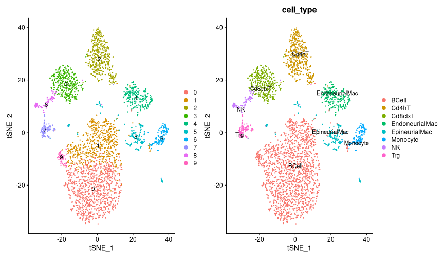
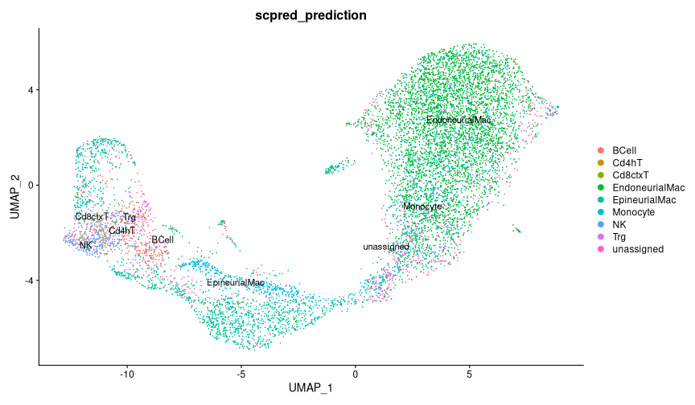
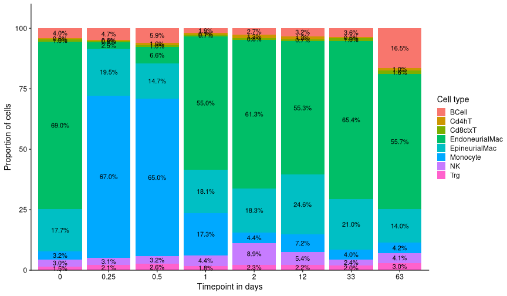
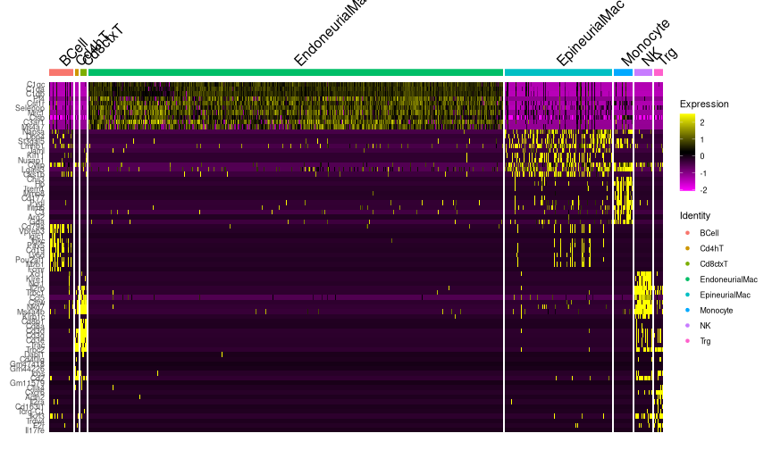
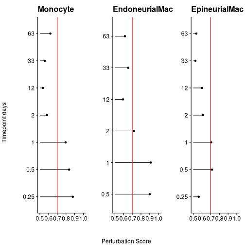

```r
# Load libraries and functions
suppressPackageStartupMessages({
  library(tidyverse)
  library(magrittr)
  library(Seurat)
  library(UpSetR)
  library(patchwork)
  library(enrichR)
  library(readxl)
  library(fcoex)
  library(scPred)
})
R.utils::sourceDirectory(here::here("R", "functions"), modifiedOnly=FALSE)
```


```r
# Load full data
(drg_ra_full <- readRDS(here::here("data", "proc", "drg_ra_full_merged.rds")))
```

```
## An object of class Seurat 
## 32285 features across 100421 samples within 1 assay 
## Active assay: RNA (32285 features, 2000 variable features)
##  3 dimensional reductions calculated: pca, harmony, umap
```


```r
# Plot UMAP of final merged dataset
DimPlot(drg_ra_full, label = TRUE) 
```

```
## Rasterizing points since number of points exceeds 100,000.
## To disable this behavior set `raster=FALSE`
```


#### Immune cell analysis

```r
# Subset immune cells
(immune_cells <- 
   drg_ra_full %>% 
   set_idents("cell_class") %>% 
   subset(idents = "ImmuneCell") %>%  
   set_idents("cell_class"))
```

```
## An object of class Seurat 
## 32285 features across 8946 samples within 1 assay 
## Active assay: RNA (32285 features, 2000 variable features)
##  3 dimensional reductions calculated: pca, harmony, umap
```


```r
# Check cell types, ok
immune_cells@meta.data$cell_class %>% unique()
```

```
## [1] "ImmuneCell"
```

#### Assign cell type labels

```r
# Load reference data and wrangle cell labels
# DOI: 10.1038/s41593-021-01005-1 
# Disentangling glial diversity in peripheral nerves at single-nuclei resolution
immune_atlas <-
  readRDS(here::here("data", "ref", "GSE182098_immune-cell_single-cell-atlas-15Jan2021.RDS"))

immune_atlas@meta.data %<>%
  mutate(cell_type = case_when(
    res.0.8 %in% c(0, 1, 9) ~ "BCell",
    res.0.8 == 2 ~ "Cd4hT",
    res.0.8 == 3 ~ "Cd8ctxT",
    res.0.8 == 4 ~ "EndoneurialMac",
    res.0.8 == 5 ~ "EpineurialMac",
    res.0.8 == 6 ~ "Monocyte",
    res.0.8 == 7 ~ "Trg",
    res.0.8 == 8 ~ "NK"
  ))
```


```r
# Plot UMAPS
DimPlot(immune_atlas, label = TRUE) +
  DimPlot(immune_atlas, label = TRUE, group.by = "cell_type", repel = TRUE)
```




```r
# Create classifier for immune cells
immune_atlas %<>%
  NormalizeData() %>%
  FindVariableFeatures() %>%
  ScaleData() %>%
  RunPCA(npcs = 100, verbose = FALSE)
```

```
## Centering and scaling data matrix
```

```r
immune_atlas %<>%
  getFeatureSpace("cell_type") %>%
  trainModel(model = "mda")
```

```
## Loading required package: lattice
```

```
## 
## Attaching package: 'lattice'
```

```
## The following object is masked from 'package:UpSetR':
## 
##     histogram
```

```
## 
## Attaching package: 'caret'
```

```
## The following object is masked from 'package:purrr':
## 
##     lift
```

```
## Warning: did not converge in 10 iterations

## Warning: did not converge in 10 iterations

## Warning: did not converge in 10 iterations

## Warning: did not converge in 10 iterations

## Warning: did not converge in 10 iterations

## Warning: did not converge in 10 iterations

## Warning: did not converge in 10 iterations

## Warning: did not converge in 10 iterations

## Warning: did not converge in 10 iterations

## Warning: did not converge in 10 iterations

## Warning: did not converge in 10 iterations
```


```r
# Check model performance
immune_atlas %>% get_scpred()
```

```
## 'scPred' object
## ✔  Prediction variable = cell_type 
## ✔  Discriminant features per cell type
## ✔  Training model(s)
## Summary
## 
## |Cell type      |    n| Features|Method |   ROC|  Sens|  Spec|
## |:--------------|----:|--------:|:------|-----:|-----:|-----:|
## |BCell          | 1778|      100|mda    | 0.994| 0.979| 0.981|
## |Cd4hT          |  485|      100|mda    | 0.995| 0.969| 0.991|
## |Cd8ctxT        |  394|      100|mda    | 0.993| 0.967| 0.977|
## |EndoneurialMac |  283|      100|mda    | 0.999| 0.951| 0.994|
## |EpineurialMac  |  219|      100|mda    | 0.995| 0.941| 0.997|
## |Monocyte       |  156|      100|mda    | 1.000| 0.981| 0.997|
## |NK             |  113|      100|mda    | 0.998| 0.840| 0.996|
## |Trg            |  115|      100|mda    | 0.999| 0.896| 0.998|
```


```r
# Cluster immune cells and predict labels 
immune_atlas %<>% set_idents("cell_type")
immune_cells %<>%
  cluster_seurat(dims = 1:10, resolution = 0.5) %>%
  scPredict(immune_atlas, max.iter.harmony = 50)
```

```
## 01:03:53 UMAP embedding parameters a = 0.9922 b = 1.112
```

```
## 01:03:53 Read 8946 rows and found 10 numeric columns
```

```
## 01:03:53 Using Annoy for neighbor search, n_neighbors = 30
```

```
## 01:03:53 Building Annoy index with metric = cosine, n_trees = 50
```

```
## 0%   10   20   30   40   50   60   70   80   90   100%
```

```
## [----|----|----|----|----|----|----|----|----|----|
```

```
## **************************************************|
## 01:03:54 Writing NN index file to temp file /scratch/27543998/RtmpnFzTEQ/file322677a5e071
## 01:03:54 Searching Annoy index using 1 thread, search_k = 3000
## 01:03:58 Annoy recall = 100%
## 01:03:59 Commencing smooth kNN distance calibration using 1 thread
## 01:04:01 Initializing from normalized Laplacian + noise
## 01:04:01 Commencing optimization for 500 epochs, with 389128 positive edges
## 01:04:26 Optimization finished
## Computing nearest neighbor graph
## Computing SNN
```

```
## Modularity Optimizer version 1.3.0 by Ludo Waltman and Nees Jan van Eck
## 
## Number of nodes: 8946
## Number of edges: 306755
## 
## Running Louvain algorithm...
## Maximum modularity in 10 random starts: 0.8721
## Number of communities: 11
## Elapsed time: 0 seconds
## ●  Matching reference with new dataset...
## 	 ─ 2000 features present in reference loadings
## 	 ─ 1979 features shared between reference and new dataset
## 	 ─ 98.95% of features in the reference are present in new dataset
## ●  Aligning new data to reference...
```

```
## Harmony 1/50
## Harmony 2/50
## Harmony converged after 2 iterations
```

```
## ●  Classifying cells...
## DONE!
```


```r
DimPlot(immune_cells,
          label = TRUE,
          group.by = "scpred_prediction",
          repel = TRUE)
```




```r
# Filter out  unassigned cells and add cell type to metadata
(immune_cells %<>%
  set_idents("scpred_prediction") %>%
  subset(
    idents = immune_cells@meta.data$scpred_prediction %>% unique() %>% keep(~ .x != "unassigned")
  ))
```

```
## An object of class Seurat 
## 32285 features across 8292 samples within 1 assay 
## Active assay: RNA (32285 features, 2000 variable features)
##  5 dimensional reductions calculated: pca, harmony, umap, scpred, scpred_projection
```

```r
immune_cells@meta.data %<>% 
  mutate(cell_type = scpred_prediction)
```


```r
# Plot cell type distribution across timepoints
immune_cells@meta.data %>%
  count(timepoint_days, cell_type) %>%
  group_by(timepoint_days) %>%
  mutate(pct = prop.table(n) * 100) %>%
  ggplot(aes(factor(timepoint_days), pct, fill = cell_type)) +
  geom_bar(stat = "identity") +
  geom_text(aes(label=paste0(sprintf("%1.1f", pct),"%")),
            position=position_stack(vjust=0.5)) +
  labs(x = "Timepoint in days", y = "Proportion of cells", fill = "Cell type") +
  cowplot::theme_cowplot() +
  scale_y_continuous(expand = expansion(mult = c(0, .1)))
```




```r
# Get markers for cell types
markers <-
  immune_cells %>%
  set_idents("treatment") %>% 
  subset(idents = "Control") %>% 
  set_idents("cell_type") %>%
  FindAllMarkers(only.pos = TRUE)
```

```
## Calculating cluster EndoneurialMac
```

```
## Calculating cluster EpineurialMac
```

```
## Calculating cluster Monocyte
```

```
## Calculating cluster BCell
```

```
## Calculating cluster NK
```

```
## Calculating cluster Cd8ctxT
```

```
## Calculating cluster Cd4hT
```

```
## Calculating cluster Trg
```


```r
# Heatmap of markers (Control only)
top_markers <-
  markers %>% 
  group_by(cluster) %>% 
  slice_min(p_val_adj, n = 10, with_ties = FALSE)

immune_cells %>% 
  ScaleData(rownames(immune_cells)) %>% 
  set_idents("treatment") %>% 
  subset(idents = "Control") %>% 
  DoHeatmap(top_markers$gene, group.by = "cell_type")
```

```
## Centering and scaling data matrix
```




```r
# Subset innate immune cells
(innate_cells <-
  immune_cells %>% 
  subset(idents = c("Monocyte", "EpineurialMac", "EndoneurialMac")))
```

```
## An object of class Seurat 
## 32285 features across 7218 samples within 1 assay 
## Active assay: RNA (32285 features, 2000 variable features)
##  5 dimensional reductions calculated: pca, harmony, umap, scpred, scpred_projection
```


```r
# Check for smallest cell groups in the data
innate_cells@meta.data %>% 
  count(cell_type, timepoint_days) %>% 
  arrange(n) %>% 
  head(10)
```

```
##         cell_type timepoint_days   n
## 1  EndoneurialMac           0.25  18
## 2        Monocyte          63.00  35
## 3        Monocyte           2.00  36
## 4  EndoneurialMac           0.50  48
## 5        Monocyte          33.00  57
## 6        Monocyte           0.00  65
## 7        Monocyte          12.00  87
## 8        Monocyte           1.00  98
## 9   EpineurialMac           1.00 102
## 10  EpineurialMac           0.50 107
```

#### Augur: Perturbation analysis

```r
# Add needed columns to metadata for running Augur
innate_cells@meta.data %<>%
  mutate(label = factor(timepoint_days))
```


```r
# Get a list of mouse protein coding genes excluding Y chromosome
# https://www.ensembl.org/biomart/martview/766d94f98a348ad7b78782227f808ad4
mouse_genes <- readRDS(here::here("data", "ref", "mouse_genes_ensembl.rds"))

genes_use <-
  mouse_genes  %>% 
  filter(
    Gene.name != "",
    Gene.type == "protein_coding",
    Chromosome.scaffold.name != "Y"
  )  %>% 
  pull(Gene.name)
```


```r
# Filter data and create a new Seurat object
innate_cells2 <- as.matrix(GetAssayData(innate_cells, slot = "counts"))
innate_cells2 <- innate_cells2[row.names(innate_cells2) %in% genes_use, ]

innate_cells2 %<>%  
  CreateSeuratObject() %>% 
  NormalizeData() %>% 
  FindVariableFeatures() %>% 
  ScaleData() %>% 
  RunPCA(npcs = 100, verbose = TRUE)
```

```
## Centering and scaling data matrix
```

```
## PC_ 1 
## Positive:  Ptn, Ptprz1, Prc1, Slc43a3, Gpm6b, Nr2f1, Phgdh, Emp2, Sox2, Timp3 
## 	   Fbln2, Lpar1, Pbk, Serpine2, Sorbs1, Mboat2, Top2a, Ppp1r14c, Mmd2, Nkain4 
## 	   Sparc, Cenpf, Plpp3, Nusap1, Sostdc1, Itgb8, Rarres2, Atp1b2, Pou3f2, Tpx2 
## Negative:  Ccl3, Ccl2, Cxcl2, Ccl4, Ccl12, Ccl7, Ms4a6d, Hmox1, Itgam, Mgl2 
## 	   Msr1, Ctla2b, Epsti1, Slfn5, Cbr2, Ccrl2, Wfdc17, Hspa1a, Cd38, Il1b 
## 	   Ifi211, Slamf9, Plau, Fcgr4, Tnfaip3, Clec4n, Bcl2a1d, Fgl2, Ccl9, Arhgdib 
## PC_ 2 
## Positive:  Atp1a2, Plp1, Gpm6b, Lpar1, Abca8a, Sparc, Slc4a4, Gpr37l1, Ptprz1, Fbln2 
## 	   Itgb8, Ednrb, Ntrk2, Bcan, Fabp7, Ttyh1, Timp3, Ndrg2, Sparcl1, Sostdc1 
## 	   Pdzd2, Col28a1, Fbln5, Mmd2, Adamts5, Sfrp5, Mt1, Ptn, Sox2, Rarres2 
## Negative:  Birc5, Pclaf, Rrm2, Mki67, Top2a, Cdca8, Ube2c, Ccna2, Nusap1, Spc24 
## 	   Cdca3, Cks1b, Cdk1, Kif11, Knl1, Kif15, Ccnb2, Gmnn, Esco2, Smc2 
## 	   Fbxo5, Aurkb, Dut, Ncapg, Hmgb2, Clspn, Hmmr, Kif23, Smc4, Kif4 
## PC_ 3 
## Positive:  Blvrb, Ccl2, Ccl12, Cbr2, Ccl7, Mgl2, Ctla2b, Hemgn, Gypa, Ccl3 
## 	   Hmox1, Pmp22, Hbb-bs, Slc4a1, Hba-a1, Rhd, Hbb-bt, Ermap, Ptma, Hba-a2 
## 	   Car2, Cldn13, Tspo2, Plau, Alas2, Pla2g2d, Klf1, Rhag, Hspa1a, Gatm 
## Negative:  S100a8, Pglyrp1, Wfdc21, Ifitm6, Hp, S100a9, S100a11, Mcemp1, Anxa1, Trem3 
## 	   Cd177, Lcn2, Slpi, Ngp, Gda, Trem1, Mmp8, Pygl, Gsr, Hdc 
## 	   Retnlg, Chil3, Lgals3, G0s2, Il1r2, Camp, Msrb1, Lrg1, Ltf, Itgb2l 
## PC_ 4 
## Positive:  Ngp, S100a9, Anxa1, Cd177, Pglyrp1, S100a8, Camp, Ltf, Itgb2l, Wfdc21 
## 	   Ly6g, Retnlg, Ramp1, Pygl, Mmp9, Syne1, G0s2, Mgl2, Chil1, Ltb4r1 
## 	   Mmp8, Cebpe, Plbd1, Trem1, Ifitm6, Il1r2, Mapk13, Mcemp1, Rflnb, Lsp1 
## Negative:  Ccl5, Irf7, Isg15, Ms4a4c, Oasl1, Zbp1, Ifit3, Rsad2, Ms4a6d, Gbp2 
## 	   Oasl2, Lgals3bp, Ifit1, Phf11d, Sod2, Fcgr4, Ifi206, Il1rn, Ifitm3, Ifi209 
## 	   Phf11b, Ifi213, Ifi211, Oas3, Isg20, Ifit2, Usp18, Saa3, Herc6, Cp 
## PC_ 5 
## Positive:  Crip1, Rpsa, Rps20, Cytip, Flt3, Napsa, Rpl14, Rplp0, P2ry10, Lsp1 
## 	   Ifi30, Tmsb10, Gm2a, Dpp4, Itgb7, Rpl10a, Rpl41, Gng10, Rps2, Bhlhe40 
## 	   S100a4, Syngr2, Klrd1, Cbfa2t3, Rnase6, Gpr171, H2-Oa, Nr4a2, Nme2, Bri3bp 
## Negative:  S100a9, S100a8, Wfdc21, Ngp, Retnlg, Cd177, Camp, Ltf, Itgb2l, Ly6g 
## 	   Mmp9, Chil1, Mmp8, Pglyrp1, G0s2, Lrg1, Cxcr2, Lcn2, Hdc, Trem1 
## 	   Trem3, Hba-a1, Hba-a2, Hbb-bs, Hbb-bt, Pygl, Rflnb, Slc4a1, Hemgn, Slfn4
```

```r
innate_cells2@meta.data <-
  innate_cells2@meta.data %>% 
  select(-orig.ident) %>% 
  bind_cols(
    innate_cells@meta.data %>% 
      select(label, cell_type, orig.ident, treatment)
  )
```


```r
# Check if ok
innate_cells2@meta.data %>% select(label, cell_type, treatment)
```

```
##                                                label      cell_type treatment
## AAAGGGCAGGTCATAA-1_1_1_1_1_1_1_1_1_1_1_1_1_1_1     0 EndoneurialMac   Control
## AAGAACAGTTAGTCGT-1_1_1_1_1_1_1_1_1_1_1_1_1_1_1     0 EndoneurialMac   Control
## AAGCCATCATGACCCG-1_1_1_1_1_1_1_1_1_1_1_1_1_1_1     0 EndoneurialMac   Control
## ACTGATGAGCCGTTGC-1_1_1_1_1_1_1_1_1_1_1_1_1_1_1     0 EndoneurialMac   Control
## AGATCCATCAAGTCTG-1_1_1_1_1_1_1_1_1_1_1_1_1_1_1     0 EndoneurialMac   Control
## CACAGGCGTAGAGCTG-1_1_1_1_1_1_1_1_1_1_1_1_1_1_1     0 EndoneurialMac   Control
## CCGATGGCATGGCCCA-1_1_1_1_1_1_1_1_1_1_1_1_1_1_1     0 EndoneurialMac   Control
## CCGGTAGGTTTGGAAA-1_1_1_1_1_1_1_1_1_1_1_1_1_1_1     0 EndoneurialMac   Control
## CGCGTGATCTAGAACC-1_1_1_1_1_1_1_1_1_1_1_1_1_1_1     0  EpineurialMac   Control
## CGGACACAGGTCTTTG-1_1_1_1_1_1_1_1_1_1_1_1_1_1_1     0 EndoneurialMac   Control
## CGGGACTCATCGGAAG-1_1_1_1_1_1_1_1_1_1_1_1_1_1_1     0 EndoneurialMac   Control
## GACCCAGGTTACGATC-1_1_1_1_1_1_1_1_1_1_1_1_1_1_1     0 EndoneurialMac   Control
## GCATGATTCCGTTGAA-1_1_1_1_1_1_1_1_1_1_1_1_1_1_1     0 EndoneurialMac   Control
## GGATGTTAGCGCCTCA-1_1_1_1_1_1_1_1_1_1_1_1_1_1_1     0  EpineurialMac   Control
## GTCATTTAGCGGTAAC-1_1_1_1_1_1_1_1_1_1_1_1_1_1_1     0 EndoneurialMac   Control
## GTGAGTTTCTAGCCAA-1_1_1_1_1_1_1_1_1_1_1_1_1_1_1     0  EpineurialMac   Control
## TGATCTTTCGAGATAA-1_1_1_1_1_1_1_1_1_1_1_1_1_1_1     0 EndoneurialMac   Control
## TGTCCACCATAGGAGC-1_1_1_1_1_1_1_1_1_1_1_1_1_1_1     0 EndoneurialMac   Control
## TTCCTTCGTTAGGCTT-1_1_1_1_1_1_1_1_1_1_1_1_1_1_1     0 EndoneurialMac   Control
## AATGACCAGTATTGCC-1_2_1_1_1_1_1_1_1_1_1_1_1_1_1     0 EndoneurialMac   Control
## ACACGCGGTGTTGATC-1_2_1_1_1_1_1_1_1_1_1_1_1_1_1     0  EpineurialMac   Control
## ACAGAAAGTGAATTGA-1_2_1_1_1_1_1_1_1_1_1_1_1_1_1     0  EpineurialMac   Control
## ACCATTTTCGGCCCAA-1_2_1_1_1_1_1_1_1_1_1_1_1_1_1     0 EndoneurialMac   Control
## ACGGAAGCACGCCAGT-1_2_1_1_1_1_1_1_1_1_1_1_1_1_1     0 EndoneurialMac   Control
## ACGTTCCGTAAGTAGT-1_2_1_1_1_1_1_1_1_1_1_1_1_1_1     0 EndoneurialMac   Control
## ACTATGGAGCTAGATA-1_2_1_1_1_1_1_1_1_1_1_1_1_1_1     0 EndoneurialMac   Control
## ACTATTCGTTGTGTAC-1_2_1_1_1_1_1_1_1_1_1_1_1_1_1     0 EndoneurialMac   Control
## AGAAGCGGTCGCATCG-1_2_1_1_1_1_1_1_1_1_1_1_1_1_1     0 EndoneurialMac   Control
## AGAGAATTCACGTAGT-1_2_1_1_1_1_1_1_1_1_1_1_1_1_1     0       Monocyte   Control
## AGGGCCTAGCTTCGTA-1_2_1_1_1_1_1_1_1_1_1_1_1_1_1     0 EndoneurialMac   Control
## AGTAGTCAGGAGGTTC-1_2_1_1_1_1_1_1_1_1_1_1_1_1_1     0 EndoneurialMac   Control
## AGTTCGACAGGAACCA-1_2_1_1_1_1_1_1_1_1_1_1_1_1_1     0 EndoneurialMac   Control
## ATCCTATAGCCGTAAG-1_2_1_1_1_1_1_1_1_1_1_1_1_1_1     0 EndoneurialMac   Control
## ATCGCCTGTAGTGCGA-1_2_1_1_1_1_1_1_1_1_1_1_1_1_1     0 EndoneurialMac   Control
## ATGAGGGAGGTTATAG-1_2_1_1_1_1_1_1_1_1_1_1_1_1_1     0 EndoneurialMac   Control
## ATGTCTTTCAATGCAC-1_2_1_1_1_1_1_1_1_1_1_1_1_1_1     0 EndoneurialMac   Control
## ATTCAGGGTTGGATCT-1_2_1_1_1_1_1_1_1_1_1_1_1_1_1     0 EndoneurialMac   Control
## ATTCATCTCCCATAGA-1_2_1_1_1_1_1_1_1_1_1_1_1_1_1     0 EndoneurialMac   Control
## CAATTTCGTAATGCGG-1_2_1_1_1_1_1_1_1_1_1_1_1_1_1     0 EndoneurialMac   Control
## CACCGTTAGCTCGAAG-1_2_1_1_1_1_1_1_1_1_1_1_1_1_1     0 EndoneurialMac   Control
## CATGCGGAGTGCTACT-1_2_1_1_1_1_1_1_1_1_1_1_1_1_1     0 EndoneurialMac   Control
## CCAAGCGTCCACGGAC-1_2_1_1_1_1_1_1_1_1_1_1_1_1_1     0 EndoneurialMac   Control
## CCAAGCGTCTCTGGTC-1_2_1_1_1_1_1_1_1_1_1_1_1_1_1     0 EndoneurialMac   Control
## CCATAAGAGGCTAGCA-1_2_1_1_1_1_1_1_1_1_1_1_1_1_1     0 EndoneurialMac   Control
## CGAGTGCCATAACGGG-1_2_1_1_1_1_1_1_1_1_1_1_1_1_1     0 EndoneurialMac   Control
## CGCATGGTCACCTCAC-1_2_1_1_1_1_1_1_1_1_1_1_1_1_1     0 EndoneurialMac   Control
## CGTGATAAGATCCCAT-1_2_1_1_1_1_1_1_1_1_1_1_1_1_1     0 EndoneurialMac   Control
## CTAACTTTCCGCACGA-1_2_1_1_1_1_1_1_1_1_1_1_1_1_1     0 EndoneurialMac   Control
## CTAGGTAGTCACAATC-1_2_1_1_1_1_1_1_1_1_1_1_1_1_1     0 EndoneurialMac   Control
## CTCCTTTTCTCGGGAC-1_2_1_1_1_1_1_1_1_1_1_1_1_1_1     0 EndoneurialMac   Control
## CTGCCATAGTGCACCC-1_2_1_1_1_1_1_1_1_1_1_1_1_1_1     0 EndoneurialMac   Control
## GAAATGAAGGTGCCTC-1_2_1_1_1_1_1_1_1_1_1_1_1_1_1     0 EndoneurialMac   Control
## GAACTGTGTACTCGCG-1_2_1_1_1_1_1_1_1_1_1_1_1_1_1     0 EndoneurialMac   Control
## GAAGGGTCATGGCTAT-1_2_1_1_1_1_1_1_1_1_1_1_1_1_1     0 EndoneurialMac   Control
## GACGTTAGTAAGGTCG-1_2_1_1_1_1_1_1_1_1_1_1_1_1_1     0 EndoneurialMac   Control
## GAGTCATGTGGACAGT-1_2_1_1_1_1_1_1_1_1_1_1_1_1_1     0 EndoneurialMac   Control
## GAGTCTACACGTCGGT-1_2_1_1_1_1_1_1_1_1_1_1_1_1_1     0 EndoneurialMac   Control
## GAGTTACCATGACAAA-1_2_1_1_1_1_1_1_1_1_1_1_1_1_1     0 EndoneurialMac   Control
## GATCACACACATGGTT-1_2_1_1_1_1_1_1_1_1_1_1_1_1_1     0 EndoneurialMac   Control
## GATGAGGCAGTTCCAA-1_2_1_1_1_1_1_1_1_1_1_1_1_1_1     0 EndoneurialMac   Control
## GCAGCTGAGTATGAGT-1_2_1_1_1_1_1_1_1_1_1_1_1_1_1     0 EndoneurialMac   Control
## GCCATGGAGGTGGGTT-1_2_1_1_1_1_1_1_1_1_1_1_1_1_1     0  EpineurialMac   Control
## GGGACTCGTTCCTACC-1_2_1_1_1_1_1_1_1_1_1_1_1_1_1     0 EndoneurialMac   Control
## GGGTTATCAAACGGCA-1_2_1_1_1_1_1_1_1_1_1_1_1_1_1     0  EpineurialMac   Control
## GTAACCAGTACAGAGC-1_2_1_1_1_1_1_1_1_1_1_1_1_1_1     0 EndoneurialMac   Control
## GTACAGTAGAGGCTGT-1_2_1_1_1_1_1_1_1_1_1_1_1_1_1     0 EndoneurialMac   Control
## GTCATCCTCCACTAGA-1_2_1_1_1_1_1_1_1_1_1_1_1_1_1     0 EndoneurialMac   Control
## GTGCAGCTCTCTTGCG-1_2_1_1_1_1_1_1_1_1_1_1_1_1_1     0 EndoneurialMac   Control
## GTGGAGACATGAGGGT-1_2_1_1_1_1_1_1_1_1_1_1_1_1_1     0 EndoneurialMac   Control
## GTGGTTACACTTGGCG-1_2_1_1_1_1_1_1_1_1_1_1_1_1_1     0  EpineurialMac   Control
## GTGTTCCTCACTTATC-1_2_1_1_1_1_1_1_1_1_1_1_1_1_1     0 EndoneurialMac   Control
## GTTCTATAGAGCATTA-1_2_1_1_1_1_1_1_1_1_1_1_1_1_1     0 EndoneurialMac   Control
## GTTTGGAAGGACAGTC-1_2_1_1_1_1_1_1_1_1_1_1_1_1_1     0 EndoneurialMac   Control
## TACACCCAGCGTACAG-1_2_1_1_1_1_1_1_1_1_1_1_1_1_1     0 EndoneurialMac   Control
## TACAGGTGTGGACCTC-1_2_1_1_1_1_1_1_1_1_1_1_1_1_1     0 EndoneurialMac   Control
## TAGGTACAGCTCTATG-1_2_1_1_1_1_1_1_1_1_1_1_1_1_1     0 EndoneurialMac   Control
## TATGTTCAGTACAGCG-1_2_1_1_1_1_1_1_1_1_1_1_1_1_1     0 EndoneurialMac   Control
## TCGTGCTAGGATCACG-1_2_1_1_1_1_1_1_1_1_1_1_1_1_1     0 EndoneurialMac   Control
## TCTCTGGTCATTGGTG-1_2_1_1_1_1_1_1_1_1_1_1_1_1_1     0 EndoneurialMac   Control
## TCTTCCTTCGACGAGA-1_2_1_1_1_1_1_1_1_1_1_1_1_1_1     0  EpineurialMac   Control
## TGACGCGAGCGACTAG-1_2_1_1_1_1_1_1_1_1_1_1_1_1_1     0 EndoneurialMac   Control
## TGATCAGTCACTTATC-1_2_1_1_1_1_1_1_1_1_1_1_1_1_1     0 EndoneurialMac   Control
## TGCTGAAAGTTCATGC-1_2_1_1_1_1_1_1_1_1_1_1_1_1_1     0 EndoneurialMac   Control
## TGTTACTAGGGCAATC-1_2_1_1_1_1_1_1_1_1_1_1_1_1_1     0 EndoneurialMac   Control
## TGTTCATTCATGTCTT-1_2_1_1_1_1_1_1_1_1_1_1_1_1_1     0 EndoneurialMac   Control
## TTAGTCTGTTCAGTAC-1_2_1_1_1_1_1_1_1_1_1_1_1_1_1     0 EndoneurialMac   Control
## TTCCTAAAGGTTTGAA-1_2_1_1_1_1_1_1_1_1_1_1_1_1_1     0 EndoneurialMac   Control
## TTGAGTGCAGATCCAT-1_2_1_1_1_1_1_1_1_1_1_1_1_1_1     0 EndoneurialMac   Control
## AAGCGAGAGGGTCAAC-1_1_1_1_1_1_1_1_1_1_1_1_1_1       0  EpineurialMac   Control
## ACATCCCTCCCATAAG-1_1_1_1_1_1_1_1_1_1_1_1_1_1       0 EndoneurialMac   Control
## ACATGCAAGAGTCCGA-1_1_1_1_1_1_1_1_1_1_1_1_1_1       0 EndoneurialMac   Control
## ACTATCTTCGAACCTA-1_1_1_1_1_1_1_1_1_1_1_1_1_1       0  EpineurialMac   Control
## ACTATGGAGAATTCAG-1_1_1_1_1_1_1_1_1_1_1_1_1_1       0       Monocyte   Control
## AGCCAATAGCGCAATG-1_1_1_1_1_1_1_1_1_1_1_1_1_1       0  EpineurialMac   Control
## AGTCAACGTTCCACAA-1_1_1_1_1_1_1_1_1_1_1_1_1_1       0 EndoneurialMac   Control
## CACTGTCGTACTCGCG-1_1_1_1_1_1_1_1_1_1_1_1_1_1       0  EpineurialMac   Control
## CCGTTCAGTTCTCGCT-1_1_1_1_1_1_1_1_1_1_1_1_1_1       0  EpineurialMac   Control
## CGTTGGGGTGTACGCC-1_1_1_1_1_1_1_1_1_1_1_1_1_1       0 EndoneurialMac   Control
## CTCAAGACATGCACTA-1_1_1_1_1_1_1_1_1_1_1_1_1_1       0  EpineurialMac   Control
## GCACATAGTCGAGTTT-1_1_1_1_1_1_1_1_1_1_1_1_1_1       0  EpineurialMac   Control
## GCACGGTTCTACACTT-1_1_1_1_1_1_1_1_1_1_1_1_1_1       0  EpineurialMac   Control
## GCTTCACTCCCAGGCA-1_1_1_1_1_1_1_1_1_1_1_1_1_1       0 EndoneurialMac   Control
## GGCGTCAAGTGCGACA-1_1_1_1_1_1_1_1_1_1_1_1_1_1       0 EndoneurialMac   Control
## GGGACAAAGAGTGTTA-1_1_1_1_1_1_1_1_1_1_1_1_1_1       0 EndoneurialMac   Control
## GTTACCCCATTCTTCA-1_1_1_1_1_1_1_1_1_1_1_1_1_1       0  EpineurialMac   Control
## TATTGGGCAGCCCAGT-1_1_1_1_1_1_1_1_1_1_1_1_1_1       0 EndoneurialMac   Control
## TCAGCCTAGCTGAAAT-1_1_1_1_1_1_1_1_1_1_1_1_1_1       0 EndoneurialMac   Control
## TCAGTCCCATTCTTCA-1_1_1_1_1_1_1_1_1_1_1_1_1_1       0  EpineurialMac   Control
## TCATCATTCTCTCAAT-1_1_1_1_1_1_1_1_1_1_1_1_1_1       0  EpineurialMac   Control
## TCCACGTAGTCTCGTA-1_1_1_1_1_1_1_1_1_1_1_1_1_1       0  EpineurialMac   Control
## TGAACGTAGACTCCGC-1_1_1_1_1_1_1_1_1_1_1_1_1_1       0 EndoneurialMac   Control
## TGAATGCCAGATACCT-1_1_1_1_1_1_1_1_1_1_1_1_1_1       0 EndoneurialMac   Control
## TGGGCTGAGTGAGGCT-1_1_1_1_1_1_1_1_1_1_1_1_1_1       0 EndoneurialMac   Control
## TGTGTGACACACTGGC-1_1_1_1_1_1_1_1_1_1_1_1_1_1       0  EpineurialMac   Control
## TGTTGAGTCACTGTCC-1_1_1_1_1_1_1_1_1_1_1_1_1_1       0 EndoneurialMac   Control
## TTCACGCAGCACGATG-1_1_1_1_1_1_1_1_1_1_1_1_1_1       0 EndoneurialMac   Control
## AACACACCAACACACT-1_2_1_1_1_1_1_1_1_1_1_1_1_1       0  EpineurialMac   Control
## AACACACTCCGATGTA-1_2_1_1_1_1_1_1_1_1_1_1_1_1       0 EndoneurialMac   Control
## AAGCATCTCACTGCTC-1_2_1_1_1_1_1_1_1_1_1_1_1_1       0 EndoneurialMac   Control
## AAGCCATGTGCGGTAA-1_2_1_1_1_1_1_1_1_1_1_1_1_1       0 EndoneurialMac   Control
## AATAGAGAGTAGGCCA-1_2_1_1_1_1_1_1_1_1_1_1_1_1       0 EndoneurialMac   Control
## ACATCCCGTCTAGATC-1_2_1_1_1_1_1_1_1_1_1_1_1_1       0 EndoneurialMac   Control
## ACCGTTCAGGCGCTTC-1_2_1_1_1_1_1_1_1_1_1_1_1_1       0 EndoneurialMac   Control
## ACCTACCCATCACGGC-1_2_1_1_1_1_1_1_1_1_1_1_1_1       0 EndoneurialMac   Control
## ACCTGAAGTCAAATCC-1_2_1_1_1_1_1_1_1_1_1_1_1_1       0 EndoneurialMac   Control
## ACGCACGAGTATGATG-1_2_1_1_1_1_1_1_1_1_1_1_1_1       0  EpineurialMac   Control
## ACGGAAGGTCACGACC-1_2_1_1_1_1_1_1_1_1_1_1_1_1       0 EndoneurialMac   Control
## AGACCATAGCGTCGAA-1_2_1_1_1_1_1_1_1_1_1_1_1_1       0  EpineurialMac   Control
## AGAGAATAGATTTGCC-1_2_1_1_1_1_1_1_1_1_1_1_1_1       0 EndoneurialMac   Control
## AGCGTATTCCCGGTAG-1_2_1_1_1_1_1_1_1_1_1_1_1_1       0 EndoneurialMac   Control
## AGGCATTGTGACACAG-1_2_1_1_1_1_1_1_1_1_1_1_1_1       0 EndoneurialMac   Control
## AGGGCTCTCCCTCTCC-1_2_1_1_1_1_1_1_1_1_1_1_1_1       0 EndoneurialMac   Control
## AGGTCTACAGGACTTT-1_2_1_1_1_1_1_1_1_1_1_1_1_1       0 EndoneurialMac   Control
## AGTCAACTCGTTACCC-1_2_1_1_1_1_1_1_1_1_1_1_1_1       0  EpineurialMac   Control
## ATACTTCTCTACCCAC-1_2_1_1_1_1_1_1_1_1_1_1_1_1       0  EpineurialMac   Control
## ATCCATTGTACCCAGC-1_2_1_1_1_1_1_1_1_1_1_1_1_1       0 EndoneurialMac   Control
## ATCCGTCAGGCCTAGA-1_2_1_1_1_1_1_1_1_1_1_1_1_1       0 EndoneurialMac   Control
## ATGAGGGGTCCCAAAT-1_2_1_1_1_1_1_1_1_1_1_1_1_1       0 EndoneurialMac   Control
## ATGAGTCGTGCACATT-1_2_1_1_1_1_1_1_1_1_1_1_1_1       0 EndoneurialMac   Control
## ATGGGAGCACCATAAC-1_2_1_1_1_1_1_1_1_1_1_1_1_1       0 EndoneurialMac   Control
## ATGGGTTTCTTGAACG-1_2_1_1_1_1_1_1_1_1_1_1_1_1       0 EndoneurialMac   Control
## CAAGGGAGTTCTCGTC-1_2_1_1_1_1_1_1_1_1_1_1_1_1       0 EndoneurialMac   Control
## CAATTTCGTGAGTCAG-1_2_1_1_1_1_1_1_1_1_1_1_1_1       0 EndoneurialMac   Control
## CAGGTATAGAAGGCTC-1_2_1_1_1_1_1_1_1_1_1_1_1_1       0 EndoneurialMac   Control
## CAGTGCGGTAGTTCCA-1_2_1_1_1_1_1_1_1_1_1_1_1_1       0 EndoneurialMac   Control
## CATTCTATCGCCTTGT-1_2_1_1_1_1_1_1_1_1_1_1_1_1       0 EndoneurialMac   Control
## CATTGTTAGAGCCTGA-1_2_1_1_1_1_1_1_1_1_1_1_1_1       0 EndoneurialMac   Control
## CCCATTGTCTGAGAGG-1_2_1_1_1_1_1_1_1_1_1_1_1_1       0 EndoneurialMac   Control
## CCCTCAAGTTACAGCT-1_2_1_1_1_1_1_1_1_1_1_1_1_1       0 EndoneurialMac   Control
## CCGAACGGTGACGCCT-1_2_1_1_1_1_1_1_1_1_1_1_1_1       0 EndoneurialMac   Control
## CCGGTAGAGCTCGCAC-1_2_1_1_1_1_1_1_1_1_1_1_1_1       0       Monocyte   Control
## CCGGTAGAGGTATCTC-1_2_1_1_1_1_1_1_1_1_1_1_1_1       0 EndoneurialMac   Control
## CCTATCGAGTGAATAC-1_2_1_1_1_1_1_1_1_1_1_1_1_1       0       Monocyte   Control
## CCTCACAGTCGAACGA-1_2_1_1_1_1_1_1_1_1_1_1_1_1       0 EndoneurialMac   Control
## CCTGCATAGTTCGCAT-1_2_1_1_1_1_1_1_1_1_1_1_1_1       0 EndoneurialMac   Control
## CCTTCAGCATAGGAGC-1_2_1_1_1_1_1_1_1_1_1_1_1_1       0 EndoneurialMac   Control
## CGAAGTTGTCTAACTG-1_2_1_1_1_1_1_1_1_1_1_1_1_1       0 EndoneurialMac   Control
## CGAGGCTAGTTTAGGA-1_2_1_1_1_1_1_1_1_1_1_1_1_1       0 EndoneurialMac   Control
## CGAGTGCCACGGAAGT-1_2_1_1_1_1_1_1_1_1_1_1_1_1       0 EndoneurialMac   Control
## CGCATGGCACAGTCCG-1_2_1_1_1_1_1_1_1_1_1_1_1_1       0 EndoneurialMac   Control
## CGGGCATGTGATACCT-1_2_1_1_1_1_1_1_1_1_1_1_1_1       0       Monocyte   Control
## CGTTAGACATTGTCGA-1_2_1_1_1_1_1_1_1_1_1_1_1_1       0 EndoneurialMac   Control
## CTAACCCCAGCGTAGA-1_2_1_1_1_1_1_1_1_1_1_1_1_1       0 EndoneurialMac   Control
## CTCAACCAGTGAACAT-1_2_1_1_1_1_1_1_1_1_1_1_1_1       0 EndoneurialMac   Control
## CTCCATGCATGAGTAA-1_2_1_1_1_1_1_1_1_1_1_1_1_1       0 EndoneurialMac   Control
## CTGCGAGAGGTTCTTG-1_2_1_1_1_1_1_1_1_1_1_1_1_1       0 EndoneurialMac   Control
## CTTCTCTTCGTCTAAG-1_2_1_1_1_1_1_1_1_1_1_1_1_1       0  EpineurialMac   Control
## GACGTTACACGACGAA-1_2_1_1_1_1_1_1_1_1_1_1_1_1       0 EndoneurialMac   Control
## GATGGAGCATAATCCG-1_2_1_1_1_1_1_1_1_1_1_1_1_1       0 EndoneurialMac   Control
## GGAGCAAAGTGTAGAT-1_2_1_1_1_1_1_1_1_1_1_1_1_1       0 EndoneurialMac   Control
## GGATGTTGTGGGTCAA-1_2_1_1_1_1_1_1_1_1_1_1_1_1       0 EndoneurialMac   Control
## GGCAGTCCACAATGAA-1_2_1_1_1_1_1_1_1_1_1_1_1_1       0 EndoneurialMac   Control
## GGCGTCAAGGTTACCT-1_2_1_1_1_1_1_1_1_1_1_1_1_1       0  EpineurialMac   Control
## GGCTGTGGTGGACTAG-1_2_1_1_1_1_1_1_1_1_1_1_1_1       0 EndoneurialMac   Control
## GGGAGTACAGCCCACA-1_2_1_1_1_1_1_1_1_1_1_1_1_1       0 EndoneurialMac   Control
## GGGTCTGAGTCTGCAT-1_2_1_1_1_1_1_1_1_1_1_1_1_1       0 EndoneurialMac   Control
## GGGTTATCAGGAGACT-1_2_1_1_1_1_1_1_1_1_1_1_1_1       0 EndoneurialMac   Control
## GGTAACTGTTGTAGCT-1_2_1_1_1_1_1_1_1_1_1_1_1_1       0  EpineurialMac   Control
## GGTGTCGTCACGGAGA-1_2_1_1_1_1_1_1_1_1_1_1_1_1       0       Monocyte   Control
## GTAATCGGTCCGATCG-1_2_1_1_1_1_1_1_1_1_1_1_1_1       0 EndoneurialMac   Control
## GTAGATCAGTTAACGA-1_2_1_1_1_1_1_1_1_1_1_1_1_1       0 EndoneurialMac   Control
## GTCACGGGTGCGAACA-1_2_1_1_1_1_1_1_1_1_1_1_1_1       0 EndoneurialMac   Control
## GTCATCCCAATTCACG-1_2_1_1_1_1_1_1_1_1_1_1_1_1       0  EpineurialMac   Control
## GTCATGACAGTTGTCA-1_2_1_1_1_1_1_1_1_1_1_1_1_1       0 EndoneurialMac   Control
## GTCTTTAGTAGCTTAC-1_2_1_1_1_1_1_1_1_1_1_1_1_1       0 EndoneurialMac   Control
## GTGCAGCGTACGACAG-1_2_1_1_1_1_1_1_1_1_1_1_1_1       0 EndoneurialMac   Control
## GTGCGTGCAATTGAGA-1_2_1_1_1_1_1_1_1_1_1_1_1_1       0 EndoneurialMac   Control
## GTGCGTGGTGTGGTCC-1_2_1_1_1_1_1_1_1_1_1_1_1_1       0  EpineurialMac   Control
## GTGGAAGGTTGCTAGT-1_2_1_1_1_1_1_1_1_1_1_1_1_1       0  EpineurialMac   Control
## GTGTTAGCAAGCTGCC-1_2_1_1_1_1_1_1_1_1_1_1_1_1       0 EndoneurialMac   Control
## GTTACGAGTCAGTCGC-1_2_1_1_1_1_1_1_1_1_1_1_1_1       0 EndoneurialMac   Control
## GTTGAACAGGACACTG-1_2_1_1_1_1_1_1_1_1_1_1_1_1       0 EndoneurialMac   Control
## TACAGGTAGTGATAGT-1_2_1_1_1_1_1_1_1_1_1_1_1_1       0       Monocyte   Control
## TAGACTGTCAAGGAGC-1_2_1_1_1_1_1_1_1_1_1_1_1_1       0       Monocyte   Control
## TAGGAGGAGACCAGCA-1_2_1_1_1_1_1_1_1_1_1_1_1_1       0 EndoneurialMac   Control
## TAGTGCACACATGAAA-1_2_1_1_1_1_1_1_1_1_1_1_1_1       0 EndoneurialMac   Control
## TATTCCACAGACCATT-1_2_1_1_1_1_1_1_1_1_1_1_1_1       0 EndoneurialMac   Control
## TATTGCTAGGGTCTTT-1_2_1_1_1_1_1_1_1_1_1_1_1_1       0 EndoneurialMac   Control
## TCACATTAGTTGAAAC-1_2_1_1_1_1_1_1_1_1_1_1_1_1       0 EndoneurialMac   Control
## TCACTCGAGATGCAGC-1_2_1_1_1_1_1_1_1_1_1_1_1_1       0 EndoneurialMac   Control
## TCAGGTATCGGCTCTT-1_2_1_1_1_1_1_1_1_1_1_1_1_1       0       Monocyte   Control
## TCAGTTTTCTGGCCGA-1_2_1_1_1_1_1_1_1_1_1_1_1_1       0  EpineurialMac   Control
## TCATACTAGTGATCGG-1_2_1_1_1_1_1_1_1_1_1_1_1_1       0 EndoneurialMac   Control
## TCATTTGGTATGAAGT-1_2_1_1_1_1_1_1_1_1_1_1_1_1       0 EndoneurialMac   Control
## TCCACGTTCTAGATCG-1_2_1_1_1_1_1_1_1_1_1_1_1_1       0 EndoneurialMac   Control
## TCCCACAGTATGCAAA-1_2_1_1_1_1_1_1_1_1_1_1_1_1       0 EndoneurialMac   Control
## TCGACCTAGGTGAGCT-1_2_1_1_1_1_1_1_1_1_1_1_1_1       0 EndoneurialMac   Control
## TCGGGCAGTTTCGTTT-1_2_1_1_1_1_1_1_1_1_1_1_1_1       0 EndoneurialMac   Control
## TGACAGTCATACCGTA-1_2_1_1_1_1_1_1_1_1_1_1_1_1       0 EndoneurialMac   Control
## TGACAGTTCTATCCAT-1_2_1_1_1_1_1_1_1_1_1_1_1_1       0 EndoneurialMac   Control
## TGATCAGTCCAGCTCT-1_2_1_1_1_1_1_1_1_1_1_1_1_1       0 EndoneurialMac   Control
## TGATGCACACCTGATA-1_2_1_1_1_1_1_1_1_1_1_1_1_1       0  EpineurialMac   Control
## TGCCGAGCACTGGAAG-1_2_1_1_1_1_1_1_1_1_1_1_1_1       0 EndoneurialMac   Control
## TGCGATATCAGCTTCC-1_2_1_1_1_1_1_1_1_1_1_1_1_1       0 EndoneurialMac   Control
## TGCTCGTAGATGCTTC-1_2_1_1_1_1_1_1_1_1_1_1_1_1       0 EndoneurialMac   Control
## TGCTCGTAGCAACCAG-1_2_1_1_1_1_1_1_1_1_1_1_1_1       0  EpineurialMac   Control
## TGGATGTAGTATTGCC-1_2_1_1_1_1_1_1_1_1_1_1_1_1       0 EndoneurialMac   Control
## TGGATGTAGTGGACGT-1_2_1_1_1_1_1_1_1_1_1_1_1_1       0 EndoneurialMac   Control
## TGGCGTGTCCCGAGGT-1_2_1_1_1_1_1_1_1_1_1_1_1_1       0 EndoneurialMac   Control
## TGGTACAGTCAGGTGA-1_2_1_1_1_1_1_1_1_1_1_1_1_1       0 EndoneurialMac   Control
## TGTACAGAGCCAAGGT-1_2_1_1_1_1_1_1_1_1_1_1_1_1       0       Monocyte   Control
## TGTACAGAGCCATGCC-1_2_1_1_1_1_1_1_1_1_1_1_1_1       0 EndoneurialMac   Control
## TGTCCCATCATTTCGT-1_2_1_1_1_1_1_1_1_1_1_1_1_1       0  EpineurialMac   Control
## TGTGATGGTCGCTCGA-1_2_1_1_1_1_1_1_1_1_1_1_1_1       0 EndoneurialMac   Control
## TGTGGCGGTGAGTAGC-1_2_1_1_1_1_1_1_1_1_1_1_1_1       0 EndoneurialMac   Control
## TGTTGGATCACTGTTT-1_2_1_1_1_1_1_1_1_1_1_1_1_1       0  EpineurialMac   Control
## TTCAATCGTTATCTGG-1_2_1_1_1_1_1_1_1_1_1_1_1_1       0 EndoneurialMac   Control
## TTGGTTTCATACACCA-1_2_1_1_1_1_1_1_1_1_1_1_1_1       0 EndoneurialMac   Control
## TTGTTCACAGAGAATT-1_2_1_1_1_1_1_1_1_1_1_1_1_1       0 EndoneurialMac   Control
## TTTCGATAGAGTGGCT-1_2_1_1_1_1_1_1_1_1_1_1_1_1       0 EndoneurialMac   Control
## AAACCCAGTCGATTTG-1_1_1_1_1_1_1_1_1_1_1_1_1         0 EndoneurialMac   Control
## AACCATGCAATCTGCA-1_1_1_1_1_1_1_1_1_1_1_1_1         0 EndoneurialMac   Control
## AACCTGATCACTCACC-1_1_1_1_1_1_1_1_1_1_1_1_1         0 EndoneurialMac   Control
## AAGGAATGTCTCACGG-1_1_1_1_1_1_1_1_1_1_1_1_1         0  EpineurialMac   Control
## AAGTACCCATACCGTA-1_1_1_1_1_1_1_1_1_1_1_1_1         0 EndoneurialMac   Control
## AATCGACTCGCCAATA-1_1_1_1_1_1_1_1_1_1_1_1_1         0 EndoneurialMac   Control
## ACAAAGAGTTACCTTT-1_1_1_1_1_1_1_1_1_1_1_1_1         0 EndoneurialMac   Control
## ACATCCCAGACATAAC-1_1_1_1_1_1_1_1_1_1_1_1_1         0 EndoneurialMac   Control
## ACGGGTCGTTTGTTGG-1_1_1_1_1_1_1_1_1_1_1_1_1         0 EndoneurialMac   Control
## ACGTAGTCAAGCCTGC-1_1_1_1_1_1_1_1_1_1_1_1_1         0 EndoneurialMac   Control
## ACTATGGTCCCTCGTA-1_1_1_1_1_1_1_1_1_1_1_1_1         0 EndoneurialMac   Control
## ACTGATGCATGGAACG-1_1_1_1_1_1_1_1_1_1_1_1_1         0 EndoneurialMac   Control
## ACTGATGGTACAAAGT-1_1_1_1_1_1_1_1_1_1_1_1_1         0 EndoneurialMac   Control
## AGAAATGAGGGTTAGC-1_1_1_1_1_1_1_1_1_1_1_1_1         0 EndoneurialMac   Control
## AGAAGCGGTTCGGCTG-1_1_1_1_1_1_1_1_1_1_1_1_1         0 EndoneurialMac   Control
## AGAAGTATCAGTGCGC-1_1_1_1_1_1_1_1_1_1_1_1_1         0 EndoneurialMac   Control
## AGACCATGTAGGTGCA-1_1_1_1_1_1_1_1_1_1_1_1_1         0 EndoneurialMac   Control
## AGACTCAGTTACCGTA-1_1_1_1_1_1_1_1_1_1_1_1_1         0 EndoneurialMac   Control
## AGGACTTGTCAATGGG-1_1_1_1_1_1_1_1_1_1_1_1_1         0 EndoneurialMac   Control
## AGGATAAGTTTCCATT-1_1_1_1_1_1_1_1_1_1_1_1_1         0 EndoneurialMac   Control
## AGGTCTATCTGGAGAG-1_1_1_1_1_1_1_1_1_1_1_1_1         0 EndoneurialMac   Control
## AGTGACTTCATTTGTC-1_1_1_1_1_1_1_1_1_1_1_1_1         0  EpineurialMac   Control
## ATACCGAAGATGATTG-1_1_1_1_1_1_1_1_1_1_1_1_1         0 EndoneurialMac   Control
## ATAGAGATCGCTCTAC-1_1_1_1_1_1_1_1_1_1_1_1_1         0 EndoneurialMac   Control
## ATCTTCATCTCACTCG-1_1_1_1_1_1_1_1_1_1_1_1_1         0 EndoneurialMac   Control
## ATTCAGGGTGTCTTGA-1_1_1_1_1_1_1_1_1_1_1_1_1         0  EpineurialMac   Control
## ATTCATCAGTTCATGC-1_1_1_1_1_1_1_1_1_1_1_1_1         0 EndoneurialMac   Control
## ATTCCCGTCCGCACTT-1_1_1_1_1_1_1_1_1_1_1_1_1         0 EndoneurialMac   Control
## ATTCGTTCATGTCTAG-1_1_1_1_1_1_1_1_1_1_1_1_1         0  EpineurialMac   Control
## CAACAGTTCTCCGAGG-1_1_1_1_1_1_1_1_1_1_1_1_1         0 EndoneurialMac   Control
## CAACCAACAGTCCGTG-1_1_1_1_1_1_1_1_1_1_1_1_1         0 EndoneurialMac   Control
## CAATGACTCGTCTCAC-1_1_1_1_1_1_1_1_1_1_1_1_1         0 EndoneurialMac   Control
## CACACAACAGTATGAA-1_1_1_1_1_1_1_1_1_1_1_1_1         0 EndoneurialMac   Control
## CACTTCGGTTCGGCCA-1_1_1_1_1_1_1_1_1_1_1_1_1         0 EndoneurialMac   Control
## CAGATCAAGGTCACCC-1_1_1_1_1_1_1_1_1_1_1_1_1         0 EndoneurialMac   Control
## CAGGTATTCTACTGCC-1_1_1_1_1_1_1_1_1_1_1_1_1         0 EndoneurialMac   Control
## CATACAGTCGCCACTT-1_1_1_1_1_1_1_1_1_1_1_1_1         0  EpineurialMac   Control
## CATGGTATCCGTGTAA-1_1_1_1_1_1_1_1_1_1_1_1_1         0 EndoneurialMac   Control
## CCACACTCAGGACATG-1_1_1_1_1_1_1_1_1_1_1_1_1         0  EpineurialMac   Control
## CCACGTTGTCCTACAA-1_1_1_1_1_1_1_1_1_1_1_1_1         0 EndoneurialMac   Control
## CCACTTGTCTTGAGCA-1_1_1_1_1_1_1_1_1_1_1_1_1         0 EndoneurialMac   Control
## CCATAAGTCTACAGGT-1_1_1_1_1_1_1_1_1_1_1_1_1         0 EndoneurialMac   Control
## CCCGGAAGTCATCGCG-1_1_1_1_1_1_1_1_1_1_1_1_1         0 EndoneurialMac   Control
## CCCTTAGCATGGGCAA-1_1_1_1_1_1_1_1_1_1_1_1_1         0 EndoneurialMac   Control
## CCGATCTCAACAGCTT-1_1_1_1_1_1_1_1_1_1_1_1_1         0 EndoneurialMac   Control
## CCGATGGGTACGTAGG-1_1_1_1_1_1_1_1_1_1_1_1_1         0 EndoneurialMac   Control
## CCGGTAGTCCAGGACC-1_1_1_1_1_1_1_1_1_1_1_1_1         0  EpineurialMac   Control
## CCGGTAGTCGACCACG-1_1_1_1_1_1_1_1_1_1_1_1_1         0  EpineurialMac   Control
## CCGGTAGTCGGCTTCT-1_1_1_1_1_1_1_1_1_1_1_1_1         0 EndoneurialMac   Control
## CCGGTGATCATTTGCT-1_1_1_1_1_1_1_1_1_1_1_1_1         0 EndoneurialMac   Control
## CCTATCGGTACACTCA-1_1_1_1_1_1_1_1_1_1_1_1_1         0 EndoneurialMac   Control
## CCTTCAGCAGAGTCTT-1_1_1_1_1_1_1_1_1_1_1_1_1         0 EndoneurialMac   Control
## CCTTCAGCATGACAGG-1_1_1_1_1_1_1_1_1_1_1_1_1         0 EndoneurialMac   Control
## CGACAGCCATTCACCC-1_1_1_1_1_1_1_1_1_1_1_1_1         0 EndoneurialMac   Control
## CGACAGCTCCTCAGGG-1_1_1_1_1_1_1_1_1_1_1_1_1         0 EndoneurialMac   Control
## CGGAATTCAGAAATCA-1_1_1_1_1_1_1_1_1_1_1_1_1         0 EndoneurialMac   Control
## CGGAGAAGTTGGACTT-1_1_1_1_1_1_1_1_1_1_1_1_1         0 EndoneurialMac   Control
## CGGGTGTAGCAGATAT-1_1_1_1_1_1_1_1_1_1_1_1_1         0 EndoneurialMac   Control
## CGGTCAGGTAGAGCTG-1_1_1_1_1_1_1_1_1_1_1_1_1         0 EndoneurialMac   Control
## CGTAAGTTCCGCTGTT-1_1_1_1_1_1_1_1_1_1_1_1_1         0 EndoneurialMac   Control
## CGTTCTGAGACTCATC-1_1_1_1_1_1_1_1_1_1_1_1_1         0 EndoneurialMac   Control
## CTACCCAAGCCTAACT-1_1_1_1_1_1_1_1_1_1_1_1_1         0 EndoneurialMac   Control
## CTCAACCCAAGCCTGC-1_1_1_1_1_1_1_1_1_1_1_1_1         0 EndoneurialMac   Control
## CTCACTGCACGGTGCT-1_1_1_1_1_1_1_1_1_1_1_1_1         0 EndoneurialMac   Control
## CTCCAACCAACGAGGT-1_1_1_1_1_1_1_1_1_1_1_1_1         0 EndoneurialMac   Control
## CTCCTCCAGTCGAATA-1_1_1_1_1_1_1_1_1_1_1_1_1         0 EndoneurialMac   Control
## CTGTACCTCGTGCTCT-1_1_1_1_1_1_1_1_1_1_1_1_1         0  EpineurialMac   Control
## CTTCCGATCTTGGTCC-1_1_1_1_1_1_1_1_1_1_1_1_1         0 EndoneurialMac   Control
## CTTCTCTTCGAGTACT-1_1_1_1_1_1_1_1_1_1_1_1_1         0 EndoneurialMac   Control
## CTTGATTTCCGTTGAA-1_1_1_1_1_1_1_1_1_1_1_1_1         0       Monocyte   Control
## GAAGCCCTCCACCTGT-1_1_1_1_1_1_1_1_1_1_1_1_1         0 EndoneurialMac   Control
## GAAGGACCACAATGTC-1_1_1_1_1_1_1_1_1_1_1_1_1         0  EpineurialMac   Control
## GAATAGAAGGTGCCAA-1_1_1_1_1_1_1_1_1_1_1_1_1         0 EndoneurialMac   Control
## GACTCAACAAGAGGTC-1_1_1_1_1_1_1_1_1_1_1_1_1         0 EndoneurialMac   Control
## GAGCCTGAGGCACTCC-1_1_1_1_1_1_1_1_1_1_1_1_1         0 EndoneurialMac   Control
## GAGGCCTCATCGATGT-1_1_1_1_1_1_1_1_1_1_1_1_1         0       Monocyte   Control
## GATGACTAGATGGCGT-1_1_1_1_1_1_1_1_1_1_1_1_1         0  EpineurialMac   Control
## GATGACTTCCTGTAGA-1_1_1_1_1_1_1_1_1_1_1_1_1         0 EndoneurialMac   Control
## GATTGGTAGCGAACTG-1_1_1_1_1_1_1_1_1_1_1_1_1         0 EndoneurialMac   Control
## GCAACATTCTACAGGT-1_1_1_1_1_1_1_1_1_1_1_1_1         0 EndoneurialMac   Control
## GCAGGCTCAGTACTAC-1_1_1_1_1_1_1_1_1_1_1_1_1         0 EndoneurialMac   Control
## GCTTCACCACGGTCTG-1_1_1_1_1_1_1_1_1_1_1_1_1         0 EndoneurialMac   Control
## GGCTTTCGTGGCCTCA-1_1_1_1_1_1_1_1_1_1_1_1_1         0 EndoneurialMac   Control
## GGGAAGTTCGTTCTAT-1_1_1_1_1_1_1_1_1_1_1_1_1         0 EndoneurialMac   Control
## GGGACCTAGTACCATC-1_1_1_1_1_1_1_1_1_1_1_1_1         0 EndoneurialMac   Control
## GGGACTCCAAGATCCT-1_1_1_1_1_1_1_1_1_1_1_1_1         0 EndoneurialMac   Control
## GGGAGTACAAGCAATA-1_1_1_1_1_1_1_1_1_1_1_1_1         0 EndoneurialMac   Control
## GGGTATTCAAATTAGG-1_1_1_1_1_1_1_1_1_1_1_1_1         0  EpineurialMac   Control
## GGGTCTGGTGCAATGG-1_1_1_1_1_1_1_1_1_1_1_1_1         0  EpineurialMac   Control
## GGGTTTATCATGGGAG-1_1_1_1_1_1_1_1_1_1_1_1_1         0 EndoneurialMac   Control
## GTCAGCGTCTGCTAGA-1_1_1_1_1_1_1_1_1_1_1_1_1         0 EndoneurialMac   Control
## GTCGCGAGTTGGGATG-1_1_1_1_1_1_1_1_1_1_1_1_1         0 EndoneurialMac   Control
## GTCTAGACAGAGTGTG-1_1_1_1_1_1_1_1_1_1_1_1_1         0 EndoneurialMac   Control
## GTGAGGATCTTTCCAA-1_1_1_1_1_1_1_1_1_1_1_1_1         0 EndoneurialMac   Control
## GTGGGAATCGATACAC-1_1_1_1_1_1_1_1_1_1_1_1_1         0 EndoneurialMac   Control
## TAATTCCTCGAGAGAC-1_1_1_1_1_1_1_1_1_1_1_1_1         0 EndoneurialMac   Control
## TACGTCCAGGGTTAGC-1_1_1_1_1_1_1_1_1_1_1_1_1         0  EpineurialMac   Control
## TAGACCATCTGTTCAT-1_1_1_1_1_1_1_1_1_1_1_1_1         0 EndoneurialMac   Control
## TATACCTAGAATTCAG-1_1_1_1_1_1_1_1_1_1_1_1_1         0 EndoneurialMac   Control
## TATTCCAAGGTAAGAG-1_1_1_1_1_1_1_1_1_1_1_1_1         0 EndoneurialMac   Control
## TATTCCACAGACCATT-1_1_1_1_1_1_1_1_1_1_1_1_1         0 EndoneurialMac   Control
## TCACACCAGTCATGAA-1_1_1_1_1_1_1_1_1_1_1_1_1         0  EpineurialMac   Control
## TCACACCTCAGCGCAC-1_1_1_1_1_1_1_1_1_1_1_1_1         0  EpineurialMac   Control
## TCAGCCTTCCTCAGGG-1_1_1_1_1_1_1_1_1_1_1_1_1         0       Monocyte   Control
## TCATACTCACTGTTCC-1_1_1_1_1_1_1_1_1_1_1_1_1         0 EndoneurialMac   Control
## TCATATCCATGACTTG-1_1_1_1_1_1_1_1_1_1_1_1_1         0 EndoneurialMac   Control
## TCATGCCTCTTCCTAA-1_1_1_1_1_1_1_1_1_1_1_1_1         0 EndoneurialMac   Control
## TCGAAGTGTTGCATAC-1_1_1_1_1_1_1_1_1_1_1_1_1         0  EpineurialMac   Control
## TCGTAGACAAGGGCAT-1_1_1_1_1_1_1_1_1_1_1_1_1         0 EndoneurialMac   Control
## TCTTGCGGTTATGTGC-1_1_1_1_1_1_1_1_1_1_1_1_1         0 EndoneurialMac   Control
## TGAATCGGTTAAGAAC-1_1_1_1_1_1_1_1_1_1_1_1_1         0 EndoneurialMac   Control
## TGACTCCAGACTAAGT-1_1_1_1_1_1_1_1_1_1_1_1_1         0 EndoneurialMac   Control
## TGAGACTGTTCTCCAC-1_1_1_1_1_1_1_1_1_1_1_1_1         0  EpineurialMac   Control
## TGAGACTTCGTCGGGT-1_1_1_1_1_1_1_1_1_1_1_1_1         0 EndoneurialMac   Control
## TGATCAGAGAATTGTG-1_1_1_1_1_1_1_1_1_1_1_1_1         0 EndoneurialMac   Control
## TGCATGAAGCTTCATG-1_1_1_1_1_1_1_1_1_1_1_1_1         0  EpineurialMac   Control
## TGGTACATCATTACCT-1_1_1_1_1_1_1_1_1_1_1_1_1         0 EndoneurialMac   Control
## TGTCCACGTTTACCTT-1_1_1_1_1_1_1_1_1_1_1_1_1         0 EndoneurialMac   Control
## TTAGGCATCGGCAGTC-1_1_1_1_1_1_1_1_1_1_1_1_1         0 EndoneurialMac   Control
## TTAGTCTTCATGCATG-1_1_1_1_1_1_1_1_1_1_1_1_1         0 EndoneurialMac   Control
## TTATTGCGTCCTGAAT-1_1_1_1_1_1_1_1_1_1_1_1_1         0 EndoneurialMac   Control
## TTCAGGAAGTTGGAAT-1_1_1_1_1_1_1_1_1_1_1_1_1         0 EndoneurialMac   Control
## TTCAGGATCATAGGCT-1_1_1_1_1_1_1_1_1_1_1_1_1         0 EndoneurialMac   Control
## TTCCGGTCATGACTTG-1_1_1_1_1_1_1_1_1_1_1_1_1         0  EpineurialMac   Control
## TTCCGTGGTAAGGCCA-1_1_1_1_1_1_1_1_1_1_1_1_1         0 EndoneurialMac   Control
## TTCCTTCGTCCGCAGT-1_1_1_1_1_1_1_1_1_1_1_1_1         0  EpineurialMac   Control
## TTCGCTGGTCCATACA-1_1_1_1_1_1_1_1_1_1_1_1_1         0  EpineurialMac   Control
## TTGGATGAGACGCCAA-1_1_1_1_1_1_1_1_1_1_1_1_1         0 EndoneurialMac   Control
## TTGTGGAAGGTCATAA-1_1_1_1_1_1_1_1_1_1_1_1_1         0 EndoneurialMac   Control
## TTTCACAGTGACTAAA-1_1_1_1_1_1_1_1_1_1_1_1_1         0 EndoneurialMac   Control
## AAGCCATAGACTCATC-1_2_1_1_1_1_1_1_1_1_1_1_1         0 EndoneurialMac   Control
## AGCGCTGCAAATCGTC-1_2_1_1_1_1_1_1_1_1_1_1_1         0 EndoneurialMac   Control
## CCATCACTCGATGCAT-1_2_1_1_1_1_1_1_1_1_1_1_1         0       Monocyte   Control
## CGAGTGCGTAGACAGC-1_2_1_1_1_1_1_1_1_1_1_1_1         0 EndoneurialMac   Control
## CTCAACCCAGACCAAG-1_2_1_1_1_1_1_1_1_1_1_1_1         0 EndoneurialMac   Control
## GAGGGATCAGATCACT-1_2_1_1_1_1_1_1_1_1_1_1_1         0 EndoneurialMac   Control
## GCAGCTGTCCCGAGGT-1_2_1_1_1_1_1_1_1_1_1_1_1         0 EndoneurialMac   Control
## GCAGGCTGTGATGGCA-1_2_1_1_1_1_1_1_1_1_1_1_1         0 EndoneurialMac   Control
## TGCACGGTCCCAGGCA-1_2_1_1_1_1_1_1_1_1_1_1_1         0 EndoneurialMac   Control
## TGTCCTGGTTAGTCGT-1_2_1_1_1_1_1_1_1_1_1_1_1         0 EndoneurialMac   Control
## AACAAGAGTTTCGTTT-1_1_1_1_1_1_1_1_1_1_1_1           0 EndoneurialMac   Control
## AACCACAAGTGACCTT-1_1_1_1_1_1_1_1_1_1_1_1           0 EndoneurialMac   Control
## AAGCGTTTCGGTCAGC-1_1_1_1_1_1_1_1_1_1_1_1           0 EndoneurialMac   Control
## AATGAAGGTGCTGTCG-1_1_1_1_1_1_1_1_1_1_1_1           0 EndoneurialMac   Control
## ACATCGACACGGCGTT-1_1_1_1_1_1_1_1_1_1_1_1           0 EndoneurialMac   Control
## ACGCACGAGCTAAATG-1_1_1_1_1_1_1_1_1_1_1_1           0       Monocyte   Control
## AGAAGTATCATGCGGC-1_1_1_1_1_1_1_1_1_1_1_1           0 EndoneurialMac   Control
## AGCTACAAGAACGTGC-1_1_1_1_1_1_1_1_1_1_1_1           0 EndoneurialMac   Control
## AGGACTTTCATGGATC-1_1_1_1_1_1_1_1_1_1_1_1           0 EndoneurialMac   Control
## AGGTCATAGATTGACA-1_1_1_1_1_1_1_1_1_1_1_1           0 EndoneurialMac   Control
## AGTAGCTGTTTGGGAG-1_1_1_1_1_1_1_1_1_1_1_1           0       Monocyte   Control
## AGTAGCTTCTAGCAAC-1_1_1_1_1_1_1_1_1_1_1_1           0  EpineurialMac   Control
## AGTCACAAGCGTTCCG-1_1_1_1_1_1_1_1_1_1_1_1           0 EndoneurialMac   Control
## AGTTCCCCAACCGTAT-1_1_1_1_1_1_1_1_1_1_1_1           0 EndoneurialMac   Control
## ATCGTAGCAGTAACAA-1_1_1_1_1_1_1_1_1_1_1_1           0 EndoneurialMac   Control
## ATCGTAGGTTAGGCCC-1_1_1_1_1_1_1_1_1_1_1_1           0  EpineurialMac   Control
## ATGGATCAGCATCTTG-1_1_1_1_1_1_1_1_1_1_1_1           0 EndoneurialMac   Control
## ATTCATCTCGTTGTGA-1_1_1_1_1_1_1_1_1_1_1_1           0 EndoneurialMac   Control
## CACTAAGTCCCGTTCA-1_1_1_1_1_1_1_1_1_1_1_1           0 EndoneurialMac   Control
## CAGCAATCAGAACCGA-1_1_1_1_1_1_1_1_1_1_1_1           0 EndoneurialMac   Control
## CATGAGTCAATACGAA-1_1_1_1_1_1_1_1_1_1_1_1           0 EndoneurialMac   Control
## CCTAACCAGAACAAGG-1_1_1_1_1_1_1_1_1_1_1_1           0 EndoneurialMac   Control
## CGATGGCAGTTACGAA-1_1_1_1_1_1_1_1_1_1_1_1           0 EndoneurialMac   Control
## CGGAACCCAAGCGCTC-1_1_1_1_1_1_1_1_1_1_1_1           0  EpineurialMac   Control
## CGTAAGTCAAAGCGTG-1_1_1_1_1_1_1_1_1_1_1_1           0 EndoneurialMac   Control
## CTACAGAAGGTTAGTA-1_1_1_1_1_1_1_1_1_1_1_1           0 EndoneurialMac   Control
## CTACCTGAGGTCATCT-1_1_1_1_1_1_1_1_1_1_1_1           0 EndoneurialMac   Control
## CTAGGTATCGCGGACT-1_1_1_1_1_1_1_1_1_1_1_1           0  EpineurialMac   Control
## CTCCTCCAGGTCCTGC-1_1_1_1_1_1_1_1_1_1_1_1           0 EndoneurialMac   Control
## CTGAGCGTCTGCGTCT-1_1_1_1_1_1_1_1_1_1_1_1           0 EndoneurialMac   Control
## GACCTTCTCGATACTG-1_1_1_1_1_1_1_1_1_1_1_1           0 EndoneurialMac   Control
## GACTGATGTAGCGTAG-1_1_1_1_1_1_1_1_1_1_1_1           0 EndoneurialMac   Control
## GAGATGGTCTTCACGC-1_1_1_1_1_1_1_1_1_1_1_1           0       Monocyte   Control
## GAGGGTAGTCGGAACA-1_1_1_1_1_1_1_1_1_1_1_1           0 EndoneurialMac   Control
## GAGTTTGTCAGAGTTC-1_1_1_1_1_1_1_1_1_1_1_1           0 EndoneurialMac   Control
## GATAGAACAGCTCGGT-1_1_1_1_1_1_1_1_1_1_1_1           0 EndoneurialMac   Control
## GATGTTGTCAGAGCAG-1_1_1_1_1_1_1_1_1_1_1_1           0 EndoneurialMac   Control
## GCACTAACAGGTATGG-1_1_1_1_1_1_1_1_1_1_1_1           0 EndoneurialMac   Control
## GCAGCCAAGAAGCGAA-1_1_1_1_1_1_1_1_1_1_1_1           0 EndoneurialMac   Control
## GCAGGCTGTCATCCCT-1_1_1_1_1_1_1_1_1_1_1_1           0 EndoneurialMac   Control
## GGAGAACAGCAATTAG-1_1_1_1_1_1_1_1_1_1_1_1           0 EndoneurialMac   Control
## GGGACCTTCCCTCATG-1_1_1_1_1_1_1_1_1_1_1_1           0  EpineurialMac   Control
## GGGTTATTCGAGTGGA-1_1_1_1_1_1_1_1_1_1_1_1           0 EndoneurialMac   Control
## GGTCACGGTCCAGCAC-1_1_1_1_1_1_1_1_1_1_1_1           0       Monocyte   Control
## GTAGAAAAGGGACAGG-1_1_1_1_1_1_1_1_1_1_1_1           0 EndoneurialMac   Control
## GTCATCCCAAATTGCC-1_1_1_1_1_1_1_1_1_1_1_1           0       Monocyte   Control
## GTGCAGCTCGTCCTTG-1_1_1_1_1_1_1_1_1_1_1_1           0 EndoneurialMac   Control
## GTGCGTGAGTGGTTAA-1_1_1_1_1_1_1_1_1_1_1_1           0  EpineurialMac   Control
## GTTCCGTTCCTTCACG-1_1_1_1_1_1_1_1_1_1_1_1           0 EndoneurialMac   Control
## GTTGCTCTCCAAGCCG-1_1_1_1_1_1_1_1_1_1_1_1           0 EndoneurialMac   Control
## TAAGCACGTCAGTTTG-1_1_1_1_1_1_1_1_1_1_1_1           0 EndoneurialMac   Control
## TACCGGGGTCTGGTTA-1_1_1_1_1_1_1_1_1_1_1_1           0 EndoneurialMac   Control
## TACGGTATCATCTGTT-1_1_1_1_1_1_1_1_1_1_1_1           0 EndoneurialMac   Control
## TACGGTATCGCTCTCA-1_1_1_1_1_1_1_1_1_1_1_1           0 EndoneurialMac   Control
## TACTTGTCAGCGAGTA-1_1_1_1_1_1_1_1_1_1_1_1           0 EndoneurialMac   Control
## TATCAGGCAAGCACAG-1_1_1_1_1_1_1_1_1_1_1_1           0 EndoneurialMac   Control
## TATCTTGTCCCGAATA-1_1_1_1_1_1_1_1_1_1_1_1           0 EndoneurialMac   Control
## TCACATTTCATTCTTG-1_1_1_1_1_1_1_1_1_1_1_1           0 EndoneurialMac   Control
## TCACTATCAATTGAGA-1_1_1_1_1_1_1_1_1_1_1_1           0 EndoneurialMac   Control
## TCAGGGCGTACCTAGT-1_1_1_1_1_1_1_1_1_1_1_1           0 EndoneurialMac   Control
## TCAGTTTTCTAAGGAA-1_1_1_1_1_1_1_1_1_1_1_1           0 EndoneurialMac   Control
## TCATGCCCAGCTCGGT-1_1_1_1_1_1_1_1_1_1_1_1           0 EndoneurialMac   Control
## TCATTCAAGGATACAT-1_1_1_1_1_1_1_1_1_1_1_1           0 EndoneurialMac   Control
## TCCGTGTCATAACGGG-1_1_1_1_1_1_1_1_1_1_1_1           0 EndoneurialMac   Control
## TGAATCGCAGAGCGTA-1_1_1_1_1_1_1_1_1_1_1_1           0 EndoneurialMac   Control
## TGACTCCCAGCTGTCG-1_1_1_1_1_1_1_1_1_1_1_1           0 EndoneurialMac   Control
## TGCCGAGAGTACCCTA-1_1_1_1_1_1_1_1_1_1_1_1           0 EndoneurialMac   Control
## TGCGGGTTCGGTGTTA-1_1_1_1_1_1_1_1_1_1_1_1           0 EndoneurialMac   Control
## TGCTCGTGTTGTGGCC-1_1_1_1_1_1_1_1_1_1_1_1           0 EndoneurialMac   Control
## TGGATCAGTTCGAACT-1_1_1_1_1_1_1_1_1_1_1_1           0 EndoneurialMac   Control
## TGTCCACAGACCAACG-1_1_1_1_1_1_1_1_1_1_1_1           0 EndoneurialMac   Control
## TGTTCATGTGCGTCGT-1_1_1_1_1_1_1_1_1_1_1_1           0 EndoneurialMac   Control
## TGTTGAGAGTGGTGAC-1_1_1_1_1_1_1_1_1_1_1_1           0 EndoneurialMac   Control
## TTCGGTCTCGCTAGCG-1_1_1_1_1_1_1_1_1_1_1_1           0 EndoneurialMac   Control
## TTCTAGTTCGGACTGC-1_1_1_1_1_1_1_1_1_1_1_1           0 EndoneurialMac   Control
## TTCTTGATCATAGACC-1_1_1_1_1_1_1_1_1_1_1_1           0 EndoneurialMac   Control
## TTGTTCAGTGGTCAAG-1_1_1_1_1_1_1_1_1_1_1_1           0 EndoneurialMac   Control
## AAAGGTACACAAATGA-1_2_1_1_1_1_1_1_1_1_1_1           0 EndoneurialMac   Control
## AAATGGAGTGTAGTGG-1_2_1_1_1_1_1_1_1_1_1_1           0 EndoneurialMac   Control
## AACAAAGAGGCATTTC-1_2_1_1_1_1_1_1_1_1_1_1           0 EndoneurialMac   Control
## AAGATAGTCCAAGCTA-1_2_1_1_1_1_1_1_1_1_1_1           0 EndoneurialMac   Control
## AAGCATCGTACGAGTG-1_2_1_1_1_1_1_1_1_1_1_1           0 EndoneurialMac   Control
## AAGCCATAGTTCGCAT-1_2_1_1_1_1_1_1_1_1_1_1           0 EndoneurialMac   Control
## AAGCCATCAAATCGGG-1_2_1_1_1_1_1_1_1_1_1_1           0 EndoneurialMac   Control
## AAGCCATTCGATCCAA-1_2_1_1_1_1_1_1_1_1_1_1           0 EndoneurialMac   Control
## AAGTGAAGTTTGACAC-1_2_1_1_1_1_1_1_1_1_1_1           0 EndoneurialMac   Control
## AATGGAATCCGGGACT-1_2_1_1_1_1_1_1_1_1_1_1           0 EndoneurialMac   Control
## ACAGGGAAGAGGACTC-1_2_1_1_1_1_1_1_1_1_1_1           0 EndoneurialMac   Control
## ACATCGAGTGTTACTG-1_2_1_1_1_1_1_1_1_1_1_1           0 EndoneurialMac   Control
## ACGGTCGAGATGCTGG-1_2_1_1_1_1_1_1_1_1_1_1           0 EndoneurialMac   Control
## ACGTACACATGATCTG-1_2_1_1_1_1_1_1_1_1_1_1           0 EndoneurialMac   Control
## ACTATTCTCACGAGGA-1_2_1_1_1_1_1_1_1_1_1_1           0 EndoneurialMac   Control
## AGAACAAAGTCATCGT-1_2_1_1_1_1_1_1_1_1_1_1           0 EndoneurialMac   Control
## AGAAGCGAGCGATGAC-1_2_1_1_1_1_1_1_1_1_1_1           0 EndoneurialMac   Control
## AGACAGGGTGGAGGTT-1_2_1_1_1_1_1_1_1_1_1_1           0 EndoneurialMac   Control
## AGACTCATCGGACTTA-1_2_1_1_1_1_1_1_1_1_1_1           0 EndoneurialMac   Control
## AGAGCCCAGAGTCAGC-1_2_1_1_1_1_1_1_1_1_1_1           0 EndoneurialMac   Control
## AGAGCCCCACTTGAAC-1_2_1_1_1_1_1_1_1_1_1_1           0 EndoneurialMac   Control
## AGGACTTGTCACTAGT-1_2_1_1_1_1_1_1_1_1_1_1           0 EndoneurialMac   Control
## AGTACTGTCAGCGGAA-1_2_1_1_1_1_1_1_1_1_1_1           0 EndoneurialMac   Control
## AGTCAACGTCGAACAG-1_2_1_1_1_1_1_1_1_1_1_1           0 EndoneurialMac   Control
## AGTCATGTCCAGTACA-1_2_1_1_1_1_1_1_1_1_1_1           0 EndoneurialMac   Control
## AGTCTCCAGATTGGGC-1_2_1_1_1_1_1_1_1_1_1_1           0 EndoneurialMac   Control
## AGTGATCAGGCTGTAG-1_2_1_1_1_1_1_1_1_1_1_1           0 EndoneurialMac   Control
## ATCACAGTCCTTTGAT-1_2_1_1_1_1_1_1_1_1_1_1           0 EndoneurialMac   Control
## ATCGATGTCCTAACAG-1_2_1_1_1_1_1_1_1_1_1_1           0 EndoneurialMac   Control
## ATGAAAGGTCTACTGA-1_2_1_1_1_1_1_1_1_1_1_1           0 EndoneurialMac   Control
## ATGAGGGCAGCGTTGC-1_2_1_1_1_1_1_1_1_1_1_1           0 EndoneurialMac   Control
## ATTCGTTTCTGTCCCA-1_2_1_1_1_1_1_1_1_1_1_1           0 EndoneurialMac   Control
## ATTGTTCTCCGACATA-1_2_1_1_1_1_1_1_1_1_1_1           0 EndoneurialMac   Control
## ATTTCTGAGGCCTAAG-1_2_1_1_1_1_1_1_1_1_1_1           0 EndoneurialMac   Control
## CAAGACTAGGCACAAC-1_2_1_1_1_1_1_1_1_1_1_1           0 EndoneurialMac   Control
## CAGATCAAGTCTAGCT-1_2_1_1_1_1_1_1_1_1_1_1           0 EndoneurialMac   Control
## CAGGGCTCAAATGATG-1_2_1_1_1_1_1_1_1_1_1_1           0 EndoneurialMac   Control
## CAGTTCCTCGGTAACT-1_2_1_1_1_1_1_1_1_1_1_1           0 EndoneurialMac   Control
## CATCCCATCCGATTAG-1_2_1_1_1_1_1_1_1_1_1_1           0 EndoneurialMac   Control
## CATTGAGAGAACCCGA-1_2_1_1_1_1_1_1_1_1_1_1           0 EndoneurialMac   Control
## CCACAAAGTATCGTTG-1_2_1_1_1_1_1_1_1_1_1_1           0 EndoneurialMac   Control
## CCACACTGTAAGTCAA-1_2_1_1_1_1_1_1_1_1_1_1           0 EndoneurialMac   Control
## CCATAAGCACCGTGAC-1_2_1_1_1_1_1_1_1_1_1_1           0 EndoneurialMac   Control
## CCCTCAAGTCTTCATT-1_2_1_1_1_1_1_1_1_1_1_1           0 EndoneurialMac   Control
## CCCTTAGTCCAAAGGG-1_2_1_1_1_1_1_1_1_1_1_1           0 EndoneurialMac   Control
## CCGGGTAGTCACTTAG-1_2_1_1_1_1_1_1_1_1_1_1           0 EndoneurialMac   Control
## CCGGTAGTCTTAAGGC-1_2_1_1_1_1_1_1_1_1_1_1           0 EndoneurialMac   Control
## CCGTGAGGTCCAGTTA-1_2_1_1_1_1_1_1_1_1_1_1           0 EndoneurialMac   Control
## CCTACGTCAGGAACCA-1_2_1_1_1_1_1_1_1_1_1_1           0 EndoneurialMac   Control
## CCTCAGTCAATACCTG-1_2_1_1_1_1_1_1_1_1_1_1           0 EndoneurialMac   Control
## CCTGTTGAGAGAGAAC-1_2_1_1_1_1_1_1_1_1_1_1           0 EndoneurialMac   Control
## CCTTGTGAGCTGCCTG-1_2_1_1_1_1_1_1_1_1_1_1           0 EndoneurialMac   Control
## CGAGTGCAGGTGTGAC-1_2_1_1_1_1_1_1_1_1_1_1           0 EndoneurialMac   Control
## CGTAATGGTGTCCTAA-1_2_1_1_1_1_1_1_1_1_1_1           0 EndoneurialMac   Control
## CGTCAAACAACAGCCC-1_2_1_1_1_1_1_1_1_1_1_1           0 EndoneurialMac   Control
## CGTCAAATCAGCTGTA-1_2_1_1_1_1_1_1_1_1_1_1           0 EndoneurialMac   Control
## CGTCCATTCAGAGCAG-1_2_1_1_1_1_1_1_1_1_1_1           0 EndoneurialMac   Control
## CGTTAGACACGTACTA-1_2_1_1_1_1_1_1_1_1_1_1           0 EndoneurialMac   Control
## CTCCACAGTCGCGGTT-1_2_1_1_1_1_1_1_1_1_1_1           0 EndoneurialMac   Control
## CTCTCAGAGGTGGGTT-1_2_1_1_1_1_1_1_1_1_1_1           0 EndoneurialMac   Control
## CTGCAGGTCTGATGGT-1_2_1_1_1_1_1_1_1_1_1_1           0 EndoneurialMac   Control
## CTGTGAAAGGTGCCTC-1_2_1_1_1_1_1_1_1_1_1_1           0 EndoneurialMac   Control
## CTTCCGACAGAGTGTG-1_2_1_1_1_1_1_1_1_1_1_1           0 EndoneurialMac   Control
## CTTCTAAAGCTGACCC-1_2_1_1_1_1_1_1_1_1_1_1           0 EndoneurialMac   Control
## GAACTGTAGTTGCCCG-1_2_1_1_1_1_1_1_1_1_1_1           0 EndoneurialMac   Control
## GAAGCGAGTCATCGCG-1_2_1_1_1_1_1_1_1_1_1_1           0 EndoneurialMac   Control
## GAATAGAGTACTCGAT-1_2_1_1_1_1_1_1_1_1_1_1           0 EndoneurialMac   Control
## GACCAATAGCTAGATA-1_2_1_1_1_1_1_1_1_1_1_1           0 EndoneurialMac   Control
## GAGACTTCAGGTCCCA-1_2_1_1_1_1_1_1_1_1_1_1           0 EndoneurialMac   Control
## GATCGTAGTGATTCTG-1_2_1_1_1_1_1_1_1_1_1_1           0 EndoneurialMac   Control
## GCCAACGAGGCCCGTT-1_2_1_1_1_1_1_1_1_1_1_1           0  EpineurialMac   Control
## GCCATTCAGCTGTTAC-1_2_1_1_1_1_1_1_1_1_1_1           0 EndoneurialMac   Control
## GCCCAGATCTTGGAAC-1_2_1_1_1_1_1_1_1_1_1_1           0 EndoneurialMac   Control
## GCGATCGGTAGCGTAG-1_2_1_1_1_1_1_1_1_1_1_1           0 EndoneurialMac   Control
## GCGATCGTCTCCGCAT-1_2_1_1_1_1_1_1_1_1_1_1           0 EndoneurialMac   Control
## GCGGAAATCACCCTGT-1_2_1_1_1_1_1_1_1_1_1_1           0 EndoneurialMac   Control
## GCGGATCCAGGACAGT-1_2_1_1_1_1_1_1_1_1_1_1           0 EndoneurialMac   Control
## GCGTGCACAGAGTTCT-1_2_1_1_1_1_1_1_1_1_1_1           0 EndoneurialMac   Control
## GCTCAAAAGAGCCCAA-1_2_1_1_1_1_1_1_1_1_1_1           0 EndoneurialMac   Control
## GGGCCATCATTATGCG-1_2_1_1_1_1_1_1_1_1_1_1           0 EndoneurialMac   Control
## GGGTATTAGCCTCACG-1_2_1_1_1_1_1_1_1_1_1_1           0 EndoneurialMac   Control
## GGGTTTATCGCAATTG-1_2_1_1_1_1_1_1_1_1_1_1           0 EndoneurialMac   Control
## GGTGGCTGTTGTGGCC-1_2_1_1_1_1_1_1_1_1_1_1           0 EndoneurialMac   Control
## GTAAGTCAGTGCTCAT-1_2_1_1_1_1_1_1_1_1_1_1           0 EndoneurialMac   Control
## GTAATGCCAGGCTACC-1_2_1_1_1_1_1_1_1_1_1_1           0 EndoneurialMac   Control
## GTAGCTAGTTCGGTAT-1_2_1_1_1_1_1_1_1_1_1_1           0 EndoneurialMac   Control
## GTAGGAGAGTAAGCAT-1_2_1_1_1_1_1_1_1_1_1_1           0 EndoneurialMac   Control
## GTAGGAGTCGAACGGA-1_2_1_1_1_1_1_1_1_1_1_1           0 EndoneurialMac   Control
## GTCCACTGTTCTCCCA-1_2_1_1_1_1_1_1_1_1_1_1           0 EndoneurialMac   Control
## GTCGTTCGTCATTCCC-1_2_1_1_1_1_1_1_1_1_1_1           0 EndoneurialMac   Control
## GTCTTTATCCAAACCA-1_2_1_1_1_1_1_1_1_1_1_1           0 EndoneurialMac   Control
## GTGCGTGGTGGTCAAG-1_2_1_1_1_1_1_1_1_1_1_1           0 EndoneurialMac   Control
## GTGTGGCCACCGGCTA-1_2_1_1_1_1_1_1_1_1_1_1           0 EndoneurialMac   Control
## GTGTTAGAGGTTGACG-1_2_1_1_1_1_1_1_1_1_1_1           0 EndoneurialMac   Control
## GTTATGGAGTACTGGG-1_2_1_1_1_1_1_1_1_1_1_1           0  EpineurialMac   Control
## GTTATGGTCCATATGG-1_2_1_1_1_1_1_1_1_1_1_1           0 EndoneurialMac   Control
## GTTGTAGCAGCCCACA-1_2_1_1_1_1_1_1_1_1_1_1           0 EndoneurialMac   Control
## GTTTGGACACAACATC-1_2_1_1_1_1_1_1_1_1_1_1           0 EndoneurialMac   Control
## TAACACGGTCGAACGA-1_2_1_1_1_1_1_1_1_1_1_1           0 EndoneurialMac   Control
## TACCCGTCACTGGACC-1_2_1_1_1_1_1_1_1_1_1_1           0 EndoneurialMac   Control
## TACGCTCTCGAGAATA-1_2_1_1_1_1_1_1_1_1_1_1           0 EndoneurialMac   Control
## TAGACTGGTCAAAGCG-1_2_1_1_1_1_1_1_1_1_1_1           0 EndoneurialMac   Control
## TAGGAGGCATACAGGG-1_2_1_1_1_1_1_1_1_1_1_1           0 EndoneurialMac   Control
## TAGGGTTAGCCTGACC-1_2_1_1_1_1_1_1_1_1_1_1           0 EndoneurialMac   Control
## TAGGGTTAGCGAAACC-1_2_1_1_1_1_1_1_1_1_1_1           0 EndoneurialMac   Control
## TAGGTACAGTAATCCC-1_2_1_1_1_1_1_1_1_1_1_1           0 EndoneurialMac   Control
## TATTGGGTCTCATTTG-1_2_1_1_1_1_1_1_1_1_1_1           0  EpineurialMac   Control
## TCAATCTAGTTGGCTT-1_2_1_1_1_1_1_1_1_1_1_1           0 EndoneurialMac   Control
## TCACGCTGTCACGCTG-1_2_1_1_1_1_1_1_1_1_1_1           0 EndoneurialMac   Control
## TCAGTGACACGGCTAC-1_2_1_1_1_1_1_1_1_1_1_1           0 EndoneurialMac   Control
## TCAGTTTTCAACCCGG-1_2_1_1_1_1_1_1_1_1_1_1           0       Monocyte   Control
## TCATCCGCACACCGAC-1_2_1_1_1_1_1_1_1_1_1_1           0 EndoneurialMac   Control
## TCGCACTTCCACAGCG-1_2_1_1_1_1_1_1_1_1_1_1           0 EndoneurialMac   Control
## TCGTCCAGTTGGTGTT-1_2_1_1_1_1_1_1_1_1_1_1           0 EndoneurialMac   Control
## TCTACATCAGAATCGG-1_2_1_1_1_1_1_1_1_1_1_1           0 EndoneurialMac   Control
## TCTCCGAGTACTCGAT-1_2_1_1_1_1_1_1_1_1_1_1           0 EndoneurialMac   Control
## TGAACGTGTCATATGC-1_2_1_1_1_1_1_1_1_1_1_1           0 EndoneurialMac   Control
## TGGATCAGTATGAGGC-1_2_1_1_1_1_1_1_1_1_1_1           0 EndoneurialMac   Control
## TGTCCCACATGACTTG-1_2_1_1_1_1_1_1_1_1_1_1           0 EndoneurialMac   Control
## TGTGATGCAATCGAAA-1_2_1_1_1_1_1_1_1_1_1_1           0 EndoneurialMac   Control
## TGTGCGGGTACGGGAT-1_2_1_1_1_1_1_1_1_1_1_1           0 EndoneurialMac   Control
## TTACAGGAGCTCGTGC-1_2_1_1_1_1_1_1_1_1_1_1           0 EndoneurialMac   Control
## TTCCAATAGTGGATTA-1_2_1_1_1_1_1_1_1_1_1_1           0 EndoneurialMac   Control
## TTCCTCTCAGTATACC-1_2_1_1_1_1_1_1_1_1_1_1           0 EndoneurialMac   Control
## TTGTGGATCAGCGCAC-1_2_1_1_1_1_1_1_1_1_1_1           0 EndoneurialMac   Control
## TTTAGTCGTACCGGCT-1_2_1_1_1_1_1_1_1_1_1_1           0 EndoneurialMac   Control
## TTTAGTCTCCACCTGT-1_2_1_1_1_1_1_1_1_1_1_1           0 EndoneurialMac   Control
## TTTCACACACGCTATA-1_2_1_1_1_1_1_1_1_1_1_1           0 EndoneurialMac   Control
## TTTCACAGTTGCCGAC-1_2_1_1_1_1_1_1_1_1_1_1           0 EndoneurialMac   Control
## AGATCGTTCAAGCTGT-1_1_1_1_1_1_1_1_1_1_1             1 EndoneurialMac        RA
## AGCGTCGCACCGTGCA-1_1_1_1_1_1_1_1_1_1_1             1 EndoneurialMac        RA
## ATCGATGAGGAAAGTG-1_1_1_1_1_1_1_1_1_1_1             1       Monocyte        RA
## CACAGATCACACAGAG-1_1_1_1_1_1_1_1_1_1_1             1  EpineurialMac        RA
## CAGCAGCTCGGTCTGG-1_1_1_1_1_1_1_1_1_1_1             1 EndoneurialMac        RA
## CCCTGATAGTATTAGG-1_1_1_1_1_1_1_1_1_1_1             1 EndoneurialMac        RA
## CCGCAAGTCCTGTAGA-1_1_1_1_1_1_1_1_1_1_1             1       Monocyte        RA
## CTACCCAAGCCGTTAT-1_1_1_1_1_1_1_1_1_1_1             1       Monocyte        RA
## CTACCTGGTAGTACGG-1_1_1_1_1_1_1_1_1_1_1             1 EndoneurialMac        RA
## CTCAGGGCACATCATG-1_1_1_1_1_1_1_1_1_1_1             1 EndoneurialMac        RA
## TAAGCGTGTAACCCTA-1_1_1_1_1_1_1_1_1_1_1             1 EndoneurialMac        RA
## TACCTGCTCCTACCGT-1_1_1_1_1_1_1_1_1_1_1             1  EpineurialMac        RA
## TCGTGCTTCCAAGCTA-1_1_1_1_1_1_1_1_1_1_1             1 EndoneurialMac        RA
## TTGGGCGAGGGAGGGT-1_1_1_1_1_1_1_1_1_1_1             1 EndoneurialMac        RA
## TTGGTTTTCCTCAGAA-1_1_1_1_1_1_1_1_1_1_1             1       Monocyte        RA
## AACCAACAGAAACTCA-1_2_1_1_1_1_1_1_1_1_1             1 EndoneurialMac        RA
## ACGTACATCCTCACGT-1_2_1_1_1_1_1_1_1_1_1             1  EpineurialMac        RA
## ACTTAGGTCACTGGGC-1_2_1_1_1_1_1_1_1_1_1             1  EpineurialMac        RA
## AGGCTGCGTGGCTAGA-1_2_1_1_1_1_1_1_1_1_1             1 EndoneurialMac        RA
## ATCCACCGTAGCGATG-1_2_1_1_1_1_1_1_1_1_1             1 EndoneurialMac        RA
## ATTACCTAGGGCGAGA-1_2_1_1_1_1_1_1_1_1_1             1 EndoneurialMac        RA
## CCCTCAATCCTAAGTG-1_2_1_1_1_1_1_1_1_1_1             1  EpineurialMac        RA
## CCGGACATCGTGTGGC-1_2_1_1_1_1_1_1_1_1_1             1  EpineurialMac        RA
## CCTCCTCAGCTCAGAG-1_2_1_1_1_1_1_1_1_1_1             1  EpineurialMac        RA
## CCTTCAGGTACACGCC-1_2_1_1_1_1_1_1_1_1_1             1 EndoneurialMac        RA
## CGGGTCACAGGCATTT-1_2_1_1_1_1_1_1_1_1_1             1  EpineurialMac        RA
## CGTCAAAAGTTAGTGA-1_2_1_1_1_1_1_1_1_1_1             1  EpineurialMac        RA
## CTATCTAAGCGGTAAC-1_2_1_1_1_1_1_1_1_1_1             1       Monocyte        RA
## GACTCAACAAGCCTGC-1_2_1_1_1_1_1_1_1_1_1             1 EndoneurialMac        RA
## GCCGTGAGTCCACGCA-1_2_1_1_1_1_1_1_1_1_1             1 EndoneurialMac        RA
## GGCTGTGGTCAGACGA-1_2_1_1_1_1_1_1_1_1_1             1 EndoneurialMac        RA
## GTCTCACAGTTTAGGA-1_2_1_1_1_1_1_1_1_1_1             1 EndoneurialMac        RA
## TAACCAGTCCACTTTA-1_2_1_1_1_1_1_1_1_1_1             1 EndoneurialMac        RA
## TCAGCAAAGAAAGCGA-1_2_1_1_1_1_1_1_1_1_1             1 EndoneurialMac        RA
## TCATGAGCAAGAGGCT-1_2_1_1_1_1_1_1_1_1_1             1 EndoneurialMac        RA
## TCCACCACAGGTGGAT-1_2_1_1_1_1_1_1_1_1_1             1       Monocyte        RA
## TCGGATAAGTCGAAAT-1_2_1_1_1_1_1_1_1_1_1             1 EndoneurialMac        RA
## TCGTGCTCAAGTATCC-1_2_1_1_1_1_1_1_1_1_1             1 EndoneurialMac        RA
## TGAGCATAGACTCCGC-1_2_1_1_1_1_1_1_1_1_1             1       Monocyte        RA
## TGCTGAACAGTATGAA-1_2_1_1_1_1_1_1_1_1_1             1 EndoneurialMac        RA
## TGTAAGCTCTGGCCTT-1_2_1_1_1_1_1_1_1_1_1             1 EndoneurialMac        RA
## TTAGTCTGTACGGGAT-1_2_1_1_1_1_1_1_1_1_1             1 EndoneurialMac        RA
## TTCACCGCAGAGGTTG-1_2_1_1_1_1_1_1_1_1_1             1       Monocyte        RA
## TTCATTGCAGAGGACT-1_2_1_1_1_1_1_1_1_1_1             1       Monocyte        RA
## AACGGGAAGGCCTAGA-1_1_1_1_1_1_1_1_1_1               2 EndoneurialMac        RA
## AAGCGAGAGACCGTTT-1_1_1_1_1_1_1_1_1_1               2 EndoneurialMac        RA
## AAGTCGTAGTCGAAGC-1_1_1_1_1_1_1_1_1_1               2  EpineurialMac        RA
## ACTTTGTGTAATGATG-1_1_1_1_1_1_1_1_1_1               2 EndoneurialMac        RA
## AGATCGTAGCTGACAG-1_1_1_1_1_1_1_1_1_1               2 EndoneurialMac        RA
## AGCCACGAGAGGTATT-1_1_1_1_1_1_1_1_1_1               2 EndoneurialMac        RA
## AGCGTATCATCGGAAG-1_1_1_1_1_1_1_1_1_1               2  EpineurialMac        RA
## AGGCCACGTTGGATCT-1_1_1_1_1_1_1_1_1_1               2 EndoneurialMac        RA
## AGTGATCAGATTAGTG-1_1_1_1_1_1_1_1_1_1               2 EndoneurialMac        RA
## AGTGATCCAGTTGTCA-1_1_1_1_1_1_1_1_1_1               2  EpineurialMac        RA
## AGTTAGCCACCCTAGG-1_1_1_1_1_1_1_1_1_1               2 EndoneurialMac        RA
## AGTTCCCCACTTCATT-1_1_1_1_1_1_1_1_1_1               2 EndoneurialMac        RA
## ATCGTCCGTGGCAGAT-1_1_1_1_1_1_1_1_1_1               2 EndoneurialMac        RA
## ATGAGTCGTGTTAACC-1_1_1_1_1_1_1_1_1_1               2 EndoneurialMac        RA
## CACAACACACTGATTG-1_1_1_1_1_1_1_1_1_1               2 EndoneurialMac        RA
## CATCAAGGTCCTTAAG-1_1_1_1_1_1_1_1_1_1               2 EndoneurialMac        RA
## CATGGTATCTTGCGCT-1_1_1_1_1_1_1_1_1_1               2 EndoneurialMac        RA
## CCACGAGAGATTGTGA-1_1_1_1_1_1_1_1_1_1               2 EndoneurialMac        RA
## CCGATGGAGTCCCTAA-1_1_1_1_1_1_1_1_1_1               2 EndoneurialMac        RA
## CCGGACAGTGAGATCG-1_1_1_1_1_1_1_1_1_1               2       Monocyte        RA
## CCTCTAGAGTCCGCCA-1_1_1_1_1_1_1_1_1_1               2 EndoneurialMac        RA
## CGAAGTTAGTCATGGG-1_1_1_1_1_1_1_1_1_1               2 EndoneurialMac        RA
## CGAGGCTGTCGTGGTC-1_1_1_1_1_1_1_1_1_1               2 EndoneurialMac        RA
## CGCAGGTAGATTGCGG-1_1_1_1_1_1_1_1_1_1               2 EndoneurialMac        RA
## CTACAGAGTGCACATT-1_1_1_1_1_1_1_1_1_1               2 EndoneurialMac        RA
## CTCATCGCAATTCTTC-1_1_1_1_1_1_1_1_1_1               2 EndoneurialMac        RA
## CTGTCGTTCTCTCTAA-1_1_1_1_1_1_1_1_1_1               2 EndoneurialMac        RA
## CTTCAATTCAAAGGTA-1_1_1_1_1_1_1_1_1_1               2 EndoneurialMac        RA
## CTTGATTTCTATCGTT-1_1_1_1_1_1_1_1_1_1               2 EndoneurialMac        RA
## GAACTGTGTAGCGATG-1_1_1_1_1_1_1_1_1_1               2 EndoneurialMac        RA
## GCAGTTACAAGACGGT-1_1_1_1_1_1_1_1_1_1               2 EndoneurialMac        RA
## GCCGTGAAGTAGCCAG-1_1_1_1_1_1_1_1_1_1               2 EndoneurialMac        RA
## GGAGCAAGTAGACGTG-1_1_1_1_1_1_1_1_1_1               2 EndoneurialMac        RA
## GGAGGTAGTACTGCCG-1_1_1_1_1_1_1_1_1_1               2 EndoneurialMac        RA
## GGCAGTCGTTGAAGTA-1_1_1_1_1_1_1_1_1_1               2 EndoneurialMac        RA
## GGCGTCATCGTCTACC-1_1_1_1_1_1_1_1_1_1               2 EndoneurialMac        RA
## GGCTTTCTCATCACTT-1_1_1_1_1_1_1_1_1_1               2  EpineurialMac        RA
## GGGTATTAGTGTACAA-1_1_1_1_1_1_1_1_1_1               2 EndoneurialMac        RA
## GTCATCCAGGCTTAGG-1_1_1_1_1_1_1_1_1_1               2 EndoneurialMac        RA
## GTCATGAAGAATCTAG-1_1_1_1_1_1_1_1_1_1               2 EndoneurialMac        RA
## GTCGTTCCAGTTACCA-1_1_1_1_1_1_1_1_1_1               2       Monocyte        RA
## GTGGAAGTCGCTTACC-1_1_1_1_1_1_1_1_1_1               2 EndoneurialMac        RA
## GTGGAGATCATGGCCG-1_1_1_1_1_1_1_1_1_1               2 EndoneurialMac        RA
## GTTACGACAGAACCGA-1_1_1_1_1_1_1_1_1_1               2 EndoneurialMac        RA
## TATCTTGCAGACACAG-1_1_1_1_1_1_1_1_1_1               2 EndoneurialMac        RA
## TCAGTCCTCCACGTAA-1_1_1_1_1_1_1_1_1_1               2 EndoneurialMac        RA
## TCATGGAGTGATTCTG-1_1_1_1_1_1_1_1_1_1               2 EndoneurialMac        RA
## TCCACCATCTATCCAT-1_1_1_1_1_1_1_1_1_1               2 EndoneurialMac        RA
## TCCATGCAGTCCTACA-1_1_1_1_1_1_1_1_1_1               2 EndoneurialMac        RA
## TCCATGCGTTAACCTG-1_1_1_1_1_1_1_1_1_1               2 EndoneurialMac        RA
## TCCCACATCCGGTAGC-1_1_1_1_1_1_1_1_1_1               2 EndoneurialMac        RA
## TCCCATGCAGCTGTAT-1_1_1_1_1_1_1_1_1_1               2 EndoneurialMac        RA
## TCCGTGTTCCACAGCG-1_1_1_1_1_1_1_1_1_1               2  EpineurialMac        RA
## TGAGACTAGTTTAGGA-1_1_1_1_1_1_1_1_1_1               2 EndoneurialMac        RA
## TGCATCCTCGTTTACT-1_1_1_1_1_1_1_1_1_1               2 EndoneurialMac        RA
## TGCGGCACATCAGCTA-1_1_1_1_1_1_1_1_1_1               2       Monocyte        RA
## TGTAAGCGTCCTATAG-1_1_1_1_1_1_1_1_1_1               2 EndoneurialMac        RA
## TTCTAACAGGCTAGCA-1_1_1_1_1_1_1_1_1_1               2 EndoneurialMac        RA
## TTGGGCGCACACGGAA-1_1_1_1_1_1_1_1_1_1               2 EndoneurialMac        RA
## TTGGGTACACTCTGCT-1_1_1_1_1_1_1_1_1_1               2  EpineurialMac        RA
## TTGTTGTAGCTAGTTC-1_1_1_1_1_1_1_1_1_1               2 EndoneurialMac        RA
## TTGTTTGCAGAACGCA-1_1_1_1_1_1_1_1_1_1               2 EndoneurialMac        RA
## TTTGGAGCACGCTGTG-1_1_1_1_1_1_1_1_1_1               2 EndoneurialMac        RA
## AAACGAAAGGATTTCC-1_2_1_1_1_1_1_1_1_1               2 EndoneurialMac        RA
## AAAGTCCTCGTTCTAT-1_2_1_1_1_1_1_1_1_1               2 EndoneurialMac        RA
## AACGGGAGTAGTCGGA-1_2_1_1_1_1_1_1_1_1               2 EndoneurialMac        RA
## AAGCCATTCGTCAAAC-1_2_1_1_1_1_1_1_1_1               2 EndoneurialMac        RA
## AATAGAGGTACTAAGA-1_2_1_1_1_1_1_1_1_1               2 EndoneurialMac        RA
## ACTTCGCTCTGTGCGG-1_2_1_1_1_1_1_1_1_1               2 EndoneurialMac        RA
## AGAAATGGTCACTACA-1_2_1_1_1_1_1_1_1_1               2 EndoneurialMac        RA
## AGACACTCAAGGCGTA-1_2_1_1_1_1_1_1_1_1               2 EndoneurialMac        RA
## AGAGAATTCACGGGAA-1_2_1_1_1_1_1_1_1_1               2       Monocyte        RA
## AGGACGACAGTATTCG-1_2_1_1_1_1_1_1_1_1               2 EndoneurialMac        RA
## AGGGCTCCAGAAATCA-1_2_1_1_1_1_1_1_1_1               2 EndoneurialMac        RA
## AGGGTGAGTTCTCGTC-1_2_1_1_1_1_1_1_1_1               2 EndoneurialMac        RA
## AGGTAGGGTCATGGCC-1_2_1_1_1_1_1_1_1_1               2 EndoneurialMac        RA
## AGGTAGGTCCGCGAGT-1_2_1_1_1_1_1_1_1_1               2 EndoneurialMac        RA
## AGGTTACCAGCCATTA-1_2_1_1_1_1_1_1_1_1               2       Monocyte        RA
## AGGTTGTAGGCATGGT-1_2_1_1_1_1_1_1_1_1               2 EndoneurialMac        RA
## AGTCTCCCAGAAGTTA-1_2_1_1_1_1_1_1_1_1               2 EndoneurialMac        RA
## AGTGATCTCGGAATGG-1_2_1_1_1_1_1_1_1_1               2 EndoneurialMac        RA
## ATCCGTCGTCACCGCA-1_2_1_1_1_1_1_1_1_1               2 EndoneurialMac        RA
## ATCGTCCTCGACATTG-1_2_1_1_1_1_1_1_1_1               2 EndoneurialMac        RA
## ATCTCTAAGGATGGCT-1_2_1_1_1_1_1_1_1_1               2 EndoneurialMac        RA
## ATGAAAGTCAGAGCAG-1_2_1_1_1_1_1_1_1_1               2       Monocyte        RA
## ATGACCAGTGACTAAA-1_2_1_1_1_1_1_1_1_1               2 EndoneurialMac        RA
## ATGCGATGTGTTACTG-1_2_1_1_1_1_1_1_1_1               2 EndoneurialMac        RA
## ATTACCTTCGTTCTAT-1_2_1_1_1_1_1_1_1_1               2 EndoneurialMac        RA
## ATTCCTAAGACTTAAG-1_2_1_1_1_1_1_1_1_1               2 EndoneurialMac        RA
## CAACAACCACATGGTT-1_2_1_1_1_1_1_1_1_1               2 EndoneurialMac        RA
## CACCAAAAGTAAATGC-1_2_1_1_1_1_1_1_1_1               2 EndoneurialMac        RA
## CACGAATGTAAGATTG-1_2_1_1_1_1_1_1_1_1               2  EpineurialMac        RA
## CAGATACGTTCAATCG-1_2_1_1_1_1_1_1_1_1               2 EndoneurialMac        RA
## CAGCCAGCAGGTGACA-1_2_1_1_1_1_1_1_1_1               2 EndoneurialMac        RA
## CAGGGCTTCAAAGAAC-1_2_1_1_1_1_1_1_1_1               2 EndoneurialMac        RA
## CATAAGCCAGTCGGAA-1_2_1_1_1_1_1_1_1_1               2       Monocyte        RA
## CATTCATTCTGCCTGT-1_2_1_1_1_1_1_1_1_1               2 EndoneurialMac        RA
## CCACGTTGTCTTGGTA-1_2_1_1_1_1_1_1_1_1               2 EndoneurialMac        RA
## CCATCACGTTTGGAGG-1_2_1_1_1_1_1_1_1_1               2 EndoneurialMac        RA
## CCGATCTAGCTCTTCC-1_2_1_1_1_1_1_1_1_1               2 EndoneurialMac        RA
## CCGGACACAGTGGGTA-1_2_1_1_1_1_1_1_1_1               2 EndoneurialMac        RA
## CCTAACCCAATGACCT-1_2_1_1_1_1_1_1_1_1               2 EndoneurialMac        RA
## CCTCTAGAGGTGCAGT-1_2_1_1_1_1_1_1_1_1               2 EndoneurialMac        RA
## CCTTGTGAGGACATCG-1_2_1_1_1_1_1_1_1_1               2 EndoneurialMac        RA
## CGAGGCTAGAGGGTGG-1_2_1_1_1_1_1_1_1_1               2 EndoneurialMac        RA
## CGATGCGTCAGCGGAA-1_2_1_1_1_1_1_1_1_1               2 EndoneurialMac        RA
## CGATGCGTCCCTTGGT-1_2_1_1_1_1_1_1_1_1               2 EndoneurialMac        RA
## CGGAATTAGCCAAGCA-1_2_1_1_1_1_1_1_1_1               2 EndoneurialMac        RA
## CGGCAGTTCAGACCGC-1_2_1_1_1_1_1_1_1_1               2 EndoneurialMac        RA
## CGTTCTGAGTTAGAAC-1_2_1_1_1_1_1_1_1_1               2 EndoneurialMac        RA
## CTAACTTTCAGGAGAC-1_2_1_1_1_1_1_1_1_1               2 EndoneurialMac        RA
## CTAGGTACACGCGTCA-1_2_1_1_1_1_1_1_1_1               2 EndoneurialMac        RA
## CTATAGGAGCTAATGA-1_2_1_1_1_1_1_1_1_1               2 EndoneurialMac        RA
## CTATCTACAGAGCCCT-1_2_1_1_1_1_1_1_1_1               2 EndoneurialMac        RA
## CTCAGAAAGCGTATAA-1_2_1_1_1_1_1_1_1_1               2 EndoneurialMac        RA
## CTCATCGAGTTCGGTT-1_2_1_1_1_1_1_1_1_1               2 EndoneurialMac        RA
## CTGTACCCAAACGTGG-1_2_1_1_1_1_1_1_1_1               2  EpineurialMac        RA
## CTGTATTTCTACTCAT-1_2_1_1_1_1_1_1_1_1               2 EndoneurialMac        RA
## CTTACCGGTACGTACT-1_2_1_1_1_1_1_1_1_1               2 EndoneurialMac        RA
## CTTCGGTCACGCAAAG-1_2_1_1_1_1_1_1_1_1               2  EpineurialMac        RA
## GAGATGGAGTAGTCAA-1_2_1_1_1_1_1_1_1_1               2 EndoneurialMac        RA
## GAGTCTACACCAGTTA-1_2_1_1_1_1_1_1_1_1               2 EndoneurialMac        RA
## GATAGCTTCGGAATGG-1_2_1_1_1_1_1_1_1_1               2 EndoneurialMac        RA
## GATGTTGTCCGACATA-1_2_1_1_1_1_1_1_1_1               2 EndoneurialMac        RA
## GATTGGTCAATACGCT-1_2_1_1_1_1_1_1_1_1               2 EndoneurialMac        RA
## GCACGGTAGGGTTGCA-1_2_1_1_1_1_1_1_1_1               2 EndoneurialMac        RA
## GCAGCTGAGGACAGTC-1_2_1_1_1_1_1_1_1_1               2 EndoneurialMac        RA
## GCTACCTTCTTCTCAA-1_2_1_1_1_1_1_1_1_1               2 EndoneurialMac        RA
## GGACGTCCATCCTGTC-1_2_1_1_1_1_1_1_1_1               2       Monocyte        RA
## GGACGTCGTGCTAGCC-1_2_1_1_1_1_1_1_1_1               2  EpineurialMac        RA
## GGAGAACCAAGGTCGA-1_2_1_1_1_1_1_1_1_1               2  EpineurialMac        RA
## GGAGATGAGACCTTTG-1_2_1_1_1_1_1_1_1_1               2 EndoneurialMac        RA
## GGATCTAAGCCATTTG-1_2_1_1_1_1_1_1_1_1               2 EndoneurialMac        RA
## GGGAAGTAGGGCAGAG-1_2_1_1_1_1_1_1_1_1               2 EndoneurialMac        RA
## GGGACCTCAATGTTGC-1_2_1_1_1_1_1_1_1_1               2  EpineurialMac        RA
## GGGCTACGTCTGCAAT-1_2_1_1_1_1_1_1_1_1               2 EndoneurialMac        RA
## GGGTATTAGCAACAAT-1_2_1_1_1_1_1_1_1_1               2 EndoneurialMac        RA
## GGGTATTGTAGCGATG-1_2_1_1_1_1_1_1_1_1               2  EpineurialMac        RA
## GGGTGAAGTACTAAGA-1_2_1_1_1_1_1_1_1_1               2 EndoneurialMac        RA
## GGTCACGCAGGCGATA-1_2_1_1_1_1_1_1_1_1               2 EndoneurialMac        RA
## GGTGTCGTCGACGTCG-1_2_1_1_1_1_1_1_1_1               2 EndoneurialMac        RA
## GTCAAACTCTTGGTGA-1_2_1_1_1_1_1_1_1_1               2 EndoneurialMac        RA
## GTCACGGAGTTACGAA-1_2_1_1_1_1_1_1_1_1               2 EndoneurialMac        RA
## GTGGAAGAGTCACTAC-1_2_1_1_1_1_1_1_1_1               2 EndoneurialMac        RA
## GTGGCGTGTCGGTGAA-1_2_1_1_1_1_1_1_1_1               2 EndoneurialMac        RA
## GTTTACTGTAACAAGT-1_2_1_1_1_1_1_1_1_1               2 EndoneurialMac        RA
## GTTTACTGTCGCGTCA-1_2_1_1_1_1_1_1_1_1               2 EndoneurialMac        RA
## TAAGTCGAGATGTTGA-1_2_1_1_1_1_1_1_1_1               2 EndoneurialMac        RA
## TACGCTCTCACATCAG-1_2_1_1_1_1_1_1_1_1               2 EndoneurialMac        RA
## TACGGGCCAGTTGTCA-1_2_1_1_1_1_1_1_1_1               2 EndoneurialMac        RA
## TACGGTAAGGGACTGT-1_2_1_1_1_1_1_1_1_1               2 EndoneurialMac        RA
## TAGGTTGCATAGCTGT-1_2_1_1_1_1_1_1_1_1               2 EndoneurialMac        RA
## TAGGTTGTCACTAGCA-1_2_1_1_1_1_1_1_1_1               2 EndoneurialMac        RA
## TATCGCCAGAATACAC-1_2_1_1_1_1_1_1_1_1               2 EndoneurialMac        RA
## TATTCCAGTACAGGTG-1_2_1_1_1_1_1_1_1_1               2 EndoneurialMac        RA
## TATTGCTAGAGGACTC-1_2_1_1_1_1_1_1_1_1               2 EndoneurialMac        RA
## TCAAGCAAGAGCAAGA-1_2_1_1_1_1_1_1_1_1               2 EndoneurialMac        RA
## TCAAGCAAGCCGTAAG-1_2_1_1_1_1_1_1_1_1               2 EndoneurialMac        RA
## TCACGGGGTCTTGAGT-1_2_1_1_1_1_1_1_1_1               2 EndoneurialMac        RA
## TCAGGTACAATAGAGT-1_2_1_1_1_1_1_1_1_1               2 EndoneurialMac        RA
## TCAGTCCGTGTTACAC-1_2_1_1_1_1_1_1_1_1               2 EndoneurialMac        RA
## TCATGAGGTCTGCATA-1_2_1_1_1_1_1_1_1_1               2       Monocyte        RA
## TCATGGAAGAACTCCT-1_2_1_1_1_1_1_1_1_1               2 EndoneurialMac        RA
## TCGTGCTCACGTGAGA-1_2_1_1_1_1_1_1_1_1               2  EpineurialMac        RA
## TCTATACCAGTTGTCA-1_2_1_1_1_1_1_1_1_1               2 EndoneurialMac        RA
## TCTCTGGTCCAGTACA-1_2_1_1_1_1_1_1_1_1               2 EndoneurialMac        RA
## TCTGGCTAGCTAGATA-1_2_1_1_1_1_1_1_1_1               2 EndoneurialMac        RA
## TGCATCCTCGTCGATA-1_2_1_1_1_1_1_1_1_1               2 EndoneurialMac        RA
## TGGGAAGAGCAACTTC-1_2_1_1_1_1_1_1_1_1               2 EndoneurialMac        RA
## TGGTGATCACATGTTG-1_2_1_1_1_1_1_1_1_1               2 EndoneurialMac        RA
## TGGTTAGCACAATGTC-1_2_1_1_1_1_1_1_1_1               2 EndoneurialMac        RA
## TGTCCCAGTTCAACGT-1_2_1_1_1_1_1_1_1_1               2 EndoneurialMac        RA
## TGTTCTACAAGCTCTA-1_2_1_1_1_1_1_1_1_1               2 EndoneurialMac        RA
## TTACAGGGTCTTGGTA-1_2_1_1_1_1_1_1_1_1               2 EndoneurialMac        RA
## TTCCTAATCAACTACG-1_2_1_1_1_1_1_1_1_1               2 EndoneurialMac        RA
## TTGAGTGCACGGGTAA-1_2_1_1_1_1_1_1_1_1               2 EndoneurialMac        RA
## TTGGGTATCCAAACCA-1_2_1_1_1_1_1_1_1_1               2 EndoneurialMac        RA
## TTGTTGTGTTCCGCAG-1_2_1_1_1_1_1_1_1_1               2       Monocyte        RA
## TTTCCTCAGTTTAGGA-1_2_1_1_1_1_1_1_1_1               2 EndoneurialMac        RA
## TTTGTTGTCTCCCAAC-1_2_1_1_1_1_1_1_1_1               2 EndoneurialMac        RA
## AGAGAATCACGACGTC-1_1_1_1_1_1_1_1_1               0.5 EndoneurialMac        RA
## AGGTCATCAGCTGAAG-1_1_1_1_1_1_1_1_1               0.5 EndoneurialMac        RA
## AGGTCTACAGGTTCGC-1_1_1_1_1_1_1_1_1               0.5  EpineurialMac        RA
## GACATCAGTGCTCGTG-1_1_1_1_1_1_1_1_1               0.5  EpineurialMac        RA
## GGTGTTAGTGGTCCCA-1_1_1_1_1_1_1_1_1               0.5 EndoneurialMac        RA
## ACTTCGCAGCGATTCT-1_2_1_1_1_1_1_1_1               0.5       Monocyte        RA
## CCGAACGGTTGCAACT-1_2_1_1_1_1_1_1_1               0.5 EndoneurialMac        RA
## CGTGCTTCATCGTGGC-1_2_1_1_1_1_1_1_1               0.5  EpineurialMac        RA
## CGTTAGAAGAGAGTTT-1_2_1_1_1_1_1_1_1               0.5 EndoneurialMac        RA
## GGTGATTGTACTGCCG-1_2_1_1_1_1_1_1_1               0.5  EpineurialMac        RA
## GGTGATTTCCTTCTGG-1_2_1_1_1_1_1_1_1               0.5       Monocyte        RA
## TCAGGTAAGTCGCCAC-1_2_1_1_1_1_1_1_1               0.5  EpineurialMac        RA
## TCGACGGAGTTGTCGT-1_2_1_1_1_1_1_1_1               0.5 EndoneurialMac        RA
## TTCCGTGGTACCACGC-1_2_1_1_1_1_1_1_1               0.5       Monocyte        RA
## AAAGGATAGCGTATAA-1_1_1_1_1_1_1_1                   0 EndoneurialMac   Control
## AACCAACGTTACCCTC-1_1_1_1_1_1_1_1                   0 EndoneurialMac   Control
## AAGAACACATGCCATA-1_1_1_1_1_1_1_1                   0 EndoneurialMac   Control
## AAGCCATAGAAAGTCT-1_1_1_1_1_1_1_1                   0  EpineurialMac   Control
## ACAACCACATTGTCGA-1_1_1_1_1_1_1_1                   0 EndoneurialMac   Control
## ACTTTCAAGTCTCGTA-1_1_1_1_1_1_1_1                   0 EndoneurialMac   Control
## AGATAGAAGACTGGGT-1_1_1_1_1_1_1_1                   0 EndoneurialMac   Control
## AGGAAATAGTCATGGG-1_1_1_1_1_1_1_1                   0 EndoneurialMac   Control
## AGGAAATGTGTTAACC-1_1_1_1_1_1_1_1                   0 EndoneurialMac   Control
## AGGGAGTTCCGCGATG-1_1_1_1_1_1_1_1                   0 EndoneurialMac   Control
## AGGTTACAGCTTCGTA-1_1_1_1_1_1_1_1                   0 EndoneurialMac   Control
## AGTCATGTCGGTGTAT-1_1_1_1_1_1_1_1                   0 EndoneurialMac   Control
## ATCCGTCAGATCGCCC-1_1_1_1_1_1_1_1                   0 EndoneurialMac   Control
## ATGGTTGAGGATTTCC-1_1_1_1_1_1_1_1                   0 EndoneurialMac   Control
## ATTCAGGTCTGCGGGT-1_1_1_1_1_1_1_1                   0 EndoneurialMac   Control
## ATTCAGGTCTTCCTAA-1_1_1_1_1_1_1_1                   0       Monocyte   Control
## CAAGGGAGTGCAAGAC-1_1_1_1_1_1_1_1                   0 EndoneurialMac   Control
## CACACAACATACAGGG-1_1_1_1_1_1_1_1                   0 EndoneurialMac   Control
## CAGGCCAAGACGCCCT-1_1_1_1_1_1_1_1                   0 EndoneurialMac   Control
## CATGGATCACCAAAGG-1_1_1_1_1_1_1_1                   0 EndoneurialMac   Control
## CATTGTTGTCACCGAC-1_1_1_1_1_1_1_1                   0  EpineurialMac   Control
## CCCGAAGTCTGTGCTC-1_1_1_1_1_1_1_1                   0 EndoneurialMac   Control
## CCGTAGGAGGCGACAT-1_1_1_1_1_1_1_1                   0  EpineurialMac   Control
## CCGTGAGCATGATCTG-1_1_1_1_1_1_1_1                   0 EndoneurialMac   Control
## CCTCAACTCGGTTGTA-1_1_1_1_1_1_1_1                   0 EndoneurialMac   Control
## CCTCTCCGTTGCTGAT-1_1_1_1_1_1_1_1                   0 EndoneurialMac   Control
## CGAAGTTAGACGCAGT-1_1_1_1_1_1_1_1                   0 EndoneurialMac   Control
## CGAGAAGAGTCTACCA-1_1_1_1_1_1_1_1                   0 EndoneurialMac   Control
## CGATGCGTCAGGTAAA-1_1_1_1_1_1_1_1                   0 EndoneurialMac   Control
## CGTCAAATCACTTATC-1_1_1_1_1_1_1_1                   0 EndoneurialMac   Control
## CGTCAAATCCGGTAGC-1_1_1_1_1_1_1_1                   0 EndoneurialMac   Control
## CGTGTCTGTCCTACGG-1_1_1_1_1_1_1_1                   0 EndoneurialMac   Control
## CGTTAGATCATAGGCT-1_1_1_1_1_1_1_1                   0 EndoneurialMac   Control
## CTAGGTAGTGAATAAC-1_1_1_1_1_1_1_1                   0 EndoneurialMac   Control
## CTATAGGAGCATGCGA-1_1_1_1_1_1_1_1                   0 EndoneurialMac   Control
## CTCACTGGTATGGTTC-1_1_1_1_1_1_1_1                   0 EndoneurialMac   Control
## CTCCGATAGCGCTGCT-1_1_1_1_1_1_1_1                   0 EndoneurialMac   Control
## CTCTCGATCCGCCTAT-1_1_1_1_1_1_1_1                   0 EndoneurialMac   Control
## CTGCCATAGATTGTGA-1_1_1_1_1_1_1_1                   0 EndoneurialMac   Control
## GAGGCCTCAGGGTCTC-1_1_1_1_1_1_1_1                   0 EndoneurialMac   Control
## GATGATCGTAATGTGA-1_1_1_1_1_1_1_1                   0 EndoneurialMac   Control
## GATGTTGAGGCTTAAA-1_1_1_1_1_1_1_1                   0 EndoneurialMac   Control
## GATTTCTCATCCGTTC-1_1_1_1_1_1_1_1                   0 EndoneurialMac   Control
## GCCATTCAGAAGAACG-1_1_1_1_1_1_1_1                   0 EndoneurialMac   Control
## GCGTGCATCTCAGAAC-1_1_1_1_1_1_1_1                   0  EpineurialMac   Control
## GGAGAACTCAATCCAG-1_1_1_1_1_1_1_1                   0 EndoneurialMac   Control
## GGGTATTTCTACCTTA-1_1_1_1_1_1_1_1                   0 EndoneurialMac   Control
## GGTCACGAGTTTGCTG-1_1_1_1_1_1_1_1                   0 EndoneurialMac   Control
## GGTGTTACATCCCGTT-1_1_1_1_1_1_1_1                   0 EndoneurialMac   Control
## GGTTCTCCAGTGCGCT-1_1_1_1_1_1_1_1                   0 EndoneurialMac   Control
## GTAGCTACATGACAAA-1_1_1_1_1_1_1_1                   0 EndoneurialMac   Control
## GTCGTAACACGACTAT-1_1_1_1_1_1_1_1                   0 EndoneurialMac   Control
## GTGCACGTCGGCTCTT-1_1_1_1_1_1_1_1                   0 EndoneurialMac   Control
## GTTGTCCTCTTGGAAC-1_1_1_1_1_1_1_1                   0 EndoneurialMac   Control
## TAACTTCAGGACTAAT-1_1_1_1_1_1_1_1                   0 EndoneurialMac   Control
## TAGAGTCGTGAGAGGG-1_1_1_1_1_1_1_1                   0 EndoneurialMac   Control
## TCAGTTTGTCAGGTGA-1_1_1_1_1_1_1_1                   0 EndoneurialMac   Control
## TCATACTTCTTCGGAA-1_1_1_1_1_1_1_1                   0 EndoneurialMac   Control
## TCATTGTGTATCGAGG-1_1_1_1_1_1_1_1                   0 EndoneurialMac   Control
## TCCGATCGTAACACGG-1_1_1_1_1_1_1_1                   0 EndoneurialMac   Control
## TCCGTGTCAGTTGAAA-1_1_1_1_1_1_1_1                   0 EndoneurialMac   Control
## TCCTTTCCAATCGTCA-1_1_1_1_1_1_1_1                   0 EndoneurialMac   Control
## TGCCGAGAGAATCGTA-1_1_1_1_1_1_1_1                   0 EndoneurialMac   Control
## TGCGATAAGGCACTAG-1_1_1_1_1_1_1_1                   0 EndoneurialMac   Control
## TGCTTGCAGGCCTAAG-1_1_1_1_1_1_1_1                   0 EndoneurialMac   Control
## TGCTTGCTCCGTGGGT-1_1_1_1_1_1_1_1                   0 EndoneurialMac   Control
## TGTAGACAGCCAGTAG-1_1_1_1_1_1_1_1                   0 EndoneurialMac   Control
## TGTGATGCAAACTCTG-1_1_1_1_1_1_1_1                   0 EndoneurialMac   Control
## TTGTGGAGTACAGCGA-1_1_1_1_1_1_1_1                   0 EndoneurialMac   Control
## TTTCGATGTACCGTCG-1_1_1_1_1_1_1_1                   0 EndoneurialMac   Control
## AAAGGATGTGAGACCA-1_2_1_1_1_1_1_1                   0 EndoneurialMac   Control
## AAGAACATCGCAGTGC-1_2_1_1_1_1_1_1                   0 EndoneurialMac   Control
## AAGAACATCGCCTTTG-1_2_1_1_1_1_1_1                   0 EndoneurialMac   Control
## AAGGAATCAACCACGC-1_2_1_1_1_1_1_1                   0 EndoneurialMac   Control
## AAGGTAACAACGGGTA-1_2_1_1_1_1_1_1                   0 EndoneurialMac   Control
## AAGTTCGAGCCGTTAT-1_2_1_1_1_1_1_1                   0 EndoneurialMac   Control
## AATCGACAGGCCGCTT-1_2_1_1_1_1_1_1                   0 EndoneurialMac   Control
## AATGGCTCATGAAGCG-1_2_1_1_1_1_1_1                   0 EndoneurialMac   Control
## ACAACCAAGCCTCGTG-1_2_1_1_1_1_1_1                   0 EndoneurialMac   Control
## ACAGGGACAAAGCGTG-1_2_1_1_1_1_1_1                   0 EndoneurialMac   Control
## ACGCACGCAGATCCTA-1_2_1_1_1_1_1_1                   0 EndoneurialMac   Control
## ACGCACGTCCACAGCG-1_2_1_1_1_1_1_1                   0 EndoneurialMac   Control
## ACGGTTAAGCGCTGAA-1_2_1_1_1_1_1_1                   0 EndoneurialMac   Control
## ACTATGGAGCTGAAAT-1_2_1_1_1_1_1_1                   0 EndoneurialMac   Control
## ACTCTCGAGCTGACCC-1_2_1_1_1_1_1_1                   0 EndoneurialMac   Control
## AGAAATGTCTAGGAAA-1_2_1_1_1_1_1_1                   0 EndoneurialMac   Control
## AGAAGCGAGATAGGGA-1_2_1_1_1_1_1_1                   0 EndoneurialMac   Control
## AGACAAAGTAGGAGTC-1_2_1_1_1_1_1_1                   0 EndoneurialMac   Control
## AGAGAATAGTGGCAGT-1_2_1_1_1_1_1_1                   0  EpineurialMac   Control
## AGATCGTGTGATACAA-1_2_1_1_1_1_1_1                   0 EndoneurialMac   Control
## AGCCAATTCAGAACCT-1_2_1_1_1_1_1_1                   0 EndoneurialMac   Control
## AGGAATACATTAAGCC-1_2_1_1_1_1_1_1                   0 EndoneurialMac   Control
## AGGACGAGTTGTGTTG-1_2_1_1_1_1_1_1                   0 EndoneurialMac   Control
## AGGCCACCACACGGTC-1_2_1_1_1_1_1_1                   0  EpineurialMac   Control
## AGTAACCCAAACTCTG-1_2_1_1_1_1_1_1                   0 EndoneurialMac   Control
## AGTAGCTTCTGAATGC-1_2_1_1_1_1_1_1                   0 EndoneurialMac   Control
## AGTGATCAGATGTTAG-1_2_1_1_1_1_1_1                   0 EndoneurialMac   Control
## ATACCTTCAAGACTGG-1_2_1_1_1_1_1_1                   0 EndoneurialMac   Control
## ATAGGCTCATGACCCG-1_2_1_1_1_1_1_1                   0  EpineurialMac   Control
## ATATCCTGTATGCGTT-1_2_1_1_1_1_1_1                   0 EndoneurialMac   Control
## ATCGTAGCAGCTCCTT-1_2_1_1_1_1_1_1                   0 EndoneurialMac   Control
## ATGCCTCAGCTGGCCT-1_2_1_1_1_1_1_1                   0  EpineurialMac   Control
## ATGTCCCCATAGACTC-1_2_1_1_1_1_1_1                   0 EndoneurialMac   Control
## ATGTCTTTCTGGACTA-1_2_1_1_1_1_1_1                   0 EndoneurialMac   Control
## ATTACTCAGCTCCCTT-1_2_1_1_1_1_1_1                   0 EndoneurialMac   Control
## ATTCCCGGTTTGGGTT-1_2_1_1_1_1_1_1                   0       Monocyte   Control
## CAACCTCGTAGAGGAA-1_2_1_1_1_1_1_1                   0 EndoneurialMac   Control
## CAATCGAAGGAGCAAA-1_2_1_1_1_1_1_1                   0 EndoneurialMac   Control
## CAATTTCTCTGGGCCA-1_2_1_1_1_1_1_1                   0 EndoneurialMac   Control
## CACGGGTAGTTGCTCA-1_2_1_1_1_1_1_1                   0 EndoneurialMac   Control
## CAGAGCCTCTTGTTAC-1_2_1_1_1_1_1_1                   0 EndoneurialMac   Control
## CAGGGCTGTTTACGTG-1_2_1_1_1_1_1_1                   0 EndoneurialMac   Control
## CAGGTATTCAGCTGTA-1_2_1_1_1_1_1_1                   0 EndoneurialMac   Control
## CATAAGCTCTAGTGTG-1_2_1_1_1_1_1_1                   0 EndoneurialMac   Control
## CATTGAGAGTGTACAA-1_2_1_1_1_1_1_1                   0 EndoneurialMac   Control
## CATTGCCAGGTTGGTG-1_2_1_1_1_1_1_1                   0 EndoneurialMac   Control
## CCCATTGAGTAATACG-1_2_1_1_1_1_1_1                   0 EndoneurialMac   Control
## CCGTGAGCATGGAACG-1_2_1_1_1_1_1_1                   0 EndoneurialMac   Control
## CCGTTCATCTACTGCC-1_2_1_1_1_1_1_1                   0 EndoneurialMac   Control
## CCTCTAGGTACCAATC-1_2_1_1_1_1_1_1                   0 EndoneurialMac   Control
## CGAGTGCCATCTTTCA-1_2_1_1_1_1_1_1                   0 EndoneurialMac   Control
## CGGGACTTCCTCAGAA-1_2_1_1_1_1_1_1                   0 EndoneurialMac   Control
## CGTGATATCTACTCAT-1_2_1_1_1_1_1_1                   0 EndoneurialMac   Control
## CGTGCTTGTATGTGTC-1_2_1_1_1_1_1_1                   0 EndoneurialMac   Control
## CGTGCTTTCGAGAGCA-1_2_1_1_1_1_1_1                   0 EndoneurialMac   Control
## CGTGTCTAGGCGATAC-1_2_1_1_1_1_1_1                   0 EndoneurialMac   Control
## CTATCCGTCCGAAGGA-1_2_1_1_1_1_1_1                   0 EndoneurialMac   Control
## CTCATCGCAGTAACCT-1_2_1_1_1_1_1_1                   0 EndoneurialMac   Control
## CTCCTCCAGATAACGT-1_2_1_1_1_1_1_1                   0 EndoneurialMac   Control
## CTGAGCGCATTGTGCA-1_2_1_1_1_1_1_1                   0 EndoneurialMac   Control
## CTGGACGTCTGCTAGA-1_2_1_1_1_1_1_1                   0 EndoneurialMac   Control
## CTGTGAAGTAGCTCGC-1_2_1_1_1_1_1_1                   0 EndoneurialMac   Control
## CTTCAATTCCAACCGG-1_2_1_1_1_1_1_1                   0 EndoneurialMac   Control
## CTTCGGTAGTTTCGAC-1_2_1_1_1_1_1_1                   0 EndoneurialMac   Control
## CTTCTAAAGTTCATCG-1_2_1_1_1_1_1_1                   0 EndoneurialMac   Control
## CTTCTAACATGTGCTA-1_2_1_1_1_1_1_1                   0 EndoneurialMac   Control
## CTTTCAACAACACGTT-1_2_1_1_1_1_1_1                   0 EndoneurialMac   Control
## CTTTCAACACAACGCC-1_2_1_1_1_1_1_1                   0  EpineurialMac   Control
## GAATAGACAAAGTGTA-1_2_1_1_1_1_1_1                   0 EndoneurialMac   Control
## GAGAAATTCCCGTTCA-1_2_1_1_1_1_1_1                   0 EndoneurialMac   Control
## GAGAGGTAGTTTGTCG-1_2_1_1_1_1_1_1                   0 EndoneurialMac   Control
## GAGATGGCATTGTACG-1_2_1_1_1_1_1_1                   0 EndoneurialMac   Control
## GATTCTTTCGGCTGGT-1_2_1_1_1_1_1_1                   0 EndoneurialMac   Control
## GCAGCCAGTGTGTTTG-1_2_1_1_1_1_1_1                   0 EndoneurialMac   Control
## GCAGTTAAGCGATCGA-1_2_1_1_1_1_1_1                   0 EndoneurialMac   Control
## GCCCAGAAGCGCATCC-1_2_1_1_1_1_1_1                   0 EndoneurialMac   Control
## GCCGTGAAGTTGGCGA-1_2_1_1_1_1_1_1                   0 EndoneurialMac   Control
## GCCGTGATCGTGACTA-1_2_1_1_1_1_1_1                   0 EndoneurialMac   Control
## GCGGATCGTAGGGTAC-1_2_1_1_1_1_1_1                   0 EndoneurialMac   Control
## GCTACCTGTATCAGGG-1_2_1_1_1_1_1_1                   0  EpineurialMac   Control
## GCTCAAAGTAGAGGAA-1_2_1_1_1_1_1_1                   0 EndoneurialMac   Control
## GCTTCACAGTCGAATA-1_2_1_1_1_1_1_1                   0 EndoneurialMac   Control
## GCTTGGGCAACAAGTA-1_2_1_1_1_1_1_1                   0 EndoneurialMac   Control
## GCTTTCGTCCAAGAGG-1_2_1_1_1_1_1_1                   0 EndoneurialMac   Control
## GGAACCCGTGTGTCGC-1_2_1_1_1_1_1_1                   0 EndoneurialMac   Control
## GGAATCTGTCTGCGCA-1_2_1_1_1_1_1_1                   0  EpineurialMac   Control
## GGAGGTACAGTCGCTG-1_2_1_1_1_1_1_1                   0 EndoneurialMac   Control
## GGCGTCATCCCATACC-1_2_1_1_1_1_1_1                   0 EndoneurialMac   Control
## GGGACTCCACCCTTAC-1_2_1_1_1_1_1_1                   0 EndoneurialMac   Control
## GGGAGTATCCTGTTGC-1_2_1_1_1_1_1_1                   0 EndoneurialMac   Control
## GGGCCATTCTGCGTCT-1_2_1_1_1_1_1_1                   0 EndoneurialMac   Control
## GGGTATTAGCTAGTTC-1_2_1_1_1_1_1_1                   0 EndoneurialMac   Control
## GGTGTCGAGGTCCGAA-1_2_1_1_1_1_1_1                   0  EpineurialMac   Control
## GGTTCTCAGGTCGTGA-1_2_1_1_1_1_1_1                   0 EndoneurialMac   Control
## GGTTCTCTCCACCTGT-1_2_1_1_1_1_1_1                   0 EndoneurialMac   Control
## GTAATGCCAACGCATT-1_2_1_1_1_1_1_1                   0 EndoneurialMac   Control
## GTAGCTATCGCTCTCA-1_2_1_1_1_1_1_1                   0 EndoneurialMac   Control
## GTATTTCAGTATGACA-1_2_1_1_1_1_1_1                   0 EndoneurialMac   Control
## GTCAAACAGTTCCTGA-1_2_1_1_1_1_1_1                   0 EndoneurialMac   Control
## GTCGAATTCGTCGGGT-1_2_1_1_1_1_1_1                   0 EndoneurialMac   Control
## GTCGCGAAGATGGCAC-1_2_1_1_1_1_1_1                   0 EndoneurialMac   Control
## GTCGTAATCCCGAATA-1_2_1_1_1_1_1_1                   0 EndoneurialMac   Control
## GTCTGTCTCCACCTCA-1_2_1_1_1_1_1_1                   0 EndoneurialMac   Control
## GTGAGCCTCTTTGCAT-1_2_1_1_1_1_1_1                   0 EndoneurialMac   Control
## GTGGGAACAACCCGCA-1_2_1_1_1_1_1_1                   0 EndoneurialMac   Control
## GTGTAACAGGGCTAAC-1_2_1_1_1_1_1_1                   0 EndoneurialMac   Control
## GTGTGGCCAAGCTCTA-1_2_1_1_1_1_1_1                   0 EndoneurialMac   Control
## GTGTTCCCACTTCTCG-1_2_1_1_1_1_1_1                   0 EndoneurialMac   Control
## GTTCGCTGTCGCTTGG-1_2_1_1_1_1_1_1                   0 EndoneurialMac   Control
## GTTCTATGTAATGATG-1_2_1_1_1_1_1_1                   0 EndoneurialMac   Control
## GTTTACTAGCTGCCTG-1_2_1_1_1_1_1_1                   0 EndoneurialMac   Control
## TACCCGTGTCATTCCC-1_2_1_1_1_1_1_1                   0 EndoneurialMac   Control
## TACCGAACACGGTGCT-1_2_1_1_1_1_1_1                   0 EndoneurialMac   Control
## TACGGGCTCTGTTCAT-1_2_1_1_1_1_1_1                   0 EndoneurialMac   Control
## TACTTGTCAGCTGGTC-1_2_1_1_1_1_1_1                   0 EndoneurialMac   Control
## TACTTGTGTGATGGCA-1_2_1_1_1_1_1_1                   0 EndoneurialMac   Control
## TATCTTGTCGGCACTG-1_2_1_1_1_1_1_1                   0 EndoneurialMac   Control
## TATTCCACAAAGTGTA-1_2_1_1_1_1_1_1                   0 EndoneurialMac   Control
## TATTTCGTCAGCTCTC-1_2_1_1_1_1_1_1                   0 EndoneurialMac   Control
## TCAAGTGCAGGCTCTG-1_2_1_1_1_1_1_1                   0 EndoneurialMac   Control
## TCATATCTCGAAGAAT-1_2_1_1_1_1_1_1                   0 EndoneurialMac   Control
## TCATTCAGTCTTTCTA-1_2_1_1_1_1_1_1                   0 EndoneurialMac   Control
## TCCACGTGTCCTGTTC-1_2_1_1_1_1_1_1                   0 EndoneurialMac   Control
## TCCAGAATCTGTTCAT-1_2_1_1_1_1_1_1                   0 EndoneurialMac   Control
## TCCATCGGTCCACAGC-1_2_1_1_1_1_1_1                   0 EndoneurialMac   Control
## TCCGATCCAGATTAAG-1_2_1_1_1_1_1_1                   0 EndoneurialMac   Control
## TCCTCTTAGTGACCTT-1_2_1_1_1_1_1_1                   0 EndoneurialMac   Control
## TCGACCTTCCACCTGT-1_2_1_1_1_1_1_1                   0       Monocyte   Control
## TCGCTCATCAGTCAGT-1_2_1_1_1_1_1_1                   0 EndoneurialMac   Control
## TCGCTTGGTCACAGAG-1_2_1_1_1_1_1_1                   0 EndoneurialMac   Control
## TCGTAGAGTGAGTCAG-1_2_1_1_1_1_1_1                   0 EndoneurialMac   Control
## TCGTAGATCATTTCGT-1_2_1_1_1_1_1_1                   0 EndoneurialMac   Control
## TCTACCGCAGTGTGCC-1_2_1_1_1_1_1_1                   0 EndoneurialMac   Control
## TCTATACCACAATGAA-1_2_1_1_1_1_1_1                   0 EndoneurialMac   Control
## TCTATACGTGTAAACA-1_2_1_1_1_1_1_1                   0       Monocyte   Control
## TCTATCAGTTTGTTCT-1_2_1_1_1_1_1_1                   0 EndoneurialMac   Control
## TCTCCGAAGAGCTGAC-1_2_1_1_1_1_1_1                   0 EndoneurialMac   Control
## TCTTTGATCTAATTCC-1_2_1_1_1_1_1_1                   0 EndoneurialMac   Control
## TGACAGTGTTCAACGT-1_2_1_1_1_1_1_1                   0       Monocyte   Control
## TGAGCATCAATCGTCA-1_2_1_1_1_1_1_1                   0 EndoneurialMac   Control
## TGAGGAGGTAGATCGG-1_2_1_1_1_1_1_1                   0 EndoneurialMac   Control
## TGAGGAGGTTCGGTAT-1_2_1_1_1_1_1_1                   0 EndoneurialMac   Control
## TGAGGGATCCATCGTC-1_2_1_1_1_1_1_1                   0 EndoneurialMac   Control
## TGATGGTAGCGTCAGA-1_2_1_1_1_1_1_1                   0 EndoneurialMac   Control
## TGCACGGAGTAGGCCA-1_2_1_1_1_1_1_1                   0 EndoneurialMac   Control
## TGCACGGAGTTTGGCT-1_2_1_1_1_1_1_1                   0 EndoneurialMac   Control
## TGCAGTAAGACCGCCT-1_2_1_1_1_1_1_1                   0 EndoneurialMac   Control
## TGCAGTAGTTAATGAG-1_2_1_1_1_1_1_1                   0 EndoneurialMac   Control
## TGCCGAGCAGTGCCTG-1_2_1_1_1_1_1_1                   0 EndoneurialMac   Control
## TGCGATAAGAAGCGCT-1_2_1_1_1_1_1_1                   0  EpineurialMac   Control
## TGCGGGTTCCCTTGTG-1_2_1_1_1_1_1_1                   0 EndoneurialMac   Control
## TGGAACTTCTTTGGAG-1_2_1_1_1_1_1_1                   0 EndoneurialMac   Control
## TGGATCAGTTTGTTCT-1_2_1_1_1_1_1_1                   0 EndoneurialMac   Control
## TGGCGTGTCACCATGA-1_2_1_1_1_1_1_1                   0 EndoneurialMac   Control
## TGGGAGAAGCGTCGAA-1_2_1_1_1_1_1_1                   0 EndoneurialMac   Control
## TGGGTTACAGTCGGAA-1_2_1_1_1_1_1_1                   0 EndoneurialMac   Control
## TGTAGACAGATTAGAC-1_2_1_1_1_1_1_1                   0       Monocyte   Control
## TGTAGACTCCTTTAGT-1_2_1_1_1_1_1_1                   0  EpineurialMac   Control
## TGTCCACTCGGTCTAA-1_2_1_1_1_1_1_1                   0 EndoneurialMac   Control
## TGTCCTGAGTGAACAT-1_2_1_1_1_1_1_1                   0 EndoneurialMac   Control
## TGTGAGTGTACTTGTG-1_2_1_1_1_1_1_1                   0 EndoneurialMac   Control
## TGTGTGAAGAGTCAGC-1_2_1_1_1_1_1_1                   0 EndoneurialMac   Control
## TGTGTGAGTGCCGGTT-1_2_1_1_1_1_1_1                   0 EndoneurialMac   Control
## TTAATCCGTCTTTATC-1_2_1_1_1_1_1_1                   0 EndoneurialMac   Control
## TTACAGGCATTGTACG-1_2_1_1_1_1_1_1                   0 EndoneurialMac   Control
## TTCATTGTCATGAAAG-1_2_1_1_1_1_1_1                   0 EndoneurialMac   Control
## TTCCGGTTCTGTGTGA-1_2_1_1_1_1_1_1                   0 EndoneurialMac   Control
## TTCGATTTCGTCGATA-1_2_1_1_1_1_1_1                   0 EndoneurialMac   Control
## TTCGCTGGTATCGCTA-1_2_1_1_1_1_1_1                   0 EndoneurialMac   Control
## TTGAGTGTCCCATGGG-1_2_1_1_1_1_1_1                   0 EndoneurialMac   Control
## TTGGATGAGAGCATCG-1_2_1_1_1_1_1_1                   0 EndoneurialMac   Control
## TTGTGGAGTGATACCT-1_2_1_1_1_1_1_1                   0 EndoneurialMac   Control
## TTGTGGATCCATTTGT-1_2_1_1_1_1_1_1                   0 EndoneurialMac   Control
## TTGTTCATCGAGTGGA-1_2_1_1_1_1_1_1                   0 EndoneurialMac   Control
## TTTACTGCAAGCCTGC-1_2_1_1_1_1_1_1                   0 EndoneurialMac   Control
## TTTATGCCACGACAGA-1_2_1_1_1_1_1_1                   0 EndoneurialMac   Control
## TTTCATGCATTAGGAA-1_2_1_1_1_1_1_1                   0       Monocyte   Control
## AAACCCACAAGCACAG-1_1_1_1_1_1_1                  0.25       Monocyte        RA
## AAAGGGCTCATAAGGA-1_1_1_1_1_1_1                  0.25  EpineurialMac        RA
## AACGAAACAGCGTGCT-1_1_1_1_1_1_1                  0.25       Monocyte        RA
## AACGTCATCGAGTCTA-1_1_1_1_1_1_1                  0.25       Monocyte        RA
## AAGCGAGTCCAAGCTA-1_1_1_1_1_1_1                  0.25       Monocyte        RA
## AAGCGTTAGACCATTC-1_1_1_1_1_1_1                  0.25       Monocyte        RA
## AAGGTAATCTGGTGCG-1_1_1_1_1_1_1                  0.25       Monocyte        RA
## AAGTGAACAGGAAGTC-1_1_1_1_1_1_1                  0.25       Monocyte        RA
## AATAGAGCATAGGAGC-1_1_1_1_1_1_1                  0.25  EpineurialMac        RA
## AATGGAATCCCAGGCA-1_1_1_1_1_1_1                  0.25       Monocyte        RA
## AATTCCTAGGTGATCG-1_1_1_1_1_1_1                  0.25       Monocyte        RA
## AATTTCCAGGAGGCAG-1_1_1_1_1_1_1                  0.25       Monocyte        RA
## ACATGCACATGTAACC-1_1_1_1_1_1_1                  0.25       Monocyte        RA
## ACCATTTAGACGCAGT-1_1_1_1_1_1_1                  0.25       Monocyte        RA
## ACCCAAAAGTAACAGT-1_1_1_1_1_1_1                  0.25       Monocyte        RA
## ACGCACGCAAATAGCA-1_1_1_1_1_1_1                  0.25       Monocyte        RA
## ACGGTCGGTCGGTGTC-1_1_1_1_1_1_1                  0.25       Monocyte        RA
## ACGGTCGTCACTAGCA-1_1_1_1_1_1_1                  0.25       Monocyte        RA
## ACTCTCGTCGAGAATA-1_1_1_1_1_1_1                  0.25       Monocyte        RA
## ACTGATGCACAATCTG-1_1_1_1_1_1_1                  0.25  EpineurialMac        RA
## ACTTTCATCTGTCGTC-1_1_1_1_1_1_1                  0.25       Monocyte        RA
## AGACCATAGTCAGCCC-1_1_1_1_1_1_1                  0.25       Monocyte        RA
## AGAGAGCGTTAGGACG-1_1_1_1_1_1_1                  0.25       Monocyte        RA
## AGCCAATGTGTTTACG-1_1_1_1_1_1_1                  0.25       Monocyte        RA
## AGCGCCAGTTTCACAG-1_1_1_1_1_1_1                  0.25       Monocyte        RA
## AGCGCCATCCAAGGGA-1_1_1_1_1_1_1                  0.25       Monocyte        RA
## AGCGTATTCGGACTTA-1_1_1_1_1_1_1                  0.25       Monocyte        RA
## AGGAGGTTCCGTTGGG-1_1_1_1_1_1_1                  0.25  EpineurialMac        RA
## AGGCCACCAGAGCTAG-1_1_1_1_1_1_1                  0.25       Monocyte        RA
## AGGGCCTTCGATGGAG-1_1_1_1_1_1_1                  0.25       Monocyte        RA
## AGTTCCCGTCATACCA-1_1_1_1_1_1_1                  0.25 EndoneurialMac        RA
## ATCACAGAGTGGAAAG-1_1_1_1_1_1_1                  0.25       Monocyte        RA
## ATCGATGAGCGTTGTT-1_1_1_1_1_1_1                  0.25       Monocyte        RA
## ATCGTCCTCAACTGGT-1_1_1_1_1_1_1                  0.25       Monocyte        RA
## ATCTCTACACAGTGAG-1_1_1_1_1_1_1                  0.25       Monocyte        RA
## ATGATCGTCGCGAAGA-1_1_1_1_1_1_1                  0.25  EpineurialMac        RA
## ATGGTTGAGCGATGAC-1_1_1_1_1_1_1                  0.25       Monocyte        RA
## ATGTCTTGTCGTCTCT-1_1_1_1_1_1_1                  0.25       Monocyte        RA
## ATTCCATGTCGACTGC-1_1_1_1_1_1_1                  0.25       Monocyte        RA
## ATTCCTACAGTTTCAG-1_1_1_1_1_1_1                  0.25  EpineurialMac        RA
## ATTCCTAGTGCCTACG-1_1_1_1_1_1_1                  0.25       Monocyte        RA
## CACGTTCTCTATTGTC-1_1_1_1_1_1_1                  0.25       Monocyte        RA
## CAGCAATTCGATACAC-1_1_1_1_1_1_1                  0.25       Monocyte        RA
## CAGTTCCAGAGATTCA-1_1_1_1_1_1_1                  0.25       Monocyte        RA
## CATGCAAGTGTCACAT-1_1_1_1_1_1_1                  0.25       Monocyte        RA
## CATGCGGAGTGAGGCT-1_1_1_1_1_1_1                  0.25       Monocyte        RA
## CATTCATGTCATAAAG-1_1_1_1_1_1_1                  0.25       Monocyte        RA
## CATTCATTCCTGGCTT-1_1_1_1_1_1_1                  0.25       Monocyte        RA
## CATTGAGAGAGGTTTA-1_1_1_1_1_1_1                  0.25       Monocyte        RA
## CCAAGCGTCGCTTACC-1_1_1_1_1_1_1                  0.25       Monocyte        RA
## CCAATGACAACGGGTA-1_1_1_1_1_1_1                  0.25       Monocyte        RA
## CCCATTGAGCATGAAT-1_1_1_1_1_1_1                  0.25       Monocyte        RA
## CCCTGATAGCTCGAAG-1_1_1_1_1_1_1                  0.25       Monocyte        RA
## CCGATGGAGCAGTAAT-1_1_1_1_1_1_1                  0.25       Monocyte        RA
## CCGATGGGTTATGGTC-1_1_1_1_1_1_1                  0.25       Monocyte        RA
## CCGGTGATCTTTCAGT-1_1_1_1_1_1_1                  0.25  EpineurialMac        RA
## CCTGCATAGCGTGCTC-1_1_1_1_1_1_1                  0.25       Monocyte        RA
## CGAGAAGAGTTCTCTT-1_1_1_1_1_1_1                  0.25       Monocyte        RA
## CGAGTGCGTACAGAGC-1_1_1_1_1_1_1                  0.25       Monocyte        RA
## CGGACACCATGATGCT-1_1_1_1_1_1_1                  0.25       Monocyte        RA
## CGGGACTGTAACAGGC-1_1_1_1_1_1_1                  0.25       Monocyte        RA
## CGGGTGTCACCGGCTA-1_1_1_1_1_1_1                  0.25       Monocyte        RA
## CGTAAGTAGTCGCGAA-1_1_1_1_1_1_1                  0.25       Monocyte        RA
## CGTTAGAGTCAAAGAT-1_1_1_1_1_1_1                  0.25       Monocyte        RA
## CTACTATGTCCTCCTA-1_1_1_1_1_1_1                  0.25       Monocyte        RA
## CTAGGTATCAGCGTCG-1_1_1_1_1_1_1                  0.25       Monocyte        RA
## CTATCCGCATCCTCAC-1_1_1_1_1_1_1                  0.25       Monocyte        RA
## CTCACTGCATCGAAGG-1_1_1_1_1_1_1                  0.25       Monocyte        RA
## CTCTCGATCATTTCGT-1_1_1_1_1_1_1                  0.25       Monocyte        RA
## CTGCCTAAGATCCTAC-1_1_1_1_1_1_1                  0.25       Monocyte        RA
## CTTACCGCATCATGAC-1_1_1_1_1_1_1                  0.25       Monocyte        RA
## CTTCCTTCACCATTCC-1_1_1_1_1_1_1                  0.25       Monocyte        RA
## CTTCGGTGTTAGAAGT-1_1_1_1_1_1_1                  0.25       Monocyte        RA
## GAAGCGAGTTTAGAGA-1_1_1_1_1_1_1                  0.25       Monocyte        RA
## GACTCAACACCGTGGT-1_1_1_1_1_1_1                  0.25       Monocyte        RA
## GAGAGGTGTCCAACGC-1_1_1_1_1_1_1                  0.25       Monocyte        RA
## GAGCTGCAGTGGTCAG-1_1_1_1_1_1_1                  0.25       Monocyte        RA
## GAGGCAAAGTATAGAC-1_1_1_1_1_1_1                  0.25  EpineurialMac        RA
## GAGGGATAGAAACTAC-1_1_1_1_1_1_1                  0.25       Monocyte        RA
## GATGGAGTCGAAGCCC-1_1_1_1_1_1_1                  0.25       Monocyte        RA
## GATGTTGCACATACTG-1_1_1_1_1_1_1                  0.25       Monocyte        RA
## GATTGGTGTCTTCTAT-1_1_1_1_1_1_1                  0.25       Monocyte        RA
## GCACTAAAGGGCAAGG-1_1_1_1_1_1_1                  0.25       Monocyte        RA
## GCAGCTGCAATGGCCC-1_1_1_1_1_1_1                  0.25       Monocyte        RA
## GCCGATGAGATGCTGG-1_1_1_1_1_1_1                  0.25       Monocyte        RA
## GCCTGTTAGGAGAGTA-1_1_1_1_1_1_1                  0.25 EndoneurialMac        RA
## GCGGAAATCACAGAGG-1_1_1_1_1_1_1                  0.25       Monocyte        RA
## GCTTTCGAGATGTTGA-1_1_1_1_1_1_1                  0.25       Monocyte        RA
## GGAACCCCAGACTCTA-1_1_1_1_1_1_1                  0.25       Monocyte        RA
## GGAAGTGAGAGTCGAC-1_1_1_1_1_1_1                  0.25       Monocyte        RA
## GGCTTGGTCGACATTG-1_1_1_1_1_1_1                  0.25       Monocyte        RA
## GGGTTATCACTTCATT-1_1_1_1_1_1_1                  0.25 EndoneurialMac        RA
## GGTGAAGAGCCATATC-1_1_1_1_1_1_1                  0.25       Monocyte        RA
## GGTTCTCAGAGTGAAG-1_1_1_1_1_1_1                  0.25       Monocyte        RA
## GTAACACGTTACAGCT-1_1_1_1_1_1_1                  0.25       Monocyte        RA
## GTATTTCGTGCTGCAC-1_1_1_1_1_1_1                  0.25       Monocyte        RA
## GTCATGAAGATTGATG-1_1_1_1_1_1_1                  0.25       Monocyte        RA
## GTCGTAACAACAGATA-1_1_1_1_1_1_1                  0.25       Monocyte        RA
## GTCGTAATCGTGGAAG-1_1_1_1_1_1_1                  0.25       Monocyte        RA
## GTCTGTCGTGTCCCTT-1_1_1_1_1_1_1                  0.25       Monocyte        RA
## GTGAGCCTCCTCTGCA-1_1_1_1_1_1_1                  0.25       Monocyte        RA
## GTGAGGAGTCAGGTAG-1_1_1_1_1_1_1                  0.25       Monocyte        RA
## GTGGAGACACAAACGG-1_1_1_1_1_1_1                  0.25 EndoneurialMac        RA
## GTTACAGTCCTCAGAA-1_1_1_1_1_1_1                  0.25       Monocyte        RA
## GTTATGGGTAATCAAG-1_1_1_1_1_1_1                  0.25       Monocyte        RA
## GTTCGCTGTACCCAGC-1_1_1_1_1_1_1                  0.25       Monocyte        RA
## TAACCAGCAGTCAGCC-1_1_1_1_1_1_1                  0.25       Monocyte        RA
## TAATTCCGTGCATGAG-1_1_1_1_1_1_1                  0.25       Monocyte        RA
## TACACCCTCTGCTAGA-1_1_1_1_1_1_1                  0.25       Monocyte        RA
## TACTGCCAGTGTAGTA-1_1_1_1_1_1_1                  0.25       Monocyte        RA
## TACTTACAGTCAGCCC-1_1_1_1_1_1_1                  0.25       Monocyte        RA
## TACTTGTCATAATGAG-1_1_1_1_1_1_1                  0.25       Monocyte        RA
## TAGTGCAAGCGGACAT-1_1_1_1_1_1_1                  0.25       Monocyte        RA
## TATCAGGAGTGCACTT-1_1_1_1_1_1_1                  0.25  EpineurialMac        RA
## TCAAGTGTCGAAGAAT-1_1_1_1_1_1_1                  0.25       Monocyte        RA
## TCACGGGTCGAGTCCG-1_1_1_1_1_1_1                  0.25       Monocyte        RA
## TCACGGGTCGGCTGAC-1_1_1_1_1_1_1                  0.25       Monocyte        RA
## TCAGGGCTCGATTTCT-1_1_1_1_1_1_1                  0.25       Monocyte        RA
## TCCATGCTCGTGGGTC-1_1_1_1_1_1_1                  0.25  EpineurialMac        RA
## TCGACGGAGGACAACC-1_1_1_1_1_1_1                  0.25       Monocyte        RA
## TCTCCGACAGTCAACT-1_1_1_1_1_1_1                  0.25       Monocyte        RA
## TCTTCCTCATTCGATG-1_1_1_1_1_1_1                  0.25       Monocyte        RA
## TCTTCCTGTTGTGCCG-1_1_1_1_1_1_1                  0.25       Monocyte        RA
## TGAGCGCGTCGCCACA-1_1_1_1_1_1_1                  0.25       Monocyte        RA
## TGCTCGTAGTAGTGCG-1_1_1_1_1_1_1                  0.25       Monocyte        RA
## TGGAACTTCTTGGATG-1_1_1_1_1_1_1                  0.25  EpineurialMac        RA
## TGGCGTGAGCCGTCGT-1_1_1_1_1_1_1                  0.25       Monocyte        RA
## TGGCGTGGTAGTCCTA-1_1_1_1_1_1_1                  0.25       Monocyte        RA
## TGGTAGTTCCATAGAC-1_1_1_1_1_1_1                  0.25       Monocyte        RA
## TGTTGGATCGAAGAAT-1_1_1_1_1_1_1                  0.25       Monocyte        RA
## TTACGCCGTATTCCGA-1_1_1_1_1_1_1                  0.25  EpineurialMac        RA
## TTACTGTGTATGTGTC-1_1_1_1_1_1_1                  0.25       Monocyte        RA
## TTATTGCCAAGACCGA-1_1_1_1_1_1_1                  0.25       Monocyte        RA
## TTCAGGAAGCTTAGTC-1_1_1_1_1_1_1                  0.25       Monocyte        RA
## TTCCGGTAGGTCCCGT-1_1_1_1_1_1_1                  0.25  EpineurialMac        RA
## TTCGATTTCTGTCCGT-1_1_1_1_1_1_1                  0.25       Monocyte        RA
## TTCGGTCAGGATTTAG-1_1_1_1_1_1_1                  0.25       Monocyte        RA
## TTGTTCAAGAAGCGGG-1_1_1_1_1_1_1                  0.25       Monocyte        RA
## TTTATGCAGACTTCCA-1_1_1_1_1_1_1                  0.25       Monocyte        RA
## AAAGGATGTACGGATG-1_2_1_1_1_1_1                  0.25       Monocyte        RA
## AACAACCGTAGCGCTC-1_2_1_1_1_1_1                  0.25       Monocyte        RA
## AACCATGTCTCAGGCG-1_2_1_1_1_1_1                  0.25       Monocyte        RA
## AATAGAGCATGACAGG-1_2_1_1_1_1_1                  0.25       Monocyte        RA
## ACACTGAGTGAGCTCC-1_2_1_1_1_1_1                  0.25       Monocyte        RA
## ACAGGGATCCCGTGTT-1_2_1_1_1_1_1                  0.25 EndoneurialMac        RA
## ACATCCCAGAGCAGTC-1_2_1_1_1_1_1                  0.25       Monocyte        RA
## ACATCGACACTTCAGA-1_2_1_1_1_1_1                  0.25       Monocyte        RA
## ACATTTCGTTCAGTAC-1_2_1_1_1_1_1                  0.25 EndoneurialMac        RA
## ACCCTCAAGCGATGAC-1_2_1_1_1_1_1                  0.25  EpineurialMac        RA
## ACCCTCACATTACGGT-1_2_1_1_1_1_1                  0.25       Monocyte        RA
## ACCGTTCAGAAGAACG-1_2_1_1_1_1_1                  0.25       Monocyte        RA
## ACCTACCCATCGATAC-1_2_1_1_1_1_1                  0.25  EpineurialMac        RA
## ACGCACGCATCGCCTT-1_2_1_1_1_1_1                  0.25       Monocyte        RA
## ACGGAAGCATGACTCA-1_2_1_1_1_1_1                  0.25       Monocyte        RA
## ACGTAGTTCCTGATAG-1_2_1_1_1_1_1                  0.25       Monocyte        RA
## ACTACGATCGAGATGG-1_2_1_1_1_1_1                  0.25       Monocyte        RA
## ACTATCTCAGGTGACA-1_2_1_1_1_1_1                  0.25 EndoneurialMac        RA
## ACTCTCGTCAAGCTGT-1_2_1_1_1_1_1                  0.25       Monocyte        RA
## ACTTTCAGTCCCTGTT-1_2_1_1_1_1_1                  0.25       Monocyte        RA
## AGATCGTAGCGCCTCA-1_2_1_1_1_1_1                  0.25       Monocyte        RA
## AGATGAAAGCGCACAA-1_2_1_1_1_1_1                  0.25       Monocyte        RA
## AGATGCTAGGACAAGA-1_2_1_1_1_1_1                  0.25 EndoneurialMac        RA
## AGCTTCCAGTATAACG-1_2_1_1_1_1_1                  0.25       Monocyte        RA
## AGCTTCCGTAACAGGC-1_2_1_1_1_1_1                  0.25       Monocyte        RA
## AGTAGCTGTGGCTGAA-1_2_1_1_1_1_1                  0.25       Monocyte        RA
## AGTGATCCACTCCTTG-1_2_1_1_1_1_1                  0.25       Monocyte        RA
## AGTGTTGGTTATGTGC-1_2_1_1_1_1_1                  0.25       Monocyte        RA
## AGTTCCCAGCTCATAC-1_2_1_1_1_1_1                  0.25       Monocyte        RA
## ATCGTCCAGTTCACTG-1_2_1_1_1_1_1                  0.25       Monocyte        RA
## ATCGTGAAGTTCCAGT-1_2_1_1_1_1_1                  0.25  EpineurialMac        RA
## ATCGTGAGTGCGAACA-1_2_1_1_1_1_1                  0.25       Monocyte        RA
## ATCTCTATCCAACCAA-1_2_1_1_1_1_1                  0.25  EpineurialMac        RA
## ATTATCCTCCCTGGTT-1_2_1_1_1_1_1                  0.25       Monocyte        RA
## ATTCATCCAATCTAGC-1_2_1_1_1_1_1                  0.25       Monocyte        RA
## ATTCTTGAGAGGGTCT-1_2_1_1_1_1_1                  0.25  EpineurialMac        RA
## ATTTCACTCTGTGTGA-1_2_1_1_1_1_1                  0.25  EpineurialMac        RA
## CAAGACTGTTGCCGCA-1_2_1_1_1_1_1                  0.25       Monocyte        RA
## CAATACGGTAAGATCA-1_2_1_1_1_1_1                  0.25  EpineurialMac        RA
## CAATGACCACAATGCT-1_2_1_1_1_1_1                  0.25       Monocyte        RA
## CACTAAGTCGCAATGT-1_2_1_1_1_1_1                  0.25       Monocyte        RA
## CACTGAATCGCCGAGT-1_2_1_1_1_1_1                  0.25       Monocyte        RA
## CACTGGGCACAGCTGC-1_2_1_1_1_1_1                  0.25       Monocyte        RA
## CAGTTAGAGAGTGTGC-1_2_1_1_1_1_1                  0.25       Monocyte        RA
## CATGCAATCGCACGAC-1_2_1_1_1_1_1                  0.25       Monocyte        RA
## CCAAGCGCAAGAGATT-1_2_1_1_1_1_1                  0.25  EpineurialMac        RA
## CCAATTTTCTAGTGTG-1_2_1_1_1_1_1                  0.25       Monocyte        RA
## CCCAACTCATCCGTTC-1_2_1_1_1_1_1                  0.25  EpineurialMac        RA
## CCCGGAACAGTACTAC-1_2_1_1_1_1_1                  0.25       Monocyte        RA
## CCCTCTCTCTGGGCGT-1_2_1_1_1_1_1                  0.25       Monocyte        RA
## CCGGTGAGTTCCATTT-1_2_1_1_1_1_1                  0.25       Monocyte        RA
## CCGTAGGAGTCGCTAT-1_2_1_1_1_1_1                  0.25       Monocyte        RA
## CCGTTCAGTAAGTAGT-1_2_1_1_1_1_1                  0.25       Monocyte        RA
## CCTTCAGCAATTAGGA-1_2_1_1_1_1_1                  0.25       Monocyte        RA
## CGAGGCTTCAGAATAG-1_2_1_1_1_1_1                  0.25       Monocyte        RA
## CGGACACCAGAACCGA-1_2_1_1_1_1_1                  0.25       Monocyte        RA
## CGGACACTCAGCCTCT-1_2_1_1_1_1_1                  0.25       Monocyte        RA
## CGGAGAATCCCGTTGT-1_2_1_1_1_1_1                  0.25       Monocyte        RA
## CGGGCATGTGGGAGAG-1_2_1_1_1_1_1                  0.25       Monocyte        RA
## CGGGTCAGTCCGATCG-1_2_1_1_1_1_1                  0.25       Monocyte        RA
## CTAACCCTCCTAAACG-1_2_1_1_1_1_1                  0.25       Monocyte        RA
## CTACATTGTGTGATGG-1_2_1_1_1_1_1                  0.25       Monocyte        RA
## CTACCTGAGTCGGCCT-1_2_1_1_1_1_1                  0.25  EpineurialMac        RA
## CTAGACACATCAGTCA-1_2_1_1_1_1_1                  0.25       Monocyte        RA
## CTAGGTAGTAACTTCG-1_2_1_1_1_1_1                  0.25       Monocyte        RA
## CTCATCGAGACCATTC-1_2_1_1_1_1_1                  0.25       Monocyte        RA
## CTCATTATCTCATGCC-1_2_1_1_1_1_1                  0.25       Monocyte        RA
## CTCCTTTAGGTTGCCC-1_2_1_1_1_1_1                  0.25       Monocyte        RA
## CTCTCAGTCTCTGAGA-1_2_1_1_1_1_1                  0.25       Monocyte        RA
## CTCTCGAAGCTAGAAT-1_2_1_1_1_1_1                  0.25       Monocyte        RA
## CTGGACGAGGTTCATC-1_2_1_1_1_1_1                  0.25       Monocyte        RA
## CTTCTCTCACGTCGTG-1_2_1_1_1_1_1                  0.25       Monocyte        RA
## GAAACCTAGTTGCTGT-1_2_1_1_1_1_1                  0.25       Monocyte        RA
## GACACGCGTTCACGAT-1_2_1_1_1_1_1                  0.25       Monocyte        RA
## GACCGTGTCAAAGACA-1_2_1_1_1_1_1                  0.25       Monocyte        RA
## GACGCTGCAGAGGTTG-1_2_1_1_1_1_1                  0.25 EndoneurialMac        RA
## GACTGATCAGCTACAT-1_2_1_1_1_1_1                  0.25       Monocyte        RA
## GAGAAATGTTCCGCGA-1_2_1_1_1_1_1                  0.25       Monocyte        RA
## GAGACCCCAGACTCTA-1_2_1_1_1_1_1                  0.25       Monocyte        RA
## GAGCTGCGTGGCAACA-1_2_1_1_1_1_1                  0.25       Monocyte        RA
## GAGGCCTGTTCCTTGC-1_2_1_1_1_1_1                  0.25  EpineurialMac        RA
## GATAGAAGTAACGGTG-1_2_1_1_1_1_1                  0.25       Monocyte        RA
## GATTTCTTCGCCAACG-1_2_1_1_1_1_1                  0.25       Monocyte        RA
## GCAACATCAGAGCCCT-1_2_1_1_1_1_1                  0.25       Monocyte        RA
## GCACATACAGTCTTCC-1_2_1_1_1_1_1                  0.25       Monocyte        RA
## GCACTAAGTGAGCAGT-1_2_1_1_1_1_1                  0.25  EpineurialMac        RA
## GCAGTTACAACACTAC-1_2_1_1_1_1_1                  0.25       Monocyte        RA
## GCAGTTATCTGAGAGG-1_2_1_1_1_1_1                  0.25       Monocyte        RA
## GCATTAGTCGAGTTGT-1_2_1_1_1_1_1                  0.25 EndoneurialMac        RA
## GCGTGCAAGGTGATCG-1_2_1_1_1_1_1                  0.25       Monocyte        RA
## GGAAGTGTCGGAATTC-1_2_1_1_1_1_1                  0.25       Monocyte        RA
## GGCGTCACACGCCAGT-1_2_1_1_1_1_1                  0.25       Monocyte        RA
## GGCTTGGAGCGTACAG-1_2_1_1_1_1_1                  0.25       Monocyte        RA
## GGGAGATGTACCCACG-1_2_1_1_1_1_1                  0.25       Monocyte        RA
## GGGCTCAGTTCTAAGC-1_2_1_1_1_1_1                  0.25       Monocyte        RA
## GGGTGTCGTACGATTC-1_2_1_1_1_1_1                  0.25       Monocyte        RA
## GGTAATCTCATGCCCT-1_2_1_1_1_1_1                  0.25 EndoneurialMac        RA
## GGTGGCTAGTCCTGCG-1_2_1_1_1_1_1                  0.25       Monocyte        RA
## GGTGTCGCAGATTTCG-1_2_1_1_1_1_1                  0.25       Monocyte        RA
## GTAGATCCAGGTTCGC-1_2_1_1_1_1_1                  0.25       Monocyte        RA
## GTAGATCTCTTACTGT-1_2_1_1_1_1_1                  0.25  EpineurialMac        RA
## GTAGGAGCACCCTTGT-1_2_1_1_1_1_1                  0.25       Monocyte        RA
## GTATTTCAGGAACGTC-1_2_1_1_1_1_1                  0.25       Monocyte        RA
## GTCACTCGTCGTATGT-1_2_1_1_1_1_1                  0.25       Monocyte        RA
## GTCATGATCTTAGCAG-1_2_1_1_1_1_1                  0.25       Monocyte        RA
## GTCGCGAAGAGACAAG-1_2_1_1_1_1_1                  0.25       Monocyte        RA
## GTCGCGACAAATACAG-1_2_1_1_1_1_1                  0.25  EpineurialMac        RA
## GTGACGCCAGCATCTA-1_2_1_1_1_1_1                  0.25       Monocyte        RA
## GTGTAACCAGGTGTTT-1_2_1_1_1_1_1                  0.25  EpineurialMac        RA
## GTGTCCTGTACCACGC-1_2_1_1_1_1_1                  0.25       Monocyte        RA
## GTGTTCCAGACGCTCC-1_2_1_1_1_1_1                  0.25  EpineurialMac        RA
## GTTGCGGCATAAGCGG-1_2_1_1_1_1_1                  0.25       Monocyte        RA
## GTTTACTTCTCTTAAC-1_2_1_1_1_1_1                  0.25       Monocyte        RA
## TAACGACGTCTACTGA-1_2_1_1_1_1_1                  0.25  EpineurialMac        RA
## TAAGCGTGTGAGATAT-1_2_1_1_1_1_1                  0.25  EpineurialMac        RA
## TACCTGCCATGGGCAA-1_2_1_1_1_1_1                  0.25       Monocyte        RA
## TACGTCCGTGTCCGTG-1_2_1_1_1_1_1                  0.25       Monocyte        RA
## TAGACCAGTGGTGATG-1_2_1_1_1_1_1                  0.25       Monocyte        RA
## TCAAGTGGTATCAAGA-1_2_1_1_1_1_1                  0.25       Monocyte        RA
## TCACGGGGTGCTCTTC-1_2_1_1_1_1_1                  0.25       Monocyte        RA
## TCATCCGAGAAAGCGA-1_2_1_1_1_1_1                  0.25       Monocyte        RA
## TCATCCGAGTAGGCCA-1_2_1_1_1_1_1                  0.25       Monocyte        RA
## TCCCAGTAGAAATTCG-1_2_1_1_1_1_1                  0.25       Monocyte        RA
## TCCGATCTCTCTTCAA-1_2_1_1_1_1_1                  0.25       Monocyte        RA
## TCGATTTCATAATCGC-1_2_1_1_1_1_1                  0.25       Monocyte        RA
## TCGGGACTCATTCCTA-1_2_1_1_1_1_1                  0.25       Monocyte        RA
## TCTCTGGGTACCGGCT-1_2_1_1_1_1_1                  0.25       Monocyte        RA
## TCTGCCAGTACATACC-1_2_1_1_1_1_1                  0.25       Monocyte        RA
## TCTTGCGCATCTCATT-1_2_1_1_1_1_1                  0.25       Monocyte        RA
## TCTTGCGGTTGCGAAG-1_2_1_1_1_1_1                  0.25  EpineurialMac        RA
## TCTTTGATCACTACGA-1_2_1_1_1_1_1                  0.25       Monocyte        RA
## TGAACGTCAGTAGTGG-1_2_1_1_1_1_1                  0.25       Monocyte        RA
## TGAACGTGTACGCTTA-1_2_1_1_1_1_1                  0.25       Monocyte        RA
## TGAATCGTCAGACCGC-1_2_1_1_1_1_1                  0.25       Monocyte        RA
## TGAATGCTCTAGCATG-1_2_1_1_1_1_1                  0.25       Monocyte        RA
## TGACCCTAGCGTGCTC-1_2_1_1_1_1_1                  0.25       Monocyte        RA
## TGAGTCAGTTCCGCGA-1_2_1_1_1_1_1                  0.25       Monocyte        RA
## TGATCTTCAGTCTGGC-1_2_1_1_1_1_1                  0.25       Monocyte        RA
## TGATTCTTCAGCACCG-1_2_1_1_1_1_1                  0.25  EpineurialMac        RA
## TGGAACTTCCGAACGC-1_2_1_1_1_1_1                  0.25       Monocyte        RA
## TGGGAAGTCTCGTTTA-1_2_1_1_1_1_1                  0.25       Monocyte        RA
## TGGGCGTGTAGACGGT-1_2_1_1_1_1_1                  0.25       Monocyte        RA
## TGGGCTGGTCTAACTG-1_2_1_1_1_1_1                  0.25       Monocyte        RA
## TGTCAGACAGTCTCTC-1_2_1_1_1_1_1                  0.25       Monocyte        RA
## TGTGCGGAGCTGACAG-1_2_1_1_1_1_1                  0.25 EndoneurialMac        RA
## TGTGTGACATGGCGCT-1_2_1_1_1_1_1                  0.25       Monocyte        RA
## TTACCGCGTCTTTATC-1_2_1_1_1_1_1                  0.25       Monocyte        RA
## TTCATTGTCTAGCAAC-1_2_1_1_1_1_1                  0.25       Monocyte        RA
## TTCCTAACATCGGATT-1_2_1_1_1_1_1                  0.25       Monocyte        RA
## TTCCTCTGTATGAGCG-1_2_1_1_1_1_1                  0.25       Monocyte        RA
## TTCCTTCAGAAACACT-1_2_1_1_1_1_1                  0.25  EpineurialMac        RA
## TTCGATTCAGCAGTCC-1_2_1_1_1_1_1                  0.25       Monocyte        RA
## TTGAACGCAATCAGCT-1_2_1_1_1_1_1                  0.25       Monocyte        RA
## TTGCGTCGTCCGGATC-1_2_1_1_1_1_1                  0.25       Monocyte        RA
## TTTACTGTCCTAAACG-1_2_1_1_1_1_1                  0.25       Monocyte        RA
## TTTATGCCAACCAACT-1_2_1_1_1_1_1                  0.25       Monocyte        RA
## TTTCACACATGACCCG-1_2_1_1_1_1_1                  0.25       Monocyte        RA
## TTTCAGTCAACGGTAG-1_2_1_1_1_1_1                  0.25       Monocyte        RA
## TTTCGATAGGGAGGTG-1_2_1_1_1_1_1                  0.25       Monocyte        RA
## TTTCGATTCTCATTTG-1_2_1_1_1_1_1                  0.25       Monocyte        RA
## TTTGTTGGTAGCCCTG-1_2_1_1_1_1_1                  0.25       Monocyte        RA
## AAAGTCCAGGGCAAGG-1_1_1_1_1_1                     0.5       Monocyte        RA
## ACAGAAAAGTCCCGGT-1_1_1_1_1_1                     0.5       Monocyte        RA
## ACATCGAGTTCGTACA-1_1_1_1_1_1                     0.5  EpineurialMac        RA
## ACTATTCAGGTTCTTG-1_1_1_1_1_1                     0.5       Monocyte        RA
## AGCGTATAGGCAATGC-1_1_1_1_1_1                     0.5       Monocyte        RA
## AGTAGTCTCTCCAATT-1_1_1_1_1_1                     0.5       Monocyte        RA
## AGTCATGAGTCGCCAC-1_1_1_1_1_1                     0.5  EpineurialMac        RA
## ATCCTATAGCGGCTCT-1_1_1_1_1_1                     0.5       Monocyte        RA
## ATGCATGCACAGCATT-1_1_1_1_1_1                     0.5       Monocyte        RA
## CACGTTCTCTGCGTCT-1_1_1_1_1_1                     0.5  EpineurialMac        RA
## CATTGTTGTGAGTTGG-1_1_1_1_1_1                     0.5       Monocyte        RA
## CCAATGACAACCAGAG-1_1_1_1_1_1                     0.5  EpineurialMac        RA
## CCCATTGTCCTCACTG-1_1_1_1_1_1                     0.5       Monocyte        RA
## CCGGTGAGTACTGTTG-1_1_1_1_1_1                     0.5       Monocyte        RA
## CGAGAAGCACACCTTC-1_1_1_1_1_1                     0.5       Monocyte        RA
## CGGCAGTAGATCCTAC-1_1_1_1_1_1                     0.5       Monocyte        RA
## CGTCCATAGCAGCCCT-1_1_1_1_1_1                     0.5       Monocyte        RA
## CGTCCATTCTCCCTAG-1_1_1_1_1_1                     0.5       Monocyte        RA
## GGAGGATCAGCTCGGT-1_1_1_1_1_1                     0.5       Monocyte        RA
## GGCACGTTCATTACGG-1_1_1_1_1_1                     0.5       Monocyte        RA
## GGCTGTGTCTTACACT-1_1_1_1_1_1                     0.5       Monocyte        RA
## GTAGAGGTCTCTATAC-1_1_1_1_1_1                     0.5       Monocyte        RA
## TAGGTTGGTAGGAGGG-1_1_1_1_1_1                     0.5       Monocyte        RA
## TATATCCGTATTGAGA-1_1_1_1_1_1                     0.5       Monocyte        RA
## TCACTATAGCCAGTAG-1_1_1_1_1_1                     0.5       Monocyte        RA
## TCACTCGCATGTTCAG-1_1_1_1_1_1                     0.5       Monocyte        RA
## TCATTTGAGCCAACCC-1_1_1_1_1_1                     0.5       Monocyte        RA
## TCCATCGTCTGTTGGA-1_1_1_1_1_1                     0.5       Monocyte        RA
## TCCGAAATCTGCGGGT-1_1_1_1_1_1                     0.5       Monocyte        RA
## TCGTCCAGTCCGGTGT-1_1_1_1_1_1                     0.5       Monocyte        RA
## TCTTCCTTCCGAGGCT-1_1_1_1_1_1                     0.5       Monocyte        RA
## TGATTTCTCTCTAGGA-1_1_1_1_1_1                     0.5       Monocyte        RA
## TGCTTCGAGCTGAGTG-1_1_1_1_1_1                     0.5       Monocyte        RA
## AAAGTCCTCACTTTGT-1_2_1_1_1_1                     0.5  EpineurialMac        RA
## AAGGAATTCTGCTAGA-1_2_1_1_1_1                     0.5       Monocyte        RA
## AGGTCTAGTTGGGTTT-1_2_1_1_1_1                     0.5       Monocyte        RA
## ATTCATCCAAATGGCG-1_2_1_1_1_1                     0.5       Monocyte        RA
## CCCTCTCAGATTGGGC-1_2_1_1_1_1                     0.5       Monocyte        RA
## CGTGTCTCAAAGAGTT-1_2_1_1_1_1                     0.5       Monocyte        RA
## CTCCAACTCCGCACTT-1_2_1_1_1_1                     0.5       Monocyte        RA
## CTGTCGTTCCCTCTAG-1_2_1_1_1_1                     0.5  EpineurialMac        RA
## CTTCTCTAGGCAGCTA-1_2_1_1_1_1                     0.5       Monocyte        RA
## GCAGCCACAACTTGCA-1_2_1_1_1_1                     0.5       Monocyte        RA
## GGGTTTATCTCTATAC-1_2_1_1_1_1                     0.5       Monocyte        RA
## GGTTCTCCAGATGCGA-1_2_1_1_1_1                     0.5       Monocyte        RA
## GTGCTTCTCCCTCTTT-1_2_1_1_1_1                     0.5       Monocyte        RA
## TACTGCCGTGCCGGTT-1_2_1_1_1_1                     0.5       Monocyte        RA
## TCATGCCTCTGTAACG-1_2_1_1_1_1                     0.5       Monocyte        RA
## TCTCACGAGTCAAGCG-1_2_1_1_1_1                     0.5 EndoneurialMac        RA
## TGGATGTAGAAGAACG-1_2_1_1_1_1                     0.5       Monocyte        RA
## TTTCAGTCATGTGGTT-1_2_1_1_1_1                     0.5       Monocyte        RA
## AAAGGTAGTCCTACGG-1_1_1_1                          12 EndoneurialMac        RA
## AAAGGTATCGGAGATG-1_1_1_1                          12 EndoneurialMac        RA
## AAAGGTATCTACAGGT-1_1_1_1                          12 EndoneurialMac        RA
## AAAGTGACACTGTCCT-1_1_1_1                          12 EndoneurialMac        RA
## AACCATGGTGTCCTAA-1_1_1_1                          12       Monocyte        RA
## AACGAAAAGTAGCAAT-1_1_1_1                          12 EndoneurialMac        RA
## AAGCGTTCATGACACT-1_1_1_1                          12 EndoneurialMac        RA
## ACACGCGTCGCCGATG-1_1_1_1                          12 EndoneurialMac        RA
## ACCTGTCAGTGAGGCT-1_1_1_1                          12 EndoneurialMac        RA
## ACCTGTCGTGCAGGAT-1_1_1_1                          12  EpineurialMac        RA
## ACGGAAGAGAGCAGAA-1_1_1_1                          12 EndoneurialMac        RA
## ACGTAACTCTATCGGA-1_1_1_1                          12       Monocyte        RA
## ACGTAGTTCTTGCGCT-1_1_1_1                          12       Monocyte        RA
## ACGTCCTAGAGGATCC-1_1_1_1                          12 EndoneurialMac        RA
## ACGTTCCTCCCAGTGG-1_1_1_1                          12  EpineurialMac        RA
## ACTATCTAGAATCGAT-1_1_1_1                          12  EpineurialMac        RA
## ACTATGGAGTGATGGC-1_1_1_1                          12 EndoneurialMac        RA
## ACTTAGGAGTTGTAAG-1_1_1_1                          12 EndoneurialMac        RA
## ACTTCCGAGAGTGAAG-1_1_1_1                          12 EndoneurialMac        RA
## ACTTTGTAGTAACAGT-1_1_1_1                          12  EpineurialMac        RA
## AGAAATGCAGAGCCCT-1_1_1_1                          12 EndoneurialMac        RA
## AGACAGGCACTCAGAT-1_1_1_1                          12 EndoneurialMac        RA
## AGACCCGGTTCGAAGG-1_1_1_1                          12       Monocyte        RA
## AGACTCATCTCGGTCT-1_1_1_1                          12 EndoneurialMac        RA
## AGAGAATCAGAGTCTT-1_1_1_1                          12 EndoneurialMac        RA
## AGATCGTCATCAGCTA-1_1_1_1                          12  EpineurialMac        RA
## AGATCGTTCCCTATTA-1_1_1_1                          12       Monocyte        RA
## AGATGAAGTAGGAAAG-1_1_1_1                          12 EndoneurialMac        RA
## AGCGATTCACAGAGCA-1_1_1_1                          12 EndoneurialMac        RA
## AGGAAATAGCACTGGA-1_1_1_1                          12       Monocyte        RA
## AGTCAACCACAACGTT-1_1_1_1                          12 EndoneurialMac        RA
## AGTTAGCGTAGTCGGA-1_1_1_1                          12 EndoneurialMac        RA
## AGTTAGCTCTTTGCGC-1_1_1_1                          12 EndoneurialMac        RA
## AGTTCGAAGGTTATAG-1_1_1_1                          12 EndoneurialMac        RA
## ATACCGAGTAAGCAAT-1_1_1_1                          12 EndoneurialMac        RA
## ATACCTTCAGGTACGA-1_1_1_1                          12 EndoneurialMac        RA
## ATCATTCGTCATCACA-1_1_1_1                          12 EndoneurialMac        RA
## ATCCATTAGTTCATGC-1_1_1_1                          12 EndoneurialMac        RA
## ATCGTCCGTCTACGAT-1_1_1_1                          12 EndoneurialMac        RA
## ATCTTCAGTATAATGG-1_1_1_1                          12       Monocyte        RA
## ATGAAAGCAGGGAGAG-1_1_1_1                          12 EndoneurialMac        RA
## ATGATCGGTCAATGGG-1_1_1_1                          12 EndoneurialMac        RA
## ATGATCGGTCATATGC-1_1_1_1                          12 EndoneurialMac        RA
## ATTCTACAGCTAAGTA-1_1_1_1                          12 EndoneurialMac        RA
## CAAAGAAGTCCCTGTT-1_1_1_1                          12 EndoneurialMac        RA
## CAACCTCTCGTCTCAC-1_1_1_1                          12 EndoneurialMac        RA
## CACGGGTCACTTGAGT-1_1_1_1                          12 EndoneurialMac        RA
## CAGATTGGTCGAGTTT-1_1_1_1                          12 EndoneurialMac        RA
## CATACCCTCGGTGTTA-1_1_1_1                          12 EndoneurialMac        RA
## CATCCCACACCTAAAC-1_1_1_1                          12 EndoneurialMac        RA
## CATCGCTGTCACTAGT-1_1_1_1                          12 EndoneurialMac        RA
## CATCGTCAGGACCCAA-1_1_1_1                          12 EndoneurialMac        RA
## CATCGTCAGGCTCAAG-1_1_1_1                          12 EndoneurialMac        RA
## CATGCAAAGTGTAGAT-1_1_1_1                          12 EndoneurialMac        RA
## CATGCAATCTGCGAGC-1_1_1_1                          12  EpineurialMac        RA
## CATGGTAGTCTGCGCA-1_1_1_1                          12 EndoneurialMac        RA
## CCAATTTAGGTACCTT-1_1_1_1                          12 EndoneurialMac        RA
## CCACGTTGTCGCAACC-1_1_1_1                          12 EndoneurialMac        RA
## CCGAACGCATCGTGGC-1_1_1_1                          12 EndoneurialMac        RA
## CCGTGAGAGTGGAATT-1_1_1_1                          12 EndoneurialMac        RA
## CCGTTCAAGTGATCGG-1_1_1_1                          12 EndoneurialMac        RA
## CGACAGCGTTAATGAG-1_1_1_1                          12 EndoneurialMac        RA
## CGAGTGCCAAGCCTGC-1_1_1_1                          12 EndoneurialMac        RA
## CGGAGAAGTCGAAACG-1_1_1_1                          12 EndoneurialMac        RA
## CGGGCATCAGTATACC-1_1_1_1                          12 EndoneurialMac        RA
## CGTGAATAGAAAGTCT-1_1_1_1                          12 EndoneurialMac        RA
## CTACGGGGTGTACAGG-1_1_1_1                          12 EndoneurialMac        RA
## CTAGGTAGTTAATGAG-1_1_1_1                          12 EndoneurialMac        RA
## CTAGGTATCGCTCTAC-1_1_1_1                          12 EndoneurialMac        RA
## CTCAATTCAATCTCTT-1_1_1_1                          12       Monocyte        RA
## CTCCCAACATGGCACC-1_1_1_1                          12 EndoneurialMac        RA
## CTCCCTCCAGAGTGAC-1_1_1_1                          12 EndoneurialMac        RA
## CTCCCTCGTCAGGCAA-1_1_1_1                          12 EndoneurialMac        RA
## CTCCCTCTCTTTGCGC-1_1_1_1                          12 EndoneurialMac        RA
## CTCCGATCATTGAAGA-1_1_1_1                          12 EndoneurialMac        RA
## CTCTGGTTCTGATGGT-1_1_1_1                          12 EndoneurialMac        RA
## CTGAATGCAGAGAAAG-1_1_1_1                          12 EndoneurialMac        RA
## CTGAGCGGTTGTCAGT-1_1_1_1                          12 EndoneurialMac        RA
## CTGGACGGTACCCAGC-1_1_1_1                          12 EndoneurialMac        RA
## CTGGACGGTTAAGGGC-1_1_1_1                          12 EndoneurialMac        RA
## CTGTAGATCGGAGCAA-1_1_1_1                          12 EndoneurialMac        RA
## GAAACCTAGGTGGGTT-1_1_1_1                          12  EpineurialMac        RA
## GAACTGTCAAATGGTA-1_1_1_1                          12 EndoneurialMac        RA
## GAAGAATTCAACTACG-1_1_1_1                          12 EndoneurialMac        RA
## GAATCGTTCTCAGAAC-1_1_1_1                          12 EndoneurialMac        RA
## GACTATGAGTGGTGAC-1_1_1_1                          12 EndoneurialMac        RA
## GACTCAAAGATCGGTG-1_1_1_1                          12 EndoneurialMac        RA
## GAGATGGGTAGTGTGG-1_1_1_1                          12       Monocyte        RA
## GAGTCTACAGTTTGGT-1_1_1_1                          12 EndoneurialMac        RA
## GATCGTAAGAAACTAC-1_1_1_1                          12       Monocyte        RA
## GATGAGGTCGAGCACC-1_1_1_1                          12 EndoneurialMac        RA
## GATGATCAGAGGGCGA-1_1_1_1                          12 EndoneurialMac        RA
## GATGCTATCATCGTAG-1_1_1_1                          12 EndoneurialMac        RA
## GCATCTCCAGAGCTAG-1_1_1_1                          12 EndoneurialMac        RA
## GCCCAGAGTATCGATC-1_1_1_1                          12 EndoneurialMac        RA
## GCGAGAAGTCGTCAGC-1_1_1_1                          12       Monocyte        RA
## GCTTTCGAGATGTAGT-1_1_1_1                          12 EndoneurialMac        RA
## GCTTTCGCACGTACAT-1_1_1_1                          12 EndoneurialMac        RA
## GGAATGGCAGTCCGTG-1_1_1_1                          12 EndoneurialMac        RA
## GGGAGATCAAGCAATA-1_1_1_1                          12 EndoneurialMac        RA
## GGGCCATAGCATGTTC-1_1_1_1                          12 EndoneurialMac        RA
## GGTAGAGCATAGCACT-1_1_1_1                          12 EndoneurialMac        RA
## GGTCTGGCAGGAGGAG-1_1_1_1                          12 EndoneurialMac        RA
## GGTTCTCCAACCCGCA-1_1_1_1                          12 EndoneurialMac        RA
## GTAAGTCCAGTGAGCA-1_1_1_1                          12 EndoneurialMac        RA
## GTAGATCCAATAGTGA-1_1_1_1                          12 EndoneurialMac        RA
## GTAGGAGTCTGAGGCC-1_1_1_1                          12 EndoneurialMac        RA
## GTCCACTGTATCAGGG-1_1_1_1                          12 EndoneurialMac        RA
## GTCTTTAGTTGGAGGT-1_1_1_1                          12 EndoneurialMac        RA
## GTGGTTAAGGCTCCCA-1_1_1_1                          12       Monocyte        RA
## GTTAGTGTCATCTGTT-1_1_1_1                          12 EndoneurialMac        RA
## GTTGAACGTAGTTCCA-1_1_1_1                          12 EndoneurialMac        RA
## TAATTCCGTCACGCTG-1_1_1_1                          12 EndoneurialMac        RA
## TAGCACATCTCGTCGT-1_1_1_1                          12 EndoneurialMac        RA
## TATTGCTGTCTTCGAA-1_1_1_1                          12 EndoneurialMac        RA
## TATTGGGTCACGGGCT-1_1_1_1                          12 EndoneurialMac        RA
## TCACGCTGTTAAGACA-1_1_1_1                          12 EndoneurialMac        RA
## TCACGGGTCTACTCAT-1_1_1_1                          12  EpineurialMac        RA
## TCATGGACACGCGCTA-1_1_1_1                          12 EndoneurialMac        RA
## TCATTGTAGACGACTG-1_1_1_1                          12 EndoneurialMac        RA
## TCATTTGTCGGACGTC-1_1_1_1                          12 EndoneurialMac        RA
## TCCCATGAGCCAAGGT-1_1_1_1                          12 EndoneurialMac        RA
## TCCGAAAAGGAATTAC-1_1_1_1                          12 EndoneurialMac        RA
## TCCTTCTAGCTCCGAC-1_1_1_1                          12 EndoneurialMac        RA
## TCGACGGCAAAGGCTG-1_1_1_1                          12 EndoneurialMac        RA
## TCGCTTGTCAAACCTG-1_1_1_1                          12 EndoneurialMac        RA
## TCGGGCAAGGTGCTTT-1_1_1_1                          12 EndoneurialMac        RA
## TCGGGTGTCCAGTACA-1_1_1_1                          12 EndoneurialMac        RA
## TCGTGGGGTACGATTC-1_1_1_1                          12       Monocyte        RA
## TCGTGGGTCTCGTCGT-1_1_1_1                          12  EpineurialMac        RA
## TCTATCAGTCTCTCCA-1_1_1_1                          12 EndoneurialMac        RA
## TCTCAGCAGCAGGGAG-1_1_1_1                          12 EndoneurialMac        RA
## TCTCCGAAGTTCACTG-1_1_1_1                          12 EndoneurialMac        RA
## TGACTCCAGTTCCAGT-1_1_1_1                          12 EndoneurialMac        RA
## TGCAGTACAAGCAGGT-1_1_1_1                          12 EndoneurialMac        RA
## TGCTTCGGTGGCGCTT-1_1_1_1                          12 EndoneurialMac        RA
## TGGATGTCAAGGTTGG-1_1_1_1                          12 EndoneurialMac        RA
## TGGTACAAGGTCACCC-1_1_1_1                          12 EndoneurialMac        RA
## TGTAAGCGTCTTCATT-1_1_1_1                          12 EndoneurialMac        RA
## TGTCAGAGTCCTCCTA-1_1_1_1                          12  EpineurialMac        RA
## TGTCCACGTACCGTCG-1_1_1_1                          12 EndoneurialMac        RA
## TGTTGAGGTCTCCTGT-1_1_1_1                          12 EndoneurialMac        RA
## TTAATCCTCAAGGAGC-1_1_1_1                          12 EndoneurialMac        RA
## TTACTGTAGCCGCTTG-1_1_1_1                          12 EndoneurialMac        RA
## TTCCTCTAGAGGTTTA-1_1_1_1                          12 EndoneurialMac        RA
## TTCTTGAGTAAGATCA-1_1_1_1                          12 EndoneurialMac        RA
## TTGAGTGCAGGGATAC-1_1_1_1                          12 EndoneurialMac        RA
## TTTACCAGTCTCCTGT-1_1_1_1                          12 EndoneurialMac        RA
## TTTCCTCAGTTCTACG-1_1_1_1                          12 EndoneurialMac        RA
## AAACGAACAGCGCTTG-1_2_1_1                          12 EndoneurialMac        RA
## AACGTCAAGGGCAAGG-1_2_1_1                          12       Monocyte        RA
## AAGGAATAGTCATAGA-1_2_1_1                          12 EndoneurialMac        RA
## AATGACCGTTGTTGTG-1_2_1_1                          12 EndoneurialMac        RA
## ACATCGAAGTCTAGCT-1_2_1_1                          12 EndoneurialMac        RA
## ACCTGTCGTATTGGCT-1_2_1_1                          12       Monocyte        RA
## ACGATCATCGTGTGAT-1_2_1_1                          12 EndoneurialMac        RA
## ACGGTCGGTACCCGCA-1_2_1_1                          12 EndoneurialMac        RA
## ACGTTCCGTTGGACTT-1_2_1_1                          12 EndoneurialMac        RA
## ACGTTCCGTTTCACAG-1_2_1_1                          12 EndoneurialMac        RA
## ACTCCCAAGGCATCTT-1_2_1_1                          12 EndoneurialMac        RA
## ACTTATCGTCTGTGTA-1_2_1_1                          12 EndoneurialMac        RA
## AGAACCTGTCGATTAC-1_2_1_1                          12 EndoneurialMac        RA
## AGAAGTATCGTAGCCG-1_2_1_1                          12 EndoneurialMac        RA
## AGACAAAGTACGCTTA-1_2_1_1                          12 EndoneurialMac        RA
## AGAGAGCAGAATTCAG-1_2_1_1                          12 EndoneurialMac        RA
## AGGAATATCTCATTGT-1_2_1_1                          12 EndoneurialMac        RA
## AGTCATGTCTCCTGAC-1_2_1_1                          12 EndoneurialMac        RA
## AGTTCCCCACGGATCC-1_2_1_1                          12 EndoneurialMac        RA
## AGTTCCCTCCAACCAA-1_2_1_1                          12 EndoneurialMac        RA
## ATCCCTGGTTTACGTG-1_2_1_1                          12       Monocyte        RA
## ATCGCCTAGAGGTCGT-1_2_1_1                          12 EndoneurialMac        RA
## ATGAGTCGTGGATCAG-1_2_1_1                          12 EndoneurialMac        RA
## ATGAGTCTCCACCTCA-1_2_1_1                          12 EndoneurialMac        RA
## ATGCATGTCAAGTTGC-1_2_1_1                          12 EndoneurialMac        RA
## ATGCGATCATTGAGGG-1_2_1_1                          12 EndoneurialMac        RA
## ATGGTTGCATTGCCTC-1_2_1_1                          12       Monocyte        RA
## ATTCCATAGCAACTTC-1_2_1_1                          12 EndoneurialMac        RA
## ATTCCCGAGCCACAAG-1_2_1_1                          12 EndoneurialMac        RA
## ATTTCACCAAGAGTTA-1_2_1_1                          12 EndoneurialMac        RA
## CACCAAATCCACACAA-1_2_1_1                          12 EndoneurialMac        RA
## CACTGTCAGTATTGCC-1_2_1_1                          12 EndoneurialMac        RA
## CAGTTCCAGCGTCTGC-1_2_1_1                          12 EndoneurialMac        RA
## CATAAGCGTATCCCTC-1_2_1_1                          12 EndoneurialMac        RA
## CATACAGGTAGGCTCC-1_2_1_1                          12       Monocyte        RA
## CATCGTCAGTTGCCTA-1_2_1_1                          12 EndoneurialMac        RA
## CATGAGTGTACTGTTG-1_2_1_1                          12  EpineurialMac        RA
## CATGCTCCAGAGTAAT-1_2_1_1                          12 EndoneurialMac        RA
## CATTGCCCATACTGTG-1_2_1_1                          12 EndoneurialMac        RA
## CCAATTTTCATGCAGT-1_2_1_1                          12 EndoneurialMac        RA
## CCCGAAGTCATCGGGC-1_2_1_1                          12 EndoneurialMac        RA
## CCCTCAACATCCGCGA-1_2_1_1                          12 EndoneurialMac        RA
## CCGAACGTCTGGGCGT-1_2_1_1                          12 EndoneurialMac        RA
## CCGTAGGAGTATTGCC-1_2_1_1                          12 EndoneurialMac        RA
## CCGTGAGAGCACCTGC-1_2_1_1                          12 EndoneurialMac        RA
## CCGTGAGCAGACCGCT-1_2_1_1                          12 EndoneurialMac        RA
## CCTCACACAATCGCCG-1_2_1_1                          12 EndoneurialMac        RA
## CCTCAGTAGGCCTTGC-1_2_1_1                          12 EndoneurialMac        RA
## CCTGTTGGTTAAGGAT-1_2_1_1                          12 EndoneurialMac        RA
## CCTTGTGTCGCGTAGC-1_2_1_1                          12 EndoneurialMac        RA
## CCTTTGGCAATTCTTC-1_2_1_1                          12 EndoneurialMac        RA
## CCTTTGGCATTCATCT-1_2_1_1                          12 EndoneurialMac        RA
## CGAAGGAGTACTGAGG-1_2_1_1                          12 EndoneurialMac        RA
## CGAAGTTAGGTCGAGT-1_2_1_1                          12 EndoneurialMac        RA
## CGCGTGATCACTTATC-1_2_1_1                          12 EndoneurialMac        RA
## CGGAATTAGGCTCAAG-1_2_1_1                          12 EndoneurialMac        RA
## CGGCAGTCATTAAAGG-1_2_1_1                          12 EndoneurialMac        RA
## CGTAATGGTGACATCT-1_2_1_1                          12       Monocyte        RA
## CGTGTCTGTGCACAAG-1_2_1_1                          12 EndoneurialMac        RA
## CGTTCTGGTTTCGTGA-1_2_1_1                          12 EndoneurialMac        RA
## CTAACTTAGTCCCGAC-1_2_1_1                          12 EndoneurialMac        RA
## CTACCCATCCTCTAAT-1_2_1_1                          12 EndoneurialMac        RA
## CTCACTGAGGAAAGTG-1_2_1_1                          12 EndoneurialMac        RA
## CTCCAACCAGTCGTTA-1_2_1_1                          12 EndoneurialMac        RA
## CTCCATGTCGCTAGCG-1_2_1_1                          12 EndoneurialMac        RA
## CTCCCAAGTACAACGG-1_2_1_1                          12 EndoneurialMac        RA
## CTCCCTCTCTCAGGCG-1_2_1_1                          12 EndoneurialMac        RA
## CTCTCGAGTCTGTCAA-1_2_1_1                          12 EndoneurialMac        RA
## CTCTGGTTCCGGTAGC-1_2_1_1                          12       Monocyte        RA
## CTGCGAGGTCAATCTG-1_2_1_1                          12 EndoneurialMac        RA
## CTGCTCACAGATCACT-1_2_1_1                          12 EndoneurialMac        RA
## CTGGCAGGTTCCTAGA-1_2_1_1                          12  EpineurialMac        RA
## CTGTACCAGGAAGTGA-1_2_1_1                          12 EndoneurialMac        RA
## CTGTAGAGTTCGGCCA-1_2_1_1                          12 EndoneurialMac        RA
## CTTAGGACACTTACAG-1_2_1_1                          12 EndoneurialMac        RA
## CTTTCGGAGACATCAA-1_2_1_1                          12 EndoneurialMac        RA
## GACCCAGAGAAGTATC-1_2_1_1                          12 EndoneurialMac        RA
## GACCCAGGTAGATCGG-1_2_1_1                          12 EndoneurialMac        RA
## GACCCAGTCCTAGAGT-1_2_1_1                          12  EpineurialMac        RA
## GACTATGCAGGACTAG-1_2_1_1                          12 EndoneurialMac        RA
## GACTCAAAGGTCACAG-1_2_1_1                          12 EndoneurialMac        RA
## GAGTCATGTAGCTGCC-1_2_1_1                          12 EndoneurialMac        RA
## GAGTCATGTGAGTTGG-1_2_1_1                          12 EndoneurialMac        RA
## GAGTGAGTCGCTTGCT-1_2_1_1                          12  EpineurialMac        RA
## GATAGAAGTTTCTTAC-1_2_1_1                          12       Monocyte        RA
## GATGATCAGCGACTAG-1_2_1_1                          12 EndoneurialMac        RA
## GCAGTTAAGAAGTCCG-1_2_1_1                          12 EndoneurialMac        RA
## GCATCGGCACCTCTAC-1_2_1_1                          12 EndoneurialMac        RA
## GCATTAGCATCGCTGG-1_2_1_1                          12       Monocyte        RA
## GCATTAGGTAGACGGT-1_2_1_1                          12 EndoneurialMac        RA
## GCCAGGTCAGTCGGTC-1_2_1_1                          12 EndoneurialMac        RA
## GCCTGTTTCTGTACAG-1_2_1_1                          12 EndoneurialMac        RA
## GCGATCGGTTGCATTG-1_2_1_1                          12 EndoneurialMac        RA
## GCGGATCGTTGCGAAG-1_2_1_1                          12 EndoneurialMac        RA
## GCTGCAGAGCATCAGG-1_2_1_1                          12       Monocyte        RA
## GGAATCTCAGGCGAAT-1_2_1_1                          12 EndoneurialMac        RA
## GGAGGATAGTACCATC-1_2_1_1                          12  EpineurialMac        RA
## GGAGGTACAAATGGTA-1_2_1_1                          12 EndoneurialMac        RA
## GGATCTACACCTCAGG-1_2_1_1                          12 EndoneurialMac        RA
## GGCAGTCCATAGACTC-1_2_1_1                          12       Monocyte        RA
## GGGATCCAGTGGCAGT-1_2_1_1                          12 EndoneurialMac        RA
## GGGCTACCACATAGCT-1_2_1_1                          12 EndoneurialMac        RA
## GGTTCTCGTACAGCGA-1_2_1_1                          12 EndoneurialMac        RA
## GTAACACCAACTTGGT-1_2_1_1                          12 EndoneurialMac        RA
## GTACAACTCGTACCTC-1_2_1_1                          12 EndoneurialMac        RA
## GTACAGTTCTTCTAAC-1_2_1_1                          12 EndoneurialMac        RA
## GTAGCTATCTCCGAGG-1_2_1_1                          12 EndoneurialMac        RA
## GTCAGCGCACAATTCG-1_2_1_1                          12 EndoneurialMac        RA
## GTGTTAGGTCGTCAGC-1_2_1_1                          12 EndoneurialMac        RA
## GTGTTCCGTAAGACCG-1_2_1_1                          12 EndoneurialMac        RA
## GTTACGATCCGGCAGT-1_2_1_1                          12 EndoneurialMac        RA
## GTTACGATCGAGGCAA-1_2_1_1                          12 EndoneurialMac        RA
## GTTCATTGTGGATTTC-1_2_1_1                          12       Monocyte        RA
## GTTCTATGTCTTTATC-1_2_1_1                          12 EndoneurialMac        RA
## GTTGTCCAGACTTGTC-1_2_1_1                          12 EndoneurialMac        RA
## GTTTACTAGGATGGCT-1_2_1_1                          12 EndoneurialMac        RA
## TAAGCGTAGACATCCT-1_2_1_1                          12 EndoneurialMac        RA
## TAAGCGTCACGAGGAT-1_2_1_1                          12 EndoneurialMac        RA
## TAAGTCGAGTCATGGG-1_2_1_1                          12 EndoneurialMac        RA
## TAATCTCAGACTCATC-1_2_1_1                          12 EndoneurialMac        RA
## TACCGGGAGCTGGCCT-1_2_1_1                          12 EndoneurialMac        RA
## TAGGTACTCAGCAATC-1_2_1_1                          12       Monocyte        RA
## TATACCTTCCACCCTA-1_2_1_1                          12 EndoneurialMac        RA
## TATGTTCAGTCCTGTA-1_2_1_1                          12 EndoneurialMac        RA
## TCAAGCAGTGCAGGAT-1_2_1_1                          12 EndoneurialMac        RA
## TCACAAGGTGTGTCCG-1_2_1_1                          12  EpineurialMac        RA
## TCACTCGTCACAACCA-1_2_1_1                          12       Monocyte        RA
## TCATCCGCAATCGAAA-1_2_1_1                          12 EndoneurialMac        RA
## TCATGAGTCTGGACCG-1_2_1_1                          12 EndoneurialMac        RA
## TCATGGAGTGTGTTTG-1_2_1_1                          12 EndoneurialMac        RA
## TCATGGATCAGTCATG-1_2_1_1                          12 EndoneurialMac        RA
## TCATGTTAGCACCAGA-1_2_1_1                          12 EndoneurialMac        RA
## TCATGTTAGTGTAGTA-1_2_1_1                          12 EndoneurialMac        RA
## TCCCAGTGTCTTGAGT-1_2_1_1                          12 EndoneurialMac        RA
## TCCCAGTGTGGCAGAT-1_2_1_1                          12 EndoneurialMac        RA
## TCCTGCACATAAGCGG-1_2_1_1                          12 EndoneurialMac        RA
## TCCTGCATCGTGGACC-1_2_1_1                          12 EndoneurialMac        RA
## TCGCTTGTCATTGAGC-1_2_1_1                          12  EpineurialMac        RA
## TCGGGCACAATTGCTG-1_2_1_1                          12       Monocyte        RA
## TCGGTCTGTACGCGTC-1_2_1_1                          12 EndoneurialMac        RA
## TCGTGCTGTCTCAGAT-1_2_1_1                          12 EndoneurialMac        RA
## TCTATCAAGGCTAAAT-1_2_1_1                          12 EndoneurialMac        RA
## TCTCCGAAGGCCCAAA-1_2_1_1                          12 EndoneurialMac        RA
## TCTCTGGTCTGCGATA-1_2_1_1                          12 EndoneurialMac        RA
## TGATGGTCACAACCGC-1_2_1_1                          12 EndoneurialMac        RA
## TGCTCCACATTCGATG-1_2_1_1                          12       Monocyte        RA
## TGCTCCATCGCCAGTG-1_2_1_1                          12 EndoneurialMac        RA
## TGGATGTGTAGGTTTC-1_2_1_1                          12 EndoneurialMac        RA
## TGTAAGCCATGATGCT-1_2_1_1                          12 EndoneurialMac        RA
## TGTCCTGGTTGAAGTA-1_2_1_1                          12 EndoneurialMac        RA
## TTCCAATTCTCGAGTA-1_2_1_1                          12 EndoneurialMac        RA
## TTCCTCTTCGTGGAAG-1_2_1_1                          12 EndoneurialMac        RA
## TTGAACGAGCGATGGT-1_2_1_1                          12       Monocyte        RA
## TTGCGTCCAACGATTC-1_2_1_1                          12 EndoneurialMac        RA
## TTTACTGCAAAGGAGA-1_2_1_1                          12 EndoneurialMac        RA
## TTTATGCGTTGGTAGG-1_2_1_1                          12  EpineurialMac        RA
## TTTCAGTAGAAGATCT-1_2_1_1                          12 EndoneurialMac        RA
## TTTCCTCTCGGAATTC-1_2_1_1                          12 EndoneurialMac        RA
## TTTGGAGTCGTGGACC-1_2_1_1                          12 EndoneurialMac        RA
## AAAGTCCTCATCAGTG-1_1_1                            33 EndoneurialMac        RA
## AACAGGGTCACATTGG-1_1_1                            33 EndoneurialMac        RA
## AACCTTTAGGCTCCCA-1_1_1                            33 EndoneurialMac        RA
## AACGAAACAGCGTGAA-1_1_1                            33 EndoneurialMac        RA
## AACGAAAGTCTACACA-1_1_1                            33 EndoneurialMac        RA
## AACGTCAAGATGGCGT-1_1_1                            33 EndoneurialMac        RA
## AAGATAGAGTCGTTAC-1_1_1                            33  EpineurialMac        RA
## AAGCGAGGTGCCGGTT-1_1_1                            33 EndoneurialMac        RA
## AATCGACGTTAGAGAT-1_1_1                            33 EndoneurialMac        RA
## AATCGACTCAAGTCGT-1_1_1                            33 EndoneurialMac        RA
## AATGAAGCATCTATCT-1_1_1                            33 EndoneurialMac        RA
## AATGACCAGTGTTCAC-1_1_1                            33 EndoneurialMac        RA
## AATGCCACACATGTTG-1_1_1                            33 EndoneurialMac        RA
## AATGGAACACAAAGTA-1_1_1                            33 EndoneurialMac        RA
## ACAAGCTCATGGGATG-1_1_1                            33 EndoneurialMac        RA
## ACACTGAGTATCGAGG-1_1_1                            33 EndoneurialMac        RA
## ACATCCCTCAGCCTCT-1_1_1                            33 EndoneurialMac        RA
## ACATCGAGTTGGGTTT-1_1_1                            33 EndoneurialMac        RA
## ACCAACAGTTACCTTT-1_1_1                            33 EndoneurialMac        RA
## ACCGTTCTCGTCAGAT-1_1_1                            33 EndoneurialMac        RA
## ACCTGTCGTATGGAAT-1_1_1                            33 EndoneurialMac        RA
## ACGATGTAGGGATCTG-1_1_1                            33 EndoneurialMac        RA
## ACTATGGGTACGAAAT-1_1_1                            33 EndoneurialMac        RA
## ACTCCCATCGTGAGAG-1_1_1                            33  EpineurialMac        RA
## ACTGCAAGTAGATCCT-1_1_1                            33 EndoneurialMac        RA
## ACTGCAAGTGGCTTGC-1_1_1                            33 EndoneurialMac        RA
## ACTGTGAGTAGTTCCA-1_1_1                            33 EndoneurialMac        RA
## ACTGTGATCCAGTTCC-1_1_1                            33 EndoneurialMac        RA
## ACTTATCGTAATGATG-1_1_1                            33 EndoneurialMac        RA
## AGAAGTAGTTAGGCCC-1_1_1                            33  EpineurialMac        RA
## AGACTCAAGGGTCACA-1_1_1                            33  EpineurialMac        RA
## AGAGAATAGACCTCCG-1_1_1                            33 EndoneurialMac        RA
## AGAGAGCTCATCGCAA-1_1_1                            33 EndoneurialMac        RA
## AGAGCCCAGTTGGCTT-1_1_1                            33 EndoneurialMac        RA
## AGATCGTTCGGCCTTT-1_1_1                            33 EndoneurialMac        RA
## AGATGAATCCTTATGT-1_1_1                            33 EndoneurialMac        RA
## AGCATCACATCGCTGG-1_1_1                            33 EndoneurialMac        RA
## AGCCAATTCGAGAACG-1_1_1                            33 EndoneurialMac        RA
## AGCGTCGCATGCAGCC-1_1_1                            33  EpineurialMac        RA
## AGGACTTTCAGGAGAC-1_1_1                            33 EndoneurialMac        RA
## AGGCATTGTGAGTGAC-1_1_1                            33 EndoneurialMac        RA
## AGGGAGTGTGTCCCTT-1_1_1                            33 EndoneurialMac        RA
## AGGGTGAAGTGAACAT-1_1_1                            33 EndoneurialMac        RA
## AGGTAGGTCTTTCCGG-1_1_1                            33 EndoneurialMac        RA
## AGGTCTACAATACCTG-1_1_1                            33 EndoneurialMac        RA
## AGTAACCTCTCCACTG-1_1_1                            33 EndoneurialMac        RA
## AGTCACATCCACGAAT-1_1_1                            33 EndoneurialMac        RA
## AGTCACATCTATCGGA-1_1_1                            33 EndoneurialMac        RA
## AGTCATGTCCCATTTA-1_1_1                            33 EndoneurialMac        RA
## AGTGCCGGTACACGTT-1_1_1                            33 EndoneurialMac        RA
## AGTTAGCGTCACTTCC-1_1_1                            33 EndoneurialMac        RA
## ATACCGATCTAGGCCG-1_1_1                            33 EndoneurialMac        RA
## ATAGACCCACACACGC-1_1_1                            33 EndoneurialMac        RA
## ATCACGAAGGACTGGT-1_1_1                            33 EndoneurialMac        RA
## ATGATCGCAGCAGTTT-1_1_1                            33 EndoneurialMac        RA
## ATGCATGCACAAGCCC-1_1_1                            33 EndoneurialMac        RA
## ATGCATGCATTAGGAA-1_1_1                            33 EndoneurialMac        RA
## ATTATCCGTGCCTACG-1_1_1                            33 EndoneurialMac        RA
## ATTCCCGGTATGAAGT-1_1_1                            33 EndoneurialMac        RA
## ATTCCTAAGCTGGCTC-1_1_1                            33 EndoneurialMac        RA
## ATTGGGTCACGGGTAA-1_1_1                            33  EpineurialMac        RA
## ATTGTTCGTGGGTCAA-1_1_1                            33 EndoneurialMac        RA
## ATTTCTGCAAGATCCT-1_1_1                            33 EndoneurialMac        RA
## CAACCAACAAATCGTC-1_1_1                            33 EndoneurialMac        RA
## CAATGACGTACAGCGA-1_1_1                            33 EndoneurialMac        RA
## CACATGACAACCGGAA-1_1_1                            33 EndoneurialMac        RA
## CACATGAGTGTTACTG-1_1_1                            33 EndoneurialMac        RA
## CACGTGGTCACCCTTG-1_1_1                            33 EndoneurialMac        RA
## CACTGGGCAATACGCT-1_1_1                            33       Monocyte        RA
## CACTGTCTCGTAGAGG-1_1_1                            33 EndoneurialMac        RA
## CACTTCGAGGTGATAT-1_1_1                            33  EpineurialMac        RA
## CACTTCGAGGTTGACG-1_1_1                            33 EndoneurialMac        RA
## CAGCCAGTCAAGGCTT-1_1_1                            33 EndoneurialMac        RA
## CAGCGTGAGGGCATGT-1_1_1                            33 EndoneurialMac        RA
## CAGTTCCGTCCTGAAT-1_1_1                            33 EndoneurialMac        RA
## CATACTTAGCTAGAAT-1_1_1                            33 EndoneurialMac        RA
## CATCAAGAGAACTGAT-1_1_1                            33 EndoneurialMac        RA
## CATCAAGCAGAGTCTT-1_1_1                            33 EndoneurialMac        RA
## CATCGTCGTGATCGTT-1_1_1                            33 EndoneurialMac        RA
## CATGAGTTCGTTGTTT-1_1_1                            33 EndoneurialMac        RA
## CATGCTCAGCACTGGA-1_1_1                            33 EndoneurialMac        RA
## CATGCTCTCGAGAGCA-1_1_1                            33 EndoneurialMac        RA
## CATGGTATCGCTTGAA-1_1_1                            33 EndoneurialMac        RA
## CATTCTAAGAGGTCAC-1_1_1                            33 EndoneurialMac        RA
## CATTGCCTCATAAGGA-1_1_1                            33 EndoneurialMac        RA
## CCAAGCGAGCGTCTCG-1_1_1                            33 EndoneurialMac        RA
## CCAATGAAGGCATCTT-1_1_1                            33 EndoneurialMac        RA
## CCCGAAGTCGCACGAC-1_1_1                            33 EndoneurialMac        RA
## CCCTGATGTGGCTTAT-1_1_1                            33 EndoneurialMac        RA
## CCGAACGAGCTCGACC-1_1_1                            33 EndoneurialMac        RA
## CCGCAAGAGCACTCAT-1_1_1                            33 EndoneurialMac        RA
## CCGGGTAAGAACTTCC-1_1_1                            33 EndoneurialMac        RA
## CCGTAGGGTGCACAAG-1_1_1                            33 EndoneurialMac        RA
## CCGTGAGAGACCTCCG-1_1_1                            33 EndoneurialMac        RA
## CCGTTCAAGGCGATAC-1_1_1                            33 EndoneurialMac        RA
## CCTACGTGTGGGAGAG-1_1_1                            33 EndoneurialMac        RA
## CCTCTAGTCCTTATCA-1_1_1                            33 EndoneurialMac        RA
## CCTGCATCAAAGCACG-1_1_1                            33 EndoneurialMac        RA
## CCTTGTGAGACAGCTG-1_1_1                            33       Monocyte        RA
## CCTTTGGGTTTCGATG-1_1_1                            33 EndoneurialMac        RA
## CGAAGGACAGGATCTT-1_1_1                            33 EndoneurialMac        RA
## CGAAGGATCTCCCAAC-1_1_1                            33 EndoneurialMac        RA
## CGAGGAAGTGTTAACC-1_1_1                            33 EndoneurialMac        RA
## CGATGCGTCGTTGCCT-1_1_1                            33  EpineurialMac        RA
## CGATGGCGTCAGACTT-1_1_1                            33 EndoneurialMac        RA
## CGCAGGTGTTCTTGTT-1_1_1                            33 EndoneurialMac        RA
## CGCCAGATCGATTGGT-1_1_1                            33 EndoneurialMac        RA
## CGGAATTCACTTGAGT-1_1_1                            33 EndoneurialMac        RA
## CGGCAGTGTACTAGCT-1_1_1                            33 EndoneurialMac        RA
## CGGGACTAGTATGAGT-1_1_1                            33 EndoneurialMac        RA
## CGGGACTTCCGTACGG-1_1_1                            33 EndoneurialMac        RA
## CGGGCATAGTTAGTAG-1_1_1                            33  EpineurialMac        RA
## CGGGTCAAGCTGCCTG-1_1_1                            33       Monocyte        RA
## CGGTCAGCATACTGTG-1_1_1                            33 EndoneurialMac        RA
## CGGTCAGTCACCTGGG-1_1_1                            33       Monocyte        RA
## CGTAAGTCAGCTGAAG-1_1_1                            33 EndoneurialMac        RA
## CGTAGTAAGTATAGAC-1_1_1                            33 EndoneurialMac        RA
## CGTGATAGTCGCATGC-1_1_1                            33 EndoneurialMac        RA
## CGTTCTGGTTTGATCG-1_1_1                            33 EndoneurialMac        RA
## CTAGGTAGTAAGTTGA-1_1_1                            33       Monocyte        RA
## CTATCTAAGACTTGTC-1_1_1                            33 EndoneurialMac        RA
## CTCAGAAAGGATTCAA-1_1_1                            33 EndoneurialMac        RA
## CTCAGGGGTGCCCAGT-1_1_1                            33 EndoneurialMac        RA
## CTCAGTCTCTGCGATA-1_1_1                            33 EndoneurialMac        RA
## CTCATGCCAGAATTCC-1_1_1                            33 EndoneurialMac        RA
## CTCCAACAGGTGAGAA-1_1_1                            33 EndoneurialMac        RA
## CTCCGATAGGAGAGTA-1_1_1                            33 EndoneurialMac        RA
## CTCCGATGTCCGGCAT-1_1_1                            33 EndoneurialMac        RA
## CTCCGATTCCGTCAAA-1_1_1                            33 EndoneurialMac        RA
## CTGCCATTCTAACGCA-1_1_1                            33 EndoneurialMac        RA
## CTGCCTAAGGTTGCCC-1_1_1                            33 EndoneurialMac        RA
## CTGCCTAGTCTTGCGG-1_1_1                            33 EndoneurialMac        RA
## CTGCTCATCCCGAGGT-1_1_1                            33 EndoneurialMac        RA
## CTGGACGAGGTTCCAT-1_1_1                            33 EndoneurialMac        RA
## CTGGCAGAGGAGAATG-1_1_1                            33 EndoneurialMac        RA
## CTGTACCGTGTATTGC-1_1_1                            33 EndoneurialMac        RA
## CTGTGAATCCTCTCGA-1_1_1                            33 EndoneurialMac        RA
## CTTAGGACAGGTCAGA-1_1_1                            33 EndoneurialMac        RA
## CTTCAATAGTAACGAT-1_1_1                            33 EndoneurialMac        RA
## CTTCAATTCTCTTAAC-1_1_1                            33 EndoneurialMac        RA
## CTTCCGAAGAGATGCC-1_1_1                            33 EndoneurialMac        RA
## CTTCCGACAATGCTCA-1_1_1                            33       Monocyte        RA
## CTTCCTTCAACAACAA-1_1_1                            33 EndoneurialMac        RA
## CTTCGGTTCGGATTAC-1_1_1                            33 EndoneurialMac        RA
## CTTGATTAGGCGTTGA-1_1_1                            33 EndoneurialMac        RA
## GAATCACAGAGAGCGG-1_1_1                            33 EndoneurialMac        RA
## GACCAATGTATCCCTC-1_1_1                            33 EndoneurialMac        RA
## GACCAATTCCGTATGA-1_1_1                            33       Monocyte        RA
## GACCCTTAGACGCCAA-1_1_1                            33 EndoneurialMac        RA
## GAGCCTGAGTACCGGA-1_1_1                            33 EndoneurialMac        RA
## GAGGGATAGCAATAGT-1_1_1                            33 EndoneurialMac        RA
## GAGGGATGTCGCAGTC-1_1_1                            33 EndoneurialMac        RA
## GAGGGATTCCCTCTAG-1_1_1                            33 EndoneurialMac        RA
## GAGGGTACAGATCCAT-1_1_1                            33 EndoneurialMac        RA
## GAGTCATCATGGCCCA-1_1_1                            33 EndoneurialMac        RA
## GAGTCATTCATGGATC-1_1_1                            33 EndoneurialMac        RA
## GATCAGTAGAACCCGA-1_1_1                            33 EndoneurialMac        RA
## GATCATGCATCTCAAG-1_1_1                            33 EndoneurialMac        RA
## GATGATCGTCAGTCCG-1_1_1                            33 EndoneurialMac        RA
## GATGGAGCAACGGCCT-1_1_1                            33 EndoneurialMac        RA
## GATTCTTAGTCTGGAG-1_1_1                            33 EndoneurialMac        RA
## GATTGGTAGGAACGTC-1_1_1                            33 EndoneurialMac        RA
## GATTTCTCAACGGGTA-1_1_1                            33 EndoneurialMac        RA
## GCAACCGAGACGCCAA-1_1_1                            33 EndoneurialMac        RA
## GCAGGCTAGGCTGGAT-1_1_1                            33 EndoneurialMac        RA
## GCATCTCCACCCAATA-1_1_1                            33 EndoneurialMac        RA
## GCCAGTGCAGCTGAAG-1_1_1                            33 EndoneurialMac        RA
## GCGATCGAGGAGAGTA-1_1_1                            33 EndoneurialMac        RA
## GCGGAAACAACAACAA-1_1_1                            33 EndoneurialMac        RA
## GCGGAAAGTGCCTGCA-1_1_1                            33 EndoneurialMac        RA
## GCGTTTCTCTACCTTA-1_1_1                            33 EndoneurialMac        RA
## GCTGAATCATTGTCGA-1_1_1                            33 EndoneurialMac        RA
## GCTTGGGTCTCATTGT-1_1_1                            33 EndoneurialMac        RA
## GGAAGTGAGCAGCCCT-1_1_1                            33 EndoneurialMac        RA
## GGAAGTGAGTGCTCGC-1_1_1                            33 EndoneurialMac        RA
## GGAAGTGCAGTCGCAC-1_1_1                            33 EndoneurialMac        RA
## GGAATGGCATCTCATT-1_1_1                            33 EndoneurialMac        RA
## GGAGGATAGAGCAGTC-1_1_1                            33 EndoneurialMac        RA
## GGAGGTAAGGTAGATT-1_1_1                            33 EndoneurialMac        RA
## GGAGGTACAGTGTGCC-1_1_1                            33 EndoneurialMac        RA
## GGAGGTATCACATCAG-1_1_1                            33       Monocyte        RA
## GGATCTAGTATGGTAA-1_1_1                            33  EpineurialMac        RA
## GGATGTTAGTGCTCAT-1_1_1                            33 EndoneurialMac        RA
## GGCACGTTCTTCTCAA-1_1_1                            33 EndoneurialMac        RA
## GGCAGTCCAAAGCAAT-1_1_1                            33 EndoneurialMac        RA
## GGCTTGGAGACAGCGT-1_1_1                            33 EndoneurialMac        RA
## GGGCGTTCACAAGGTG-1_1_1                            33 EndoneurialMac        RA
## GGGTGAAGTATGAGGC-1_1_1                            33 EndoneurialMac        RA
## GGGTTATGTGTTAAAG-1_1_1                            33 EndoneurialMac        RA
## GGGTTTACAGAACATA-1_1_1                            33 EndoneurialMac        RA
## GGTAACTAGCGTCTGC-1_1_1                            33 EndoneurialMac        RA
## GGTAATCGTTGTGTAC-1_1_1                            33 EndoneurialMac        RA
## GGTCTGGGTAGTCGTT-1_1_1                            33 EndoneurialMac        RA
## GGTGAAGAGGATTACA-1_1_1                            33 EndoneurialMac        RA
## GGTGTTATCGGATACT-1_1_1                            33 EndoneurialMac        RA
## GGTTGTAAGCGGCTCT-1_1_1                            33 EndoneurialMac        RA
## GTAAGTCCATGACGAG-1_1_1                            33 EndoneurialMac        RA
## GTAATGCTCACCATGA-1_1_1                            33 EndoneurialMac        RA
## GTAGCTAGTCTTTCAT-1_1_1                            33 EndoneurialMac        RA
## GTAGTACGTACGACTT-1_1_1                            33 EndoneurialMac        RA
## GTCAAACGTTGCAAGG-1_1_1                            33 EndoneurialMac        RA
## GTCAAGTCAATGTGGG-1_1_1                            33 EndoneurialMac        RA
## GTCAAGTTCCGCGATG-1_1_1                            33 EndoneurialMac        RA
## GTCATCCAGGGTCACA-1_1_1                            33 EndoneurialMac        RA
## GTCCACTGTGAGGCAT-1_1_1                            33 EndoneurialMac        RA
## GTCCTCAAGTGGAAAG-1_1_1                            33 EndoneurialMac        RA
## GTCGCGAGTCCACAGC-1_1_1                            33  EpineurialMac        RA
## GTCGTTCCACCGTGCA-1_1_1                            33 EndoneurialMac        RA
## GTCTGTCGTCGCGGTT-1_1_1                            33 EndoneurialMac        RA
## GTGGTTAGTTGCGGAA-1_1_1                            33 EndoneurialMac        RA
## GTGGTTATCGTCAAAC-1_1_1                            33 EndoneurialMac        RA
## GTGTAACAGCATGCGA-1_1_1                            33 EndoneurialMac        RA
## GTGTCCTTCCTGTAAG-1_1_1                            33 EndoneurialMac        RA
## GTGTGGCTCGGTCAGC-1_1_1                            33 EndoneurialMac        RA
## GTGTTAGAGCGTTCAT-1_1_1                            33 EndoneurialMac        RA
## GTGTTAGCAGTAACGG-1_1_1                            33 EndoneurialMac        RA
## GTTACAGGTCCGATCG-1_1_1                            33 EndoneurialMac        RA
## GTTAGACAGGTTCTTG-1_1_1                            33  EpineurialMac        RA
## GTTAGTGAGTGACCTT-1_1_1                            33 EndoneurialMac        RA
## GTTCATTAGTCTAGCT-1_1_1                            33 EndoneurialMac        RA
## GTTCTATCACAAGCTT-1_1_1                            33 EndoneurialMac        RA
## GTTCTATCACACAGCC-1_1_1                            33 EndoneurialMac        RA
## GTTCTATCACTCCTTG-1_1_1                            33 EndoneurialMac        RA
## GTTGCTCCAAACTCTG-1_1_1                            33 EndoneurialMac        RA
## GTTGTGATCCACGTCT-1_1_1                            33       Monocyte        RA
## GTTTGGACAGTGGCTC-1_1_1                            33 EndoneurialMac        RA
## TAACACGGTCGTCGGT-1_1_1                            33 EndoneurialMac        RA
## TAACGACTCGTGAGAG-1_1_1                            33 EndoneurialMac        RA
## TAAGCGTCAAATGAAC-1_1_1                            33 EndoneurialMac        RA
## TAAGCGTCATAGAGGC-1_1_1                            33 EndoneurialMac        RA
## TAAGCGTCATCACAGT-1_1_1                            33 EndoneurialMac        RA
## TAATTCCAGACGCATG-1_1_1                            33 EndoneurialMac        RA
## TACACCCGTTAACCTG-1_1_1                            33 EndoneurialMac        RA
## TACCGGGCAGAATTCC-1_1_1                            33 EndoneurialMac        RA
## TACCTGCGTGATACTC-1_1_1                            33 EndoneurialMac        RA
## TACTTCATCAGGGATG-1_1_1                            33 EndoneurialMac        RA
## TAGACTGCAGGTTACT-1_1_1                            33 EndoneurialMac        RA
## TAGATCGTCCCAGTGG-1_1_1                            33 EndoneurialMac        RA
## TATCGCCTCAGACCGC-1_1_1                            33 EndoneurialMac        RA
## TATCTGTGTTTCTATC-1_1_1                            33 EndoneurialMac        RA
## TATCTGTTCCCTTGGT-1_1_1                            33 EndoneurialMac        RA
## TATCTTGAGGCGAACT-1_1_1                            33 EndoneurialMac        RA
## TATGTTCCATTGTGCA-1_1_1                            33 EndoneurialMac        RA
## TATTTCGTCCGTCAAA-1_1_1                            33  EpineurialMac        RA
## TATTTCGTCGGCAGTC-1_1_1                            33 EndoneurialMac        RA
## TCAGTCCCAGTGACCC-1_1_1                            33 EndoneurialMac        RA
## TCATACTAGACGCTCC-1_1_1                            33 EndoneurialMac        RA
## TCATATCAGACATATG-1_1_1                            33 EndoneurialMac        RA
## TCATCATTCAACGCTA-1_1_1                            33 EndoneurialMac        RA
## TCATCCGAGTGTACAA-1_1_1                            33 EndoneurialMac        RA
## TCATGAGCACGAGAAC-1_1_1                            33 EndoneurialMac        RA
## TCATGTTCAATCTAGC-1_1_1                            33  EpineurialMac        RA
## TCATTCATCCACCTGT-1_1_1                            33 EndoneurialMac        RA
## TCATTGTAGATTGATG-1_1_1                            33  EpineurialMac        RA
## TCCAGAATCCCTTCCC-1_1_1                            33 EndoneurialMac        RA
## TCCCATGGTGGTCAAG-1_1_1                            33 EndoneurialMac        RA
## TCCGGGAGTGGATCAG-1_1_1                            33 EndoneurialMac        RA
## TCCTCTTAGTCCTACA-1_1_1                            33 EndoneurialMac        RA
## TCGACCTGTGTAGGAC-1_1_1                            33 EndoneurialMac        RA
## TCGACGGTCTGACGCG-1_1_1                            33 EndoneurialMac        RA
## TCGATTTGTGTTAACC-1_1_1                            33 EndoneurialMac        RA
## TCGCACTAGACGGATC-1_1_1                            33 EndoneurialMac        RA
## TCGGATACACATGAAA-1_1_1                            33 EndoneurialMac        RA
## TCGGTCTTCGCCAACG-1_1_1                            33 EndoneurialMac        RA
## TCGTCCAGTTTAGAGA-1_1_1                            33 EndoneurialMac        RA
## TCTCACGTCCAGCACG-1_1_1                            33 EndoneurialMac        RA
## TCTCCGATCACTGGGC-1_1_1                            33 EndoneurialMac        RA
## TCTCTGGGTTGGTACT-1_1_1                            33 EndoneurialMac        RA
## TGATCTTTCTGAGTCA-1_1_1                            33 EndoneurialMac        RA
## TGATGGTCACTGAATC-1_1_1                            33 EndoneurialMac        RA
## TGATTTCCATATCGGT-1_1_1                            33       Monocyte        RA
## TGCATCCGTTGGCTAT-1_1_1                            33 EndoneurialMac        RA
## TGCGACGAGGTAATCA-1_1_1                            33 EndoneurialMac        RA
## TGCGGCAGTTCAGGTT-1_1_1                            33 EndoneurialMac        RA
## TGCTCCAAGCACGATG-1_1_1                            33 EndoneurialMac        RA
## TGCTGAATCATTGTGG-1_1_1                            33 EndoneurialMac        RA
## TGGAACTGTTGTTGTG-1_1_1                            33  EpineurialMac        RA
## TGGATGTCAATATCCG-1_1_1                            33  EpineurialMac        RA
## TGGGAAGAGTCACAGG-1_1_1                            33  EpineurialMac        RA
## TGGGAGAAGGGTGAGG-1_1_1                            33 EndoneurialMac        RA
## TGGGAGATCAGAATAG-1_1_1                            33  EpineurialMac        RA
## TGGGCGTTCTAGCAAC-1_1_1                            33 EndoneurialMac        RA
## TGGTACATCCTTTAGT-1_1_1                            33 EndoneurialMac        RA
## TGGTAGTCATCGCTCT-1_1_1                            33 EndoneurialMac        RA
## TGTAACGAGACCAAAT-1_1_1                            33 EndoneurialMac        RA
## TGTACAGAGTGACCTT-1_1_1                            33 EndoneurialMac        RA
## TGTCCCACAGGGCTTC-1_1_1                            33 EndoneurialMac        RA
## TGTCCTGGTAATACCC-1_1_1                            33 EndoneurialMac        RA
## TGTGAGTGTCGTCATA-1_1_1                            33 EndoneurialMac        RA
## TGTGATGCAGGAATCG-1_1_1                            33 EndoneurialMac        RA
## TGTGCGGGTAGTCTTG-1_1_1                            33 EndoneurialMac        RA
## TGTGCGGGTCAAGTTC-1_1_1                            33 EndoneurialMac        RA
## TGTGCGGGTTGACGGA-1_1_1                            33 EndoneurialMac        RA
## TGTGTGAAGGCTTTCA-1_1_1                            33  EpineurialMac        RA
## TGTTCATCAAGCTGCC-1_1_1                            33 EndoneurialMac        RA
## TGTTCTACAATTTCCT-1_1_1                            33 EndoneurialMac        RA
## TGTTGAGCACCTGCGA-1_1_1                            33 EndoneurialMac        RA
## TGTTGGAGTTGCGGCT-1_1_1                            33 EndoneurialMac        RA
## TTAATCCAGACGCCCT-1_1_1                            33       Monocyte        RA
## TTACAGGCACTCATAG-1_1_1                            33 EndoneurialMac        RA
## TTACAGGGTGAGGCAT-1_1_1                            33 EndoneurialMac        RA
## TTACAGGTCTTCTGTA-1_1_1                            33 EndoneurialMac        RA
## TTCAATCGTCCTGTCT-1_1_1                            33 EndoneurialMac        RA
## TTCATGTTCCTGTTAT-1_1_1                            33 EndoneurialMac        RA
## TTCATTGGTCGGAAAC-1_1_1                            33 EndoneurialMac        RA
## TTCGGTCAGCTCAGAG-1_1_1                            33 EndoneurialMac        RA
## TTCTCTCGTACCCACG-1_1_1                            33 EndoneurialMac        RA
## TTCTTCCGTCGGCTAC-1_1_1                            33 EndoneurialMac        RA
## TTGCATTAGTCACAGG-1_1_1                            33 EndoneurialMac        RA
## TTGGGATAGTCAACAA-1_1_1                            33 EndoneurialMac        RA
## TTGGGATCATAGCTGT-1_1_1                            33 EndoneurialMac        RA
## TTGTTCAGTTCGCGTG-1_1_1                            33 EndoneurialMac        RA
## TTTCCTCAGAAATGGG-1_1_1                            33 EndoneurialMac        RA
## TTTCGATAGACTCTAC-1_1_1                            33 EndoneurialMac        RA
## TTTGATCGTCGGAACA-1_1_1                            33 EndoneurialMac        RA
## TTTGATCTCGGACTGC-1_1_1                            33 EndoneurialMac        RA
## TTTGTTGCAAGCCATT-1_1_1                            33 EndoneurialMac        RA
## AAAGTCCAGACATAGT-1_2_1                            33 EndoneurialMac        RA
## AAAGTGATCGCCTCTA-1_2_1                            33       Monocyte        RA
## AACAAAGGTAAGTAGT-1_2_1                            33  EpineurialMac        RA
## AACGGGAAGCTCTTCC-1_2_1                            33 EndoneurialMac        RA
## AACGTCAAGTTGGCGA-1_2_1                            33 EndoneurialMac        RA
## AACGTCAGTCGAACAG-1_2_1                            33 EndoneurialMac        RA
## AAGGTAACAAATGAGT-1_2_1                            33 EndoneurialMac        RA
## AAGTCGTTCATTTACC-1_2_1                            33 EndoneurialMac        RA
## AAGTGAAAGTCTGGTT-1_2_1                            33 EndoneurialMac        RA
## AAGTTCGCAAGTGCAG-1_2_1                            33 EndoneurialMac        RA
## AATAGAGAGTGCGTCC-1_2_1                            33 EndoneurialMac        RA
## AATCACGAGACGCCCT-1_2_1                            33 EndoneurialMac        RA
## AATGAAGCAAGATTGA-1_2_1                            33 EndoneurialMac        RA
## ACAAAGAGTCGTCATA-1_2_1                            33 EndoneurialMac        RA
## ACACAGTAGAAATTCG-1_2_1                            33 EndoneurialMac        RA
## ACATTTCTCCGGTAAT-1_2_1                            33       Monocyte        RA
## ACCGTTCTCGAGAAAT-1_2_1                            33 EndoneurialMac        RA
## ACGGAAGGTGGGCTTC-1_2_1                            33 EndoneurialMac        RA
## ACGTAGTGTCACTGAT-1_2_1                            33 EndoneurialMac        RA
## ACGTCCTGTTTGATCG-1_2_1                            33 EndoneurialMac        RA
## ACTCCCACAAGGCGTA-1_2_1                            33 EndoneurialMac        RA
## ACTCTCGGTGTGTGTT-1_2_1                            33 EndoneurialMac        RA
## ACTGTGAGTACTGGGA-1_2_1                            33 EndoneurialMac        RA
## ACTGTGATCTCTTAAC-1_2_1                            33 EndoneurialMac        RA
## ACTTTCAAGGTCGTAG-1_2_1                            33       Monocyte        RA
## ACTTTGTCACTAGGTT-1_2_1                            33 EndoneurialMac        RA
## AGAACCTAGTTGGAGC-1_2_1                            33 EndoneurialMac        RA
## AGAAGTAGTCGCATCG-1_2_1                            33 EndoneurialMac        RA
## AGACAAAAGGCATTTC-1_2_1                            33 EndoneurialMac        RA
## AGACAAACAGGTGTGA-1_2_1                            33  EpineurialMac        RA
## AGACAGGTCTAGGCAT-1_2_1                            33 EndoneurialMac        RA
## AGATAGACAATAGTCC-1_2_1                            33 EndoneurialMac        RA
## AGATAGAGTTCAGTAC-1_2_1                            33 EndoneurialMac        RA
## AGCGCTGTCCCAACTC-1_2_1                            33 EndoneurialMac        RA
## AGCGTATGTAACAAGT-1_2_1                            33 EndoneurialMac        RA
## AGCTACAGTTGTCCCT-1_2_1                            33 EndoneurialMac        RA
## AGCTCAAAGGACATCG-1_2_1                            33 EndoneurialMac        RA
## AGCTTCCGTGATACAA-1_2_1                            33 EndoneurialMac        RA
## AGGAAATGTCACTCAA-1_2_1                            33 EndoneurialMac        RA
## AGGAAATTCGTTATCT-1_2_1                            33 EndoneurialMac        RA
## AGGAGGTCACGCCACA-1_2_1                            33 EndoneurialMac        RA
## AGGATCTAGCTCGGCT-1_2_1                            33 EndoneurialMac        RA
## AGGGCTCCACACACTA-1_2_1                            33 EndoneurialMac        RA
## AGGGTTTTCATCTATC-1_2_1                            33 EndoneurialMac        RA
## AGGTTACAGGAGACCT-1_2_1                            33 EndoneurialMac        RA
## AGGTTACGTTGGTAGG-1_2_1                            33 EndoneurialMac        RA
## AGTCAACGTATTTCCT-1_2_1                            33 EndoneurialMac        RA
## AGTCATGGTGAATAAC-1_2_1                            33 EndoneurialMac        RA
## AGTCTCCCACAAAGCG-1_2_1                            33 EndoneurialMac        RA
## AGTTCCCGTCGTCAGC-1_2_1                            33 EndoneurialMac        RA
## AGTTCCCTCACATACG-1_2_1                            33 EndoneurialMac        RA
## AGTTCCCTCTGAATCG-1_2_1                            33 EndoneurialMac        RA
## AGTTCCCTCTGGACCG-1_2_1                            33 EndoneurialMac        RA
## ATCACGATCTCGTCGT-1_2_1                            33  EpineurialMac        RA
## ATCAGGTAGGAGGTTC-1_2_1                            33 EndoneurialMac        RA
## ATCCACCCATCTTAGG-1_2_1                            33 EndoneurialMac        RA
## ATGAAAGAGGTTGGTG-1_2_1                            33 EndoneurialMac        RA
## ATGATCGTCGCTAGCG-1_2_1                            33 EndoneurialMac        RA
## ATGGAGGGTCAGGCAA-1_2_1                            33       Monocyte        RA
## ATGTCTTTCTCTTGCG-1_2_1                            33 EndoneurialMac        RA
## ATTACTCTCTTCCAGC-1_2_1                            33 EndoneurialMac        RA
## ATTCATCAGTCCGCCA-1_2_1                            33 EndoneurialMac        RA
## ATTCCCGCAAGAAACT-1_2_1                            33 EndoneurialMac        RA
## ATTGTTCTCCGATCTC-1_2_1                            33 EndoneurialMac        RA
## ATTTCACGTTTGAACC-1_2_1                            33 EndoneurialMac        RA
## CAAAGAATCGTTCTGC-1_2_1                            33 EndoneurialMac        RA
## CAACCTCCAAGTTGGG-1_2_1                            33 EndoneurialMac        RA
## CAAGGGATCGTAGTGT-1_2_1                            33 EndoneurialMac        RA
## CACATGAAGTTGGAAT-1_2_1                            33 EndoneurialMac        RA
## CACATGAGTATCTCTT-1_2_1                            33 EndoneurialMac        RA
## CACGGGTCATGGCCAC-1_2_1                            33 EndoneurialMac        RA
## CACGTTCTCTCCTGTG-1_2_1                            33 EndoneurialMac        RA
## CACTAAGAGATCCAAA-1_2_1                            33 EndoneurialMac        RA
## CACTGAAGTTACGATC-1_2_1                            33 EndoneurialMac        RA
## CAGCACGTCATACGGT-1_2_1                            33 EndoneurialMac        RA
## CAGTTCCCAGAGGTTG-1_2_1                            33 EndoneurialMac        RA
## CATCAAGTCTCTCAAT-1_2_1                            33 EndoneurialMac        RA
## CATCGGGGTTGCTGAT-1_2_1                            33 EndoneurialMac        RA
## CATGCAATCCCTGGTT-1_2_1                            33 EndoneurialMac        RA
## CATGGATTCAAGTGGG-1_2_1                            33 EndoneurialMac        RA
## CATTCATTCATGAAAG-1_2_1                            33 EndoneurialMac        RA
## CATTGAGGTGGTTTGT-1_2_1                            33  EpineurialMac        RA
## CATTGTTGTTTACTGG-1_2_1                            33 EndoneurialMac        RA
## CCATCACTCGCAATTG-1_2_1                            33  EpineurialMac        RA
## CCCTAACCACAAACGG-1_2_1                            33 EndoneurialMac        RA
## CCCTCAATCGGAGTAG-1_2_1                            33 EndoneurialMac        RA
## CCGGACAAGCTGAAAT-1_2_1                            33 EndoneurialMac        RA
## CCGTAGGAGATTGCGG-1_2_1                            33 EndoneurialMac        RA
## CCGTAGGCACTAGGTT-1_2_1                            33 EndoneurialMac        RA
## CCGTGAGTCTGCAGCG-1_2_1                            33 EndoneurialMac        RA
## CCTACGTGTCTACGAT-1_2_1                            33 EndoneurialMac        RA
## CCTCACACATGACGGA-1_2_1                            33 EndoneurialMac        RA
## CCTCCTCAGAGAGCGG-1_2_1                            33 EndoneurialMac        RA
## CCTGTTGTCGTCCATC-1_2_1                            33 EndoneurialMac        RA
## CCTTTGGAGGACGGAG-1_2_1                            33  EpineurialMac        RA
## CGACAGCAGTTGTAAG-1_2_1                            33 EndoneurialMac        RA
## CGAGGCTTCAAGAATG-1_2_1                            33 EndoneurialMac        RA
## CGAGTTACACTGAATC-1_2_1                            33 EndoneurialMac        RA
## CGATGCGAGAGTAACT-1_2_1                            33 EndoneurialMac        RA
## CGCATGGGTACCAATC-1_2_1                            33 EndoneurialMac        RA
## CGGAATTCAAGGTTGG-1_2_1                            33       Monocyte        RA
## CGGCAGTGTTGTGCAT-1_2_1                            33 EndoneurialMac        RA
## CGGGCATGTAGTGTGG-1_2_1                            33 EndoneurialMac        RA
## CGTAGTACAGCGCTTG-1_2_1                            33 EndoneurialMac        RA
## CGTCAAAAGGTGGCTA-1_2_1                            33 EndoneurialMac        RA
## CGTGAATCATGTCTAG-1_2_1                            33 EndoneurialMac        RA
## CGTGATACAGCGAGTA-1_2_1                            33 EndoneurialMac        RA
## CTACCTGGTCACCTTC-1_2_1                            33 EndoneurialMac        RA
## CTCAAGAAGCGGTAAC-1_2_1                            33 EndoneurialMac        RA
## CTCAAGAGTCTAGTGT-1_2_1                            33 EndoneurialMac        RA
## CTCAAGAGTTGCATGT-1_2_1                            33 EndoneurialMac        RA
## CTCAGAAAGGTGGGTT-1_2_1                            33 EndoneurialMac        RA
## CTCAGTCAGCTGCGAA-1_2_1                            33 EndoneurialMac        RA
## CTCATGCAGATAACGT-1_2_1                            33 EndoneurialMac        RA
## CTCCACAGTTGTGGCC-1_2_1                            33 EndoneurialMac        RA
## CTCCCAACACTGGCGT-1_2_1                            33 EndoneurialMac        RA
## CTCCCAACAGAGTCAG-1_2_1                            33 EndoneurialMac        RA
## CTCCGATAGCCAGAGT-1_2_1                            33 EndoneurialMac        RA
## CTCTCGAAGCAGCAGT-1_2_1                            33 EndoneurialMac        RA
## CTGAGCGAGTTGCGCC-1_2_1                            33 EndoneurialMac        RA
## CTGAGGCCATGCGTGC-1_2_1                            33 EndoneurialMac        RA
## CTGCAGGAGGTTCAGG-1_2_1                            33 EndoneurialMac        RA
## CTGCCATCAAGGGCAT-1_2_1                            33 EndoneurialMac        RA
## GAACGTTAGCAGAAAG-1_2_1                            33 EndoneurialMac        RA
## GAAGCCCGTGCCCAGT-1_2_1                            33 EndoneurialMac        RA
## GACCGTGTCTCGTCAC-1_2_1                            33 EndoneurialMac        RA
## GACGCTGTCATCCTGC-1_2_1                            33 EndoneurialMac        RA
## GAGCTGCTCAGTCTTT-1_2_1                            33       Monocyte        RA
## GAGTTGTGTTCTCACC-1_2_1                            33 EndoneurialMac        RA
## GATAGAACAGAGGGTT-1_2_1                            33 EndoneurialMac        RA
## GATAGAACAGGTGGAT-1_2_1                            33 EndoneurialMac        RA
## GATAGCTCAGTCGCTG-1_2_1                            33  EpineurialMac        RA
## GATCACATCGCTACAA-1_2_1                            33 EndoneurialMac        RA
## GATCCCTAGAGCATCG-1_2_1                            33 EndoneurialMac        RA
## GATCCCTAGTAGCTCT-1_2_1                            33 EndoneurialMac        RA
## GATGAGGCAGAGGCTA-1_2_1                            33 EndoneurialMac        RA
## GCAACCGAGGACGCAT-1_2_1                            33 EndoneurialMac        RA
## GCACATACAGCTGTGC-1_2_1                            33 EndoneurialMac        RA
## GCACGGTAGTTCCGGC-1_2_1                            33       Monocyte        RA
## GCACTAATCCCGAACG-1_2_1                            33 EndoneurialMac        RA
## GCAGCCACAGGCCCTA-1_2_1                            33 EndoneurialMac        RA
## GCAGCCACAGTTGGTT-1_2_1                            33 EndoneurialMac        RA
## GCAGCTGAGGTTCACT-1_2_1                            33 EndoneurialMac        RA
## GCATGATGTTCCGCTT-1_2_1                            33 EndoneurialMac        RA
## GCATGATTCCTGTAGA-1_2_1                            33 EndoneurialMac        RA
## GCATTAGAGACCAAGC-1_2_1                            33 EndoneurialMac        RA
## GCCAGTGTCGCAGTCG-1_2_1                            33 EndoneurialMac        RA
## GCCCAGAAGATGTTGA-1_2_1                            33 EndoneurialMac        RA
## GCCGATGCACCAACAT-1_2_1                            33 EndoneurialMac        RA
## GCGTTTCGTGAACGGT-1_2_1                            33 EndoneurialMac        RA
## GCTACAATCTCCTGCA-1_2_1                            33 EndoneurialMac        RA
## GCTGGGTAGCAACCAG-1_2_1                            33 EndoneurialMac        RA
## GCTTCACGTGCAATAA-1_2_1                            33 EndoneurialMac        RA
## GCTTGGGCACCGTCTT-1_2_1                            33  EpineurialMac        RA
## GCTTTCGAGGGAGGGT-1_2_1                            33 EndoneurialMac        RA
## GCTTTCGGTCATAACC-1_2_1                            33 EndoneurialMac        RA
## GGAAGTGCAGCCGTTG-1_2_1                            33 EndoneurialMac        RA
## GGACGTCAGTGGTTAA-1_2_1                            33  EpineurialMac        RA
## GGAGCAACAAGCCCAC-1_2_1                            33 EndoneurialMac        RA
## GGAGCAACACATGGTT-1_2_1                            33 EndoneurialMac        RA
## GGATCTAGTCTACGAT-1_2_1                            33 EndoneurialMac        RA
## GGATGTTGTACTCGAT-1_2_1                            33 EndoneurialMac        RA
## GGGACAAGTCAGGCAA-1_2_1                            33 EndoneurialMac        RA
## GGGAGATAGCCGTAAG-1_2_1                            33 EndoneurialMac        RA
## GGGCGTTAGTTGAAGT-1_2_1                            33 EndoneurialMac        RA
## GGGTAGAGTTTCCCAC-1_2_1                            33 EndoneurialMac        RA
## GGGTCTGAGATCGCCC-1_2_1                            33 EndoneurialMac        RA
## GGGTTTAGTCATGCAT-1_2_1                            33 EndoneurialMac        RA
## GGTCTGGAGCTAAATG-1_2_1                            33 EndoneurialMac        RA
## GGTTAACCAAGTCCCG-1_2_1                            33       Monocyte        RA
## GTACAACAGTGAGTTA-1_2_1                            33 EndoneurialMac        RA
## GTAGATCGTTAATGAG-1_2_1                            33 EndoneurialMac        RA
## GTAGCTATCCCAATAG-1_2_1                            33 EndoneurialMac        RA
## GTAGGTTCACGCGGTT-1_2_1                            33 EndoneurialMac        RA
## GTCACGGAGAATTCAG-1_2_1                            33 EndoneurialMac        RA
## GTCACTCTCGTAACTG-1_2_1                            33 EndoneurialMac        RA
## GTCATGATCTATTTCG-1_2_1                            33 EndoneurialMac        RA
## GTCATTTCACTGTGTA-1_2_1                            33 EndoneurialMac        RA
## GTCCCATTCCGTTTCG-1_2_1                            33 EndoneurialMac        RA
## GTCCTCACATGGCCAC-1_2_1                            33 EndoneurialMac        RA
## GTCCTCAGTGTCCGGT-1_2_1                            33 EndoneurialMac        RA
## GTCCTCATCCTCACTG-1_2_1                            33 EndoneurialMac        RA
## GTCCTCATCTGACAGT-1_2_1                            33 EndoneurialMac        RA
## GTCGCGACAGTAACGG-1_2_1                            33 EndoneurialMac        RA
## GTCGTTCTCCACGGGT-1_2_1                            33 EndoneurialMac        RA
## GTCTACCTCCCTATTA-1_2_1                            33 EndoneurialMac        RA
## GTCTAGAAGTCAGCGA-1_2_1                            33 EndoneurialMac        RA
## GTCTAGAAGTCAGGGT-1_2_1                            33  EpineurialMac        RA
## GTCTAGATCGGTTAGT-1_2_1                            33 EndoneurialMac        RA
## GTCTGTCCAATCGCAT-1_2_1                            33 EndoneurialMac        RA
## GTCTGTCTCGTAGAGG-1_2_1                            33 EndoneurialMac        RA
## GTGCACGAGGCTAAAT-1_2_1                            33 EndoneurialMac        RA
## GTGCGTGCAGGTTCCG-1_2_1                            33 EndoneurialMac        RA
## GTGTAACTCCTATTGT-1_2_1                            33 EndoneurialMac        RA
## GTGTTCCGTGACACAG-1_2_1                            33 EndoneurialMac        RA
## GTTAGACCATCCCGTT-1_2_1                            33 EndoneurialMac        RA
## GTTAGTGAGCCGATCC-1_2_1                            33 EndoneurialMac        RA
## GTTCCGTCACCAGTAT-1_2_1                            33 EndoneurialMac        RA
## GTTGCTCGTGTCTAAC-1_2_1                            33 EndoneurialMac        RA
## GTTGTCCAGGTTTACC-1_2_1                            33 EndoneurialMac        RA
## GTTGTGAAGCATCCCG-1_2_1                            33 EndoneurialMac        RA
## TAACGACGTCGCATCG-1_2_1                            33 EndoneurialMac        RA
## TAAGCACCAGCACAGA-1_2_1                            33 EndoneurialMac        RA
## TAAGCCATCCGTCCTA-1_2_1                            33 EndoneurialMac        RA
## TAAGCGTTCAAACCTG-1_2_1                            33  EpineurialMac        RA
## TAAGTCGGTACCTATG-1_2_1                            33 EndoneurialMac        RA
## TAAGTCGGTCGCGTTG-1_2_1                            33 EndoneurialMac        RA
## TACACCCGTAAGTTGA-1_2_1                            33 EndoneurialMac        RA
## TACATTCGTTTCACTT-1_2_1                            33 EndoneurialMac        RA
## TACCCGTAGTTAACGA-1_2_1                            33 EndoneurialMac        RA
## TACCTCGAGTTGCCCG-1_2_1                            33 EndoneurialMac        RA
## TACCTGCTCAAAGGTA-1_2_1                            33 EndoneurialMac        RA
## TACTTGTGTACCAGAG-1_2_1                            33 EndoneurialMac        RA
## TAGCACAAGGAACGAA-1_2_1                            33 EndoneurialMac        RA
## TAGGTACTCTGAACGT-1_2_1                            33 EndoneurialMac        RA
## TAGTGCAGTGATGAAT-1_2_1                            33  EpineurialMac        RA
## TATCTTGAGAAGCCTG-1_2_1                            33 EndoneurialMac        RA
## TATTGCTAGAGAGCGG-1_2_1                            33 EndoneurialMac        RA
## TATTGCTAGCGCTGAA-1_2_1                            33 EndoneurialMac        RA
## TCAATCTCAGAATCGG-1_2_1                            33 EndoneurialMac        RA
## TCAATCTGTTCTATCT-1_2_1                            33 EndoneurialMac        RA
## TCAATTCGTTGCGGAA-1_2_1                            33       Monocyte        RA
## TCACATTAGCCAAGTG-1_2_1                            33 EndoneurialMac        RA
## TCACGGGAGTATTAGG-1_2_1                            33 EndoneurialMac        RA
## TCACTCGAGAAGCTCG-1_2_1                            33 EndoneurialMac        RA
## TCAGTTTAGGCCACCT-1_2_1                            33 EndoneurialMac        RA
## TCATCATTCCGTGTGG-1_2_1                            33 EndoneurialMac        RA
## TCATGAGAGGACGCAT-1_2_1                            33 EndoneurialMac        RA
## TCATGAGTCCACTGGG-1_2_1                            33 EndoneurialMac        RA
## TCATGGACAGTTCACA-1_2_1                            33  EpineurialMac        RA
## TCCACCAGTTAGAGAT-1_2_1                            33 EndoneurialMac        RA
## TCCCATGTCTTCACAT-1_2_1                            33 EndoneurialMac        RA
## TCCGAAACACATATCG-1_2_1                            33 EndoneurialMac        RA
## TCGCAGGCAACTAGAA-1_2_1                            33       Monocyte        RA
## TCGGATAGTACTCGAT-1_2_1                            33       Monocyte        RA
## TCGGGCACATCAGCTA-1_2_1                            33 EndoneurialMac        RA
## TCGGGCAGTAAGCTCT-1_2_1                            33 EndoneurialMac        RA
## TCGGGCAGTGTTGAGG-1_2_1                            33 EndoneurialMac        RA
## TCTAACTAGTCGCCCA-1_2_1                            33 EndoneurialMac        RA
## TCTACCGGTCTCGGGT-1_2_1                            33 EndoneurialMac        RA
## TCTCTGGCAGCTGTGC-1_2_1                            33 EndoneurialMac        RA
## TCTTAGTGTGCCTACG-1_2_1                            33 EndoneurialMac        RA
## TCTTTGAAGCCGAACA-1_2_1                            33 EndoneurialMac        RA
## TCTTTGACACATTGTG-1_2_1                            33 EndoneurialMac        RA
## TGAACGTGTGAGATAT-1_2_1                            33  EpineurialMac        RA
## TGAACGTTCCATACTT-1_2_1                            33 EndoneurialMac        RA
## TGAATCGCAGAGTGAC-1_2_1                            33 EndoneurialMac        RA
## TGAATCGCAGTGTATC-1_2_1                            33  EpineurialMac        RA
## TGACAGTCAGGAGGAG-1_2_1                            33 EndoneurialMac        RA
## TGACAGTTCTAGGCCG-1_2_1                            33 EndoneurialMac        RA
## TGACTCCAGTAAGGGA-1_2_1                            33 EndoneurialMac        RA
## TGAGCATCAACAGAGC-1_2_1                            33 EndoneurialMac        RA
## TGATCTTAGGGAGTGG-1_2_1                            33 EndoneurialMac        RA
## TGATGGTGTTAAGAAC-1_2_1                            33 EndoneurialMac        RA
## TGCGATATCTGAGAGG-1_2_1                            33 EndoneurialMac        RA
## TGCGGCACATTGGCAT-1_2_1                            33       Monocyte        RA
## TGCTCGTCACGTCATA-1_2_1                            33 EndoneurialMac        RA
## TGGATGTAGCGCGTTC-1_2_1                            33  EpineurialMac        RA
## TGGGCGTGTGCACAAG-1_2_1                            33 EndoneurialMac        RA
## TGGTAGTGTCTTCAAG-1_2_1                            33 EndoneurialMac        RA
## TGGTGATTCAATCTCT-1_2_1                            33 EndoneurialMac        RA
## TGTAGACTCTTTCGAT-1_2_1                            33  EpineurialMac        RA
## TGTCAGAAGTGAGCCA-1_2_1                            33 EndoneurialMac        RA
## TGTCAGAGTGTGAATA-1_2_1                            33 EndoneurialMac        RA
## TGTCCACCAGAGATGC-1_2_1                            33 EndoneurialMac        RA
## TGTGAGTGTGCTGATT-1_2_1                            33 EndoneurialMac        RA
## TGTGATGAGCAAGTGC-1_2_1                            33 EndoneurialMac        RA
## TGTGTGAGTGAACCGA-1_2_1                            33 EndoneurialMac        RA
## TGTTCCGAGTGGCCTC-1_2_1                            33 EndoneurialMac        RA
## TGTTGGATCTAGTGTG-1_2_1                            33 EndoneurialMac        RA
## TGTTTGTAGCACCTGC-1_2_1                            33 EndoneurialMac        RA
## TTAGGCACAGTCAGCC-1_2_1                            33 EndoneurialMac        RA
## TTCAATCTCGCAAGAG-1_2_1                            33 EndoneurialMac        RA
## TTCAGGAGTACCTATG-1_2_1                            33 EndoneurialMac        RA
## TTCCTAAAGGAGTATT-1_2_1                            33 EndoneurialMac        RA
## TTCCTTCGTGGGTATG-1_2_1                            33 EndoneurialMac        RA
## TTCGATTGTCTCCTGT-1_2_1                            33 EndoneurialMac        RA
## TTGATGGGTGACTCGC-1_2_1                            33 EndoneurialMac        RA
## TTGTGGAGTGTCACAT-1_2_1                            33 EndoneurialMac        RA
## TTGTGGATCGCACGGT-1_2_1                            33 EndoneurialMac        RA
## TTGTTTGCAGCCGTTG-1_2_1                            33 EndoneurialMac        RA
## TTTACCATCTACCCAC-1_2_1                            33 EndoneurialMac        RA
## TTTAGTCCAGCTTTCC-1_2_1                            33 EndoneurialMac        RA
## TTTCCTCTCTCTGAGA-1_2_1                            33 EndoneurialMac        RA
## TTTCGATTCGACGCGT-1_2_1                            33 EndoneurialMac        RA
## TTTGATCCAGAGATTA-1_2_1                            33 EndoneurialMac        RA
## TTTGTTGGTAAGATCA-1_2_1                            33 EndoneurialMac        RA
## AAAGGATGTGTTTCTT-1_1                              63 EndoneurialMac        RA
## AACAAAGAGCTACGTT-1_1                              63 EndoneurialMac        RA
## AACCACAAGGTGCTGA-1_1                              63 EndoneurialMac        RA
## AACCTGAAGTAATTGG-1_1                              63 EndoneurialMac        RA
## AACGTCAGTATCGCTA-1_1                              63 EndoneurialMac        RA
## AAGAACACAACAACAA-1_1                              63 EndoneurialMac        RA
## AAGAACATCGTGCATA-1_1                              63 EndoneurialMac        RA
## AAGCATCTCTCTCAAT-1_1                              63       Monocyte        RA
## AAGTACCTCGTCTCAC-1_1                              63 EndoneurialMac        RA
## AATGAAGGTCCGGACT-1_1                              63 EndoneurialMac        RA
## ACATCCCTCAAACCTG-1_1                              63 EndoneurialMac        RA
## ACCAAACAGTTAACGA-1_1                              63 EndoneurialMac        RA
## ACGATGTAGTAGACAT-1_1                              63 EndoneurialMac        RA
## ACTTATCAGGGACACT-1_1                              63 EndoneurialMac        RA
## ACTTATCTCACCATCC-1_1                              63 EndoneurialMac        RA
## ACTTCGCTCTAGGCCG-1_1                              63 EndoneurialMac        RA
## ACTTTGTGTGTGCTTA-1_1                              63 EndoneurialMac        RA
## AGAGCCCCACGCTGTG-1_1                              63 EndoneurialMac        RA
## AGATCCATCGTTGTTT-1_1                              63 EndoneurialMac        RA
## AGCCACGCATCCGAAT-1_1                              63 EndoneurialMac        RA
## AGCGCCAGTGATAGAT-1_1                              63 EndoneurialMac        RA
## AGGAATATCCTAGCTC-1_1                              63 EndoneurialMac        RA
## AGGAGGTGTCCGATCG-1_1                              63       Monocyte        RA
## AGGATAAGTACCTATG-1_1                              63 EndoneurialMac        RA
## AGGATAATCCCTCGTA-1_1                              63 EndoneurialMac        RA
## AGGCCACAGTTAGTGA-1_1                              63 EndoneurialMac        RA
## AGGTCTACAATGAGCG-1_1                              63 EndoneurialMac        RA
## AGGTGTTGTGACAACG-1_1                              63 EndoneurialMac        RA
## AGTCACATCCGAGCTG-1_1                              63 EndoneurialMac        RA
## AGTGACTTCAACCGAT-1_1                              63 EndoneurialMac        RA
## AGTGCCGGTTAGTTCG-1_1                              63 EndoneurialMac        RA
## ATCCATTAGGCGTTGA-1_1                              63 EndoneurialMac        RA
## ATCCTATAGGAATCGC-1_1                              63 EndoneurialMac        RA
## ATCGATGAGAACAGGA-1_1                              63 EndoneurialMac        RA
## ATCGTCCAGTAGGAAG-1_1                              63  EpineurialMac        RA
## ATCGTGAGTCGTGTTA-1_1                              63       Monocyte        RA
## ATGTCCCCAAACAGGC-1_1                              63 EndoneurialMac        RA
## ATTACTCGTAGCTGCC-1_1                              63 EndoneurialMac        RA
## ATTACTCGTGGAAATT-1_1                              63 EndoneurialMac        RA
## ATTCCTAAGACGGAAA-1_1                              63 EndoneurialMac        RA
## CAACAGTAGACGACGT-1_1                              63 EndoneurialMac        RA
## CAACGATCATGCTGCG-1_1                              63 EndoneurialMac        RA
## CAATGACGTCGAAGCA-1_1                              63 EndoneurialMac        RA
## CAATTTCAGGACACTG-1_1                              63 EndoneurialMac        RA
## CACCGTTTCCTAGCTC-1_1                              63 EndoneurialMac        RA
## CACGAATCAAGGCCTC-1_1                              63 EndoneurialMac        RA
## CACGTTCGTGGGCTTC-1_1                              63 EndoneurialMac        RA
## CACTGAAAGGTAGACC-1_1                              63 EndoneurialMac        RA
## CACTGTCGTGTCATCA-1_1                              63 EndoneurialMac        RA
## CAGATACAGTATCCTG-1_1                              63 EndoneurialMac        RA
## CAGATCAAGGGTGAAA-1_1                              63 EndoneurialMac        RA
## CAGATCAAGTCACTGT-1_1                              63 EndoneurialMac        RA
## CAGATTGAGCGTATGG-1_1                              63 EndoneurialMac        RA
## CAGCAGCAGCCATCCG-1_1                              63 EndoneurialMac        RA
## CATCGTCTCTGGGCCA-1_1                              63 EndoneurialMac        RA
## CATGAGTGTGAGTTGG-1_1                              63 EndoneurialMac        RA
## CATGCGGCATATAGCC-1_1                              63       Monocyte        RA
## CATGCGGTCCGGTTCT-1_1                              63 EndoneurialMac        RA
## CCAAGCGCAGTCGGAA-1_1                              63 EndoneurialMac        RA
## CCACCATTCCTTATGT-1_1                              63 EndoneurialMac        RA
## CCCGAAGCAAGACGAC-1_1                              63 EndoneurialMac        RA
## CCCTCAATCCGGTTCT-1_1                              63 EndoneurialMac        RA
## CCCTTAGGTGACTCGC-1_1                              63 EndoneurialMac        RA
## CCGATGGTCACCTCGT-1_1                              63 EndoneurialMac        RA
## CCGGGTATCCACAAGT-1_1                              63 EndoneurialMac        RA
## CCTCACAAGATACTGA-1_1                              63 EndoneurialMac        RA
## CCTCACATCCATCGTC-1_1                              63 EndoneurialMac        RA
## CCTCATGGTCTTAGTG-1_1                              63 EndoneurialMac        RA
## CCTCTCCTCCGCACGA-1_1                              63  EpineurialMac        RA
## CGAATTGAGAGAGAAC-1_1                              63 EndoneurialMac        RA
## CGAGGAATCATCCCGT-1_1                              63 EndoneurialMac        RA
## CGATGCGTCCACATAG-1_1                              63 EndoneurialMac        RA
## CGCATGGTCCAGTTCC-1_1                              63 EndoneurialMac        RA
## CGTGAATAGCGTATAA-1_1                              63 EndoneurialMac        RA
## CGTGATATCACTTCTA-1_1                              63 EndoneurialMac        RA
## CGTGCTTAGCCTCTCT-1_1                              63 EndoneurialMac        RA
## CGTGCTTTCAGTCACA-1_1                              63 EndoneurialMac        RA
## CTACTATAGAATCTAG-1_1                              63 EndoneurialMac        RA
## CTACTATTCCCATAAG-1_1                              63 EndoneurialMac        RA
## CTAGACAGTAGTGCGA-1_1                              63 EndoneurialMac        RA
## CTAGACAGTGGCGTAA-1_1                              63 EndoneurialMac        RA
## CTATCCGAGTTACGTC-1_1                              63 EndoneurialMac        RA
## CTATCTAAGGGTAGCT-1_1                              63 EndoneurialMac        RA
## CTATCTAAGTCGGGAT-1_1                              63 EndoneurialMac        RA
## CTATCTAGTCCGTACG-1_1                              63 EndoneurialMac        RA
## CTCAGGGAGATTGTGA-1_1                              63 EndoneurialMac        RA
## CTGAGGCCACTACTTT-1_1                              63 EndoneurialMac        RA
## CTGCATCCAACTTCTT-1_1                              63 EndoneurialMac        RA
## CTGGCAGTCTGGTCAA-1_1                              63  EpineurialMac        RA
## CTGTGAAAGACCATGG-1_1                              63 EndoneurialMac        RA
## CTTAGGACATCTAACG-1_1                              63 EndoneurialMac        RA
## CTTCCGAGTTAGGCCC-1_1                              63 EndoneurialMac        RA
## CTTCTAAAGCTGAAGC-1_1                              63 EndoneurialMac        RA
## CTTGATTTCACACCGG-1_1                              63       Monocyte        RA
## GAAATGAGTCACGTGC-1_1                              63 EndoneurialMac        RA
## GAACGTTAGATTCGCT-1_1                              63 EndoneurialMac        RA
## GAACTGTTCGTGTGAT-1_1                              63 EndoneurialMac        RA
## GAAGCGAGTCCATAGT-1_1                              63 EndoneurialMac        RA
## GAAGCGAGTGACAGCA-1_1                              63 EndoneurialMac        RA
## GACACGCAGCAAACAT-1_1                              63       Monocyte        RA
## GACATCAAGTCCCGGT-1_1                              63 EndoneurialMac        RA
## GACCCTTAGGGTGGGA-1_1                              63 EndoneurialMac        RA
## GACCTTCAGATGCTAA-1_1                              63 EndoneurialMac        RA
## GACTCTCAGGGCAGGA-1_1                              63 EndoneurialMac        RA
## GACTCTCCAGTCACGC-1_1                              63 EndoneurialMac        RA
## GACTGATCAGCACACC-1_1                              63 EndoneurialMac        RA
## GAGAGGTCAGGCCTGT-1_1                              63 EndoneurialMac        RA
## GAGAGGTGTCGGCCTA-1_1                              63 EndoneurialMac        RA
## GAGGCAAAGCCTTTCC-1_1                              63 EndoneurialMac        RA
## GAGTTGTCATGGTACT-1_1                              63 EndoneurialMac        RA
## GATCAGTCAGGAATCG-1_1                              63 EndoneurialMac        RA
## GATGATCCAAGTTCGT-1_1                              63       Monocyte        RA
## GATGGAGTCTTCCTAA-1_1                              63 EndoneurialMac        RA
## GATTCGAAGCTGCCTG-1_1                              63 EndoneurialMac        RA
## GATTGGTTCGAGAGAC-1_1                              63 EndoneurialMac        RA
## GATTGGTTCTTAGCCC-1_1                              63 EndoneurialMac        RA
## GCACGGTGTTTCACTT-1_1                              63 EndoneurialMac        RA
## GCAGGCTAGAAGGCTC-1_1                              63 EndoneurialMac        RA
## GCATCTCCACGCCACA-1_1                              63 EndoneurialMac        RA
## GCATTAGCAGCACGAA-1_1                              63 EndoneurialMac        RA
## GCCAGGTAGAGTGAAG-1_1                              63       Monocyte        RA
## GCCCGAACATTGTACG-1_1                              63 EndoneurialMac        RA
## GCGATCGGTACAGTTC-1_1                              63 EndoneurialMac        RA
## GCTCAAAAGCCATTGT-1_1                              63 EndoneurialMac        RA
## GGAACCCGTGCAAGAC-1_1                              63 EndoneurialMac        RA
## GGAGAACAGGTGGCTA-1_1                              63 EndoneurialMac        RA
## GGAGCAATCGGCATAT-1_1                              63 EndoneurialMac        RA
## GGAGGTAGTCTTCAAG-1_1                              63 EndoneurialMac        RA
## GGCTTGGGTATCGATC-1_1                              63 EndoneurialMac        RA
## GGGTATTGTAGCGCCT-1_1                              63 EndoneurialMac        RA
## GGGTCTGGTTGCCGAC-1_1                              63 EndoneurialMac        RA
## GGGTTATCATCGCCTT-1_1                              63 EndoneurialMac        RA
## GGGTTATGTTCCCACT-1_1                              63 EndoneurialMac        RA
## GGGTTTACAAGAGTAT-1_1                              63 EndoneurialMac        RA
## GGTCACGCAACCGTGC-1_1                              63 EndoneurialMac        RA
## GTAACCACACGACGAA-1_1                              63 EndoneurialMac        RA
## GTAACCATCGATACAC-1_1                              63 EndoneurialMac        RA
## GTAATCGGTCGCACGT-1_1                              63 EndoneurialMac        RA
## GTAGGAGAGGTTATAG-1_1                              63 EndoneurialMac        RA
## GTATTGGTCTACCCAC-1_1                              63 EndoneurialMac        RA
## GTCATTTTCTGGTGGC-1_1                              63 EndoneurialMac        RA
## GTCCTCAAGCAGCACA-1_1                              63 EndoneurialMac        RA
## GTGAGCCAGCGACTAG-1_1                              63 EndoneurialMac        RA
## GTGAGCCGTGATACTC-1_1                              63 EndoneurialMac        RA
## GTGCACGCATGGGCAA-1_1                              63 EndoneurialMac        RA
## GTGGGAACAACAAGAT-1_1                              63 EndoneurialMac        RA
## GTGTTCCAGTTCGCAT-1_1                              63 EndoneurialMac        RA
## GTTAGACAGCTTAAGA-1_1                              63 EndoneurialMac        RA
## GTTAGTGCAGTGCGCT-1_1                              63 EndoneurialMac        RA
## GTTCCGTCAAATTGCC-1_1                              63 EndoneurialMac        RA
## GTTGAACGTGACCGAA-1_1                              63 EndoneurialMac        RA
## GTTGCGGGTTGTGCAT-1_1                              63 EndoneurialMac        RA
## GTTGCTCTCTGCTTAT-1_1                              63 EndoneurialMac        RA
## GTTGTGAGTGGCTAGA-1_1                              63       Monocyte        RA
## TAACTTCCATCAGTGT-1_1                              63 EndoneurialMac        RA
## TACCTCGAGTTTCGGT-1_1                              63  EpineurialMac        RA
## TACGGGCAGTTCACTG-1_1                              63 EndoneurialMac        RA
## TACTTACGTTGTTGTG-1_1                              63  EpineurialMac        RA
## TAGACCACAGTCGAGA-1_1                              63 EndoneurialMac        RA
## TAGAGTCAGATACGAT-1_1                              63 EndoneurialMac        RA
## TAGGAGGGTCTACACA-1_1                              63 EndoneurialMac        RA
## TAGGTTGTCTCACGAA-1_1                              63 EndoneurialMac        RA
## TATATCCAGCGCTGAA-1_1                              63 EndoneurialMac        RA
## TATCAGGCAGAGTAAT-1_1                              63 EndoneurialMac        RA
## TATCCTACAGTTAAAG-1_1                              63  EpineurialMac        RA
## TCACGGGAGCCATGCC-1_1                              63 EndoneurialMac        RA
## TCAGTTTTCGGAATGG-1_1                              63  EpineurialMac        RA
## TCAGTTTTCTCACGAA-1_1                              63 EndoneurialMac        RA
## TCATACTCAGAAGTGC-1_1                              63 EndoneurialMac        RA
## TCATCATTCACCATAG-1_1                              63 EndoneurialMac        RA
## TCATCATTCAGTGTGT-1_1                              63 EndoneurialMac        RA
## TCATCATTCTTACGTT-1_1                              63  EpineurialMac        RA
## TCATGGATCGCGAAGA-1_1                              63 EndoneurialMac        RA
## TCCATCGTCGACCAAT-1_1                              63 EndoneurialMac        RA
## TCCCACAGTATAATGG-1_1                              63 EndoneurialMac        RA
## TCCGAAAGTGTCCCTT-1_1                              63 EndoneurialMac        RA
## TCCGTGTTCGTGCTCT-1_1                              63 EndoneurialMac        RA
## TCCTCCCTCGTCGCTT-1_1                              63 EndoneurialMac        RA
## TCCTTCTCAAAGGATT-1_1                              63 EndoneurialMac        RA
## TCGAAGTTCCATGATG-1_1                              63 EndoneurialMac        RA
## TCGATTTTCTCGGCTT-1_1                              63 EndoneurialMac        RA
## TCGGGCACATGACGTT-1_1                              63 EndoneurialMac        RA
## TCGGTCTGTATAGGAT-1_1                              63 EndoneurialMac        RA
## TCGTGGGGTCTTGAAC-1_1                              63 EndoneurialMac        RA
## TCTCACGAGTCAATCC-1_1                              63 EndoneurialMac        RA
## TCTGCCATCATGGATC-1_1                              63 EndoneurialMac        RA
## TCTTGCGAGTTAGTGA-1_1                              63 EndoneurialMac        RA
## TCTTTGATCTCTTCAA-1_1                              63 EndoneurialMac        RA
## TGAATGCGTAACCAGG-1_1                              63 EndoneurialMac        RA
## TGACTCCTCTTACTGT-1_1                              63 EndoneurialMac        RA
## TGATCAGTCCATTGGA-1_1                              63 EndoneurialMac        RA
## TGATGCACAATTGAGA-1_1                              63  EpineurialMac        RA
## TGCGATAGTTAACCTG-1_1                              63 EndoneurialMac        RA
## TGCTCCACACTGGACC-1_1                              63 EndoneurialMac        RA
## TGCTGAAAGGTTACCT-1_1                              63 EndoneurialMac        RA
## TGGAGGATCAATCGGT-1_1                              63 EndoneurialMac        RA
## TGGGAGAGTCGGTAAG-1_1                              63 EndoneurialMac        RA
## TGGGATTAGCATCAGG-1_1                              63 EndoneurialMac        RA
## TGTAACGTCACTTGGA-1_1                              63 EndoneurialMac        RA
## TGTTGAGAGCGGGTTA-1_1                              63 EndoneurialMac        RA
## TGTTTGTCACGTGAGA-1_1                              63 EndoneurialMac        RA
## TTAGGCATCCCGTGTT-1_1                              63 EndoneurialMac        RA
## TTCCACGTCCACTAGA-1_1                              63 EndoneurialMac        RA
## TTCCTAACAACTAGAA-1_1                              63 EndoneurialMac        RA
## TTCTCTCTCGGCTTCT-1_1                              63 EndoneurialMac        RA
## TTGACCCAGTGCTACT-1_1                              63 EndoneurialMac        RA
## TTGACCCGTGTTACTG-1_1                              63 EndoneurialMac        RA
## TTGTGGACAGACATCT-1_1                              63 EndoneurialMac        RA
## TTTAGTCCAGATGCGA-1_1                              63 EndoneurialMac        RA
## TTTCAGTGTGAACTAA-1_1                              63 EndoneurialMac        RA
## TTTCATGAGTATAGGT-1_1                              63 EndoneurialMac        RA
## TTTGATCTCCGTCACT-1_1                              63 EndoneurialMac        RA
## AAAGGGCAGCGTTCAT-1_2                              63 EndoneurialMac        RA
## AAAGTGATCATCCCGT-1_2                              63 EndoneurialMac        RA
## AACCAACAGATGGGCT-1_2                              63       Monocyte        RA
## AACCATGTCCAAAGGG-1_2                              63 EndoneurialMac        RA
## AACCTTTGTTGCATTG-1_2                              63 EndoneurialMac        RA
## AAGCGTTAGCTAAACA-1_2                              63 EndoneurialMac        RA
## AAGGTAACATTCGGGC-1_2                              63 EndoneurialMac        RA
## AAGTTCGCACCGGAAA-1_2                              63 EndoneurialMac        RA
## AATGACCTCTTTGGAG-1_2                              63 EndoneurialMac        RA
## AATGCCATCGACCCAG-1_2                              63 EndoneurialMac        RA
## AATTCCTCAAACAGGC-1_2                              63       Monocyte        RA
## ACAAAGAAGATTGACA-1_2                              63 EndoneurialMac        RA
## ACACAGTCAGAGGTTG-1_2                              63 EndoneurialMac        RA
## ACAGAAAAGCTCCGAC-1_2                              63 EndoneurialMac        RA
## ACATGCAAGGCCACCT-1_2                              63 EndoneurialMac        RA
## ACGGAAGGTGAAGCTG-1_2                              63 EndoneurialMac        RA
## ACGGTTATCAAGTGGG-1_2                              63       Monocyte        RA
## ACTCTCGAGGTAAGTT-1_2                              63 EndoneurialMac        RA
## ACTGCAACATGGCTAT-1_2                              63 EndoneurialMac        RA
## ACTGTGATCTCTCAAT-1_2                              63 EndoneurialMac        RA
## ACTTCCGCACGGTGAA-1_2                              63       Monocyte        RA
## ACTTCGCTCAGCAGAG-1_2                              63 EndoneurialMac        RA
## AGAAGTATCTTCTCAA-1_2                              63 EndoneurialMac        RA
## AGACAAAAGTCTAGAA-1_2                              63 EndoneurialMac        RA
## AGAGAATCAACTTCTT-1_2                              63 EndoneurialMac        RA
## AGAGCCCGTGGCATCC-1_2                              63 EndoneurialMac        RA
## AGATCCATCTTAATCC-1_2                              63 EndoneurialMac        RA
## AGATGAACACCGGCTA-1_2                              63 EndoneurialMac        RA
## AGCGCCAAGCCTATTG-1_2                              63 EndoneurialMac        RA
## AGCGCCAAGTTCCATG-1_2                              63 EndoneurialMac        RA
## AGCGCTGGTTGCATCA-1_2                              63 EndoneurialMac        RA
## AGCGTATCAGACCGCT-1_2                              63 EndoneurialMac        RA
## AGGATCTAGCGGCTCT-1_2                              63 EndoneurialMac        RA
## AGGCATTCAGGTACGA-1_2                              63 EndoneurialMac        RA
## AGGTTGTGTGACTATC-1_2                              63 EndoneurialMac        RA
## AGTCAACTCATCTACT-1_2                              63 EndoneurialMac        RA
## AGTCATGAGCACACCC-1_2                              63 EndoneurialMac        RA
## AGTCTCCAGTCCGTCG-1_2                              63 EndoneurialMac        RA
## AGTGATCAGCTTCGTA-1_2                              63 EndoneurialMac        RA
## AGTGTTGCATTCTCCG-1_2                              63 EndoneurialMac        RA
## AGTTCGAAGATAACGT-1_2                              63 EndoneurialMac        RA
## ATCACGATCAAGCTGT-1_2                              63 EndoneurialMac        RA
## ATCAGGTTCTCTCGAC-1_2                              63 EndoneurialMac        RA
## ATCCTATAGTGTACCT-1_2                              63 EndoneurialMac        RA
## ATCGGATAGTAAACTG-1_2                              63 EndoneurialMac        RA
## ATCGGCGGTTGTCAGT-1_2                              63 EndoneurialMac        RA
## ATCGTAGCAATAGTAG-1_2                              63 EndoneurialMac        RA
## ATCTTCACATCCGTGG-1_2                              63 EndoneurialMac        RA
## ATCTTCATCACACCCT-1_2                              63 EndoneurialMac        RA
## ATTACCTGTACAGCGA-1_2                              63 EndoneurialMac        RA
## ATTCATCAGTAAACGT-1_2                              63 EndoneurialMac        RA
## ATTCCATTCGATACAC-1_2                              63 EndoneurialMac        RA
## ATTCTACGTGAGACGT-1_2                              63 EndoneurialMac        RA
## CAACAACGTGACAGCA-1_2                              63 EndoneurialMac        RA
## CAACCTCAGTCAGCGA-1_2                              63 EndoneurialMac        RA
## CAACGATAGCCGGAAT-1_2                              63 EndoneurialMac        RA
## CAACGGCCACGTACTA-1_2                              63 EndoneurialMac        RA
## CACACAAAGCGTCAAG-1_2                              63 EndoneurialMac        RA
## CACGAATGTGCCGAAA-1_2                              63       Monocyte        RA
## CACTGAACATAGGCGA-1_2                              63 EndoneurialMac        RA
## CACTGGGAGACCGTTT-1_2                              63 EndoneurialMac        RA
## CAGCAGCGTGATTCTG-1_2                              63 EndoneurialMac        RA
## CAGCAGCTCGCGGACT-1_2                              63 EndoneurialMac        RA
## CAGGCCATCCACGTCT-1_2                              63 EndoneurialMac        RA
## CAGGGCTAGGGTAATT-1_2                              63 EndoneurialMac        RA
## CAGGGCTCATTCGATG-1_2                              63 EndoneurialMac        RA
## CATACTTGTGAAGCTG-1_2                              63 EndoneurialMac        RA
## CATCGCTGTTTGAAAG-1_2                              63 EndoneurialMac        RA
## CATGAGTTCCGAACGC-1_2                              63 EndoneurialMac        RA
## CATGCCTGTGCGAACA-1_2                              63 EndoneurialMac        RA
## CATGGTACAAATACGA-1_2                              63 EndoneurialMac        RA
## CATTTCAAGTGGCGAT-1_2                              63 EndoneurialMac        RA
## CCAAGCGTCCTAAGTG-1_2                              63 EndoneurialMac        RA
## CCACTTGCAAGTATCC-1_2                              63 EndoneurialMac        RA
## CCCTTAGGTAGCGCCT-1_2                              63 EndoneurialMac        RA
## CCGGTAGCAGTTGTTG-1_2                              63 EndoneurialMac        RA
## CCGGTAGTCTAAGGAA-1_2                              63 EndoneurialMac        RA
## CCTAACCGTAGCACAG-1_2                              63 EndoneurialMac        RA
## CCTCAGTCATGACTAC-1_2                              63 EndoneurialMac        RA
## CCTCTCCAGATGACCG-1_2                              63 EndoneurialMac        RA
## CCTGTTGGTAACGTTC-1_2                              63 EndoneurialMac        RA
## CGAAGTTCAAGGTCTT-1_2                              63       Monocyte        RA
## CGAGTGCTCCAAGCTA-1_2                              63 EndoneurialMac        RA
## CGCAGGTTCATCGGGC-1_2                              63 EndoneurialMac        RA
## CGGAATTGTCAATCTG-1_2                              63 EndoneurialMac        RA
## CGGGACTTCGACCCAG-1_2                              63 EndoneurialMac        RA
## CTAACTTCATCGTGCG-1_2                              63 EndoneurialMac        RA
## CTAAGTGGTCCTTTGC-1_2                              63 EndoneurialMac        RA
## CTACGGGGTCAACCAT-1_2                              63 EndoneurialMac        RA
## CTAGACAAGAGAATCT-1_2                              63 EndoneurialMac        RA
## CTATAGGGTCAGCTTA-1_2                              63  EpineurialMac        RA
## CTATCCGCAAATCGTC-1_2                              63 EndoneurialMac        RA
## CTCAACCCAGAGGAAA-1_2                              63 EndoneurialMac        RA
## CTCAACCGTCGACTTA-1_2                              63 EndoneurialMac        RA
## CTCCCTCCAAACACCT-1_2                              63 EndoneurialMac        RA
## CTCCGATGTCTTACAG-1_2                              63 EndoneurialMac        RA
## CTGGCAGGTTTCGTGA-1_2                              63 EndoneurialMac        RA
## CTGGTCTAGAGATCGC-1_2                              63 EndoneurialMac        RA
## CTGGTCTGTTTACTTC-1_2                              63 EndoneurialMac        RA
## CTGTCGTAGTATGGCG-1_2                              63 EndoneurialMac        RA
## CTTAGGACATGCTGCG-1_2                              63 EndoneurialMac        RA
## CTTCTCTCAACGTATC-1_2                              63 EndoneurialMac        RA
## CTTGAGACACGTAGTT-1_2                              63 EndoneurialMac        RA
## GAAATGAAGCAGTCTT-1_2                              63 EndoneurialMac        RA
## GAATCGTAGTCGAAAT-1_2                              63 EndoneurialMac        RA
## GAATCGTTCACGACTA-1_2                              63 EndoneurialMac        RA
## GAGAAATAGATACGAT-1_2                              63 EndoneurialMac        RA
## GAGAAATAGCATTGAA-1_2                              63 EndoneurialMac        RA
## GAGAGGTTCCTGGTCT-1_2                              63 EndoneurialMac        RA
## GAGCTGCAGCCTCGTG-1_2                              63 EndoneurialMac        RA
## GAGGCAACAGCCGGTT-1_2                              63 EndoneurialMac        RA
## GAGTTGTGTGGAAATT-1_2                              63 EndoneurialMac        RA
## GATCCCTCACGCTGAC-1_2                              63 EndoneurialMac        RA
## GATGACTTCTGCACCT-1_2                              63 EndoneurialMac        RA
## GATGAGGCATTCGATG-1_2                              63 EndoneurialMac        RA
## GCAACATAGGAATGTT-1_2                              63 EndoneurialMac        RA
## GCAACATCATGGGTCC-1_2                              63       Monocyte        RA
## GCAACCGAGTACCGGA-1_2                              63 EndoneurialMac        RA
## GCAACCGGTATCGTAC-1_2                              63 EndoneurialMac        RA
## GCAGGCTTCTACGCAA-1_2                              63  EpineurialMac        RA
## GCATCTCTCACTGGGC-1_2                              63 EndoneurialMac        RA
## GCCGTGAGTGGACTAG-1_2                              63 EndoneurialMac        RA
## GCGGAAACAGCGGTCT-1_2                              63       Monocyte        RA
## GCGGAAATCGTTAGTG-1_2                              63 EndoneurialMac        RA
## GCGTTTCGTGTCCGGT-1_2                              63 EndoneurialMac        RA
## GGAACCCAGCCTAGGA-1_2                              63 EndoneurialMac        RA
## GGAACCCCAGCCTACG-1_2                              63 EndoneurialMac        RA
## GGAGGATGTCCACAGC-1_2                              63 EndoneurialMac        RA
## GGCTTGGGTTACACAC-1_2                              63 EndoneurialMac        RA
## GGCTTTCGTTCACCGG-1_2                              63 EndoneurialMac        RA
## GGGAAGTGTCATGACT-1_2                              63 EndoneurialMac        RA
## GGGAAGTTCACCATGA-1_2                              63 EndoneurialMac        RA
## GGGTGTCAGGCTGAAC-1_2                              63       Monocyte        RA
## GGTGTTATCTACTCAT-1_2                              63 EndoneurialMac        RA
## GGTTGTAAGCAGTAAT-1_2                              63 EndoneurialMac        RA
## GGTTGTACAAACGGCA-1_2                              63 EndoneurialMac        RA
## GTAGATCGTATCCTCC-1_2                              63  EpineurialMac        RA
## GTAGCTAGTCACTTCC-1_2                              63 EndoneurialMac        RA
## GTAGGTTTCTCTCCGA-1_2                              63 EndoneurialMac        RA
## GTCAAGTGTAGTCGTT-1_2                              63 EndoneurialMac        RA
## GTCACTCGTGAGTGAC-1_2                              63 EndoneurialMac        RA
## GTCATCCGTATACCTG-1_2                              63 EndoneurialMac        RA
## GTCATCCGTATGCTAC-1_2                              63 EndoneurialMac        RA
## GTCCACTGTCTGCAAT-1_2                              63 EndoneurialMac        RA
## GTCCTCATCGACCACG-1_2                              63 EndoneurialMac        RA
## GTCGAATTCCTACCGT-1_2                              63 EndoneurialMac        RA
## GTCGTTCAGCATTGAA-1_2                              63 EndoneurialMac        RA
## GTCTCACTCGAGAACG-1_2                              63 EndoneurialMac        RA
## GTCTGTCCACTCTCGT-1_2                              63  EpineurialMac        RA
## GTGACGCCACCCTAAA-1_2                              63 EndoneurialMac        RA
## GTGAGGATCACAGTGT-1_2                              63 EndoneurialMac        RA
## GTGTTAGAGAGCACTG-1_2                              63 EndoneurialMac        RA
## GTTACAGAGGTGAGAA-1_2                              63 EndoneurialMac        RA
## GTTAGACGTCCTACGG-1_2                              63 EndoneurialMac        RA
## TAACCAGGTCGGCCTA-1_2                              63 EndoneurialMac        RA
## TAAGTCGAGCACCTGC-1_2                              63 EndoneurialMac        RA
## TACCGAAGTATCACCA-1_2                              63       Monocyte        RA
## TACCGGGTCATGACAC-1_2                              63 EndoneurialMac        RA
## TACCTCGAGTTTGCTG-1_2                              63 EndoneurialMac        RA
## TACGGGCGTAACACGG-1_2                              63 EndoneurialMac        RA
## TACGTCCGTTGCGAAG-1_2                              63 EndoneurialMac        RA
## TACTGCCGTGATAGTA-1_2                              63 EndoneurialMac        RA
## TAGATCGTCGGAGTAG-1_2                              63       Monocyte        RA
## TATCTTGCAATTCTTC-1_2                              63 EndoneurialMac        RA
## TATTCCAGTAGGTAGC-1_2                              63 EndoneurialMac        RA
## TATTGGGAGCATCCTA-1_2                              63 EndoneurialMac        RA
## TCACGCTAGCCATTCA-1_2                              63  EpineurialMac        RA
## TCACGCTCATCACCAA-1_2                              63 EndoneurialMac        RA
## TCAGCAAGTTACCTTT-1_2                              63 EndoneurialMac        RA
## TCAGTGAGTACTGCGC-1_2                              63 EndoneurialMac        RA
## TCCATCGCAGCCCAGT-1_2                              63 EndoneurialMac        RA
## TCCCACAAGTATGAAC-1_2                              63 EndoneurialMac        RA
## TCCTGCACAATTCGTG-1_2                              63  EpineurialMac        RA
## TCGCACTAGGTTAGTA-1_2                              63 EndoneurialMac        RA
## TCGCACTCAAGAGGCT-1_2                              63 EndoneurialMac        RA
## TCGTCCATCCGCACTT-1_2                              63 EndoneurialMac        RA
## TCTCACGCAAGCCCAC-1_2                              63 EndoneurialMac        RA
## TCTCACGTCCTACGAA-1_2                              63 EndoneurialMac        RA
## TGAATCGCAAGTCCCG-1_2                              63       Monocyte        RA
## TGAATCGTCATGCATG-1_2                              63 EndoneurialMac        RA
## TGAGACTTCTACCACC-1_2                              63  EpineurialMac        RA
## TGAGTCATCTGACAGT-1_2                              63       Monocyte        RA
## TGATCTTTCTTCGATT-1_2                              63 EndoneurialMac        RA
## TGATGGTCAACGCCCA-1_2                              63 EndoneurialMac        RA
## TGCACGGCACGAGAAC-1_2                              63       Monocyte        RA
## TGCAGTAAGATAGCAT-1_2                              63 EndoneurialMac        RA
## TGCATCCAGGACAAGA-1_2                              63 EndoneurialMac        RA
## TGCATCCCACTTCTCG-1_2                              63 EndoneurialMac        RA
## TGCGGGTCAAACGAGC-1_2                              63 EndoneurialMac        RA
## TGCTTCGCAATAGTGA-1_2                              63 EndoneurialMac        RA
## TGGCGTGCAGGCTTGC-1_2                              63 EndoneurialMac        RA
## TGGGAAGAGTACAACA-1_2                              63 EndoneurialMac        RA
## TGGGAAGGTGCGTTTA-1_2                              63 EndoneurialMac        RA
## TGGGTTACACGGGTAA-1_2                              63 EndoneurialMac        RA
## TGGGTTATCTAACGGT-1_2                              63 EndoneurialMac        RA
## TGTGCGGGTCTACGAT-1_2                              63 EndoneurialMac        RA
## TTACTGTTCCATCACC-1_2                              63 EndoneurialMac        RA
## TTATTGCGTCTACTGA-1_2                              63 EndoneurialMac        RA
## TTCATTGTCATGCTAG-1_2                              63 EndoneurialMac        RA
## TTCCGTGCACTGGCCA-1_2                              63 EndoneurialMac        RA
## TTCCTTCCAAATGGTA-1_2                              63 EndoneurialMac        RA
## TTCCTTCCACACCGCA-1_2                              63 EndoneurialMac        RA
## TTCCTTCTCCCATGGG-1_2                              63 EndoneurialMac        RA
## TTCTTCCGTCGTTATG-1_2                              63 EndoneurialMac        RA
## TTCTTGAGTCAACACT-1_2                              63 EndoneurialMac        RA
## TTGATGGCACACGCCA-1_2                              63 EndoneurialMac        RA
## TTGCCTGAGCTAATCC-1_2                              63       Monocyte        RA
## TTGCGTCCAGCATACT-1_2                              63 EndoneurialMac        RA
## TTTCAGTTCGTTCAGA-1_2                              63  EpineurialMac        RA
## TTTCATGAGTGACACG-1_2                              63 EndoneurialMac        RA
## TTTCGATAGCATCAAA-1_2                              63 EndoneurialMac        RA
## TTTGGAGGTCGTTCAA-1_2                              63 EndoneurialMac        RA
## AAAGAACGTCAAGCCC-1_1_1_1_1_1_1_1_1_1_1_1_1_1_1     0 EndoneurialMac   Control
## AAAGTCCTCATTGCTT-1_1_1_1_1_1_1_1_1_1_1_1_1_1_1     0 EndoneurialMac   Control
## AAGCATCGTCTTACAG-1_1_1_1_1_1_1_1_1_1_1_1_1_1_1     0  EpineurialMac   Control
## AAGCCATCACTCTCGT-1_1_1_1_1_1_1_1_1_1_1_1_1_1_1     0 EndoneurialMac   Control
## AAGTACCGTGTGAGCA-1_1_1_1_1_1_1_1_1_1_1_1_1_1_1     0 EndoneurialMac   Control
## AAGTGAATCTAACGCA-1_1_1_1_1_1_1_1_1_1_1_1_1_1_1     0 EndoneurialMac   Control
## AATTCCTCAAGCCCAC-1_1_1_1_1_1_1_1_1_1_1_1_1_1_1     0 EndoneurialMac   Control
## ACGTACACATTCACCC-1_1_1_1_1_1_1_1_1_1_1_1_1_1_1     0 EndoneurialMac   Control
## ACTATCTAGAGATTCA-1_1_1_1_1_1_1_1_1_1_1_1_1_1_1     0 EndoneurialMac   Control
## AGAACAAAGCCTCTTC-1_1_1_1_1_1_1_1_1_1_1_1_1_1_1     0 EndoneurialMac   Control
## AGATGAAGTGATGTAA-1_1_1_1_1_1_1_1_1_1_1_1_1_1_1     0 EndoneurialMac   Control
## AGCCAGCAGTGAGGCT-1_1_1_1_1_1_1_1_1_1_1_1_1_1_1     0 EndoneurialMac   Control
## AGCGATTTCCCGAGTG-1_1_1_1_1_1_1_1_1_1_1_1_1_1_1     0 EndoneurialMac   Control
## AGGGCCTCAGCTGAGA-1_1_1_1_1_1_1_1_1_1_1_1_1_1_1     0 EndoneurialMac   Control
## ATCGCCTTCAGGTAAA-1_1_1_1_1_1_1_1_1_1_1_1_1_1_1     0 EndoneurialMac   Control
## ATGCCTCTCGCCAGAC-1_1_1_1_1_1_1_1_1_1_1_1_1_1_1     0       Monocyte   Control
## ATTTCACAGAGGCCAT-1_1_1_1_1_1_1_1_1_1_1_1_1_1_1     0 EndoneurialMac   Control
## CAATACGCAAGGCCTC-1_1_1_1_1_1_1_1_1_1_1_1_1_1_1     0 EndoneurialMac   Control
## CACAACATCGAGGCAA-1_1_1_1_1_1_1_1_1_1_1_1_1_1_1     0 EndoneurialMac   Control
## CACTAAGAGGCTATCT-1_1_1_1_1_1_1_1_1_1_1_1_1_1_1     0 EndoneurialMac   Control
## CAGCCAGAGCACTCGC-1_1_1_1_1_1_1_1_1_1_1_1_1_1_1     0 EndoneurialMac   Control
## CATCAAGCACATGAAA-1_1_1_1_1_1_1_1_1_1_1_1_1_1_1     0 EndoneurialMac   Control
## CATTCCGAGTTCCGTA-1_1_1_1_1_1_1_1_1_1_1_1_1_1_1     0 EndoneurialMac   Control
## CATTGCCGTTGCATCA-1_1_1_1_1_1_1_1_1_1_1_1_1_1_1     0 EndoneurialMac   Control
## CCGATGGAGATTCGCT-1_1_1_1_1_1_1_1_1_1_1_1_1_1_1     0 EndoneurialMac   Control
## CGACAGCAGGTAAAGG-1_1_1_1_1_1_1_1_1_1_1_1_1_1_1     0  EpineurialMac   Control
## CGAGAAGGTGCATACT-1_1_1_1_1_1_1_1_1_1_1_1_1_1_1     0 EndoneurialMac   Control
## CGAGGAATCGGAAACG-1_1_1_1_1_1_1_1_1_1_1_1_1_1_1     0 EndoneurialMac   Control
## CGAGTGCCAAACCATC-1_1_1_1_1_1_1_1_1_1_1_1_1_1_1     0 EndoneurialMac   Control
## CGAGTTATCGTGCACG-1_1_1_1_1_1_1_1_1_1_1_1_1_1_1     0  EpineurialMac   Control
## CGGAATTCATGTTTGG-1_1_1_1_1_1_1_1_1_1_1_1_1_1_1     0 EndoneurialMac   Control
## CTACAGACACTTGGCG-1_1_1_1_1_1_1_1_1_1_1_1_1_1_1     0 EndoneurialMac   Control
## CTATCTACAGTGTGCC-1_1_1_1_1_1_1_1_1_1_1_1_1_1_1     0 EndoneurialMac   Control
## CTCCGATGTACGGTTT-1_1_1_1_1_1_1_1_1_1_1_1_1_1_1     0 EndoneurialMac   Control
## GAGTTACTCTCAACGA-1_1_1_1_1_1_1_1_1_1_1_1_1_1_1     0  EpineurialMac   Control
## GATAGAAAGATACCAA-1_1_1_1_1_1_1_1_1_1_1_1_1_1_1     0 EndoneurialMac   Control
## GCAGGCTAGCCTATCA-1_1_1_1_1_1_1_1_1_1_1_1_1_1_1     0 EndoneurialMac   Control
## GGTAATCTCGGAGATG-1_1_1_1_1_1_1_1_1_1_1_1_1_1_1     0 EndoneurialMac   Control
## GGTCACGAGGTGATCG-1_1_1_1_1_1_1_1_1_1_1_1_1_1_1     0 EndoneurialMac   Control
## GGTTAACAGTCTGCGC-1_1_1_1_1_1_1_1_1_1_1_1_1_1_1     0  EpineurialMac   Control
## GTAGTACCAGGCGATA-1_1_1_1_1_1_1_1_1_1_1_1_1_1_1     0 EndoneurialMac   Control
## GTCTACCGTTTCACTT-1_1_1_1_1_1_1_1_1_1_1_1_1_1_1     0  EpineurialMac   Control
## GTCTTTATCCAGCACG-1_1_1_1_1_1_1_1_1_1_1_1_1_1_1     0 EndoneurialMac   Control
## GTGAGTTTCCTGGTCT-1_1_1_1_1_1_1_1_1_1_1_1_1_1_1     0 EndoneurialMac   Control
## GTTCATTAGTTAACAG-1_1_1_1_1_1_1_1_1_1_1_1_1_1_1     0 EndoneurialMac   Control
## GTTCTATTCGCTAGCG-1_1_1_1_1_1_1_1_1_1_1_1_1_1_1     0 EndoneurialMac   Control
## TATTCCAGTAGTAAGT-1_1_1_1_1_1_1_1_1_1_1_1_1_1_1     0 EndoneurialMac   Control
## TCATGTTGTCGCGGTT-1_1_1_1_1_1_1_1_1_1_1_1_1_1_1     0 EndoneurialMac   Control
## TCCTAATCATGCCATA-1_1_1_1_1_1_1_1_1_1_1_1_1_1_1     0 EndoneurialMac   Control
## TCTATCACATCTCAAG-1_1_1_1_1_1_1_1_1_1_1_1_1_1_1     0 EndoneurialMac   Control
## TCTATCATCATTCATC-1_1_1_1_1_1_1_1_1_1_1_1_1_1_1     0 EndoneurialMac   Control
## TGAACGTCATCCGGCA-1_1_1_1_1_1_1_1_1_1_1_1_1_1_1     0 EndoneurialMac   Control
## TGATCAGTCGATGCTA-1_1_1_1_1_1_1_1_1_1_1_1_1_1_1     0 EndoneurialMac   Control
## TGATGGTCACAGTGTT-1_1_1_1_1_1_1_1_1_1_1_1_1_1_1     0 EndoneurialMac   Control
## TGCGATACACATGACT-1_1_1_1_1_1_1_1_1_1_1_1_1_1_1     0 EndoneurialMac   Control
## TGGGCGTGTTATTCCT-1_1_1_1_1_1_1_1_1_1_1_1_1_1_1     0 EndoneurialMac   Control
## TGGGCTGCAACACACT-1_1_1_1_1_1_1_1_1_1_1_1_1_1_1     0  EpineurialMac   Control
## TGTGATGGTATCCTTT-1_1_1_1_1_1_1_1_1_1_1_1_1_1_1     0 EndoneurialMac   Control
## TTACGTTAGCTACAAA-1_1_1_1_1_1_1_1_1_1_1_1_1_1_1     0 EndoneurialMac   Control
## TTAGGGTTCCCATTCG-1_1_1_1_1_1_1_1_1_1_1_1_1_1_1     0 EndoneurialMac   Control
## TTAGTCTAGTACTGTC-1_1_1_1_1_1_1_1_1_1_1_1_1_1_1     0 EndoneurialMac   Control
## TTCACCGGTGAATTAG-1_1_1_1_1_1_1_1_1_1_1_1_1_1_1     0 EndoneurialMac   Control
## TTCCTAAGTCACAATC-1_1_1_1_1_1_1_1_1_1_1_1_1_1_1     0 EndoneurialMac   Control
## TTCGGTCCACCAGACC-1_1_1_1_1_1_1_1_1_1_1_1_1_1_1     0 EndoneurialMac   Control
## TTCTTCCAGTCACAGG-1_1_1_1_1_1_1_1_1_1_1_1_1_1_1     0  EpineurialMac   Control
## TTGCTGCGTTTAAGGA-1_1_1_1_1_1_1_1_1_1_1_1_1_1_1     0 EndoneurialMac   Control
## TTGTTTGAGGTAGTAT-1_1_1_1_1_1_1_1_1_1_1_1_1_1_1     0 EndoneurialMac   Control
## TTTGGTTTCGTTCTAT-1_1_1_1_1_1_1_1_1_1_1_1_1_1_1     0 EndoneurialMac   Control
## AACAGGGGTGGGATTG-1_2_1_1_1_1_1_1_1_1_1_1_1_1_1     0 EndoneurialMac   Control
## AACCTGAGTTGCGGCT-1_2_1_1_1_1_1_1_1_1_1_1_1_1_1     0 EndoneurialMac   Control
## AACCTTTCACTTGGGC-1_2_1_1_1_1_1_1_1_1_1_1_1_1_1     0 EndoneurialMac   Control
## AAGATAGTCCCTCATG-1_2_1_1_1_1_1_1_1_1_1_1_1_1_1     0 EndoneurialMac   Control
## AATGGCTTCGCACGAC-1_2_1_1_1_1_1_1_1_1_1_1_1_1_1     0 EndoneurialMac   Control
## AATTTCCAGTCCCGAC-1_2_1_1_1_1_1_1_1_1_1_1_1_1_1     0 EndoneurialMac   Control
## ACAAGCTTCTGCAGCG-1_2_1_1_1_1_1_1_1_1_1_1_1_1_1     0 EndoneurialMac   Control
## ACAGAAACATATCTCT-1_2_1_1_1_1_1_1_1_1_1_1_1_1_1     0 EndoneurialMac   Control
## ACAGAAATCGCATTAG-1_2_1_1_1_1_1_1_1_1_1_1_1_1_1     0 EndoneurialMac   Control
## ACATCCCCATGGTACT-1_2_1_1_1_1_1_1_1_1_1_1_1_1_1     0 EndoneurialMac   Control
## ACATTTCTCCGGTTCT-1_2_1_1_1_1_1_1_1_1_1_1_1_1_1     0 EndoneurialMac   Control
## ACCCTCATCTTTCGAT-1_2_1_1_1_1_1_1_1_1_1_1_1_1_1     0 EndoneurialMac   Control
## ACCGTTCAGCCGTCGT-1_2_1_1_1_1_1_1_1_1_1_1_1_1_1     0 EndoneurialMac   Control
## ACGGAAGGTACCAATC-1_2_1_1_1_1_1_1_1_1_1_1_1_1_1     0 EndoneurialMac   Control
## ACGTAGTGTGAGATAT-1_2_1_1_1_1_1_1_1_1_1_1_1_1_1     0 EndoneurialMac   Control
## ACGTTCCGTATTGACC-1_2_1_1_1_1_1_1_1_1_1_1_1_1_1     0  EpineurialMac   Control
## ACTCTCGAGGAAGTAG-1_2_1_1_1_1_1_1_1_1_1_1_1_1_1     0 EndoneurialMac   Control
## ACTGTCCAGTGCGCTC-1_2_1_1_1_1_1_1_1_1_1_1_1_1_1     0 EndoneurialMac   Control
## ACTTCCGCATCTGCGG-1_2_1_1_1_1_1_1_1_1_1_1_1_1_1     0 EndoneurialMac   Control
## ACTTCGCAGCGAGGAG-1_2_1_1_1_1_1_1_1_1_1_1_1_1_1     0 EndoneurialMac   Control
## AGAAATGAGGCACGAT-1_2_1_1_1_1_1_1_1_1_1_1_1_1_1     0 EndoneurialMac   Control
## AGACCATCAGAGGCAT-1_2_1_1_1_1_1_1_1_1_1_1_1_1_1     0 EndoneurialMac   Control
## AGATCCACAGGGTCTC-1_2_1_1_1_1_1_1_1_1_1_1_1_1_1     0 EndoneurialMac   Control
## AGCATCAAGTCCTGCG-1_2_1_1_1_1_1_1_1_1_1_1_1_1_1     0 EndoneurialMac   Control
## AGCCACGCAGTCGGTC-1_2_1_1_1_1_1_1_1_1_1_1_1_1_1     0 EndoneurialMac   Control
## AGCCAGCAGGCTATCT-1_2_1_1_1_1_1_1_1_1_1_1_1_1_1     0 EndoneurialMac   Control
## AGCGATTAGATTTGCC-1_2_1_1_1_1_1_1_1_1_1_1_1_1_1     0 EndoneurialMac   Control
## AGCGATTCACAGTCCG-1_2_1_1_1_1_1_1_1_1_1_1_1_1_1     0 EndoneurialMac   Control
## AGGAATAGTACCGTCG-1_2_1_1_1_1_1_1_1_1_1_1_1_1_1     0 EndoneurialMac   Control
## AGGAATAGTCATGACT-1_2_1_1_1_1_1_1_1_1_1_1_1_1_1     0 EndoneurialMac   Control
## AGGACGAGTCACGTGC-1_2_1_1_1_1_1_1_1_1_1_1_1_1_1     0 EndoneurialMac   Control
## AGGACGAGTTGCATTG-1_2_1_1_1_1_1_1_1_1_1_1_1_1_1     0 EndoneurialMac   Control
## AGGACGATCGCAGATT-1_2_1_1_1_1_1_1_1_1_1_1_1_1_1     0 EndoneurialMac   Control
## AGGAGGTGTCGAAACG-1_2_1_1_1_1_1_1_1_1_1_1_1_1_1     0 EndoneurialMac   Control
## AGGCATTTCATAGACC-1_2_1_1_1_1_1_1_1_1_1_1_1_1_1     0 EndoneurialMac   Control
## AGGGCTCAGAGGTTTA-1_2_1_1_1_1_1_1_1_1_1_1_1_1_1     0 EndoneurialMac   Control
## AGGGTCCTCTGTCCCA-1_2_1_1_1_1_1_1_1_1_1_1_1_1_1     0 EndoneurialMac   Control
## AGGGTGAAGTCGCCCA-1_2_1_1_1_1_1_1_1_1_1_1_1_1_1     0 EndoneurialMac   Control
## AGGTCATTCCTTCTTC-1_2_1_1_1_1_1_1_1_1_1_1_1_1_1     0 EndoneurialMac   Control
## AGGTTACGTAGCTGTT-1_2_1_1_1_1_1_1_1_1_1_1_1_1_1     0 EndoneurialMac   Control
## AGTACCAAGAGTATAC-1_2_1_1_1_1_1_1_1_1_1_1_1_1_1     0 EndoneurialMac   Control
## AGTACTGAGGAAGAAC-1_2_1_1_1_1_1_1_1_1_1_1_1_1_1     0 EndoneurialMac   Control
## AGTACTGCATCGCTGG-1_2_1_1_1_1_1_1_1_1_1_1_1_1_1     0 EndoneurialMac   Control
## AGTCATGCAAACTAGA-1_2_1_1_1_1_1_1_1_1_1_1_1_1_1     0 EndoneurialMac   Control
## AGTGATCAGTGCAACG-1_2_1_1_1_1_1_1_1_1_1_1_1_1_1     0 EndoneurialMac   Control
## AGTTAGCCAGGCGAAT-1_2_1_1_1_1_1_1_1_1_1_1_1_1_1     0 EndoneurialMac   Control
## AGTTCGAGTCGATGCC-1_2_1_1_1_1_1_1_1_1_1_1_1_1_1     0 EndoneurialMac   Control
## ATAGAGATCGAGCCTG-1_2_1_1_1_1_1_1_1_1_1_1_1_1_1     0 EndoneurialMac   Control
## ATCACAGCAGGACTAG-1_2_1_1_1_1_1_1_1_1_1_1_1_1_1     0  EpineurialMac   Control
## ATCACTTCATGGCCAC-1_2_1_1_1_1_1_1_1_1_1_1_1_1_1     0 EndoneurialMac   Control
## ATCGTAGCATGGACAG-1_2_1_1_1_1_1_1_1_1_1_1_1_1_1     0 EndoneurialMac   Control
## ATCGTCCAGCATCAGG-1_2_1_1_1_1_1_1_1_1_1_1_1_1_1     0 EndoneurialMac   Control
## ATCTCTAAGTGATCGG-1_2_1_1_1_1_1_1_1_1_1_1_1_1_1     0 EndoneurialMac   Control
## ATGCGATGTCATACCA-1_2_1_1_1_1_1_1_1_1_1_1_1_1_1     0 EndoneurialMac   Control
## ATGCGATTCACGTAGT-1_2_1_1_1_1_1_1_1_1_1_1_1_1_1     0 EndoneurialMac   Control
## ATGGATCTCCTCTAAT-1_2_1_1_1_1_1_1_1_1_1_1_1_1_1     0 EndoneurialMac   Control
## ATGGGTTAGACGACGT-1_2_1_1_1_1_1_1_1_1_1_1_1_1_1     0 EndoneurialMac   Control
## ATGGGTTGTTATGTCG-1_2_1_1_1_1_1_1_1_1_1_1_1_1_1     0 EndoneurialMac   Control
## ATGGGTTTCGAATGCT-1_2_1_1_1_1_1_1_1_1_1_1_1_1_1     0  EpineurialMac   Control
## ATGTCTTCAGAGAAAG-1_2_1_1_1_1_1_1_1_1_1_1_1_1_1     0 EndoneurialMac   Control
## ATTACTCGTTGAGAGC-1_2_1_1_1_1_1_1_1_1_1_1_1_1_1     0 EndoneurialMac   Control
## ATTATCCGTCACTCTC-1_2_1_1_1_1_1_1_1_1_1_1_1_1_1     0 EndoneurialMac   Control
## ATTCCTAAGAACGCGT-1_2_1_1_1_1_1_1_1_1_1_1_1_1_1     0 EndoneurialMac   Control
## ATTCCTAAGCGCTGAA-1_2_1_1_1_1_1_1_1_1_1_1_1_1_1     0 EndoneurialMac   Control
## ATTCGTTGTTGAAGTA-1_2_1_1_1_1_1_1_1_1_1_1_1_1_1     0 EndoneurialMac   Control
## ATTGGGTCACAGTCGC-1_2_1_1_1_1_1_1_1_1_1_1_1_1_1     0 EndoneurialMac   Control
## ATTTACCAGGACAACC-1_2_1_1_1_1_1_1_1_1_1_1_1_1_1     0 EndoneurialMac   Control
## CAACGATCAAACGGCA-1_2_1_1_1_1_1_1_1_1_1_1_1_1_1     0  EpineurialMac   Control
## CAAGACTCACACTTAG-1_2_1_1_1_1_1_1_1_1_1_1_1_1_1     0 EndoneurialMac   Control
## CAAGAGGCATCACAGT-1_2_1_1_1_1_1_1_1_1_1_1_1_1_1     0 EndoneurialMac   Control
## CAAGCTATCCTCACCA-1_2_1_1_1_1_1_1_1_1_1_1_1_1_1     0 EndoneurialMac   Control
## CAAGGGAAGAGGATCC-1_2_1_1_1_1_1_1_1_1_1_1_1_1_1     0 EndoneurialMac   Control
## CAATTTCGTGTTAGCT-1_2_1_1_1_1_1_1_1_1_1_1_1_1_1     0 EndoneurialMac   Control
## CACAACATCCAACTGA-1_2_1_1_1_1_1_1_1_1_1_1_1_1_1     0 EndoneurialMac   Control
## CACATGAAGTAAGAGG-1_2_1_1_1_1_1_1_1_1_1_1_1_1_1     0 EndoneurialMac   Control
## CACATGAGTTGCTAGT-1_2_1_1_1_1_1_1_1_1_1_1_1_1_1     0 EndoneurialMac   Control
## CACCGTTAGTAACCTC-1_2_1_1_1_1_1_1_1_1_1_1_1_1_1     0 EndoneurialMac   Control
## CACTTCGTCGCGCCAA-1_2_1_1_1_1_1_1_1_1_1_1_1_1_1     0 EndoneurialMac   Control
## CAGATCAGTTGAGAGC-1_2_1_1_1_1_1_1_1_1_1_1_1_1_1     0 EndoneurialMac   Control
## CAGCAATAGAGTAACT-1_2_1_1_1_1_1_1_1_1_1_1_1_1_1     0 EndoneurialMac   Control
## CAGGCCAAGACCGCCT-1_2_1_1_1_1_1_1_1_1_1_1_1_1_1     0  EpineurialMac   Control
## CAGGTATAGGTCATCT-1_2_1_1_1_1_1_1_1_1_1_1_1_1_1     0 EndoneurialMac   Control
## CAGTTCCTCCGAACGC-1_2_1_1_1_1_1_1_1_1_1_1_1_1_1     0 EndoneurialMac   Control
## CATACTTCAAATGAAC-1_2_1_1_1_1_1_1_1_1_1_1_1_1_1     0  EpineurialMac   Control
## CATACTTGTTATGACC-1_2_1_1_1_1_1_1_1_1_1_1_1_1_1     0 EndoneurialMac   Control
## CATCCACCAAGATCCT-1_2_1_1_1_1_1_1_1_1_1_1_1_1_1     0       Monocyte   Control
## CATGGTAGTATGAGCG-1_2_1_1_1_1_1_1_1_1_1_1_1_1_1     0 EndoneurialMac   Control
## CATTCCGTCAGGGTAG-1_2_1_1_1_1_1_1_1_1_1_1_1_1_1     0  EpineurialMac   Control
## CATTGTTTCAAACGAA-1_2_1_1_1_1_1_1_1_1_1_1_1_1_1     0 EndoneurialMac   Control
## CCACAAATCAAGTGGG-1_2_1_1_1_1_1_1_1_1_1_1_1_1_1     0 EndoneurialMac   Control
## CCACTTGCACCGCTAG-1_2_1_1_1_1_1_1_1_1_1_1_1_1_1     0 EndoneurialMac   Control
## CCACTTGGTGTCATTG-1_2_1_1_1_1_1_1_1_1_1_1_1_1_1     0 EndoneurialMac   Control
## CCCTCAACAGTGGCTC-1_2_1_1_1_1_1_1_1_1_1_1_1_1_1     0 EndoneurialMac   Control
## CCGATCTCACAGAAGC-1_2_1_1_1_1_1_1_1_1_1_1_1_1_1     0 EndoneurialMac   Control
## CCGATGGAGATGCTTC-1_2_1_1_1_1_1_1_1_1_1_1_1_1_1     0 EndoneurialMac   Control
## CCGGTAGGTCTAACTG-1_2_1_1_1_1_1_1_1_1_1_1_1_1_1     0 EndoneurialMac   Control
## CCTAAGAAGAGCTGAC-1_2_1_1_1_1_1_1_1_1_1_1_1_1_1     0 EndoneurialMac   Control
## CCTCATGTCCGATGCG-1_2_1_1_1_1_1_1_1_1_1_1_1_1_1     0 EndoneurialMac   Control
## CGAGTGCCAAGGTCAG-1_2_1_1_1_1_1_1_1_1_1_1_1_1_1     0 EndoneurialMac   Control
## CGCCAGAGTTCGGCCA-1_2_1_1_1_1_1_1_1_1_1_1_1_1_1     0  EpineurialMac   Control
## CGGAATTAGGTACATA-1_2_1_1_1_1_1_1_1_1_1_1_1_1_1     0 EndoneurialMac   Control
## CGTAAGTCACTGAGTT-1_2_1_1_1_1_1_1_1_1_1_1_1_1_1     0 EndoneurialMac   Control
## CGTAAGTTCCGATCTC-1_2_1_1_1_1_1_1_1_1_1_1_1_1_1     0 EndoneurialMac   Control
## CTAACTTTCATGAAAG-1_2_1_1_1_1_1_1_1_1_1_1_1_1_1     0 EndoneurialMac   Control
## CTACTATGTAGTGTGG-1_2_1_1_1_1_1_1_1_1_1_1_1_1_1     0 EndoneurialMac   Control
## CTAGGTATCCACACCT-1_2_1_1_1_1_1_1_1_1_1_1_1_1_1     0 EndoneurialMac   Control
## CTCAACCTCATGAGTC-1_2_1_1_1_1_1_1_1_1_1_1_1_1_1     0 EndoneurialMac   Control
## CTCAAGATCAATCCGA-1_2_1_1_1_1_1_1_1_1_1_1_1_1_1     0 EndoneurialMac   Control
## CTCAATTAGAAGGGAT-1_2_1_1_1_1_1_1_1_1_1_1_1_1_1     0  EpineurialMac   Control
## CTCACTGGTGCATGAG-1_2_1_1_1_1_1_1_1_1_1_1_1_1_1     0 EndoneurialMac   Control
## CTCATGCTCCCAGGAC-1_2_1_1_1_1_1_1_1_1_1_1_1_1_1     0 EndoneurialMac   Control
## CTGCCATTCGGCTGGT-1_2_1_1_1_1_1_1_1_1_1_1_1_1_1     0 EndoneurialMac   Control
## CTGGACGGTGTGGTCC-1_2_1_1_1_1_1_1_1_1_1_1_1_1_1     0 EndoneurialMac   Control
## CTGTAGACAGGTGTGA-1_2_1_1_1_1_1_1_1_1_1_1_1_1_1     0 EndoneurialMac   Control
## CTGTGAATCGAGTACT-1_2_1_1_1_1_1_1_1_1_1_1_1_1_1     0 EndoneurialMac   Control
## CTTCAATCAGTATTCG-1_2_1_1_1_1_1_1_1_1_1_1_1_1_1     0 EndoneurialMac   Control
## CTTCAATGTGAGTCAG-1_2_1_1_1_1_1_1_1_1_1_1_1_1_1     0 EndoneurialMac   Control
## CTTCTCTCATGACAAA-1_2_1_1_1_1_1_1_1_1_1_1_1_1_1     0 EndoneurialMac   Control
## CTTGATTCAGTTGTCA-1_2_1_1_1_1_1_1_1_1_1_1_1_1_1     0  EpineurialMac   Control
## GAAGAATAGACCACGA-1_2_1_1_1_1_1_1_1_1_1_1_1_1_1     0 EndoneurialMac   Control
## GACCAATAGCCAGAGT-1_2_1_1_1_1_1_1_1_1_1_1_1_1_1     0 EndoneurialMac   Control
## GACTCTCAGAAGGGAT-1_2_1_1_1_1_1_1_1_1_1_1_1_1_1     0 EndoneurialMac   Control
## GAGATGGTCAGGACGA-1_2_1_1_1_1_1_1_1_1_1_1_1_1_1     0 EndoneurialMac   Control
## GAGGCCTGTCTTCTAT-1_2_1_1_1_1_1_1_1_1_1_1_1_1_1     0 EndoneurialMac   Control
## GAGTTACTCCGTCACT-1_2_1_1_1_1_1_1_1_1_1_1_1_1_1     0 EndoneurialMac   Control
## GAGTTACTCGGCTTGG-1_2_1_1_1_1_1_1_1_1_1_1_1_1_1     0 EndoneurialMac   Control
## GAGTTTGAGGACCCAA-1_2_1_1_1_1_1_1_1_1_1_1_1_1_1     0 EndoneurialMac   Control
## GATTCTTAGTCCGCCA-1_2_1_1_1_1_1_1_1_1_1_1_1_1_1     0 EndoneurialMac   Control
## GCAACATGTTTGACAC-1_2_1_1_1_1_1_1_1_1_1_1_1_1_1     0 EndoneurialMac   Control
## GCACTAAGTTGGACTT-1_2_1_1_1_1_1_1_1_1_1_1_1_1_1     0 EndoneurialMac   Control
## GCAGCCACACCTGCAG-1_2_1_1_1_1_1_1_1_1_1_1_1_1_1     0 EndoneurialMac   Control
## GCATCTCGTGTCACAT-1_2_1_1_1_1_1_1_1_1_1_1_1_1_1     0 EndoneurialMac   Control
## GCATGATTCCCAAGTA-1_2_1_1_1_1_1_1_1_1_1_1_1_1_1     0  EpineurialMac   Control
## GCCAACGTCGCTACAA-1_2_1_1_1_1_1_1_1_1_1_1_1_1_1     0 EndoneurialMac   Control
## GCCCGAAGTGGTTCTA-1_2_1_1_1_1_1_1_1_1_1_1_1_1_1     0 EndoneurialMac   Control
## GCCTGTTCAGCTAACT-1_2_1_1_1_1_1_1_1_1_1_1_1_1_1     0 EndoneurialMac   Control
## GCGAGAAAGTCGCCCA-1_2_1_1_1_1_1_1_1_1_1_1_1_1_1     0 EndoneurialMac   Control
## GCGTTTCTCGGTGCAC-1_2_1_1_1_1_1_1_1_1_1_1_1_1_1     0 EndoneurialMac   Control
## GCTGAATGTGGCGTAA-1_2_1_1_1_1_1_1_1_1_1_1_1_1_1     0 EndoneurialMac   Control
## GCTGGGTCACGAAAGC-1_2_1_1_1_1_1_1_1_1_1_1_1_1_1     0 EndoneurialMac   Control
## GGAATCTTCAGAACCT-1_2_1_1_1_1_1_1_1_1_1_1_1_1_1     0 EndoneurialMac   Control
## GGATCTATCCTGCTAC-1_2_1_1_1_1_1_1_1_1_1_1_1_1_1     0 EndoneurialMac   Control
## GGCAGTCAGGTGGGTT-1_2_1_1_1_1_1_1_1_1_1_1_1_1_1     0 EndoneurialMac   Control
## GGGATCCTCGGCTATA-1_2_1_1_1_1_1_1_1_1_1_1_1_1_1     0 EndoneurialMac   Control
## GGGCGTTGTAACAGGC-1_2_1_1_1_1_1_1_1_1_1_1_1_1_1     0 EndoneurialMac   Control
## GGGTAGACACGAGGAT-1_2_1_1_1_1_1_1_1_1_1_1_1_1_1     0 EndoneurialMac   Control
## GGGTCACGTTACCCAA-1_2_1_1_1_1_1_1_1_1_1_1_1_1_1     0 EndoneurialMac   Control
## GGGTGTCCAACCCTAA-1_2_1_1_1_1_1_1_1_1_1_1_1_1_1     0 EndoneurialMac   Control
## GGTAACTCACTATGTG-1_2_1_1_1_1_1_1_1_1_1_1_1_1_1     0 EndoneurialMac   Control
## GGTAACTTCGGTGAAG-1_2_1_1_1_1_1_1_1_1_1_1_1_1_1     0 EndoneurialMac   Control
## GGTCTGGGTTAGTCGT-1_2_1_1_1_1_1_1_1_1_1_1_1_1_1     0 EndoneurialMac   Control
## GGTGGCTTCTGGGCCA-1_2_1_1_1_1_1_1_1_1_1_1_1_1_1     0 EndoneurialMac   Control
## GGTGTCGTCTAATTCC-1_2_1_1_1_1_1_1_1_1_1_1_1_1_1     0       Monocyte   Control
## GGTTGTACAGGAATAT-1_2_1_1_1_1_1_1_1_1_1_1_1_1_1     0 EndoneurialMac   Control
## GTAGAAAGTTATAGAG-1_2_1_1_1_1_1_1_1_1_1_1_1_1_1     0 EndoneurialMac   Control
## GTAGAGGAGTGGTGGT-1_2_1_1_1_1_1_1_1_1_1_1_1_1_1     0 EndoneurialMac   Control
## GTAGGAGAGGGACCAT-1_2_1_1_1_1_1_1_1_1_1_1_1_1_1     0 EndoneurialMac   Control
## GTATTTCAGTTTAGGA-1_2_1_1_1_1_1_1_1_1_1_1_1_1_1     0 EndoneurialMac   Control
## GTCAAGTCACGGGTAA-1_2_1_1_1_1_1_1_1_1_1_1_1_1_1     0 EndoneurialMac   Control
## GTCCCATGTAATACCC-1_2_1_1_1_1_1_1_1_1_1_1_1_1_1     0 EndoneurialMac   Control
## GTCGAATGTAACCCGC-1_2_1_1_1_1_1_1_1_1_1_1_1_1_1     0 EndoneurialMac   Control
## GTCTCACTCATTGTTC-1_2_1_1_1_1_1_1_1_1_1_1_1_1_1     0 EndoneurialMac   Control
## GTGATGTTCACCCTTG-1_2_1_1_1_1_1_1_1_1_1_1_1_1_1     0 EndoneurialMac   Control
## GTGCACGAGGTGGCTA-1_2_1_1_1_1_1_1_1_1_1_1_1_1_1     0 EndoneurialMac   Control
## GTGCACGCACGGTAGA-1_2_1_1_1_1_1_1_1_1_1_1_1_1_1     0 EndoneurialMac   Control
## GTGCTGGAGGGCTTCC-1_2_1_1_1_1_1_1_1_1_1_1_1_1_1     0 EndoneurialMac   Control
## GTGCTTCCACCCTATC-1_2_1_1_1_1_1_1_1_1_1_1_1_1_1     0 EndoneurialMac   Control
## GTGGCGTCATGGAACG-1_2_1_1_1_1_1_1_1_1_1_1_1_1_1     0 EndoneurialMac   Control
## GTGGGAAAGCAACCAG-1_2_1_1_1_1_1_1_1_1_1_1_1_1_1     0 EndoneurialMac   Control
## GTGTGGCAGGACACTG-1_2_1_1_1_1_1_1_1_1_1_1_1_1_1     0 EndoneurialMac   Control
## GTGTTCCTCCTCACGT-1_2_1_1_1_1_1_1_1_1_1_1_1_1_1     0 EndoneurialMac   Control
## GTTAGTGAGAATAGTC-1_2_1_1_1_1_1_1_1_1_1_1_1_1_1     0 EndoneurialMac   Control
## GTTCTATCACAAAGCG-1_2_1_1_1_1_1_1_1_1_1_1_1_1_1     0 EndoneurialMac   Control
## GTTGTAGGTATCAGCT-1_2_1_1_1_1_1_1_1_1_1_1_1_1_1     0 EndoneurialMac   Control
## GTTGTCCCAGACAAGC-1_2_1_1_1_1_1_1_1_1_1_1_1_1_1     0 EndoneurialMac   Control
## GTTGTCCTCCACGTCT-1_2_1_1_1_1_1_1_1_1_1_1_1_1_1     0  EpineurialMac   Control
## GTTTGGAGTGGACCAA-1_2_1_1_1_1_1_1_1_1_1_1_1_1_1     0 EndoneurialMac   Control
## TACCCGTCAACCACGC-1_2_1_1_1_1_1_1_1_1_1_1_1_1_1     0 EndoneurialMac   Control
## TACCCGTCATGGCGCT-1_2_1_1_1_1_1_1_1_1_1_1_1_1_1     0 EndoneurialMac   Control
## TACGGTAAGGATCATA-1_2_1_1_1_1_1_1_1_1_1_1_1_1_1     0 EndoneurialMac   Control
## TACGTCCCACCTGCAG-1_2_1_1_1_1_1_1_1_1_1_1_1_1_1     0 EndoneurialMac   Control
## TACGTCCTCAGGAAGC-1_2_1_1_1_1_1_1_1_1_1_1_1_1_1     0 EndoneurialMac   Control
## TACTTCAAGCGTGTTT-1_2_1_1_1_1_1_1_1_1_1_1_1_1_1     0  EpineurialMac   Control
## TACTTGTTCCAGTTCC-1_2_1_1_1_1_1_1_1_1_1_1_1_1_1     0 EndoneurialMac   Control
## TAGACTGAGTAAGACT-1_2_1_1_1_1_1_1_1_1_1_1_1_1_1     0 EndoneurialMac   Control
## TAGTGCATCAAGTCGT-1_2_1_1_1_1_1_1_1_1_1_1_1_1_1     0 EndoneurialMac   Control
## TATACCTAGAGGTTTA-1_2_1_1_1_1_1_1_1_1_1_1_1_1_1     0 EndoneurialMac   Control
## TATCCTAAGGGAGTTC-1_2_1_1_1_1_1_1_1_1_1_1_1_1_1     0 EndoneurialMac   Control
## TCAAGACAGCGACTGA-1_2_1_1_1_1_1_1_1_1_1_1_1_1_1     0 EndoneurialMac   Control
## TCAAGACGTCTTGCTC-1_2_1_1_1_1_1_1_1_1_1_1_1_1_1     0 EndoneurialMac   Control
## TCAAGACGTTAGGACG-1_2_1_1_1_1_1_1_1_1_1_1_1_1_1     0 EndoneurialMac   Control
## TCAAGCATCGTCGCTT-1_2_1_1_1_1_1_1_1_1_1_1_1_1_1     0  EpineurialMac   Control
## TCAAGTGGTGTAACGG-1_2_1_1_1_1_1_1_1_1_1_1_1_1_1     0 EndoneurialMac   Control
## TCACGGGTCAGCCTCT-1_2_1_1_1_1_1_1_1_1_1_1_1_1_1     0 EndoneurialMac   Control
## TCACTATTCACCTTAT-1_2_1_1_1_1_1_1_1_1_1_1_1_1_1     0 EndoneurialMac   Control
## TCAGGGCCATGCACTA-1_2_1_1_1_1_1_1_1_1_1_1_1_1_1     0 EndoneurialMac   Control
## TCATTGTAGTCTGTAC-1_2_1_1_1_1_1_1_1_1_1_1_1_1_1     0 EndoneurialMac   Control
## TCATTGTCATCTTTCA-1_2_1_1_1_1_1_1_1_1_1_1_1_1_1     0 EndoneurialMac   Control
## TCCACCAAGGATACGC-1_2_1_1_1_1_1_1_1_1_1_1_1_1_1     0 EndoneurialMac   Control
## TCCATCGAGGAATTAC-1_2_1_1_1_1_1_1_1_1_1_1_1_1_1     0 EndoneurialMac   Control
## TCCATGCTCAGCTTCC-1_2_1_1_1_1_1_1_1_1_1_1_1_1_1     0 EndoneurialMac   Control
## TCCCACAGTCGTCGGT-1_2_1_1_1_1_1_1_1_1_1_1_1_1_1     0 EndoneurialMac   Control
## TCCCAGTGTCCACGCA-1_2_1_1_1_1_1_1_1_1_1_1_1_1_1     0 EndoneurialMac   Control
## TCCCAGTGTCCAGCGT-1_2_1_1_1_1_1_1_1_1_1_1_1_1_1     0 EndoneurialMac   Control
## TCCCAGTTCCATTGGA-1_2_1_1_1_1_1_1_1_1_1_1_1_1_1     0 EndoneurialMac   Control
## TCCCATGTCCCGTTGT-1_2_1_1_1_1_1_1_1_1_1_1_1_1_1     0 EndoneurialMac   Control
## TCCGAAAAGGAGGGTG-1_2_1_1_1_1_1_1_1_1_1_1_1_1_1     0 EndoneurialMac   Control
## TCCGATCGTGCAATGG-1_2_1_1_1_1_1_1_1_1_1_1_1_1_1     0 EndoneurialMac   Control
## TCCTAATGTTGCTCAA-1_2_1_1_1_1_1_1_1_1_1_1_1_1_1     0 EndoneurialMac   Control
## TCCTCCCAGTGCGTCC-1_2_1_1_1_1_1_1_1_1_1_1_1_1_1     0 EndoneurialMac   Control
## TCCTCTTAGAGAACCC-1_2_1_1_1_1_1_1_1_1_1_1_1_1_1     0 EndoneurialMac   Control
## TCGAAGTTCGGATACT-1_2_1_1_1_1_1_1_1_1_1_1_1_1_1     0 EndoneurialMac   Control
## TCGACCTAGAAGCCTG-1_2_1_1_1_1_1_1_1_1_1_1_1_1_1     0 EndoneurialMac   Control
## TCGCTCAGTGTATCCA-1_2_1_1_1_1_1_1_1_1_1_1_1_1_1     0 EndoneurialMac   Control
## TCGGGACGTAGCTGCC-1_2_1_1_1_1_1_1_1_1_1_1_1_1_1     0 EndoneurialMac   Control
## TCTAACTAGCTGGTGA-1_2_1_1_1_1_1_1_1_1_1_1_1_1_1     0  EpineurialMac   Control
## TCTACATGTAACCCGC-1_2_1_1_1_1_1_1_1_1_1_1_1_1_1     0 EndoneurialMac   Control
## TCTATCACATGGGCAA-1_2_1_1_1_1_1_1_1_1_1_1_1_1_1     0 EndoneurialMac   Control
## TCTCTGGCAAGAGTGC-1_2_1_1_1_1_1_1_1_1_1_1_1_1_1     0 EndoneurialMac   Control
## TCTGCCATCAAGTTGC-1_2_1_1_1_1_1_1_1_1_1_1_1_1_1     0  EpineurialMac   Control
## TGAGACTGTCTTCGAA-1_2_1_1_1_1_1_1_1_1_1_1_1_1_1     0 EndoneurialMac   Control
## TGCAGGCGTCCGACGT-1_2_1_1_1_1_1_1_1_1_1_1_1_1_1     0 EndoneurialMac   Control
## TGCATCCGTAAGATAC-1_2_1_1_1_1_1_1_1_1_1_1_1_1_1     0 EndoneurialMac   Control
## TGCATGACACAGCGCT-1_2_1_1_1_1_1_1_1_1_1_1_1_1_1     0 EndoneurialMac   Control
## TGCTCCAAGCTAGATA-1_2_1_1_1_1_1_1_1_1_1_1_1_1_1     0 EndoneurialMac   Control
## TGGAGAGCAGTGTGCC-1_2_1_1_1_1_1_1_1_1_1_1_1_1_1     0 EndoneurialMac   Control
## TGGAGGAAGTGGTGAC-1_2_1_1_1_1_1_1_1_1_1_1_1_1_1     0 EndoneurialMac   Control
## TGGGAGAAGCGGACAT-1_2_1_1_1_1_1_1_1_1_1_1_1_1_1     0 EndoneurialMac   Control
## TGGGATTGTGATTCTG-1_2_1_1_1_1_1_1_1_1_1_1_1_1_1     0 EndoneurialMac   Control
## TGGGATTGTTGTCAGT-1_2_1_1_1_1_1_1_1_1_1_1_1_1_1     0 EndoneurialMac   Control
## TGGTTAGCAATAACCC-1_2_1_1_1_1_1_1_1_1_1_1_1_1_1     0  EpineurialMac   Control
## TGTGAGTGTTCTTGTT-1_2_1_1_1_1_1_1_1_1_1_1_1_1_1     0 EndoneurialMac   Control
## TGTGCGGTCCGAGAAG-1_2_1_1_1_1_1_1_1_1_1_1_1_1_1     0 EndoneurialMac   Control
## TGTTCTACAAATGCTC-1_2_1_1_1_1_1_1_1_1_1_1_1_1_1     0 EndoneurialMac   Control
## TTACCATCAGGTGGAT-1_2_1_1_1_1_1_1_1_1_1_1_1_1_1     0 EndoneurialMac   Control
## TTACCGCAGTACCGGA-1_2_1_1_1_1_1_1_1_1_1_1_1_1_1     0 EndoneurialMac   Control
## TTACGCCCACTGTGTA-1_2_1_1_1_1_1_1_1_1_1_1_1_1_1     0 EndoneurialMac   Control
## TTCACGCTCGATGCAT-1_2_1_1_1_1_1_1_1_1_1_1_1_1_1     0  EpineurialMac   Control
## TTCATGTTCATGCCAA-1_2_1_1_1_1_1_1_1_1_1_1_1_1_1     0  EpineurialMac   Control
## TTCATTGAGGATACAT-1_2_1_1_1_1_1_1_1_1_1_1_1_1_1     0 EndoneurialMac   Control
## TTCGGTCCACGCACCA-1_2_1_1_1_1_1_1_1_1_1_1_1_1_1     0 EndoneurialMac   Control
## TTGGGATGTAGCTTTG-1_2_1_1_1_1_1_1_1_1_1_1_1_1_1     0 EndoneurialMac   Control
## TTGTGTTAGACTGGGT-1_2_1_1_1_1_1_1_1_1_1_1_1_1_1     0 EndoneurialMac   Control
## TTGTTCATCGCGTGAC-1_2_1_1_1_1_1_1_1_1_1_1_1_1_1     0 EndoneurialMac   Control
## AGCCACGCACTACCCT-1_1_1_1_1_1_1_1_1_1_1_1_1_1       0  EpineurialMac   Control
## TTGAGTGTCATGCAGT-1_1_1_1_1_1_1_1_1_1_1_1_1_1       0  EpineurialMac   Control
## AGAAGCGTCCAGCCTT-1_2_1_1_1_1_1_1_1_1_1_1_1_1       0  EpineurialMac   Control
## AGTAACCGTTGATCGT-1_2_1_1_1_1_1_1_1_1_1_1_1_1       0  EpineurialMac   Control
## ATCACTTGTCCGTTTC-1_2_1_1_1_1_1_1_1_1_1_1_1_1       0  EpineurialMac   Control
## ATCAGGTTCACACCGG-1_2_1_1_1_1_1_1_1_1_1_1_1_1       0  EpineurialMac   Control
## CCACAAAAGTTCTCTT-1_2_1_1_1_1_1_1_1_1_1_1_1_1       0  EpineurialMac   Control
## CTATCTACACTCTAGA-1_2_1_1_1_1_1_1_1_1_1_1_1_1       0  EpineurialMac   Control
## GACTTCCAGCGCCTCA-1_2_1_1_1_1_1_1_1_1_1_1_1_1       0 EndoneurialMac   Control
## GCAACATAGGCATCTT-1_2_1_1_1_1_1_1_1_1_1_1_1_1       0  EpineurialMac   Control
## GGGACAACATGGCTGC-1_2_1_1_1_1_1_1_1_1_1_1_1_1       0  EpineurialMac   Control
## GGGCTACTCCGTGGTG-1_2_1_1_1_1_1_1_1_1_1_1_1_1       0  EpineurialMac   Control
## GTGAGGATCTGAGAGG-1_2_1_1_1_1_1_1_1_1_1_1_1_1       0  EpineurialMac   Control
## TCTACCGGTTTCCATT-1_2_1_1_1_1_1_1_1_1_1_1_1_1       0  EpineurialMac   Control
## ACCAAACGTTATCTTC-1_1_1_1_1_1_1_1_1_1_1_1_1         0  EpineurialMac   Control
## AGAAGTACATATCTCT-1_1_1_1_1_1_1_1_1_1_1_1_1         0 EndoneurialMac   Control
## ATGCCTCTCTCTTCAA-1_1_1_1_1_1_1_1_1_1_1_1_1         0 EndoneurialMac   Control
## CAGCAATTCACGGTCG-1_1_1_1_1_1_1_1_1_1_1_1_1         0  EpineurialMac   Control
## CCGATGGGTTCAAACC-1_1_1_1_1_1_1_1_1_1_1_1_1         0  EpineurialMac   Control
## CCGGTAGCACGCGGTT-1_1_1_1_1_1_1_1_1_1_1_1_1         0  EpineurialMac   Control
## CCTCACACAAACTCTG-1_1_1_1_1_1_1_1_1_1_1_1_1         0  EpineurialMac   Control
## CGTTAGATCGAATGCT-1_1_1_1_1_1_1_1_1_1_1_1_1         0  EpineurialMac   Control
## CTGATCCGTCGGAAAC-1_1_1_1_1_1_1_1_1_1_1_1_1         0  EpineurialMac   Control
## CTGTAGAGTAAGGCTG-1_1_1_1_1_1_1_1_1_1_1_1_1         0  EpineurialMac   Control
## GAAGCCCCAGCTGTCG-1_1_1_1_1_1_1_1_1_1_1_1_1         0  EpineurialMac   Control
## GCACTAAGTCAATCTG-1_1_1_1_1_1_1_1_1_1_1_1_1         0  EpineurialMac   Control
## GCATCTCGTGTTACAC-1_1_1_1_1_1_1_1_1_1_1_1_1         0  EpineurialMac   Control
## GGTGTCGGTGTTGATC-1_1_1_1_1_1_1_1_1_1_1_1_1         0  EpineurialMac   Control
## TAGGTACAGAGAGCGG-1_1_1_1_1_1_1_1_1_1_1_1_1         0  EpineurialMac   Control
## TGGAGAGCATGACTAC-1_1_1_1_1_1_1_1_1_1_1_1_1         0  EpineurialMac   Control
## AACAAAGGTTGCTGAT-1_2_1_1_1_1_1_1_1_1_1_1_1         0 EndoneurialMac   Control
## ACGGGTCGTACTTCCC-1_2_1_1_1_1_1_1_1_1_1_1_1         0 EndoneurialMac   Control
## ACTTCCGAGGGTACAC-1_2_1_1_1_1_1_1_1_1_1_1_1         0 EndoneurialMac   Control
## AGCGCCACAACTGATC-1_2_1_1_1_1_1_1_1_1_1_1_1         0 EndoneurialMac   Control
## AGTCACACACTTGGCG-1_2_1_1_1_1_1_1_1_1_1_1_1         0  EpineurialMac   Control
## CAACAACTCCGTCAAA-1_2_1_1_1_1_1_1_1_1_1_1_1         0 EndoneurialMac   Control
## CAACGATAGGTACTGG-1_2_1_1_1_1_1_1_1_1_1_1_1         0 EndoneurialMac   Control
## CACATGAAGTGCAGCA-1_2_1_1_1_1_1_1_1_1_1_1_1         0 EndoneurialMac   Control
## CACATGAGTACGTACT-1_2_1_1_1_1_1_1_1_1_1_1_1         0       Monocyte   Control
## CCGAACGCAGTAACGG-1_2_1_1_1_1_1_1_1_1_1_1_1         0  EpineurialMac   Control
## CCGATCTCAAACCACT-1_2_1_1_1_1_1_1_1_1_1_1_1         0  EpineurialMac   Control
## CTCCTTTGTTGCCTAA-1_2_1_1_1_1_1_1_1_1_1_1_1         0       Monocyte   Control
## CTCTCGATCGTAGTCA-1_2_1_1_1_1_1_1_1_1_1_1_1         0  EpineurialMac   Control
## GAACTGTAGTAGTCAA-1_2_1_1_1_1_1_1_1_1_1_1_1         0 EndoneurialMac   Control
## GAAGGACTCGTAATGC-1_2_1_1_1_1_1_1_1_1_1_1_1         0 EndoneurialMac   Control
## GAAGGGTAGGATGCGT-1_2_1_1_1_1_1_1_1_1_1_1_1         0 EndoneurialMac   Control
## GACACGCAGATCACTC-1_2_1_1_1_1_1_1_1_1_1_1_1         0  EpineurialMac   Control
## GAGACTTAGATGGTAT-1_2_1_1_1_1_1_1_1_1_1_1_1         0  EpineurialMac   Control
## GAGGCCTTCAATGCAC-1_2_1_1_1_1_1_1_1_1_1_1_1         0 EndoneurialMac   Control
## GGGAAGTTCAACTCTT-1_2_1_1_1_1_1_1_1_1_1_1_1         0 EndoneurialMac   Control
## GGTTAACCAACAAGAT-1_2_1_1_1_1_1_1_1_1_1_1_1         0 EndoneurialMac   Control
## GTACAACGTAGTACGG-1_2_1_1_1_1_1_1_1_1_1_1_1         0       Monocyte   Control
## GTAGATCCATTCAGCA-1_2_1_1_1_1_1_1_1_1_1_1_1         0 EndoneurialMac   Control
## GTATTTCAGAGAGGTA-1_2_1_1_1_1_1_1_1_1_1_1_1         0 EndoneurialMac   Control
## GTGGAAGGTGTTACTG-1_2_1_1_1_1_1_1_1_1_1_1_1         0 EndoneurialMac   Control
## GTGTGATGTCTCGACG-1_2_1_1_1_1_1_1_1_1_1_1_1         0 EndoneurialMac   Control
## TAACACGTCTAGCCTC-1_2_1_1_1_1_1_1_1_1_1_1_1         0 EndoneurialMac   Control
## TAGACCACAGATTAAG-1_2_1_1_1_1_1_1_1_1_1_1_1         0 EndoneurialMac   Control
## TATTGGGAGGGAGAAT-1_2_1_1_1_1_1_1_1_1_1_1_1         0  EpineurialMac   Control
## TCAGCAACATGGCCCA-1_2_1_1_1_1_1_1_1_1_1_1_1         0 EndoneurialMac   Control
## TCCAGAATCGCCATAA-1_2_1_1_1_1_1_1_1_1_1_1_1         0 EndoneurialMac   Control
## TCTCAGCAGGCTAGCA-1_2_1_1_1_1_1_1_1_1_1_1_1         0 EndoneurialMac   Control
## TCTGTCGTCCCAGGCA-1_2_1_1_1_1_1_1_1_1_1_1_1         0  EpineurialMac   Control
## TTTACGTCAAAGAGTT-1_2_1_1_1_1_1_1_1_1_1_1_1         0 EndoneurialMac   Control
## AAAGTGAAGGTTACAA-1_1_1_1_1_1_1_1_1_1_1_1           0 EndoneurialMac   Control
## AAAGTGAGTTGCCGAC-1_1_1_1_1_1_1_1_1_1_1_1           0  EpineurialMac   Control
## AACAACCAGCACTCTA-1_1_1_1_1_1_1_1_1_1_1_1           0 EndoneurialMac   Control
## AACGGGAAGAACTTCC-1_1_1_1_1_1_1_1_1_1_1_1           0 EndoneurialMac   Control
## AACGGGATCGAGATAA-1_1_1_1_1_1_1_1_1_1_1_1           0 EndoneurialMac   Control
## AAGACTCCACTTCAAG-1_1_1_1_1_1_1_1_1_1_1_1           0 EndoneurialMac   Control
## AAGATAGGTACGAGTG-1_1_1_1_1_1_1_1_1_1_1_1           0 EndoneurialMac   Control
## AAGTCGTTCCTGCCAT-1_1_1_1_1_1_1_1_1_1_1_1           0 EndoneurialMac   Control
## ACACCAACAACAAGTA-1_1_1_1_1_1_1_1_1_1_1_1           0 EndoneurialMac   Control
## ACCTGAACATAAGCAA-1_1_1_1_1_1_1_1_1_1_1_1           0 EndoneurialMac   Control
## ACGATGTCACATTGTG-1_1_1_1_1_1_1_1_1_1_1_1           0 EndoneurialMac   Control
## ACGGAAGTCATCTGTT-1_1_1_1_1_1_1_1_1_1_1_1           0       Monocyte   Control
## ACGGGTCGTCCGTACG-1_1_1_1_1_1_1_1_1_1_1_1           0  EpineurialMac   Control
## ACGGTCGTCATCTATC-1_1_1_1_1_1_1_1_1_1_1_1           0 EndoneurialMac   Control
## ACGTAACAGTGCAGGT-1_1_1_1_1_1_1_1_1_1_1_1           0 EndoneurialMac   Control
## ACTACGACACACCAGC-1_1_1_1_1_1_1_1_1_1_1_1           0 EndoneurialMac   Control
## ACTTAGGCAGATCCAT-1_1_1_1_1_1_1_1_1_1_1_1           0 EndoneurialMac   Control
## ACTTCCGGTTCAGTAC-1_1_1_1_1_1_1_1_1_1_1_1           0       Monocyte   Control
## AGAACCTGTCCGGTCA-1_1_1_1_1_1_1_1_1_1_1_1           0  EpineurialMac   Control
## AGACACTCAAGAAACT-1_1_1_1_1_1_1_1_1_1_1_1           0 EndoneurialMac   Control
## AGATGAACAGCTACTA-1_1_1_1_1_1_1_1_1_1_1_1           0 EndoneurialMac   Control
## AGCCACGTCGAACGCC-1_1_1_1_1_1_1_1_1_1_1_1           0 EndoneurialMac   Control
## AGGCATTAGTTGGAGC-1_1_1_1_1_1_1_1_1_1_1_1           0 EndoneurialMac   Control
## AGGCCACGTAACTGCT-1_1_1_1_1_1_1_1_1_1_1_1           0 EndoneurialMac   Control
## AGGTCTATCTACGCAA-1_1_1_1_1_1_1_1_1_1_1_1           0       Monocyte   Control
## AGGTTACTCACCTGTC-1_1_1_1_1_1_1_1_1_1_1_1           0 EndoneurialMac   Control
## AGGTTGTCAGGTGTGA-1_1_1_1_1_1_1_1_1_1_1_1           0 EndoneurialMac   Control
## AGTAACCTCTATTGTC-1_1_1_1_1_1_1_1_1_1_1_1           0 EndoneurialMac   Control
## AGTACTGGTCCAAATC-1_1_1_1_1_1_1_1_1_1_1_1           0 EndoneurialMac   Control
## AGTCAACCATATGGCT-1_1_1_1_1_1_1_1_1_1_1_1           0 EndoneurialMac   Control
## AGTCATGAGGAATTAC-1_1_1_1_1_1_1_1_1_1_1_1           0 EndoneurialMac   Control
## AGTGACTCACCAGTAT-1_1_1_1_1_1_1_1_1_1_1_1           0 EndoneurialMac   Control
## AGTGATCTCGAAGCCC-1_1_1_1_1_1_1_1_1_1_1_1           0 EndoneurialMac   Control
## AGTTAGCTCAACGAGG-1_1_1_1_1_1_1_1_1_1_1_1           0  EpineurialMac   Control
## ATCACTTGTACCTATG-1_1_1_1_1_1_1_1_1_1_1_1           0 EndoneurialMac   Control
## ATCCATTGTTTGTTCT-1_1_1_1_1_1_1_1_1_1_1_1           0 EndoneurialMac   Control
## ATCCCTGGTGCATTAC-1_1_1_1_1_1_1_1_1_1_1_1           0  EpineurialMac   Control
## ATCGTGACACGTAGTT-1_1_1_1_1_1_1_1_1_1_1_1           0 EndoneurialMac   Control
## ATGCATGTCCATGATG-1_1_1_1_1_1_1_1_1_1_1_1           0 EndoneurialMac   Control
## ATGTCTTAGCCGATCC-1_1_1_1_1_1_1_1_1_1_1_1           0 EndoneurialMac   Control
## ATTCCATAGTAAAGCT-1_1_1_1_1_1_1_1_1_1_1_1           0 EndoneurialMac   Control
## ATTCTACTCACGATAC-1_1_1_1_1_1_1_1_1_1_1_1           0       Monocyte   Control
## CAAAGAAGTCCCTCAT-1_1_1_1_1_1_1_1_1_1_1_1           0       Monocyte   Control
## CAACCTCAGCTCGCAC-1_1_1_1_1_1_1_1_1_1_1_1           0 EndoneurialMac   Control
## CAAGACTTCCTCTAAT-1_1_1_1_1_1_1_1_1_1_1_1           0 EndoneurialMac   Control
## CAAGCTATCCATCACC-1_1_1_1_1_1_1_1_1_1_1_1           0  EpineurialMac   Control
## CACAACATCACTGCTC-1_1_1_1_1_1_1_1_1_1_1_1           0 EndoneurialMac   Control
## CACAGATGTGTCGCTG-1_1_1_1_1_1_1_1_1_1_1_1           0  EpineurialMac   Control
## CACCAAAGTCCGTTTC-1_1_1_1_1_1_1_1_1_1_1_1           0 EndoneurialMac   Control
## CACGTGGTCGTCTACC-1_1_1_1_1_1_1_1_1_1_1_1           0 EndoneurialMac   Control
## CAGAGCCGTAACCAGG-1_1_1_1_1_1_1_1_1_1_1_1           0 EndoneurialMac   Control
## CAGCGTGAGAAATCCA-1_1_1_1_1_1_1_1_1_1_1_1           0  EpineurialMac   Control
## CATAGACAGGCTAAAT-1_1_1_1_1_1_1_1_1_1_1_1           0 EndoneurialMac   Control
## CATCAAGCAGTCTCTC-1_1_1_1_1_1_1_1_1_1_1_1           0 EndoneurialMac   Control
## CATCCGTTCACGGTCG-1_1_1_1_1_1_1_1_1_1_1_1           0 EndoneurialMac   Control
## CATTTCACAAGTAGTA-1_1_1_1_1_1_1_1_1_1_1_1           0 EndoneurialMac   Control
## CCAATGATCACTTGGA-1_1_1_1_1_1_1_1_1_1_1_1           0 EndoneurialMac   Control
## CCACACTCATTGTGCA-1_1_1_1_1_1_1_1_1_1_1_1           0 EndoneurialMac   Control
## CCACCATCAGCAGACA-1_1_1_1_1_1_1_1_1_1_1_1           0 EndoneurialMac   Control
## CCATCACCACACCGAC-1_1_1_1_1_1_1_1_1_1_1_1           0  EpineurialMac   Control
## CCCTAACAGTAAACGT-1_1_1_1_1_1_1_1_1_1_1_1           0       Monocyte   Control
## CCCTCTCCACCAGTAT-1_1_1_1_1_1_1_1_1_1_1_1           0 EndoneurialMac   Control
## CCCTCTCTCAGGGATG-1_1_1_1_1_1_1_1_1_1_1_1           0 EndoneurialMac   Control
## CCCTGATTCTCGCAGG-1_1_1_1_1_1_1_1_1_1_1_1           0 EndoneurialMac   Control
## CCCTTAGTCATACAGC-1_1_1_1_1_1_1_1_1_1_1_1           0 EndoneurialMac   Control
## CCGGACAAGTTCATGC-1_1_1_1_1_1_1_1_1_1_1_1           0 EndoneurialMac   Control
## CCGGTAGCACAACCGC-1_1_1_1_1_1_1_1_1_1_1_1           0 EndoneurialMac   Control
## CCTAACCAGCGGATCA-1_1_1_1_1_1_1_1_1_1_1_1           0 EndoneurialMac   Control
## CCTCATGGTAATGTGA-1_1_1_1_1_1_1_1_1_1_1_1           0  EpineurialMac   Control
## CCTCCTCCAGGTATGG-1_1_1_1_1_1_1_1_1_1_1_1           0 EndoneurialMac   Control
## CCTTGTGGTATGGAAT-1_1_1_1_1_1_1_1_1_1_1_1           0 EndoneurialMac   Control
## CCTTGTGTCGAGAGAC-1_1_1_1_1_1_1_1_1_1_1_1           0 EndoneurialMac   Control
## CGAGGAAGTCCAAGAG-1_1_1_1_1_1_1_1_1_1_1_1           0 EndoneurialMac   Control
## CGAGGCTTCCATACAG-1_1_1_1_1_1_1_1_1_1_1_1           0  EpineurialMac   Control
## CGATGGCGTGCCTACG-1_1_1_1_1_1_1_1_1_1_1_1           0  EpineurialMac   Control
## CGCAGGTCAACCAATC-1_1_1_1_1_1_1_1_1_1_1_1           0  EpineurialMac   Control
## CGCATAACAGTGTATC-1_1_1_1_1_1_1_1_1_1_1_1           0 EndoneurialMac   Control
## CGCATGGTCATAGGCT-1_1_1_1_1_1_1_1_1_1_1_1           0  EpineurialMac   Control
## CGGTCAGGTATGTCTG-1_1_1_1_1_1_1_1_1_1_1_1           0 EndoneurialMac   Control
## CGTAAGTAGACGAGCT-1_1_1_1_1_1_1_1_1_1_1_1           0 EndoneurialMac   Control
## CGTAGTATCCCAGTGG-1_1_1_1_1_1_1_1_1_1_1_1           0 EndoneurialMac   Control
## CGTCAAATCCACCCTA-1_1_1_1_1_1_1_1_1_1_1_1           0 EndoneurialMac   Control
## CTACAGATCAAGCCAT-1_1_1_1_1_1_1_1_1_1_1_1           0       Monocyte   Control
## CTACATTCATCGTGCG-1_1_1_1_1_1_1_1_1_1_1_1           0 EndoneurialMac   Control
## CTCAACCCAAACCGGA-1_1_1_1_1_1_1_1_1_1_1_1           0  EpineurialMac   Control
## CTGAGCGGTCTACATG-1_1_1_1_1_1_1_1_1_1_1_1           0 EndoneurialMac   Control
## CTGCCTAAGTAGTCCT-1_1_1_1_1_1_1_1_1_1_1_1           0 EndoneurialMac   Control
## GAACACTTCAAGAAAC-1_1_1_1_1_1_1_1_1_1_1_1           0  EpineurialMac   Control
## GAATCGTTCTTACCAT-1_1_1_1_1_1_1_1_1_1_1_1           0 EndoneurialMac   Control
## GACACGCAGGTTGGAC-1_1_1_1_1_1_1_1_1_1_1_1           0 EndoneurialMac   Control
## GACACGCTCAGCGCAC-1_1_1_1_1_1_1_1_1_1_1_1           0 EndoneurialMac   Control
## GACAGCCTCCAGTTCC-1_1_1_1_1_1_1_1_1_1_1_1           0 EndoneurialMac   Control
## GACATCACAGAATTCC-1_1_1_1_1_1_1_1_1_1_1_1           0  EpineurialMac   Control
## GACCAATTCTTCGGTC-1_1_1_1_1_1_1_1_1_1_1_1           0  EpineurialMac   Control
## GACGTTAAGGGAACAA-1_1_1_1_1_1_1_1_1_1_1_1           0  EpineurialMac   Control
## GACGTTATCTAAACGC-1_1_1_1_1_1_1_1_1_1_1_1           0 EndoneurialMac   Control
## GACTATGCATGACTGT-1_1_1_1_1_1_1_1_1_1_1_1           0  EpineurialMac   Control
## GAGAAATGTACGATTC-1_1_1_1_1_1_1_1_1_1_1_1           0 EndoneurialMac   Control
## GAGTCTACAAGGTCGA-1_1_1_1_1_1_1_1_1_1_1_1           0 EndoneurialMac   Control
## GAGTGTTTCACATTGG-1_1_1_1_1_1_1_1_1_1_1_1           0  EpineurialMac   Control
## GATCCCTCATGCCGAC-1_1_1_1_1_1_1_1_1_1_1_1           0 EndoneurialMac   Control
## GATTCTTAGGTCGCCT-1_1_1_1_1_1_1_1_1_1_1_1           0 EndoneurialMac   Control
## GATTTCTGTTAAGGAT-1_1_1_1_1_1_1_1_1_1_1_1           0  EpineurialMac   Control
## GCACGGTGTGGCTCTG-1_1_1_1_1_1_1_1_1_1_1_1           0  EpineurialMac   Control
## GCACGTGCAGCGTGCT-1_1_1_1_1_1_1_1_1_1_1_1           0 EndoneurialMac   Control
## GCACGTGTCTCCTGCA-1_1_1_1_1_1_1_1_1_1_1_1           0 EndoneurialMac   Control
## GCCAACGGTCGGCTAC-1_1_1_1_1_1_1_1_1_1_1_1           0  EpineurialMac   Control
## GCCATGGGTCCTACGG-1_1_1_1_1_1_1_1_1_1_1_1           0 EndoneurialMac   Control
## GCCGTGAGTCACTACA-1_1_1_1_1_1_1_1_1_1_1_1           0 EndoneurialMac   Control
## GCGAGAAAGGATATGT-1_1_1_1_1_1_1_1_1_1_1_1           0 EndoneurialMac   Control
## GCGATCGTCGCCCAGA-1_1_1_1_1_1_1_1_1_1_1_1           0  EpineurialMac   Control
## GCTGCAGCATTCCTCG-1_1_1_1_1_1_1_1_1_1_1_1           0  EpineurialMac   Control
## GCTTCACAGAACTGAT-1_1_1_1_1_1_1_1_1_1_1_1           0  EpineurialMac   Control
## GGAATGGTCGCAGAGA-1_1_1_1_1_1_1_1_1_1_1_1           0  EpineurialMac   Control
## GGAGAACCACTTCCTG-1_1_1_1_1_1_1_1_1_1_1_1           0 EndoneurialMac   Control
## GGGCCATCATCATGAC-1_1_1_1_1_1_1_1_1_1_1_1           0 EndoneurialMac   Control
## GGGCCATGTCAGCGTC-1_1_1_1_1_1_1_1_1_1_1_1           0 EndoneurialMac   Control
## GGGCCATTCACTCGAA-1_1_1_1_1_1_1_1_1_1_1_1           0 EndoneurialMac   Control
## GGGTAGAGTGAGCGAT-1_1_1_1_1_1_1_1_1_1_1_1           0  EpineurialMac   Control
## GGGTGAACAGAGTTCT-1_1_1_1_1_1_1_1_1_1_1_1           0       Monocyte   Control
## GGTTGTAGTGATTCAC-1_1_1_1_1_1_1_1_1_1_1_1           0 EndoneurialMac   Control
## GTAATGCAGGCACTAG-1_1_1_1_1_1_1_1_1_1_1_1           0 EndoneurialMac   Control
## GTACAGTAGATCCGAG-1_1_1_1_1_1_1_1_1_1_1_1           0  EpineurialMac   Control
## GTATTGGCAGCGGTCT-1_1_1_1_1_1_1_1_1_1_1_1           0  EpineurialMac   Control
## GTCACGGAGGTCATAA-1_1_1_1_1_1_1_1_1_1_1_1           0 EndoneurialMac   Control
## GTCCACTCAGACCTAT-1_1_1_1_1_1_1_1_1_1_1_1           0  EpineurialMac   Control
## GTGAGGACAACGCCCA-1_1_1_1_1_1_1_1_1_1_1_1           0 EndoneurialMac   Control
## GTGCACGGTTCCACAA-1_1_1_1_1_1_1_1_1_1_1_1           0 EndoneurialMac   Control
## GTGCGTGTCGCTCCTA-1_1_1_1_1_1_1_1_1_1_1_1           0 EndoneurialMac   Control
## GTGGAGATCCTCTAGC-1_1_1_1_1_1_1_1_1_1_1_1           0 EndoneurialMac   Control
## GTGGCGTAGTTGGAAT-1_1_1_1_1_1_1_1_1_1_1_1           0       Monocyte   Control
## GTGTCCTAGCACCTGC-1_1_1_1_1_1_1_1_1_1_1_1           0  EpineurialMac   Control
## GTGTTAGCACCTGATA-1_1_1_1_1_1_1_1_1_1_1_1           0 EndoneurialMac   Control
## GTTCTATTCGAGAACG-1_1_1_1_1_1_1_1_1_1_1_1           0 EndoneurialMac   Control
## TAAGTCGTCTTGTTAC-1_1_1_1_1_1_1_1_1_1_1_1           0  EpineurialMac   Control
## TACTTCACACTCAGAT-1_1_1_1_1_1_1_1_1_1_1_1           0 EndoneurialMac   Control
## TATCTTGCAGTGGCTC-1_1_1_1_1_1_1_1_1_1_1_1           0 EndoneurialMac   Control
## TATTGGGGTCAACACT-1_1_1_1_1_1_1_1_1_1_1_1           0       Monocyte   Control
## TCAAGCACATTGCTTT-1_1_1_1_1_1_1_1_1_1_1_1           0       Monocyte   Control
## TCAAGCAGTGCTCCGA-1_1_1_1_1_1_1_1_1_1_1_1           0 EndoneurialMac   Control
## TCACTATAGCACCAGA-1_1_1_1_1_1_1_1_1_1_1_1           0 EndoneurialMac   Control
## TCATGAGAGAGCACTG-1_1_1_1_1_1_1_1_1_1_1_1           0 EndoneurialMac   Control
## TCATGCCCATCCGGCA-1_1_1_1_1_1_1_1_1_1_1_1           0  EpineurialMac   Control
## TCATGGAGTGATTCAC-1_1_1_1_1_1_1_1_1_1_1_1           0  EpineurialMac   Control
## TCATGTTTCGTAACCA-1_1_1_1_1_1_1_1_1_1_1_1           0  EpineurialMac   Control
## TCATTTGCAAGGGTCA-1_1_1_1_1_1_1_1_1_1_1_1           0  EpineurialMac   Control
## TCCCATGCAACCACAT-1_1_1_1_1_1_1_1_1_1_1_1           0 EndoneurialMac   Control
## TCGTCCAGTGTGATGG-1_1_1_1_1_1_1_1_1_1_1_1           0 EndoneurialMac   Control
## TCTATCACATTCTGTT-1_1_1_1_1_1_1_1_1_1_1_1           0 EndoneurialMac   Control
## TCTCAGCAGTTCATGC-1_1_1_1_1_1_1_1_1_1_1_1           0 EndoneurialMac   Control
## TCTTCCTAGACATAGT-1_1_1_1_1_1_1_1_1_1_1_1           0  EpineurialMac   Control
## TGAGGAGTCGCTTAAG-1_1_1_1_1_1_1_1_1_1_1_1           0 EndoneurialMac   Control
## TGAGTCAAGGGCCCTT-1_1_1_1_1_1_1_1_1_1_1_1           0  EpineurialMac   Control
## TGATGCATCCACGTCT-1_1_1_1_1_1_1_1_1_1_1_1           0 EndoneurialMac   Control
## TGCACGGGTTAAGAAC-1_1_1_1_1_1_1_1_1_1_1_1           0 EndoneurialMac   Control
## TGCAGATTCCCTAGGG-1_1_1_1_1_1_1_1_1_1_1_1           0 EndoneurialMac   Control
## TGCATCCAGATGGCGT-1_1_1_1_1_1_1_1_1_1_1_1           0  EpineurialMac   Control
## TGCATCCTCTACCTTA-1_1_1_1_1_1_1_1_1_1_1_1           0 EndoneurialMac   Control
## TGCTGAATCTCCAAGA-1_1_1_1_1_1_1_1_1_1_1_1           0 EndoneurialMac   Control
## TGGAGGATCTCGTGGG-1_1_1_1_1_1_1_1_1_1_1_1           0  EpineurialMac   Control
## TGGGAAGTCTGCGGCA-1_1_1_1_1_1_1_1_1_1_1_1           0 EndoneurialMac   Control
## TGGGCGTAGATAGCTA-1_1_1_1_1_1_1_1_1_1_1_1           0 EndoneurialMac   Control
## TGTCAGAGTGTGTACT-1_1_1_1_1_1_1_1_1_1_1_1           0 EndoneurialMac   Control
## TGTGGCGCACAATTCG-1_1_1_1_1_1_1_1_1_1_1_1           0 EndoneurialMac   Control
## TGTGTGACAACTGTGT-1_1_1_1_1_1_1_1_1_1_1_1           0 EndoneurialMac   Control
## TTAATCCGTTGCGAAG-1_1_1_1_1_1_1_1_1_1_1_1           0  EpineurialMac   Control
## TTAGGGTGTACGCTTA-1_1_1_1_1_1_1_1_1_1_1_1           0 EndoneurialMac   Control
## TTCAATCGTTAAGTCC-1_1_1_1_1_1_1_1_1_1_1_1           0 EndoneurialMac   Control
## TTCTGTAGTCAGACGA-1_1_1_1_1_1_1_1_1_1_1_1           0 EndoneurialMac   Control
## TTGGATGTCAGGGTAG-1_1_1_1_1_1_1_1_1_1_1_1           0 EndoneurialMac   Control
## TTTACGTCAGGTACGA-1_1_1_1_1_1_1_1_1_1_1_1           0 EndoneurialMac   Control
## TTTACGTTCCTACGAA-1_1_1_1_1_1_1_1_1_1_1_1           0 EndoneurialMac   Control
## TTTAGTCGTCCCTAAA-1_1_1_1_1_1_1_1_1_1_1_1           0 EndoneurialMac   Control
## AAAGTGACAAGCCCAC-1_2_1_1_1_1_1_1_1_1_1_1           0  EpineurialMac   Control
## AACCAACTCGTCAACA-1_2_1_1_1_1_1_1_1_1_1_1           0  EpineurialMac   Control
## AACCACATCTAGGCAT-1_2_1_1_1_1_1_1_1_1_1_1           0  EpineurialMac   Control
## AACGTCACAGTCTGGC-1_2_1_1_1_1_1_1_1_1_1_1           0  EpineurialMac   Control
## AAGACTCAGTGGTGGT-1_2_1_1_1_1_1_1_1_1_1_1           0 EndoneurialMac   Control
## AAGCATCCACGCTTAA-1_2_1_1_1_1_1_1_1_1_1_1           0 EndoneurialMac   Control
## AAGGTAAGTCTCACAA-1_2_1_1_1_1_1_1_1_1_1_1           0 EndoneurialMac   Control
## AATCGACTCGCTCCTA-1_2_1_1_1_1_1_1_1_1_1_1           0  EpineurialMac   Control
## AATTTCCAGGTTAAAC-1_2_1_1_1_1_1_1_1_1_1_1           0  EpineurialMac   Control
## ACCATTTGTCTTCAAG-1_2_1_1_1_1_1_1_1_1_1_1           0  EpineurialMac   Control
## ACCCTTGGTTATAGAG-1_2_1_1_1_1_1_1_1_1_1_1           0  EpineurialMac   Control
## ACGATCAGTTCGAAGG-1_2_1_1_1_1_1_1_1_1_1_1           0 EndoneurialMac   Control
## ACGCACGCATCTAACG-1_2_1_1_1_1_1_1_1_1_1_1           0 EndoneurialMac   Control
## ACTATGGAGTCTCGTA-1_2_1_1_1_1_1_1_1_1_1_1           0 EndoneurialMac   Control
## AGGTTGTAGGCCTAGA-1_2_1_1_1_1_1_1_1_1_1_1           0  EpineurialMac   Control
## AGTACCAGTAGGAGGG-1_2_1_1_1_1_1_1_1_1_1_1           0 EndoneurialMac   Control
## AGTGATCAGACCTTTG-1_2_1_1_1_1_1_1_1_1_1_1           0  EpineurialMac   Control
## ATAGGCTTCTTAGGAC-1_2_1_1_1_1_1_1_1_1_1_1           0  EpineurialMac   Control
## CAAGCTAGTTTCGTGA-1_2_1_1_1_1_1_1_1_1_1_1           0  EpineurialMac   Control
## CAGATTGGTGTTCCAA-1_2_1_1_1_1_1_1_1_1_1_1           0 EndoneurialMac   Control
## CAGCACGAGGGCCAAT-1_2_1_1_1_1_1_1_1_1_1_1           0  EpineurialMac   Control
## CAGCGTGCAAGACTGG-1_2_1_1_1_1_1_1_1_1_1_1           0  EpineurialMac   Control
## CAGTTCCTCTGTCGTC-1_2_1_1_1_1_1_1_1_1_1_1           0       Monocyte   Control
## CATGGATGTATTTCTC-1_2_1_1_1_1_1_1_1_1_1_1           0 EndoneurialMac   Control
## CCACTTGAGGTTCTTG-1_2_1_1_1_1_1_1_1_1_1_1           0 EndoneurialMac   Control
## CCCTCTCAGTAGTCAA-1_2_1_1_1_1_1_1_1_1_1_1           0 EndoneurialMac   Control
## CCTCAACAGACCCGCT-1_2_1_1_1_1_1_1_1_1_1_1           0  EpineurialMac   Control
## CCTGCATCAGTAACAA-1_2_1_1_1_1_1_1_1_1_1_1           0 EndoneurialMac   Control
## CGAAGTTGTTGCCGAC-1_2_1_1_1_1_1_1_1_1_1_1           0 EndoneurialMac   Control
## CGATGGCTCGTAGAGG-1_2_1_1_1_1_1_1_1_1_1_1           0  EpineurialMac   Control
## CGGAGAAGTGCACATT-1_2_1_1_1_1_1_1_1_1_1_1           0 EndoneurialMac   Control
## CGTAATGCATTGGATC-1_2_1_1_1_1_1_1_1_1_1_1           0 EndoneurialMac   Control
## CGTTGGGAGATGCTTC-1_2_1_1_1_1_1_1_1_1_1_1           0  EpineurialMac   Control
## CTCTCAGTCGGAAACG-1_2_1_1_1_1_1_1_1_1_1_1           0  EpineurialMac   Control
## CTGCCATTCCTGCCAT-1_2_1_1_1_1_1_1_1_1_1_1           0  EpineurialMac   Control
## CTTTCAATCCAAGGGA-1_2_1_1_1_1_1_1_1_1_1_1           0 EndoneurialMac   Control
## GAATAGAAGATACGAT-1_2_1_1_1_1_1_1_1_1_1_1           0 EndoneurialMac   Control
## GACATCATCGAAGAAT-1_2_1_1_1_1_1_1_1_1_1_1           0  EpineurialMac   Control
## GACCCTTCATCACAGT-1_2_1_1_1_1_1_1_1_1_1_1           0 EndoneurialMac   Control
## GACCCTTGTGTGTGTT-1_2_1_1_1_1_1_1_1_1_1_1           0  EpineurialMac   Control
## GAGAAATAGGATTACA-1_2_1_1_1_1_1_1_1_1_1_1           0 EndoneurialMac   Control
## GAGTCTACAGCAGAAC-1_2_1_1_1_1_1_1_1_1_1_1           0  EpineurialMac   Control
## GAGTTACGTAGTCACT-1_2_1_1_1_1_1_1_1_1_1_1           0  EpineurialMac   Control
## GATCAGTCAAAGACGC-1_2_1_1_1_1_1_1_1_1_1_1           0 EndoneurialMac   Control
## GATCGTAGTCTCGACG-1_2_1_1_1_1_1_1_1_1_1_1           0  EpineurialMac   Control
## GATGACTAGACTCAAA-1_2_1_1_1_1_1_1_1_1_1_1           0  EpineurialMac   Control
## GATGTTGGTTGCGTAT-1_2_1_1_1_1_1_1_1_1_1_1           0 EndoneurialMac   Control
## GATTCGAAGCCTATCA-1_2_1_1_1_1_1_1_1_1_1_1           0 EndoneurialMac   Control
## GATTGGTCAATGAACA-1_2_1_1_1_1_1_1_1_1_1_1           0 EndoneurialMac   Control
## GCCAGTGTCTCTTCAA-1_2_1_1_1_1_1_1_1_1_1_1           0  EpineurialMac   Control
## GCCGTGATCCGACAGC-1_2_1_1_1_1_1_1_1_1_1_1           0  EpineurialMac   Control
## GGAGATGCAGAGTTGG-1_2_1_1_1_1_1_1_1_1_1_1           0 EndoneurialMac   Control
## GGCTTGGTCCCGAGTG-1_2_1_1_1_1_1_1_1_1_1_1           0  EpineurialMac   Control
## GGTGGCTTCCGGACGT-1_2_1_1_1_1_1_1_1_1_1_1           0       Monocyte   Control
## GTCTAGAAGGCGTTGA-1_2_1_1_1_1_1_1_1_1_1_1           0  EpineurialMac   Control
## GTGTGGCAGGTCATAA-1_2_1_1_1_1_1_1_1_1_1_1           0 EndoneurialMac   Control
## GTTATGGGTAAGACCG-1_2_1_1_1_1_1_1_1_1_1_1           0  EpineurialMac   Control
## GTTCATTAGGATCATA-1_2_1_1_1_1_1_1_1_1_1_1           0 EndoneurialMac   Control
## TAACTTCCAACTCCAA-1_2_1_1_1_1_1_1_1_1_1_1           0 EndoneurialMac   Control
## TACCGGGTCCAGTGCG-1_2_1_1_1_1_1_1_1_1_1_1           0  EpineurialMac   Control
## TAGACTGGTGGCCTCA-1_2_1_1_1_1_1_1_1_1_1_1           0  EpineurialMac   Control
## TAGACTGGTGTTCCAA-1_2_1_1_1_1_1_1_1_1_1_1           0  EpineurialMac   Control
## TAGAGTCAGCCTTCTC-1_2_1_1_1_1_1_1_1_1_1_1           0 EndoneurialMac   Control
## TAGCACAGTACAATAG-1_2_1_1_1_1_1_1_1_1_1_1           0 EndoneurialMac   Control
## TATGTTCAGATGATTG-1_2_1_1_1_1_1_1_1_1_1_1           0 EndoneurialMac   Control
## TATTGGGTCATTTCGT-1_2_1_1_1_1_1_1_1_1_1_1           0  EpineurialMac   Control
## TCAGTCCTCAGTGTGT-1_2_1_1_1_1_1_1_1_1_1_1           0 EndoneurialMac   Control
## TCAGTGAGTCGCTGCA-1_2_1_1_1_1_1_1_1_1_1_1           0  EpineurialMac   Control
## TCATCCGAGGCAGTCA-1_2_1_1_1_1_1_1_1_1_1_1           0 EndoneurialMac   Control
## TCATGGAGTGTTCGTA-1_2_1_1_1_1_1_1_1_1_1_1           0  EpineurialMac   Control
## TCCCACATCATGCATG-1_2_1_1_1_1_1_1_1_1_1_1           0 EndoneurialMac   Control
## TCGACCTAGACGAAGA-1_2_1_1_1_1_1_1_1_1_1_1           0  EpineurialMac   Control
## TGATCAGGTGCCTGCA-1_2_1_1_1_1_1_1_1_1_1_1           0 EndoneurialMac   Control
## TGCATCCGTAGAATAC-1_2_1_1_1_1_1_1_1_1_1_1           0 EndoneurialMac   Control
## TGCTCGTGTCATCGCG-1_2_1_1_1_1_1_1_1_1_1_1           0  EpineurialMac   Control
## TGGAACTTCCCTCATG-1_2_1_1_1_1_1_1_1_1_1_1           0 EndoneurialMac   Control
## TGGGTTAAGTAAACTG-1_2_1_1_1_1_1_1_1_1_1_1           0 EndoneurialMac   Control
## TGTAAGCCAGTCAGCC-1_2_1_1_1_1_1_1_1_1_1_1           0  EpineurialMac   Control
## TGTACAGAGAGCCCAA-1_2_1_1_1_1_1_1_1_1_1_1           0 EndoneurialMac   Control
## TGTGAGTCATAATGCC-1_2_1_1_1_1_1_1_1_1_1_1           0  EpineurialMac   Control
## TTCAATCAGCCTTGAT-1_2_1_1_1_1_1_1_1_1_1_1           0  EpineurialMac   Control
## TTCAGGATCGAAGCCC-1_2_1_1_1_1_1_1_1_1_1_1           0  EpineurialMac   Control
## TTCCTCTCACCAGCCA-1_2_1_1_1_1_1_1_1_1_1_1           0       Monocyte   Control
## TTGCCTGGTCATTGCA-1_2_1_1_1_1_1_1_1_1_1_1           0       Monocyte   Control
## TTGTTCACACGTAACT-1_2_1_1_1_1_1_1_1_1_1_1           0 EndoneurialMac   Control
## TTTAGTCGTCTACAGT-1_2_1_1_1_1_1_1_1_1_1_1           0  EpineurialMac   Control
## AAACGCTCACTGTGAT-1_1_1_1_1_1_1_1_1_1_1             1       Monocyte        RA
## AAAGTGACAACTTGCA-1_1_1_1_1_1_1_1_1_1_1             1       Monocyte        RA
## AACAAAGCAGGATGAC-1_1_1_1_1_1_1_1_1_1_1             1 EndoneurialMac        RA
## AACAACCTCAGCTTGA-1_1_1_1_1_1_1_1_1_1_1             1 EndoneurialMac        RA
## AACGGGATCACTACTT-1_1_1_1_1_1_1_1_1_1_1             1 EndoneurialMac        RA
## AACGTCAAGGTTGGAC-1_1_1_1_1_1_1_1_1_1_1             1 EndoneurialMac        RA
## AAGATAGTCATACGAC-1_1_1_1_1_1_1_1_1_1_1             1 EndoneurialMac        RA
## AAGCCATTCATTCTTG-1_1_1_1_1_1_1_1_1_1_1             1 EndoneurialMac        RA
## AAGTGAATCTCTGCTG-1_1_1_1_1_1_1_1_1_1_1             1 EndoneurialMac        RA
## AAGTTCGAGACTCTTG-1_1_1_1_1_1_1_1_1_1_1             1       Monocyte        RA
## AATCGACAGGGTGAGG-1_1_1_1_1_1_1_1_1_1_1             1 EndoneurialMac        RA
## AATGCCACACAAGCAG-1_1_1_1_1_1_1_1_1_1_1             1       Monocyte        RA
## ACACGCGAGCATTTGC-1_1_1_1_1_1_1_1_1_1_1             1       Monocyte        RA
## ACAGAAAAGAATTGTG-1_1_1_1_1_1_1_1_1_1_1             1 EndoneurialMac        RA
## ACCCTCACAGACACAG-1_1_1_1_1_1_1_1_1_1_1             1 EndoneurialMac        RA
## ACCTACCAGTCATTGC-1_1_1_1_1_1_1_1_1_1_1             1 EndoneurialMac        RA
## ACCTACCCATTGACAC-1_1_1_1_1_1_1_1_1_1_1             1 EndoneurialMac        RA
## ACGATCACAGGGTTGA-1_1_1_1_1_1_1_1_1_1_1             1       Monocyte        RA
## ACGGTCGGTCGAATGG-1_1_1_1_1_1_1_1_1_1_1             1 EndoneurialMac        RA
## ACGTCCTCAGCCCACA-1_1_1_1_1_1_1_1_1_1_1             1 EndoneurialMac        RA
## ACGTCCTTCTAGTGAC-1_1_1_1_1_1_1_1_1_1_1             1 EndoneurialMac        RA
## ACTACGAGTGAGCCAA-1_1_1_1_1_1_1_1_1_1_1             1  EpineurialMac        RA
## ACTATTCCATTCTTCA-1_1_1_1_1_1_1_1_1_1_1             1  EpineurialMac        RA
## ACTCTCGGTCATCTAG-1_1_1_1_1_1_1_1_1_1_1             1 EndoneurialMac        RA
## ACTCTCGTCGCGTCGA-1_1_1_1_1_1_1_1_1_1_1             1  EpineurialMac        RA
## ACTTCGCCAACATCGT-1_1_1_1_1_1_1_1_1_1_1             1  EpineurialMac        RA
## AGAACCTCACTACCCT-1_1_1_1_1_1_1_1_1_1_1             1 EndoneurialMac        RA
## AGAGAATGTAGGACTG-1_1_1_1_1_1_1_1_1_1_1             1 EndoneurialMac        RA
## AGAGCCCAGTGTTGTC-1_1_1_1_1_1_1_1_1_1_1             1 EndoneurialMac        RA
## AGCCAATAGCGTCAAG-1_1_1_1_1_1_1_1_1_1_1             1 EndoneurialMac        RA
## AGCGATTCAGGCATGA-1_1_1_1_1_1_1_1_1_1_1             1 EndoneurialMac        RA
## AGCTCAATCTGCTTTA-1_1_1_1_1_1_1_1_1_1_1             1  EpineurialMac        RA
## AGGGAGTGTTTAGAGA-1_1_1_1_1_1_1_1_1_1_1             1 EndoneurialMac        RA
## AGGGCCTAGTCAGCCC-1_1_1_1_1_1_1_1_1_1_1             1  EpineurialMac        RA
## AGGGCTCTCAAGTCTG-1_1_1_1_1_1_1_1_1_1_1             1 EndoneurialMac        RA
## AGGGTCCGTAACCAGG-1_1_1_1_1_1_1_1_1_1_1             1       Monocyte        RA
## AGGGTTTTCAGGACAG-1_1_1_1_1_1_1_1_1_1_1             1  EpineurialMac        RA
## AGGTCATCAATTTCGG-1_1_1_1_1_1_1_1_1_1_1             1 EndoneurialMac        RA
## AGGTCTAGTCAACCAT-1_1_1_1_1_1_1_1_1_1_1             1 EndoneurialMac        RA
## AGGTGTTCAAGTCCCG-1_1_1_1_1_1_1_1_1_1_1             1  EpineurialMac        RA
## AGTCACACACATGAAA-1_1_1_1_1_1_1_1_1_1_1             1       Monocyte        RA
## AGTGACTAGTCACTGT-1_1_1_1_1_1_1_1_1_1_1             1  EpineurialMac        RA
## ATACCTTGTTGTCCCT-1_1_1_1_1_1_1_1_1_1_1             1 EndoneurialMac        RA
## ATAGAGACACACAGCC-1_1_1_1_1_1_1_1_1_1_1             1       Monocyte        RA
## ATCACAGGTAGGACTG-1_1_1_1_1_1_1_1_1_1_1             1  EpineurialMac        RA
## ATCACGAGTTGACTAC-1_1_1_1_1_1_1_1_1_1_1             1 EndoneurialMac        RA
## ATCACTTTCCAGTGCG-1_1_1_1_1_1_1_1_1_1_1             1 EndoneurialMac        RA
## ATCCACCCATATTCGG-1_1_1_1_1_1_1_1_1_1_1             1 EndoneurialMac        RA
## ATCCACCGTCGTACTA-1_1_1_1_1_1_1_1_1_1_1             1       Monocyte        RA
## ATCGGCGCAACTTCTT-1_1_1_1_1_1_1_1_1_1_1             1 EndoneurialMac        RA
## ATCGTAGGTTGCTTGA-1_1_1_1_1_1_1_1_1_1_1             1       Monocyte        RA
## ATCGTGAGTATCACGT-1_1_1_1_1_1_1_1_1_1_1             1       Monocyte        RA
## ATGACCAAGTCTGGAG-1_1_1_1_1_1_1_1_1_1_1             1  EpineurialMac        RA
## ATGACCAGTCTGTCAA-1_1_1_1_1_1_1_1_1_1_1             1  EpineurialMac        RA
## ATGCCTCGTTAGTTCG-1_1_1_1_1_1_1_1_1_1_1             1 EndoneurialMac        RA
## ATGGAGGGTTGAATCC-1_1_1_1_1_1_1_1_1_1_1             1 EndoneurialMac        RA
## ATGGGAGCAAATCAGA-1_1_1_1_1_1_1_1_1_1_1             1 EndoneurialMac        RA
## ATGGGAGGTATGTCTG-1_1_1_1_1_1_1_1_1_1_1             1 EndoneurialMac        RA
## ATGGTTGCACCGTGAC-1_1_1_1_1_1_1_1_1_1_1             1 EndoneurialMac        RA
## ATTACCTTCGCTAATG-1_1_1_1_1_1_1_1_1_1_1             1 EndoneurialMac        RA
## ATTCACTGTTAAGACA-1_1_1_1_1_1_1_1_1_1_1             1 EndoneurialMac        RA
## ATTCAGGCATCCGTGG-1_1_1_1_1_1_1_1_1_1_1             1  EpineurialMac        RA
## ATTGTTCTCTGCATAG-1_1_1_1_1_1_1_1_1_1_1             1  EpineurialMac        RA
## ATTTCTGTCTTCGTAT-1_1_1_1_1_1_1_1_1_1_1             1  EpineurialMac        RA
## CAACAGTTCAAGGTGG-1_1_1_1_1_1_1_1_1_1_1             1       Monocyte        RA
## CAACAGTTCGCTTTAT-1_1_1_1_1_1_1_1_1_1_1             1  EpineurialMac        RA
## CAACCAAAGTCTAGCT-1_1_1_1_1_1_1_1_1_1_1             1 EndoneurialMac        RA
## CAACGATAGGGACTGT-1_1_1_1_1_1_1_1_1_1_1             1 EndoneurialMac        RA
## CAAGGGAAGCAGGCAT-1_1_1_1_1_1_1_1_1_1_1             1 EndoneurialMac        RA
## CAATCGAAGTTTGCTG-1_1_1_1_1_1_1_1_1_1_1             1 EndoneurialMac        RA
## CACCGTTTCGGTATGT-1_1_1_1_1_1_1_1_1_1_1             1 EndoneurialMac        RA
## CACGGGTCAGGCTATT-1_1_1_1_1_1_1_1_1_1_1             1  EpineurialMac        RA
## CACTAAGGTTGACGGA-1_1_1_1_1_1_1_1_1_1_1             1 EndoneurialMac        RA
## CACTGTCCATAGAGGC-1_1_1_1_1_1_1_1_1_1_1             1 EndoneurialMac        RA
## CACTGTCGTAGCCCTG-1_1_1_1_1_1_1_1_1_1_1             1  EpineurialMac        RA
## CAGATACTCACGATAC-1_1_1_1_1_1_1_1_1_1_1             1 EndoneurialMac        RA
## CAGGGCTCACGGTGTC-1_1_1_1_1_1_1_1_1_1_1             1 EndoneurialMac        RA
## CAGGGCTTCGCTGATA-1_1_1_1_1_1_1_1_1_1_1             1 EndoneurialMac        RA
## CATAAGCAGAGAGGTA-1_1_1_1_1_1_1_1_1_1_1             1 EndoneurialMac        RA
## CATAGACAGGTTACAA-1_1_1_1_1_1_1_1_1_1_1             1 EndoneurialMac        RA
## CATCAAGTCCTCTTTC-1_1_1_1_1_1_1_1_1_1_1             1 EndoneurialMac        RA
## CATCCACTCCAGCCTT-1_1_1_1_1_1_1_1_1_1_1             1  EpineurialMac        RA
## CATCGCTTCGTTACCC-1_1_1_1_1_1_1_1_1_1_1             1 EndoneurialMac        RA
## CATTCCGTCGTGGACC-1_1_1_1_1_1_1_1_1_1_1             1 EndoneurialMac        RA
## CCAATTTGTGATATAG-1_1_1_1_1_1_1_1_1_1_1             1  EpineurialMac        RA
## CCACAAAGTTGAGGAC-1_1_1_1_1_1_1_1_1_1_1             1  EpineurialMac        RA
## CCACTTGGTTCGGGTC-1_1_1_1_1_1_1_1_1_1_1             1 EndoneurialMac        RA
## CCCATTGAGCCAGACA-1_1_1_1_1_1_1_1_1_1_1             1 EndoneurialMac        RA
## CCCGGAACAAAGGCAC-1_1_1_1_1_1_1_1_1_1_1             1 EndoneurialMac        RA
## CCGCAAGCAGAACTCT-1_1_1_1_1_1_1_1_1_1_1             1 EndoneurialMac        RA
## CCGCAAGTCGTGTCAA-1_1_1_1_1_1_1_1_1_1_1             1 EndoneurialMac        RA
## CCGGGTAAGTGCACAG-1_1_1_1_1_1_1_1_1_1_1             1       Monocyte        RA
## CCGGGTAGTTAAGGGC-1_1_1_1_1_1_1_1_1_1_1             1       Monocyte        RA
## CCGTAGGGTCTTCAAG-1_1_1_1_1_1_1_1_1_1_1             1       Monocyte        RA
## CCTCAACAGCGTCTGC-1_1_1_1_1_1_1_1_1_1_1             1 EndoneurialMac        RA
## CCTCTCCCAAGCTGTT-1_1_1_1_1_1_1_1_1_1_1             1  EpineurialMac        RA
## CCTCTCCGTAGGTAGC-1_1_1_1_1_1_1_1_1_1_1             1 EndoneurialMac        RA
## CCTCTCCGTCCCTGAG-1_1_1_1_1_1_1_1_1_1_1             1  EpineurialMac        RA
## CCTGCATAGCTGACTT-1_1_1_1_1_1_1_1_1_1_1             1  EpineurialMac        RA
## CCTGTTGTCTGAGAAA-1_1_1_1_1_1_1_1_1_1_1             1  EpineurialMac        RA
## CCTTCAGGTGCGGCTT-1_1_1_1_1_1_1_1_1_1_1             1  EpineurialMac        RA
## CCTTGTGCAGAGCCCT-1_1_1_1_1_1_1_1_1_1_1             1  EpineurialMac        RA
## CGACAGCGTCGAATGG-1_1_1_1_1_1_1_1_1_1_1             1 EndoneurialMac        RA
## CGAGGAAAGACGTCGA-1_1_1_1_1_1_1_1_1_1_1             1       Monocyte        RA
## CGATGCGCACATTGTG-1_1_1_1_1_1_1_1_1_1_1             1 EndoneurialMac        RA
## CGCAGGTGTCGCACGT-1_1_1_1_1_1_1_1_1_1_1             1 EndoneurialMac        RA
## CGCATAATCATTATCC-1_1_1_1_1_1_1_1_1_1_1             1       Monocyte        RA
## CGGAGAACACCCTCTA-1_1_1_1_1_1_1_1_1_1_1             1 EndoneurialMac        RA
## CGGCAGTGTGATTCAC-1_1_1_1_1_1_1_1_1_1_1             1       Monocyte        RA
## CGGGCATGTCCGGTCA-1_1_1_1_1_1_1_1_1_1_1             1 EndoneurialMac        RA
## CGGGTCATCACTCACC-1_1_1_1_1_1_1_1_1_1_1             1 EndoneurialMac        RA
## CGTAATGGTATACGGG-1_1_1_1_1_1_1_1_1_1_1             1 EndoneurialMac        RA
## CGTGCTTAGCTCGGCT-1_1_1_1_1_1_1_1_1_1_1             1       Monocyte        RA
## CGTGCTTCATATCGGT-1_1_1_1_1_1_1_1_1_1_1             1 EndoneurialMac        RA
## CGTTAGAAGTCGTCTA-1_1_1_1_1_1_1_1_1_1_1             1 EndoneurialMac        RA
## CGTTGGGCAAAGGCGT-1_1_1_1_1_1_1_1_1_1_1             1       Monocyte        RA
## CTCATTAAGCTGCCTG-1_1_1_1_1_1_1_1_1_1_1             1 EndoneurialMac        RA
## CTCCAACGTATCATGC-1_1_1_1_1_1_1_1_1_1_1             1       Monocyte        RA
## CTCCCAAAGAAACCAT-1_1_1_1_1_1_1_1_1_1_1             1       Monocyte        RA
## CTCCGATGTTTACTTC-1_1_1_1_1_1_1_1_1_1_1             1 EndoneurialMac        RA
## CTCCTTTCACACCTAA-1_1_1_1_1_1_1_1_1_1_1             1 EndoneurialMac        RA
## CTGATCCGTGATAGTA-1_1_1_1_1_1_1_1_1_1_1             1 EndoneurialMac        RA
## CTGCATCCAATGTCTG-1_1_1_1_1_1_1_1_1_1_1             1       Monocyte        RA
## CTGCATCGTCTAGATC-1_1_1_1_1_1_1_1_1_1_1             1 EndoneurialMac        RA
## CTGCCTAAGATCGCCC-1_1_1_1_1_1_1_1_1_1_1             1  EpineurialMac        RA
## CTGCGAGTCCACGTCT-1_1_1_1_1_1_1_1_1_1_1             1 EndoneurialMac        RA
## CTGGTCTTCGGTTGTA-1_1_1_1_1_1_1_1_1_1_1             1 EndoneurialMac        RA
## CTGTGAATCGGCTATA-1_1_1_1_1_1_1_1_1_1_1             1 EndoneurialMac        RA
## CTTACCGAGGACGGAG-1_1_1_1_1_1_1_1_1_1_1             1 EndoneurialMac        RA
## CTTAGGAGTGTCATGT-1_1_1_1_1_1_1_1_1_1_1             1 EndoneurialMac        RA
## CTTCGGTTCACTACGA-1_1_1_1_1_1_1_1_1_1_1             1       Monocyte        RA
## CTTGAGACATCCGGCA-1_1_1_1_1_1_1_1_1_1_1             1       Monocyte        RA
## GAAGAATCACTTCAAG-1_1_1_1_1_1_1_1_1_1_1             1  EpineurialMac        RA
## GAAGAATCATTGACAC-1_1_1_1_1_1_1_1_1_1_1             1       Monocyte        RA
## GAAGGACAGCAGGGAG-1_1_1_1_1_1_1_1_1_1_1             1  EpineurialMac        RA
## GAAGTAAGTACAAACA-1_1_1_1_1_1_1_1_1_1_1             1 EndoneurialMac        RA
## GAATAGAGTATCAAGA-1_1_1_1_1_1_1_1_1_1_1             1 EndoneurialMac        RA
## GAATCACGTACGAAAT-1_1_1_1_1_1_1_1_1_1_1             1  EpineurialMac        RA
## GAATCACGTTCCGCAG-1_1_1_1_1_1_1_1_1_1_1             1 EndoneurialMac        RA
## GAATCGTAGGAGGGTG-1_1_1_1_1_1_1_1_1_1_1             1 EndoneurialMac        RA
## GACTTCCGTATTCTCT-1_1_1_1_1_1_1_1_1_1_1             1 EndoneurialMac        RA
## GAGAGGTTCATGCTAG-1_1_1_1_1_1_1_1_1_1_1             1       Monocyte        RA
## GAGATGGAGTCCCGGT-1_1_1_1_1_1_1_1_1_1_1             1 EndoneurialMac        RA
## GAGGGTACAACACACT-1_1_1_1_1_1_1_1_1_1_1             1 EndoneurialMac        RA
## GAGGGTATCAAGAGGC-1_1_1_1_1_1_1_1_1_1_1             1  EpineurialMac        RA
## GAGGGTATCGTCGCTT-1_1_1_1_1_1_1_1_1_1_1             1 EndoneurialMac        RA
## GATCCCTGTAGGGTAC-1_1_1_1_1_1_1_1_1_1_1             1 EndoneurialMac        RA
## GATGATCGTGGGTATG-1_1_1_1_1_1_1_1_1_1_1             1 EndoneurialMac        RA
## GATTCGACATGCTGCG-1_1_1_1_1_1_1_1_1_1_1             1       Monocyte        RA
## GCATCGGCAACTGTGT-1_1_1_1_1_1_1_1_1_1_1             1  EpineurialMac        RA
## GCATCTCTCGCGCTGA-1_1_1_1_1_1_1_1_1_1_1             1 EndoneurialMac        RA
## GCATGATCATGTCGTA-1_1_1_1_1_1_1_1_1_1_1             1       Monocyte        RA
## GCATGATGTCCACTTC-1_1_1_1_1_1_1_1_1_1_1             1       Monocyte        RA
## GCCAGCAGTGTGGACA-1_1_1_1_1_1_1_1_1_1_1             1 EndoneurialMac        RA
## GCCAGTGTCTACCACC-1_1_1_1_1_1_1_1_1_1_1             1 EndoneurialMac        RA
## GCCGATGCATGGGTTT-1_1_1_1_1_1_1_1_1_1_1             1 EndoneurialMac        RA
## GCCGATGGTTGGTACT-1_1_1_1_1_1_1_1_1_1_1             1 EndoneurialMac        RA
## GCGAGAAGTCGGTAAG-1_1_1_1_1_1_1_1_1_1_1             1 EndoneurialMac        RA
## GCGTGCAGTTTACCAG-1_1_1_1_1_1_1_1_1_1_1             1 EndoneurialMac        RA
## GGAACCCAGCCATTTG-1_1_1_1_1_1_1_1_1_1_1             1 EndoneurialMac        RA
## GGAATGGTCATCGCAA-1_1_1_1_1_1_1_1_1_1_1             1 EndoneurialMac        RA
## GGAGATGTCCTCTCGA-1_1_1_1_1_1_1_1_1_1_1             1 EndoneurialMac        RA
## GGAGGTAAGAATCCCT-1_1_1_1_1_1_1_1_1_1_1             1  EpineurialMac        RA
## GGCAGTCTCGGAGCAA-1_1_1_1_1_1_1_1_1_1_1             1 EndoneurialMac        RA
## GGCTTGGCACTCAAGT-1_1_1_1_1_1_1_1_1_1_1             1  EpineurialMac        RA
## GGGAAGTGTGTTCATG-1_1_1_1_1_1_1_1_1_1_1             1  EpineurialMac        RA
## GGGACCTCAGTCAGCC-1_1_1_1_1_1_1_1_1_1_1             1 EndoneurialMac        RA
## GGGACCTGTGAGATTA-1_1_1_1_1_1_1_1_1_1_1             1  EpineurialMac        RA
## GGGAGTAAGGTGGGTT-1_1_1_1_1_1_1_1_1_1_1             1  EpineurialMac        RA
## GGGATCCCAGGTTACT-1_1_1_1_1_1_1_1_1_1_1             1  EpineurialMac        RA
## GGGATGAGTAGAGTTA-1_1_1_1_1_1_1_1_1_1_1             1 EndoneurialMac        RA
## GGGATGATCTTTCCAA-1_1_1_1_1_1_1_1_1_1_1             1       Monocyte        RA
## GGGTCACAGCTGTTAC-1_1_1_1_1_1_1_1_1_1_1             1 EndoneurialMac        RA
## GGGTCTGGTTATGACC-1_1_1_1_1_1_1_1_1_1_1             1 EndoneurialMac        RA
## GGGTGTCCAATACCCA-1_1_1_1_1_1_1_1_1_1_1             1 EndoneurialMac        RA
## GGGTGTCGTCTACTGA-1_1_1_1_1_1_1_1_1_1_1             1 EndoneurialMac        RA
## GGGTTTATCGAGGCAA-1_1_1_1_1_1_1_1_1_1_1             1  EpineurialMac        RA
## GGTAGAGCAATGGCAG-1_1_1_1_1_1_1_1_1_1_1             1 EndoneurialMac        RA
## GGTCACGTCGACGCTG-1_1_1_1_1_1_1_1_1_1_1             1 EndoneurialMac        RA
## GGTGAAGGTGCCTACG-1_1_1_1_1_1_1_1_1_1_1             1 EndoneurialMac        RA
## GGTGAAGGTTCTGAGT-1_1_1_1_1_1_1_1_1_1_1             1       Monocyte        RA
## GGTTAACCAGTATGAA-1_1_1_1_1_1_1_1_1_1_1             1       Monocyte        RA
## GGTTCTCCAAGTATCC-1_1_1_1_1_1_1_1_1_1_1             1 EndoneurialMac        RA
## GTAACCAGTACGAAAT-1_1_1_1_1_1_1_1_1_1_1             1       Monocyte        RA
## GTAGAAAAGCTAGATA-1_1_1_1_1_1_1_1_1_1_1             1 EndoneurialMac        RA
## GTAGAGGCACGATTCA-1_1_1_1_1_1_1_1_1_1_1             1 EndoneurialMac        RA
## GTCAAACGTTAGGGAC-1_1_1_1_1_1_1_1_1_1_1             1 EndoneurialMac        RA
## GTCCACTAGAATAACC-1_1_1_1_1_1_1_1_1_1_1             1  EpineurialMac        RA
## GTCCCATGTACCCGAC-1_1_1_1_1_1_1_1_1_1_1             1 EndoneurialMac        RA
## GTCTACCAGAAGCCTG-1_1_1_1_1_1_1_1_1_1_1             1 EndoneurialMac        RA
## GTCTGTCCAGCAGTTT-1_1_1_1_1_1_1_1_1_1_1             1 EndoneurialMac        RA
## GTGAGGACATGGGTCC-1_1_1_1_1_1_1_1_1_1_1             1  EpineurialMac        RA
## GTGCGTGCAGACACAG-1_1_1_1_1_1_1_1_1_1_1             1 EndoneurialMac        RA
## GTGCTGGGTATCGCAT-1_1_1_1_1_1_1_1_1_1_1             1       Monocyte        RA
## GTGGAAGAGAGGATGA-1_1_1_1_1_1_1_1_1_1_1             1  EpineurialMac        RA
## GTGTTCCAGGGATCAC-1_1_1_1_1_1_1_1_1_1_1             1 EndoneurialMac        RA
## GTTAGACGTATGAGCG-1_1_1_1_1_1_1_1_1_1_1             1  EpineurialMac        RA
## GTTATGGGTGGTCCCA-1_1_1_1_1_1_1_1_1_1_1             1 EndoneurialMac        RA
## GTTCGCTGTAGTCTGT-1_1_1_1_1_1_1_1_1_1_1             1  EpineurialMac        RA
## GTTGCTCAGCTCCATA-1_1_1_1_1_1_1_1_1_1_1             1       Monocyte        RA
## GTTGTAGCAAATGCGG-1_1_1_1_1_1_1_1_1_1_1             1 EndoneurialMac        RA
## GTTTGGAGTAATGCGG-1_1_1_1_1_1_1_1_1_1_1             1       Monocyte        RA
## TAAGCACAGGTTCACT-1_1_1_1_1_1_1_1_1_1_1             1 EndoneurialMac        RA
## TAAGCACCAGCGGATA-1_1_1_1_1_1_1_1_1_1_1             1 EndoneurialMac        RA
## TAAGCACGTCTGTGCG-1_1_1_1_1_1_1_1_1_1_1             1 EndoneurialMac        RA
## TAAGCACTCTAACACG-1_1_1_1_1_1_1_1_1_1_1             1  EpineurialMac        RA
## TAAGCGTAGTTCTACG-1_1_1_1_1_1_1_1_1_1_1             1       Monocyte        RA
## TACCTCGAGCTATCTG-1_1_1_1_1_1_1_1_1_1_1             1 EndoneurialMac        RA
## TACCTCGTCACTCTTA-1_1_1_1_1_1_1_1_1_1_1             1 EndoneurialMac        RA
## TACCTCGTCTGCGAGC-1_1_1_1_1_1_1_1_1_1_1             1 EndoneurialMac        RA
## TACGGGCAGTACTGTC-1_1_1_1_1_1_1_1_1_1_1             1 EndoneurialMac        RA
## TACGGTATCGACGATT-1_1_1_1_1_1_1_1_1_1_1             1       Monocyte        RA
## TACGTCCAGCAAATCA-1_1_1_1_1_1_1_1_1_1_1             1 EndoneurialMac        RA
## TAGACTGGTGGAATGC-1_1_1_1_1_1_1_1_1_1_1             1  EpineurialMac        RA
## TAGATCGTCATGGATC-1_1_1_1_1_1_1_1_1_1_1             1 EndoneurialMac        RA
## TAGGGTTCAACCAATC-1_1_1_1_1_1_1_1_1_1_1             1       Monocyte        RA
## TAGGTTGGTACTGGGA-1_1_1_1_1_1_1_1_1_1_1             1       Monocyte        RA
## TATACCTAGGTTATAG-1_1_1_1_1_1_1_1_1_1_1             1 EndoneurialMac        RA
## TATACCTTCTGTCGTC-1_1_1_1_1_1_1_1_1_1_1             1 EndoneurialMac        RA
## TATCCTATCTGTGCAA-1_1_1_1_1_1_1_1_1_1_1             1 EndoneurialMac        RA
## TCAATTCAGACTCGAG-1_1_1_1_1_1_1_1_1_1_1             1 EndoneurialMac        RA
## TCAATTCCAATTGAAG-1_1_1_1_1_1_1_1_1_1_1             1  EpineurialMac        RA
## TCACTCGCACTTGAAC-1_1_1_1_1_1_1_1_1_1_1             1       Monocyte        RA
## TCAGTGATCCTTTAGT-1_1_1_1_1_1_1_1_1_1_1             1       Monocyte        RA
## TCAGTTTGTGACAGGT-1_1_1_1_1_1_1_1_1_1_1             1 EndoneurialMac        RA
## TCATCATGTGTTATCG-1_1_1_1_1_1_1_1_1_1_1             1 EndoneurialMac        RA
## TCATGGAGTAGACAGC-1_1_1_1_1_1_1_1_1_1_1             1  EpineurialMac        RA
## TCATTGTGTTAGGCTT-1_1_1_1_1_1_1_1_1_1_1             1       Monocyte        RA
## TCATTTGGTCGATGCC-1_1_1_1_1_1_1_1_1_1_1             1 EndoneurialMac        RA
## TCATTTGGTGTGAATA-1_1_1_1_1_1_1_1_1_1_1             1       Monocyte        RA
## TCCACCATCAACCTCC-1_1_1_1_1_1_1_1_1_1_1             1 EndoneurialMac        RA
## TCCCACACAAGGATGC-1_1_1_1_1_1_1_1_1_1_1             1 EndoneurialMac        RA
## TCCCACATCACCCTGT-1_1_1_1_1_1_1_1_1_1_1             1 EndoneurialMac        RA
## TCCGTGTTCGTTCTGC-1_1_1_1_1_1_1_1_1_1_1             1 EndoneurialMac        RA
## TCGAAGTGTACCTGTA-1_1_1_1_1_1_1_1_1_1_1             1  EpineurialMac        RA
## TCGCTCAAGTTCAACC-1_1_1_1_1_1_1_1_1_1_1             1 EndoneurialMac        RA
## TCGCTCATCTCGCTTG-1_1_1_1_1_1_1_1_1_1_1             1 EndoneurialMac        RA
## TCGCTTGGTAGAATAC-1_1_1_1_1_1_1_1_1_1_1             1       Monocyte        RA
## TCGGGCAAGGGAACAA-1_1_1_1_1_1_1_1_1_1_1             1       Monocyte        RA
## TCGTGCTGTTAAGAAC-1_1_1_1_1_1_1_1_1_1_1             1 EndoneurialMac        RA
## TCTACATTCGTCACCT-1_1_1_1_1_1_1_1_1_1_1             1       Monocyte        RA
## TCTACCGTCTGTAAGC-1_1_1_1_1_1_1_1_1_1_1             1  EpineurialMac        RA
## TGAGTCAGTAGAAACT-1_1_1_1_1_1_1_1_1_1_1             1 EndoneurialMac        RA
## TGATCAGTCCGACGGT-1_1_1_1_1_1_1_1_1_1_1             1 EndoneurialMac        RA
## TGATTCTAGTTGGACG-1_1_1_1_1_1_1_1_1_1_1             1  EpineurialMac        RA
## TGATTTCCAGCGGATA-1_1_1_1_1_1_1_1_1_1_1             1       Monocyte        RA
## TGCAGTAGTAATCAAG-1_1_1_1_1_1_1_1_1_1_1             1 EndoneurialMac        RA
## TGCTTGCAGGGTTAGC-1_1_1_1_1_1_1_1_1_1_1             1 EndoneurialMac        RA
## TGGAACTTCGCTTAAG-1_1_1_1_1_1_1_1_1_1_1             1 EndoneurialMac        RA
## TGGCGTGAGGAAAGGT-1_1_1_1_1_1_1_1_1_1_1             1  EpineurialMac        RA
## TGGGATTAGCACCAGA-1_1_1_1_1_1_1_1_1_1_1             1 EndoneurialMac        RA
## TGGGTTAAGGAAAGGT-1_1_1_1_1_1_1_1_1_1_1             1       Monocyte        RA
## TGTACAGGTACACTCA-1_1_1_1_1_1_1_1_1_1_1             1 EndoneurialMac        RA
## TGTCCACCAAGTTGGG-1_1_1_1_1_1_1_1_1_1_1             1 EndoneurialMac        RA
## TGTTCCGTCAACTGAC-1_1_1_1_1_1_1_1_1_1_1             1 EndoneurialMac        RA
## TTACAGGCACAGAAGC-1_1_1_1_1_1_1_1_1_1_1             1 EndoneurialMac        RA
## TTACGCCTCACTTATC-1_1_1_1_1_1_1_1_1_1_1             1       Monocyte        RA
## TTAGGCAAGGAGTATT-1_1_1_1_1_1_1_1_1_1_1             1 EndoneurialMac        RA
## TTATTGCCAATGGCAG-1_1_1_1_1_1_1_1_1_1_1             1 EndoneurialMac        RA
## TTCAGGACAATCTAGC-1_1_1_1_1_1_1_1_1_1_1             1       Monocyte        RA
## TTCCTAAAGACGGTTG-1_1_1_1_1_1_1_1_1_1_1             1 EndoneurialMac        RA
## TTGACCCTCTGGACTA-1_1_1_1_1_1_1_1_1_1_1             1  EpineurialMac        RA
## TTGCCTGAGCAGTCTT-1_1_1_1_1_1_1_1_1_1_1             1 EndoneurialMac        RA
## TTGGGATTCTCAAAGC-1_1_1_1_1_1_1_1_1_1_1             1 EndoneurialMac        RA
## TTGGGTAGTATTCCGA-1_1_1_1_1_1_1_1_1_1_1             1 EndoneurialMac        RA
## TTGTGGAAGGTATTGA-1_1_1_1_1_1_1_1_1_1_1             1 EndoneurialMac        RA
## TTGTGGACAAATCGTC-1_1_1_1_1_1_1_1_1_1_1             1       Monocyte        RA
## TTGTGTTAGAACCGCA-1_1_1_1_1_1_1_1_1_1_1             1  EpineurialMac        RA
## TTGTGTTGTTGAATCC-1_1_1_1_1_1_1_1_1_1_1             1 EndoneurialMac        RA
## TTGTTGTTCCGGTAAT-1_1_1_1_1_1_1_1_1_1_1             1  EpineurialMac        RA
## TTTCATGCAACACGTT-1_1_1_1_1_1_1_1_1_1_1             1 EndoneurialMac        RA
## AAAGAACGTGCTTCAA-1_2_1_1_1_1_1_1_1_1_1             1 EndoneurialMac        RA
## AAAGGGCTCATGCGGC-1_2_1_1_1_1_1_1_1_1_1             1 EndoneurialMac        RA
## AACAAAGAGGCCTAAG-1_2_1_1_1_1_1_1_1_1_1             1 EndoneurialMac        RA
## AACAGGGGTCGAGATG-1_2_1_1_1_1_1_1_1_1_1             1 EndoneurialMac        RA
## AACCATGCAATCCTAG-1_2_1_1_1_1_1_1_1_1_1             1 EndoneurialMac        RA
## AACCATGCATTCATCT-1_2_1_1_1_1_1_1_1_1_1             1 EndoneurialMac        RA
## AACTTCTTCCACGAAT-1_2_1_1_1_1_1_1_1_1_1             1 EndoneurialMac        RA
## AAGAACAAGTATAACG-1_2_1_1_1_1_1_1_1_1_1             1 EndoneurialMac        RA
## AAGGTAAAGTAGTGCG-1_2_1_1_1_1_1_1_1_1_1             1 EndoneurialMac        RA
## AAGTGAACAAGATTGA-1_2_1_1_1_1_1_1_1_1_1             1       Monocyte        RA
## AAGTTCGTCTAGTTCT-1_2_1_1_1_1_1_1_1_1_1             1 EndoneurialMac        RA
## AATGACCAGTTGTACC-1_2_1_1_1_1_1_1_1_1_1             1 EndoneurialMac        RA
## AATTTCCGTTTACTGG-1_2_1_1_1_1_1_1_1_1_1             1 EndoneurialMac        RA
## ACAACCAAGCTGGCCT-1_2_1_1_1_1_1_1_1_1_1             1 EndoneurialMac        RA
## ACACTGAGTCGTGGAA-1_2_1_1_1_1_1_1_1_1_1             1  EpineurialMac        RA
## ACAGAAATCCGGTAGC-1_2_1_1_1_1_1_1_1_1_1             1  EpineurialMac        RA
## ACCCTCAGTGCGGTAA-1_2_1_1_1_1_1_1_1_1_1             1  EpineurialMac        RA
## ACCTGAATCTACCACC-1_2_1_1_1_1_1_1_1_1_1             1 EndoneurialMac        RA
## ACGGTTAGTAGTCACT-1_2_1_1_1_1_1_1_1_1_1             1 EndoneurialMac        RA
## ACGTCCTTCATCTATC-1_2_1_1_1_1_1_1_1_1_1             1 EndoneurialMac        RA
## ACTCCCAAGATGGCAC-1_2_1_1_1_1_1_1_1_1_1             1       Monocyte        RA
## ACTGTGACAATCTCGA-1_2_1_1_1_1_1_1_1_1_1             1 EndoneurialMac        RA
## ACTTCGCAGCAGTAAT-1_2_1_1_1_1_1_1_1_1_1             1 EndoneurialMac        RA
## ACTTCGCGTTTCCCAC-1_2_1_1_1_1_1_1_1_1_1             1 EndoneurialMac        RA
## ACTTTCAAGCGTCAGA-1_2_1_1_1_1_1_1_1_1_1             1  EpineurialMac        RA
## AGAGAATAGCACCGTC-1_2_1_1_1_1_1_1_1_1_1             1 EndoneurialMac        RA
## AGCGCTGTCGCCGATG-1_2_1_1_1_1_1_1_1_1_1             1 EndoneurialMac        RA
## AGGCTGCCAACACAAA-1_2_1_1_1_1_1_1_1_1_1             1       Monocyte        RA
## AGTACTGTCTCATGCC-1_2_1_1_1_1_1_1_1_1_1             1       Monocyte        RA
## AGTTCCCGTATAGCTC-1_2_1_1_1_1_1_1_1_1_1             1  EpineurialMac        RA
## AGTTCCCGTATCGCTA-1_2_1_1_1_1_1_1_1_1_1             1  EpineurialMac        RA
## ATCACGAAGTTTGCTG-1_2_1_1_1_1_1_1_1_1_1             1 EndoneurialMac        RA
## ATCACTTGTATTCCTT-1_2_1_1_1_1_1_1_1_1_1             1 EndoneurialMac        RA
## ATCGGATCAAACTCTG-1_2_1_1_1_1_1_1_1_1_1             1       Monocyte        RA
## ATCTTCACACTTCCTG-1_2_1_1_1_1_1_1_1_1_1             1 EndoneurialMac        RA
## ATTCGTTAGTCTCCTC-1_2_1_1_1_1_1_1_1_1_1             1       Monocyte        RA
## ATTCTTGTCTTGGTCC-1_2_1_1_1_1_1_1_1_1_1             1       Monocyte        RA
## ATTGGGTTCTCTCAAT-1_2_1_1_1_1_1_1_1_1_1             1  EpineurialMac        RA
## ATTTACCGTAGACGGT-1_2_1_1_1_1_1_1_1_1_1             1 EndoneurialMac        RA
## CAACGGCTCCACCCTA-1_2_1_1_1_1_1_1_1_1_1             1  EpineurialMac        RA
## CAAGGGACAAATGGAT-1_2_1_1_1_1_1_1_1_1_1             1 EndoneurialMac        RA
## CAATGACAGGCGTTGA-1_2_1_1_1_1_1_1_1_1_1             1  EpineurialMac        RA
## CACCGTTGTCATCACA-1_2_1_1_1_1_1_1_1_1_1             1       Monocyte        RA
## CACTAAGGTCATTCCC-1_2_1_1_1_1_1_1_1_1_1             1 EndoneurialMac        RA
## CAGATACTCGCTCATC-1_2_1_1_1_1_1_1_1_1_1             1 EndoneurialMac        RA
## CAGATTGAGTTAGTAG-1_2_1_1_1_1_1_1_1_1_1             1 EndoneurialMac        RA
## CAGATTGGTACACTCA-1_2_1_1_1_1_1_1_1_1_1             1       Monocyte        RA
## CAGCAGCCATCCGGTG-1_2_1_1_1_1_1_1_1_1_1             1  EpineurialMac        RA
## CATACCCGTGAGATAT-1_2_1_1_1_1_1_1_1_1_1             1       Monocyte        RA
## CATACCCGTGTCATCA-1_2_1_1_1_1_1_1_1_1_1             1 EndoneurialMac        RA
## CATCAAGGTCGACTGC-1_2_1_1_1_1_1_1_1_1_1             1  EpineurialMac        RA
## CATCGCTTCCAAACCA-1_2_1_1_1_1_1_1_1_1_1             1 EndoneurialMac        RA
## CATGCCTGTTCGAACT-1_2_1_1_1_1_1_1_1_1_1             1  EpineurialMac        RA
## CATGCGGAGTTCACTG-1_2_1_1_1_1_1_1_1_1_1             1  EpineurialMac        RA
## CATTCTACACAGCGCT-1_2_1_1_1_1_1_1_1_1_1             1 EndoneurialMac        RA
## CATTGAGCAAAGCAAT-1_2_1_1_1_1_1_1_1_1_1             1 EndoneurialMac        RA
## CCCGAAGAGTATTAGG-1_2_1_1_1_1_1_1_1_1_1             1 EndoneurialMac        RA
## CCCGGAAAGAGCGACT-1_2_1_1_1_1_1_1_1_1_1             1 EndoneurialMac        RA
## CCGGACAAGTTGAAGT-1_2_1_1_1_1_1_1_1_1_1             1 EndoneurialMac        RA
## CCGTTCAAGCGTTAGG-1_2_1_1_1_1_1_1_1_1_1             1 EndoneurialMac        RA
## CCTTGTGAGGGTCACA-1_2_1_1_1_1_1_1_1_1_1             1  EpineurialMac        RA
## CGAAGGAGTCTGTAAC-1_2_1_1_1_1_1_1_1_1_1             1 EndoneurialMac        RA
## CGAGAAGAGGCGAAGG-1_2_1_1_1_1_1_1_1_1_1             1 EndoneurialMac        RA
## CGAGGAAGTTTAGACC-1_2_1_1_1_1_1_1_1_1_1             1  EpineurialMac        RA
## CGAGTTAGTGGAACCA-1_2_1_1_1_1_1_1_1_1_1             1  EpineurialMac        RA
## CGATGCGGTGAGTAGC-1_2_1_1_1_1_1_1_1_1_1             1 EndoneurialMac        RA
## CGCCAGAAGAGGGTAA-1_2_1_1_1_1_1_1_1_1_1             1       Monocyte        RA
## CGCCATTGTTCCACGG-1_2_1_1_1_1_1_1_1_1_1             1  EpineurialMac        RA
## CGCGTGAAGAGAACCC-1_2_1_1_1_1_1_1_1_1_1             1 EndoneurialMac        RA
## CGGTCAGTCATGCCGG-1_2_1_1_1_1_1_1_1_1_1             1 EndoneurialMac        RA
## CGTAAGTGTGAGGCAT-1_2_1_1_1_1_1_1_1_1_1             1 EndoneurialMac        RA
## CGTCAAATCTGAGCAT-1_2_1_1_1_1_1_1_1_1_1             1 EndoneurialMac        RA
## CTAAGTGCAACGAGGT-1_2_1_1_1_1_1_1_1_1_1             1       Monocyte        RA
## CTACAGACAAGACTGG-1_2_1_1_1_1_1_1_1_1_1             1 EndoneurialMac        RA
## CTACAGATCCTTGACC-1_2_1_1_1_1_1_1_1_1_1             1 EndoneurialMac        RA
## CTACGGGCATTGCCTC-1_2_1_1_1_1_1_1_1_1_1             1 EndoneurialMac        RA
## CTAGGTACAGCTTTGA-1_2_1_1_1_1_1_1_1_1_1             1 EndoneurialMac        RA
## CTCAGTCTCAAGTAAG-1_2_1_1_1_1_1_1_1_1_1             1 EndoneurialMac        RA
## CTCCAACGTGATTCAC-1_2_1_1_1_1_1_1_1_1_1             1  EpineurialMac        RA
## CTCCTCCAGCAGGGAG-1_2_1_1_1_1_1_1_1_1_1             1       Monocyte        RA
## CTCTGGTGTTGAGGAC-1_2_1_1_1_1_1_1_1_1_1             1  EpineurialMac        RA
## CTGAGCGTCCATTGTT-1_2_1_1_1_1_1_1_1_1_1             1       Monocyte        RA
## CTGGACGAGGCCTAAG-1_2_1_1_1_1_1_1_1_1_1             1  EpineurialMac        RA
## CTGTCGTCAGCGTGCT-1_2_1_1_1_1_1_1_1_1_1             1  EpineurialMac        RA
## CTGTGAAGTACTCCGG-1_2_1_1_1_1_1_1_1_1_1             1 EndoneurialMac        RA
## CTTCTCTTCTACGCGG-1_2_1_1_1_1_1_1_1_1_1             1 EndoneurialMac        RA
## CTTTCAAAGGCACTAG-1_2_1_1_1_1_1_1_1_1_1             1 EndoneurialMac        RA
## CTTTCGGTCGCCGAAC-1_2_1_1_1_1_1_1_1_1_1             1 EndoneurialMac        RA
## GAAGCGAGTGTCATCA-1_2_1_1_1_1_1_1_1_1_1             1 EndoneurialMac        RA
## GAATAGACAGTTGTTG-1_2_1_1_1_1_1_1_1_1_1             1  EpineurialMac        RA
## GAATAGAGTTGCGGAA-1_2_1_1_1_1_1_1_1_1_1             1 EndoneurialMac        RA
## GACATCAGTATGGAGC-1_2_1_1_1_1_1_1_1_1_1             1 EndoneurialMac        RA
## GACCCTTGTCTCGGAC-1_2_1_1_1_1_1_1_1_1_1             1       Monocyte        RA
## GACCTTCTCGCCTAGG-1_2_1_1_1_1_1_1_1_1_1             1 EndoneurialMac        RA
## GACGTTAAGACATAGT-1_2_1_1_1_1_1_1_1_1_1             1 EndoneurialMac        RA
## GACTCTCGTTAAGAAC-1_2_1_1_1_1_1_1_1_1_1             1 EndoneurialMac        RA
## GACTGATTCATTTGGG-1_2_1_1_1_1_1_1_1_1_1             1 EndoneurialMac        RA
## GACTTCCAGTCTGGAG-1_2_1_1_1_1_1_1_1_1_1             1 EndoneurialMac        RA
## GACTTCCCATGTGACT-1_2_1_1_1_1_1_1_1_1_1             1 EndoneurialMac        RA
## GAGTGTTGTAACTAAG-1_2_1_1_1_1_1_1_1_1_1             1 EndoneurialMac        RA
## GATGCTACATGACACT-1_2_1_1_1_1_1_1_1_1_1             1       Monocyte        RA
## GATGCTAGTGTTCCTC-1_2_1_1_1_1_1_1_1_1_1             1 EndoneurialMac        RA
## GATGGAGCATCCTAAG-1_2_1_1_1_1_1_1_1_1_1             1 EndoneurialMac        RA
## GCAACATGTACCTATG-1_2_1_1_1_1_1_1_1_1_1             1       Monocyte        RA
## GCCAACGCATGGTGGA-1_2_1_1_1_1_1_1_1_1_1             1  EpineurialMac        RA
## GCCAACGGTTCCACGG-1_2_1_1_1_1_1_1_1_1_1             1 EndoneurialMac        RA
## GCCCAGAAGAAGAACG-1_2_1_1_1_1_1_1_1_1_1             1 EndoneurialMac        RA
## GCGAGAACAGGAGGTT-1_2_1_1_1_1_1_1_1_1_1             1  EpineurialMac        RA
## GCTCAAACACGAAAGC-1_2_1_1_1_1_1_1_1_1_1             1 EndoneurialMac        RA
## GCTTCACTCATATGGC-1_2_1_1_1_1_1_1_1_1_1             1  EpineurialMac        RA
## GCTTGGGGTTGATGTC-1_2_1_1_1_1_1_1_1_1_1             1  EpineurialMac        RA
## GGAACCCCAACAACAA-1_2_1_1_1_1_1_1_1_1_1             1 EndoneurialMac        RA
## GGCTGTGAGTCATGAA-1_2_1_1_1_1_1_1_1_1_1             1 EndoneurialMac        RA
## GGGATGACATAGGTAA-1_2_1_1_1_1_1_1_1_1_1             1 EndoneurialMac        RA
## GGGCCATTCGGAATGG-1_2_1_1_1_1_1_1_1_1_1             1  EpineurialMac        RA
## GGGCGTTGTCCGGACT-1_2_1_1_1_1_1_1_1_1_1             1 EndoneurialMac        RA
## GGGCGTTGTCTACACA-1_2_1_1_1_1_1_1_1_1_1             1 EndoneurialMac        RA
## GGGTCACCACATTACG-1_2_1_1_1_1_1_1_1_1_1             1 EndoneurialMac        RA
## GGGTCTGTCTATTCGT-1_2_1_1_1_1_1_1_1_1_1             1       Monocyte        RA
## GGTAATCCAAACGTGG-1_2_1_1_1_1_1_1_1_1_1             1 EndoneurialMac        RA
## GGTAATCTCGGCTCTT-1_2_1_1_1_1_1_1_1_1_1             1 EndoneurialMac        RA
## GGTGTTAAGTTCTACG-1_2_1_1_1_1_1_1_1_1_1             1       Monocyte        RA
## GTAGAAATCTATCCAT-1_2_1_1_1_1_1_1_1_1_1             1 EndoneurialMac        RA
## GTAGAGGGTACGATCT-1_2_1_1_1_1_1_1_1_1_1             1 EndoneurialMac        RA
## GTAGTACAGATGACAT-1_2_1_1_1_1_1_1_1_1_1             1       Monocyte        RA
## GTAGTACCAAAGTATG-1_2_1_1_1_1_1_1_1_1_1             1 EndoneurialMac        RA
## GTAGTACCATGCCGAC-1_2_1_1_1_1_1_1_1_1_1             1       Monocyte        RA
## GTATTTCTCAACGCTA-1_2_1_1_1_1_1_1_1_1_1             1       Monocyte        RA
## GTCAGCGGTGGCTGCT-1_2_1_1_1_1_1_1_1_1_1             1  EpineurialMac        RA
## GTCATGACATGACTAC-1_2_1_1_1_1_1_1_1_1_1             1 EndoneurialMac        RA
## GTCGAATGTCTCCTGT-1_2_1_1_1_1_1_1_1_1_1             1       Monocyte        RA
## GTCGCGAAGCCTTTCC-1_2_1_1_1_1_1_1_1_1_1             1 EndoneurialMac        RA
## GTCGCGATCCCTCATG-1_2_1_1_1_1_1_1_1_1_1             1  EpineurialMac        RA
## GTGAGGAAGTAATCCC-1_2_1_1_1_1_1_1_1_1_1             1 EndoneurialMac        RA
## GTGCACGAGACCAGCA-1_2_1_1_1_1_1_1_1_1_1             1 EndoneurialMac        RA
## GTGCGTGAGATCCAAA-1_2_1_1_1_1_1_1_1_1_1             1  EpineurialMac        RA
## GTGTCCTAGCTTTGTG-1_2_1_1_1_1_1_1_1_1_1             1       Monocyte        RA
## GTGTGGCGTTCTCAGA-1_2_1_1_1_1_1_1_1_1_1             1 EndoneurialMac        RA
## GTGTTAGAGTATAGGT-1_2_1_1_1_1_1_1_1_1_1             1 EndoneurialMac        RA
## GTTACAGGTTGCTAGT-1_2_1_1_1_1_1_1_1_1_1             1 EndoneurialMac        RA
## GTTAGACGTAACATGA-1_2_1_1_1_1_1_1_1_1_1             1       Monocyte        RA
## GTTCCGTGTTTGACAC-1_2_1_1_1_1_1_1_1_1_1             1 EndoneurialMac        RA
## GTTGAACCAGGGAATC-1_2_1_1_1_1_1_1_1_1_1             1       Monocyte        RA
## GTTGCTCCAGAATGTA-1_2_1_1_1_1_1_1_1_1_1             1  EpineurialMac        RA
## GTTGCTCTCTTGAACG-1_2_1_1_1_1_1_1_1_1_1             1 EndoneurialMac        RA
## GTTGTAGGTTGGGTTT-1_2_1_1_1_1_1_1_1_1_1             1 EndoneurialMac        RA
## GTTGTAGTCGATGGAG-1_2_1_1_1_1_1_1_1_1_1             1 EndoneurialMac        RA
## TAACGACGTGTTGACT-1_2_1_1_1_1_1_1_1_1_1             1 EndoneurialMac        RA
## TAAGTCGAGATGCTAA-1_2_1_1_1_1_1_1_1_1_1             1  EpineurialMac        RA
## TAAGTCGCAATTTCTC-1_2_1_1_1_1_1_1_1_1_1             1 EndoneurialMac        RA
## TACCTGCCAGAGTAAT-1_2_1_1_1_1_1_1_1_1_1             1 EndoneurialMac        RA
## TATACCTGTACTCAAC-1_2_1_1_1_1_1_1_1_1_1             1 EndoneurialMac        RA
## TCAAGTGAGACAGTCG-1_2_1_1_1_1_1_1_1_1_1             1 EndoneurialMac        RA
## TCACACCCATCCGATA-1_2_1_1_1_1_1_1_1_1_1             1  EpineurialMac        RA
## TCACGGGCACAAGTGG-1_2_1_1_1_1_1_1_1_1_1             1 EndoneurialMac        RA
## TCAGGTAAGGTAAGTT-1_2_1_1_1_1_1_1_1_1_1             1 EndoneurialMac        RA
## TCCATGCCAATTGCAC-1_2_1_1_1_1_1_1_1_1_1             1 EndoneurialMac        RA
## TCCCACACATCATTTC-1_2_1_1_1_1_1_1_1_1_1             1 EndoneurialMac        RA
## TCCGGGATCTGGGAGA-1_2_1_1_1_1_1_1_1_1_1             1 EndoneurialMac        RA
## TCCTTTCAGGCGCTCT-1_2_1_1_1_1_1_1_1_1_1             1       Monocyte        RA
## TCCTTTCCAACGACAG-1_2_1_1_1_1_1_1_1_1_1             1       Monocyte        RA
## TCCTTTCGTGTCTTCC-1_2_1_1_1_1_1_1_1_1_1             1       Monocyte        RA
## TCGAACAGTGCGTGCT-1_2_1_1_1_1_1_1_1_1_1             1 EndoneurialMac        RA
## TCGACCTCAGTCTGGC-1_2_1_1_1_1_1_1_1_1_1             1 EndoneurialMac        RA
## TCGCACTTCATGAAAG-1_2_1_1_1_1_1_1_1_1_1             1 EndoneurialMac        RA
## TCGCTTGCAAACGTGG-1_2_1_1_1_1_1_1_1_1_1             1       Monocyte        RA
## TCGGGCAAGAAGCGGG-1_2_1_1_1_1_1_1_1_1_1             1 EndoneurialMac        RA
## TCGGTCTAGTTCCAGT-1_2_1_1_1_1_1_1_1_1_1             1 EndoneurialMac        RA
## TCTATACAGGCCACTC-1_2_1_1_1_1_1_1_1_1_1             1 EndoneurialMac        RA
## TCTGGCTAGGATATAC-1_2_1_1_1_1_1_1_1_1_1             1 EndoneurialMac        RA
## TGAATGCGTCGAAACG-1_2_1_1_1_1_1_1_1_1_1             1       Monocyte        RA
## TGACAGTCACTGCGAC-1_2_1_1_1_1_1_1_1_1_1             1 EndoneurialMac        RA
## TGATCAGCATTACGGT-1_2_1_1_1_1_1_1_1_1_1             1 EndoneurialMac        RA
## TGCGGGTGTGAAGCGT-1_2_1_1_1_1_1_1_1_1_1             1 EndoneurialMac        RA
## TGCGGGTTCAGGGTAG-1_2_1_1_1_1_1_1_1_1_1             1       Monocyte        RA
## TGGAACTGTACGACAG-1_2_1_1_1_1_1_1_1_1_1             1 EndoneurialMac        RA
## TGGAACTTCACCCTTG-1_2_1_1_1_1_1_1_1_1_1             1 EndoneurialMac        RA
## TGGAGGAGTCATCGCG-1_2_1_1_1_1_1_1_1_1_1             1  EpineurialMac        RA
## TGGGTTAGTTAATCGC-1_2_1_1_1_1_1_1_1_1_1             1  EpineurialMac        RA
## TGGTACACACATGAAA-1_2_1_1_1_1_1_1_1_1_1             1 EndoneurialMac        RA
## TGGTTAGAGAAGCGGG-1_2_1_1_1_1_1_1_1_1_1             1       Monocyte        RA
## TGTCCACCATGAGAAT-1_2_1_1_1_1_1_1_1_1_1             1 EndoneurialMac        RA
## TGTCCACGTGTCTTGA-1_2_1_1_1_1_1_1_1_1_1             1       Monocyte        RA
## TGTCCCAAGGCTTAGG-1_2_1_1_1_1_1_1_1_1_1             1       Monocyte        RA
## TGTCCTGGTCGTCTCT-1_2_1_1_1_1_1_1_1_1_1             1 EndoneurialMac        RA
## TGTGTGATCTGGTTGA-1_2_1_1_1_1_1_1_1_1_1             1 EndoneurialMac        RA
## TGTTGGATCTCCTGTG-1_2_1_1_1_1_1_1_1_1_1             1  EpineurialMac        RA
## TTCCACGGTTACACAC-1_2_1_1_1_1_1_1_1_1_1             1 EndoneurialMac        RA
## TTCTAACCAACCGGAA-1_2_1_1_1_1_1_1_1_1_1             1 EndoneurialMac        RA
## TTCTCTCCAGAGTCTT-1_2_1_1_1_1_1_1_1_1_1             1 EndoneurialMac        RA
## TTGATGGCAGCAATTC-1_2_1_1_1_1_1_1_1_1_1             1 EndoneurialMac        RA
## TTGCCTGCATCGAAGG-1_2_1_1_1_1_1_1_1_1_1             1 EndoneurialMac        RA
## TTGCGTCTCGAGCCAC-1_2_1_1_1_1_1_1_1_1_1             1 EndoneurialMac        RA
## TTGGGTAAGTCCGCGT-1_2_1_1_1_1_1_1_1_1_1             1 EndoneurialMac        RA
## TTGGGTACAGAGTTGG-1_2_1_1_1_1_1_1_1_1_1             1 EndoneurialMac        RA
## TTTGATCCATAAGCAA-1_2_1_1_1_1_1_1_1_1_1             1  EpineurialMac        RA
## AACAAAGGTCAAGTTC-1_1_1_1_1_1_1_1_1_1               2 EndoneurialMac        RA
## AACAAAGTCTGAGCAT-1_1_1_1_1_1_1_1_1_1               2 EndoneurialMac        RA
## AACAGGGTCACATTGG-1_1_1_1_1_1_1_1_1_1               2 EndoneurialMac        RA
## AACGGGATCATCTGTT-1_1_1_1_1_1_1_1_1_1               2  EpineurialMac        RA
## AACTTCTCAATGTCTG-1_1_1_1_1_1_1_1_1_1               2  EpineurialMac        RA
## AAGACAAGTGACAGGT-1_1_1_1_1_1_1_1_1_1               2 EndoneurialMac        RA
## AAGCGAGCAGCTACCG-1_1_1_1_1_1_1_1_1_1               2       Monocyte        RA
## AAGCGTTAGTGCGCTC-1_1_1_1_1_1_1_1_1_1               2  EpineurialMac        RA
## AAGTGAAGTGCCGAAA-1_1_1_1_1_1_1_1_1_1               2 EndoneurialMac        RA
## AATAGAGCACCAAATC-1_1_1_1_1_1_1_1_1_1               2  EpineurialMac        RA
## AATGACCTCCACTGAA-1_1_1_1_1_1_1_1_1_1               2  EpineurialMac        RA
## AATGCCATCCACGTCT-1_1_1_1_1_1_1_1_1_1               2 EndoneurialMac        RA
## AATGGCTGTGAACCGA-1_1_1_1_1_1_1_1_1_1               2 EndoneurialMac        RA
## AATGGCTGTTCTCGCT-1_1_1_1_1_1_1_1_1_1               2       Monocyte        RA
## ACAGGGAGTTGGAGAC-1_1_1_1_1_1_1_1_1_1               2 EndoneurialMac        RA
## ACATCGATCCATCGTC-1_1_1_1_1_1_1_1_1_1               2 EndoneurialMac        RA
## ACATGCAAGATGACCG-1_1_1_1_1_1_1_1_1_1               2  EpineurialMac        RA
## ACATGCAGTCAAAGCG-1_1_1_1_1_1_1_1_1_1               2 EndoneurialMac        RA
## ACATGCAGTCTCAGGC-1_1_1_1_1_1_1_1_1_1               2 EndoneurialMac        RA
## ACCAAACAGCGTCTGC-1_1_1_1_1_1_1_1_1_1               2  EpineurialMac        RA
## ACCAAACTCTGACCCT-1_1_1_1_1_1_1_1_1_1               2 EndoneurialMac        RA
## ACCCAAACACGACAGA-1_1_1_1_1_1_1_1_1_1               2 EndoneurialMac        RA
## ACCCAAATCCGACAGC-1_1_1_1_1_1_1_1_1_1               2 EndoneurialMac        RA
## ACCCTTGTCCAACCGG-1_1_1_1_1_1_1_1_1_1               2 EndoneurialMac        RA
## ACCGTTCTCACTGTTT-1_1_1_1_1_1_1_1_1_1               2       Monocyte        RA
## ACGGGTCCAGACAATA-1_1_1_1_1_1_1_1_1_1               2 EndoneurialMac        RA
## ACGTAACAGGATGTTA-1_1_1_1_1_1_1_1_1_1               2 EndoneurialMac        RA
## ACGTAACAGGGCCAAT-1_1_1_1_1_1_1_1_1_1               2  EpineurialMac        RA
## ACGTACAGTGGACTAG-1_1_1_1_1_1_1_1_1_1               2 EndoneurialMac        RA
## ACGTTCCGTCTGCAAT-1_1_1_1_1_1_1_1_1_1               2 EndoneurialMac        RA
## ACTATCTCAGACGCTC-1_1_1_1_1_1_1_1_1_1               2 EndoneurialMac        RA
## ACTGATGCAAGAGGTC-1_1_1_1_1_1_1_1_1_1               2 EndoneurialMac        RA
## ACTGATGGTAAGTAGT-1_1_1_1_1_1_1_1_1_1               2 EndoneurialMac        RA
## ACTGTGAAGTCGAGGT-1_1_1_1_1_1_1_1_1_1               2 EndoneurialMac        RA
## ACTTCCGTCTACTTCA-1_1_1_1_1_1_1_1_1_1               2 EndoneurialMac        RA
## AGAAATGTCCTATGGA-1_1_1_1_1_1_1_1_1_1               2  EpineurialMac        RA
## AGAAGTAAGACATACA-1_1_1_1_1_1_1_1_1_1               2  EpineurialMac        RA
## AGACAAACAGACCATT-1_1_1_1_1_1_1_1_1_1               2 EndoneurialMac        RA
## AGACCCGCAGCTCATA-1_1_1_1_1_1_1_1_1_1               2       Monocyte        RA
## AGACTCATCACCTACC-1_1_1_1_1_1_1_1_1_1               2 EndoneurialMac        RA
## AGATAGACATACACCA-1_1_1_1_1_1_1_1_1_1               2 EndoneurialMac        RA
## AGCCAGCCAGACTCTA-1_1_1_1_1_1_1_1_1_1               2 EndoneurialMac        RA
## AGCGCTGCATCCCGTT-1_1_1_1_1_1_1_1_1_1               2 EndoneurialMac        RA
## AGCTACATCATTGCCC-1_1_1_1_1_1_1_1_1_1               2  EpineurialMac        RA
## AGGATCTTCCTCACCA-1_1_1_1_1_1_1_1_1_1               2  EpineurialMac        RA
## AGGGTTTCATGCAGGA-1_1_1_1_1_1_1_1_1_1               2 EndoneurialMac        RA
## AGGTCATCACGTCATA-1_1_1_1_1_1_1_1_1_1               2  EpineurialMac        RA
## AGGTTACGTGATCGTT-1_1_1_1_1_1_1_1_1_1               2  EpineurialMac        RA
## AGGTTGTAGGAGCTGT-1_1_1_1_1_1_1_1_1_1               2 EndoneurialMac        RA
## AGTAGCTTCGGATAAA-1_1_1_1_1_1_1_1_1_1               2  EpineurialMac        RA
## AGTCTCCAGCAACAGC-1_1_1_1_1_1_1_1_1_1               2  EpineurialMac        RA
## AGTTCGACAGTATGAA-1_1_1_1_1_1_1_1_1_1               2       Monocyte        RA
## ATACCTTCAAACACGG-1_1_1_1_1_1_1_1_1_1               2 EndoneurialMac        RA
## ATACCTTCATCACGGC-1_1_1_1_1_1_1_1_1_1               2  EpineurialMac        RA
## ATAGGCTTCAACTCTT-1_1_1_1_1_1_1_1_1_1               2 EndoneurialMac        RA
## ATCCACCTCGATACGT-1_1_1_1_1_1_1_1_1_1               2 EndoneurialMac        RA
## ATCCCTGTCCTCGCAT-1_1_1_1_1_1_1_1_1_1               2 EndoneurialMac        RA
## ATCCTATGTCGCAACC-1_1_1_1_1_1_1_1_1_1               2 EndoneurialMac        RA
## ATCGGCGAGCTTAGTC-1_1_1_1_1_1_1_1_1_1               2 EndoneurialMac        RA
## ATCGTAGAGTTAGTAG-1_1_1_1_1_1_1_1_1_1               2 EndoneurialMac        RA
## ATCGTGAGTTTACACG-1_1_1_1_1_1_1_1_1_1               2 EndoneurialMac        RA
## ATGAAAGCAGGGAATC-1_1_1_1_1_1_1_1_1_1               2 EndoneurialMac        RA
## ATGAGGGAGGCACAAC-1_1_1_1_1_1_1_1_1_1               2  EpineurialMac        RA
## ATGATCGCAATGTCAC-1_1_1_1_1_1_1_1_1_1               2 EndoneurialMac        RA
## ATGCATGCACAGCATT-1_1_1_1_1_1_1_1_1_1               2 EndoneurialMac        RA
## ATGCATGCAGGATTCT-1_1_1_1_1_1_1_1_1_1               2 EndoneurialMac        RA
## ATGGGAGTCCGCAGTG-1_1_1_1_1_1_1_1_1_1               2  EpineurialMac        RA
## ATGGTTGGTAACCAGG-1_1_1_1_1_1_1_1_1_1               2 EndoneurialMac        RA
## ATGTCCCAGTGCGTCC-1_1_1_1_1_1_1_1_1_1               2 EndoneurialMac        RA
## ATGTCTTTCGATTTCT-1_1_1_1_1_1_1_1_1_1               2 EndoneurialMac        RA
## ATGTCTTTCGGCTTCT-1_1_1_1_1_1_1_1_1_1               2 EndoneurialMac        RA
## ATTACCTTCGTTCATT-1_1_1_1_1_1_1_1_1_1               2 EndoneurialMac        RA
## ATTACTCCAGACCATT-1_1_1_1_1_1_1_1_1_1               2 EndoneurialMac        RA
## ATTACTCTCTCGCTTG-1_1_1_1_1_1_1_1_1_1               2 EndoneurialMac        RA
## ATTATCCTCCTTCTAA-1_1_1_1_1_1_1_1_1_1               2 EndoneurialMac        RA
## ATTCGTTAGAGGCTGT-1_1_1_1_1_1_1_1_1_1               2 EndoneurialMac        RA
## ATTGTTCAGGTGCGAT-1_1_1_1_1_1_1_1_1_1               2 EndoneurialMac        RA
## ATTTCTGTCATTATCC-1_1_1_1_1_1_1_1_1_1               2 EndoneurialMac        RA
## CAACAACTCCTGGCTT-1_1_1_1_1_1_1_1_1_1               2 EndoneurialMac        RA
## CAACGGCGTCTGTGGC-1_1_1_1_1_1_1_1_1_1               2 EndoneurialMac        RA
## CAAGGGATCCAAAGGG-1_1_1_1_1_1_1_1_1_1               2 EndoneurialMac        RA
## CACCGTTTCGCGTTTC-1_1_1_1_1_1_1_1_1_1               2 EndoneurialMac        RA
## CACTGGGGTAGCGTAG-1_1_1_1_1_1_1_1_1_1               2  EpineurialMac        RA
## CACTGTCGTAGCGTCC-1_1_1_1_1_1_1_1_1_1               2 EndoneurialMac        RA
## CAGATACCACCCAATA-1_1_1_1_1_1_1_1_1_1               2 EndoneurialMac        RA
## CAGCACGTCTCTTCAA-1_1_1_1_1_1_1_1_1_1               2 EndoneurialMac        RA
## CAGTGCGCAGGCTCTG-1_1_1_1_1_1_1_1_1_1               2  EpineurialMac        RA
## CATACCCGTAGCGTCC-1_1_1_1_1_1_1_1_1_1               2  EpineurialMac        RA
## CATCGGGCACTCCGAG-1_1_1_1_1_1_1_1_1_1               2 EndoneurialMac        RA
## CATCGGGGTAGTTACC-1_1_1_1_1_1_1_1_1_1               2  EpineurialMac        RA
## CATGAGTTCGGTTGTA-1_1_1_1_1_1_1_1_1_1               2 EndoneurialMac        RA
## CATGCAACAGTAGTGG-1_1_1_1_1_1_1_1_1_1               2  EpineurialMac        RA
## CATGGATAGATCGCCC-1_1_1_1_1_1_1_1_1_1               2 EndoneurialMac        RA
## CATTGAGCACACCTAA-1_1_1_1_1_1_1_1_1_1               2 EndoneurialMac        RA
## CATTGAGGTCCAACGC-1_1_1_1_1_1_1_1_1_1               2 EndoneurialMac        RA
## CCAATTTTCCCATACC-1_1_1_1_1_1_1_1_1_1               2 EndoneurialMac        RA
## CCACTTGTCTCTTCAA-1_1_1_1_1_1_1_1_1_1               2 EndoneurialMac        RA
## CCATCACAGGATCACG-1_1_1_1_1_1_1_1_1_1               2 EndoneurialMac        RA
## CCCAACTGTGTTCAGT-1_1_1_1_1_1_1_1_1_1               2 EndoneurialMac        RA
## CCCAACTTCTCGCTCA-1_1_1_1_1_1_1_1_1_1               2  EpineurialMac        RA
## CCCATTGAGGAGTACC-1_1_1_1_1_1_1_1_1_1               2 EndoneurialMac        RA
## CCGAACGGTTGGACCC-1_1_1_1_1_1_1_1_1_1               2  EpineurialMac        RA
## CCGAACGTCAGCGGAA-1_1_1_1_1_1_1_1_1_1               2 EndoneurialMac        RA
## CCGGTGACACGTTGGC-1_1_1_1_1_1_1_1_1_1               2       Monocyte        RA
## CCGTAGGTCTTCGACC-1_1_1_1_1_1_1_1_1_1               2  EpineurialMac        RA
## CCTCTCCAGGTCTGGA-1_1_1_1_1_1_1_1_1_1               2 EndoneurialMac        RA
## CCTCTCCCACTACCCT-1_1_1_1_1_1_1_1_1_1               2  EpineurialMac        RA
## CCTTCAGCAGCGACAA-1_1_1_1_1_1_1_1_1_1               2 EndoneurialMac        RA
## CCTTTGGGTTTACCTT-1_1_1_1_1_1_1_1_1_1               2 EndoneurialMac        RA
## CGAAGGACAAGAATAC-1_1_1_1_1_1_1_1_1_1               2 EndoneurialMac        RA
## CGAATTGCACTTGTGA-1_1_1_1_1_1_1_1_1_1               2  EpineurialMac        RA
## CGATGGCAGACCACGA-1_1_1_1_1_1_1_1_1_1               2 EndoneurialMac        RA
## CGCGTGACAATGACCT-1_1_1_1_1_1_1_1_1_1               2 EndoneurialMac        RA
## CGGAGAAAGGGTGGGA-1_1_1_1_1_1_1_1_1_1               2 EndoneurialMac        RA
## CGGGTCACAAGCAATA-1_1_1_1_1_1_1_1_1_1               2       Monocyte        RA
## CGTCAAAGTGACTCTA-1_1_1_1_1_1_1_1_1_1               2 EndoneurialMac        RA
## CGTCCATCACAACATC-1_1_1_1_1_1_1_1_1_1               2 EndoneurialMac        RA
## CGTGCTTAGTAACGAT-1_1_1_1_1_1_1_1_1_1               2 EndoneurialMac        RA
## CTACAGAGTAGGTAGC-1_1_1_1_1_1_1_1_1_1               2 EndoneurialMac        RA
## CTACTATGTTCTCCAC-1_1_1_1_1_1_1_1_1_1               2 EndoneurialMac        RA
## CTAGGTAGTCTGATCA-1_1_1_1_1_1_1_1_1_1               2 EndoneurialMac        RA
## CTCAAGAAGATTGCGG-1_1_1_1_1_1_1_1_1_1               2 EndoneurialMac        RA
## CTCAAGACACGGCCAT-1_1_1_1_1_1_1_1_1_1               2 EndoneurialMac        RA
## CTCAAGATCAGGGTAG-1_1_1_1_1_1_1_1_1_1               2 EndoneurialMac        RA
## CTCAATTCAGCTATTG-1_1_1_1_1_1_1_1_1_1               2 EndoneurialMac        RA
## CTCCACAGTGTCTTGA-1_1_1_1_1_1_1_1_1_1               2 EndoneurialMac        RA
## CTCCCAATCTTGATTC-1_1_1_1_1_1_1_1_1_1               2 EndoneurialMac        RA
## CTCCTCCGTATTGGCT-1_1_1_1_1_1_1_1_1_1               2 EndoneurialMac        RA
## CTGCAGGTCGCACTCT-1_1_1_1_1_1_1_1_1_1               2 EndoneurialMac        RA
## CTGTAGATCGCAGTTA-1_1_1_1_1_1_1_1_1_1               2  EpineurialMac        RA
## CTGTGGGTCCACGGGT-1_1_1_1_1_1_1_1_1_1               2       Monocyte        RA
## CTTCTCTGTAAGGTCG-1_1_1_1_1_1_1_1_1_1               2 EndoneurialMac        RA
## GAAATGACATAGAAAC-1_1_1_1_1_1_1_1_1_1               2  EpineurialMac        RA
## GAAATGATCATGTCAG-1_1_1_1_1_1_1_1_1_1               2 EndoneurialMac        RA
## GAACTGTTCGAGTACT-1_1_1_1_1_1_1_1_1_1               2 EndoneurialMac        RA
## GAAGTAAAGGCACAAC-1_1_1_1_1_1_1_1_1_1               2 EndoneurialMac        RA
## GAATCACTCGATTCCC-1_1_1_1_1_1_1_1_1_1               2 EndoneurialMac        RA
## GACCAATCAAGCAGGT-1_1_1_1_1_1_1_1_1_1               2 EndoneurialMac        RA
## GACCAATTCACGGGCT-1_1_1_1_1_1_1_1_1_1               2 EndoneurialMac        RA
## GACCCAGCATCTCCCA-1_1_1_1_1_1_1_1_1_1               2 EndoneurialMac        RA
## GACGTTAGTTCTCCTG-1_1_1_1_1_1_1_1_1_1               2 EndoneurialMac        RA
## GAGACCCCAGCGTAGA-1_1_1_1_1_1_1_1_1_1               2 EndoneurialMac        RA
## GAGATGGTCCCACAGG-1_1_1_1_1_1_1_1_1_1               2  EpineurialMac        RA
## GAGCCTGTCTGGGCCA-1_1_1_1_1_1_1_1_1_1               2 EndoneurialMac        RA
## GAGCTGCAGTCCTGTA-1_1_1_1_1_1_1_1_1_1               2 EndoneurialMac        RA
## GAGGGATTCTTTGATC-1_1_1_1_1_1_1_1_1_1               2 EndoneurialMac        RA
## GAGTCATAGATGACCG-1_1_1_1_1_1_1_1_1_1               2 EndoneurialMac        RA
## GAGTCTAAGAAACACT-1_1_1_1_1_1_1_1_1_1               2 EndoneurialMac        RA
## GAGTCTATCTACCTTA-1_1_1_1_1_1_1_1_1_1               2 EndoneurialMac        RA
## GAGTTGTCAGGAGGTT-1_1_1_1_1_1_1_1_1_1               2  EpineurialMac        RA
## GAGTTGTCATTCTTCA-1_1_1_1_1_1_1_1_1_1               2       Monocyte        RA
## GATCATGAGTCAGCCC-1_1_1_1_1_1_1_1_1_1               2 EndoneurialMac        RA
## GATCGTAGTTCAGCGC-1_1_1_1_1_1_1_1_1_1               2 EndoneurialMac        RA
## GATGATCCAGTCTGGC-1_1_1_1_1_1_1_1_1_1               2 EndoneurialMac        RA
## GATGCTAGTATCAGGG-1_1_1_1_1_1_1_1_1_1               2 EndoneurialMac        RA
## GATGGAGCAGGATGAC-1_1_1_1_1_1_1_1_1_1               2  EpineurialMac        RA
## GCACATAGTACAGAGC-1_1_1_1_1_1_1_1_1_1               2  EpineurialMac        RA
## GCAGCTGCAATTCTTC-1_1_1_1_1_1_1_1_1_1               2 EndoneurialMac        RA
## GCAGGCTTCGTCTCAC-1_1_1_1_1_1_1_1_1_1               2 EndoneurialMac        RA
## GCATCGGAGAGGGTGG-1_1_1_1_1_1_1_1_1_1               2 EndoneurialMac        RA
## GCATTAGCAACCTATG-1_1_1_1_1_1_1_1_1_1               2  EpineurialMac        RA
## GCCAACGGTTCTCCCA-1_1_1_1_1_1_1_1_1_1               2 EndoneurialMac        RA
## GCCAGCAAGCGTTCAT-1_1_1_1_1_1_1_1_1_1               2 EndoneurialMac        RA
## GCCGTGAGTGTACATC-1_1_1_1_1_1_1_1_1_1               2 EndoneurialMac        RA
## GCGTGCAAGTATCTGC-1_1_1_1_1_1_1_1_1_1               2 EndoneurialMac        RA
## GCGTTTCGTCTGTAAC-1_1_1_1_1_1_1_1_1_1               2 EndoneurialMac        RA
## GCTGGGTTCTCCGCAT-1_1_1_1_1_1_1_1_1_1               2 EndoneurialMac        RA
## GCTTGGGAGGACTTCT-1_1_1_1_1_1_1_1_1_1               2  EpineurialMac        RA
## GGACGTCTCCATTGTT-1_1_1_1_1_1_1_1_1_1               2 EndoneurialMac        RA
## GGAGAACTCCAGTGTA-1_1_1_1_1_1_1_1_1_1               2  EpineurialMac        RA
## GGAGATGTCTGCCTCA-1_1_1_1_1_1_1_1_1_1               2 EndoneurialMac        RA
## GGATGTTCACGACGTC-1_1_1_1_1_1_1_1_1_1               2  EpineurialMac        RA
## GGCGTCAAGGACGGAG-1_1_1_1_1_1_1_1_1_1               2 EndoneurialMac        RA
## GGCGTCACAGACACAG-1_1_1_1_1_1_1_1_1_1               2  EpineurialMac        RA
## GGCTTGGTCGAGCACC-1_1_1_1_1_1_1_1_1_1               2  EpineurialMac        RA
## GGCTTTCAGCCGTTAT-1_1_1_1_1_1_1_1_1_1               2 EndoneurialMac        RA
## GGGAAGTGTGCATGTT-1_1_1_1_1_1_1_1_1_1               2 EndoneurialMac        RA
## GGGACAAAGTGCAGCA-1_1_1_1_1_1_1_1_1_1               2 EndoneurialMac        RA
## GGGACAATCTGAATCG-1_1_1_1_1_1_1_1_1_1               2 EndoneurialMac        RA
## GGGAGTAAGCTTGTTG-1_1_1_1_1_1_1_1_1_1               2 EndoneurialMac        RA
## GGGAGTAAGTAGTCAA-1_1_1_1_1_1_1_1_1_1               2 EndoneurialMac        RA
## GGGCCATAGGATCACG-1_1_1_1_1_1_1_1_1_1               2 EndoneurialMac        RA
## GGGCGTTCAAGTGGTG-1_1_1_1_1_1_1_1_1_1               2 EndoneurialMac        RA
## GGTGAAGGTCTGCGCA-1_1_1_1_1_1_1_1_1_1               2 EndoneurialMac        RA
## GGTGGCTGTTGAGGAC-1_1_1_1_1_1_1_1_1_1               2 EndoneurialMac        RA
## GGTGGCTTCGATCCCT-1_1_1_1_1_1_1_1_1_1               2  EpineurialMac        RA
## GTACAGTAGATTTGCC-1_1_1_1_1_1_1_1_1_1               2 EndoneurialMac        RA
## GTAGGTTAGAGGACTC-1_1_1_1_1_1_1_1_1_1               2 EndoneurialMac        RA
## GTCAGCGAGGGATCGT-1_1_1_1_1_1_1_1_1_1               2 EndoneurialMac        RA
## GTCATGATCGCAGTCG-1_1_1_1_1_1_1_1_1_1               2  EpineurialMac        RA
## GTCATTTTCCGGCAAC-1_1_1_1_1_1_1_1_1_1               2 EndoneurialMac        RA
## GTGACGCGTTGGGATG-1_1_1_1_1_1_1_1_1_1               2       Monocyte        RA
## GTGAGTTGTGGCATCC-1_1_1_1_1_1_1_1_1_1               2 EndoneurialMac        RA
## GTGATGTTCGGTCACG-1_1_1_1_1_1_1_1_1_1               2 EndoneurialMac        RA
## GTGGAAGCAGCCTTCT-1_1_1_1_1_1_1_1_1_1               2 EndoneurialMac        RA
## GTGGCGTTCAGTCTTT-1_1_1_1_1_1_1_1_1_1               2 EndoneurialMac        RA
## GTGGGAATCTAAGGAA-1_1_1_1_1_1_1_1_1_1               2 EndoneurialMac        RA
## GTGGTTAAGACACACG-1_1_1_1_1_1_1_1_1_1               2 EndoneurialMac        RA
## GTGTAACAGAAACCAT-1_1_1_1_1_1_1_1_1_1               2  EpineurialMac        RA
## GTTACAGCAAGTATCC-1_1_1_1_1_1_1_1_1_1               2 EndoneurialMac        RA
## GTTATGGAGCGACCCT-1_1_1_1_1_1_1_1_1_1               2 EndoneurialMac        RA
## GTTATGGCATTCTTCA-1_1_1_1_1_1_1_1_1_1               2 EndoneurialMac        RA
## GTTATGGTCCTGTAAG-1_1_1_1_1_1_1_1_1_1               2 EndoneurialMac        RA
## GTTCCGTTCTGGTGGC-1_1_1_1_1_1_1_1_1_1               2 EndoneurialMac        RA
## GTTGAACTCAGCATTG-1_1_1_1_1_1_1_1_1_1               2  EpineurialMac        RA
## GTTGTCCTCATTTCCA-1_1_1_1_1_1_1_1_1_1               2  EpineurialMac        RA
## GTTTGGACACAGACGA-1_1_1_1_1_1_1_1_1_1               2 EndoneurialMac        RA
## TAATCTCCATCCTATT-1_1_1_1_1_1_1_1_1_1               2 EndoneurialMac        RA
## TACATTCCACACACTA-1_1_1_1_1_1_1_1_1_1               2 EndoneurialMac        RA
## TACTGCCGTGCTCCGA-1_1_1_1_1_1_1_1_1_1               2  EpineurialMac        RA
## TACTTCACAATAGAGT-1_1_1_1_1_1_1_1_1_1               2 EndoneurialMac        RA
## TAGATCGAGACGCTCC-1_1_1_1_1_1_1_1_1_1               2  EpineurialMac        RA
## TAGGAGGAGGGTCACA-1_1_1_1_1_1_1_1_1_1               2 EndoneurialMac        RA
## TAGGAGGTCGTAACCA-1_1_1_1_1_1_1_1_1_1               2 EndoneurialMac        RA
## TAGTGCAGTAGGACCA-1_1_1_1_1_1_1_1_1_1               2  EpineurialMac        RA
## TAGTGCAGTTATGTCG-1_1_1_1_1_1_1_1_1_1               2  EpineurialMac        RA
## TATACCTAGTGGTGAC-1_1_1_1_1_1_1_1_1_1               2 EndoneurialMac        RA
## TATATCCAGAACGCGT-1_1_1_1_1_1_1_1_1_1               2  EpineurialMac        RA
## TATCAGGAGTATGAGT-1_1_1_1_1_1_1_1_1_1               2 EndoneurialMac        RA
## TATCAGGGTATAGCTC-1_1_1_1_1_1_1_1_1_1               2 EndoneurialMac        RA
## TATCTTGTCTAAGCGT-1_1_1_1_1_1_1_1_1_1               2 EndoneurialMac        RA
## TATTGCTCAAGAGAGA-1_1_1_1_1_1_1_1_1_1               2 EndoneurialMac        RA
## TATTGCTTCATCTATC-1_1_1_1_1_1_1_1_1_1               2 EndoneurialMac        RA
## TCAAGCAAGTAACGAT-1_1_1_1_1_1_1_1_1_1               2 EndoneurialMac        RA
## TCAAGCAGTCCTACAA-1_1_1_1_1_1_1_1_1_1               2  EpineurialMac        RA
## TCACAAGTCGATGGAG-1_1_1_1_1_1_1_1_1_1               2 EndoneurialMac        RA
## TCACAAGTCTTAGGAC-1_1_1_1_1_1_1_1_1_1               2  EpineurialMac        RA
## TCACGGGGTCTTGGTA-1_1_1_1_1_1_1_1_1_1               2 EndoneurialMac        RA
## TCATACTCACTGGAAG-1_1_1_1_1_1_1_1_1_1               2 EndoneurialMac        RA
## TCATGAGCAGGGATAC-1_1_1_1_1_1_1_1_1_1               2 EndoneurialMac        RA
## TCATGGACATTCCTAT-1_1_1_1_1_1_1_1_1_1               2 EndoneurialMac        RA
## TCCACCATCAAATAGG-1_1_1_1_1_1_1_1_1_1               2 EndoneurialMac        RA
## TCCTAATAGGTACATA-1_1_1_1_1_1_1_1_1_1               2 EndoneurialMac        RA
## TCCTCCCCACACCGCA-1_1_1_1_1_1_1_1_1_1               2 EndoneurialMac        RA
## TCGGGACCACCTATCC-1_1_1_1_1_1_1_1_1_1               2 EndoneurialMac        RA
## TCGGGTGTCGCGTTTC-1_1_1_1_1_1_1_1_1_1               2 EndoneurialMac        RA
## TCTAACTTCATTCACT-1_1_1_1_1_1_1_1_1_1               2  EpineurialMac        RA
## TCTGCCAGTTTGCCGG-1_1_1_1_1_1_1_1_1_1               2 EndoneurialMac        RA
## TCTTAGTAGCATTTGC-1_1_1_1_1_1_1_1_1_1               2 EndoneurialMac        RA
## TCTTAGTCAGCGCTTG-1_1_1_1_1_1_1_1_1_1               2 EndoneurialMac        RA
## TCTTAGTTCTCGTCAC-1_1_1_1_1_1_1_1_1_1               2 EndoneurialMac        RA
## TCTTGCGCAGCTCTGG-1_1_1_1_1_1_1_1_1_1               2  EpineurialMac        RA
## TCTTGCGTCTCCTACG-1_1_1_1_1_1_1_1_1_1               2 EndoneurialMac        RA
## TGAACGTTCTTAGCTT-1_1_1_1_1_1_1_1_1_1               2  EpineurialMac        RA
## TGAATGCCACGGCGTT-1_1_1_1_1_1_1_1_1_1               2 EndoneurialMac        RA
## TGACAGTAGCTACGTT-1_1_1_1_1_1_1_1_1_1               2 EndoneurialMac        RA
## TGATGCATCGGTTCAA-1_1_1_1_1_1_1_1_1_1               2 EndoneurialMac        RA
## TGATGGTTCCATATGG-1_1_1_1_1_1_1_1_1_1               2 EndoneurialMac        RA
## TGATGGTTCCCACAGG-1_1_1_1_1_1_1_1_1_1               2 EndoneurialMac        RA
## TGCAGGCGTTGTGTAC-1_1_1_1_1_1_1_1_1_1               2 EndoneurialMac        RA
## TGCATCCTCAGGGATG-1_1_1_1_1_1_1_1_1_1               2  EpineurialMac        RA
## TGCCGAGGTACCGTCG-1_1_1_1_1_1_1_1_1_1               2  EpineurialMac        RA
## TGCCGAGTCCATTGGA-1_1_1_1_1_1_1_1_1_1               2 EndoneurialMac        RA
## TGCGGCAAGGGCCAAT-1_1_1_1_1_1_1_1_1_1               2  EpineurialMac        RA
## TGGAACTCATTATGCG-1_1_1_1_1_1_1_1_1_1               2 EndoneurialMac        RA
## TGGCGTGCAAAGCTCT-1_1_1_1_1_1_1_1_1_1               2 EndoneurialMac        RA
## TGGGCTGGTCTTGGTA-1_1_1_1_1_1_1_1_1_1               2 EndoneurialMac        RA
## TGGTAGTGTACCCACG-1_1_1_1_1_1_1_1_1_1               2 EndoneurialMac        RA
## TGTAACGCATCCGGTG-1_1_1_1_1_1_1_1_1_1               2 EndoneurialMac        RA
## TGTAACGGTATCAAGA-1_1_1_1_1_1_1_1_1_1               2 EndoneurialMac        RA
## TGTAAGCGTGGGTATG-1_1_1_1_1_1_1_1_1_1               2 EndoneurialMac        RA
## TGTCCCAAGCCGATTT-1_1_1_1_1_1_1_1_1_1               2 EndoneurialMac        RA
## TGTTCCGGTAAGATCA-1_1_1_1_1_1_1_1_1_1               2 EndoneurialMac        RA
## TTACCATCACCCTAAA-1_1_1_1_1_1_1_1_1_1               2       Monocyte        RA
## TTACCATTCTTGGTCC-1_1_1_1_1_1_1_1_1_1               2 EndoneurialMac        RA
## TTACGTTCAAGTGGCA-1_1_1_1_1_1_1_1_1_1               2 EndoneurialMac        RA
## TTACTGTTCCCGAATA-1_1_1_1_1_1_1_1_1_1               2 EndoneurialMac        RA
## TTAGTCTAGCAGAAAG-1_1_1_1_1_1_1_1_1_1               2 EndoneurialMac        RA
## TTAGTCTAGGGCAGAG-1_1_1_1_1_1_1_1_1_1               2 EndoneurialMac        RA
## TTATTGCGTGGGTATG-1_1_1_1_1_1_1_1_1_1               2 EndoneurialMac        RA
## TTCCGGTCAATGAGCG-1_1_1_1_1_1_1_1_1_1               2  EpineurialMac        RA
## TTCCTCTGTGCTGATT-1_1_1_1_1_1_1_1_1_1               2       Monocyte        RA
## TTCGCTGGTCTCGACG-1_1_1_1_1_1_1_1_1_1               2 EndoneurialMac        RA
## TTCGGTCAGGTTGAGC-1_1_1_1_1_1_1_1_1_1               2 EndoneurialMac        RA
## TTCTAACAGGTTATAG-1_1_1_1_1_1_1_1_1_1               2 EndoneurialMac        RA
## TTCTAGTCACCAGCTG-1_1_1_1_1_1_1_1_1_1               2 EndoneurialMac        RA
## TTCTGTAAGGGTCTTT-1_1_1_1_1_1_1_1_1_1               2 EndoneurialMac        RA
## TTCTGTATCATCGACA-1_1_1_1_1_1_1_1_1_1               2 EndoneurialMac        RA
## TTCTTCCCACCCTAAA-1_1_1_1_1_1_1_1_1_1               2 EndoneurialMac        RA
## TTGCCTGGTATCGAAA-1_1_1_1_1_1_1_1_1_1               2 EndoneurialMac        RA
## TTGCCTGTCCACACAA-1_1_1_1_1_1_1_1_1_1               2       Monocyte        RA
## TTTAGTCGTGCGGTAA-1_1_1_1_1_1_1_1_1_1               2 EndoneurialMac        RA
## TTTCACACAGCTCCTT-1_1_1_1_1_1_1_1_1_1               2 EndoneurialMac        RA
## TTTCCTCTCAGGACGA-1_1_1_1_1_1_1_1_1_1               2 EndoneurialMac        RA
## TTTCGATAGGTGCATG-1_1_1_1_1_1_1_1_1_1               2 EndoneurialMac        RA
## TTTCGATTCTCATTTG-1_1_1_1_1_1_1_1_1_1               2 EndoneurialMac        RA
## TTTGATCAGAAACTAC-1_1_1_1_1_1_1_1_1_1               2 EndoneurialMac        RA
## TTTGGTTCATTGCTTT-1_1_1_1_1_1_1_1_1_1               2 EndoneurialMac        RA
## AAACGAAAGGAAGTAG-1_2_1_1_1_1_1_1_1_1               2  EpineurialMac        RA
## AAACGCTGTCCGGTCA-1_2_1_1_1_1_1_1_1_1               2  EpineurialMac        RA
## AAAGGTATCAATGCAC-1_2_1_1_1_1_1_1_1_1               2  EpineurialMac        RA
## AACAAAGAGGCTCTCG-1_2_1_1_1_1_1_1_1_1               2 EndoneurialMac        RA
## AACGTCATCCAGCAAT-1_2_1_1_1_1_1_1_1_1               2 EndoneurialMac        RA
## AAGACTCGTGGCTGCT-1_2_1_1_1_1_1_1_1_1               2 EndoneurialMac        RA
## AAGCCATAGGGTAATT-1_2_1_1_1_1_1_1_1_1               2 EndoneurialMac        RA
## AAGCGTTTCGTCCTTG-1_2_1_1_1_1_1_1_1_1               2 EndoneurialMac        RA
## AATGGAATCACTGGGC-1_2_1_1_1_1_1_1_1_1               2  EpineurialMac        RA
## AATGGCTAGTAAAGCT-1_2_1_1_1_1_1_1_1_1               2 EndoneurialMac        RA
## AATTCCTCAAGTGGAC-1_2_1_1_1_1_1_1_1_1               2  EpineurialMac        RA
## ACACCAAAGAGCAGAA-1_2_1_1_1_1_1_1_1_1               2 EndoneurialMac        RA
## ACAGGGATCAACTGGT-1_2_1_1_1_1_1_1_1_1               2  EpineurialMac        RA
## ACCAACATCTAGAACC-1_2_1_1_1_1_1_1_1_1               2 EndoneurialMac        RA
## ACCATTTGTCACTACA-1_2_1_1_1_1_1_1_1_1               2 EndoneurialMac        RA
## ACCGTTCAGTATGACA-1_2_1_1_1_1_1_1_1_1               2  EpineurialMac        RA
## ACGATCAGTCTTCGAA-1_2_1_1_1_1_1_1_1_1               2 EndoneurialMac        RA
## ACTCTCGGTGCAACGA-1_2_1_1_1_1_1_1_1_1               2 EndoneurialMac        RA
## ACTTATCGTTCCGGTG-1_2_1_1_1_1_1_1_1_1               2  EpineurialMac        RA
## ACTTCCGTCACTCCGT-1_2_1_1_1_1_1_1_1_1               2  EpineurialMac        RA
## ACTTCCGTCAGCCTCT-1_2_1_1_1_1_1_1_1_1               2 EndoneurialMac        RA
## AGACCATAGTAATACG-1_2_1_1_1_1_1_1_1_1               2  EpineurialMac        RA
## AGACTCACAGACCAGA-1_2_1_1_1_1_1_1_1_1               2  EpineurialMac        RA
## AGAGCCCGTAGGCAGT-1_2_1_1_1_1_1_1_1_1               2 EndoneurialMac        RA
## AGCGCCATCCCGTTGT-1_2_1_1_1_1_1_1_1_1               2 EndoneurialMac        RA
## AGCTACATCCACTTTA-1_2_1_1_1_1_1_1_1_1               2 EndoneurialMac        RA
## AGGCATTAGAATGTTG-1_2_1_1_1_1_1_1_1_1               2 EndoneurialMac        RA
## AGGCATTAGCACTAGG-1_2_1_1_1_1_1_1_1_1               2  EpineurialMac        RA
## AGGCTGCAGCGTCAAG-1_2_1_1_1_1_1_1_1_1               2  EpineurialMac        RA
## AGGGCCTAGACAACTA-1_2_1_1_1_1_1_1_1_1               2 EndoneurialMac        RA
## AGGGCCTTCGTTCTAT-1_2_1_1_1_1_1_1_1_1               2 EndoneurialMac        RA
## AGTACCAAGCATCTTG-1_2_1_1_1_1_1_1_1_1               2 EndoneurialMac        RA
## AGTCTCCGTCGGTGTC-1_2_1_1_1_1_1_1_1_1               2 EndoneurialMac        RA
## AGTTCCCCATTGAAAG-1_2_1_1_1_1_1_1_1_1               2 EndoneurialMac        RA
## AGTTCCCGTGTTATCG-1_2_1_1_1_1_1_1_1_1               2 EndoneurialMac        RA
## AGTTCGACATAGACTC-1_2_1_1_1_1_1_1_1_1               2  EpineurialMac        RA
## AGTTCGAGTGCACATT-1_2_1_1_1_1_1_1_1_1               2 EndoneurialMac        RA
## ATACCGAAGCGATTCT-1_2_1_1_1_1_1_1_1_1               2 EndoneurialMac        RA
## ATACTTCGTCGTCAGC-1_2_1_1_1_1_1_1_1_1               2 EndoneurialMac        RA
## ATAGGCTAGCCTGTCG-1_2_1_1_1_1_1_1_1_1               2  EpineurialMac        RA
## ATATCCTTCTGAGAAA-1_2_1_1_1_1_1_1_1_1               2       Monocyte        RA
## ATCCCTGAGCAATAAC-1_2_1_1_1_1_1_1_1_1               2 EndoneurialMac        RA
## ATCGATGGTCGTATTG-1_2_1_1_1_1_1_1_1_1               2 EndoneurialMac        RA
## ATCGCCTCACACCAGC-1_2_1_1_1_1_1_1_1_1               2 EndoneurialMac        RA
## ATGAAAGCACAGCTGC-1_2_1_1_1_1_1_1_1_1               2  EpineurialMac        RA
## ATGAAAGGTCGCTCGA-1_2_1_1_1_1_1_1_1_1               2       Monocyte        RA
## ATGAGGGAGAGGGTGG-1_2_1_1_1_1_1_1_1_1               2  EpineurialMac        RA
## ATGAGGGAGTAACGAT-1_2_1_1_1_1_1_1_1_1               2 EndoneurialMac        RA
## ATGAGTCAGATACGAT-1_2_1_1_1_1_1_1_1_1               2  EpineurialMac        RA
## ATTGTTCGTGTATCCA-1_2_1_1_1_1_1_1_1_1               2  EpineurialMac        RA
## ATTTCACGTTCGGTTA-1_2_1_1_1_1_1_1_1_1               2  EpineurialMac        RA
## CAAAGAACATTGCCTC-1_2_1_1_1_1_1_1_1_1               2 EndoneurialMac        RA
## CAACCAAAGTATAGAC-1_2_1_1_1_1_1_1_1_1               2 EndoneurialMac        RA
## CAACGATTCTACTCAT-1_2_1_1_1_1_1_1_1_1               2 EndoneurialMac        RA
## CAAGCTATCCACTGAA-1_2_1_1_1_1_1_1_1_1               2  EpineurialMac        RA
## CACAGATTCGTGCGAC-1_2_1_1_1_1_1_1_1_1               2 EndoneurialMac        RA
## CACGAATCATTGACCA-1_2_1_1_1_1_1_1_1_1               2 EndoneurialMac        RA
## CACTAAGGTCGTACAT-1_2_1_1_1_1_1_1_1_1               2 EndoneurialMac        RA
## CACTGGGGTCGTGGTC-1_2_1_1_1_1_1_1_1_1               2       Monocyte        RA
## CAGATCATCTACTGCC-1_2_1_1_1_1_1_1_1_1               2 EndoneurialMac        RA
## CAGCAATCACCTTCGT-1_2_1_1_1_1_1_1_1_1               2  EpineurialMac        RA
## CAGCAGCCATCCGTGG-1_2_1_1_1_1_1_1_1_1               2  EpineurialMac        RA
## CAGCCAGCAGGCACAA-1_2_1_1_1_1_1_1_1_1               2 EndoneurialMac        RA
## CAGCCAGGTTGTACGT-1_2_1_1_1_1_1_1_1_1               2 EndoneurialMac        RA
## CAGCCAGTCAGCTAGT-1_2_1_1_1_1_1_1_1_1               2 EndoneurialMac        RA
## CAGTGCGGTAGGCAGT-1_2_1_1_1_1_1_1_1_1               2  EpineurialMac        RA
## CAGTTAGAGGCTTTCA-1_2_1_1_1_1_1_1_1_1               2  EpineurialMac        RA
## CATACAGCAATCGAAA-1_2_1_1_1_1_1_1_1_1               2 EndoneurialMac        RA
## CATCCACAGCGCCATC-1_2_1_1_1_1_1_1_1_1               2 EndoneurialMac        RA
## CATCCGTGTTTGTTCT-1_2_1_1_1_1_1_1_1_1               2  EpineurialMac        RA
## CATCCGTTCCGCTAGG-1_2_1_1_1_1_1_1_1_1               2 EndoneurialMac        RA
## CATCGCTCATAGAAAC-1_2_1_1_1_1_1_1_1_1               2 EndoneurialMac        RA
## CATTCATAGCATGGGT-1_2_1_1_1_1_1_1_1_1               2 EndoneurialMac        RA
## CATTGAGCAACACGTT-1_2_1_1_1_1_1_1_1_1               2       Monocyte        RA
## CCACCATCACTACAGT-1_2_1_1_1_1_1_1_1_1               2 EndoneurialMac        RA
## CCACGTTAGCTAGCCC-1_2_1_1_1_1_1_1_1_1               2 EndoneurialMac        RA
## CCACGTTAGGAACGAA-1_2_1_1_1_1_1_1_1_1               2  EpineurialMac        RA
## CCCAACTGTTGCATAC-1_2_1_1_1_1_1_1_1_1               2 EndoneurialMac        RA
## CCCATTGCAGCTGTGC-1_2_1_1_1_1_1_1_1_1               2  EpineurialMac        RA
## CCCTCAAAGGAAGTCC-1_2_1_1_1_1_1_1_1_1               2  EpineurialMac        RA
## CCGAACGGTCGTCATA-1_2_1_1_1_1_1_1_1_1               2  EpineurialMac        RA
## CCGGACAGTACGATCT-1_2_1_1_1_1_1_1_1_1               2 EndoneurialMac        RA
## CCGGTAGGTGCGAACA-1_2_1_1_1_1_1_1_1_1               2 EndoneurialMac        RA
## CCGTGAGGTCGCACAC-1_2_1_1_1_1_1_1_1_1               2 EndoneurialMac        RA
## CCGTTCAAGGAGGCAG-1_2_1_1_1_1_1_1_1_1               2 EndoneurialMac        RA
## CCTAACCTCTCCCAAC-1_2_1_1_1_1_1_1_1_1               2       Monocyte        RA
## CCTAAGAGTATGTGTC-1_2_1_1_1_1_1_1_1_1               2 EndoneurialMac        RA
## CCTCAACTCGGCACTG-1_2_1_1_1_1_1_1_1_1               2  EpineurialMac        RA
## CCTCACAAGAAGCCTG-1_2_1_1_1_1_1_1_1_1               2 EndoneurialMac        RA
## CCTCATGGTGCTGCAC-1_2_1_1_1_1_1_1_1_1               2 EndoneurialMac        RA
## CCTCATGTCACGATAC-1_2_1_1_1_1_1_1_1_1               2       Monocyte        RA
## CCTCCTCGTTCGGTCG-1_2_1_1_1_1_1_1_1_1               2 EndoneurialMac        RA
## CCTCTAGTCGATTCCC-1_2_1_1_1_1_1_1_1_1               2  EpineurialMac        RA
## CCTTCAGCACGGTAGA-1_2_1_1_1_1_1_1_1_1               2 EndoneurialMac        RA
## CCTTCAGGTTACCTGA-1_2_1_1_1_1_1_1_1_1               2  EpineurialMac        RA
## CGAGAAGTCCGTCCTA-1_2_1_1_1_1_1_1_1_1               2 EndoneurialMac        RA
## CGAGAAGTCTTGGGCG-1_2_1_1_1_1_1_1_1_1               2  EpineurialMac        RA
## CGATGCGGTCGGCACT-1_2_1_1_1_1_1_1_1_1               2  EpineurialMac        RA
## CGATGGCGTAGCACGA-1_2_1_1_1_1_1_1_1_1               2 EndoneurialMac        RA
## CGCAGGTGTCGACTTA-1_2_1_1_1_1_1_1_1_1               2 EndoneurialMac        RA
## CGGGCATAGCAAGGAA-1_2_1_1_1_1_1_1_1_1               2 EndoneurialMac        RA
## CGTGAATTCGGAGTGA-1_2_1_1_1_1_1_1_1_1               2 EndoneurialMac        RA
## CGTGCTTCATGTTTGG-1_2_1_1_1_1_1_1_1_1               2  EpineurialMac        RA
## CTACAGAAGCCATATC-1_2_1_1_1_1_1_1_1_1               2  EpineurialMac        RA
## CTACGGGAGGGATGTC-1_2_1_1_1_1_1_1_1_1               2 EndoneurialMac        RA
## CTACGGGCACTGTCGG-1_2_1_1_1_1_1_1_1_1               2 EndoneurialMac        RA
## CTATCCGGTGCCTTTC-1_2_1_1_1_1_1_1_1_1               2 EndoneurialMac        RA
## CTCATGCTCATCTCTA-1_2_1_1_1_1_1_1_1_1               2 EndoneurialMac        RA
## CTCCACATCAGATGCT-1_2_1_1_1_1_1_1_1_1               2  EpineurialMac        RA
## CTCTGGTGTACGTAGG-1_2_1_1_1_1_1_1_1_1               2 EndoneurialMac        RA
## CTGCAGGTCTTGCAAG-1_2_1_1_1_1_1_1_1_1               2 EndoneurialMac        RA
## CTGCATCGTGCAATAA-1_2_1_1_1_1_1_1_1_1               2 EndoneurialMac        RA
## CTGCCATGTCTTACAG-1_2_1_1_1_1_1_1_1_1               2 EndoneurialMac        RA
## CTGGCAGAGGATACGC-1_2_1_1_1_1_1_1_1_1               2 EndoneurialMac        RA
## CTTGATTGTCCACTCT-1_2_1_1_1_1_1_1_1_1               2  EpineurialMac        RA
## GAATCACAGGAACGTC-1_2_1_1_1_1_1_1_1_1               2  EpineurialMac        RA
## GACACGCGTTGACTAC-1_2_1_1_1_1_1_1_1_1               2 EndoneurialMac        RA
## GACAGCCCAATGCAGG-1_2_1_1_1_1_1_1_1_1               2 EndoneurialMac        RA
## GACCTTCGTGGACAGT-1_2_1_1_1_1_1_1_1_1               2  EpineurialMac        RA
## GACGCTGGTAGCGTTT-1_2_1_1_1_1_1_1_1_1               2  EpineurialMac        RA
## GACTATGGTCGAGTGA-1_2_1_1_1_1_1_1_1_1               2 EndoneurialMac        RA
## GACTCAAAGCTCCATA-1_2_1_1_1_1_1_1_1_1               2 EndoneurialMac        RA
## GACTCAACATCCAATG-1_2_1_1_1_1_1_1_1_1               2 EndoneurialMac        RA
## GAGAAATCAGAATGTA-1_2_1_1_1_1_1_1_1_1               2 EndoneurialMac        RA
## GAGACTTGTTCAATCG-1_2_1_1_1_1_1_1_1_1               2 EndoneurialMac        RA
## GAGAGGTAGTCGCTAT-1_2_1_1_1_1_1_1_1_1               2 EndoneurialMac        RA
## GAGATGGTCCCAGGAC-1_2_1_1_1_1_1_1_1_1               2  EpineurialMac        RA
## GAGGCAAAGCCTGTGC-1_2_1_1_1_1_1_1_1_1               2 EndoneurialMac        RA
## GAGTCATAGGTTACCT-1_2_1_1_1_1_1_1_1_1               2  EpineurialMac        RA
## GAGTCTACACAAGCCC-1_2_1_1_1_1_1_1_1_1               2 EndoneurialMac        RA
## GAGTGAGAGTCACAGG-1_2_1_1_1_1_1_1_1_1               2 EndoneurialMac        RA
## GAGTGTTCAACGGCCT-1_2_1_1_1_1_1_1_1_1               2 EndoneurialMac        RA
## GAGTGTTGTTCATCTT-1_2_1_1_1_1_1_1_1_1               2 EndoneurialMac        RA
## GAGTGTTTCATTTGCT-1_2_1_1_1_1_1_1_1_1               2  EpineurialMac        RA
## GATCATGAGGGACACT-1_2_1_1_1_1_1_1_1_1               2 EndoneurialMac        RA
## GATCATGGTCCATACA-1_2_1_1_1_1_1_1_1_1               2  EpineurialMac        RA
## GATGCTAAGCTGGAGT-1_2_1_1_1_1_1_1_1_1               2 EndoneurialMac        RA
## GATTCGATCCGCAGTG-1_2_1_1_1_1_1_1_1_1               2  EpineurialMac        RA
## GATTCTTCATACTGTG-1_2_1_1_1_1_1_1_1_1               2 EndoneurialMac        RA
## GCAGTTAGTTCACCGG-1_2_1_1_1_1_1_1_1_1               2 EndoneurialMac        RA
## GCAGTTAGTTGCTAGT-1_2_1_1_1_1_1_1_1_1               2  EpineurialMac        RA
## GCCAACGGTTCCGTTC-1_2_1_1_1_1_1_1_1_1               2  EpineurialMac        RA
## GCCCAGAAGGGTCACA-1_2_1_1_1_1_1_1_1_1               2 EndoneurialMac        RA
## GCGAGAATCGCGATCG-1_2_1_1_1_1_1_1_1_1               2 EndoneurialMac        RA
## GCTCAAAAGTCTTCCC-1_2_1_1_1_1_1_1_1_1               2  EpineurialMac        RA
## GCTCAAACACGTACAT-1_2_1_1_1_1_1_1_1_1               2 EndoneurialMac        RA
## GCTGGGTAGGCCTAGA-1_2_1_1_1_1_1_1_1_1               2 EndoneurialMac        RA
## GGAACCCGTGAGGCAT-1_2_1_1_1_1_1_1_1_1               2 EndoneurialMac        RA
## GGAATCTCATAAGATG-1_2_1_1_1_1_1_1_1_1               2  EpineurialMac        RA
## GGAGATGGTCACCGAC-1_2_1_1_1_1_1_1_1_1               2 EndoneurialMac        RA
## GGAGGTAAGGAGGTTC-1_2_1_1_1_1_1_1_1_1               2  EpineurialMac        RA
## GGCGTCACAGACAAGC-1_2_1_1_1_1_1_1_1_1               2 EndoneurialMac        RA
## GGGAAGTGTTGACTAC-1_2_1_1_1_1_1_1_1_1               2 EndoneurialMac        RA
## GGGTCACAGGTGATAT-1_2_1_1_1_1_1_1_1_1               2  EpineurialMac        RA
## GGTGTCGGTCCGTACG-1_2_1_1_1_1_1_1_1_1               2 EndoneurialMac        RA
## GGTTGTAAGCCGATCC-1_2_1_1_1_1_1_1_1_1               2  EpineurialMac        RA
## GTAATGCGTACAAACA-1_2_1_1_1_1_1_1_1_1               2 EndoneurialMac        RA
## GTAGAGGCACGCGTGT-1_2_1_1_1_1_1_1_1_1               2  EpineurialMac        RA
## GTAGGAGCACACAGAG-1_2_1_1_1_1_1_1_1_1               2 EndoneurialMac        RA
## GTATTTCGTATATGGA-1_2_1_1_1_1_1_1_1_1               2 EndoneurialMac        RA
## GTATTTCTCGTCAAAC-1_2_1_1_1_1_1_1_1_1               2 EndoneurialMac        RA
## GTCAAACCAGAGGTTG-1_2_1_1_1_1_1_1_1_1               2  EpineurialMac        RA
## GTCTTTATCTGCCCTA-1_2_1_1_1_1_1_1_1_1               2 EndoneurialMac        RA
## GTGCTTCAGCCGTTGC-1_2_1_1_1_1_1_1_1_1               2       Monocyte        RA
## GTGGGAAGTTACCCTC-1_2_1_1_1_1_1_1_1_1               2  EpineurialMac        RA
## GTGTCCTAGCTCACTA-1_2_1_1_1_1_1_1_1_1               2 EndoneurialMac        RA
## GTGTGGCAGCGTGCCT-1_2_1_1_1_1_1_1_1_1               2 EndoneurialMac        RA
## GTGTTAGCATTGACAC-1_2_1_1_1_1_1_1_1_1               2       Monocyte        RA
## GTGTTCCGTACTAACC-1_2_1_1_1_1_1_1_1_1               2 EndoneurialMac        RA
## GTTAGACAGCGACTAG-1_2_1_1_1_1_1_1_1_1               2 EndoneurialMac        RA
## GTTCGCTTCAGGAGAC-1_2_1_1_1_1_1_1_1_1               2  EpineurialMac        RA
## GTTCGCTTCTGCCTCA-1_2_1_1_1_1_1_1_1_1               2 EndoneurialMac        RA
## GTTGCGGGTGAGAACC-1_2_1_1_1_1_1_1_1_1               2  EpineurialMac        RA
## TAACTTCGTATCTCGA-1_2_1_1_1_1_1_1_1_1               2 EndoneurialMac        RA
## TAATTCCAGCCTTCTC-1_2_1_1_1_1_1_1_1_1               2       Monocyte        RA
## TACCGGGGTCTTGCGG-1_2_1_1_1_1_1_1_1_1               2 EndoneurialMac        RA
## TACTTACGTTGCAACT-1_2_1_1_1_1_1_1_1_1               2  EpineurialMac        RA
## TAGACCATCCAGCCTT-1_2_1_1_1_1_1_1_1_1               2 EndoneurialMac        RA
## TAGGAGGCACTGTCGG-1_2_1_1_1_1_1_1_1_1               2  EpineurialMac        RA
## TAGGTACTCACTGTCC-1_2_1_1_1_1_1_1_1_1               2 EndoneurialMac        RA
## TAGTGCACAGAGATGC-1_2_1_1_1_1_1_1_1_1               2 EndoneurialMac        RA
## TCACGCTAGCGCCGTT-1_2_1_1_1_1_1_1_1_1               2 EndoneurialMac        RA
## TCAGCAATCATGCAGT-1_2_1_1_1_1_1_1_1_1               2  EpineurialMac        RA
## TCATGGACATTCAGGT-1_2_1_1_1_1_1_1_1_1               2  EpineurialMac        RA
## TCCATCGGTGAAGCTG-1_2_1_1_1_1_1_1_1_1               2  EpineurialMac        RA
## TCCGATCGTTGCTGAT-1_2_1_1_1_1_1_1_1_1               2  EpineurialMac        RA
## TCCGGGAAGTCTCCTC-1_2_1_1_1_1_1_1_1_1               2 EndoneurialMac        RA
## TCCTCGAAGCTCATAC-1_2_1_1_1_1_1_1_1_1               2  EpineurialMac        RA
## TCCTTTCGTTCGGCTG-1_2_1_1_1_1_1_1_1_1               2       Monocyte        RA
## TCGACGGGTGATACAA-1_2_1_1_1_1_1_1_1_1               2  EpineurialMac        RA
## TCGGATACACCAGTAT-1_2_1_1_1_1_1_1_1_1               2 EndoneurialMac        RA
## TCGGGTGCATCATGAC-1_2_1_1_1_1_1_1_1_1               2 EndoneurialMac        RA
## TCGGGTGTCTATCCAT-1_2_1_1_1_1_1_1_1_1               2 EndoneurialMac        RA
## TCTACATAGGTCTGGA-1_2_1_1_1_1_1_1_1_1               2 EndoneurialMac        RA
## TCTCACGAGACGGTTG-1_2_1_1_1_1_1_1_1_1               2 EndoneurialMac        RA
## TCTGTCGCAAATGCTC-1_2_1_1_1_1_1_1_1_1               2 EndoneurialMac        RA
## TCTTCCTTCTGCTTTA-1_2_1_1_1_1_1_1_1_1               2 EndoneurialMac        RA
## TGACGCGCACCAGTAT-1_2_1_1_1_1_1_1_1_1               2 EndoneurialMac        RA
## TGATCTTAGCCTTCTC-1_2_1_1_1_1_1_1_1_1               2  EpineurialMac        RA
## TGCACGGTCCTGCCAT-1_2_1_1_1_1_1_1_1_1               2  EpineurialMac        RA
## TGCATCCCATACCATG-1_2_1_1_1_1_1_1_1_1               2 EndoneurialMac        RA
## TGCATGAAGTGCTAGG-1_2_1_1_1_1_1_1_1_1               2 EndoneurialMac        RA
## TGCGGCAAGGAGAGGC-1_2_1_1_1_1_1_1_1_1               2 EndoneurialMac        RA
## TGCGGCAGTGTTATCG-1_2_1_1_1_1_1_1_1_1               2       Monocyte        RA
## TGCTCCAAGTGGTCAG-1_2_1_1_1_1_1_1_1_1               2 EndoneurialMac        RA
## TGCTGAAGTAACTGCT-1_2_1_1_1_1_1_1_1_1               2  EpineurialMac        RA
## TGGGTTATCCTTGAAG-1_2_1_1_1_1_1_1_1_1               2  EpineurialMac        RA
## TGGTGATTCGTGGCTG-1_2_1_1_1_1_1_1_1_1               2       Monocyte        RA
## TGTACAGAGTCCCGAC-1_2_1_1_1_1_1_1_1_1               2  EpineurialMac        RA
## TGTCAGACAGCCTTCT-1_2_1_1_1_1_1_1_1_1               2 EndoneurialMac        RA
## TGTCCCACAAACTGCT-1_2_1_1_1_1_1_1_1_1               2 EndoneurialMac        RA
## TGTTACTTCGGTGTAT-1_2_1_1_1_1_1_1_1_1               2 EndoneurialMac        RA
## TTCACGCTCGTAACTG-1_2_1_1_1_1_1_1_1_1               2  EpineurialMac        RA
## TTCTTCCCAACCACGC-1_2_1_1_1_1_1_1_1_1               2 EndoneurialMac        RA
## TTGAACGTCCGCTTAC-1_2_1_1_1_1_1_1_1_1               2  EpineurialMac        RA
## TTGCATTAGCAAATCA-1_2_1_1_1_1_1_1_1_1               2 EndoneurialMac        RA
## TTGCCTGAGTGCCCGT-1_2_1_1_1_1_1_1_1_1               2       Monocyte        RA
## TTGTGGACAAACAGGC-1_2_1_1_1_1_1_1_1_1               2  EpineurialMac        RA
## TTGTGTTAGTCCTACA-1_2_1_1_1_1_1_1_1_1               2 EndoneurialMac        RA
## TTGTTCATCTCAGAAC-1_2_1_1_1_1_1_1_1_1               2 EndoneurialMac        RA
## TTTACCAAGCCTCTGG-1_2_1_1_1_1_1_1_1_1               2  EpineurialMac        RA
## TTTCGATAGGCCTTGC-1_2_1_1_1_1_1_1_1_1               2 EndoneurialMac        RA
## TTTGACTCATTCGATG-1_2_1_1_1_1_1_1_1_1               2 EndoneurialMac        RA
## TTTGATCAGCGTCTGC-1_2_1_1_1_1_1_1_1_1               2  EpineurialMac        RA
## AAAGGTACAGGCGTTC-1_1_1_1_1_1_1_1_1               0.5 EndoneurialMac        RA
## AAGCATCTCTGAGCAT-1_1_1_1_1_1_1_1_1               0.5       Monocyte        RA
## ACAAAGACAGTTAAAG-1_1_1_1_1_1_1_1_1               0.5       Monocyte        RA
## ACAAGCTTCGCGTAGC-1_1_1_1_1_1_1_1_1               0.5       Monocyte        RA
## ACACCAACAGCGACAA-1_1_1_1_1_1_1_1_1               0.5  EpineurialMac        RA
## ACACTGAGTGAAAGTT-1_1_1_1_1_1_1_1_1               0.5 EndoneurialMac        RA
## ACCTACCTCGTTCTAT-1_1_1_1_1_1_1_1_1               0.5       Monocyte        RA
## ACGATGTGTCTACACA-1_1_1_1_1_1_1_1_1               0.5       Monocyte        RA
## ACGCACGTCTATCCAT-1_1_1_1_1_1_1_1_1               0.5  EpineurialMac        RA
## ACGGTCGCAACTGCCG-1_1_1_1_1_1_1_1_1               0.5       Monocyte        RA
## ACGGTCGCACGCGTCA-1_1_1_1_1_1_1_1_1               0.5 EndoneurialMac        RA
## ACGGTCGGTTTCGTGA-1_1_1_1_1_1_1_1_1               0.5       Monocyte        RA
## ACTATCTCATGCCGCA-1_1_1_1_1_1_1_1_1               0.5       Monocyte        RA
## ACTCCCATCGGTATGT-1_1_1_1_1_1_1_1_1               0.5 EndoneurialMac        RA
## ACTGCAAAGGGCTTCC-1_1_1_1_1_1_1_1_1               0.5       Monocyte        RA
## ACTTTGTAGTTGTAGA-1_1_1_1_1_1_1_1_1               0.5 EndoneurialMac        RA
## AGAAATGAGACCCTTA-1_1_1_1_1_1_1_1_1               0.5       Monocyte        RA
## AGAAGTAAGGCATCTT-1_1_1_1_1_1_1_1_1               0.5       Monocyte        RA
## AGGTAGGAGACCAGAC-1_1_1_1_1_1_1_1_1               0.5  EpineurialMac        RA
## AGTACCAAGAGAGCGG-1_1_1_1_1_1_1_1_1               0.5 EndoneurialMac        RA
## AGTCTCCGTCGTGTTA-1_1_1_1_1_1_1_1_1               0.5 EndoneurialMac        RA
## ATCTTCAAGACGACGT-1_1_1_1_1_1_1_1_1               0.5       Monocyte        RA
## ATGGAGGCAAGTGCAG-1_1_1_1_1_1_1_1_1               0.5 EndoneurialMac        RA
## ATGGGTTAGCGCTGCT-1_1_1_1_1_1_1_1_1               0.5       Monocyte        RA
## ATTACTCCAATGCAAA-1_1_1_1_1_1_1_1_1               0.5       Monocyte        RA
## ATTTACCTCCGAGAAG-1_1_1_1_1_1_1_1_1               0.5       Monocyte        RA
## CAACCAATCATTTGGG-1_1_1_1_1_1_1_1_1               0.5       Monocyte        RA
## CACAGGCAGATGAAGG-1_1_1_1_1_1_1_1_1               0.5       Monocyte        RA
## CAGATACGTCTACATG-1_1_1_1_1_1_1_1_1               0.5 EndoneurialMac        RA
## CAGCAATCATGGGTTT-1_1_1_1_1_1_1_1_1               0.5       Monocyte        RA
## CAGGGCTCAGAGAAAG-1_1_1_1_1_1_1_1_1               0.5       Monocyte        RA
## CAGTTAGCAACTGTGT-1_1_1_1_1_1_1_1_1               0.5       Monocyte        RA
## CATAAGCTCGCCAATA-1_1_1_1_1_1_1_1_1               0.5       Monocyte        RA
## CATGAGTAGCAAGTGC-1_1_1_1_1_1_1_1_1               0.5       Monocyte        RA
## CATTCCGTCCAGCTCT-1_1_1_1_1_1_1_1_1               0.5 EndoneurialMac        RA
## CATTGCCGTAGAGATT-1_1_1_1_1_1_1_1_1               0.5       Monocyte        RA
## CCACGAGCACACTTAG-1_1_1_1_1_1_1_1_1               0.5       Monocyte        RA
## CCGGGTAGTTAAGGGC-1_1_1_1_1_1_1_1_1               0.5       Monocyte        RA
## CCTGTTGCAATCGAAA-1_1_1_1_1_1_1_1_1               0.5       Monocyte        RA
## CGGGCATGTCGACTTA-1_1_1_1_1_1_1_1_1               0.5       Monocyte        RA
## CTCATGCCAATGGCCC-1_1_1_1_1_1_1_1_1               0.5  EpineurialMac        RA
## CTCTCGACAATACCCA-1_1_1_1_1_1_1_1_1               0.5       Monocyte        RA
## CTGGTCTTCTCACTCG-1_1_1_1_1_1_1_1_1               0.5       Monocyte        RA
## GAACGTTAGACGGTTG-1_1_1_1_1_1_1_1_1               0.5       Monocyte        RA
## GAATAGAAGACCTCCG-1_1_1_1_1_1_1_1_1               0.5       Monocyte        RA
## GAGATGGTCTTTGCTA-1_1_1_1_1_1_1_1_1               0.5  EpineurialMac        RA
## GAGGCCTGTATTCTCT-1_1_1_1_1_1_1_1_1               0.5       Monocyte        RA
## GATGACTAGGATTACA-1_1_1_1_1_1_1_1_1               0.5 EndoneurialMac        RA
## GATTTCTAGTATGAGT-1_1_1_1_1_1_1_1_1               0.5       Monocyte        RA
## GCACTAACATAACGGG-1_1_1_1_1_1_1_1_1               0.5       Monocyte        RA
## GCGGAAAAGGCCTAAG-1_1_1_1_1_1_1_1_1               0.5 EndoneurialMac        RA
## GCGGATCTCCCGGTAG-1_1_1_1_1_1_1_1_1               0.5       Monocyte        RA
## GGTGTTACAAGCGAGT-1_1_1_1_1_1_1_1_1               0.5       Monocyte        RA
## GTAGCTATCAAATAGG-1_1_1_1_1_1_1_1_1               0.5  EpineurialMac        RA
## GTCACTCAGGCTTCCG-1_1_1_1_1_1_1_1_1               0.5       Monocyte        RA
## GTGGAGAGTTAGGAGC-1_1_1_1_1_1_1_1_1               0.5 EndoneurialMac        RA
## GTGTGGCTCGGAGCAA-1_1_1_1_1_1_1_1_1               0.5       Monocyte        RA
## GTTCCGTAGTAGTGCG-1_1_1_1_1_1_1_1_1               0.5       Monocyte        RA
## GTTGCTCAGACGGTCA-1_1_1_1_1_1_1_1_1               0.5       Monocyte        RA
## TAGGGTTTCGGTGTTA-1_1_1_1_1_1_1_1_1               0.5       Monocyte        RA
## TAGGTACCAGTGCCTG-1_1_1_1_1_1_1_1_1               0.5  EpineurialMac        RA
## TAGGTTGTCTCCTACG-1_1_1_1_1_1_1_1_1               0.5 EndoneurialMac        RA
## TCCGGGAGTTTATGCG-1_1_1_1_1_1_1_1_1               0.5       Monocyte        RA
## TCCTCCCAGGTCGACA-1_1_1_1_1_1_1_1_1               0.5       Monocyte        RA
## TCGAACAGTCGTCGGT-1_1_1_1_1_1_1_1_1               0.5 EndoneurialMac        RA
## TCGGGTGAGTCCTACA-1_1_1_1_1_1_1_1_1               0.5 EndoneurialMac        RA
## TGCAGTAAGACGGATC-1_1_1_1_1_1_1_1_1               0.5       Monocyte        RA
## TGCTGAATCCATAGGT-1_1_1_1_1_1_1_1_1               0.5       Monocyte        RA
## TGGAACTAGAGGTTAT-1_1_1_1_1_1_1_1_1               0.5  EpineurialMac        RA
## TGGGATTTCCTACTGC-1_1_1_1_1_1_1_1_1               0.5 EndoneurialMac        RA
## TTACGTTAGGAGAGGC-1_1_1_1_1_1_1_1_1               0.5  EpineurialMac        RA
## TTGAGTGCAAGGATGC-1_1_1_1_1_1_1_1_1               0.5 EndoneurialMac        RA
## TTTACCACAGGAAGTC-1_1_1_1_1_1_1_1_1               0.5       Monocyte        RA
## TTTCAGTAGGTTCTAC-1_1_1_1_1_1_1_1_1               0.5  EpineurialMac        RA
## AATCACGGTTTGATCG-1_2_1_1_1_1_1_1_1               0.5       Monocyte        RA
## ACCTGTCCAGGTTTAC-1_2_1_1_1_1_1_1_1               0.5 EndoneurialMac        RA
## ACGTACAGTTCAACGT-1_2_1_1_1_1_1_1_1               0.5 EndoneurialMac        RA
## ACTTATCGTGAGGATC-1_2_1_1_1_1_1_1_1               0.5       Monocyte        RA
## ACTTCCGAGAGTCAGC-1_2_1_1_1_1_1_1_1               0.5       Monocyte        RA
## AGACACTTCATCGTAG-1_2_1_1_1_1_1_1_1               0.5       Monocyte        RA
## AGAGAGCTCAGCGTCG-1_2_1_1_1_1_1_1_1               0.5       Monocyte        RA
## AGTCAACTCGTAGGAG-1_2_1_1_1_1_1_1_1               0.5       Monocyte        RA
## AGTCACATCGATCCAA-1_2_1_1_1_1_1_1_1               0.5       Monocyte        RA
## AGTGACTCACACGGTC-1_2_1_1_1_1_1_1_1               0.5       Monocyte        RA
## AGTTCCCTCGATCCAA-1_2_1_1_1_1_1_1_1               0.5       Monocyte        RA
## ATGGGTTCAAGAATGT-1_2_1_1_1_1_1_1_1               0.5       Monocyte        RA
## ATGTCTTAGCCATTCA-1_2_1_1_1_1_1_1_1               0.5 EndoneurialMac        RA
## ATTCAGGGTCACAGAG-1_2_1_1_1_1_1_1_1               0.5       Monocyte        RA
## CAACGGCAGATTGATG-1_2_1_1_1_1_1_1_1               0.5       Monocyte        RA
## CACAGATAGAGCTTTC-1_2_1_1_1_1_1_1_1               0.5       Monocyte        RA
## CACTGAATCCCATAGA-1_2_1_1_1_1_1_1_1               0.5       Monocyte        RA
## CACTGTCGTACTCCGG-1_2_1_1_1_1_1_1_1               0.5       Monocyte        RA
## CAGAGCCGTCCAGAAG-1_2_1_1_1_1_1_1_1               0.5 EndoneurialMac        RA
## CATACAGGTCAATGGG-1_2_1_1_1_1_1_1_1               0.5 EndoneurialMac        RA
## CATAGACAGGCATTTC-1_2_1_1_1_1_1_1_1               0.5       Monocyte        RA
## CCAATGACATGTTCGA-1_2_1_1_1_1_1_1_1               0.5 EndoneurialMac        RA
## CCCTAACGTTATTCTC-1_2_1_1_1_1_1_1_1               0.5       Monocyte        RA
## CGTCCATTCTCCAAGA-1_2_1_1_1_1_1_1_1               0.5  EpineurialMac        RA
## CGTTAGACATGAGATA-1_2_1_1_1_1_1_1_1               0.5  EpineurialMac        RA
## CTCCATGGTCCTCCAT-1_2_1_1_1_1_1_1_1               0.5 EndoneurialMac        RA
## CTCCCTCAGGTACATA-1_2_1_1_1_1_1_1_1               0.5 EndoneurialMac        RA
## CTCCCTCGTCTTGGTA-1_2_1_1_1_1_1_1_1               0.5       Monocyte        RA
## GAATCACCAGTTAGAA-1_2_1_1_1_1_1_1_1               0.5       Monocyte        RA
## GACTCTCGTAGGACTG-1_2_1_1_1_1_1_1_1               0.5       Monocyte        RA
## GAGTTGTCAAATTGGA-1_2_1_1_1_1_1_1_1               0.5       Monocyte        RA
## GCATTAGAGTGCCAGA-1_2_1_1_1_1_1_1_1               0.5       Monocyte        RA
## GGGCTACTCGTTAGAC-1_2_1_1_1_1_1_1_1               0.5       Monocyte        RA
## GGTTGTATCCGCTAGG-1_2_1_1_1_1_1_1_1               0.5       Monocyte        RA
## GTAGGTTGTGCCAAGA-1_2_1_1_1_1_1_1_1               0.5       Monocyte        RA
## GTATTGGGTATGAGGC-1_2_1_1_1_1_1_1_1               0.5       Monocyte        RA
## GTCATGACAGTCAGTT-1_2_1_1_1_1_1_1_1               0.5 EndoneurialMac        RA
## GTCCTCATCCTGCTAC-1_2_1_1_1_1_1_1_1               0.5       Monocyte        RA
## GTGGGAAAGATAACAC-1_2_1_1_1_1_1_1_1               0.5 EndoneurialMac        RA
## GTGTTAGAGAGTAACT-1_2_1_1_1_1_1_1_1               0.5 EndoneurialMac        RA
## GTTGTGAGTTCGAAGG-1_2_1_1_1_1_1_1_1               0.5       Monocyte        RA
## GTTTGGAGTCGTGTTA-1_2_1_1_1_1_1_1_1               0.5       Monocyte        RA
## TAATCTCTCACAGAGG-1_2_1_1_1_1_1_1_1               0.5 EndoneurialMac        RA
## TCACTATGTGCCGGTT-1_2_1_1_1_1_1_1_1               0.5       Monocyte        RA
## TCATACTAGGACATCG-1_2_1_1_1_1_1_1_1               0.5 EndoneurialMac        RA
## TCATGAGCAACCGCCA-1_2_1_1_1_1_1_1_1               0.5  EpineurialMac        RA
## TCATTTGCACTGAGTT-1_2_1_1_1_1_1_1_1               0.5       Monocyte        RA
## TCGTAGATCCTCTAAT-1_2_1_1_1_1_1_1_1               0.5  EpineurialMac        RA
## TGATTCTTCGAGTACT-1_2_1_1_1_1_1_1_1               0.5       Monocyte        RA
## TGCTGAATCGTTATCT-1_2_1_1_1_1_1_1_1               0.5       Monocyte        RA
## TGCTTGCAGCGTCAGA-1_2_1_1_1_1_1_1_1               0.5       Monocyte        RA
## TGGGAAGAGCCGCACT-1_2_1_1_1_1_1_1_1               0.5       Monocyte        RA
## TGGGCTGAGCCTAGGA-1_2_1_1_1_1_1_1_1               0.5       Monocyte        RA
## TGGGCTGGTCGCAACC-1_2_1_1_1_1_1_1_1               0.5       Monocyte        RA
## TGGTACACATACCGTA-1_2_1_1_1_1_1_1_1               0.5 EndoneurialMac        RA
## TGGTGATAGGCTGAAC-1_2_1_1_1_1_1_1_1               0.5       Monocyte        RA
## TGTTCCGAGCGAGTAC-1_2_1_1_1_1_1_1_1               0.5       Monocyte        RA
## TTACGCCGTGTCCATA-1_2_1_1_1_1_1_1_1               0.5 EndoneurialMac        RA
## TTCTTGAGTAGGGAGG-1_2_1_1_1_1_1_1_1               0.5       Monocyte        RA
## TTGCATTCACCACATA-1_2_1_1_1_1_1_1_1               0.5  EpineurialMac        RA
## AAAGGGCAGACTGAGC-1_1_1_1_1_1_1_1                   0 EndoneurialMac   Control
## AAAGGGCGTTTGATCG-1_1_1_1_1_1_1_1                   0 EndoneurialMac   Control
## AACACACGTTTACGTG-1_1_1_1_1_1_1_1                   0 EndoneurialMac   Control
## AACCAACAGAGTCTGG-1_1_1_1_1_1_1_1                   0 EndoneurialMac   Control
## AAGGAATAGTTCCGGC-1_1_1_1_1_1_1_1                   0  EpineurialMac   Control
## AAGGAATCACAAGTTC-1_1_1_1_1_1_1_1                   0  EpineurialMac   Control
## AAGTCGTAGAATCGTA-1_1_1_1_1_1_1_1                   0  EpineurialMac   Control
## AATGCCACAGCCCACA-1_1_1_1_1_1_1_1                   0 EndoneurialMac   Control
## AATGGAACAAGTATAG-1_1_1_1_1_1_1_1                   0 EndoneurialMac   Control
## ACAAAGAAGGCGATAC-1_1_1_1_1_1_1_1                   0 EndoneurialMac   Control
## ACCACAAGTGTTGCCG-1_1_1_1_1_1_1_1                   0  EpineurialMac   Control
## ACCATTTCACCTATCC-1_1_1_1_1_1_1_1                   0 EndoneurialMac   Control
## ACCATTTTCCTTCTTC-1_1_1_1_1_1_1_1                   0 EndoneurialMac   Control
## ACCCAAATCTAGACAC-1_1_1_1_1_1_1_1                   0  EpineurialMac   Control
## ACCCTCATCACTGGTA-1_1_1_1_1_1_1_1                   0 EndoneurialMac   Control
## ACCCTTGAGCAGTAAT-1_1_1_1_1_1_1_1                   0 EndoneurialMac   Control
## ACGATCATCGAGTTGT-1_1_1_1_1_1_1_1                   0       Monocyte   Control
## ACGTAACCATATCTCT-1_1_1_1_1_1_1_1                   0 EndoneurialMac   Control
## ACGTACAGTTTGCAGT-1_1_1_1_1_1_1_1                   0 EndoneurialMac   Control
## ACGTCCTAGGTGAGAA-1_1_1_1_1_1_1_1                   0 EndoneurialMac   Control
## ACGTCCTTCCTGTTGC-1_1_1_1_1_1_1_1                   0 EndoneurialMac   Control
## ACTGTGACAATTAGGA-1_1_1_1_1_1_1_1                   0 EndoneurialMac   Control
## ACTTAGGAGTAAACAC-1_1_1_1_1_1_1_1                   0 EndoneurialMac   Control
## ACTTAGGTCATACAGC-1_1_1_1_1_1_1_1                   0 EndoneurialMac   Control
## ACTTTCATCTTCTGGC-1_1_1_1_1_1_1_1                   0  EpineurialMac   Control
## ACTTTGTGTTGCAAGG-1_1_1_1_1_1_1_1                   0  EpineurialMac   Control
## AGAAGCGCACGATAGG-1_1_1_1_1_1_1_1                   0 EndoneurialMac   Control
## AGAAGTAGTTATCTGG-1_1_1_1_1_1_1_1                   0  EpineurialMac   Control
## AGATCCAGTACAGCGA-1_1_1_1_1_1_1_1                   0 EndoneurialMac   Control
## AGCCAGCTCTGACAGT-1_1_1_1_1_1_1_1                   0 EndoneurialMac   Control
## AGCGTATAGACCTGGA-1_1_1_1_1_1_1_1                   0  EpineurialMac   Control
## AGCTTCCCATGTGTCA-1_1_1_1_1_1_1_1                   0 EndoneurialMac   Control
## AGGAGGTGTCGTTATG-1_1_1_1_1_1_1_1                   0 EndoneurialMac   Control
## AGGGTCCCATGGGTTT-1_1_1_1_1_1_1_1                   0  EpineurialMac   Control
## AGGTCATAGCTGCCAC-1_1_1_1_1_1_1_1                   0 EndoneurialMac   Control
## AGGTCATTCTCCATAT-1_1_1_1_1_1_1_1                   0 EndoneurialMac   Control
## AGGTCTATCTACTATC-1_1_1_1_1_1_1_1                   0  EpineurialMac   Control
## AGTAGTCCAAACCACT-1_1_1_1_1_1_1_1                   0  EpineurialMac   Control
## AGTGACTAGAGTCAAT-1_1_1_1_1_1_1_1                   0 EndoneurialMac   Control
## AGTGCCGTCAAGCCTA-1_1_1_1_1_1_1_1                   0  EpineurialMac   Control
## AGTTAGCAGGTTATAG-1_1_1_1_1_1_1_1                   0 EndoneurialMac   Control
## AGTTAGCCACGACCTG-1_1_1_1_1_1_1_1                   0       Monocyte   Control
## AGTTCCCAGACTAAGT-1_1_1_1_1_1_1_1                   0  EpineurialMac   Control
## ATAGACCAGGAAACGA-1_1_1_1_1_1_1_1                   0  EpineurialMac   Control
## ATCATTCCAGGTTACT-1_1_1_1_1_1_1_1                   0  EpineurialMac   Control
## ATCGATGCATAGATCC-1_1_1_1_1_1_1_1                   0  EpineurialMac   Control
## ATCGTCCGTTTCAGAC-1_1_1_1_1_1_1_1                   0 EndoneurialMac   Control
## ATGGATCAGCTTGTTG-1_1_1_1_1_1_1_1                   0 EndoneurialMac   Control
## ATTCACTAGGAACTCG-1_1_1_1_1_1_1_1                   0  EpineurialMac   Control
## ATTCAGGTCGTAGCCG-1_1_1_1_1_1_1_1                   0  EpineurialMac   Control
## ATTCCATCAAGGAGTC-1_1_1_1_1_1_1_1                   0 EndoneurialMac   Control
## ATTCTTGCACTAAACC-1_1_1_1_1_1_1_1                   0  EpineurialMac   Control
## ATTGTTCAGACTGTTC-1_1_1_1_1_1_1_1                   0 EndoneurialMac   Control
## CAACGGCAGATGAAGG-1_1_1_1_1_1_1_1                   0  EpineurialMac   Control
## CAATACGAGGTCTGGA-1_1_1_1_1_1_1_1                   0 EndoneurialMac   Control
## CAATACGTCTGGGTCG-1_1_1_1_1_1_1_1                   0 EndoneurialMac   Control
## CACCAAAAGCGGCTCT-1_1_1_1_1_1_1_1                   0 EndoneurialMac   Control
## CACCAAAAGGGCAGTT-1_1_1_1_1_1_1_1                   0  EpineurialMac   Control
## CAGATACGTTGATCGT-1_1_1_1_1_1_1_1                   0 EndoneurialMac   Control
## CAGCAGCAGCTGTTAC-1_1_1_1_1_1_1_1                   0  EpineurialMac   Control
## CAGGTATCAAAGTATG-1_1_1_1_1_1_1_1                   0 EndoneurialMac   Control
## CATAGACCATCCGATA-1_1_1_1_1_1_1_1                   0 EndoneurialMac   Control
## CATCAAGGTGTTACAC-1_1_1_1_1_1_1_1                   0 EndoneurialMac   Control
## CATTCTAAGTCATCGT-1_1_1_1_1_1_1_1                   0 EndoneurialMac   Control
## CATTGTTCACGTCATA-1_1_1_1_1_1_1_1                   0  EpineurialMac   Control
## CCAATGACAATATCCG-1_1_1_1_1_1_1_1                   0 EndoneurialMac   Control
## CCAATGACAGTCAGTT-1_1_1_1_1_1_1_1                   0  EpineurialMac   Control
## CCAATTTGTGGTGATG-1_1_1_1_1_1_1_1                   0 EndoneurialMac   Control
## CCGAACGCAGTTGGTT-1_1_1_1_1_1_1_1                   0 EndoneurialMac   Control
## CCGTGAGAGAGCAAGA-1_1_1_1_1_1_1_1                   0  EpineurialMac   Control
## CCTAACCGTGAGACCA-1_1_1_1_1_1_1_1                   0  EpineurialMac   Control
## CCTCAACAGAGAGAAC-1_1_1_1_1_1_1_1                   0 EndoneurialMac   Control
## CCTCAACCACGAGGTA-1_1_1_1_1_1_1_1                   0 EndoneurialMac   Control
## CCTCAACGTGCATACT-1_1_1_1_1_1_1_1                   0 EndoneurialMac   Control
## CCTCAGTCAAATTGGA-1_1_1_1_1_1_1_1                   0 EndoneurialMac   Control
## CCTCCTCGTATAGGGC-1_1_1_1_1_1_1_1                   0       Monocyte   Control
## CCTCCTCGTCGACTTA-1_1_1_1_1_1_1_1                   0 EndoneurialMac   Control
## CGTAGTAGTTAATGAG-1_1_1_1_1_1_1_1                   0  EpineurialMac   Control
## CGTCAAAAGGTACAGC-1_1_1_1_1_1_1_1                   0 EndoneurialMac   Control
## CGTCAAATCTAGCCTC-1_1_1_1_1_1_1_1                   0 EndoneurialMac   Control
## CGTGAATTCCTCTTTC-1_1_1_1_1_1_1_1                   0 EndoneurialMac   Control
## CGTGATACAGCAGAAC-1_1_1_1_1_1_1_1                   0  EpineurialMac   Control
## CTAACTTCACAATGTC-1_1_1_1_1_1_1_1                   0 EndoneurialMac   Control
## CTACATTGTCTCTCTG-1_1_1_1_1_1_1_1                   0  EpineurialMac   Control
## CTACCTGGTCTATGAC-1_1_1_1_1_1_1_1                   0 EndoneurialMac   Control
## CTACCTGTCGGCTTCT-1_1_1_1_1_1_1_1                   0  EpineurialMac   Control
## CTATCCGAGCCGGATA-1_1_1_1_1_1_1_1                   0 EndoneurialMac   Control
## CTCCAACAGGACATCG-1_1_1_1_1_1_1_1                   0 EndoneurialMac   Control
## CTCCATGTCTTCGGTC-1_1_1_1_1_1_1_1                   0  EpineurialMac   Control
## CTGAGGCTCTCTCCGA-1_1_1_1_1_1_1_1                   0 EndoneurialMac   Control
## CTGCATCCATGACGTT-1_1_1_1_1_1_1_1                   0 EndoneurialMac   Control
## CTGGCAGGTTGGAGGT-1_1_1_1_1_1_1_1                   0 EndoneurialMac   Control
## CTTACCGAGACTTCAC-1_1_1_1_1_1_1_1                   0 EndoneurialMac   Control
## CTTTCGGGTTAAACCC-1_1_1_1_1_1_1_1                   0 EndoneurialMac   Control
## GAAATGAAGGAAGTAG-1_1_1_1_1_1_1_1                   0 EndoneurialMac   Control
## GAACGTTAGACCAGCA-1_1_1_1_1_1_1_1                   0 EndoneurialMac   Control
## GAACTGTTCTCGAGTA-1_1_1_1_1_1_1_1                   0 EndoneurialMac   Control
## GAAGAATCACAGCATT-1_1_1_1_1_1_1_1                   0 EndoneurialMac   Control
## GACAGCCTCCGATCTC-1_1_1_1_1_1_1_1                   0 EndoneurialMac   Control
## GACCAATAGGTGGTTG-1_1_1_1_1_1_1_1                   0 EndoneurialMac   Control
## GACCAATGTACGAGTG-1_1_1_1_1_1_1_1                   0 EndoneurialMac   Control
## GACCCTTTCTATACTC-1_1_1_1_1_1_1_1                   0 EndoneurialMac   Control
## GACCGTGTCTAATTCC-1_1_1_1_1_1_1_1                   0 EndoneurialMac   Control
## GACTTCCTCTGGTTGA-1_1_1_1_1_1_1_1                   0 EndoneurialMac   Control
## GAGTGAGAGGATATAC-1_1_1_1_1_1_1_1                   0 EndoneurialMac   Control
## GATCACATCCCAGGCA-1_1_1_1_1_1_1_1                   0 EndoneurialMac   Control
## GATGGAGGTGGGAGAG-1_1_1_1_1_1_1_1                   0 EndoneurialMac   Control
## GCAGCCACAGGACTTT-1_1_1_1_1_1_1_1                   0 EndoneurialMac   Control
## GCAGCCATCCGAGGCT-1_1_1_1_1_1_1_1                   0  EpineurialMac   Control
## GCATCTCAGCGAATGC-1_1_1_1_1_1_1_1                   0 EndoneurialMac   Control
## GCCAGTGAGACAGTCG-1_1_1_1_1_1_1_1                   0 EndoneurialMac   Control
## GCCCAGAAGCGACTTT-1_1_1_1_1_1_1_1                   0 EndoneurialMac   Control
## GCTACCTGTGTGCTTA-1_1_1_1_1_1_1_1                   0 EndoneurialMac   Control
## GCTCAAAGTTCGTAAC-1_1_1_1_1_1_1_1                   0 EndoneurialMac   Control
## GCTCAAATCTCGTCGT-1_1_1_1_1_1_1_1                   0 EndoneurialMac   Control
## GCTGAATAGAGGCCAT-1_1_1_1_1_1_1_1                   0 EndoneurialMac   Control
## GCTTCACTCCACGTAA-1_1_1_1_1_1_1_1                   0 EndoneurialMac   Control
## GGAAGTGCAAGGTTGG-1_1_1_1_1_1_1_1                   0 EndoneurialMac   Control
## GGGACTCAGTGAATAC-1_1_1_1_1_1_1_1                   0  EpineurialMac   Control
## GGGCTCAAGTGCTCAT-1_1_1_1_1_1_1_1                   0 EndoneurialMac   Control
## GGGTAGAGTGCAAGAC-1_1_1_1_1_1_1_1                   0  EpineurialMac   Control
## GGTCACGAGTTGCGAG-1_1_1_1_1_1_1_1                   0 EndoneurialMac   Control
## GGTGAAGGTACGTACT-1_1_1_1_1_1_1_1                   0 EndoneurialMac   Control
## GGTGATTAGCGTTGTT-1_1_1_1_1_1_1_1                   0       Monocyte   Control
## GTCACGGGTGGTTTAC-1_1_1_1_1_1_1_1                   0  EpineurialMac   Control
## GTCATGAAGACATGCG-1_1_1_1_1_1_1_1                   0  EpineurialMac   Control
## GTCATTTCAACGATCT-1_1_1_1_1_1_1_1                   0  EpineurialMac   Control
## GTCCACTAGGAAGTGA-1_1_1_1_1_1_1_1                   0 EndoneurialMac   Control
## GTCTACCCACAAATCC-1_1_1_1_1_1_1_1                   0 EndoneurialMac   Control
## GTGGAGACAGAGAAAG-1_1_1_1_1_1_1_1                   0  EpineurialMac   Control
## GTGTTAGGTTGGAGAC-1_1_1_1_1_1_1_1                   0 EndoneurialMac   Control
## GTTACCCAGCTCGAAG-1_1_1_1_1_1_1_1                   0 EndoneurialMac   Control
## GTTAGTGAGCAGCCTC-1_1_1_1_1_1_1_1                   0  EpineurialMac   Control
## GTTGTAGAGTCACTAC-1_1_1_1_1_1_1_1                   0  EpineurialMac   Control
## TAAGCGTAGACATATG-1_1_1_1_1_1_1_1                   0       Monocyte   Control
## TACAACGCATGACGAG-1_1_1_1_1_1_1_1                   0 EndoneurialMac   Control
## TACCCACAGATCCCAT-1_1_1_1_1_1_1_1                   0  EpineurialMac   Control
## TACTTACTCAGCCTCT-1_1_1_1_1_1_1_1                   0  EpineurialMac   Control
## TAGACTGCAGCTTTGA-1_1_1_1_1_1_1_1                   0 EndoneurialMac   Control
## TAGGAGGAGTGGTGAC-1_1_1_1_1_1_1_1                   0 EndoneurialMac   Control
## TAGGAGGCAGCCTTCT-1_1_1_1_1_1_1_1                   0 EndoneurialMac   Control
## TATACCTAGTTACGTC-1_1_1_1_1_1_1_1                   0  EpineurialMac   Control
## TATGTTCGTCTCCTGT-1_1_1_1_1_1_1_1                   0  EpineurialMac   Control
## TATTGGGAGATCCAAA-1_1_1_1_1_1_1_1                   0 EndoneurialMac   Control
## TATTGGGCAGTTGTCA-1_1_1_1_1_1_1_1                   0 EndoneurialMac   Control
## TCAAGACTCATCCCGT-1_1_1_1_1_1_1_1                   0  EpineurialMac   Control
## TCACAAGGTCTACAGT-1_1_1_1_1_1_1_1                   0  EpineurialMac   Control
## TCACTATTCCGTCACT-1_1_1_1_1_1_1_1                   0 EndoneurialMac   Control
## TCAGCAATCACCACAA-1_1_1_1_1_1_1_1                   0  EpineurialMac   Control
## TCAGGGCGTAACGTTC-1_1_1_1_1_1_1_1                   0 EndoneurialMac   Control
## TCCTTTCCAGAGGGTT-1_1_1_1_1_1_1_1                   0 EndoneurialMac   Control
## TCGGGACAGAACTCCT-1_1_1_1_1_1_1_1                   0 EndoneurialMac   Control
## TCGGGTGCACGGGCTT-1_1_1_1_1_1_1_1                   0 EndoneurialMac   Control
## TCGTCCAGTGAACTAA-1_1_1_1_1_1_1_1                   0 EndoneurialMac   Control
## TCTACCGTCACTGTTT-1_1_1_1_1_1_1_1                   0 EndoneurialMac   Control
## TCTATACTCTTCCCGA-1_1_1_1_1_1_1_1                   0 EndoneurialMac   Control
## TCTCCGAGTTAACAGA-1_1_1_1_1_1_1_1                   0 EndoneurialMac   Control
## TCTCCGATCCACACAA-1_1_1_1_1_1_1_1                   0  EpineurialMac   Control
## TCTTCCTCACATACGT-1_1_1_1_1_1_1_1                   0 EndoneurialMac   Control
## TCTTTGAAGTCTACCA-1_1_1_1_1_1_1_1                   0 EndoneurialMac   Control
## TGACAGTTCAAGTGGG-1_1_1_1_1_1_1_1                   0 EndoneurialMac   Control
## TGACGCGGTCATCAGT-1_1_1_1_1_1_1_1                   0 EndoneurialMac   Control
## TGGTACAGTGTCTTGA-1_1_1_1_1_1_1_1                   0 EndoneurialMac   Control
## TGTCAGATCGACCTAA-1_1_1_1_1_1_1_1                   0 EndoneurialMac   Control
## TGTCCCAAGCCTCTTC-1_1_1_1_1_1_1_1                   0  EpineurialMac   Control
## TGTCCCAGTGCCCTTT-1_1_1_1_1_1_1_1                   0 EndoneurialMac   Control
## TGTTCATTCTGCTTTA-1_1_1_1_1_1_1_1                   0  EpineurialMac   Control
## TGTTTGTTCCGAGTGC-1_1_1_1_1_1_1_1                   0 EndoneurialMac   Control
## TTACAGGCAGGCGTTC-1_1_1_1_1_1_1_1                   0 EndoneurialMac   Control
## TTACCGCCAAGTGGCA-1_1_1_1_1_1_1_1                   0 EndoneurialMac   Control
## TTACCGCTCATAGGCT-1_1_1_1_1_1_1_1                   0 EndoneurialMac   Control
## TTCCAATGTCAGCTTA-1_1_1_1_1_1_1_1                   0 EndoneurialMac   Control
## TTCCGGTTCTGAGATC-1_1_1_1_1_1_1_1                   0 EndoneurialMac   Control
## TTCCGTGGTTAACCTG-1_1_1_1_1_1_1_1                   0  EpineurialMac   Control
## TTCTCTCTCAGCCCAG-1_1_1_1_1_1_1_1                   0  EpineurialMac   Control
## TTCTTCCTCTTCCCGA-1_1_1_1_1_1_1_1                   0  EpineurialMac   Control
## TTGATGGGTGCGAGTA-1_1_1_1_1_1_1_1                   0  EpineurialMac   Control
## TTGCTGCAGACTAGAT-1_1_1_1_1_1_1_1                   0 EndoneurialMac   Control
## TTTACCATCACTCCGT-1_1_1_1_1_1_1_1                   0 EndoneurialMac   Control
## TTTCATGCACCAAAGG-1_1_1_1_1_1_1_1                   0 EndoneurialMac   Control
## AAACGCTGTCAACCAT-1_2_1_1_1_1_1_1                   0 EndoneurialMac   Control
## AAAGAACAGACGACTG-1_2_1_1_1_1_1_1                   0  EpineurialMac   Control
## AACCCAATCTCAACCC-1_2_1_1_1_1_1_1                   0 EndoneurialMac   Control
## AACGTCAAGGCATCGA-1_2_1_1_1_1_1_1                   0 EndoneurialMac   Control
## AAGCGTTAGCTAAATG-1_2_1_1_1_1_1_1                   0 EndoneurialMac   Control
## ACAAAGAAGAGTGTGC-1_2_1_1_1_1_1_1                   0 EndoneurialMac   Control
## ACAAGCTGTTCAAACC-1_2_1_1_1_1_1_1                   0 EndoneurialMac   Control
## ACACAGTCACTCCGGA-1_2_1_1_1_1_1_1                   0 EndoneurialMac   Control
## ACACGCGGTGATACTC-1_2_1_1_1_1_1_1                   0 EndoneurialMac   Control
## ACAGAAACACGCTGTG-1_2_1_1_1_1_1_1                   0  EpineurialMac   Control
## ACCTACCCACATGGTT-1_2_1_1_1_1_1_1                   0 EndoneurialMac   Control
## ACCTGAATCTTACCGC-1_2_1_1_1_1_1_1                   0 EndoneurialMac   Control
## ACGATCAAGCGACTTT-1_2_1_1_1_1_1_1                   0 EndoneurialMac   Control
## ACGTCCTTCGAATGCT-1_2_1_1_1_1_1_1                   0 EndoneurialMac   Control
## ACTATCTTCGGTATGT-1_2_1_1_1_1_1_1                   0  EpineurialMac   Control
## ACTATGGCAGTAGAGC-1_2_1_1_1_1_1_1                   0 EndoneurialMac   Control
## ACTATTCTCGCCATAA-1_2_1_1_1_1_1_1                   0  EpineurialMac   Control
## ACTCTCGAGCAACTCT-1_2_1_1_1_1_1_1                   0 EndoneurialMac   Control
## ACTGCAATCCGTGTGG-1_2_1_1_1_1_1_1                   0 EndoneurialMac   Control
## ACTTTGTAGCGAGAAA-1_2_1_1_1_1_1_1                   0       Monocyte   Control
## AGACAAAGTACTGACT-1_2_1_1_1_1_1_1                   0 EndoneurialMac   Control
## AGAGAATGTCCAAATC-1_2_1_1_1_1_1_1                   0  EpineurialMac   Control
## AGCTACAAGAACTCCT-1_2_1_1_1_1_1_1                   0  EpineurialMac   Control
## AGGACGACAGTGACCC-1_2_1_1_1_1_1_1                   0 EndoneurialMac   Control
## AGGATCTAGGGAACAA-1_2_1_1_1_1_1_1                   0  EpineurialMac   Control
## AGGCATTTCATGGATC-1_2_1_1_1_1_1_1                   0  EpineurialMac   Control
## AGGCTGCGTAATCAAG-1_2_1_1_1_1_1_1                   0 EndoneurialMac   Control
## AGGTCTAAGGGAGGCA-1_2_1_1_1_1_1_1                   0  EpineurialMac   Control
## AGTACTGTCTTGGTCC-1_2_1_1_1_1_1_1                   0 EndoneurialMac   Control
## AGTAGTCGTATGAAGT-1_2_1_1_1_1_1_1                   0 EndoneurialMac   Control
## AGTCTCCTCCTACGAA-1_2_1_1_1_1_1_1                   0  EpineurialMac   Control
## ATACTTCAGTAATACG-1_2_1_1_1_1_1_1                   0  EpineurialMac   Control
## ATAGAGAGTGGTCTTA-1_2_1_1_1_1_1_1                   0  EpineurialMac   Control
## ATCACTTAGAACCCGA-1_2_1_1_1_1_1_1                   0  EpineurialMac   Control
## ATCGTCCCAGGCACAA-1_2_1_1_1_1_1_1                   0  EpineurialMac   Control
## ATCGTGATCCAGTGTA-1_2_1_1_1_1_1_1                   0 EndoneurialMac   Control
## ATGAAAGGTTCCCAAA-1_2_1_1_1_1_1_1                   0  EpineurialMac   Control
## ATTACTCAGACCGCCT-1_2_1_1_1_1_1_1                   0 EndoneurialMac   Control
## ATTCATCCATCCGTTC-1_2_1_1_1_1_1_1                   0 EndoneurialMac   Control
## ATTCCCGAGGTAGCAC-1_2_1_1_1_1_1_1                   0 EndoneurialMac   Control
## ATTCTACAGGCGAAGG-1_2_1_1_1_1_1_1                   0  EpineurialMac   Control
## CAAGGGAGTCACCACG-1_2_1_1_1_1_1_1                   0  EpineurialMac   Control
## CAATTTCAGAAACTCA-1_2_1_1_1_1_1_1                   0  EpineurialMac   Control
## CAATTTCCAAGTAGTA-1_2_1_1_1_1_1_1                   0 EndoneurialMac   Control
## CACAACAAGCGAACTG-1_2_1_1_1_1_1_1                   0  EpineurialMac   Control
## CACAGATTCACCTCTG-1_2_1_1_1_1_1_1                   0  EpineurialMac   Control
## CACTAAGCAACAACAA-1_2_1_1_1_1_1_1                   0 EndoneurialMac   Control
## CAGAGCCAGTCAGCCC-1_2_1_1_1_1_1_1                   0 EndoneurialMac   Control
## CAGGGCTGTGAGTGAC-1_2_1_1_1_1_1_1                   0  EpineurialMac   Control
## CAGTGCGAGAGCCTGA-1_2_1_1_1_1_1_1                   0       Monocyte   Control
## CATACAGTCAAACCTG-1_2_1_1_1_1_1_1                   0 EndoneurialMac   Control
## CATCAAGCAACTTGGT-1_2_1_1_1_1_1_1                   0 EndoneurialMac   Control
## CATCCCATCGCGGACT-1_2_1_1_1_1_1_1                   0 EndoneurialMac   Control
## CATCGTCAGGATTTCC-1_2_1_1_1_1_1_1                   0       Monocyte   Control
## CATCGTCTCTCCCTAG-1_2_1_1_1_1_1_1                   0  EpineurialMac   Control
## CATGCAATCCATTTCA-1_2_1_1_1_1_1_1                   0 EndoneurialMac   Control
## CATGCCTCACCCTGAG-1_2_1_1_1_1_1_1                   0 EndoneurialMac   Control
## CCAAGCGGTCTAGATC-1_2_1_1_1_1_1_1                   0       Monocyte   Control
## CCCTTAGCACAGAAGC-1_2_1_1_1_1_1_1                   0  EpineurialMac   Control
## CCGTAGGAGCTGTTCA-1_2_1_1_1_1_1_1                   0  EpineurialMac   Control
## CCTCCTCGTTTAGACC-1_2_1_1_1_1_1_1                   0 EndoneurialMac   Control
## CCTTGTGTCCGGTTCT-1_2_1_1_1_1_1_1                   0 EndoneurialMac   Control
## CGAAGGAGTTCCCACT-1_2_1_1_1_1_1_1                   0  EpineurialMac   Control
## CGAATTGTCGTAGAGG-1_2_1_1_1_1_1_1                   0       Monocyte   Control
## CGAGGAACATGAATAG-1_2_1_1_1_1_1_1                   0 EndoneurialMac   Control
## CGATCGGTCCTAGCGG-1_2_1_1_1_1_1_1                   0  EpineurialMac   Control
## CGGAACCCAACAGCCC-1_2_1_1_1_1_1_1                   0 EndoneurialMac   Control
## CGTAATGGTAAGAACT-1_2_1_1_1_1_1_1                   0 EndoneurialMac   Control
## CTAGGTACAGAAACCG-1_2_1_1_1_1_1_1                   0 EndoneurialMac   Control
## CTAGGTATCTGCCTGT-1_2_1_1_1_1_1_1                   0 EndoneurialMac   Control
## CTCAACCTCCACCCTA-1_2_1_1_1_1_1_1                   0 EndoneurialMac   Control
## CTCCAACGTAATACCC-1_2_1_1_1_1_1_1                   0 EndoneurialMac   Control
## CTCCGATAGCACTCCG-1_2_1_1_1_1_1_1                   0 EndoneurialMac   Control
## CTGATCCAGAGCTGAC-1_2_1_1_1_1_1_1                   0  EpineurialMac   Control
## CTGCCTACAACTGCCG-1_2_1_1_1_1_1_1                   0  EpineurialMac   Control
## CTTACCGTCTGTCTCG-1_2_1_1_1_1_1_1                   0 EndoneurialMac   Control
## CTTCAATCAAGCAGGT-1_2_1_1_1_1_1_1                   0       Monocyte   Control
## GAAGTAACATAGAGGC-1_2_1_1_1_1_1_1                   0  EpineurialMac   Control
## GACTTCCGTTGGCCTG-1_2_1_1_1_1_1_1                   0 EndoneurialMac   Control
## GAGAAATGTGGCTCTG-1_2_1_1_1_1_1_1                   0  EpineurialMac   Control
## GAGACCCGTGGTCCGT-1_2_1_1_1_1_1_1                   0       Monocyte   Control
## GAGATGGAGTCGCTAT-1_2_1_1_1_1_1_1                   0  EpineurialMac   Control
## GAGGCAACAATAGTCC-1_2_1_1_1_1_1_1                   0 EndoneurialMac   Control
## GAGGCAAGTAGCGATG-1_2_1_1_1_1_1_1                   0  EpineurialMac   Control
## GAGGGTATCTGCTCTG-1_2_1_1_1_1_1_1                   0  EpineurialMac   Control
## GAGTCATGTCGCACAC-1_2_1_1_1_1_1_1                   0  EpineurialMac   Control
## GAGTTTGAGTGATTCC-1_2_1_1_1_1_1_1                   0 EndoneurialMac   Control
## GCACGTGTCGGCATAT-1_2_1_1_1_1_1_1                   0 EndoneurialMac   Control
## GCCAGTGGTGTTAACC-1_2_1_1_1_1_1_1                   0 EndoneurialMac   Control
## GCGGATCAGACATATG-1_2_1_1_1_1_1_1                   0 EndoneurialMac   Control
## GCGGATCCACAAATAG-1_2_1_1_1_1_1_1                   0 EndoneurialMac   Control
## GCGGATCCAGGACTTT-1_2_1_1_1_1_1_1                   0  EpineurialMac   Control
## GCTACCTTCGATTTCT-1_2_1_1_1_1_1_1                   0  EpineurialMac   Control
## GCTCAAACAGTCAGAG-1_2_1_1_1_1_1_1                   0  EpineurialMac   Control
## GCTGAATTCCTCTGCA-1_2_1_1_1_1_1_1                   0 EndoneurialMac   Control
## GGAATGGCATTGACTG-1_2_1_1_1_1_1_1                   0  EpineurialMac   Control
## GGAGATGAGCCTGCCA-1_2_1_1_1_1_1_1                   0 EndoneurialMac   Control
## GGAGGTACATAGACTC-1_2_1_1_1_1_1_1                   0 EndoneurialMac   Control
## GGCAGTCGTATATGGA-1_2_1_1_1_1_1_1                   0  EpineurialMac   Control
## GGCAGTCTCATTATCC-1_2_1_1_1_1_1_1                   0 EndoneurialMac   Control
## GGGACAATCTACCCAC-1_2_1_1_1_1_1_1                   0 EndoneurialMac   Control
## GGGACTCCACCAGACC-1_2_1_1_1_1_1_1                   0  EpineurialMac   Control
## GGTCTGGAGGAGAATG-1_2_1_1_1_1_1_1                   0  EpineurialMac   Control
## GGTGGCTTCGATACAC-1_2_1_1_1_1_1_1                   0  EpineurialMac   Control
## GGTTGTAAGCAATTAG-1_2_1_1_1_1_1_1                   0  EpineurialMac   Control
## GTACAGTCAAAGGATT-1_2_1_1_1_1_1_1                   0 EndoneurialMac   Control
## GTAGTACAGTCGTTAC-1_2_1_1_1_1_1_1                   0 EndoneurialMac   Control
## GTCACTCCAGTTGTCA-1_2_1_1_1_1_1_1                   0  EpineurialMac   Control
## GTCCCATAGCTGTACT-1_2_1_1_1_1_1_1                   0 EndoneurialMac   Control
## GTCGAATGTGTTGAGG-1_2_1_1_1_1_1_1                   0 EndoneurialMac   Control
## GTGACGCTCAAGAATG-1_2_1_1_1_1_1_1                   0  EpineurialMac   Control
## GTGCAGCAGGAAACGA-1_2_1_1_1_1_1_1                   0 EndoneurialMac   Control
## GTGGAAGTCCCATAGA-1_2_1_1_1_1_1_1                   0 EndoneurialMac   Control
## GTGGTTAAGAAACTCA-1_2_1_1_1_1_1_1                   0  EpineurialMac   Control
## GTGTGGCGTACTGCCG-1_2_1_1_1_1_1_1                   0 EndoneurialMac   Control
## GTGTTAGTCGACCTAA-1_2_1_1_1_1_1_1                   0 EndoneurialMac   Control
## GTTACCCTCTCCTGCA-1_2_1_1_1_1_1_1                   0 EndoneurialMac   Control
## GTTACGACATCTGTTT-1_2_1_1_1_1_1_1                   0  EpineurialMac   Control
## TAACACGTCGCCACTT-1_2_1_1_1_1_1_1                   0 EndoneurialMac   Control
## TAACGACGTACGATCT-1_2_1_1_1_1_1_1                   0  EpineurialMac   Control
## TAAGCCACATCGCCTT-1_2_1_1_1_1_1_1                   0 EndoneurialMac   Control
## TACAACGCACTTGGGC-1_2_1_1_1_1_1_1                   0 EndoneurialMac   Control
## TACCCGTAGCCGATCC-1_2_1_1_1_1_1_1                   0 EndoneurialMac   Control
## TACCGAAGTAGCGCCT-1_2_1_1_1_1_1_1                   0 EndoneurialMac   Control
## TAGACCAGTCCTTTGC-1_2_1_1_1_1_1_1                   0  EpineurialMac   Control
## TAGACCATCGCTTGAA-1_2_1_1_1_1_1_1                   0  EpineurialMac   Control
## TAGACTGCAGGCGATA-1_2_1_1_1_1_1_1                   0 EndoneurialMac   Control
## TAGATCGCACAAGGTG-1_2_1_1_1_1_1_1                   0       Monocyte   Control
## TAGGTACGTCCGGCAT-1_2_1_1_1_1_1_1                   0 EndoneurialMac   Control
## TAGGTACTCGCTCCTA-1_2_1_1_1_1_1_1                   0       Monocyte   Control
## TATCTGTGTCCATACA-1_2_1_1_1_1_1_1                   0  EpineurialMac   Control
## TCACACCGTTACCCTC-1_2_1_1_1_1_1_1                   0 EndoneurialMac   Control
## TCACGCTGTCATCCGG-1_2_1_1_1_1_1_1                   0 EndoneurialMac   Control
## TCACTCGTCCTGTTAT-1_2_1_1_1_1_1_1                   0       Monocyte   Control
## TCATTGTCAGATTCGT-1_2_1_1_1_1_1_1                   0 EndoneurialMac   Control
## TCCTTCTCAGGACTAG-1_2_1_1_1_1_1_1                   0 EndoneurialMac   Control
## TCCTTTCAGCGATGAC-1_2_1_1_1_1_1_1                   0  EpineurialMac   Control
## TCGAACACACCCAAGC-1_2_1_1_1_1_1_1                   0 EndoneurialMac   Control
## TCGAAGTGTGTGGTCC-1_2_1_1_1_1_1_1                   0 EndoneurialMac   Control
## TCGCAGGCACTACCGG-1_2_1_1_1_1_1_1                   0       Monocyte   Control
## TCGCTTGTCTATACGG-1_2_1_1_1_1_1_1                   0  EpineurialMac   Control
## TCGGATAAGCACTGGA-1_2_1_1_1_1_1_1                   0  EpineurialMac   Control
## TCGGGACAGCCTGAAG-1_2_1_1_1_1_1_1                   0  EpineurialMac   Control
## TCTCACGCACGCAAAG-1_2_1_1_1_1_1_1                   0  EpineurialMac   Control
## TCTTTGACACTCCTTG-1_2_1_1_1_1_1_1                   0  EpineurialMac   Control
## TGAGACTAGCCAGAGT-1_2_1_1_1_1_1_1                   0 EndoneurialMac   Control
## TGAGCATGTTGTGCAT-1_2_1_1_1_1_1_1                   0 EndoneurialMac   Control
## TGATCAGTCGAGAGAC-1_2_1_1_1_1_1_1                   0  EpineurialMac   Control
## TGCTTCGCACATCATG-1_2_1_1_1_1_1_1                   0 EndoneurialMac   Control
## TGGAACTTCATTGGTG-1_2_1_1_1_1_1_1                   0  EpineurialMac   Control
## TGGAGAGAGGAAACGA-1_2_1_1_1_1_1_1                   0 EndoneurialMac   Control
## TGGATCAGTCTGTGGC-1_2_1_1_1_1_1_1                   0  EpineurialMac   Control
## TGGGAAGAGGCTGTAG-1_2_1_1_1_1_1_1                   0 EndoneurialMac   Control
## TGGGAAGTCGATACAC-1_2_1_1_1_1_1_1                   0 EndoneurialMac   Control
## TGTCCTGTCGGTAACT-1_2_1_1_1_1_1_1                   0  EpineurialMac   Control
## TGTGATGTCGGCCTTT-1_2_1_1_1_1_1_1                   0 EndoneurialMac   Control
## TGTGCGGCACAAACGG-1_2_1_1_1_1_1_1                   0 EndoneurialMac   Control
## TGTGTGATCGCGCTGA-1_2_1_1_1_1_1_1                   0 EndoneurialMac   Control
## TGTTACTGTCGATTAC-1_2_1_1_1_1_1_1                   0 EndoneurialMac   Control
## TGTTACTGTGTTGCCG-1_2_1_1_1_1_1_1                   0  EpineurialMac   Control
## TGTTCATAGCACACCC-1_2_1_1_1_1_1_1                   0  EpineurialMac   Control
## TTACGCCGTTGCATCA-1_2_1_1_1_1_1_1                   0  EpineurialMac   Control
## TTCACCGAGCAAGTCG-1_2_1_1_1_1_1_1                   0  EpineurialMac   Control
## TTCCACGTCCAAACCA-1_2_1_1_1_1_1_1                   0 EndoneurialMac   Control
## TTCCGTGCAGCCCAGT-1_2_1_1_1_1_1_1                   0  EpineurialMac   Control
## TTCCTTCCAGTTGAAA-1_2_1_1_1_1_1_1                   0 EndoneurialMac   Control
## TTGGTTTTCACATACG-1_2_1_1_1_1_1_1                   0 EndoneurialMac   Control
## TTGTTTGAGTTAACGA-1_2_1_1_1_1_1_1                   0  EpineurialMac   Control
## TTTACGTAGTAGAATC-1_2_1_1_1_1_1_1                   0  EpineurialMac   Control
## TTTAGTCGTCATCCCT-1_2_1_1_1_1_1_1                   0  EpineurialMac   Control
## TTTCACATCAACGAGG-1_2_1_1_1_1_1_1                   0 EndoneurialMac   Control
## TTTGATCAGTCGGGAT-1_2_1_1_1_1_1_1                   0       Monocyte   Control
## TTTGGAGCAGTTGGTT-1_2_1_1_1_1_1_1                   0 EndoneurialMac   Control
## TTTGGTTAGTCTACCA-1_2_1_1_1_1_1_1                   0  EpineurialMac   Control
## TTTGTTGAGCCGTAAG-1_2_1_1_1_1_1_1                   0  EpineurialMac   Control
## AACACACGTACAGAAT-1_1_1_1_1_1_1                  0.25       Monocyte        RA
## AACCTTTCACCATATG-1_1_1_1_1_1_1                  0.25       Monocyte        RA
## AAGCCATTCACAACCA-1_1_1_1_1_1_1                  0.25       Monocyte        RA
## AAGGTAAAGGGCAACT-1_1_1_1_1_1_1                  0.25       Monocyte        RA
## AATAGAGCAAATTAGG-1_1_1_1_1_1_1                  0.25       Monocyte        RA
## ACATCGAAGGCTATCT-1_1_1_1_1_1_1                  0.25       Monocyte        RA
## ACATCGAAGTCAGCCC-1_1_1_1_1_1_1                  0.25       Monocyte        RA
## ACATTTCCACTTACAG-1_1_1_1_1_1_1                  0.25  EpineurialMac        RA
## ACCAAACTCAACGAGG-1_1_1_1_1_1_1                  0.25       Monocyte        RA
## ACCCAAACAATCCTTT-1_1_1_1_1_1_1                  0.25       Monocyte        RA
## ACGTAACAGGCATTTC-1_1_1_1_1_1_1                  0.25       Monocyte        RA
## ACTCTCGTCATCGACA-1_1_1_1_1_1_1                  0.25       Monocyte        RA
## ACTGCAATCGATACGT-1_1_1_1_1_1_1                  0.25       Monocyte        RA
## AGAACAAGTAATGCTC-1_1_1_1_1_1_1                  0.25       Monocyte        RA
## AGAGAATCATGCAGCC-1_1_1_1_1_1_1                  0.25       Monocyte        RA
## AGCATCAAGGAACATT-1_1_1_1_1_1_1                  0.25       Monocyte        RA
## AGCGCCACACAATGCT-1_1_1_1_1_1_1                  0.25       Monocyte        RA
## AGGAATATCAGACAAA-1_1_1_1_1_1_1                  0.25       Monocyte        RA
## AGGCTGCAGGCTAGCA-1_1_1_1_1_1_1                  0.25       Monocyte        RA
## AGGGCTCAGCACCGTC-1_1_1_1_1_1_1                  0.25  EpineurialMac        RA
## AGGTCATGTATCATGC-1_1_1_1_1_1_1                  0.25       Monocyte        RA
## AGGTCATGTGTTAGCT-1_1_1_1_1_1_1                  0.25       Monocyte        RA
## AGGTGTTCAAAGGAGA-1_1_1_1_1_1_1                  0.25  EpineurialMac        RA
## AGTACTGTCAATCTTC-1_1_1_1_1_1_1                  0.25  EpineurialMac        RA
## AGTCACAGTAATGCGG-1_1_1_1_1_1_1                  0.25  EpineurialMac        RA
## AGTCATGTCACGGAGA-1_1_1_1_1_1_1                  0.25  EpineurialMac        RA
## AGTGACTTCTCGTTTA-1_1_1_1_1_1_1                  0.25       Monocyte        RA
## ATCCTATAGACAGTCG-1_1_1_1_1_1_1                  0.25  EpineurialMac        RA
## ATCCTATAGACGCATG-1_1_1_1_1_1_1                  0.25       Monocyte        RA
## ATCCTATGTGCGAGTA-1_1_1_1_1_1_1                  0.25       Monocyte        RA
## ATCTCTAAGCACTTTG-1_1_1_1_1_1_1                  0.25       Monocyte        RA
## ATCTTCACACAGGATG-1_1_1_1_1_1_1                  0.25       Monocyte        RA
## ATGAGGGAGACCAACG-1_1_1_1_1_1_1                  0.25       Monocyte        RA
## ATGCATGGTGCACATT-1_1_1_1_1_1_1                  0.25  EpineurialMac        RA
## ATGTCCCTCGTTCATT-1_1_1_1_1_1_1                  0.25       Monocyte        RA
## ATGTCTTTCGTTCCCA-1_1_1_1_1_1_1                  0.25       Monocyte        RA
## ATTCACTAGAGGTGCT-1_1_1_1_1_1_1                  0.25  EpineurialMac        RA
## ATTCTTGGTCCACGCA-1_1_1_1_1_1_1                  0.25       Monocyte        RA
## ATTCTTGTCGGACTTA-1_1_1_1_1_1_1                  0.25       Monocyte        RA
## ATTTCTGCAATGGCAG-1_1_1_1_1_1_1                  0.25       Monocyte        RA
## CAAGAGGTCGTTCATT-1_1_1_1_1_1_1                  0.25       Monocyte        RA
## CAAGGGATCGCGAAGA-1_1_1_1_1_1_1                  0.25       Monocyte        RA
## CAATGACGTACAGCGA-1_1_1_1_1_1_1                  0.25       Monocyte        RA
## CACAACAAGCGAGGAG-1_1_1_1_1_1_1                  0.25       Monocyte        RA
## CACACAACAACCAATC-1_1_1_1_1_1_1                  0.25       Monocyte        RA
## CACGGGTTCTCATTGT-1_1_1_1_1_1_1                  0.25  EpineurialMac        RA
## CACGTTCCATTGTAGC-1_1_1_1_1_1_1                  0.25       Monocyte        RA
## CACTGAATCAAGCCTA-1_1_1_1_1_1_1                  0.25       Monocyte        RA
## CACTTCGGTATTTCCT-1_1_1_1_1_1_1                  0.25       Monocyte        RA
## CAGATACAGTAGTCAA-1_1_1_1_1_1_1                  0.25  EpineurialMac        RA
## CAGTTAGCAGCTGTAT-1_1_1_1_1_1_1                  0.25       Monocyte        RA
## CATCAAGCACCCAAGC-1_1_1_1_1_1_1                  0.25       Monocyte        RA
## CATGCTCGTTTACGAC-1_1_1_1_1_1_1                  0.25  EpineurialMac        RA
## CATGGTAGTTAATCGC-1_1_1_1_1_1_1                  0.25       Monocyte        RA
## CATTCCGGTGTCGCTG-1_1_1_1_1_1_1                  0.25       Monocyte        RA
## CCAATTTGTATGGAAT-1_1_1_1_1_1_1                  0.25       Monocyte        RA
## CCACACTGTGTTATCG-1_1_1_1_1_1_1                  0.25  EpineurialMac        RA
## CCCGGAAAGTCCGTCG-1_1_1_1_1_1_1                  0.25  EpineurialMac        RA
## CCCTCTCTCCGTCACT-1_1_1_1_1_1_1                  0.25       Monocyte        RA
## CCCTTAGAGGCACGAT-1_1_1_1_1_1_1                  0.25       Monocyte        RA
## CCGAACGGTGGCTCTG-1_1_1_1_1_1_1                  0.25       Monocyte        RA
## CCGATGGGTTAGCGGA-1_1_1_1_1_1_1                  0.25       Monocyte        RA
## CCGGTGAAGACGTCGA-1_1_1_1_1_1_1                  0.25       Monocyte        RA
## CCTCACAGTATGTCAC-1_1_1_1_1_1_1                  0.25       Monocyte        RA
## CCTCAGTTCCATTGCC-1_1_1_1_1_1_1                  0.25       Monocyte        RA
## CCTCTAGGTCATCGCG-1_1_1_1_1_1_1                  0.25       Monocyte        RA
## CCTTTGGGTGAACGGT-1_1_1_1_1_1_1                  0.25  EpineurialMac        RA
## CGACAGCGTTATGTGC-1_1_1_1_1_1_1                  0.25       Monocyte        RA
## CGAGGCTTCCGTCCTA-1_1_1_1_1_1_1                  0.25       Monocyte        RA
## CGATGCGGTAAGGCTG-1_1_1_1_1_1_1                  0.25       Monocyte        RA
## CGATGCGGTTCTTCAT-1_1_1_1_1_1_1                  0.25       Monocyte        RA
## CGCATAAGTTTCCATT-1_1_1_1_1_1_1                  0.25       Monocyte        RA
## CGCCAGATCCACTTCG-1_1_1_1_1_1_1                  0.25       Monocyte        RA
## CGCGTGAGTGGCTGCT-1_1_1_1_1_1_1                  0.25  EpineurialMac        RA
## CGGAGAAGTAATGTGA-1_1_1_1_1_1_1                  0.25  EpineurialMac        RA
## CGGAGAATCGTTCATT-1_1_1_1_1_1_1                  0.25       Monocyte        RA
## CGGTCAGAGTTCACTG-1_1_1_1_1_1_1                  0.25       Monocyte        RA
## CGGTCAGCATAGGAGC-1_1_1_1_1_1_1                  0.25       Monocyte        RA
## CGTAAGTAGTTAACGA-1_1_1_1_1_1_1                  0.25       Monocyte        RA
## CTATCTACACACGGTC-1_1_1_1_1_1_1                  0.25       Monocyte        RA
## CTCAATTCATGCAGCC-1_1_1_1_1_1_1                  0.25       Monocyte        RA
## CTCATGCGTAGCTTAC-1_1_1_1_1_1_1                  0.25  EpineurialMac        RA
## CTCATGCTCAAGGTGG-1_1_1_1_1_1_1                  0.25       Monocyte        RA
## CTCCGATTCTGACCCT-1_1_1_1_1_1_1                  0.25       Monocyte        RA
## CTGAGGCGTGGCTGAA-1_1_1_1_1_1_1                  0.25  EpineurialMac        RA
## CTGCATCTCGGAGCAA-1_1_1_1_1_1_1                  0.25       Monocyte        RA
## CTGTCGTTCTTGCAAG-1_1_1_1_1_1_1                  0.25  EpineurialMac        RA
## CTTCCTTAGCGACCCT-1_1_1_1_1_1_1                  0.25       Monocyte        RA
## CTTCCTTAGGCACGAT-1_1_1_1_1_1_1                  0.25       Monocyte        RA
## CTTGATTCATTGACAC-1_1_1_1_1_1_1                  0.25  EpineurialMac        RA
## GAAATGATCGCGGTAC-1_1_1_1_1_1_1                  0.25  EpineurialMac        RA
## GACATCAAGCCATTTG-1_1_1_1_1_1_1                  0.25       Monocyte        RA
## GACCCTTCACTTCAAG-1_1_1_1_1_1_1                  0.25       Monocyte        RA
## GACGCTGTCACCCTCA-1_1_1_1_1_1_1                  0.25       Monocyte        RA
## GAGACCCAGAAGCTGC-1_1_1_1_1_1_1                  0.25  EpineurialMac        RA
## GAGTCTACAGTCAGCC-1_1_1_1_1_1_1                  0.25       Monocyte        RA
## GATCACATCTCCATAT-1_1_1_1_1_1_1                  0.25       Monocyte        RA
## GATCGTATCGTCCTCA-1_1_1_1_1_1_1                  0.25  EpineurialMac        RA
## GATGACTCAGGACATG-1_1_1_1_1_1_1                  0.25  EpineurialMac        RA
## GATGAGGCAACGTTAC-1_1_1_1_1_1_1                  0.25       Monocyte        RA
## GATGTTGCAAGTCATC-1_1_1_1_1_1_1                  0.25  EpineurialMac        RA
## GCAGCCAGTAATGATG-1_1_1_1_1_1_1                  0.25  EpineurialMac        RA
## GCATCTCTCCAAACCA-1_1_1_1_1_1_1                  0.25       Monocyte        RA
## GCCAGCAAGACTCCGC-1_1_1_1_1_1_1                  0.25       Monocyte        RA
## GCCAGTGAGGCTCTAT-1_1_1_1_1_1_1                  0.25       Monocyte        RA
## GCCGATGGTCATATGC-1_1_1_1_1_1_1                  0.25  EpineurialMac        RA
## GCTGCAGAGCCGTTGC-1_1_1_1_1_1_1                  0.25       Monocyte        RA
## GCTGCAGGTTAGGACG-1_1_1_1_1_1_1                  0.25       Monocyte        RA
## GCTTGGGCATGGGCAA-1_1_1_1_1_1_1                  0.25       Monocyte        RA
## GCTTTCGCACGGTGCT-1_1_1_1_1_1_1                  0.25  EpineurialMac        RA
## GGAAGTGGTTACCCTC-1_1_1_1_1_1_1                  0.25       Monocyte        RA
## GGAGATGTCGCACGAC-1_1_1_1_1_1_1                  0.25       Monocyte        RA
## GGAGCAATCGAGTACT-1_1_1_1_1_1_1                  0.25       Monocyte        RA
## GGCACGTTCCATACAG-1_1_1_1_1_1_1                  0.25       Monocyte        RA
## GGGACTCAGGTGCGAT-1_1_1_1_1_1_1                  0.25       Monocyte        RA
## GGGAGTACAACAAAGT-1_1_1_1_1_1_1                  0.25       Monocyte        RA
## GGGTGTCAGCCGTTGC-1_1_1_1_1_1_1                  0.25 EndoneurialMac        RA
## GGTAATCGTAGCGCCT-1_1_1_1_1_1_1                  0.25  EpineurialMac        RA
## GTACAGTTCGTTGCCT-1_1_1_1_1_1_1                  0.25       Monocyte        RA
## GTAGAGGGTGTTCGAT-1_1_1_1_1_1_1                  0.25  EpineurialMac        RA
## GTCACGGCATACCGTA-1_1_1_1_1_1_1                  0.25  EpineurialMac        RA
## GTCATCCGTTTGATCG-1_1_1_1_1_1_1                  0.25       Monocyte        RA
## GTGGTTACAAGCCATT-1_1_1_1_1_1_1                  0.25       Monocyte        RA
## GTTATGGCAGACAAAT-1_1_1_1_1_1_1                  0.25       Monocyte        RA
## GTTATGGTCCTTCTTC-1_1_1_1_1_1_1                  0.25       Monocyte        RA
## GTTCCGTAGCCATTCA-1_1_1_1_1_1_1                  0.25       Monocyte        RA
## GTTGCGGCATCCAATG-1_1_1_1_1_1_1                  0.25  EpineurialMac        RA
## GTTGCTCCAGCAGACA-1_1_1_1_1_1_1                  0.25       Monocyte        RA
## TAACGACAGCGGTAGT-1_1_1_1_1_1_1                  0.25  EpineurialMac        RA
## TAAGTCGAGAACTGAT-1_1_1_1_1_1_1                  0.25       Monocyte        RA
## TACACCCAGAGGTTAT-1_1_1_1_1_1_1                  0.25       Monocyte        RA
## TACCCGTTCTTCGCTG-1_1_1_1_1_1_1                  0.25       Monocyte        RA
## TACGGGCGTACCGTCG-1_1_1_1_1_1_1                  0.25  EpineurialMac        RA
## TACTTGTGTCAGTCTA-1_1_1_1_1_1_1                  0.25       Monocyte        RA
## TATATCCCATATACCG-1_1_1_1_1_1_1                  0.25       Monocyte        RA
## TATCAGGAGCGATGGT-1_1_1_1_1_1_1                  0.25       Monocyte        RA
## TCAATCTAGGCCTAAG-1_1_1_1_1_1_1                  0.25       Monocyte        RA
## TCACGGGTCAACTGGT-1_1_1_1_1_1_1                  0.25       Monocyte        RA
## TCAGGTACACGGTGAA-1_1_1_1_1_1_1                  0.25  EpineurialMac        RA
## TCATGGATCGCATTAG-1_1_1_1_1_1_1                  0.25  EpineurialMac        RA
## TCCACCATCCTAGCGG-1_1_1_1_1_1_1                  0.25       Monocyte        RA
## TCCAGAACATGACTCA-1_1_1_1_1_1_1                  0.25  EpineurialMac        RA
## TCCTCCCGTACGGTTT-1_1_1_1_1_1_1                  0.25       Monocyte        RA
## TCGCACTTCTGGGCAC-1_1_1_1_1_1_1                  0.25       Monocyte        RA
## TCGGTCTCATCCAATG-1_1_1_1_1_1_1                  0.25       Monocyte        RA
## TCTCACGCACACCGCA-1_1_1_1_1_1_1                  0.25       Monocyte        RA
## TCTTAGTAGCGGATCA-1_1_1_1_1_1_1                  0.25       Monocyte        RA
## TCTTCCTTCCCAGCGA-1_1_1_1_1_1_1                  0.25       Monocyte        RA
## TGCGGCACACTCGATA-1_1_1_1_1_1_1                  0.25       Monocyte        RA
## TGGGATTGTCGTTTCC-1_1_1_1_1_1_1                  0.25  EpineurialMac        RA
## TGGTAGTAGGCACCAA-1_1_1_1_1_1_1                  0.25       Monocyte        RA
## TGTCCCACAGAACCGA-1_1_1_1_1_1_1                  0.25  EpineurialMac        RA
## TGTTACTCACCAATTG-1_1_1_1_1_1_1                  0.25       Monocyte        RA
## TTACCATCAGTTGAAA-1_1_1_1_1_1_1                  0.25  EpineurialMac        RA
## TTACCATCATCTCAAG-1_1_1_1_1_1_1                  0.25       Monocyte        RA
## TTAGTCTAGGCTTAGG-1_1_1_1_1_1_1                  0.25  EpineurialMac        RA
## TTCATGTCAGCACCCA-1_1_1_1_1_1_1                  0.25       Monocyte        RA
## TTCATTGAGACATACA-1_1_1_1_1_1_1                  0.25       Monocyte        RA
## TTCATTGCACAGTCGC-1_1_1_1_1_1_1                  0.25  EpineurialMac        RA
## TTCCGGTAGCTGAGCA-1_1_1_1_1_1_1                  0.25       Monocyte        RA
## TTCTCTCAGTCGCCAC-1_1_1_1_1_1_1                  0.25  EpineurialMac        RA
## TTGAGTGGTAGCTGAG-1_1_1_1_1_1_1                  0.25  EpineurialMac        RA
## TTGATGGTCCACAAGT-1_1_1_1_1_1_1                  0.25       Monocyte        RA
## TTGGGATGTGACGTCC-1_1_1_1_1_1_1                  0.25       Monocyte        RA
## TTGGTTTAGATTGTGA-1_1_1_1_1_1_1                  0.25       Monocyte        RA
## TTGTTTGCAACTGGTT-1_1_1_1_1_1_1                  0.25       Monocyte        RA
## TTTACCATCTGCATGA-1_1_1_1_1_1_1                  0.25  EpineurialMac        RA
## TTTCCTCAGTCAGGGT-1_1_1_1_1_1_1                  0.25       Monocyte        RA
## AAAGTGAGTAACAGTA-1_2_1_1_1_1_1                  0.25       Monocyte        RA
## AACAACCAGCGCTGAA-1_2_1_1_1_1_1                  0.25       Monocyte        RA
## AACCTTTAGGTCACTT-1_2_1_1_1_1_1                  0.25       Monocyte        RA
## AACGAAAGTGCGTGCT-1_2_1_1_1_1_1                  0.25  EpineurialMac        RA
## AACGAAAGTTATGGTC-1_2_1_1_1_1_1                  0.25       Monocyte        RA
## AACGGGATCAGACTGT-1_2_1_1_1_1_1                  0.25  EpineurialMac        RA
## AAGAACAGTGTTAACC-1_2_1_1_1_1_1                  0.25       Monocyte        RA
## AAGACAATCAAGCCCG-1_2_1_1_1_1_1                  0.25       Monocyte        RA
## AAGTTCGCAGACCGCT-1_2_1_1_1_1_1                  0.25       Monocyte        RA
## AATCACGAGCGTTCCG-1_2_1_1_1_1_1                  0.25       Monocyte        RA
## AATCGTGCATCGGTTA-1_2_1_1_1_1_1                  0.25       Monocyte        RA
## AATTCCTGTTAACCTG-1_2_1_1_1_1_1                  0.25       Monocyte        RA
## ACAACCATCTCCCATG-1_2_1_1_1_1_1                  0.25  EpineurialMac        RA
## ACACAGTCAAATAGCA-1_2_1_1_1_1_1                  0.25       Monocyte        RA
## ACAGCCGAGGGTACAC-1_2_1_1_1_1_1                  0.25  EpineurialMac        RA
## ACATCCCTCAGAATAG-1_2_1_1_1_1_1                  0.25       Monocyte        RA
## ACATCGAGTGCGACAA-1_2_1_1_1_1_1                  0.25       Monocyte        RA
## ACCACAACAGCCGGTT-1_2_1_1_1_1_1                  0.25  EpineurialMac        RA
## ACCTACCAGCGAGAAA-1_2_1_1_1_1_1                  0.25  EpineurialMac        RA
## ACGCACGAGGCACTAG-1_2_1_1_1_1_1                  0.25  EpineurialMac        RA
## ACGTAACAGTTGCTCA-1_2_1_1_1_1_1                  0.25  EpineurialMac        RA
## ACTATGGAGGCTAACG-1_2_1_1_1_1_1                  0.25  EpineurialMac        RA
## ACTTATCGTGTGCCTG-1_2_1_1_1_1_1                  0.25       Monocyte        RA
## ACTTCGCCACGCCACA-1_2_1_1_1_1_1                  0.25       Monocyte        RA
## AGAACAACAACTCATG-1_2_1_1_1_1_1                  0.25  EpineurialMac        RA
## AGACAAATCTCGGGAC-1_2_1_1_1_1_1                  0.25       Monocyte        RA
## AGAGAGCAGTAGATCA-1_2_1_1_1_1_1                  0.25  EpineurialMac        RA
## AGCCAATGTTCACGAT-1_2_1_1_1_1_1                  0.25       Monocyte        RA
## AGCCAGCAGTGAGGCT-1_2_1_1_1_1_1                  0.25       Monocyte        RA
## AGCGATTCAGGTAGTG-1_2_1_1_1_1_1                  0.25       Monocyte        RA
## AGCGATTTCCGCTTAC-1_2_1_1_1_1_1                  0.25       Monocyte        RA
## AGCTACAAGCAAGGAA-1_2_1_1_1_1_1                  0.25       Monocyte        RA
## AGGAAATAGCATGCGA-1_2_1_1_1_1_1                  0.25       Monocyte        RA
## AGGAATAGTCTACATG-1_2_1_1_1_1_1                  0.25       Monocyte        RA
## AGGACTTAGCTACGTT-1_2_1_1_1_1_1                  0.25       Monocyte        RA
## AGGACTTTCCGTAATG-1_2_1_1_1_1_1                  0.25  EpineurialMac        RA
## AGGCATTCATACACCA-1_2_1_1_1_1_1                  0.25  EpineurialMac        RA
## AGGCTGCAGGATGAGA-1_2_1_1_1_1_1                  0.25       Monocyte        RA
## AGGGCTCGTATGAAGT-1_2_1_1_1_1_1                  0.25       Monocyte        RA
## AGGTCTAGTGCCTATA-1_2_1_1_1_1_1                  0.25       Monocyte        RA
## AGGTCTAGTTCCATTT-1_2_1_1_1_1_1                  0.25       Monocyte        RA
## AGGTTGTGTATCGTGT-1_2_1_1_1_1_1                  0.25       Monocyte        RA
## AGTCACATCCTAGCGG-1_2_1_1_1_1_1                  0.25       Monocyte        RA
## ATACCGAGTAGTGTGG-1_2_1_1_1_1_1                  0.25       Monocyte        RA
## ATCACAGCAGGATGAC-1_2_1_1_1_1_1                  0.25       Monocyte        RA
## ATCACGAGTGAGATAT-1_2_1_1_1_1_1                  0.25  EpineurialMac        RA
## ATCGTCCGTGAATATG-1_2_1_1_1_1_1                  0.25       Monocyte        RA
## ATCGTCCGTGCCCACA-1_2_1_1_1_1_1                  0.25       Monocyte        RA
## ATGACCAGTAGGTCAG-1_2_1_1_1_1_1                  0.25       Monocyte        RA
## ATGATCGAGTAAACTG-1_2_1_1_1_1_1                  0.25       Monocyte        RA
## ATGCCTCGTGATGGCA-1_2_1_1_1_1_1                  0.25       Monocyte        RA
## ATTCCATTCTACTTCA-1_2_1_1_1_1_1                  0.25  EpineurialMac        RA
## ATTCCCGGTAGTATAG-1_2_1_1_1_1_1                  0.25  EpineurialMac        RA
## ATTCCTATCGCAGTCG-1_2_1_1_1_1_1                  0.25  EpineurialMac        RA
## ATTGGGTAGCGACAGT-1_2_1_1_1_1_1                  0.25  EpineurialMac        RA
## CAACAGTCAACAGCTT-1_2_1_1_1_1_1                  0.25       Monocyte        RA
## CAACCAACAAACGGCA-1_2_1_1_1_1_1                  0.25  EpineurialMac        RA
## CAAGACTCATCGGCCA-1_2_1_1_1_1_1                  0.25 EndoneurialMac        RA
## CAATACGTCCGAGGCT-1_2_1_1_1_1_1                  0.25       Monocyte        RA
## CACAGATTCAAGCCAT-1_2_1_1_1_1_1                  0.25  EpineurialMac        RA
## CACAGGCTCACTTTGT-1_2_1_1_1_1_1                  0.25  EpineurialMac        RA
## CACATGACAGCCTACG-1_2_1_1_1_1_1                  0.25  EpineurialMac        RA
## CACCGTTCACTATCGA-1_2_1_1_1_1_1                  0.25       Monocyte        RA
## CACCGTTGTTGCTCCT-1_2_1_1_1_1_1                  0.25       Monocyte        RA
## CACGTTCCAGATCACT-1_2_1_1_1_1_1                  0.25       Monocyte        RA
## CACTAAGTCAGTCAGT-1_2_1_1_1_1_1                  0.25       Monocyte        RA
## CACTGAACAGCAGTTT-1_2_1_1_1_1_1                  0.25       Monocyte        RA
## CACTGTCCAACCGTAT-1_2_1_1_1_1_1                  0.25       Monocyte        RA
## CAGGGCTCAATTGAGA-1_2_1_1_1_1_1                  0.25       Monocyte        RA
## CAGTTCCCAAGTTCCA-1_2_1_1_1_1_1                  0.25       Monocyte        RA
## CATAAGCAGAGGATCC-1_2_1_1_1_1_1                  0.25  EpineurialMac        RA
## CATACCCCAATTTCGG-1_2_1_1_1_1_1                  0.25       Monocyte        RA
## CATACCCCATATTCGG-1_2_1_1_1_1_1                  0.25  EpineurialMac        RA
## CATAGACTCGCTTGCT-1_2_1_1_1_1_1                  0.25  EpineurialMac        RA
## CATTCCGCAAGGTCTT-1_2_1_1_1_1_1                  0.25       Monocyte        RA
## CATTCTACATTACGGT-1_2_1_1_1_1_1                  0.25  EpineurialMac        RA
## CCACACTAGTTATGGA-1_2_1_1_1_1_1                  0.25  EpineurialMac        RA
## CCGTAGGAGAGTACCG-1_2_1_1_1_1_1                  0.25       Monocyte        RA
## CCGTGAGAGGTGATCG-1_2_1_1_1_1_1                  0.25       Monocyte        RA
## CCGTGAGCAACACTAC-1_2_1_1_1_1_1                  0.25       Monocyte        RA
## CCTCATGCATCATGAC-1_2_1_1_1_1_1                  0.25       Monocyte        RA
## CCTTCAGTCCTCACCA-1_2_1_1_1_1_1                  0.25       Monocyte        RA
## CGAAGGAGTCTGCGCA-1_2_1_1_1_1_1                  0.25  EpineurialMac        RA
## CGCAGGTAGTATCCTG-1_2_1_1_1_1_1                  0.25  EpineurialMac        RA
## CGGAACCAGTATAACG-1_2_1_1_1_1_1                  0.25  EpineurialMac        RA
## CGGAACCTCATTGGTG-1_2_1_1_1_1_1                  0.25       Monocyte        RA
## CTACCCAAGACCAGCA-1_2_1_1_1_1_1                  0.25       Monocyte        RA
## CTACCCACAAGTCATC-1_2_1_1_1_1_1                  0.25       Monocyte        RA
## CTACGGGCATAGGTAA-1_2_1_1_1_1_1                  0.25  EpineurialMac        RA
## CTAGACATCGACGATT-1_2_1_1_1_1_1                  0.25 EndoneurialMac        RA
## CTCAGGGGTGACTCTA-1_2_1_1_1_1_1                  0.25  EpineurialMac        RA
## CTCATGCAGTAGCAAT-1_2_1_1_1_1_1                  0.25  EpineurialMac        RA
## CTCCAACCACGCGTCA-1_2_1_1_1_1_1                  0.25  EpineurialMac        RA
## CTCCTTTTCCTGGGAC-1_2_1_1_1_1_1                  0.25       Monocyte        RA
## CTCTGGTCAGAGGGTT-1_2_1_1_1_1_1                  0.25       Monocyte        RA
## CTGCCTACACATAGCT-1_2_1_1_1_1_1                  0.25       Monocyte        RA
## CTGCGAGGTTATGACC-1_2_1_1_1_1_1                  0.25       Monocyte        RA
## CTTCGGTAGTCTGTAC-1_2_1_1_1_1_1                  0.25  EpineurialMac        RA
## CTTTCAATCGGTTAGT-1_2_1_1_1_1_1                  0.25  EpineurialMac        RA
## GAAACCTGTACATACC-1_2_1_1_1_1_1                  0.25  EpineurialMac        RA
## GAAATGACAGAGGTTG-1_2_1_1_1_1_1                  0.25       Monocyte        RA
## GACATCAGTGTGTACT-1_2_1_1_1_1_1                  0.25       Monocyte        RA
## GACTGATGTCTACACA-1_2_1_1_1_1_1                  0.25       Monocyte        RA
## GAGCCTGCAGACAAGC-1_2_1_1_1_1_1                  0.25       Monocyte        RA
## GATCACAGTTTCGGCG-1_2_1_1_1_1_1                  0.25       Monocyte        RA
## GATCATGAGTATGACA-1_2_1_1_1_1_1                  0.25       Monocyte        RA
## GATCCCTCATCCAACA-1_2_1_1_1_1_1                  0.25       Monocyte        RA
## GATCGTAGTCGTTTCC-1_2_1_1_1_1_1                  0.25  EpineurialMac        RA
## GATGTTGGTTCGAAGG-1_2_1_1_1_1_1                  0.25       Monocyte        RA
## GATTTCTGTGTCATGT-1_2_1_1_1_1_1                  0.25       Monocyte        RA
## GCACGTGAGACTACCT-1_2_1_1_1_1_1                  0.25  EpineurialMac        RA
## GCACGTGCAGCAGATG-1_2_1_1_1_1_1                  0.25       Monocyte        RA
## GCCAGTGAGGCAGGGA-1_2_1_1_1_1_1                  0.25       Monocyte        RA
## GCGAGAAAGGGCAAGG-1_2_1_1_1_1_1                  0.25       Monocyte        RA
## GGACGTCTCTCGTCGT-1_2_1_1_1_1_1                  0.25  EpineurialMac        RA
## GGATCTAGTCTGCATA-1_2_1_1_1_1_1                  0.25  EpineurialMac        RA
## GGATGTTCACACAGCC-1_2_1_1_1_1_1                  0.25  EpineurialMac        RA
## GGCAGTCTCAGCATTG-1_2_1_1_1_1_1                  0.25 EndoneurialMac        RA
## GGCTTTCTCGTAACCA-1_2_1_1_1_1_1                  0.25  EpineurialMac        RA
## GGGAAGTCATTAGGCT-1_2_1_1_1_1_1                  0.25  EpineurialMac        RA
## GGGACCTTCGCACGAC-1_2_1_1_1_1_1                  0.25  EpineurialMac        RA
## GGTGTCGCACAGTGAG-1_2_1_1_1_1_1                  0.25       Monocyte        RA
## GGTGTTAGTTCCGGTG-1_2_1_1_1_1_1                  0.25       Monocyte        RA
## GTAGGAGGTGGTCAAG-1_2_1_1_1_1_1                  0.25       Monocyte        RA
## GTAGGTTGTCTCCTGT-1_2_1_1_1_1_1                  0.25       Monocyte        RA
## GTATTGGTCCACAAGT-1_2_1_1_1_1_1                  0.25       Monocyte        RA
## GTCATCCTCTCTGCCA-1_2_1_1_1_1_1                  0.25       Monocyte        RA
## GTGACGCAGGCCACCT-1_2_1_1_1_1_1                  0.25 EndoneurialMac        RA
## GTGTTAGTCCAATCCC-1_2_1_1_1_1_1                  0.25       Monocyte        RA
## GTTACCCAGTAGAATC-1_2_1_1_1_1_1                  0.25       Monocyte        RA
## GTTACGAAGGACTATA-1_2_1_1_1_1_1                  0.25       Monocyte        RA
## GTTGTGACAAGGAGTC-1_2_1_1_1_1_1                  0.25       Monocyte        RA
## TAATCTCTCCACACAA-1_2_1_1_1_1_1                  0.25  EpineurialMac        RA
## TACAGGTTCTGGGCGT-1_2_1_1_1_1_1                  0.25  EpineurialMac        RA
## TACCGAACAAGACAAT-1_2_1_1_1_1_1                  0.25  EpineurialMac        RA
## TAGACCAAGGAGGCAG-1_2_1_1_1_1_1                  0.25       Monocyte        RA
## TATCGCCAGTAGCAAT-1_2_1_1_1_1_1                  0.25       Monocyte        RA
## TATTTCGTCCGTATAG-1_2_1_1_1_1_1                  0.25       Monocyte        RA
## TCACGCTAGGCCTTCG-1_2_1_1_1_1_1                  0.25       Monocyte        RA
## TCATTCAAGGCTGTAG-1_2_1_1_1_1_1                  0.25       Monocyte        RA
## TCCACCATCTAGAACC-1_2_1_1_1_1_1                  0.25       Monocyte        RA
## TCCACGTCAATGCAGG-1_2_1_1_1_1_1                  0.25       Monocyte        RA
## TCCATCGTCTGACAGT-1_2_1_1_1_1_1                  0.25       Monocyte        RA
## TCCATGCCACCCTTAC-1_2_1_1_1_1_1                  0.25       Monocyte        RA
## TCCGAAACATAGATCC-1_2_1_1_1_1_1                  0.25       Monocyte        RA
## TCCGATCCACAATGAA-1_2_1_1_1_1_1                  0.25       Monocyte        RA
## TCGCACTTCCATCTAT-1_2_1_1_1_1_1                  0.25       Monocyte        RA
## TCGGATAAGGCTTCCG-1_2_1_1_1_1_1                  0.25       Monocyte        RA
## TCTACATCATCAGCTA-1_2_1_1_1_1_1                  0.25       Monocyte        RA
## TCTGTCGAGTTTCGGT-1_2_1_1_1_1_1                  0.25       Monocyte        RA
## TCTTAGTGTACAACGG-1_2_1_1_1_1_1                  0.25       Monocyte        RA
## TGAACGTCAGGTCCGT-1_2_1_1_1_1_1                  0.25  EpineurialMac        RA
## TGAGCATGTTGGAGAC-1_2_1_1_1_1_1                  0.25  EpineurialMac        RA
## TGAGCGCAGGGCAGGA-1_2_1_1_1_1_1                  0.25       Monocyte        RA
## TGCCGAGCACTATCCC-1_2_1_1_1_1_1                  0.25  EpineurialMac        RA
## TGCTCCAGTTAAAGTG-1_2_1_1_1_1_1                  0.25  EpineurialMac        RA
## TGCTGAATCGGTCATA-1_2_1_1_1_1_1                  0.25 EndoneurialMac        RA
## TGGGTTAGTCTTACAG-1_2_1_1_1_1_1                  0.25  EpineurialMac        RA
## TGTAAGCAGGTCTGGA-1_2_1_1_1_1_1                  0.25       Monocyte        RA
## TGTCAGAAGAGAGGTA-1_2_1_1_1_1_1                  0.25  EpineurialMac        RA
## TGTGGCGCACTGTCCT-1_2_1_1_1_1_1                  0.25       Monocyte        RA
## TGTTCTACATGTCTAG-1_2_1_1_1_1_1                  0.25  EpineurialMac        RA
## TTACCATAGGAAGTCC-1_2_1_1_1_1_1                  0.25  EpineurialMac        RA
## TTACCGCGTTCAACGT-1_2_1_1_1_1_1                  0.25       Monocyte        RA
## TTCACGCCAAACTAAG-1_2_1_1_1_1_1                  0.25       Monocyte        RA
## TTCAGGAGTGAGACGT-1_2_1_1_1_1_1                  0.25       Monocyte        RA
## TTCATTGCAAGCGCTC-1_2_1_1_1_1_1                  0.25       Monocyte        RA
## TTCTTGATCTTGGGCG-1_2_1_1_1_1_1                  0.25  EpineurialMac        RA
## TTGGGATAGCATCAGG-1_2_1_1_1_1_1                  0.25  EpineurialMac        RA
## TTGTTTGAGCTACGTT-1_2_1_1_1_1_1                  0.25  EpineurialMac        RA
## TTTACTGAGAATCCCT-1_2_1_1_1_1_1                  0.25  EpineurialMac        RA
## TTTACTGCAGGACATG-1_2_1_1_1_1_1                  0.25       Monocyte        RA
## AAACGCTTCACAATGC-1_1_1_1_1_1                     0.5       Monocyte        RA
## AAAGGGCTCTTAGGAC-1_1_1_1_1_1                     0.5       Monocyte        RA
## AAAGGTAGTAGAGATT-1_1_1_1_1_1                     0.5       Monocyte        RA
## AACACACCACTGGCCA-1_1_1_1_1_1                     0.5  EpineurialMac        RA
## AACCATGTCGTGCACG-1_1_1_1_1_1                     0.5       Monocyte        RA
## AACCCAAGTCTTTCTA-1_1_1_1_1_1                     0.5       Monocyte        RA
## AACGAAAGTCTGTCAA-1_1_1_1_1_1                     0.5       Monocyte        RA
## AACGAAAGTGTTATCG-1_1_1_1_1_1                     0.5       Monocyte        RA
## AACGGGATCCGATGTA-1_1_1_1_1_1                     0.5       Monocyte        RA
## AACTTCTAGAGCAGCT-1_1_1_1_1_1                     0.5       Monocyte        RA
## AAGACAAGTCTGCAAT-1_1_1_1_1_1                     0.5       Monocyte        RA
## AAGATAGCAACCGGAA-1_1_1_1_1_1                     0.5       Monocyte        RA
## AAGATAGGTCATAACC-1_1_1_1_1_1                     0.5       Monocyte        RA
## AAGCCATTCCCAAGTA-1_1_1_1_1_1                     0.5  EpineurialMac        RA
## AATCACGAGAGGTCGT-1_1_1_1_1_1                     0.5       Monocyte        RA
## AATCGTGGTACGACAG-1_1_1_1_1_1                     0.5       Monocyte        RA
## AATGACCAGTGTTCCA-1_1_1_1_1_1                     0.5       Monocyte        RA
## AATGGAATCCGCGAGT-1_1_1_1_1_1                     0.5       Monocyte        RA
## ACAAAGACACAACGCC-1_1_1_1_1_1                     0.5       Monocyte        RA
## ACAGGGAGTCGAAGCA-1_1_1_1_1_1                     0.5       Monocyte        RA
## ACCAACATCATCGCCT-1_1_1_1_1_1                     0.5       Monocyte        RA
## ACCTGTCTCAGTCACA-1_1_1_1_1_1                     0.5       Monocyte        RA
## ACGGTCGTCTGGCCGA-1_1_1_1_1_1                     0.5       Monocyte        RA
## ACGTAACTCAGCCCAG-1_1_1_1_1_1                     0.5       Monocyte        RA
## ACTGCAATCCTGCCAT-1_1_1_1_1_1                     0.5       Monocyte        RA
## ACTGTCCAGGACATCG-1_1_1_1_1_1                     0.5  EpineurialMac        RA
## ACTGTGACATGGAACG-1_1_1_1_1_1                     0.5       Monocyte        RA
## AGAACAACAGTCAGTT-1_1_1_1_1_1                     0.5       Monocyte        RA
## AGAAGCGTCGAGCCAC-1_1_1_1_1_1                     0.5       Monocyte        RA
## AGACACTGTCTCTCCA-1_1_1_1_1_1                     0.5       Monocyte        RA
## AGACCATGTATTTCGG-1_1_1_1_1_1                     0.5       Monocyte        RA
## AGAGAATGTACCCGAC-1_1_1_1_1_1                     0.5       Monocyte        RA
## AGAGAATGTGAGAACC-1_1_1_1_1_1                     0.5  EpineurialMac        RA
## AGAGAGCTCAATCGGT-1_1_1_1_1_1                     0.5       Monocyte        RA
## AGAGCCCAGTCCGCGT-1_1_1_1_1_1                     0.5       Monocyte        RA
## AGATCCACATCCAACA-1_1_1_1_1_1                     0.5       Monocyte        RA
## AGCTTCCGTTTGGCTA-1_1_1_1_1_1                     0.5       Monocyte        RA
## AGGAATAAGCCTAACT-1_1_1_1_1_1                     0.5       Monocyte        RA
## AGGAATATCTCCTGCA-1_1_1_1_1_1                     0.5       Monocyte        RA
## AGGATAAGTCTCACGG-1_1_1_1_1_1                     0.5  EpineurialMac        RA
## AGGGCTCGTACTTGTG-1_1_1_1_1_1                     0.5 EndoneurialMac        RA
## AGGGTGATCCACAGCG-1_1_1_1_1_1                     0.5       Monocyte        RA
## AGGTCTATCTAGTGTG-1_1_1_1_1_1                     0.5       Monocyte        RA
## AGGTTGTTCCTGATAG-1_1_1_1_1_1                     0.5       Monocyte        RA
## AGTGACTCAAAGGCTG-1_1_1_1_1_1                     0.5  EpineurialMac        RA
## AGTGATCTCACTGTCC-1_1_1_1_1_1                     0.5       Monocyte        RA
## AGTTAGCAGTTGGCGA-1_1_1_1_1_1                     0.5       Monocyte        RA
## AGTTAGCTCCCACAGG-1_1_1_1_1_1                     0.5       Monocyte        RA
## AGTTCCCTCTAACACG-1_1_1_1_1_1                     0.5  EpineurialMac        RA
## ATAGACCCAAGATTGA-1_1_1_1_1_1                     0.5       Monocyte        RA
## ATATCCTAGACGATAT-1_1_1_1_1_1                     0.5  EpineurialMac        RA
## ATCCACCCAGGAGGAG-1_1_1_1_1_1                     0.5  EpineurialMac        RA
## ATCGCCTAGTCGTTAC-1_1_1_1_1_1                     0.5  EpineurialMac        RA
## ATGCCTCAGTAAGAGG-1_1_1_1_1_1                     0.5  EpineurialMac        RA
## ATTATCCAGACCATGG-1_1_1_1_1_1                     0.5       Monocyte        RA
## ATTCATCAGAATTCAG-1_1_1_1_1_1                     0.5       Monocyte        RA
## ATTTCTGGTAGGTACG-1_1_1_1_1_1                     0.5       Monocyte        RA
## CAAAGAAAGGACAGTC-1_1_1_1_1_1                     0.5  EpineurialMac        RA
## CAACAGTGTACCATAC-1_1_1_1_1_1                     0.5  EpineurialMac        RA
## CAACGGCTCTAGACAC-1_1_1_1_1_1                     0.5       Monocyte        RA
## CAAGACTTCTGGGATT-1_1_1_1_1_1                     0.5       Monocyte        RA
## CAATACGGTATCGTAC-1_1_1_1_1_1                     0.5  EpineurialMac        RA
## CAATACGTCTATACTC-1_1_1_1_1_1                     0.5  EpineurialMac        RA
## CAATTTCCAAGATCCT-1_1_1_1_1_1                     0.5       Monocyte        RA
## CACATGAAGAGCCGAT-1_1_1_1_1_1                     0.5       Monocyte        RA
## CACGTTCGTGGGAGAG-1_1_1_1_1_1                     0.5       Monocyte        RA
## CAGCACGGTAGTAAGT-1_1_1_1_1_1                     0.5       Monocyte        RA
## CAGGGCTAGCCTAACT-1_1_1_1_1_1                     0.5       Monocyte        RA
## CATACCCGTCCTTAAG-1_1_1_1_1_1                     0.5       Monocyte        RA
## CATACCCTCACGTCCT-1_1_1_1_1_1                     0.5       Monocyte        RA
## CATACCCTCATCGCTC-1_1_1_1_1_1                     0.5       Monocyte        RA
## CATCCACTCAAACGAA-1_1_1_1_1_1                     0.5       Monocyte        RA
## CATGCCTAGTTCTCTT-1_1_1_1_1_1                     0.5  EpineurialMac        RA
## CATGGATAGGGAGTGG-1_1_1_1_1_1                     0.5       Monocyte        RA
## CATGGATGTCGGAAAC-1_1_1_1_1_1                     0.5       Monocyte        RA
## CATTCTACATCACAGT-1_1_1_1_1_1                     0.5       Monocyte        RA
## CATTGAGGTAGCGTTT-1_1_1_1_1_1                     0.5  EpineurialMac        RA
## CATTGCCCACGCCAGT-1_1_1_1_1_1                     0.5       Monocyte        RA
## CCACAAAAGATTGGGC-1_1_1_1_1_1                     0.5       Monocyte        RA
## CCACAAAGTTAACAGA-1_1_1_1_1_1                     0.5  EpineurialMac        RA
## CCCATTGAGCTCTTCC-1_1_1_1_1_1                     0.5       Monocyte        RA
## CCGGACATCTGTTCAT-1_1_1_1_1_1                     0.5       Monocyte        RA
## CCTCAGTCAATTCTCT-1_1_1_1_1_1                     0.5       Monocyte        RA
## CCTCATGAGTGGCCTC-1_1_1_1_1_1                     0.5       Monocyte        RA
## CCTCTAGGTGCCTATA-1_1_1_1_1_1                     0.5       Monocyte        RA
## CCTCTAGGTGTTGCCG-1_1_1_1_1_1                     0.5       Monocyte        RA
## CCTCTCCAGTCCTACA-1_1_1_1_1_1                     0.5       Monocyte        RA
## CCTTCAGTCGGCAGTC-1_1_1_1_1_1                     0.5       Monocyte        RA
## CCTTTGGAGGTGCAGT-1_1_1_1_1_1                     0.5       Monocyte        RA
## CGATCGGTCCGTATGA-1_1_1_1_1_1                     0.5  EpineurialMac        RA
## CGCGTGAGTCCTACGG-1_1_1_1_1_1                     0.5       Monocyte        RA
## CGGGTCAAGTCTGCGC-1_1_1_1_1_1                     0.5  EpineurialMac        RA
## CGGGTGTTCAAAGAAC-1_1_1_1_1_1                     0.5  EpineurialMac        RA
## CGTCCATCACAGTCGC-1_1_1_1_1_1                     0.5       Monocyte        RA
## CGTGAATAGAAGAGCA-1_1_1_1_1_1                     0.5       Monocyte        RA
## CTACATTCATAAGATG-1_1_1_1_1_1                     0.5       Monocyte        RA
## CTATCTACACCCTGTT-1_1_1_1_1_1                     0.5       Monocyte        RA
## CTCAGTCAGAGGGCGA-1_1_1_1_1_1                     0.5       Monocyte        RA
## CTCCAACGTTGGTACT-1_1_1_1_1_1                     0.5       Monocyte        RA
## CTGAGCGGTTCAGGTT-1_1_1_1_1_1                     0.5       Monocyte        RA
## CTGCATCCAGATTAAG-1_1_1_1_1_1                     0.5       Monocyte        RA
## CTGCTCAAGATGTTAG-1_1_1_1_1_1                     0.5       Monocyte        RA
## CTGGACGTCACCATGA-1_1_1_1_1_1                     0.5       Monocyte        RA
## CTTCAATCAAGTGGTG-1_1_1_1_1_1                     0.5       Monocyte        RA
## CTTCGGTTCCTCTGCA-1_1_1_1_1_1                     0.5       Monocyte        RA
## CTTCTCTCAACCAACT-1_1_1_1_1_1                     0.5       Monocyte        RA
## CTTTCGGCATTGCCGG-1_1_1_1_1_1                     0.5  EpineurialMac        RA
## GAACTGTCATTCGGGC-1_1_1_1_1_1                     0.5       Monocyte        RA
## GAAGCGACACGCTGAC-1_1_1_1_1_1                     0.5  EpineurialMac        RA
## GAAGGACAGTAGTCAA-1_1_1_1_1_1                     0.5       Monocyte        RA
## GAATCGTCAAGGGTCA-1_1_1_1_1_1                     0.5       Monocyte        RA
## GACACGCAGGCCTAAG-1_1_1_1_1_1                     0.5       Monocyte        RA
## GACACGCGTATCGCTA-1_1_1_1_1_1                     0.5       Monocyte        RA
## GACAGCCGTAGTGTGG-1_1_1_1_1_1                     0.5       Monocyte        RA
## GACCCAGGTCCCTGTT-1_1_1_1_1_1                     0.5  EpineurialMac        RA
## GACTATGGTCGCATCG-1_1_1_1_1_1                     0.5       Monocyte        RA
## GACTGATGTCGACTGC-1_1_1_1_1_1                     0.5       Monocyte        RA
## GACTTCCGTGCAGATG-1_1_1_1_1_1                     0.5       Monocyte        RA
## GAGAAATGTAGACAAT-1_1_1_1_1_1                     0.5       Monocyte        RA
## GAGACTTCAATCAGCT-1_1_1_1_1_1                     0.5       Monocyte        RA
## GATAGAAGTAGCGTCC-1_1_1_1_1_1                     0.5       Monocyte        RA
## GATGACTCAGCTGTGC-1_1_1_1_1_1                     0.5       Monocyte        RA
## GATGACTTCTTGTTAC-1_1_1_1_1_1                     0.5       Monocyte        RA
## GATGAGGGTGTATACC-1_1_1_1_1_1                     0.5  EpineurialMac        RA
## GATTCGAAGTGATAAC-1_1_1_1_1_1                     0.5       Monocyte        RA
## GATTGGTGTTACCTGA-1_1_1_1_1_1                     0.5       Monocyte        RA
## GCACGGTTCTAGGCAT-1_1_1_1_1_1                     0.5       Monocyte        RA
## GCACTAATCCCTCGTA-1_1_1_1_1_1                     0.5       Monocyte        RA
## GCAGGCTTCGGTAACT-1_1_1_1_1_1                     0.5       Monocyte        RA
## GCATCGGTCTTGGGCG-1_1_1_1_1_1                     0.5       Monocyte        RA
## GCCAGGTCACTCATAG-1_1_1_1_1_1                     0.5       Monocyte        RA
## GCTCAAATCCATTCAT-1_1_1_1_1_1                     0.5       Monocyte        RA
## GCTTGGGTCCTGCTAC-1_1_1_1_1_1                     0.5       Monocyte        RA
## GGAATCTAGTACCATC-1_1_1_1_1_1                     0.5 EndoneurialMac        RA
## GGAATGGAGTCGCCAC-1_1_1_1_1_1                     0.5       Monocyte        RA
## GGAGCAAGTAGCTGAG-1_1_1_1_1_1                     0.5  EpineurialMac        RA
## GGATGTTTCTAGTGTG-1_1_1_1_1_1                     0.5       Monocyte        RA
## GGCGTCATCCTGATAG-1_1_1_1_1_1                     0.5       Monocyte        RA
## GGCTGTGGTCAATGGG-1_1_1_1_1_1                     0.5       Monocyte        RA
## GGGTGTCCAGGCACAA-1_1_1_1_1_1                     0.5       Monocyte        RA
## GGTAATCCAGAGATTA-1_1_1_1_1_1                     0.5       Monocyte        RA
## GGTAGAGTCCCAAGTA-1_1_1_1_1_1                     0.5       Monocyte        RA
## GGTAGAGTCTAGCAAC-1_1_1_1_1_1                     0.5  EpineurialMac        RA
## GGTGGCTTCCATAGAC-1_1_1_1_1_1                     0.5       Monocyte        RA
## GGTTCTCTCCTTATCA-1_1_1_1_1_1                     0.5       Monocyte        RA
## GTAACCACACCTCTAC-1_1_1_1_1_1                     0.5       Monocyte        RA
## GTAACCAGTAGATTGA-1_1_1_1_1_1                     0.5       Monocyte        RA
## GTAATCGAGCTAAATG-1_1_1_1_1_1                     0.5       Monocyte        RA
## GTCACTCGTTATCCAG-1_1_1_1_1_1                     0.5       Monocyte        RA
## GTCATGAGTTCTTAGG-1_1_1_1_1_1                     0.5       Monocyte        RA
## GTCCCATCAGCGGATA-1_1_1_1_1_1                     0.5       Monocyte        RA
## GTCGCGAGTTCTTCAT-1_1_1_1_1_1                     0.5       Monocyte        RA
## GTGAGTTTCCATCTAT-1_1_1_1_1_1                     0.5  EpineurialMac        RA
## GTGCACGTCTCAGAAC-1_1_1_1_1_1                     0.5       Monocyte        RA
## GTGGAGACACCGCTAG-1_1_1_1_1_1                     0.5       Monocyte        RA
## GTGGAGACATTCTCCG-1_1_1_1_1_1                     0.5       Monocyte        RA
## GTGTAACGTATACAGA-1_1_1_1_1_1                     0.5       Monocyte        RA
## GTGTCCTGTATCAGGG-1_1_1_1_1_1                     0.5       Monocyte        RA
## GTGTTAGTCATCCTGC-1_1_1_1_1_1                     0.5       Monocyte        RA
## GTGTTCCTCGAGTACT-1_1_1_1_1_1                     0.5       Monocyte        RA
## GTGTTCCTCTGAGCAT-1_1_1_1_1_1                     0.5  EpineurialMac        RA
## GTTCCGTTCTCTGCTG-1_1_1_1_1_1                     0.5       Monocyte        RA
## GTTCGCTCAAGGTCGA-1_1_1_1_1_1                     0.5       Monocyte        RA
## GTTGTGATCAAGCGTT-1_1_1_1_1_1                     0.5       Monocyte        RA
## GTTTACTCATGGTGGA-1_1_1_1_1_1                     0.5       Monocyte        RA
## TAAGCACGTGTCGCTG-1_1_1_1_1_1                     0.5       Monocyte        RA
## TAAGCACTCACCTTAT-1_1_1_1_1_1                     0.5  EpineurialMac        RA
## TACATTCTCGGATTAC-1_1_1_1_1_1                     0.5       Monocyte        RA
## TACCGAACAAACGTGG-1_1_1_1_1_1                     0.5       Monocyte        RA
## TACTGCCCATTGCAAC-1_1_1_1_1_1                     0.5       Monocyte        RA
## TAGACCACACGTGAGA-1_1_1_1_1_1                     0.5       Monocyte        RA
## TAGCACAGTTCCCAAA-1_1_1_1_1_1                     0.5       Monocyte        RA
## TAGGAGGAGATGTTGA-1_1_1_1_1_1                     0.5       Monocyte        RA
## TATACCTTCTTCGGAA-1_1_1_1_1_1                     0.5       Monocyte        RA
## TATCAGGAGGTACCTT-1_1_1_1_1_1                     0.5  EpineurialMac        RA
## TATCGCCCATCATGAC-1_1_1_1_1_1                     0.5       Monocyte        RA
## TATCTTGTCCTCTTTC-1_1_1_1_1_1                     0.5       Monocyte        RA
## TATTTCGTCTACGCAA-1_1_1_1_1_1                     0.5       Monocyte        RA
## TCAAGACAGTCCGTCG-1_1_1_1_1_1                     0.5       Monocyte        RA
## TCAAGTGCATCCTATT-1_1_1_1_1_1                     0.5  EpineurialMac        RA
## TCACAAGGTATTAAGG-1_1_1_1_1_1                     0.5       Monocyte        RA
## TCACACCAGTGCTACT-1_1_1_1_1_1                     0.5       Monocyte        RA
## TCATGAGAGACTTCAC-1_1_1_1_1_1                     0.5  EpineurialMac        RA
## TCCACCATCATTACCT-1_1_1_1_1_1                     0.5  EpineurialMac        RA
## TCCCAGTTCACATCAG-1_1_1_1_1_1                     0.5       Monocyte        RA
## TCCCATGAGCTAGCCC-1_1_1_1_1_1                     0.5       Monocyte        RA
## TCCCATGCACCTCTAC-1_1_1_1_1_1                     0.5       Monocyte        RA
## TCCCATGGTGCCGTAC-1_1_1_1_1_1                     0.5       Monocyte        RA
## TCCGAAAGTACTGCCG-1_1_1_1_1_1                     0.5       Monocyte        RA
## TCCGAAAGTAGAGATT-1_1_1_1_1_1                     0.5       Monocyte        RA
## TCCTCGAGTAGGCTCC-1_1_1_1_1_1                     0.5       Monocyte        RA
## TCCTGCAAGCAGATAT-1_1_1_1_1_1                     0.5       Monocyte        RA
## TCCTGCACACAGTACT-1_1_1_1_1_1                     0.5       Monocyte        RA
## TCGAACAAGGTCTGGA-1_1_1_1_1_1                     0.5       Monocyte        RA
## TCGCTCAAGCGCAATG-1_1_1_1_1_1                     0.5  EpineurialMac        RA
## TCGCTCAGTGCATTTG-1_1_1_1_1_1                     0.5       Monocyte        RA
## TCTGGCTGTTTACTGG-1_1_1_1_1_1                     0.5       Monocyte        RA
## TCTGGCTTCTGATTCT-1_1_1_1_1_1                     0.5       Monocyte        RA
## TGAATCGAGACTCTTG-1_1_1_1_1_1                     0.5  EpineurialMac        RA
## TGAATGCGTAGTCTGT-1_1_1_1_1_1                     0.5       Monocyte        RA
## TGAGGGAAGACAAGCC-1_1_1_1_1_1                     0.5 EndoneurialMac        RA
## TGATTTCCACTCCCTA-1_1_1_1_1_1                     0.5       Monocyte        RA
## TGATTTCTCGGCGATC-1_1_1_1_1_1                     0.5       Monocyte        RA
## TGCGGCACACACCAGC-1_1_1_1_1_1                     0.5       Monocyte        RA
## TGCGGCATCCTCTCTT-1_1_1_1_1_1                     0.5       Monocyte        RA
## TGCTTGCGTATCGCAT-1_1_1_1_1_1                     0.5       Monocyte        RA
## TGGGAAGCAAAGCACG-1_1_1_1_1_1                     0.5       Monocyte        RA
## TGGGATTCACTCCGAG-1_1_1_1_1_1                     0.5       Monocyte        RA
## TGTAACGAGGAAGTGA-1_1_1_1_1_1                     0.5       Monocyte        RA
## TGTGAGTCACAATGAA-1_1_1_1_1_1                     0.5       Monocyte        RA
## TGTGAGTCAGACCAAG-1_1_1_1_1_1                     0.5       Monocyte        RA
## TGTGTGATCTCCACTG-1_1_1_1_1_1                     0.5       Monocyte        RA
## TTACCATGTGTCATTG-1_1_1_1_1_1                     0.5  EpineurialMac        RA
## TTACCGCCACGACTAT-1_1_1_1_1_1                     0.5  EpineurialMac        RA
## TTCCGGTCAGTTCTAG-1_1_1_1_1_1                     0.5       Monocyte        RA
## TTCCTCTCAACGGCCT-1_1_1_1_1_1                     0.5       Monocyte        RA
## TTCCTCTCATCCGCGA-1_1_1_1_1_1                     0.5       Monocyte        RA
## TTCTAGTGTAGTTCCA-1_1_1_1_1_1                     0.5       Monocyte        RA
## TTCTTGAGTACGCTAT-1_1_1_1_1_1                     0.5  EpineurialMac        RA
## TTGAGTGCAATCCAGT-1_1_1_1_1_1                     0.5       Monocyte        RA
## TTGATGGGTGACACGA-1_1_1_1_1_1                     0.5  EpineurialMac        RA
## TTGGGATGTGATGTAA-1_1_1_1_1_1                     0.5       Monocyte        RA
## TTGTTGTAGATGGGCT-1_1_1_1_1_1                     0.5       Monocyte        RA
## TTTACCAAGAGACAAG-1_1_1_1_1_1                     0.5       Monocyte        RA
## TTTCATGTCCCTCTAG-1_1_1_1_1_1                     0.5       Monocyte        RA
## TTTGACTCAAGACCTT-1_1_1_1_1_1                     0.5       Monocyte        RA
## TTTGACTTCAGCGTCG-1_1_1_1_1_1                     0.5       Monocyte        RA
## TTTGACTTCGGATAAA-1_1_1_1_1_1                     0.5  EpineurialMac        RA
## AAACGAAAGCGTGTTT-1_2_1_1_1_1                     0.5  EpineurialMac        RA
## AACCATGAGATGACCG-1_2_1_1_1_1                     0.5       Monocyte        RA
## AACCATGCAACAGATA-1_2_1_1_1_1                     0.5       Monocyte        RA
## AACGTCAGTGTTGAGG-1_2_1_1_1_1                     0.5       Monocyte        RA
## AAGAACAGTGCGAACA-1_2_1_1_1_1                     0.5       Monocyte        RA
## AAGACAATCTTACTGT-1_2_1_1_1_1                     0.5       Monocyte        RA
## AAGATAGGTCCCGCAA-1_2_1_1_1_1                     0.5       Monocyte        RA
## AATGAAGTCATCACAG-1_2_1_1_1_1                     0.5       Monocyte        RA
## AATGACCTCCAACACA-1_2_1_1_1_1                     0.5       Monocyte        RA
## AATGGCTGTAGATTGA-1_2_1_1_1_1                     0.5  EpineurialMac        RA
## AATTCCTAGGGAGATA-1_2_1_1_1_1                     0.5       Monocyte        RA
## ACACGCGAGGGAGGTG-1_2_1_1_1_1                     0.5       Monocyte        RA
## ACAGAAAAGTGGCGAT-1_2_1_1_1_1                     0.5       Monocyte        RA
## ACAGCCGGTCATTGCA-1_2_1_1_1_1                     0.5       Monocyte        RA
## ACAGGGAAGGTGATCG-1_2_1_1_1_1                     0.5  EpineurialMac        RA
## ACCAAACAGGGCTTCC-1_2_1_1_1_1                     0.5       Monocyte        RA
## ACCACAATCAACTGAC-1_2_1_1_1_1                     0.5       Monocyte        RA
## ACCTGAAGTGTCTTAG-1_2_1_1_1_1                     0.5       Monocyte        RA
## ACGATGTCAAGCGAAC-1_2_1_1_1_1                     0.5       Monocyte        RA
## ACGGGTCAGACCACGA-1_2_1_1_1_1                     0.5       Monocyte        RA
## ACGGTTAAGCAGCGAT-1_2_1_1_1_1                     0.5       Monocyte        RA
## ACGTAGTAGGGACCAT-1_2_1_1_1_1                     0.5       Monocyte        RA
## ACTGATGCACATCCCT-1_2_1_1_1_1                     0.5       Monocyte        RA
## ACTTAGGGTCATACCA-1_2_1_1_1_1                     0.5       Monocyte        RA
## ACTTAGGGTTGCTCAA-1_2_1_1_1_1                     0.5       Monocyte        RA
## AGACCATCACTCATAG-1_2_1_1_1_1                     0.5       Monocyte        RA
## AGAGAATGTCTCGACG-1_2_1_1_1_1                     0.5       Monocyte        RA
## AGATCCAGTTCACCGG-1_2_1_1_1_1                     0.5       Monocyte        RA
## AGCCAGCCAGGTAGTG-1_2_1_1_1_1                     0.5       Monocyte        RA
## AGCTACACATGACGGA-1_2_1_1_1_1                     0.5  EpineurialMac        RA
## AGGAATAAGTATCTGC-1_2_1_1_1_1                     0.5       Monocyte        RA
## AGGCATTAGACTGAGC-1_2_1_1_1_1                     0.5       Monocyte        RA
## AGGTCATAGGGCAGAG-1_2_1_1_1_1                     0.5  EpineurialMac        RA
## AGTACTGTCGCTAATG-1_2_1_1_1_1                     0.5       Monocyte        RA
## AGTAGCTAGTGCGCTC-1_2_1_1_1_1                     0.5       Monocyte        RA
## AGTGACTTCCGTCCTA-1_2_1_1_1_1                     0.5  EpineurialMac        RA
## AGTTCGATCGAGTGAG-1_2_1_1_1_1                     0.5  EpineurialMac        RA
## ATACCGATCATCACCC-1_2_1_1_1_1                     0.5       Monocyte        RA
## ATACCTTGTGTCATGT-1_2_1_1_1_1                     0.5       Monocyte        RA
## ATAGACCTCGAACACT-1_2_1_1_1_1                     0.5       Monocyte        RA
## ATCCACCAGGACTAAT-1_2_1_1_1_1                     0.5  EpineurialMac        RA
## ATCGCCTGTGTACGCC-1_2_1_1_1_1                     0.5       Monocyte        RA
## ATGACCAAGAGTGTTA-1_2_1_1_1_1                     0.5  EpineurialMac        RA
## ATTCCTAGTACACTCA-1_2_1_1_1_1                     0.5       Monocyte        RA
## ATTGTTCAGTGGTTAA-1_2_1_1_1_1                     0.5       Monocyte        RA
## CAACAACCAATTGCGT-1_2_1_1_1_1                     0.5  EpineurialMac        RA
## CACAACACACTACCCT-1_2_1_1_1_1                     0.5       Monocyte        RA
## CACGTTCGTACAGGTG-1_2_1_1_1_1                     0.5       Monocyte        RA
## CACTGGGTCCACGGAC-1_2_1_1_1_1                     0.5       Monocyte        RA
## CAGCAATGTCGCAGTC-1_2_1_1_1_1                     0.5  EpineurialMac        RA
## CAGCAGCTCCGAGCTG-1_2_1_1_1_1                     0.5       Monocyte        RA
## CAGTTAGGTCTGTAAC-1_2_1_1_1_1                     0.5       Monocyte        RA
## CATCGCTGTACGCGTC-1_2_1_1_1_1                     0.5       Monocyte        RA
## CATGGATGTGCATTTG-1_2_1_1_1_1                     0.5       Monocyte        RA
## CATTCATTCAAGTAAG-1_2_1_1_1_1                     0.5       Monocyte        RA
## CATTGCCGTGTTGATC-1_2_1_1_1_1                     0.5       Monocyte        RA
## CCAAGCGGTTCCAGGC-1_2_1_1_1_1                     0.5  EpineurialMac        RA
## CCAATTTTCCAGTTCC-1_2_1_1_1_1                     0.5       Monocyte        RA
## CCACGTTTCATTATCC-1_2_1_1_1_1                     0.5       Monocyte        RA
## CCCATTGTCGACATCA-1_2_1_1_1_1                     0.5       Monocyte        RA
## CCCTAACGTACCTAGT-1_2_1_1_1_1                     0.5       Monocyte        RA
## CCGATCTCAGACCCGT-1_2_1_1_1_1                     0.5       Monocyte        RA
## CCGTAGGCATATCTCT-1_2_1_1_1_1                     0.5       Monocyte        RA
## CCTAACCGTAGCGAGT-1_2_1_1_1_1                     0.5  EpineurialMac        RA
## CCTCATGTCCTAGCTC-1_2_1_1_1_1                     0.5       Monocyte        RA
## CCTCCAATCAAGCCTA-1_2_1_1_1_1                     0.5       Monocyte        RA
## CCTCTAGGTCGATTAC-1_2_1_1_1_1                     0.5       Monocyte        RA
## CCTGTTGTCTCCTACG-1_2_1_1_1_1                     0.5       Monocyte        RA
## CCTTTGGGTTGCCATA-1_2_1_1_1_1                     0.5       Monocyte        RA
## CGAAGTTTCACACCGG-1_2_1_1_1_1                     0.5  EpineurialMac        RA
## CGAGGCTAGACGATAT-1_2_1_1_1_1                     0.5       Monocyte        RA
## CGATGCGGTACATTGC-1_2_1_1_1_1                     0.5       Monocyte        RA
## CGATGGCGTTCGTTCC-1_2_1_1_1_1                     0.5  EpineurialMac        RA
## CGCAGGTCACAAGTTC-1_2_1_1_1_1                     0.5       Monocyte        RA
## CGCAGGTGTTTAGAGA-1_2_1_1_1_1                     0.5       Monocyte        RA
## CGCCAGAGTCAGCTTA-1_2_1_1_1_1                     0.5       Monocyte        RA
## CGCGTGAGTTCCACGG-1_2_1_1_1_1                     0.5       Monocyte        RA
## CGGTCAGTCAAGCTGT-1_2_1_1_1_1                     0.5  EpineurialMac        RA
## CGGTCAGTCGTCAAAC-1_2_1_1_1_1                     0.5       Monocyte        RA
## CGTCAAAAGCACCGAA-1_2_1_1_1_1                     0.5  EpineurialMac        RA
## CGTGAATGTAAGATAC-1_2_1_1_1_1                     0.5       Monocyte        RA
## CGTGCTTAGGACTGGT-1_2_1_1_1_1                     0.5       Monocyte        RA
## CTAGACAAGCCTTGAT-1_2_1_1_1_1                     0.5       Monocyte        RA
## CTCAGAAGTAGTAAGT-1_2_1_1_1_1                     0.5  EpineurialMac        RA
## CTCCCAAGTATCCTTT-1_2_1_1_1_1                     0.5       Monocyte        RA
## CTCCTCCTCGTGGAAG-1_2_1_1_1_1                     0.5       Monocyte        RA
## CTCGAGGAGGCACTAG-1_2_1_1_1_1                     0.5       Monocyte        RA
## CTGATCCCAATGAGCG-1_2_1_1_1_1                     0.5       Monocyte        RA
## CTGCCATTCACTGAAC-1_2_1_1_1_1                     0.5  EpineurialMac        RA
## CTTCCTTAGTCTGGTT-1_2_1_1_1_1                     0.5       Monocyte        RA
## CTTTCAATCCAATGCA-1_2_1_1_1_1                     0.5       Monocyte        RA
## GAAATGAGTGCAACGA-1_2_1_1_1_1                     0.5       Monocyte        RA
## GAATCGTAGGATACAT-1_2_1_1_1_1                     0.5       Monocyte        RA
## GAATCGTCATCGTTCC-1_2_1_1_1_1                     0.5  EpineurialMac        RA
## GACGCTGGTTACGTAC-1_2_1_1_1_1                     0.5       Monocyte        RA
## GACTCTCGTTGCGTAT-1_2_1_1_1_1                     0.5       Monocyte        RA
## GAGAGGTAGCACTCCG-1_2_1_1_1_1                     0.5       Monocyte        RA
## GAGGCAAAGTTATGGA-1_2_1_1_1_1                     0.5  EpineurialMac        RA
## GAGTGAGGTAGACAGC-1_2_1_1_1_1                     0.5       Monocyte        RA
## GAGTTTGAGCGTCGAA-1_2_1_1_1_1                     0.5       Monocyte        RA
## GATGATCGTATGCTAC-1_2_1_1_1_1                     0.5       Monocyte        RA
## GCACATAAGCACTAAA-1_2_1_1_1_1                     0.5       Monocyte        RA
## GCACGGTTCCATAGAC-1_2_1_1_1_1                     0.5  EpineurialMac        RA
## GCACGGTTCGTTACCC-1_2_1_1_1_1                     0.5  EpineurialMac        RA
## GCACTAACATACAGCT-1_2_1_1_1_1                     0.5 EndoneurialMac        RA
## GCAGCCACATCGCCTT-1_2_1_1_1_1                     0.5       Monocyte        RA
## GCAGGCTAGATGAATC-1_2_1_1_1_1                     0.5       Monocyte        RA
## GCATCTCTCGTGAGAG-1_2_1_1_1_1                     0.5       Monocyte        RA
## GCCAGTGCATGACCCG-1_2_1_1_1_1                     0.5       Monocyte        RA
## GCCGATGGTAAGATTG-1_2_1_1_1_1                     0.5       Monocyte        RA
## GCCGTGAAGCATATGA-1_2_1_1_1_1                     0.5       Monocyte        RA
## GCGTGCAGTACAGGTG-1_2_1_1_1_1                     0.5       Monocyte        RA
## GCTGAATCAGTTTCAG-1_2_1_1_1_1                     0.5       Monocyte        RA
## GCTGCAGAGCTCGTGC-1_2_1_1_1_1                     0.5       Monocyte        RA
## GCTGGGTGTGAATGAT-1_2_1_1_1_1                     0.5       Monocyte        RA
## GGAGAACTCAGCTCTC-1_2_1_1_1_1                     0.5       Monocyte        RA
## GGAGGATTCGCGTTTC-1_2_1_1_1_1                     0.5       Monocyte        RA
## GGCACGTAGAGGCGTT-1_2_1_1_1_1                     0.5  EpineurialMac        RA
## GGCGTCATCTCAAAGC-1_2_1_1_1_1                     0.5       Monocyte        RA
## GGGACAACATCTAACG-1_2_1_1_1_1                     0.5       Monocyte        RA
## GGGAGATGTTGCGGCT-1_2_1_1_1_1                     0.5       Monocyte        RA
## GGGAGTACAATGCTCA-1_2_1_1_1_1                     0.5       Monocyte        RA
## GGGCCATAGCCGTTGC-1_2_1_1_1_1                     0.5       Monocyte        RA
## GGGCTACAGACATCCT-1_2_1_1_1_1                     0.5       Monocyte        RA
## GGGTCACGTCATCCCT-1_2_1_1_1_1                     0.5       Monocyte        RA
## GGTAATCAGCCTATCA-1_2_1_1_1_1                     0.5  EpineurialMac        RA
## GGTCTGGTCATGTCTT-1_2_1_1_1_1                     0.5       Monocyte        RA
## GGTGGCTAGCGTACAG-1_2_1_1_1_1                     0.5       Monocyte        RA
## GGTTGTAAGCGTTGTT-1_2_1_1_1_1                     0.5  EpineurialMac        RA
## GTACAACAGAGTGACC-1_2_1_1_1_1                     0.5       Monocyte        RA
## GTACAACCAGACTCTA-1_2_1_1_1_1                     0.5       Monocyte        RA
## GTAGAAACATTATGCG-1_2_1_1_1_1                     0.5  EpineurialMac        RA
## GTATTGGCAGCTGAAG-1_2_1_1_1_1                     0.5       Monocyte        RA
## GTCAAACCAAATGAAC-1_2_1_1_1_1                     0.5       Monocyte        RA
## GTCAAACTCGGCTTCT-1_2_1_1_1_1                     0.5       Monocyte        RA
## GTCATCCAGGGCAGGA-1_2_1_1_1_1                     0.5  EpineurialMac        RA
## GTCATCCGTAGCGCCT-1_2_1_1_1_1                     0.5       Monocyte        RA
## GTCCCATAGTGAACAT-1_2_1_1_1_1                     0.5       Monocyte        RA
## GTCGCGACACACCGAC-1_2_1_1_1_1                     0.5 EndoneurialMac        RA
## GTCGTTCCACACGGTC-1_2_1_1_1_1                     0.5       Monocyte        RA
## GTCTCACAGGTGCTAG-1_2_1_1_1_1                     0.5       Monocyte        RA
## GTGGAAGAGAAGGATG-1_2_1_1_1_1                     0.5       Monocyte        RA
## GTTACCCTCGAATCCA-1_2_1_1_1_1                     0.5       Monocyte        RA
## GTTAGTGCACGGTGAA-1_2_1_1_1_1                     0.5 EndoneurialMac        RA
## GTTATGGCAACTGGTT-1_2_1_1_1_1                     0.5       Monocyte        RA
## TAACACGGTCAGACGA-1_2_1_1_1_1                     0.5       Monocyte        RA
## TAACTTCGTTGCATCA-1_2_1_1_1_1                     0.5       Monocyte        RA
## TACAGGTTCTACCAGA-1_2_1_1_1_1                     0.5  EpineurialMac        RA
## TACCTGCCACTGGCCA-1_2_1_1_1_1                     0.5       Monocyte        RA
## TACGGTAAGCCATGCC-1_2_1_1_1_1                     0.5       Monocyte        RA
## TACGGTAGTGCCAAGA-1_2_1_1_1_1                     0.5       Monocyte        RA
## TAGAGTCGTTCCGCGA-1_2_1_1_1_1                     0.5       Monocyte        RA
## TAGCACATCTGGTGCG-1_2_1_1_1_1                     0.5       Monocyte        RA
## TATACCTCACACGCCA-1_2_1_1_1_1                     0.5       Monocyte        RA
## TCACACCTCGGAGCAA-1_2_1_1_1_1                     0.5  EpineurialMac        RA
## TCAGGTAAGTAAAGCT-1_2_1_1_1_1                     0.5       Monocyte        RA
## TCATTACAGCTGAGCA-1_2_1_1_1_1                     0.5  EpineurialMac        RA
## TCCCATGAGTGCAAAT-1_2_1_1_1_1                     0.5       Monocyte        RA
## TCCGATCCAGTGTGCC-1_2_1_1_1_1                     0.5       Monocyte        RA
## TCCTTCTTCGAGCCTG-1_2_1_1_1_1                     0.5  EpineurialMac        RA
## TCGAAGTAGCACAAAT-1_2_1_1_1_1                     0.5       Monocyte        RA
## TCGACCTAGTCTGTAC-1_2_1_1_1_1                     0.5  EpineurialMac        RA
## TCGCTTGAGCTCAGAG-1_2_1_1_1_1                     0.5       Monocyte        RA
## TCGTCCAGTCGTCGGT-1_2_1_1_1_1                     0.5       Monocyte        RA
## TCTAACTAGTGTTGAA-1_2_1_1_1_1                     0.5       Monocyte        RA
## TCTGGCTAGCATCGAG-1_2_1_1_1_1                     0.5       Monocyte        RA
## TCTGTCGCAACAGATA-1_2_1_1_1_1                     0.5  EpineurialMac        RA
## TCTGTCGCAGTCTTCC-1_2_1_1_1_1                     0.5       Monocyte        RA
## TCTGTCGTCACCTTAT-1_2_1_1_1_1                     0.5       Monocyte        RA
## TGATCTTTCCTACAAG-1_2_1_1_1_1                     0.5       Monocyte        RA
## TGCTGAAAGGGAGGCA-1_2_1_1_1_1                     0.5       Monocyte        RA
## TGGGCGTGTGTTCGTA-1_2_1_1_1_1                     0.5       Monocyte        RA
## TGGGCTGTCTATTGTC-1_2_1_1_1_1                     0.5  EpineurialMac        RA
## TGGGTTACATGGAGAC-1_2_1_1_1_1                     0.5  EpineurialMac        RA
## TGGTACAAGGTAGCAC-1_2_1_1_1_1                     0.5       Monocyte        RA
## TGGTACAGTCTGCCTT-1_2_1_1_1_1                     0.5       Monocyte        RA
## TGTCAGAAGGCCTAAG-1_2_1_1_1_1                     0.5       Monocyte        RA
## TGTCCCATCAGCTGAT-1_2_1_1_1_1                     0.5       Monocyte        RA
## TGTGATGCAGGCTCTG-1_2_1_1_1_1                     0.5 EndoneurialMac        RA
## TTACCATAGACGTCGA-1_2_1_1_1_1                     0.5       Monocyte        RA
## TTACGTTCACTCCGGA-1_2_1_1_1_1                     0.5       Monocyte        RA
## TTAGTCTGTACGCTTA-1_2_1_1_1_1                     0.5  EpineurialMac        RA
## TTCCACGGTCAACACT-1_2_1_1_1_1                     0.5       Monocyte        RA
## TTCCACGGTCCCAAAT-1_2_1_1_1_1                     0.5       Monocyte        RA
## TTCCACGGTTACACTG-1_2_1_1_1_1                     0.5       Monocyte        RA
## TTCCGGTAGCTGTGCC-1_2_1_1_1_1                     0.5  EpineurialMac        RA
## TTCCGTGTCTGCATGA-1_2_1_1_1_1                     0.5       Monocyte        RA
## TTCCTCTGTTGCACGC-1_2_1_1_1_1                     0.5       Monocyte        RA
## TTCGCTGGTTCAAACC-1_2_1_1_1_1                     0.5  EpineurialMac        RA
## TTCTCTCGTGTGGTCC-1_2_1_1_1_1                     0.5       Monocyte        RA
## TTCTGTATCACGGAGA-1_2_1_1_1_1                     0.5       Monocyte        RA
## TTGAGTGTCAGTCTTT-1_2_1_1_1_1                     0.5       Monocyte        RA
## TTGCATTGTTAACCTG-1_2_1_1_1_1                     0.5       Monocyte        RA
## TTGCCTGGTTCAAGTC-1_2_1_1_1_1                     0.5       Monocyte        RA
## TTGGTTTAGGGAGGTG-1_2_1_1_1_1                     0.5       Monocyte        RA
## TTGGTTTCACAATGTC-1_2_1_1_1_1                     0.5       Monocyte        RA
## TTGTTTGCATCCGGTG-1_2_1_1_1_1                     0.5 EndoneurialMac        RA
## TTTACCATCAATCCGA-1_2_1_1_1_1                     0.5       Monocyte        RA
## TTTATGCAGATGCCGA-1_2_1_1_1_1                     0.5       Monocyte        RA
## TTTGGTTAGAGCATCG-1_2_1_1_1_1                     0.5  EpineurialMac        RA
## AAACGCTCACGTAGTT-1_1_1_1                          12  EpineurialMac        RA
## AAAGAACTCTGGACTA-1_1_1_1                          12 EndoneurialMac        RA
## AAAGGATAGCAGTCTT-1_1_1_1                          12 EndoneurialMac        RA
## AAAGTGATCGCCAACG-1_1_1_1                          12  EpineurialMac        RA
## AACAACCGTACCATAC-1_1_1_1                          12 EndoneurialMac        RA
## AACAAGATCCTGGCTT-1_1_1_1                          12 EndoneurialMac        RA
## AACACACGTACCACGC-1_1_1_1                          12 EndoneurialMac        RA
## AACACACGTATAGGAT-1_1_1_1                          12 EndoneurialMac        RA
## AACCCAAGTCACAGTT-1_1_1_1                          12  EpineurialMac        RA
## AACCTGACAAGAGATT-1_1_1_1                          12  EpineurialMac        RA
## AACCTTTAGACCAGCA-1_1_1_1                          12  EpineurialMac        RA
## AACCTTTAGCGCCCAT-1_1_1_1                          12  EpineurialMac        RA
## AACGAAAAGATCCCGC-1_1_1_1                          12  EpineurialMac        RA
## AACGGGAGTCGCGGTT-1_1_1_1                          12 EndoneurialMac        RA
## AACGTCAGTAAGGCCA-1_1_1_1                          12  EpineurialMac        RA
## AAGACAACAGTTAGAA-1_1_1_1                          12  EpineurialMac        RA
## AAGCATCTCTCAAAGC-1_1_1_1                          12 EndoneurialMac        RA
## AAGCGAGTCACCTGGG-1_1_1_1                          12  EpineurialMac        RA
## AAGGAATGTAACCCTA-1_1_1_1                          12 EndoneurialMac        RA
## AATAGAGGTCAAAGTA-1_1_1_1                          12  EpineurialMac        RA
## AATCACGTCCTCTGCA-1_1_1_1                          12  EpineurialMac        RA
## AATCGTGGTTGGACTT-1_1_1_1                          12 EndoneurialMac        RA
## AATGAAGAGCGACAGT-1_1_1_1                          12       Monocyte        RA
## AATGAAGCACACTTAG-1_1_1_1                          12 EndoneurialMac        RA
## AATGGCTCACCTCAGG-1_1_1_1                          12 EndoneurialMac        RA
## AATGGCTCAGAAGTTA-1_1_1_1                          12 EndoneurialMac        RA
## AATTCCTTCTAGTTCT-1_1_1_1                          12  EpineurialMac        RA
## ACACAGTGTAGTCTGT-1_1_1_1                          12 EndoneurialMac        RA
## ACACCAACAACATACC-1_1_1_1                          12 EndoneurialMac        RA
## ACACGCGTCATCGACA-1_1_1_1                          12  EpineurialMac        RA
## ACACTGAGTGGATCAG-1_1_1_1                          12  EpineurialMac        RA
## ACACTGATCTCATGGA-1_1_1_1                          12 EndoneurialMac        RA
## ACAGAAAAGCGCGTTC-1_1_1_1                          12  EpineurialMac        RA
## ACAGAAATCGGTCTGG-1_1_1_1                          12 EndoneurialMac        RA
## ACAGCCGTCATTGGTG-1_1_1_1                          12 EndoneurialMac        RA
## ACATCCCAGTTGAATG-1_1_1_1                          12  EpineurialMac        RA
## ACATCCCCACGTCGTG-1_1_1_1                          12  EpineurialMac        RA
## ACATCCCTCCCGTAAA-1_1_1_1                          12       Monocyte        RA
## ACATCGATCTAAACGC-1_1_1_1                          12 EndoneurialMac        RA
## ACCCAAACAAATGCGG-1_1_1_1                          12 EndoneurialMac        RA
## ACCCTCAGTTGGGAAC-1_1_1_1                          12  EpineurialMac        RA
## ACCGTTCCAGCATCTA-1_1_1_1                          12 EndoneurialMac        RA
## ACCTGAAAGGTGCTGA-1_1_1_1                          12       Monocyte        RA
## ACGATCAAGGTTCCAT-1_1_1_1                          12  EpineurialMac        RA
## ACGATCATCTCTTAAC-1_1_1_1                          12  EpineurialMac        RA
## ACGATGTCAAATGAGT-1_1_1_1                          12 EndoneurialMac        RA
## ACGATGTGTCCATACA-1_1_1_1                          12 EndoneurialMac        RA
## ACGATGTGTCGCACAC-1_1_1_1                          12  EpineurialMac        RA
## ACGATGTTCGACGCTG-1_1_1_1                          12 EndoneurialMac        RA
## ACGGTTACATGAAAGT-1_1_1_1                          12  EpineurialMac        RA
## ACTACGACACGATTCA-1_1_1_1                          12  EpineurialMac        RA
## ACTACGACATAGACTC-1_1_1_1                          12 EndoneurialMac        RA
## ACTTCCGGTGTCGATT-1_1_1_1                          12  EpineurialMac        RA
## AGAAATGTCTGCTGAA-1_1_1_1                          12 EndoneurialMac        RA
## AGAAGTACAAACGAGC-1_1_1_1                          12  EpineurialMac        RA
## AGAAGTAGTATATGGA-1_1_1_1                          12  EpineurialMac        RA
## AGACAAAGTCCGAAGA-1_1_1_1                          12  EpineurialMac        RA
## AGACACTCAGTCAGCC-1_1_1_1                          12 EndoneurialMac        RA
## AGACCATCACATATCG-1_1_1_1                          12  EpineurialMac        RA
## AGACCATCACGTTCGG-1_1_1_1                          12       Monocyte        RA
## AGACCCGGTTGCAACT-1_1_1_1                          12 EndoneurialMac        RA
## AGACTCATCCAGTACA-1_1_1_1                          12 EndoneurialMac        RA
## AGAGAGCCAGGTCCGT-1_1_1_1                          12       Monocyte        RA
## AGATAGATCTCTCAAT-1_1_1_1                          12  EpineurialMac        RA
## AGATCGTCACGTGAGA-1_1_1_1                          12  EpineurialMac        RA
## AGCCAGCGTAGTCGGA-1_1_1_1                          12 EndoneurialMac        RA
## AGCGCCAGTTGACTGT-1_1_1_1                          12  EpineurialMac        RA
## AGCGCTGAGTGGAAGA-1_1_1_1                          12       Monocyte        RA
## AGCTTCCTCGTGCATA-1_1_1_1                          12 EndoneurialMac        RA
## AGGAATACAATGAGCG-1_1_1_1                          12 EndoneurialMac        RA
## AGGACGAGTGCTAGCC-1_1_1_1                          12  EpineurialMac        RA
## AGGACGAGTGGCGTAA-1_1_1_1                          12  EpineurialMac        RA
## AGGACGATCCAGCAAT-1_1_1_1                          12 EndoneurialMac        RA
## AGGATCTGTTAGGAGC-1_1_1_1                          12 EndoneurialMac        RA
## AGGGAGTTCATTGAGC-1_1_1_1                          12  EpineurialMac        RA
## AGGGCCTTCTCACTCG-1_1_1_1                          12  EpineurialMac        RA
## AGGGTGACATGTTTGG-1_1_1_1                          12 EndoneurialMac        RA
## AGGGTTTCACATTGTG-1_1_1_1                          12  EpineurialMac        RA
## AGGTTACCAGAACTTC-1_1_1_1                          12 EndoneurialMac        RA
## AGTCATGCAGGTTACT-1_1_1_1                          12 EndoneurialMac        RA
## AGTCTCCAGATCGACG-1_1_1_1                          12 EndoneurialMac        RA
## AGTCTCCGTTTACACG-1_1_1_1                          12 EndoneurialMac        RA
## AGTGATCCAGCAAGAC-1_1_1_1                          12  EpineurialMac        RA
## AGTTCCCCACCCGTAG-1_1_1_1                          12  EpineurialMac        RA
## ATACCGAGTAGCTCGC-1_1_1_1                          12  EpineurialMac        RA
## ATACCTTCAAGTAGTA-1_1_1_1                          12 EndoneurialMac        RA
## ATACCTTTCGTAGGGA-1_1_1_1                          12 EndoneurialMac        RA
## ATAGGCTAGAGGCGGA-1_1_1_1                          12 EndoneurialMac        RA
## ATATCCTGTTGTCTAG-1_1_1_1                          12 EndoneurialMac        RA
## ATCATTCTCACTCTTA-1_1_1_1                          12  EpineurialMac        RA
## ATCCACCGTGAATAAC-1_1_1_1                          12  EpineurialMac        RA
## ATCCGTCCACTCATAG-1_1_1_1                          12 EndoneurialMac        RA
## ATCGATGAGAATTCAG-1_1_1_1                          12 EndoneurialMac        RA
## ATCGGATGTAAGGAGA-1_1_1_1                          12 EndoneurialMac        RA
## ATCGGCGTCACCCTTG-1_1_1_1                          12 EndoneurialMac        RA
## ATCGTAGTCAACCTCC-1_1_1_1                          12 EndoneurialMac        RA
## ATCGTCCTCGCTATTT-1_1_1_1                          12 EndoneurialMac        RA
## ATCGTGACAAACACCT-1_1_1_1                          12 EndoneurialMac        RA
## ATCTCTATCCGAGCTG-1_1_1_1                          12 EndoneurialMac        RA
## ATCTTCAAGGCATCTT-1_1_1_1                          12  EpineurialMac        RA
## ATGAGTCTCCATTTAC-1_1_1_1                          12  EpineurialMac        RA
## ATGCATGAGAAGCCTG-1_1_1_1                          12  EpineurialMac        RA
## ATGCATGTCCCTCGAT-1_1_1_1                          12 EndoneurialMac        RA
## ATGCGATAGTCCGCCA-1_1_1_1                          12 EndoneurialMac        RA
## ATGGAGGGTTGGACTT-1_1_1_1                          12 EndoneurialMac        RA
## ATGGGTTAGTTAGTAG-1_1_1_1                          12 EndoneurialMac        RA
## ATGGTTGAGGCCACCT-1_1_1_1                          12 EndoneurialMac        RA
## ATGTCCCAGGGAGGAC-1_1_1_1                          12  EpineurialMac        RA
## ATGTCCCGTAACTGCT-1_1_1_1                          12 EndoneurialMac        RA
## ATGTCCCGTCAATCTG-1_1_1_1                          12 EndoneurialMac        RA
## ATGTCCCTCGACCTAA-1_1_1_1                          12 EndoneurialMac        RA
## ATGTCTTAGGCCTGCT-1_1_1_1                          12  EpineurialMac        RA
## ATTACCTAGTTGCCCG-1_1_1_1                          12  EpineurialMac        RA
## ATTACCTCATTGAGGG-1_1_1_1                          12  EpineurialMac        RA
## ATTCATCGTCTTGAAC-1_1_1_1                          12 EndoneurialMac        RA
## ATTCCATCACGCTATA-1_1_1_1                          12  EpineurialMac        RA
## ATTCCATCATCCGGCA-1_1_1_1                          12 EndoneurialMac        RA
## ATTCCCGGTCACGACC-1_1_1_1                          12 EndoneurialMac        RA
## ATTCCTATCTAGCCTC-1_1_1_1                          12 EndoneurialMac        RA
## ATTCGTTAGTTGTAAG-1_1_1_1                          12  EpineurialMac        RA
## CAACAACCAGCTGGTC-1_1_1_1                          12 EndoneurialMac        RA
## CAACGATGTGCAGATG-1_1_1_1                          12 EndoneurialMac        RA
## CAAGAGGGTACTCCCT-1_1_1_1                          12 EndoneurialMac        RA
## CAAGCTAGTGCCAAGA-1_1_1_1                          12  EpineurialMac        RA
## CAATACGAGGCTCACC-1_1_1_1                          12  EpineurialMac        RA
## CAATACGTCATTCATC-1_1_1_1                          12  EpineurialMac        RA
## CAATACGTCCGTATAG-1_1_1_1                          12 EndoneurialMac        RA
## CAATTTCAGGCTCACC-1_1_1_1                          12 EndoneurialMac        RA
## CACCGTTCAGAGGCAT-1_1_1_1                          12  EpineurialMac        RA
## CACGAATAGTACCGGA-1_1_1_1                          12 EndoneurialMac        RA
## CACGTGGTCACCCATC-1_1_1_1                          12  EpineurialMac        RA
## CACTAAGGTATCATGC-1_1_1_1                          12 EndoneurialMac        RA
## CAGATACTCACGATAC-1_1_1_1                          12 EndoneurialMac        RA
## CAGGTATGTATCGATC-1_1_1_1                          12 EndoneurialMac        RA
## CAGTGCGGTAGTATAG-1_1_1_1                          12 EndoneurialMac        RA
## CATACAGAGGTCGTCC-1_1_1_1                          12  EpineurialMac        RA
## CATACAGCAGGTGTTT-1_1_1_1                          12       Monocyte        RA
## CATACTTAGCACTAAA-1_1_1_1                          12 EndoneurialMac        RA
## CATACTTCATCAGTGT-1_1_1_1                          12  EpineurialMac        RA
## CATCCCAAGTTCCATG-1_1_1_1                          12  EpineurialMac        RA
## CATCCGTAGCATAGGC-1_1_1_1                          12 EndoneurialMac        RA
## CATGGTATCATCACAG-1_1_1_1                          12 EndoneurialMac        RA
## CATTCATCAGCGTATT-1_1_1_1                          12 EndoneurialMac        RA
## CATTCATGTACCGCGT-1_1_1_1                          12 EndoneurialMac        RA
## CATTGCCCAACTCCCT-1_1_1_1                          12  EpineurialMac        RA
## CATTGCCTCTAGCATG-1_1_1_1                          12  EpineurialMac        RA
## CATTGTTCAAGACGGT-1_1_1_1                          12  EpineurialMac        RA
## CATTGTTGTCGGTGAA-1_1_1_1                          12       Monocyte        RA
## CATTGTTTCGAACCAT-1_1_1_1                          12  EpineurialMac        RA
## CCAAGCGGTGTCATGT-1_1_1_1                          12  EpineurialMac        RA
## CCAATTTGTCTGTGTA-1_1_1_1                          12 EndoneurialMac        RA
## CCCATTGAGCGACATG-1_1_1_1                          12 EndoneurialMac        RA
## CCCTGATGTATATGGA-1_1_1_1                          12 EndoneurialMac        RA
## CCGGACAAGGGTATAT-1_1_1_1                          12 EndoneurialMac        RA
## CCGGACACACCTTCCA-1_1_1_1                          12  EpineurialMac        RA
## CCGGTGATCGGCATAT-1_1_1_1                          12 EndoneurialMac        RA
## CCTAACCTCTTCGTAT-1_1_1_1                          12       Monocyte        RA
## CCTCAACAGAAGTGTT-1_1_1_1                          12  EpineurialMac        RA
## CCTCAACCACAGTATC-1_1_1_1                          12       Monocyte        RA
## CCTCAGTGTTCCTACC-1_1_1_1                          12 EndoneurialMac        RA
## CCTCCAAAGACCATGG-1_1_1_1                          12 EndoneurialMac        RA
## CCTCCAAGTCCGTTTC-1_1_1_1                          12 EndoneurialMac        RA
## CCTCTCCTCTGAGGCC-1_1_1_1                          12 EndoneurialMac        RA
## CCTGCATAGCATGCAG-1_1_1_1                          12 EndoneurialMac        RA
## CCTGTTGAGGCTATCT-1_1_1_1                          12 EndoneurialMac        RA
## CCTTGTGTCGGTGTAT-1_1_1_1                          12 EndoneurialMac        RA
## CGAGTGCTCCCGAACG-1_1_1_1                          12 EndoneurialMac        RA
## CGAGTTAGTCAGGCAA-1_1_1_1                          12 EndoneurialMac        RA
## CGATGCGTCCGAACGC-1_1_1_1                          12 EndoneurialMac        RA
## CGGACACAGAATACAC-1_1_1_1                          12       Monocyte        RA
## CGGCAGTTCCGATAGT-1_1_1_1                          12 EndoneurialMac        RA
## CGGGCATCAGGCACTC-1_1_1_1                          12  EpineurialMac        RA
## CGGGCATTCTCAGTCC-1_1_1_1                          12 EndoneurialMac        RA
## CGGTCAGCACTACCCT-1_1_1_1                          12  EpineurialMac        RA
## CGTGAATCACAGCATT-1_1_1_1                          12  EpineurialMac        RA
## CGTGCTTGTTCCCACT-1_1_1_1                          12 EndoneurialMac        RA
## CTACCCACAACGGCCT-1_1_1_1                          12       Monocyte        RA
## CTACCCAGTGGCTTAT-1_1_1_1                          12 EndoneurialMac        RA
## CTACCTGGTAGGTAGC-1_1_1_1                          12 EndoneurialMac        RA
## CTAGGTAGTATGATCC-1_1_1_1                          12 EndoneurialMac        RA
## CTCAACCTCGCCAGAC-1_1_1_1                          12 EndoneurialMac        RA
## CTCAATTTCAAATAGG-1_1_1_1                          12       Monocyte        RA
## CTCACTGTCTGTTCAT-1_1_1_1                          12  EpineurialMac        RA
## CTCCACATCTACACAG-1_1_1_1                          12 EndoneurialMac        RA
## CTCCCAACATTGTACG-1_1_1_1                          12 EndoneurialMac        RA
## CTCCTTTAGTCTGGTT-1_1_1_1                          12 EndoneurialMac        RA
## CTCTCAGCATAACTCG-1_1_1_1                          12 EndoneurialMac        RA
## CTCTCGACAGCGTACC-1_1_1_1                          12  EpineurialMac        RA
## CTCTGGTAGGTGAGAA-1_1_1_1                          12  EpineurialMac        RA
## CTCTGGTTCCTCACTG-1_1_1_1                          12  EpineurialMac        RA
## CTGAGGCCAGAACCGA-1_1_1_1                          12       Monocyte        RA
## CTGAGGCGTGACAACG-1_1_1_1                          12  EpineurialMac        RA
## CTGCTCACAACTCGAT-1_1_1_1                          12  EpineurialMac        RA
## CTGTACCCAAATCCCA-1_1_1_1                          12 EndoneurialMac        RA
## CTGTACCTCATCGACA-1_1_1_1                          12 EndoneurialMac        RA
## CTGTAGACAATTCACG-1_1_1_1                          12 EndoneurialMac        RA
## CTGTATTCATCAGCAT-1_1_1_1                          12 EndoneurialMac        RA
## CTGTGGGGTCCTTGTC-1_1_1_1                          12 EndoneurialMac        RA
## CTTACCGTCCAGCACG-1_1_1_1                          12 EndoneurialMac        RA
## CTTAGGACAATGAACA-1_1_1_1                          12 EndoneurialMac        RA
## CTTCCGATCTGGCCTT-1_1_1_1                          12  EpineurialMac        RA
## CTTTCAAGTTTGTTCT-1_1_1_1                          12 EndoneurialMac        RA
## CTTTCAATCTCGACCT-1_1_1_1                          12 EndoneurialMac        RA
## GAAATGACATACTTTC-1_1_1_1                          12       Monocyte        RA
## GAACACTGTTGTTTGG-1_1_1_1                          12  EpineurialMac        RA
## GAAGGACGTCACCTTC-1_1_1_1                          12 EndoneurialMac        RA
## GAAGGACGTCGAGATG-1_1_1_1                          12  EpineurialMac        RA
## GAATCGTCATGTTCGA-1_1_1_1                          12 EndoneurialMac        RA
## GACACGCAGCTCAGAG-1_1_1_1                          12  EpineurialMac        RA
## GACAGCCCACTGCTTC-1_1_1_1                          12 EndoneurialMac        RA
## GACGTTAAGAGTAACT-1_1_1_1                          12  EpineurialMac        RA
## GACTATGCATGCGTGC-1_1_1_1                          12 EndoneurialMac        RA
## GAGAGGTAGGAGGTTC-1_1_1_1                          12 EndoneurialMac        RA
## GAGATGGCAGACCTGC-1_1_1_1                          12  EpineurialMac        RA
## GAGATGGTCACGGGAA-1_1_1_1                          12  EpineurialMac        RA
## GAGCCTGAGTCTTCCC-1_1_1_1                          12 EndoneurialMac        RA
## GAGGCCTAGGACTTCT-1_1_1_1                          12 EndoneurialMac        RA
## GAGTCTATCTCGCGTT-1_1_1_1                          12  EpineurialMac        RA
## GAGTTACCAGGTCAGA-1_1_1_1                          12 EndoneurialMac        RA
## GAGTTACGTTCAAACC-1_1_1_1                          12 EndoneurialMac        RA
## GAGTTGTAGTCTGCGC-1_1_1_1                          12 EndoneurialMac        RA
## GAGTTTGGTCTAGTGT-1_1_1_1                          12 EndoneurialMac        RA
## GATAGAATCTAGTGAC-1_1_1_1                          12  EpineurialMac        RA
## GATCGTACATCCCGTT-1_1_1_1                          12 EndoneurialMac        RA
## GATTTCTGTTGGCCTG-1_1_1_1                          12  EpineurialMac        RA
## GCAACCGGTCAAATCC-1_1_1_1                          12  EpineurialMac        RA
## GCACATAGTGGCAGAT-1_1_1_1                          12 EndoneurialMac        RA
## GCACGGTAGCAGCAGT-1_1_1_1                          12  EpineurialMac        RA
## GCAGCCAGTGGCTTGC-1_1_1_1                          12  EpineurialMac        RA
## GCAGTTATCGGTGCAC-1_1_1_1                          12 EndoneurialMac        RA
## GCATCGGGTATTTCGG-1_1_1_1                          12  EpineurialMac        RA
## GCCAGGTTCGTGTGAT-1_1_1_1                          12       Monocyte        RA
## GCCAGTGAGCTCAGAG-1_1_1_1                          12 EndoneurialMac        RA
## GCCCGAAAGACGAGCT-1_1_1_1                          12 EndoneurialMac        RA
## GCCCGAATCGCCAACG-1_1_1_1                          12  EpineurialMac        RA
## GCGAGAACAAGCACAG-1_1_1_1                          12 EndoneurialMac        RA
## GCGGAAACATCTCATT-1_1_1_1                          12 EndoneurialMac        RA
## GCGGAAAGTCTTGAGT-1_1_1_1                          12 EndoneurialMac        RA
## GCGGATCGTATCTCTT-1_1_1_1                          12 EndoneurialMac        RA
## GCTACCTGTGTTATCG-1_1_1_1                          12 EndoneurialMac        RA
## GCTGCAGGTGCTAGCC-1_1_1_1                          12 EndoneurialMac        RA
## GCTGGGTAGATGAACT-1_1_1_1                          12  EpineurialMac        RA
## GCTGGGTCAGAGGTAC-1_1_1_1                          12  EpineurialMac        RA
## GCTGGGTGTGGTCTAT-1_1_1_1                          12 EndoneurialMac        RA
## GCTTCACCATGACTCA-1_1_1_1                          12  EpineurialMac        RA
## GCTTGGGAGTGCGTCC-1_1_1_1                          12  EpineurialMac        RA
## GCTTGGGTCCTGATAG-1_1_1_1                          12 EndoneurialMac        RA
## GGAGAACCACTAGTAC-1_1_1_1                          12 EndoneurialMac        RA
## GGCACGTCATCGGAGA-1_1_1_1                          12 EndoneurialMac        RA
## GGCAGTCAGTTGCCCG-1_1_1_1                          12 EndoneurialMac        RA
## GGCGTCAAGAAATCCA-1_1_1_1                          12  EpineurialMac        RA
## GGCTTGGTCTCCTGAC-1_1_1_1                          12  EpineurialMac        RA
## GGGACCTCAGCAGTAG-1_1_1_1                          12  EpineurialMac        RA
## GGGACCTGTAGGTACG-1_1_1_1                          12       Monocyte        RA
## GGGACTCCAGTAGTGG-1_1_1_1                          12  EpineurialMac        RA
## GGGAGATAGACGCATG-1_1_1_1                          12  EpineurialMac        RA
## GGGAGATCAACGAGGT-1_1_1_1                          12 EndoneurialMac        RA
## GGGATGAGTGATCATC-1_1_1_1                          12  EpineurialMac        RA
## GGGTATTCATCGAGCC-1_1_1_1                          12  EpineurialMac        RA
## GGGTGAAAGCATCTTG-1_1_1_1                          12  EpineurialMac        RA
## GGGTTTATCTCCCAAC-1_1_1_1                          12 EndoneurialMac        RA
## GGTAGAGAGATGAATC-1_1_1_1                          12  EpineurialMac        RA
## GGTCACGTCTCCCATG-1_1_1_1                          12  EpineurialMac        RA
## GGTGATTTCAAGGACG-1_1_1_1                          12  EpineurialMac        RA
## GGTGTCGAGGCATTTC-1_1_1_1                          12 EndoneurialMac        RA
## GGTGTCGTCGTGCATA-1_1_1_1                          12  EpineurialMac        RA
## GGTGTTAAGTGGCGAT-1_1_1_1                          12  EpineurialMac        RA
## GGTGTTATCAAATAGG-1_1_1_1                          12  EpineurialMac        RA
## GGTTAACAGAGCTGAC-1_1_1_1                          12  EpineurialMac        RA
## GGTTCTCAGCATTGAA-1_1_1_1                          12  EpineurialMac        RA
## GGTTGTAGTAACGCGA-1_1_1_1                          12 EndoneurialMac        RA
## GGTTGTAGTTCCGCTT-1_1_1_1                          12 EndoneurialMac        RA
## GTACAGTCAGAACTCT-1_1_1_1                          12 EndoneurialMac        RA
## GTACAGTTCGCGTGAC-1_1_1_1                          12 EndoneurialMac        RA
## GTCAAACGTTAAGAAC-1_1_1_1                          12  EpineurialMac        RA
## GTCATGATCGGCTGAC-1_1_1_1                          12  EpineurialMac        RA
## GTCATTTTCGTTCGCT-1_1_1_1                          12  EpineurialMac        RA
## GTCCACTTCATTCGTT-1_1_1_1                          12 EndoneurialMac        RA
## GTGACGCCACACGGAA-1_1_1_1                          12  EpineurialMac        RA
## GTGACGCGTCGAAGCA-1_1_1_1                          12 EndoneurialMac        RA
## GTGACGCGTTCTCTAT-1_1_1_1                          12 EndoneurialMac        RA
## GTGAGCCCATCGATAC-1_1_1_1                          12 EndoneurialMac        RA
## GTGAGTTTCTCTAGGA-1_1_1_1                          12  EpineurialMac        RA
## GTGCTGGAGCTTTCCC-1_1_1_1                          12 EndoneurialMac        RA
## GTGGAGAGTACTCAAC-1_1_1_1                          12 EndoneurialMac        RA
## GTGGGAAGTTGGCCGT-1_1_1_1                          12 EndoneurialMac        RA
## GTGGTTATCGAAGAAT-1_1_1_1                          12  EpineurialMac        RA
## GTGTAACGTTTCCAAG-1_1_1_1                          12 EndoneurialMac        RA
## GTGTCCTGTCGTCGGT-1_1_1_1                          12       Monocyte        RA
## GTGTGATAGCTGAAGC-1_1_1_1                          12  EpineurialMac        RA
## GTGTGATTCGCGTAGC-1_1_1_1                          12 EndoneurialMac        RA
## GTGTGGCGTGTTAACC-1_1_1_1                          12  EpineurialMac        RA
## GTTACCCAGAGCAACC-1_1_1_1                          12  EpineurialMac        RA
## GTTACCCGTGCCGAAA-1_1_1_1                          12 EndoneurialMac        RA
## GTTAGACCAACTTGGT-1_1_1_1                          12       Monocyte        RA
## GTTATGGGTTCCTAGA-1_1_1_1                          12  EpineurialMac        RA
## GTTCATTAGGATACAT-1_1_1_1                          12 EndoneurialMac        RA
## GTTCCGTCAGACATCT-1_1_1_1                          12 EndoneurialMac        RA
## GTTGCTCCACCTATCC-1_1_1_1                          12  EpineurialMac        RA
## GTTGTAGAGCACTAAA-1_1_1_1                          12  EpineurialMac        RA
## GTTGTGAGTAGTCACT-1_1_1_1                          12 EndoneurialMac        RA
## GTTTGGATCGGCTTCT-1_1_1_1                          12 EndoneurialMac        RA
## TAACCAGCAGTCGCAC-1_1_1_1                          12  EpineurialMac        RA
## TAAGCACGTGCGAGTA-1_1_1_1                          12       Monocyte        RA
## TAAGTCGAGGATTCAA-1_1_1_1                          12  EpineurialMac        RA
## TACACCCAGGGAGATA-1_1_1_1                          12 EndoneurialMac        RA
## TACAGGTCAAGCTACT-1_1_1_1                          12 EndoneurialMac        RA
## TACCGAACAACAACAA-1_1_1_1                          12  EpineurialMac        RA
## TACCGGGAGAGGATCC-1_1_1_1                          12 EndoneurialMac        RA
## TACCTGCAGGACGCTA-1_1_1_1                          12       Monocyte        RA
## TACCTGCTCCGCAACG-1_1_1_1                          12  EpineurialMac        RA
## TACGGGCAGCTGGCCT-1_1_1_1                          12  EpineurialMac        RA
## TACGGTAAGCGTATGG-1_1_1_1                          12 EndoneurialMac        RA
## TACGTCCCACAAGCAG-1_1_1_1                          12 EndoneurialMac        RA
## TACTGCCAGCCAAGTG-1_1_1_1                          12       Monocyte        RA
## TACTTCAGTACCAGAG-1_1_1_1                          12       Monocyte        RA
## TAGCACAAGGAATTAC-1_1_1_1                          12       Monocyte        RA
## TATTGCTGTGTCTTAG-1_1_1_1                          12 EndoneurialMac        RA
## TATTGGGAGCTCATAC-1_1_1_1                          12  EpineurialMac        RA
## TCAAGACGTCACGTGC-1_1_1_1                          12  EpineurialMac        RA
## TCAATCTCACAACGAG-1_1_1_1                          12 EndoneurialMac        RA
## TCACAAGGTCGTCTCT-1_1_1_1                          12 EndoneurialMac        RA
## TCACACCAGCGTGCCT-1_1_1_1                          12 EndoneurialMac        RA
## TCACATTCACTAACCA-1_1_1_1                          12 EndoneurialMac        RA
## TCAGGGCAGCCGAACA-1_1_1_1                          12  EpineurialMac        RA
## TCAGTCCTCATTGCCC-1_1_1_1                          12 EndoneurialMac        RA
## TCATACTCACGTAGTT-1_1_1_1                          12 EndoneurialMac        RA
## TCATCATGTCTACAGT-1_1_1_1                          12  EpineurialMac        RA
## TCATCCGGTCTGCCTT-1_1_1_1                          12 EndoneurialMac        RA
## TCATGAGTCCCTCTCC-1_1_1_1                          12 EndoneurialMac        RA
## TCATTCAGTTTCGGCG-1_1_1_1                          12  EpineurialMac        RA
## TCCACCAAGACATAGT-1_1_1_1                          12 EndoneurialMac        RA
## TCCACCATCACTGTTT-1_1_1_1                          12 EndoneurialMac        RA
## TCCATGCCAGCTGAAG-1_1_1_1                          12  EpineurialMac        RA
## TCCTCGAGTACCTTCC-1_1_1_1                          12 EndoneurialMac        RA
## TCCTCGATCACTGATG-1_1_1_1                          12  EpineurialMac        RA
## TCGACGGAGGTCCAGA-1_1_1_1                          12  EpineurialMac        RA
## TCGACGGGTTGCATTG-1_1_1_1                          12 EndoneurialMac        RA
## TCGGGCAGTGTAACGG-1_1_1_1                          12 EndoneurialMac        RA
## TCTATCACAACAAGAT-1_1_1_1                          12  EpineurialMac        RA
## TGAGCATCAGCTACTA-1_1_1_1                          12 EndoneurialMac        RA
## TGAGGGATCGAGCACC-1_1_1_1                          12 EndoneurialMac        RA
## TGAGGTTTCGCAGATT-1_1_1_1                          12 EndoneurialMac        RA
## TGAGTCAAGAATAGTC-1_1_1_1                          12 EndoneurialMac        RA
## TGAGTCAGTTGACGGA-1_1_1_1                          12       Monocyte        RA
## TGATCAGGTTCCGCAG-1_1_1_1                          12 EndoneurialMac        RA
## TGCACGGGTAGCTGTT-1_1_1_1                          12  EpineurialMac        RA
## TGCAGATTCATTTGCT-1_1_1_1                          12 EndoneurialMac        RA
## TGCAGGCAGTAACGAT-1_1_1_1                          12  EpineurialMac        RA
## TGCAGGCTCATAGACC-1_1_1_1                          12  EpineurialMac        RA
## TGCAGTAGTACTCAAC-1_1_1_1                          12       Monocyte        RA
## TGCTCCAGTATCGCTA-1_1_1_1                          12 EndoneurialMac        RA
## TGGTACAGTCTCCCTA-1_1_1_1                          12  EpineurialMac        RA
## TGGTACATCGTTAGAC-1_1_1_1                          12 EndoneurialMac        RA
## TGGTAGTGTGCCTGAC-1_1_1_1                          12  EpineurialMac        RA
## TGGTGATGTAACAGTA-1_1_1_1                          12 EndoneurialMac        RA
## TGTCAGAAGATCACTC-1_1_1_1                          12 EndoneurialMac        RA
## TGTCCCATCGCACGGT-1_1_1_1                          12 EndoneurialMac        RA
## TGTGCGGCAACTCCCT-1_1_1_1                          12 EndoneurialMac        RA
## TGTGGCGAGCATGGGT-1_1_1_1                          12 EndoneurialMac        RA
## TGTTGAGGTATCAGCT-1_1_1_1                          12  EpineurialMac        RA
## TGTTTGTAGAGGTTAT-1_1_1_1                          12  EpineurialMac        RA
## TTAATCCGTACTCCCT-1_1_1_1                          12 EndoneurialMac        RA
## TTACCATCACAGCATT-1_1_1_1                          12 EndoneurialMac        RA
## TTACGCCGTAACAAGT-1_1_1_1                          12       Monocyte        RA
## TTACGCCTCTATCACT-1_1_1_1                          12  EpineurialMac        RA
## TTACTGTGTACCGGCT-1_1_1_1                          12  EpineurialMac        RA
## TTAGTCTCACTCCGGA-1_1_1_1                          12  EpineurialMac        RA
## TTAGTCTTCCATACTT-1_1_1_1                          12 EndoneurialMac        RA
## TTCACCGAGTCTTCGA-1_1_1_1                          12  EpineurialMac        RA
## TTCACCGCACAGCCTG-1_1_1_1                          12  EpineurialMac        RA
## TTCCAATCATCCCGTT-1_1_1_1                          12  EpineurialMac        RA
## TTCCGGTGTGTGTCCG-1_1_1_1                          12  EpineurialMac        RA
## TTGAACGTCTGGGATT-1_1_1_1                          12       Monocyte        RA
## TTGAGTGGTCTTCTAT-1_1_1_1                          12  EpineurialMac        RA
## TTGGATGCACATACTG-1_1_1_1                          12 EndoneurialMac        RA
## TTGTGTTCAGGTGTGA-1_1_1_1                          12 EndoneurialMac        RA
## TTTACCAAGCGACATG-1_1_1_1                          12 EndoneurialMac        RA
## TTTACCAGTGTCCAAT-1_1_1_1                          12  EpineurialMac        RA
## TTTACGTTCGATGCTA-1_1_1_1                          12  EpineurialMac        RA
## TTTAGTCGTCCTGTCT-1_1_1_1                          12 EndoneurialMac        RA
## TTTGATCGTTCGAAGG-1_1_1_1                          12 EndoneurialMac        RA
## AAACCCATCCGTACGG-1_2_1_1                          12 EndoneurialMac        RA
## AAACGAATCTGTGCGG-1_2_1_1                          12  EpineurialMac        RA
## AAACGCTCATCTAGAC-1_2_1_1                          12 EndoneurialMac        RA
## AAAGTGAAGTGGACTG-1_2_1_1                          12  EpineurialMac        RA
## AAAGTGAAGTTCTACG-1_2_1_1                          12 EndoneurialMac        RA
## AACCACACACACGGAA-1_2_1_1                          12       Monocyte        RA
## AACCTGATCATGCCAA-1_2_1_1                          12  EpineurialMac        RA
## AACCTTTAGCCTCAAT-1_2_1_1                          12  EpineurialMac        RA
## AACCTTTGTCTTGGTA-1_2_1_1                          12 EndoneurialMac        RA
## AACCTTTGTGCAACGA-1_2_1_1                          12 EndoneurialMac        RA
## AACCTTTTCTTGGCTC-1_2_1_1                          12  EpineurialMac        RA
## AAGACAATCATTTGGG-1_2_1_1                          12 EndoneurialMac        RA
## AAGGTAAGTCTTTCAT-1_2_1_1                          12  EpineurialMac        RA
## AAGGTAATCACGAGGA-1_2_1_1                          12 EndoneurialMac        RA
## AAGTACCAGAAACCCG-1_2_1_1                          12  EpineurialMac        RA
## AATCACGGTCCAGCGT-1_2_1_1                          12       Monocyte        RA
## AATCGACAGGTTACCT-1_2_1_1                          12 EndoneurialMac        RA
## AATCGACTCGGCACTG-1_2_1_1                          12 EndoneurialMac        RA
## AATCGTGAGCCTCCAG-1_2_1_1                          12 EndoneurialMac        RA
## AATGACCGTCCCTGTT-1_2_1_1                          12 EndoneurialMac        RA
## AATGCCACAAATCCCA-1_2_1_1                          12 EndoneurialMac        RA
## AATGGCTGTTCCTAGA-1_2_1_1                          12 EndoneurialMac        RA
## AATTTCCGTGAGATTA-1_2_1_1                          12  EpineurialMac        RA
## ACAACCAAGCATAGGC-1_2_1_1                          12  EpineurialMac        RA
## ACAAGCTCACACGTGC-1_2_1_1                          12  EpineurialMac        RA
## ACAGAAAGTATACGGG-1_2_1_1                          12 EndoneurialMac        RA
## ACCAAACAGGATATAC-1_2_1_1                          12 EndoneurialMac        RA
## ACCCAAAAGCGGCTCT-1_2_1_1                          12 EndoneurialMac        RA
## ACCTACCGTCTTCATT-1_2_1_1                          12 EndoneurialMac        RA
## ACCTGAAAGACGACGT-1_2_1_1                          12  EpineurialMac        RA
## ACGATGTAGGAAAGAC-1_2_1_1                          12       Monocyte        RA
## ACGGTCGGTGTCTTCC-1_2_1_1                          12 EndoneurialMac        RA
## ACGTAACCAGACACCC-1_2_1_1                          12 EndoneurialMac        RA
## ACGTACACAATGTCTG-1_2_1_1                          12  EpineurialMac        RA
## ACTACGAAGACGATAT-1_2_1_1                          12  EpineurialMac        RA
## ACTATTCAGTACGTCT-1_2_1_1                          12 EndoneurialMac        RA
## ACTTAGGGTAGGAGGG-1_2_1_1                          12       Monocyte        RA
## ACTTAGGGTCATACCA-1_2_1_1                          12 EndoneurialMac        RA
## AGACAAAAGGAGGGTG-1_2_1_1                          12  EpineurialMac        RA
## AGACAAAGTCGATGCC-1_2_1_1                          12 EndoneurialMac        RA
## AGACAAATCGCACGGT-1_2_1_1                          12       Monocyte        RA
## AGACACTTCGTCAAAC-1_2_1_1                          12 EndoneurialMac        RA
## AGACCATTCCGTGGTG-1_2_1_1                          12 EndoneurialMac        RA
## AGACCCGCAATCTCGA-1_2_1_1                          12       Monocyte        RA
## AGACCCGTCAAGCCCG-1_2_1_1                          12 EndoneurialMac        RA
## AGAGAGCTCCGAAATC-1_2_1_1                          12  EpineurialMac        RA
## AGAGCCCGTACAGTTC-1_2_1_1                          12 EndoneurialMac        RA
## AGATCGTTCTCCGAGG-1_2_1_1                          12 EndoneurialMac        RA
## AGATGAAAGTAACGAT-1_2_1_1                          12 EndoneurialMac        RA
## AGATGCTCAAATTAGG-1_2_1_1                          12  EpineurialMac        RA
## AGCCACGTCTCTATGT-1_2_1_1                          12 EndoneurialMac        RA
## AGCCAGCTCCATGATG-1_2_1_1                          12  EpineurialMac        RA
## AGGACGAGTGGAACCA-1_2_1_1                          12       Monocyte        RA
## AGGACGATCCATTCAT-1_2_1_1                          12 EndoneurialMac        RA
## AGGATCTAGGCCTGCT-1_2_1_1                          12  EpineurialMac        RA
## AGGATCTCAGACCTGC-1_2_1_1                          12 EndoneurialMac        RA
## AGGGCCTAGTGCGACA-1_2_1_1                          12 EndoneurialMac        RA
## AGGGCTCAGCTGTTAC-1_2_1_1                          12 EndoneurialMac        RA
## AGGTTACCACAGTACT-1_2_1_1                          12  EpineurialMac        RA
## AGTAACCCACAGCCAC-1_2_1_1                          12  EpineurialMac        RA
## AGTACCATCCATAGAC-1_2_1_1                          12  EpineurialMac        RA
## AGTCATGGTGAGTAGC-1_2_1_1                          12  EpineurialMac        RA
## AGTGCCGCACCGCTGA-1_2_1_1                          12  EpineurialMac        RA
## ATACTTCGTAACGCGA-1_2_1_1                          12 EndoneurialMac        RA
## ATAGAGACACTACAGT-1_2_1_1                          12 EndoneurialMac        RA
## ATATCCTTCTAATTCC-1_2_1_1                          12  EpineurialMac        RA
## ATCACTTCAAGTGACG-1_2_1_1                          12  EpineurialMac        RA
## ATCCATTGTGGGCTTC-1_2_1_1                          12 EndoneurialMac        RA
## ATCTCTAGTCGTATTG-1_2_1_1                          12  EpineurialMac        RA
## ATGAGGGTCCCGAGAC-1_2_1_1                          12 EndoneurialMac        RA
## ATGAGTCTCCACAGGC-1_2_1_1                          12  EpineurialMac        RA
## ATGCGATCAATCGCAT-1_2_1_1                          12  EpineurialMac        RA
## ATGGAGGAGCTCAGAG-1_2_1_1                          12 EndoneurialMac        RA
## ATTACTCGTTGCATCA-1_2_1_1                          12 EndoneurialMac        RA
## ATTACTCGTTGGCCGT-1_2_1_1                          12       Monocyte        RA
## ATTACTCTCTAGACAC-1_2_1_1                          12 EndoneurialMac        RA
## ATTATCCAGCAACTTC-1_2_1_1                          12 EndoneurialMac        RA
## ATTCACTTCTTGGTCC-1_2_1_1                          12  EpineurialMac        RA
## ATTCAGGAGCGTACAG-1_2_1_1                          12  EpineurialMac        RA
## ATTCTACAGGAACGAA-1_2_1_1                          12  EpineurialMac        RA
## ATTTCACAGGACTGGT-1_2_1_1                          12 EndoneurialMac        RA
## CAAAGAAAGGAACGCT-1_2_1_1                          12 EndoneurialMac        RA
## CAAAGAATCCGCGATG-1_2_1_1                          12       Monocyte        RA
## CAACCTCTCATGGATC-1_2_1_1                          12  EpineurialMac        RA
## CAACGGCAGCACTGGA-1_2_1_1                          12 EndoneurialMac        RA
## CAAGACTAGTGGCGAT-1_2_1_1                          12 EndoneurialMac        RA
## CAAGCTAAGGCCCAAA-1_2_1_1                          12 EndoneurialMac        RA
## CAATTTCGTTGCCAAT-1_2_1_1                          12  EpineurialMac        RA
## CAATTTCTCCTCCACA-1_2_1_1                          12 EndoneurialMac        RA
## CACAGATAGTCGAAAT-1_2_1_1                          12  EpineurialMac        RA
## CACAGATCAACCCGCA-1_2_1_1                          12  EpineurialMac        RA
## CACATGACAGGTTCCG-1_2_1_1                          12  EpineurialMac        RA
## CACCAAATCCTTGACC-1_2_1_1                          12       Monocyte        RA
## CACCGTTCAGTCACGC-1_2_1_1                          12 EndoneurialMac        RA
## CACCGTTGTATCCCTC-1_2_1_1                          12 EndoneurialMac        RA
## CACGAATGTAGTGGCA-1_2_1_1                          12 EndoneurialMac        RA
## CACGTTCCACAACATC-1_2_1_1                          12  EpineurialMac        RA
## CACTGTCTCATTTCCA-1_2_1_1                          12  EpineurialMac        RA
## CAGAGCCGTAGCTTTG-1_2_1_1                          12 EndoneurialMac        RA
## CAGATTGGTATTCCTT-1_2_1_1                          12  EpineurialMac        RA
## CAGCAATCATCAGCGC-1_2_1_1                          12 EndoneurialMac        RA
## CAGCAATGTACCACGC-1_2_1_1                          12 EndoneurialMac        RA
## CAGCACGTCAAAGCCT-1_2_1_1                          12       Monocyte        RA
## CAGCAGCCAATCCTTT-1_2_1_1                          12 EndoneurialMac        RA
## CAGCAGCGTTTCGCTC-1_2_1_1                          12 EndoneurialMac        RA
## CAGCCAGCAAGTTTGC-1_2_1_1                          12  EpineurialMac        RA
## CAGCGTGCAGAGATTA-1_2_1_1                          12 EndoneurialMac        RA
## CAGTTCCCACTCATAG-1_2_1_1                          12 EndoneurialMac        RA
## CAGTTCCCAGAATCGG-1_2_1_1                          12 EndoneurialMac        RA
## CAGTTCCTCGATGCAT-1_2_1_1                          12 EndoneurialMac        RA
## CATCAAGCAGATCATC-1_2_1_1                          12 EndoneurialMac        RA
## CATCGGGAGGTTGAGC-1_2_1_1                          12  EpineurialMac        RA
## CATCGGGTCAGGACGA-1_2_1_1                          12 EndoneurialMac        RA
## CATCGTCTCAGGAAGC-1_2_1_1                          12 EndoneurialMac        RA
## CATTCCGCAATTTCCT-1_2_1_1                          12  EpineurialMac        RA
## CATTGAGCAGGACGAT-1_2_1_1                          12  EpineurialMac        RA
## CATTGTTAGCGAGTCA-1_2_1_1                          12       Monocyte        RA
## CATTGTTTCCGTAGGC-1_2_1_1                          12  EpineurialMac        RA
## CCACACTTCATGCATG-1_2_1_1                          12  EpineurialMac        RA
## CCACGTTGTCCCGTGA-1_2_1_1                          12  EpineurialMac        RA
## CCACGTTTCCGGACGT-1_2_1_1                          12 EndoneurialMac        RA
## CCATAAGGTTTACACG-1_2_1_1                          12  EpineurialMac        RA
## CCCATTGAGTTGCGCC-1_2_1_1                          12       Monocyte        RA
## CCCGGAATCAGCAGAG-1_2_1_1                          12  EpineurialMac        RA
## CCCTAACCAGCCGTCA-1_2_1_1                          12  EpineurialMac        RA
## CCCTAACTCATCCTAT-1_2_1_1                          12       Monocyte        RA
## CCCTTAGTCTAAGGAA-1_2_1_1                          12 EndoneurialMac        RA
## CCGATGGAGCTGCCAC-1_2_1_1                          12 EndoneurialMac        RA
## CCGGACACAGAGTAAT-1_2_1_1                          12 EndoneurialMac        RA
## CCGGTGAAGGGACACT-1_2_1_1                          12 EndoneurialMac        RA
## CCGTAGGAGTCCGTCG-1_2_1_1                          12 EndoneurialMac        RA
## CCTAACCTCGTGCATA-1_2_1_1                          12 EndoneurialMac        RA
## CCTAAGACATAGTCGT-1_2_1_1                          12 EndoneurialMac        RA
## CCTCACAGTTGCATGT-1_2_1_1                          12 EndoneurialMac        RA
## CCTCATGTCCGTGCGA-1_2_1_1                          12 EndoneurialMac        RA
## CCTGCATAGACTAAGT-1_2_1_1                          12  EpineurialMac        RA
## CCTGCATGTGCTTATG-1_2_1_1                          12 EndoneurialMac        RA
## CCTTGTGTCGAGCCAC-1_2_1_1                          12       Monocyte        RA
## CCTTTGGGTTCTCTAT-1_2_1_1                          12 EndoneurialMac        RA
## CGAGGCTAGGGTATAT-1_2_1_1                          12 EndoneurialMac        RA
## CGAGGCTTCGGCATCG-1_2_1_1                          12  EpineurialMac        RA
## CGATGCGAGCACACAG-1_2_1_1                          12 EndoneurialMac        RA
## CGCAGGTGTGGGAGAG-1_2_1_1                          12       Monocyte        RA
## CGCAGGTTCTCACCCA-1_2_1_1                          12 EndoneurialMac        RA
## CGCCATTGTGTCTTGA-1_2_1_1                          12 EndoneurialMac        RA
## CGCGTGACATACAGGG-1_2_1_1                          12 EndoneurialMac        RA
## CGCGTGAGTGCATGAG-1_2_1_1                          12  EpineurialMac        RA
## CGCGTGATCACGGGAA-1_2_1_1                          12 EndoneurialMac        RA
## CGGTCAGCACTAACCA-1_2_1_1                          12 EndoneurialMac        RA
## CGGTCAGTCCTGCTAC-1_2_1_1                          12 EndoneurialMac        RA
## CGTAATGCAGCGGATA-1_2_1_1                          12  EpineurialMac        RA
## CGTAATGGTCATCACA-1_2_1_1                          12 EndoneurialMac        RA
## CGTAGTAAGACGTCGA-1_2_1_1                          12 EndoneurialMac        RA
## CGTCCATAGAAGGCTC-1_2_1_1                          12 EndoneurialMac        RA
## CGTGATAAGGAGCAAA-1_2_1_1                          12 EndoneurialMac        RA
## CGTTCTGGTACTAACC-1_2_1_1                          12  EpineurialMac        RA
## CTAAGTGCACTGGCCA-1_2_1_1                          12  EpineurialMac        RA
## CTACAGAGTAAGACCG-1_2_1_1                          12 EndoneurialMac        RA
## CTACATTCAAAGAGTT-1_2_1_1                          12 EndoneurialMac        RA
## CTACCTGAGCCAGTAG-1_2_1_1                          12 EndoneurialMac        RA
## CTACCTGCAAGTATAG-1_2_1_1                          12 EndoneurialMac        RA
## CTACGGGGTCGAGTGA-1_2_1_1                          12  EpineurialMac        RA
## CTCAAGACACAAATCC-1_2_1_1                          12 EndoneurialMac        RA
## CTCAATTCAACCCGCA-1_2_1_1                          12  EpineurialMac        RA
## CTCAGTCCAAGAGTTA-1_2_1_1                          12 EndoneurialMac        RA
## CTCCCAAGTACGTGAG-1_2_1_1                          12 EndoneurialMac        RA
## CTCCGATGTTAATCGC-1_2_1_1                          12       Monocyte        RA
## CTCCTTTCAGTTAGAA-1_2_1_1                          12  EpineurialMac        RA
## CTCGAGGCAGGTGAGT-1_2_1_1                          12       Monocyte        RA
## CTCTGGTGTAATTAGG-1_2_1_1                          12  EpineurialMac        RA
## CTGCAGGCAGCCTACG-1_2_1_1                          12  EpineurialMac        RA
## CTGCCTAAGTCGGCCT-1_2_1_1                          12  EpineurialMac        RA
## CTGCCTATCAGATTGC-1_2_1_1                          12  EpineurialMac        RA
## CTGCGAGCAGTTGTTG-1_2_1_1                          12  EpineurialMac        RA
## CTGTAGAGTCATAACC-1_2_1_1                          12 EndoneurialMac        RA
## CTGTCGTGTGTACGCC-1_2_1_1                          12  EpineurialMac        RA
## CTGTCGTTCGTGCACG-1_2_1_1                          12 EndoneurialMac        RA
## CTTACCGGTACGATGG-1_2_1_1                          12  EpineurialMac        RA
## CTTAGGATCCTCGATC-1_2_1_1                          12 EndoneurialMac        RA
## CTTCAATGTGAAGCTG-1_2_1_1                          12       Monocyte        RA
## CTTCCTTCACCTGAAT-1_2_1_1                          12  EpineurialMac        RA
## CTTGAGAAGAGCTGAC-1_2_1_1                          12 EndoneurialMac        RA
## CTTTCGGCACCTCAGG-1_2_1_1                          12  EpineurialMac        RA
## GAAACCTAGGTCACAG-1_2_1_1                          12 EndoneurialMac        RA
## GAAGGACCAGTCAACT-1_2_1_1                          12 EndoneurialMac        RA
## GAAGTAAAGGCACGAT-1_2_1_1                          12 EndoneurialMac        RA
## GAATAGAGTTCGAACT-1_2_1_1                          12  EpineurialMac        RA
## GAATCACAGTTCCGTA-1_2_1_1                          12  EpineurialMac        RA
## GAATCGTCATGGCGCT-1_2_1_1                          12       Monocyte        RA
## GAATCGTGTGGAAGTC-1_2_1_1                          12 EndoneurialMac        RA
## GACACGCTCTTACGTT-1_2_1_1                          12 EndoneurialMac        RA
## GACAGCCCAAAGTATG-1_2_1_1                          12 EndoneurialMac        RA
## GACAGCCGTATTGCCA-1_2_1_1                          12 EndoneurialMac        RA
## GACCAATTCGCATTGA-1_2_1_1                          12 EndoneurialMac        RA
## GACGTTACAATGAGCG-1_2_1_1                          12  EpineurialMac        RA
## GACTCAACATAGATGA-1_2_1_1                          12 EndoneurialMac        RA
## GACTCAATCTCACCCA-1_2_1_1                          12 EndoneurialMac        RA
## GACTCTCCACGTGTGC-1_2_1_1                          12  EpineurialMac        RA
## GAGACTTGTCAGTCCG-1_2_1_1                          12 EndoneurialMac        RA
## GAGCTGCAGGATTCAA-1_2_1_1                          12  EpineurialMac        RA
## GAGGCAACAAGGATGC-1_2_1_1                          12 EndoneurialMac        RA
## GAGGCCTAGTAGAGTT-1_2_1_1                          12  EpineurialMac        RA
## GAGTGTTTCTGTCGTC-1_2_1_1                          12 EndoneurialMac        RA
## GAGTTACGTCATAGTC-1_2_1_1                          12 EndoneurialMac        RA
## GAGTTGTGTACGGATG-1_2_1_1                          12 EndoneurialMac        RA
## GAGTTTGAGGGTTTCT-1_2_1_1                          12 EndoneurialMac        RA
## GAGTTTGTCACTCCGT-1_2_1_1                          12 EndoneurialMac        RA
## GATCAGTAGGATTTGA-1_2_1_1                          12 EndoneurialMac        RA
## GATCCCTCAGAACCGA-1_2_1_1                          12 EndoneurialMac        RA
## GATGTTGTCTGGGCCA-1_2_1_1                          12 EndoneurialMac        RA
## GATTCTTTCATCTATC-1_2_1_1                          12  EpineurialMac        RA
## GATTTCTCAACAGAGC-1_2_1_1                          12 EndoneurialMac        RA
## GATTTCTGTACCATAC-1_2_1_1                          12 EndoneurialMac        RA
## GCAACCGAGAGTAACT-1_2_1_1                          12 EndoneurialMac        RA
## GCAACCGTCCCAAGCG-1_2_1_1                          12 EndoneurialMac        RA
## GCACGGTGTAGCTTTG-1_2_1_1                          12 EndoneurialMac        RA
## GCACTAATCAGTGATC-1_2_1_1                          12 EndoneurialMac        RA
## GCATCTCTCCTCTTTC-1_2_1_1                          12 EndoneurialMac        RA
## GCATGATCACGCTGTG-1_2_1_1                          12 EndoneurialMac        RA
## GCCATTCGTACTCCCT-1_2_1_1                          12       Monocyte        RA
## GCGGATCCACTCAAGT-1_2_1_1                          12 EndoneurialMac        RA
## GCGGATCCAGAAGTGC-1_2_1_1                          12  EpineurialMac        RA
## GCGGATCCAGACCAGA-1_2_1_1                          12 EndoneurialMac        RA
## GCTGCAGGTGGACCTC-1_2_1_1                          12  EpineurialMac        RA
## GCTTTCGGTCCTGGGT-1_2_1_1                          12  EpineurialMac        RA
## GGAATCTAGAACAAGG-1_2_1_1                          12  EpineurialMac        RA
## GGAATCTCAATAGTCC-1_2_1_1                          12  EpineurialMac        RA
## GGAGATGCAACAAAGT-1_2_1_1                          12  EpineurialMac        RA
## GGCACGTGTCCGGATC-1_2_1_1                          12 EndoneurialMac        RA
## GGCAGTCTCACCATAG-1_2_1_1                          12 EndoneurialMac        RA
## GGCGTCAAGGCTAAAT-1_2_1_1                          12 EndoneurialMac        RA
## GGCTTGGAGCGATGAC-1_2_1_1                          12  EpineurialMac        RA
## GGGACAACAGTGCCTG-1_2_1_1                          12  EpineurialMac        RA
## GGGACCTTCTCAGAAC-1_2_1_1                          12 EndoneurialMac        RA
## GGGACTCGTCATGGCC-1_2_1_1                          12       Monocyte        RA
## GGGAGATGTGCAACGA-1_2_1_1                          12  EpineurialMac        RA
## GGGAGATTCAATCTCT-1_2_1_1                          12  EpineurialMac        RA
## GGGAGTAGTCCAAAGG-1_2_1_1                          12       Monocyte        RA
## GGGCCATGTTCTCCAC-1_2_1_1                          12 EndoneurialMac        RA
## GGGTATTCATCTCCCA-1_2_1_1                          12 EndoneurialMac        RA
## GGGTCACCACAGCCTG-1_2_1_1                          12  EpineurialMac        RA
## GGGTCTGTCAGAGTTC-1_2_1_1                          12 EndoneurialMac        RA
## GGGTGAATCAAGTCGT-1_2_1_1                          12 EndoneurialMac        RA
## GGGTGTCTCCCTTCCC-1_2_1_1                          12 EndoneurialMac        RA
## GGTAACTGTTTCGCTC-1_2_1_1                          12 EndoneurialMac        RA
## GGTAGAGGTACTGCCG-1_2_1_1                          12 EndoneurialMac        RA
## GTAACCAGTGTTGATC-1_2_1_1                          12  EpineurialMac        RA
## GTAATCGAGATGCAGC-1_2_1_1                          12 EndoneurialMac        RA
## GTAGGAGTCGCCGTGA-1_2_1_1                          12  EpineurialMac        RA
## GTAGGAGTCGTGTGAT-1_2_1_1                          12 EndoneurialMac        RA
## GTATTTCCACGCTGCA-1_2_1_1                          12 EndoneurialMac        RA
## GTCAAACGTGTTACAC-1_2_1_1                          12 EndoneurialMac        RA
## GTCACGGTCAAGTCGT-1_2_1_1                          12  EpineurialMac        RA
## GTCATGAAGGTACAGC-1_2_1_1                          12  EpineurialMac        RA
## GTCCTCATCCCAGGCA-1_2_1_1                          12 EndoneurialMac        RA
## GTCTGTCTCCTAGAGT-1_2_1_1                          12 EndoneurialMac        RA
## GTGAGTTCACAGACGA-1_2_1_1                          12  EpineurialMac        RA
## GTGAGTTGTATCGTAC-1_2_1_1                          12  EpineurialMac        RA
## GTGATGTCAGCGTGCT-1_2_1_1                          12       Monocyte        RA
## GTGCACGCATGGGTTT-1_2_1_1                          12 EndoneurialMac        RA
## GTGCAGCAGAGTTGAT-1_2_1_1                          12  EpineurialMac        RA
## GTGCGTGGTTGATCGT-1_2_1_1                          12       Monocyte        RA
## GTGCTTCGTTAGGACG-1_2_1_1                          12  EpineurialMac        RA
## GTGCTTCTCGGAAGGT-1_2_1_1                          12  EpineurialMac        RA
## GTGGTTAAGGATGTTA-1_2_1_1                          12  EpineurialMac        RA
## GTTACAGCAACGGCCT-1_2_1_1                          12 EndoneurialMac        RA
## GTTAGTGTCCTCTAGC-1_2_1_1                          12 EndoneurialMac        RA
## GTTATGGCACACAGCC-1_2_1_1                          12  EpineurialMac        RA
## GTTCCGTTCAGAACCT-1_2_1_1                          12 EndoneurialMac        RA
## GTTCGCTGTGGGTTGA-1_2_1_1                          12  EpineurialMac        RA
## GTTCGCTGTTGTTGAC-1_2_1_1                          12  EpineurialMac        RA
## GTTGTGAGTGCAGTGA-1_2_1_1                          12 EndoneurialMac        RA
## GTTTACTCAATTGGTC-1_2_1_1                          12 EndoneurialMac        RA
## GTTTACTCACCTGTCT-1_2_1_1                          12 EndoneurialMac        RA
## TAACACGGTCAGACTT-1_2_1_1                          12 EndoneurialMac        RA
## TAACACGGTTCGGTTA-1_2_1_1                          12 EndoneurialMac        RA
## TAACCAGCAGCTGCCA-1_2_1_1                          12 EndoneurialMac        RA
## TAACCAGTCTACTTCA-1_2_1_1                          12 EndoneurialMac        RA
## TAAGCGTAGGCGCTTC-1_2_1_1                          12 EndoneurialMac        RA
## TAATTCCTCTCCGAGG-1_2_1_1                          12 EndoneurialMac        RA
## TACAACGGTCTCTCCA-1_2_1_1                          12 EndoneurialMac        RA
## TACACCCCAAGTGACG-1_2_1_1                          12  EpineurialMac        RA
## TACAGGTGTTACTCAG-1_2_1_1                          12 EndoneurialMac        RA
## TACGCTCCACCCAATA-1_2_1_1                          12  EpineurialMac        RA
## TACGCTCTCAGCACCG-1_2_1_1                          12  EpineurialMac        RA
## TACGGTACAAGAGATT-1_2_1_1                          12 EndoneurialMac        RA
## TACGTCCCAATCTAGC-1_2_1_1                          12  EpineurialMac        RA
## TACGTCCCACAGTGTT-1_2_1_1                          12 EndoneurialMac        RA
## TACTTACCATCGCTAA-1_2_1_1                          12  EpineurialMac        RA
## TACTTCAAGGTCGTAG-1_2_1_1                          12       Monocyte        RA
## TAGGTACCACATATGC-1_2_1_1                          12 EndoneurialMac        RA
## TAGGTACCAGTCGGTC-1_2_1_1                          12 EndoneurialMac        RA
## TAGGTACCATGGATCT-1_2_1_1                          12 EndoneurialMac        RA
## TATGTTCCACAGCGCT-1_2_1_1                          12  EpineurialMac        RA
## TATTGGGGTCCAAGAG-1_2_1_1                          12       Monocyte        RA
## TATTTCGTCCAGCACG-1_2_1_1                          12  EpineurialMac        RA
## TCAAGACAGCAGGCTA-1_2_1_1                          12 EndoneurialMac        RA
## TCAAGCAGTAGGAAAG-1_2_1_1                          12  EpineurialMac        RA
## TCACATTAGGTTGACG-1_2_1_1                          12  EpineurialMac        RA
## TCACATTTCGAGTTGT-1_2_1_1                          12 EndoneurialMac        RA
## TCACGCTGTTGCCGAC-1_2_1_1                          12 EndoneurialMac        RA
## TCACGCTTCATATGGC-1_2_1_1                          12 EndoneurialMac        RA
## TCACGGGTCTGTCTCG-1_2_1_1                          12 EndoneurialMac        RA
## TCAGTCCCACAGCGCT-1_2_1_1                          12 EndoneurialMac        RA
## TCATACTAGAGCATAT-1_2_1_1                          12 EndoneurialMac        RA
## TCATGAGGTGATACCT-1_2_1_1                          12  EpineurialMac        RA
## TCATTACCACAGTATC-1_2_1_1                          12 EndoneurialMac        RA
## TCATTTGGTACACTCA-1_2_1_1                          12 EndoneurialMac        RA
## TCCATGCGTGCAATGG-1_2_1_1                          12 EndoneurialMac        RA
## TCCCAGTTCGCATTGA-1_2_1_1                          12 EndoneurialMac        RA
## TCCGTGTCAGTATGAA-1_2_1_1                          12 EndoneurialMac        RA
## TCCGTGTCATTCCTCG-1_2_1_1                          12  EpineurialMac        RA
## TCCTCGACAAGTTGGG-1_2_1_1                          12       Monocyte        RA
## TCCTGCAGTCCAGAAG-1_2_1_1                          12 EndoneurialMac        RA
## TCCTTCTGTGACATCT-1_2_1_1                          12  EpineurialMac        RA
## TCGGGCAAGATGAAGG-1_2_1_1                          12 EndoneurialMac        RA
## TCGTAGACATGCAGGA-1_2_1_1                          12  EpineurialMac        RA
## TCTAACTTCGACCATA-1_2_1_1                          12 EndoneurialMac        RA
## TCTCTGGCAGGAAGTC-1_2_1_1                          12 EndoneurialMac        RA
## TCTTAGTTCACAGTGT-1_2_1_1                          12  EpineurialMac        RA
## TCTTCCTCAACGACAG-1_2_1_1                          12 EndoneurialMac        RA
## TGACAGTTCCAACTAG-1_2_1_1                          12 EndoneurialMac        RA
## TGAGGTTTCAGCGCGT-1_2_1_1                          12 EndoneurialMac        RA
## TGATCAGAGCTGAAAT-1_2_1_1                          12 EndoneurialMac        RA
## TGATGGTCACAGAGAC-1_2_1_1                          12 EndoneurialMac        RA
## TGCACGGCACCGGAAA-1_2_1_1                          12 EndoneurialMac        RA
## TGCAGGCGTATGCTTG-1_2_1_1                          12  EpineurialMac        RA
## TGCGACGGTAACGATA-1_2_1_1                          12 EndoneurialMac        RA
## TGCTCCACACGAGGAT-1_2_1_1                          12 EndoneurialMac        RA
## TGCTCCATCACGGGAA-1_2_1_1                          12  EpineurialMac        RA
## TGGAACTAGGTTACCT-1_2_1_1                          12 EndoneurialMac        RA
## TGGAGAGAGAGGGTCT-1_2_1_1                          12 EndoneurialMac        RA
## TGGAGAGGTCCATACA-1_2_1_1                          12 EndoneurialMac        RA
## TGGGATTCAGGCTTGC-1_2_1_1                          12  EpineurialMac        RA
## TGTAAGCGTACGTTCA-1_2_1_1                          12 EndoneurialMac        RA
## TGTAAGCTCGGACCAC-1_2_1_1                          12  EpineurialMac        RA
## TGTCCCACAGAACATA-1_2_1_1                          12 EndoneurialMac        RA
## TGTCCTGGTTCTCCCA-1_2_1_1                          12  EpineurialMac        RA
## TGTGATGTCAAACGTC-1_2_1_1                          12 EndoneurialMac        RA
## TGTTGGATCTCTGCTG-1_2_1_1                          12 EndoneurialMac        RA
## TTACCATGTCAGTTTG-1_2_1_1                          12  EpineurialMac        RA
## TTACTGTTCATTTCCA-1_2_1_1                          12 EndoneurialMac        RA
## TTAGTCTGTGCCGAAA-1_2_1_1                          12  EpineurialMac        RA
## TTCCTAATCCCAGTGG-1_2_1_1                          12  EpineurialMac        RA
## TTCGGTCAGGTTCATC-1_2_1_1                          12 EndoneurialMac        RA
## TTCTTCCGTTCGTAAC-1_2_1_1                          12  EpineurialMac        RA
## TTCTTGATCGTGGCTG-1_2_1_1                          12 EndoneurialMac        RA
## TTGACCCCAAGAGTAT-1_2_1_1                          12 EndoneurialMac        RA
## TTGAGTGGTCCAATCA-1_2_1_1                          12 EndoneurialMac        RA
## TTGATGGAGCTAGTTC-1_2_1_1                          12       Monocyte        RA
## TTGATGGCACTGTCCT-1_2_1_1                          12  EpineurialMac        RA
## TTGCCTGCAACGTTAC-1_2_1_1                          12 EndoneurialMac        RA
## TTGCCTGCACTGTGTA-1_2_1_1                          12 EndoneurialMac        RA
## TTGGATGAGTATCCTG-1_2_1_1                          12  EpineurialMac        RA
## TTGGTTTTCAAAGGTA-1_2_1_1                          12  EpineurialMac        RA
## TTTCACAGTGGCATCC-1_2_1_1                          12 EndoneurialMac        RA
## TTTGGAGCAGCGTGCT-1_2_1_1                          12  EpineurialMac        RA
## AAAGGTAAGCTGTTCA-1_1_1                            33  EpineurialMac        RA
## AACCACAAGCGCCCAT-1_1_1                            33 EndoneurialMac        RA
## AACCTTTCACAGAGAC-1_1_1                            33  EpineurialMac        RA
## AACGTCACAACGAGGT-1_1_1                            33  EpineurialMac        RA
## AAGAACACACAATGCT-1_1_1                            33 EndoneurialMac        RA
## AAGATAGCAGTTTCAG-1_1_1                            33 EndoneurialMac        RA
## AAGGTAAAGACTTCGT-1_1_1                            33  EpineurialMac        RA
## AAGTTCGCATAACAGA-1_1_1                            33       Monocyte        RA
## AATAGAGCAAATTGGA-1_1_1                            33  EpineurialMac        RA
## AATCGACGTGATAGAT-1_1_1                            33  EpineurialMac        RA
## AATGCCAGTTTGTGGT-1_1_1                            33       Monocyte        RA
## ACAAAGATCGATACGT-1_1_1                            33  EpineurialMac        RA
## ACAACCAGTAGAAACT-1_1_1                            33  EpineurialMac        RA
## ACAGGGAGTGGCACTC-1_1_1                            33  EpineurialMac        RA
## ACATCGACACAGCTTA-1_1_1                            33 EndoneurialMac        RA
## ACATGCAAGCTTGTGT-1_1_1                            33 EndoneurialMac        RA
## ACCAAACAGCGACCCT-1_1_1                            33  EpineurialMac        RA
## ACCCAAACACATAGCT-1_1_1                            33  EpineurialMac        RA
## ACCTACCAGTCTGGAG-1_1_1                            33  EpineurialMac        RA
## ACCTGAATCTATGTGG-1_1_1                            33  EpineurialMac        RA
## ACCTGTCTCTGGGCAC-1_1_1                            33 EndoneurialMac        RA
## ACGCACGGTCACAGTT-1_1_1                            33  EpineurialMac        RA
## ACGGGTCAGATGAACT-1_1_1                            33 EndoneurialMac        RA
## ACGGGTCAGTATAACG-1_1_1                            33  EpineurialMac        RA
## ACGGGTCTCATACGAC-1_1_1                            33 EndoneurialMac        RA
## ACGGTCGCATTCTGTT-1_1_1                            33 EndoneurialMac        RA
## ACGGTTATCCCTTCCC-1_1_1                            33 EndoneurialMac        RA
## ACGTAACGTCCAGCAC-1_1_1                            33 EndoneurialMac        RA
## ACTATGGCAACGCATT-1_1_1                            33 EndoneurialMac        RA
## ACTGCAATCCTCTAAT-1_1_1                            33 EndoneurialMac        RA
## ACTTCGCAGGAGGTTC-1_1_1                            33  EpineurialMac        RA
## AGACCCGGTGGCCTCA-1_1_1                            33 EndoneurialMac        RA
## AGAGCAGCATGTGCTA-1_1_1                            33 EndoneurialMac        RA
## AGATCCAAGGGTTTCT-1_1_1                            33  EpineurialMac        RA
## AGCGTATAGCCGTAAG-1_1_1                            33       Monocyte        RA
## AGCTACATCGACGACC-1_1_1                            33  EpineurialMac        RA
## AGGATCTAGACTGTTC-1_1_1                            33 EndoneurialMac        RA
## AGGTCTACATGGAGAC-1_1_1                            33 EndoneurialMac        RA
## AGGTTGTGTTCCCACT-1_1_1                            33  EpineurialMac        RA
## AGTAGTCAGTAGTCTC-1_1_1                            33 EndoneurialMac        RA
## AGTCTCCAGTCCGCGT-1_1_1                            33  EpineurialMac        RA
## AGTGACTAGTCACGCC-1_1_1                            33  EpineurialMac        RA
## AGTGATCAGCGAATGC-1_1_1                            33  EpineurialMac        RA
## AGTGCCGCAAACCATC-1_1_1                            33 EndoneurialMac        RA
## AGTGTTGAGTCCTACA-1_1_1                            33 EndoneurialMac        RA
## AGTGTTGGTGCTCCGA-1_1_1                            33 EndoneurialMac        RA
## ATCACGACACACAGCC-1_1_1                            33 EndoneurialMac        RA
## ATCACGACATCGCCTT-1_1_1                            33  EpineurialMac        RA
## ATCGATGTCAAGTGGG-1_1_1                            33 EndoneurialMac        RA
## ATCGTGAGTACGATGG-1_1_1                            33 EndoneurialMac        RA
## ATGAAAGCAGACAATA-1_1_1                            33 EndoneurialMac        RA
## ATGCATGAGGCCTAGA-1_1_1                            33  EpineurialMac        RA
## ATGCCTCAGCGTATGG-1_1_1                            33 EndoneurialMac        RA
## ATGTCTTGTTCACCGG-1_1_1                            33  EpineurialMac        RA
## ATTACCTTCGGCTCTT-1_1_1                            33  EpineurialMac        RA
## ATTCAGGCAGCGGTCT-1_1_1                            33  EpineurialMac        RA
## ATTCCCGAGGACGGAG-1_1_1                            33 EndoneurialMac        RA
## CAAAGAATCCCATACC-1_1_1                            33 EndoneurialMac        RA
## CAAGACTCAAAGAGTT-1_1_1                            33 EndoneurialMac        RA
## CAAGAGGGTAGCGTTT-1_1_1                            33  EpineurialMac        RA
## CACAACACAACCGATT-1_1_1                            33 EndoneurialMac        RA
## CACAACAGTCAAGGCA-1_1_1                            33 EndoneurialMac        RA
## CACACAAAGCTCTGTA-1_1_1                            33 EndoneurialMac        RA
## CACACAACAACTGCCG-1_1_1                            33  EpineurialMac        RA
## CACGAATAGGGCCTCT-1_1_1                            33 EndoneurialMac        RA
## CAGATCAGTGATGGCA-1_1_1                            33 EndoneurialMac        RA
## CAGATTGGTCCAGAAG-1_1_1                            33  EpineurialMac        RA
## CAGATTGGTCGAATGG-1_1_1                            33       Monocyte        RA
## CAGCAGCTCGACCACG-1_1_1                            33 EndoneurialMac        RA
## CAGCCAGCACAGTCGC-1_1_1                            33 EndoneurialMac        RA
## CATCCCAAGAAGCCAC-1_1_1                            33 EndoneurialMac        RA
## CATGCAACAACGCATT-1_1_1                            33 EndoneurialMac        RA
## CATGCTCGTAGACAGC-1_1_1                            33 EndoneurialMac        RA
## CCAAGCGGTCCGAAAG-1_1_1                            33  EpineurialMac        RA
## CCAATGAGTTCTTAGG-1_1_1                            33  EpineurialMac        RA
## CCACAAAAGCCTTGAT-1_1_1                            33 EndoneurialMac        RA
## CCACAAACAGCCTACG-1_1_1                            33 EndoneurialMac        RA
## CCACGAGTCTAATTCC-1_1_1                            33  EpineurialMac        RA
## CCACGTTCACTAGGTT-1_1_1                            33  EpineurialMac        RA
## CCATAAGTCAAGCGTT-1_1_1                            33 EndoneurialMac        RA
## CCATCACGTTGCAACT-1_1_1                            33       Monocyte        RA
## CCCATTGCATGTTACG-1_1_1                            33 EndoneurialMac        RA
## CCCATTGTCATTCGTT-1_1_1                            33 EndoneurialMac        RA
## CCCATTGTCATTGGTG-1_1_1                            33 EndoneurialMac        RA
## CCCGAAGCAACTTGCA-1_1_1                            33 EndoneurialMac        RA
## CCCGGAACACTGAGTT-1_1_1                            33 EndoneurialMac        RA
## CCCTCAATCATCTACT-1_1_1                            33 EndoneurialMac        RA
## CCCTGATCAGCTGGTC-1_1_1                            33 EndoneurialMac        RA
## CCCTGATGTACGATGG-1_1_1                            33  EpineurialMac        RA
## CCCTTAGTCCAATCTT-1_1_1                            33  EpineurialMac        RA
## CCGAACGCAGTCACGC-1_1_1                            33 EndoneurialMac        RA
## CCGAACGTCACGGAGA-1_1_1                            33  EpineurialMac        RA
## CCGATGGTCCTACCAC-1_1_1                            33 EndoneurialMac        RA
## CCGGGTACAGTCTGGC-1_1_1                            33  EpineurialMac        RA
## CCGGGTATCATCACTT-1_1_1                            33  EpineurialMac        RA
## CCTAACCTCTATCGCC-1_1_1                            33  EpineurialMac        RA
## CCTAAGACAAGACTGG-1_1_1                            33  EpineurialMac        RA
## CCTAAGACATGCACTA-1_1_1                            33  EpineurialMac        RA
## CCTAAGAGTATCACGT-1_1_1                            33 EndoneurialMac        RA
## CCTAAGATCCCATTTA-1_1_1                            33 EndoneurialMac        RA
## CCTCAACAGAGTTGAT-1_1_1                            33 EndoneurialMac        RA
## CCTCACAAGCATCCCG-1_1_1                            33       Monocyte        RA
## CCTTCAGAGCTGTCCG-1_1_1                            33  EpineurialMac        RA
## CCTTCAGGTCTCAGAT-1_1_1                            33  EpineurialMac        RA
## CGAAGGAGTCTTCGAA-1_1_1                            33  EpineurialMac        RA
## CGAATTGGTTCGGTAT-1_1_1                            33  EpineurialMac        RA
## CGAGTTAGTTATGGTC-1_1_1                            33 EndoneurialMac        RA
## CGATGCGCATCGTGGC-1_1_1                            33  EpineurialMac        RA
## CGGAACCTCTAGATCG-1_1_1                            33 EndoneurialMac        RA
## CGGAATTAGTATGGAT-1_1_1                            33 EndoneurialMac        RA
## CGGAGAACACTCCGGA-1_1_1                            33 EndoneurialMac        RA
## CGGGCATCAAGTGGAC-1_1_1                            33 EndoneurialMac        RA
## CGGGTCATCCTTCTTC-1_1_1                            33  EpineurialMac        RA
## CGGTCAGTCCGTCCTA-1_1_1                            33 EndoneurialMac        RA
## CTAACCCGTACTCAAC-1_1_1                            33  EpineurialMac        RA
## CTACCCATCTGCAGCG-1_1_1                            33  EpineurialMac        RA
## CTAGACACAAAGCAAT-1_1_1                            33  EpineurialMac        RA
## CTATAGGGTACACGTT-1_1_1                            33  EpineurialMac        RA
## CTCCTCCCACACGTGC-1_1_1                            33 EndoneurialMac        RA
## CTCCTTTGTGATGGCA-1_1_1                            33 EndoneurialMac        RA
## CTCTCAGAGGCGATAC-1_1_1                            33  EpineurialMac        RA
## CTGAGGCAGCTACAAA-1_1_1                            33 EndoneurialMac        RA
## CTGAGGCGTTCTCGCT-1_1_1                            33 EndoneurialMac        RA
## CTGATCCGTGAGGAAA-1_1_1                            33  EpineurialMac        RA
## CTGATCCTCTGAATGC-1_1_1                            33 EndoneurialMac        RA
## CTGCATCGTAATTGGA-1_1_1                            33 EndoneurialMac        RA
## CTGCCATAGAGAGCGG-1_1_1                            33 EndoneurialMac        RA
## CTGCGAGAGGGACTGT-1_1_1                            33 EndoneurialMac        RA
## CTGCTCATCTGTCGTC-1_1_1                            33  EpineurialMac        RA
## CTGGACGAGTATCCTG-1_1_1                            33 EndoneurialMac        RA
## CTGTACCGTGTGATGG-1_1_1                            33  EpineurialMac        RA
## CTGTGAATCGATAACC-1_1_1                            33       Monocyte        RA
## CTTACCGGTGTTCCTC-1_1_1                            33  EpineurialMac        RA
## CTTCCGACAGCTTTCC-1_1_1                            33  EpineurialMac        RA
## CTTCCTTTCCGACAGC-1_1_1                            33 EndoneurialMac        RA
## CTTCTAAAGTCGTCTA-1_1_1                            33  EpineurialMac        RA
## CTTGAGAAGCTTCATG-1_1_1                            33 EndoneurialMac        RA
## GAAGCCCCACAGTCCG-1_1_1                            33 EndoneurialMac        RA
## GAAGCCCTCACCTCGT-1_1_1                            33       Monocyte        RA
## GAAGCCCTCAGGCGAA-1_1_1                            33 EndoneurialMac        RA
## GAATCGTTCGGACCAC-1_1_1                            33 EndoneurialMac        RA
## GACACGCCACCTCAGG-1_1_1                            33  EpineurialMac        RA
## GACACGCGTATGAGGC-1_1_1                            33 EndoneurialMac        RA
## GACTATGCAGGATCTT-1_1_1                            33  EpineurialMac        RA
## GAGAAATGTAGATCGG-1_1_1                            33  EpineurialMac        RA
## GAGAAATTCTGTTCAT-1_1_1                            33 EndoneurialMac        RA
## GAGAGGTGTGCCAAGA-1_1_1                            33 EndoneurialMac        RA
## GAGATGGTCTAGAACC-1_1_1                            33  EpineurialMac        RA
## GAGTCTATCGAGATGG-1_1_1                            33  EpineurialMac        RA
## GATCACAAGACATAGT-1_1_1                            33 EndoneurialMac        RA
## GATGAGGCAGCATGCC-1_1_1                            33  EpineurialMac        RA
## GATGGAGGTGTCTCCT-1_1_1                            33  EpineurialMac        RA
## GATTTCTCACCAGCGT-1_1_1                            33 EndoneurialMac        RA
## GCAACATCAAGTCCAT-1_1_1                            33 EndoneurialMac        RA
## GCAACATCATGTGACT-1_1_1                            33  EpineurialMac        RA
## GCAACATGTTGGACCC-1_1_1                            33  EpineurialMac        RA
## GCAGCCAGTTCGGGTC-1_1_1                            33  EpineurialMac        RA
## GCATCTCAGCCATTGT-1_1_1                            33 EndoneurialMac        RA
## GCATCTCCAGACTGCC-1_1_1                            33  EpineurialMac        RA
## GCATGATGTTTCAGAC-1_1_1                            33 EndoneurialMac        RA
## GCCATTCCAATAACCC-1_1_1                            33 EndoneurialMac        RA
## GCCCGAACACCTGAAT-1_1_1                            33 EndoneurialMac        RA
## GCCTGTTGTCGCAGTC-1_1_1                            33 EndoneurialMac        RA
## GCGAGAAAGACTTAAG-1_1_1                            33  EpineurialMac        RA
## GCGTTTCAGCGCCTCA-1_1_1                            33  EpineurialMac        RA
## GCTACAAAGCCACTCG-1_1_1                            33  EpineurialMac        RA
## GCTGGGTAGAGGTCGT-1_1_1                            33  EpineurialMac        RA
## GCTGGGTTCCTAGCCT-1_1_1                            33  EpineurialMac        RA
## GCTTGGGCATTCCTAT-1_1_1                            33 EndoneurialMac        RA
## GGAACCCGTAGTCGGA-1_1_1                            33 EndoneurialMac        RA
## GGAATGGGTAGAGATT-1_1_1                            33 EndoneurialMac        RA
## GGAGAACCACGAAGAC-1_1_1                            33  EpineurialMac        RA
## GGAGGTATCGAGAAGC-1_1_1                            33 EndoneurialMac        RA
## GGATCTACATCGCTCT-1_1_1                            33  EpineurialMac        RA
## GGATGTTGTGGAACAC-1_1_1                            33  EpineurialMac        RA
## GGCGTCAAGATGAACT-1_1_1                            33       Monocyte        RA
## GGCGTCAGTCAAAGCG-1_1_1                            33 EndoneurialMac        RA
## GGCTGTGTCCGTCAAA-1_1_1                            33 EndoneurialMac        RA
## GGGAAGTCACTATCCC-1_1_1                            33  EpineurialMac        RA
## GGGACAATCGGTAGGA-1_1_1                            33 EndoneurialMac        RA
## GGGCCATCACGATTCA-1_1_1                            33  EpineurialMac        RA
## GGGCTACCACAACGAG-1_1_1                            33 EndoneurialMac        RA
## GGGCTACTCGAGAGAC-1_1_1                            33 EndoneurialMac        RA
## GGGTGAAAGCGTGTTT-1_1_1                            33  EpineurialMac        RA
## GGGTGAAGTTTGGGAG-1_1_1                            33 EndoneurialMac        RA
## GGGTTTAGTGAGTTGG-1_1_1                            33  EpineurialMac        RA
## GGTAATCGTCCGACGT-1_1_1                            33 EndoneurialMac        RA
## GGTGAAGCACCTGATA-1_1_1                            33  EpineurialMac        RA
## GGTGAAGGTACCACGC-1_1_1                            33       Monocyte        RA
## GGTGATTGTATTTCTC-1_1_1                            33  EpineurialMac        RA
## GGTGTCGGTAAGGAGA-1_1_1                            33 EndoneurialMac        RA
## GGTGTTAGTAGTGCGA-1_1_1                            33  EpineurialMac        RA
## GGTTGTATCCTCTTTC-1_1_1                            33 EndoneurialMac        RA
## GTAACCACAGATTTCG-1_1_1                            33  EpineurialMac        RA
## GTAATCGGTACAGTCT-1_1_1                            33  EpineurialMac        RA
## GTAATCGGTCTAATCG-1_1_1                            33  EpineurialMac        RA
## GTACAGTAGAGCTTTC-1_1_1                            33 EndoneurialMac        RA
## GTAGAAATCAAACCTG-1_1_1                            33 EndoneurialMac        RA
## GTAGATCCAGGGTTGA-1_1_1                            33  EpineurialMac        RA
## GTAGGAGCAGAGCCCT-1_1_1                            33 EndoneurialMac        RA
## GTCACGGGTTGTGGAG-1_1_1                            33  EpineurialMac        RA
## GTCACTCAGCTGACCC-1_1_1                            33  EpineurialMac        RA
## GTCACTCCAGCAGGAT-1_1_1                            33 EndoneurialMac        RA
## GTGAGCCCACGTAGAG-1_1_1                            33  EpineurialMac        RA
## GTGAGTTCAGGCACTC-1_1_1                            33  EpineurialMac        RA
## GTGATGTCAGCTAACT-1_1_1                            33 EndoneurialMac        RA
## GTGCTTCCATCGTCCT-1_1_1                            33 EndoneurialMac        RA
## GTGGGAACATAGCTGT-1_1_1                            33  EpineurialMac        RA
## GTGTAACAGAGTACCG-1_1_1                            33  EpineurialMac        RA
## GTGTGGCGTTTGGAGG-1_1_1                            33 EndoneurialMac        RA
## GTGTGGCTCAAACCCA-1_1_1                            33 EndoneurialMac        RA
## GTGTTCCTCGGCTTCT-1_1_1                            33  EpineurialMac        RA
## GTTACAGGTATCGTTG-1_1_1                            33  EpineurialMac        RA
## GTTACGAAGCGCCTAC-1_1_1                            33  EpineurialMac        RA
## GTTCGCTTCAACGTGT-1_1_1                            33  EpineurialMac        RA
## GTTGTAGTCAAGGACG-1_1_1                            33  EpineurialMac        RA
## GTTGTCCTCGCTGATA-1_1_1                            33 EndoneurialMac        RA
## TAACCAGGTACTCGCG-1_1_1                            33 EndoneurialMac        RA
## TAATTCCAGTTCGCAT-1_1_1                            33 EndoneurialMac        RA
## TACATTCAGGCTATCT-1_1_1                            33 EndoneurialMac        RA
## TACATTCTCTACGGTA-1_1_1                            33  EpineurialMac        RA
## TACCTGCTCTAGATCG-1_1_1                            33 EndoneurialMac        RA
## TACTTGTCACGAGGTA-1_1_1                            33 EndoneurialMac        RA
## TAGACCACATGAGATA-1_1_1                            33  EpineurialMac        RA
## TAGATCGCATTGGATC-1_1_1                            33       Monocyte        RA
## TAGGGTTCAAAGGCGT-1_1_1                            33 EndoneurialMac        RA
## TATACCTGTGTAACGG-1_1_1                            33  EpineurialMac        RA
## TATTGCTCACGCACCA-1_1_1                            33  EpineurialMac        RA
## TCACAAGTCGTGCACG-1_1_1                            33 EndoneurialMac        RA
## TCACATTAGTCATTGC-1_1_1                            33  EpineurialMac        RA
## TCACGGGCAGGAATAT-1_1_1                            33 EndoneurialMac        RA
## TCACTATAGGTAGCAC-1_1_1                            33  EpineurialMac        RA
## TCATACTCAAAGCTAA-1_1_1                            33 EndoneurialMac        RA
## TCATCCGGTTTGAAAG-1_1_1                            33 EndoneurialMac        RA
## TCATTTGAGTATAACG-1_1_1                            33  EpineurialMac        RA
## TCATTTGTCTACTTCA-1_1_1                            33  EpineurialMac        RA
## TCCCAGTCAGGTACGA-1_1_1                            33 EndoneurialMac        RA
## TCCGGGAGTGACAGCA-1_1_1                            33  EpineurialMac        RA
## TCCGTGTCAACAAGTA-1_1_1                            33  EpineurialMac        RA
## TCGCAGGAGACGGTTG-1_1_1                            33 EndoneurialMac        RA
## TCGGTCTCAATAACGA-1_1_1                            33 EndoneurialMac        RA
## TCTAACTAGCATATGA-1_1_1                            33       Monocyte        RA
## TCTCAGCCACCATTCC-1_1_1                            33       Monocyte        RA
## TCTGCCACAGTTTCGA-1_1_1                            33 EndoneurialMac        RA
## TCTGGCTAGCCTGAAG-1_1_1                            33 EndoneurialMac        RA
## TCTGGCTAGGAACGTC-1_1_1                            33  EpineurialMac        RA
## TCTTAGTTCCGGTTCT-1_1_1                            33       Monocyte        RA
## TGAACGTCACAAGTTC-1_1_1                            33       Monocyte        RA
## TGAGACTTCTGAGCAT-1_1_1                            33 EndoneurialMac        RA
## TGAGGGAGTGCATGTT-1_1_1                            33 EndoneurialMac        RA
## TGAGGTTGTTATAGAG-1_1_1                            33  EpineurialMac        RA
## TGAGGTTGTTCGTAAC-1_1_1                            33 EndoneurialMac        RA
## TGATCAGTCCAAGCTA-1_1_1                            33 EndoneurialMac        RA
## TGATCTTAGCGAGAAA-1_1_1                            33  EpineurialMac        RA
## TGATTCTCACACAGAG-1_1_1                            33 EndoneurialMac        RA
## TGCAGGCTCAGCTCTC-1_1_1                            33  EpineurialMac        RA
## TGCAGTACATTCCTCG-1_1_1                            33 EndoneurialMac        RA
## TGCGATAAGCCGCACT-1_1_1                            33 EndoneurialMac        RA
## TGCGGCATCTTTACAC-1_1_1                            33 EndoneurialMac        RA
## TGCTTCGGTCGGTGAA-1_1_1                            33  EpineurialMac        RA
## TGGAACTAGCACTGGA-1_1_1                            33  EpineurialMac        RA
## TGGCGTGGTCACGCTG-1_1_1                            33 EndoneurialMac        RA
## TGGGAGAGTGGATACG-1_1_1                            33 EndoneurialMac        RA
## TGGGATTAGTAGCATA-1_1_1                            33  EpineurialMac        RA
## TGGGCTGGTTCCCACT-1_1_1                            33  EpineurialMac        RA
## TGGGTTATCGCCACTT-1_1_1                            33  EpineurialMac        RA
## TGGTACAAGTGGACTG-1_1_1                            33  EpineurialMac        RA
## TGGTACAGTGAACCGA-1_1_1                            33 EndoneurialMac        RA
## TGTACAGCAAACTCTG-1_1_1                            33  EpineurialMac        RA
## TGTCCCAAGCACTAGG-1_1_1                            33 EndoneurialMac        RA
## TGTCCTGGTGCCCTTT-1_1_1                            33 EndoneurialMac        RA
## TGTCCTGGTGTCCACG-1_1_1                            33  EpineurialMac        RA
## TGTGGCGGTGAGCCAA-1_1_1                            33  EpineurialMac        RA
## TGTGGCGTCAACTGAC-1_1_1                            33 EndoneurialMac        RA
## TGTGTGACAGGTGTTT-1_1_1                            33 EndoneurialMac        RA
## TGTTCATTCACTCACC-1_1_1                            33 EndoneurialMac        RA
## TTACCATAGACTACCT-1_1_1                            33 EndoneurialMac        RA
## TTAGGGTGTTTGGAAA-1_1_1                            33  EpineurialMac        RA
## TTCACCGTCCGGGACT-1_1_1                            33  EpineurialMac        RA
## TTCATTGTCGCCGAGT-1_1_1                            33       Monocyte        RA
## TTCCAATCACACAGCC-1_1_1                            33 EndoneurialMac        RA
## TTCCGTGTCGGATACT-1_1_1                            33  EpineurialMac        RA
## TTCCTAATCTTCTGGC-1_1_1                            33 EndoneurialMac        RA
## TTCGATTCATAATCGC-1_1_1                            33  EpineurialMac        RA
## TTCGATTTCTGAGAGG-1_1_1                            33  EpineurialMac        RA
## TTCGCTGGTCGGTGTC-1_1_1                            33  EpineurialMac        RA
## TTCTGTACAGACGATG-1_1_1                            33 EndoneurialMac        RA
## TTCTTCCGTACCCACG-1_1_1                            33  EpineurialMac        RA
## TTCTTCCGTGGAAATT-1_1_1                            33 EndoneurialMac        RA
## TTGAACGGTACTTGTG-1_1_1                            33 EndoneurialMac        RA
## TTGACCCGTCCGATCG-1_1_1                            33 EndoneurialMac        RA
## TTGGGATTCGAGAAAT-1_1_1                            33 EndoneurialMac        RA
## TTGTGGACAACCCTCT-1_1_1                            33 EndoneurialMac        RA
## TTTACCACAAATGGCG-1_1_1                            33  EpineurialMac        RA
## TTTACTGGTCCCTGTT-1_1_1                            33       Monocyte        RA
## TTTGATCTCTCACCCA-1_1_1                            33  EpineurialMac        RA
## TTTGGTTGTATTTCGG-1_1_1                            33       Monocyte        RA
## TTTGTTGCATGTTACG-1_1_1                            33 EndoneurialMac        RA
## AAACGAACACTCCACT-1_2_1                            33 EndoneurialMac        RA
## AAACGAAGTCTGCATA-1_2_1                            33 EndoneurialMac        RA
## AAATGGATCAAGCCGC-1_2_1                            33 EndoneurialMac        RA
## AACCAACGTCAGACGA-1_2_1                            33  EpineurialMac        RA
## AACCTGATCCTCGATC-1_2_1                            33  EpineurialMac        RA
## AACGGGAAGTATAGGT-1_2_1                            33 EndoneurialMac        RA
## AACGGGACAGCGGTTC-1_2_1                            33  EpineurialMac        RA
## AACTTCTGTCCTGGTG-1_2_1                            33 EndoneurialMac        RA
## AAGACAAGTACGGATG-1_2_1                            33  EpineurialMac        RA
## AAGACAAGTCGATTCA-1_2_1                            33  EpineurialMac        RA
## AAGATAGGTGACACGA-1_2_1                            33 EndoneurialMac        RA
## AAGCGTTCAAGAATGT-1_2_1                            33 EndoneurialMac        RA
## AAGGAATAGTTATGGA-1_2_1                            33  EpineurialMac        RA
## AAGTACCCATAGGTTC-1_2_1                            33 EndoneurialMac        RA
## AAGTCGTAGTGGACGT-1_2_1                            33 EndoneurialMac        RA
## AAGTTCGAGGGACTGT-1_2_1                            33  EpineurialMac        RA
## AAGTTCGTCGAAACAA-1_2_1                            33  EpineurialMac        RA
## AATAGAGCAGTCAGAG-1_2_1                            33 EndoneurialMac        RA
## AATCGTGAGCTGGCTC-1_2_1                            33 EndoneurialMac        RA
## AATGACCAGGTTCCAT-1_2_1                            33 EndoneurialMac        RA
## AATGACCCACATCATG-1_2_1                            33  EpineurialMac        RA
## AATGGCTGTTCTTGCC-1_2_1                            33 EndoneurialMac        RA
## AATTTCCGTCGCAGTC-1_2_1                            33  EpineurialMac        RA
## ACAAAGAAGCTGTTAC-1_2_1                            33 EndoneurialMac        RA
## ACAACCAAGAGGTGCT-1_2_1                            33       Monocyte        RA
## ACAGAAAAGTGTTCCA-1_2_1                            33 EndoneurialMac        RA
## ACAGGGAAGCTATCTG-1_2_1                            33  EpineurialMac        RA
## ACAGGGAAGTGAGCCA-1_2_1                            33  EpineurialMac        RA
## ACATCGAGTAAGGCTG-1_2_1                            33 EndoneurialMac        RA
## ACCACAAAGTTGAAAC-1_2_1                            33  EpineurialMac        RA
## ACCCAAATCAAGCCAT-1_2_1                            33 EndoneurialMac        RA
## ACCCTCACACAGTGTT-1_2_1                            33  EpineurialMac        RA
## ACCCTTGTCCAGGACC-1_2_1                            33 EndoneurialMac        RA
## ACCTGTCAGGTTTGAA-1_2_1                            33 EndoneurialMac        RA
## ACGGTCGAGTACAGCG-1_2_1                            33       Monocyte        RA
## ACGGTCGTCTGATGGT-1_2_1                            33 EndoneurialMac        RA
## ACGTACACAACCGATT-1_2_1                            33  EpineurialMac        RA
## ACGTTCCGTCACTTAG-1_2_1                            33 EndoneurialMac        RA
## ACTACGAGTAATCAAG-1_2_1                            33 EndoneurialMac        RA
## ACTATTCAGGCGCTCT-1_2_1                            33 EndoneurialMac        RA
## ACTATTCGTGAGTGAC-1_2_1                            33 EndoneurialMac        RA
## ACTCTCGTCATGTCAG-1_2_1                            33  EpineurialMac        RA
## ACTGCAACAGGCGTTC-1_2_1                            33 EndoneurialMac        RA
## ACTGTGAAGTCGCCAC-1_2_1                            33  EpineurialMac        RA
## ACTGTGACAGTACTAC-1_2_1                            33 EndoneurialMac        RA
## ACTTCGCCACACCTTC-1_2_1                            33  EpineurialMac        RA
## AGAACCTGTCGCATGC-1_2_1                            33  EpineurialMac        RA
## AGAACCTGTGGGAGAG-1_2_1                            33 EndoneurialMac        RA
## AGAGAATGTCACTTCC-1_2_1                            33 EndoneurialMac        RA
## AGAGCCCGTGGACAGT-1_2_1                            33 EndoneurialMac        RA
## AGATCCAGTATGGGAC-1_2_1                            33 EndoneurialMac        RA
## AGATCGTAGCGCATCC-1_2_1                            33  EpineurialMac        RA
## AGATGAAGTCGCATTA-1_2_1                            33  EpineurialMac        RA
## AGCCACGTCTAAGGAA-1_2_1                            33 EndoneurialMac        RA
## AGCCAGCGTACGTGTT-1_2_1                            33  EpineurialMac        RA
## AGCTTCCAGTGGTTCT-1_2_1                            33  EpineurialMac        RA
## AGGAAATCATGTAACC-1_2_1                            33  EpineurialMac        RA
## AGGAATACACTCAGAT-1_2_1                            33  EpineurialMac        RA
## AGGCATTAGCAACTCT-1_2_1                            33  EpineurialMac        RA
## AGGCATTTCGATTGAC-1_2_1                            33 EndoneurialMac        RA
## AGGCCACAGAGCCCAA-1_2_1                            33 EndoneurialMac        RA
## AGGGCCTGTGTCTTCC-1_2_1                            33 EndoneurialMac        RA
## AGGGTGACATGGGTCC-1_2_1                            33  EpineurialMac        RA
## AGGGTTTCAATGGCCC-1_2_1                            33 EndoneurialMac        RA
## AGGTCATGTGTTCATG-1_2_1                            33 EndoneurialMac        RA
## AGGTTGTCATATACCG-1_2_1                            33  EpineurialMac        RA
## AGTGATCCATGAAAGT-1_2_1                            33 EndoneurialMac        RA
## AGTGTTGGTACAGTCT-1_2_1                            33 EndoneurialMac        RA
## AGTTCGAAGTTTGCTG-1_2_1                            33 EndoneurialMac        RA
## ATCGATGGTTGTATGC-1_2_1                            33 EndoneurialMac        RA
## ATCGGCGTCCTAGCCT-1_2_1                            33  EpineurialMac        RA
## ATCGTCCAGTGACCTT-1_2_1                            33 EndoneurialMac        RA
## ATCGTCCCACAGCGCT-1_2_1                            33 EndoneurialMac        RA
## ATCGTGATCTTCCCAG-1_2_1                            33 EndoneurialMac        RA
## ATGAAAGAGCCATTTG-1_2_1                            33 EndoneurialMac        RA
## ATGAAAGAGGTACCTT-1_2_1                            33  EpineurialMac        RA
## ATGAGTCAGTAGCAAT-1_2_1                            33  EpineurialMac        RA
## ATGAGTCTCAGTCCGG-1_2_1                            33 EndoneurialMac        RA
## ATGCCTCTCGCAGTCG-1_2_1                            33 EndoneurialMac        RA
## ATGGAGGCAACCACGC-1_2_1                            33  EpineurialMac        RA
## ATGGATCCACATCATG-1_2_1                            33 EndoneurialMac        RA
## ATGGATCTCTGGGATT-1_2_1                            33  EpineurialMac        RA
## ATGGTTGCAAGCTGCC-1_2_1                            33 EndoneurialMac        RA
## ATGGTTGTCGAGAAAT-1_2_1                            33 EndoneurialMac        RA
## ATTACTCCAAGCCATT-1_2_1                            33       Monocyte        RA
## ATTATCCCAAGCGAAC-1_2_1                            33 EndoneurialMac        RA
## ATTCCTAAGATACAGT-1_2_1                            33 EndoneurialMac        RA
## CAACCAACATCGATCA-1_2_1                            33 EndoneurialMac        RA
## CAACCTCGTTCCGGTG-1_2_1                            33 EndoneurialMac        RA
## CAAGACTTCTGTCAGA-1_2_1                            33 EndoneurialMac        RA
## CAATCGATCTTGGCTC-1_2_1                            33 EndoneurialMac        RA
## CACACAACATGGAACG-1_2_1                            33 EndoneurialMac        RA
## CACAGATAGAGAGTGA-1_2_1                            33  EpineurialMac        RA
## CACGGGTAGGAACTCG-1_2_1                            33 EndoneurialMac        RA
## CACTGGGTCTGCGATA-1_2_1                            33  EpineurialMac        RA
## CAGAGCCCAATTGAGA-1_2_1                            33 EndoneurialMac        RA
## CAGATACAGATAACAC-1_2_1                            33 EndoneurialMac        RA
## CAGTTCCAGTAGACCG-1_2_1                            33 EndoneurialMac        RA
## CAGTTCCTCCCGAACG-1_2_1                            33       Monocyte        RA
## CATAAGCCAAGCCTGC-1_2_1                            33  EpineurialMac        RA
## CATACAGCAGAGGCAT-1_2_1                            33 EndoneurialMac        RA
## CATACCCAGATGGCGT-1_2_1                            33  EpineurialMac        RA
## CATACTTGTACTCCGG-1_2_1                            33 EndoneurialMac        RA
## CATAGACCATATCTCT-1_2_1                            33  EpineurialMac        RA
## CATAGACTCGTTCTAT-1_2_1                            33 EndoneurialMac        RA
## CATCCCAGTAGCACAG-1_2_1                            33  EpineurialMac        RA
## CATGCAAAGTGATAGT-1_2_1                            33 EndoneurialMac        RA
## CATGCCTAGTGGACTG-1_2_1                            33 EndoneurialMac        RA
## CATGCGGGTAGGATAT-1_2_1                            33 EndoneurialMac        RA
## CATTGTTAGTTGCTGT-1_2_1                            33  EpineurialMac        RA
## CATTGTTCATGACTTG-1_2_1                            33 EndoneurialMac        RA
## CATTTCAAGACTTGTC-1_2_1                            33  EpineurialMac        RA
## CATTTCACAAATGATG-1_2_1                            33  EpineurialMac        RA
## CCAATTTAGCTAGCCC-1_2_1                            33 EndoneurialMac        RA
## CCACAAAAGGGCCAAT-1_2_1                            33 EndoneurialMac        RA
## CCACCATCAGCTGAAG-1_2_1                            33 EndoneurialMac        RA
## CCACTTGGTATGTCCA-1_2_1                            33 EndoneurialMac        RA
## CCATAAGGTCCGATCG-1_2_1                            33  EpineurialMac        RA
## CCATCACAGACACACG-1_2_1                            33 EndoneurialMac        RA
## CCCATTGAGATGACCG-1_2_1                            33 EndoneurialMac        RA
## CCCATTGGTGGTTTAC-1_2_1                            33 EndoneurialMac        RA
## CCCTAACAGCAGCGAT-1_2_1                            33 EndoneurialMac        RA
## CCCTAACCACAGTCCG-1_2_1                            33 EndoneurialMac        RA
## CCCTAACGTCCTGTTC-1_2_1                            33  EpineurialMac        RA
## CCCTCAACACGGATCC-1_2_1                            33 EndoneurialMac        RA
## CCCTCAACATCACAGT-1_2_1                            33 EndoneurialMac        RA
## CCCTTAGAGTCTTGGT-1_2_1                            33  EpineurialMac        RA
## CCGGGTAAGCATCAGG-1_2_1                            33 EndoneurialMac        RA
## CCGGTAGCAGGTAGTG-1_2_1                            33  EpineurialMac        RA
## CCGTAGGGTGATGAAT-1_2_1                            33  EpineurialMac        RA
## CCTAAGAAGCCGTTGC-1_2_1                            33       Monocyte        RA
## CCTCAACTCCTTGACC-1_2_1                            33 EndoneurialMac        RA
## CCTTCAGGTTTACTTC-1_2_1                            33  EpineurialMac        RA
## CCTTCAGTCCTGGGAC-1_2_1                            33 EndoneurialMac        RA
## CCTTTGGAGGCCCACT-1_2_1                            33 EndoneurialMac        RA
## CGAAGTTGTCCATACA-1_2_1                            33 EndoneurialMac        RA
## CGACAGCTCCTGCCAT-1_2_1                            33 EndoneurialMac        RA
## CGAGGAATCGCTGCGA-1_2_1                            33       Monocyte        RA
## CGAGTGCCACCCAAGC-1_2_1                            33  EpineurialMac        RA
## CGAGTTAAGAACGTGC-1_2_1                            33 EndoneurialMac        RA
## CGCATAATCTGCGGCA-1_2_1                            33 EndoneurialMac        RA
## CGCATGGCAGGTCAAG-1_2_1                            33 EndoneurialMac        RA
## CGGAATTGTCAAGGCA-1_2_1                            33 EndoneurialMac        RA
## CGGAATTGTTATGACC-1_2_1                            33 EndoneurialMac        RA
## CGGGTCAGTCTGATAC-1_2_1                            33 EndoneurialMac        RA
## CGTCAAACAAGCAATA-1_2_1                            33 EndoneurialMac        RA
## CGTCAAACATCCGGTG-1_2_1                            33 EndoneurialMac        RA
## CGTCAAAGTTGCATTG-1_2_1                            33  EpineurialMac        RA
## CGTCCATCAACGAGGT-1_2_1                            33 EndoneurialMac        RA
## CGTGAATGTAGCTTTG-1_2_1                            33  EpineurialMac        RA
## CGTGAATGTGCAAGAC-1_2_1                            33  EpineurialMac        RA
## CGTGCTTTCCATCTAT-1_2_1                            33       Monocyte        RA
## CGTGTCTGTTCCGTTC-1_2_1                            33  EpineurialMac        RA
## CGTTGGGGTCGTACAT-1_2_1                            33 EndoneurialMac        RA
## CTAACTTAGGTTCATC-1_2_1                            33 EndoneurialMac        RA
## CTACAGACACTTCCTG-1_2_1                            33 EndoneurialMac        RA
## CTACCTGCAAGCTACT-1_2_1                            33 EndoneurialMac        RA
## CTAGACAGTTCGAAGG-1_2_1                            33 EndoneurialMac        RA
## CTATAGGGTGTGATGG-1_2_1                            33  EpineurialMac        RA
## CTCAATTCAAGAGGTC-1_2_1                            33  EpineurialMac        RA
## CTCAGGGAGAAGGATG-1_2_1                            33 EndoneurialMac        RA
## CTCATTACAGTCTTCC-1_2_1                            33  EpineurialMac        RA
## CTCATTACATGGATCT-1_2_1                            33  EpineurialMac        RA
## CTCCCTCAGTCTTCGA-1_2_1                            33 EndoneurialMac        RA
## CTCTGGTGTAGCGTAG-1_2_1                            33 EndoneurialMac        RA
## CTCTGGTTCAGATGCT-1_2_1                            33       Monocyte        RA
## CTGAGCGAGATCACTC-1_2_1                            33 EndoneurialMac        RA
## CTGCAGGGTCACGCTG-1_2_1                            33 EndoneurialMac        RA
## CTGGACGCACATGGTT-1_2_1                            33       Monocyte        RA
## CTGGACGCATCGCCTT-1_2_1                            33 EndoneurialMac        RA
## CTGTGAAGTACAGAGC-1_2_1                            33  EpineurialMac        RA
## CTTCTAAAGTAGATCA-1_2_1                            33  EpineurialMac        RA
## CTTCTAATCATGAGTC-1_2_1                            33 EndoneurialMac        RA
## GAAACCTAGCGCCCAT-1_2_1                            33  EpineurialMac        RA
## GAAACCTCACTAGTAC-1_2_1                            33 EndoneurialMac        RA
## GAACTGTTCGCTACGG-1_2_1                            33 EndoneurialMac        RA
## GAACTGTTCGTAACTG-1_2_1                            33  EpineurialMac        RA
## GAAGAATCAGCGTAGA-1_2_1                            33  EpineurialMac        RA
## GAAGCCCAGTTGAAGT-1_2_1                            33  EpineurialMac        RA
## GAAGTAATCCTCCACA-1_2_1                            33 EndoneurialMac        RA
## GAATCACTCGTCTAAG-1_2_1                            33 EndoneurialMac        RA
## GACACGCCAAGGACAC-1_2_1                            33  EpineurialMac        RA
## GACACGCCACTGGACC-1_2_1                            33 EndoneurialMac        RA
## GACACGCTCAGTCAGT-1_2_1                            33 EndoneurialMac        RA
## GACCTTCCACTTGAGT-1_2_1                            33 EndoneurialMac        RA
## GACCTTCGTAGACAAT-1_2_1                            33 EndoneurialMac        RA
## GACGTTAAGGTGCCAA-1_2_1                            33 EndoneurialMac        RA
## GACGTTATCGATGCTA-1_2_1                            33 EndoneurialMac        RA
## GACTTCCCAAGAGAGA-1_2_1                            33  EpineurialMac        RA
## GACTTCCCATAAGCAA-1_2_1                            33 EndoneurialMac        RA
## GAGCCTGTCTATACTC-1_2_1                            33  EpineurialMac        RA
## GAGGGTACAAGTTTGC-1_2_1                            33       Monocyte        RA
## GAGGGTAGTGTCTTAG-1_2_1                            33 EndoneurialMac        RA
## GAGTCTAGTGAGTTGG-1_2_1                            33 EndoneurialMac        RA
## GAGTTACAGTATTAGG-1_2_1                            33  EpineurialMac        RA
## GAGTTACGTATCACCA-1_2_1                            33 EndoneurialMac        RA
## GAGTTTGGTCCCTGTT-1_2_1                            33 EndoneurialMac        RA
## GATGCTATCTGTGCAA-1_2_1                            33  EpineurialMac        RA
## GATGTTGGTGGCTGAA-1_2_1                            33 EndoneurialMac        RA
## GATTCGAAGTCATAGA-1_2_1                            33 EndoneurialMac        RA
## GATTGGTCATTGTGCA-1_2_1                            33 EndoneurialMac        RA
## GCACGGTTCTATCCAT-1_2_1                            33  EpineurialMac        RA
## GCAGCTGAGCAGCAGT-1_2_1                            33 EndoneurialMac        RA
## GCAGGCTGTTTACCTT-1_2_1                            33 EndoneurialMac        RA
## GCAGTTATCGCTCATC-1_2_1                            33 EndoneurialMac        RA
## GCAGTTATCTAGAGCT-1_2_1                            33 EndoneurialMac        RA
## GCATCTCGTCTGCAAT-1_2_1                            33  EpineurialMac        RA
## GCATGATCAATCAAGA-1_2_1                            33 EndoneurialMac        RA
## GCCATGGAGCATGCAG-1_2_1                            33       Monocyte        RA
## GCCATGGGTGTCCGTG-1_2_1                            33 EndoneurialMac        RA
## GCCTGTTCACACGCCA-1_2_1                            33 EndoneurialMac        RA
## GCGAGAAAGGAGAGGC-1_2_1                            33  EpineurialMac        RA
## GCGAGAAGTAGTTACC-1_2_1                            33 EndoneurialMac        RA
## GCTTTCGGTGCCTAAT-1_2_1                            33 EndoneurialMac        RA
## GGAATGGTCTATCCAT-1_2_1                            33 EndoneurialMac        RA
## GGACGTCCATGGTACT-1_2_1                            33  EpineurialMac        RA
## GGAGGTAGTTATGTGC-1_2_1                            33       Monocyte        RA
## GGATCTAAGCTCGACC-1_2_1                            33  EpineurialMac        RA
## GGCACGTGTGTGTGTT-1_2_1                            33  EpineurialMac        RA
## GGGAAGTAGCGTGAAC-1_2_1                            33  EpineurialMac        RA
## GGGACTCCAGACAATA-1_2_1                            33       Monocyte        RA
## GGGAGTAAGTAATTGG-1_2_1                            33 EndoneurialMac        RA
## GGGCTACAGTTCCGGC-1_2_1                            33 EndoneurialMac        RA
## GGGCTACTCGCTTACC-1_2_1                            33 EndoneurialMac        RA
## GGGCTACTCTCATTAC-1_2_1                            33 EndoneurialMac        RA
## GGGCTCAAGTTCGCAT-1_2_1                            33  EpineurialMac        RA
## GGGCTCATCTGGGCAC-1_2_1                            33 EndoneurialMac        RA
## GGGTCTGCAGCATACT-1_2_1                            33 EndoneurialMac        RA
## GGTAACTCACGCACCA-1_2_1                            33 EndoneurialMac        RA
## GGTTGTACACTCCGAG-1_2_1                            33  EpineurialMac        RA
## GTAAGTCCACTTCTCG-1_2_1                            33 EndoneurialMac        RA
## GTAATCGTCCTTCTGG-1_2_1                            33  EpineurialMac        RA
## GTACAGTCACTTCAAG-1_2_1                            33  EpineurialMac        RA
## GTAGGTTGTTAACAGA-1_2_1                            33  EpineurialMac        RA
## GTATTTCGTCCAAGAG-1_2_1                            33  EpineurialMac        RA
## GTCAGCGTCAGTCTTT-1_2_1                            33 EndoneurialMac        RA
## GTCATCCCAATTCTCT-1_2_1                            33 EndoneurialMac        RA
## GTCATCCGTGTCTTAG-1_2_1                            33 EndoneurialMac        RA
## GTCATTTTCTCATTTG-1_2_1                            33  EpineurialMac        RA
## GTCGCGAGTATCGCAT-1_2_1                            33  EpineurialMac        RA
## GTCGTTCCATACCGTA-1_2_1                            33  EpineurialMac        RA
## GTCTACCAGGGTACAC-1_2_1                            33 EndoneurialMac        RA
## GTCTACCCAAACTGCT-1_2_1                            33 EndoneurialMac        RA
## GTCTGTCTCCATCCGT-1_2_1                            33  EpineurialMac        RA
## GTGATGTAGGCTTCCG-1_2_1                            33 EndoneurialMac        RA
## GTGATGTTCCGAGGCT-1_2_1                            33 EndoneurialMac        RA
## GTGCGTGTCCTGGCTT-1_2_1                            33 EndoneurialMac        RA
## GTGGAGAGTGTCATTG-1_2_1                            33  EpineurialMac        RA
## GTGGGAAAGCCGGAAT-1_2_1                            33  EpineurialMac        RA
## GTGGGAAAGGCACGAT-1_2_1                            33 EndoneurialMac        RA
## GTGTGGCCAAATCAAG-1_2_1                            33  EpineurialMac        RA
## GTTAGACTCACAATGC-1_2_1                            33 EndoneurialMac        RA
## GTTAGTGAGATGCAGC-1_2_1                            33 EndoneurialMac        RA
## GTTATGGGTGCAAGAC-1_2_1                            33 EndoneurialMac        RA
## GTTCATTAGCCGCACT-1_2_1                            33 EndoneurialMac        RA
## GTTCATTGTGCGCTCA-1_2_1                            33 EndoneurialMac        RA
## GTTCCGTCAGCGTAGA-1_2_1                            33  EpineurialMac        RA
## GTTCGCTTCTATTGTC-1_2_1                            33 EndoneurialMac        RA
## GTTCTATCAACGAGGT-1_2_1                            33  EpineurialMac        RA
## GTTTACTCACGACGAA-1_2_1                            33  EpineurialMac        RA
## GTTTACTCATGACTAC-1_2_1                            33 EndoneurialMac        RA
## GTTTACTGTTCACGAT-1_2_1                            33  EpineurialMac        RA
## GTTTGGACATCATCCC-1_2_1                            33 EndoneurialMac        RA
## TAACACGAGCATTTGC-1_2_1                            33 EndoneurialMac        RA
## TAACACGTCACTTATC-1_2_1                            33 EndoneurialMac        RA
## TAAGCCAGTCGTGTTA-1_2_1                            33       Monocyte        RA
## TAAGCCAGTGTTCGTA-1_2_1                            33 EndoneurialMac        RA
## TAAGCCATCGAGCCTG-1_2_1                            33 EndoneurialMac        RA
## TAATCTCCACTGTGAT-1_2_1                            33  EpineurialMac        RA
## TAATCTCTCCGAGATT-1_2_1                            33  EpineurialMac        RA
## TACAACGCACTAGTAC-1_2_1                            33 EndoneurialMac        RA
## TACACCCGTACGAGCA-1_2_1                            33 EndoneurialMac        RA
## TACAGGTCAGGCACAA-1_2_1                            33 EndoneurialMac        RA
## TACAGGTGTAGCCAGA-1_2_1                            33 EndoneurialMac        RA
## TACCTGCTCAATCCAG-1_2_1                            33  EpineurialMac        RA
## TACCTGCTCCCTGTTG-1_2_1                            33 EndoneurialMac        RA
## TACGCTCAGTCTTCGA-1_2_1                            33 EndoneurialMac        RA
## TACGCTCTCCGTATGA-1_2_1                            33  EpineurialMac        RA
## TACGGGCCAAGCTGTT-1_2_1                            33  EpineurialMac        RA
## TACTTACTCAATCAGC-1_2_1                            33  EpineurialMac        RA
## TACTTACTCGCATTGA-1_2_1                            33 EndoneurialMac        RA
## TAGACTGAGCAATAAC-1_2_1                            33 EndoneurialMac        RA
## TAGATCGAGCACCAGA-1_2_1                            33 EndoneurialMac        RA
## TAGCACAAGAGGTCAC-1_2_1                            33       Monocyte        RA
## TAGCACACATAGGTTC-1_2_1                            33  EpineurialMac        RA
## TAGGGTTCACCTCTGT-1_2_1                            33 EndoneurialMac        RA
## TAGGGTTTCGCGTAGC-1_2_1                            33 EndoneurialMac        RA
## TAGGTACTCCGGCTTT-1_2_1                            33  EpineurialMac        RA
## TAGGTTGGTTCCAGGC-1_2_1                            33  EpineurialMac        RA
## TAGGTTGTCTACAGGT-1_2_1                            33 EndoneurialMac        RA
## TATACCTCAACCTATG-1_2_1                            33  EpineurialMac        RA
## TATCAGGGTCCGGCAT-1_2_1                            33 EndoneurialMac        RA
## TATGTTCAGACCCTTA-1_2_1                            33 EndoneurialMac        RA
## TATTGGGAGTTCATCG-1_2_1                            33 EndoneurialMac        RA
## TCAAGTGAGACATAGT-1_2_1                            33 EndoneurialMac        RA
## TCAATCTGTAGCTTTG-1_2_1                            33 EndoneurialMac        RA
## TCACAAGCACGACAGA-1_2_1                            33 EndoneurialMac        RA
## TCACATTGTAGCTTTG-1_2_1                            33 EndoneurialMac        RA
## TCACTCGGTGCACGCT-1_2_1                            33  EpineurialMac        RA
## TCACTCGTCGCTGTTC-1_2_1                            33 EndoneurialMac        RA
## TCAGGTAAGGGAGGAC-1_2_1                            33 EndoneurialMac        RA
## TCAGGTACACCGTGGT-1_2_1                            33 EndoneurialMac        RA
## TCAGGTACAGGTTCAT-1_2_1                            33 EndoneurialMac        RA
## TCAGTTTCATAGAGGC-1_2_1                            33 EndoneurialMac        RA
## TCATACTCAATTGCCA-1_2_1                            33 EndoneurialMac        RA
## TCATCATCAGATTAAG-1_2_1                            33 EndoneurialMac        RA
## TCATGGACATCGAGCC-1_2_1                            33 EndoneurialMac        RA
## TCATGTTTCATAGCAC-1_2_1                            33 EndoneurialMac        RA
## TCATTACCATCCTCAC-1_2_1                            33 EndoneurialMac        RA
## TCATTGTCAAAGAACT-1_2_1                            33 EndoneurialMac        RA
## TCATTGTGTTCGGGTC-1_2_1                            33 EndoneurialMac        RA
## TCCGATCAGCACTAAA-1_2_1                            33  EpineurialMac        RA
## TCCTAATAGTGCCAGA-1_2_1                            33 EndoneurialMac        RA
## TCCTCCCCAGGACATG-1_2_1                            33 EndoneurialMac        RA
## TCCTCCCTCTGTCCGT-1_2_1                            33  EpineurialMac        RA
## TCCTGCAGTCATTCCC-1_2_1                            33  EpineurialMac        RA
## TCCTTCTTCACCACAA-1_2_1                            33  EpineurialMac        RA
## TCGAAGTCATCCGAGC-1_2_1                            33  EpineurialMac        RA
## TCGACGGCAATTGGTC-1_2_1                            33 EndoneurialMac        RA
## TCGACGGCAGGTATGG-1_2_1                            33 EndoneurialMac        RA
## TCGATTTGTAACTGCT-1_2_1                            33 EndoneurialMac        RA
## TCGCACTTCGCTAAAC-1_2_1                            33 EndoneurialMac        RA
## TCGCTCATCCTCTGCA-1_2_1                            33 EndoneurialMac        RA
## TCGCTCATCGATAACC-1_2_1                            33 EndoneurialMac        RA
## TCGCTTGGTACGCTTA-1_2_1                            33  EpineurialMac        RA
## TCGGGACAGAATTGCA-1_2_1                            33  EpineurialMac        RA
## TCGGGACTCCTCCACA-1_2_1                            33  EpineurialMac        RA
## TCGGGCAAGGGTAATT-1_2_1                            33 EndoneurialMac        RA
## TCTACCGGTCGAACGA-1_2_1                            33 EndoneurialMac        RA
## TCTCAGCTCACGATCA-1_2_1                            33 EndoneurialMac        RA
## TCTGCCAGTATCGCAT-1_2_1                            33  EpineurialMac        RA
## TCTTGCGGTGTCCTAA-1_2_1                            33 EndoneurialMac        RA
## TGAGACTAGCATTTGC-1_2_1                            33 EndoneurialMac        RA
## TGAGACTCAGAGGCTA-1_2_1                            33  EpineurialMac        RA
## TGAGCATTCTTGCGCT-1_2_1                            33 EndoneurialMac        RA
## TGAGGAGCATGTCAGT-1_2_1                            33  EpineurialMac        RA
## TGAGGAGTCCAGCACG-1_2_1                            33  EpineurialMac        RA
## TGATTCTAGCTGAAAT-1_2_1                            33 EndoneurialMac        RA
## TGATTCTGTCTTGAGT-1_2_1                            33  EpineurialMac        RA
## TGCAGGCTCTATACGG-1_2_1                            33 EndoneurialMac        RA
## TGCATCCTCTATCCAT-1_2_1                            33 EndoneurialMac        RA
## TGCGACGCACTTCATT-1_2_1                            33 EndoneurialMac        RA
## TGCGATATCACCTCTG-1_2_1                            33 EndoneurialMac        RA
## TGCGGCAAGAGCAGCT-1_2_1                            33 EndoneurialMac        RA
## TGCGGCACATGCCGAC-1_2_1                            33  EpineurialMac        RA
## TGCTTGCTCTCAACGA-1_2_1                            33 EndoneurialMac        RA
## TGGAGGAAGAGGCGTT-1_2_1                            33 EndoneurialMac        RA
## TGGAGGAAGCTTTCCC-1_2_1                            33 EndoneurialMac        RA
## TGGGATTAGTCATGCT-1_2_1                            33 EndoneurialMac        RA
## TGGGCGTAGCAACTTC-1_2_1                            33  EpineurialMac        RA
## TGGTTAGGTTATCTGG-1_2_1                            33 EndoneurialMac        RA
## TGTACAGAGCCACAAG-1_2_1                            33 EndoneurialMac        RA
## TGTCAGATCTTGAGCA-1_2_1                            33  EpineurialMac        RA
## TGTCCTGCAGAAGCGT-1_2_1                            33  EpineurialMac        RA
## TTCACCGGTGGTCCCA-1_2_1                            33 EndoneurialMac        RA
## TTCATTGTCCAACTGA-1_2_1                            33  EpineurialMac        RA
## TTCCGTGCATCCTCAC-1_2_1                            33  EpineurialMac        RA
## TTCTAGTCACGTGAGA-1_2_1                            33 EndoneurialMac        RA
## TTCTAGTCAGCGTTGC-1_2_1                            33  EpineurialMac        RA
## TTCTTCCAGGCCCAAA-1_2_1                            33 EndoneurialMac        RA
## TTCTTCCCAACGCATT-1_2_1                            33 EndoneurialMac        RA
## TTCTTCCGTACTGAGG-1_2_1                            33 EndoneurialMac        RA
## TTGAGTGCACAGCCTG-1_2_1                            33 EndoneurialMac        RA
## TTGCGTCCAGCTACTA-1_2_1                            33 EndoneurialMac        RA
## TTGGGCGCAAACCATC-1_2_1                            33 EndoneurialMac        RA
## TTGGGTAAGGATACGC-1_2_1                            33 EndoneurialMac        RA
## TTGGGTACAGGCCTGT-1_2_1                            33 EndoneurialMac        RA
## TTGGTTTCAATTCGTG-1_2_1                            33  EpineurialMac        RA
## TTGTTTGAGCATAGGC-1_2_1                            33  EpineurialMac        RA
## TTTACGTTCCCACAGG-1_2_1                            33  EpineurialMac        RA
## TTTCAGTTCCATTGCC-1_2_1                            33  EpineurialMac        RA
## TTTGTTGTCCTGTTGC-1_2_1                            33       Monocyte        RA
## AACACACGTCTACTGA-1_1                              63  EpineurialMac        RA
## AACGAAACAAGCGCTC-1_1                              63  EpineurialMac        RA
## ACAAGCTGTAGACAGC-1_1                              63  EpineurialMac        RA
## ACAGGGACAACCACAT-1_1                              63 EndoneurialMac        RA
## ACCCAAAGTCTAATCG-1_1                              63 EndoneurialMac        RA
## ACCTACCCAATAACGA-1_1                              63  EpineurialMac        RA
## ACCTACCCAGAAGTTA-1_1                              63  EpineurialMac        RA
## ACGGGTCGTTGTGGCC-1_1                              63 EndoneurialMac        RA
## ACTATGGAGTGAGGTC-1_1                              63  EpineurialMac        RA
## ACTATTCAGCCACTCG-1_1                              63 EndoneurialMac        RA
## ACTGCAACACTAACGT-1_1                              63 EndoneurialMac        RA
## AGACCATCAAAGGAGA-1_1                              63  EpineurialMac        RA
## AGGGCTCGTCTTCGAA-1_1                              63  EpineurialMac        RA
## AGGGTGACACACGTGC-1_1                              63 EndoneurialMac        RA
## AGTTCCCGTCGATTTG-1_1                              63 EndoneurialMac        RA
## ATCGGCGAGAGTCAAT-1_1                              63 EndoneurialMac        RA
## ATCGTGATCATCGCCT-1_1                              63 EndoneurialMac        RA
## ATGATCGAGCTCGCAC-1_1                              63 EndoneurialMac        RA
## ATGATCGAGGGAGTTC-1_1                              63 EndoneurialMac        RA
## ATTCCATGTGGGCTCT-1_1                              63  EpineurialMac        RA
## ATTCCCGAGAGTGGCT-1_1                              63 EndoneurialMac        RA
## ATTTACCCAGGGACTA-1_1                              63 EndoneurialMac        RA
## CACAACACACCTCGTT-1_1                              63  EpineurialMac        RA
## CACATGACAAAGGCTG-1_1                              63  EpineurialMac        RA
## CAGATACCACGCCACA-1_1                              63 EndoneurialMac        RA
## CAGCCAGTCACAGAGG-1_1                              63  EpineurialMac        RA
## CAGTGCGAGCGTGAAC-1_1                              63  EpineurialMac        RA
## CATACTTGTTTCCAAG-1_1                              63  EpineurialMac        RA
## CATCAAGGTGGGCTTC-1_1                              63 EndoneurialMac        RA
## CATGAGTTCGGTCGGT-1_1                              63       Monocyte        RA
## CATGCAATCGCAATTG-1_1                              63 EndoneurialMac        RA
## CATGGATCACCGTGCA-1_1                              63 EndoneurialMac        RA
## CATTGAGGTATGCAAA-1_1                              63 EndoneurialMac        RA
## CATTGCCTCATCTGTT-1_1                              63 EndoneurialMac        RA
## CCACAAAGTACAGAGC-1_1                              63  EpineurialMac        RA
## CCACACTTCTCGAACA-1_1                              63 EndoneurialMac        RA
## CCACGTTTCACCCTTG-1_1                              63 EndoneurialMac        RA
## CCATAAGGTGATGTAA-1_1                              63  EpineurialMac        RA
## CCCTGATTCCCATACC-1_1                              63 EndoneurialMac        RA
## CCGTGAGGTTGCCGCA-1_1                              63  EpineurialMac        RA
## CGAAGGATCCAGCTCT-1_1                              63  EpineurialMac        RA
## CGAAGTTGTTCAATCG-1_1                              63  EpineurialMac        RA
## CGCATGGTCGCAACAT-1_1                              63 EndoneurialMac        RA
## CGCGTGATCGACATAC-1_1                              63  EpineurialMac        RA
## CGGAATTAGCGACATG-1_1                              63 EndoneurialMac        RA
## CTAACTTGTGGAACAC-1_1                              63 EndoneurialMac        RA
## CTAAGTGGTATCGATC-1_1                              63  EpineurialMac        RA
## CTCATTAGTGGTACAG-1_1                              63 EndoneurialMac        RA
## CTCGAGGAGAAGCTCG-1_1                              63  EpineurialMac        RA
## CTCTGGTGTTACGGAG-1_1                              63  EpineurialMac        RA
## GAAACCTAGGAGGTTC-1_1                              63 EndoneurialMac        RA
## GAACTGTCACTGTGTA-1_1                              63  EpineurialMac        RA
## GAGCCTGTCCGTGACG-1_1                              63 EndoneurialMac        RA
## GATGAGGCAAGGTCTT-1_1                              63  EpineurialMac        RA
## GATGATCAGGCCCAAA-1_1                              63  EpineurialMac        RA
## GCACGTGGTCCAAAGG-1_1                              63       Monocyte        RA
## GCAGCTGAGGCACTCC-1_1                              63 EndoneurialMac        RA
## GCATTAGCAAGTGGGT-1_1                              63 EndoneurialMac        RA
## GCCAGGTAGTAGAGTT-1_1                              63  EpineurialMac        RA
## GCTCAAATCCTAAGTG-1_1                              63 EndoneurialMac        RA
## GGACGTCTCGAGCACC-1_1                              63  EpineurialMac        RA
## GGAGGTACAGCGTACC-1_1                              63 EndoneurialMac        RA
## GGCGTCAGTAACGATA-1_1                              63  EpineurialMac        RA
## GGCTTTCGTAGCGTCC-1_1                              63 EndoneurialMac        RA
## GGGCTACCATCCGTTC-1_1                              63 EndoneurialMac        RA
## GGTGTTATCTGACCCT-1_1                              63 EndoneurialMac        RA
## GGTTCTCCAAAGGAGA-1_1                              63  EpineurialMac        RA
## GTACAGTTCTAGGCCG-1_1                              63  EpineurialMac        RA
## GTCTACCCAAAGACTA-1_1                              63  EpineurialMac        RA
## GTGATGTGTCTGTGAT-1_1                              63 EndoneurialMac        RA
## GTTGAACAGATGAATC-1_1                              63  EpineurialMac        RA
## GTTGCGGAGGATTACA-1_1                              63  EpineurialMac        RA
## TACATTCAGTGATAGT-1_1                              63  EpineurialMac        RA
## TACTTACTCCTTTGAT-1_1                              63 EndoneurialMac        RA
## TAGACTGTCTGAATGC-1_1                              63  EpineurialMac        RA
## TATCTTGAGAAGCCAC-1_1                              63  EpineurialMac        RA
## TCACTATTCGGACCAC-1_1                              63  EpineurialMac        RA
## TCATTACCACCAGACC-1_1                              63 EndoneurialMac        RA
## TCATTACTCGGTCAGC-1_1                              63  EpineurialMac        RA
## TCCCAGTAGTTACGGG-1_1                              63 EndoneurialMac        RA
## TCGTCCAGTACTCCCT-1_1                              63  EpineurialMac        RA
## TCTACCGGTGCGGTAA-1_1                              63 EndoneurialMac        RA
## TCTCTGGTCCAAATGC-1_1                              63  EpineurialMac        RA
## TCTGTCGCACGACTAT-1_1                              63  EpineurialMac        RA
## TGACAGTGTACCTATG-1_1                              63  EpineurialMac        RA
## TGAGCATAGGCTTAAA-1_1                              63 EndoneurialMac        RA
## TGAGGAGTCGTCTACC-1_1                              63 EndoneurialMac        RA
## TGAGTCAGTCTGCCTT-1_1                              63  EpineurialMac        RA
## TGCACGGAGGCGATAC-1_1                              63  EpineurialMac        RA
## TGCAGTAAGGAACTCG-1_1                              63 EndoneurialMac        RA
## TGCTTCGTCCTGCTAC-1_1                              63  EpineurialMac        RA
## TGTCCTGAGGTCACCC-1_1                              63  EpineurialMac        RA
## TGTGATGGTTGCATCA-1_1                              63 EndoneurialMac        RA
## TGTGTGATCGCTAATG-1_1                              63  EpineurialMac        RA
## TGTTACTAGACTCCGC-1_1                              63  EpineurialMac        RA
## TTAGGCAAGCCTTCTC-1_1                              63 EndoneurialMac        RA
## TTAGTCTCAGGTGTGA-1_1                              63 EndoneurialMac        RA
## TTCACCGGTCTCCCTA-1_1                              63  EpineurialMac        RA
## TTGGGCGCAATCGCGC-1_1                              63 EndoneurialMac        RA
## TTTACTGAGGGACACT-1_1                              63       Monocyte        RA
## AAACCCAAGCATGTTC-1_2                              63  EpineurialMac        RA
## AACAGGGTCCACTGGG-1_2                              63  EpineurialMac        RA
## AATAGAGAGAGGGTGG-1_2                              63  EpineurialMac        RA
## AATGGCTGTGCTGCAC-1_2                              63 EndoneurialMac        RA
## ACAGGGACATGGGCAA-1_2                              63  EpineurialMac        RA
## ACGCACGTCTCGGGAC-1_2                              63  EpineurialMac        RA
## ACGGTCGAGTGCACTT-1_2                              63 EndoneurialMac        RA
## ACTGATGTCGAGTCCG-1_2                              63  EpineurialMac        RA
## ACTTTGTGTATCAGCT-1_2                              63 EndoneurialMac        RA
## AGAACAACATAAGCAA-1_2                              63  EpineurialMac        RA
## AGACACTAGTGGTGAC-1_2                              63       Monocyte        RA
## AGAGAGCAGGTACATA-1_2                              63 EndoneurialMac        RA
## AGATAGATCGATTGAC-1_2                              63  EpineurialMac        RA
## AGCCACGGTTATTCCT-1_2                              63 EndoneurialMac        RA
## AGCCAGCCATCCCACT-1_2                              63 EndoneurialMac        RA
## AGGAGGTAGACTCGAG-1_2                              63 EndoneurialMac        RA
## AGGGAGTTCAGCTTGA-1_2                              63  EpineurialMac        RA
## AGTAACCTCTCTCGAC-1_2                              63 EndoneurialMac        RA
## AGTAGCTCAGCGACCT-1_2                              63 EndoneurialMac        RA
## ATGGAGGCATGACGGA-1_2                              63       Monocyte        RA
## ATTCATCCAGTTAGAA-1_2                              63  EpineurialMac        RA
## CACCGTTAGGCCCAAA-1_2                              63       Monocyte        RA
## CAGATCAAGGAATGTT-1_2                              63  EpineurialMac        RA
## CATGGATCAATGTTGC-1_2                              63 EndoneurialMac        RA
## CATTGAGGTGACACAG-1_2                              63  EpineurialMac        RA
## CCAATTTTCCAGTACA-1_2                              63       Monocyte        RA
## CCACACTGTGAGTTGG-1_2                              63 EndoneurialMac        RA
## CCGGACAAGCACACAG-1_2                              63 EndoneurialMac        RA
## CGATGGCTCATCCCGT-1_2                              63       Monocyte        RA
## CGCCAGAAGGAGGGTG-1_2                              63  EpineurialMac        RA
## CGTTGGGAGACCATGG-1_2                              63  EpineurialMac        RA
## CTACTATAGATGAAGG-1_2                              63  EpineurialMac        RA
## CTAGGTAGTCGGTGAA-1_2                              63 EndoneurialMac        RA
## CTCAGGGAGATTAGAC-1_2                              63  EpineurialMac        RA
## CTCCACAAGGCTCTCG-1_2                              63 EndoneurialMac        RA
## CTCCGATGTTGGGCCT-1_2                              63  EpineurialMac        RA
## CTCTGGTGTTGGGCCT-1_2                              63       Monocyte        RA
## CTGATCCCAGTTGGTT-1_2                              63 EndoneurialMac        RA
## CTGATCCGTGTTACAC-1_2                              63  EpineurialMac        RA
## CTGCCTAAGCCTTGAT-1_2                              63  EpineurialMac        RA
## CTGCTCACAGATAAAC-1_2                              63  EpineurialMac        RA
## GAAATGAAGCAACAAT-1_2                              63 EndoneurialMac        RA
## GAAGCCCCAAATGATG-1_2                              63 EndoneurialMac        RA
## GACAGCCCAGAATGTA-1_2                              63  EpineurialMac        RA
## GACTCTCGTGGAATGC-1_2                              63 EndoneurialMac        RA
## GAGGCCTCACACAGCC-1_2                              63  EpineurialMac        RA
## GAGGGTACAAGGTACG-1_2                              63  EpineurialMac        RA
## GAGTGTTTCCAAACCA-1_2                              63       Monocyte        RA
## GAGTTGTCATCGGAGA-1_2                              63  EpineurialMac        RA
## GATTCGAGTGTGGACA-1_2                              63  EpineurialMac        RA
## GCAGCTGTCTTAGCCC-1_2                              63 EndoneurialMac        RA
## GCCAACGCACAGCCAC-1_2                              63  EpineurialMac        RA
## GCGAGAAGTGAGACCA-1_2                              63 EndoneurialMac        RA
## GGAGCAATCTGGCTGG-1_2                              63  EpineurialMac        RA
## GGCAGTCCAGCAGACA-1_2                              63 EndoneurialMac        RA
## GGGACAATCGAAACAA-1_2                              63  EpineurialMac        RA
## GGGCGTTGTGAGTTTC-1_2                              63  EpineurialMac        RA
## GGGTTATGTTGCATGT-1_2                              63 EndoneurialMac        RA
## GTACAGTTCTTTCAGT-1_2                              63 EndoneurialMac        RA
## GTCATTTAGGGACAGG-1_2                              63  EpineurialMac        RA
## GTCCACTCATCCAACA-1_2                              63  EpineurialMac        RA
## GTCCACTGTCGCATGC-1_2                              63  EpineurialMac        RA
## GTCGCGAGTGGCACTC-1_2                              63  EpineurialMac        RA
## GTTCGCTAGGCCTTGC-1_2                              63  EpineurialMac        RA
## TAACGACTCGTAGTCA-1_2                              63  EpineurialMac        RA
## TAAGTCGAGACCTCAT-1_2                              63 EndoneurialMac        RA
## TAAGTCGAGGTTCTTG-1_2                              63 EndoneurialMac        RA
## TACACCCCAAGATGGC-1_2                              63  EpineurialMac        RA
## TACGCTCCACCAAATC-1_2                              63 EndoneurialMac        RA
## TACGGGCGTTAGTTCG-1_2                              63  EpineurialMac        RA
## TAGATCGGTGTCCACG-1_2                              63  EpineurialMac        RA
## TATTGCTCACATAGCT-1_2                              63 EndoneurialMac        RA
## TCAAGCAGTCCAGCAC-1_2                              63 EndoneurialMac        RA
## TCACACCCAACCGCCA-1_2                              63 EndoneurialMac        RA
## TCAGTTTCAAGCTGTT-1_2                              63       Monocyte        RA
## TCATGTTTCGAGAAAT-1_2                              63  EpineurialMac        RA
## TCGACGGTCCTCTAAT-1_2                              63  EpineurialMac        RA
## TCTTCCTAGCCTGACC-1_2                              63 EndoneurialMac        RA
## TGAATCGAGGTACATA-1_2                              63  EpineurialMac        RA
## TGCACGGAGTCCGCGT-1_2                              63 EndoneurialMac        RA
## TGCACGGGTGTGTACT-1_2                              63  EpineurialMac        RA
## TGCTCGTCACACGCCA-1_2                              63  EpineurialMac        RA
## TGTAACGGTCCTTTGC-1_2                              63 EndoneurialMac        RA
## TGTTACTTCTCCGTGT-1_2                              63  EpineurialMac        RA
## TTACGTTCAAATGGTA-1_2                              63  EpineurialMac        RA
## TTACTGTGTTGTTGCA-1_2                              63 EndoneurialMac        RA
## TTCGATTTCAAATAGG-1_2                              63  EpineurialMac        RA
## TTGGGCGCATTCACCC-1_2                              63  EpineurialMac        RA
## TTTACCACATCGTGGC-1_2                              63  EpineurialMac        RA
## TTTACTGTCCCAGCGA-1_2                              63  EpineurialMac        RA
```


```r
# Split object to combinations
split_innate <- SplitObject(innate_cells2, "label")

grid <- expand_grid(ctrl = "0", ra = c("0.25", "0.5", "1", "2", "12", "33", "63"))

combos <-
  grid  %>% 
  pmap(~ merge(split_innate[[.x]], split_innate[[.y]])) %>% 
  set_names(grid$ra)
```


```r
# Test on one timepoint
augur <- 
  Augur::calculate_auc(combos[["0.5"]], n_threads = parallel::detectCores() - 1)
```

```
## using default assay: RNA ...
```

```
## Warning in Augur::calculate_auc(combos[["0.5"]], n_threads =
## parallel::detectCores() - : coercing labels to factor ...
```


```r
# Check, ok
augur$AUC
```

```
## # A tibble: 3 × 2
##   cell_type        auc
##   <chr>          <dbl>
## 1 EndoneurialMac 0.900
## 2 Monocyte       0.836
## 3 EpineurialMac  0.715
```


```r
# Run Augur for all combinations
augur_combos <-
  combos %>%
  map(Augur::calculate_auc, 
      n_threads = parallel::detectCores() - 1
  )
```

```
## using default assay: RNA ...
```

```
## Warning in .f(.x[[i]], ...): coercing labels to factor ...
```

```
## using default assay: RNA ...
```

```
## Warning in .f(.x[[i]], ...): coercing labels to factor ...
```

```
## using default assay: RNA ...
```

```
## Warning in .f(.x[[i]], ...): coercing labels to factor ...
```

```
## using default assay: RNA ...
```

```
## Warning in .f(.x[[i]], ...): coercing labels to factor ...
```

```
## using default assay: RNA ...
```

```
## Warning in .f(.x[[i]], ...): coercing labels to factor ...
```

```
## using default assay: RNA ...
```

```
## Warning in .f(.x[[i]], ...): coercing labels to factor ...
```

```
## using default assay: RNA ...
```

```
## Warning in .f(.x[[i]], ...): coercing labels to factor ...
```


```r
# Save Augur results
saveRDS(augur_combos, file = here::here("data", "proc", "augur_combos_innateimmune.rds"))
```


```r
# Wrangle augur results for plotting
aucs <-
  augur_combos %>%
  map("AUC")

aucs %<>%
  map2(names(aucs), ~ {
    .x %<>% mutate(time = .y)
    return(.x)})

aucs %<>%
  bind_rows() %>%
  mutate(time = fct_inorder(time))

aucs %<>%
  split(.$cell_type)
```


```r
# Plot Augur scores 
p <-
  plot_aucs(aucs$Monocyte) +
  plot_aucs(aucs$EndoneurialMac) +
  plot_aucs(aucs$EpineurialMac) 
 
gt <- patchwork::patchworkGrob(p)
gridExtra::grid.arrange(gt, left = "Timepoint days", bottom = "Perturbation Score")
```



#### Differential expression analysis between control and each timepoint for each cell type

```r
# Create all combinations of cell types and timepoints
celltypes <-
  immune_cells@meta.data$cell_type %>%
  unique()

timepoints <-
  immune_cells@meta.data$timepoint %>%
  str_subset("0$", negate = TRUE) %>%
  unique()

grid <- expand_grid(celltypes, timepoints)
```


```r
# Create function that captures possible errors
safe_markers <- safely(get_markers2)
```


```r
# Get list of markers for all combinations of celltype and timepoint
immune_cells_timepoint_markers <-
  pmap(grid, ~ safe_markers(immune_cells, .x, .y))
```


```r
# Save raw markers
saveRDS(
  immune_cells_timepoint_markers, file = here::here("outputs","immune_cells_timepoint_markers.rds"))
```


```r
# Filter out errors and split results by both celltype and timepoint
results <-
  immune_cells_timepoint_markers %>%
  map("result") %>%
  bind_rows()

by_celltype <-
  results %>%
  split(.$celltype)

by_timepoint <-
  results %>%
  split(.$timepoint)
```


```r
# Write markers in an excel file 
openxlsx::write.xlsx(by_celltype, file = here::here("outputs", "immune_cells_by_celltype_markers.xlsx"))
openxlsx::write.xlsx(by_timepoint, file = here::here("outputs", "immune_cells_by_timepoint_markers.xlsx"))
```


```r
# End
clear_libraries()
```
