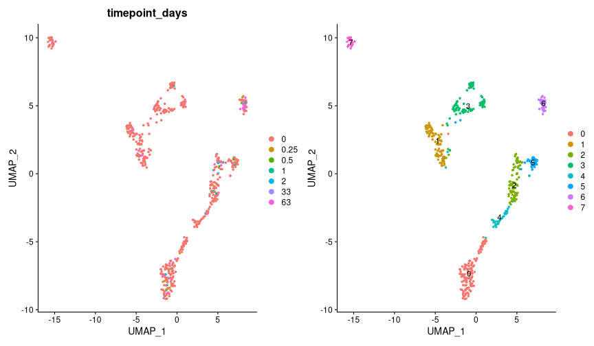

```r
# Load libraries and custom functions
suppressPackageStartupMessages({
  library(tidyverse)
  library(magrittr)
  library(Seurat)
  library(harmony)
  library(scPred)
})

R.utils::sourceDirectory(here::here("R", "functions"), modifiedOnly=FALSE)
```


```r
# Load full secondary data with 1000 to 2000 detected genes
(drg_ra_1000 <- 
   readRDS(here::here("data", "proc", "all_cells_after_first_clustering_1000genes_only_predicted.rds")))
```

```
## An object of class Seurat 
## 32285 features across 38573 samples within 1 assay 
## Active assay: RNA (32285 features, 2000 variable features)
##  3 dimensional reductions calculated: pca, harmony, umap
```


```r
# Plot UMAP of final merged dataset
DimPlot(drg_ra_1000, label = TRUE, repel = TRUE) 
```


#### Neuron primary clustering

```r
# Subset neurons from full cell palette
(neurons <-
   drg_ra_1000 %>%
   set_idents("predicted.id") %>%
   subset(idents = "Neuron"))
```

```
## An object of class Seurat 
## 32285 features across 10662 samples within 1 assay 
## Active assay: RNA (32285 features, 2000 variable features)
##  3 dimensional reductions calculated: pca, harmony, umap
```


```r
# Run Harmony
neurons %<>% run_harmony()
```

```
## Centering and scaling data matrix
```

```
## Harmony 1/50
```

```
## Harmony 2/50
```

```
## Harmony converged after 2 iterations
```

```
## Warning: Invalid name supplied, making object name syntactically valid. New
## object name is Seurat..ProjectDim.RNA.harmony; see ?make.names for more details
## on syntax validity
```


```r
# Cluster
neurons %<>% cluster_seurat(reduction = "harmony", dims = 1:20, resolution = 0.5)
```

```
## 02:31:32 UMAP embedding parameters a = 0.9922 b = 1.112
```

```
## 02:31:32 Read 10662 rows and found 20 numeric columns
```

```
## 02:31:32 Using Annoy for neighbor search, n_neighbors = 30
```

```
## 02:31:32 Building Annoy index with metric = cosine, n_trees = 50
```

```
## 0%   10   20   30   40   50   60   70   80   90   100%
```

```
## [----|----|----|----|----|----|----|----|----|----|
```

```
## **************************************************|
## 02:31:33 Writing NN index file to temp file /scratch/27543998/RtmpnFzTEQ/file322668831984
## 02:31:33 Searching Annoy index using 1 thread, search_k = 3000
## 02:31:37 Annoy recall = 100%
## 02:31:38 Commencing smooth kNN distance calibration using 1 thread
## 02:31:41 Initializing from normalized Laplacian + noise
## 02:31:41 Commencing optimization for 200 epochs, with 466688 positive edges
## 02:31:53 Optimization finished
## Computing nearest neighbor graph
## Computing SNN
```

```
## Modularity Optimizer version 1.3.0 by Ludo Waltman and Nees Jan van Eck
## 
## Number of nodes: 10662
## Number of edges: 332018
## 
## Running Louvain algorithm...
## Maximum modularity in 10 random starts: 0.9036
## Number of communities: 11
## Elapsed time: 1 seconds
```


```r
# Plot UMAPS 
(DimPlot(neurons, group.by = "orig.ident", shuffle = TRUE) + NoLegend()) +
  (DimPlot(neurons, label = TRUE, shuffle = TRUE))
```


```r
# Check neuron markers and number of features in UMAP
FeaturePlot(neurons, c("Rbfox3", "Slc17a6", "nFeature_RNA"), pt.size = 0.1, label = TRUE)
```


```r
# Check violins for neuron marker with a cutoff
VlnPlot(neurons, "Rbfox3", pt.size = 0) + 
  geom_hline(yintercept = 0.5, color = "red", size = 1)
```


```r
# Subset only QC neurons based on Rbfox3 expression
(neurons %<>% subset(Rbfox3 > 0.5))
```

```
## An object of class Seurat 
## 32285 features across 3156 samples within 1 assay 
## Active assay: RNA (32285 features, 2000 variable features)
##  3 dimensional reductions calculated: pca, harmony, umap
```


```r
# Run Harmony again
neurons %<>% run_harmony()
```

```
## Centering and scaling data matrix
```

```
## Harmony 1/50
```

```
## Harmony 2/50
```

```
## Harmony 3/50
```

```
## Harmony 4/50
```

```
## Harmony 5/50
```

```
## Harmony 6/50
```

```
## Harmony 7/50
```

```
## Harmony 8/50
```

```
## Harmony 9/50
```

```
## Harmony 10/50
```

```
## Harmony 11/50
```

```
## Harmony converged after 11 iterations
```

```
## Warning: Invalid name supplied, making object name syntactically valid. New
## object name is Seurat..ProjectDim.RNA.harmony; see ?make.names for more details
## on syntax validity
```


```r
# Cluster neurons again
neurons %<>% cluster_seurat(reduction = "harmony", dims = 1:20, resolution = 0.5)
```

```
## 02:32:46 UMAP embedding parameters a = 0.9922 b = 1.112
```

```
## 02:32:46 Read 3156 rows and found 20 numeric columns
```

```
## 02:32:46 Using Annoy for neighbor search, n_neighbors = 30
```

```
## 02:32:46 Building Annoy index with metric = cosine, n_trees = 50
```

```
## 0%   10   20   30   40   50   60   70   80   90   100%
```

```
## [----|----|----|----|----|----|----|----|----|----|
```

```
## **************************************************|
## 02:32:46 Writing NN index file to temp file /scratch/27543998/RtmpnFzTEQ/file32263c1f6758
## 02:32:46 Searching Annoy index using 1 thread, search_k = 3000
## 02:32:47 Annoy recall = 100%
## 02:32:48 Commencing smooth kNN distance calibration using 1 thread
## 02:32:50 Initializing from normalized Laplacian + noise
## 02:32:50 Commencing optimization for 500 epochs, with 134956 positive edges
## 02:32:59 Optimization finished
## Computing nearest neighbor graph
## Computing SNN
```

```
## Modularity Optimizer version 1.3.0 by Ludo Waltman and Nees Jan van Eck
## 
## Number of nodes: 3156
## Number of edges: 122327
## 
## Running Louvain algorithm...
## Maximum modularity in 10 random starts: 0.9098
## Number of communities: 10
## Elapsed time: 0 seconds
```


```r
# Plot UMAPS
(DimPlot(neurons, group.by = "orig.ident", shuffle = TRUE) + NoLegend()) +
  (DimPlot(neurons, label = TRUE, shuffle = TRUE))
```


```r
# Check some violins
VlnPlot(neurons, c("Rbfox3", "Apoe", "Fabp7", "nFeature_RNA"), pt.size = 0)
```


```r
# Filter out cells with high Apoe expression
(neurons %<>% subset(Apoe < 2))
```

```
## An object of class Seurat 
## 32285 features across 504 samples within 1 assay 
## Active assay: RNA (32285 features, 2000 variable features)
##  3 dimensional reductions calculated: pca, harmony, umap
```


```r
# Run Harmony once more
neurons %<>% run_harmony()
```

```
## Centering and scaling data matrix
```

```
## Harmony 1/50
```

```
## Harmony 2/50
```

```
## Harmony 3/50
```

```
## Harmony 4/50
```

```
## Harmony 5/50
```

```
## Harmony 6/50
```

```
## Harmony 7/50
```

```
## Harmony 8/50
```

```
## Harmony 9/50
```

```
## Harmony 10/50
```

```
## Harmony 11/50
```

```
## Harmony converged after 11 iterations
```

```
## Warning: Invalid name supplied, making object name syntactically valid. New
## object name is Seurat..ProjectDim.RNA.harmony; see ?make.names for more details
## on syntax validity
```


```r
# Cluster neurons 
neurons %<>% cluster_seurat(reduction = "harmony", dims = 1:20, resolution = 0.5)
```

```
## 02:33:08 UMAP embedding parameters a = 0.9922 b = 1.112
```

```
## 02:33:08 Read 504 rows and found 20 numeric columns
```

```
## 02:33:08 Using Annoy for neighbor search, n_neighbors = 30
```

```
## 02:33:08 Building Annoy index with metric = cosine, n_trees = 50
```

```
## 0%   10   20   30   40   50   60   70   80   90   100%
```

```
## [----|----|----|----|----|----|----|----|----|----|
```

```
## **************************************************|
## 02:33:08 Writing NN index file to temp file /scratch/27543998/RtmpnFzTEQ/file3226615b2106
## 02:33:08 Searching Annoy index using 1 thread, search_k = 3000
## 02:33:08 Annoy recall = 100%
## 02:33:09 Commencing smooth kNN distance calibration using 1 thread
## 02:33:11 Initializing from normalized Laplacian + noise
## 02:33:11 Commencing optimization for 500 epochs, with 18284 positive edges
## 02:33:13 Optimization finished
## Computing nearest neighbor graph
## Computing SNN
```

```
## Modularity Optimizer version 1.3.0 by Ludo Waltman and Nees Jan van Eck
## 
## Number of nodes: 504
## Number of edges: 14081
## 
## Running Louvain algorithm...
## Maximum modularity in 10 random starts: 0.8747
## Number of communities: 8
## Elapsed time: 0 seconds
```


```r
# Plot UMAPS once again
(DimPlot(neurons, group.by = "timepoint_days", shuffle = TRUE)) +
  (DimPlot(neurons, label = TRUE, shuffle = TRUE))
```




```r
# Some violins again
VlnPlot(neurons, c("Apoe", "Fabp7", "Slc17a6", "Rbfox3", "Snap25", "nFeature_RNA"), pt.size = 0)
```


#### Assign celltypes to neurons using Zeisel et. al data (but Usoskin et al. identities)

```r
# Load Zeisel data
zeisel <- readRDS(here::here("data", "ref", "zeisel_drg.rds"))
```


```r
# Create classifier
zeisel %<>%
  NormalizeData() %>%
  FindVariableFeatures() %>%
  ScaleData() %>%
  RunPCA(npcs = 100, verbose = FALSE)
```

```
## Centering and scaling data matrix
```

```r
zeisel %<>%
  getFeatureSpace("usoskin_id") %>%
  trainModel(model = "mda")
```

```
## ●  Extracting feature space for each cell type...
## DONE!
## ●  Training models for each cell type...
```

```
## Loading required package: lattice
```

```
## 
## Attaching package: 'caret'
```

```
## The following object is masked from 'package:purrr':
## 
##     lift
```

```
## DONE!
```


```r
# Check model performance
zeisel %>% get_scpred()
```

```
## 'scPred' object
## ✔  Prediction variable = usoskin_id 
## ✔  Discriminant features per cell type
## ✔  Training model(s)
## Summary
## 
## |Cell type |   n| Features|Method |   ROC|  Sens|  Spec|
## |:---------|---:|--------:|:------|-----:|-----:|-----:|
## |NF1       |  38|      100|mda    | 0.998| 0.893| 0.997|
## |NF2_3     |  31|      100|mda    | 0.998| 0.876| 0.995|
## |NF4       |  57|      100|mda    | 0.999| 0.945| 0.996|
## |NP1       | 342|      100|mda    | 1.000| 0.997| 1.000|
## |NP2       | 133|      100|mda    | 1.000| 1.000| 0.998|
## |NP3       | 132|      100|mda    | 1.000| 1.000| 1.000|
## |PEP1      | 341|      100|mda    | 0.999| 0.965| 0.992|
## |PEP2      |  78|      100|mda    | 0.999| 0.937| 0.993|
## |Th        | 282|      100|mda    | 1.000| 1.000| 1.000|
## |TRPM8     | 146|      100|mda    | 0.998| 0.959| 0.999|
```


```r
# Predict labels for current dataset neurons
neurons %<>% scPredict(zeisel)
```

```
## ●  Matching reference with new dataset...
## 	 ─ 2000 features present in reference loadings
## 	 ─ 1895 features shared between reference and new dataset
## 	 ─ 94.75% of features in the reference are present in new dataset
## ●  Aligning new data to reference...
```

```
## Harmony 1/20
```

```
## Harmony 2/20
```

```
## Harmony 3/20
```

```
## Harmony 4/20
```

```
## Harmony 5/20
```

```
## Harmony 6/20
```

```
## Harmony 7/20
```

```
## Harmony 8/20
```

```
## Harmony 9/20
```

```
## Harmony 10/20
```

```
## Harmony 11/20
```

```
## Harmony 12/20
```

```
## Harmony 13/20
```

```
## Harmony 14/20
```

```
## Harmony 15/20
```

```
## Harmony 16/20
```

```
## Harmony converged after 16 iterations
```

```
## ●  Classifying cells...
## DONE!
```


```r
# Plot xax score distribution from scPred
neurons@meta.data %>%
  ggplot(aes(scpred_max)) +
  geom_histogram(
    bins = 50,
    color = "white",
    fill = "darkblue",
    alpha = 0.7) +
  geom_vline(xintercept = 0.55, color = "red", size = 1) +
  cowplot::theme_cowplot() +
  scale_y_continuous(expand = expansion(mult = c(0, .1))) +
  labs(
    title = "",
    x = "Max prediction score",
    y = "Number of cells"
  )
```


```r
# Plot prediction score heatmap
neurons@meta.data %>%
  select(
    starts_with("scpred_"),
    -c(scpred_max, scpred_prediction,scpred_no_rejection)
  ) %>%
  rename_with(~ str_remove(.x, "scpred_")) %>%
  t() %>%
  pheatmap::pheatmap(
    cluster_rows = FALSE,
    cluster_cols = TRUE,
    treeheight_col = 0,
    show_colnames = FALSE,
    color = viridisLite::viridis(10),
    fontsize = 12,
    title = ""
  )
```


```r
# Plot UMAP with assigned labels
(DimPlot(
  neurons,
    group.by = "scpred_prediction",
    label = TRUE,
    shuffle = TRUE,
    repel = TRUE)) +

  (DimPlot(
    neurons,
    group.by = "scpred_no_rejection",
    label = TRUE,
    shuffle = TRUE,
    repel = TRUE))
```


```r
# Filter out the few unassigned cells
(neurons %<>% 
  set_idents("scpred_prediction") %>% 
  subset(
    idents = neurons@meta.data$scpred_prediction %>% unique() %>% keep(~ .x != "unassigned")
  ))
```

```
## An object of class Seurat 
## 32285 features across 490 samples within 1 assay 
## Active assay: RNA (32285 features, 2000 variable features)
##  5 dimensional reductions calculated: pca, harmony, umap, scpred, scpred_projection
```

```r
neurons@meta.data %<>% 
  mutate(usoskin_id = scpred_prediction)
```


```r
# Find MRGPRB4 neurons
(VlnPlot(neurons, "Mrgprb4", group.by = "usoskin_id") + NoLegend()) +
  (VlnPlot(neurons, "Mrgprb4", group.by = "usoskin_id") + NoLegend())
```


```r
# Plot UMAP with assigned labels
(DimPlot(
  neurons,
    group.by = "usoskin_id",
    label = TRUE,
    shuffle = TRUE,
    repel = TRUE)) +
  NoLegend()
```


```r
# Get top markers for celltypes (for some qc plotting)
neurons %<>% set_idents("usoskin_id")

order <- 
  c(
  "NP1",
  "NP2",
  "NP3",
  "PEP1",
  "Th",
  "TRPM8",
  "PEP2",
  "NF1",
  "NF2_3",
  "NF4"
)
Idents(neurons) <- factor(x = Idents(neurons), levels = order)

markers_usoskin <-
  neurons %>%
  FindAllMarkers(only.pos = TRUE, assay = "RNA") 
```

```
## Calculating cluster NP1
```

```
## Calculating cluster NP2
```

```
## Calculating cluster NP3
```

```
## Calculating cluster PEP1
```

```
## Calculating cluster Th
```

```
## Calculating cluster TRPM8
```

```
## Calculating cluster PEP2
```

```
## Calculating cluster NF1
```

```
## Calculating cluster NF2_3
```

```
## Calculating cluster NF4
```


```r
# DotPlot
top_usoskin_genes <-
  markers_usoskin %>% 
  group_by(cluster) %>%
  slice_min(p_val_adj, n = 3, with_ties = FALSE)

DotPlot(neurons, features = unique(top_usoskin_genes$gene)) +
  theme(axis.text.x = element_text(angle = 90, vjust = 0.5, hjust=1))
```


```r
# Plot celltype proportions in each timepoint
neurons@meta.data %>% 
  count(timepoint_days, usoskin_id) %>% 
  group_by(timepoint_days) %>% 
  mutate(pct = prop.table(n) * 100) %>%
  ggplot(aes(factor(timepoint_days), pct, fill = usoskin_id)) +
  geom_bar(stat = "identity") +
  geom_text(aes(label=paste0(sprintf("%1.1f", pct),"%")),
            position=position_stack(vjust=0.5)) +
  labs(x = "Timepoint in days", y = "Proportion of cells", fill = "Neuron type") +
  cowplot::theme_cowplot() +
  scale_y_continuous(expand = expansion(mult = c(0, .1)))
```


```r
# Count cells by timepoint
neurons@meta.data %>% 
  count(timepoint_days) 
```

```
##   timepoint_days   n
## 1           0.00 414
## 2           0.25   9
## 3           0.50   7
## 4           1.00  14
## 5           2.00   4
## 6          33.00   1
## 7          63.00  41
```


```r
# Save neuron object
saveRDS(neurons, file = here::here("data", "proc", "secondary_neurons.rds"))
```


```r
# Clear libraries
clear_libraries()
```
